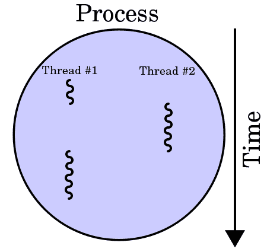

# 第三章：在 Python 中处理线程

在第一章中，*并发和并行编程的高级介绍*，您看到了线程在并发和并行编程中的使用示例。在本章中，您将了解线程的正式定义，以及 Python 中的`threading`模块。我们将涵盖在 Python 程序中处理线程的多种方法，包括创建新线程、同步线程以及通过具体示例处理多线程优先队列等活动。我们还将讨论线程同步中锁的概念，并实现基于锁的多线程应用程序，以更好地理解线程同步的好处。

本章将涵盖以下主题：

+   计算机科学中并发编程上下文中的线程概念

+   Python 中`threading`模块的基本 API

+   如何通过`threading`模块创建新线程

+   锁的概念以及如何使用不同的锁定机制来同步线程

+   并发编程上下文中队列的概念，以及如何使用`Queue`模块在 Python 中处理队列对象

# 技术要求

以下是本章的先决条件列表：

+   确保您的计算机上已安装 Python 3

+   在[`github.com/PacktPublishing/Mastering-Concurrency-in-Python`](https://github.com/PacktPublishing/Mastering-Concurrency-in-Python)下载 GitHub 存储库

+   在本章中，我们将使用名为`Chapter03`的子文件夹进行工作

+   查看以下视频以查看代码实际操作：[`bit.ly/2SeD2oz`](http://bit.ly/2SeD2oz)

# 线程的概念

在计算机科学领域，**执行线程**是调度程序（通常作为操作系统的一部分）可以处理和管理的编程命令（代码）的最小单位。根据操作系统的不同，线程和进程的实现（我们将在以后的章节中介绍）有所不同，但线程通常是进程的一个元素（组件）。

# 线程与进程的区别

在同一进程中可以实现多个线程，通常并发执行并访问/共享相同的资源，如内存；而单独的进程不会这样做。同一进程中的线程共享后者的指令（其代码）和上下文（其变量在任何给定时刻引用的值）。

这两个概念之间的关键区别在于，线程通常是进程的组成部分。因此，一个进程可以包括多个线程，这些线程可以同时执行。线程通常也允许共享资源，如内存和数据，而进程很少这样做。简而言之，线程是计算的独立组件，类似于进程，但进程中的线程可以共享该进程的地址空间，因此也可以共享该进程的数据：



在一个处理器上运行的两个执行线程的进程

据报道，线程最早用于 OS/360 多道程序设计中的可变数量任务，这是 IBM 于 1967 年开发的一种已停用的批处理系统。当时，开发人员将线程称为任务，而后来线程这个术语变得流行，并且被归因于数学家和计算机科学家维克托·A·维索茨基，他是 Digital 的剑桥研究实验室的创始主任。

# 多线程

在计算机科学中，单线程类似于传统的顺序处理，一次执行一个命令。另一方面，**多线程**实现了多个线程同时存在和执行单个进程。通过允许多个线程访问共享资源/上下文并独立执行，这种编程技术可以帮助应用程序在执行独立任务时提高速度。

多线程主要可以通过两种方式实现。在单处理器系统中，多线程通常是通过时间片分配实现的，这是一种允许 CPU 在不同线程上切换的技术。在时间片分配中，CPU 执行得非常快速和频繁，以至于用户通常会感知到软件在并行运行（例如，在单处理器计算机上同时打开两个不同的软件）。


时间片分配技术的一个例子称为轮转调度

与单处理器系统相反，具有多个处理器或核心的系统可以通过在单独的进程或核心中执行每个线程来轻松实现多线程，同时进行。此外，时间片分配也是一种选择，因为这些多处理器或多核系统可以只有一个处理器/核心在任务之间切换，尽管这通常不是一个好的做法。

与传统的顺序应用程序相比，多线程应用程序具有许多优点；以下是其中一些：

+   **更快的执行时间**：通过多线程并发的主要优势之一是实现的加速。同一程序中的单独线程可以并发或并行执行，如果它们彼此足够独立。

+   **响应性**：单线程程序一次只能处理一个输入；因此，如果主执行线程在长时间运行的任务上阻塞（即需要大量计算和处理的输入），整个程序将无法继续处理其他输入，因此看起来会被冻结。通过使用单独的线程来执行计算并保持运行以同时接收不同的用户输入，多线程程序可以提供更好的响应性。

+   **资源消耗效率**：正如我们之前提到的，同一进程中的多个线程可以共享和访问相同的资源。因此，多线程程序可以使用比使用单线程或多进程程序时少得多的资源，同时为数据处理和服务许多客户请求。这也导致了线程之间更快的通信。

话虽如此，多线程程序也有其缺点，如下所示：

+   **崩溃**：即使一个进程可以包含多个线程，一个线程中的单个非法操作也可能对该进程中的所有其他线程的处理产生负面影响，并导致整个程序崩溃。

+   **同步**：尽管共享相同的资源可以优于传统的顺序编程或多处理程序，但对共享资源也需要仔细考虑。通常，线程必须以一种深思熟虑和系统化的方式协调，以便正确计算和操作共享数据。由于不慎的线程协调可能导致的难以理解的问题包括死锁、活锁和竞争条件，这些问题将在未来的章节中讨论。

# Python 中的一个例子

为了说明在同一进程中运行多个线程的概念，让我们来看一个在 Python 中的快速示例。如果您已经从 GitHub 页面下载了本书的代码，请转到`Chapter03`文件夹。让我们看一下`Chapter03/my_thread.py`文件，如下所示：

```py
# Chapter03/my_thread.py

import threading
import time

class MyThread(threading.Thread):
    def __init__(self, name, delay):
        threading.Thread.__init__(self)
        self.name = name
        self.delay = delay

    def run(self):
        print('Starting thread %s.' % self.name)
        thread_count_down(self.name, self.delay)
        print('Finished thread %s.' % self.name)

def thread_count_down(name, delay):
    counter = 5

    while counter:
        time.sleep(delay)
        print('Thread %s counting down: %i...' % (name, counter))
        counter -= 1
```

在这个文件中，我们使用 Python 的`threading`模块作为`MyThread`类的基础。这个类的每个对象都有一个`name`和`delay`参数。`run()`函数在初始化和启动新线程时被调用，打印出一个开始消息，然后调用`thread_count_down()`函数。这个函数从数字`5`倒数到数字`0`，在每次迭代之间休眠指定秒数，由延迟参数指定。

这个例子的重点是展示在同一个程序（或进程）中运行多个线程的并发性质，通过同时启动`MyThread`类的多个对象。我们知道，一旦启动每个线程，该线程的基于时间的倒计时也将开始。在传统的顺序程序中，单独的倒计时将按顺序分别执行（即，新的倒计时不会在当前倒计时完成之前开始）。正如您将看到的那样，单独的线程倒计时是同时执行的。

让我们看一下`Chapter3/example1.py`文件，如下所示：

```py
# Chapter03/example1.py

from my_thread import MyThread

thread1 = MyThread('A', 0.5)
thread2 = MyThread('B', 0.5)

thread1.start()
thread2.start()

thread1.join()
thread2.join()

print('Finished.')
```

在这里，我们同时初始化和启动了两个线程，每个线程的`delay`参数都是`0.5`秒。使用您的 Python 解释器运行脚本。您应该会得到以下输出：

```py
> python example1.py
Starting thread A.
Starting thread B.
Thread A counting down: 5...
Thread B counting down: 5...
Thread B counting down: 4...
Thread A counting down: 4...
Thread B counting down: 3...
Thread A counting down: 3...
Thread B counting down: 2...
Thread A counting down: 2...
Thread B counting down: 1...
Thread A counting down: 1...
Finished thread B.
Finished thread A.
Finished.
```

正如我们所预期的那样，输出告诉我们，线程的两个倒计时是同时执行的；程序不是先完成第一个线程的倒计时，然后再开始第二个线程的倒计时，而是几乎同时运行了两个倒计时。在不包括一些额外开销和其他声明的情况下，这种线程技术使得前面的程序速度几乎提高了一倍。

在前面的输出中还有一件事情需要注意。在数字`5`的第一个倒计时之后，我们可以看到线程 B 的倒计时实际上在执行中超过了线程 A，尽管我们知道线程 A 在线程 B 之前初始化和启动。这种变化实际上允许线程 B 在线程 A 之前完成。这种现象是通过多线程并发产生的直接结果；由于两个线程几乎同时初始化和启动，很可能一个线程在执行中超过另一个线程。

如果您多次执行此脚本，很可能会得到不同的输出，无论是执行顺序还是倒计时的完成。以下是我多次执行脚本后获得的两个输出。第一个输出显示了一致且不变的执行顺序和完成顺序，两个倒计时一起执行。第二个输出显示了一种情况，线程 A 的执行速度明显快于线程 B；甚至在线程 B 计数到数字`1`之前就已经完成了。这种输出的变化进一步说明了这些线程是由 Python 平等对待和执行的事实。

以下代码显示了程序的一个可能输出：

```py
> python example1.py
Starting thread A.
Starting thread B.
Thread A counting down: 5...
Thread B counting down: 5...
Thread A counting down: 4...
Thread B counting down: 4...
Thread A counting down: 3...
Thread B counting down: 3...
Thread A counting down: 2...
Thread B counting down: 2...
Thread A counting down: 1...
Thread B counting down: 1...
Finished thread A.
Finished thread B.
Finished.
```

以下是另一个可能的输出：

```py
> python example1.py
Starting thread A.
Starting thread B.
Thread A counting down: 5...
Thread B counting down: 5...
Thread A counting down: 4...
Thread B counting down: 4...
Thread A counting down: 3...
Thread B counting down: 3...
Thread A counting down: 2...
Thread B counting down: 2...
Thread A counting down: 1...
Finished thread A.
Thread B counting down: 1...
Finished thread B.
Finished.
```

# 线程模块概述

在 Python 中实现多线程程序时有很多选择。在 Python 中处理线程的最常见方式之一是通过`threading`模块。在深入探讨模块的用法和语法之前，让我们先探索一下`thread`模型，这在 Python 中曾经是主要的基于线程的开发模块。

# Python 2 中的线程模块

在`threading`模块变得流行之前，主要基于线程的开发模块是`thread`。如果您使用的是较旧版本的 Python 2，可以直接使用该模块。然而，根据模块文档页面，`thread`模块实际上在 Python 3 中被重命名为`_thread`。

对于那些一直在使用`thread`模块构建多线程应用程序并希望将其代码从 Python 2 迁移到 Python 3 的读者来说，2to3 工具可能是一个解决方案。2to3 工具处理了大部分 Python 不同版本之间可检测到的不兼容性，同时解析源代码并遍历源树将 Python 2.x 代码转换为 Python 3.x 代码。另一个实现转换的技巧是在 Python 程序中将导入代码从`import thread`改为`import _thread as thread`。

`thread`模块的主要特点是快速有效地创建新线程以执行函数：`thread.start_new_thread()`函数。除此之外，该模块还支持一些低级的处理多线程原语和共享全局数据空间的方式。此外，还提供了简单的锁对象（例如互斥锁和信号量）用于同步目的。

# Python 3 中的线程模块

很长一段时间以来，旧的`thread`模块一直被 Python 开发人员认为是过时的，主要是因为它的功能相对较低级，使用范围有限。另一方面，`threading`模块是建立在`thread`模块之上的，通过强大的高级 API 提供了更容易处理线程的方式。Python 用户实际上被鼓励在他们的程序中使用新的`threading`模块而不是`thread`模块。

此外，`thread`模块将每个线程视为一个函数；当调用`thread.start_new_thread()`时，它实际上接受一个单独的函数作为其主要参数，以产生一个新的线程。然而，`threading`模块被设计为对面向对象软件开发范式的用户友好，将创建的每个线程视为一个对象。

除了`thread`模块提供的所有处理线程功能之外，`threading`模块还支持一些额外的方法，如下所示：

+   `threading.activeCount()`: 此函数返回程序中当前活动线程对象的数量

+   `threading.currentThread()`: 此函数从调用者返回当前线程控制中的线程对象数

+   `threading.enumerate()`: 此函数返回程序中当前活动线程对象的列表

遵循面向对象的软件开发范式，`threading`模块还提供了一个支持线程面向对象实现的`Thread`类。该类支持以下方法：

+   `run()`: 当初始化并启动新线程时执行此方法

+   `start()`: 这个方法通过调用`run()`方法来启动初始化的调用线程对象

+   `join()`: 这个方法在继续执行程序的其余部分之前等待调用线程对象终止

+   `isAlive()`: 这个方法返回一个布尔值，指示调用线程对象当前是否正在执行

+   `getName()`: 这个方法返回调用线程对象的名称

+   `setName()`: 这个方法设置调用线程对象的名称

# 在 Python 中创建一个新线程

在本节中，我们已经提供了`threading`模块及其与旧的`thread`模块的区别的概述，现在我们将通过在 Python 中使用这些工具来创建新线程的一些示例来探讨。正如之前提到的，`threading`模块很可能是在 Python 中处理线程的最常见方式。特定情况下需要使用`thread`模块，也许还需要其他工具，因此我们有必要能够区分这些情况。

# 使用线程模块启动线程

在`thread`模块中，新线程被创建以并发执行函数。正如我们所提到的，通过使用`thread.start_new_thread()`函数来实现这一点：

```py
thread.start_new_thread(function, args[, kwargs])
```

当调用此函数时，将生成一个新线程来执行参数指定的函数，并且当函数完成执行时，线程的标识符将被返回。`function`参数是要执行的函数的名称，`args`参数列表（必须是列表或元组）包括要传递给指定函数的参数。另一方面，可选的`kwargs`参数包括一个额外的关键字参数的字典。当`thread.start_new_thread()`函数返回时，线程也会悄悄地终止。

让我们看一个在 Python 程序中使用`thread`模块的例子。如果您已经从 GitHub 页面下载了本书的代码，请转到`Chapter03`文件夹和`Chapter03/example2.py`文件。在这个例子中，我们将看一下`is_prime()`函数，这个函数我们在之前的章节中也使用过：

```py
# Chapter03/example2.py

from math import sqrt

def is_prime(x):
    if x < 2:
        print('%i is not a prime number.' % x)

    elif x == 2:
        print('%i is a prime number.' % x)

    elif x % 2 == 0:
        print('%i is not a prime number.' % x)

    else:
        limit = int(sqrt(x)) + 1
        for i in range(3, limit, 2):
            if x % i == 0:
                print('%i is not a prime number.' % x)

        print('%i is a prime number.' % x)
```

您可能已经注意到，`is_prime(x)`函数返回其计算结果的方式有很大的不同；它不是返回`true`或`false`来指示`x`参数是否是一个质数，而是直接打印出该结果。正如您之前看到的，`thread.start_new_thread()`函数通过生成一个新线程来执行参数函数，但它实际上返回线程的标识符。在`is_prime()`函数内部打印结果是通过`thread`模块访问该函数的结果的一种解决方法。

在我们程序的主要部分，我们将循环遍历潜在的质数候选列表，并对该列表中的每个数字调用`thread.start_new_thread()`函数和`is_prime()`函数，如下所示：

```py
# Chapter03/example2.py

import _thread as thread

my_input = [2, 193, 323, 1327, 433785907]

for x in my_input:
    thread.start_new_thread(is_prime, (x, ))
```

您会注意到，在`Chapter03/example2.py`文件中，有一行代码在最后接受用户的输入：

```py
a = input('Type something to quit: \n')
```

现在，让我们注释掉最后一行。然后，当我们执行整个 Python 程序时，可以观察到程序在没有打印任何输出的情况下终止；换句话说，程序在线程执行完毕之前终止。这是因为，当通过`thread.start_new_thread()`函数生成一个新线程来处理我们输入列表中的一个数字时，程序会继续循环遍历下一个输入数字，而新创建的线程在执行。

因此，当 Python 解释器到达程序末尾时，如果有任何线程尚未执行完毕（在我们的情况下，是所有线程），那么该线程将被忽略和终止，并且不会打印任何输出。然而，偶尔会有一个输出是`2 是一个质数。`，它将在程序终止之前被打印出来，因为处理数字`2`的线程能够在那一点之前执行完毕。

代码的最后一行是`thread`模块的另一个解决方法，这次是为了解决前面的问题。这行代码阻止程序退出，直到用户在键盘上按下任意键，此时程序将退出。策略是等待程序执行完所有线程（也就是处理我们输入列表中的所有数字）。取消最后一行的注释并执行文件，您的输出应该类似于以下内容：

```py
> python example2.py
Type something to quit: 
2 is a prime number.
193 is a prime number.
1327 is a prime number.
323 is not a prime number.
433785907 is a prime number.
```

正如你所看到的，“键入一些内容以退出：”这一行对应于我们程序中的最后一行代码，在`is_prime()`函数的输出之前被打印出来；这与该行在其他线程完成执行之前被执行的事实一致，大多数情况下是这样。我之所以说大多数情况是因为，当处理第一个输入（数字`2`）的线程在 Python 解释器到达最后一行之前执行完毕时，程序的输出将类似于以下内容：

```py
> python example2.py
2 is a prime number.
Type something to quit: 
193 is a prime number.
323 is not a prime number.
1327 is a prime number.
433785907 is a prime number.
```

# 使用线程模块启动线程

您现在知道如何使用`thread`模块启动线程，以及它在线程使用方面的有限和低级的使用，以及在处理它时需要相当不直观的解决方法。在本小节中，我们将探讨首选的`threading`模块及其相对于`thread`模块在 Python 中实现多线程程序方面的优势。

使用`threading`模块创建和自定义一个新的线程，需要遵循特定的步骤：

1.  在程序中定义`threading.Thread`类的子类

1.  在子类中覆盖默认的`__init__(self [,args])`方法，以添加类的自定义参数

1.  在子类中覆盖默认的`run(self [,args])`方法，以自定义线程类在初始化和启动新线程时的行为

实际上，在本章的第一个示例中，您已经看到了这个例子。作为一个复习，以下是我们必须使用的内容来自定义`threading.Thread`子类，以执行一个五步倒计时，每一步之间都有一个可定制的延迟：

```py
# Chapter03/my_thread.py

import threading
import time

class MyThread(threading.Thread):
    def __init__(self, name, delay):
        threading.Thread.__init__(self)
        self.name = name
        self.delay = delay

    def run(self):
        print('Starting thread %s.' % self.name)
        thread_count_down(self.name, self.delay)
        print('Finished thread %s.' % self.name)

def thread_count_down(name, delay):
    counter = 5

    while counter:
        time.sleep(delay)
        print('Thread %s counting down: %i...' % (name, counter))
        counter -= 1
```

在我们的下一个示例中，我们将看看如何确定一个特定的数字是否是素数。这一次，我们将通过`threading`模块实现一个多线程的 Python 程序。转到`Chapter03`文件夹和`example3.py`文件。让我们首先关注`MyThread`类，如下所示：

```py
# Chapter03/example3.py

import threading

class MyThread(threading.Thread):
    def __init__(self, x):
        threading.Thread.__init__(self)
        self.x = x

    def run(self):
        print('Starting processing %i...' % x)
        is_prime(self.x)
```

`MyThread`类的每个实例都将有一个名为`x`的参数，指定要处理的素数候选数。正如您所看到的，当类的一个实例被初始化并启动（也就是在`run(self)`函数中），`is_prime()`函数，这是我们在前面的示例中使用的相同的素数检查函数，对`x`参数进行检查，然后`run()`函数也打印出一条消息来指定处理的开始。

在我们的主程序中，我们仍然有相同的素数检查输入列表。我们将遍历该列表中的每个数字，生成并运行一个新的`MyThread`类的实例，并将该`MyThread`实例附加到一个单独的列表中。这个创建的线程列表是必要的，因为在那之后，我们将不得不对所有这些线程调用`join()`方法，以确保所有线程都已成功执行：

```py
my_input = [2, 193, 323, 1327, 433785907]

threads = []

for x in my_input:
    temp_thread = MyThread(x)
    temp_thread.start()

    threads.append(temp_thread)

for thread in threads:
    thread.join()

print('Finished.')
```

请注意，与我们使用`thread`模块时不同的是，这一次，我们不必发明一种解决方法来确保所有线程都已成功执行。同样，这是由`threading`模块提供的`join()`方法完成的。这只是使用`threading`模块更强大、更高级 API 的许多优势之一，而不是使用`thread`模块。

# 同步线程

正如您在前面的示例中看到的，`threading`模块在功能和高级 API 调用方面比其前身`thread`模块有许多优势。尽管一些人建议有经验的 Python 开发人员应该知道如何使用这两个模块来实现多线程应用程序，但您在 Python 中处理线程时很可能会使用`threading`模块。在本节中，我们将看看如何在线程同步中使用`threading`模块。

# 线程同步的概念

在我们跳入实际的 Python 示例之前，让我们探讨计算机科学中的同步概念。正如您在前几章中看到的，有时，让程序的所有部分并行执行是不可取的。事实上，在大多数当代并发程序中，代码有顺序部分和并发部分；此外，即使在并发部分内部，也需要一些形式的协调来处理不同的线程/进程。

**线程/进程同步**是计算机科学中的一个概念，它指定了各种机制，以确保不超过一个并发线程/进程可以同时处理和执行特定程序部分；这部分被称为**临界区**，当我们考虑并发编程中的常见问题时，我们将在第十二章 *饥饿*和第十三章 *竞争条件*中进一步讨论它。

在给定的程序中，当一个线程正在访问/执行程序的临界部分时，其他线程必须等待，直到该线程执行完毕。线程同步的典型目标是避免多个线程访问其共享资源时可能出现的数据不一致；只允许一个线程一次执行程序的临界部分，可以确保多线程应用中不会发生数据冲突。

# 线程锁类

应用线程同步最常见的方法之一是通过实现锁定机制。在我们的`threading`模块中，`threading.Lock`类提供了一种简单直观的方法来创建和使用锁。它的主要用法包括以下方法：

+   `threading.Lock()`: 此方法初始化并返回一个新的锁对象。

+   `acquire(blocking)`: 调用此方法时，所有线程将同步运行（即，一次只有一个线程可以执行临界部分）：

+   可选参数`blocking`允许我们指定当前线程是否应等待获取锁

+   当`blocking = 0`时，当前线程不会等待锁，如果线程无法获取锁，则返回`0`，否则返回`1`

+   当`blocking = 1`时，当前线程将阻塞并等待锁被释放，然后获取它

+   `release()`: 调用此方法时，锁将被释放。

# Python 中的一个例子

让我们考虑一个具体的例子。在这个例子中，我们将查看`Chapter03/example4.py`文件。我们将回到从五数到一的线程示例，这是我们在本章开头看到的；如果您不记得问题，请回顾一下。在这个例子中，我们将调整`MyThread`类，如下所示：

```py
# Chapter03/example4.py

import threading
import time

class MyThread(threading.Thread):
    def __init__(self, name, delay):
        threading.Thread.__init__(self)
        self.name = name
        self.delay = delay

    def run(self):
        print('Starting thread %s.' % self.name)
        thread_lock.acquire()
        thread_count_down(self.name, self.delay)
        thread_lock.release()
        print('Finished thread %s.' % self.name)

def thread_count_down(name, delay):
    counter = 5

    while counter:
        time.sleep(delay)
        print('Thread %s counting down: %i...' % (name, counter))
        counter -= 1
```

与本章的第一个例子相反，在这个例子中，`MyThread`类在其`run()`函数内部使用了一个锁对象（变量名为`thread_lock`）。具体来说，在调用`thread_count_down()`函数之前（即倒计时开始时）获取锁对象，并在结束后释放锁对象。理论上，这个规定将改变我们在第一个例子中看到的线程行为；程序现在将分别执行线程，倒计时将依次进行。

最后，我们将初始化`thread_lock`变量，并运行两个`MyThread`类的单独实例：

```py
thread_lock = threading.Lock()

thread1 = MyThread('A', 0.5)
thread2 = MyThread('B', 0.5)

thread1.start()
thread2.start()

thread1.join()
thread2.join()

print('Finished.')
```

输出将如下：

```py
> python example4.py
Starting thread A.
Starting thread B.
Thread A counting down: 5...
Thread A counting down: 4...
Thread A counting down: 3...
Thread A counting down: 2...
Thread A counting down: 1...
Finished thread A.
Thread B counting down: 5...
Thread B counting down: 4...
Thread B counting down: 3...
Thread B counting down: 2...
Thread B counting down: 1...
Finished thread B.
Finished.
```

# 多线程优先级队列

在非并发和并发编程中广泛使用的计算机科学概念是排队。**队列**是一种抽象数据结构，它是按特定顺序维护的不同元素的集合；这些元素可以是程序中的其他对象。

# 现实生活和程序排队之间的联系

队列是一个直观的概念，可以很容易地与我们的日常生活联系起来，比如当您在机场排队登机时。在实际的人群中，您会看到以下情况：

+   人们通常从一端进入队列，从另一端离开

+   如果 A 在 B 之前进入队列，A 也将在 B 之前离开队列（除非 B 具有更高的优先级）

+   一旦每个人都登上飞机，排队就没有人了。换句话说，队列将为空

在计算机科学中，队列的工作方式非常相似。

+   元素可以被添加到队列的末尾；这个任务被称为**入队**。

+   元素也可以从队列的开头移除；这个任务被称为**出队**。

+   在**先进先出**（**FIFO**）队列中，首先添加的元素将首先被移除（因此称为 FIFO）。这与计算机科学中的另一个常见数据结构**栈**相反，后添加的元素将首先被移除。这被称为**后进先出**（**LIFO**）。

+   如果队列中的所有元素都被移除，队列将为空，将无法再从队列中移除更多元素。同样，如果队列达到了它可以容纳的元素的最大容量，就无法再向队列中添加任何其他元素：


队列数据结构的可视化

# 队列模块

Python 中的`queue`模块提供了队列数据结构的简单实现。`queue.Queue`类中的每个队列可以容纳特定数量的元素，并且可以具有以下方法作为其高级 API：

+   `get()`: 这个方法返回调用`queue`对象的下一个元素并将其从`queue`对象中移除

+   `put()`: 这个方法向调用`queue`对象添加一个新元素

+   `qsize()`: 这个方法返回调用`queue`对象中当前元素的数量（即其大小）

+   `empty()`: 这个方法返回一个布尔值，指示调用`queue`对象是否为空

+   `full()`: 这个方法返回一个布尔值，指示调用`queue`对象是否已满

# 并发编程中的排队

队列的概念在并发编程的子领域中更加普遍，特别是当我们需要在程序中实现固定数量的线程来与不同数量的共享资源交互时。

在前面的例子中，我们已经学会了将特定任务分配给一个新线程。这意味着需要处理的任务数量将决定我们的程序应该产生的线程数量。（例如，在我们的`Chapter03/example3.py`文件中，我们有五个数字作为输入，因此我们创建了五个线程，每个线程都处理一个输入数字。）

有时候我们不希望有和任务数量一样多的线程。比如我们有大量任务需要处理，那么产生同样数量的线程并且每个线程只执行一个任务将会非常低效。有一个固定数量的线程（通常称为线程池）以合作的方式处理任务可能更有益。

这就是队列概念的应用。我们可以设计一个结构，线程池不会保存任何关于它们应该执行的任务的信息，而是任务存储在队列中（也就是任务队列），队列中的项目将被提供给线程池的各个成员。当线程池的成员完成了给定的任务，如果任务队列仍然包含要处理的元素，那么队列中的下一个元素将被发送给刚刚变得可用的线程。

这个图表进一步说明了这个设置：


线程排队

让我们以 Python 中的一个快速示例来说明这一点。转到`Chapter03/example5.py`文件。在这个例子中，我们将考虑打印给定正整数列表中元素的所有正因子的问题。我们仍然在看之前的`MyThread`类，但做了一些调整：

```py
# Chapter03/example5.py
import queue
import threading
import time

class MyThread(threading.Thread):
    def __init__(self, name):
        threading.Thread.__init__(self)
        self.name = name

    def run(self):
        print('Starting thread %s.' % self.name)
        process_queue()
        print('Exiting thread %s.' % self.name)

def process_queue():
    while True:
        try:
            x = my_queue.get(block=False)
        except queue.Empty:
            return
        else:
            print_factors(x)

        time.sleep(1)

def print_factors(x):
    result_string = 'Positive factors of %i are: ' % x
    for i in range(1, x + 1):
        if x % i == 0:
            result_string += str(i) + ' '
    result_string += '\n' + '_' * 20

    print(result_string)

# setting up variables
input_ = [1, 10, 4, 3]

# filling the queue
my_queue = queue.Queue()
for x in input_:
    my_queue.put(x)

# initializing and starting 3 threads
thread1 = MyThread('A')
thread2 = MyThread('B')
thread3 = MyThread('C')

thread1.start()
thread2.start()
thread3.start()

# joining all 3 threads
thread1.join()
thread2.join()
thread3.join()

print('Done.')

```

有很多事情要做，所以让我们把程序分解成更小的部分。首先，让我们看看我们的关键函数，如下所示：

```py
# Chapter03/example5.py

def print_factors(x):
    result_string = 'Positive factors of %i are: ' % x
    for i in range(1, x + 1):
        if x % i == 0:
            result_string += str(i) + ' '
    result_string += '\n' + '_' * 20

    print(result_string)
```

此函数接受一个参数`x`，然后迭代所有介于`1`和`x`之间的正数，以检查一个数字是否是`x`的因子。最后，它打印出一个格式化的消息，其中包含它通过循环累积的所有信息。

在我们的新`MyThread`类中，当初始化并启动一个新实例时，`process_queue()`函数将被调用。此函数首先尝试以非阻塞方式通过调用`get(block=False)`方法获取`my_queue`变量中持有的队列对象的下一个元素。如果发生`queue.Empty`异常（表示队列当前没有值），则我们将结束执行该函数。否则，我们只需将刚刚获取的元素传递给`print_factors()`函数。

```py
# Chapter03/example5.py

def process_queue():
    while True:
        try:
            x = my_queue.get(block=False)
        except queue.Empty:
            return
        else:
            print_factors(x)

        time.sleep(1)
```

`my_queue`变量在我们的主函数中被定义为`queue`模块中的`Queue`对象，其中包含`input_`列表中的元素：

```py
# setting up variables
input_ = [1, 10, 4, 3]

# filling the queue
my_queue = queue.Queue(4)
for x in input_:
    my_queue.put(x)
```

对于主程序的其余部分，我们只需启动并运行三个单独的线程，直到它们都完成各自的执行。在这里，我们选择创建三个线程来模拟我们之前讨论的设计——一个固定数量的线程处理一个输入队列，其元素数量可以独立变化。

```py
# initializing and starting 3 threads
thread1 = MyThread('A')
thread2 = MyThread('B')
thread3 = MyThread('C')

thread1.start()
thread2.start()
thread3.start()

# joining all 3 threads
thread1.join()
thread2.join()
thread3.join()

print('Done.')
```

运行程序，你会看到以下输出：

```py
> python example5.py
Starting thread A.
Starting thread B.
Starting thread C.
Positive factors of 1 are: 1 
____________________
Positive factors of 10 are: 1 2 5 10 
____________________
Positive factors of 4 are: 1 2 4 
____________________
Positive factors of 3 are: 1 3 
____________________
Exiting thread C.
Exiting thread A.
Exiting thread B.
Done.
```

在这个例子中，我们实现了之前讨论过的结构：一个任务队列，其中包含所有要执行的任务，以及一个线程池（线程 A、B 和 C），它们与队列交互以逐个处理其元素。

# 多线程优先队列

队列中的元素按照它们被添加到队列的顺序进行处理；换句话说，第一个被添加的元素最先离开队列（先进先出）。尽管这种抽象数据结构在许多情况下模拟现实生活，但根据应用程序及其目的，有时我们需要动态地重新定义/更改元素的顺序。这就是优先队列的概念派上用场的地方。

**优先队列**抽象数据结构类似于队列（甚至前面提到的栈）数据结构，但是优先队列中的每个元素都有与之关联的优先级；换句话说，当一个元素被添加到优先队列时，需要指定其优先级。与常规队列不同，优先队列的出队原则依赖于元素的优先级：具有较高优先级的元素在具有较低优先级的元素之前被处理。

优先队列的概念在各种不同的应用中被使用，包括带宽管理、Dijkstra 算法、最佳优先搜索算法等。每个应用通常使用一个明确定义的评分系统/函数来确定其元素的优先级。例如，在带宽管理中，优先处理实时流等优先流量，以保证最小的延迟和最小的被拒绝的可能性。在用于在图中找到两个给定节点之间的最短路径的最佳搜索算法中，实现了一个优先队列来跟踪未探索的路径；估计路径长度较短的路径在队列中具有更高的优先级。

# 摘要

执行线程是编程命令的最小单位。在计算机科学中，多线程应用程序允许多个线程同时存在于同一进程中，以实现并发性和并行性。多线程提供了各种优势，包括执行时间、响应性和资源消耗的效率。

Python 3 中的`threading`模块通常被认为优于旧的`thread`模块，它提供了一个高效、强大和高级的 API，用于在 Python 中实现多线程应用程序，包括动态生成新线程和通过不同的锁定机制同步线程的选项。

排队和优先排队是计算机科学领域中重要的数据结构，在并发和并行编程中是必不可少的概念。它们允许多线程应用程序以有效的方式执行和完成其线程，确保共享资源以特定和动态的顺序进行处理。

在下一章中，我们将讨论 Python 的更高级功能`with`语句，以及它如何在 Python 中的多线程编程中起到补充作用。

# 问题

+   什么是线程？线程和进程之间的核心区别是什么？

+   Python 中的`thread`模块提供了哪些 API 选项？

+   Python 中的`threading`模块提供了哪些 API 选项？

+   通过`thread`和`threading`模块创建新线程的过程是什么？

+   使用锁进行线程同步背后的思想是什么？

+   在 Python 中使用锁实现线程同步的过程是什么？

+   队列数据结构背后的思想是什么？

+   在并发编程中排队的主要应用是什么？

+   常规队列和优先队列之间的核心区别是什么？

# 进一步阅读

有关更多信息，您可以参考以下链接：

+   *Python 并行编程食谱*，Giancarlo Zaccone，Packt Publishing Ltd，2015

+   "学习 Python 并发：构建高效、稳健和并发的应用程序"，Elliot Forbes（2017）

+   *嵌入式系统的实时概念*，Qing Li 和 Caroline Yao，CRC 出版社，2003
