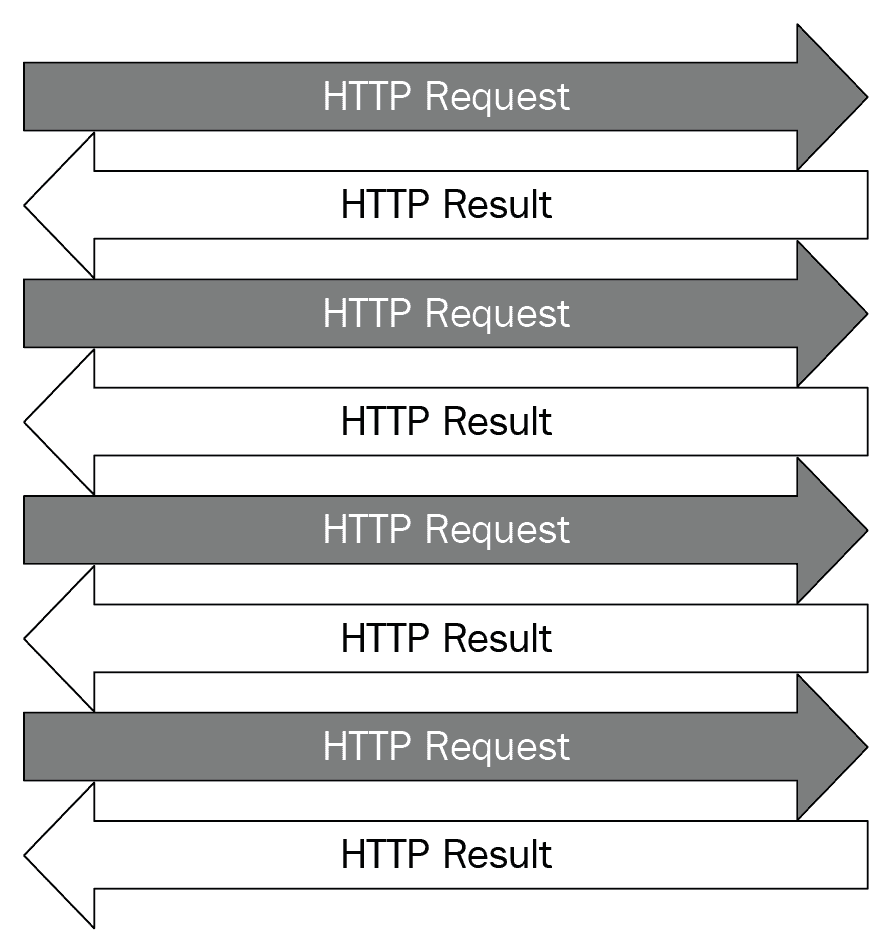
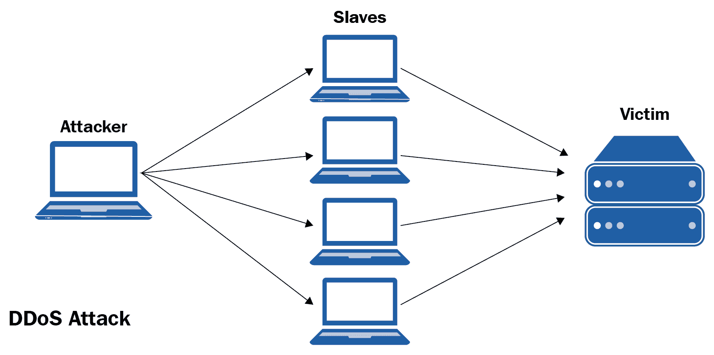

# 第五章：并发网络请求

本章将重点介绍并发性在进行网络请求时的应用。直观地，向网页发出请求以收集有关其的信息与将相同任务应用于另一个网页是独立的。因此，在这种情况下，特别是线程，可以成为一个强大的工具，可以在这个过程中提供显著的加速。在本章中，我们将学习网络请求的基础知识以及如何使用 Python 与网站进行交互。我们还将看到并发性如何帮助我们以高效的方式进行多个请求。最后，我们将看一些网络请求的良好实践。

在本章中，我们将涵盖以下概念：

+   网络请求的基础知识

+   请求模块

+   并发网络请求

+   超时问题

+   进行网络请求的良好实践

# 技术要求

以下是本章的先决条件列表：

+   必须在计算机上安装 Python 3

+   下载 GitHub 存储库：[`github.com/PacktPublishing/Mastering-Concurrency-in-Python`](https://github.com/PacktPublishing/Mastering-Concurrency-in-Python)

+   在本章中，我们将使用名为`Chapter05`的子文件夹进行工作。

+   查看以下视频以查看代码的实际操作：[`bit.ly/2Fy1ZcS`](http://bit.ly/2Fy1ZcS)

# 网络请求的基础知识

据估计，全球生成数据的能力每两年就会增加一倍。尽管有一个名为数据科学的跨学科领域专门致力于数据的研究，但几乎软件开发中的每个编程任务都与收集和分析数据有关。其中一个重要部分当然是数据收集。然而，我们应用程序所需的数据有时并没有以清晰和干净的方式存储在数据库中，有时我们需要从网页中收集我们需要的数据。

例如，网络爬虫是一种自动向网页发出请求并下载特定信息的数据提取方法。网络爬虫允许我们遍历许多网站，并以系统和一致的方式收集我们需要的任何数据，这些收集的数据可以由我们的应用程序稍后进行分析，或者简单地以各种格式保存在我们的计算机上。一个例子是谷歌，它编写并运行了许多自己的网络爬虫来查找和索引搜索引擎的网页。

Python 语言本身提供了许多适用于这种类型应用的好选择。在本章中，我们将主要使用`requests`模块从我们的 Python 程序中进行客户端网络请求。然而，在我们更详细地了解这个模块之前，我们需要了解一些网络术语，以便能够有效地设计我们的应用程序。

# HTML

**超文本标记语言**（**HTML**）是开发网页和 Web 应用程序的标准和最常见的标记语言。HTML 文件只是一个扩展名为`.html`的纯文本文件。在 HTML 文档中，文本被标签包围和分隔，标签用尖括号括起来：`<p>`，``，`<i>`等。这些标签通常由一对组成，即开放标签和闭合标签，指示样式或数据的

数据的性质。

在 HTML 代码中还可以包括其他形式的媒体，如图像或视频。常见的 HTML 文档中还有许多其他标签。有些标签指定了一组具有共同特征的元素，例如`<id></id>`和`<class></class>`。

以下是 HTML 代码的示例：


示例 HTML 代码

幸运的是，我们不需要详细了解每个 HTML 标签的功能，就能够有效地进行网络请求。正如我们将在本章后面看到的那样，进行网络请求的更重要的部分是能够有效地与网页进行交互。

# HTTP 请求

在 Web 上的典型通信过程中，HTML 文本是要保存和/或进一步处理的数据。这些数据首先需要从网页中收集，但我们该如何做呢？大多数通信是通过互联网进行的——更具体地说，是通过万维网——这利用了**超文本传输协议**（**HTTP**）。在 HTTP 中，请求方法用于传达所请求的数据以及应该从服务器发送回来的信息。

例如，当您在浏览器中输入`packtpub.com`时，浏览器通过 HTTP 向 Packt 网站的主服务器发送请求方法，请求网站的数据。现在，如果您的互联网连接和 Packt 的服务器都正常工作，那么您的浏览器将从服务器接收到响应，如下图所示。此响应将以 HTML 文档的形式呈现，浏览器将解释相应的 HTML 输出并在屏幕上显示。


HTTP 通信图

通常，请求方法被定义为表示所需执行的操作的动词，而 HTTP 客户端（Web 浏览器）和服务器相互通信：`GET`、`HEAD`、`POST`、`PUT`、`DELETE`等。在这些方法中，`GET`和`POST`是 Web 抓取应用程序中最常用的两种请求方法；它们的功能如下所述：

+   GET 方法从服务器请求特定数据。此方法仅检索数据，对服务器及其数据库没有其他影响。

+   POST 方法以服务器接受的特定形式发送数据。例如，这些数据可能是发往公告板、邮件列表或新闻组的消息；要提交到 Web 表单的信息；或要添加到数据库的项目。

我们在互联网上常见的所有通用 HTTP 服务器实际上都必须至少实现 GET（和 HEAD）方法，而 POST 方法被视为可选。

# HTTP 状态代码

并非总是当发出 Web 请求并发送到 Web 服务器时，服务器会处理请求并无误地返回所请求的数据。有时，服务器可能完全关闭或已忙于与其他客户端交互，因此无法对新请求做出响应；有时，客户端本身向服务器发出错误请求（例如，格式不正确或恶意请求）。

为了将这些问题归类并在 Web 请求引起的通信中提供尽可能多的信息，HTTP 要求服务器对其客户端的每个请求做出**HTTP 响应** **状态代码**的响应。状态代码通常是一个三位数，指示服务器发送回客户端的响应的具体特征。

HTTP 响应状态代码共有五个大类，由代码的第一位数字表示。它们如下所示：

+   **1xx（信息状态代码）**：请求已收到，服务器正在处理。例如，100 表示已接收请求头，并且服务器正在等待请求正文；102 表示请求当前正在处理中（用于大型请求和防止客户端超时）。

+   **2xx（成功状态代码）**：请求已被服务器成功接收、理解和处理。例如，200 表示请求已成功完成；202 表示请求已被接受进行处理，但处理本身尚未完成。

+   **3xx（重定向状态码）**：需要采取其他操作才能成功处理请求。例如，300 表示关于如何处理来自服务器的响应有多个选项（例如，在下载视频文件时，为客户端提供多个视频格式选项）；301 表示服务器已永久移动，所有请求应重定向到另一个地址（在服务器响应中提供）。

+   **4xx（客户端的错误状态码）**：客户端错误地格式化了请求，无法处理。例如，400 表示客户端发送了错误的请求（例如，语法错误或请求的大小太大）；404（可能是最知名的状态码）表示服务器不支持请求方法。

+   **5xx（服务器的错误状态码）**：请求虽然有效，但服务器无法处理。例如，500 表示出现内部服务器错误，遇到了意外情况；504（网关超时）表示充当网关或代理的服务器未能及时从最终服务器接收响应。

关于这些状态码还可以说很多，但对于我们来说，只需记住之前提到的五大类别就足够了。如果您想找到有关上述或其他状态码的更多具体信息，**互联网编号分配机构**（**IANA**）维护着 HTTP 状态码的官方注册表。

# 请求模块

`requests`模块允许用户发出和发送 HTTP 请求方法。在我们考虑的应用程序中，它主要用于与我们想要提取数据的网页的服务器联系，并获取服务器的响应。

根据该模块的官方文档，**强烈建议**在`requests`中使用 Python 3 而不是 Python 2。

要在计算机上安装该模块，请运行以下命令：

```py
pip install requests
```

如果您使用`pip`作为软件包管理器，请使用此代码。但如果您使用的是 Anaconda，只需使用以下代码：

```py
conda install requests
```

如果您的系统尚未安装这些依赖项（`idna`、`certifi`、`urllib3`等），这些命令应该会为您安装`requests`和其他所需的依赖项。之后，在 Python 解释器中运行`import requests`以确认模块已成功安装。

# 在 Python 中发出请求

让我们看一下该模块的一个示例用法。如果您已经从 GitHub 页面下载了本书的代码，请转到`Chapter05`文件夹。让我们看一下以下代码中显示的`example1.py`文件：

```py
# Chapter05/example1.py

import requests

url = 'http://www.google.com'

res = requests.get(url)

print(res.status_code)
print(res.headers)

with open('google.html', 'w') as f:
    f.write(res.text)

print('Done.')
```

在此示例中，我们使用`requests`模块下载网页`www.google.com`的 HTML 代码。`requests.get()`方法向`url`发送`GET`请求方法，并将响应存储在`res`变量中。在打印出响应的状态和标头后，我们创建一个名为`google.html`的文件，并将存储在响应文本中的 HTML 代码写入文件。

运行程序（假设您的互联网正常工作，Google 服务器没有宕机），您应该会得到以下输出：

```py
200
{'Date': 'Sat, 17 Nov 2018 23:08:58 GMT', 'Expires': '-1', 'Cache-Control': 'private, max-age=0', 'Content-Type': 'text/html; charset=ISO-8859-1', 'P3P': 'CP="This is not a P3P policy! See g.co/p3phelp for more info."', 'X-XSS-Protection': '1; mode=block', 'X-Frame-Options': 'SAMEORIGIN', 'Content-Encoding': 'gzip', 'Server': 'gws', 'Content-Length': '4958', 'Set-Cookie': '1P_JAR=2018-11-17-23; expires=Mon, 17-Dec-2018 23:08:58 GMT; path=/; domain=.google.com, NID=146=NHT7fic3mjBO_vdiFB3-gqnFPyGN1EGxyMkkNPnFMEVsqjGJ8S0EwrivDBWBgUS7hCPZGHbosLE4uxz31shnr3X4adRpe7uICEiK8qh3Asu6LH_bIKSLWStAp8gMK1f9_GnQ0_JKQoMvG-OLrT_fwV0hwTR5r2UVYsUJ6xHtX2s; expires=Sun, 19-May-2019 23:08:58 GMT; path=/; domain=.google.com; HttpOnly'}
Done.
```

响应的状态码为`200`，这意味着请求已成功完成。响应的标头存储在`res.headers`中，还包含有关响应的进一步具体信息。例如，我们可以看到请求的日期和时间，或者响应的内容是文本和 HTML，内容的总长度为`4958`。

服务器发送的完整数据也被写入了`google.html`文件。当您在文本编辑器中打开文件时，您将能够看到我们使用请求下载的网页的 HTML 代码。另一方面，如果您使用 Web 浏览器打开文件，您将看到原始网页的**大部分**信息现在通过下载的离线文件显示出来。

例如，以下是我的系统上 Google Chrome 如何解释 HTML 文件：


离线打开的下载 HTML

服务器上还存储着网页引用的其他信息。这意味着并非所有在线网页提供的信息都可以通过`GET`请求下载，这就是为什么离线 HTML 代码有时无法包含从中下载的在线网页上所有可用的信息的原因。（例如，前面截图中下载的 HTML 代码无法正确显示 Google 图标。）

# 运行 ping 测试

在掌握了 HTTP 请求和 Python 中的`requests`模块的基本知识后，我们将在本章的其余部分中解决一个核心问题：运行 ping 测试。Ping 测试是一个过程，通过该过程您可以通过向每个相关服务器发出请求来测试系统与特定 Web 服务器之间的通信。通过考虑服务器（可能）返回的 HTTP 响应状态代码，该测试用于评估您自己系统的互联网连接或服务器的可用性。

Ping 测试在 Web 管理员中非常常见，他们通常需要同时管理大量网站。Ping 测试是一个快速识别意外无响应或宕机页面的好工具。有许多工具可以为您提供强大的 ping 测试选项，在本章中，我们将设计一个可以同时发送多个 Web 请求的 ping 测试应用程序。

为了模拟不同的 HTTP 响应状态代码发送回我们的程序，我们将使用[httpstat.us](http://www.httpstat.us)，这是一个可以生成各种状态代码并常用于测试应用程序如何处理不同响应的网站。具体来说，要在程序中使用返回 200 状态代码的请求，我们可以简单地向[httpstat.us/200](http://www.httpstat.us/200)发出请求，其他状态代码也是如此。在我们的 ping 测试程序中，我们将有一个包含不同状态代码的[httpstat.us](http://www.httpstat.us) URL 列表。

现在让我们来看一下`Chapter05/example2.py`文件，如下面的代码所示：

```py
# Chapter05/example2.py

import requests

def ping(url):
    res = requests.get(url)
    print(f'{url}: {res.text}')

urls = [
    'http://httpstat.us/200',
    'http://httpstat.us/400',
    'http://httpstat.us/404',
    'http://httpstat.us/408',
    'http://httpstat.us/500',
    'http://httpstat.us/524'
]

```

```py
for url in urls:
    ping(url)

print('Done.')
```

在这个程序中，`ping()`函数接收一个 URL，并尝试向站点发出`GET`请求。然后它将打印出服务器返回的响应内容。在我们的主程序中，我们有一个不同状态代码的列表，我们将逐个调用`ping()`函数。

运行上述示例后的最终输出应该如下：

```py
http://httpstat.us/200: 200 OK
http://httpstat.us/400: 400 Bad Request
http://httpstat.us/404: 404 Not Found
http://httpstat.us/408: 408 Request Timeout
http://httpstat.us/500: 500 Internal Server Error
http://httpstat.us/524: 524 A timeout occurred
Done.
```

我们看到我们的 ping 测试程序能够从服务器获得相应的响应。

# 并发网络请求

在并发编程的背景下，我们可以看到向 Web 服务器发出请求并获取返回的响应的过程与为不同的 Web 服务器执行相同的过程是独立的。这意味着我们可以将并发性和并行性应用于我们的 ping 测试应用程序，以加快执行速度。

在我们设计的并发 ping 测试应用程序中，将同时向服务器发出多个 HTTP 请求，并将相应的响应发送回我们的程序，如下图所示。正如之前讨论的那样，并发性和并行性在 Web 开发中有重要的应用，大多数服务器现在都有能力同时处理大量的请求：



并行 HTTP 请求

# 生成多个线程

要应用并发，我们只需使用我们一直在讨论的`threading`模块来创建单独的线程来处理不同的网络请求。让我们看一下`Chapter05/example3.py`文件，如下面的代码所示：

```py
# Chapter05/example3.py

import threading
import requests
import time

def ping(url):
    res = requests.get(url)
    print(f'{url}: {res.text}')

urls = [
    'http://httpstat.us/200',
    'http://httpstat.us/400',
    'http://httpstat.us/404',
    'http://httpstat.us/408',
    'http://httpstat.us/500',
    'http://httpstat.us/524'
]

start = time.time()
for url in urls:
    ping(url)
print(f'Sequential: {time.time() - start : .2f} seconds')

print()

start = time.time()
threads = []
for url in urls:
    thread = threading.Thread(target=ping, args=(url,))
    threads.append(thread)
    thread.start()
for thread in threads:
    thread.join()

print(f'Threading: {time.time() - start : .2f} seconds')
```

在这个例子中，我们包括了前一个例子中的顺序逻辑来处理我们的 URL 列表，以便我们可以比较当我们将线程应用到我们的 ping 测试程序时速度的提高。我们还使用`threading`模块为我们的 URL 列表中的每个 URL 创建一个线程来 ping；这些线程将独立执行。使用`time`模块的方法还跟踪了顺序和并发处理 URL 所花费的时间。

运行程序，您的输出应该类似于以下内容：

```py
http://httpstat.us/200: 200 OK
http://httpstat.us/400: 400 Bad Request
http://httpstat.us/404: 404 Not Found
http://httpstat.us/408: 408 Request Timeout
http://httpstat.us/500: 500 Internal Server Error
http://httpstat.us/524: 524 A timeout occurred
Sequential: 0.82 seconds

http://httpstat.us/404: 404 Not Found
http://httpstat.us/200: 200 OK
http://httpstat.us/400: 400 Bad Request
http://httpstat.us/500: 500 Internal Server Error
http://httpstat.us/524: 524 A timeout occurred
http://httpstat.us/408: 408 Request Timeout
Threading: 0.14 seconds
```

尽管顺序逻辑和线程逻辑处理所有 URL 所花费的具体时间可能因系统而异，但两者之间仍应有明显的区别。具体来说，我们可以看到线程逻辑几乎比顺序逻辑快了六倍（这对应于我们有六个线程并行处理六个 URL 的事实）。毫无疑问，并发可以为我们的 ping 测试应用程序以及一般的 Web 请求处理过程提供显著的加速。

# 重构请求逻辑

我们 ping 测试应用程序的当前版本按预期工作，但我们可以通过重构我们的请求逻辑将 Web 请求的逻辑放入一个线程类中来提高其可读性。考虑`Chapter05/example4.py`文件，特别是`MyThread`类：

```py
# Chapter05/example4.py

import threading
import requests

class MyThread(threading.Thread):
    def __init__(self, url):
        threading.Thread.__init__(self)
        self.url = url
        self.result = None

    def run(self):
        res = requests.get(self.url)
        self.result = f'{self.url}: {res.text}'
```

在这个例子中，`MyThread`继承自`threading.Thread`类，并包含两个额外的属性：`url`和`result`。`url`属性保存了线程实例应该处理的 URL，来自 Web 服务器对该线程的响应将被写入`result`属性（在`run()`函数中）。

在这个类之外，我们现在可以简单地循环遍历 URL 列表，并相应地创建和管理线程，而不必担心主程序中的请求逻辑：

```py
urls = [
    'http://httpstat.us/200',
    'http://httpstat.us/400',
    'http://httpstat.us/404',
    'http://httpstat.us/408',
    'http://httpstat.us/500',
    'http://httpstat.us/524'
]

start = time.time()

threads = [MyThread(url) for url in urls]
for thread in threads:
    thread.start()
for thread in threads:
    thread.join()
for thread in threads:
    print(thread.result)

print(f'Took {time.time() - start : .2f} seconds')

print('Done.')
```

请注意，我们现在将响应存储在`MyThread`类的`result`属性中，而不是像以前的示例中的旧`ping()`函数中直接打印出来。这意味着，在确保所有线程都已完成后，我们需要再次循环遍历这些线程并打印出这些响应。

重构请求逻辑不应该对我们当前的程序性能产生很大影响；我们正在跟踪执行速度，以查看是否实际情况如此。执行程序，您将获得类似以下的输出：

```py
http://httpstat.us/200: 200 OK
http://httpstat.us/400: 400 Bad Request
http://httpstat.us/404: 404 Not Found
http://httpstat.us/408: 408 Request Timeout
http://httpstat.us/500: 500 Internal Server Error
http://httpstat.us/524: 524 A timeout occurred
Took 0.14 seconds
Done.
```

正如我们预期的那样，通过重构的请求逻辑，我们仍然从程序的顺序版本中获得了显著的加速。同样，我们的主程序现在更易读，而对请求逻辑的进一步调整（正如我们将在下一节中看到的）可以简单地指向`MyThread`类，而不会影响程序的其余部分。

# 超时问题

在本节中，我们将探讨对我们的 ping 测试应用程序可以进行的一个潜在改进：超时处理。超时通常发生在服务器在处理特定请求时花费异常长的时间，并且服务器与其客户端之间的连接被终止。

在 ping 测试应用程序的上下文中，我们将实现一个定制的超时阈值。回想一下，ping 测试用于确定特定服务器是否仍然响应，因此我们可以在程序中指定，如果请求花费的时间超过了服务器响应的超时阈值，我们将将该特定服务器归类为超时。

# 来自 httpstat.us 和 Python 模拟的支持

除了不同状态码的选项之外，[httpstat.us](http://www.httpstat.us)网站还提供了一种在发送请求时模拟响应延迟的方法。具体来说，我们可以使用`GET`请求中的查询参数来自定义延迟时间（以毫秒为单位）。例如，[httpstat.us/200?sleep=5000](http://httpstat.us/200?sleep=5000)将在延迟五秒后返回响应。

现在，让我们看看这样的延迟会如何影响我们程序的执行。考虑一下`Chapter05/example5.py`文件，其中包含我们 ping 测试应用程序的当前请求逻辑，但具有不同的 URL 列表：

```py
# Chapter05/example5.py

import threading
import requests

class MyThread(threading.Thread):
    def __init__(self, url):
        threading.Thread.__init__(self)
        self.url = url
        self.result = None

    def run(self):
        res = requests.get(self.url)
        self.result = f'{self.url}: {res.text}'

urls = [
    'http://httpstat.us/200',
    'http://httpstat.us/200?sleep=20000',
    'http://httpstat.us/400'
]

threads = [MyThread(url) for url in urls]
for thread in threads:
    thread.start()
for thread in threads:
    thread.join()
for thread in threads:
    print(thread.result)

print('Done.')
```

这里有一个 URL，将花费大约 20 秒才能返回响应。考虑到我们将阻塞主程序直到所有线程完成执行（使用`join()`方法），我们的程序在打印出任何响应之前很可能会出现 20 秒的挂起状态。

运行程序来亲身体验一下。将会发生 20 秒的延迟（这将使执行时间显著延长），我们将获得以下输出：

```py
http://httpstat.us/200: 200 OK
http://httpstat.us/200?sleep=20000: 200 OK
http://httpstat.us/400: 400 Bad Request
Took 22.60 seconds
Done.
```

# 超时规范

一个高效的 ping 测试应用程序不应该长时间等待来自网站的响应；它应该有一个超时的设定阈值，如果服务器在该阈值下未返回响应，应用程序将认为该服务器不响应。因此，我们需要实现一种方法来跟踪自从发送请求到服务器以来经过了多少时间。我们将通过从超时阈值倒计时来实现这一点，一旦超过该阈值，所有响应（无论是否已返回）都将被打印出来。

此外，我们还将跟踪还有多少请求仍在等待并且还没有返回响应。我们将使用`threading.Thread`类中的`isAlive()`方法来间接确定特定请求是否已经返回响应：如果在某一时刻，处理特定请求的线程仍然存活，我们可以得出结论，该特定请求仍在等待。

导航到`Chapter05/example6.py`文件，并首先考虑`process_requests()`函数：

```py
# Chapter05/example6.py

import time

UPDATE_INTERVAL = 0.01

def process_requests(threads, timeout=5):
    def alive_count():
        alive = [1 if thread.isAlive() else 0 for thread in threads]
        return sum(alive)

    while alive_count() > 0 and timeout > 0:
        timeout -= UPDATE_INTERVAL
        time.sleep(UPDATE_INTERVAL)
    for thread in threads:
        print(thread.result)
```

该函数接受一个线程列表，我们在之前的示例中一直在使用这些线程来进行网络请求，还有一个可选参数指定超时阈值。在这个函数内部，我们有一个内部函数`alive_count()`，它返回在函数调用时仍然存活的线程数。

在`process_requests()`函数中，只要有线程仍然存活并处理请求，我们将允许线程继续执行（这是在`while`循环中完成的，具有双重条件）。正如你所看到的，`UPDATE_INTERVAL`变量指定了我们检查这个条件的频率。如果任一条件失败（如果没有存活的线程或者超时阈值已过），那么我们将继续打印出响应（即使有些可能尚未返回）。

让我们把注意力转向新的`MyThread`类：

```py
# Chapter05/example6.py

import threading
import requests

class MyThread(threading.Thread):
    def __init__(self, url):
        threading.Thread.__init__(self)
        self.url = url
        self.result = f'{self.url}: Custom timeout'

    def run(self):
        res = requests.get(self.url)
        self.result = f'{self.url}: {res.text}'
```

这个类几乎与我们在之前的示例中考虑的类相同，只是`result`属性的初始值是指示超时的消息。在我们之前讨论的情况中，超时阈值在`process_requests()`函数中指定，当打印出响应时，将使用这个初始值。

最后，让我们考虑一下我们的主程序：

```py
# Chapter05/example6.py

urls = [
    'http://httpstat.us/200',
    'http://httpstat.us/200?sleep=4000',
    'http://httpstat.us/200?sleep=20000',
    'http://httpstat.us/400'
]

start = time.time()

threads = [MyThread(url) for url in urls]
for thread in threads:
    thread.setDaemon(True)
    thread.start()
process_requests(threads)

print(f'Took {time.time() - start : .2f} seconds')

print('Done.')
```

在我们的 URL 列表中，我们有一个请求需要 4 秒，另一个需要 20 秒，除了那些会立即响应的请求。由于我们使用的超时阈值是 5 秒，理论上我们应该能够看到 4 秒延迟的请求成功获得响应，而 20 秒延迟的请求则不会。

关于这个程序还有另一个要点：守护线程。在`process_requests()`函数中，如果超时阈值在至少有一个线程在处理时被触发，那么函数将继续打印出每个线程的`result`属性。

```py
 while alive_count() > 0 and timeout > 0:
    timeout -= UPDATE_INTERVAL
    time.sleep(UPDATE_INTERVAL)
for thread in threads:
    print(thread.result)
```

这意味着我们不会通过使用`join()`函数阻止程序直到所有线程都执行完毕，因此如果达到超时阈值，程序可以简单地继续前进。然而，这意味着线程本身在这一点上并不终止。特别是 20 秒延迟的请求，在我们的程序退出`process_requests()`函数后仍然很可能在运行。

如果处理此请求的线程不是守护线程（如我们所知，守护线程在后台执行并且永远不会终止），它将阻止主程序完成，直到线程本身完成。通过将此线程和任何其他线程设置为守护线程，我们允许主程序在执行其指令的最后一行后立即完成，即使仍有线程在运行。

让我们看看这个程序的运行情况。执行代码，您的输出应该类似于以下内容：

```py
http://httpstat.us/200: 200 OK
http://httpstat.us/200?sleep=4000: 200 OK
http://httpstat.us/200?sleep=20000: Custom timeout
http://httpstat.us/400: 400 Bad Request
Took 5.70 seconds
Done.
```

正如您所看到的，这次我们的程序花了大约 5 秒才完成。这是因为它花了 5 秒等待仍在运行的线程，一旦超过 5 秒的阈值，程序就会打印出结果。在这里，我们看到 20 秒延迟请求的结果只是`MyThread`类的`result`属性的默认值，而其他请求都能够从服务器获得正确的响应（包括 4 秒延迟的请求，因为它有足够的时间来获取响应）。

如果您想看到我们之前讨论的非守护线程的影响，只需注释掉主程序中相应的代码行，如下所示：

```py
threads = [MyThread(url) for url in urls]
for thread in threads:
    #thread.setDaemon(True)
    thread.start()
process_requests(threads)
```

您将看到主程序将挂起大约 20 秒，因为处理 20 秒延迟请求的非守护线程仍在运行，然后才能完成执行（即使产生的输出将是相同的）。

# 制作网络请求的良好实践

在进行并发网络请求时，有一些方面需要仔细考虑和实施。在本节中，我们将讨论这些方面以及在开发应用程序时应该使用的一些最佳实践。

# 考虑服务条款和数据收集政策

未经授权的数据收集已经成为技术世界的讨论话题，过去几年，它将继续存在很长一段时间，这也是有充分理由的。因此，对于在其应用程序中进行自动化网络请求的开发人员来说，查找网站的数据收集政策非常重要。您可以在其服务条款或类似文件中找到这些政策。如果有疑问，直接联系网站询问更多细节通常是一个很好的经验法则。

# 错误处理

编程领域中，错误是无法轻易避免的事情，特别是在进行网络请求时。这些程序中的错误可能包括发出错误的请求（无效请求或者是网络连接不佳），处理下载的 HTML 代码不当，或者解析 HTML 代码失败。因此，在 Python 中使用`try...except`块和其他错误处理工具以避免应用程序崩溃非常重要。如果您的代码/应用程序用于生产和大型应用程序中，避免崩溃尤为重要。

特别是在并发网络爬虫中，一些线程可能成功收集数据，而其他线程可能失败。通过在程序的多线程部分实现错误处理功能，您可以确保失败的线程不会导致整个程序崩溃，并确保成功的线程仍然可以返回其结果。

然而，需要注意的是，盲目捕获错误仍然是不可取的。这个术语表示我们在程序中有一个大的`try...expect`块，它将捕获程序执行中发生的任何错误，而且无法获得有关错误的进一步信息；这种做法也可能被称为错误吞噬。强烈建议在程序中具有特定的错误处理代码，这样不仅可以针对特定错误采取适当的行动，而且还可以发现未考虑的其他错误。

# 定期更新您的程序

网站定期更改其请求处理逻辑以及显示的数据是非常常见的。如果一个向网站发出请求的程序具有相当不灵活的逻辑来与网站的服务器交互（例如，以特定格式构造其请求，仅处理一种响应），那么当网站改变其处理客户端请求的方式时，该程序很可能会停止正常运行。这种情况经常发生在寻找特定 HTML 标签中的数据的网络爬虫程序中；当 HTML 标签发生变化时，这些程序将无法找到它们的数据。

这种做法是为了防止自动数据收集程序的运行。要继续使用最近更改了请求处理逻辑的网站，唯一的方法是分析更新的协议并相应地修改我们的程序。

# 避免发出大量请求

我们讨论的每个程序运行时，都会向管理您想要提取数据的网站的服务器发出 HTTP 请求。在并发程序中，向该服务器提交多个请求的频率更高，时间更短。

如前所述，现在的服务器具有轻松处理多个请求的能力。然而，为了避免过度工作和过度消耗资源，服务器也设计为停止回应过于频繁的请求。大型科技公司的网站，如亚马逊或 Twitter，会寻找来自同一 IP 地址的大量自动请求，并实施不同的响应协议；一些请求可能会延迟，一些可能会拒绝响应，甚至可能会禁止该 IP 地址在特定时间内继续发出请求。

有趣的是，向服务器重复发送大量请求实际上是一种对网站进行黑客攻击的形式。在**拒绝服务**（**DoS**）和**分布式拒绝服务**（**DDoS**）攻击中，大量请求同时发送到服务器，使目标服务器的带宽被流量淹没，因此，其他客户端的正常、非恶意请求被拒绝，因为服务器正忙于处理并发请求，如下图所示：



DDoS 攻击的一种

因此，重要的是要分隔应用程序对服务器发出的并发请求，以便应用程序不被视为攻击者，并且可能被禁止或视为恶意客户端。这可以简单地限制程序中可以同时实施的最大线程/请求数量，或者在向服务器发出请求之前暂停线程一段特定时间（例如，使用`time.sleep()`函数）。

# 总结

在本章中，我们已经了解了 HTML 和网络请求的基础知识。最常见的网络请求是`GET`和`POST`请求。HTTP 响应状态码有五个主要类别，每个类别表示关于服务器和其客户端之间通信的不同概念。通过考虑从不同网站接收的状态代码，我们可以编写一个 ping 测试应用程序，有效地检查这些网站的响应能力。

并发可以应用于同时进行多个网络请求的问题，通过线程提供了应用程序速度的显着改进。但是，在进行并发网络请求时，需要牢记一些考虑因素。

在下一章中，我们将开始讨论并发编程中的另一个重要角色：进程。我们将考虑进程的概念和基本思想，以及 Python 为我们提供的处理进程的选项。

# 问题

+   什么是 HTML？

+   HTTP 请求是什么？

+   什么是 HTTP 响应状态码？

+   `requests`模块如何帮助进行网络请求？

+   什么是 ping 测试，通常如何设计？

+   为什么并发适用于进行网络请求？

+   在开发进行并发网络请求的应用程序时需要考虑哪些因素？

# 进一步阅读

有关更多信息，您可以参考以下链接：

+   *用 Python 自动化乏味的事情：面向完全初学者的实用编程*，Al. Sweigart，No Starch Press，2015

+   *使用 Python 进行网络抓取*，Richard Lawson，Packt Publishing Ltd，2015

+   *使用 Java 进行即时网络抓取*，Ryan Mitchell，Packt Publishing Ltd，2013
