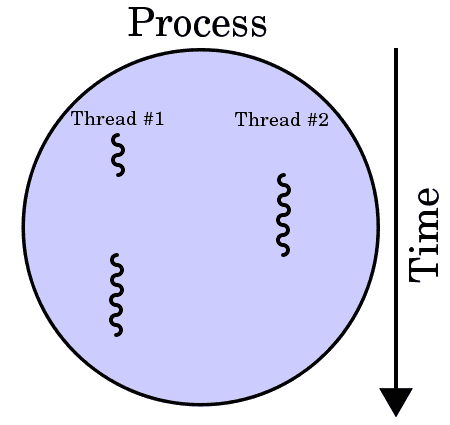
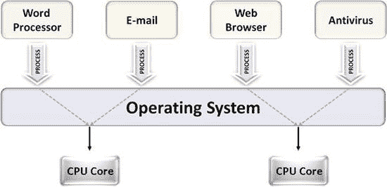
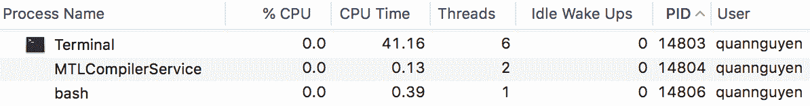
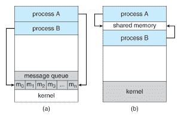

# 第六章：在 Python 中处理进程

本章是关于在 Python 中使用多进程编程进行并发的三章中的第一章。我们已经看到了在并发和并行编程中使用进程的各种示例。在本章中，您将了解进程的正式定义，以及 Python 中的`multiprocessing`模块。本章将介绍使用`multiprocessing`模块的 API 与进程一起工作的一些最常见的方法，例如`Process`类，`Pool`类和诸如`Queue`类之类的进程间通信工具。本章还将研究并发编程中多线程和多进程之间的主要区别。

本章将涵盖以下主题：

+   在计算机科学中并发编程的上下文中的进程概念

+   Python 中`multiprocessing`模块的基本 API

+   如何与进程交互以及`multiprocessing`模块提供的高级功能

+   `multiprocessing`模块如何支持进程间通信

+   并发编程中多进程和多线程之间的主要区别

# 技术要求

以下是本章的先决条件列表：

+   在计算机上安装 Python 3

+   在[`github.com/PacktPublishing/Mastering-Concurrency-in-Python`](https://github.com/PacktPublishing/Mastering-Concurrency-in-Python)下载 GitHub 存储库

+   确保您可以访问名为`Chapter06`的子文件夹

+   查看以下视频以查看代码的运行情况：[`bit.ly/2BtwlJw`](http://bit.ly/2BtwlJw)

# 进程的概念

在计算机科学领域，**执行过程**是操作系统正在执行的特定计算机程序或软件的实例。进程包含程序代码及其当前的活动和与其他实体的交互。根据操作系统的不同，进程的实现可以由多个执行线程组成，这些线程可以并发或并行执行指令。

重要的是要注意，进程不等同于计算机程序。虽然程序只是一组静态指令（程序代码），但进程实际上是这些指令的实际执行。这也意味着相同的程序可以通过生成多个进程并发地运行。这些进程执行来自父程序的相同代码。

例如，互联网浏览器 Google Chrome 通常会管理一个名为**Google Chrome Helper**的进程，以便为其主程序提供网页浏览和其他进程的便利，以协助各种目的。查看系统正在运行和管理的不同进程的简单方法包括使用 Windows 的任务管理器，iOS 的活动监视器和 Linux 操作系统的系统监视器。

以下是我的活动监视器的屏幕截图。在列表中可以看到多个名为 Google Chrome Helper 的进程。`PID`列（代表**进程 ID**）报告了每个进程的唯一 ID：


进程的示例列表

# 进程与线程

在开发并发和并行应用程序时，程序员经常犯的一个常见错误是混淆进程和线程的结构和功能。正如我们从第三章中所看到的，*在 Python 中使用线程*，线程是编程代码的最小单位，通常是进程的组成部分。此外，可以在同一进程中实现多个线程以访问和共享内存或其他资源，而不同的进程不以这种方式进行交互。这种关系如下图所示：



两个线程在一个进程中执行的图表

由于进程是比线程更大的编程单元，因此它也更复杂，包含更多的编程组件。因此，进程也需要更多的资源，而线程则不需要，有时被称为轻量级进程。在典型的计算机系统进程中，有许多主要资源，如下列表所示：

+   从父程序执行的代码的图像（或副本）。

+   与程序实例相关联的内存。这可能包括特定进程的可执行代码、输入和输出、用于管理程序特定事件的调用堆栈，或者包含生成的计算数据并在运行时由进程使用的堆。

+   由操作系统分配给特定进程的资源的描述符。我们已经在第四章中看到了这些资源的示例——文件描述符——*在线程中使用 with 语句*。

+   特定进程的安全组件，即进程的所有者及其权限和允许的操作。

+   处理器状态，也称为进程上下文。进程的上下文数据通常位于处理器寄存器、进程使用的内存或操作系统用于管理进程的控制寄存器中。

由于每个进程都有专门的状态，进程比线程保存更多的状态信息；进程内的多个线程又共享进程状态、内存和其他各种资源。出于类似的原因，进程只能通过系统提供的进程间通信方法与其他进程进行交互，而线程可以通过共享资源轻松地相互通信。

此外，上下文切换——保存进程或线程的状态数据以中断任务的执行并在以后恢复它的行为——在不同进程之间所需的时间比在同一进程内的不同线程之间所需的时间更长。然而，尽管我们已经看到线程之间的通信需要仔细的内存同步以确保正确的数据处理，由于不同进程之间的通信较少，进程几乎不需要或不需要内存同步。

# 多处理

计算机科学中的一个常见概念是多任务处理。在多任务处理时，操作系统会以高速在不同进程之间切换，从而使这些进程看起来像是同时执行，尽管通常情况下只有一个进程在任何给定时间内在一个单独的中央处理单元（CPU）上执行。相比之下，多处理是使用多个 CPU 来执行任务的方法。

虽然术语多处理有许多不同的用法，但在并发性和并行性的上下文中，多处理指的是在操作系统中执行多个并发进程，其中每个进程在单独的 CPU 上执行，而不是在任何给定时间内执行单个进程。由于进程的性质，操作系统需要有两个或更多个 CPU 才能实现多处理任务，因为它需要同时支持多个处理器并适当地分配任务。

此关系显示在以下图表中：



多处理使用两个 CPU 核心的示例图

我们在第三章中看到，多线程与多处理有相似的定义。多线程意味着只有一个处理器被利用，并且系统在该处理器内的任务之间进行切换（也称为时间片切割），而多处理通常表示使用多个处理器实际并发/并行执行多个进程。

多进程应用在并发和并行编程领域享有显著的流行度。一些原因如下所列：

+   **更快的执行时间**：我们知道，正确的并发总是能够为程序提供额外的加速，前提是它们的某些部分可以独立执行。

+   **无需同步**：由于在多进程应用中，独立的进程不会共享资源，开发人员很少需要花时间协调这些资源的共享和同步，不像多线程应用程序，需要努力确保数据被正确操作。

+   **免于崩溃**：由于进程在计算过程和输入/输出方面是相互独立的，多进程程序中一个进程的失败不会影响另一个进程的执行，如果处理正确的话。这意味着程序员可以承担产生更多进程（系统仍然可以处理的）的风险，而整个应用程序崩溃的机会不会增加。

话虽如此，使用多进程也有一些值得注意的缺点，如下列表所示：

+   **需要多个处理器**：再次强调，多进程需要操作系统拥有多个 CPU。尽管多处理器如今对计算机系统来说相当普遍，但如果你的系统没有多个处理器，那么多进程的实现将是不可能的。

+   处理时间和空间：如前所述，实现一个进程及其资源涉及许多复杂的组件。因此，与使用线程相比，生成和管理进程需要大量的计算时间和计算能力。

# Python 中的入门示例

为了说明在一个操作系统上运行多个进程的概念，让我们看一个 Python 的快速示例。让我们看一下`Chapter06/example1.py`文件，如下面的代码所示：

```py
# Chapter06/example1.py

from multiprocessing import Process
import time

def count_down(name, delay):
    print('Process %s starting...' % name)

    counter = 5

    while counter:
        time.sleep(delay)
        print('Process %s counting down: %i...' % (name, counter))
        counter -= 1

    print('Process %s exiting...' % name)

if __name__ == '__main__':
    process1 = Process(target=count_down, args=('A', 0.5))
    process2 = Process(target=count_down, args=('B', 0.5))

    process1.start()
    process2.start()

    process1.join()
    process2.join()

    print('Done.')
```

在这个文件中，我们回到了在第三章中看到的倒计时示例，*在 Python 中使用线程*，同时我们也看一下线程的概念。我们的`count_down()`函数接受一个字符串作为进程标识符和一个延迟时间范围。然后它将从 5 倒数到 1，同时在每次迭代之间睡眠，睡眠时间由`delay`参数指定。该函数还在每次迭代时打印出带有进程标识符的消息。

正如我们在第三章中所看到的，*在 Python 中使用线程*，这个倒计时的例子的目的是展示同时运行不同进程的并发性质，这次是通过使用`multiprocessing`模块中的`Process`类来实现的。在我们的主程序中，我们同时初始化两个进程来同时实现两个独立的基于时间的倒计时。与两个独立的线程一样，我们的两个进程将同时进行它们自己的倒计时。

运行 Python 脚本后，你的输出应该类似于以下内容：

```py
> python example1.py
Process A starting...
Process B starting...
Process B counting down: 5...
Process A counting down: 5...
Process B counting down: 4...
Process A counting down: 4...
Process B counting down: 3...
Process A counting down: 3...
Process B counting down: 2...
Process A counting down: 2...
Process A counting down: 1...
Process B counting down: 1...
Process A exiting...
Process B exiting...
Done.
```

正如我们所预期的，输出告诉我们，两个独立进程的倒计时是同时执行的；程序并不是先完成第一个进程的倒计时，然后再开始第二个进程的，而是几乎同时运行了两个倒计时。尽管进程比线程更昂贵，包含更多的开销，但多进程也允许程序的速度提高一倍，就像前面的例子一样。

请记住，在多线程中，我们看到一个现象，即程序的不同运行之间打印输出的顺序发生了变化。具体来说，有时进程 B 在倒计时期间超过进程 A 并在进程 A 之前完成，尽管它是后初始化的。这又一次是由于几乎同时执行相同函数的两个进程的实现和启动的直接结果。通过多次执行脚本，您会发现在计数和倒计时完成的顺序方面，您很可能会获得不断变化的输出。

# 多进程模块概述

`multiprocessing`模块是 Python 中最常用的多进程编程实现之一。它提供了一种类似于`threading`模块的 API，用于生成和与进程交互（就像我们在前面的示例中看到的`start()`和`join()`方法）。根据其文档网站，该模块允许本地和远程并发，并通过使用子进程而不是线程有效地避免了 Python 中的全局解释器锁（GIL）（我们将在第十五章中更详细地讨论这一点，*全局解释器锁*）。

# 进程类

在`multiprocessing`模块中，进程通常通过`Process`类生成和管理。每个`Process`对象代表在单独进程中执行的活动。方便的是，`Process`类具有与`threading.Thread`类中的等效方法和 API。

具体来说，利用面向对象的编程方法，`multiprocessing`中的`Process`类提供以下资源：

+   `run()`：当初始化并启动新进程时执行此方法

+   `start()`：此方法通过调用`run()`方法启动初始化的调用`Process`对象

+   `join()`：此方法在继续执行程序的其余部分之前等待调用`Process`对象终止

+   `isAlive()`：此方法返回一个布尔值，指示调用的`Process`对象当前是否正在执行

+   `name`：此属性包含调用`Process`对象的名称

+   `pid`：此属性包含调用`Process`对象的进程 ID

+   `terminate()`：此方法终止调用的`Process`对象

正如您可以从我们之前的示例中看到的，初始化`Process`对象时，我们可以通过指定`target`（目标函数）和`args`（目标函数参数）参数向函数传递参数，并在单独的进程中执行它。请注意，也可以重写默认的`Process()`构造函数并实现自己的`run()`函数。

由于它是`multiprocessing`模块和 Python 中并发的主要组成部分，我们将在下一节再次查看`Process`类。

# 池类

在`multiprocessing`模块中，`Pool`类主要用于实现一组进程，每个进程将执行提交给`Pool`对象的任务。通常，`Pool`类比`Process`类更方便，特别是如果并发应用程序返回的结果应该是有序的。

具体来说，我们已经看到，当通过函数并发地运行程序时，列表中不同项目的完成顺序很可能会发生变化。这导致在重新排序程序的输出时，难以根据产生它们的输入的顺序进行排序。其中一个可能的解决方案是创建进程和它们的输出的元组，并按进程 ID 对它们进行排序。

`Pool`类解决了这个问题：`Pool.map()`和`Pool.apply()`方法遵循 Python 传统`map()`和`apply()`方法的约定，确保返回的值按照输入的顺序排序。然而，这些方法会阻塞主程序，直到进程完成处理。因此，`Pool`类还具有`map_async()`和`apply_async()`函数，以更好地支持并发和并行。

# 确定当前进程、等待和终止进程

`Process`类提供了一些在并发程序中轻松与进程交互的方法。在本节中，我们将探讨通过确定当前进程、等待和终止进程来管理不同进程的选项。

# 确定当前进程

处理进程有时会相当困难，因此需要进行重大调试。调试多进程程序的一种方法是识别遇到错误的进程。作为复习，在前面的倒计时示例中，我们向`count_down()`函数传递了一个`name`参数，以确定倒计时期间每个进程的位置。

然而，这是不必要的，因为每个`Process`对象都有一个`name`参数（带有默认值），可以进行更改。给进程命名是跟踪运行进程的更好方法，而不是将标识符传递给目标函数本身（就像我们之前做的那样），特别是在同时运行不同类型进程的应用程序中。`multiprocessing`模块提供的一个强大功能是`current_process()`方法，它将返回当前正在运行的`Process`对象。这是另一种有效而轻松地跟踪运行进程的方法。

让我们通过一个例子更详细地看一下。转到`Chapter06/example2.py`文件，如下所示的代码：

```py
# Chapter06/example2.py

from multiprocessing import Process, current_process
import time

def f1():
    pname = current_process().name
    print('Starting process %s...' % pname)
    time.sleep(2)
    print('Exiting process %s...' % pname)

def f2():
    pname = current_process().name
    print('Starting process %s...' % pname)
    time.sleep(4)
    print('Exiting process %s...' % pname)

if __name__ == '__main__':
    p1 = Process(name='Worker 1', target=f1)
    p2 = Process(name='Worker 2', target=f2)
    p3 = Process(target=f1)

    p1.start()
    p2.start()
    p3.start()

    p1.join()
    p2.join()
    p3.join()
```

在这个例子中，我们有两个虚拟函数`f1()`和`f2()`，每个函数在睡眠一段指定的时间后打印执行该函数的进程的名称。在我们的主程序中，我们初始化了三个单独的进程。前两个我们分别命名为`Worker 1`和`Worker 2`，最后一个我们故意留空，以给它的名称默认值（即`'Process-3'`）。运行脚本后，您应该会得到类似以下的输出：

```py
> python example2.py
Starting process Worker 1...
Starting process Worker 2...
Starting process Process-3...
Exiting process Worker 1...
Exiting process Process-3...
Exiting process Worker 2...
```

我们可以看到`current_process()`成功帮助我们访问运行每个函数的正确进程，并且第三个进程默认分配了名称`Process-3`。在程序中跟踪运行进程的另一种方法是使用`os`模块查看各个进程的 ID。让我们看一个修改后的例子，在`Chapter06/example3.py`文件中，如下所示的代码：

```py
# Chapter06/example3.py

from multiprocessing import Process, current_process
import time
import os

def print_info(title):
    print(title)

    if hasattr(os, 'getppid'):
        print('Parent process ID: %s.' % str(os.getppid()))

    print('Current Process ID: %s.\n' % str(os.getpid()))

def f():
    print_info('Function f')

    pname = current_process().name
    print('Starting process %s...' % pname)
    time.sleep(1)
    print('Exiting process %s...' % pname)

if __name__ == '__main__':
    print_info('Main program')

    p = Process(target=f)
    p.start()
    p.join()

    print('Done.')
```

我们这个例子的主要焦点是`print_info()`函数，它使用`os.getpid()`和`os.getppid()`函数来使用进程 ID 标识当前进程。具体来说，`os.getpid()`返回当前进程的进程 ID，而`os.getppid()`（仅在 Unix 系统上可用）返回父进程的 ID。在运行脚本后，以下是我的输入：

```py
> python example3.py
Main program
Parent process ID: 14806.
Current Process ID: 29010.

Function f
Parent process ID: 29010.
Current Process ID: 29012.

Starting process Process-1...
Exiting process Process-1...
Done.
```

进程 ID 可能因系统而异，但它们的相对关系应该是相同的。特别是对于我的输出，我们可以看到，主 Python 程序的 ID 是`29010`，其父进程的 ID 是`14806`。使用**Activity Monitor**，我交叉检查了这个 ID，并将其连接到我的 Terminal 和 Bash 配置文件，这是有道理的，因为我是从我的 Terminal 运行这个 Python 脚本的。您可以在以下截图中看到 Activity Monitor 中显示的结果：



使用 Activity Monitor 交叉检查 PID 的截图

除了主 Python 程序外，我们还在`f()`函数内调用了`print_info()`，其进程 ID 为`29012`。我们还可以看到运行`f()`函数的进程的父进程实际上是我们的主进程，其 ID 为`29010`。

# 等待进程

通常，我们希望在移动到程序的新部分之前等待所有并发进程完成执行。如前所述，`multiprocessing`模块中的`Process`类提供了`join()`方法，以实现等待进程完成任务并退出的方法。

然而，有时开发人员希望实现在后台运行并且不阻止主程序退出的进程。当主程序没有简单的方法告诉它是否适合在任何给定时间中断进程，或者在退出主程序而不完成工作进程不会影响最终结果时，通常会使用这个规范。

这些进程被称为**守护进程**。`Process`类还提供了一个简单的选项来通过`daemon`属性指定进程是否是守护进程，该属性接受一个布尔值。`daemon`属性的默认值是`False`，因此将其设置为`True`将使给定进程成为守护进程。让我们通过`Chapter06/example4.py`文件中的示例更详细地了解一下，如下所示：

```py
# Chapter06/example4.py

from multiprocessing import Process, current_process
import time

def f1():
    p = current_process()
    print('Starting process %s, ID %s...' % (p.name, p.pid))
    time.sleep(4)
    print('Exiting process %s, ID %s...' % (p.name, p.pid))

def f2():
    p = current_process()
    print('Starting process %s, ID %s...' % (p.name, p.pid))
    time.sleep(2)
    print('Exiting process %s, ID %s...' % (p.name, p.pid))

if __name__ == '__main__':
    p1 = Process(name='Worker 1', target=f1)
    p1.daemon = True
    p2 = Process(name='Worker 2', target=f2)

    p1.start()
    time.sleep(1)
    p2.start()
```

在这个例子中，我们有一个长时间运行的函数（由`f1()`表示，其中有 4 秒的休眠时间）和一个更快的函数（由`f2()`表示，其中只有 2 秒的休眠时间）。我们还有两个单独的进程，如下列表所示：

+   `p1`进程是一个守护进程，负责运行`f1()`。

+   `p2`进程是一个常规进程，负责运行`f2()`

在我们的主程序中，我们启动了这两个进程，但在程序结束时没有调用`join()`方法。由于`p1`是一个长时间运行的进程，它很可能在`p2`（两者中更快的进程）完成之前不会执行完。我们也知道`p1`是一个守护进程，所以我们的程序应该在它执行完之前退出。运行 Python 脚本后，你的输出应该类似于以下代码：

```py
> python example4.py
Starting process Worker 1, ID 33784...
Starting process Worker 2, ID 33788...
Exiting process Worker 2, ID 33788...
```

再次强调，即使当您自己运行脚本时，进程 ID 可能会有所不同，但输出的一般格式应该是相同的。正如我们所看到的，输出与我们讨论的内容一致：我们的主程序初始化并启动了`p1`和`p2`进程，并且在非守护进程退出后立即终止了程序，而不等待守护进程完成。

能够在不等待守护进程处理特定任务的情况下终止主程序的能力确实非常有用。然而，有时我们可能希望在退出之前等待守护进程一段指定的时间；这样，如果程序的规格允许等待进程执行一段时间，我们可以完成一些潜在的守护进程，而不是过早地终止它们。

守护进程和`multiprocessing`模块中的`join()`方法的结合可以帮助我们实现这种架构，特别是考虑到，虽然`join()`方法会无限期地阻塞程序执行（或者至少直到任务完成），但也可以传递一个超时参数来指定在退出之前等待进程的秒数。让我们考虑`Chapter06/example5.py`中前一个例子的修改版本。使用相同的`f1()`和`f2()`函数，在下面的脚本中，我们改变了主程序中处理守护进程的方式：

```py
# Chapter06/example5.py

if __name__ == '__main__':
    p1 = Process(name='Worker 1', target=f1)
    p1.daemon = True
    p2 = Process(name='Worker 2', target=f2)

    p1.start()
    time.sleep(1)
    p2.start()

    p1.join(1)
    print('Whether Worker 1 is still alive:', p1.is_alive())
    p2.join()
```

在这个例子中，我们不是在等待守护进程而是调用了`join()`方法来等待两个进程：我们允许`p1`在一秒内完成，同时阻塞主程序直到`p2`完成。如果`p1`在一秒后仍未执行完，主程序将继续执行其余部分并退出，这时我们会看到`p1`—或`Worker 1`—仍然活着。运行 Python 脚本后，你的输出应该类似于以下内容：

```py
> python example5.py
Starting process Worker 1, ID 36027...
Starting process Worker 2, ID 36030...
Whether Worker 1 is still alive: True
Exiting process Worker 2, ID 36030...
```

我们看到`p1`在等待一秒后确实还活着。

# 终止进程

`multiprocessing.Process`类中的`terminate()`方法提供了一种快速终止进程的方式。当调用该方法时，`Process`类或重写类中指定的退出处理程序、最终原因或类似资源将不会被执行。然而，终止进程的后代进程不会被终止。这些进程被称为**孤立进程**。

虽然有时终止进程会受到指责，但有时是必要的，因为某些进程与进程间通信资源（如锁、信号量、管道或队列）交互，强行停止这些进程可能导致这些资源变得损坏或对其他进程不可用。然而，如果程序中的进程从未与上述资源交互，`terminate()`方法是非常有用的，特别是如果一个进程看起来无响应或死锁。

使用`terminate()`方法时需要注意的一点是，即使在调用该方法后`Process`对象被有效地终止，也很重要的是你也要在对象上调用`join()`。由于`Process`对象的`alive`状态有时在`terminate()`方法后不会立即更新，这种做法给了后台系统一个机会来实现更新以反映进程的终止。

# 进程间通信

虽然锁是用于线程间通信的最常见的同步原语之一，但管道和队列是不同进程之间通信的主要方式。具体来说，它们提供了消息传递选项，以促进进程之间的通信——管道用于连接两个进程，队列用于多个生产者和消费者。

在本节中，我们将探讨队列的使用，特别是`multiprocessing`模块中的`Queue`类。`Queue`类的实现实际上既是线程安全的，也是进程安全的，我们已经在第三章中看到了队列的使用，*在 Python 中使用线程*。Python 中的所有可 pickle 对象都可以通过`Queue`对象传递；在本节中，我们将使用队列在进程之间来回传递消息。

使用消息队列进行进程间通信比使用共享资源更可取，因为如果某些进程在共享资源时处理不当并损坏了共享内存和资源，那么将会产生许多不良和不可预测的后果。然而，如果一个进程未能正确处理其消息，队列中的其他项目将保持完好。以下图表示了使用消息队列和共享资源（特别是内存）进行进程间通信的架构之间的差异：



使用消息队列和共享资源进行进程间通信的架构

# 单个工作进程的消息传递

在我们深入讨论 Python 中的示例代码之前，首先我们需要具体讨论如何在我们的多进程应用程序中使用`Queue`对象。假设我们有一个执行大量计算且不需要大量资源共享和通信的`worker`类。然而，这些工作者实例仍然需要能够在执行过程中不时接收信息。

这就是队列的使用方式：当我们将所有工作者放入队列时。同时，我们还将有一些初始化的进程，每个进程都将遍历该队列并处理一个工作者。如果一个进程已经执行完一个工作者，并且队列中仍有其他工作者，它将继续执行另一个工作者。回顾之前的图表，我们可以看到有两个单独的进程不断地从队列中取出并执行消息。

从`Queue`对象中，我们将使用以下列表中显示的两种主要方法：

+   `get()`: 这个方法返回调用的`Queue`对象中的下一个项目

+   `put()`: 这个方法将传递给它的参数作为额外项目添加到调用的`Queue`对象中

让我们看一个示例脚本，展示了在 Python 中使用队列。转到并打开`Chapter06/example6.py`文件，如下面的代码所示：

```py
# Chapter06/example6.py

import multiprocessing

class MyWorker():
    def __init__(self, x):
        self.x = x

    def process(self):
        pname = multiprocessing.current_process().name
        print('Starting process %s for number %i...' % (pname, self.x))

def work(q):
    worker = q.get()
    worker.process()

if __name__ == '__main__':
    my_queue = multiprocessing.Queue()

    p = multiprocessing.Process(target=work, args=(my_queue,))
    p.start()

    my_queue.put(MyWorker(10))

    my_queue.close()
    my_queue.join_thread()
    p.join()

    print('Done.')
```

在此脚本中，我们有一个`MyWorker`类，它接受一个`x`参数并对其进行计算（目前只会打印出数字）。在我们的主函数中，我们从`multiprocessing`模块初始化了一个`Queue`对象，并添加了一个带有数字`10`的`MyWorker`对象。我们还有`work()`函数，当被调用时，将从队列中获取第一个项目并处理它。最后，我们有一个任务是调用`work()`函数的进程。

该结构旨在将消息传递给一个单一进程，即一个`MyWorker`对象。然后主程序等待进程完成执行。运行脚本后，您的输出应类似于以下内容：

```py
> python example6.py
Starting process Process-1 for number 10...
Done.
```

# 多个工作者之间的消息传递

如前所述，我们的目标是有一个结构，其中有几个进程不断地执行队列中的工作者，并且如果一个进程完成执行一个工作者，那么它将继续执行另一个。为此，我们将利用`Queue`的一个子类`JoinableQueue`，它将提供额外的`task_done()`和`join()`方法，如下列表所述：

+   `task_done()`: 这个方法告诉程序调用的`JoinableQueue`对象已经完成

+   `join()`: 这个方法阻塞，直到调用的`JoinableQueue`对象中的所有项目都已被处理

现在，这里的目标是有一个`JoinableQueue`对象，其中包含所有要执行的任务，我们将其称为任务队列，并且有一些进程。只要任务队列中有项目（消息），进程就会轮流执行这些项目。我们还将有一个`Queue`对象来存储从进程返回的所有结果，我们将其称为结果队列。

转到`Chapter06/example7.py`文件，并查看`Consumer`类和`Task`类，如下面的代码所示：

```py
# Chapter06/example7.py

from math import sqrt
import multiprocessing

class Consumer(multiprocessing.Process):

    def __init__(self, task_queue, result_queue):
        multiprocessing.Process.__init__(self)
        self.task_queue = task_queue
        self.result_queue = result_queue

    def run(self):
        pname = self.name

        while not self.task_queue.empty():

            temp_task = self.task_queue.get()

            print('%s processing task: %s' % (pname, temp_task))

            answer = temp_task.process()
            self.task_queue.task_done()
            self.result_queue.put(answer)

class Task():
    def __init__(self, x):
        self.x = x

    def process(self):
        if self.x < 2:
            return '%i is not a prime number.' % self.x

        if self.x == 2:
            return '%i is a prime number.' % self.x

        if self.x % 2 == 0:
            return '%i is not a prime number.' % self.x

        limit = int(sqrt(self.x)) + 1
        for i in range(3, limit, 2):
            if self.x % i == 0:
                return '%i is not a prime number.' % self.x

        return '%i is a prime number.' % self.x

    def __str__(self):
        return 'Checking if %i is a prime or not.' % self.x
```

`Consumer`类是`multiprocessing.Process`类的一个重写子类，是我们的处理逻辑，它接受一个任务队列和一个结果队列。每个`Consumer`对象启动时，将获取其任务队列中的下一个项目，执行它，最后调用`task_done()`并将返回的结果放入其结果队列。任务队列中的每个项目依次由`Task`类表示，其主要功能是对其`x`参数进行素数检查。当`Consumer`类的一个实例与`Task`类的一个实例交互时，它还会打印出一个帮助消息，以便我们轻松跟踪哪个消费者正在执行哪个任务。

让我们继续考虑我们的主程序，如下面的代码所示：

```py
# Chapter06/example7.py

if __name__ == '__main__':
    tasks = multiprocessing.JoinableQueue()
    results = multiprocessing.Queue()

    # spawning consumers with respect to the
    # number cores available in the system
    n_consumers = multiprocessing.cpu_count()
    print('Spawning %i consumers...' % n_consumers)
    consumers = [Consumer(tasks, results) for i in range(n_consumers)]
    for consumer in consumers:
        consumer.start()

    # enqueueing jobs
    my_input = [2, 36, 101, 193, 323, 513, 1327, 100000, 9999999, 433785907]
    for item in my_input:
        tasks.put(Task(item))

    tasks.join()

    for i in range(len(my_input)):
        temp_result = results.get()
        print('Result:', temp_result)

    print('Done.')
```

正如我们之前所说，我们在主程序中创建了一个任务队列和一个结果队列。我们还创建了一个`Consumer`对象的列表，并启动了它们所有；创建的进程数量与系统中可用的 CPU 数量相对应。接下来，从一个需要从`Task`类中进行大量计算的输入列表中，我们用每个输入初始化一个`Task`对象，并将它们全部放入任务队列。此时，我们的进程——我们的`Consumer`对象——将开始执行这些任务。

最后，在我们的主程序的末尾，我们调用`join()`在我们的任务队列上，以确保所有项目都已执行，并通过循环遍历我们的结果队列打印出结果。运行脚本后，你的输出应该类似于以下内容：

```py
> python example7.py
Spawning 4 consumers...
Consumer-3 processing task: Checking if 2 is a prime or not.
Consumer-2 processing task: Checking if 36 is a prime or not.
Consumer-3 processing task: Checking if 101 is a prime or not.
Consumer-2 processing task: Checking if 193 is a prime or not.
Consumer-3 processing task: Checking if 323 is a prime or not.
Consumer-2 processing task: Checking if 1327 is a prime or not.
Consumer-3 processing task: Checking if 100000 is a prime or not.
Consumer-4 processing task: Checking if 513 is a prime or not.
Consumer-3 processing task: Checking if 9999999 is a prime or not.
Consumer-2 processing task: Checking if 433785907 is a prime or not.
Result: 2 is a prime number.
Result: 36 is not a prime number.
Result: 193 is a prime number.
Result: 101 is a prime number.
Result: 323 is not a prime number.
Result: 1327 is a prime number.
Result: 100000 is not a prime number.
Result: 9999999 is not a prime number.
Result: 513 is not a prime number.
Result: 433785907 is a prime number.
Done.
```

一切似乎都在运行，但是如果我们仔细看一下我们的进程打印出来的消息，我们会注意到大多数任务是由`Consumer-2`或`Consumer-3`执行的，而`Consumer-4`只执行了一个任务，而`Consumer-1`则未执行任何任务。这里发生了什么？

基本上，当我们的一个消费者——比如`Consumer-3`——完成执行一个任务后，它会立即尝试寻找另一个任务来执行。大多数情况下，它会优先于其他消费者，因为它已经被主程序运行。因此，虽然`Consumer-2`和`Consumer-3`不断完成它们的任务执行并拾取其他任务来执行，`Consumer-4`只能“挤”自己进来一次，而`Consumer-1`则根本无法做到这一点。

当一遍又一遍地运行脚本时，你会注意到一个类似的趋势：大多数任务只由一个或两个消费者执行，而其他消费者未能做到这一点。对我们来说，这种情况是不可取的，因为程序没有利用在程序开始时创建的所有可用进程。

为了解决这个问题，已经开发了一种技术，用于阻止消费者立即从任务队列中取下下一个项目，称为**毒丸**。其想法是，在设置任务队列中的真实任务之后，我们还添加包含“停止”值的虚拟任务，并且当前消费者将保持并允许其他消费者先获取任务队列中的下一个项目；因此得名“毒丸”。

为了实现这一技术，我们需要在主程序的特殊对象中添加我们的`tasks`值，每个消费者一个。此外，在我们的`Consumer`类中，还需要实现处理这些特殊对象的逻辑。让我们看一下`example8.py`文件（前一个示例的修改版本，包含毒丸技术的实现），特别是`Consumer`类和主程序，如下面的代码所示：

```py
# Chapter06/example8.py

class Consumer(multiprocessing.Process):

    def __init__(self, task_queue, result_queue):
        multiprocessing.Process.__init__(self)
        self.task_queue = task_queue
        self.result_queue = result_queue

    def run(self):
        pname = self.name

        while True:
            temp_task = self.task_queue.get()

            if temp_task is None:
                print('Exiting %s...' % pname)
                self.task_queue.task_done()
                break

            print('%s processing task: %s' % (pname, temp_task))

            answer = temp_task.process()
            self.task_queue.task_done()
            self.result_queue.put(answer)

class Task():
    def __init__(self, x):
        self.x = x

    def process(self):
        if self.x < 2:
            return '%i is not a prime number.' % self.x

        if self.x == 2:
            return '%i is a prime number.' % self.x

        if self.x % 2 == 0:
            return '%i is not a prime number.' % self.x

        limit = int(sqrt(self.x)) + 1
        for i in range(3, limit, 2):
            if self.x % i == 0:
                return '%i is not a prime number.' % self.x

        return '%i is a prime number.' % self.x

    def __str__(self):
        return 'Checking if %i is a prime or not.' % self.x

if __name__ == '__main__':

    tasks = multiprocessing.JoinableQueue()
    results = multiprocessing.Queue()

    # spawning consumers with respect to the
    # number cores available in the system
    n_consumers = multiprocessing.cpu_count()
    print('Spawning %i consumers...' % n_consumers)
    consumers = [Consumer(tasks, results) for i in range(n_consumers)]
    for consumer in consumers:
        consumer.start()

    # enqueueing jobs
    my_input = [2, 36, 101, 193, 323, 513, 1327, 100000, 9999999, 433785907]
    for item in my_input:
        tasks.put(Task(item))

    for i in range(n_consumers):
        tasks.put(None)

    tasks.join()

    for i in range(len(my_input)):
        temp_result = results.get()
        print('Result:', temp_result)

    print('Done.')
```

`Task`类与我们之前的示例相同。我们可以看到我们的毒丸是`None`值：在主程序中，我们向任务队列中添加了与我们生成的消费者数量相等的`None`值；在`Consumer`类中，如果要执行的当前任务包含值`None`，那么该类对象将打印出指示毒丸的消息，调用`task_done()`并退出。

运行脚本；你的输出应该类似于以下内容：

```py
> python example8.py
Spawning 4 consumers...
Consumer-1 processing task: Checking if 2 is a prime or not.
Consumer-2 processing task: Checking if 36 is a prime or not.
Consumer-3 processing task: Checking if 101 is a prime or not.
Consumer-4 processing task: Checking if 193 is a prime or not.
Consumer-1 processing task: Checking if 323 is a prime or not.
Consumer-2 processing task: Checking if 513 is a prime or not.
Consumer-3 processing task: Checking if 1327 is a prime or not.
Consumer-1 processing task: Checking if 100000 is a prime or not.
Consumer-2 processing task: Checking if 9999999 is a prime or not.
Consumer-3 processing task: Checking if 433785907 is a prime or not.
Exiting Consumer-1...
Exiting Consumer-2...
Exiting Consumer-4...
Exiting Consumer-3...
Result: 2 is a prime number.
Result: 36 is not a prime number.
Result: 323 is not a prime number.
Result: 101 is a prime number.
Result: 513 is not a prime number.
Result: 1327 is a prime number.
Result: 100000 is not a prime number.
Result: 9999999 is not a prime number.
Result: 193 is a prime number.
Result: 433785907 is a prime number.
Done.
```

这一次，除了看到毒丸消息被打印出来之外，输出还显示了在哪个消费者执行了哪个任务方面的显着改善分布。

# 摘要

在计算机科学领域，进程是操作系统正在执行的特定计算机程序或软件的实例。进程包含程序代码及其当前活动和与其他实体的交互。在同一个进程中可以实现多个线程来访问和共享内存或其他资源，而不同的进程不以这种方式进行交互。

在并发和并行的背景下，多进程指的是从操作系统中执行多个并发进程，其中每个进程在单独的 CPU 上执行，而不是在任何给定时间执行单个进程。Python 中的`multiprocessing`模块提供了一个强大而灵活的 API，用于生成和管理多进程应用程序。它还允许通过`Queue`类进行复杂的进程间通信技术。

在下一章中，我们将讨论 Python 的更高级功能——归约操作——以及它在多进程编程中的支持。

# 问题

+   什么是进程？进程和线程之间的核心区别是什么？

+   什么是多进程？多进程和多线程之间的核心区别是什么？

+   `multiprocessing`模块提供了哪些 API 选项？

+   `Process`类和`Pool`类在`multiprocessing`模块中的核心区别是什么？

+   在 Python 程序中确定当前进程的选项有哪些？

+   在多进程程序中，守护进程是什么？它们在等待进程方面有什么目的？

+   如何终止一个进程？为什么有时终止进程是可以接受的？

+   在 Python 中促进进程间通信的一种方式是什么？

# 进一步阅读

有关更多信息，您可以参考以下链接：

+   *Python 并行编程食谱*，作者 Giancarlo Zaccone，Packt Publishing Ltd（2015 年）。

+   “学习 Python 并发：构建高效、健壮和并发的应用程序”，Elliot Forbes（2017 年）。

+   Python 本周模块。“进程间通信”（[pymotw.com/2/multiprocessing/communication.html](https://pymotw.com/2/multiprocessing/communication.html)）。这包含了您可以用来识别当前进程的函数。
