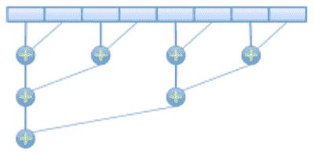
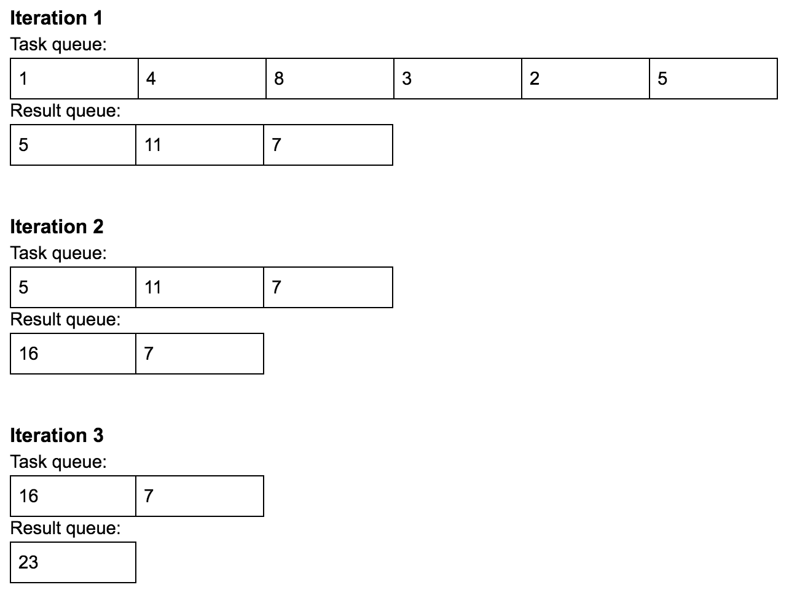

# 第七章：进程中的减少运算符

减少运算符的概念——其中数组的许多或所有元素被减少为一个单一结果——与并发和并行编程密切相关。具体来说，由于运算符的结合和交换性质，可以应用并发和并行性来大大提高它们的执行时间。

本章讨论了从程序员和开发人员的角度设计和编写减少运算符的理论并发方法。从这里开始，本章还将建立与可以以类似方式使用并发性解决的类似问题的联系。

本章将涵盖以下主题：

+   计算机科学中的减少运算符的概念

+   减少运算符的交换和结合属性，以及并发可以应用的原因

+   如何识别与减少运算符等价的问题，以及如何在这种情况下应用并发编程

# 技术要求

以下是本章的先决条件列表：

+   您的计算机必须安装 Python 3

+   从[`github.com/PacktPublishing/Mastering-Concurrency-in-Python`](https://github.com/PacktPublishing/Mastering-Concurrency-in-Python)下载 GitHub 存储库

+   在本章中，我们将使用名为`Chapter07`的子文件夹

+   查看以下视频以查看代码实际运行情况：[`bit.ly/2TD5odl`](http://bit.ly/2TD5odl)

# 减少运算符的概念

作为经验丰富的程序员，您无疑遇到过需要计算数组中所有数字的和或乘积，或者计算将`AND`运算符应用于数组的所有布尔元素以查看该数组中是否存在任何假值的情况。这些被称为**减少运算符**，它们接受一组或一个元素数组，并执行某种形式的计算，以返回一个单一的结果。

# 减少运算符的属性

并非每个数学或计算机科学运算符都是减少运算符。事实上，即使一个运算符能够将一个元素数组减少为一个单一值，也不能保证它是一个减少运算符。如果运算符满足以下条件，则运算符是减少运算符：

+   操作员可以将一个元素数组减少为一个标量值

+   最终结果（标量值）必须通过创建和计算部分任务来获得

第一个条件表明了“减少运算符”这个短语，因为输入数组的所有元素都必须被组合并减少为一个单一的值。然而，第二个条件本质上是关于并发和并行性。它要求任何减少运算符的计算都能够被分解为较小的部分计算。

首先，让我们考虑最常见的减少运算符之一：加法。例如，考虑输入数组`[1, 4, 8, 3, 2, 5]`的元素之和如下：

```py
1 + 4 + 8 + 3 + 2 + 5
= ((((1 + 4) + 8) + 3) + 2) + 5
= (((5 + 8) + 3) + 2) + 5
= ((13 + 3) + 2) + 5
= (16 + 2) + 5
= 18 + 5
= 23
```

在前面的计算中，我们按顺序将数组中的数字减少到它们的总和`23`。换句话说，我们从数组的开头到结尾遍历了每个元素，并添加了当前的总和。现在，我们知道加法是一个可交换和可结合的运算符，这意味着：*a + b = b + a* 和 *(a + b) + c = a + (b + c)*。

因此，我们可以通过将前面的计算分解为更高效的方式来进行更高效的计算：

```py
1 + 4 + 8 + 3 + 2 + 5
= ((1 + 4) + (8 + 3)) + (2 + 5)
= (5 + 11) + 7
= 16 + 7
= 23
```

这种技术是应用并发和并行（特别是多进程）到减少运算符的核心。通过将整个任务分解为较小的子任务，多个进程可以同时执行这些小计算，整个系统可以更快地得出结果。

出于同样的原因，交换性和结合性属性被认为等同于我们之前讨论的减法运算符的要求。换句话说，运算符  是一个具有交换性和结合性的减法运算符。具体如下：

+   交换性：*a  b = b  a*

+   结合性：*(a  b)  c = a  (b  c)*

这里的 *a*，*b* 和 *c* 是输入数组的元素。

因此，如果一个运算符是减法运算符，它必须是交换性和结合性的，因此具有将大任务分解为更小、更易管理的子任务的能力，可以使用多进程以更有效的方式进行计算。

# 示例和非示例

到目前为止，我们已经看到加法是减法运算符的一个例子。要将加法作为减法运算符执行，我们首先将输入数组的元素分成两组，每组都是我们的子任务之一。然后我们对每组进行加法运算，取得每组的加法结果，再将它们分成两组。

这个过程一直持续到得到一个单一的数字。这个过程遵循一个叫做二叉树减法的模型，它利用两个元素组成子任务：



二叉树减法加法图

在前面的例子中，对数组 [1, 4, 8, 3, 2, 5] 进行分组（1 和 4，8 和 3，2 和 5），我们使用三个独立的过程将数字对相加。然后我们得到数组 [5, 11, 7]，我们用一个过程得到 [16, 7]，再用另一个过程最终得到 23。因此，使用三个或更多个 CPU，六个元素的加法运算可以在 log[2]6 = 3 步内完成，而不是顺序加法的五步。

其他常见的减法运算符示例包括乘法和逻辑 AND。例如，使用乘法作为减法运算符对相同的数字数组 [1, 4, 8, 3, 2, 5] 进行减法运算如下：

```py
1 x 4 x 8 x 3 x 2 x 5
= ((1 x 4) x (8 x 3)) x (2 x 5)
= (4 x 24) x 10
= 96 x 10
= 960
```

例如，对布尔值数组进行减法（`True`，`False`，`False`，`True`），使用逻辑 `AND` 运算符，我们可以这样做：

```py
True AND False AND False AND True
= (True AND False) AND (False AND True)
= False AND False
= False
```

减法运算符的非示例是幂函数，因为改变计算顺序会改变最终结果（即，该函数不是交换性的）。例如，顺序减法数组 `[2, 1, 2]` 将给出以下结果：

```py
2 ^ 1 ^ 2 = 2 ^ (1 ^ 2) = 2 ^ 1 = 2
```

如果我们改变操作顺序如下：

```py
(2 ^ 1) ^ 2 = 2 ^ 2 = 4
```

我们将得到一个不同的值。因此，幂函数不是一个减法运算。

# Python 中的示例实现

正如我们之前提到的，由于它们的交换性和结合性属性，减法运算符可以独立创建和处理它们的部分任务，这就是并发可以应用的地方。要真正理解减法运算符如何利用并发，让我们尝试从头开始实现一个并发的多进程减法运算符，具体来说是加法运算符。

与前一章中看到的类似，在这个例子中，我们将使用任务队列和结果队列来促进进程间通信。具体来说，程序将把输入数组中的所有数字存储在任务队列中作为单独的任务。每当我们的消费者（单独的进程）执行时，它将在任务队列上调用 `get()` **两次** 来获取两个任务数字（除了一些边缘情况，任务队列中没有或只剩下一个数字），将它们相加，并将结果放入结果队列。

与在上一节中所做的一样，通过迭代任务队列一次并将添加的任务数字对放入结果队列后，输入数组中的元素数量将减少一半。例如，输入数组`[1, 4, 8, 3, 2, 5]`将变为`[5, 11, 7]`。

现在，我们的程序将把新的任务队列分配为结果队列（因此，在这个例子中，`[5, 11, 7]`现在是新的任务队列），我们的进程将继续遍历它并将数字对相加以生成新的结果队列，这将成为下一个任务队列。这个过程重复进行，直到结果队列只包含一个元素，因为我们知道这个单个数字是原始输入数组中数字的总和。

下面的图表显示了处理输入数组`[1, 4, 8, 3, 2, 5]`的每次迭代中任务队列和结果队列的变化；当结果队列只包含一个数字（`23`）时，进程停止：



多进程加法运算符的示例图表

让我们来看一下`Chapter07/example1.py`文件中的`ReductionConsumer`类：

```py
# Chapter07/example1.py

class ReductionConsumer(multiprocessing.Process):

    def __init__(self, task_queue, result_queue):
        multiprocessing.Process.__init__(self)
        self.task_queue = task_queue
        self.result_queue = result_queue

    def run(self):
        pname = self.name
        print('Using process %s...' % pname)

        while True:
            num1 = self.task_queue.get()
            if num1 is None:
                print('Exiting process %s.' % pname)
                self.task_queue.task_done()
                break

            self.task_queue.task_done()
            num2 = self.task_queue.get()
            if num2 is None:
                print('Reaching the end with process %s and number 
                      %i.' % (pname, num1))
                self.task_queue.task_done()
                self.result_queue.put(num1)
                break

            print('Running process %s on numbers %i and %i.' % (
                    pname, num1, num2))
            self.task_queue.task_done()
            self.result_queue.put(num1 + num2)
```

我们通过重写`multiprocessing.Process`类来实现`ReductionConsumer`类。这个消费者类在初始化时接受一个任务队列和一个结果队列，并处理程序的消费者进程逻辑，调用任务队列上的`get()`两次来从队列中获取两个数字，并将它们的和添加到结果队列中。

在执行这个过程的同时，`ReductionConsumer`类还处理了任务队列中没有或只剩下一个数字的情况（也就是说，当`num1`或`num2`变量为`None`时，这是我们在上一章中知道的用来表示毒丸的方式）。

另外，回想一下，`multiprocessing`模块的`JoinableQueue`类用于实现我们的任务队列，并且在每次调用`get()`函数后需要调用`task_done()`函数，否则我们稍后将在任务队列上调用的`join()`函数将无限期地阻塞。因此，在消费者进程调用`get()`两次的情况下，重要的是在当前任务队列上调用两次`task_done()`，而当我们只调用一次`get()`（当第一个数字是毒丸时），那么我们应该只调用一次`task_done()`。这是在处理多进程通信的程序时需要考虑的更复杂的问题之一。

为了处理和协调不同的消费者进程，以及在每次迭代后操作任务队列和结果队列，我们有一个名为`reduce_sum()`的单独函数：

```py
def reduce_sum(array):
    tasks = multiprocessing.JoinableQueue()
    results = multiprocessing.JoinableQueue()
    result_size = len(array)

    n_consumers = multiprocessing.cpu_count()

    for item in array:
        results.put(item)

    while result_size > 1:
        tasks = results
        results = multiprocessing.JoinableQueue()

        consumers = [ReductionConsumer(tasks, results) 
                     for i in range(n_consumers)]
        for consumer in consumers:
            consumer.start()

        for i in range(n_consumers):
            tasks.put(None)

        tasks.join()
        result_size = result_size // 2 + (result_size % 2)
        #print('-' * 40)

    return results.get()
```

这个函数接受一个 Python 数字列表来计算其元素的总和。除了任务队列和结果队列之外，该函数还跟踪另一个名为`result_size`的变量，该变量表示当前结果队列中的元素数量。

在初始化其基本变量之后，该函数在一个 while 循环中生成其消费者进程以减少当前任务队列。正如我们之前讨论的，在 while 循环的每次迭代中，任务队列中的元素会成对相加，然后将添加的结果存储在结果队列中。之后，任务队列将接管该结果队列的元素，并向队列中添加额外的`None`值以实现毒丸技术。

在每次迭代中，还会初始化一个新的空结果队列作为`JoinableQueue`对象——这与我们在上一章中用于结果队列的`multiprocessing.Queue`类不同，因为我们将在下一次迭代开始时分配`tasks = results`，任务队列需要是一个`JoinableQueue`对象。

我们还在每次迭代结束时更新`result_size`的值，通过`result_size = result_size // 2 + (result_size % 2)`。这里需要注意的是，虽然`JoinableQueue`类的`qsize()`方法是跟踪其对象的长度（即`JoinableQueue`对象中的元素数量）的一种潜在方法，但由于各种原因，这种方法通常被认为是不可靠的，甚至在 Unix 操作系统中也没有实现。

由于我们可以轻松预测输入数组中剩余数字的数量在每次迭代后的变化（如果是偶数，则减半，否则通过整数除法减半，然后加`1`到结果），我们可以使用一个名为`result_size`的单独变量来跟踪该数字。

至于我们这个例子的主程序，我们只需将 Python 列表传递给`reduce_sum()`函数。在这里，我们正在将 0 到 19 的数字相加：

```py
my_array = [i for i in range(20)]

result = reduce_sum(my_array)
print('Final result: %i.' % result)
```

运行脚本后，您的输出应该类似于以下内容：

```py
> python example1.py
Using process ReductionConsumer-1...
Running process ReductionConsumer-1 on numbers 0 and 1.
Using process ReductionConsumer-2...
Running process ReductionConsumer-2 on numbers 2 and 3.
Using process ReductionConsumer-3...

[...Truncated for readability..]

Exiting process ReductionConsumer-17.
Exiting process ReductionConsumer-18.
Exiting process ReductionConsumer-19.
Using process ReductionConsumer-20...
Exiting process ReductionConsumer-20.
Final result: 190.
```

# 并发缩减运算符的现实应用

缩减运算符处理其数据的交际和结合性质使得运算符的子任务能够独立处理，并且与并发和并行性高度相关。因此，并发编程中的各种主题可以与缩减运算符相关，并且通过应用缩减运算符的相同原则，可以使涉及这些主题的问题更加直观和高效。

正如我们所见，加法和乘法运算符都是缩减运算符。更一般地说，通常涉及交际和结合运算符的数值计算问题是应用并发和并行性的主要候选对象。这实际上是 Python 中最著名的、可能是最常用的模块之一—NumPy 的真实情况，其代码被实现为尽可能可并行化。

此外，将逻辑运算符 AND、OR 或 XOR 应用于布尔值数组的方式与缩减运算符的工作方式相同。一些并发位缩减运算符的真实应用包括以下内容：

+   有限状态机通常在处理逻辑门时利用逻辑运算符。有限状态机可以在硬件结构和软件设计中找到。

+   跨套接字/端口的通信通常涉及奇偶校验位和停止位来检查数据错误，或者流控制算法。这些技术利用单个字节的逻辑值通过逻辑运算符处理信息。

+   压缩和加密技术严重依赖于位算法。

# 总结

在 Python 中实现多进程缩减运算符时需要仔细考虑，特别是如果程序利用任务队列和结果队列来促进消费者进程之间的通信。

各种现实世界问题的操作类似于缩减运算符，并且对于这些问题使用并发和并行性可以极大地提高程序处理它们的效率和生产力。因此，重要的是能够识别这些问题，并与缩减运算符的概念联系起来来实现它们的解决方案。

在下一章中，我们将讨论 Python 中多进程程序的一个特定的现实应用：图像处理。我们将介绍图像处理背后的基本思想，以及并发（特别是多进程）如何应用于图像处理应用程序。

# 问题

+   什么是缩减运算符？必须满足什么条件才能使运算符成为缩减运算符？

+   缩减运算符具有与所需条件等价的什么属性？

+   缩减运算符与并发编程之间的联系是什么？

+   在使用 Python 进行进程间通信的多处理程序中，必须考虑哪些因素？

+   并发减少运算符的一些真实应用是什么？

# 进一步阅读

更多信息，请参考以下链接：

+   *Python 并行编程食谱*，Giancarlo Zaccone，Packt Publishing Ltd，2015

+   *学习 Python 并发：构建高效、健壮和并发的应用程序*，Elliot Forbes (2017)

+   *OpenMP 中的并行编程*，Morgan Kaufmann，Chandra, Rohit (2001)

+   *并行多核架构基础*，Yan Solihin (2016)，CRC Press
