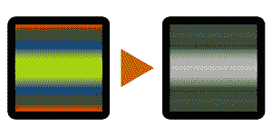
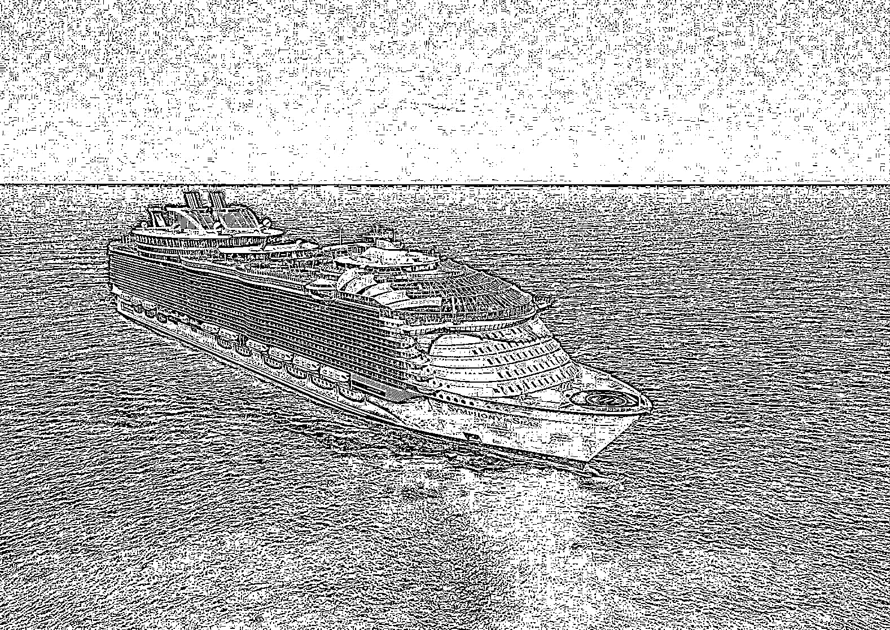
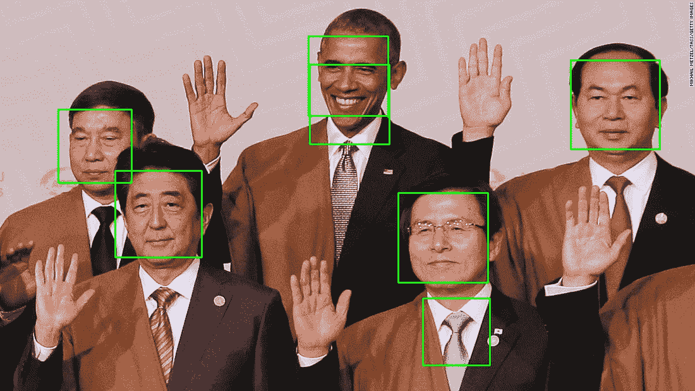

# 第八章：并发图像处理

本章分析了通过并发编程，特别是多进程处理图像的处理和操作过程。由于图像是相互独立处理的，因此并发编程可以显著加快图像处理的速度。本章讨论了图像处理技术背后的基础知识，说明了并发编程提供的改进，并最终总结了图像处理应用中使用的一些最佳实践。

本章将涵盖以下主题：

+   图像处理背后的理念和一些基本的图像处理技术

+   如何将并发应用于图像处理，以及如何分析它提供的改进

+   并发图像处理的最佳实践

# 技术要求

以下是本章的先决条件列表：

+   你必须在计算机上安装 Python 3

+   您必须为您的 Python 3 发行版安装 OpenCV 和 NumPy

+   从[`github.com/PacktPublishing/Mastering-Concurrency-in-Python`](https://github.com/PacktPublishing/Mastering-Concurrency-in-Python)下载 GitHub 存储库

+   在本章中，我们将使用名为`Chapter08`的子文件夹

+   查看以下视频以查看代码实际运行情况：[`bit.ly/2R8ydN8`](http://bit.ly/2R8ydN8)

# 图像处理基础知识

数字/计算图像处理（我们将在此后简称为图像处理）在现代时代变得如此受欢迎，以至于它存在于我们日常生活的许多方面。当您使用不同的滤镜使用相机或手机拍照时，涉及图像处理和操作，或者使用 Adobe Photoshop 等高级图像编辑软件时，甚至只是使用 Microsoft Paint 编辑图像时。

图像处理中使用的许多技术和算法是在 1960 年代初为各种目的开发的，如医学成像、卫星图像分析、字符识别等。然而，这些图像处理技术需要大量的计算能力，当时可用的计算机设备无法满足快速计算的需求，这减缓了图像处理的使用。

快进到未来，在那里拥有快速、多核处理器的强大计算机被开发出来，图像处理技术因此变得更加易于访问，并且图像处理的研究显著增加。如今，正在积极开发和研究许多图像处理应用，包括模式识别、分类、特征提取等。利用并发和并行编程的特定图像处理技术，否则将极其耗时的包括隐马尔可夫模型、独立成分分析，甚至新兴的神经网络模型：



图像处理的一个示例用途：灰度处理

# Python 作为图像处理工具

正如我们在本书中多次提到的，Python 编程语言正在成为最受欢迎的编程语言。这在计算图像处理领域尤其如此，大多数时候需要快速原型设计和设计，以及显著的自动化能力。

正如我们将在下一节中发现的那样，数字图像以二维和三维矩阵表示，以便计算机可以轻松处理它们。因此，大多数时候，数字图像处理涉及矩阵计算。多个 Python 库和模块不仅提供了高效的矩阵计算选项，而且与处理图像读取/写入的其他库无缝交互。

正如我们已经知道的，自动化任务并使其并发都是 Python 的强项。这使得 Python 成为实现图像处理应用程序的首选候选。在本章中，我们将使用两个主要的 Python 库：**OpenCV**（代表**开源计算机视觉**），这是一个提供 C++、Java 和 Python 图像处理和计算机视觉选项的库，以及 NumPy，正如我们所知，它是最受欢迎的 Python 模块之一，可以执行高效和可并行化的数值计算。

# 安装 OpenCV 和 NumPy

要使用`pip`软件包管理器为您的 Python 发行版安装 NumPy，请运行以下命令：

```py
pip install numpy
```

然而，如果您使用 Anaconda/Miniconda 来管理您的软件包，请运行以下命令：

```py
conda install numpy
```

安装 OpenCV 可能更复杂，这取决于您的操作系统。最简单的选择是使用 Anaconda 处理安装过程，按照此指南进行操作（[`anaconda.org/conda-forge/opencv`](https://anaconda.org/conda-forge/opencv)），在安装 Anaconda（[`www.anaconda.com/download/`](https://www.anaconda.com/download/)）后作为您的主要 Python 包管理器。然而，如果您没有使用 Anaconda，安装 OpenCV 的主要选项是按照其官方文档指南进行操作，该指南可以在[`docs.opencv.org/master/df/d65/tutorial_table_of_content_introduction.html`](https://docs.opencv.org/master/df/d65/tutorial_table_of_content_introduction.html)找到。成功安装 OpenCV 后，打开 Python 解释器并尝试导入库，如下所示：

```py
>>> import cv2
>>> print(cv2.__version__)
3.1.0
```

我们使用名称`cv2`导入 OpenCV，这是 Python 中 OpenCV 的库别名。成功消息表示已下载的 OpenCV 库版本（3.1.0）。

# 计算机图像基础

在我们开始处理和操作数字图像文件之前，我们首先需要讨论这些文件的基础知识，以及计算机如何解释其中的数据。具体来说，我们需要了解图像文件中单个像素的颜色和坐标数据是如何表示的，以及如何使用 Python 提取它。

# RGB 值

RGB 值是数字表示颜色的基础。**红**、**绿**和**蓝**代表**RGB**值，这是因为所有颜色都可以通过红、绿和蓝的特定组合生成。因此，RGB 值是由三个整数构成的元组，每个整数的取值范围从 0（表示没有颜色）到 255（表示该特定颜色的最深色调）。

例如，红色对应元组（255, 0, 0）；在元组中，只有红色的最高值，其他颜色没有值，因此整个元组代表纯红色。类似地，蓝色由（0, 0, 255）表示，绿色由（0, 255, 0）表示。黄色是将红色和绿色混合相等量得到的结果，因此由（255, 255, 0）表示（最大量的红色和绿色，没有蓝色）。白色是三种颜色的组合，为（255, 255, 255），而黑色是白色的相反，因此缺乏所有颜色，表示为（0, 0, 0）。


RGB 值基础

# 像素和图像文件

因此，RGB 值表示特定颜色，但我们如何将其与计算机图像连接起来呢？如果我们在计算机上查看图像并尝试尽可能放大，我们会观察到随着放大的深入，图像将开始分解为越来越可辨认的彩色方块——这些方块称为像素，在计算机显示器或数字图像中是最小的颜色单位：


数字图像中的像素示例

以表格格式排列的一组不同像素（像素的行和列）组成了一幅计算机图像。每个像素，反过来，是一个 RGB 值；换句话说，一个像素是一个由三个整数组成的元组。这意味着计算机图像只是一个由元组组成的二维数组，其大小对应于图像的尺寸。例如，一个 128 x 128 的图像有 128 行和 128 列的 RGB 元组作为其数据。

# 图像内的坐标

与二维数组的索引类似，数字图像像素的坐标是一对整数，表示该像素的*x*和*y*坐标；*x*坐标表示像素沿水平轴从左侧开始的位置，*y*坐标表示像素沿垂直轴从顶部开始的位置。

在这里，我们可以看到在图像处理时通常涉及到大量的计算数值过程，因为每个图像都是一个整数元组的矩阵。这也表明，借助 NumPy 库和并发编程，我们可以在 Python 图像处理应用程序的执行时间上实现显著的改进。

遵循 NumPy 中对二维数组进行索引的惯例，像素的位置仍然是一对整数，但第一个数字表示包含像素的行的索引，对应于*y*坐标，同样，第二个数字表示像素的*x*坐标。

# OpenCV API

在 Python 中有许多方法来读取、处理图像和显示数字图像文件。然而，OpenCV 提供了一些最简单和最直观的 API 来实现这一点。关于 OpenCV 的一个重要事项是，当解释其图像时，它实际上将 RGB 值反转为 BGR 值，因此在图像矩阵中，元组将表示蓝色、绿色和红色，而不是红色、绿色和蓝色。

让我们看一个在 Python 中与 OpenCV 交互的例子。让我们来看一下`Chapter08/example1.py`文件：

```py
# Chapter08/example1.py

import cv2

im = cv2.imread('input/ship.jpg')
cv2.imshow('Test', im)
cv2.waitKey(0) # press any key to move forward here

print(im)
print('Type:', type(im))
print('Shape:', im.shape)
print('Top-left pixel:', im[0, 0])

print('Done.')
```

在这个脚本中使用了一些 OpenCV 的方法，我们需要讨论一下：

+   `cv2.imread()`: 这个方法接受一个图像文件的路径（常见的文件扩展名包括`.jpeg`、`.jpg`、`.png`等），并返回一个图像对象，正如我们后面将看到的，它由一个 NumPy 数组表示。

+   `cv2.imshow()`: 这个方法接受一个字符串和一个图像对象，并在一个单独的窗口中显示它。窗口的标题由传入的字符串指定。该方法应始终跟随`cv2.waitKey()`方法。

+   `cv2.waitKey()`: 这个方法接受一个数字，并阻塞程序相应的毫秒数，除非传入数字`0`，在这种情况下，它将无限期地阻塞，直到用户在键盘上按下一个键。该方法应始终跟随`cv2.imshow()`方法。

在`input`子文件夹中调用`cv2.imshow()`来显示`ship.jpg`文件，程序将停止，直到按下一个键，此时它将执行程序的其余部分。如果成功运行，脚本将显示以下图像：


在关闭显示的图片后，按下任意键后，您还应该获得主程序的其余部分的以下输出：

```py
> python example1.py
[[[199 136 86]
 [199 136 86]
 [199 136 86]
 ..., 
 [198 140 81]
 [197 139 80]
 [201 143 84]]

[...Truncated for readability...]

 [[ 56 23 4]
 [ 59 26 7]
 [ 60 27 7]
 ..., 
 [ 79 43 7]
 [ 80 44 8]
 [ 75 39 3]]]
Type: <class 'numpy.ndarray'>
Shape: (1118, 1577, 3)
Top-left pixel: [199 136 86]
Done.
```

输出确认了我们之前讨论的一些事项：

+   首先，当打印出从`cv2.imread()`函数返回的图像对象时，我们得到了一个数字矩阵。

+   使用 Python 的`type()`方法，我们发现这个矩阵的类确实是一个 NumPy 数组：`numpy.ndarray`。

+   调用数组的`shape`属性，我们可以看到图像是一个形状为（`1118`，`1577`，`3`）的三维矩阵，对应于一个具有`1118`行和`1577`列的表，其中每个元素都是一个像素（三个数字的元组）。行和列的数字也对应于图像的大小。

+   聚焦矩阵中的左上角像素（第一行的第一个像素，即`im[0, 0]`），我们得到了（`199`，`136`，`86`）的 BGR 值——`199`蓝色，`136`绿色，`86`红色。通过任何在线转换器查找这个 BGR 值，我们可以看到这是一种浅蓝色，对应于图像的上部分天空。

# 图像处理技术

我们已经看到了一些由 OpenCV 提供的 Python API，用于从图像文件中读取数据。在我们可以使用 OpenCV 执行各种图像处理任务之前，让我们讨论一些常用的图像处理技术的理论基础。

# 灰度处理

我们在本章前面看到了一个灰度处理的例子。可以说，灰度处理是最常用的图像处理技术之一，它是通过仅考虑每个像素的强度信息（由光的数量表示）来减少图像像素矩阵的维度。

因此，灰度图像的像素不再包含三维信息（红色、绿色和蓝色），而只包含一维的黑白数据。这些图像完全由灰度色调组成，黑色表示最弱的光强度，白色表示最强的光强度。

灰度处理在图像处理中有许多重要用途。首先，正如前面提到的，它通过将传统的三维颜色数据映射到一维灰度数据，减少了图像像素矩阵的维度。因此，图像处理程序只需要处理灰度图像的三分之一的工作，而不是分析和处理三层颜色数据。此外，通过仅使用一个光谱表示颜色，图像中的重要模式更有可能在黑白数据中被识别出来。

有多种算法可以将彩色转换为灰度：色度转换、亮度编码、单通道等。幸运的是，我们不必自己实现一个，因为 OpenCV 库提供了一个一行代码的方法，将普通图像转换为灰度图像。仍然使用上一个例子中的船的图像，让我们看一下`Chapter08/example2.py`文件：

```py
# Chapter08/example2.py

import cv2

im = cv2.imread('input/ship.jpg')
gray_im = cv2.cvtColor(im, cv2.COLOR_BGR2GRAY)

cv2.imshow('Grayscale', gray_im)
cv2.waitKey(0) # press any key to move forward here

print(gray_im)
print('Type:', type(gray_im))
print('Shape:', gray_im.shape)
cv2.imwrite('output/gray_ship.jpg', gray_im)

print('Done.')
```

在这个例子中，我们使用 OpenCV 的`cvtColor()`方法将原始图像转换为灰度图像。运行此脚本后，您的计算机上应该显示以下图像：


灰度处理的输出

按任意键解除程序阻塞，您应该获得以下输出：

```py
> python example2.py
[[128 128 128 ..., 129 128 132]
 [125 125 125 ..., 129 128 130]
 [124 125 125 ..., 129 129 130]
 ..., 
 [ 20 21 20 ..., 38 39 37]
 [ 19 22 21 ..., 41 42 37]
 [ 21 24 25 ..., 36 37 32]]
Type: <class 'numpy.ndarray'>
Shape: (1118, 1577)
Done.
```

我们可以看到，灰度图像对象的结构与我们原始图像对象所见的不同。尽管它仍然由 NumPy 数组表示，但现在它是一个二维整数数组，每个整数的范围从 0（黑色）到 255（白色）。然而，像素表仍然由`1118`行和`1577`列组成。

在这个例子中，我们还使用了`cv2.imwrite()`方法，它将图像对象保存到您的本地计算机上。因此，灰度图像可以在本章文件夹的输出子文件夹中找到，如我们的代码中指定的那样。

# 阈值处理

图像处理中的另一个重要技术是阈值处理。目标是将数字图像中的每个像素分类到不同的组中（也称为图像分割），阈值处理提供了一种快速直观的方法来创建二值图像（只有黑色和白色像素）。

阈值化的思想是，如果像素的强度大于先前指定的阈值，则用白色像素替换图像中的每个像素，如果像素的强度小于该阈值，则用黑色像素替换。与灰度化的目标类似，阈值化放大了高强度和低强度像素之间的差异，从而可以识别和提取图像中的重要特征和模式。

回想一下，灰度化将完全彩色的图像转换为只有不同灰度的版本；在这种情况下，每个像素的值是从 0 到 255 的整数。从灰度图像，阈值化可以将其转换为完全的黑白图像，其中每个像素现在只是 0（黑色）或 255（白色）。因此，在图像上执行阈值化后，该图像的每个像素只能保持两个可能的值，也显著减少了图像数据的复杂性。

因此，有效阈值处理的关键是找到一个适当的阈值，使图像中的像素以一种方式分割，使图像中的不同区域变得更加明显。最简单的阈值处理形式是使用一个常数阈值来处理整个图像中的所有像素。让我们在`Chapter08/example3.py`文件中考虑这种方法的一个例子。

```py
# Chapter08/example3.py

import cv2

im = cv2.imread('input/ship.jpg')
gray_im = cv2.cvtColor(im, cv2.COLOR_BGR2GRAY)

ret, custom_thresh_im = cv2.threshold(gray_im, 127, 255, cv2.THRESH_BINARY)
cv2.imwrite('output/custom_thresh_ship.jpg', custom_thresh_im)

print('Done.')
```

在这个例子中，将我们一直在使用的船的图像转换为灰度图像后，我们从 OpenCV 调用`threshold(src, thresh, maxval, type)`函数，该函数接受以下参数：

+   `src`：此参数接受输入/源图像。

+   `thresh`：要在整个图像中使用的常数阈值。在这里，我们使用`127`，因为它只是 0 和 255 之间的中间点。

+   `maxval`：原始值大于常数阈值的像素在阈值处理后将采用此值。我们传入 255 来指定这些像素应该完全是白色的。

+   `type`：此值指示 OpenCV 使用的阈值类型。我们执行简单的二进制阈值处理，因此我们传入`cv2.THRESH_BINARY`。

运行脚本后，您应该能够在输出中找到以下图像，名称为`custom_thresh_ship.jpg`：


简单阈值输出

我们可以看到，通过简单的阈值（`127`），我们得到了一个突出显示图像的不同区域的图像：天空、船和海洋。然而，这种简单阈值方法存在一些问题，其中最常见的问题是找到适当的常数阈值。由于不同的图像具有不同的色调、光照条件等，使用静态值作为它们的阈值跨不同图像是不可取的。

这个问题通过自适应阈值方法来解决，这些方法计算图像的小区域的动态阈值。这个过程允许阈值根据输入图像调整，而不仅仅依赖于静态值。让我们考虑这些自适应阈值方法的两个例子，即自适应均值阈值和自适应高斯阈值。导航到`Chapter08/example4.py`文件：

```py
# Chapter08/example4.py

import cv2

im = cv2.imread('input/ship.jpg')
im = cv2.cvtColor(im, cv2.COLOR_BGR2GRAY)

mean_thresh_im = cv2.adaptiveThreshold(im, 255, cv2.ADAPTIVE_THRESH_MEAN_C, cv2.THRESH_BINARY, 11, 2)
cv2.imwrite('output/mean_thresh_ship.jpg', mean_thresh_im)

gauss_thresh_im = cv2.adaptiveThreshold(im, 255, cv2.ADAPTIVE_THRESH_GAUSSIAN_C, cv2.THRESH_BINARY, 11, 2)
cv2.imwrite('output/gauss_thresh_ship.jpg', gauss_thresh_im)

print('Done.')
```

类似于我们之前使用`cv2.threshold()`方法所做的，这里我们再次将原始图像转换为其灰度版本，然后将其传递给 OpenCV 的`adaptiveThreshold()`方法。该方法接受与`cv2.threshold()`方法类似的参数，只是它不是接受一个常数作为阈值，而是接受一个自适应方法的参数。我们分别使用了`cv2.ADAPTIVE_THRESH_MEAN_C`和`cv2.ADAPTIVE_THRESH_GAUSSIAN_C`。

倒数第二个参数指定了执行阈值处理的窗口大小；这个数字必须是奇数正整数。具体来说，在我们的例子中，我们使用了 11，因此对于图像中的每个像素，算法将考虑相邻像素（在原始像素周围的 11 x 11 方形中）。最后一个参数指定了要对最终输出中的每个像素进行的调整。这两个参数再次帮助定位图像不同区域的阈值，从而使阈值处理过程更加动态，并且正如名称所示，是自适应的。

运行脚本后，您应该能够找到以下图像作为输出，名称为`mean_thresh_ship.jpg`和`gauss_thresh_ship.jpg`。`mean_thresh_ship.jpg`的输出如下：


均值阈值处理的输出

`gauss_thresh_ship.jpg`的输出如下：



高斯阈值处理的输出

我们可以看到，使用自适应阈值处理，特定区域的细节将在最终输出图像中进行阈值处理并突出显示。当我们需要识别图像中的小细节时，这些技术非常有用，而简单的阈值处理在我们只想提取图像的大区域时非常有用。 

# 将并发应用于图像处理

我们已经讨论了图像处理的基础知识和一些常见的图像处理技术。我们也知道为什么图像处理是一个繁重的数值计算任务，以及并发和并行编程可以应用于加速独立处理任务。在本节中，我们将看一个具体的例子，介绍如何实现一个并发图像处理应用程序，可以处理大量的输入图像。

首先，转到本章代码的当前文件夹。在`input`文件夹内，有一个名为`large_input`的子文件夹，其中包含我们将在此示例中使用的 400 张图像。这些图片是原始船舶图像中的不同区域，使用 NumPy 提供的数组索引和切片选项从中裁剪出来的。如果您想知道这些图像是如何生成的，请查看`Chapter08/generate_input.py`文件。

本节的目标是实现一个程序，可以同时处理这些图像并进行阈值处理。为此，让我们看一下`example5.py`文件：

```py
from multiprocessing import Pool
import cv2

import sys
from timeit import default_timer as timer

THRESH_METHOD = cv2.ADAPTIVE_THRESH_GAUSSIAN_C
INPUT_PATH = 'input/large_input/'
OUTPUT_PATH = 'output/large_output/'

n = 20
names = ['ship_%i_%i.jpg' % (i, j) for i in range(n) for j in range(n)]

def process_threshold(im, output_name, thresh_method):
    gray_im = cv2.cvtColor(im, cv2.COLOR_BGR2GRAY)
    thresh_im = cv2.adaptiveThreshold(gray_im, 255, thresh_method, 
                cv2.THRESH_BINARY, 11, 2)

    cv2.imwrite(OUTPUT_PATH + output_name, thresh_im)

if __name__ == '__main__':

    for n_processes in range(1, 7):
        start = timer()

        with Pool(n_processes) as p:
            p.starmap(process_threshold, [(
                cv2.imread(INPUT_PATH + name),
                name,
                THRESH_METHOD
            ) for name in names])

        print('Took %.4f seconds with %i process(es).
              ' % (timer() - start, n_processes))

    print('Done.')
```

在这个例子中，我们使用`multiprocessing`模块中的`Pool`类来管理我们的进程。作为复习，`Pool`对象提供了方便的选项，可以使用`Pool.map()`方法将一系列输入映射到单独的进程。然而，在我们的例子中，我们使用了`Pool.starmap()`方法，以便将多个参数传递给目标函数。

在程序的开头，我们进行了一些基本的赋值：在处理图像时执行自适应阈值处理的方法，输入和输出文件夹的路径，以及要处理的图像的名称。`process_threshold()`函数是我们用来实际处理图像的函数；它接受一个图像对象，图像的处理版本的名称，以及要使用的阈值处理方法。这也是为什么我们需要使用`Pool.starmap()`方法而不是传统的`Pool.map()`方法。

在主程序中，为了演示顺序和多进程图像处理之间的差异，我们希望以不同数量的进程运行我们的程序，具体来说，从一个单一进程到六个不同进程。在`for`循环的每次迭代中，我们初始化一个`Pool`对象，并将每个图像的必要参数映射到`process_threshold()`函数，同时跟踪处理和保存所有图像所需的时间。

运行脚本后，处理后的图像可以在当前章节文件夹中的`output/large_output/`子文件夹中找到。您应该获得类似以下的输出：

```py
> python example5.py
Took 0.6590 seconds with 1 process(es).
Took 0.3190 seconds with 2 process(es).
Took 0.3227 seconds with 3 process(es).
Took 0.3360 seconds with 4 process(es).
Took 0.3338 seconds with 5 process(es).
Took 0.3319 seconds with 6 process(es).
Done.
```

当我们从一个单一进程转到两个独立的进程时，执行时间有很大的差异。然而，当从两个进程转到更多的进程时，速度几乎没有或甚至是负的加速。一般来说，这是因为实现大量独立进程的重大开销，与相对较低数量的输入相比。尽管出于简单起见，我们没有实施这种比较，但随着输入数量的增加，我们会看到来自大量工作进程的更好的改进。

到目前为止，我们已经看到并发编程可以为图像处理应用程序提供显著的加速。然而，如果我们看一下我们之前的程序，我们会发现有其他调整可以进一步提高执行时间。具体来说，在我们之前的程序中，我们通过使用列表推导式顺序读取图像：

```py
with Pool(n_processes) as p:
    p.starmap(process_threshold, [(
        cv2.imread(INPUT_PATH + name),
        name,
        THRESH_METHOD
    ) for name in names])
```

从理论上讲，如果我们将不同图像文件的读取过程并发进行，我们也可以通过我们的程序获得额外的加速。这在处理大型输入文件的图像处理应用程序中尤其如此，在那里大量时间花在等待输入读取上。考虑到这一点，让我们考虑以下示例，在其中我们将实现并发输入/输出处理。导航到`example6.py`文件：

```py
from multiprocessing import Pool
import cv2

import sys
from functools import partial
from timeit import default_timer as timer

THRESH_METHOD = cv2.ADAPTIVE_THRESH_GAUSSIAN_C
INPUT_PATH = 'input/large_input/'
OUTPUT_PATH = 'output/large_output/'

n = 20
names = ['ship_%i_%i.jpg' % (i, j) for i in range(n) for j in range(n)]

def process_threshold(name, thresh_method):
    im = cv2.imread(INPUT_PATH + name)
    gray_im = cv2.cvtColor(im, cv2.COLOR_BGR2GRAY)
    thresh_im = cv2.adaptiveThreshold(gray_im, 255, thresh_method, cv2.THRESH_BINARY, 11, 2)

    cv2.imwrite(OUTPUT_PATH + name, thresh_im)

if __name__ == '__main__':

    for n_processes in range(1, 7):
        start = timer()

        with Pool(n_processes) as p:
            p.map(partial(process_threshold, thresh_method=THRESH_METHOD), names)

        print('Took %.4f seconds with %i process(es).' % (timer() - start, n_processes))

    print('Done.')
```

这个程序的结构与上一个程序类似。然而，我们不是准备要处理的必要图像和其他相关的输入信息，而是将它们实现在`process_threshold()`函数中，现在只需要输入图像的名称并处理读取图像本身。

作为一个旁注，我们在主程序中使用 Python 的内置`functools.partial()`方法传递一个部分参数（因此得名），具体是`thresh_method`，传递给`process_threshold()`函数，因为这个参数在所有图像和进程中都是固定的。有关此工具的更多信息可以在[`docs.python.org/3/library/functools.html`](https://docs.python.org/3/library/functools.html)找到。

运行脚本后，您应该获得类似以下的输出：

```py
> python example6.py
Took 0.5300 seconds with 1 process(es).
Took 0.4133 seconds with 2 process(es).
Took 0.2154 seconds with 3 process(es).
Took 0.2147 seconds with 4 process(es).
Took 0.2213 seconds with 5 process(es).
Took 0.2329 seconds with 6 process(es).
Done.
```

与我们上次的输出相比，这个应用程序的实现确实给我们带来了显著更好的执行时间。

# 良好的并发图像处理实践

到目前为止，您很可能已经意识到图像处理是一个相当复杂的过程，在图像处理应用程序中实现并发和并行编程可能会给我们的工作增加更多的复杂性。然而，有一些良好的实践将指导我们朝着正确的方向发展我们的图像处理应用程序。接下来的部分讨论了我们应该牢记的一些最常见的实践。

# 选择正确的方式（其中有很多）

当我们学习阈值处理时，我们已经简要提到了这种实践。图像处理应用程序如何处理和处理其图像数据在很大程度上取决于它应该解决的问题，以及将要提供给它的数据的类型。因此，在处理图像时选择特定参数时存在显著的变异性。

例如，正如我们之前所看到的，有各种方法可以对图像进行阈值处理，每种方法都会产生非常不同的输出：如果您只想关注图像的大的、明显的区域，简单的常数阈值处理将比自适应阈值处理更有益；然而，如果您想突出图像细节中的小变化，自适应阈值处理将更好。

让我们考虑另一个例子，我们将看到调整图像处理函数的特定参数如何产生更好的输出。在这个例子中，我们使用一个简单的 Haar 级联模型来检测图像中的面部。我们不会深入讨论模型如何处理和处理其数据，因为它已经内置在 OpenCV 中；同样，我们只是在高层次上使用这个模型，改变它的参数以获得不同的结果。

在本章的文件夹中导航到`example7.py`文件。该脚本旨在检测我们输入文件夹中的`obama1.jpeg`和`obama2.jpg`图像中的面部：

```py
import cv2

face_cascade = cv2.CascadeClassifier('input/haarcascade_frontalface_default.xml')

for filename in ['obama1.jpeg', 'obama2.jpg']:
    im = cv2.imread('input/' + filename)
    gray_im = cv2.cvtColor(im, cv2.COLOR_BGR2GRAY)
    faces = face_cascade.detectMultiScale(im)

    for (x, y, w, h) in faces:
        cv2.rectangle(im, (x, y), (x + w, y + h), (0, 255, 0), 2)

    cv2.imshow('%i face(s) found' % len(faces), im)
    cv2.waitKey(0)

print('Done.')
```

首先，程序使用`cv2.CascadeClassifier`类从`input`文件夹中加载预训练的 Haar 级联模型。对于每个输入图像，脚本将其转换为灰度并将其输入到预训练模型中。然后脚本在图像中找到的每张脸周围画一个绿色的矩形，最后在一个单独的窗口中显示它。

运行程序，你会看到以下带有标题`5 个面部被发现`的图像：


正确的面部检测

看起来我们的程序到目前为止工作得很好。按任意键继续，你应该会看到以下带有标题`7 个面部被发现`的图像：



错误的面部检测

现在，我们的程序将一些其他物体误认为是真正的面部，导致了两个误报。这背后的原因涉及到预训练模型的创建方式。具体来说，Haar 级联模型使用了一个训练数据集，其中包含特定（像素）大小的图像，当输入图像包含不同大小的面部时——这在一张集体照片中很常见，有些人离相机很近，而其他人离得很远——将输入到该模型中，会导致输出中出现误报。

`cv2.CascadeClassifier`类的`detectMultiScale`方法中的`scaleFactor`参数解决了这个问题。该参数将在尝试预测这些区域是否包含面部之前，将输入图像的不同区域缩小。这样做可以消除面部大小的潜在差异。为了实现这一点，将我们传递输入图像到模型的那一行更改为以下内容，以指定`scaleFactor`参数为`1.2`：

```py
faces = face_cascade.detectMultiScale(im, scaleFactor=1.2)
```

运行程序，你会看到这次我们的应用能够正确检测输入图像中的所有面部，而不会产生任何误报。

从这个例子中，我们可以看到了解输入图像对你的图像处理应用程序在执行中可能带来的潜在挑战是很重要的，并尝试在处理的一个方法中使用不同的方法或参数来获得最佳结果。

# 生成适当数量的进程

我们在并发图像处理的例子中注意到的一个问题是生成进程的任务需要相当长的时间。由于这个原因，如果可用于分析数据的进程数量与输入量相比太高，那么从增加工作进程数量中获得的执行时间改善将会减少，有时甚至会变得负面。

然而，除非我们也考虑到其输入图像，否则没有一个具体的方法可以确定一个程序是否需要适当数量的独立进程。例如，如果输入图像是相对较大的文件，并且程序从存储中加载它们需要相当长的时间，那么拥有更多的进程可能是有益的；当一些进程在等待它们的图像加载时，其他进程可以继续对它们的图像进行处理。换句话说，拥有更多的进程将允许加载和处理时间之间的一些重叠，这将导致更好的加速。

简而言之，重要的是测试图像处理应用程序中可用的不同进程，以查看可扩展性的最佳数字是多少。

# 同时处理输入/输出

我们发现，以顺序方式加载输入图像可能会对图像处理应用程序的执行时间产生负面影响，而不是允许单独的进程加载它们自己的输入。如果图像文件非常大，那么在单独的进程中加载时间可能会与其他进程中的加载/处理时间重叠，这一点尤为真实。对于将输出图像写入文件也是如此。

# 总结

图像处理是分析和操作数字图像文件以创建图像的新版本或从中提取重要数据的任务。这些数字图像由像素表表示，这些像素表是 RGB 值，或者本质上是数字元组。因此，数字图像只是数字的多维矩阵，这导致图像处理任务通常归结为大量的数字计算。

由于图像可以在图像处理应用程序中独立地进行分析和处理，因此并发和并行编程 – 特别是多进程 – 提供了一种实现应用程序执行时间显着改进的方法。此外，在实现自己的并发图像处理程序时，有许多良好的实践方法可遵循。

到目前为止，在本书中，我们已经涵盖了并发编程的两种主要形式：多线程和多进程。在下一章中，我们将转向异步 I/O 的主题，这也是并发和并行的关键要素之一。

# 问题

+   什么是图像处理任务？

+   数字成像的最小单位是什么？它在计算机中是如何表示的？

+   什么是灰度处理？这种技术有什么作用？

+   什么是阈值处理？这种技术有什么作用？

+   为什么图像处理应该并发进行？

+   并发图像处理的一些良好实践是什么？

# 进一步阅读

有关更多信息，您可以参考以下链接：

+   用 Python 自动化无聊的事情：初学者的实用编程，Al Sweigart，No Starch Press，2015

+   *使用 OpenCV 学习图像处理*，Garcia，Gloria Bueno 等人，Packt Publishing Ltd，2015

+   数字图像处理的计算介绍，Alasdair McAndrew，Chapman and Hall/CRC，2015

+   豪斯，J.，P. Joshi 和 M. Beyeler。OpenCV：*Python 计算机视觉项目*。Packt Publishing Ltd，2016
