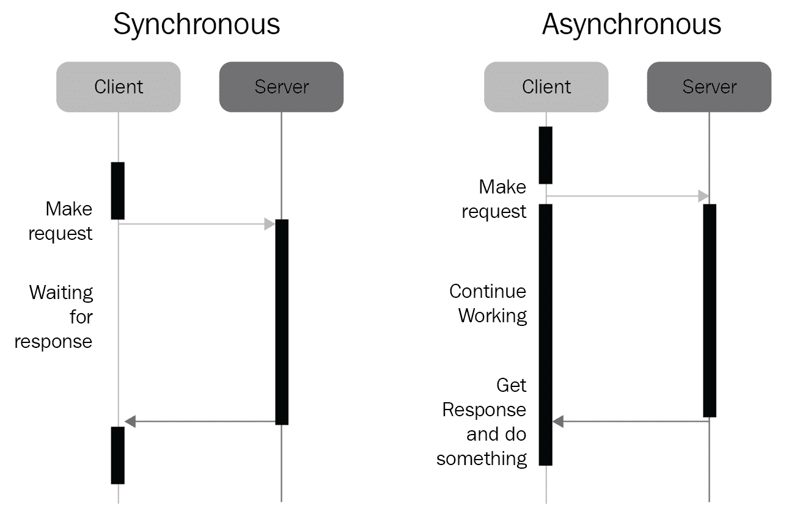

# 第九章：异步编程介绍

在本章中，我们将向读者介绍异步编程的正式定义。我们将讨论异步处理背后的基本思想，异步编程与我们所见过的其他编程模型之间的区别，以及为什么异步编程在并发中如此重要。

本章将涵盖以下主题：

+   异步编程的概念

+   异步编程与其他编程模型之间的关键区别

# 技术要求

以下是本章的先决条件列表：

+   你的计算机上必须安装 Python 3

+   从[`github.com/PacktPublishing/Mastering-Concurrency-in-Python`](https://github.com/PacktPublishing/Mastering-Concurrency-in-Python)下载 GitHub 存储库

+   在本章中，我们将使用名为`Chapter09`的子文件夹，所以确保你已经准备好了它

+   查看以下视频以查看代码实际运行情况：[`bit.ly/2DF700L`](http://bit.ly/2DF700L)

# 一个快速的类比

异步编程是一种专注于协调应用程序中不同任务的编程模型。它的目标是确保应用程序在最短的时间内完成执行这些任务。从这个角度来看，异步编程是关于在适当时刻从一个任务切换到另一个任务，以创建等待和处理时间之间的重叠，并从而缩短完成整个程序所需的总时间。

为了理解异步编程的基本思想，让我们考虑一个快速的现实生活类比。想象一下，你正在烹饪一顿包括以下菜肴的三道菜：

+   需要 2 分钟准备和 3 分钟烹饪/等待的开胃菜

+   需要 5 分钟准备和 10 分钟烹饪/等待的主菜

+   需要 3 分钟准备和 5 分钟烹饪/等待的甜点

现在，考虑菜肴完成烹饪的顺序，你的目标是确定生产三道菜所需的最短时间。例如，如果我们按顺序烹饪菜肴，我们将首先完成开胃菜，需要 5 分钟，然后我们将转向主菜，需要 15 分钟，最后是甜点，需要 8 分钟。总共，整顿饭需要 28 分钟完成。

找到更快的方法的关键是**重叠**一个菜的烹饪/等待时间与另一个菜的准备时间。由于在等待已经准备好烹饪的食物时你不会被占用，这段时间可以通过准备另一道菜的食物来节省。例如，可以通过以下步骤实现改进：

+   准备开胃菜：2 分钟。

+   在等待开胃菜烹饪时准备主菜：5 分钟。在这一步中，开胃菜将完成。

+   在等待主菜烹饪时准备和烹饪甜点：8 分钟。在这一步骤中，甜点将完成，主菜还有 2 分钟的烹饪时间。

+   等待主菜烹饪完成：2 分钟。在这一步中，主菜将烹饪完成。

通过重叠时间，我们节省了大量烹饪三餐的时间，现在总共只需要 17 分钟，而如果按顺序进行的话，需要 28 分钟。然而，显然有多种方式来决定我们应该先开始哪道菜，哪道菜应该第二个和最后一个烹饪。烹饪顺序的另一个变化可能如下：

+   准备主菜：5 分钟。

+   在等待主菜烹饪时准备开胃菜：2 分钟。主菜还有 8 分钟的烹饪时间。

+   在等待开胃菜和主菜烹饪的时候准备甜点：3 分钟。在这一步骤中，开胃菜将已经完成，主菜还有 5 分钟的烹饪时间。

+   等待主菜和甜点烹饪完成：5 分钟。在这一步骤中，主菜和甜点都已经完成。

这次，制作整顿饭只需要 15 分钟。我们可以看到，不同的烹饪顺序可能导致不同的总烹饪时间。找到在程序中执行和切换任务的最佳顺序是异步编程的主要思想：而不是以顺序方式执行该程序的所有指令，我们协调这些指令，以便我们可以创建重叠的等待和处理时间，并最终实现更好的执行时间。

# 异步与其他编程模型

异步编程是并发特别是编程的一个重要概念，但它是一个相当复杂的概念，有时我们很难将其与其他编程模型区分开来。在本节中，我们将比较异步编程与同步编程以及我们已经看到的其他并发编程模型（即线程和多进程）。

# 异步与同步编程

再次，异步编程与同步编程在本质上是不同的，因为它具有任务切换的特性。在同步编程中，程序的指令是按顺序执行的：一个任务必须在下一个任务开始处理之前执行完毕。而在异步编程中，如果当前任务需要花费很长时间才能完成，您可以选择在任务执行期间指定一个时间，将执行切换到另一个任务。正如我们所观察到的，这样做可能会导致整个程序的执行时间有所改善。

异步编程的一个常见示例是服务器和客户端在 HTTP 请求期间的交互。如果 HTTP 请求是同步的，客户端将不得不在发出请求后等待，直到从服务器接收到响应。想象一下，每次您转到新链接或开始播放视频时，浏览器都会挂起，直到实际数据从服务器返回。这对 HTTP 通信来说将是极其不便和低效的。

更好的方法是异步通信，客户端可以自由继续工作，当来自服务器的请求数据返回时，客户端将收到通知并继续处理数据。异步编程在 Web 开发中非常常见，一个名为**AJAX**（**异步 JavaScript 和 XML**的缩写）的整个编程模型现在几乎在每个网站上都在使用。此外，如果您使用过 JavaScript 中的常见库，如 jQuery 或 Node.js，那么您可能已经使用过或至少听说过**回调**这个术语，它简单地意味着可以传递给另一个函数以便将来执行的函数。在函数执行之间来回切换是异步编程的主要思想，我们将在第十八章中实际分析回调使用的高级示例，*从头开始构建服务器*。

以下图表进一步说明了同步和异步客户端-服务器通信之间的区别。



同步和异步 HTTP 请求之间的区别

当然，异步编程不仅限于 HTTP 请求。涉及一般网络通信、软件数据处理、与数据库交互等任务都可以利用异步编程。与同步编程相反，异步编程通过防止程序在等待数据时挂起来为用户提供响应性。因此，它是在处理大量数据的程序中实现的一个很好的工具。

# 异步与线程和多进程

虽然异步编程在某种程度上提供了与线程和多进程相似的好处，但它在 Python 编程语言中与这两种编程模型有根本的不同。

众所周知，在多进程中，我们的主程序的多个副本连同其指令和变量被创建并独立地在不同的核心上执行。线程，也被称为轻量级进程，也是基于同样的原理：虽然代码不是在单独的核心中执行，但在单独的线程中执行的独立部分也不会相互交互。

另一方面，异步编程将程序的所有指令都保留在同一个线程和进程中。异步编程的主要思想是，如果从一个任务切换到另一个任务更有效（从执行时间的角度来看），那么就简单地等待第一个任务的同时处理第二个任务。这意味着异步编程不会利用系统可能具有的多个核心。

# Python 中的一个例子

虽然我们将更深入地讨论如何在 Python 中实现异步编程以及我们将使用的主要工具，包括`asyncio`模块，让我们考虑一下异步编程如何改善我们的 Python 程序的执行时间。

让我们看一下`Chapter09/example1.py`文件：

```py
# Chapter09/example1.py

from math import sqrt

def is_prime(x):
    print('Processing %i...' % x)

    if x < 2:
        print('%i is not a prime number.' % x)

    elif x == 2:
        print('%i is a prime number.' % x)

    elif x % 2 == 0:
        print('%i is not a prime number.' % x)

    else:
        limit = int(sqrt(x)) + 1
        for i in range(3, limit, 2):
            if x % i == 0:
                print('%i is not a prime number.' % x)
                return

        print('%i is a prime number.' % x)

if __name__ == '__main__':

    is_prime(9637529763296797)
    is_prime(427920331)
    is_prime(157)
```

在这里，我们有我们熟悉的质数检查“is_prime（）”函数，它接受一个整数并打印出一个消息，指示该输入是否是质数。在我们的主程序中，我们对三个不同的数字调用“is_prime（）”。我们还跟踪了程序处理所有三个数字所花费的时间。

一旦您执行脚本，您的输出应该类似于以下内容：

```py
> python example1.py
Processing 9637529763296797...
9637529763296797 is a prime number.
Processing 427920331...
427920331 is a prime number.
Processing 157...
157 is a prime number.
```

您可能已经注意到，程序花了相当长的时间来处理第一个输入。由于“is_prime（）”函数的实现方式，如果输入的质数很大，那么“is_prime（）”处理它的时间就会更长。因此，由于我们的第一个输入是一个很大的质数，我们的 Python 程序在打印输出之前将会 hang 一段时间。这通常会给我们的程序带来一种不响应的感觉，这在软件工程和 Web 开发中都是不可取的。

为了改善程序的响应性，我们将利用`asyncio`模块，该模块已经在`Chapter09/example2.py`文件中实现：

```py
# Chapter09/example2.py

from math import sqrt

import asyncio

async def is_prime(x):
    print('Processing %i...' % x)

    if x < 2:
        print('%i is not a prime number.' % x)

    elif x == 2:
        print('%i is a prime number.' % x)

    elif x % 2 == 0:
        print('%i is not a prime number.' % x)

    else:
        limit = int(sqrt(x)) + 1
        for i in range(3, limit, 2):
            if x % i == 0:
                print('%i is not a prime number.' % x)
                return
            elif i % 100000 == 1:
                #print('Here!')
                await asyncio.sleep(0)

        print('%i is a prime number.' % x)

async def main():

    task1 = loop.create_task(is_prime(9637529763296797))
    task2 = loop.create_task(is_prime(427920331))
    task3 = loop.create_task(is_prime(157))

    await asyncio.wait([task1, task2, task3])

if __name__ == '__main__':
    try:
        loop = asyncio.get_event_loop()
        loop.run_until_complete(main())
    except Exception as e:
        print('There was a problem:')
        print(str(e))
    finally:
        loop.close()
```

我们将在下一章详细介绍这段代码。现在，只需运行脚本，您将看到打印输出的响应性有所改善：

```py
> python example2.py
Processing 9637529763296797...
Processing 427920331...
427920331 is a prime number.
Processing 157...
157 is a prime number.
9637529763296797 is a prime number.
```

具体来说，当处理`9637529763296797`（我们的最大输入）时，程序决定切换到下一个输入。因此，在它之前返回了`427920331`和`157`的结果，从而提高了程序的响应性。

# 总结

异步编程是一种基于任务协调和任务切换的编程模型。它与传统的顺序（或同步）编程不同，因为它在处理和等待时间之间创建了重叠，从而提高了速度。异步编程也不同于线程和多进程，因为它只发生在一个单一线程和一个单一进程中。

异步编程主要用于改善程序的响应性。当一个大输入需要花费大量时间来处理时，顺序版本的程序会出现挂起的情况，而异步程序会转移到其他较轻的任务。这允许小输入先完成执行，并帮助程序更具响应性。

在下一章中，我们将学习异步程序的主要结构，并更详细地了解`asyncio`模块及其功能。

# 问题

+   异步编程背后的理念是什么？

+   异步编程与同步编程有何不同？

+   异步编程与线程和多进程有何不同？

# 进一步阅读

欲了解更多信息，您可以参考以下链接：

+   《使用 Python 进行并行编程》，作者 Jan Palach，Packt Publishing Ltd，2014

+   《Python 并行编程食谱》，作者 Giancarlo Zaccone，Packt Publishing Ltd，2015

+   《RabbitMQ Cookbook》，作者 Sigismondo Boschi 和 Gabriele Santomaggio，Packt Publishing Ltd，2013
