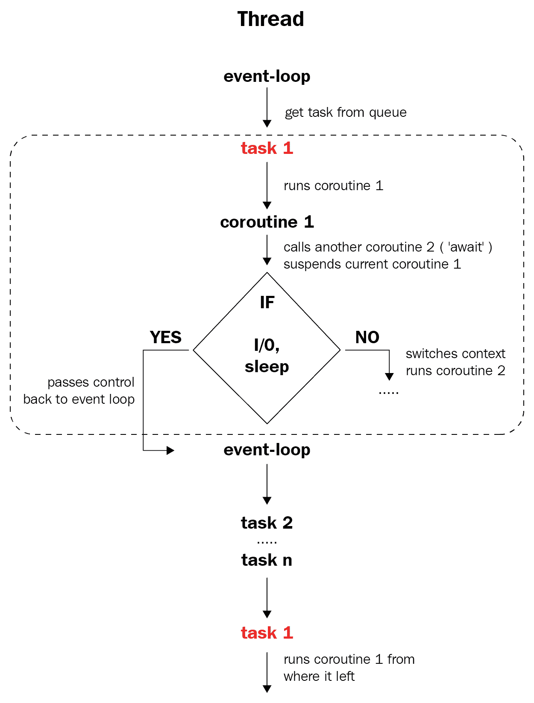
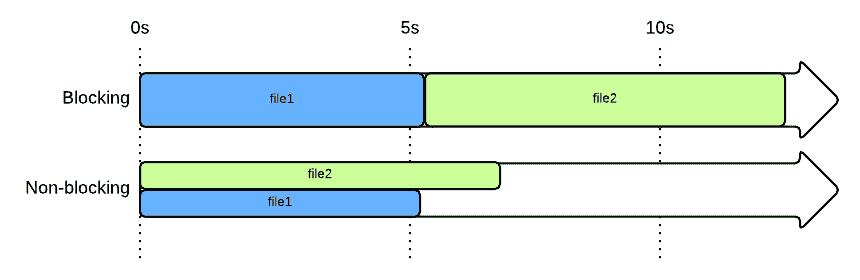

# 第十章：在 Python 中实现异步编程

本章将向您介绍 Python 中的`asyncio`模块。它将涵盖这个新并发模块背后的理念，该模块利用事件循环和协程，并提供了一个与同步代码一样可读的 API。在本章中，我们还将讨论异步编程的实现，以及通过`concurrent.futures`模块进行线程和多进程处理。在此过程中，我们将涵盖通过`asyncio`的最常见用法来应用异步编程，包括异步输入/输出和避免阻塞任务。

本章将涵盖以下主题：

+   使用`asyncio`实现异步编程的基本要素

+   `asyncio`提供的异步编程框架

+   `concurrent.futures`模块及其在`asyncio`中的使用

# 技术要求

以下是本章的先决条件列表：

+   确保您的计算机上安装了 Python 3

+   在[`github.com/PacktPublishing/Mastering-Concurrency-in-Python`](https://github.com/PacktPublishing/Mastering-Concurrency-in-Python)下载 GitHub 存储库

+   在本章中，我们将使用名为`Chapter10`的子文件夹进行工作

+   查看以下视频以查看代码实际运行情况：[`bit.ly/2TAtTrA`](http://bit.ly/2TAtTrA)

# `asyncio`模块

正如您在上一章中看到的，`asyncio`模块提供了一种将顺序程序转换为异步程序的简单方法。在本节中，我们将讨论异步程序的一般结构，以及如何在 Python 中实现从顺序到异步程序的转换。

# 协程、事件循环和 futures

大多数异步程序都具有一些常见的元素，协程、事件循环和 futures 就是其中的三个元素。它们的定义如下：

+   **事件循环**是异步程序中任务的主要协调者。事件循环跟踪所有要异步运行的任务，并决定在特定时刻执行哪些任务。换句话说，事件循环处理异步编程的任务切换方面（或执行流程）。

+   **协程**是一种特殊类型的函数，它包装特定任务，以便可以异步执行。为了指定函数中应该发生任务切换的位置，需要协程；换句话说，它们指定函数应该何时将执行流程交还给事件循环。协程的任务通常存储在任务队列中或在事件循环中创建。

+   **Futures**是从协程返回的结果的占位符。这些 future 对象在协程在事件循环中启动时创建，因此 futures 可以表示实际结果、待定结果（如果协程尚未执行完毕）或异常（如果协程将返回异常）。

事件循环、协程及其对应的 futures 是异步编程过程的核心元素。首先启动事件循环并与其任务队列交互，以获取第一个任务。然后创建该任务的协程及其对应的 future。当需要在该协程内进行任务切换时，协程将暂停，并调用下一个协程；同时也保存了第一个协程的所有数据和上下文。

现在，如果该协程是阻塞的（例如，输入/输出处理或休眠），执行流程将被释放回事件循环，事件循环将继续执行任务队列中的下一个项目。事件循环将在切换回第一个协程之前启动任务队列中的最后一个项目，并将从上次暂停的地方继续执行。

当每个任务执行完成时，它将从任务队列中出列，其协程将被终止，并且相应的 future 将注册来自协程的返回结果。这个过程将一直持续，直到任务队列中的所有任务都被完全执行。下面的图表进一步说明了前面描述的异步过程的一般结构：



异步编程过程

# 异步 IO API

在考虑异步程序的一般结构时，让我们考虑一下`asyncio`模块和 Python 为实现异步程序提供的特定 API。这个 API 的第一个基础是添加到 Python 3.5 中的`async`和`await`关键字。这些关键字用于向 Python 指定异步程序的主要元素。

具体来说，当声明一个函数时，`async`通常放在`def`关键字的前面。在带有`async`关键字的函数前面声明的函数将被 Python 解释为协程。正如我们讨论过的，每个协程内部都必须有关于何时进行任务切换事件的规定。然后，`await`关键字用于指定何时何地将执行流返回给事件循环；这通常是通过等待另一个协程产生结果（`await coroutine`）或通过`asyncio`模块的辅助函数，如`asyncio.sleep()`和`asyncio.wait()`函数来实现的。

重要的是要注意，`async`和`await`关键字实际上是由 Python 提供的，而不是由`asyncio`模块管理的。这意味着异步编程实际上可以在没有`asyncio`的情况下实现，但是，正如你将看到的，`asyncio`提供了一个框架和基础设施来简化这个过程，因此是 Python 中实现异步编程的主要工具。

具体来说，`asyncio`模块中最常用的 API 是事件循环管理功能。使用`asyncio`，你可以通过直观和简单的函数调用开始操纵你的任务和事件循环，而不需要大量的样板代码。其中包括以下内容：

+   `asyncio.get_event_loop()`: 这个方法返回当前上下文的事件循环，它是一个`AbstractEventLoop`对象。大多数情况下，我们不需要担心这个类，因为`asyncio`模块已经提供了一个高级 API 来管理我们的事件循环。

+   `AbstractEventLoop.create_task()`: 这个方法由事件循环调用。它将其输入添加到调用事件循环的当前任务队列中；输入通常是一个协程（即带有`async`关键字的函数）。

+   `AbstractEventLoop.run_until_complete()`: 这个方法也是由事件循环调用的。它接受异步程序的主协程，并执行它，直到协程的相应 future 被返回。虽然这个方法启动了事件循环的执行，但它也会阻塞其后的所有代码，直到所有的 future 都完成。

+   `AbstractEventLoop.run_forever()`: 这个方法与`AbstractEventLoop.run_until_complete()`有些相似，不同之处在于，正如方法名所示，调用事件循环将永远运行，除非调用`AbstractEventLoop.stop()`方法。因此，循环不会退出，即使获得了返回的 future。

+   `AbstractEventLoop.stop()`: 这个方法会导致调用事件循环停止执行，并在最近的适当机会退出，而不会导致整个程序崩溃。

除了这些方法之外，我们使用了许多非阻塞函数来促进任务切换事件。其中包括以下内容：

+   `asyncio.sleep()`: 虽然本身是一个协程，但这个函数创建一个在给定时间后（由输入的秒数指定）完成的额外协程。通常用作`asyncio.sleep(0)`，以引起立即的任务切换事件。

+   `asyncio.wait()`: 这个函数也是一个协程，因此可以用来切换任务。它接受一个序列（通常是一个列表）的 futures，并等待它们完成执行。

# 异步框架的实际应用

正如您所见，`asyncio`提供了一种简单直观的方法来使用 Python 的异步编程关键字实现异步程序的框架。有了这个，让我们考虑将提供的框架应用于 Python 中的同步应用程序，并将其转换为异步应用程序。

# 异步倒计时

让我们看一下`Chapter10/example1.py`文件，如下所示：

```py
# Chapter10/example1.py

import time

def count_down(name, delay):
    indents = (ord(name) - ord('A')) * '\t'

    n = 3
    while n:
        time.sleep(delay)

        duration = time.perf_counter() - start
        print('-' * 40)
        print('%.4f \t%s%s = %i' % (duration, indents, name, n))

        n -= 1

start = time.perf_counter()

count_down('A', 1)
count_down('B', 0.8)
count_down('C', 0.5)

print('-' * 40)
print('Done.')
```

这个例子的目标是说明重叠处理和独立任务等待时间的异步特性。为了做到这一点，我们将分析一个倒计时函数（`count_down()`），它接受一个字符串和一个延迟时间。然后它将从三倒数到一，以秒为单位，同时打印出从函数执行开始到输入字符串（带有当前倒计时数字）的经过的时间。

在我们的主程序中，我们将在字母`A`、`B`和`C`上调用`count_down()`函数，延迟时间不同。运行脚本后，您的输出应该类似于以下内容：

```py
> python example1.py
----------------------------------------
1.0006 A = 3
----------------------------------------
2.0041 A = 2
----------------------------------------
3.0055 A = 1
----------------------------------------
3.8065         B = 3
----------------------------------------
4.6070         B = 2
----------------------------------------
5.4075         B = 1
----------------------------------------
5.9081                 C = 3
----------------------------------------
6.4105                 C = 2
----------------------------------------
6.9107                 C = 1
----------------------------------------
Done.
```

行首的数字表示从程序开始经过的总秒数。您可以看到程序首先为字母`A`倒数，间隔一秒，然后转移到字母`B`，间隔 0.8 秒，最后转移到字母`C`，间隔 0.5 秒。这是一个纯粹的顺序同步程序，因为处理和等待时间之间没有重叠。此外，运行程序大约需要 6.9 秒，这是所有三个字母倒计时时间的总和：

```py
1 second x 3 (for A) + 0.8 seconds x 3 (for B) + 0.5 seconds x 3 (for C) = 6.9 seconds
```

牢记异步编程背后的思想，我们可以看到实际上我们可以将这个程序转换为异步程序。具体来说，假设在程序的第一秒钟，当我们等待倒数字母`A`时，我们可以切换任务以移动到其他字母。事实上，我们将为`count_down()`函数中的所有字母实现这个设置（换句话说，我们将`count_down()`变成一个协程）。

从理论上讲，现在所有倒计时任务都是异步程序中的协程，我们应该能够获得更好的执行时间和响应性。由于所有三个任务都是独立处理的，倒计时消息应该是无序打印出来的（在不同的字母之间跳跃），而异步程序应该只需要与最大任务所需的时间大致相同（即字母`A`需要三秒）。

但首先，让我们将程序变成异步的。为了做到这一点，我们首先需要将`count_down()`变成一个协程，并指定函数内的某一点为任务切换事件。换句话说，我们将在函数前面添加关键字`async`，而不是使用`time.sleep()`函数，我们将使用`asyncio.sleep()`函数以及`await`关键字；函数的其余部分应保持不变。我们的`count_down()`协程现在应该如下所示：

```py
# Chapter10/example2.py

async def count_down(name, delay):
    indents = (ord(name) - ord('A')) * '\t'

    n = 3
    while n:
        await asyncio.sleep(delay)

        duration = time.perf_counter() - start
        print('-' * 40)
        print('%.4f \t%s%s = %i' % (duration, indents, name, n))

        n -= 1
```

至于我们的主程序，我们需要初始化和管理一个事件循环。具体来说，我们将使用`asyncio.get_event_loop()`方法创建一个空的事件循环，使用`AbstractEventLoop.create_task()`将所有三个倒计时任务添加到任务队列中，并最后使用`AbstractEventLoop.run_until_complete()`开始运行事件循环。我们的主程序应该如下所示：

```py
# Chapter10/example2.py

loop = asyncio.get_event_loop()
tasks = [
    loop.create_task(count_down('A', 1)),
    loop.create_task(count_down('B', 0.8)),
    loop.create_task(count_down('C', 0.5))
]

start = time.perf_counter()
loop.run_until_complete(asyncio.wait(tasks))

print('-' * 40)
print('Done.')
```

完整的脚本也可以在书的代码存储库中找到，在`Chapter10`子文件夹中，名为`example2.py`。运行脚本后，您的输出应该类似于以下内容：

```py
> python example2.py
----------------------------------------
0.5029                 C = 3
----------------------------------------
0.8008         B = 3
----------------------------------------
1.0049 A = 3
----------------------------------------
1.0050                 C = 2
----------------------------------------
1.5070                 C = 1
----------------------------------------
1.6011         B = 2
----------------------------------------
2.0090 A = 2
----------------------------------------
2.4068         B = 1
----------------------------------------
3.0147 A = 1
----------------------------------------
Done.
```

现在，您可以看到异步程序如何可以提高程序的执行时间和响应性。我们的程序不再按顺序执行单个任务，而是在不同的倒计时之间切换，并重叠它们的处理/等待时间。正如我们讨论过的，这导致不同的字母在彼此之间或同时被打印出来。

在程序开始时，程序不再等待整整一秒才打印出第一条消息`A = 3`，而是切换到任务队列中的下一个任务（在这种情况下，它等待 0.8 秒来打印字母`B`）。这个过程一直持续，直到过去了 0.5 秒，打印出`C = 3`，再过 0.3 秒（在 0.8 秒时），打印出`B = 3`。这都发生在打印出`A = 3`之前。

我们的异步程序的这种任务切换属性使其更具响应性。在打印第一条消息之前不再等待一秒，程序现在只需要 0.5 秒（最短的等待时间）就可以打印出第一条消息。至于执行时间，您可以看到这一次，整个程序只需要三秒的时间来执行（而不是 6.9 秒）。这符合我们的推测：执行时间将会接近执行最大任务所需的时间。

# 关于阻塞函数的说明

正如您所见，我们必须用`asyncio`模块中的等效函数替换我们原始的`time.sleep()`函数。这是因为`time.sleep()`本质上是一个阻塞函数，这意味着它不能用于实现任务切换事件。为了测试这一点，在我们的`Chapter10/example2.py`文件（我们的异步程序）中，我们将替换以下代码行：

```py
await asyncio.sleep(delay)
```

先前的代码将被替换为以下代码：

```py
time.sleep(delay)
```

运行这个新脚本后，您的输出将与我们原始的顺序同步程序的输出相同。因此，用`time.sleep()`替换`await asyncio.sleep()`实际上将我们的程序重新转换为同步，忽略了我们实现的事件循环。发生的情况是，当我们的程序继续执行`count_down()`函数中的那行时，`time.sleep()`实际上阻塞并阻止了执行流的释放，从根本上使整个程序再次变成同步。将`time.sleep()`恢复为`await asyncio.sleep()`以解决这个问题。

以下图表说明了阻塞和非阻塞文件处理之间执行时间差异的示例：



阻塞与非阻塞

这种现象引发了一个有趣的问题：如果一个耗时长的任务是阻塞的，那么使用该任务作为协程实现异步编程就是不可能的。因此，如果我们真的想要在异步应用程序中实现阻塞函数返回的内容，我们需要实现该阻塞函数的另一个版本，该版本可以成为协程，并允许在函数内至少有一个点进行任务切换。

幸运的是，在将`asyncio`作为 Python 的官方功能之一后，Python 核心开发人员一直在努力制作最常用的 Python 阻塞函数的协程版本。这意味着，如果您发现阻塞函数阻止您的程序真正实现异步，您很可能能够找到这些函数的协程版本来在您的程序中实现。

然而，Python 中传统阻塞函数的异步版本具有潜在不同的 API，这意味着您需要熟悉来自单独函数的这些 API。处理阻塞函数的另一种方法，而无需实现它们的协程版本，是使用执行器在单独的线程或单独的进程中运行函数，以避免阻塞主事件循环的线程。

# 异步素数检查

从我们开始的倒计时例子中继续，让我们重新考虑上一章的例子。作为一个复习，以下是程序同步版本的代码：

```py
# Chapter09/example1.py

from math import sqrt

def is_prime(x):
    print('Processing %i...' % x)

    if x < 2:
        print('%i is not a prime number.' % x)

    elif x == 2:
        print('%i is a prime number.' % x)

    elif x % 2 == 0:
        print('%i is not a prime number.' % x)

    else:
        limit = int(sqrt(x)) + 1
        for i in range(3, limit, 2):
            if x % i == 0:
                print('%i is not a prime number.' % x)
                return

        print('%i is a prime number.' % x)

if __name__ == '__main__':

    is_prime(9637529763296797)
    is_prime(427920331)
    is_prime(157)
```

正如我们在上一章讨论的那样，这里我们有一个简单的素数检查函数`is_prime(x)`，它打印出消息，指示它接收的输入整数`x`是否是素数。在我们的主程序中，我们按照递减的顺序依次对三个素数调用`is_prime()`。这种设置再次在处理大输入时创建了一个显著的时间段，导致程序在处理大输入时出现停顿，从而降低了程序的响应性。

程序产生的输出将类似于以下内容：

```py
Processing 9637529763296797...
9637529763296797 is a prime number.
Processing 427920331...
427920331 is a prime number.
Processing 157...
157 is a prime number.
```

要为此脚本实现异步编程，首先，我们将不得不创建我们的第一个主要组件：事件循环。为此，我们将其转换为一个单独的函数，而不是使用`'__main__'`范围。这个函数和我们的`is_prime()`素数检查函数将成为我们最终异步程序中的协程。

现在，我们需要将`is_prime()`和`main()`函数都转换为协程；同样，这意味着在`def`关键字前面加上`async`关键字，并在每个函数内部使用`await`关键字来指定任务切换事件。对于`main()`，我们只需在等待任务队列时实现该事件，使用`aysncio.wait()`，如下所示：

```py
# Chapter09/example2.py

async def main():

    task1 = loop.create_task(is_prime(9637529763296797))
    task2 = loop.create_task(is_prime(427920331))
    task3 = loop.create_task(is_prime(157))

    await asyncio.wait([task1, task2, task3])
```

`is_prime()`函数中的情况更加复杂，因为在执行流程应该释放回事件循环的时间点不明确，就像我们之前倒计时的例子一样。回想一下，异步编程的目标是实现更好的执行时间和响应性，为了实现这一点，任务切换事件应该发生在一个繁重且长时间运行的任务中。然而，这一要求取决于您的程序的具体情况，特别是协程、程序的任务队列和队列中的各个任务。

例如，我们程序的任务队列包括三个数字：`9637529763296797`、`427920331`和`157`；按顺序，我们可以将它们视为一个大任务、一个中等任务和一个小任务。为了提高响应性，我们希望在大任务期间切换任务，而不是在小任务期间。这种设置将允许在执行大任务时启动、处理和可能完成中等和小任务，即使大任务在程序的任务队列中处于前列。

然后，我们将考虑我们的`is_prime()`协程。在检查一些特定边界情况后，它通过`for`循环遍历输入整数平方根下的每个奇数，并测试输入与当前奇数的可除性。在这个长时间运行的`for`循环中，是切换任务的完美位置——即释放执行流程回事件循环。

然而，我们仍然需要决定在`for`循环中的哪些具体点实现任务切换事件。再次考虑任务队列中的各个任务，我们正在寻找一个在大任务中相当常见，在中等任务中不太常见，并且在小任务中不存在的点。我决定这一点是每 1,00,000 个数字周期，这满足我们的要求，我使用了`await asyncio.sleep(0)`命令来促进任务切换事件，如下所示：

```py
# Chapter09/example2.py

from math import sqrt
import asyncio

async def is_prime(x):
    print('Processing %i...' % x)

    if x < 2:
        print('%i is not a prime number.' % x)

    elif x == 2:
        print('%i is a prime number.' % x)

    elif x % 2 == 0:
        print('%i is not a prime number.' % x)

    else:
        limit = int(sqrt(x)) + 1
        for i in range(3, limit, 2):
            if x % i == 0:
                print('%i is not a prime number.' % x)
                return
            elif i % 100000 == 1:
                await asyncio.sleep(0)

        print('%i is a prime number.' % x)
```

最后，在我们的主程序（不要与`main()`协程混淆），我们创建事件循环并使用它来运行我们的`main()`协程，直到它完成执行：

```py
try:
    loop = asyncio.get_event_loop()
    loop.run_until_complete(main())
except Exception as e:
    print('There was a problem:')
    print(str(e))
finally:
    loop.close()
```

正如您在上一章中看到的，通过脚本的这种异步版本实现了更好的响应性。具体来说，我们的程序现在在处理第一个大任务时不会像挂起一样，而是在完成执行大任务之前，会打印出其他较小任务的输出消息。我们的最终结果将类似于以下内容：

```py
Processing 9637529763296797...
Processing 427920331...
427920331 is a prime number.
Processing 157...
157 is a prime number.
9637529763296797 is a prime number.
```

# Python 3.7 的改进

截至 2018 年，Python 3.7 刚刚发布，带来了几个重大的新功能，例如数据类、有序字典、更好的时间精度等。异步编程和`asyncio`模块也得到了一些重要的改进。

首先，`async`和`await`现在在 Python 中是正式保留的关键字。虽然我们一直称它们为关键字，但事实上，Python 直到现在都没有将这些词视为保留关键字。这意味着在 Python 程序中既不能使用`async`也不能使用`await`来命名变量或函数。如果您正在使用 Python 3.7，请启动 Python 解释器并尝试使用这些关键字作为变量或函数名称，您应该会收到以下错误消息：

```py
>>> def async():
 File "<stdin>", line 1
 def async():
 ^
SyntaxError: invalid syntax
>>> await = 0
 File "<stdin>", line 1
 await = 0
 ^
SyntaxError: invalid syntax
```

Python 3.7 的一个重大改进是`asyncio`模块。具体来说，您可能已经注意到从我们之前的例子中，主程序通常包含大量样板代码来初始化和运行事件循环，这在所有异步程序中可能都是相同的：

```py
loop = asyncio.get_event_loop()
asyncio.run_until_complete(main())
```

在我们的程序中，`main()`是一个协程，`asyncio`允许我们使用`asyncio.run()`方法在事件循环中简单地运行它。这消除了 Python 异步编程中的重要样板代码。

因此，我们可以将前面的代码转换为 Python 3.7 中更简化的版本，如下所示：

```py
asyncio.run(main())
```

关于异步编程，Python 3.7 还实现了性能和使用便利方面的其他改进；但是，在本书中我们将不会讨论它们。

# 固有阻塞任务

在本章的第一个例子中，您看到异步编程可以为我们的 Python 程序提供更好的执行时间，但并非总是如此。仅有异步编程本身只能在所有处理任务都是非阻塞的情况下提供速度上的改进。然而，类似于并发和编程任务中固有的顺序性之间的比较，Python 中的一些计算任务是固有阻塞的，因此无法利用异步编程。

这意味着如果您的异步编程在某些协程中具有固有的阻塞任务，程序将无法从异步架构中获得额外的速度改进。虽然这些程序仍然会发生任务切换事件，从而提高程序的响应性，但指令不会重叠，因此也不会获得额外的速度。事实上，由于 Python 中异步编程的实现存在相当大的开销，我们的程序甚至可能需要更长的时间来完成执行，而不是原始的同步程序。

例如，让我们来比较一下我们的素数检查程序的两个版本在速度上的差异。由于程序的主要处理部分是`is_prime()`协程，它完全由数字计算组成，我们知道这个协程包含阻塞任务。因此，预期异步版本的运行速度会比同步版本慢。

转到代码存储库的`Chapter10`子文件夹，查看`example3.py`和`example4.py`文件。这些文件包含我们一直在看的同步和异步素数检查程序的相同代码，但额外添加了跟踪运行各自程序所需时间的功能。以下是我运行`synchronous`程序`example3.py`后的输出：

```py
> python example3.py
Processing 9637529763296797...
9637529763296797 is a prime number.
Processing 427920331...
427920331 is a prime number.
Processing 157...
157 is a prime number.
Took 5.60 seconds.
```

以下代码显示了我运行`asynchronous`程序`example4.py`后的输出：

```py
> python example4.py
Processing 9637529763296797...
Processing 427920331...
427920331 is a prime number.
Processing 157...
157 is a prime number.
9637529763296797 is a prime number.
Took 7.89 seconds.
```

虽然您收到的输出在运行每个程序所需的具体时间上可能有所不同，但应该是异步程序实际上比同步（顺序）程序运行时间更长。再次强调，这是因为我们的`is_prime()`协程中的数字计算任务是阻塞的，而我们的异步程序在执行时只是在这些任务之间切换，而不是重叠这些任务以获得额外的速度。在这种情况下，异步编程只能实现响应性。

然而，这并不意味着如果您的程序包含阻塞函数，异步编程就不可能。如前所述，如果未另行指定，异步程序中的所有执行都完全在同一线程和进程中进行，阻塞的 CPU 绑定任务可以阻止程序指令重叠。但是，如果任务分布到单独的线程/进程中，情况就不同了。换句话说，线程和多进程可以帮助具有阻塞指令的异步程序实现更好的执行时间。

# `concurrent.futures`作为解决阻塞任务的解决方案。

在本节中，我们将考虑另一种实现线程/多进程的方法：`concurrent.futures`模块，它被设计为实现异步任务的高级接口。具体来说，`concurrent.futures`模块与`asyncio`模块无缝配合，此外，它还提供了一个名为`Executor`的抽象类，其中包含实现异步线程和多进程的两个主要类的骨架（根据它们的名称建议）：`ThreadPoolExecutor`和`ProcessPoolExecutor`。

# 框架的变化

在我们深入讨论`concurrent.futures`的 API 之前，让我们先讨论一下异步线程/多进程的理论基础，以及它如何融入`asyncio`提供的异步编程框架。

提醒一下，我们的异步编程生态系统中有三个主要元素：事件循环、协程和它们对应的 future。在利用线程/多进程时，我们仍然需要事件循环来协调任务并处理它们返回的结果（future），因此这些元素通常与单线程异步编程保持一致。

至于协程，由于将异步编程与线程和多进程相结合的想法涉及通过在单独的线程和进程中执行它们来避免协程中的阻塞任务，因此协程不再必须被 Python 解释为实际的协程。相反，它们可以简单地成为传统的 Python 函数。

我们将需要实现的一个新元素是执行器，它可以促进线程或多进程；这可以是`ThreadPoolExecutor`类或`ProcessPoolExecutor`类的实例。现在，每当我们在事件循环中向任务队列添加任务时，我们还需要引用这个执行器，这样分离的任务将在不同的线程/进程中执行。这是通过`AbstractEventLoop.run_in_executor()`方法完成的，该方法接受一个执行器、一个协程（尽管它不必是一个真正的协程），以及要在单独的线程/进程中执行的协程的参数。我们将在下一节中看到这个 API 的示例。

# Python 示例

让我们看一下`concurrent.futures`模块的具体实现。回想一下，在本章的第一个示例（倒计时示例）中，阻塞的`time.sleep()`函数阻止了我们的异步程序真正成为异步，必须用其非阻塞版本`asyncio.sleep()`替换。现在，我们在单独的线程或进程中执行各自的倒计时，这意味着阻塞的`time.sleep()`函数不会在执行我们的程序异步方面造成任何问题。

导航到`Chapter10/example5.py`文件，如下所示：

```py
# Chapter10/example5.py

from concurrent.futures import ThreadPoolExecutor
import asyncio
import time

def count_down(name, delay):
    indents = (ord(name) - ord('A')) * '\t'

    n = 3
    while n:
        time.sleep(delay)

        duration = time.perf_counter() - start
        print('-' * 40)
        print('%.4f \t%s%s = %i' % (duration, indents, name, n))

        n -= 1

async def main():
    futures = [loop.run_in_executor(
        executor,
        count_down,
        *args
    ) for args in [('A', 1), ('B', 0.8), ('C', 0.5)]]

    await asyncio.gather(*futures)

    print('-' * 40)
    print('Done.')

start = time.perf_counter()
executor = ThreadPoolExecutor(max_workers=3)
loop = asyncio.get_event_loop()
loop.run_until_complete(main())
```

注意`count_down()`被声明为一个典型的非协程 Python 函数。在`main()`中，仍然是一个协程，我们为事件循环声明了我们的任务队列。同样，在这个过程中，我们使用`run_in_executor()`方法，而不是在单线程异步编程中使用的`create_task()`方法。在我们的主程序中，我们还需要初始化一个执行器，这种情况下，它是来自`concurrent.futures`模块的`ThreadPoolExecutor`类的实例。

使用线程和多进程的决定，正如我们在之前的章节中讨论的那样，取决于程序的性质。在这里，我们需要在单独的协程之间共享`start`变量（保存程序开始执行的时间），以便它们可以执行倒计时的动作；因此，选择了多线程而不是多进程。

运行脚本后，您的输出应该类似于以下内容：

```py
> python example5.py
----------------------------------------
0.5033                 C = 3
----------------------------------------
0.8052         B = 3
----------------------------------------
1.0052 A = 3
----------------------------------------
1.0079                 C = 2
----------------------------------------
1.5103                 C = 1
----------------------------------------
1.6064         B = 2
----------------------------------------
2.0093 A = 2
----------------------------------------
2.4072         B = 1
----------------------------------------
3.0143 A = 1
----------------------------------------
Done.
```

这个输出与我们从纯`asyncio`支持的异步程序中获得的输出是相同的。因此，即使有一个阻塞处理函数，我们也能够使我们的程序的执行异步化，通过`concurrent.futures`模块实现了线程。

现在让我们将相同的概念应用到我们的素数检查问题上。我们首先将我们的`is_prime()`协程转换为其原始的非协程形式，并再次在单独的进程中执行它（这比线程更可取，因为`is_prime()`函数是一个密集的数值计算任务）。使用原始版本的`is_prime()`的另一个好处是，我们不必执行我们在单线程异步程序中的任务切换条件的检查。

```py
elif i % 100000 == 1:
    await asyncio.sleep(0)
```

这也将为我们提供显著的加速。让我们看一下`Chapter10/example6.py`文件，如下所示：

```py
# Chapter10/example6.py

from math import sqrt
import asyncio
from concurrent.futures import ProcessPoolExecutor
from timeit import default_timer as timer

#async def is_prime(x):
def is_prime(x):
    print('Processing %i...' % x)

    if x < 2:
        print('%i is not a prime number.' % x)

    elif x == 2:
        print('%i is a prime number.' % x)

    elif x % 2 == 0:
        print('%i is not a prime number.' % x)

    else:
        limit = int(sqrt(x)) + 1
        for i in range(3, limit, 2):
            if x % i == 0:
                print('%i is not a prime number.' % x)
                return

        print('%i is a prime number.' % x)

async def main():

    task1 = loop.run_in_executor(executor, is_prime, 9637529763296797)
    task2 = loop.run_in_executor(executor, is_prime, 427920331)
    task3 = loop.run_in_executor(executor, is_prime, 157)

    await asyncio.gather(*[task1, task2, task3])

if __name__ == '__main__':
    try:
        start = timer()

        executor = ProcessPoolExecutor(max_workers=3)
        loop = asyncio.get_event_loop()
        loop.run_until_complete(main())

        print('Took %.2f seconds.' % (timer() - start))

    except Exception as e:
        print('There was a problem:')
        print(str(e))

    finally:
        loop.close()
```

运行脚本后，我得到了以下输出：

```py
> python example6.py
Processing 9637529763296797...
Processing 427920331...
Processing 157...
157 is a prime number.
427920331 is a prime number.
9637529763296797 is a prime number.
Took 5.26 seconds.
```

再次强调，您的执行时间很可能与我的不同，尽管我们的原始、同步版本所花费的时间应该始终与单线程异步版本和多进程异步版本的比较一致：原始的同步版本所花费的时间少于单线程异步版本，但多于多进程异步版本。换句话说，通过将多进程与异步编程结合起来，我们既得到了异步编程的一致响应性，又得到了多进程的速度提升。

# 总结

在本章中，您了解了异步编程，这是一种利用协调计算任务以重叠等待和处理时间的编程模型。异步程序有三个主要组件：事件循环、协程和期货。事件循环负责使用其任务队列调度和管理协程。协程是要异步执行的计算任务；每个协程都必须在其函数内部指定它将在何处将执行流返回给事件循环（即任务切换事件）。期货是包含从协程获得的结果的占位符对象。

`asyncio`模块与 Python 关键字`async`和`await`一起，提供了易于使用的 API 和直观的框架来实现异步程序；此外，该框架使异步代码与同步代码一样易读，这在异步编程中通常是相当罕见的。然而，我们不能仅使用`asyncio`模块在阻塞计算任务上应用单线程异步编程。解决此问题的方法是`concurrent.futures`模块，它提供了一个高级 API 来实现异步线程和多进程，并且可以与`asyncio`模块一起使用。

在下一章中，我们将讨论异步编程的最常见应用之一，即**传输控制协议**（**TCP**），作为服务器-客户端通信的手段。您将了解概念的基础，它如何利用异步编程，并如何在 Python 中实现它。

# 问题

+   什么是异步编程？它提供了哪些优势？

+   异步程序中的主要元素是什么？它们如何相互交互？

+   `async`和`await`关键字是什么？它们有什么作用？

+   `asyncio`模块在实现异步编程方面提供了哪些选项？

+   Python 3.7 中关于异步编程的改进是什么？

+   什么是阻塞函数？它们为传统的异步编程带来了什么问题？

+   `concurrent.futures`如何为异步编程中的阻塞函数提供解决方案？它提供了哪些选项？

# 进一步阅读

有关更多信息，您可以参考以下链接：

+   Zaccone, Giancarlo. *Python Parallel Programming Cookbook*. Packt Publishing Ltd, 2015

+   *使用 asyncio 在 Python 中进行异步编程的指南* ([medium.freecodecamp.org/a-guide-to-asynchronous-programming-in-python-with-asyncio](https://medium.freecodecamp.org/a-guide-to-asynchronous-programming-in-python-with-asyncio-232e2afa44f6)), Mariia Yakimova

+   *AsyncIO for the Working Python Developer* ([hackernoon.com/asyncio-for-the-working-python-developer](https://hackernoon.com/asyncio-for-the-working-python-developer-5c468e6e2e8e)), Yeray Diaz

+   Python 文档。任务和协程。[docs.python.org/3/library/asyncio](https://docs.python.org/3/library/asyncio.html)

+   *Modern Concurrency*, ([speakerdeck.com/pybay/2017-luciano-ramalho-modern-concurrency](https://speakerdeck.com/pybay/2017-luciano-ramalho-modern-concurrency)), PyBay 2017
