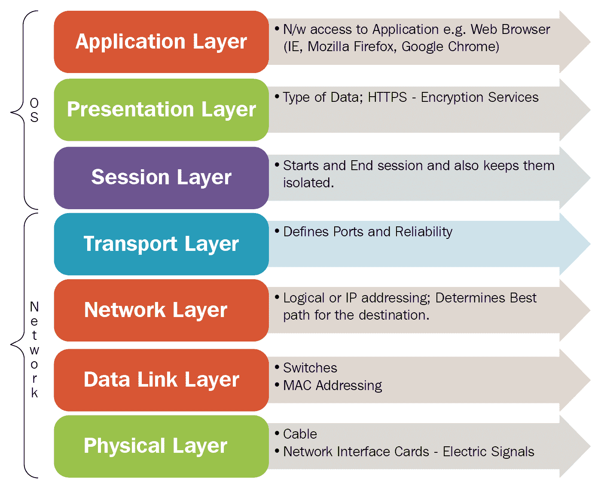
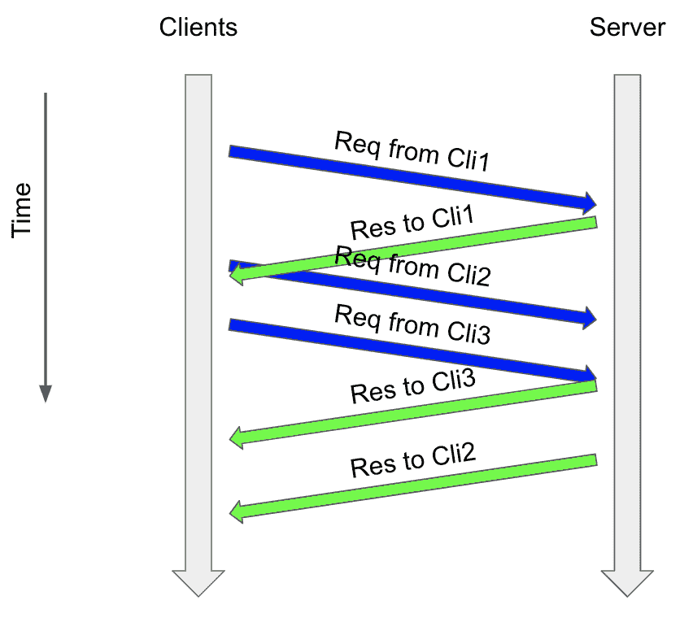
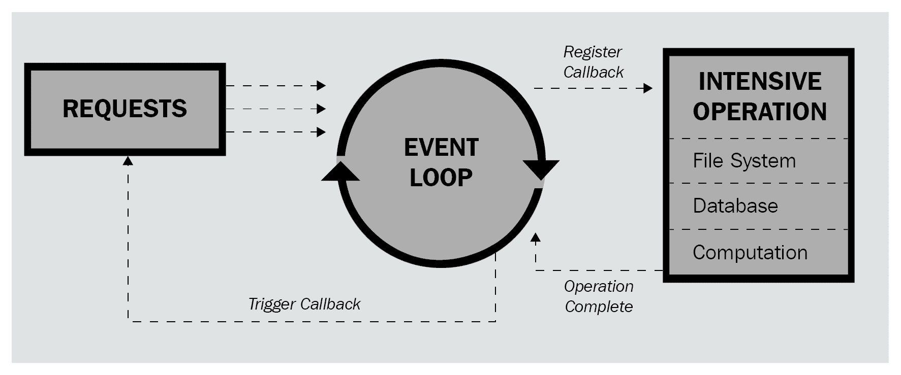
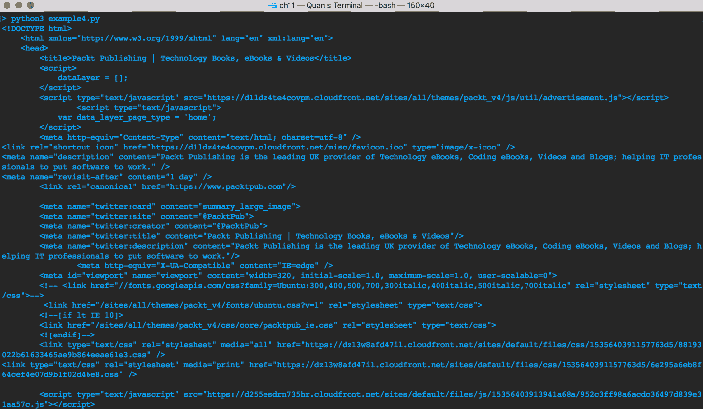

# 第十一章：使用 asyncio 构建通信渠道

通信渠道是计算机科学领域中应用并发性的重要组成部分。在本章中，我们将介绍传输的基本理论，这些理论是由`asyncio`模块提供的类，以便抽象各种形式的通信渠道。我们还将介绍 Python 中简单回显服务器-客户端逻辑的实现，以进一步说明`asyncio`和通信系统中并发性的使用。这个例子的代码将成为本书后面出现的一个高级例子的基础。

本章将涵盖以下主题：

+   通信渠道的基础知识以及将异步编程应用于它们

+   如何使用`asyncio`和`aiohttp`在 Python 中构建异步服务器

+   如何异步地向多个服务器发出请求，并处理异步文件的读取和写入

# 技术要求

以下是本章的先决条件列表：

+   确保您的计算机上已安装 Python 3

+   确保您的计算机上已安装 Telnet

+   确保您已经在您的 Python 3 发行版中安装了 Python 模块`aiohttp`

+   在[`github.com/PacktPublishing/Mastering-Concurrency-in-Python`](https://github.com/PacktPublishing/Mastering-Concurrency-in-Python)下载 GitHub 存储库

+   在本章中，我们将使用名为`Chapter11`的子文件夹

+   查看以下视频以查看代码的实际操作：[`bit.ly/2FMwKL8`](http://bit.ly/2FMwKL8)

# 通信渠道的生态系统

通信渠道用于表示不同系统之间的物理接线连接和促进计算机网络的逻辑数据通信。在本章中，我们只关注后者，因为这是与计算相关的问题，更与异步编程的概念相关。在本节中，我们将讨论通信渠道的一般结构，以及该结构中与异步编程特别相关的两个特定元素。

# 通信协议层

大多数通过通信渠道进行的数据传输过程都是通过**开放系统互连**（**OSI**）模型协议层来实现的。OSI 模型规定了系统间通信过程中的主要层和主题。

以下图表显示了 OSI 模型的一般结构：



OSI 模型结构

如前图所示，数据传输过程中有七个主要的通信层，具有不同程度的计算级别。我们不会详细介绍每个层的目的和具体功能，但重要的是您要理解媒体和主机层背后的一般思想。

底层的三个层包含与通信渠道的底层操作相当相关的操作。物理和数据链路层的操作包括编码方案、访问方案、低级错误检测和纠正、位同步等。这些操作用于在传输数据之前实现和指定数据的处理和准备逻辑。另一方面，网络层处理从一个系统（例如服务器）到另一个系统（例如客户端）的数据包转发，通过确定接收者的地址和数据传输路径。

另一方面，顶层处理高级数据通信和操作。在这些层中，我们将专注于传输层，因为它直接被`asyncio`模块用于实现通信渠道。这一层通常被视为媒体层和主机层（例如客户端和服务器）之间的概念性过渡，负责在不同系统之间的端到端连接中发送数据。此外，由于数据包（由网络层准备）可能在传输过程中由于网络错误而丢失或损坏，传输层还负责通过错误检测代码中的方法检测这些错误。

其他主机层实现处理、解释和提供来自另一个系统发送的数据的机制。在从传输层接收数据后，会话层处理身份验证、授权和会话恢复过程。表示层然后将相同的数据进行翻译并重新组织成可解释的表示形式。最后，应用层以用户友好的格式显示数据。

# 通信渠道的异步编程

鉴于异步编程的性质，编程模型可以提供与有效促进通信渠道的过程相辅相成的功能，这并不奇怪。以 HTTP 通信为例，服务器可以异步处理多个客户端；当它在等待特定客户端发出 HTTP 请求时，它可以切换到另一个客户端并处理该客户端的请求。同样，如果客户端需要向多个服务器发出 HTTP 请求，并且必须等待某些服务器的大型响应，它可以处理更轻量级的响应，这些响应已经被处理并首先发送回客户端。以下图表显示了服务器和客户端在 HTTP 请求中如何异步地相互交互：



异步交错的 HTTP 请求

# 在 asyncio 中的传输和协议

`asyncio`模块提供了许多不同的传输类。实质上，这些类是在前一节讨论的传输层功能的实现。您已经知道传输层在通信渠道中发挥着重要作用；因此，传输类给`asyncio`（因此也给开发人员）更多控制权，以实现我们自己的通信渠道的过程。

`asyncio`模块将传输的抽象与异步程序的实现结合在一起。特别是，尽管传输是通信渠道的核心元素，但为了利用传输类和其他相关的通信渠道工具，我们需要初始化和调用事件循环，这是`asyncio.AbstractEventLoop`类的一个实例。事件循环本身将创建传输并管理低级通信过程。

重要的是要注意，在`asyncio`中建立的通信渠道中，`transport`对象始终与`asyncio.Protocol`类的实例相关联。正如其名称所示，`Protocol`类指定了通信渠道使用的基础协议；对于与另一个系统建立的每个连接，将创建此类的新协议对象。在与`transport`对象密切合作时，协议对象可以从`transport`对象调用各种方法；这是我们可以实现通信渠道的具体内部工作的地方。

因此，通常在构建连接通道时，我们需要专注于实现`asyncio.Protocol`子类及其方法。换句话说，我们使用`asyncio.Protocol`作为父类来派生一个满足通信通道需求的子类。为此，我们在自定义协议子类中覆盖`asyncio.Protocol`基类中的以下方法：

+   `Protocol.connection_made(transport)`: 每当来自另一个系统的连接建立时，将自动调用此方法。`transport`参数保存与连接相关联的`transport`对象。同样，每个`transport`都需要与协议配对；我们通常将此`transport`对象作为特定协议对象的属性存储在`connection_made()`方法中。

+   `Protocol.data_received(data)`: 每当我们连接的系统发送其数据时，将自动调用此方法。请注意，`data`参数中保存的发送信息通常以字节表示，因此在进一步处理`data`之前应使用 Python 的`encode()`函数。

接下来，让我们考虑来自`asyncio`传输类的重要方法。所有传输类都继承自一个名为`asyncio.BaseTransport`的父传输类，对于该类，我们有以下常用方法：

+   `BaseTransport.get_extra_info()`: 此方法返回调用的`transport`对象的额外通道特定信息，正如其名称所示。结果可以包括有关与该传输相关联的套接字、管道和子进程的信息。在本章后面，我们将调用`BaseTransport.get_extra_info('peername')`，以获取传输的远程地址。

+   `BaseTransport.close()`: 此方法用于关闭调用的`transport`对象，之后不同系统之间的连接将被停止。传输的相应协议将自动调用其`connection_lost()`方法。

在许多传输类的实现中，我们将专注于`asyncio.WriteTransport`类，它再次继承自`BaseTransport`类的方法，并且还实现了其他用于实现仅写传输功能的方法。在这里，我们将使用`WriteTransport.write()`方法，该方法将写入我们希望通过`transport`对象与另一个系统通信的数据。作为`asyncio`模块的一部分，此方法不是阻塞函数；相反，它以异步方式缓冲并发送已写入的数据。

# `asyncio`服务器客户端的大局观

您已经了解到异步编程，特别是`asyncio`，可以显著改善通信通道的执行。您还看到了在实现异步通信通道时需要使用的特定方法。在我们深入研究 Python 中的一个工作示例之前，让我们简要讨论一下我们试图实现的大局观，或者换句话说，我们程序的一般结构。

正如前面提到的，我们需要实现`asyncio.Protocol`的子类来指定通信通道的基本组织。同样，在每个异步程序的核心都有一个事件循环，因此我们还需要在协议类的上下文之外创建一个服务器，并在程序的事件循环中启动该服务器。这个过程将设置整个服务器的异步架构，并且可以通过`asyncio.create_server()`方法来完成，我们将在接下来的示例中进行讨论。

最后，我们将使用`AbstractEventLoop.run_forever()`方法永久运行我们异步程序的事件循环。与实际的服务器类似，我们希望保持服务器运行，直到遇到问题，然后我们将优雅地关闭服务器。以下图表说明了整个过程：



通信通道中的异步程序结构

# Python 示例

现在，让我们看一个具体的 Python 示例，实现了一个促进异步通信的服务器。从 GitHub 页面（[`github.com/PacktPublishing/Mastering-Concurrency-in-Python`](https://github.com/PacktPublishing/Mastering-Concurrency-in-Python)）下载本书的代码，并转到`Chapter11`文件夹。

# 启动服务器

在`Chapter11/example1.py`文件中，让我们来看一下`EchoServerClientProtocol`类，如下所示：

```py
# Chapter11/example1.py

import asyncio

class EchoServerClientProtocol(asyncio.Protocol):
    def connection_made(self, transport):
        peername = transport.get_extra_info('peername')
        print('Connection from {}'.format(peername))
        self.transport = transport

    def data_received(self, data):
        message = data.decode()
        print('Data received: {!r}'.format(message))
```

在这里，我们的`EchoServerClientProtocol`类是`asyncio.Protocol`的子类。正如我们之前讨论的那样，在这个类的内部，我们需要实现`connection_made(transport)`和`data_received(data)`方法。在`connection_made()`方法中，我们简单地通过`get_extra_info()`方法（使用`'peername'`参数）获取连接系统的地址，打印出带有该信息的消息，并最终将`transport`对象存储在类的属性中。为了在`data_received()`方法中打印出类似的消息，我们再次使用`decode()`方法从字节数据中获取一个字符串对象。

让我们继续看一下我们脚本的主程序，如下所示：

```py
# Chapter11/example1.py

loop = asyncio.get_event_loop()
coro = loop.create_server(EchoServerClientProtocol, '127.0.0.1', 8888)
server = loop.run_until_complete(coro)

# Serve requests until Ctrl+C is pressed
print('Serving on {}'.format(server.sockets[0].getsockname()))
try:
    loop.run_forever()
except KeyboardInterrupt:
    pass

# Close the server
server.close()
loop.run_until_complete(server.wait_closed())
loop.close()
```

我们使用熟悉的`asyncio.get_event_loop()`函数为我们的异步程序创建一个事件循环。然后，我们通过让该事件循环调用`create_server()`方法来为我们的通信创建一个服务器；这个方法接受`asyncio.Protocol`类的子类、服务器的地址（在本例中是本地主机：`127.0.0.1`）以及该地址的端口（通常为`8888`）。

请注意，这个方法并不会创建服务器本身；它只会异步地启动创建服务器的过程，并返回一个完成该过程的协程。因此，我们需要将该方法返回的协程存储在一个变量中（在我们的例子中是`coro`），并让我们的事件循环运行该协程。在使用服务器对象的`sockets`属性打印出一条消息之后，我们将事件循环永远运行，以保持服务器运行，除非出现`KeyboardInterrupt`异常。

最后，在我们的程序结束时，我们将处理脚本的清理部分，即优雅地关闭服务器。这通常是通过让服务器对象调用`close()`方法（启动服务器关闭过程）并使用事件循环在服务器对象上运行`wait_closed()`方法来完成的，以确保服务器正确关闭。最后，我们关闭事件循环。

# 安装 Telnet

在运行我们的示例 Python 程序之前，我们必须安装 Telnet 程序，以便正确模拟客户端和服务器之间的连接通道。Telnet 是一个提供终端命令的程序，用于促进双向交互式的文本通信协议。如果您的计算机上已经安装了 Telnet，只需跳过下一节；否则，请在本节中找到适合您系统的信息。

在 Windows 系统中，Telnet 已经安装，但可能未启用。要启用它，您可以使用“打开或关闭 Windows 功能”窗口，并确保 Telnet 客户端框被选中，或者运行以下命令：

```py
dism /online /Enable-Feature /FeatureName:TelnetClient
```

Linux 系统通常预装了 Telnet，因此如果您拥有 Linux 系统，只需继续下一节。

在 macOS 系统中，Telnet 可能已经安装在您的计算机上。如果没有，您需要通过软件包管理软件 Homebrew 进行安装，如下所示：

```py
brew install telnet
```

请注意，macOS 系统确实有一个预安装的 Telnet 替代品，称为 Netcat。如果您不希望在 macOS 计算机上安装 Telnet，只需在以下示例中使用`nc`命令而不是`telnet`，即可实现相同的效果。

# 模拟连接通道

运行以下服务器示例有多个步骤。首先，我们需要运行脚本以启动服务器，从中您将获得以下输出：

```py
> python example1.py
Serving on ('127.0.0.1', 8888)
```

请注意，程序将一直运行，直到您调用*Ctrl* + *C*键组合。在一个终端（这是我们的服务器终端）中仍在运行程序的情况下，打开另一个终端并连接到指定端口（`8888`）的服务器（`127.0.0.1`）；这将作为我们的客户端终端：

```py
telnet 127.0.0.1 8888
```

现在，您将在服务器和客户端终端中看到一些变化。很可能，您的客户端终端将有以下输出：

```py
> telnet 127.0.0.1 8888
Trying 127.0.0.1...
Connected to localhost.
```

这是 Telnet 程序的界面，它表示我们已成功连接到本地服务器。更有趣的输出在我们的服务器终端上，它将类似于以下内容：

```py
> python example1.py
Serving on ('127.0.0.1', 8888)
Connection from ('127.0.0.1', 60332)
```

请记住，这是我们在`EchoServerClientProtocol`类中实现的信息消息，具体在`connection_made()`方法中。同样，当服务器与新客户端之间建立连接时，将自动调用此方法，以启动通信。从输出消息中，我们知道客户端正在从服务器`127.0.0.1`的端口`60332`发出请求（与运行服务器相同，因为它们都是本地的）。

我们在`EchoServerClientProtocol`类中实现的另一个功能是在`data_received()`方法中。具体来说，我们打印从客户端发送的解码数据。要模拟这种类型的通信，只需在客户端终端中输入一条消息，然后按*Return*（对于 Windows，按*Enter*）键。您将不会在客户端终端输出中看到任何更改，但服务器终端应该打印出一条消息，如我们协议类的`data_received()`方法中指定的那样。

例如，当我从客户端终端发送消息`Hello, World!`时，以下是我的服务器终端输出：

```py
> python example1.py
Serving on ('127.0.0.1', 8888)
Connection from ('127.0.0.1', 60332)
Data received: 'Hello, World!\r\n'
```

`\r`和`\n`字符只是消息字符串中包含的返回字符。使用我们当前的协议，您可以向服务器发送多条消息，甚至可以让多个客户端向服务器发送消息。要实现这一点，只需打开另一个终端并再次连接到本地服务器。您将从服务器终端看到，不同的客户端（来自不同的端口）已连接到服务器，而服务器与旧客户端的原始通信仍在维持。这是异步编程实现的另一个结果，允许多个客户端与同一服务器无缝通信，而无需使用线程或多进程。

# 将消息发送回客户端

因此，在我们当前的示例中，我们能够使我们的异步服务器接收、读取和处理来自客户端的消息。但是，为了使我们的通信渠道有用，我们还希望从服务器向客户端发送消息。在本节中，我们将更新我们的服务器到一个回显服务器，根据定义，它将发送从特定客户端接收到的任何和所有数据回到客户端。

为此，我们将使用`asyncio.WriteTransport`类的`write()`方法。请查看`EchoServerClientProtocol`类的`data_received()`方法中的`Chapter11/example2.py`文件，如下所示：

```py
# Chapter11/example2.py

import asyncio

class EchoServerClientProtocol(asyncio.Protocol):
    def connection_made(self, transport):
        peername = transport.get_extra_info('peername')
        print('Connection from {}'.format(peername))
        self.transport = transport

    def data_received(self, data):
        message = data.decode()
        print('Data received: {!r}'.format(message))

        self.transport.write(('Echoed back: {}'.format(message)).encode())

loop = asyncio.get_event_loop()
coro = loop.create_server(EchoServerClientProtocol, '127.0.0.1', 8888)
server = loop.run_until_complete(coro)

# Serve requests until Ctrl+C is pressed
print('Serving on {}'.format(server.sockets[0].getsockname()))
try:
    loop.run_forever()
except KeyboardInterrupt:
    pass

# Close the server
server.close()
loop.run_until_complete(server.wait_closed())
loop.close()
```

在从`transport`对象接收数据并将其打印出来后，我们向`transport`对象写入相应的消息，该消息将返回给原始客户端。通过运行`Chapter11/example2.py`脚本，并模拟上一个例子中使用 Telnet 或 Netcat 实现的相同通信，您会发现在客户端终端输入消息后，客户端会收到服务器的回显消息。在启动通信通道并输入`Hello, World!`消息后，以下是我的输出：

```py
> telnet 127.0.0.1 8888
Trying 127.0.0.1...
Connected to localhost.
Hello, World!
Echoed back: Hello, World!
```

本质上，这个例子说明了通过自定义的`asyncio.Protocol`类，我们可以实现双向通信通道的能力。在运行服务器时，我们可以获取从连接到服务器的各个客户端发送的数据，处理数据，最终将所需的结果发送回适当的客户端。

# 关闭传输

有时，我们会希望强制关闭通信通道中的传输。例如，即使使用异步编程和其他形式的并发，您的服务器可能会因来自多个客户端的不断通信而不堪重负。另一方面，当服务器达到最大容量时，完全处理一些发送的请求并明确拒绝其余请求是不可取的。

因此，我们可以在服务器上为每个连接指定在成功通信后关闭连接，而不是为每个连接保持通信开放。我们将通过使用`BaseTransport.close()`方法来强制关闭调用的`transport`对象，从而停止服务器和特定客户端之间的连接。同样，我们将修改`Chapter11/example3.py`中`EchoServerClientProtocol`类的`data_received()`方法如下：

```py
# Chapter11/example3.py

import asyncio

class EchoServerClientProtocol(asyncio.Protocol):
    def connection_made(self, transport):
        peername = transport.get_extra_info('peername')
        print('Connection from {}'.format(peername))
        self.transport = transport

    def data_received(self, data):
        message = data.decode()
        print('Data received: {!r}'.format(message))

        self.transport.write(('Echoed back: {}'.format(message)).encode())

        print('Close the client socket')
        self.transport.close()

loop = asyncio.get_event_loop()
coro = loop.create_server(EchoServerClientProtocol, '127.0.0.1', 8888)
server = loop.run_until_complete(coro)

# Serve requests until Ctrl+C is pressed
print('Serving on {}'.format(server.sockets[0].getsockname()))
try:
    loop.run_forever()
except KeyboardInterrupt:
    pass

# Close the server
server.close()
loop.run_until_complete(server.wait_closed())
loop.close()
```

运行脚本，尝试连接到指定的服务器，并输入一些消息，以查看我们实现的更改。使用我们当前的设置，客户端连接并向服务器发送消息后，将收到回显消息，并且其与服务器的连接将被关闭。以下是我在使用当前协议模拟此过程后获得的输出（同样来自 Telnet 程序的界面）：

```py
> telnet 127.0.0.1 8888
Trying 127.0.0.1...
Connected to localhost.
Hello, World!
Echoed back: Hello, World!
Connection closed by foreign host.
```

# 使用 aiohttp 进行客户端通信

在之前的章节中，我们涵盖了使用`asyncio`模块实现异步通信通道的示例，主要是从通信过程的服务器端的角度。换句话说，我们一直在考虑处理和处理来自外部系统的请求。然而，这只是方程式的一面，我们还有客户端通信的另一面要探索。在本节中，我们将讨论应用异步编程来向服务器发出请求。

正如您可能已经猜到的那样，这个过程的最终目标是通过异步向这些系统发出请求，有效地从外部系统中收集数据。我们将重新讨论网络爬虫的概念，即自动化对各种网站进行 HTTP 请求并从其 HTML 源代码中提取特定信息的过程。如果您尚未阅读第五章，*并发网络请求*，我强烈建议在继续本节之前阅读该章，因为该章涵盖了网络爬虫的基本思想和其他相关重要概念。

在本节中，您还将了解另一个支持异步编程选项的模块：`aiohttp`（代表**异步 I/O HTTP**）。该模块提供了简化 HTTP 通信过程的高级功能，并且与`asyncio`模块无缝配合，以便进行异步编程。

# 安装 aiohttp 和 aiofiles

`aiohttp`模块不会预装在您的 Python 发行版中；然而，类似于其他包，您可以通过使用`pip`或`conda`命令轻松安装该模块。我们还将安装另一个模块`aiofiles`，它可以促进异步文件写入。如果您使用`pip`作为您的包管理器，只需运行以下命令：

```py
pip install aiohttp
pip install aiofiles
```

如果您想使用 Anaconda，请运行以下命令：

```py
conda install aiohttp
conda install aiofiles
```

始终要确认您已成功安装了一个包，打开您的 Python 解释器并尝试导入模块。在这种情况下，运行以下代码：

```py
>>> import aiohttp
>>> import aiofiles
```

如果包已成功安装，将不会出现错误消息。

# 获取网站的 HTML 代码

首先，让我们看一下如何使用`aiohttp`从单个网站发出请求并获取 HTML 源代码。请注意，即使只有一个任务（一个网站），我们的应用程序仍然是异步的，并且异步程序的结构仍然需要实现。现在，导航到`Chapter11/example4.py`文件，如下所示：

```py
# Chapter11/example4.py

import aiohttp
import asyncio

async def get_html(session, url):
    async with session.get(url, ssl=False) as res:
        return await res.text()

async def main():
    async with aiohttp.ClientSession() as session:
        html = await get_html(session, 'http://packtpub.com')
        print(html)

loop = asyncio.get_event_loop()
loop.run_until_complete(main())
```

首先考虑`main()`协程。我们在上下文管理器中初始化了一个`aiohttp.ClientSession`类的实例；请注意，我们还在这个声明前面加上了`async`关键字，因为整个上下文块本身也将被视为一个协程。在这个块内部，我们调用并等待`get_html()`协程进行处理和返回。

将注意力转向`get_html()`协程，我们可以看到它接受一个会话对象和一个要从中提取 HTML 源代码的网站的 URL。在这个函数内部，我们另外使用了一个异步上下文管理器，用于发出`GET`请求并将来自服务器的响应存储到`res`变量中。最后，我们返回存储在响应中的 HTML 源代码；由于响应是从`aiohttp.ClientSession`类返回的对象，其方法是异步函数，因此在调用`text()`函数时需要指定`await`关键字。

当您运行程序时，将打印出 Packt 网站的整个 HTML 源代码。例如，以下是我的输出的一部分：



来自 aiohttp 的 HTML 源代码

# 异步写文件

大多数情况下，我们希望通过向多个网站发出请求来收集数据，并且简单地打印出响应的 HTML 代码是不合适的（出于许多原因）；相反，我们希望将返回的 HTML 代码写入输出文件。实质上，这个过程是异步下载，也是流行的下载管理器的底层架构中实现的。为此，我们将使用`aiofiles`模块，结合`aiohttp`和`asyncio`。

导航到`Chapter11/example5.py`文件。首先，我们将看一下`download_html()`协程，如下所示：

```py
# Chapter11/example5.py

async def download_html(session, url):
    async with session.get(url, ssl=False) as res:
        filename = f'output/{os.path.basename(url)}.html'

        async with aiofiles.open(filename, 'wb') as f:
            while True:
                chunk = await res.content.read(1024)
                if not chunk:
                    break
                await f.write(chunk)

        return await res.release()
```

这是上一个示例中`get_html()`协程的更新版本。现在，我们不再使用`aiohttp.ClientSession`实例来发出`GET`请求并打印返回的 HTML 代码，而是使用`aiofiles`模块将 HTML 代码写入文件。例如，为了便于异步文件写入，我们使用`aiofiles`的异步`open()`函数来在上下文管理器中读取文件。此外，我们使用`read()`函数以异步方式按块读取返回的 HTML，使用响应对象的`content`属性；这意味着在读取当前响应的`1024`字节后，执行流将被释放回事件循环，并且将发生任务切换事件。

这个示例的`main()`协程和主程序与我们上一个示例中的相对相同：

```py
async def main(url):
    async with aiohttp.ClientSession() as session:
        await download_html(session, url)

urls = [
    'http://packtpub.com',
    'http://python.org',
    'http://docs.python.org/3/library/asyncio',
    'http://aiohttp.readthedocs.io',
    'http://google.com'
]

loop = asyncio.get_event_loop()
loop.run_until_complete(
    asyncio.gather(*(main(url) for url in urls))
)
```

`main()`协程接收一个 URL，并将其传递给`download_html()`协程，同时传入一个`aiohttp.ClientSession`实例。最后，在我们的主程序中，我们创建一个事件循环，并将指定的 URL 列表中的每个项目传递给`main()`协程。运行程序后，输出应该类似于以下内容，尽管运行程序所需的时间可能会有所不同：

```py
> python3 example5.py
Took 0.72 seconds.
```

此外，在`Chapter11`文件夹内会有一个名为`output`的子文件夹，其中将填充我们 URL 列表中每个网站的下载 HTML 代码。同样，这些文件是通过`aiofiles`模块的功能异步创建和写入的，这是我们之前讨论过的。如您所见，为了比较这个程序及其对应的同步版本的速度，我们还在跟踪整个程序运行所需的时间。

现在，转到`Chapter11/example6.py`文件。这个脚本包含了我们当前程序的同步版本的代码。具体来说，它按顺序对各个网站进行 HTTP `GET`请求，并且文件写入的过程也是按顺序实现的。这个脚本产生了以下输出：

```py
> python3 example6.py
Took 1.47 seconds.
```

尽管它达到了相同的结果（下载 HTML 代码并将其写入文件），但我们的顺序程序花费的时间明显比其异步对应版本多得多。

# 总结

数据传输过程中有七个主要的通信层，具有不同程度的计算级别。媒体层包含与通信通道的底层过程交互的相当低级别的操作，而主机层处理高级数据通信和操作。在这七个层中，传输层通常被视为媒体层和主机层之间的概念性过渡，负责在不同系统之间的端到端连接中发送数据。异步编程可以提供补充有效促进通信通道的过程的功能。

在服务器方面，`asyncio`模块将传输的抽象与异步程序的实现结合在一起。具体来说，通过其`BaseTransport`和`BaseProtocol`类，`asyncio`提供了不同的方式来定制通信通道的底层架构。与`aiohttp`模块一起，`asyncio`在客户端通信过程中提供了效率和灵活性。`aiofiles`模块可以与其他两个异步编程模块一起使用，还可以帮助促进异步文件读取和写入。

我们现在已经探讨了并发编程中最重要的三个主题：线程、多进程和异步编程。我们已经展示了它们如何应用于各种编程问题，并在速度上提供了显著的改进。在本书的下一章中，我们将开始讨论并发编程对开发人员和程序员常见的问题，从死锁开始。

# 问题

+   什么是通信通道？它与异步编程有什么联系？

+   OSI 模型协议层有哪两个主要部分？它们各自的目的是什么？

+   传输层是什么？它对通信通道为什么至关重要？

+   `asyncio`如何促进服务器端通信通道的实现？

+   `asyncio`如何促进客户端通信通道的实现？

+   `aiofiles`是什么？

# 进一步阅读

有关更多信息，您可以参考以下链接：

+   *IoT 系统和通信通道*（[bridgera.com/iot-communication-channels/](https://bridgera.com/iot-communication-channels/)），作者：Bridgera

+   *用 Python 自动化无聊的事情：面向完全初学者的实用编程*，No Starch Press，Al. Sweigart

+   *传输和协议*（[docs.python.org/3/library/asyncio-protocol](https://docs.python.org/3/library/asyncio-protocol.html)），Python 文档
