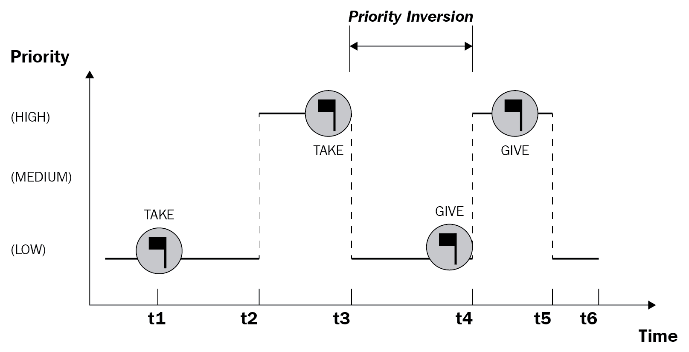
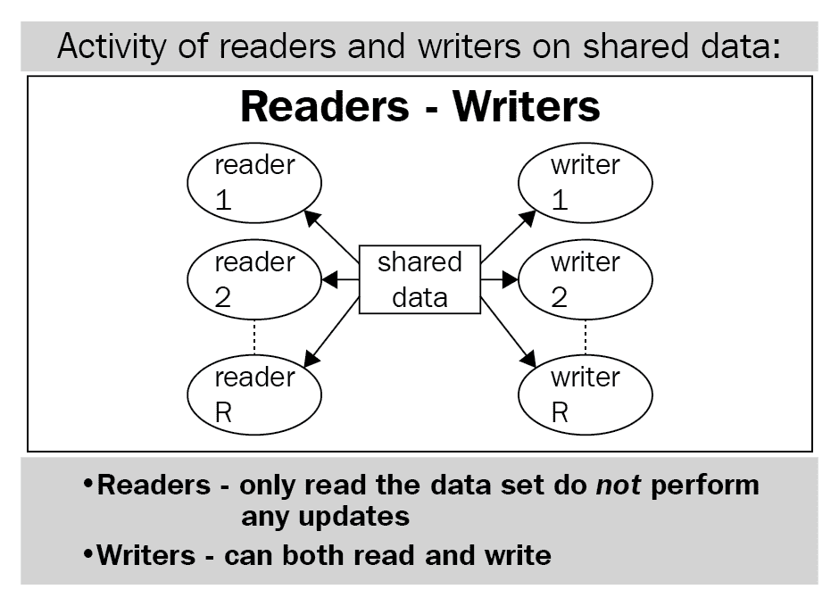

# 第十三章：饥饿

在本章中，我们将讨论并发编程中饥饿的概念及其潜在原因。我们将涵盖一些读者-写者问题，这些问题是饥饿的主要例子，并且我们将在示例 Python 代码中模拟它们。本章还将涵盖死锁和饥饿之间的关系，以及饥饿的一些潜在解决方案。

本章将涵盖以下主题：

+   饥饿背后的基本思想、其根本原因和一些更相关的概念

+   读者-写者问题的详细分析，用于说明并发系统中饥饿的复杂性

# 技术要求

本章的先决条件如下：

+   确保您的计算机上安装了 Python 3

+   在 [`github.com/PacktPublishing/Mastering-Concurrency-in-Python`](https://github.com/PacktPublishing/Mastering-Concurrency-in-Python) 下载 GitHub 存储库

+   在本章中，我们将使用名为`Chapter13`的子文件夹进行工作

+   查看以下视频以查看代码示例： [`bit.ly/2r3caw8`](http://bit.ly/2r3caw8)

# 饥饿的概念

**饥饿**是并发系统中的一个问题，其中一个进程（或线程）无法获得必要的资源以继续执行，因此无法取得任何进展。在本节中，我们将探讨饥饿情况的特征，分析饥饿的最常见原因，并最后考虑一个示例程序，说明饥饿的情况。

# 什么是饥饿？

并发程序通常会在其执行过程中实现不同进程之间的某种排序。例如，考虑一个具有三个独立进程的程序，如下所示：

+   一个负责处理非常紧急的指令，一旦必要的资源可用就需要立即运行

+   另一个进程负责其他重要的执行，这些执行不像第一个进程中的任务那样重要

+   最后一个处理杂项、非常不频繁的任务

此外，这三个进程需要利用相同的资源来执行各自的指令。

直观地，我们有充分理由实施一个规范，允许第一个进程具有最高的执行优先级和资源访问权限，然后是第二个进程，最后是优先级最低的最后一个进程。然而，想象一下，前两个进程（优先级较高）运行得如此频繁，以至于第三个进程无法执行其指令；每当第三个进程需要运行时，它都会检查资源是否可用，并发现其他优先级更高的进程正在使用它们。

这是一个饥饿的情况：第三个进程没有机会执行，因此，该进程无法取得任何进展。在典型的并发程序中，很常见有多于三个不同优先级的进程，然而情况基本相似：一些进程获得更多运行的机会，因此它们不断执行。其他进程优先级较低，无法访问必要的资源来执行。

# 调度

在接下来的几个小节中，我们将讨论导致饥饿情况的潜在原因。大多数情况下，一组调度指令的协调不佳是饥饿的主要原因。例如，处理三个独立任务的相当天真的算法可能会在前两个任务之间实现不断的通信和交互。

这种设置导致算法的执行流程仅在第一和第二个任务之间切换，而第三个任务发现自己处于空闲状态，无法在执行中取得任何进展；在这种情况下，因为它被剥夺了 CPU 的执行流程。直观地，我们可以确定问题的根源在于算法允许前两个任务始终主导 CPU，因此有效地阻止了任何其他任务也利用 CPU。一个良好调度算法的特征是能够平均和适当地分配执行流程和资源。

如前所述，许多并发系统和程序实现了特定的优先级顺序，以进程和线程的执行为基础。这种有序调度的实现很可能会导致低优先级的进程和线程饥饿，并且可能导致一种称为**优先级倒置**的情况。

假设在您的并发程序中，您有最高优先级的进程 A，中等优先级的进程 B，最后是最低优先级的进程 C；进程 C 很可能会陷入饥饿的情况。此外，如果优先级进程 A 的执行取决于已经处于饥饿状态的进程 C 的完成，那么即使在并发程序中给予了最高优先级，进程 A 也可能永远无法完成其执行。

以下图表进一步说明了优先级倒置的概念：一个从时间**t2**到**t3**运行的高优先级任务需要访问一些资源，而这些资源正在被低优先级任务利用：



优先级倒置的图表

再次强调，结合饥饿和优先级倒置可能导致即使高优先级任务也无法执行它们的指令的情况。

# 饥饿的原因

考虑到设计调度算法的复杂性，让我们讨论饥饿的具体原因。我们在前面的部分描述的情况表明了饥饿情况的一些潜在原因。然而，饥饿可能来自多种来源，如下所示：

+   高优先级的进程（或线程）主导着 CPU 的执行流程，因此，低优先级的进程（或线程）没有机会执行它们自己的指令。

+   高优先级的进程（或线程）主导着不可共享资源的使用，因此，低优先级的进程（或线程）没有机会执行它们自己的指令。这种情况类似于第一种情况，但是涉及访问资源的优先级，而不是执行本身的优先级。

+   低优先级的进程（或线程）正在等待资源来执行它们的指令，但是一旦资源变得可用，具有更高优先级的其他进程（或线程）立即获得访问权限，因此低优先级的进程（或线程）将无限等待。

还有其他导致饥饿的原因，但前述是最常见的根本原因。

# 饥饿与死锁的关系

有趣的是，死锁情况也可能导致饥饿，因为饥饿的定义表明，如果有一个进程（或线程）由于无法获得必要的进程而无法取得任何进展，那么该进程（或线程）正在经历饥饿。

回想一下我们的死锁示例，餐桌哲学家问题，如下所示：


餐桌哲学家问题的插图

当死锁发生时，没有哲学家可以获得执行他们指令所需的资源（每个哲学家需要两把叉子才能开始吃饭）。处于死锁状态的每个哲学家也处于饥饿状态。

# 读者-写者问题

读者-写者问题是计算机科学领域中经典和最复杂的例子之一，它展示了并发程序中可能出现的问题。通过分析读者-写者问题的不同变体，我们将更多地了解饥饿问题及其常见原因。我们还将在 Python 中模拟这个问题，以便更深入地理解这个问题。

# 问题陈述

在读者-写者问题中，首先，我们有一个共享资源，大多数情况下是一个文本文件。不同的线程与该文本文件交互；每个线程都是读者或写者。**读者**是一个简单地访问共享资源（文本文件）并读取其中包含的数据的线程，而**写者**是一个访问并可能改变文本文件内容的线程。

我们知道写者和读者不能同时访问共享资源，因为如果一个线程正在向文件写入数据，其他线程就不应该访问文件以从中读取任何数据。因此，读者-写者问题的目标是找到一种正确和高效的方式来设计和协调这些读者和写者线程的调度。成功实现这个目标不仅意味着整个程序以最优化的方式执行，而且所有线程都有足够的机会执行它们的指令，不会发生饥饿。此外，需要适当地处理共享资源（文本文件），以便不会损坏数据。

以下图表进一步说明了读者-写者问题的设置：



读者-写者问题的图表

# 第一个读者-写者问题

正如我们所提到的，这个问题要求我们提出一个调度算法，以便读者和写者可以适当和高效地访问文本文件，而不会错误处理/损坏其中包含的数据。对这个问题的一个天真的解决方案是对文本文件施加锁定，使其成为一个不可共享的资源；这意味着在任何给定时间只有一个线程（无论是读者还是写者）可以访问（并可能操纵）文本文件。

然而，这种方法只是等同于一个顺序程序：如果共享资源一次只能被一个线程使用，不同线程之间的处理时间就不能重叠，实际上，执行变成了顺序的。因此，这不是一个最佳解决方案，因为它没有充分利用并发编程。

关于读者线程的一个见解可以导致对这个问题更优化的解决方案：由于读者只是读取文本文件中的数据而不改变它，可以允许多个读者同时访问文本文件。实际上，即使有多个读者同时从文本文件中获取数据，数据也不会以任何方式改变，因此数据的一致性和准确性得到了维护。

按照这种方法，我们将实现一个规范，其中如果共享资源正在被另一个读者打开进行读取，那么不会让任何读者等待。具体来说，除了对共享资源的锁定，我们还将有一个计数器，用于记录当前正在访问资源的读者数量。如果在程序的任何时刻，该计数器从零增加到一（换句话说，至少有一个读者开始访问资源），我们将锁定资源，使写者无法访问；同样，每当计数器减少到零（换句话说，没有读者请求访问资源），我们将释放对资源的锁定，以便写者可以访问它。

这个规范对读者来说是高效的，因为一旦第一个读者访问了资源并对其进行了锁定，就没有写者可以访问它，而后续的读者在最后一个读者完成对资源的阅读之前不必重新对其进行锁定。

让我们尝试在 Python 中实现这个解决方案。如果你已经从 GitHub 页面下载了本书的代码，请前往`Chapter13`文件夹。让我们看一下`Chapter13/example1.py`文件；具体来说，是`writer()`和`reader()`函数，如下所示：

```py
# Chapter13/example1.py

def writer():
    global text

    while True:
        with resource:
            print(f'Writing being done by 
                   {threading.current_thread().name}.')
            text += f'Writing was done by 
                    {threading.current_thread().name}. '

def reader():
    global rcount

    while True:
        with rcounter:
            rcount += 1
            if rcount == 1:
                resource.acquire()

        print(f'Reading being done by 
               {threading.current_thread().name}:')
        print(text)

        with rcounter:
            rcount -= 1
            if rcount == 0:
                resource.release()
```

在前面的脚本中，`writer()`函数由`threading.Thread`实例（换句话说，一个单独的线程）调用，指定了我们之前讨论的写者线程的逻辑：访问共享资源（在本例中是全局变量`text`，它只是一个 Python 字符串）并向资源写入一些数据。请注意，我们将所有指令放在一个`while`循环中，以模拟应用程序的不断性质（写者和读者不断尝试访问共享资源）。

我们还可以在`reader()`函数中看到读者逻辑。在请求访问共享资源之前，每个读者都会增加一个当前活动并试图访问资源的读者数量的计数器。类似地，在从文件中读取数据后，每个读者都需要减少读者的数量。在这个过程中，如果一个读者是第一个访问文件的读者（换句话说，当计数器为 1 时），它将对文件进行锁定，以便没有写者可以访问它；相反，当一个读者是最后一个读者读取文件时，它必须释放该锁。

关于读者计数器的处理，你可能已经注意到我们在增加/减少计数器变量（`rcount`）时使用了一个名为`rcounter`的锁对象。这是一种方法，用来避免计数器变量的竞争条件，这是另一个常见的并发相关问题；具体来说，没有锁定，多个线程可以同时访问和修改计数器变量，但确保数据的完整性的唯一方法是按顺序处理这个计数器变量。我们将在下一章更详细地讨论竞争条件（以及用于避免它们的实践）。

回到我们当前的脚本，在主程序中，我们将设置`text`变量，读者计数器和两个锁对象（分别用于读者计数器和共享资源）。我们还初始化并启动了三个读者线程和两个写者线程，如下所示：

```py
# Chapter13/example1.py

text = 'This is some text. '
rcount = 0

rcounter = threading.Lock()
resource = threading.Lock()

threads = [threading.Thread(target=reader) for i in range(3)] + [threading.Thread(target=writer) for i in range(2)]

for thread in threads:
    thread.start()
```

重要的是要注意，由于读者和写者线程的指令都包裹在`while`循环中，因此当启动脚本时，它将无限运行。在产生足够的输出以观察程序的一般行为后，应在大约 3-4 秒后取消 Python 执行。

在运行脚本后，以下代码显示了我获得的输出的前几行：

```py
> python3 example1.py
Reading being done by Thread-1:
This is some text. 
Reading being done by Thread-2:
Reading being done by Thread-1:
This is some text. 
This is some text. 
Reading being done by Thread-2:
Reading being done by Thread-1:
This is some text. 
This is some text. 
Reading being done by Thread-3:
Reading being done by Thread-1:
This is some text. 
This is some text. 
...
```

正如你所看到的，在前面的输出中有一个特定的模式：所有访问共享资源的线程都是读者。实际上，在我整个输出中，没有写者能够访问文件，因此`text`变量只包含初始字符串`This is some text.`，并且没有以任何方式进行修改。你获得的输出也应该具有相同的模式（共享资源未被修改）。

在这种情况下，写者们正在经历饥饿，因为他们都无法访问和使用资源。这是我们调度算法的直接结果；由于允许多个读者同时访问文本文件，如果有多个读者频繁访问文本文件，将会创建一个连续的读者流通过文本文件，不给写者尝试访问文件留下空间。

这种调度算法无意中给了读者优先于写者，因此被称为**读者优先**。因此，这种设计是不可取的。

# 第二个读者-写者问题

第一个方法的问题在于，当一个读者正在访问文本文件并且一个写者正在等待文件被解锁时，如果另一个读者开始执行并且想要访问文件，它将优先于已经等待的写者。此外，如果越来越多的读者继续请求访问文件，写者将无限等待，这就是我们在第一个代码示例中观察到的情况。

为了解决这个问题，我们将实现规范，即一旦写者请求访问文件，就不应该有读者能够插队并在该写者之前访问文件。为此，我们将在程序中添加一个额外的锁对象，以指定是否有写者正在等待文件，因此是否读者线程可以尝试读取文件；我们将称这个锁为`read_try`。

与第一个读者总是锁定文本文件不同，我们现在将等待访问文件的多个写者中的第一个写者锁定`read_try`，以便没有读者可以再次在它之前请求访问的那些写者之前插队。正如我们在读者方面讨论的那样，由于我们正在跟踪等待文本文件的写者数量，我们需要在程序中实现写者数量及其相应的锁的计数器。

`Chapter13/example2.py`文件包含了此实现的代码，如下所示：

```py
# Chapter13/example2.py

import threading

def writer():
    global text
    global wcount

    while True:
        with wcounter:
            wcount += 1
            if wcount == 1:
                read_try.acquire()

        with resource:
            print(f'Writing being done by 
                  {threading.current_thread().name}.')
            text += f'Writing was done by 
                  {threading.current_thread().name}. '

        with wcounter:
            wcount -= 1
            if wcount == 0:
                read_try.release()

def reader():
    global rcount

    while True:
        with read_try:
            with rcounter:
                rcount += 1
                if rcount == 1:
                    resource.acquire()

            print(f'Reading being done by 
                  {threading.current_thread().name}:')
            print(text)

            with rcounter:
                rcount -= 1
                if rcount == 0:
                    resource.release()

text = 'This is some text. '
wcount = 0
rcount = 0

wcounter = threading.Lock()
rcounter = threading.Lock()
resource = threading.Lock()
read_try = threading.Lock()

threads = [threading.Thread(target=reader) for i in range(3)] + 
           [threading.Thread(target=writer) for i in range(2)]

for thread in threads:
    thread.start()
```

与我们对问题的第一个解决方案相比，主程序保持相对不变（除了初始化`read_try`锁、`wcount`计数器及其锁`wcounter`之外），但在我们的`writer()`函数中，一旦有至少一个写者等待访问文件，我们就会锁定`read_try`；当最后一个写者完成执行时，它将释放锁，以便任何等待文件的读者现在可以访问它。

再次，为了查看程序产生的输出，我们将让它运行 3-4 秒，然后取消执行，因为程序否则将永远运行。以下是我通过此脚本获得的输出：

```py
> python3 example2.py
Reading being done by Thread-1:
This is some text. 
Reading being done by Thread-1:
This is some text. 
Writing being done by Thread-4.
Writing being done by Thread-5.
Writing being done by Thread-4.
Writing being done by Thread-4.
Writing being done by Thread-4.
Writing being done by Thread-5.
Writing being done by Thread-4.
...
```

可以观察到，虽然一些读者能够访问文本文件（由我的输出的前四行表示），但一旦写者获得对共享资源的访问权，就再也没有读者能够访问它了。我的输出的其余部分包括有关写入指令的消息：`Writing being done by`等等。与我们在读者-写者问题的第一个解决方案中看到的情况相反，这个解决方案给了写者优先权，因此读者被饿死。因此，这被称为**写者优先**。

写者优先于读者的优先级是由于只有第一个和最后一个写者必须分别获取和释放`read_try`锁，而每个想要访问文本文件的读者都必须单独与该锁对象交互。一旦`read_try`被写者锁定，没有读者甚至可以尝试执行其指令，更不用说尝试访问文本文件了。

有些情况下，如果读者在写者之前初始化并执行（例如，在我们的程序中，读者是前三个元素，写者是线程列表中的最后两个），则一些读者可以访问文本文件。然而，一旦写者能够在执行期间访问文件并获取`read_try`锁，读者很可能会饿死。

这种解决方案也不理想，因为它在我们的程序中给了写者线程更高的优先级。

# 第三个读者-写者问题

你已经看到我们尝试实现的两种解决方案都可能导致饥饿，因为没有给予不同线程相等的优先级；一种可能会使写入者饿死，另一种可能会使读者饿死。这两种方法之间的平衡可能会给我们一个实现，使读者和写者之间具有相等的优先级，从而解决饥饿问题。

回想一下：在我们的第二种方法中，我们在读者尝试访问文本文件时放置了一个锁，要求一旦写者开始等待文件，就不会使其饿死。在这个解决方案中，我们将实现一个锁，该锁也利用这种逻辑，但然后应用于读者和写者。然后，所有线程将受到锁的约束，因此在不同线程之间将实现相等的优先级。

具体来说，这是一个锁，指定在特定时刻是否允许线程访问文本文件；我们将其称为**服务锁**。每个写者或读者在执行任何指令之前都必须尝试获取此服务锁。写者在获得此服务锁后，还将尝试获取资源锁，并立即释放服务锁。然后，写者将执行其写入逻辑，并最终在执行结束时释放资源锁。

让我们看一下`Chapter13/example3.py`文件中我们在 Python 中的实现的`writer()`函数，如下所示：

```py
# Chapter13/example3.py

def writer():
    global text

    while True:
        with service:
            resource.acquire()

        print(f'Writing being done by 
              {threading.current_thread().name}.')
        text += f'Writing was done by 
              {threading.current_thread().name}. '

        resource.release()
```

另一方面，读者也需要首先获取服务锁。由于我们仍然允许多个读者同时访问资源，我们正在实现读者计数器及其相应的锁。

读者将获取服务锁和计数器锁，增加读者计数器（可能锁定资源），然后依次释放服务锁和计数器锁。现在，它将实际从文本文件中读取数据，最后，它将减少读者计数器，并在那时是最后一个读者访问文件时，可能释放资源锁。

`reader()`函数包含以下规范：

```py
# Chapter13/example3.py

def reader():
    global rcount

    while True:
        with service:
            rcounter.acquire()
            rcount += 1
            if rcount == 1:
                resource.acquire()
        rcounter.release()

        print(f'Reading being done by 
              {threading.current_thread().name}:')
        #print(text)

        with rcounter:
            rcount -= 1
            if rcount == 0:
                resource.release()
```

最后，在我们的主程序中，我们初始化文本字符串、读者计数器、所有必要的锁以及读者和写者线程，如下所示：

```py
# Chapter13/example3.py

text = 'This is some text. '
rcount = 0

rcounter = threading.Lock()
resource = threading.Lock()
service = threading.Lock()

threads = [threading.Thread(target=reader) for i in range(3)] + [threading.Thread(target=writer) for i in range(2)]

for thread in threads:
    thread.start()
```

请注意，我们正在对`reader()`函数中打印文本文件当前内容的代码进行注释，以便后续输出更易读。运行程序 3-4 秒，然后取消。以下输出是我在我的个人电脑上获得的：

```py
> python3 example3.py
Reading being done by Thread-3:
Writing being done by Thread-4.
Reading being done by Thread-1:
Writing being done by Thread-5.
Reading being done by Thread-2:
Reading being done by Thread-3:
Writing being done by Thread-4.
...
```

我们当前输出的模式是，读者和写者能够合作和高效地访问共享资源；所有读者和写者都在执行其指令，没有线程被这个调度算法饿死。

请注意，当您在并发程序中处理读者-写者问题时，您不必重新发明我们刚刚讨论的方法。PyPI 实际上有一个名为`readerwriterlock`的外部库，其中包含了 Python 中三种方法的实现，以及对超时的支持。访问[`pypi.org/project/readerwriterlock/`](https://pypi.org/project/readerwriterlock/)了解更多关于该库及其文档的信息。

# 饥饿的解决方案

通过分析不同的读者-写者问题的方法，您已经看到解决饥饿的关键：由于如果某些线程在访问共享资源时没有得到高优先级，它们将会被饿死，因此在所有线程的执行中实施公平性将防止饥饿的发生。在这种情况下，公平性并不要求程序放弃对不同线程施加的任何顺序或优先级；但为了实施公平性，程序需要确保所有线程有足够的机会执行它们的指令。

牢记这个想法，我们可以通过实施以下方法之一（或组合）来解决饥饿问题：

+   **增加低优先级线程的优先级**：就像我们在读者-写者问题的第二种方法中对写者线程和第三种方法中对读者线程所做的那样，优先考虑那些本来没有机会访问共享资源的线程，可以成功地消除饥饿。

+   **先进先出线程队列**：为了确保一个线程在另一个线程之前开始等待共享资源，可以跟踪请求访问的线程，并将其保存在先进先出队列中。

+   **其他方法**：还可以实施几种方法来平衡不同线程的选择频率。例如，一个优先级队列也会逐渐增加等待时间较长的线程的优先级，或者如果一个线程能够多次访问共享资源，它将被给予较低的优先级，依此类推。

解决并发程序中的饥饿问题可能是一个相当复杂和涉及深入理解调度算法的过程，结合对进程和线程如何与共享资源交互的理解在这个过程中是必要的。正如您在读者-写者问题的示例中所看到的，解决饥饿问题可能需要多种实现和不同方法的修订，才能得到一个好的解决方案。

# 总结

饥饿是并发系统中的一个问题，其中一个进程（或线程）无法获得必要的资源来继续执行，因此无法取得任何进展。大多数情况下，调度指令的不良协调是饥饿的主要原因；死锁情况也会导致饥饿。

读者-写者问题是计算机科学领域中经典和最复杂的例子之一，它说明了并发程序中可能出现的问题。通过分析不同的读者-写者问题的方法，您已经了解到如何使用不同的调度算法解决饥饿问题。公平性是一个良好调度算法的重要元素，通过确保优先级在不同进程和线程之间适当分配，可以消除饥饿。

在下一章中，我们将讨论并发编程的三个常见问题中的最后一个：竞争条件。我们将涵盖竞争条件的基本基础和原因，相关概念，以及竞争条件与其他并发相关问题的联系。

# 问题

+   什么是饥饿，为什么在并发程序中是不可取的？

+   饥饿的根本原因是什么？可以从根本原因中产生的饥饿的常见高级原因是什么？

+   死锁和饥饿之间有什么联系？

+   什么是读者-写者问题？

+   读者-写者问题的第一种方法是什么？为什么在那种情况下会出现饥饿？

+   读者-写者问题的第二种方法是什么？为什么在那种情况下会出现饥饿？

+   读者-写者问题的第三种方法是什么？为什么它成功地解决了饥饿问题？

+   饥饿的一些常见解决方案是什么？

# 进一步阅读

+   《使用 Python 进行并行编程》，作者 Jan Palach，Packt Publishing Ltd，2014

+   《Python 并行编程食谱》，作者 Giancarlo Zaccone，Packt Publishing Ltd，2015

+   《饥饿和公平》（tutorials.jenkov.com/java-concurrency/starvation-and-fairness），作者 Jakob Jenkov

+   《读者-写者问题的更快公平解决方案》，V.Popov 和 O.Mazonka
