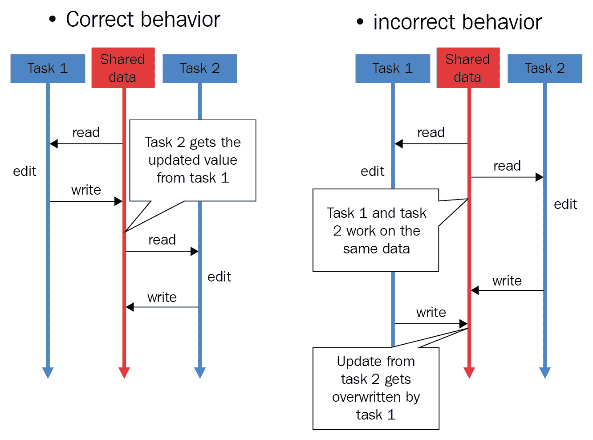

# 第十四章：竞争条件

在本章中，我们将讨论竞争条件的概念及其在并发环境中的潜在原因。还将介绍关键部分的定义，这是与竞争条件和并发编程密切相关的概念。我们将使用 Python 中的一些示例代码来模拟竞争条件以及常用的解决方法。最后，将讨论通常处理竞争条件的现实应用程序。

本章将涵盖以下主题：

+   竞争条件的基本概念，以及它在并发应用程序中的发生方式，以及关键部分的定义

+   Python 中竞争条件的模拟以及如何实现竞争条件解决方案

+   通常与竞争条件交互和处理的现实计算机科学概念

# 技术要求

以下是本章所需的先决条件列表：

+   确保您的计算机上安装了 Python 3

+   在[`github.com/PacktPublishing/Mastering-Concurrency-in-Python`](https://github.com/PacktPublishing/Mastering-Concurrency-in-Python)下载 GitHub 存储库。

+   在本章中，我们将使用名为`Chapter14`的子文件夹进行工作

+   查看以下视频以查看代码的实际操作：[`bit.ly/2AdYWRj`](http://bit.ly/2AdYWRj)

# 竞争条件的概念

竞争条件通常被定义为系统输出不确定并且取决于调度算法和任务调度和执行顺序的现象。当数据在此过程中被错误处理和损坏时，竞争条件就成为系统中的一个错误。鉴于这个问题的性质，竞争条件在强调调度和协调独立任务的并发系统中很常见。

竞争条件可能发生在电子硬件系统和软件应用程序中；在本章中，我们将只讨论软件开发环境中的竞争条件，具体来说是并发软件应用程序。本节将涵盖竞争条件的理论基础及其根本原因以及关键部分的概念。

# 关键部分

关键部分指示并发应用程序中由多个进程或线程访问的共享资源，这可能导致意外甚至错误的行为。我们已经看到有多种方法来保护这些资源中包含的数据的完整性，我们称这些受保护的部分为**关键部分**。

可以想象，当这些关键部分中的数据在并发或并行交互和更改时，可能会被错误处理或损坏。当与之交互的线程和进程协调不当并且调度不当时，这一点尤其明显。因此，逻辑结论是不允许多个代理同时进入关键部分。我们称这个概念为**互斥**。

我们将在下一小节中讨论关键部分与竞争条件的原因之间的关系。

# 竞争条件是如何发生的

让我们考虑一个简单的并发程序，以便了解什么会导致竞争条件。假设程序有一个共享资源和两个单独的线程（线程 1 和线程 2），它们将访问并与该资源交互。具体而言，共享资源是一个数字，并且根据它们各自的执行指令，每个线程都要读取该数字，将其增加 1，最后更新共享资源的值为增加后的数字。

假设共享数字最初为 2，然后线程 1 访问和交互该数字；共享资源随后变为 3。在线程 1 成功更改并退出资源后，线程 2 开始执行其指令，并且共享资源即数字被更新为 4。在整个过程中，数字最初为 2，递增了两次（每次由一个单独的线程），并在结束时保持了一个值为 4。在这种情况下，共享数字没有被错误处理和损坏。

现在想象一种情况，即在开始时共享数字仍为 2，但两个线程同时访问该数字。现在，每个线程都从共享资源中读取数字 2，分别将数字 2 递增为 3，然后将数字 3 写回共享资源。尽管共享资源被线程访问和交互了两次，但在进程结束时它只保持了一个值为 3。

这是并发程序中发生竞争条件的一个例子：因为第二个访问共享资源的线程在第一个线程完成执行之前（换句话说，在将新值写入共享资源之前）就已经这样做，第二个线程未能获取更新的资源值。这导致在第二个线程写入资源时，第一个线程处理和更新的值被覆盖。在两个线程执行结束时，共享资源实际上只被第二个线程更新了。

下面的图表进一步说明了正确数据处理过程和竞争条件情况之间的对比：



处理共享数据不当

直觉上，我们可以看到竞争条件可能导致数据的处理和损坏。在前面的例子中，我们可以看到只有两个单独的线程访问一个共同的资源就可能发生竞争条件，导致共享资源被错误地更新，并在程序结束时保持了一个错误的值。我们知道大多数现实生活中的并发应用程序包含了更多的线程和进程以及更多的共享资源，而与共享资源交互的线程/进程越多，竞争条件发生的可能性就越大。

# 在 Python 中模拟竞争条件

在讨论我们可以实施的解决竞争条件问题的解决方案之前，让我们尝试在 Python 中模拟这个问题。如果您已经从 GitHub 页面下载了本书的代码，请继续导航到`Chapter14`文件夹。让我们看一下`Chapter14/example1.py`文件，特别是`update()`函数，如下所示：

```py
# Chapter14/example1.py

import random
import time

def update():
    global counter

    current_counter = counter # reading in shared resource
    time.sleep(random.randint(0, 1)) # simulating heavy calculations
    counter = current_counter + 1 # updating shared resource
```

前面的`update()`函数的目标是递增一个名为`counter`的全局变量，并且它将被我们脚本中的一个单独的线程调用。在函数内部，我们正在与一个共享资源交互——在这种情况下是`counter`。然后我们将`counter`的值赋给另一个本地变量，称为`current_counter`（这是为了模拟从更复杂的数据结构中读取共享资源的过程）。

接下来，我们将使用`time.sleep()`方法暂停函数的执行。程序暂停的时间长度是通过函数调用`random.randint(0, 1)`伪随机选择的，因此程序要么暂停一秒，要么根本不暂停。最后，我们将新计算出的`current_counter`值（即它的一次递增）赋给原始共享资源（`counter`变量）。

现在，我们可以继续我们的主程序：

```py
# Chapter14/example1.py

import threading

counter = 0

threads = [threading.Thread(target=update) for i in range(20)]

for thread in threads:
    thread.start()
for thread in threads:
    thread.join()

print(f'Final counter: {counter}.')
print('Finished.')
```

在这里，我们正在使用一组`threading.Thread`对象初始化`counter`全局变量，以便并发执行`update()`函数；我们初始化了二十个线程对象，以便共享计数器增加二十次。在启动和加入所有线程后，我们最终可以打印出我们共享的`counter`变量的最终值。

理论上，一个设计良好的并发程序将成功地总共增加共享计数器二十次，而且，由于其原始值为`0`，计数器的最终值应该在程序结束时为`20`。然而，当您运行此脚本时，您得到的`counter`变量很可能不会保持最终值为`20`。以下是我自己运行脚本后得到的输出：

```py
> python3 example1.py
Final counter: 9.
Finished.
```

这个输出表明计数器只成功增加了九次。这是我们并发程序存在的竞争条件的直接结果。当一个特定的线程花时间从共享资源中读取和处理数据（具体来说，使用`time.sleep()`方法一秒钟），另一个线程读取`counter`变量的当前值，此时该值尚未被第一个线程更新，因为它尚未完成执行。

有趣的是，如果一个线程不花时间处理数据（换句话说，当`random.randint()`方法选择`0`时），共享资源的值可能会及时更新，以便下一个线程读取和处理它。这种现象可以通过程序的不同运行中计数器的最终值的变化来说明。例如，以下是我在运行脚本三次后得到的输出。第一次运行的输出如下：

```py
> python3 example1.py
Final counter: 9.
Finished.
```

第二次运行的输出如下：

```py
> python3 example1.py
Final counter: 12.
Finished.
```

第三次运行的输出如下：

```py
> python3 example1.py
Final counter: 5.
Finished.
```

再次，计数器的最终值取决于花一秒暂停的线程数和根本不暂停的线程数。由于这两个数字又取决于`random.randint()`方法，计数器的最终值在程序的不同运行之间会发生变化。我们的程序仍然存在竞争条件，除非我们可以确保计数器的最终值始终为`20`（计数器总共成功增加二十次）。

# 锁作为解决竞争条件的解决方案

在这一部分，我们将讨论竞争条件最常见的解决方案：锁。直觉上，由于我们观察到的竞争条件是在多个线程或进程同时访问和写入共享资源时出现的，解决竞争条件的关键思想是隔离不同线程/进程的执行，特别是在与共享资源交互时。具体来说，我们需要确保一个线程/进程只能在任何其他与资源交互的线程/进程完成其与该资源的交互后才能访问共享资源。

# 锁的有效性

使用锁，我们可以将并发程序中的共享资源转换为临界区，保证其数据的完整性得到保护。临界区保证了共享资源的互斥访问，并且不能被多个进程或线程同时访问；这将防止受保护的数据由于竞争条件而被更新或改变。

在下图中，**线程 B**被互斥锁（mutex）阻止访问共享资源——名为`var`的临界区，因为**线程 A**已经在访问资源：


锁防止对临界区的同时访问

现在，我们将指定，在并发程序中，为了访问临界区，线程或进程需要获取与临界区相关联的锁对象；同样，该线程或进程在离开临界区时也需要释放该锁。这样的设置将有效地防止对临界区的多次访问，因此也将防止竞争条件。以下图表说明了多个线程与多个临界区交互的执行流程，并且实现了锁的设置：


多线程中的锁和临界区

如图表所示，线程**T1**和**T2**都与其各自的执行指令中的三个临界区**CS1**、**CS2**和**CS3**进行交互。在这里，**T1**和**T2**几乎同时尝试访问**CS1**，由于**CS1**受到锁**L1**的保护，因此只有**T1**能够获取锁**L1**，因此可以访问/与临界区交互，而**T2**必须等待**T1**退出临界区并释放锁后才能访问该区域。同样，对于临界区**CS2**和**CS3**，尽管两个线程同时需要访问临界区，但只有一个可以处理，而另一个必须等待获取与临界区相关联的锁。

# Python 中的实现

现在，让我们实现前面示例中的规范，以解决竞争条件的问题。转到`Chapter14/example2.py`文件，并考虑我们已更正的`update()`函数，如下所示：

```py
# Chapter14/example2.py

import random
import time

def update():
    global counter

    with count_lock:
        current_counter = counter # reading in shared resource
        time.sleep(random.randint(0, 1)) # simulating heavy calculations
        counter = current_counter + 1
```

您可以看到，线程在`update()`函数中指定的所有执行指令都在名为`count_lock`的锁对象的上下文管理器下。因此，每次调用线程运行该函数时，都必须首先获取锁对象，然后才能执行任何指令。在我们的主程序中，除了我们已经拥有的内容，我们只需创建锁对象，如下所示：

```py
# Chapter14/example2.py

import threading

counter = 0
count_lock = threading.Lock()

threads = [threading.Thread(target=update) for i in range(20)]

for thread in threads:
    thread.start()
for thread in threads:
    thread.join()

print(f'Final counter: {counter}.')
print('Finished.')
```

运行程序，您的输出应该类似于以下内容：

```py
> python3 example2.py
Final counter: 20.
Finished.
```

您可以看到，计数器成功增加了二十次，并且在程序结束时保持了正确的值。此外，无论脚本执行多少次，计数器的最终值始终为**20**。这是在并发程序中使用锁来实现临界区的优势。

# 锁的缺点

在第十二章中，*死锁*，我们介绍了一个有趣的现象，即使用锁可能会导致不良结果。具体来说，我们发现，在并发程序中实现了足够多的锁后，整个程序可能会变成顺序执行。让我们用当前的程序来分析这个概念。考虑`Chapter14/example3.py`文件，如下所示：

```py
# ch14/example3.py

import threading
import random; random.seed(0)
import time

def update(pause_period):
    global counter

    with count_lock:
        current_counter = counter # reading in shared resource
        time.sleep(pause_period) # simulating heavy calculations
        counter = current_counter + 1 # updating shared resource

pause_periods = [random.randint(0, 1) for i in range(20)]

###########################################################################

counter = 0
count_lock = threading.Lock()

start = time.perf_counter()
for i in range(20):
    update(pause_periods[i])

print('--Sequential version--')
print(f'Final counter: {counter}.')
print(f'Took {time.perf_counter() - start : .2f} seconds.')

###########################################################################

counter = 0

threads = [threading.Thread(target=update, args=(pause_periods[i],)) for i in range(20)]

start = time.perf_counter()
for thread in threads:
    thread.start()
for thread in threads:
    thread.join()

print('--Concurrent version--')
print(f'Final counter: {counter}.')
print(f'Took {time.perf_counter() - start : .2f} seconds.')

###########################################################################

print('Finished.')
```

# 将并发程序变为顺序执行

该脚本的目标是比较当前并发程序与其顺序版本的速度。在这里，我们仍然使用相同的带有锁的`update()`函数，并且我们将它连续运行二十次，既顺序执行又并发执行，就像我们之前做的那样。我们还创建了一个确定的暂停时间列表，以便这些时间段在模拟顺序版本和模拟并发版本时保持一致（因此，`update()`函数现在需要接受一个参数，指定每次调用时的暂停时间）：

```py
pause_periods = [random.randint(0, 1) for i in range(20)]
```

在程序的下一步中，我们只需在`for`循环中调用`update()`函数，进行二十次迭代，并跟踪循环完成所需的时间。请注意，即使这是为了模拟程序的顺序版本，`update()`函数仍然需要在此之前创建锁对象，因此我们在这里进行初始化：

```py
counter = 0
count_lock = threading.Lock()

start = time.perf_counter()
for i in range(20):
    update(pause_periods[i])

print('--Sequential version--')
print(f'Final counter: {counter}.')
print(f'Took {time.perf_counter() - start : .2f} seconds.')
```

最后一步是重置计数器并运行我们已经实现的程序的并发版本。同样，我们需要在初始化运行`update()`函数的每个线程时传入相应的暂停时间。我们还要跟踪并发程序运行所需的时间：

```py
counter = 0

threads = [threading.Thread(target=update, args=(pause_periods[i],)) for i in range(20)]

start = time.perf_counter()
for thread in threads:
    thread.start()
for thread in threads:
    thread.join()

print('--Concurrent version--')
print(f'Final counter: {counter}.')
print(f'Took {time.perf_counter() - start : .2f} seconds.')
```

现在，在您运行脚本之后，您会观察到我们的程序的顺序版本和并发版本都花费了相同的时间来运行。具体来说，我得到的输出是：在这种情况下，它们都花费了大约 12 秒。您的程序实际花费的时间可能不同，但两个版本的速度应该是相等的。

```py
> python3 example3.py
--Sequential version--
Final counter: 20.
Took 12.03 seconds.
--Concurrent version--
Final counter: 20.
Took 12.03 seconds.
Finished.
```

因此，我们的并发程序所花费的时间与其顺序版本一样多，这否定了在程序中实现并发的最大目的之一：提高速度。但为什么具有相同指令和元素集的并发和传统顺序应用程序也具有相同的速度？并发程序是否总是比顺序程序产生更快的速度？

回想一下，在我们的程序中，临界区由一个锁对象保护，没有多个线程可以同时访问它。由于程序的所有执行（对计数器进行 20 次递增）都取决于一个线程访问临界区，因此在临界区放置锁对象意味着在给定时间内只有一个线程可以执行。根据这个规范，任何两个线程的执行都不会重叠，这种并发实现无法获得额外的速度。

这是我们在分析死锁问题时遇到的现象：如果在并发程序中放置了足够多的锁，那么该程序将变得完全顺序化。这就是为什么锁有时不是并发编程问题的理想解决方案的原因。然而，只有当并发程序的所有执行都依赖于与临界区交互时，才会出现这种情况。大多数情况下，读取和操作共享资源的数据只是整个程序的一部分，因此并发仍然可以为我们的程序提供预期的额外速度。

# 锁不会锁任何东西

锁的另一个方面是它们实际上并没有锁住任何东西。锁对象与特定共享资源的交互线程和进程也需要与锁进行交互。换句话说，如果这些线程和进程选择在访问和更改共享资源之前不检查锁，那么锁对象本身就无法阻止它们这样做。

在我们的示例中，您已经看到，为了实现锁对象的获取/释放过程，线程或进程的指令将被锁上下文管理器包裹；这个规范取决于线程/进程执行逻辑的实现，而不是资源。这是因为我们看到的锁对象与它们所应保护的资源没有任何连接。因此，如果线程/进程执行逻辑不需要与共享资源相关联的锁对象进行任何交互，那么该线程或进程可以简单地访问资源而无需困难，可能导致数据的错误操作和损坏。

这不仅适用于在单个并发程序中拥有多个线程和进程的范围。假设我们有一个由多个组件组成的并发系统，所有这些组件都相互作用并操作跨系统共享的资源的数据，并且这个资源与一个锁对象相关联；由此可见，如果其中任何一个组件未能与该锁进行交互，它可以简单地绕过锁实施的保护并访问共享资源。更重要的是，锁的这种特性也对并发程序的安全性有着重要的影响。如果一个外部的恶意代理连接到系统（比如，一个恶意客户端与服务器进行交互）并且意图破坏跨系统共享的数据，那么该代理可以被指示简单地忽略锁对象并以侵入的方式访问数据。

锁不锁任何东西的观点是由雷蒙德·赫廷格（Raymond Hettinger）提出的，他是 Python 核心开发人员，负责实现 Python 并发编程中的各种元素。有人认为仅使用锁对象并不能保证并发数据结构和系统的安全实现。锁需要与它们要保护的资源具体关联起来，没有任何东西应该能够在未先获取与之相关联的锁的情况下访问资源。或者，其他并发同步工具，比如原子消息队列，可以提供解决这个问题的方案。

# 现实生活中的竞争条件

现在你已经了解了竞争条件的概念，它们在并发系统中是如何引起的，以及如何有效地防止它们。在本节中，我们将提供一个关于竞争条件如何在计算机科学的各个子领域中发生的总体观点。具体来说，我们将讨论安全、文件管理和网络的主题。

# 安全

并发编程对系统安全性可能会产生重大影响。回想一下，读取和更改资源数据的过程之间会出现竞争条件；在认证系统中出现竞争条件可能会导致在检查代理的凭据和代理可以利用资源之间数据的损坏。这个问题也被称为**检查时间到使用时间**（TOCTTOU）漏洞，这无疑对安全系统有害。

在处理竞争条件时对共享资源的粗心保护可以为外部代理提供访问那些被认为受到保护的资源的机会。然后这些代理可以改变资源的数据以创建**权限提升**（简单来说，给自己更多非法访问更多共享资源的权限），或者他们可以简单地破坏数据，导致整个系统发生故障。

有趣的是，竞争条件也可以用于实现计算机安全。由于竞争条件是由多个线程/进程对共享资源的不协调访问导致的，竞争条件发生的规范是相当随机的。例如，在我们自己的 Python 示例中，你看到在模拟竞争条件时，计数器的最终值在程序的不同执行之间变化；这部分是因为情况的不可预测性，其中多个线程正在运行并访问共享资源。（我说部分是因为随机性也是由我们在每次执行程序时生成的随机暂停期间导致的。）因此，有时会故意引发竞争条件，并且在竞争条件发生时获得的信息可以用于生成安全流程的数字指纹——这些信息同样是相当随机的，因此对安全目的而言具有价值。

# 操作系统

在操作系统中的文件和内存管理的背景下，竞争条件可能会发生，当两个单独的程序尝试访问相同的资源，如内存空间。想象一种情况，两个来自不同程序的进程已经运行了相当长的时间，尽管它们最初在内存空间方面是分开初始化的，但足够的数据已经积累，一个进程的执行堆栈现在与另一个进程的执行堆栈发生了冲突。这可能导致两个进程共享相同的内存空间部分，并最终导致不可预测的后果。

竞争条件复杂性的另一个方面是由 Unix 版本 7 操作系统中的`mkdir`命令所说明的。通常，`mkdir`命令用于在 Unix 操作系统中创建新目录；这是通过调用`mknod`命令创建实际目录和`chown`命令指定该目录的所有者来完成的。因为有两个单独的命令需要运行，并且第一个命令完成和第二个命令调用之间存在明确的间隙，这可能导致竞争条件。

在两个命令之间的间隙期间，如果有人可以删除`mknod`命令创建的新目录，并将引用链接到另一个文件，当运行`chown`命令时，该文件的所有权将被更改。通过利用这个漏洞，某人理论上可以更改操作系统中任何文件的所有权，以便某人可以创建一个新目录。以下图表进一步说明了这种利用：


`mkdir`竞争条件的图表

# 网络

在网络中，竞争条件可以以在网络中为多个用户提供独特特权的形式出现。具体来说，假设给定服务器应该只有一个用户具有管理员特权。如果两个用户，都有资格成为服务器管理员，同时请求访问这些特权，那么两者都有可能获得该访问权限。这是因为在服务器接收到两个用户请求时，两个用户都还没有被授予管理员特权，服务器认为管理员特权仍然可以分配。

这种形式的竞争条件在网络高度优化以进行并行处理时（例如，非阻塞套接字），而没有仔细考虑网络共享资源时是非常常见的。

# 总结

竞争条件被定义为系统输出不确定的现象，取决于调度算法和任务调度和执行的顺序。临界区指示并发应用程序中由多个进程或线程访问的共享资源，这可能导致意外甚至错误的行为。当两个或多个线程/进程同时访问和更改共享资源时，就会发生竞争条件，导致数据处理不当和损坏。竞争条件在现实生活应用中也有重要影响，如安全性、操作系统和网络。

由于我们观察到的竞争条件是在多个线程或进程同时访问和写入共享资源时出现的，解决竞争条件的关键思想是隔离不同线程/进程的执行，特别是在与共享资源交互时。使用锁，我们可以将并发程序中的共享资源转换为临界区，其数据的完整性得到保护。然而，使用锁也有许多缺点：在并发程序中实现了足够多的锁，整个程序可能变成顺序执行；锁并不真正锁定任何东西。

在下一章中，我们将考虑 Python 并发编程中最大的问题之一：臭名昭著的**全局解释器锁（GIL）**。您将了解 GIL 背后的基本思想，它的目的，以及如何在并发 Python 应用程序中有效地使用它。

# 问题

+   什么是临界区？

+   什么是竞争条件，为什么在并发程序中是不可取的？

+   竞争条件的根本原因是什么？

+   锁如何解决竞争条件的问题？

+   为什么锁有时在并发程序中是不可取的？

+   在现实生活系统和应用中，竞争条件的重要性是什么？

# 进一步阅读

欲了解更多信息，您可以参考以下链接：

+   *使用 Python 进行并行编程*，作者 Jan Palach，Packt Publishing Ltd，2014

+   *Python 并行编程食谱*，作者 Giancarlo Zaccone，Packt Publishing Ltd，2015

+   *竞争条件和临界区*（[tutorials.jenkov.com/java-concurrency/race-conditions-and-critical-sections](http://tutorials.jenkov.com/java-concurrency/race-conditions-and-critical-sections.html)），作者 Jakob Jenkov

+   *竞争条件、文件和安全漏洞；或乌龟和野兔的重现*，作者 Matt Bishop，技术报告 CSE-95-98（1995）

+   *计算机和信息安全，第十一章，软件缺陷和恶意软件 1 插图*（[slideplayer.com/slide/10319860/](https://slideplayer.com/slide/10319860/)）
