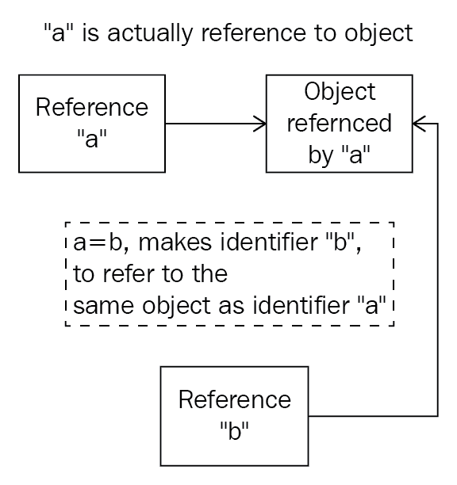

# 第十五章：全局解释器锁

Python 并发编程中的主要参与者之一是全局解释器锁（GIL）。在本章中，我们将介绍 GIL 的定义和目的，以及它对并发 Python 应用程序的影响。还将讨论 GIL 对 Python 并发系统造成的问题以及其实施引起的争议。最后，我们将提到一些关于 Python 程序员和开发人员应该如何思考和与 GIL 交互的想法。

本章将涵盖以下主题：

+   对 GIL 的简要介绍：它是如何产生的，以及它引起的问题

+   在 Python 中消除/修复 GIL 的努力

+   如何有效地处理 Python 并发程序中的 GIL

# 技术要求

以下是本章的先决条件列表：

+   确保您的计算机上已安装 Python 3

+   在[`github.com/PacktPublishing/Mastering-Concurrency-in-Python`](https://github.com/PacktPublishing/Mastering-Concurrency-in-Python)下载 GitHub 存储库

+   在本章中，我们将使用名为`Chapter15`的子文件夹进行工作

+   查看以下视频以查看代码的实际操作：[`bit.ly/2DFDYhC`](http://bit.ly/2DFDYhC)

# 全局解释器锁简介

GIL 在 Python 并发编程社区中非常受欢迎。设计为一种锁，它只允许一个线程在任何给定时间访问和控制 Python 解释器，Python 中的 GIL 通常被称为臭名昭著的 GIL，它阻止多线程程序达到其完全优化的速度。在本节中，我们将讨论 GIL 背后的概念及其目标：为什么它被设计和实施，以及它如何影响 Python 中的多线程编程。

# Python 中内存管理的分析

在我们深入讨论 GIL 及其影响之前，让我们考虑 Python 核心开发人员在 Python 早期遇到的问题，以及这些问题引发了对 GIL 的需求。具体来说，在内存空间中管理对象方面，Python 编程与其他流行语言的编程存在显着差异。

例如，在编程语言 C++中，变量实际上是内存空间中将写入值的位置。这种设置导致了一个事实，即当非指针变量被赋予特定值时，编程语言将有效地将该特定值复制到内存位置（即变量）。此外，当一个变量被赋予另一个变量（不是指针）时，后者的内存位置将被复制到前者的内存位置；在赋值后，这两个变量之间将不再保持任何连接。

另一方面，Python 将变量视为简单的名称，而变量的实际值则隔离在内存空间的另一个区域。当一个值被赋给一个变量时，变量实际上被赋予了对该值在内存空间中位置的引用（即使引用这个术语并不像 C++中的引用那样使用）。因此，Python 中的内存管理与我们在 C++中看到的将值放入内存空间的模型根本不同。

这意味着当执行赋值指令时，Python 只是与引用交互并将它们切换，而不是实际的值本身。此外，出于这个原因，多个变量可以被同一个值引用，并且一个变量所做的更改将在所有其他相关变量中反映出来。

让我们分析 Python 中的这个特性。如果您已经从 GitHub 页面下载了本书的代码，请转到`Chapter15`文件夹。让我们看一下`Chapter15/example1.py`文件，如下所示：

```py
# Chapter15/example1.py

import sys

print(f'Reference count when direct-referencing: {sys.getrefcount([7])}.')

a = [7]
print(f'Reference count when referenced once: {sys.getrefcount(a)}.')

b = a
print(f'Reference count when referenced twice: {sys.getrefcount(a)}.')

###########################################################################

a[0] = 8
print(f'Variable a after a is changed: {a}.')
print(f'Variable b after a is changed: {b}.')

print('Finished.')
```

在这个例子中，我们正在管理值`[7]`（一个元素的列表：整数`7`）。我们提到 Python 中的值是独立于变量存储的，Python 中的值管理只是将变量引用到适当的值。Python 中的`sys.getrefcount()`方法接受一个对象并返回与该对象关联的值的所有引用的计数。在这里，我们调用`sys.getrefcount()`三次：在实际值`[7]`上；分配给值的变量`a`；最后，分配给变量`a`的变量`b`。

此外，我们正在探讨通过使用与之引用的变量来改变值的过程，以及与该值相关联的所有变量的结果值。具体来说，我们通过变量`a`来改变列表的第一个元素，并打印出`a`和`b`的值。运行脚本，你的输出应该类似于以下内容：

```py
> python3 example1.py
Reference count when direct-referencing: 1.
Reference count when referenced once: 2.
Reference count when referenced twice: 3.
Variable a after a is changed: [8].
Variable b after a is changed: [8].
Finished.
```

正如你所看到的，这个输出与我们讨论的一致：对于第一个`sys.getrefcount()`函数调用，值`[7]`只有一个引用计数，当我们直接引用它时创建；当我们将列表分配给变量`a`时，该值有两个引用，因为`a`现在与该值相关联；最后，当`a`分配给`b`时，`[7]`还被`b`引用，引用计数现在是三。

在程序的第二部分输出中，我们可以看到，当我们改变变量`a`引用的值时，`[7]`被改变了，而不是变量`a`。结果，引用与`a`相同的变量`b`的值也被改变了。

下图说明了这个过程。在 Python 程序中，变量（`a`和`b`）只是简单地引用实际值（对象），两个变量之间的赋值语句（例如，`a = b`）指示 Python 让这两个变量引用相同的对象（而不是将实际值复制到另一个内存位置，就像在 C++中一样）：



Python 引用方案的图示

# GIL 解决的问题

牢记 Python 对内存和变量管理的实现，我们可以看到 Python 中对给定值的引用在程序中不断变化，因此跟踪值的引用计数非常重要。

现在，应用你在第十四章中学到的*竞争条件*，你应该知道在 Python 并发程序中，这个引用计数是一个需要保护免受竞争条件影响的共享资源。换句话说，这个引用计数是一个关键部分，如果处理不慎，将导致对特定值引用的变量数量的错误解释。这将导致内存泄漏，使 Python 程序显着低效，并且甚至可能释放实际上被一些变量引用的内存，永久丢失该值。

正如你在上一章中学到的，确保不会发生关于特定共享资源的竞争条件的解决方案是在该资源上放置一个锁，从而在并发程序中最多允许一个线程访问该资源。我们还讨论了，如果在并发程序中放置了足够多的锁，那么该程序将变得完全顺序化，并且通过实现并发性将不会获得额外的速度。

GIL 是对前面两个问题的解决方案，是 Python 整个执行过程中的一个单一锁。任何想要执行的 Python 指令（CPU 密集型任务）必须首先获取 GIL，以防止任何引用计数的竞争条件发生。

在 Python 语言开发的早期，也提出了其他解决这个问题的方案，但 GIL 是迄今为止最有效和最简单实现的。由于 GIL 是 Python 整个执行过程的轻量级全局锁，因此不需要实现其他锁来保证其他关键部分的完整性，从而将 Python 程序的性能开销降到最低。

# GIL 引发的问题

直观地说，由于锁保护了 Python 中的所有 CPU 绑定任务，因此并发程序将无法完全实现多线程。GIL 有效地阻止了 CPU 绑定任务在多个线程之间并行执行。为了理解 GIL 这一特性的影响，让我们来看一个 Python 中的例子；转到`Chapter15/example2.py`。

```py
# Chapter15/example2.py

import time
import threading

COUNT = 50000000

def countdown(n):
    while n > 0:
        n -= 1

###########################################################################

start = time.time()
countdown(COUNT)

print('Sequential program finished.')
print(f'Took {time.time() - start : .2f} seconds.')

###########################################################################

thread1 = threading.Thread(target=countdown, args=(COUNT // 2,))
thread2 = threading.Thread(target=countdown, args=(COUNT // 2,))

start = time.time()
thread1.start()
thread2.start()
thread1.join()
thread2.join()

print('Concurrent program finished.')
print(f'Took {time.time() - start : .2f} seconds.')
```

在这个例子中，我们比较了在 Python 中顺序执行和并发执行（通过多线程）一个特定程序的速度。具体来说，我们有一个名为`countdown()`的函数，模拟了一个重型 CPU 绑定任务，它接受一个数字`n`，并将其递减直到变为零或负数。然后，我们将`countdown()`在 5000 万上顺序执行一次。最后，我们将该函数分别在两个线程中调用，每个线程上执行 2500 万次，这正好是 5000 万的一半；这是程序的多线程版本。我们还记录了 Python 运行顺序程序和多线程程序所需的时间。

理论上，程序的多线程版本应该比顺序版本快一半，因为任务实际上被分成两半并且通过我们创建的两个线程并行运行。然而，程序产生的输出表明了相反的情况。通过运行脚本，我得到了以下输出：

```py
> python3 example2.py
Sequential program finished.
Took 2.80 seconds.
Concurrent program finished.
Took 2.74 seconds.
```

与我们预测的相反，倒计时的并发版本几乎与顺序版本一样长；多线程对我们的程序并没有提供任何显著的加速。这是由于 GIL 保护 CPU 绑定任务的直接影响，多个线程不被允许同时运行。有时，多线程程序甚至可能比其顺序对应物更长时间才能完成执行，因为还有获取和释放 GIL 的开销。

这无疑是多线程和 Python 中的并发编程的一个重大问题，因为只要程序包含 CPU 绑定指令，这些指令实际上会在程序的执行中是顺序的。然而，不是 CPU 绑定的指令发生在 GIL 之外，因此不受 GIL 的影响（例如 I/O 绑定指令）。

# 从 Python 中潜在删除 GIL

您已经了解到，GIL 对我们在 Python 中编写的多线程程序产生了重大限制，特别是对于那些包含 CPU 绑定任务的程序。因此，许多 Python 开发人员开始对 GIL 持负面看法，术语“臭名昭著的 GIL”开始变得流行；毫不奇怪，一些人甚至主张从 Python 语言中完全删除 GIL。

事实上，一些知名的 Python 用户曾多次尝试去除 GIL。然而，GIL 在语言的实现中根深蒂固，而大多数不支持多线程的库和包的执行都严重依赖于 GIL，因此去除 GIL 实际上会引发 Python 程序的错误以及向后不兼容性问题。一些 Python 开发人员和研究人员曾试图完全省略 Python 执行中的 GIL，结果大多数现有的 C 扩展都无法正常工作，因为它们严重依赖于 GIL 的功能。

现在有其他可行的解决方案来解决我们讨论过的问题；换句话说，GIL 在任何情况下都是可以替代的。然而，大多数这些解决方案包含如此复杂的指令，以至于它们实际上会降低顺序和 I/O 受限程序的性能，而这些程序并不受 GIL 的影响。因此，这些解决方案将减慢单线程或多线程 I/O 程序的速度，而这些程序实际上占现有 Python 应用程序的很大比例。有趣的是，Python 的创始人 Guido van Rossum 在他的文章《移除 GIL 并不容易》中也对这个话题发表了评论：

我只会欢迎一组补丁进入 Py3k，只要单线程程序的性能（以及多线程但 I/O 受限的程序）不会下降。

不幸的是，没有任何提出的 GIL 替代方案实现了这一要求。GIL 仍然是 Python 语言的一个重要部分。

# 如何处理 GIL

有几种方法可以处理你的 Python 应用程序中的 GIL，将在下文中讨论。

# 实施多进程，而不是多线程

这可能是规避 GIL 并在并发程序中实现最佳速度的最流行和最简单的方法。由于 GIL 只阻止多个线程同时执行 CPU 受限任务，因此在系统的多个核心上执行的进程，每个进程都有自己的内存空间，完全不受 GIL 的影响。

具体来说，考虑前面的倒计时示例，让我们比较一下当它是顺序的、多线程的和多进程的时候，那个 CPU 受限程序的性能。导航到`Chapter15/example3.py`文件；程序的第一部分与我们之前看到的是相同的，但在最后，我们添加了一个从 5000 万开始倒计时的多进程解决方案的实现，使用了两个独立的进程：

```py
# Chapter15/example3.py

import time
import threading
from multiprocessing import Pool

COUNT = 50000000

def countdown(n):
    while n > 0:
        n -= 1

if __name__ == '__main__':

    #######################################################################
    # Sequential

    start = time.time()
    countdown(COUNT)

    print('Sequential program finished.')
    print(f'Took {time.time() - start : .2f} seconds.')
    print()

    #######################################################################
    # Multithreading

    thread1 = threading.Thread(target=countdown, args=(COUNT // 2,))
    thread2 = threading.Thread(target=countdown, args=(COUNT // 2,))

    start = time.time()
    thread1.start()
    thread2.start()
    thread1.join()
    thread2.join()

    print('Multithreading program finished.')
    print(f'Took {time.time() - start : .2f} seconds.')
    print()

    #######################################################################
    # Multiprocessing

    pool = Pool(processes=2)
    start = time.time()
    pool.apply_async(countdown, args=(COUNT//2,))
    pool.apply_async(countdown, args=(COUNT//2,))
    pool.close()
    pool.join()

    print('Multiprocessing program finished.')
    print(f'Took {time.time() - start : .2f} seconds.')
```

运行程序后，我的输出如下：

```py
> python3 example3.py
Sequential program finished.
Took 2.95 seconds.

Multithreading program finished.
Took 2.69 seconds.

Multiprocessing program finished.
Took 1.54 seconds.
```

顺序和多线程版本的程序之间仍然存在微小的速度差异。然而，多进程版本能够将执行速度减少了近一半；正如前几章讨论的那样；由于进程相当沉重，多进程指令包含了显著的开销，这就是为什么多进程程序的速度并不完全是顺序程序的一半的原因。

# 利用本地扩展规避 GIL

有一些用 C/C++编写的 Python 本地扩展，因此能够避免 GIL 设置的限制；一个例子是最流行的 Python 科学计算包 NumPy。在这些扩展中，可以进行 GIL 的手动释放，以便执行可以简单地绕过锁。然而，这些释放需要谨慎实施，并在执行返回到主 Python 执行之前伴随着 GIL 的重新断言。

# 利用不同的 Python 解释器

GIL 只存在于 CPython 中，这是迄今为止最常用的语言解释器，它是用 C 构建的。然而，Python 还有其他解释器，比如 Jython（用 Java 编写）和 IronPython（用 C++编写），可以用来避免 GIL 及其对多线程程序的影响。请记住，这些解释器并不像 CPython 那样广泛使用，一些包和库可能与其中一个或两个不兼容。

# 总结

虽然 Python 中的 GIL 为语言中的一个更难的问题提供了一个简单而直观的解决方案，但它也提出了一些自己的问题，涉及在 Python 程序中运行多个线程以处理 CPU 受限任务的能力。已经有多次尝试从 Python 的主要实现中删除 GIL，但没有一次能够在保持处理非 CPU 受限任务的有效性的同时实现它。

在 Python 中，有多种方法可供选择，以提供处理 GIL 的选项。总的来说，虽然它在 Python 编程社区中声名显赫，但 GIL 只影响 Python 生态系统的一部分，并且可以被视为一种必要的恶，因为它对于从语言中移除来说太重要了。Python 开发人员应该学会与 GIL 共存，并在并发程序中绕过它。

在最后四章中，我们讨论了 Python 中并发编程中最著名和常见的一些问题。在本书的最后一节中，我们将研究 Python 提供的一些更高级的并发功能。在下一章中，您将了解无锁和基于锁的并发数据结构的设计。

# 问题

+   Python 和 C++之间的内存管理有哪些区别？

+   GIL 为 Python 解决了什么问题？

+   GIL 为 Python 带来了什么问题？

+   在 Python 程序中规避 GIL 的一些方法是什么？

# 进一步阅读

欲了解更多信息，您可以参考以下链接：

+   《Python 全局解释器锁（GIL）是什么？》（[realpython.com/python-gil/](https://realpython.com/python-gil/)），Abhinav Ajitsaria

+   《Python GIL 可视化》（[dabeaz.blogspot.com/2010/01/python-gil-visualized](http://dabeaz.blogspot.com/2010/01/python-gil-visualized.html)），Dave Beazley

+   《Python 中的复制操作》（[pythontic.com/modules/copy/introduction](https://pythontic.com/modules/copy/introduction)）

+   《移除 GIL 并不容易》（[www.artima.com/weblogs/viewpost.jsp?thread=214235](https://www.artima.com/weblogs/viewpost.jsp?thread=214235)），Guido Van Rossum

+   《使用 Python 进行并行编程》，Jan Palach，Packt Publishing Ltd，2014

+   《在 Python 中学习并发：构建高效、健壮和并发的应用程序》，Elliot Forbes（2017）
