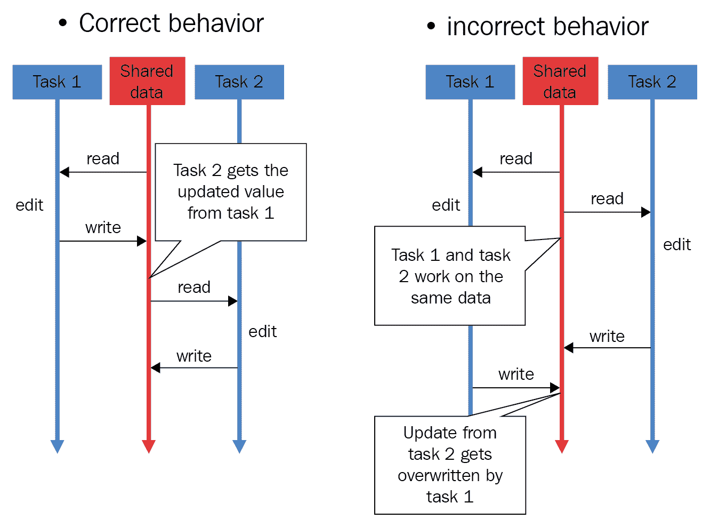
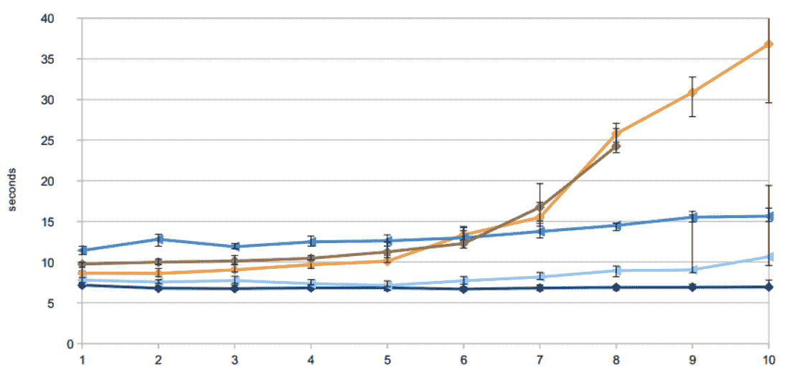
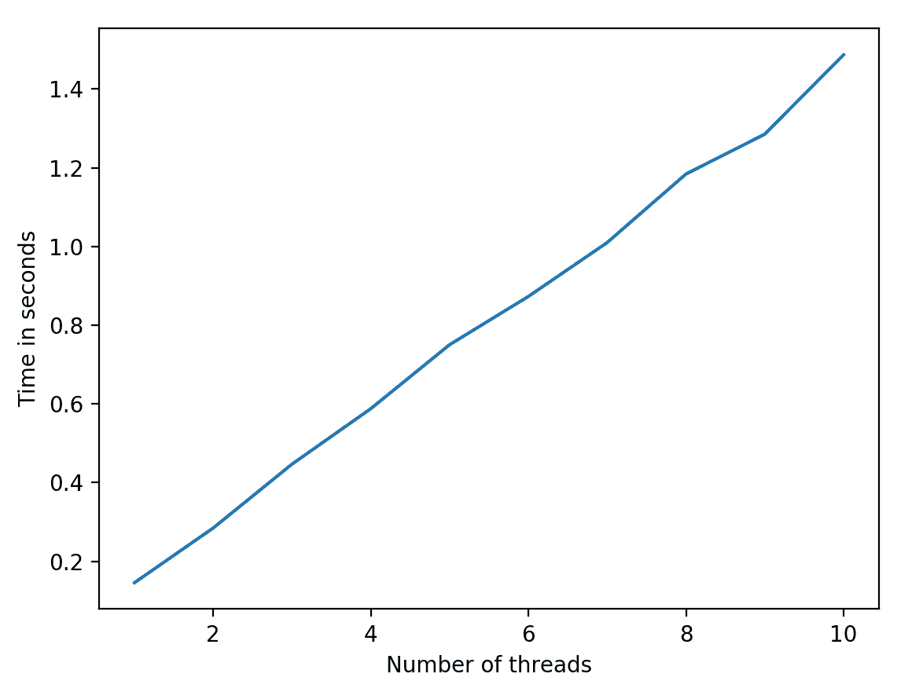
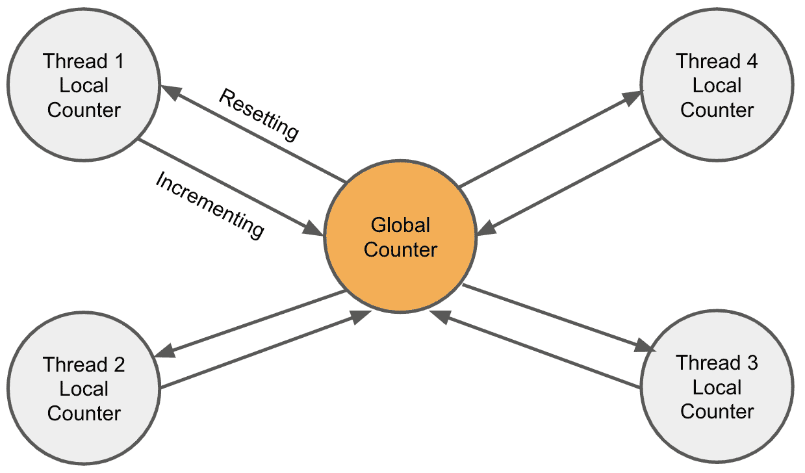
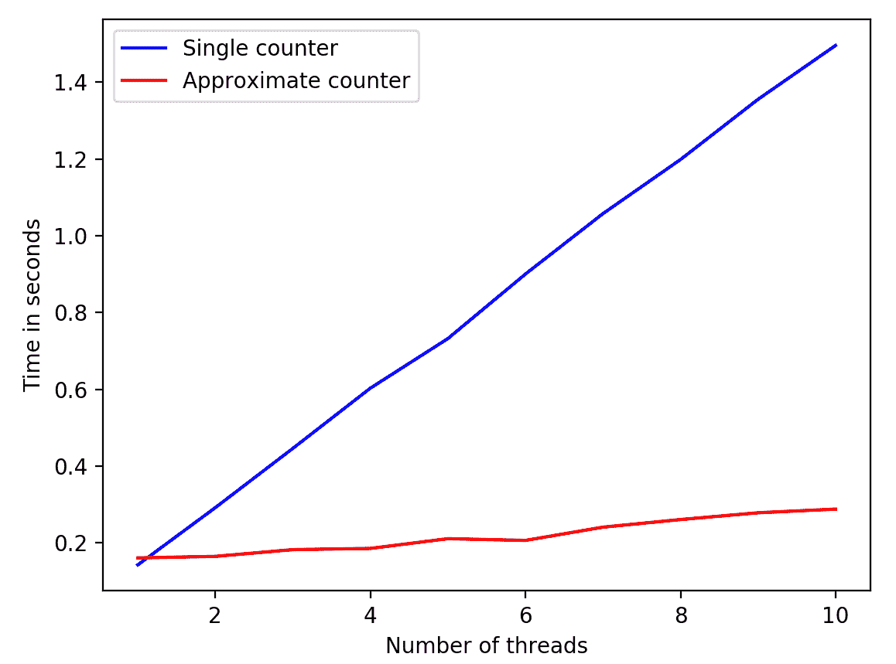
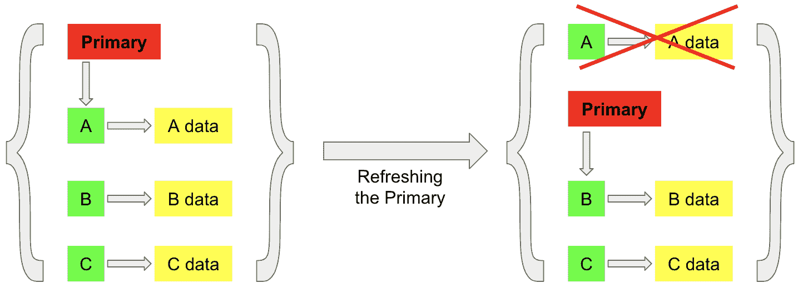
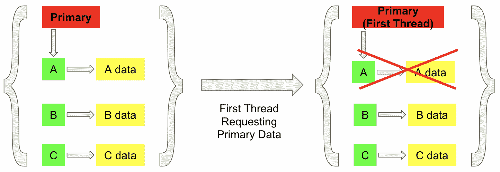
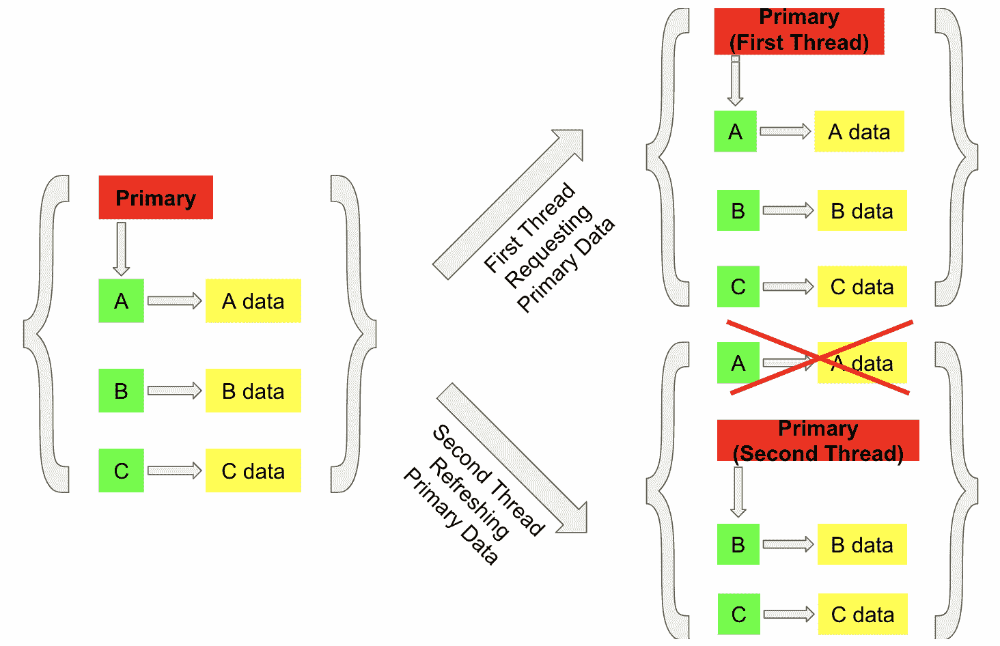

# 第十六章：设计基于锁和无互斥锁的并发数据结构

在本章中，我们将分析设计和实现并发编程中两种常见类型的数据结构的详细过程：基于锁和无互斥锁。将讨论这两种数据结构之间的主要区别，以及它们在并发编程中的使用。在整个章节中，还提供了并发程序准确性和速度之间的权衡分析。通过这种分析，读者将能够为自己的并发应用程序应用相同的权衡分析。

本章将涵盖以下主题：

+   基于锁数据结构的常见问题，以及如何解决这些问题

+   如何实现基于锁的数据结构的详细分析

+   无互斥锁数据结构的理念，以及与基于锁数据结构相比的优缺点

+   如何实现无互斥锁数据结构的详细分析

# 技术要求

以下是本章的先决条件列表：

+   确保您的计算机上已安装 Python 3

+   在[`github.com/PacktPublishing/Mastering-Concurrency-in-Python`](https://github.com/PacktPublishing/Mastering-Concurrency-in-Python)上下载 GitHub 存储库

+   在本章中，我们将使用名为`Chapter16`的子文件夹进行工作

+   查看以下视频以查看代码实际运行情况：[`bit.ly/2QhT3MS`](http://bit.ly/2QhT3MS)

# Python 中基于锁的并发数据结构

在前几章中，我们讨论了锁的使用，您了解到锁并不会锁住任何东西；在数据结构上实现的不牢固的锁定机制实际上并不能阻止外部程序同时访问数据结构，因为它们可以简单地绕过所施加的锁。解决这个问题的一个方法是将锁嵌入到数据结构中，这样外部实体就无法忽略锁。

在本章的第一部分中，我们将考虑锁和基于锁的数据结构的特定使用背后的理论。具体来说，我们将分析设计一个可以由不同线程安全执行的并发计数器的过程，使用锁（或互斥锁）作为同步机制。

# LocklessCounter 和竞争条件

首先，让我们模拟在并发程序中使用一个天真的、无锁实现的计数器类遇到的问题。如果您已经从 GitHub 页面下载了本书的代码，请转到`Chapter16`文件夹。

让我们来看一下`Chapter16/example1.py`文件，特别是`LocklessCounter`类的实现：

```py
# Chapter16/example1.py

import time

class LocklessCounter:
    def __init__(self):
        self.value = 0

    def increment(self, x):
        new_value = self.value + x
        time.sleep(0.001) # creating a delay
        self.value = new_value

    def get_value(self):
        return self.value
```

这是一个简单的计数器，具有名为`value`的属性，其中包含计数器的当前值，在计数器实例首次初始化时赋值为`0`。该类的`increment()`方法接受一个参数`x`，并将调用`LocklessCounter`对象的当前值增加`x`。请注意，在`increment()`函数内部我们创建了一个小延迟，用于计算计数器的新值和将该新值分配给计数器对象的过程之间。该类还有一个名为`get_value()`的方法，返回调用计数器的当前值。

很明显，这种`LocklessCounter`类的实现在并发程序中可能会导致竞争条件：当一个线程正在增加共享计数器时，另一个线程也可能访问计数器来执行`increment()`方法，并且第一个线程对计数器值的更改可能会被第二个线程所覆盖。

作为复习，以下图表显示了在多个进程或线程同时访问和改变共享资源的情况下竞争条件如何发生：



竞争条件的图示

为了模拟这种竞争条件，在我们的主程序中，我们包括了共计三个线程，将共享计数器增加 300 次：

```py
# Chapter16/example1.py

from concurrent.futures import ThreadPoolExecutor

counter = LocklessCounter()
with ThreadPoolExecutor(max_workers=3) as executor:
    executor.map(counter.increment, [1 for i in range(300)])

print(f'Final counter: {counter.get_value()}.')
print('Finished.')
```

`concurrent.futures`模块为我们提供了一种简单且高级的方式，通过线程池调度任务。具体来说，在初始化共享计数器对象后，我们将变量`executor`声明为一个包含三个线程的线程池（使用上下文管理器），并且该执行器调用共享计数器的`increment()`方法 300 次，每次将计数器的值增加`1`。

这些任务将在线程池中的三个线程之间执行，使用`ThreadPoolExecutor`类的`map()`方法。在程序结束时，我们只需打印出计数器对象的最终值。运行脚本后，以下代码显示了我的输出：

```py
> python3 example1.py
Final counter: 101.
Finished.
```

虽然在您自己的系统上执行脚本可能会获得计数器的不同值，但计数器的最终值实际上是 300，这是正确的值，这种情况极不可能发生。此外，如果您一遍又一遍地运行脚本，可能会获得计数器的不同值，说明程序的非确定性。同样，由于一些线程覆盖了其他线程所做的更改，一些增量在执行过程中丢失了，导致计数器在这种情况下只成功增加了`101`次。

# 在计数器的数据结构中嵌入锁

良好的基于锁的并发数据结构的目标是在其类属性和方法内部实现其锁，以便外部函数和程序无法绕过这些锁并同时访问共享的并发对象。对于我们的计数器数据结构，我们将为该类添加一个额外的属性，该属性将保存与计数器的值对应的`lock`对象。考虑在`Chapter16/example2.py`文件中的数据结构的以下新实现：

```py
# Chapter16/example2.py

import threading
import time

class LockedCounter:
    def __init__(self):
        self.value = 0
        self.lock = threading.Lock()

    def increment(self, x):
        with self.lock:
            new_value = self.value + x
            time.sleep(0.001) # creating a delay
            self.value = new_value

    def get_value(self):
        with self.lock:
            value = self.value

        return value
```

在我们的计数器数据结构实现中，还初始化了一个`lock`对象作为`LockedCounter`实例的属性，当初始化该实例时。此外，每当线程访问计数器的值时，无论是读取（`get_value()`方法）还是更新（`increment()`方法），都必须获取该`lock`属性，以确保没有其他线程也在访问它。这是通过使用`lock`属性的上下文管理器来实现的。

理论上，这种实现应该为我们解决竞争条件的问题。在我们的主程序中，我们正在实现与上一个示例中使用的相同的线程池。将创建一个共享计数器，并且它将在三个不同的线程中被增加 300 次（每次增加一个单位）：

```py
# Chapter16/example2.py

from concurrent.futures import ThreadPoolExecutor

counter = LockedCounter()
with ThreadPoolExecutor(max_workers=3) as executor:
    executor.map(counter.increment, [1 for i in range(300)])

print(f'Final counter: {counter.get_value()}.')
print('Finished.')
```

运行脚本，程序产生的输出应与以下类似：

```py
> python3 example2.py
Final counter: 300.
Finished.
```

如您所见，竞争条件的问题已经成功解决：计数器的最终值为`300`，完全对应于执行的增量数量。此外，无论程序运行多少次，计数器的值始终保持为`300`。我们目前拥有的是一个可并发计数器的工作正确的数据结构。

# 可扩展性的概念

编程中一个重要的方面是**可扩展性**。可扩展性指的是当程序要处理的任务数量增加时，性能的变化。Software Performance and Scalability Consulting, LLC 的创始人兼总裁 Andre B. Bondi 将可扩展性定义为<q>*“系统、网络或进程处理不断增长的工作量的能力，或者其扩大以适应这种增长的潜力。”*</q>

在并发编程中，可伸缩性是一个重要的概念，总是需要考虑；在并发编程中增长的工作量通常是要执行的任务数量，以及执行这些任务的活动进程和线程的数量。例如，并发应用程序的设计、实现和测试阶段通常涉及相当少量的工作，以促进高效和快速的开发。这意味着典型的并发应用程序在实际情况下将处理比在开发阶段更多的工作。这就是为什么可伸缩性分析在设计良好的并发应用程序中至关重要。

由于进程或线程的执行是独立于另一个进程的执行的，只要单个进程/线程负责的工作量保持不变，我们希望进程/线程数量的变化不会影响程序的性能。这种特性称为**完美的可伸缩性**，是并发程序的理想特性；如果给定的完全可伸缩的并发程序的工作量增加，程序可以简单地创建更多的活动进程或线程，以吸收增加的工作量。其性能可以保持稳定。

然而，由于创建线程和进程的开销，完美的可伸缩性在大多数情况下几乎是不可能实现的。也就是说，如果并发程序的性能随着活动进程或线程数量的增加而没有明显恶化，那么我们可以接受可伸缩性。**明显恶化**这个术语在很大程度上取决于并发程序负责执行的任务类型，以及允许程序性能下降的程度有多大。

在这种分析中，我们将考虑一个二维图表，表示给定并发程序的可伸缩性。*x*轴表示活动线程或进程的数量（每个线程或进程负责在整个程序中执行固定数量的工作）；*y*轴表示程序的速度，具有不同数量的活动线程或进程。所考虑的图表将具有一般上升的趋势；程序拥有的进程/线程越多，程序执行所需的时间（很可能）就越长。另一方面，完美的可伸缩性将转化为水平线，因为增加线程/进程数量时不需要额外的时间。

以下图表是可伸缩性分析的示例：



可伸缩性分析示例（来源：stackoverflow.com/questions/10660990/c-sharp-server-scalability-issue-on-linux）

在前面的图表中，*x*轴表示执行线程/进程的数量，*y*轴表示运行时间（在这种情况下为秒）。不同的图表表示特定设置的可伸缩性（操作系统与多个核心的组合）。

图表的斜率越陡，相应的并发模型随着线程/进程数量的增加而扩展得越差。例如，水平线（在这种情况下为深蓝色和最低的图表）表示完美的可伸缩性，而黄色（最上面的）图表表示不良的可伸缩性。

# 对计数器数据结构的可伸缩性分析

现在，让我们考虑我们当前计数器数据结构的可扩展性——具体来说，是随着活动线程数量的变化。我们有三个线程为共享计数器增加了总共 300 次；因此，在我们的可扩展性分析中，我们将使每个活动线程为共享计数器增加 100 次，同时改变程序中的活动线程数量。根据前述的可扩展性规范，我们将看看在线程数量增加时使用计数器数据结构的程序的性能（速度）如何变化。

考虑`Chapter16/example3.py`文件，如下所示：

```py
# Chapter16/example3.py

import threading
from concurrent.futures import ThreadPoolExecutor
import time
import matplotlib.pyplot as plt

class LockedCounter:
    def __init__(self):
        self.value = 0
        self.lock = threading.Lock()

    def increment(self, x):
        with self.lock:
            new_value = self.value + x
            time.sleep(0.001) # creating a delay
            self.value = new_value

    def get_value(self):
        with self.lock:
            value = self.value

        return value

n_threads = []
times = []
for n_workers in range(1, 11):
    n_threads.append(n_workers)

    counter = LockedCounter()

    start = time.time()

    with ThreadPoolExecutor(max_workers=n_workers) as executor:
        executor.map(counter.increment, 
                     [1 for i in range(100 * n_workers)])

    times.append(time.time() - start)

    print(f'Number of threads: {n_workers}')
    print(f'Final counter: {counter.get_value()}.')
    print(f'Time taken: {times[-1] : .2f} seconds.')
    print('-' * 40)

plt.plot(n_threads, times)
plt.xlabel('Number of threads'); plt.ylabel('Time in seconds')
plt.show()
```

在前面的脚本中，我们仍然使用了在上一个示例中使用的`LockedCounter`类的相同实现。在我们的主程序中，我们正在测试这个类针对各种数量的活动线程；具体来说，我们正在迭代一个`for`循环，使活动线程的数量从 1 增加到 10。在每次迭代中，我们初始化一个共享计数器，并创建一个线程池来处理适当数量的任务——在这种情况下，为每个线程增加共享计数器 100 次。

我们还跟踪活动线程的数量，以及线程池完成任务所花费的时间。这是我们进行可扩展性分析的数据。我们将打印出这些数据，并绘制一个类似于前面示例图中的可扩展性图表。

以下代码显示了我运行脚本的输出：

```py
> python3 example3.py
Number of threads: 1
Final counter: 100.
Time taken: 0.15 seconds.
----------------------------------------
Number of threads: 2
Final counter: 200.
Time taken: 0.28 seconds.
----------------------------------------
Number of threads: 3
Final counter: 300.
Time taken: 0.45 seconds.
----------------------------------------
Number of threads: 4
Final counter: 400.
Time taken: 0.59 seconds.
----------------------------------------
Number of threads: 5
Final counter: 500.
Time taken: 0.75 seconds.
----------------------------------------
Number of threads: 6
Final counter: 600.
Time taken: 0.87 seconds.
----------------------------------------
Number of threads: 7
Final counter: 700.
Time taken: 1.01 seconds.
----------------------------------------
Number of threads: 8
Final counter: 800.
Time taken: 1.18 seconds.
----------------------------------------
Number of threads: 9
Final counter: 900.
Time taken: 1.29 seconds.
----------------------------------------
Number of threads: 10
Final counter: 1000.
Time taken: 1.49 seconds.
----------------------------------------
```

此外，我得到的可扩展性图如下所示：



基于锁的计数器数据结构的可扩展性

即使您自己的输出在每次迭代的具体持续时间上有所不同，可扩展性趋势应该是相对相同的；换句话说，您的可扩展性图应该与前面的图表具有相同的斜率。从我们所拥有的输出类型中可以看出，尽管每次迭代中计数器的值都是正确的，但我们当前的计数器数据结构的可扩展性非常不理想：随着程序添加更多线程来执行更多任务，程序的性能几乎是线性下降的。请记住，理想的完美可扩展性要求性能在不同数量的线程/进程之间保持稳定。我们的计数器数据结构通过与活动线程数量的增加成比例地增加程序的执行时间。

直观地，这种可扩展性的限制是由我们的锁定机制造成的：由于在任何给定时间只有一个线程可以访问和增加共享计数器，程序需要执行的增量越多，完成所有增量任务所需的时间就越长。使用锁作为同步机制的最大缺点之一是：锁可以执行并发程序（再次强调，第一个缺点是锁实际上并没有锁定任何东西）。

# 近似计数器作为可扩展性的解决方案

考虑到设计和实现正确但快速的基于锁的并发数据结构的复杂性，开发高效可扩展的锁定机制是计算机科学研究中的热门话题，提出了许多解决我们面临问题的方法。在本节中，我们将讨论其中之一：**近似计数器**。

# 近似计数器背后的思想

让我们回顾一下我们当前的程序以及锁阻止我们在速度方面获得良好性能的原因：我们程序中的所有活动线程都与相同的共享计数器交互，这只能一次与一个线程交互。解决这个问题的方法是隔离与单独线程计数器的交互。具体来说，我们跟踪的计数器的值将不再仅由单个共享计数器对象表示；相反，我们将使用许多**本地计数器**，每个线程/进程一个，以及我们最初拥有的共享**全局计数器**。

这种方法背后的基本思想是将工作（递增共享全局计数器）分布到其他低级计数器中。当一个活动线程执行并想要递增全局计数器时，首先它必须递增其对应的本地计数器。与单个共享计数器进行交互不同，与各个本地计数器进行交互具有高度可扩展性，因为只有一个线程访问和更新每个本地计数器；换句话说，不同线程之间在与各个本地计数器交互时不会发生争用。

每个线程与其对应的本地计数器交互时，本地计数器必须与全局计数器交互。具体来说，每个本地计数器将定期获取全局计数器的锁，并根据其当前值递增它；例如，如果一个值为六的本地计数器想要递增全局计数器，它将以六个单位递增，并将自己的值设为零。这是因为从本地计数器报告的所有递增都是相对于全局计数器的值的，这意味着如果一个本地计数器持有值*x*，全局计数器应该将其值递增*x*。

您可以将这种设计看作是一个简单的网络，全局计数器位于中心节点，每个本地计数器都是一个后端节点。每个后端节点通过将其值发送到中心节点与中心节点交互，随后将其值重置为零。以下图示进一步说明了这种设计：



四线程近似计数器的图示

如前所述，如果所有活动线程都与相同的基于锁的计数器交互，那么无法从使程序并发化中获得额外的速度，因为不同线程之间的执行无法重叠。现在，对于每个线程有一个单独的计数器对象，线程可以独立和同时更新其对应的本地计数器，从而创建重叠，这将导致程序的速度性能更好，使程序更具可扩展性。

**近似计数器**这个技术的名称来源于全局计数器的值仅仅是正确值的近似。具体来说，全局计数器的值仅通过本地计数器的值计算，每次全局计数器被本地计数器之一递增时，它就变得更加准确。

然而，这种设计中有一个值得深思的规范。本地计数器应该多久与全局计数器交互并更新其值？当然不能是每次递增的速率（每次递增本地计数器时递增全局计数器），因为那将等同于使用一个共享锁，甚至有更多的开销（来自本地计数器）。

阈值 S 是用来表示所讨论的频率的数量；具体来说，阈值 S 被定义为本地计数器值的上限。因此，如果本地计数器被递增，使其值大于阈值 S，它应该更新全局计数器并将其值重置为零。阈值 S 越小，本地计数器更新全局计数器的频率就越高，我们的程序的可伸缩性就越低，但全局计数器的值将更加及时。相反，阈值 S 越大，全局计数器的值更新频率就越低，但程序的性能就会更好。

因此，近似计数对象的准确性和使用该数据结构的并发程序的可伸缩性之间存在权衡。与计算机科学和编程中的其他常见权衡类似，只有通过个人实验和测试，才能确定适合自己的近似计数数据结构的最佳阈值 S。在下一节中，当我们为近似计数数据结构实现我们自己的设计时，我们将任意将阈值 S 的值设置为 10。

# 在 Python 中实现近似计数器

在考虑近似计数器的概念时，让我们尝试在 Python 中实现这个数据结构，建立在我们之前基于锁的计数器的设计之上。考虑以下`Chapter16/example4.py`文件，特别是`LockedCounter`类和`ApproximateCounter`类：

```py
# Chapter16/example4.py

import threading
import time

class LockedCounter:
    def __init__(self):
        self.value = 0
        self.lock = threading.Lock()

    def increment(self, x):
        with self.lock:
            new_value = self.value + x
            time.sleep(0.001) # creating a delay
            self.value = new_value

    def get_value(self):
        with self.lock:
            value = self.value

        return value

class ApproximateCounter:
    def __init__(self, global_counter):
        self.value = 0
        self.lock = threading.Lock()
        self.global_counter = global_counter
        self.threshold = 10

    def increment(self, x):
        with self.lock:
            new_value = self.value + x
            time.sleep(0.001) # creating a delay
            self.value = new_value

            if self.value >= self.threshold:
                self.global_counter.increment(self.value)
                self.value = 0

    def get_value(self):
        with self.lock:
            value = self.value

        return value
```

虽然`LockedCounter`类与之前的示例中保持不变（该类将用于实现我们的全局计数器对象），但`ApproximateCounter`类却很有意思，它包含了我们之前讨论的近似计数逻辑的实现。一个新初始化的`ApproximateCounter`对象将被赋予一个起始值为`0`，它也将有一个锁，因为它也是一个基于锁的数据结构。`ApproximateCounter`对象的重要属性是它需要报告给的全局计数器和指定它报告给相应全局计数器的速率的阈值。如前所述，这里我们只是随意选择`10`作为阈值的值。

在`ApproximateCounter`类的`increment()`方法中，我们还可以看到相同的递增逻辑：该方法接受一个名为`x`的参数，并在保持调用近似计数器对象的锁的情况下递增计数器的值。此外，该方法还必须检查计数器的新递增值是否超过了它的阈值；如果是，它将增加其全局计数器的值，增加的数量等于本地计数器的当前值，并将本地计数器的值设置回`0`。在这个类中用于返回计数器当前值的`get_value()`方法与我们之前看到的是一样的。

现在，让我们在主程序中测试和比较新数据结构的可伸缩性。首先，我们将重新生成旧的单锁计数器数据结构的可伸缩性数据：

```py
# Chapter16/example4.py

from concurrent.futures import ThreadPoolExecutor

# Previous single-lock counter

single_counter_n_threads = []
single_counter_times = []
for n_workers in range(1, 11):
    single_counter_n_threads.append(n_workers)

    counter = LockedCounter()

    start = time.time()

    with ThreadPoolExecutor(max_workers=n_workers) as executor:
        executor.map(counter.increment, 
                     [1 for i in range(100 * n_workers)])

    single_counter_times.append(time.time() - start)
```

就像在我们之前的示例中一样，我们使用`ThreadPoolExecutor`对象来并发处理任务，在单独的线程中跟踪每次迭代完成所花费的时间；这里没有什么令人惊讶的。接下来，我们将使用`for`循环的迭代中相应数量的活动线程生成相同的数据，如下所示：

```py
# New approximate counters

def thread_increment(counter):
    counter.increment(1)

approx_counter_n_threads = []
approx_counter_times = []
for n_workers in range(1, 11):
    approx_counter_n_threads.append(n_workers)

    global_counter = LockedCounter()

    start = time.time()

    local_counters = [ApproximateCounter(global_counter) for i in range(n_workers)]
    with ThreadPoolExecutor(max_workers=n_workers) as executor:
        for i in range(100):
            executor.map(thread_increment, local_counters)

    approx_counter_times.append(time.time() - start)

    print(f'Number of threads: {n_workers}')
    print(f'Final counter: {global_counter.get_value()}.')
    print('-' * 40)
```

让我们花一些时间来分析上述代码。首先，我们有一个外部的`thread_increment()`函数，它接受一个计数器并将其递增 1；稍后，这个函数将被用作重构后的代码，以单独递增我们的本地计数器。

同样，我们将通过`for`循环来迭代分析这种新数据结构在不同数量的活动线程下的性能。在每次迭代中，我们首先初始化一个`LockedCounter`对象作为我们的全局计数器，以及一个本地计数器列表，这些本地计数器是`ApproximateCounter`类的实例。它们都与同一个全局计数器相关联（在初始化方法中传递），因为它们需要报告给同一个计数器。

接下来，类似于我们一直在为多个线程安排任务所做的，我们使用上下文管理器创建一个线程池，在其中通过嵌套的`for`循环分发任务（增加本地计数器）。我们循环另一个`for`循环是为了模拟与我们在上一个示例中实现的任务数量一致，并将这些任务同时分配到所有本地计数器上。我们还在每次迭代中打印出全局计数器的最终值，以确保我们的新数据结构正常工作。

最后，在我们的主程序中，我们将绘制从两个`for`循环生成的数据点，以比较两种数据结构的可伸缩性及其各自的性能：

```py
# Chapter16/example4.py
import matplotlib.pyplot as plt

# Plotting

single_counter_line, = plt.plot(
    single_counter_n_threads,
    single_counter_times,
    c = 'blue',
    label = 'Single counter'
)
approx_counter_line, = plt.plot(
    approx_counter_n_threads,
    approx_counter_times,
    c = 'red',
    label = 'Approximate counter'
)
plt.legend(handles=[single_counter_line, approx_counter_line], loc=2)
plt.xlabel('Number of threads'); plt.ylabel('Time in seconds')
plt.show()
```

运行脚本，您将收到的第一个输出将包括我们第二个`for`循环中全局计数器的最终值，如下所示：

```py
> python3 example4.py
Number of threads: 1
Final counter: 100.
----------------------------------------
Number of threads: 2
Final counter: 200.
----------------------------------------
Number of threads: 3
Final counter: 300.
----------------------------------------
Number of threads: 4
Final counter: 400.
----------------------------------------
Number of threads: 5
Final counter: 500.
----------------------------------------
Number of threads: 6
Final counter: 600.
----------------------------------------
Number of threads: 7
Final counter: 700.
----------------------------------------
Number of threads: 8
Final counter: 800.
----------------------------------------
Number of threads: 9
Final counter: 900.
----------------------------------------
Number of threads: 10
Final counter: 1000.
----------------------------------------
```

正如您所看到的，我们从全局计数器获得的最终值都是正确的，证明我们的数据结构按预期工作。此外，您将获得类似以下的图表：



单锁计数器和近似计数器的可伸缩性

蓝线表示单锁计数器数据结构速度的变化，而红线表示近似计数器数据结构的变化。正如您所看到的，即使随着线程数量的增加，近似计数器的性能略有下降（由于创建单独的本地计数器和分发增加的任务数量等开销），我们的新数据结构仍然具有很高的可伸缩性，特别是与以前的单锁计数器数据结构相比。

# 关于近似计数器设计的一些考虑

您可能已经注意到的一件事是，即使只有一个线程与一个本地计数器交互，数据结构在初始化时仍然具有`lock`属性。这是因为实际上多个线程可以共享相同的本地计数器。有时创建每个活动线程的本地计数器是低效的，因此开发人员可以让两个或更多线程共享相同的本地计数器，而个别计数器仍然可以报告给相同的全局计数器。

例如，假设有 20 个线程在并发计数器程序中执行；我们只能让 10 个本地计数器报告给一个全局计数器。从我们所见，这种设置的可伸缩性将低于为每个线程使用单独的本地计数器的设置，但这种方法的优势在于它使用更少的内存空间，并避免了创建更多本地计数器的开销。

程序中使用近似计数器的方式还有另一种可能的变化。除了只有一层本地计数器之外，我们还可以实现半全局计数器，本地计数器报告给它，然后它再报告给比自己高一级的全局计数器。在使用近似计数器数据结构时，开发人员不仅需要像之前讨论的那样找到适当的报告阈值，还需要优化与一个单个本地计数器相关联的线程数量，以及我们设计中的层数。

# Python 中无互斥锁的并发数据结构

前一小节总结了我们在 Python 中设计基于锁的并发数据结构以及其中涉及的复杂性的讨论。我们现在将转向一种理论上设计无互斥锁并发数据结构的方法。

并发数据结构中的“无互斥锁”一词表示缺乏保护数据结构完整性的锁定机制。这并不意味着数据结构简单地忽视了其数据的保护；相反，数据结构必须使用其他同步机制。在本节中，我们将分析一种这样的机制，称为“读-复制-更新”，并讨论如何将其应用到 Python 数据结构中。

# 在 Python 中无法实现无锁

基于锁的数据结构的对立面是无锁数据结构。在这里，我们将讨论其定义以及为什么在 Python 中实际上无法实现无锁的特性，以及我们能够接近的最近的是无互斥锁。

与基于锁的数据结构不同，无锁数据结构不仅不使用任何锁定机制（如无互斥锁数据结构），而且要求任何给定的线程或进程不能无限期地等待执行。这意味着，如果成功实现了无锁数据结构，使用该数据结构的应用程序将永远不会遇到死锁和饥饿问题。因此，无锁数据结构被广泛认为是并发编程中更高级的技术，因此它们要难得多地实现。

然而，无锁的特性实际上是无法在 Python（或者更具体地说，在 CPython 解释器中）中实现的。您可能已经猜到，这是由于 GIL 的存在，它阻止多个线程在任何给定时间在 CPU 中执行。要了解有关 GIL 的更多信息，请转到第十五章，“全局解释器锁”，并阅读有关 GIL 的深入分析，如果您还没有阅读的话。总的来说，在 CPython 中实现纯粹的无锁数据结构是一个逻辑上的不可能。

然而，这并不意味着 Python 中的并发程序不能从设计无锁数据结构中受益。如前所述，无互斥锁的 Python 数据结构（可以被视为无锁数据结构的子集）是完全可以实现的。事实上，无互斥锁的数据结构仍然可以成功避免死锁和饥饿问题。然而，它们无法充分利用纯粹的无锁执行，这将导致更快的速度。

在接下来的小节中，我们将研究 Python 中的自定义数据结构，分析如果同时使用会引发的问题，并尝试将无互斥锁的逻辑应用到底层数据结构中。

# 网络数据结构介绍

我们正在实现的数据结构类似于一个节点网络，其中一个节点是主节点。此外，每个节点都包含一个键和一个节点的值。您可以将这个数据结构看作是一个 Python 字典（换句话说，一组键和值分别配对在一起），但其中一个键和值对被称为网络的主节点。

一个很好的方式来可视化这种数据结构是分析使用该数据结构的情况。假设您被要求实现一个流行网站的请求处理逻辑，这个网站也不幸地是**拒绝服务（DoS）**攻击的常见目标。由于网站很可能会经常被关闭，尽管网络安全团队的努力，您可以采取的一种方法是在服务器上保留除主网站之外的多个工作副本，以确保网站的客户仍然能够访问它。

这些副本在每个方面等同于主网站，因此主网站可以随时完全被任何副本替换。现在，如果主网站被 DoS 攻击关闭，作为服务器管理员，您可以简单地允许主网站关闭并将新主网站的地址切换到您准备好的任何一个副本。因此，网站的客户在访问网站数据时不会遇到任何困难或不一致，因为副本与被关闭的主网站相同。另一方面，不实现此机制的服务器很可能需要花费一些时间来从 DoS 攻击中恢复（隔离攻击，重建中断或损坏的数据等）。

此时，可以建立这种网站管理方法与上述网络数据结构之间的联系。实际上，网络数据结构本质上是该方法的高级抽象；数据结构是一组节点或值对（在前面的情况下是网站地址和数据），同时跟踪一个主节点，也可以被任何其他节点替换（当主网站受到攻击时，访问网站的客户被引导到新网站）。我们将称这个处理为我们数据结构中的**刷新主要**，如下图所示：



网络主要刷新的图表

在上图中，我们的网络数据结构中有三个独立的数据节点（可视化为字典，用一对大括号表示）：键**A**，指向某些数据；键**B**，指向其自己的数据；最后，键**C**，也指向其自己的数据。此外，我们有一个指针指示我们字典网络的主键，指向键**A**。随着主要刷新过程的进行，我们将停止跟踪键**A**（即主键）及其自身，然后将主指针指向网络中的另一个节点（在本例中为键**B**）。

# 在 Python 中实现一个简单的网络数据结构和竞争条件

让我们考虑 Python 中这种数据结构的起始实现。按照以下方式导航到`Chapter16/network.py`文件：

```py
# Chapter16/network.py

import time
from random import choice

class Network:
    def __init__(self, primary_key, primary_value):
        self.primary_key = primary_key
        self.data = {primary_key: primary_value}

    def __str__(self):
        result = '{\n'
        for key in self.data:
            result += f'\t{key}: {self.data[key]};\n'

        return result + '}'

    def add_node(self, key, value):
        if key not in self.data:
            self.data[key] = value
            return True

        return False

    # precondition: the object has more than one node left
    def refresh_primary(self):
        del self.data[self.primary_key]
        self.primary_key = choice(list(self.data))

    def get_primary_value(self):
        primary_key = self.primary_key
        time.sleep(1) # creating a delay
        return self.data[primary_key]
```

这个文件包含了`Network`类，它实现了我们之前讨论过的逻辑。在初始化时，这个类的每个实例在其网络中至少有一个节点（存储在`data`属性中），这是它的主节点；我们还使用 Python 的字典数据结构来实现这个网络设计。每个对象还必须跟踪其主要数据的键，存储在其`primary_key`属性中。

在这个类中，我们还有一个`add_node()`方法，用于向网络对象添加新的数据节点；请注意，每个节点都必须有一个键和一个值。回想一下我们的网络管理示例——这对应于一个互联网地址和网站所拥有的数据。该类还有一个`refresh_primary()`方法，用于模拟刷新主要过程（删除对先前主要数据的引用，并从剩余节点中伪随机选择一个新的主节点）。请记住，这个方法的前提是调用网络对象必须至少还有两个节点。

最后，我们有一个叫做`get_primary_value()`的访问方法，它返回调用网络对象的主键指向的值。在这里，我们在方法的执行中添加了轻微的延迟，以模拟使用这种天真的数据结构会发生的竞争条件。（另外，我们正在重写默认的`__str__()`方法，以便进行简单的调试。）

现在，让我们把注意力转向`Chapter16/example5.py`文件，在这里我们导入这个数据结构并在一个并发程序中使用它：

```py
# Chapter16/example5.py

from network import Network
import threading

def print_network_primary_value():
    global my_network

    print(f'Current primary value: {my_network.get_primary_value()}.')

my_network = Network('A', 1)
print(f'Initial network: {my_network}')
print()

my_network.add_node('B', 1)
my_network.add_node('C', 1)
print(f'Full network: {my_network}')
print()

thread1 = threading.Thread(target=print_network_primary_value)
thread2 = threading.Thread(target=my_network.refresh_primary)

thread1.start()
thread2.start()

thread1.join()
thread2.join()

print(f'Final network: {my_network}')
print()

print('Finished.')
```

首先，我们实现了一个名为`print_network_primary_value()`的函数，它使用前面提到的`get_primary_value()`方法访问和获取网络对象的主要数据，这也是一个全局变量。在我们的主程序中，我们使用起始节点初始化了一个网络对象，`A`作为节点键，`1`作为节点数据（这个节点也自动成为主节点）。然后我们向这个网络添加了另外两个节点：`B`指向`1`，`C`也指向`1`。

现在，初始化并启动了两个线程，第一个调用`print_network_primary_value()`函数打印出网络的当前主要数据。第二个调用网络对象的`refresh_primary()`方法。我们还在程序的各个点打印出网络对象的当前状态。

很容易发现这里可能会发生竞争条件：因为第一个线程正在尝试访问主要数据，而第二个线程正在尝试刷新网络的数据（实质上，在那个时候删除当前的主要数据），第一个线程很可能会在执行过程中引发错误。具体来说，运行脚本后，以下是我的输出：

```py
> python3 example5.py
Initial network: {
 A: 1;
}

Full network: {
 A: 1;
 B: 1;
 C: 1;
}

Exception in thread Thread-1:
Traceback (most recent call last):
 File "/Library/Frameworks/Python.framework/Versions/3.7/lib/python3.7/threading.py", line 917, in _bootstrap_inner
 self.run()
 File "/Library/Frameworks/Python.framework/Versions/3.7/lib/python3.7/threading.py", line 865, in run
 self._target(*self._args, **self._kwargs)
 File "example5.py", line 7, in print_network_primary_value
 print(f'Current primary value: {my_network.get_primary_value()}.')
 File "/Users/quannguyen/Documents/python/mastering_concurrency/ch16/network.py", line 30, in get_primary_value
 return self.data[primary_key]
KeyError: 'A'

Final network: {
 B: 1;
 C: 1;
}

Finished.
```

就像我们讨论过的那样，我们遇到了一个`KeyError`，这是因为第一个线程获取主键的时候，该键和主要数据已经被第二个线程的执行从数据结构中删除了。下面的图表进一步说明了这一点：



网络数据结构的竞争条件

正如你在之前的章节中看到的，我们在数据结构的源代码中使用了`time.sleep()`函数，以确保竞争条件会发生。大多数情况下，执行速度会足够快，不会出现错误，但竞争条件仍然存在，这是我们当前数据结构中需要解决的问题。

# RCU 作为解决方案

我们遇到的竞争条件的根源是，我们知道，我们正在使用的网络对象在不同的线程之间共享，这些线程同时对数据结构进行变异和读取数据。具体来说，我们程序中的第二个线程正在变异数据（通过调用`refresh_primary()`方法），而第一个线程正在从相同的数据中读取。

显然，我们可以简单地将锁定应用为该数据结构的同步机制。然而，我们知道获取和释放锁的任务涉及一些成本，随着数据结构在系统中被广泛使用，这些成本将变得相当可观。由于流行的网站和系统（即 MongoDB）使用此抽象来设计和构造其服务器，因此高水平的流量将使使用锁的成本显而易见，并导致性能下降。实现近似数据结构的变体可能有助于解决此问题，但实现的复杂性可能会被证明难以跟进。

因此，我们的目标是使用无互斥量的方法作为我们的同步机制——在这种情况下是**读-复制-更新**（**RCU**）。为了保护数据结构的完整性，RCU 本质上是一种同步机制，当线程或进程请求读取或写入访问时，它会创建并维护数据结构的另一个版本。通过在单独的副本中隔离数据结构和线程/进程之间的交互，RCU 确保不会发生冲突的数据。当线程或进程改变了其分配的数据结构副本中的信息时，该更新可以报告给原始数据结构。

简而言之，当共享数据结构有线程或进程请求访问它（读取过程）时，它需要返回自身的副本，而不是让线程/进程访问其自己的数据（复制过程）；最后，如果副本中的数据结构发生任何更改，它们将需要更新回共享数据结构（更新过程）。

RCU 对于需要同时处理单个更新程序和多个读取程序的数据结构特别有用，这是我们之前讨论的服务器网络的典型情况（多个客户端不断访问和请求数据，但只有偶尔的定期攻击）。但是这如何应用到我们当前的网络数据结构呢？理论上，我们的数据结构的访问器方法（`get_primary_value()`方法）需要在从线程读取数据之前创建数据结构的副本。这个规范在访问器方法中实现，在`Chapter16/concurrent_network.py`文件中，如下：

```py
# Chapter16/concurrent_network.py

from copy import deepcopy
import time

class Network:
    [...]

    def get_primary_value(self):
        copy_network = deepcopy(self)

        primary_key = copy_network.primary_key
        time.sleep(1) # creating a delay
        return copy_network.data[primary_key]
```

在这里，我们使用了 copy 模块中的内置`deepcopy`方法，它返回网络的不同内存位置的副本。然后，我们只从这个网络对象的副本中读取数据，而不是原始对象本身。这个过程在下面的图表中说明：



RCU 解决竞争条件

在前面的图表中，我们可以看到在数据方面不会发生冲突，因为两个线程现在处理的是数据结构的不同副本。让我们在`Chapter16/example6.py`文件中看到这个实现的实际操作，该文件包含与之前的`example5.py`文件相同的指令（初始化网络对象，同时调用两个线程——一个用于访问网络的主要数据，另一个用于刷新相同的主要数据），只是现在程序正在使用我们从`concurrent_network.py`文件中获取的新数据结构。

在运行脚本之后，您的输出应该与以下内容相同：

```py
> python3 example6.py
Initial network: {
 A: 1;
}

Full network: {
 A: 1;
 B: 1;
 C: 1;
}

Current primary value: 1.
Final network: {
 B: 1;
 C: 1;
}

Finished.
```

正如您所看到的，程序不仅在第一个线程中获取了主要数据的正确值而没有引发任何错误，而且在程序结束时也保持了正确的网络（没有之前删除的节点，带有键`A`）。 RCU 方法确实解决了竞争条件的问题，而没有使用任何锁定机制。

您可能还注意到的一件事是，在前一节中，RCU 也可以应用于我们的计数器示例。事实上，RCU 和近似计数器都是解决计数器问题的合理方法，哪种方法对于特定的并发问题更好的问题只能通过可扩展性分析等经验性的实践分析来回答。

# 基于简单数据结构

在本章中，我们使用了许多简单的并发数据结构，如计数器和网络。因此，我们真正深入地了解了在使用这些数据结构的并发程序中遇到的问题，并能够深入分析如何改进它们的结构和设计。

当您在工作和项目中处理更复杂的并发数据结构时，您会发现它们的设计和结构以及伴随它们的问题实际上与我们分析的数据结构中看到的问题基本相似。通过真正理解数据结构的基本架构以及使用它们的程序可能出现的问题的根源，您可以在此基础上构建更复杂但逻辑上等效的数据结构。

# 总结

在本章中，我们研究了基于锁和无互斥锁数据结构之间的理论差异：基于锁的数据结构使用锁定机制来保护其数据的完整性，而无互斥锁的数据结构则不使用。我们分析了在设计不良的数据结构中可能出现的竞争条件问题，并探讨了如何在这两种情况下解决这个问题。

在我们的并发基于锁的计数器数据结构示例中，我们考虑了近似计数器的设计，以及设计可以提供的改进可扩展性。在我们对并发网络数据结构的分析中，我们研究了 RCU 技术，该技术将读取指令与更新指令隔离开来，目的是保持并发数据结构的完整性。

在下一章中，我们将研究 Python 并发编程中的另一组高级概念：内存模型和对原子类型的操作。您将更多地了解 Python 内存管理，以及原子类型的定义和用途。

# 问题

+   解决锁不锁任何东西的主要方法是什么？

+   在并发编程的背景下描述可扩展性的概念

+   天真的锁定机制如何影响并发程序的可扩展性？

+   近似计数器是什么，它如何帮助解决并发编程中的可扩展性问题？

+   Python 中是否可能存在无锁数据结构？为什么？

+   什么是无互斥锁并发数据结构，它与并发基于锁的数据结构有何不同？

+   RCU 技术是什么，以及它如何解决无互斥锁并发数据结构的问题？

# 进一步阅读

有关更多信息，您可以参考以下链接：

+   操作系统：三个简单部分。第 151 卷。威斯康星州：Arpaci-Dusseau Books，2014 年，作者：Arpaci-Dusseau，Remzi H.和 Andrea C. Arpaci-Dusseau

+   并发数据结构的秘密生活（[addthis.com/blog/2013/04/25/the-secret-life-of-concurrent-data-structures/](https://www.addthis.com/blog/2013/04/25/the-secret-life-of-concurrent-data-structures/#.W7onwBNKiAw)），作者：Michael Spiegel

+   RCU 在本质上是什么？Linux 周刊新闻（LWN.net）（2007），作者：McKenney，Paul E.和 Jonathan Walpole

+   黄蜂窝：Python 中的读-复制-更新模式（[emptysqua.re/blog/wasps-nest-read-copy-update-python/](https://emptysqua.re/blog/wasps-nest-read-copy-update-python/)），作者：Davis，A. Jesse Jiryu

+   可扩展性的特征及其对性能的影响，第二届国际软件和性能研讨会（WOSP）'00。第 195 页，André B
