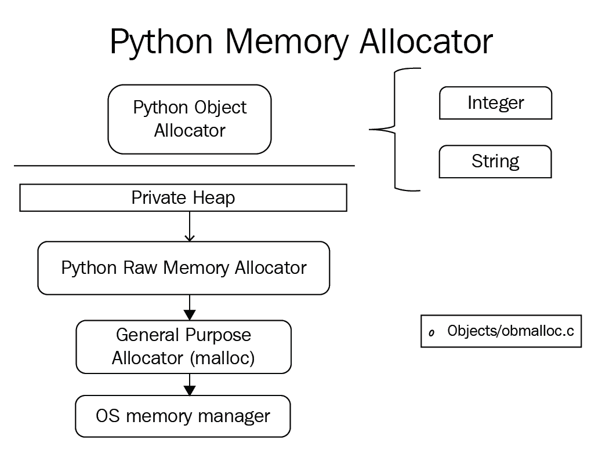
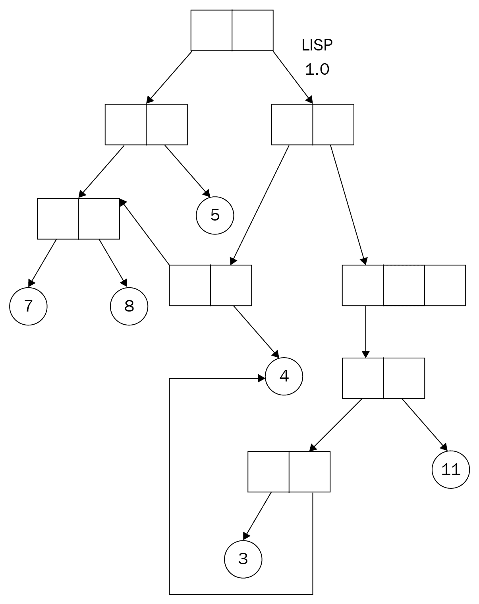

# 第十七章：内存模型和原子类型的操作

并发编程过程中需要考虑的问题以及随之而来的问题，都与 Python 管理其内存的方式有关。因此，对 Python 中变量和值的存储和引用方式有深入的了解，不仅有助于找出导致并发程序故障的低级错误，还有助于优化并发代码。在本章中，我们将深入研究 Python 内存模型以及其原子类型，特别是它们在 Python 并发生态系统中的位置。

本章将涵盖以下主题：

+   Python 内存模型，支持不同层次上的内存分配的组件，以及在 Python 中管理内存的一般理念

+   原子操作的定义，它们在并发编程中的作用，以及如何在 Python 中使用它们

# 技术要求

本章的技术要求如下：

+   在计算机上安装 Python 3

+   在[`github.com/PacktPublishing/Mastering-Concurrency-in-Python`](https://github.com/PacktPublishing/Mastering-Concurrency-in-Python)下载 GitHub 存储库

+   在本章中，我们将使用名为`Chapter17`的子文件夹进行工作

+   查看以下视频以查看代码实际操作：[`bit.ly/2AiToVy`](http://bit.ly/2AiToVy)

# Python 内存模型

你可能还记得在《全局解释器锁》第十五章中对 Python 内存管理方法的简要讨论。在本节中，我们将通过将其内存管理机制与 Java 和 C++的内存管理机制进行比较，并讨论它与 Python 并发编程实践的关系，更深入地了解 Python 内存模型。

# Python 内存管理器的组件

Python 中的数据以特定方式存储在内存中。为了深入了解并发程序中数据的处理方式，我们首先需要深入了解 Python 内存分配的理论结构。在本节中，我们将讨论数据如何在私有堆中分配，以及通过**Python 内存管理器**处理这些数据——这是一个确保数据完整性的总体实体。

Python 内存管理器由许多组件组成，这些组件与不同的实体进行交互并支持不同的功能。例如，一个组件通过与 Python 运行的操作系统的内存管理器进行交互，处理低级内存的分配；它被称为**原始内存分配器**。

在更高的层次上，还有许多其他内存分配器与前述的对象和值的私有堆进行交互。Python 内存管理器的这些组件处理特定于对象的分配，执行特定于给定数据和对象类型的内存操作：整数必须由不同的分配器处理和管理，以便处理字符串的分配器或处理字典或元组的分配器。由于这些数据类型之间的存储和读取指令不同，因此实现了这些不同的特定于对象的内存分配器，以获得额外的速度，同时牺牲一些处理空间。

在前述原始内存分配器的下一步是来自标准 C 库的系统分配器（假设考虑的 Python 解释器是 CPython）。有时被称为通用分配器，这些用 C 语言编写的实体负责帮助原始内存分配器与操作系统的内存管理器进行交互。

前面描述的 Python 内存管理器的整个模型可以用以下图示表示：



Python 内存管理器组件

# 内存模型作为一个带标签的有向图

我们已经了解了 Python 中的内存分配的一般过程，因此在本节中，让我们思考 Python 中数据是如何存储和引用的。许多程序员经常将 Python 中的内存模型想象为一个带有每个节点标签的对象图，边是有向的——简而言之，它是一个带标签的有向对象图。这种内存模型最初是在第二古老的计算机编程语言**Lisp**（以前称为 LISP）中使用的。

它通常被认为是一个有向图，因为它的内存模型通过指针来跟踪其数据和变量：每个变量的值都是一个指针，这个指针可以指向一个符号、一个数字或一个子程序。因此，这些指针是对象图中的有向边，而实际值（符号、数字、子程序）是图中的节点。以下图表是 Lisp 内存模型早期阶段的简化：



Lisp 内存模型作为对象图

这种对象图内存模型带来了许多有利的内存管理特性。首先，该模型在可重用性方面提供了相当大的灵活性；可以编写一个数据结构或一组指令，用于一种数据类型或对象，然后在其他类型上重用它是可能的，而且实际上相当容易。相比之下，C 是一种利用不同内存模型的编程语言，不提供这种灵活性，其程序员通常需要花费大量时间为不同类型的数据结构和算法重写相同的代码。

这种内存模型提供的另一种灵活性是，每个对象可以被任意数量的指针（或最终变量）引用，因此可以被任何一个变量改变。我们已经在第十五章中的一个 Python 程序示例中看到了这种特性的影响，《全局解释器锁》，如果两个变量引用相同的（可变）对象（通过将一个变量赋值给另一个变量实现），并且一个成功通过其引用改变了对象，那么这种改变也将通过第二个变量的引用反映出来。

正如在第十五章中讨论的那样，《全局解释器锁》，这与 C++中的内存管理不同。例如，当一个变量（不是指针或引用）被赋予特定值时，编程语言将该特定值复制到包含原始变量的内存位置。此外，当一个变量被赋予另一个变量时，后者的内存位置将被复制到前者的内存位置；在赋值后，这两个变量之间不再保持任何连接。

然而，有人认为这实际上可能是编程中的一个缺点，特别是在并发编程中，因为未经协调的尝试去改变共享对象可能导致不良结果。作为经验丰富的 Python 程序员，你可能也注意到在 Python 编程中类型错误（当一个变量期望是一个特定类型，但引用了一个不同的、不兼容类型的对象）是相当常见的。这也是这种内存模型的直接结果，因为引用指针可以指向任何东西。

# 在并发的背景下

在考虑 Python 内存模型的理论基础时，我们可以期待它如何影响 Python 并发编程的生态系统？幸运的是，Python 内存模型在某种程度上有利于并发编程，因为它允许更容易和更直观地思考和推理并发。具体来说，Python 实现了其内存模型，并以我们通常期望的方式执行其程序指令。

为了理解 Python 具有的这一优势，让我们首先考虑 Java 编程语言中的并发。为了在并发程序（特别是多线程程序）中获得更好的性能，Java 允许 CPU 重新排列 Java 代码中包含的给定操作的执行顺序。然而，重新排列是以任意的方式进行的，因此我们不能仅通过代码的顺序来推断多个线程执行时的执行顺序。这导致了如果 Java 中的并发程序以意外的方式执行，开发人员需要花费大量时间确定程序的执行顺序，以找出程序中的错误。

与 Java 不同，Python 的内存模型结构化，保持了其指令的顺序一致性。这意味着 Python 代码中指令的排列顺序指定了它们的执行顺序——没有代码的任意重新排列，因此并发程序不会出现意外行为。然而，由于 Java 并发中的重新排列是为了提高程序的速度，这意味着 Python 为了保持其执行更简单和更直观而牺牲了性能。

# Python 中的原子操作

关于内存管理的另一个重要主题是原子操作。在本小节中，我们将探讨编程中原子性的定义，原子操作在并发编程上下文中的作用，以及如何在 Python 程序中使用原子操作。

# 什么是原子性？

首先让我们来检查原子性的实际特征。如果在并发程序中，一个操作是原子的，那么在其执行过程中不能被程序中的其他实体中断；原子操作也可以被称为可线性化、不可分割或不可中断的。鉴于竞争条件的性质以及它们在并发程序中的普遍存在，很容易得出原子性是程序的一个理想特征，因为它保证了共享数据的完整性，并保护它免受不协调的变化。

"原子"一词指的是原子操作对于其所在的程序来说是瞬时的。这意味着操作必须以连续、不间断的方式执行。实现原子性的最常见方法，你可能已经猜到了，是通过互斥或锁。正如我们所见，锁需要一个线程或进程一次与共享资源进行交互，从而保护这些线程/进程的交互不会被其他竞争的线程或进程中断和潜在地破坏。

如果程序员允许其并发程序中的一些操作是非原子的，他们还需要允许这些操作足够小心和灵活（在与数据交互和变异的意义上），以便它们不会因为被其他操作中断而产生错误。然而，如果这些操作在执行过程中出现不规则和错误的行为，程序员将很难重现和调试这些行为。

# GIL 重新考虑

在 Python 原子操作的上下文中，一个主要元素当然是 GIL；此外还存在一些关于 GIL 在原子操作中扮演的角色的常见误解和复杂性。

例如，关于原子操作的定义，有些人倾向于认为 Python 中的所有操作实际上都是原子的，因为 GIL 实际上要求线程以协调的方式执行，每次只能有一个线程能够运行。事实上，这是一个错误的说法。GIL 要求只有一个线程可以在任何给定时间执行 Python 代码，并不意味着所有 Python 操作都是原子的；一个操作仍然可以被另一个操作中断，并且错误仍然可能由于对共享数据的错误处理和破坏而导致。

在更低的层面上，Python 解释器处理 Python 并发程序中的线程切换。这个过程是根据字节码指令进行的，这些字节码指令是可解释和可执行的 Python 代码。具体来说，Python 维护一个固定的频率，指定解释器应该多久切换一次活动线程到另一个线程，这个频率可以使用内置的`sys.setswitchinterval()`方法进行设置。任何非原子操作都可以在执行过程中被线程切换事件中断。

在 Python 2 中，这个频率的默认值是 1,000 个字节码指令，这意味着在一个线程成功执行了 1,000 个字节码指令后，Python 解释器将寻找其他等待执行的活动线程。如果至少有一个其他等待的线程，解释器将要求当前运行的线程释放 GIL，并让等待的线程获取它，从而开始执行后者的线程。

在 Python 3 中，频率基本上是不同的。现在，频率的单位是基于时间的，具体来说是以秒为单位。默认值为 15 毫秒，这个频率指定如果一个线程至少执行了等于阈值的时间量，那么线程切换事件（以及 GIL 的释放和获取）将在线程完成当前字节码指令的执行后立即发生。

# Python 中的固有原子性

如前所述，如果执行操作的线程已经超过了执行限制（例如，在 Python 3 中默认为 15 毫秒），则操作在执行过程中可以被中断，此时操作必须完成当前的字节码指令，并将 GIL 交还给另一个等待的线程。这意味着线程切换事件只会发生在字节码指令之间。

Python 中有一些操作可以在一个单一的字节码指令中执行，因此在没有外部机制的帮助下是原子性的，比如互斥。具体来说，如果线程中的操作在一个单一的字节码中完成执行，它就不能被线程切换事件中断，因为事件只会在当前字节码指令完成后才会发生。这种固有原子性的特征非常有用，因为它允许具有这种特性的操作自由地执行其指令，即使没有使用同步方法，同时仍然保证它们不会被中断并且数据不会被破坏。

# 原子与非原子

重要的是要注意，对程序员来说，了解 Python 中哪些操作是原子的，哪些不是，可能会令人惊讶。有些人可能会认为，由于简单操作所需的字节码比复杂操作少，因此操作越简单，就越有可能是固有原子的。然而，事实并非如此，确定哪些操作在本质上是原子的唯一方法是进行进一步的分析。

根据 Python 3 的文档（可以通过此链接找到：[docs.python.org/3/faq/library.html#what-kinds-of-global-value-mutation-are-thread-safe](https://docs.python.org/3/faq/library.html#what-kinds-of-global-value-mutation-are-thread-safe)），一些天生的原子操作的例子包括以下内容：

+   将预定义对象附加到列表

+   用另一个列表扩展列表

+   从列表中获取元素

+   从列表中“弹出”

+   对列表进行排序

+   将变量分配给另一个变量

+   将变量分配给对象的属性

+   为字典创建一个新条目

+   用另一个字典更新字典

一些不是天生原子的操作包括以下内容：

+   递增整数，包括使用`+=`

+   通过引用列表中的另一个元素更新列表中的元素

+   通过引用字典中的另一个条目更新字典中的条目

# Python 中的模拟

让我们分析实际 Python 并发程序中原子操作和非原子操作之间的区别。如果您已经从 GitHub 页面下载了本书的代码，请转到`Chapter17`文件夹。对于本例，我们考虑`Chapter17/example1.py`文件：

```py
# Chapter17/example1.py

import sys; sys.setswitchinterval(.000001)
import threading

def foo():
    global n
    n += 1

n = 0

threads = []
for i in range(1000):
    thread = threading.Thread(target=foo)
    threads.append(thread)

for thread in threads:
    thread.start()

for thread in threads:
    thread.join()

print(f'Final value: {n}.')

print('Finished.')
```

首先，我们将 Python 解释器的线程切换频率重置为 0.000001 秒——这是为了使线程切换事件比平常更频繁，从而放大我们程序中可能存在的任何竞争条件。

程序的要点是使用 1,000 个单独的线程递增一个简单的全局计数器（`n`），每个线程通过`foo()`函数递增一次计数器。由于计数器最初被初始化为`0`，如果程序正确执行，我们将在程序结束时得到计数器的值为 1,000。然而，我们知道我们在`foo()`函数中使用的递增运算符（`+=`）不是原子操作，这意味着当应用于全局变量时，它可能会被线程切换事件中断。

在多次运行脚本后，我们可以观察到实际上存在我们代码中的竞争条件。这可以通过计数器的不正确值小于 1,000 来说明。例如，以下是我得到的一个输出：

```py
> python3 example1.py
Final value: 998.
Finished.
```

这与我们之前讨论的一致，即，由于`+=`运算符不是原子的，它需要其他同步机制来确保它与多个线程同时交互的数据的完整性。现在让我们用我们知道是原子的操作来模拟相同的实验，具体来说是**将预定义对象附加到列表**。

在`Chapter17/example2.py`文件中，我们有以下代码：

```py
# Chapter17/example2.py

import sys; sys.setswitchinterval(.000001)
import threading

def foo():
    global my_list
    my_list.append(1)

my_list = []

threads = []
for i in range(1000):
    thread = threading.Thread(target=foo)
    threads.append(thread)

for thread in threads:
    thread.start()

for thread in threads:
    thread.join()

print(f'Final list length: {len(my_list)}.')

print('Finished.')
```

现在我们不再有一个全局计数器，而是一个最初为空的全局列表。新的`foo()`函数现在获取这个全局列表并将整数`1`附加到它上。在程序的其余部分，我们仍然创建和运行 1,000 个单独的线程，每个线程调用`foo()`函数一次。在程序结束时，我们将打印出全局列表的长度，以查看列表是否成功地变异了 1,000 次。具体来说，如果列表的长度小于 1,000，我们将知道我们的代码中存在竞争条件，类似于我们在上一个例子中看到的情况。

由于`list.append()`方法是一个原子操作，因此，当线程调用`foo()`函数并与全局列表交互时，可以保证没有竞争条件。这可以通过程序结束时列表的长度来说明。无论我们运行程序多少次，列表的长度始终为 1,000：

```py
> python3 example2.py
Final list length: 1000.
Finished.
```

尽管 Python 中有一些本质上是原子的操作，但很难判断一个给定的操作是否本身是原子的。由于在共享数据上应用非原子操作可能导致竞争条件和错误的结果，因此建议程序员始终利用同步机制来确保并发程序中共享数据的完整性。

# 总结

在这一章中，我们已经研究了 Python 内存模型的基本结构，以及语言在并发编程环境中如何管理其值和变量。鉴于 Python 中内存管理的结构和实现方式，与其他编程语言相比，理解并发程序的行为可能会更容易得多。然而，在 Python 中理解和调试并发程序的便利性也伴随着性能的降低。

原子操作是在执行过程中不能被中断的指令。原子性是并发操作的一个理想特征，因为它保证了在不同线程之间共享的数据的安全性。虽然 Python 中有一些本质上是原子的操作，但始终建议使用锁定等同步机制来保证给定操作的原子性。

在下一章中，我们将学习如何从头开始构建一个并发服务器。通过这个过程，我们将更多地了解如何实现通信协议以及将并发应用到现有的 Python 应用程序中。

# 问题

+   Python 内存管理器的主要组成部分是什么？

+   Python 内存模型如何类似于带标签的有向图？

+   就 Python 内存模型在开发 Python 并发应用程序方面的优缺点是什么？

+   什么是原子操作，为什么在并发编程中是可取的？

+   给出 Python 中本质上是原子操作的三个例子。

# 进一步阅读

有关更多信息，您可以参考以下链接：

+   *支持编程语言的内存模型* ([`canonical.org/~kragen/memory-models/`](http://canonical.org/~kragen/memory-models/)), K. J. Sitaker

+   *理解 GIL：如何编写快速和线程安全的 Python* ([opensource.com/article/17/4/grok-gil](https://opensource.com/article/17/4/grok-gil)), A. Jesse Jiryu Davis

+   *Python 中的线程同步机制* ([`effbot.org/zone/thread-synchronization.htm#atomic-operations`](http://effbot.org/zone/thread-synchronization.htm#atomic-operations)), Fredrik Lundh

+   *内存* *管理* ([`docs.python.org/3/c-api/memory.html`](https://docs.python.org/3/c-api/memory.html)), Python 文档

+   *并发* ([jython.org/jythonbook/en/1.0/Concurrency](http://www.jython.org/jythonbook/en/1.0/Concurrency.html)), Jython 文档

+   *Python 内存管理* ([anubnair.wordpress.com/2014/09/30/memory-management-in-python/](https://anubnair.wordpress.com/2014/09/30/memory-management-in-python/)), Anu B Nair
