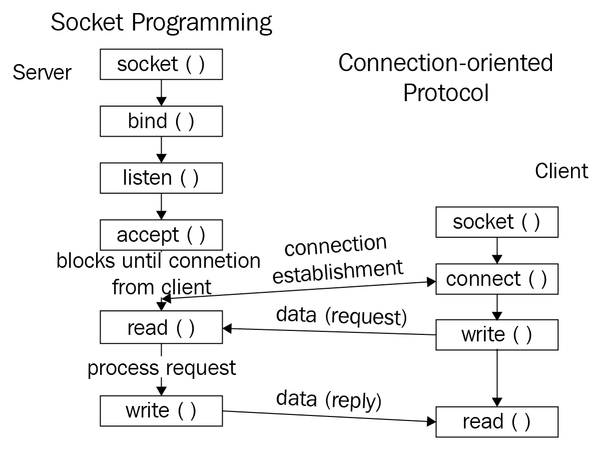
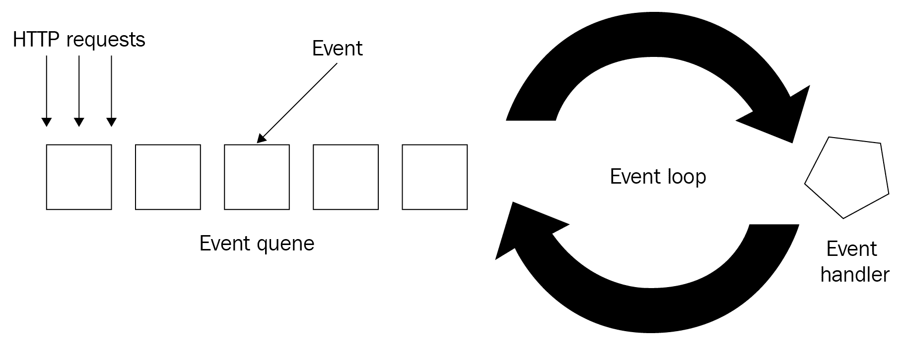

# 第十八章：从头开始构建服务器

在本章中，我们将分析并发编程的更高级应用：从头开始构建一个工作的非阻塞服务器。我们将涵盖`socket`模块的复杂用法，例如将用户业务逻辑与回调隔离，并使用内联生成器编写回调逻辑，这两个实例都设计为并发运行。我们还将讨论使用`await`和`yield`关键字，使用一个示例。

本章将涵盖以下主题：

+   使用`socket`模块的全面 API 从头开始构建服务器

+   关于 Python 生成器和异步生成器的基本信息

+   如何使用`await`和`yield`关键字与内联生成器将阻塞服务器转换为非阻塞服务器

# 技术要求

以下是本章的先决条件列表：

+   确保您的计算机上安装了 Python 3

+   确保您的计算机上安装了`telnet`

+   在[`github.com/PacktPublishing/Mastering-Concurrency-in-Python`](https://github.com/PacktPublishing/Mastering-Concurrency-in-Python)下载 GitHub 存储库

+   在本章中，我们将使用名为`Chapter18`的子文件夹

+   查看以下视频以查看代码的实际操作：[`bit.ly/2KrgWwh`](http://bit.ly/2KrgWwh)

# 通过 socket 模块进行低级网络编程

在本章中，我们将使用 Python 中的内置库`socket`模块来构建我们的工作服务器。`socket`模块是最常用于实现低级通信协议的模块之一，同时提供直观的选项来控制这些协议。在本节中，我们将介绍实现服务器的底层架构的过程，以及模块中将在后面的示例中使用的关键方法和功能。

请注意，为了成功地跟随本章中的示例，您需要在系统上安装 telnet 程序。Telnet 是一个提供终端命令以促进双向交互式基于文本的通信协议的程序。我们在第十一章中介绍了 telnet 的安装，*使用 asyncio 构建通信通道*；如果您的系统上尚未安装 Telnet，请简单地转到（并按照）该章节中的说明。

请注意，macOS 系统有一个名为 Netcat 的预安装替代 Telnet 的程序。如果您不想在 macOS 计算机上安装 Telnet，请在以下示例中使用命令`nc`而不是`telnet`，您将获得相同的效果。

# 服务器端通信理论

在第十一章中，*使用 asyncio 构建通信通道*，您遇到了使用`aiohttp`模块在更高级别实现异步通信通道的简要示例。在本节中，我们将深入探讨服务器端通信通道的编程结构，以及它如何以高效的方式与其客户端进行交互。

在网络编程领域，**套接字**被定义为特定计算机网络节点内的理论端点。套接字负责从其所在的节点接收或发送数据。套接字仅对拥有它的节点可用的事实意味着同一计算机网络中的其他节点在理论上无法与套接字交互。换句话说，套接字仅对其对应的节点可用。

要从服务器端打开通信通道，网络程序员必须首先创建一个套接字并将其绑定到特定地址。该地址通常是一对值，包含有关主机和服务器端口的信息。然后，通过套接字，服务器开始监听网络中由其客户端创建的任何潜在通信请求。因此，客户端对服务器的任何连接请求都需要通过创建的套接字。

在收到潜在客户端的连接请求后，服务器可以决定是否接受该请求。然后两个系统之间将建立连接，这意味着它们可以开始通信并共享数据。当客户端通过通信通道向服务器发送消息时，服务器会处理消息，最终通过相同的通道向客户端发送响应；这个过程会持续，直到它们之间的连接结束，要么是其中一个退出连接通道，要么是通过一些外部因素。

上述是创建服务器并与潜在客户端建立连接的基本过程。在整个过程的每个阶段都实施了多种安全措施，尽管它们不是我们关心的内容，也不会在这里讨论。下面的图表也描述了刚刚描述的过程：



使用套接字进行网络编程

请注意，为了创建连接到服务器的请求，潜在客户端还必须初始化自己的通信通道套接字（如前面的图表所示）。再次强调，我们只关注这个过程的服务器端理论，因此在这里不讨论客户端方面的元素。

# 套接字模块的 API

在本节中，我们将探讨`socket`模块提供的关键 API，以实现先前描述过程中的相同功能。正如我们已经提到的，`socket`模块内置在任何 Python 3 发行版中，因此我们可以简单地将模块导入到我们的程序中，而无需运行安装命令。

要创建套接字，我们将使用`socket.socket()`方法，该方法返回一个套接字对象。这个对象是我们在实现各种通信协议的过程中将要使用的。此外，套接字方法还具有以下方法，帮助我们控制通信协议：

+   `socket.bind()`: 此方法将调用套接字绑定到传递给方法的地址。在我们的示例中，我们将传递一个包含主机地址和通信通道端口的元组。

+   `socket.listen()`: 此方法允许我们创建的服务器接受潜在客户端的连接。还可以传递另一个可选的正整数参数给方法，以指定服务器拒绝新连接之前允许的未接受连接的数量。在我们后面的示例中，我们将使用`5`作为此方法的任意数量。

+   `socket.accept()`: 此方法如其名称所示，接受调用套接字对象的特定连接。首先，调用对象必须绑定到地址并监听连接，才能调用此方法。换句话说，这个方法要在前两个方法之后调用。该方法还返回一对值`(conn, address)`，其中`conn`是已接受连接的新套接字对象，能够发送和接收数据，`address`是连接另一端的地址（客户端地址）。

+   `socket.makefile()`: 此方法返回与调用`socket`对象关联的`file`对象。我们将使用此方法创建一个包含来自服务器接受的客户端数据的文件。这个`file`对象也需要适当地关闭，使用`close()`方法。

+   `socket.sendall()`: 这个方法将传递给调用`socket`对象的数据发送出去。我们将使用这个方法将数据发送回连接到我们服务器的客户端。请注意，这个方法接收字节数据，所以在我们的示例中将向这个方法传递字节字符串。

+   `socket.close()`: 这个方法将调用`socket`对象标记为关闭。在此之后，对`socket`对象的所有操作都将失败。这在我们终止服务器时使用。

# 构建一个简单的回显服务器

真正理解先前描述的方法和函数的使用方式的最佳方法是在示例程序中看到它们的运行。在本节中，我们将构建一个回显服务器作为我们的起始示例。这个服务器，正如术语所示，会将从每个客户端接收到的内容发送回客户端。通过这个示例，您将学习如何设置一个功能齐全的服务器，以及如何处理来自客户端的连接和数据，并且我们将在后面的部分构建更复杂的服务器。

然而，在我们进入代码之前，让我们讨论一下将为该服务器实现通信逻辑的程序结构。首先，我们将有所谓的**反应器**，它设置服务器本身并在潜在客户端请求新连接时提供逻辑。具体来说，一旦服务器设置好，这个反应器将进入一个无限循环，并处理服务器接收到的所有连接请求。

如果您已经阅读了关于异步编程的前几章，也可以将这个反应器看作是一个事件循环。这个事件循环会处理所有要处理的事件（在这种情况下，它们是请求），并使用事件处理程序逐个处理它们。以下图表进一步说明了这个过程：



网络编程中的事件循环

然后，我们程序的第二部分是事件循环类比中的事件处理程序，其中包含用户业务逻辑：如何处理从客户端接收的数据，以及向每个客户端发送什么。对于我们当前的示例，由于它是一个回显服务器，我们只会将每个客户端发送到服务器的任何内容发送回去（如果数据有效）。

有了这个结构，让我们继续实现这个服务器。从 GitHub 页面下载本章的代码，然后转到`Chapter18`文件夹。我们感兴趣的脚本在`Chapter18/example1.py`文件中，如下所示：

```py
# Chapter18/example1.py

import socket

# Main event loop
def reactor(host, port):
    sock = socket.socket()
    sock.bind((host, port))
    sock.listen(5)
    print(f'Server up, running, and waiting for call on {host} {port}')

    try:
        while True:
            conn, cli_address = sock.accept()
            process_request(conn, cli_address)

    finally:
        sock.close()

def process_request(conn, cli_address):
    file = conn.makefile()

    print(f'Received connection from {cli_address}')

    try:
        while True:
            line = file.readline()
            if line:
                line = line.rstrip()
                if line == 'quit':
                    conn.sendall(b'connection closed\r\n')
                    return

                print(f'{cli_address} --> {line}')
                conn.sendall(b'Echoed: %a\r\n' % line)
    finally:
        print(f'{cli_address} quit')
        file.close()
        conn.close()

if __name__ == '__main__':
    reactor('localhost', 8080)
```

程序的结构与我们之前讨论的方式相同：一个反应器和一个用户业务逻辑处理程序（`process_request()`函数）。首先，反应器设置服务器（通过创建套接字，将其绑定到参数主机和端口地址，并调用`listen()`方法）。然后进入一个无限循环，并促进与客户端的任何潜在连接，首先通过在`socket`对象上调用`accept()`方法接受连接，然后调用`process_request()`函数。如果在前面的过程中发生错误，反应器还负责关闭`socket`对象。

另一方面，`process_request()`函数将首先创建一个与传递给它的套接字相关联的`file`对象。同样，这个`file`对象被我们的服务器用来从通过该特定套接字连接的客户端读取数据。具体来说，在制作了`file`对象之后，该函数将进入另一个无限循环，不断从`file`对象中读取数据，使用`readline()`函数。如果从文件中读取的数据是有效的，我们将使用`sendall()`方法将相同的数据发送回去。

我们还打印出服务器从每个客户端接收到的内容作为服务器输出，包括`print(f'{cli_address} --> {line}')`这一行。另一个规定是，如果从文件中读取的数据等于字符串`quit`，那么我们将关闭与该特定客户端的连接。连接关闭后，我们需要仔细处理`socket`对象本身以及与其关联的`file`对象，使用`close()`方法关闭两者。

最后，在我们的程序末尾，我们只需调用`reactor()`函数并向其传递有关我们服务器的信息。在这种情况下，我们只是使用服务器的回环接口，端口为`8080`。现在，我们将执行脚本以初始化我们的本地服务器。您的输出应该类似于以下内容：

```py
> python3 example1.py
Server up, running, and waiting for call on localhost 8080
```

此时，我们的服务器已经启动并运行（如输出所示）。现在，我们想为这个服务器创建一些客户端。为此，打开另一个终端窗口，并使用 Telnet 程序连接到运行中的服务器，运行`telnet localhost 8080`。您的输出应该类似于以下内容：

```py
> telnet localhost 8080
Trying 127.0.0.1...
Connected to localhost.
```

这个输出意味着 Telnet 客户端已成功连接到我们创建的服务器。现在，我们可以测试服务器是否可以按照我们的意图处理其请求。具体来说，输入一些数据并按*return*或*Enter*发送到服务器，您将看到客户端将从服务器接收到一个回显消息，就像我们在前面的`process_request()`函数中实现的那样。同样，客户端可以通过向服务器发送字符串`quit`来停止与该服务器的连接。

在输入几个不同的短语时，以下代码显示了我的输出：

```py
> telnet localhost 8080
Trying 127.0.0.1...
Connected to localhost.
Escape character is '^]'.
hello
Echoed: 'hello'
nice
Echoed: 'nice'
fdkgsnas
Echoed: 'fdkgsnas'
quit
connection closed
Connection closed by foreign host.
```

查看我们服务器的输出，您还可以看到在此连接期间发生了什么：

```py
> python3 example1.py
Server up, running, and waiting for call on localhost 8080
Received connection from ('127.0.0.1', 59778)
('127.0.0.1', 59778) --> hello
('127.0.0.1', 59778) --> nice
('127.0.0.1', 59778) --> fdkgsnas
('127.0.0.1', 59778) quit
```

如上所述，服务器被设计为在反应器中作为事件循环永远运行，可以通过`KeyboardInterrupt`异常停止。

我们已经成功实现了我们的第一个回显服务器，使用了`socket`模块提供的低级方法。在下一节中，我们将为我们的服务器实现更高级的功能，并分析将其转换为可以同时处理多个客户端的非阻塞服务器的过程。

# 使用 socket 模块构建一个计算器服务器

我们试图实现的功能是具有一个简单的请求处理程序，用于计算整数列表的和或乘积，并将其包含在从客户端发送的数据中。具体来说，如果客户端向我们的服务器发送字符串`1`，`2`，`4`，那么服务器应该返回`7`（如果要计算总和）或`8`（如果要计算乘积）。

每个服务器都实现了某种形式的数据处理，除了处理来自客户端的请求并将数据处理任务的结果发送给这些客户端。因此，这个原型将作为更复杂功能的更广泛服务器的第一个构建块。

# 底层计算逻辑

我们将使用 Python 字符串的`split()`方法来提取由字符串中的特定字符分隔的元素。因此，我们要求来自客户端的所有数据都以这种方式格式化（用逗号分隔的整数），如果客户端发送的内容不符合这种格式，我们将简单地发送回一个错误消息，并要求他们发送一个新的消息。

基本的计算逻辑包含在`Chapter18/example2.py`文件中，如下所示：

```py
# Chapter18/example2.py

from operator import mul
from functools import reduce

try:
    while True:
        line = input('Please enter a list of integer, separated by commas: ')
        try:
            nums = list(map(int, line.split(',')))
        except ValueError:
            print('ERROR. Enter only integers separated by commas')
            continue

        print('Sum of input integers', sum(nums))
        print('Product of input integers', reduce(mul, nums, 1))

except KeyboardInterrupt:
    print('\nFinished.')
```

同样，我们使用`split()`方法，带有`,`参数，来提取特定字符串中的各个数字。`sum()`函数用于计算参数列表中数字的和。要计算聚合乘积，我们需要从`operator`模块导入`mul()`方法（用于乘法），以及从`functools`模块导入`reduce()`方法，以在考虑的数字列表中的每个元素上应用乘法。

顺便说一句，传递给`reduce()`方法的第三个参数（数字`1`）是减少过程的起始值。如果您还没有这样做，可以阅读第七章，*进程中的减少运算符*，以了解更多关于减少操作的信息。

至于我们的实际服务器，我们还将跟踪**计算模式**。计算模式的默认值是执行求和，它决定服务器是否应对输入数字列表执行求和和乘法。该模式也是每个客户端连接的唯一模式，并且可以由该客户端切换。具体来说，如果特定客户端发送的数据是字符串`sum`，那么我们将切换计算模式为求和，对于字符串`product`也是一样。

# 实现计算器服务器

现在，让我们来看一下`Chapter18/example3.py`文件中这个服务器的完整实现：

```py
# Chapter18/example3.py

import socket
from operator import mul
from functools import reduce

# Main event loop
def reactor(host, port):
    sock = socket.socket()
    sock.bind((host, port))
    sock.listen(5)
    print(f'Server up, running, and waiting for call on {host} {port}')

    try:
        while True:
            conn, cli_address = sock.accept()
            process_request(conn, cli_address)

    finally:
        sock.close()

def process_request(conn, cli_address):
    file = conn.makefile()

    print(f'Received connection from {cli_address}')
    mode = 'sum'

    try:
        conn.sendall(b'<welcome: starting in sum mode>\n')
        while True:
            line = file.readline()
            if line:
                line = line.rstrip()
                if line == 'quit':
                    conn.sendall(b'connection closed\r\n')
                    return

                if line == 'sum':
                    conn.sendall(b'<switching to sum mode>\r\n')
                    mode = 'sum'
                    continue
                if line == 'product':
                    conn.sendall(b'<switching to product mode>\r\n')
                    mode = 'product'
                    continue

                print(f'{cli_address} --> {line}')
                try:
                    nums = list(map(int, line.split(',')))
                except ValueError:
                    conn.sendall(
                        b'ERROR. 
                        Enter only integers separated by commas\n')
                    continue

                if mode == 'sum':
                    conn.sendall(b'Sum of input numbers: %a\r\n'
                        % str(sum(nums)))
                else:
                    conn.sendall(b'Product of input numbers: %a\r\n'
                        % str(reduce(mul, nums, 1)))
    finally:
        print(f'{cli_address} quit')
        file.close()
        conn.close()

if __name__ == '__main__':
    reactor('localhost', 8080)
```

我们服务器的反应器组件与之前的示例相同，因为事件循环处理相同类型的逻辑。在我们的用户业务逻辑部分（`process_request()`函数）中，我们仍然使用从`makefile()`方法返回的`file`对象来获取服务器客户端发送的数据。如果客户端发送字符串`quit`，则该客户端与服务器之间的连接仍将被停止。

该程序中的第一个新事物是`process_request()`函数中的本地变量`mode`。该变量指定了我们之前讨论过的计算模式，并且默认值为字符串`sum`。正如你所看到的，在`process_request()`函数的`try`块的最后，该变量决定了要发送回当前客户端的数据类型：

```py
if mode == 'sum':
    conn.sendall(b'Sum of input numbers: %a\r\n'
        % str(sum(nums)))
else:
    conn.sendall(b'Product of input numbers: %a\r\n'
        % str(reduce(mul, nums, 1)))
```

此外，如果从客户端发送的数据等于字符串`sum`，那么`mode`变量将被设置为`sum`，对于字符串`product`也是一样。客户端还将收到一条消息，宣布计算模式已更改。这一逻辑包含在以下代码部分中：

```py
if line == 'sum':
    conn.sendall(b'<switching to sum mode>\r\n')
    mode = 'sum'
    continue
if line == 'product':
    conn.sendall(b'<switching to product mode>\r\n')
    mode = 'product'
    continue
```

现在，让我们看看这个服务器在实际实验中的表现。执行程序运行服务器，你会看到类似于之前示例的输出：

```py
> python3 example3.py
Server up, running, and waiting for call on localhost 8080
```

我们将再次使用 Telnet 来为该服务器创建客户端。当你通过 Telnet 客户端连接到服务器时，请尝试输入一些数据来测试我们实现的服务器逻辑。以下代码显示了我使用各种类型的输入所获得的结果：

```py
> telnet localhost 8080
Trying 127.0.0.1...
Connected to localhost.
Escape character is '^]'.
<welcome: starting in sum mode>
1,2
Sum of input numbers: '3'
4,9
Sum of input numbers: '13'
product
<switching to product mode>
0,-3
Product of input numbers: '0'
5,-9,10
Product of input numbers: '-450'
hello
ERROR. Enter only integers separated by commas
a,1
ERROR. Enter only integers separated by commas
quit
connection closed
Connection closed by foreign host.
```

您可以看到我们的服务器可以按我们的意图处理请求。具体来说，它可以计算给定正确格式的输入字符串的和和乘积；它可以适当地切换计算模式；如果输入字符串格式不正确，它可以向客户端发送错误消息。同样，这个长时间运行的服务器可以通过`KeyboardInterrupt`异常停止。

# 构建非阻塞服务器

我们将发现的一件事是，我们当前的服务器是阻塞的。换句话说，它无法同时处理多个客户端。在本节中，您将学习如何在当前服务器的基础上构建非阻塞服务器，使用 Python 关键字来促进并发编程，以及`socket`模块的低级功能。

# 分析服务器的并发性

我们现在将说明我们目前的服务器无法同时处理多个客户端。首先，执行`Chapter18/example3.py`文件再次运行服务器，如下所示：

```py
> python3 example3.py
Server up, running, and waiting for call on localhost 8080
```

与之前的示例类似，现在让我们打开另一个终端并使用 Telnet 连接到正在运行的服务器：

```py
> telnet localhost 8080
Trying 127.0.0.1...
Connected to localhost.
Escape character is '^]'.
<welcome: starting in sum mode>
```

要为此服务器创建第二个客户端，请打开另一个终端并输入相同的`telnet`命令，如下所示：

```py
> telnet localhost 8080
Trying 127.0.0.1...
Connected to localhost.
Escape character is '^]'.
```

在这里，我们已经看到服务器没有正确处理这第二个客户端：它没有将欢迎消息(`<welcome: starting in sum mode>`)发送给这个客户端。如果我们查看服务器的输出，我们还可以看到它只注册了一个客户端，具体来说，是两个客户端中的第一个：

```py
> python3 example3.py
Server up, running, and waiting for call on localhost 8080
Received connection from ('127.0.0.1', 61099)
```

接下来，我们将尝试从每个客户端输入。我们会发现服务器只成功处理来自第一个客户端的请求。具体来说，以下是来自第一个客户端的输出，包括各种类型的输入：

```py
> telnet localhost 8080
Trying 127.0.0.1...
Connected to localhost.
Escape character is '^]'.
<welcome: starting in sum mode>
hello
ERROR. Enter only integers separated by commas
1,5
Sum of input numbers: '6'
product
<switching to product mode>
6,7
Product of input numbers: '42'
```

现在，第一个客户端仍然与服务器保持连接，切换到第二个客户端的终端并尝试输入自己的输入。你会发现，与第一个客户端不同，这个客户端没有从服务器那里收到任何消息：

```py
> telnet localhost 8080
Trying 127.0.0.1...
Connected to localhost.
Escape character is '^]'.
hello
1,5
product
6,7
```

如果我们查看服务器的输出，我们会发现服务器只处理来自第一个客户端的请求：

```py
> python3 example3.py
Server up, running, and waiting for call on localhost 8080
Received connection from ('127.0.0.1', 61099)
('127.0.0.1', 61099) --> hello
('127.0.0.1', 61099) --> 1,5
('127.0.0.1', 61099) --> 6,7
```

第二个客户端能够与服务器交互的唯一方法是第一个客户端断开与服务器的连接，换句话说，当我们停止第一个客户端与服务器之间的连接时：

```py
> telnet localhost 8080
Trying 127.0.0.1...
Connected to localhost.
Escape character is '^]'.
<welcome: starting in sum mode>
hello
ERROR. Enter only integers separated by commas
1,5
Sum of input numbers: '6'
product
<switching to product mode>
6,7
Product of input numbers: '42'
quit
connection closed
Connection closed by foreign host.
```

现在，如果你切换到第二个客户端的终端，你会发现客户端将被服务器之前应该接收的消息刷屏：

```py
> telnet localhost 8080
Trying 127.0.0.1...
Connected to localhost.
Escape character is '^]'.
hello
1,5
product
6,7
<welcome: starting in sum mode>
ERROR. Enter only integers separated by commas
Sum of input numbers: '6'
<switching to product mode>
Product of input numbers: '42'
```

服务器的所有适当回复现在都存在，但它们一次性发送，而不是在每个输入消息之后。相同的信息激增也在我们服务器终端的输出中得到了体现：

```py
> python3 example3.py
Server up, running, and waiting for call on localhost 8080
Received connection from ('127.0.0.1', 61099)
('127.0.0.1', 61099) --> hello
('127.0.0.1', 61099) --> 1,5
('127.0.0.1', 61099) --> 6,7
('127.0.0.1', 61099) quit
Received connection from ('127.0.0.1', 61100)
('127.0.0.1', 61100) --> hello
('127.0.0.1', 61100) --> 1,5
('127.0.0.1', 61100) --> 6,7
```

这个输出让人觉得服务器只在第一个客户端退出后才收到了来自第二个客户端的连接，但实际上，我们创建了两个客户端，并让它们同时与服务器通信。这是因为我们目前的服务器只能一次处理一个客户端，只有在当前客户端退出后，它才能继续处理请求通信通道的下一个客户端。我们称之为阻塞服务器。

# Python 中的生成器

在下一节中，我们将讨论如何将我们目前拥有的阻塞服务器转换为非阻塞服务器，同时保留计算功能。为了做到这一点，我们首先需要了解 Python 编程中的另一个概念，称为**生成器**。你可能已经使用过 Python 生成器，但为了复习，我们将在本节中介绍生成器的关键特性。

生成器是返回迭代器并可以动态暂停和恢复的函数。生成器的返回值通常与列表对象进行比较，因为生成器迭代器是**惰性**的，只有在明确要求时才会产生结果。因此，当涉及大量数据时，生成器迭代器在内存管理方面更有效，因此通常比列表更受青睐。

每个生成器都被定义为一个函数，但是在函数块内部不使用关键字`return`，而是使用`yield`，这是为了表示返回值只是临时的，整个生成器本身在获得返回值后仍然可以恢复。让我们看看 Python 生成器在`Chapter18/example4.py`文件中的示例：

```py
# Chapter18/example4.py

def read_data():
    for i in range(5):
        print('Inside the inner for loop...')
        yield i * 2

result = read_data()
for i in range(6):
    print('Inside the outer for loop...')
    print(next(result))

print('Finished.')
```

在这里，我们有一个名为`read_data()`的生成器，它以懒惰的方式返回从 0 到 8 的 2 的倍数。这是通过关键字`yield`来实现的，该关键字放在否则正常函数中的返回值`i * 2`的前面。请注意，`yield`关键字放在迭代器中应该发送回的**单个**元素的前面，这有助于懒惰生成。

现在，在我们的主程序中，我们正在获取整个迭代器并将其存储在变量`result`中。然后，我们使用`next()`函数循环遍历该迭代器六次（显然，返回传入的迭代器中的下一个元素）。执行代码后，您的输出应该类似于以下内容：

```py
> python3 example4.py
Inside the outer for loop...
Inside the inner for loop...
0
Inside the outer for loop...
Inside the inner for loop...
2
Inside the outer for loop...
Inside the inner for loop...
4
Inside the outer for loop...
Inside the inner for loop...
6
Inside the outer for loop...
Inside the inner for loop...
8
Inside the outer for loop...
Traceback (most recent call last):
 File "example4.py", line 11, in <module>
 print(next(result))
StopIteration
```

您可以看到，即使在我们循环遍历迭代器之前，迭代器是从`read_data()`生成器中生成并返回的，但是生成器内部的实际指令只有在我们尝试从迭代器中获取更多项目时才会执行。

这可以通过输出中的打印语句交替放置来说明（来自外部`for`循环和内部`for`循环的一个打印语句交替出现）：执行流程首先进入外部`for`循环，尝试访问迭代器中的下一个项目，进入生成器，然后进入自己的`for`循环。一旦执行流程到达`yield`关键字，它就会回到主程序。这个过程会一直持续，直到其中一个`for`循环终止；在我们的例子中，生成器中的`for`循环首先停止，因此在最后遇到了`StopIteration`错误。

迭代器的生成懒惰性来自于生成器在到达`yield`关键字时停止执行，并且只在外部指令要求时（在这种情况下是通过`next()`函数）才继续执行。再次强调，这种形式的数据生成在内存管理方面比简单生成可能需要迭代的所有内容（如列表）要高效得多。

# 异步生成器和发送方法

生成器与我们构建异步服务器的目的有何关联？我们当前的服务器无法处理多个客户端的原因是，我们在用户业务逻辑部分使用的`readline()`函数是一个阻塞函数，只要当前的`file`对象仍然打开，就会阻止执行流程转向其他潜在的客户端。这就是为什么当当前客户端与服务器断开连接时，下一个客户端立即收到我们之前看到的大量信息的原因。

如果我们能够将这个函数重写为一个异步函数，允许执行流程在所有连接到服务器的不同客户端之间切换，那么该服务器将变成非阻塞的。我们将使用异步生成器来同时从潜在的多个客户端并发生成数据，以供我们的服务器使用。

为了看到我们将用于服务器的异步生成器的基本结构，让我们首先考虑`Chapter18/example5.py`文件，如下所示：

```py
# Chapter18/example5.py

import types

@types.coroutine
def read_data():
    def inner(n):
        try:
            print(f'Printing from read_data(): {n}')
            callback = gen.send(n * 2)
        except StopIteration:
            pass

    data = yield inner
    return data

async def process():
    try:
        while True:
            data = await read_data()
            print(f'Printing from process(): {data}')
    finally:
        print('Processing done.')

gen = process()
callback = gen.send(None)

def main():
    for i in range(5):
        print(f'Printing from main(): {i}')
        callback(i)

if __name__ == '__main__':
    main()
```

我们仍在考虑打印出 0 到 8 之间的 2 的倍数的任务。在这个例子中，`process()`函数是我们的异步生成器。您可以看到，实际上在生成器内部没有`yield`关键字；这是因为我们使用了`await`关键字。这个异步生成器负责打印出由另一个生成器`read_data()`计算的 2 的倍数。

`@types.coroutine`装饰器用于将生成器`read_data()`转换为一个返回基于生成器的协程的协程函数，这个协程函数仍然可以像常规生成器一样使用，但也可以被等待。这个基于生成器的协程是将我们的阻塞服务器转换为非阻塞服务器的关键。协程使用`send()`方法进行计算，这是一种向生成器提供输入的方法（在这种情况下，我们向`process()`生成器提供 2 的倍数）。

这个协程返回一个回调函数，稍后可以被我们的主程序调用。这就是为什么在主程序中循环`range(5)`之前，我们需要跟踪`process()`生成器本身（存储在变量`gen`中）和返回的回调（存储在变量`callback`中）。具体来说，回调是`gen.send(None)`的返回值，用于启动`process()`生成器的执行。最后，我们简单地循环遍历上述的`range`对象，并使用适当的输入调用`callback`对象。

关于使用异步生成器的理论已经有很多讨论。现在，让我们看看它的实际应用。执行程序，你应该会得到以下输出：

```py
> python3 example5.py
Printing from main(): 0
Printing from read_data(): 0
Printing from process(): 0
Printing from main(): 1
Printing from read_data(): 1
Printing from process(): 2
Printing from main(): 2
Printing from read_data(): 2
Printing from process(): 4
Printing from main(): 3
Printing from read_data(): 3
Printing from process(): 6
Printing from main(): 4
Printing from read_data(): 4
Printing from process(): 8
Processing done.
```

在输出中（具体来说，是打印语句），我们仍然可以观察到任务切换事件，这对于之前章节中讨论的异步编程和产生输出的生成器来说是至关重要的。基本上，我们实现了与之前示例相同的目标（打印 2 的倍数），但在这里，我们使用了异步生成器（使用`async`和`await`关键字）来促进任务切换事件，并且我们还能够通过使用回调向生成器传递特定参数。这些技术的结合形成了将应用于我们当前阻塞服务器的基本结构。

# 使服务器非阻塞

最后，我们将再次考虑实现非阻塞服务器的问题。在这里，我们将之前讨论过的异步生成器应用于服务器的客户端接收数据的异步读取和处理。服务器的实际代码包含在`Chapter18/example6.py`文件中；我们将逐步介绍其中的各个部分，因为这是一个相对较长的程序。让我们先关注一下这个程序中将会有的全局变量：

```py
# Chapter18/example6.py

from collections import namedtuple

###########################################################################
# Reactor

Session = namedtuple('Session', ['address', 'file'])

sessions = {}         # { csocket : Session(address, file)}
callback = {}         # { csocket : callback(client, line) }
generators = {}       # { csocket : inline callback generator }
```

为了成功地为多个客户端同时提供服务，我们将允许服务器同时拥有多个会话（每个客户端一个），因此，我们需要跟踪多个字典，每个字典将保存关于当前会话的特定信息。

具体来说，`sessions`字典将客户端套接字连接映射到一个`Session`对象，这是一个 Python 的`namedtuple`对象，其中包含客户端的地址和与该客户端连接关联的`file`对象。`callback`字典将客户端套接字连接映射到一个回调函数，这个回调函数是我们稍后将实现的异步生成器的返回值；每个这样的回调函数都以其对应的客户端套接字连接和从该客户端读取的数据作为参数。最后，`generators`字典将客户端套接字连接映射到其对应的异步生成器。

现在，让我们来看一下`reactor`函数：

```py
# Chapter18/example6.py

import socket, select

# Main event loop
def reactor(host, port):
    sock = socket.socket()
    sock.bind((host, port))
    sock.listen(5)
    sock.setblocking(0) # Make asynchronous

    sessions[sock] = None
    print(f'Server up, running, and waiting for call on {host} {port}')

    try:
        while True:
            # Serve existing clients only if they already have data ready
            ready_to_read, _, _ = select.select(sessions, [], [], 0.1)
            for conn in ready_to_read:
                if conn is sock:
                    conn, cli_address = sock.accept()
                    connect(conn, cli_address)
                    continue

                line = sessions[conn].file.readline()
                if line:
                    callbackconn)
                else:
                    disconnect(conn)
    finally:
        sock.close()
```

除了我们之前阻塞服务器中已经有的内容，我们还添加了一些指令：我们使用`socket`模块中的`setblocking()`方法来潜在地使我们的服务器异步或非阻塞；因为我们正在启动一个服务器，我们还将特定的套接字注册到`sessions`字典中，暂时使用`None`值。

在我们的无限`while`循环（事件循环）中是我们试图实现的新的非阻塞特性的一部分。首先，我们使用`select`模块的`select()`方法来单独选择`sessions`字典中准备好被读取的套接字（换句话说，具有可用数据的套接字）。由于该方法的第一个参数是要读取的数据，第二个是要写入的数据，第三个是异常数据，我们只在第一个参数中传入`sessions`字典。第四个参数指定了方法的超时时间（以秒为单位）；如果未指定，该方法将无限期地阻塞，直到`sessions`中至少有一项可用，这对于我们的非阻塞服务器来说是不合适的。

接下来，对于每个准备被读取的客户端套接字连接，如果连接对应于我们原始的服务器套接字，我们将接受该连接并调用`connect()`函数（我们将很快看到）。在这个`for`循环中，我们还将处理回调方法。具体来说，我们将访问当前套接字连接的会话的`file`属性（回想一下，每个会话都有一个`address`属性和一个`file`属性），并将使用`readline()`方法从中读取数据。现在，如果我们读到的是有效数据，那么我们将把它（连同当前客户端连接）传递给相应的回调；否则，我们将结束连接。

请注意，尽管我们的服务器通过将套接字设置为非阻塞而变成了异步的，但前面的`readline()`方法仍然是一个阻塞函数。`readline()`函数在输入数据中遇到回车符（ASCII 中的`'\r'`字符）时返回。这意味着，如果客户端发送的数据不包含回车符，那么`readline()`函数将无法返回。然而，由于服务器仍然是非阻塞的，将会引发错误异常，以便其他客户端不会被阻塞。

现在，让我们来看看我们的新辅助函数：

```py
# Chapter18/example6.py

def connect(conn, cli_address):
    sessions[conn] = Session(cli_address, conn.makefile())

    gen = process_request(conn)
    generators[conn] = gen
    callback[conn] = gen.send(None) # Start the generator

def disconnect(conn):
    gen = generators.pop(conn)
    gen.close()
    sessions[conn].file.close()
    conn.close()

    del sessions[conn]
    del callback[conn]
```

`connect()`函数在客户端连接有准备好被读取的数据时将被调用，它将在与客户端的有效连接开始时启动指令。首先，它初始化与该特定客户端连接相关联的`namedtuple`对象（我们仍然在这里使用`makefile()`方法来创建`file`对象）。函数的其余部分是我们之前讨论过的异步生成器的用法模式：我们将客户端连接传递给现在是异步生成器的`process_request()`，将其注册到`generators`字典中；让它调用`send(None)`来启动生成器；并将返回值存储到`callback`字典中，以便稍后调用（具体来说，在我们刚刚看到的反应器中的事件循环的最后部分）。

另一方面，`disconnect()`函数在与客户端的连接停止时提供各种清理指令。它从`generators`字典中移除与客户端连接相关联的生成器，并关闭`sessions`字典中存储的`file`对象以及客户端连接本身。最后，它从剩余的字典中删除与客户端连接对应的键。

让我们把注意力转向现在是异步生成器的新`process_request()`函数：

```py
# Chapter18/example6.py

from operator import mul
from functools import reduce

###########################################################################
# User's Business Logic

async def process_request(conn):
    print(f'Received connection from {sessions[conn].address}')
    mode = 'sum'

    try:
        conn.sendall(b'<welcome: starting in sum mode>\n')
        while True:
            line = await readline(conn)
            if line == 'quit':
                conn.sendall(b'connection closed\r\n')
                return
            if line == 'sum':
                conn.sendall(b'<switching to sum mode>\r\n')
                mode = 'sum'
                continue
            if line == 'product':
                conn.sendall(b'<switching to product mode>\r\n')
                mode = 'product'
                continue

            print(f'{sessions[conn].address} --> {line}')
            try:
                nums = list(map(int, line.split(',')))
            except ValueError:
                conn.sendall(
                    b'ERROR. Enter only integers separated by commas\n')
                continue

            if mode == 'sum':
                conn.sendall(b'Sum of input integers: %a\r\n'
                    % str(sum(nums)))
            else:
                conn.sendall(b'Product of input integers: %a\r\n'
                    % str(reduce(mul, nums, 1)))
    finally:
        print(f'{sessions[conn].address} quit')
```

处理客户端数据并执行计算的逻辑保持不变，这个新函数的唯一区别是`async`关键字（放在`def`关键字前面）和与新的`readline()`函数一起使用的`await`关键字。这些区别本质上将我们的`process_request()`函数转换为一个非阻塞函数，条件是新的`readline()`函数也是非阻塞的。

```py
# Chapter18/example6.py

import types

@types.coroutine
def readline(conn):
    def inner(conn, line):
        gen = generators[conn]
        try:
            callback[conn] = gen.send(line) # Continue the generator
        except StopIteration:
            disconnect(conn)

    line = yield inner
    return line
```

类似于我们在前面的例子中看到的，我们从 Python 中导入`types`模块，并使用`@types.coroutine`装饰器将`readline()`函数变成基于生成器的协程，这是非阻塞的。每次调用回调函数（接受客户端连接和一行数据）时，执行流程将进入这个协程内部的`inner()`函数并执行指令。

具体来说，它将数据行发送到生成器，生成器将使`process_request()`中的指令异步处理并将返回值存储到适当的回调中，除非已经到达生成器的末尾，在这种情况下将调用`disconnect()`函数。

我们的最后一个任务是测试这个服务器是否真的能够同时处理多个客户端。为此，首先执行以下脚本：

```py
> python3 example6.py
Server up, running, and waiting for call on localhost 8080
```

类似于您之前看到的，打开两个额外的终端并使用 Telnet 连接到正在运行的服务器：

```py
> telnet localhost 8080
Trying 127.0.0.1...
Connected to localhost.
Escape character is '^]'.
<welcome: starting in sum mode>
```

正如您所看到的，两个客户端都被正确处理：两者都能够连接，并且都收到了欢迎消息。这也可以通过服务器输出来说明，如下所示：

```py
> python3 example6.py
Server up, running, and waiting for call on localhost 8080
Received connection from ('127.0.0.1', 63855)
Received connection from ('127.0.0.1', 63856)
```

进一步的测试可能涉及同时向服务器发送消息，它仍然可以处理。服务器还可以跟踪独立于各个客户端的独特计算模式（换句话说，假设每个客户端都有一个单独的计算模式）。我们已经成功地从头开始构建了一个非阻塞的并发服务器。

# 总结

往往，低级网络编程涉及套接字的操作和处理（在特定计算机网络的节点内定义为理论端点，负责从它们所在的节点接收或发送数据）。服务器端通信的架构包括多个涉及套接字处理的步骤，如绑定、监听、接受、读取和写入。`socket`模块提供了一个直观的 API，便于进行这些步骤。

要使用`socket`模块创建非阻塞服务器，需要实现异步生成器，以便执行流程在任务和数据之间切换。这个过程还涉及使用回调，可以在以后执行流程运行。这两个元素允许服务器同时读取和处理来自多个客户端的数据，使服务器成为非阻塞。

我们将在下一章中结束我们的书，介绍设计和实现并发程序的实用技术。具体来说，我们将讨论如何系统地和有效地测试、调试和安排并发应用程序。

# 问题

+   什么是套接字？它与网络编程有什么关系？

+   当潜在客户端请求连接时，服务器端通信的程序是什么？

+   `socket`模块提供了哪些方法来便于服务器端的低级网络编程？

+   什么是生成器？它们相对于 Python 列表的优势是什么？

+   什么是异步生成器？它们如何应用于构建非阻塞服务器？

# 进一步阅读

要获取更多信息，您可以参考以下链接：

+   *并发演讲*，PyBay 2017，Raymond Hettinger ([`pybay.com/site_media/slides/raymond2017-keynote/async_examples.html`](https://pybay.com/site_media/slides/raymond2017-keynote/async_examples.html)) [](https://pybay.com/site_media/slides/raymond2017-keynote/async_examples.html)

+   *一个简单的 Python Web 服务器*，Stephen C. Phillips ([blog.scphillips.com/posts/2012/12/a-simple-python-webserver/](http://blog.scphillips.com/posts/2012/12/a-simple-python-webserver/))

+   *如何在 Python 中使用 TCP 套接字*，Alexander Stepanov ([steelkiwi.com/blog/working-tcp-sockets/](https://steelkiwi.com/blog/working-tcp-sockets/))

+   Python 中的套接字编程，Nathan Jennings（realpython.com/python-sockets/#multi-connection-client-and-server）

+   Python 生成器简介（realpython.com/introduction-to-python-generators/）
