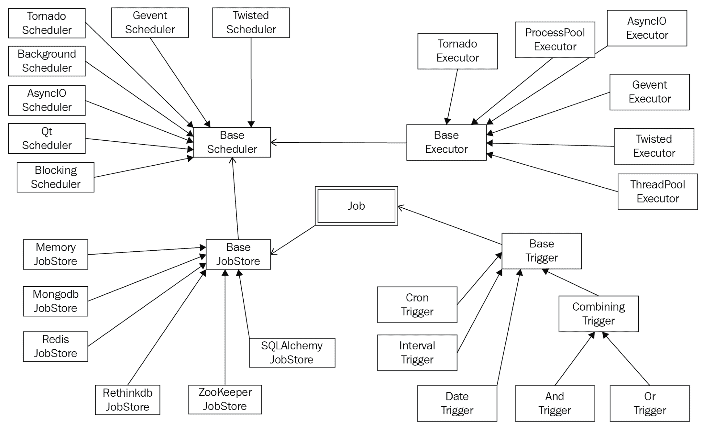

# 第十九章：测试、调试和并发应用程序的调度

在本章中，我们将讨论在更高层次上使用并发 Python 程序的过程。首先，您将学习如何安排 Python 程序在以后同时运行，无论是一次还是定期。我们将分析 APScheduler，这是一个允许我们在跨平台基础上做到这一点的 Python 库。此外，我们将讨论测试和调试，这是编程中必不可少但经常被忽视的组成部分。鉴于并发编程的复杂性，测试和调试甚至比传统应用程序更加困难。本章将涵盖一些有效测试和调试并发程序的策略。

本章将涵盖以下主题：

+   APScheduler 库及其在并发调度 Python 应用程序中的使用

+   Python 程序的不同测试技术

+   Python 编程中的调试实践，以及并发特定的调试技术

# 技术要求

本章的先决条件如下：

+   确保您的计算机上安装了 Python 3

+   确保您的 Python 发行版中安装了`apscheduler`和`concurrencytest`库

+   在[`github.com/PacktPublishing/Mastering-Concurrency-in-Python`](https://github.com/PacktPublishing/Mastering-Concurrency-in-Python)下载 GitHub 存储库

+   在本章中，我们将使用名为`Chapter19`的子文件夹进行工作

+   查看以下视频以查看代码的实际操作：[`bit.ly/2OZdOZc`](http://bit.ly/2OZdOZc)

# 使用 APScheduler 进行调度

**APScheduler**（**Advanced Python Scheduler**的缩写）是一个外部 Python 库，支持安排 Python 代码以便稍后执行，无论是一次还是定期。该库为我们提供了高级选项，以动态地向作业列表中添加/删除作业，以便安排和执行，以及决定如何将这些作业分配给不同的线程和进程。

有些人可能会认为 Celery（[`www.celeryproject.org/`](http://www.celeryproject.org/)）是 Python 的首选调度工具。然而，虽然 Celery 是一个具有基本调度功能的分布式任务队列，但 APScheduler 恰恰相反：它是一个具有基本任务排队选项和高级调度功能的调度程序。此外，两种工具的用户都报告说 APScheduler 更容易设置和实现。

# 安装 APScheduler

与大多数常见的 Python 外部库一样，可以通过包管理器`pip`来安装 APScheduler，只需在终端中运行以下命令：

```py
pip install apscheduler
```

如果`pip`命令不起作用，另一种安装此库的方法是从 PyPI 手动下载源代码，网址为[pypi.org/project/APScheduler/](https://pypi.org/project/APScheduler/)。然后可以通过运行以下命令来提取和安装下载的文件：

```py
python setup.py install
```

与往常一样，要测试您的 APScheduler 发行版是否已正确安装，请打开 Python 解释器并尝试导入库，如下所示：

```py
>>> import apscheduler
```

如果没有返回错误，这意味着库已经完全安装并准备好使用。

# 不是调度服务

由于术语“调度程序”可能会对特定开发人员群体产生误导，让我们澄清 APScheduler 提供的功能，以及它不提供的功能。首先，该库可以用作跨平台调度程序，也可以是特定于应用程序的，而不是更常见的特定于平台的调度程序，比如 cron 守护程序（用于 Linux 系统）或 Windows 任务调度程序。

值得注意的是，APScheduler 本身并不是一个具有预构建 GUI 或命令行界面的调度服务。它仍然是一个必须在现有应用程序中导入和利用的 Python 库（这就是为什么它是特定于应用程序的）。然而，正如您将在后面了解到的，APScheduler 具有许多功能，可以利用来构建实际的调度服务。

例如，现在对于 Web 应用程序来说，调度作业（特别是后台作业）的能力是至关重要的，因为它们可以包括不同但重要的功能，如发送电子邮件或备份和同步数据。在这种情况下，APScheduler 可以说是调度云应用程序任务的最常见工具，这些任务涉及 Python 指令，如 Heroku 和 PythonAnywhere。

# APScheduler 功能

让我们探索 APScheduler 库提供的一些最常见功能。在执行方面，它提供了三种不同的调度机制，这样我们就可以选择最适合自己应用程序的机制（有时也称为事件触发器）：

+   **Cron 风格调度**：此机制允许作业具有预定的开始和结束时间

+   **基于间隔的执行**：此机制以均匀的间隔运行作业（例如，每两分钟、每天），并可选择开始和结束时间

+   **延迟执行**：此机制允许应用程序在执行作业列表中的项目之前等待特定的时间段

此外，APScheduler 允许我们将要在各种后端系统中执行的作业存储在常规内存、MongoDB、Redis、RethinkDB、SPLAlchemy 或 ZooKeeper 等系统中。无论是桌面程序、Web 应用程序还是简单的 Python 脚本，APScheduler 都很可能能够处理定时作业的存储方式。

除此之外，该库还可以与常见的 Python 并发框架（如 AsyncIO、Gevent、Tornado 和 Twisted）无缝配合工作。这意味着 APScheduler 库中包含的低级代码包含了可以协调安排和执行这些框架中实现的函数和程序的指令，使得该库更加动态。

最后，APScheduler 提供了不同的选项来实际执行计划代码，通过指定适当的执行器。具体来说，可以简单地以阻塞方式或后台方式执行作业。我们还可以选择使用线程或进程池以并发方式分发工作。稍后，我们将看一个示例，其中我们利用进程池来执行定时作业。

以下图表显示了 APScheduler 中包含的所有主要类和功能：



APScheduler-主要类和功能

# APScheduler API

在本节中，我们将看看如何将 APScheduler 实际集成到现有的 Python 程序中，分析库提供的不同类和方法。当我们利用并发执行器运行我们的定时作业时，我们还将看看作业如何分布在不同的线程和进程中。

# 调度器类

首先，让我们看看我们的主调度器可用的选项，这是安排任务在以后执行过程中最重要的组件：

+   `BlockingScheduler`：当调度程序打算是进程中唯一运行的任务时，应使用此类。顾名思义，此类的实例将阻止同一进程中的任何其他指令。

+   `BackgroundScheduler`：与`BlockingScheduler`相反，此类允许在现有应用程序内后台执行定时作业。

此外，如果您的应用程序使用特定的并发框架，则还有调度器类可供使用：`AsyncIOScheduler`用于`asyncio`模块；`GeventScheduler`用于 Gevent；`TornadoScheduler`用于 Tornado 应用程序；`TwistedScheduler`用于 Twisted 应用程序；等等。

# 执行器类

在安排将来执行的作业的过程中，另一个重要的选择是：哪个执行器应该运行这些作业？通常建议使用默认执行器`ThreadPoolExecutor`，它在同一进程中的不同线程之间分配工作。然而，正如您所了解的，如果预定的作业包含利用 CPU 密集型操作的指令，则工作负载应该分布在多个 CPU 核心上，并且应该使用`ProcessPoolExecutor`。

重要的是要注意，这两个执行器类与我们在早期章节中讨论的`concurrent.futures`模块进行交互，以便实现并发执行。这两个执行器类的默认最大工作线程数为`10`，可以在初始化时进行更改。

# 触发关键字

在构建调度器的过程中的最后一个决定是如何在将来执行预定的作业；这是我们之前提到的事件触发选项。APScheduler 提供了三种不同的触发机制；以下关键字应作为参数传递给调度器初始化程序，以指定事件触发类型：

+   `'日期'`: 当工作需要在将来的特定时间点运行一次时使用此关键字。

+   `'间隔'`: 当工作需要定期以固定时间间隔运行时使用此关键字。我们稍后在示例中将使用此关键字。

+   `'cron'`: 当作业需要在一天的特定时间定期运行时使用此关键字。

此外，可以混合和匹配多种类型的触发器。我们还可以选择在所有注册的触发器都指定时执行预定的作业，或者在至少一个触发器指定时执行。

# 常见的调度器方法

最后，让我们考虑在声明调度器时常用的方法，以及前面提到的类和关键字。具体来说，以下方法由`scheduler`对象调用：

+   `add_executor()`: 调用此方法来注册一个执行器以在将来运行作业。通常，我们将字符串`'processpool'`传递给此方法，以便将作业分布在多个进程中。否则，如前所述，默认执行器将使用线程池。此方法还返回一个可以进一步操作的执行器对象。

+   `remove_executor()`: 此方法用于在执行器对象上移除它。

+   `add_job()`: 此方法可用于将额外的作业添加到作业列表中，以便稍后执行。该方法首先接受一个可调用对象，该对象是作业列表中的新作业，以及用于指定作业应如何预定和执行的各种其他参数。与`add_executor()`类似，此方法可以返回一个可以在方法外部操作的`job`对象。

+   `remove_job()`: 类似地，此方法可以用于`job`对象，以将其从调度器中移除。

+   `start()`: 此方法启动预定的作业以及已实现的执行器，并开始处理作业列表。

+   `shutdown()`: 此方法停止调用调度器对象，以及其作业列表和已实现的执行器。如果在当前有作业运行时调用它，这些作业将不会被中断。

# Python 示例

在本小节中，我们将看看我们讨论的一些 API 在示例 Python 程序中的使用方式。从 GitHub 页面下载本书的代码，然后转到`Chapter19`文件夹。

# 阻塞调度器

首先，让我们看一个阻塞调度器的示例，在`Chapter19/example1.py`文件中：

```py
# Chapter19/example1.py

from datetime import datetime

from apscheduler.schedulers.background import BlockingScheduler

def tick():
    print(f'Tick! The time is: {datetime.now()}')

if __name__ == '__main__':
    scheduler = BlockingScheduler()
    scheduler.add_job(tick, 'interval', seconds=3)

    try:
        scheduler.start()
        print('Printing in the main thread.')
    except KeyboardInterrupt:
        pass

scheduler.shutdown()
```

在这个例子中，我们正在为前面代码中指定的`tick()`函数实现一个调度程序，该函数简单地打印出执行时的当前时间。在我们的主函数中，我们使用了从 APScheduler 导入的`BlockingScheduler`类的实例作为本程序的调度程序。除此之外，上述的`add_job()`方法被用来注册`tick()`作为稍后要执行的作业。具体来说，它应该定期执行，以均匀的间隔（由传入的`'interval'`字符串指定）——特别是每三秒钟（由参数`seconds=3`指定）。

请记住，阻塞调度程序将阻止在其运行的同一进程中的所有其他指令。为了测试这一点，我们还在启动调度程序后插入了一个`print`语句，以查看它是否会被执行。运行脚本后，您的输出应该类似于以下内容（除了正在打印的具体时间）：

```py
> python3 example1.py
Tick! The time is: 2018-10-31 17:25:01.758714
Tick! The time is: 2018-10-31 17:25:04.760088
Tick! The time is: 2018-10-31 17:25:07.762981
```

请注意，该调度程序将永远运行，除非它被`KeyboardInterrupt`事件或其他潜在异常停止，并且我们放在主程序末尾附近的打印语句将永远不会被执行。因此，只有在打算在其进程中运行的唯一任务时，才应该使用`BlockingScheduler`类。

# 后台调度程序

在这个例子中，我们将看看是否使用`BackgroundScheduler`类会有所帮助，如果我们想要在后台并发地执行我们的调度程序。此示例的代码包含在`Chapter19/example2.py`文件中，如下所示：

```py
# Chapter19/example2.py

from datetime import datetime
import time

from apscheduler.schedulers.background import BackgroundScheduler

def tick():
    print(f'Tick! The time is: {datetime.now()}')

if __name__ == '__main__':
    scheduler = BackgroundScheduler()
    scheduler.add_job(tick, 'interval', seconds=3)
    scheduler.start()

    try:
        while True:
            time.sleep(2)
            print('Printing in the main thread.')
    except KeyboardInterrupt:
        pass

scheduler.shutdown()
```

这个例子中的代码几乎与我们之前的代码相同。然而，在这里，我们使用了后台调度程序的类，并且每两秒钟在一个无限的`while`循环中从主程序中打印出消息。理论上，如果`scheduler`对象确实可以在后台运行计划的作业，我们的输出将由主程序和`tick()`函数中的打印语句的组合组成。

执行脚本后，以下是我的输出：

```py
> python3 example2.py
Printing in the main thread.
Tick! The time is: 2018-10-31 17:36:35.231531
Printing in the main thread.
Tick! The time is: 2018-10-31 17:36:38.231900
Printing in the main thread.
Printing in the main thread.
Tick! The time is: 2018-10-31 17:36:41.231846
Printing in the main thread.
```

同样，调度程序将一直继续下去，直到从键盘中产生中断。在这里，我们可以看到我们期望看到的东西：主程序和计划的作业的打印语句同时产生，表明调度程序确实在后台运行。

# 执行器池

APScheduler 提供的另一个功能是能够将计划的作业分发到多个 CPU 核心（或进程）上执行。在这个例子中，您将学习如何使用后台调度程序来实现这一点。转到`Chapter19/example3.py`文件并检查包含的代码，如下所示：

```py
# Chapter19/example3.py

from datetime import datetime
import time
import os

from apscheduler.schedulers.background import BackgroundScheduler

def task():
    print(f'From process {os.getpid()}: The time is {datetime.now()}')
    print(f'Starting job inside {os.getpid()}')
    time.sleep(4)
    print(f'Ending job inside {os.getpid()}')

if __name__ == '__main__':
    scheduler = BackgroundScheduler()
    scheduler.add_executor('processpool')
    scheduler.add_job(task, 'interval', seconds=3, max_instances=3)
    scheduler.start()

    try:
        while True:
            time.sleep(1)
    except KeyboardInterrupt:
        pass

scheduler.shutdown()
```

在这个程序中，我们想要调度的作业（`task()`函数）在每次调用时打印出运行它的进程的标识符（使用`os.getpid()`方法），并且设计为持续约四秒钟。在主程序中，我们使用了上一个示例中使用的相同后台调度程序，但我们指定了计划的作业应该在一个进程池中执行：

```py
scheduler.add_executor('processpool')
```

请记住，此进程池中进程数量的默认值为 10，可以更改为不同的值。接下来，当我们将作业添加到调度程序时，我们还必须指定此作业可以在多个进程实例中执行（在本例中为三个实例）；这允许我们的进程池执行程序得到充分和高效地利用：

```py
scheduler.add_job(task, 'interval', seconds=3, max_instances=3)
```

运行程序后，我的输出的前几行如下：

```py
> python3 example3.py
From process 1213: The time is 2018-11-01 10:18:00.559319
Starting job inside 1213
From process 1214: The time is 2018-11-01 10:18:03.563195
Starting job inside 1214
Ending job inside 1213
From process 1215: The time is 2018-11-01 10:18:06.531825
Starting job inside 1215
Ending job inside 1214
From process 1216: The time is 2018-11-01 10:18:09.531439
Starting job inside 1216
Ending job inside 1215
From process 1217: The time is 2018-11-01 10:18:12.531940
Starting job inside 1217
Ending job inside 1216
From process 1218: The time is 2018-11-01 10:18:15.533720
Starting job inside 1218
Ending job inside 1217
From process 1219: The time is 2018-11-01 10:18:18.532843
Starting job inside 1219
Ending job inside 1218
From process 1220: The time is 2018-11-01 10:18:21.533668
Starting job inside 1220
Ending job inside 1219
From process 1221: The time is 2018-11-01 10:18:24.535861
Starting job inside 1221
Ending job inside 1220
From process 1222: The time is 2018-11-01 10:18:27.531543
Starting job inside 1222
Ending job inside 1221
From process 1213: The time is 2018-11-01 10:18:30.532626
Starting job inside 1213
Ending job inside 1222
From process 1214: The time is 2018-11-01 10:18:33.534703
Starting job inside 1214
Ending job inside 1213
```

从打印的进程标识中可以看出，计划任务是在不同的进程中执行的。您还会注意到第一个进程的 ID 是`1213`，而当我们的调度器开始使用 ID 为`1222`的进程时，它又切换回`1213`进程（请注意前面输出的最后几行）。这是因为我们的进程池包含 10 个工作进程，而`1222`进程是池的最后一个元素。

# 在云上运行

早些时候，我们提到了托管 Python 代码的云服务，如 Heroku 和 PythonAnywhere，是应用 APScheduler 功能的最常见的地方之一。在本小节中，我们将看一下 Heroku 网站用户指南中的一个示例，该示例可以在`Chapter19/example4.py`文件中找到：

```py
# ch19/example4.py
# Copied from: http://devcenter.heroku.com/articles/clock-processes-python

from apscheduler.schedulers.blocking import BlockingScheduler

scheduler = BlockingScheduler()

@scheduler.scheduled_job('interval', minutes=3)
def timed_job():
    print('This job is run every three minutes.')

@scheduler.scheduled_job('cron', day_of_week='mon-fri', hour=17)
def scheduled_job():
    print('This job is run every weekday at 5pm.')

scheduler.start()
```

您可以看到，该程序使用装饰器为调度器注册了计划任务。具体来说，当`scheduled_job()`方法由`scheduler`对象调用时，整个指令可以作为函数的装饰器，将其转换为该调度器的调度任务。您还可以在前面的代码中看到一个`cron`计划的作业的示例，它可以在一天中的特定时间执行（在这种情况下，是每个工作日下午 5:00）。

最后关于 APScheduler 的一点说明，我们已经看到利用库 API 的指令也是 Python 代码，而不是一个独立的服务。然而，考虑到该库在提供不同的调度选项方面有多么灵活，以及在与外部服务（如基于云的服务）合作方面有多么可插拔，APScheduler 是调度 Python 应用程序的有价值的工具。

# Python 中的测试和并发

如前所述，测试是软件开发特别是编程中一个重要的（但经常被忽视的）组成部分。测试的目标是引发错误，这些错误会表明我们程序中存在 bug。这与调试的过程相对，调试用于识别 bug 本身；我们将在下一节讨论调试的主题。

在最一般的意义上，测试是关于确定特定的功能和方法是否能够执行并产生我们期望的结果；通常是通过比较产生的结果来完成的。换句话说，测试是收集关于程序正确性的证据。

然而，测试不能确保在考虑中的程序中所有潜在的缺陷和 bug 都会被识别出来。此外，测试结果只有测试本身那么好，如果测试没有涵盖一些特定的潜在 bug，那么这些 bug 在测试过程中很可能不会被检测到。

# 测试并发程序

在本章中，我们将考虑与并发相关的测试的两个不同主题：**测试并发程序**和**同时测试程序**。当涉及测试并发程序时，一般的共识是这是极其严格和难以正确完成的。正如您在前几章中看到的，诸如死锁或竞争条件之类的 bug 在并发程序中可能相当微妙，并且可能以多种方式表现出来。

此外，并发的一个显著特点是非确定性，这意味着并发 bug 可能在一个测试运行中被检测到，而在另一个测试运行中变得不可见。这是因为并发编程的一个重要组成部分是任务的调度，就像并发程序中执行不同任务的顺序一样，并发 bug 可能以不可预测的方式显示和隐藏自己。我们称这些测试为不可重现的，表示我们无法以一致的方式可靠地通过或失败这些测试来测试程序。

有一些通用策略可以帮助我们在测试并发程序的过程中进行导航。在接下来的部分中，我们将探讨各种工具，这些工具可以帮助我们针对测试并发程序的特定策略进行辅助。

# 单元测试

我们将考虑的第一种策略是单元测试。该术语表示一种测试程序考虑的各个单元的方法，其中单元是程序的最小可测试部分。因此，单元测试不适用于测试完整的并发系统。具体来说，建议您不要将并发程序作为一个整体进行测试，而是将程序分解为较小的组件并分别测试它们。

通常情况下，Python 提供了提供直观 API 来解决编程中最常见问题的库；在这种情况下，它是`unittest`模块。该模块最初受到了 Java 编程语言 JUnit 的单元测试框架的启发；它还提供了其他语言中常见的单元测试功能。让我们考虑一个快速示例，演示如何使用`unittest`来测试`Chapter19/example5.py`文件中的 Python 函数：

```py
# Chapter19/example5.py

import unittest

def fib(i):
    if i in [0, 1]:
        return i

    return fib(i - 1) + fib(i - 2)

class FibTest(unittest.TestCase):
    def test_start_values(self):
        self.assertEqual(fib(0), 0)
        self.assertEqual(fib(1), 1)

    def test_other_values(self):
        self.assertEqual(fib(10), 55)

if __name__ == '__main__':
    unittest.main()
```

在这个例子中，我们想要测试`fib()`函数，该函数生成斐波那契数列中的特定元素（其中一个元素是其前两个元素的和），其起始值分别为`0`和`1`。

现在，让我们把注意力集中在`FibTest`类上，该类扩展了`unittest`模块中的`TestCase`类。这个类包含了测试`fib()`函数返回的特定结果的不同方法。具体来说，我们有一个方法来查看这个函数的边界情况，即序列的前两个元素，还有一个方法来测试序列中的任意值。

在运行上述脚本之后，您的输出应该类似于以下内容：

```py
> python3 unit_test.py
..
----------------------------------------------------------------------
Ran 2 tests in 0.000s

OK
```

输出表明我们的测试通过了，没有任何错误。另外，正如类名所示，这个类是一个单独的测试用例，是测试的一个单元。您可以将不同的测试用例扩展为**测试套件**，它被定义为测试用例、测试套件或两者的集合。测试套件通常用于组合您想要一起运行的测试。

# 静态代码分析

识别并发程序中潜在错误和漏洞的另一种可行方法是进行静态代码分析。这种方法寻找代码本身的模式，而不是执行代码的一部分（或全部）。换句话说，静态代码分析通过视觉检查程序的结构、变量和指令的使用以及程序的不同部分如何相互交互来检查程序。

使用静态代码分析的主要优势在于，我们不仅依赖于程序的执行和在该过程中产生的结果（换句话说，动态测试）来确定程序是否设计正确。这种方法可以检测在实施测试中不会表现出来的错误和漏洞。因此，静态代码分析应该与其他测试方法结合使用，例如单元测试，以创建一个全面的测试过程。

静态代码分析通常用于识别微妙的错误或漏洞，例如未使用的变量、空的 catch 块，甚至不必要的对象创建。在并发编程方面，该方法可用于分析程序中使用的同步技术。具体来说，静态代码分析可以查找程序中共享资源的原子性，然后揭示任何不协调使用非原子资源的情况，这可能会产生有害的竞争条件。

Python 程序的静态代码分析有各种工具可用，其中一个比较常见的是 PMD（[`github.com/pmd/pmd`](https://github.com/pmd/pmd)）。话虽如此，这些工具的具体使用超出了本书的范围，我们不会进一步讨论它们。

# 并发测试程序。

结合测试和并发编程的另一个方面是以并发方式执行测试。这方面的测试比测试并发程序本身更直接和直观。在本小节中，我们将探索一个可以帮助我们简化这个过程的库`concurrencytest`，它可以与前面的`unittest`模块实现的测试用例无缝配合。

`concurrencytest`被设计为`testtools`的扩展，用于在运行测试套件时实现并发。可以通过 PyPI 使用`pip`安装它，如下所示：

```py
pip install concurrencytest
```

另外，`concurrencytest`依赖于`testtools`（[pypi.org/project/testtools/](https://pypi.org/project/testtools/)）和`python-subunit`（[pypi.org/project/python-subunit/](https://pypi.org/project/python-subunit/)）库，它们分别是测试扩展框架和测试结果的流程协议。这些库也可以通过`pip`安装，如下所示：

```py
pip install testtools
pip install python-subunit
```

和往常一样，要验证你的安装，尝试在 Python 解释器中导入库：

```py
>>> import concurrencytest
```

没有打印错误意味着库及其依赖项已成功安装。现在，让我们看看这个库如何帮助我们提高测试速度。转到`Chapter19/example6.py`文件并考虑以下代码：

```py
# Chapter19/example6.py

import unittest

def fib(i):
    if i in [0, 1]:
        return i

    a, b = 0, 1
    n = 1
    while n < i:
        a, b = b, a + b
        n += 1

    return b

class FibTest(unittest.TestCase):
    def __init__(self, *args, **kwargs):
        super(FibTest, self).__init__(*args, **kwargs)
        self.mod = 10 ** 10

    def test_start_values(self):
        self.assertEqual(fib(0), 0)
        self.assertEqual(fib(1), 1)

    def test_big_value_v1(self):
        self.assertEqual(fib(499990) % self.mod, 9998843695)

    def test_big_value_v2(self):
        self.assertEqual(fib(499995) % self.mod, 1798328130)

    def test_big_value_v3(self):
        self.assertEqual(fib(500000) % self.mod, 9780453125)

if __name__ == '__main__':
    unittest.main()
```

本节示例的主要目标是测试生成斐波那契数列中具有大索引的数字的函数。我们拥有的`fib()`函数与之前的示例类似，尽管这个函数是迭代执行计算的，而不是使用递归。

在我们的测试用例中，除了两个起始值外，我们现在还在测试索引为 499,990、499,995 和 500,000 的数字。由于结果数字非常大，我们只测试每个数字的最后十位数（这是通过测试类的初始化方法中指定的`mod`属性完成的）。这个测试过程将在一个进程中以顺序方式执行。

运行程序，你的输出应该类似于以下内容：

```py
> python3 example6.py
....
----------------------------------------------------------------------
Ran 4 tests in 8.809s

OK
```

再次强调，输出中指定的时间可能因系统而异。话虽如此，记住程序所花费的时间，以便与我们稍后考虑的其他程序的速度进行比较。

现在，让我们看看如何使用`concurrencytest`在多个进程中分发测试工作负载。考虑以下`Chapter19/example7.py`文件：

```py
# Chapter19/example7.py

import unittest
from concurrencytest import ConcurrentTestSuite, fork_for_tests

def fib(i):
    if i in [0, 1]:
        return i

    a, b = 0, 1
    n = 1
    while n < i:
        a, b = b, a + b
        n += 1

    return b

class FibTest(unittest.TestCase):
    def __init__(self, *args, **kwargs):
        super(FibTest, self).__init__(*args, **kwargs)
        self.mod = 10 ** 10

    def test_start_values(self):
        self.assertEqual(fib(0), 0)
        self.assertEqual(fib(1), 1)

    def test_big_value_v1(self):
        self.assertEqual(fib(499990) % self.mod, 9998843695)

    def test_big_value_v2(self):
        self.assertEqual(fib(499995) % self.mod, 1798328130)

    def test_big_value_v3(self):
        self.assertEqual(fib(500000) % self.mod, 9780453125)

if __name__ == '__main__':
    suite = unittest.TestLoader().loadTestsFromTestCase(FibTest)
    concurrent_suite = ConcurrentTestSuite(suite, fork_for_tests(4))
    runner.run(concurrent_suite)
```

这个程序版本正在检查相同的`fib()`函数，使用相同的测试用例。然而，在主程序中，我们正在初始化`concurrencytest`库的`ConcurrentTestSuite`类的一个实例。这个实例接受一个测试套件，该测试套件是使用`unittest`模块的`TestLoader()`API 创建的，并使用`fork_for_tests()`函数，参数为`4`，以指定我们要利用四个独立进程来分发测试过程。

现在，让我们运行这个程序，并将其速度与之前的测试进行比较：

```py
> python3 example7.py
....
----------------------------------------------------------------------
Ran 4 tests in 4.363s

OK
```

你可以看到，通过这种多进程方法，速度有了显著的提高。然而，这种改进并不完全达到了完美的可扩展性（在第十六章中讨论过，*设计基于锁和无互斥的并发数据结构*）；这是因为创建可以在多个进程中执行的并发测试套件会产生相当大的开销。

我们还应该提到的一点是，通过使用我们在前几章讨论过的传统并发编程工具，如`concurrent.futures`或`multiprocessing`，完全可以实现与我们在这里实现的相同的多进程设置。尽管如此，正如我们所看到的，`concurrencytest`库能够消除大量样板代码，因此提供了一个简单快速的 API。

# 调试并发程序

在最后一节中，我们将讨论各种高级调试策略，这些策略可以单独使用，也可以结合使用，以便检测和定位程序中的错误。

我们将讨论的策略包括一般的调试策略，以及调试并发应用程序中使用的特定技术。系统地应用这些策略将提高调试过程的效率和速度。

# 调试工具和技术

首先，让我们简要地看一下一些可以在 Python 中促进调试过程的常见技术和工具：

+   **打印调试**：这可能是最基本和直观的调试方法。这种方法涉及在考虑的程序执行过程中的各个点插入打印语句，以输出变量的值或函数的状态。这样做可以让我们跟踪这些值和状态在程序中如何相互作用和改变，从而让我们了解特定错误或异常是如何引发的。

+   **日志记录**：在计算机科学领域，日志记录是记录特定程序执行过程中发生的各种事件的过程。实质上，日志记录可能与打印调试非常相似；然而，前者通常会写入一个可以稍后查看的日志文件。Python 提供了出色的日志记录功能，包含在内置的`logging`模块中。用户可以指定日志记录过程的重要性级别；例如，通常情况下，可以仅记录重要事件和操作，但在调试期间将记录所有内容。

+   **跟踪**：这是另一种跟踪程序执行的形式。跟踪遵循程序执行的实际低级细节，而不仅仅是变量和函数的变化。跟踪功能可以通过 Python 中的`sys.settrace()`方法实现。

+   **使用调试器**：有时，最强大的调试选项可以通过自动调试器实现。Python 语言中最流行的调试器是 Python 调试器：`pdb`。该模块提供了一个交互式调试环境，实现了诸如断点、逐步执行源代码或检查堆栈等有用功能。

同样，上述策略适用于传统程序和并发程序，结合其中的一个或多个策略可以帮助程序员在调试过程中获得有价值的信息。

# 调试和并发

与测试并发程序的问题类似，调试并发时可能变得越来越复杂和困难。这是因为共享资源可以与（并且可以被）多个代理同时交互和改变。尽管如此，仍然有一些策略可以使调试并发程序的过程更加简单。这些策略包括以下内容：

+   **最小化**：并发应用通常在复杂和相互连接的系统中实现。当发生错误时，调试整个系统可能会令人望而生畏，并且并不可行。策略是将系统的不同部分隔离成单独的、较小的程序，并识别与大型系统相同方式失败的部分。在这里，我们希望将一个大型程序分割成越来越小的部分，直到它们无法再分割。然后可以轻松地识别原始错误并有效地修复。

+   **单线程和处理**：这种方法类似于最小化，但专注于并发编程的一个方面：不同线程/进程之间的交互。通过消除并发编程中最大的方面，可以将错误隔离到程序逻辑本身（即使按顺序运行时也可能导致错误）或线程/进程之间的交互（这可能是由我们在前几章中讨论的常见并发错误导致的）。

+   **操纵调度以放大潜在错误**：我们实际上在前几章中看到了这种方法的应用。如果我们程序中实现的线程/进程没有按特定方式调度执行，一些并发错误可能不经常显现。例如，如果共享资源与其他代理之间的交互发生得如此之快，以至于它们不经常重叠，那么现有的竞争条件可能不会影响共享资源。这导致测试可能不会揭示竞争条件，即使它实际上存在于程序中。

可以在 Python 中实现各种方法，以放大并发错误导致的不正确值和操作。其中最常见的两种是模糊化，通过在线程/进程指令中的命令之间插入休眠函数来实现，以及最小化系统线程切换间隔，通过使用`sys.setcheckinterval()`方法（在第十七章中讨论，*内存模型和原子类型上的操作*）。这些方法以不同的方式干扰 Python 中线程和进程执行的常规调度协议，并可以有效地揭示隐藏的并发错误。

# 总结

在本章中，我们通过调度、测试和调试对 Python 中的并发程序进行了高层次的分析。可以通过 APScheduler 模块在 Python 中进行调度，该模块提供了强大而灵活的功能，以指定将来如何执行预定作业。此外，该模块允许预定的作业在不同的线程和进程中分布和执行，提供了测试速度的并发改进。

并发还在测试和调试方面引入了复杂的问题，这是由程序中代理之间的同时和并行交互导致的。然而，这些问题可以通过有条理的解决方案和适当的工具有效地解决。

这个主题标志着我们通过《Python 并发编程大师》的旅程结束。在整本书中，我们深入考虑和分析了使用 Python 语言进行并发编程的各种元素，如线程、多进程和异步编程。此外，还讨论了涉及并发性的强大应用，如上下文管理、减少操作、图像处理和网络编程，以及在 Python 中处理并发性的程序员面临的常见问题。

从最一般的意义上讲，这本书是对并发的一些更高级概念的指南；我希望通过阅读这本书，你有机会对并发编程的主题有所了解。

# 问题

+   APScheduler 是什么？为什么它不是一个调度服务？

+   APScheduler 的主要调度功能是什么？

+   APScheduler 与 Python 中另一个调度工具 Celery 之间有什么区别？

+   编程中测试的目的是什么？在并发编程中有何不同？

+   本章讨论了哪些测试方法？

+   调试在编程中的目的是什么？在并发编程中有何不同？

+   本章讨论了哪些调试方法？

# 进一步阅读

有关更多信息，您可以参考以下链接：

+   *高级 Python 调度器* ([apscheduler.readthedocs.io/en/latest/index](https://apscheduler.readthedocs.io/en/latest/index.html))

+   *使用 APScheduler 在 Python 中进行定时作业* ([devcenter.heroku.com/articles/clock-processes-python](https://devcenter.heroku.com/articles/clock-processes-python))

+   *APScheduler 的架构*，Ju Lin ([enqueuezero.com/apscheduler](https://enqueuezero.com/apscheduler.html))

+   , Alex. *APScheduler 3.0 发布*，Alex Grönholm ([alextechrants.blogspot.com/2014/08/apscheduler-30-released](http://alextechrants.blogspot.com/2014/08/apscheduler-30-released.html))

+   *测试您的代码* (*Python 之旅者指南*), Kenneth Reitz

+   *Python – concurrencytest: 运行并发测试*，Corey Goldberg ([coreygoldberg.blogspot.com/2013/06/python-concurrencytest-running](http://coreygoldberg.blogspot.com/2013/06/python-concurrencytest-running.html))

+   *Python 测试入门*，Anthony Shaw ([realpython.com/python-testing/](https://realpython.com/python-testing/))

+   *跟踪 Python 代码*，Andrew Dalke ([dalkescientific.com/writings/diary/archive/2005/04/20/tracing_python_code](http://www.dalkescientific.com/writings/diary/archive/2005/04/20/tracing_python_code.html))
