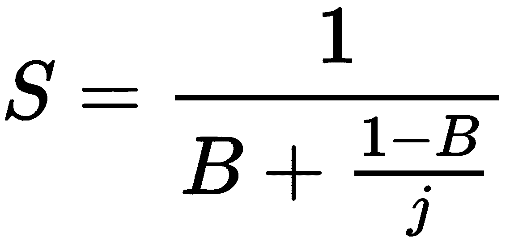

# 第二十章：评估

# 第一章

**并发的背后是什么想法，为什么它有用？**

并发是关于设计和构造程序命令和指令，以便程序的不同部分可以以有效的顺序执行，同时共享相同的资源。

**并发编程和顺序编程之间有什么区别？**

在顺序编程中，命令和指令是按顺序一个接一个地执行的。在并发编程中，一些部分可能以更有效的方式执行，以获得更好的执行时间。

**并发编程和并行编程之间有什么区别？**

在并行编程中，程序的各个部分彼此独立；它们不相互交互，因此可以同时执行。在并发编程中，各个任务共享相同的资源，因此需要它们之间的某种协调。

**每个程序都可以并发或并行吗？**

不。

**什么是尴尬并行任务？**

尴尬并行任务可以被分成独立的部分，几乎不需要任何努力。

**什么是固有顺序任务？**

任务中，单个部分的执行顺序对任务结果至关重要，无法并发或并行以获得更好的执行时间的任务被称为固有顺序。

**I/O 绑定是什么意思？**

这是一种情况，其中完成计算所需的时间主要由等待输入/输出操作完成的时间决定。

**并发处理目前在现实世界中是如何使用的？**

并发几乎无处不在：桌面和移动应用程序，视频游戏，Web 和互联网开发，人工智能等等。

# 第二章

**什么是阿姆达尔定律？阿姆达尔定律试图解决什么问题？**

阿姆达尔定律提供了一个估计，在固定工作负载下，可以预期系统资源改进后任务执行延迟的理论加速度。

**解释阿姆达尔定律的公式及其组成部分。**

阿姆达尔定律的公式如下：

在前面的公式中，以下适用：

+   *S*是考虑中的理论加速度。

+   *B*是固有顺序的整个任务的部分。

+   *j*是正在利用的处理器数量。

**根据阿姆达尔定律，随着系统资源的改进，速度提升会无限增加吗？**

不；随着处理器数量的增加，通过改进获得的效率减少。

**阿姆达尔定律和收益递减定律之间的关系是什么？**

您已经看到，在特定情况下（即只有处理器数量增加时），阿姆达尔定律类似于收益递减定律。具体来说，随着处理器数量的增加，通过改进获得的效率减少，加速曲线变平。

# 第三章

**什么是线程？线程和进程之间的核心区别是什么？**

执行线程是编程命令的最小单位。在同一个进程中可以实现多个线程，通常并发执行并访问/共享相同的资源，如内存，而单独的进程不会这样做。

**Python 中`thread`模块提供了哪些 API 选项？**

`thread`模块的主要特点是快速高效地创建新线程来执行函数：`thread.start_new_thread()`函数。除此之外，该模块仅支持一些低级的方式来处理多线程原语并共享它们的全局数据空间。此外，提供了简单的锁对象（例如互斥锁和信号量）用于同步目的。

**`threading`模块在 Python 中提供了哪些 API 选项？**

除了`thread`模块提供的所有与线程相关的功能外，`threading`模块还支持一些额外的方法，如下所示：

+   `threading.activeCount()`: 此函数返回程序中当前活动线程对象的数量。

+   `threading.currentThread()`: 此函数返回调用者当前线程控制中的线程对象数量。

+   `threading.enumerate()`: 此函数返回程序中当前活动线程对象的列表。

**通过`thread`和`threading`模块创建新线程的过程是什么？**

使用`thread`和`threading`模块创建新线程的过程如下：

+   在`thread`模块中，创建新线程以并发执行函数。这样做的方法是使用`thread.start_new_thread()`函数：`thread.start_new_thread(function, args[, kwargs])`。

+   要使用`threading`模块创建和自定义新线程，需要遵循特定的步骤：

1.  在我们的程序中定义`threading.Thread`类的子类

1.  在子类中重写默认的`__init__(self [,args])`方法，以添加类的自定义参数

1.  在子类中重写默认的`run(self [,args])`方法，以自定义线程类在初始化和启动新线程时的行为

**使用锁进行线程同步的理念是什么？**

在给定程序中，当一个线程正在访问/执行程序的临界区时，任何其他线程都需要等待，直到该线程执行完毕。线程同步的典型目标是避免多个线程访问其共享资源时可能出现的任何潜在数据不一致；只允许一个线程一次执行临界区可以保证在我们的多线程应用程序中不会发生数据冲突。应用线程同步的最常见方法之一是通过实现锁定机制。

**使用锁在 Python 中实现线程同步的过程是什么？**

在我们的`threading`模块中，`threading.Lock`类提供了一种简单直观的方法来创建和使用锁。其主要用法包括以下方法：

+   `threading.Lock()`: 此方法初始化并返回一个新的锁对象。

+   `acquire(blocking)`: 当调用此方法时，所有线程将同步运行（即，一次只有一个线程可以执行临界区）。

+   `release()`: 当调用此方法时，锁被释放。

**队列数据结构的理念是什么？**

队列是一种抽象数据结构，是按特定顺序维护的不同元素的集合；这些元素可以是程序中的其他对象。

**排队在并发编程中的主要应用是什么？**

队列的概念在并发编程的子领域中更为普遍，因为队列中维护的元素顺序在多线程程序处理和操作其共享资源时起着重要作用。

**常规队列和优先级队列之间的核心区别是什么？**

优先级队列抽象数据结构类似于队列数据结构，但是优先级队列的每个元素，正如其名称所示，都有与之关联的优先级；换句话说，当元素被添加到优先级队列时，需要指定其优先级。与常规队列不同，优先级队列的出队原则依赖于元素的优先级：具有较高优先级的元素在具有较低优先级的元素之前被处理。

# 第四章

**文件描述符是什么，以及在 Python 中可以如何处理它？**

文件描述符用作程序中已打开外部文件的句柄。在 Python 中，可以通过使用`open()`和`close()`函数或使用`with`语句来处理文件描述符；例如：

+   `f = open(filename, 'r'); ... ; f.close()`

+   `with open(filename, 'r') as f: ...`

当文件描述符没有小心处理时会出现什么问题？

系统只能在一个运行的进程中处理一定数量的已打开外部文件。当超过限制时，已打开文件的句柄将受到损害，并且会发生文件描述符泄漏。

锁是什么，以及在 Python 中如何处理它？

锁是并发和并行编程中执行线程同步的机制。在 Python 中，可以通过使用`acquire()`和`release()`方法或使用`with`语句来处理`threading.Lock`对象；例如：

+   `my_lock.acquire(); ... ; my_lock.release()`

+   `with my_lock: ...`

当锁没有被小心处理时会出现什么问题？

当获取锁时发生异常时，如果不小心处理，锁将永远无法释放和重新获取，从而导致并发和并行编程中常见的死锁问题。

上下文管理器背后的理念是什么？

上下文管理器负责程序中资源的上下文；它们定义并处理其他实体与这些资源的交互，并在程序退出上下文后执行清理任务。

`with`语句在 Python 中提供了哪些选项，就上下文管理而言？

Python 中的`with`语句提供了一种直观和方便的方式来管理资源，同时确保错误和异常被正确处理。除了更好的错误处理和保证的清理任务外，`with`语句还提供了程序的额外可读性，这是 Python 为其开发人员提供的最强大的功能之一。

# 第五章

HTML 是什么？

HTML 代表超文本标记语言，是开发网页和 Web 应用程序的标准和最常见的标记语言。

HTTP 请求是什么？

通过互联网进行的大部分通信（更具体地说，是万维网）都使用 HTTP。在 HTTP 中，请求方法用于传达有关请求的数据以及应该从服务器返回的信息。

HTTP 响应状态码是什么？

HTTP 响应状态码是三位数字，表示服务器和客户端之间通信状态。它们分为五类，每一类表示特定的通信状态。

`requests`模块如何帮助进行网络请求？

`requests`模块通过 HTTP 请求管理 Python 程序与 Web 服务器之间的通信。

Ping 测试是什么，通常如何设计？

Ping 测试是一个通常由 Web 管理员使用的工具，用于确保他们的网站对客户端仍然可用。Ping 测试通过向考虑中的网站发出请求并分析返回的响应状态码来实现这一点

为什么并发适用于进行网络请求？

向 Web 服务器发出不同请求的过程以及解析和处理下载的 HTML 源代码的过程在不同请求之间是独立的。

在开发网络抓取应用程序时需要考虑哪些因素？

在开发进行并发网络请求的应用程序时，应考虑以下因素：

+   服务条款和数据收集政策

+   错误处理

+   定期更新您的程序

+   避免过度抓取

# 第六章

进程是什么？进程和线程之间的核心区别是什么？

进程是操作系统执行的特定计算机程序或软件的实例。进程包含程序代码及其当前的活动和与其他实体的交互。可以在同一个进程中实现多个线程以访问和共享内存或其他资源，而不同进程不以这种方式互动。

多进程是什么？多进程和多线程之间的核心区别是什么？

在操作系统中，多进程是指从操作系统中执行多个并发进程，其中每个进程在单独的 CPU 上执行，而不是在任何给定时间内执行单个进程。另一方面，多线程是指执行多个线程，这些线程可以在同一个进程内。

`multiprocessing`模块提供了哪些 API 选项？

`multiprocessing`模块提供了对`Process`类的 API，其中包含了进程的实现，同时提供了类似于`threading`模块的 API 来生成和与进程交互的方法。该模块还提供了`Pool`类，主要用于实现一组进程，每个进程将执行提交的任务。

`multiprocessing`模块的`Process`类和`Pool`类之间的核心区别是什么？

`Pool`类实现了一组进程，每个进程将执行提交给`Pool`对象的任务。一般来说，`Pool`类比`Process`类更方便，特别是如果并发应用程序返回的结果应该是有序的。

在 Python 程序中确定当前进程的选项是什么？

`multiprocessing`模块提供了`current_process()`方法，它将返回程序中当前正在运行的`Process`对象。在程序中跟踪运行的进程的另一种方法是通过`os`模块查看各个进程的进程 ID。

守护进程是什么？在多进程程序中，它们的目的是什么？

守护进程在后台运行，不会阻止主程序退出。当主程序没有简单的方法告知何时中断进程，或者在不影响最终结果的情况下退出主程序而不完成工作时，这种规范是常见的。

你如何终止一个进程？为什么有时终止进程是可以接受的？

`multiprocessing.Process`类的`terminate()`方法提供了一种快速终止进程的方式。如果程序中的进程从不与共享资源交互，则`terminate()`方法非常有用，特别是如果进程看起来无响应或死锁。

在 Python 中，促进进程间通信的方式有哪些？

虽然锁是用于线程间通信的最常见的同步原语之一，但管道和队列是不同进程之间通信的主要方式。具体来说，它们提供了消息传递选项，以促进进程之间的通信：管道用于两个进程之间的连接，队列用于多个生产者和消费者。

# 第七章

缩减运算符是什么？必须满足什么条件，使操作符成为缩减运算符？

如果操作符满足以下条件，则为缩减操作符：

+   操作符可以将一组元素缩减为一个标量值

+   通过创建和计算部分任务来获得最终结果（标量值）

具有与所需条件等效的缩减运算符的属性是什么？

交换和结合性属性被认为等效于缩减运算符的要求。

缩减运算符与并发编程之间有什么联系？

减少运算符需要交换和结合属性。因此，它们的子任务必须能够独立处理，这使并发和并行性适用。

**在使用 Python 中促进进程间通信的多进程程序时，必须考虑的一些因素是什么？**

一些考虑包括实施毒丸技术，以便将子任务分布到所有消费者进程；每次调用`get()`函数时，在任务队列上调用`task_done()`，以确保`join()`函数不会无限期地阻塞；避免使用`qsize()`方法，该方法不可靠，并且在 Unix 操作系统上未实现。

**并发减少运算符的一些现实应用是什么？**

一些现实应用包括重型数值运算符和利用逻辑运算符的复杂程序。

# 第八章

**什么是图像处理任务？**

图像处理是分析和操作数字图像文件以创建图像的新版本，或从中提取重要数据的任务。

**数字成像的最小单位是什么？它在计算机中是如何表示的？**

数字成像的最小单位是像素，通常包含 RGB 值：0 到 255 之间的整数元组。

**什么是灰度化？这种技术有什么作用？**

灰度化是将图像转换为灰色的过程，只考虑每个像素的强度信息，表示为可用光的数量。它通过将传统的三维颜色数据映射到一维灰色数据，减少了图像像素矩阵的维度。

**什么是阈值处理？这种技术有什么作用？**

阈值处理将图像中的每个像素替换为白色像素，如果像素的强度大于先前指定的阈值，则替换为黑色像素，如果像素的强度小于该阈值。在图像上执行阈值处理后，该图像的每个像素只能容纳两个可能的值，大大降低了图像数据的复杂性。

**为什么应该使图像处理并发？**

当涉及到图像处理时，通常涉及到大量的计算数值过程，因为每个图像都是一个整数元组的矩阵。然而，这些过程可以独立执行，这表明整个任务应该是并发的。

**一些并发图像处理的良好实践是什么？**

一些并发图像处理的良好实践如下：

+   选择正确的方法（众多方法中的一种）

+   生成适当数量的进程

+   同时处理输入/输出

# 第九章

**异步编程背后的理念是什么？**

异步编程是一种编程模型，专注于协调应用程序中的不同任务，以便应用程序使用最少的时间来完成执行这些任务。异步程序在等待和处理时间之间创建重叠，从而缩短完成整个程序所需的总时间。

**异步编程与同步编程有何不同？**

在同步编程中，程序的指令是顺序执行的：在程序中的下一个任务开始处理之前，必须完成当前任务的执行。使用异步编程，如果当前任务需要较长时间才能完成，您可以在任务执行期间的某个时间指定切换到另一个任务。

**异步编程与线程和多进程有何不同？**

异步编程将程序的所有指令保持在同一个线程和进程中。异步编程的主要思想是，如果单个执行程序从一个任务切换到另一个任务更有效（就执行时间而言），那么只需等待第一个任务一段时间，同时处理第二个任务。

# 第十章

**什么是异步编程？它提供了哪些优势？**

异步编程是一种利用协调计算任务以重叠等待和处理时间的编程模型。如果成功实现，异步编程既提供了响应性，又提高了速度，与同步编程相比。

**异步程序的主要元素是什么？它们如何相互交互？**

异步程序有三个主要组件：事件循环、协程和期货。事件循环负责通过使用其任务队列调度和管理协程；协程是要异步执行的计算任务，每个协程都必须在其函数内部指定在哪里将执行流程返回给事件循环（即任务切换事件）；期货是包含从协程获得的结果的占位符对象。

**`async`**和**`await`**关键字是什么？它们有什么作用？

Python 语言提供了**`async`**和**`await`**关键字，用于在低级别实现异步编程。**`async`**关键字放在函数前面，以声明它为协程，而**`await`**关键字指定任务切换事件。

**`asyncio`**模块在实现异步编程方面提供了哪些选项？

**`asyncio`**模块提供了易于使用的 API 和直观的框架来实现异步程序；此外，该框架使异步代码与同步代码一样易读，这在异步编程中通常是相当罕见的。

**Python 3.7 中提供的有关异步编程的改进是什么？**

Python 3.7 改进了启动和运行异步程序的主要事件循环的 API，同时将**`async`**和**`await`**保留为官方 Python 关键字。

**什么是阻塞函数？为什么它们对传统的异步编程构成问题？**

阻塞函数具有不间断的执行，因此阻止任何尝试在异步程序中协作切换任务。如果被迫释放执行流程返回到事件循环，阻塞函数将简单地暂停执行，直到轮到它们再次运行。虽然在这种情况下仍然实现了更好的响应性，但异步编程未能提高程序的速度；事实上，由于各种开销，异步版本的程序通常需要更长的时间来完成执行。

**`concurrent.futures`**如何为异步编程中的阻塞函数提供解决方案？它提供了哪些选项？

**`concurrent.futures`**模块实现了线程和多进程，用于在异步程序中执行协程。它为异步编程提供了**`ThreadPoolExecutor`**和**`ProcessPoolExecutor`**，分别在单独的线程和单独的进程中执行。

# 第十一章

**什么是通信通道？它与异步编程有什么关系？**

通信通道用于表示不同系统之间的物理连接以及促进计算机网络的数据逻辑通信。后者与计算有关，与异步编程的概念更相关。异步编程可以提供补充过程，以有效地促进通信通道的功能。

**开放系统互联（OSI）模型协议层有哪两个主要部分？它们各自的目的是什么？**

媒体层包含与通信通道的基础过程进行交互的相当低级别的操作，而主机层处理高级数据通信和操作。

**传输层是什么？为什么它对通信通道至关重要？**

传输层通常被视为媒体层和主机层之间的概念性过渡，负责在不同系统之间的端到端连接中发送数据。

**`asyncio`如何促进服务器端通信通道的实现？**

在服务器端，`asyncio`模块将传输的抽象与异步程序的实现结合在一起。具体而言，通过其`BaseTransport`和`BaseProtocol`类，`asyncio`提供了不同的方式来定制通信通道的底层架构。

**`asyncio`如何促进客户端通信通道的实现？**

`aiohttp`模块以及特别是`aiohttp.ClientSession`与`asyncio`一起，也提供了关于客户端通信过程的效率和灵活性，通过异步请求和读取返回的响应。

**`aiofiles`是什么？**

`aiofiles`模块可以与`asyncio`和`aiohttp`一起使用，有助于促进异步文件读取/写入。

# 第十二章

**什么会导致死锁情况，为什么这是不可取的？**

不同锁对象之间缺乏（或处理不当的）协调可能导致死锁，其中无法取得任何进展，程序被锁定在当前状态。

哲学家就餐问题与死锁问题有何关联？

在哲学家就餐问题中，每个哲学家只用左手拿着一把叉子，因此他们无法继续进食或放下他们手中的叉子。哲学家得以进食的唯一方式是邻座的哲学家放下叉子，而这只有在他们自己能够进食时才可能发生；这造成了一种永无止境的条件循环，永远无法满足。这种情况本质上就是死锁的本质，其中系统的所有元素都被困在原地，无法取得任何进展。

**科夫曼条件有哪四个？**

死锁还由并发程序需要同时具备的必要条件来定义，以便发生死锁。这些条件最初由计算机科学家爱德华·G·科夫曼（Edward G. Coffman, Jr.）提出，因此被称为科夫曼条件。这些条件如下：

+   至少有一个资源必须处于不可共享的状态。这意味着该资源由一个单独的进程（或线程）持有，并且不能被其他进程访问；该资源在任何给定时间只能被一个进程（或线程）访问和持有。这种条件也被称为**互斥**。

+   存在一个同时访问资源并等待其他进程（或线程）持有的资源的进程（或线程）。换句话说，这个进程（或线程）需要访问两个资源才能执行其指令，其中一个它已经持有，另一个是它正在等待其他进程（或线程）提供的。这个条件被称为**持有和等待**。

+   只有当进程（或线程）持有资源的特定指令时，资源才能被释放。这意味着，除非进程（或线程）自愿并积极地释放资源，否则资源将保持在不可共享的状态。这就是**无抢占**条件。

+   最后一个条件称为**循环等待**。正如其名称所示，该条件指定存在一组进程（或线程），使得该组中的第一个进程（或线程）处于等待状态，等待第二个进程（或线程）释放资源，而第二个进程（或线程）又需要等待第三个进程（或线程）；最后，该组中的最后一个进程（或线程）又在等待第一个进程。

**资源排序如何解决死锁问题？实施这一方法可能会导致哪些其他问题？**

如果进程（或线程）按照预定的静态顺序访问资源，而不是任意访问资源，它们获取和等待资源的循环性质将被消除。然而，如果在并发程序的资源上放置足够的锁，它将在执行上变得完全顺序，并且与并发编程功能的开销结合起来，其速度甚至比程序的纯顺序版本更差。

**忽略锁如何解决死锁问题？实施这一方法可能会导致哪些其他问题？**

通过忽略锁，我们的程序资源有效地在并发程序中的不同进程/线程之间共享，从而消除了 Coffman 条件中的第一个条件，**互斥**。然而，这样做可能被视为完全误解了问题。我们知道锁被利用是为了让进程和线程可以以有系统、协调的方式访问程序中的共享资源，以避免对数据的错误处理。在并发程序中移除任何锁定机制意味着共享资源的可能性，这些资源现在不受访问限制，被以不协调的方式操纵（因此变得损坏）的可能性显著增加。

**活锁与死锁有什么关系？**

在活锁情况下，并发程序中的进程（或线程）能够切换它们的状态，但它们只是无限地来回切换，无法取得任何进展。

# 第十三章

**什么是饥饿，为什么在并发程序中是不可取的？**

饥饿是并发系统中的一个问题，其中一个进程（或线程）无法获得必要的资源来继续执行，因此无法取得任何进展。

**饥饿的根本原因是什么？可以从根本原因中产生哪些常见的表面原因？**

大多数情况下，一组调度指令的协调不佳是饥饿的主要原因。一些导致饥饿的高级原因可能包括以下内容：

+   具有高优先级的进程（或线程）主导 CPU 中的执行流程，因此，低优先级的进程（或线程）没有机会执行自己的指令。

+   具有高优先级的进程（或线程）主导使用不可共享的资源，因此，低优先级的进程（或线程）没有机会执行自己的指令。这种情况类似于第一种情况，但是涉及到访问资源的优先级，而不是执行本身的优先级。

+   具有低优先级的进程（或线程）正在等待资源来执行它们的指令，但是一旦资源变得可用，具有更高优先级的其他进程（或线程）立即获得了访问权限，因此低优先级的进程（或线程）无限等待。

**死锁和饥饿之间有什么联系？**

死锁情况也可能导致饥饿，因为饥饿的定义表明，如果存在一个进程（或线程）由于无法获得必要的进程而无法取得任何进展，那么该进程（或线程）正在经历饥饿。这也在哲学家就餐问题中有所体现。

**读者写者问题是什么？**

读者写者问题要求一个调度算法，使读者和写者可以适当和高效地访问文本文件，而不会错误处理/损坏其中包含的数据。

读者写者问题的第一种方法是什么？为什么在这种情况下会出现饥饿现象？

第一种方法允许多个读者同时访问文本文件，因为读者只是读取文本文件，不会更改其中的数据。第一种方法的问题在于，当一个读者正在访问文本文件并且一个写者正在等待文件解锁时，如果另一个读者开始执行并且想要访问文件，它将优先于已经等待的写者。此外，如果越来越多的读者继续请求访问文件，写者将无限等待。

第二种方法是什么？为什么在这种情况下会出现饥饿现象？

这种方法实现了一旦写者请求访问文件，就不应该有读者能够插队并在该写者之前访问文件。与读者写者问题的第一种解决方案相反，这种解决方案给予了写者优先权，因此读者会饥饿。

读者写者问题的第三种方法是什么？为什么它成功地解决了饥饿问题？

这种方法对读者和写者都实施了锁。然后，所有线程将受到锁的限制，并且不同线程之间将实现相同的优先级。

一些常见的解决饥饿问题的方法是什么？

一些常见的解决饥饿问题的方法包括以下：

+   提高低优先级线程的优先级

+   实施先进先出的线程队列

+   一个优先级队列，还逐渐增加了长时间等待在队列中的线程的优先级

+   或者如果一个线程已经多次能够访问共享资源，它将被给予较低的优先级

# 第十四章

**什么是临界区？**

临界区指示在并发应用程序中由多个进程或线程访问的共享资源，这可能导致意外甚至错误的行为。

**什么是竞争条件，为什么在并发程序中是不可取的？**

当两个或更多线程/进程同时访问和更改共享资源时，就会发生竞争条件，导致数据错误和损坏。

竞争条件的根本原因是什么？

竞争条件的根本原因是多个线程/进程同时读取和更改共享资源；当所有线程/进程完成执行时，只有最后一个线程/进程的结果被注册。

锁如何解决竞争条件的问题？

由于竞争条件是由多个线程或进程同时访问和写入共享资源引起的，因此解决方案是隔离不同线程/进程的执行，特别是在与共享资源交互时。通过锁，我们可以将并发程序中的共享资源转换为临界区，保证其数据的完整性得到保护。

为什么锁有时在并发程序中是不可取的？

使用锁存在一些缺点：在并发程序中实现足够多的锁，整个程序可能变得完全顺序化；锁并不锁定任何东西。

**竞争条件在现实生活系统和应用中引发了什么问题？**

现实生活系统和应用中竞争条件引发的问题如下：

+   **安全性**：竞争条件既可以被利用作为安全漏洞（给外部代理非法访问系统），也可以用作随机密钥生成，用于安全流程。

+   **操作系统**：当两个代理（用户和应用程序）与相同的内存空间交互时，竞争条件可能导致不可预测的行为。

+   **网络**：在网络中，竞争条件可能导致多个用户在网络中拥有强大的特权。

# 第十五章

**Python 和 C++之间的内存管理有何不同？**

C++通过简单地将值写入变量的内存位置来将变量与其值关联起来；Python 的变量引用指向它们所持有的值的内存位置。因此，Python 需要维护其内存空间中每个值的引用计数。

**GIL 为 Python 解决了什么问题？**

为了避免竞争条件，因此避免值引用计数的损坏，GIL 被实现为只有一个线程可以在任何给定时间访问和改变计数。

**GIL 为 Python 创建了什么问题？**

GIL 有效地阻止多个线程利用 CPU 并同时执行 CPU 绑定的指令。这意味着如果多个线程被设计为并发执行且 CPU 绑定，它们实际上将被顺序执行。

**有哪些绕过 Python 程序中的 GIL 的方法？**

有几种方法可以处理 Python 应用程序中的 GIL；即，实现多进程而不是多线程，并利用其他替代 Python 解释器。

# 第十六章

**解决锁不锁任何东西的问题的主要方法是什么？**

主要方法是在数据结构的类属性和方法内部实现锁定，以便外部函数和程序无法绕过这些锁定并同时访问共享的并发对象。

**描述并发编程中的可伸缩性概念。**

通过程序的可伸缩性，我们指的是当程序需要处理的任务数量增加时，性能的变化。Andre B. Bondi 将可伸缩性定义为“系统、网络或进程处理不断增长的工作量的能力，或者它扩大以适应这种增长的潜力。”

**天真的锁定机制如何影响并发程序的可伸缩性？**

简单基于锁的数据结构的可伸缩性是非常不理想的：随着程序添加更多线程来执行更多任务，程序的性能会线性下降。由于在任何给定时间只有一个线程可以访问和增加共享计数器，程序需要执行的增量越多，完成所有增量任务所需的时间就越长。

**什么是近似计数器，它如何帮助解决并发编程中的可伸缩性问题？**

近似计数器的基本思想是将工作（增加共享全局计数器）分布到其他低级计数器中。当活动线程执行并想要增加全局计数器时，首先必须增加其对应的本地计数器。通过为每个线程设置一个单独的计数器对象，线程可以独立和同时更新其对应的本地计数器，从而创建重叠，从而提高程序的速度性能。

**Python 中是否可能存在无锁数据结构？为什么？**

由于存在**全局解释器锁（GIL）**，在 CPython 中实现无锁特性是不可能的，它阻止多个线程在任何给定时间执行 CPU。

**什么是无互斥锁并发数据结构，它与基于锁的并发数据结构有何不同？**

无互斥锁并发数据结构这个术语表示缺乏锁定机制，并使用其他同步机制来保护数据。

**RCU 技术是什么，它解决了无互斥并发数据结构的什么问题？**

为了保护并发数据结构的完整性，RCU 技术在线程或进程请求读取或写入访问时创建和维护数据结构的另一个版本。通过在单独的副本中隔离数据结构和线程/进程之间的交互，RCU 确保不会发生冲突的数据。

# 第十七章

**Python 内存管理器的主要组件是什么？**

Python 内存管理器的主要组件如下：

+   原始内存分配器通过与操作系统的内存管理器交互，处理低级内存分配。

+   特定对象的内存分配器与 Python 中的对象和值的私有堆交互。这些分配器执行特定于给定数据和对象类型的内存操作。

+   标准 C 库的系统分配器负责帮助原始内存分配器与操作系统的内存管理器交互。

**Python 内存模型如何类似于带标签的有向图？**

内存模型仅通过指针跟踪其数据和变量：每个变量的值都是一个指针，这个指针可以指向符号、数字或子程序。因此，这些指针是对象图中的有向边，而实际值（符号、数字和子程序）是图中的节点。

**就 Python 内存模型而言，开发 Python 并发应用程序的优缺点是什么？**

推理并发程序的行为可能比在其他编程语言中更容易。然而，在 Python 中理解和调试并发程序的便利性也伴随着性能的降低。

**什么是原子操作，为什么在并发编程中它是可取的？**

原子操作是在执行过程中不能被中断的指令。原子性是并发操作的一个理想特征，因为它保证了在不同线程之间共享的数据的安全性。

**给出 Python 中三个固有的原子操作的例子。**

一些例子如下：

+   将预定义对象附加到列表

+   用另一个列表扩展列表

+   从列表中获取元素

+   从列表中弹出

+   对列表进行排序

+   将变量分配给另一个变量

+   将变量分配给对象的属性

+   为字典创建一个新条目

+   用另一个字典更新字典

# 第十八章

**什么是套接字？在网络编程中它有什么作用？**

低级网络编程往往涉及套接字的操作和处理，套接字被定义为特定计算机网络节点内的理论端点，负责从它们所在的节点接收或发送数据。

**潜在客户端发出连接请求时，服务器端通信的程序是什么？**

要从服务器端打开通信通道，网络程序员必须首先创建套接字并将其绑定到特定地址。然后服务器开始监听网络中由客户端创建的任何潜在通信请求。在收到来自潜在客户端的连接请求后，服务器现在可以决定是否接受该请求。然后在网络中建立两个系统之间的连接，这意味着它们可以开始相互通信和共享数据。当客户端通过通信通道向服务器发送消息时，服务器会处理消息，最终通过相同的通道向客户端发送响应；这个过程会一直持续，直到它们之间的连接结束，要么是其中一个退出连接通道，要么是通过一些外部因素。

**套接字模块提供了哪些方法来方便服务器端的低级网络编程？**

以下是一些重要方法：

+   `socket.bind()`将调用套接字绑定到传递给该方法的地址

+   `socket.listen()`允许我们创建的服务器接受潜在客户端的连接

+   `socket.accept()`接受调用套接字对象具有的特定连接

+   `socket.makefile()`返回一个与调用套接字对象关联的文件对象

+   `socket.sendall()`将传递的数据作为参数发送到调用套接字对象

+   `socket.close()`标记调用套接字对象为关闭状态

**生成器是什么？它们相对于 Python 列表的优势是什么？**

生成器是返回迭代器并能够动态暂停和恢复的函数。生成器迭代器是惰性的，只有在特别要求时才产生结果。因此，生成器迭代器在内存管理方面更有效，并且通常在涉及大量数据时更受青睐。

**什么是异步生成器？如何应用它们以构建非阻塞服务器？**

异步生成器允许执行流在生成任务之间切换。结合可以在以后运行的回调，服务器可以同时读取和处理来自多个客户端的数据。

# 第十九章

**APScheduler 是什么？为什么它不是一个调度服务？**

APScheduler 是一个外部 Python 库，支持安排 Python 代码以后执行。APScheduler 本身不是一个具有内置 GUI 或命令行界面的调度服务。它仍然是一个必须在现有应用程序中导入和利用的 Python 库。但是，APScheduler 具有许多功能，可以利用这些功能来构建实际的调度服务。

**APScheduler 的主要调度功能是什么？**

它提供三种不同的调度机制：类似 cron 的调度、基于间隔的执行和延迟执行。此外，APScheduler 允许将要执行的作业存储在各种后端系统中，并与常见的 Python 并发框架一起使用，如 AsyncIO、Gevent、Tornado 和 Twisted。最后，APScheduler 提供了不同的选项来实际执行调度的代码，通过指定适当的执行者。

**Python 中 APScheduler 和另一个调度工具 Celery 之间有什么区别？**

虽然 Celery 是一个具有基本调度功能的分布式任务队列，但 APScheduler 恰恰相反：一个具有基本任务排队选项和高级调度功能的调度程序。用户报告称 APScheduler 比 Celery 更容易设置和实现。

**编程中测试的目的是什么？在并发编程中有什么不同？**

测试引发错误，表明程序中存在错误。测试并发程序通常很困难，因为非确定性允许在测试的一个运行中检测到并在另一个运行中变得不可见。我们称可能在测试之间变得不可见的并发错误为不可重现的，并且它们是我们不能依靠测试一致地检测所有并发错误的主要原因。

**在本章中讨论了哪些测试方法？**

单元测试应用于考虑中的程序的各个单元，其中单元是程序的最小可测试部分。另一方面，静态代码分析查看实际的代码本身而不执行它。静态代码分析扫描代码结构和变量和函数使用中的可视错误。

**编程中调试的目的是什么？在并发编程中有什么不同？**

调试是程序员试图识别和解决问题或缺陷的过程，否则这些问题或缺陷会导致计算机应用程序产生不正确的结果，甚至停止运行。与测试并发程序的问题类似，调试并发程序时可能变得越来越复杂和困难，因为共享资源可以与（并且可以被）多个代理同时交互。

本章讨论了哪些调试方法？

一般的调试方法包括打印调试、日志记录、跟踪和使用调试器。调试并发程序的过程可以利用最小化、单线程/处理和操纵调度来放大潜在的错误。
