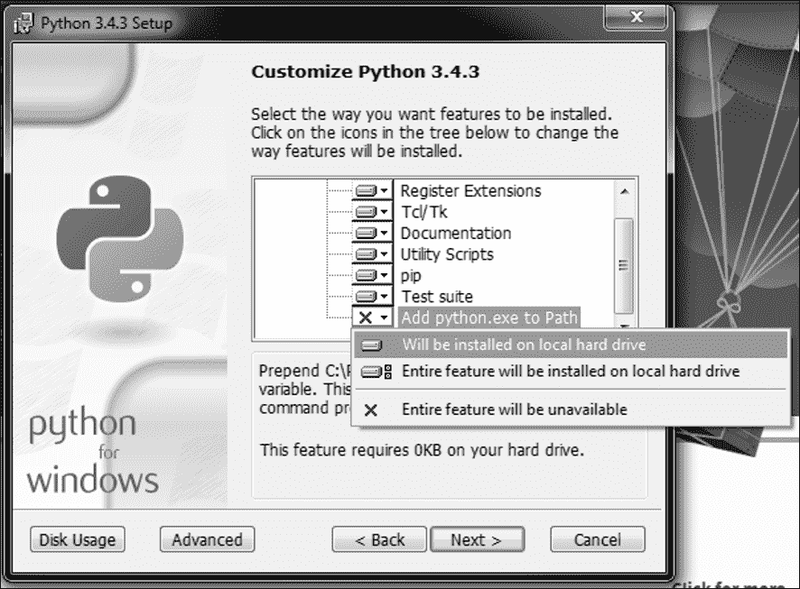
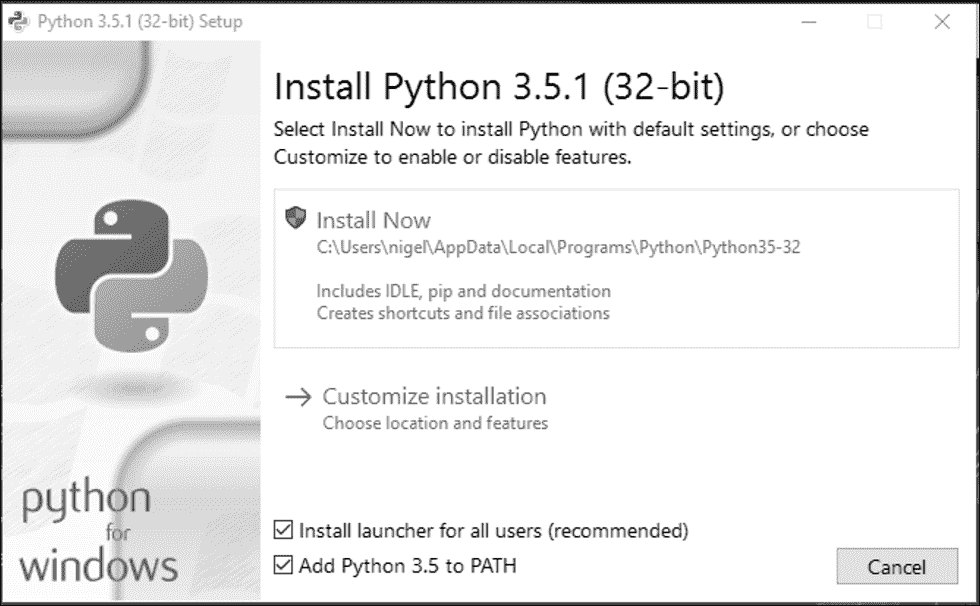
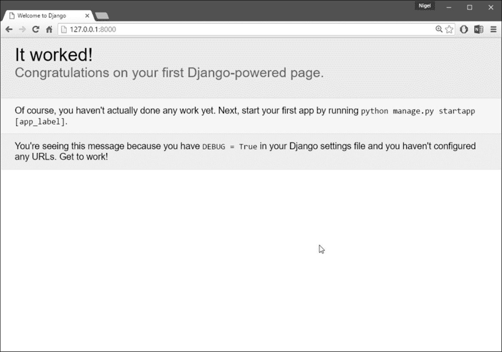

# 第一章：Django 简介和入门

# 介绍 Django

几乎所有优秀的开源软件都是因为一个或多个聪明的开发人员有问题需要解决，而没有可行或成本效益的解决方案。Django 也不例外。Adrian 和 Jacob 早已从项目中*退休*，但是驱使他们创建 Django 的基本原因仍然存在。正是这种扎实的实际经验基础使 Django 如此成功。为了表彰他们的贡献，我认为最好让他们用自己的话（从原书中编辑和重新格式化）介绍 Django。

*Adrian Holovaty 和 Jacob Kaplan-Moss-2009 年 12 月*

在早期，网页开发人员手工编写每个页面。更新网站意味着编辑 HTML；*重新设计*涉及逐个重新制作每个页面。随着网站的增长和变得更加雄心勃勃，很快就显而易见，这种方法是乏味、耗时且最终是不可持续的。

**国家超级计算应用中心**（**NCSA**，开发了第一个图形化网页浏览器 Mosaic 的地方）的一群有进取心的黑客解决了这个问题，让 Web 服务器生成可以动态生成 HTML 的外部程序。他们称这个协议为**通用网关接口**（**CGI**），它彻底改变了 Web。现在很难想象 CGI 必须是多么大的突破：CGI 允许你将 HTML 页面视为根据需要动态生成的资源，而不是简单的磁盘文件。

CGI 的发展开创了动态网站的第一代。然而，CGI 也有它的问题：CGI 脚本需要包含大量重复的**样板**代码，它们使代码重用变得困难，对于初学者来说编写和理解也很困难。

PHP 解决了许多这些问题，并风靡全球——它现在是用于创建动态网站的最流行工具，并且有数十种类似的语言（如 ASP、JSP 等）都紧随 PHP 的设计。PHP 的主要创新在于它的易用性：PHP 代码简单地嵌入到普通 HTML 中；对于已经了解 HTML 的人来说，学习曲线极其浅。

但是 PHP 也有自己的问题；它非常容易使用，鼓励编写松散、重复、考虑不周的代码。更糟糕的是，PHP 几乎没有保护程序员免受安全漏洞的影响，因此许多 PHP 开发人员发现自己只有在为时已晚时才学习安全知识。

这些和类似的挫折直接导致了当前一批*第三代*Web 开发框架的发展。随着这一新的 Web 开发潮流的兴起，人们对 Web 开发人员的期望也在不断增加。

Django 的发展是为了满足这些新的期望。

## Django 的历史

Django 是在美国堪萨斯州劳伦斯的 Web 开发团队编写的真实应用程序的基础上有机地发展起来的。它诞生于 2003 年秋天，当时《劳伦斯日报》报纸的 Web 程序员 Adrian Holovaty 和 Simon Willison 开始使用 Python 构建应用程序。

负责制作和维护几个本地新闻网站的 World Online 团队在由新闻截止日期决定的开发环境中蓬勃发展。对于包括 LJWorld.com、Lawrence.com 和 KUsports.com 在内的网站，记者（和管理层）要求在非常紧迫的时间表下添加功能和构建整个应用程序，通常只有一天或一小时的通知时间。因此，Simon 和 Adrian 出于必要性开发了一个节省时间的 Web 开发框架——这是他们在极端截止日期下构建可维护应用程序的唯一方法。

在 2005 年夏天，经过将这个框架开发到能够有效地为 World Online 的大部分网站提供动力的程度后，包括 Jacob Kaplan-Moss 在内的团队决定将该框架作为开源软件发布。他们于 2005 年 7 月发布了它，并将其命名为 Django，以纪念爵士吉他手 Django Reinhardt。

这段历史很重要，因为它有助于解释两个关键问题。首先是 Django 的“甜蜜点”。因为 Django 诞生于新闻环境中，它提供了一些功能（比如它的管理站点，在第五章中介绍的*The* * Django * Admin * Site*），特别适合像[Amazon.com](http://www.amazon.com)、[craigslist.org](http://www.craigslist.org)和[washingtonpost.com](http://www.washingtonpost.com)这样提供动态和数据库驱动信息的“内容”网站。

不要让这使你失去兴趣，尽管 Django 特别适合开发这类网站，但这并不排除它成为构建任何类型动态网站的有效工具。（在某些方面特别有效和在其他方面无效之间存在区别。）

第二个需要注意的事情是 Django 的起源如何塑造了其开源社区的文化。因为 Django 是从现实世界的代码中提取出来的，而不是学术练习或商业产品，它专注于解决 Django 开发人员自己曾经面对过的问题，而且仍在面对。因此，Django 本身几乎每天都在积极改进。该框架的维护者有兴趣确保 Django 节省开发人员的时间，生成易于维护并在负载下表现良好的应用程序。

Django 可以让您在极短的时间内构建深度、动态、有趣的网站。Django 旨在让您专注于工作中有趣的部分，同时减轻重复部分的痛苦。通过这样做，它提供了常见 Web 开发模式的高级抽象，频繁编程任务的快捷方式，并明确了解决问题的约定。与此同时，Django 试图不干扰您的工作，让您根据需要在框架范围之外工作。

我们写这本书是因为我们坚信 Django 可以使 Web 开发变得更好。它旨在快速让您开始自己的 Django 项目，然后最终教会您成功设计、开发和部署一个令您自豪的网站所需的一切知识。

入门

要开始使用 Django，您需要做两件非常重要的事情：

1.  安装 Django（显然）；和

1.  深入了解**模型-视图-控制器**（**MVC**）设计模式。

首先，安装 Django 非常简单，并且在本章的第一部分中有详细介绍。其次同样重要，特别是如果您是新程序员或者从使用不清晰地将网站的数据和逻辑与其显示方式分离的编程语言转换而来。Django 的理念基于*松耦合*，这是 MVC 的基本理念。随着我们的学习，我们将更详细地讨论松耦合和 MVC，但如果您对 MVC 了解不多，最好不要跳过本章的后半部分，因为了解 MVC 将使理解 Django 变得更加容易。

## 安装 Django

在学习如何使用 Django 之前，您必须先在计算机上安装一些软件。幸运的是，这是一个简单的三个步骤过程：

1.  安装 Python。

1.  安装 Python 虚拟环境。

1.  安装 Django。

如果这对您来说不熟悉，不用担心，在本章中，让我们假设您以前从未从命令行安装过软件，并将逐步引导您完成。

我为那些使用 Windows 的人编写了这一部分。虽然 Django 在*nix 和 OSX 用户群体中有很强的基础，但大多数新用户都在 Windows 上。如果您使用 Mac 或 Linux，互联网上有大量资源；最好的起点是 Django 自己的安装说明。有关更多信息，请访问[`docs.djangoproject.com/en/1.8/topics/install/`](https://docs.djangoproject.com/en/1.8/topics/install/)。

对于 Windows 用户，您的计算机可以运行任何最近的 Windows 版本（Vista，7，8.1 或 10）。本章还假设您正在桌面或笔记本电脑上安装 Django，并将使用开发服务器和 SQLite 来运行本书中的所有示例代码。这绝对是您刚开始时设置 Django 的最简单和最好的方法。

如果您确实想要进行更高级的 Django 安装，您的选项在第十三章*，部署 Django*，第二十章*，更多关于安装 Django*和第二十一章*，高级数据库管理*中都有涵盖。

### 注意

如果您使用的是 Windows，我建议您尝试使用 Visual Studio 进行所有 Django 开发。微软已经在为 Python 和 Django 程序员提供支持方面进行了重大投资。这包括对 Python/Django 的完整 IntelliSense 支持，并将 Django 的所有命令行工具整合到 VS IDE 中。

最重要的是，这完全免费。我知道，谁会想到 M$会提供免费服务？？但这是真的！

有关 Visual Studio Community 2015 的完整安装指南，请参阅附录 G*，使用 Visual Studio 开发 Django*，以及在 Windows 中开发 Django 的一些建议。

## 安装 Python

Django 本身纯粹是用 Python 编写的，因此安装框架的第一步是确保您已安装 Python。

### Python 版本

Django 1.8 LTS 版本与 Python 2.7、3.3、3.4 和 3.5 兼容。对于每个 Python 版本，只支持最新的微版本（A.B.C）。

如果您只是试用 Django，无论您使用 Python 2 还是 Python 3 都无所谓。但是，如果您打算最终将代码部署到实时网站，Python 3 应该是您的首选。Python 维基（有关更多信息，请访问[`wiki.python.org/moin/Python2orPython3`](https://wiki.python.org/moin/Python2orPython3)）非常简洁地解释了这背后的原因：

> *简短版本：Python 2.x 是遗留版本，Python 3.x 是语言的现在和未来*

除非您有非常好的理由使用 Python 2（例如，遗留库），否则 Python 3 是最佳选择。

### 提示

注意：本书中的所有代码示例都是用 Python 3 编写的

### 安装

如果您使用的是 Linux 或 Mac OS X，您可能已经安装了 Python。在命令提示符（或在 OS X 中的`Applications/Utilities/Terminal`）中输入`python`。如果看到类似以下内容，则表示已安装 Python：

```py
Python 2.7.5 (default, June 27 2015, 13:20:20)
[GCC x.x.x] on xxx
Type "help", "copyright", "credits" or "license" for more 
    information.

```

### 注意

您可以看到，在前面的示例中，Python 交互模式正在运行 Python 2.7。这是对经验不足的用户的陷阱。在 Linux 和 Mac OS X 机器上，通常会安装 Python 2 和 Python 3。如果您的系统是这样的，您需要在所有命令前面输入`python3`，而不是 python 来运行 Python 3 的 Django。

假设您的系统尚未安装 Python，我们首先需要获取安装程序。转到[`www.python.org/downloads/`](https://www.python.org/downloads/)，并单击大黄色按钮，上面写着**下载 Python 3.x.x**。

在撰写本文时，最新版本的 Python 是 3.5.1，但在您阅读本文时可能已经更新，因此数字可能略有不同。

**不要**下载 2.7.x 版本，因为这是 Python 的旧版本。本书中的所有代码都是用 Python 3 编写的，因此如果尝试在 Python 2 上运行代码，将会出现编译错误。

下载 Python 安装程序后，转到您的`Downloads`文件夹，双击文件`python-3.x.x.msi`运行安装程序。安装过程与任何其他 Windows 程序相同，因此如果您之前安装过软件，这里应该没有问题，但是，有一个非常重要的自定义您必须进行。

### 注意

不要忘记下一步，因为它将解决由于在 Windows 中不正确映射`pythonpath`（Python 安装的重要变量）而引起的大多数问题。

默认情况下，Python 可执行文件不会添加到 Windows PATH 语句中。为了使 Django 正常工作，Python 必须在 PATH 语句中列出。幸运的是，这很容易纠正：

+   在 Python 3.4.x 中，当安装程序打开自定义窗口时，选项**将 python.exe 添加到 Path**未被选中，您必须将其更改为**将安装在本地硬盘上**，如*图 1.1*所示。

图 1.1：将 Python 添加到 PATH（版本 3.4.x）。

+   在 Python 3.5.x 中，确保在安装之前选中**将 Python 3.5 添加到 PATH**（*图 1.2*）。

图 1.2：将 Python 添加到 PATH（版本 3.5.x）。

安装 Python 后，您应该能够重新打开命令窗口并在命令提示符下键入 python，然后会得到类似于这样的输出：

```py
Python 3.5.1 (v3.5.1:37a07cee5969, Dec  6 2015, 01:38:48) 
    [MSC v.1900 32 bit (Intel)] on win32
Type "help", "copyright", "credits" or "license" for more 
    information.
>>>

```

在此期间，还有一件重要的事情要做。使用*CTRL*+*C*退出 Python。在命令提示符下键入以下内容并按 Enter：

```py
python-m pip install-U pip

```

输出将类似于这样：

```py
C:\Users\nigel>python -m pip install -U pip
Collecting pip
 Downloading pip-8.1.2-py2.py3-none-any.whl (1.2MB)
 100% |################################| 1.2MB 198kB/s
Installing collected packages: pip
Found existing installation: pip 7.1.2
Uninstalling pip-7.1.2:
Successfully uninstalled pip-7.1.2
Successfully installed pip-8.1.2

```

您现在不需要完全了解这个命令的作用；简而言之，`pip`是 Python 软件包管理器。它用于安装 Python 软件包：`pip`实际上是 Pip Installs Packages 的递归缩写。Pip 对我们安装过程的下一阶段非常重要，但首先，我们需要确保我们正在运行最新版本的 pip（在撰写本文时为 8.1.2），这正是这个命令所做的。

## 安装 Python 虚拟环境

### 注意

如果您要使用 Microsoft Visual Studio（VS），您可以在这里停下来并跳转到附录 G，*使用 Visual Studio 开发 Django*。VS 只需要您安装 Python，其他所有操作都可以在集成开发环境（IDE）内完成。

计算机上的所有软件都是相互依存的 - 每个程序都有其他软件依赖的软件部分（称为**依赖项**）和需要找到文件和其他软件运行所需的设置（称为**环境变量**）。

当您编写新的软件程序时，可能（并且经常）会修改其他软件依赖的依赖项和环境变量。这可能会导致许多问题，因此应该避免。

Python 虚拟环境通过将新软件所需的所有依赖项和环境变量包装到与计算机上其余软件分开的文件系统中来解决此问题。

### 注意

一些查看其他教程的人可能会注意到，这一步通常被描述为可选的。这不是我支持的观点，也不是一些 Django 核心开发人员支持的观点。

### 注意

在虚拟环境中开发 Python 应用程序（其中包括 Django）的优势是显而易见的，这里不值得一提。作为初学者，您只需要相信我 - 运行 Django 开发的虚拟环境是不可选的。

Python 中的虚拟环境工具称为`virtualenv`，我们使用`pip`从命令行安装它：

```py
pip install virtualenv

```

您的命令窗口的输出应该类似于这样：

```py
C:\Users\nigel>pip install virtualenv
 Collecting virtualenv
 Downloading virtualenv-15.0.2-py2.py3-none-any.whl (1.8MB)
100% |################################| 1.8MB 323kB/s
Installing collected packages: virtualenv
Successfully installed virtualenv-15.0.2

```

一旦安装了`virtualenv`，您需要通过输入以下命令为您的项目创建一个虚拟环境：

```py
virtualenv env_mysite

```

### 注意

互联网上的大多数示例使用`env`作为您的环境名称。这是不好的；主要是因为通常会安装几个虚拟环境来测试不同的配置，而`env`并不是非常描述性的。例如，您可能正在开发一个必须在 Python 2.7 和 Python 3.4 上运行的应用程序。命名为`env_someapp_python27`和`env_someapp_python34`的环境将比如果您将它们命名为`env`和`env1`更容易区分。

在这个例子中，我保持了简单，因为我们只会使用一个虚拟环境来进行我们的项目，所以我使用了`env_mysite`。您的命令的输出应该看起来像这样：

```py
C:\Users\nigel>virtualenv env_mysite
Using base prefix 
 'c:\\users\\nigel\\appdata\\local\\programs\\python\\python35-32'
New python executable in 
    C:\Users\nigel\env_mysite\Scripts\python.exe
Installing setuptools, pip, wheel...done.

```

一旦`virtualenv`完成设置新虚拟环境的工作，打开 Windows 资源管理器，看看`virtualenv`为您创建了什么。在您的主目录中，现在会看到一个名为`\env_mysite`的文件夹（或者您给虚拟环境的任何名称）。如果您打开文件夹，您会看到以下内容：

```py
\Include 
\Lib 
\Scripts 
\src 

```

`virtualenv`为您创建了一个完整的 Python 安装，与您的其他软件分开，因此您可以在不影响系统上的任何其他软件的情况下工作。

要使用这个新的 Python 虚拟环境，我们必须激活它，所以让我们回到命令提示符并输入以下内容：

```py
 env_mysite\scripts\activate

```

这将在您的虚拟环境的`\scripts`文件夹中运行激活脚本。您会注意到您的命令提示现在已经改变：

```py
 (env_mysite) C:\Users\nigel>

```

命令提示符开头的`(env_mysite)`让您知道您正在虚拟环境中运行。我们的下一步是安装 Django。

## 安装 Django

既然我们已经安装了 Python 并运行了一个虚拟环境，安装 Django 就非常容易了，只需输入以下命令：

```py
 pip install django==1.8.13

```

这将指示 pip 将 Django 安装到您的虚拟环境中。您的命令输出应该如下所示：

```py
 (env_mysite) C:\Users\nigel>pip install django==1.8.13
 Collecting django==1.8.13
 Downloading Django-1.8.13-py2.py3-none-any.whl (6.2MB)
 100% |################################| 6.2MB 107kB/s
 Installing collected packages: django
 Successfully installed django-1.8.13

```

在这种情况下，我们明确告诉 pip 安装 Django 1.8.13，这是撰写本文时 Django 1.8 LTS 的最新版本。如果要安装 Django，最好查看 Django 项目网站以获取 Django 1.8 LTS 的最新版本。

### 注意

如果您想知道，输入`pip install django`将安装 Django 的最新稳定版本。如果您想获取有关安装 Django 最新开发版本的信息，请参阅第二十章, *更多* * 关于安装 * *Django*。

为了获得一些安装后的积极反馈，请花点时间测试安装是否成功。在您的虚拟环境命令提示符下，输入`python`并按回车键启动 Python 交互解释器。如果安装成功，您应该能够导入模块`django`：

```py
 (env_mysite) C:\Users\nigel>python
 Python 3.5.1 (v3.5.1:37a07cee5969, Dec  6 2015, 01:38:48) 
 [MSC v.1900 32 bit (Intel)] on win32
 Type "help", "copyright", "credits" or "license" for more 
    information.
 >>> import django
 >>> django.get_version()
 1.8.13'

```

## 设置数据库

这一步并不是为了完成本书中的任何示例而必需的。Django 默认安装了 SQLite。SQLite 无需您进行任何配置。如果您想使用像 PostgreSQL、MySQL 或 Oracle 这样的大型数据库引擎，请参阅第二十一章, *高级数据库管理*。

## 开始一个项目

一旦安装了 Python、Django 和（可选）数据库`server/library`，您可以通过创建一个*项目*来开始开发 Django 应用程序。

项目是 Django 实例的一组设置。如果这是您第一次使用 Django，您需要进行一些初始设置。换句话说，您需要自动生成一些代码来建立一个 Django 项目：Django 实例的一组设置，包括数据库配置、Django 特定选项和应用程序特定设置。

我假设在这个阶段，您仍然在运行上一个安装步骤中的虚拟环境。如果没有，您将不得不重新开始：

```py
 env_mysite\scripts\activate\

```

从您的虚拟环境命令行中，运行以下命令：

```py
 django-admin startproject mysite

```

这将在当前目录（在本例中为`\env_mysite\`）中创建一个`mysite`目录。如果您想要在根目录之外的其他目录中创建项目，您可以创建一个新目录，切换到该目录并从那里运行`startproject`命令。

### 注意

**警告！**

您需要避免将项目命名为内置的 Python 或 Django 组件。特别是，这意味着您应该避免使用诸如"django"（这将与 Django 本身冲突）或"test"（这与内置的 Python 包冲突）等名称。

让我们看看`startproject`创建了什么：

```py
mysite/ 
  manage.py 
  mysite/ 
    __init__.py 
    settings.py 
    urls.py 
    wsgi.py 

```

这些文件是：

+   外部的`mysite/`根目录。这只是您项目的一个容器。对 Django 来说，它的名称并不重要；您可以将其重命名为任何您喜欢的名称。

+   `manage.py`，一个命令行实用程序，让您以各种方式与您的 Django 项目进行交互。您可以在 Django 项目网站上阅读有关`manage.py`的所有详细信息（有关更多信息，请访问[`docs.djangoproject.com/en/1.8/ref/django-admin/`](https://docs.djangoproject.com/en/1.8/ref/django-admin/)）。

+   内部的`mysite/`目录。这是您项目的 Python 包。这是您用来导入其中任何内容的名称（例如，`mysite.urls`）。

+   `mysite/__init__.py`，一个空文件，告诉 Python 这个目录应该被视为 Python 包。 （如果你是 Python 初学者，请阅读官方 Python 文档中关于包的更多信息[`docs.python.org/tutorial/modules.html#packages`](https://docs.python.org/tutorial/modules.html#packages)。）

+   `mysite/settings.py`，这个 Django 项目的设置/配置。附录 D*设置*将告诉您有关设置如何工作的所有信息。

+   `mysite/urls.py`，这个 Django 项目的 URL 声明；你的 Django 网站的目录。您可以在第二章*视图和 URLconfs*和第七章*高级视图和 URLconfs*中了解更多关于 URL 的信息。

+   `mysite/wsgi.py`，WSGI 兼容的 Web 服务器为您的项目提供服务的入口点。有关更多详细信息，请参阅第十三章*部署 Django*。

### Django 设置

现在，编辑`mysite/settings.py`。这是一个普通的 Python 模块，其中包含表示 Django 设置的模块级变量。在编辑`settings.py`时的第一步是将`TIME_ZONE`设置为您的时区。请注意文件顶部的`INSTALLED_APPS`设置。它包含了在此 Django 实例中激活的所有 Django 应用程序的名称。应用程序可以在多个项目中使用，并且您可以将它们打包和分发给其他人在他们的项目中使用。默认情况下，`INSTALLED_APPS`包含以下应用程序，这些应用程序都是 Django 自带的：

+   `django.contrib.admin`：管理站点。

+   `django.contrib.auth`：身份验证系统。

+   `django.contrib.contenttypes`：内容类型框架。

+   `django.contrib.sessions`：会话框架。

+   `django.contrib.messages`：消息框架。

+   `django.contrib.staticfiles`：用于管理静态文件的框架。

这些应用程序默认包含，以方便常见情况。其中一些应用程序至少使用了一个数据库表，因此我们需要在使用它们之前在数据库中创建这些表。要做到这一点，请运行以下命令：

```py
 python manage.py migrate 

```

`migrate`命令查看`INSTALLED_APPS`设置，并根据`settings.py`文件中的数据库设置和应用程序附带的数据库迁移创建任何必要的数据库表（我们稍后会涵盖这些）。它将为每个应用程序应用的每个迁移显示一条消息。

### 开发服务器

让我们验证一下你的 Django 项目是否正常工作。如果还没有，请切换到外部的`mysite`目录，并运行以下命令：

```py
python manage.py runserver

```

您将在命令行上看到以下输出：

```py
Performing system checks... 0 errors found
June 12, 2016-08:48:58
Django version 1.8.13, using settings 'mysite.settings'
Starting development server at http://127.0.0.1:8000/
Quit the server with CTRL-BREAK.

```

您已经启动了 Django 开发服务器，这是一个纯粹用 Python 编写的轻量级 Web 服务器。我们已经将其与 Django 一起提供，这样您就可以在准备投入生产之前快速开发，而无需处理配置生产服务器（如 Apache）的问题。

现在是一个很好的时机来注意：不要在任何类似生产环境的地方使用这个服务器。它只用于开发时使用。

现在服务器正在运行，请使用您的 Web 浏览器访问`http://127.0.0.1:8000/`。您将在愉快的浅蓝色（*图 1.3*）中看到一个“欢迎来到 Django”的页面。它成功了！

### 注意

**runserver 的自动重新加载**

开发服务器会根据需要自动重新加载每个请求的 Python 代码。您无需重新启动服务器即可使代码更改生效。但是，某些操作（例如添加文件）不会触发重新启动，因此在这些情况下，您将不得不重新启动服务器。



Django 的欢迎页面

## 模型-视图-控制器（MVC）设计模式

MVC 作为一个概念已经存在很长时间，但自从互联网出现以来，它已经呈指数级增长，因为它是设计客户端-服务器应用程序的最佳方式。所有最好的 Web 框架都是围绕 MVC 概念构建的。冒着引发战争的风险，我认为如果你不使用 MVC 来设计 Web 应用程序，那么你就错了。作为一个概念，MVC 设计模式真的很容易理解：

+   **模型（M）**是您的数据的模型或表示。它不是实际数据，而是数据的接口。模型允许您从数据库中提取数据，而无需了解底层数据库的复杂性。模型通常还提供了一个*抽象*层与您的数据库，以便您可以在多个数据库中使用相同的模型。

+   **视图（V）**是你所看到的。它是模型的表示层。在你的计算机上，视图是 Web 应用程序中浏览器中所看到的内容，或者是桌面应用程序的用户界面。视图还提供了一个接口来收集用户输入。

+   **控制器（C）**控制信息在模型和视图之间的流动。它使用编程逻辑来决定从模型中提取哪些信息，并将哪些信息传递给视图。它还通过视图从用户那里获取信息，并实现业务逻辑：通过更改视图，或通过模型修改数据，或两者兼而有之。

在每一层发生的事情的不同解释是困难的地方-不同的框架以不同的方式实现相同的功能。一个框架**专家**可能会说某个函数属于视图，而另一个可能会坚决地主张它应该在控制器上。

作为一个有远见的程序员，你不必关心这一点，因为最终这并不重要。只要你理解 Django 如何实现 MVC 模式，你就可以自由地继续并完成一些真正的工作。尽管在评论线程中观看战争可能是一种极具娱乐性的分心……

Django 紧密遵循 MVC 模式，但它在实现中使用了自己的逻辑。因为`C`由框架本身处理，而 Django 中的大部分工作发生在模型、模板和视图中，因此 Django 通常被称为*MTV 框架*。在 MTV 开发模式中：

+   **M 代表“模型”，**数据访问层。这一层包含关于数据的一切：如何访问它，如何验证它，它具有哪些行为，以及数据之间的关系。我们将在第四章中仔细研究 Django 的模型，*模型*。

+   T 代表“模板”，表示层。这一层包含与表示相关的决策：在网页或其他类型的文档上如何显示某些内容。我们将在第三章中探讨 Django 的模板，“模板”。

+   V 代表“视图”，业务逻辑层。这一层包含访问模型并转到适当模板的逻辑。你可以把它看作是模型和模板之间的桥梁。我们将在下一章中查看 Django 的视图。

这可能是 Django 中唯一不太幸运的命名，因为 Django 的视图更像是 MVC 中的控制器，而 MVC 的视图实际上在 Django 中是一个模板。起初可能有点混淆，但作为一个完成工作的程序员，你真的不会长时间在意。这只是对于我们这些需要教授它的人来说是个问题。哦，当然还有那些喷子。

# 接下来呢？

现在你已经安装了所有东西并且开发服务器正在运行，你已经准备好继续学习 Django 的视图，并学习使用 Django 提供网页的基础知识。
