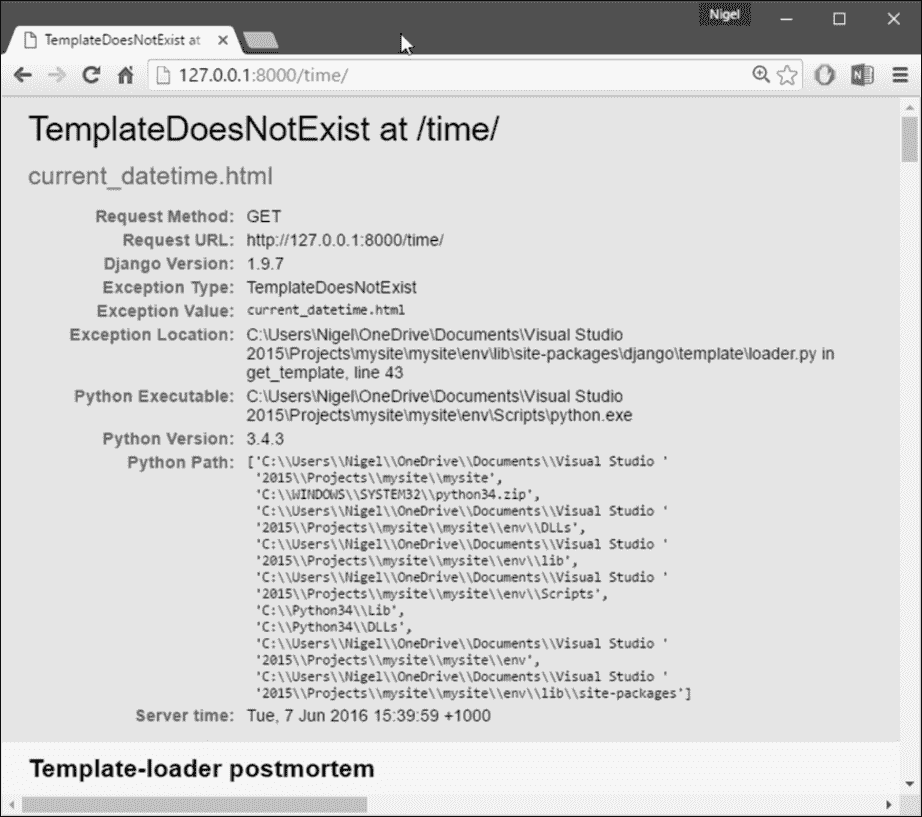

# 第三章：模板

在上一章中，您可能已经注意到我们在示例视图中返回文本的方式有些奇怪。换句话说，HTML 直接硬编码在我们的 Python 代码中，就像这样：

```py
def current_datetime(request): 
    now = datetime.datetime.now() 
    html = "It is now %s." % now 
    return HttpResponse(html) 

```

尽管这种技术对于解释视图如何工作的目的很方便，但直接在视图中硬编码 HTML 并不是一个好主意。原因如下：

+   对页面设计的任何更改都需要对 Python 代码进行更改。网站的设计往往比底层 Python 代码更频繁地发生变化，因此如果设计可以在不需要修改 Python 代码的情况下进行更改，那将是很方便的。

+   这只是一个非常简单的例子。一个常见的网页模板有数百行 HTML 和脚本。从这个混乱中解开和排除程序代码是一场噩梦（*咳嗽-PHP-咳嗽*）。

+   编写 Python 代码和设计 HTML 是两种不同的学科，大多数专业的 Web 开发环境将这些责任分开给不同的人（甚至是不同的部门）。设计师和 HTML/CSS 编码人员不应该被要求编辑 Python 代码来完成他们的工作。

+   如果程序员和设计师可以同时工作在 Python 代码和模板上，而不是一个人等待另一个人完成编辑包含 Python 和 HTML 的单个文件，那将是最有效的。

出于这些原因，将页面的设计与 Python 代码本身分开会更加清晰和易于维护。我们可以通过 Django 的*模板系统*来实现这一点，这是我们在本章中讨论的内容。

# 模板系统基础知识

Django 模板是一串文本，旨在将文档的呈现与其数据分离。模板定义了占位符和各种基本逻辑（模板标签），规定文档应该如何显示。通常，模板用于生成 HTML，但 Django 模板同样能够生成任何基于文本的格式。

### 注意

**Django 模板背后的哲学**

如果您有编程背景，或者习惯于将编程代码直接嵌入 HTML 的语言，您需要记住 Django 模板系统不仅仅是 Python 嵌入到 HTML 中。

这是有意设计的：模板系统旨在表达演示，而不是程序逻辑。

让我们从一个简单的示例模板开始。这个 Django 模板描述了一个 HTML 页面，感谢一个人向公司下订单。把它想象成一封表格信：

```py
<html> 
<head><title>Ordering notice</title></head> 
<body> 

<h1>Ordering notice</h1> 

<p>Dear {{ person_name }},</p> 

<p>Thanks for placing an order from {{ company }}. It's scheduled to ship on {{ ship_date|date:"F j, Y" }}.</p> 
<p>Here are the items you've ordered:</p> 
<ul> 
<li>{{ item }}</li> 
</ul> 

 
    <p>Your warranty information will be included in the packaging.</p> 
 
    <p>You didn't order a warranty, so you're on your own when 
    the products inevitably stop working.</p> 
 

<p>Sincerely,<br />{{ company }}</p> 

</body> 
</html> 

```

这个模板是基本的 HTML，其中包含一些变量和模板标签。让我们逐步进行：

+   任何被一对大括号包围的文本（例如，`{{ person_name }}`）都是*变量*。这意味着“*插入具有给定名称的变量的值*”。我们如何指定变量的值？我们马上就会讨论到。任何被大括号和百分号包围的文本（例如，``）都是*模板标签*。标签的定义非常广泛：标签只是告诉模板系统“*做某事*”。

+   这个示例模板包含一个`for`标签（``）和一个`if`标签（``）。`for`标签的工作方式与 Python 中的`for`语句非常相似，让您可以循环遍历序列中的每个项目。

+   一个`if`标签，正如您可能期望的那样，充当逻辑 if 语句。在这种特殊情况下，标签检查`ordered_warranty`变量的值是否评估为`True`。如果是，模板系统将显示``和``之间的所有内容。如果不是，模板系统将显示``和``之间的所有内容。请注意，``是可选的。

+   最后，这个模板的第二段包含了一个*filter*的例子，这是改变变量格式的最方便的方法。在这个例子中，`{{ ship_date|date:"F j, Y" }}`，我们将`ship_date`变量传递给`date`过滤器，并给`date`过滤器传递参数`"F j, Y"`。`date`过滤器根据该参数指定的格式格式化日期。过滤器使用管道字符（`|`）进行连接，作为对 Unix 管道的引用。

每个 Django 模板都可以访问多个内置标签和过滤器，其中许多在接下来的章节中讨论。附录 E，*内置模板标签和过滤器*，包含了标签和过滤器的完整列表，熟悉该列表是一个好主意，这样您就知道可能发生什么。还可以创建自己的过滤器和标签；我们将在第八章，*高级模板*中进行介绍。

# 使用模板系统

Django 项目可以配置一个或多个模板引擎（甚至可以不使用模板）。Django 自带了一个用于其自己模板系统的内置后端-**Django 模板语言**（**DTL**）。Django 1.8 还包括对流行的替代品 Jinja2 的支持（有关更多信息，请访问[`jinja.pocoo.org/`](http://jinja.pocoo.org/)）。如果没有紧迫的理由选择其他后端，应该使用 DTL-特别是如果您正在编写可插拔应用程序并且打算分发模板。Django 的`contrib`应用程序包括模板，如`django.contrib.admin`，使用 DTL。本章中的所有示例都将使用 DTL。有关更高级的模板主题，包括配置第三方模板引擎，请参阅第八章，*高级模板*。在您的视图中实现 Django 模板之前，让我们先深入了解 DTL，以便您了解其工作原理。以下是您可以在 Python 代码中使用 Django 模板系统的最基本方式：

1.  通过提供原始模板代码作为字符串来创建`Template`对象。

1.  使用给定的一组变量（上下文）调用`Template`对象的`render()`方法。这将根据上下文返回一个完全呈现的模板字符串，其中所有变量和模板标签都根据上下文进行评估。

在代码中，它看起来像这样：

```py
>>> from django import template 
>>> t = template.Template('My name is {{ name }}.') 
>>> c = template.Context({'name': 'Nige'}) 
>>> print (t.render(c)) 
My name is Nige. 
>>> c = template.Context({'name': 'Barry'}) 
>>> print (t.render(c)) 
My name is Barry. 

```

以下各节将更详细地描述每个步骤。

## 创建模板对象

创建`Template`对象的最简单方法是直接实例化它。`Template`类位于`django.template`模块中，构造函数接受一个参数，即原始模板代码。让我们进入 Python 交互式解释器，看看这在代码中是如何工作的。从您在第一章中创建的`mysite`项目目录中，键入`python manage.py shell`以启动交互式解释器。

让我们来看一些模板系统的基础知识：

```py
>>> from django.template import Template 
>>> t = Template('My name is {{ name }}.') 
>>> print (t) 

```

如果您正在交互式地跟随，您会看到类似于这样的内容：

```py
<django.template.base.Template object at 0x030396B0> 

```

`0x030396B0`每次都会不同，这并不重要；这是一个 Python 的东西（如果你一定要知道的话，这是`Template`对象的 Python“标识”）。

当您创建一个`Template`对象时，模板系统会将原始模板代码编译成内部优化形式，准备好进行呈现。但是，如果您的模板代码包含任何语法错误，对`Template()`的调用将引发`TemplateSyntaxError`异常：

```py
>>> from django.template import Template 
>>> t = Template('') 
Traceback (most recent call last): 
  File "", line 1, in ? 
  ... 
django.template.base.TemplateSyntaxError: Invalid block tag: 'notatag' 

```

这里的“块标签”是指``。 “块标签”和“模板标签”是同义词。系统对以下任何情况都会引发`TemplateSyntaxError`异常：

+   无效标签

+   对有效标签的无效参数

+   无效的过滤器

+   对有效过滤器的无效参数

+   无效的模板语法

+   未关闭的标签（对于需要关闭标签的标签）

## 呈现模板

一旦你有了`Template`对象，你可以通过给它*上下文*来传递数据。上下文只是一组模板变量名及其关联的值。模板使用这个来填充它的变量并评估它的标记。在 Django 中，上下文由`Context`类表示，它位于`django.template`模块中。它的构造函数接受一个可选参数：将变量名映射到变量值的字典。

使用上下文调用`Template`对象的`render()`方法来*填充*模板：

```py
>>> from django.template import Context, Template 
>>> t = Template('My name is {{ name }}.') 
>>> c = Context({'name': 'Stephane'}) 
>>> t.render(c) 
'My name is Stephane.' 

```

### 注意

**一个特殊的 Python 提示**

如果你以前使用过 Python，你可能会想知道为什么我们要运行 python manage.py shell 而不是只运行 python（或 python3）。这两个命令都会启动交互式解释器，但`manage.py` shell 命令有一个关键的区别：在启动解释器之前，它会告诉 Django 要使用哪个设置文件。Django 的许多部分，包括模板系统，都依赖于你的设置，除非框架知道要使用哪些设置，否则你将无法使用它们。

如果你感兴趣，这是它在幕后是如何工作的。Django 会查找一个名为 DJANGO_SETTINGS_MODULE 的环境变量，它应该设置为你的 settings.py 的导入路径。例如，DJANGO_SETTINGS_MODULE 可能设置为'mysite.settings'，假设 mysite 在你的 Python 路径上。

当你运行 python manage.py shell 时，该命令会为你设置 DJANGO_SETTINGS_MODULE。在这些示例中，你需要使用 python manage.py shell，否则 Django 会抛出异常。

# 字典和上下文

Python 字典是已知键和变量值之间的映射。`Context`类似于字典，但`Context`提供了额外的功能，如第八章中所述的*高级模板*。

变量名必须以字母（A-Z 或 a-z）开头，可以包含更多的字母、数字、下划线和点。（点是一个我们马上会讨论的特殊情况。）变量名是区分大小写的。以下是使用类似本章开头示例的模板进行编译和渲染的示例：

```py
>>> from django.template import Template, Context 
>>> raw_template = """<p>Dear {{ person_name }},</p> 
... 
... <p>Thanks for placing an order from {{ company }}. It's scheduled to 
... ship on {{ ship_date|date:"F j, Y" }}.</p> 
... 
...  
... <p>Your warranty information will be included in the packaging.</p> 
...  
... <p>You didn't order a warranty, so you're on your own when 
... the products inevitably stop working.</p> 
...  
... 
... <p>Sincerely,<br />{{ company }}</p>""" 
>>> t = Template(raw_template) 
>>> import datetime 
>>> c = Context({'person_name': 'John Smith', 
...     'company': 'Outdoor Equipment', 
...     'ship_date': datetime.date(2015, 7, 2), 
...     'ordered_warranty': False}) 
>>> t.render(c) 
u"<p>Dear John Smith,</p>\n\n<p>Thanks for placing an order from Outdoor 
Equipment. It's scheduled to\nship on July 2, 2015.</p>\n\n\n<p>You 
didn't order a warranty, so you're on your own when\nthe products 
inevitably stop working.</p>\n\n\n<p>Sincerely,<br />Outdoor Equipment 
</p>" 

```

+   首先，我们导入`Template`和`Context`类，它们都位于`django.template`模块中。

+   我们将模板的原始文本保存到变量`raw_template`中。请注意，我们使用三引号来指定字符串，因为它跨越多行；相比之下，单引号内的字符串不能跨越多行。

+   接下来，我们通过将`raw_template`传递给`Template`类的构造函数来创建一个模板对象`t`。

+   我们从 Python 的标准库中导入`datetime`模块，因为我们在下面的语句中会用到它。

+   然后，我们创建一个`Context`对象`c`。`Context`构造函数接受一个 Python 字典，它将变量名映射到值。在这里，例如，我们指定`person_name`是"`John Smith`"，`company`是"`Outdoor Equipment`"，等等。

+   最后，我们在模板对象上调用`render()`方法，将上下文传递给它。这将返回渲染后的模板-也就是说，它用变量的实际值替换模板变量，并执行任何模板标记。

请注意，*您没有订购保修*段落被显示，因为`ordered_warranty`变量评估为`False`。还请注意日期`2015 年 7 月 2 日`，它根据格式字符串"`F j, Y`"显示。（我们稍后会解释`date`过滤器的格式字符串。）

如果你是 Python 的新手，你可能会想为什么这个输出包含换行符（"`\n`"）而不是显示换行。这是因为 Python 交互式解释器中的一个微妙之处：对 `t.render(c)` 的调用返回一个字符串，默认情况下交互式解释器显示字符串的表示形式，而不是字符串的打印值。如果你想看到带有换行符的字符串显示为真正的换行而不是 "`\n`" 字符，使用 print 函数：`print (t.render(c))`。

这些是使用 Django 模板系统的基础知识：只需编写一个模板字符串，创建一个 `Template` 对象，创建一个 `Context`，然后调用 `render()` 方法。

## 多个上下文，同一个模板

一旦你有了一个 `Template` 对象，你可以通过它渲染多个上下文。例如：

```py
>>> from django.template import Template, Context 
>>> t = Template('Hello, {{ name }}') 
>>> print (t.render(Context({'name': 'John'}))) 
Hello, John 
>>> print (t.render(Context({'name': 'Julie'}))) 
Hello, Julie 
>>> print (t.render(Context({'name': 'Pat'}))) 
Hello, Pat 

```

当你使用相同的模板源来渲染多个上下文时，最好只创建一次 `Template` 对象，然后多次调用 `render()` 方法：

```py
# Bad 
for name in ('John', 'Julie', 'Pat'): 
    t = Template('Hello, {{ name }}') 
    print (t.render(Context({'name': name}))) 

# Good 
t = Template('Hello, {{ name }}') 
for name in ('John', 'Julie', 'Pat'): 
    print (t.render(Context({'name': name}))) 

```

Django 的模板解析非常快。在幕后，大部分解析是通过对单个正则表达式的调用来完成的。这与基于 XML 的模板引擎形成鲜明对比，后者需要 XML 解析器的开销，而且往往比 Django 的模板渲染引擎慢几个数量级。

## 上下文变量查找

到目前为止的例子中，我们在上下文中传递了简单的值-大多是字符串，还有一个 `datetime.date` 的例子。然而，模板系统优雅地处理了更复杂的数据结构，如列表、字典和自定义对象。在 Django 模板中遍历复杂数据结构的关键是点字符（“`.`”）。

使用点来访问对象的字典键、属性、方法或索引。这最好通过一些例子来说明。例如，假设你要将一个 Python 字典传递给模板。要通过字典键访问该字典的值，使用一个点：

```py
>>> from django.template import Template, Context 
>>> person = {'name': 'Sally', 'age': '43'} 
>>> t = Template('{{ person.name }} is {{ person.age }} years old.') 
>>> c = Context({'person': person}) 
>>> t.render(c) 
'Sally is 43 years old.' 

```

同样，点也允许访问对象的属性。例如，Python 的 `datetime.date` 对象具有 `year`、`month` 和 `day` 属性，你可以使用点来在 Django 模板中访问这些属性：

```py
>>> from django.template import Template, Context 
>>> import datetime 
>>> d = datetime.date(1993, 5, 2) 
>>> d.year 
1993 
>>> d.month 
5 
>>> d.day 
2 
>>> t = Template('The month is {{ date.month }} and the year is {{ date.year }}.') 
>>> c = Context({'date': d}) 
>>> t.render(c) 
'The month is 5 and the year is 1993.' 

```

这个例子使用了一个自定义类，演示了变量点也允许在任意对象上进行属性访问：

```py
>>> from django.template import Template, Context 
>>> class Person(object): 
...     def __init__(self, first_name, last_name): 
...         self.first_name, self.last_name = first_name, last_name 
>>> t = Template('Hello, {{ person.first_name }} {{ person.last_name }}.') 
>>> c = Context({'person': Person('John', 'Smith')}) 
>>> t.render(c) 
'Hello, John Smith.' 

```

点也可以指代对象的方法。例如，每个 Python 字符串都有 `upper()` 和 `isdigit()` 方法，你可以在 Django 模板中使用相同的点语法调用这些方法：

```py
>>> from django.template import Template, Context 
>>> t = Template('{{ var }} -- {{ var.upper }} -- {{ var.isdigit }}') 
>>> t.render(Context({'var': 'hello'})) 
'hello -- HELLO -- False' 
>>> t.render(Context({'var': '123'})) 
'123 -- 123 -- True' 

```

请注意，在方法调用中不要包括括号。而且，不可能向方法传递参数；你只能调用没有必需参数的方法（我们稍后在本章中解释这个理念）。最后，点也用于访问列表索引，例如：

```py
>>> from django.template import Template, Context 
>>> t = Template('Item 2 is {{ items.2 }}.') 
>>> c = Context({'items': ['apples', 'bananas', 'carrots']}) 
>>> t.render(c) 
'Item 2 is carrots.' 

```

不允许负列表索引。例如，模板变量

`{{ items.-1 }}` 会导致 `TemplateSyntaxError`。

### 注意

**Python 列表**

提醒：Python 列表是从 0 开始的索引。第一个项目在索引 0 处，第二个在索引 1 处，依此类推。

点查找可以总结如下：当模板系统在变量名称中遇到一个点时，它按照以下顺序尝试以下查找：

+   字典查找（例如，`foo["bar"]`）

+   属性查找（例如，`foo.bar`）

+   方法调用（例如，`foo.bar()`）

+   列表索引查找（例如，`foo[2]`）

系统使用第一个有效的查找类型。这是短路逻辑。点查找可以嵌套多层深。例如，以下示例使用 `{{ person.name.upper }}`，它转换为字典查找 (`person['name']`)，然后是方法调用 (`upper()`)：

```py
>>> from django.template import Template, Context 
>>> person = {'name': 'Sally', 'age': '43'} 
>>> t = Template('{{ person.name.upper }} is {{ person.age }} years old.') 
>>> c = Context({'person': person}) 
>>> t.render(c) 
'SALLY is 43 years old.' 

```

## 方法调用行为

方法调用比其他查找类型稍微复杂一些。以下是一些需要记住的事项：

+   如果在方法查找期间，方法引发异常，异常将被传播，除非异常具有一个值为 `True` 的 `silent_variable_failure` 属性。如果异常确实具有 `silent_variable_failure` 属性，则变量将呈现为引擎的 `string_if_invalid` 配置选项的值（默认情况下为空字符串）。例如：

```py
        >>> t = Template("My name is {{ person.first_name }}.") 
        >>> class PersonClass3: 
        ...     def first_name(self): 
        ...         raise AssertionError("foo") 
        >>> p = PersonClass3() 
        >>> t.render(Context({"person": p})) 
        Traceback (most recent call last): 
        ... 
        AssertionError: foo 

        >>> class SilentAssertionError(Exception): 
        ...     silent_variable_failure = True 
        >>> class PersonClass4: 
        ...     def first_name(self): 
        ...         raise SilentAssertionError 
        >>> p = PersonClass4() 
        >>> t.render(Context({"person": p})) 
        'My name is .' 

```

+   只有当方法没有必需的参数时，方法调用才能正常工作。否则，系统将转到下一个查找类型（列表索引查找）。

+   按设计，Django 有意限制了模板中可用的逻辑处理的数量，因此无法向从模板中访问的方法调用传递参数。数据应该在视图中计算，然后传递给模板进行显示。

+   显然，一些方法具有副作用，允许模板系统访问它们将是愚蠢的，甚至可能是一个安全漏洞。

+   比如，你有一个 `BankAccount` 对象，它有一个 `delete()` 方法。如果模板包含类似 `{{ account.delete }}` 的内容，其中 `account` 是一个 `BankAccount` 对象，那么当模板被渲染时，对象将被删除！为了防止这种情况发生，在方法上设置函数属性 `alters_data`：

```py
        def delete(self): 
        # Delete the account 
        delete.alters_data = True 

```

+   模板系统不会执行以这种方式标记的任何方法。继续上面的例子，如果模板包含 `{{ account.delete }}`，并且 `delete()` 方法具有 `alters_data=True`，那么在模板被渲染时，`delete()` 方法将不会被执行，引擎将用 `string_if_invalid` 替换变量。

+   **注意：** Django 模型对象上动态生成的 `delete()` 和 `save()` 方法会自动设置 `alters_data=true`。

## 如何处理无效变量

通常，如果变量不存在，模板系统会插入引擎的 `string_if_invalid` 配置选项的值，默认情况下为空字符串。例如：

```py
>>> from django.template import Template, Context 
>>> t = Template('Your name is {{ name }}.') 
>>> t.render(Context()) 
'Your name is .' 
>>> t.render(Context({'var': 'hello'})) 
'Your name is .' 
>>> t.render(Context({'NAME': 'hello'})) 
'Your name is .' 
>>> t.render(Context({'Name': 'hello'})) 
'Your name is .' 

```

这种行为比引发异常更好，因为它旨在对人为错误具有弹性。在这种情况下，所有的查找都失败了，因为变量名的大小写或名称错误。在现实世界中，由于小的模板语法错误导致网站无法访问是不可接受的。

# 基本模板标签和过滤器

正如我们已经提到的，模板系统附带了内置的标签和过滤器。接下来的部分将介绍最常见的标签和过滤器。

## 标签

### if/else

`` 标签评估一个变量，如果该变量为 `True`（即存在，不为空，并且不是 `false` 布尔值），系统将显示 `` 和 `` 之间的所有内容，例如：

```py
 
    <p>Welcome to the weekend!</p> 
 

```

`` 标签是可选的：

```py
 
    <p>Welcome to the weekend!</p> 
 
    <p>Get back to work.</p> 
 

```

`if` 标签也可以接受一个或多个 `` 子句：

```py
 
    Number of athletes: {{ athlete_list|length }} 
 
    <p>Athletes should be out of the locker room soon! </p> 
{% elif ... 
    ... 
 
    <p>No athletes. </p> 
 

```

`` 标签接受 and、or 或 not 用于测试多个变量，或者对给定变量取反。例如：

```py
 
    <p>Both athletes and coaches are available. </p> 
 

 
    <p>There are no athletes. </p> 
 

 
    <p>There are some athletes or some coaches. </p> 
 

 
    <p>There are no athletes or there are some coaches. </p> 
 

 
    <p>There are some athletes and absolutely no coaches. </p> 
 

```

在同一个标签中使用 `and` 和 `or` 子句是允许的，其中 `and` 的优先级高于 `or`，例如：

```py
 

```

将被解释为：

```py
if (athlete_list and coach_list) or cheerleader_list 

```

### 提示

注意：在 if 标签中使用实际括号是无效的语法。

如果需要使用括号表示优先级，应该使用嵌套的 if 标签。不支持使用括号来控制操作的顺序。如果发现自己需要括号，考虑在模板外执行逻辑，并将结果作为专用模板变量传递。或者，只需使用嵌套的 `` 标签，就像这样：

```py
  
      
         <p>We have athletes, and either coaches or cheerleaders! </p> 
      
  

```

同一个逻辑运算符的多次使用是可以的，但不能组合不同的运算符。例如，这是有效的：

```py
 

```

确保用 `` 来关闭每个 ``。否则，Django 将抛出 `TemplateSyntaxError`。

### for

``标签允许您循环遍历序列中的每个项目。 与 Python 的`for`语句一样，语法是`for X in Y`，其中`Y`是要循环遍历的序列，`X`是用于循环的特定周期的变量的名称。 每次循环时，模板系统将呈现``和``之间的所有内容。 例如，您可以使用以下内容显示给定变量`athlete_list`的运动员列表：

```py
<ul> 
 
    <li>{{ athlete.name }}</li> 
 
</ul> 

```

在标签中添加`reversed`以以相反的顺序循环遍历列表：

```py
 
... 
 

```

可以嵌套``标签：

```py
 
    <h1>{{ athlete.name }}</h1> 
    <ul> 
     
        <li>{{ sport }}</li> 
     
    </ul> 
 

```

如果需要循环遍历一个列表的列表，可以将每个子列表中的值解压缩为单独的变量。

例如，如果您的上下文包含一个名为`points`的（x，y）坐标列表，则可以使用以下内容输出点列表：

```py
 
    <p>There is a point at {{ x }},{{ y }}</p> 
 

```

如果需要访问字典中的项目，则这也可能很有用。 例如，如果您的上下文包含一个名为`data`的字典，则以下内容将显示字典的键和值：

```py
 
    {{ key }}: {{ value }} 
 

```

在循环之前检查列表的大小并在列表为空时输出一些特殊文本是一种常见模式：

```py
 

   
      <p>{{ athlete.name }}</p> 
   

 
    <p>There are no athletes. Only computer programmers.</p> 
 

```

由于这种模式很常见，`for`标签支持一个可选的``子句，让您定义列表为空时要输出的内容。 此示例等效于上一个示例：

```py
 
    <p>{{ athlete.name }}</p> 
 
    <p>There are no athletes. Only computer programmers.</p> 
 

```

没有支持在循环完成之前中断循环。 如果要实现此目的，请更改要循环遍历的变量，以便仅包括要循环遍历的值。

同样，不支持`continue`语句，该语句将指示循环处理器立即返回到循环的开头。 （有关此设计决定背后的原因，请参见本章后面的*哲学和限制*部分。）

在每个``循环中，您可以访问名为`forloop`的模板变量。 此变量具有一些属性，可为您提供有关循环进度的信息：

+   `forloop.counter`始终设置为表示循环已输入的次数的整数。 这是从 1 开始索引的，因此第一次循环时，`forloop.counter`将设置为`1`。 以下是一个示例：

```py
         
            <p>{{ forloop.counter }}: {{ item }}</p> 
         

```

+   `forloop.counter0`类似于`forloop.counter`，只是它是从零开始索引的。 它的值将在第一次循环时设置为`0`。

+   `forloop.revcounter`始终设置为表示循环中剩余项目数的整数。 第一次循环时，`forloop.revcounter`将设置为您正在遍历的序列中项目的总数。 最后一次循环时，`forloop.revcounter`将设置为`1`。

+   `forloop.revcounter0`类似于`forloop.revcounter`，只是它是从零开始索引的。 第一次循环时，`forloop.revcounter0`将设置为序列中的元素数减去`1`。 最后一次循环时，它将设置为`0`。

+   `forloop.first`是一个布尔值，如果这是第一次循环，则设置为`True`。 这对于特殊情况很方便：

```py
         
            <li class="first">
<li> 
            {{ object }} 
            </li> 
         

```

+   `forloop.last`是一个布尔值，如果这是最后一次循环，则设置为`True`。 这的一个常见用法是在链接列表之间放置管道字符：

```py
         
            {{ link }} |  
         

```

+   前面的模板代码可能会输出类似于以下内容：

```py
        Link1 | Link2 | Link3 | Link4 

```

+   这种模式的另一个常见用法是在列表中的单词之间放置逗号：

```py
        Favorite places: 
        {{ p }}, 
           
         

```

+   `forloop.parentloop`是对父循环的`forloop`对象的引用，以防嵌套循环。 以下是一个示例：

```py
         
            <table> 
             
                <tr> 
                <td>Country #{{ forloop.parentloop.counter }}</td> 
                <td>City #{{ forloop.counter }}</td> 
                <td>{{ city }}</td> 
                </tr> 
             
            </table> 
         

```

`forloop`变量仅在循环内部可用。 模板解析器达到``后，`forloop`将消失。

### 注意

上下文和 forloop 变量

在块内，现有的变量被移出以避免覆盖`forloop`变量。Django 在`forloop.parentloop`中公开了这个移动的上下文。通常情况下，您不需要担心这一点，但如果您提供了一个名为`forloop`的模板变量（尽管我们建议不要这样做），它将在``块内被命名为`forloop.parentloop`。

### ifequal/ifnotequal

Django 模板系统不是一个完整的编程语言，因此不允许执行任意的 Python 语句。（有关这个想法的更多信息，请参见*哲学和限制*部分）。

但是，比较两个值并在它们相等时显示某些内容是一个常见的模板要求，Django 提供了一个``标签来实现这个目的。

``标签比较两个值，并显示两者之间的所有内容

``和``如果值相等。此示例比较模板变量`user`和`currentuser`：

```py
 
    <h1>Welcome!</h1> 
 

```

参数可以是硬编码的字符串，可以是单引号或双引号，因此以下是有效的：

```py
 
    <h1>Site News</h1> 
 

 
    <h1>Community</h1> 
 

```

就像``一样，``标签支持可选的``：

```py
 
    <h1>Site News</h1> 
 
    <h1>No News Here</h1> 
 

```

只允许将模板变量、字符串、整数和十进制数作为``的参数。这些是有效的示例：

```py
 
 
 
 

```

任何其他类型的变量，例如 Python 字典、列表或布尔值，都不能在``中进行硬编码。这些是无效的示例：

```py
 
 
 

```

如果需要测试某些东西是真还是假，请使用``标签，而不是``。

`ifequal`标签的替代方法是使用`if`标签和"`==`"运算符。

``标签与`ifequal`标签相同，只是它测试两个参数是否不相等。`ifnotequal`标签的替代方法是使用`if`标签和"`!=`"运算符。

### 评论

就像在 HTML 或 Python 中一样，Django 模板语言允许使用注释。要指定注释，请使用`{# #}`：

```py
{# This is a comment #} 

```

当模板呈现时，注释不会被输出。使用这种语法的注释不能跨越多行。这种限制提高了模板解析的性能。

在下面的模板中，呈现的输出将与模板完全相同（即，注释标签不会被解析为注释）：

```py
This is a {# this is not 
a comment #} 
test. 

```

如果要使用多行注释，请使用``模板标签，如下所示：

```py
 
This is a 
multi-line comment. 
 

```

评论标签不能嵌套。

## 过滤器

正如本章前面所解释的，模板过滤器是在显示变量值之前修改变量值的简单方法。过滤器使用管道字符，如下所示：

```py
 {{ name|lower }} 

```

这将显示经过`lower`过滤器过滤后的`{{ name }}`变量的值，该过滤器将文本转换为小写。过滤器可以链接-也就是说，它们可以串联使用，以便将一个过滤器的输出应用于下一个过滤器。

以下是一个示例，它获取列表中的第一个元素并将其转换为大写：

```py
 {{ my_list|first|upper }} 

```

一些过滤器需要参数。过滤器参数在冒号后面，总是用双引号括起来。例如：

```py
 {{ bio|truncatewords:"30" }} 

```

这将显示`bio`变量的前 30 个单词。

以下是一些最重要的过滤器。附录 E，*内置模板标签和过滤器*涵盖了其余部分。

+   `addslashes`：在任何反斜杠、单引号或双引号之前添加一个反斜杠。这对于转义字符串很有用。例如：

```py
        {{ value|addslashes }} 

```

+   `date`：根据参数中给定的格式字符串格式化`date`或`datetime`对象，例如：

```py
        {{ pub_date|date:"F j, Y" }} 

```

+   格式字符串在附录 E 中定义，*内置模板标签和过滤器*。

+   `length`：返回值的长度。对于列表，这将返回元素的数量。对于字符串，这将返回字符的数量。如果变量未定义，`length`返回`0`。

# 哲学和限制

现在你对**Django 模板语言**（DTL）有了一定的了解，现在可能是时候解释 DTL 背后的基本设计理念了。首先，**DTL 的限制是有意的。**

Django 是在在线新闻编辑室这样一个高频率、不断变化的环境中开发的。Django 的原始创作者在创建 DTL 时有一套非常明确的哲学。

这些理念至今仍然是 Django 的核心。它们是：

1.  将逻辑与呈现分开

1.  防止冗余

1.  与 HTML 解耦

1.  XML 很糟糕

1.  假设设计师有能力

1.  显而易见地处理空格

1.  不要发明一种编程语言

1.  确保安全性

1.  可扩展

以下是对此的解释：

1.  **将逻辑与呈现分开**

模板系统是控制呈现和与呈现相关逻辑的工具——仅此而已。模板系统不应该支持超出这一基本目标的功能。

1.  **防止冗余**

大多数动态网站使用某种常见的站点范围设计——共同的页眉、页脚、导航栏等等。Django 模板系统应该能够轻松地将这些元素存储在一个地方，消除重复的代码。这就是模板继承背后的哲学。

1.  **与 HTML 解耦**

模板系统不应该被设计成只输出 HTML。它应该同样擅长生成其他基于文本的格式，或者纯文本。

1.  **不应该使用 XML 作为模板语言**

使用 XML 引擎解析模板会在编辑模板时引入一整套新的人为错误，并且在模板处理中产生不可接受的开销。

1.  **假设设计师有能力**

模板系统不应该设计成模板必须在诸如 Dreamweaver 之类的所见即所得编辑器中显示得很好。这太严重了，不会允许语法像现在这样好。

Django 期望模板作者能够舒适地直接编辑 HTML。

1.  **显而易见地处理空格**

模板系统不应该对空格做魔术。如果模板包含空格，系统应该像对待文本一样对待空格——只是显示它。任何不在模板标记中的空格都应该显示出来。

1.  **不要发明一种编程语言**

模板系统有意不允许以下情况：

+   变量赋值

+   高级逻辑

目标不是发明一种编程语言。目标是提供足够的编程式功能，如分支和循环，这对于做出与呈现相关的决策至关重要。

Django 模板系统认识到模板通常是由设计师而不是程序员编写的，因此不应假设有 Python 知识。

1.  **安全性**

模板系统应该默认禁止包含恶意代码，比如删除数据库记录的命令。这也是模板系统不允许任意 Python 代码的另一个原因。

1.  **可扩展性**

模板系统应该认识到高级模板作者可能想要扩展其技术。这就是自定义模板标记和过滤器背后的哲学。

多年来我使用过许多不同的模板系统，我完全支持这种方法——DTL 及其设计方式是 Django 框架的主要优点之一。

当压力来临，需要完成任务时，你既有设计师又有程序员试图沟通并完成所有最后一分钟的任务时，Django 只是让每个团队专注于他们擅长的事情。

一旦你通过实际实践发现了这一点，你会很快发现为什么 Django 真的是*完美主义者的截止日期框架*。

考虑到这一切，Django 是灵活的——它不要求你使用 DTL。与 Web 应用程序的任何其他组件相比，模板语法是高度主观的，程序员的观点差异很大。Python 本身有数十，甚至数百个开源模板语言实现，这一点得到了支持。每一个可能都是因为其开发者认为所有现有的模板语言都不够好而创建的。

因为 Django 旨在成为一个提供所有必要组件的全栈 Web 框架，以使 Web 开发人员能够高效工作，所以大多数情况下更方便使用 DTL，但这并不是严格的要求。

# 在视图中使用模板

你已经学会了使用模板系统的基础知识；现在让我们利用这些知识来创建一个视图。

回想一下`mysite.views`中的`current_datetime`视图，我们在上一章中开始了。它看起来是这样的：

```py
from django.http import HttpResponse 
import datetime 

def current_datetime(request): 

    now = datetime.datetime.now() 
    html = "<html><body>It is now %s.</body></html>" % now 
    return HttpResponse(html) 

```

让我们更改这个视图以使用 Django 的模板系统。起初，你可能会想要做类似这样的事情：

```py
from django.template import Template, Context 
from django.http import HttpResponse 
import datetime 

def current_datetime(request): 

    now = datetime.datetime.now() 
    t = Template("<html><body>It is now {{ current_date }}. 
         </body></html>") 
    html = t.render(Context({'current_date': now})) 
    return HttpResponse(html) 

```

当然，这使用了模板系统，但它并没有解决我们在本章开头指出的问题。也就是说，模板仍然嵌入在 Python 代码中，因此没有真正实现数据和呈现的分离。让我们通过将模板放在一个单独的文件中来解决这个问题，这个视图将会加载。

你可能首先考虑将模板保存在文件系统的某个位置，并使用 Python 的内置文件打开功能来读取模板的内容。假设模板保存为文件`/home/djangouser/templates/mytemplate.html`，那么可能会是这样：

```py
from django.template import Template, Context 
from django.http import HttpResponse 
import datetime 

def current_datetime(request): 

    now = datetime.datetime.now() 
    # Simple way of using templates from the filesystem. 
    # This is BAD because it doesn't account for missing files! 
    fp = open('/home/djangouser/templates/mytemplate.html') 
    t = Template(fp.read()) 
    fp.close() 

    html = t.render(Context({'current_date': now})) 
    return HttpResponse(html) 

```

然而，这种方法是不够优雅的，原因如下：

+   它没有处理文件丢失的情况。如果文件`mytemplate.html`不存在或不可读，`open()`调用将引发`IOError`异常。

+   它会将模板位置硬编码。如果你要为每个视图函数使用这种技术，你将会重复模板位置。更不用说这需要大量的输入！

+   它包含了大量乏味的样板代码。你有更好的事情要做，而不是每次加载模板时都写`open()`、`fp.read()`和`fp.close()`的调用。

为了解决这些问题，我们将使用模板加载和模板目录。

# 模板加载

Django 提供了一个方便而强大的 API，用于从文件系统加载模板，目的是消除模板加载调用和模板本身中的冗余。为了使用这个模板加载 API，首先你需要告诉框架你存储模板的位置。这个地方就是你的设置文件——我在上一章中提到的`settings.py`文件。如果你在跟着做，打开你的`settings.py`文件，找到`TEMPLATES`设置。这是一个配置列表，每个引擎一个：

```py
TEMPLATES = [ 
    { 
        'BACKEND': 'django.template.backends.django.DjangoTemplates', 
        'DIRS': [], 
        'APP_DIRS': True, 
        'OPTIONS': { 
            # ... some options here ... 
        }, 
    }, 
] 

```

`BACKEND`是一个点分隔的 Python 路径，指向实现 Django 模板后端 API 的模板引擎类。内置的后端是`django.template.backends.django.DjangoTemplates`和`django.template.backends.jinja2.Jinja2`。由于大多数引擎从文件加载模板，每个引擎的顶级配置包含三个常见的设置：

+   `DIRS`定义了引擎应该在其中查找模板源文件的目录列表，按搜索顺序排列。

+   `APP_DIRS`告诉引擎是否应该在已安装的应用程序内查找模板。按照惯例，当`APPS_DIRS`设置为`True`时，`DjangoTemplates`会在每个`INSTALLED_APPS`的"templates"子目录中查找。这允许模板引擎即使`DIRS`为空也能找到应用程序模板。

+   `OPTIONS`包含特定于后端的设置。

虽然不常见，但是可以配置多个具有不同选项的相同后端实例。在这种情况下，你应该为每个引擎定义一个唯一的`NAME`。

## 模板目录

默认情况下，`DIRS`是一个空列表。要告诉 Django 的模板加载机制在哪里查找模板，选择一个您想要存储模板的目录，并将其添加到`DIRS`中，如下所示：

```py
'DIRS': [ 
           '/home/html/example.com', 
           '/home/html/default', 
       ], 

```

有几件事情需要注意：

+   除非您正在构建一个没有应用程序的非常简单的程序，否则最好将`DIRS`留空。默认设置文件将`APP_DIRS`配置为`True`，因此最好在 Django 应用程序中有一个`templates`子目录。

+   如果您想在项目根目录下拥有一组主模板，例如`mysite/templates`，您确实需要设置`DIRS`，如下所示：

+   'DIRS': [os.path.join(BASE_DIR, 'templates')],

+   顺便说一句，您的模板目录不一定要被称为`'templates'`，Django 对您使用的名称没有任何限制，但是如果您遵循惯例，您的项目结构会更容易理解。

+   如果您不想使用默认设置，或者由于某些原因无法使用默认设置，您可以指定任何您想要的目录，只要该目录和该目录中的模板可被您的 Web 服务器运行的用户帐户读取。

+   如果您使用 Windows，请包括您的驱动器号，并使用 Unix 风格的正斜杠而不是反斜杠，如下所示：

```py
        'DIRS': [
        'C:/www/django/templates',
        ]
```

由于我们还没有创建 Django 应用程序，因此您必须根据上面的示例将`DIRS`设置为`[os.path.join(BASE_DIR, 'templates')]`，以使下面的代码按预期工作。设置了`DIRS`之后，下一步是更改视图代码，使用 Django 的模板加载功能而不是硬编码模板路径。回到我们的`current_datetime`视图，让我们像这样进行更改：

```py
from django.template.loader import get_template 
from django.template import Context 
from django.http import HttpResponse 
import datetime 

def current_datetime(request): 
    now = datetime.datetime.now() 
    t = get_template('current_datetime.html') 
    html = t.render(Context({'current_date': now})) 
    return HttpResponse(html) 

```

在这个例子中，我们使用了函数`django.template.loader.get_template()`而不是手动从文件系统加载模板。`get_template()`函数以模板名称作为参数，找出模板在文件系统上的位置，打开该文件，并返回一个编译的`Template`对象。在这个例子中，我们的模板是`current_datetime.html`，但`.html`扩展名并没有什么特别之处。您可以为您的应用程序指定任何扩展名，或者完全不使用扩展名。为了确定模板在文件系统上的位置，`get_template()`将按顺序查找：

+   如果`APP_DIRS`设置为`True`，并且假设您正在使用 DTL，它将在当前应用程序中查找`templates`目录。

+   如果它在当前应用程序中找不到您的模板，`get_template()`将从`DIRS`中组合您传递给`get_template()`的模板名称，并按顺序逐个查找，直到找到您的模板。例如，如果您的`DIRS`中的第一个条目设置为`'/home/django/mysite/templates'`，那么前面的`get_template()`调用将查找模板`/home/django/mysite/templates/current_datetime.html`。

+   如果`get_template()`找不到给定名称的模板，它会引发`TemplateDoesNotExist`异常。

要查看模板异常的样子，再次启动 Django 开发服务器，方法是在 Django 项目目录中运行`python manage.py runserver`。然后，将浏览器指向激活`current_datetime`视图的页面（例如`http://127.0.0.1:8000/time/`）。假设您的`DEBUG`设置为`True`，并且您还没有创建`current_datetime.html`模板，您应该会看到一个 Django 错误页面，突出显示`TemplateDoesNotExist`错误（*图 3.1*）。



图 3.1：缺少模板错误页面。

这个错误页面与我在第二章中解释的类似，*视图和 URLconfs*，只是增加了一个额外的调试信息部分：*模板加载器事后调查*部分。该部分告诉您 Django 尝试加载的模板，以及每次尝试失败的原因（例如，**文件不存在**）。当您尝试调试模板加载错误时，这些信息是非常宝贵的。接下来，使用以下模板代码创建`current_datetime.html`文件：

```py
It is now {{ current_date }}. 

```

将此文件保存到`mysite/templates`（如果尚未创建`templates`目录，则创建该目录）。刷新您的网络浏览器页面，您应该看到完全呈现的页面。

# render()

到目前为止，我们已经向您展示了如何加载模板，填充`Context`并返回一个包含呈现模板结果的`HttpResponse`对象。下一步是优化它，使用`get_template()`代替硬编码模板和模板路径。我带您通过这个过程是为了确保您了解 Django 模板是如何加载和呈现到您的浏览器的。

实际上，Django 提供了一个更简单的方法来做到这一点。Django 的开发人员意识到，因为这是一个常见的习语，Django 需要一个快捷方式，可以在一行代码中完成所有这些。这个快捷方式是一个名为`render()`的函数，它位于模块`django.shortcuts`中。

大多数情况下，您将使用`render()`而不是手动加载模板和创建`Context`和`HttpResponse`对象-除非您的雇主根据编写的代码总行数来评判您的工作。

以下是使用`render()`重写的持续`current_datetime`示例：

```py
from django.shortcuts import render 
import datetime 

def current_datetime(request): 
    now = datetime.datetime.now() 
    return render(request, 'current_datetime.html',  
                  {'current_date': now}) 

```

有何不同！让我们逐步了解代码更改：

+   我们不再需要导入`get_template`，`Template`，`Context`或`HttpResponse`。相反，我们导入`django.shortcuts.render`。`import datetime`保持不变。

+   在`current_datetime`函数中，我们仍然计算`now`，但模板加载、上下文创建、模板渲染和`HttpResponse`创建都由`render()`调用处理。因为`render()`返回一个`HttpResponse`对象，所以我们可以在视图中简单地`return`该值。

`render()`的第一个参数是请求，第二个是要使用的模板的名称。如果给出第三个参数，应该是用于为该模板创建`Context`的字典。如果不提供第三个参数，`render()`将使用一个空字典。

# 模板子目录

将所有模板存储在单个目录中可能会变得难以管理。您可能希望将模板存储在模板目录的子目录中，这也是可以的。

事实上，我建议这样做；一些更高级的 Django 功能（例如通用视图系统，我们在第十章中介绍，*通用视图*）期望这种模板布局作为默认约定。

在模板目录的子目录中存储模板很容易。在对`get_template()`的调用中，只需包括子目录名称和模板名称之前的斜杠，就像这样：

```py
t = get_template('dateapp/current_datetime.html') 

```

因为`render()`是围绕`get_template()`的一个小包装器，你可以用`render()`的第二个参数做同样的事情，就像这样：

```py
return render(request, 'dateapp/current_datetime.html',  
              {'current_date': now}) 

```

您的子目录树的深度没有限制。随意使用尽可能多的子目录。

### 注意

Windows 用户，请确保使用正斜杠而不是反斜杠。`get_template()`假定 Unix 风格的文件名指定。

# 包含模板标签

现在我们已经介绍了模板加载机制，我们可以介绍一个利用它的内置模板标签：``。此标签允许您包含另一个模板的内容。标签的参数应该是要包含的模板的名称，模板名称可以是变量，也可以是硬编码（带引号）的字符串，可以是单引号或双引号。

每当您在多个模板中有相同的代码时，请考虑使用``来消除重复。这两个示例包括模板`nav.html`的内容。这两个示例是等效的，并且说明单引号和双引号都是允许的：

```py
 
 

```

此示例包括模板`includes/nav.html`的内容：

```py
 

```

此示例包括变量`template_name`中包含的模板的内容：

```py
 

```

与`get_template()`一样，模板的文件名是通过将当前 Django 应用程序中的`templates`目录的路径添加到模板名称（如果`APPS_DIR`为`True`）或将`DIRS`中的模板目录添加到请求的模板名称来确定的。包含的模板将使用包含它们的模板的上下文进行评估。

例如，考虑这两个模板：

```py
# mypage.html 

<html><body> 

 

<h1>{{ title }}</h1> 
</body></html> 

# includes/nav.html 

<div id="nav"> 
    You are in: {{ current_section }} 
</div> 

```

如果您使用包含`current_section`的上下文渲染`mypage.html`，那么该变量将在`included`模板中可用，就像您期望的那样。

如果在``标记中找不到给定名称的模板，Django 将执行以下两种操作之一：

+   如果`DEBUG`设置为`True`，您将在 Django 错误页面上看到`TemplateDoesNotExist`异常。

+   如果`DEBUG`设置为`False`，标记将会静默失败，在标记的位置显示空白。

### 注意

包含的模板之间没有共享状态-每个包含都是完全独立的渲染过程。

块在被包含之前被评估。这意味着包含另一个模板的模板将包含已经被评估和渲染的块，而不是可以被另一个扩展模板覆盖的块。

# 模板继承

到目前为止，我们的模板示例都是小型的 HTML 片段，但在现实世界中，您将使用 Django 的模板系统来创建整个 HTML 页面。这导致了一个常见的 Web 开发问题：在整个网站中，如何减少常见页面区域的重复和冗余，比如整个站点的导航？

解决这个问题的经典方法是使用服务器端包含，您可以在 HTML 页面中嵌入的指令来包含一个网页在另一个网页中。事实上，Django 支持这种方法，刚刚描述的``模板标记。

但是，使用 Django 解决这个问题的首选方法是使用一种更优雅的策略，称为模板继承。实质上，模板继承允许您构建一个包含站点所有常见部分并定义子模板可以覆盖的“块”的基本“骨架”模板。让我们通过编辑`current_datetime.html`文件来看一个更完整的模板示例，为我们的`current_datetime`视图创建一个更完整的模板：

```py
<!DOCTYPE HTML PUBLIC "-//W3C//DTD HTML 4.01//EN"> 
<html lang="en"> 
<head> 
    <title>The current time</title> 
</head> 
<body> 
    <h1>My helpful timestamp site</h1> 
    <p>It is now {{ current_date }}.</p> 

    <hr> 
    <p>Thanks for visiting my site.</p> 
</body> 
</html> 

```

看起来很好，但是当我们想要为另一个视图创建一个模板时会发生什么-比如，来自第二章的`hours_ahead`视图，*视图和 URLconfs*？如果我们再次想要创建一个漂亮的有效的完整 HTML 模板，我们会创建类似于以下内容：

```py
<!DOCTYPE HTML PUBLIC "-//W3C//DTD HTML 4.01//EN"> 
<html lang="en"> 

<head> 
    <title>Future time</title> 
</head> 

<body> 
    <h1>My helpful timestamp site</h1> 
    <p>In {{ hour_offset }} hour(s), it will be {{ next_time }}.</p> 

    <hr> 
    <p>Thanks for visiting my site.</p> 
</body> 
</html> 

```

显然，我们刚刚复制了大量的 HTML。想象一下，如果我们有一个更典型的网站，包括导航栏、一些样式表，也许还有一些 JavaScript-我们最终会在每个模板中放入各种冗余的 HTML。

解决这个问题的服务器端包含解决方案是将两个模板中的共同部分分解出来，并将它们保存在单独的模板片段中，然后在每个模板中包含它们。也许您会将模板的顶部部分存储在名为`header.html`的文件中：

```py
<!DOCTYPE HTML PUBLIC "-//W3C//DTD HTML 4.01//EN"> 
<html lang="en"> 
<head> 

```

也许您会将底部部分存储在名为`footer.html`的文件中：

```py
    <hr> 
    <p>Thanks for visiting my site.</p> 
</body> 
</html> 

```

使用基于包含的策略，标题和页脚很容易。中间部分很混乱。在这个示例中，两个页面都有一个标题-*我的有用的时间戳站*-但是这个标题无法放入`header.html`，因为两个页面上的标题是不同的。如果我们在头部包含 h1，我们就必须包含标题，这样就无法根据页面自定义它。

Django 的模板继承系统解决了这些问题。您可以将其视为服务器端包含的内部版本。您不是定义常见的片段，而是定义不同的片段。

第一步是定义一个基本模板-稍后子模板将填写的页面骨架。以下是我们正在进行的示例的基本模板：

```py
<!DOCTYPE HTML PUBLIC "-//W3C//DTD HTML 4.01//EN"> 
<html lang="en"> 

<head> 
    <title></title> 
</head> 

<body> 
    <h1>My helpful timestamp site</h1> 
     
     
    <hr> 
    <p>Thanks for visiting my site.</p> 
     
</body> 
</html> 

```

这个模板，我们将其称为`base.html`，定义了一个简单的 HTML 骨架文档，我们将用于站点上的所有页面。

子模板的工作是覆盖、添加或保留块的内容。 （如果您在跟踪，请将此文件保存到模板目录中，命名为`base.html`。）

我们在这里使用了一个您以前没有见过的模板标记：``标记。所有``标记所做的就是告诉模板引擎，子模板可以覆盖模板的这些部分。

现在我们有了这个基本模板，我们可以修改我们现有的`current_datetime.html`模板来使用它：

```py
 

The current time 

 
<p>It is now {{ current_date }}.</p> 
 

```

趁热打铁，让我们为本章的`hours_ahead`视图创建一个模板。（如果您正在使用代码进行跟踪，我将让您自己决定将`hours_ahead`更改为使用模板系统而不是硬编码的 HTML。）以下是可能的样子：

```py
 

Future time 

 

<p>In {{ hour_offset }} hour(s), it will be {{ next_time }}.</p> 
 

```

这不是很美吗？每个模板只包含该模板独有的代码。不需要冗余。如果您需要对整个站点进行设计更改，只需对`base.html`进行更改，所有其他模板将立即反映出更改。

这就是它的工作原理。当您加载模板`current_datetime.html`时，模板引擎会看到``标记，并注意到这个模板是一个子模板。引擎立即加载父模板-在这种情况下是`base.html`。

此时，模板引擎注意到`base.html`中的三个``标记，并用子模板的内容替换这些块。因此，我们在``中定义的标题将被使用，``也将被使用。

请注意，由于子模板未定义页脚块，模板系统将使用父模板中的值。在

父模板中的``标记始终用作备用。

继承不会影响模板上下文。换句话说，继承树中的任何模板都可以访问上下文中的每个模板变量。您可以使用所需的任意级别的继承。使用继承的一种常见方式是以下三级方法：

1.  创建一个包含站点主要外观和感觉的`base.html`模板。这通常是很少或几乎不会更改的东西。

1.  为站点的每个部分创建一个`base_SECTION.html`模板（例如，`base_photos.html`和`base_forum.html`）。这些模板扩展`base.html`并包括特定于部分的样式/设计。

1.  为每种类型的页面创建单独的模板，例如论坛页面或照片库。这些模板扩展适当的部分模板。

这种方法最大程度地提高了代码的重用性，并使向共享区域添加项目变得容易，比如整个部分的导航。以下是一些使用模板继承的指导方针：

+   如果您在模板中使用``，它必须是该模板中的第一个模板标记。否则，模板继承将无法工作。

+   通常，基本模板中有更多的``标记，越好。请记住，子模板不必定义所有父块，因此您可以在许多块中填写合理的默认值，然后仅在子模板中定义您需要的块。拥有更多的钩子比拥有更少的钩子更好。

+   如果您发现自己在许多模板中重复使用代码，这可能意味着您应该将该代码移动到父模板中的``中。

+   如果您需要从父模板获取块的内容，请使用 `{{ block.super }}`，这是一个提供父模板呈现文本的 "魔术" 变量。如果您想要添加到父块的内容而不是完全覆盖它，这将非常有用。

+   您可能不会在同一个模板中定义多个具有相同名称的 `` 标签。这种限制存在是因为块标签在 "两个" 方向上起作用。也就是说，块标签不仅提供要填充的空白，还定义了填充父级空白的内容。如果模板中有两个类似命名的 `` 标签，那么该模板的父级将不知道使用哪个块的内容。

+   您传递给 `` 的模板名称是使用 `get_template()` 使用的相同方法加载的。也就是说，模板名称将附加到您的 `DIRS` 设置，或者当前 Django 应用程序中的 "templates" 文件夹。

+   在大多数情况下，`` 的参数将是一个字符串，但它也可以是一个变量，如果您直到运行时才知道父模板的名称。这让您可以做一些很酷的、动态的事情。

# 接下来是什么？

现在您已经掌握了 Django 模板系统的基础知识。接下来呢？大多数现代网站都是数据库驱动的：网站的内容存储在关系数据库中。这允许对数据和逻辑进行清晰的分离（就像视图和模板允许逻辑和显示的分离一样）。下一章介绍了 Django 提供的与数据库交互的工具。
