# 第五章：Django 管理站点

对于大多数现代网站，**管理界面**是基础设施的一个重要部分。这是一个基于 web 的界面，仅限于受信任的站点管理员，它使得可以添加、编辑和删除站点内容。一些常见的例子：你用来发布博客的界面，后端站点管理员用来审核用户生成的评论的界面，你的客户用来更新你为他们建立的网站上的新闻稿的工具。

不过，管理界面存在一个问题：构建它们很无聊。当你开发面向公众的功能时，web 开发是很有趣的，但构建管理界面总是一样的。你必须验证用户、显示和处理表单、验证输入等等。这很无聊，也很重复。

那么 Django 对于这些无聊、重复的任务的处理方式是什么呢？它会为你处理一切。

使用 Django，构建管理界面是一个已解决的问题。在本章中，我们将探索 Django 的自动管理界面：看看它如何为我们的模型提供方便的界面，以及我们可以用它做的一些其他有用的事情。

# 使用管理站点

当你在第一章中运行了`django-admin startproject mysite`时，Django 为你创建并配置了默认的管理站点。你所需要做的就是创建一个管理用户（超级用户），然后你就可以登录管理站点了。

### 注意

如果你使用的是 Visual Studio，你不需要在命令行中完成下一步，你可以直接在 Visual Studio 的**项目**菜单选项卡中添加一个超级用户。

要创建一个管理用户，运行以下命令：

```py
python manage.py createsuperuser

```

输入你想要的用户名并按回车。

```py
Username: admin

```

然后你将被提示输入你想要的电子邮件地址：

```py
Email address: admin@example.com

```

最后一步是输入密码。你将被要求两次输入密码，第二次是对第一次的确认。

```py
Password: **********
Password (again): *********
Superuser created successfully.

```

## 启动开发服务器

在 Django 1.8 中，默认情况下激活了 django 管理站点。让我们启动开发服务器并进行探索。回想一下之前的章节，你可以这样启动开发服务器：

```py
python manage.py runserver

```

现在，打开一个网页浏览器，转到本地域的`/admin/`，例如，`http://127.0.0.1:8000/admin/`。你应该会看到管理员的登录界面（*图 5.1*）。

由于默认情况下已经启用了翻译，登录界面可能会显示为你自己的语言，这取决于你的浏览器设置以及 Django 是否为这种语言提供了翻译。

## 进入管理站点

现在，尝试使用你在上一步中创建的超级用户账户登录。你应该会看到**Django 管理员**首页（*图 5.2*）。

你应该会看到两种可编辑的内容：组和用户。它们由`django.contrib.auth`提供，这是 Django 提供的身份验证框架。管理站点旨在供非技术用户使用，因此它应该相当容易理解。尽管如此，我们还是会快速介绍一下基本功能。

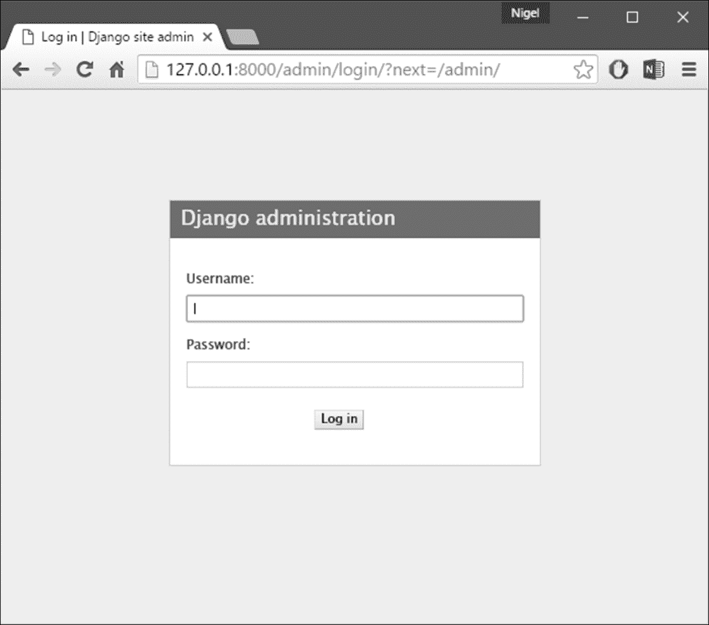

图 5.1：**Django 管理员**登录界面

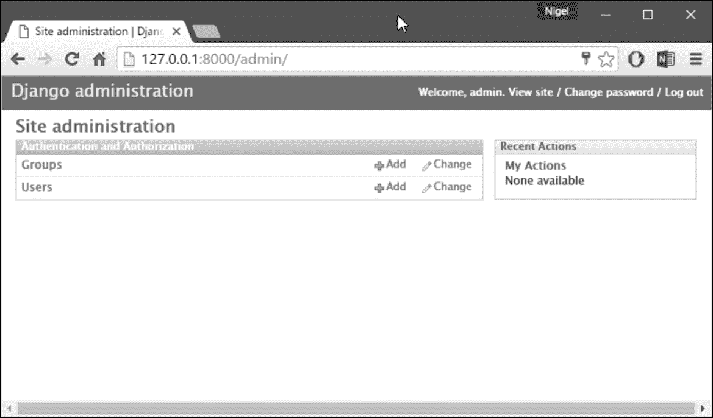

图 5.2：**Django 管理员**首页

Django 管理站点中的每种数据都有一个更改列表和一个编辑表单。更改列表会显示数据库中所有可用的对象，而编辑表单则允许你添加、更改或删除数据库中的特定记录。点击**用户**行中的**更改**链接，加载用户的更改列表页面（*图 5.3*）。

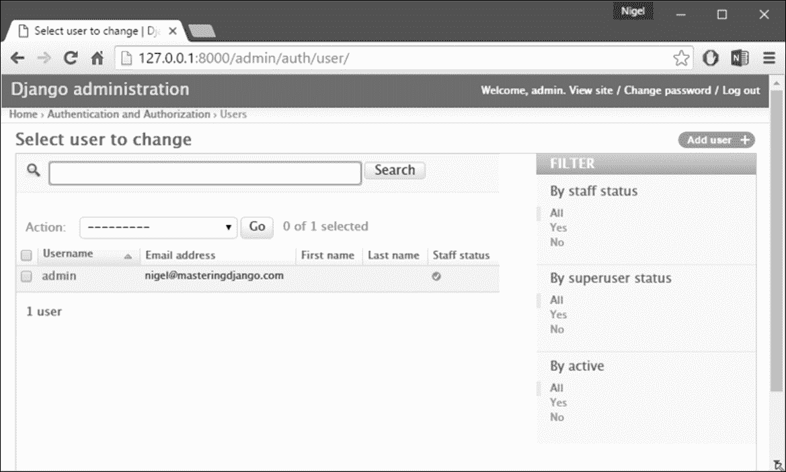

图 5.3：用户更改列表页面

这个页面显示了数据库中的所有用户；您可以将其视为`SELECT * FROM auth_user;` SQL 查询的网页版本。如果您正在跟随我们的示例，假设您只看到一个用户，那么一旦您有了更多的用户，您可能会发现过滤、排序和搜索选项很有用。

过滤选项在右侧，点击列标题可进行排序，顶部的搜索框可让您按用户名搜索。点击您创建的用户的用户名，您将看到该用户的编辑表单（*图 5.4*）。

这个页面允许您更改用户的属性，比如名字和各种权限。请注意，要更改用户的密码，您应该点击密码字段下的**更改密码表单**，而不是编辑哈希代码。

另一个需要注意的是，不同类型的字段会得到不同的小部件-例如，日期/时间字段有日历控件，布尔字段有复选框，字符字段有简单的文本输入字段。

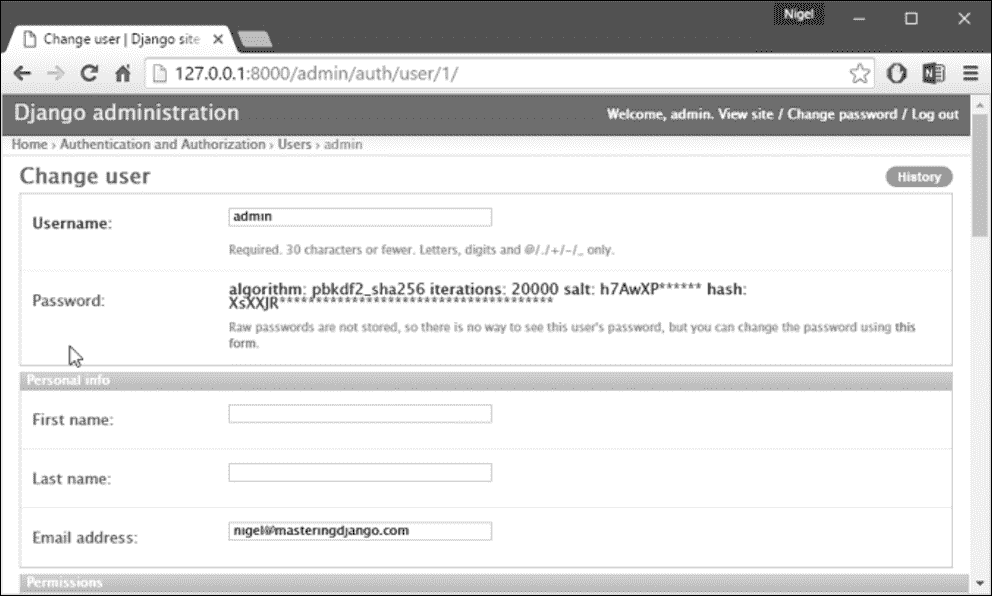

图 5.4：用户编辑表单

您可以通过在其编辑表单的左下角点击删除按钮来删除记录。这将带您到一个确认页面，在某些情况下，它将显示将被删除的任何相关对象（例如，如果您删除一个出版商，那么任何与该出版商有关的书籍也将被删除！）

您可以通过在管理主页的适当列中点击**添加**来添加记录。这将为您提供一个空白版本的编辑页面，准备让您填写。

您还会注意到，管理界面还为您处理输入验证。尝试将必填字段留空或在日期字段中输入无效日期，当您尝试保存时，您将看到这些错误，就像*图 5.5*中显示的那样。

当您编辑现有对象时，您会注意到窗口右上角有一个“历史”链接。通过管理界面进行的每一次更改都会被记录下来，您可以通过单击“历史”链接来查看这个日志（见*图 5.6*）。

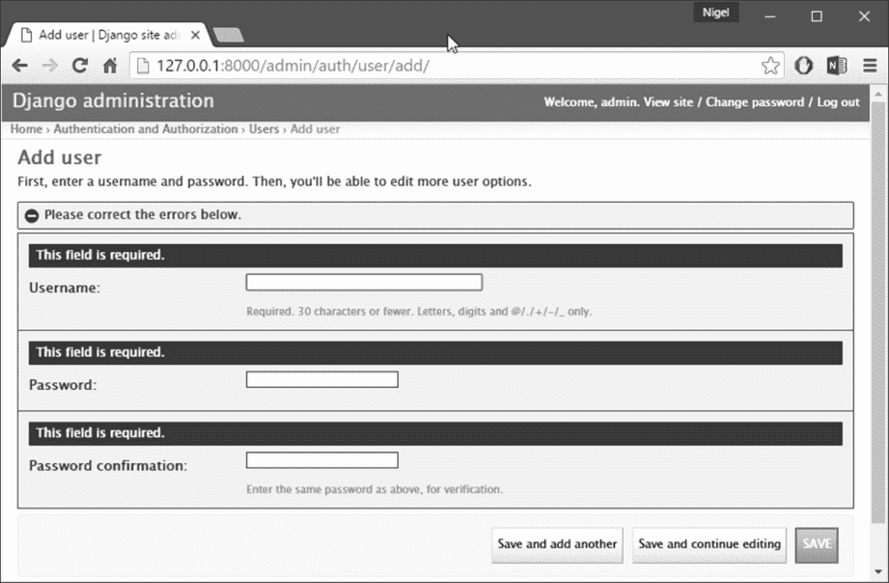

图 5.5：显示错误的编辑表单

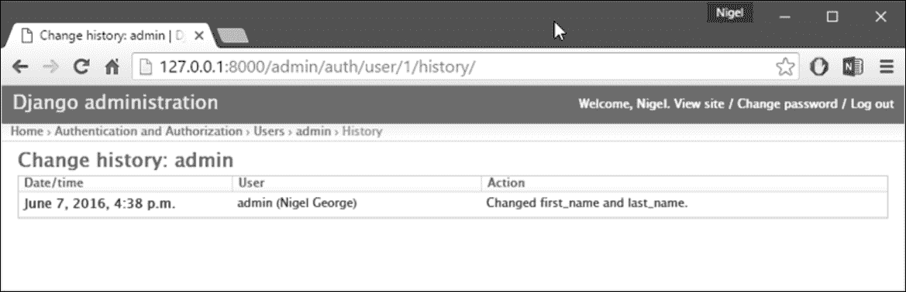

图 5.6：对象历史页面

### 注意

**管理站点的工作原理**

在幕后，管理站点是如何工作的？这相当简单。当 Django 在服务器启动时加载时，它会运行`admin.autodiscover()`函数。在 Django 的早期版本中，您需要从`urls.py`中调用这个函数，但现在 Django 会自动运行它。这个函数会遍历您的`INSTALLED_APPS`设置，并在每个已安装的应用程序中查找名为`admin.py`的文件。如果给定的应用程序中存在`admin.py`，它将执行该文件中的代码。

在我们的`books`应用程序的`admin.py`中，每次调用`admin.site.register()`都会简单地向管理站点注册给定的模型。管理站点只会为已经明确注册的模型显示编辑/更改界面。应用程序`django.contrib.auth`包括自己的`admin.py`，这就是为什么用户和组自动显示在管理中的原因。其他`django.contrib`应用程序，比如`django.contrib.redirects`，也会将自己添加到管理中，许多您从网上下载的第三方 Django 应用程序也会这样做。

除此之外，Django 管理站点只是一个 Django 应用程序，有自己的模型、模板、视图和 URLpatterns。您可以通过将其连接到您的 URLconf 来将其添加到您的应用程序中，就像您连接自己的视图一样。您可以在 Django 代码库的`django/contrib/admin`中查看其模板、视图和 URLpatterns，但不要尝试直接更改其中的任何内容，因为有很多钩子可以让您自定义管理站点的工作方式。

如果您决定在 Django 管理应用程序中进行探索，请记住，它在读取有关模型的元数据时会执行一些相当复杂的操作，因此可能需要大量时间来阅读和理解代码。

# 将您的模型添加到管理站点

有一个至关重要的部分我们还没有做。让我们将我们自己的模型添加到管理站点，这样我们就可以使用这个不错的界面向我们的自定义数据库表中添加、更改和删除对象。我们将继续第四章 *模型*中的`books`示例，我们在其中定义了三个模型：出版商、作者和书籍。在`books`目录（`mysite/books`）中，如果`startapp`没有创建一个名为`admin.py`的文件，那么您可以自己创建一个，并输入以下代码：

```py
from django.contrib import admin 
from .models import Publisher, Author, Book 

admin.site.register(Publisher) 
admin.site.register(Author) 
admin.site.register(Book) 

```

这段代码告诉 Django 管理站点为每个模型提供界面。完成后，转到您的网页浏览器中的管理主页（`http://127.0.0.1:8000/admin/`），您应该会看到一个**Books**部分，其中包含有关作者、书籍和出版商的链接。（您可能需要停止并重新启动开发服务器以使更改生效。）现在，您已经为这三个模型中的每一个拥有了一个完全功能的管理界面。这很容易！

花一些时间添加和更改记录，用一些数据填充您的数据库。如果您遵循第四章 *模型*，创建`Publisher`对象的示例（并且您没有删除它们），您已经可以在出版商更改列表页面上看到这些记录了。

这里值得一提的一个功能是管理站点对外键和多对多关系的处理，这两者都出现在`Book`模型中。作为提醒，这是`Book`模型的样子：

```py
class Book(models.Model): 
    title = models.CharField(max_length=100) 
    authors = models.ManyToManyField(Author) 
    publisher = models.ForeignKey(Publisher) 
    publication_date = models.DateField() 

    def __str__(self): 
        return self.title 

```

在 Django 管理站点的**添加书籍**页面（`http://127.0.0.1:8000/admin/books/book/add/`）

出版商（`ForeignKey`）由一个下拉框表示，作者字段（`ManyToManyField`）由一个多选框表示。这两个字段旁边有一个绿色加号图标，让您可以添加相关类型的记录。

例如，如果您点击**出版商**字段旁边的绿色加号，您将会得到一个弹出窗口，让您可以添加一个出版商。在弹出窗口中成功创建出版商后，**添加书籍**表单将会更新，显示新创建的出版商。很棒。

# 使字段变为可选

在管理站点玩一段时间后，您可能会注意到一个限制-编辑表单要求填写每个字段，而在许多情况下，您可能希望某些字段是可选的。例如，我们希望`Author`模型的`email`字段是可选的-也就是说，允许空字符串。在现实世界中，您可能并不为每个作者都有电子邮件地址。

要指定`email`字段是可选的，请编辑`Author`模型（正如您从第四章 *模型*中记得的那样，它位于`mysite/books/models.py`中）。只需向`email`字段添加`blank=True`，如下所示：

```py
class Author(models.Model): 
    first_name = models.CharField(max_length=30) 
    last_name = models.CharField(max_length=40) 
    email = models.EmailField(blank=True)

```

这段代码告诉 Django 空值确实允许作者的电子邮件地址。默认情况下，所有字段都具有`blank=False`，这意味着不允许空值。

这里发生了一些有趣的事情。到目前为止，除了`__str__()`方法之外，我们的模型一直作为数据库表的定义-基本上是 SQL `CREATE TABLE`语句的 Python 表达式。通过添加`blank=True`，我们已经开始扩展我们的模型，超出了对数据库表的简单定义。

现在，我们的模型类开始成为关于`Author`对象是什么以及它们能做什么的更丰富的知识集合。`email`字段不仅在数据库中表示为`VARCHAR`列；在诸如 Django 管理站点之类的上下文中，它也是一个可选字段。

一旦添加了`blank=True`，重新加载**添加作者**编辑表单（`http://127.0.0.1:8000/admin/books/author/add/`），您会注意到字段的标签-**电子邮件**-不再是粗体。这表示它不是必填字段。现在您可以添加作者而无需提供电子邮件地址；如果字段提交为空，您将不再收到响亮的红色**此字段是必填的**消息。

## 使日期和数字字段变为可选

与`blank=True`相关的一个常见陷阱与日期和数字字段有关，但它需要相当多的背景解释。SQL 有自己指定空值的方式-一个称为`NULL`的特殊值。`NULL`可能意味着“未知”、“无效”或其他一些特定于应用程序的含义。在 SQL 中，`NULL`的值与空字符串不同，就像特殊的 Python 对象`None`与空的 Python 字符串（`""`）不同。

这意味着特定字符字段（例如`VARCHAR`列）可以包含`NULL`值和空字符串值。这可能会导致不必要的歧义和混淆：为什么这条记录有一个`NULL`，而另一条记录有一个空字符串？有区别吗，还是数据只是不一致地输入了？以及：我如何获取所有具有空值的记录-我应该查找`NULL`记录和空字符串，还是只选择具有空字符串的记录？

为了避免这种歧义，Django 自动生成的`CREATE TABLE`语句（在第四章中介绍过，*模型*）为每个列定义添加了显式的`NOT NULL`。例如，这是我们的`Author`模型的生成语句，来自第四章，*模型*：

```py
CREATE TABLE "books_author" ( 
    "id" serial NOT NULL PRIMARY KEY, 
    "first_name" varchar(30) NOT NULL, 
    "last_name" varchar(40) NOT NULL, 
    "email" varchar(75) NOT NULL 
); 

```

在大多数情况下，这种默认行为对于您的应用程序来说是最佳的，并且会避免数据不一致的问题。它与 Django 的其余部分很好地配合，比如 Django 管理站点，在您留空字符字段时会插入一个空字符串（而不是`NULL`值）。

但是，对于不接受空字符串作为有效值的数据库列类型，例如日期、时间和数字，有一个例外。如果您尝试将空字符串插入日期或整数列，根据您使用的数据库，您可能会收到数据库错误（PostgreSQL 是严格的，在这里会引发异常；MySQL 可能会接受它，也可能不会，这取决于您使用的版本、时间和月相）。

在这种情况下，`NULL`是指定空值的唯一方法。在 Django 模型中，您可以通过向字段添加`null=True`来指定允许`NULL`。这就是说：如果您想在日期字段（例如`DateField`、`TimeField`、`DateTimeField`）或数字字段（例如`IntegerField`、`DecimalField`、`FloatField`）中允许空值，您将需要同时使用`null=True`和`blank=True`。

举例来说，让我们将我们的`Book`模型更改为允许空白的`publication_date`。以下是修改后的代码：

```py
class Book(models.Model): 
    title = models.CharField(max_length=100) 
    authors = models.ManyToManyField(Author) 
    publisher = models.ForeignKey(Publisher) 
    publication_date = models.DateField(blank=True, null=True)

```

添加`null=True`比添加`blank=True`更复杂，因为`null=True`会改变数据库的语义-也就是说，它会从`publication_date`字段的`CREATE TABLE`语句中删除`NOT NULL`。要完成此更改，我们需要更新数据库。出于许多原因，Django 不尝试自动更改数据库模式，因此您需要在对模型进行此类更改时执行`python manage.py migrate`命令。回到管理站点，现在**添加书籍**编辑表单应该允许空的出版日期值。

# 自定义字段标签

在管理站点的编辑表单上，每个字段的标签都是从其模型字段名称生成的。算法很简单：Django 只是用空格替换下划线，并将第一个字符大写，因此，例如，`Book`模型的`publication_date`字段的标签是**出版日期**。

然而，字段名称并不总是适合作为管理员字段标签，因此在某些情况下，您可能希望自定义标签。您可以通过在适当的模型字段中指定`verbose_name`来实现这一点。例如，这是我们如何将`Author.email`字段的标签更改为**e-mail**，并加上连字符：

```py
class Author(models.Model): 
    first_name = models.CharField(max_length=30) 
    last_name = models.CharField(max_length=40) 
 email = models.EmailField(blank=True, verbose_name ='e-mail')

```

进行这些更改并重新加载服务器，您应该在作者编辑表单上看到字段的新标签。请注意，除非始终应该大写（例如`"USA state"`），否则不要大写`verbose_name`的第一个字母。Django 将在需要时自动将其大写，并且在不需要大写的其他地方使用确切的`verbose_name`值。

# 自定义模型管理员类

到目前为止我们所做的更改-`blank=True`，`null=True`和`verbose_name`-实际上是模型级别的更改，而不是管理员级别的更改。也就是说，这些更改基本上是模型的一部分，只是碰巧被管理员站点使用；它们与管理员无关。

除此之外，Django 管理员站点提供了丰富的选项，让您可以自定义管理员站点如何为特定模型工作。这些选项存在于**ModelAdmin 类**中，这些类包含了特定模型在特定管理员站点实例中的配置。

## 自定义更改列表

让我们通过指定在我们的`Author`模型的更改列表上显示的字段来深入研究管理员自定义。默认情况下，更改列表显示每个对象的`__str__()`的结果。在第四章*模型*中，我们为`Author`对象定义了`__str__()`方法，以显示名字和姓氏：

```py
class Author(models.Model): 
    first_name = models.CharField(max_length=30) 
    last_name = models.CharField(max_length=40) 
    email = models.EmailField(blank=True, verbose_name ='e-mail') 

    def __str__(self): 
        return u'%s %s' % (self.first_name, self.last_name) 

```

结果是，`Author`对象的更改列表显示了每个人的名字和姓氏，就像*图 5.7*中所示的那样。

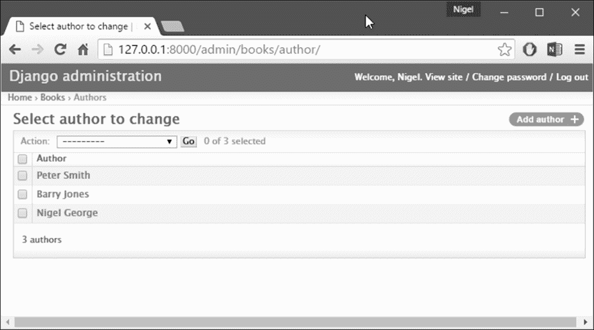

图 5.7：作者更改列表页面

我们可以通过向更改列表显示添加一些其他字段来改进这种默认行为。例如，在此列表中看到每个作者的电子邮件地址会很方便，而且能够按名字和姓氏排序也很好。为了实现这一点，我们将为`Author`模型定义一个`ModelAdmin`类。这个类是自定义管理员的关键，它让您可以做的最基本的事情之一就是指定要在更改列表页面上显示的字段列表。编辑`admin.py`以进行这些更改：

```py
from django.contrib import admin 
from mysite.books.models import Publisher, Author, Book 

class AuthorAdmin(admin.ModelAdmin):
 list_display = ('first_name', 'last_name', 'email') 

admin.site.register(Publisher) 
admin.site.register(Author, AuthorAdmin) 
admin.site.register(Book) 

```

我们所做的是：

+   我们创建了`AuthorAdmin`类。这个类是`django.contrib.admin.ModelAdmin`的子类，保存了特定管理员模型的自定义配置。我们只指定了一个自定义选项-`list_display`，它设置为要在更改列表页面上显示的字段名称的元组。当然，这些字段名称必须存在于模型中。

+   我们修改了`admin.site.register()`调用，将`AuthorAdmin`添加到`Author`之后。您可以这样理解：使用`AuthorAdmin`选项注册`Author`模型。

+   `admin.site.register()`函数接受`ModelAdmin`子类作为可选的第二个参数。如果不指定第二个参数（就像`Publisher`和`Book`的情况一样），Django 将使用该模型的默认管理员选项。

进行了这些调整后，重新加载作者更改列表页面，您会看到现在显示了三列-名字、姓氏和电子邮件地址。此外，每列都可以通过单击列标题进行排序。（见*图 5.8*。）

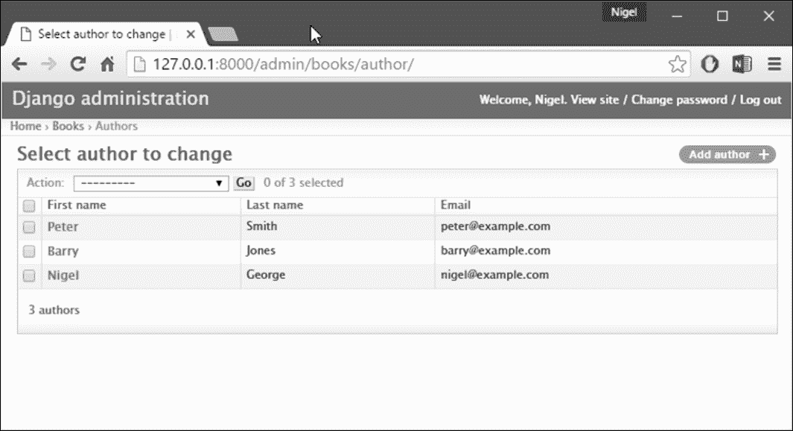

图 5.8：添加`list_display`后的作者更改列表页面

接下来，让我们添加一个简单的搜索栏。像这样在`AuthorAdmin`中添加`search_fields`：

```py
class AuthorAdmin(admin.ModelAdmin): 
    list_display = ('first_name', 'last_name', 'email') 
 search_fields = ('first_name', 'last_name')

```

在浏览器中重新加载页面，您应该会看到顶部有一个搜索栏（见 *图 5.9*）。我们刚刚告诉管理员更改列表页面包括一个搜索栏，可以搜索 `first_name` 和 `last_name` 字段。正如用户所期望的那样，这是不区分大小写的，并且搜索两个字段，因此搜索字符串 `bar` 将找到名为 Barney 的作者和姓为 Hobarson 的作者。

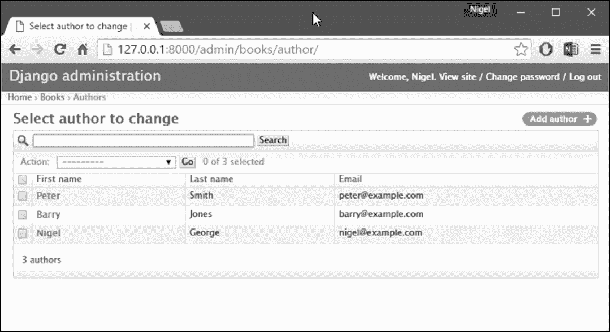

图 5.9：`search_fields` 添加后的作者更改列表页面

接下来，让我们在我们的 `Book` 模型的更改列表页面上添加一些日期过滤器：

```py
from django.contrib import admin 
from mysite.books.models import Publisher, Author, Book 

class AuthorAdmin(admin.ModelAdmin): 
    list_display = ('first_name', 'last_name', 'email') 
    search_fields = ('first_name', 'last_name') 

class BookAdmin(admin.ModelAdmin):
 list_display = ('title', 'publisher', 'publication_date')
 list_filter = ('publication_date',) 

admin.site.register(Publisher) 
admin.site.register(Author, AuthorAdmin) 
admin.site.register(Book, BookAdmin)

```

在这里，因为我们正在处理不同的选项集，我们创建了一个单独的 `ModelAdmin` 类-`BookAdmin`。首先，我们定义了一个 `list_display`，只是为了让更改列表看起来更好一些。然后，我们使用了 `list_filter`，它设置为一个字段元组，用于在更改列表页面的右侧创建过滤器。对于日期字段，Django 提供了快捷方式来过滤列表，包括**今天**、**过去 7 天**、**本月**和**今年**-这些是 Django 开发人员发现的常见日期过滤情况的快捷方式。*图 5.10* 显示了它的样子。

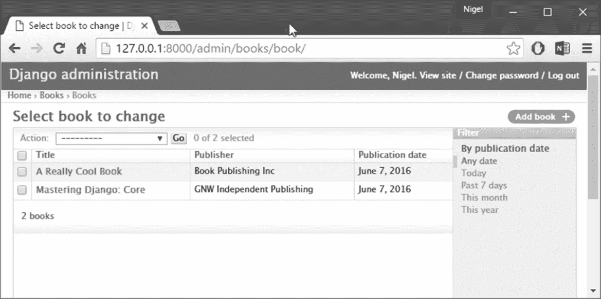

图 5.10：`list_filter` 后的书籍更改列表页面

`list_filter` 也适用于其他类型的字段，不仅仅是 `DateField`。（例如，尝试使用 `BooleanField` 和 `ForeignKey` 字段。）只要有至少两个可选择的值，过滤器就会显示出来。另一种提供日期过滤器的方法是使用 `date_hierarchy` 管理选项，就像这样：

```py
class BookAdmin(admin.ModelAdmin): 
    list_display = ('title', 'publisher','publication_date') 
    list_filter = ('publication_date',) 
 date_hierarchy = 'publication_date'

```

有了这个设置，更改列表页面顶部会出现一个日期钻取导航栏，如 *图 5.11* 所示。它从可用年份列表开始，然后进入月份和具体日期。

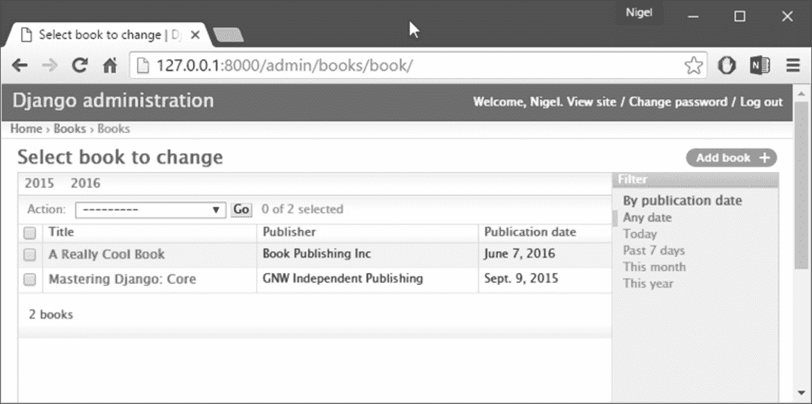

图 5.11：`date_hierarchy` 后的书籍更改列表页面

请注意，`date_hierarchy` 接受一个字符串，而不是元组，因为只能使用一个日期字段来创建层次结构。最后，让我们更改默认排序，使得更改列表页面上的书籍总是按照它们的出版日期降序排序。默认情况下，更改列表根据其模型的 `class Meta` 中的 `ordering` 对象进行排序（我们在第四章中介绍过，*模型*）-但如果您没有指定这个 `ordering` 值，那么排序是未定义的。

```py
class BookAdmin(admin.ModelAdmin): 
    list_display = ('title', 'publisher','publication_date') 
    list_filter = ('publication_date',) 
    date_hierarchy = 'publication_date' 
 ordering = ('-publication_date',)

```

这个管理员 `ordering` 选项与模型的 `class Meta` 中的 `ordering` 完全相同，只是它只使用列表中的第一个字段名。只需传递一个字段名的列表或元组，并在字段前加上减号以使用降序排序。重新加载书籍更改列表，以查看它的效果。请注意，**出版日期** 标头现在包含一个小箭头，指示记录的排序方式（见 *图 5.12*）。

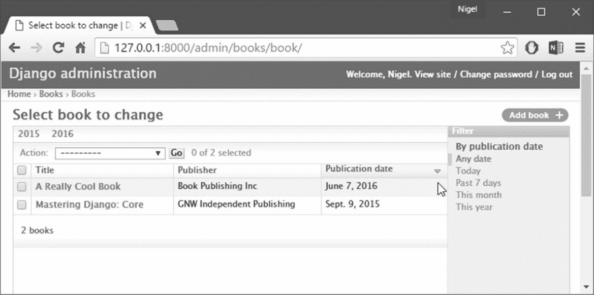

图 5.12：排序后的书籍更改列表页面

我们在这里介绍了主要的更改列表选项。使用这些选项，您可以只用几行代码就可以创建一个非常强大的、适用于生产的数据编辑界面。

## 自定义编辑表单

就像更改列表可以自定义一样，编辑表单也可以以多种方式自定义。首先，让我们自定义字段的排序方式。默认情况下，编辑表单中字段的顺序与模型中定义的顺序相对应。我们可以使用我们的 `ModelAdmin` 子类中的 `fields` 选项来更改这一点：

```py
class BookAdmin(admin.ModelAdmin): 
    list_display = ('title', 'publisher', 'publication_date') 
    list_filter = ('publication_date',) 
    date_hierarchy = 'publication_date' 
    ordering = ('-publication_date',) 
 fields = ('title', 'authors', 'publisher', publication_date')

```

在这个更改之后，书籍的编辑表单将使用给定的字段排序。将作者放在书名后面会更自然一些。当然，字段顺序应该取决于您的数据输入工作流程。每个表单都是不同的。

`fields`选项让你可以做的另一件有用的事情是完全排除某些字段的编辑。只需省略你想要排除的字段。如果你的管理员用户只被信任编辑数据的某个部分，或者你的某些字段是由外部自动化流程改变的，你可能会用到这个功能。

例如，在我们的书籍数据库中，我们可以隐藏`publication_date`字段，使其不可编辑：

```py
class BookAdmin(admin.ModelAdmin): 
    list_display = ('title', 'publisher','publication_date') 
    list_filter = ('publication_date',) 
    date_hierarchy = 'publication_date' 
    ordering = ('-publication_date',) 
 fields = ('title', 'authors', 'publisher')

```

因此，书籍的编辑表单没有提供指定出版日期的方法。这可能很有用，比如，如果你是一个编辑，你希望作者不要推迟出版日期。（当然，这只是一个假设的例子。）当用户使用这个不完整的表单添加新书时，Django 将简单地将`publication_date`设置为`None`-所以确保该字段具有`null=True`。

另一个常用的编辑表单定制与多对多字段有关。正如我们在书籍的编辑表单上看到的，管理员站点将每个`ManyToManyField`表示为多选框，这是最合乎逻辑的 HTML 输入小部件使用方式，但多选框可能难以使用。如果你想选择多个项目，你必须按住控制键，或者在 Mac 上按住命令键。

管理员站点贴心地插入了一些解释这一点的文本，但是当你的字段包含数百个选项时，它仍然变得笨拙。管理员站点的解决方案是`filter_horizontal`。让我们将其添加到`BookAdmin`中，看看它的作用。

```py
class BookAdmin(admin.ModelAdmin): 
    list_display = ('title', 'publisher','publication_date') 
    list_filter = ('publication_date',) 
    date_hierarchy = 'publication_date' 
    ordering = ('-publication_date',) 
 filter_horizontal = ('authors',)

```

（如果你在跟着做，注意我们也已经移除了`fields`选项来显示编辑表单中的所有字段。）重新加载书籍的编辑表单，你会看到**作者**部分现在使用了一个花哨的 JavaScript 过滤界面，让你可以动态搜索选项并将特定作者从**可用作者**移动到**已选作者**框中，反之亦然。

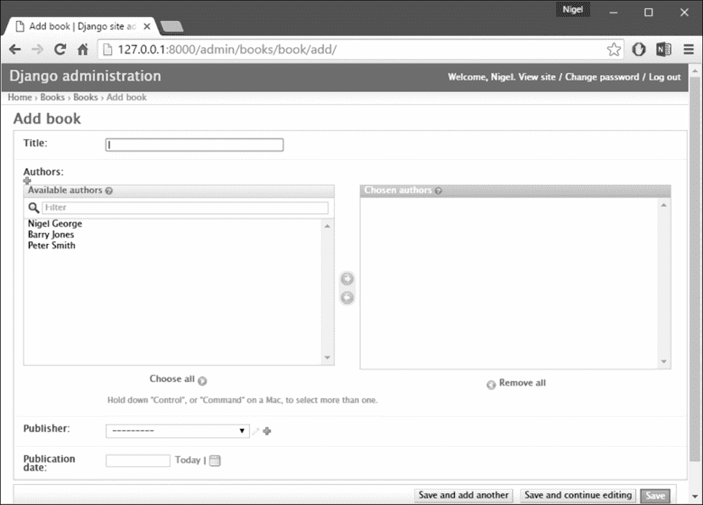

图 5.13：添加 filter_horizontal 后的书籍编辑表单

我强烈建议对于有超过十个项目的`ManyToManyField`使用`filter_horizontal`。它比简单的多选小部件更容易使用。另外，请注意你可以对多个字段使用`filter_horizontal`-只需在元组中指定每个名称。

`ModelAdmin`类也支持`filter_vertical`选项。这与`filter_horizontal`的工作方式完全相同，但是生成的 JavaScript 界面将两个框垂直堆叠而不是水平堆叠。这是个人品味的问题。

`filter_horizontal`和`filter_vertical`只对`ManyToManyField`字段起作用，而不对`ForeignKey`字段起作用。默认情况下，管理员站点对`ForeignKey`字段使用简单的`<select>`框，但是，就像对于`ManyToManyField`一样，有时你不想承担选择所有相关对象以在下拉框中显示的开销。

例如，如果我们的书籍数据库增长到包括成千上万的出版商，**添加书籍**表单可能需要一段时间才能加载，因为它需要加载每个出版商以在`<select>`框中显示。

修复这个问题的方法是使用一个叫做`raw_id_fields`的选项：

```py
class BookAdmin(admin.ModelAdmin): 
    list_display = ('title', 'publisher','publication_date') 
    list_filter = ('publication_date',) 
    date_hierarchy = 'publication_date' 
    ordering = ('-publication_date',) 
    filter_horizontal = ('authors',) 
 raw_id_fields = ('publisher',)

```

将其设置为`ForeignKey`字段名称的元组，这些字段将在管理员中显示为一个简单的文本输入框(`<input type="text">`)，而不是一个`<select>`。见*图 5.14*。


图 5.14：添加`raw_id_fields`后的书籍编辑表单

你在这个输入框中输入什么？出版商的数据库 ID。鉴于人类通常不会记住数据库 ID，还有一个放大镜图标，你可以点击它弹出一个窗口，从中选择要添加的出版商。

# 用户、组和权限

因为您以超级用户身份登录，您可以访问创建、编辑和删除任何对象。不同的环境需要不同的权限系统-并非每个人都可以或应该成为超级用户。Django 的管理员站点使用了一个权限系统，您可以使用它来仅给特定用户访问他们需要的界面部分。这些用户帐户的设计是足够通用，可以在管理员界面之外使用，但我们现在将它们视为管理员用户帐户。

在第十一章，“Django 中的用户认证”中，我们将介绍如何使用 Django 的认证系统在整个站点上管理用户（即不仅仅是管理员站点）。您可以像编辑任何其他对象一样，通过管理员界面编辑用户和权限。我们在本章的前面看到了这一点，当时我们在管理员的用户和组部分玩耍。

用户对象具有标准的用户名、密码、电子邮件和真实姓名字段，以及一组定义用户在管理员界面中允许做什么的字段。首先，有一组三个布尔标志：

+   active 标志控制用户是否活跃。如果这个标志关闭，用户尝试登录时，即使有有效密码，也不会被允许登录。

+   staff 标志控制用户是否被允许登录到管理员界面（也就是说，该用户是否被认为是您组织中的工作人员）。由于这个相同的用户系统可以用来控制对公共（即非管理员）站点的访问（参见第十一章，“Django 中的用户认证”），这个标志区分了公共用户和管理员。

+   超级用户标志给予用户在管理员界面中添加、创建和删除任何项目的完全访问权限。如果用户设置了这个标志，那么所有常规权限（或缺乏权限）对该用户都将被忽略。

普通管理员用户-也就是活跃的、非超级用户的工作人员-通过分配的权限获得管理员访问权限。通过管理员界面可编辑的每个对象（例如书籍、作者、出版商）都有三个权限：创建权限、编辑权限和删除权限。将权限分配给用户将授予用户执行这些权限描述的操作的访问权限。当您创建用户时，该用户没有任何权限，您需要为用户分配特定的权限。

例如，您可以给用户添加和更改出版商的权限，但不给予删除的权限。请注意，这些权限是针对模型定义的，而不是针对对象定义的-因此它们让您说“约翰可以对任何书进行更改”，但不让您说“约翰可以对 Apress 出版的任何书进行更改”。后者的功能，即对象级权限，有点复杂，超出了本书的范围，但在 Django 文档中有介绍。

### 注意

警告！

对编辑用户和权限的访问也受到这个权限系统的控制。如果您给某人编辑用户的权限，他们将能够编辑自己的权限，这可能不是您想要的！给用户编辑用户的权限实质上是将用户变成超级用户。

您还可以将用户分配到组。组只是一组权限，适用于该组的所有成员。组对于授予一部分用户相同的权限非常有用。

# 何时以及为什么使用管理员界面，以及何时不要使用

通过本章的学习，您应该对如何使用 Django 的管理员站点有一个很好的了解。但我想强调一下何时以及为什么您可能想要使用它，以及何时不要使用它。

当非技术用户需要输入数据时，Django 的管理站点尤其突出；毕竟，这就是该功能的目的。在 Django 首次开发的报纸上，开发典型的在线功能（比如市政供水水质特别报告）的开发过程大致如下：

+   负责项目的记者与其中一名开发人员会面，并描述可用的数据。

+   开发人员设计 Django 模型以适应这些数据，然后向记者打开管理站点。

+   记者检查管理站点以指出任何缺失或多余的字段-现在指出比以后好。开发人员迭代更改模型。

+   当模型达成一致后，记者开始使用管理站点输入数据。与此同时，程序员可以专注于开发公开可访问的视图/模板（这是有趣的部分！）。

换句话说，Django 的管理界面的存在意义是促进内容生产者和程序员的同时工作。然而，除了这些明显的数据输入任务之外，管理站点在一些其他情况下也很有用：

+   **检查数据模型**：一旦定义了一些模型，通过在管理界面中调用它们并输入一些虚拟数据，这可能会揭示数据建模错误或模型的其他问题。

+   **管理获取的数据**：对于依赖来自外部来源的数据的应用程序（例如用户或网络爬虫），管理站点为您提供了一种轻松的方式来检查或编辑这些数据。您可以将其视为数据库命令行实用程序的功能较弱但更方便的版本。

+   **快速而简单的数据管理应用程序**：您可以使用管理站点来构建一个非常轻量级的数据管理应用程序，比如用于跟踪开支。如果您只是为自己的需求构建某些东西，而不是为公众消费，管理站点可以帮助您走得更远。在这种意义上，您可以将其视为增强版的关系型电子表格。

然而，管理站点并不是万能的。它不打算成为数据的公共接口，也不打算允许对数据进行复杂的排序和搜索。正如本章早期所说，它是为受信任的站点管理员而设计的。牢记这一甜蜜点是有效使用管理站点的关键。

# 接下来呢？

到目前为止，我们已经创建了一些模型，并配置了一个一流的界面来编辑数据。在下一章中，我们将继续进行真正的网页开发：表单创建和处理。
