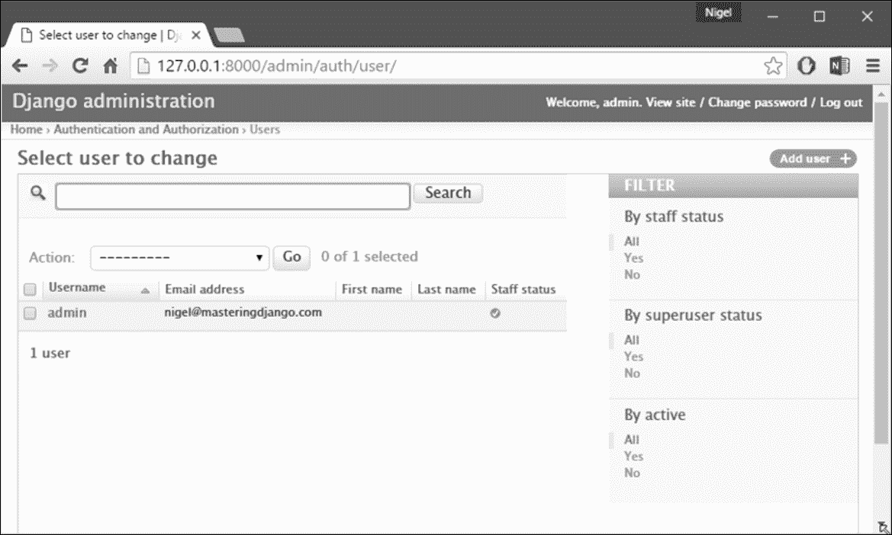

# 第十一章：Django 中的用户身份验证

现代互动网站的重要百分比允许某种形式的用户交互-从在博客上允许简单评论，到在新闻网站上完全控制文章的编辑。如果网站提供任何形式的电子商务，对付费客户进行身份验证和授权是必不可少的。

仅仅管理用户-忘记用户名、忘记密码和保持信息更新可能会是一个真正的痛苦。作为程序员，编写身份验证系统甚至可能更糟。

幸运的是，Django 提供了默认实现来管理用户帐户、组、权限和基于 cookie 的用户会话。

与 Django 中的大多数内容一样，默认实现是完全可扩展和可定制的，以满足项目的需求。所以让我们开始吧。

# 概述

Django 身份验证系统处理身份验证和授权。简而言之，身份验证验证用户是否是他们声称的人，授权确定经过身份验证的用户被允许做什么。这里使用身份验证一词来指代这两个任务。

身份验证系统包括：

+   用户

+   权限：二进制（是/否）标志，指示用户是否可以执行某项任务

+   组：一种将标签和权限应用于多个用户的通用方法

+   可配置的密码哈希系统

+   用于管理用户身份验证和授权的表单。

+   用于登录用户或限制内容的视图工具

+   可插拔的后端系统

Django 中的身份验证系统旨在非常通用，并且不提供一些常见的 Web 身份验证系统中常见的功能。这些常见问题的解决方案已经在第三方软件包中实现：

+   密码强度检查

+   登录尝试的限制

+   针对第三方的身份验证（例如 OAuth）

# 使用 Django 身份验证系统

Django 的身份验证系统在其默认配置中已经发展到满足最常见的项目需求，处理了相当广泛的任务，并且对密码和权限进行了谨慎的实现。对于身份验证需求与默认设置不同的项目，Django 还支持对身份验证进行广泛的扩展和定制。

# 用户对象

`User`对象是身份验证系统的核心。它们通常代表与您的站点交互的人，并用于启用诸如限制访问、注册用户配置文件、将内容与创建者关联等功能。在 Django 的身份验证框架中只存在一类用户，即`superusers`或管理员`staff`用户只是具有特殊属性设置的用户对象，而不是不同类别的用户对象。默认用户的主要属性是：

+   “用户名”

+   “密码”

+   “电子邮件”

+   “名”

+   “姓”

## 创建超级用户

使用`createsuperuser`命令创建超级用户：

```py
python manage.py createsuperuser -username=joe -email=joe@example.com 

```

系统将提示您输入密码。输入密码后，用户将立即创建。如果省略`-username`或`-email`选项，系统将提示您输入这些值。

## 创建用户

创建和管理用户的最简单、最不容易出错的方法是通过 Django 管理员。Django 还提供了内置的视图和表单，允许用户登录、退出和更改自己的密码。我们稍后将在本章中查看通过管理员和通用用户表单进行用户管理，但首先，让我们看看如何直接处理用户身份验证。

创建用户的最直接方法是使用包含的`create_user()`辅助函数：

```py
>>> from Django.contrib.auth.models import User 
>>> user = User.objects.create_user('john', 'lennon@thebeatles.com', 'johnpassword') 

# At this point, user is a User object that has already been saved 
# to the database. You can continue to change its attributes 
# if you want to change other fields. 
>>> user.last_name = 'Lennon' 
>>> user.save() 

```

## 更改密码

Django 不会在用户模型上存储原始（明文）密码，而只会存储哈希值。因此，不要尝试直接操作用户的密码属性。这就是为什么在创建用户时使用辅助函数的原因。要更改用户的密码，您有两个选项：

+   `manage.py changepassword username`提供了一种从命令行更改用户密码的方法。它会提示您更改给定用户的密码，您必须输入两次。如果两者匹配，新密码将立即更改。如果您没有提供用户，命令将尝试更改与当前系统用户匹配的用户的密码。

+   您还可以使用`set_password()`以编程方式更改密码：

```py
        >>> from Django.contrib.auth.models import User 
        >>> u = User.objects.get(username='john') 
        >>> u.set_password('new password') 
        >>> u.save() 

```

更改用户的密码将注销其所有会话，如果启用了`SessionAuthenticationMiddleware`。

# 权限和授权

Django 带有一个简单的权限系统。它提供了一种将权限分配给特定用户和用户组的方法。它被 Django 管理站点使用，但欢迎您在自己的代码中使用它。Django 管理站点使用权限如下：

+   查看*add*表单和添加对象的访问权限仅限于具有该类型对象的*add*权限的用户。

+   查看更改列表，查看*change*表单和更改对象的访问权限仅限于具有该类型对象的*change*权限的用户。

+   删除对象的访问权限仅限于具有该类型对象的*delete*权限的用户。

权限不仅可以针对对象类型设置，还可以针对特定对象实例设置。通过使用`ModelAdmin`类提供的`has_add_permission()`、`has_change_permission()`和`has_delete_permission()`方法，可以为同一类型的不同对象实例自定义权限。`User`对象有两个多对多字段：`groups`和`user_permissions`。`User`对象可以像任何其他 Django 模型一样访问其相关对象。

## 默认权限

当在您的`INSTALLED_APPS`设置中列出`Django.contrib.auth`时，它将确保为您安装的应用程序中定义的每个 Django 模型创建三个默认权限-添加、更改和删除。每次运行`manage.py migrate`时，这些权限将为所有新模型创建。

## 用户组

`Django.contrib.auth.models.Group`模型是一种通用的方式，可以对用户进行分类，以便为这些用户应用权限或其他标签。用户可以属于任意数量的组。组中的用户将自动获得该组授予的权限。例如，如果组`站点编辑`具有权限`can_edit_home_page`，则该组中的任何用户都将具有该权限。

除了权限之外，用户组是一种方便的方式，可以对用户进行分类，给他们一些标签或扩展功能。例如，您可以创建一个名为`特殊用户`的用户组，并编写代码，例如，让他们访问站点的仅限会员部分，或者发送他们仅限会员的电子邮件。

## 以编程方式创建权限

虽然可以在模型的`Meta`类中定义自定义权限，但也可以直接创建权限。例如，您可以在`books`中的`BookReview`模型中创建`can_publish`权限：

```py
from books.models import BookReview 
from Django.contrib.auth.models import Group, Permission 
from Django.contrib.contenttypes.models import ContentType 

content_type = ContentType.objects.get_for_model(BookReview) 
permission = Permission.objects.create(codename='can_publish', 
                                       name='Can Publish Reviews', 
                                       content_type=content_type) 

```

然后可以通过其`user_permissions`属性将权限分配给`User`，或者通过其`permissions`属性将权限分配给`Group`。

## 权限缓存

`ModelBackend`在首次需要获取权限进行权限检查后，会在`User`对象上缓存权限。这通常对于请求-响应周期来说是可以的，因为权限通常不会在添加后立即进行检查（例如在管理站点中）。

如果您正在添加权限并立即进行检查，例如在测试或视图中，最简单的解决方案是重新从数据库中获取`User`。例如：

```py
from Django.contrib.auth.models import Permission, User 
from Django.shortcuts import get_object_or_404 

def user_gains_perms(request, user_id): 
    user = get_object_or_404(User, pk=user_id) 
    # any permission check will cache the current set of permissions 
    user.has_perm('books.change_bar') 

    permission = Permission.objects.get(codename='change_bar') 
    user.user_permissions.add(permission) 

    # Checking the cached permission set 
    user.has_perm('books.change_bar')  # False 

    # Request new instance of User 
    user = get_object_or_404(User, pk=user_id) 

    # Permission cache is repopulated from the database 
    user.has_perm('books.change_bar')  # True 

    # ... 

```

# Web 请求中的身份验证

Django 使用会话和中间件将认证系统连接到`request`对象。这些为每个请求提供了一个`request.user`属性，表示当前用户。如果当前用户没有登录，这个属性将被设置为`AnonymousUser`的一个实例，否则它将是`User`的一个实例。你可以用`is_authenticated()`来区分它们，就像这样：

```py
if request.user.is_authenticated(): 
    # Do something for authenticated users. 
else: 
    # Do something for anonymous users. 

```

## 如何登录用户

要登录用户，从视图中使用`login()`。它接受一个`HttpRequest`对象和一个`User`对象。`login()`使用 Django 的会话框架在会话中保存用户的 ID。请注意，匿名会话期间设置的任何数据在用户登录后仍保留在会话中。这个例子展示了你可能如何同时使用`authenticate()`和`login()`：

```py
from Django.contrib.auth import authenticate, login 

def my_view(request): 
    username = request.POST['username'] 
    password = request.POST['password'] 
    user = authenticate(username=username, password=password) 
    if user is not None: 
        if user.is_active: 
            login(request, user) 
            # Redirect to a success page. 
        else: 
            # Return a 'disabled account' error message 
    else: 
        # Return an 'invalid login' error message. 

```

### 注意

**首先调用**`authenticate()` 

当你手动登录用户时，你必须在调用`login()`之前调用`authenticate()`。`authenticate()`设置了一个属性，指示哪个认证后端成功地认证了该用户，这些信息在登录过程中稍后是需要的。如果你尝试直接从数据库中检索用户对象登录，将会引发错误。

## 如何注销用户

要注销通过`login()`登录的用户，使用`logout()`在你的视图中。它接受一个`HttpRequest`对象，没有返回值。例如：

```py
from Django.contrib.auth import logout 

def logout_view(request): 
    logout(request) 
    # Redirect to a success page. 

```

请注意，如果用户未登录，`logout()`不会抛出任何错误。当你调用`logout()`时，当前请求的会话数据将被完全清除。所有现有的数据都将被删除。这是为了防止另一个人使用相同的网络浏览器登录并访问先前用户的会话数据。

如果你想把任何东西放到会话中，用户在注销后立即可用，那就在调用`logout()`后这样做。

## 限制已登录用户的访问

### 原始方法

限制访问页面的简单、原始方法是检查`request.user.is_authenticated()`，并重定向到登录页面：

```py
from Django.shortcuts import redirect 

def my_view(request): 
    if not request.user.is_authenticated(): 
        return redirect('/login/?next=%s' % request.path) 
    # ... 

```

...或显示错误消息：

```py
from Django.shortcuts import render 

def my_view(request): 
    if not request.user.is_authenticated(): 
        return render(request, 'books/login_error.html') 
    # ... 

```

### login_required 装饰器

作为快捷方式，你可以使用方便的`login_required()`装饰器：

```py
from Django.contrib.auth.decorators import login_required 

@login_required 
def my_view(request): 
    ... 

```

`login_required()`做了以下事情：

+   如果用户未登录，重定向到`LOGIN_URL`，在查询字符串中传递当前的绝对路径。例如：`/accounts/login/?next=/reviews/3/`。

+   如果用户已登录，正常执行视图。视图代码可以自由假设用户已登录。

默认情况下，用户在成功验证后应重定向到的路径存储在一个名为`next`的查询字符串参数中。如果你想使用不同的名称来使用这个参数，`login_required()`接受一个可选的`redirect_field_name`参数：

```py
from Django.contrib.auth.decorators import login_required 

@login_required(redirect_field_name='my_redirect_field') 
def my_view(request): 
    ... 

```

请注意，如果你为`redirect_field_name`提供一个值，你很可能需要自定义你的登录模板，因为模板上下文变量存储重定向路径将使用`redirect_field_name`的值作为其键，而不是`next`（默认值）。`login_required()`还接受一个可选的`login_url`参数。例如：

```py
from Django.contrib.auth.decorators import login_required 

@login_required(login_url='/accounts/login/') 
def my_view(request): 
    ... 

```

请注意，如果你没有指定`login_url`参数，你需要确保`LOGIN_URL`和你的登录视图正确关联。例如，使用默认值，将以下行添加到你的 URLconf 中：

```py
from Django.contrib.auth import views as auth_views 

url(r'^accounts/login/$', auth_views.login), 

```

`LOGIN_URL`也接受视图函数名称和命名的 URL 模式。这允许你在 URLconf 中自由重新映射你的登录视图，而不必更新设置。

**注意：**`login_required`装饰器不会检查用户的`is_active`标志。

### 限制已登录用户的访问，通过测试

基于某些权限或其他测试来限制访问，你需要做的基本上与前一节描述的一样。简单的方法是直接在视图中对`request.user`运行你的测试。例如，这个视图检查用户是否在所需的域中有电子邮件：

```py
def my_view(request): 
    if not request.user.email.endswith('@example.com'): 
        return HttpResponse("You can't leave a review for this book.") 
    # ... 

```

作为快捷方式，你可以使用方便的`user_passes_test`装饰器：

```py
from Django.contrib.auth.decorators import user_passes_test 

def email_check(user): 
    return user.email.endswith('@example.com') 

@user_passes_test(email_check) 
def my_view(request): 
    ... 

```

`user_passes_test()`需要一个必需的参数：一个接受`User`对象并在用户被允许查看页面时返回`True`的可调用对象。请注意，`user_passes_test()`不会自动检查`User`是否匿名。`user_passes_test()`接受两个可选参数：

+   `login_url`。允许您指定未通过测试的用户将被重定向到的 URL。如果您不指定，则可能是登录页面，默认为`LOGIN_URL`。

+   `redirect_field_name`。与`login_required()`相同。将其设置为`None`会将其从 URL 中删除，如果您将未通过测试的用户重定向到没有*下一页*的非登录页面，则可能需要这样做。

例如：

```py
@user_passes_test(email_check, login_url='/login/') 
def my_view(request): 
    ... 

```

### `permission_required()`装饰器

检查用户是否具有特定权限是一个相对常见的任务。因此，Django 为这种情况提供了一个快捷方式-`permission_required()`装饰器：

```py
from Django.contrib.auth.decorators import permission_required 

@permission_required('reviews.can_vote') 
def my_view(request): 
    ... 

```

就像`has_perm()`方法一样，权限名称采用`<app label>.<permission codename>`的形式（例如，`reviews.can_vote`表示`reviews`应用程序中模型的权限）。装饰器也可以接受一系列权限。请注意，`permission_required()`还接受一个可选的`login_url`参数。例如：

```py
from Django.contrib.auth.decorators import permission_required 

@permission_required('reviews.can_vote', login_url='/loginpage/') 
def my_view(request): 
    ... 

```

与`login_required()`装饰器一样，`login_url`默认为`LOGIN_URL`。如果给出了`raise_exception`参数，装饰器将引发`PermissionDenied`，提示 403（HTTP 禁止）视图，而不是重定向到登录页面。

### 密码更改时会话失效

如果您的`AUTH_USER_MODEL`继承自`AbstractBaseUser`，或者实现了自己的`get_session_auth_hash()`方法，经过身份验证的会话将包括此函数返回的哈希值。在`AbstractBaseUser`的情况下，这是密码字段的**哈希消息认证码**（**HMAC**）。

如果启用了`SessionAuthenticationMiddleware`，Django 会验证每个请求中发送的哈希值是否与服务器端计算的哈希值匹配。这允许用户通过更改密码注销所有会话。

Django 默认包含的密码更改视图，`Django.contrib.auth.views.password_change()`和`Django.contrib.auth`管理中的`user_change_password`视图，会使用新密码哈希更新会话，以便用户更改自己的密码时不会注销自己。如果您有自定义的密码更改视图，并希望具有类似的行为，请使用此函数：

```py
Django.contrib.auth.decorators.update_session_auth_hash (request, user) 

```

此函数接受当前请求和更新的用户对象，从中派生新会话哈希，并适当更新会话哈希。例如用法：

```py
from Django.contrib.auth import update_session_auth_hash 

def password_change(request): 
    if request.method == 'POST': 
        form = PasswordChangeForm(user=request.user, data=request.POST) 
        if form.is_valid(): 
            form.save() 
            update_session_auth_hash(request, form.user) 
    else: 
        ... 

```

由于`get_session_auth_hash()`基于`SECRET_KEY`，更新站点以使用新的密钥将使所有现有会话无效。

# 认证视图

Django 提供了几个视图，您可以用来处理登录、注销和密码管理。这些视图使用内置的认证表单，但您也可以传入自己的表单。Django 没有为认证视图提供默认模板-但是，每个视图的文档化模板上下文如下。

在项目中实现这些视图的方法有很多种，但是，最简单和最常见的方法是在您自己的 URLconf 中包含`Django.contrib.auth.urls`中提供的 URLconf，例如：

```py
urlpatterns = [url('^', include('Django.contrib.auth.urls'))] 

```

这将使每个视图都可以在默认 URL 上使用（在下一节中详细说明）。

所有内置视图都返回一个`TemplateResponse`实例，这使您可以在渲染之前轻松自定义响应数据。大多数内置认证视图都提供了 URL 名称，以便更容易地引用。

## 登录

登录用户。

**默认 URL：** `/login/`

**可选参数：**

+   `template_name`：用于显示用户登录视图的模板的名称。默认为`registration/login.html`。

+   `redirect_field_name`：包含登录后要重定向到的 URL 的`GET`字段的名称。默认为`next`。

+   `authentication_form`：用于身份验证的可调用对象（通常只是一个表单类）。默认为`AuthenticationForm`。

+   `current_app`：指示包含当前视图的应用程序的提示。有关更多信息，请参见命名空间 URL 解析策略。

+   `extra_context`：一个上下文数据的字典，将被添加到传递给模板的默认上下文数据中。

以下是`login`的功能：

+   如果通过`GET`调用，它将显示一个登录表单，该表单提交到相同的 URL。稍后会详细介绍。

+   如果通过用户提交的凭据调用`POST`，它尝试登录用户。如果登录成功，视图将重定向到`next`参数指定的 URL。如果未提供`next`，它将重定向到`LOGIN_REDIRECT_URL`（默认为`/accounts/profile/`）。如果登录不成功，它重新显示登录表单。

这是您的责任为登录模板提供 HTML，默认情况下称为`registration/login.html`。

**模板上下文**

+   `form`：代表`AuthenticationForm`的`Form`对象。

+   `next`：成功登录后要重定向到的 URL。这也可能包含查询字符串。

+   `site`：根据`SITE_ID`设置，当前的`Site`。如果您没有安装站点框架，这将被设置为`RequestSite`的一个实例，它从当前的`HttpRequest`中派生站点名称和域。

+   `site_name`：`site.name`的别名。如果您没有安装站点框架，这将被设置为`request.META['SERVER_NAME']`的值。

如果您不希望将模板称为`registration/login.html`，可以通过 URLconf 中视图的额外参数传递`template_name`参数。

## 注销

注销用户。

**默认 URL：** `/logout/`

**可选参数：**

+   `next_page`：注销后重定向的 URL。

+   `template_name`：在用户注销后显示的模板的完整名称。如果未提供参数，则默认为`registration/logged_out.html`。

+   `redirect_field_name`：包含注销后要重定向到的 URL 的`GET`字段的名称。默认为`next`。如果传递了给定的`GET`参数，则覆盖`next_page` URL。

+   `current_app`：指示包含当前视图的应用程序的提示。有关更多信息，请参见命名空间 URL 解析策略。

+   `extra_context`：一个上下文数据的字典，将被添加到传递给模板的默认上下文数据中。

**模板上下文：**

+   `title`：字符串*已注销*，已本地化。

+   `site`：根据`SITE_ID`设置，当前的`Site`。如果您没有安装站点框架，这将被设置为`RequestSite`的一个实例，它从当前的`HttpRequest`中派生站点名称和域。

+   `site_name`：`site.name`的别名。如果您没有安装站点框架，这将被设置为`request.META['SERVER_NAME']`的值。

+   `current_app`：指示包含当前视图的应用程序的提示。有关更多信息，请参见命名空间 URL 解析策略。

+   `extra_context`：一个上下文数据的字典，将被添加到传递给模板的默认上下文数据中。

## 注销然后登录

注销用户，然后重定向到登录页面。

默认 URL：未提供。

**可选参数：**

+   `login_url`：要重定向到的登录页面的 URL。如果未提供，则默认为`LOGIN_URL`。

+   `current_app`：指示包含当前视图的应用程序的提示。有关更多信息，请参见命名空间 URL 解析策略。

+   `extra_context`：一个上下文数据的字典，将被添加到传递给模板的默认上下文数据中。

## 更改密码

允许用户更改他们的密码。

**默认 URL：** `/password_change/`

**可选参数：**

+   `template_name`：用于显示更改密码表单的模板的完整名称。如果未提供，则默认为`registration/password_change_form.html`。

+   `post_change_redirect`：成功更改密码后要重定向到的 URL。

+   `password_change_form`：必须接受`user`关键字参数的自定义*更改密码*表单。该表单负责实际更改用户的密码。默认为`PasswordChangeForm`。

+   `current_app`：指示包含当前视图的应用程序的提示。有关更多信息，请参阅命名空间 URL 解析策略。

+   `extra_context`：要添加到传递给模板的默认上下文数据的上下文数据字典。

**模板上下文：**

+   `form`：密码更改表单（请参阅上面列表中的`password_change_form`）。

## Password_change_done

用户更改密码后显示的页面。

**默认 URL：** `/password_change_done/`

**可选参数：**

+   `template_name`：要使用的模板的完整名称。如果未提供，默认为`registration/password_change_done.html`。

+   `current_app`：指示包含当前视图的应用程序的提示。有关更多信息，请参阅命名空间 URL 解析策略。

+   `extra_context`：要添加到传递给模板的默认上下文数据的上下文数据字典。

## Password_reset

允许用户通过生成一次性使用链接来重置其密码，并将该链接发送到用户注册的电子邮件地址。

如果提供的电子邮件地址在系统中不存在，此视图不会发送电子邮件，但用户也不会收到任何错误消息。这可以防止信息泄霏给潜在的攻击者。如果您想在这种情况下提供错误消息，可以对`PasswordResetForm`进行子类化并使用`password_reset_form`参数。

标记为不可用密码的用户不允许请求密码重置，以防止在使用外部身份验证源（如 LDAP）时被滥用。请注意，他们不会收到任何错误消息，因为这会暴露其帐户的存在，但也不会发送任何邮件。

默认 URL：`/password_reset/`

**可选参数：**

+   `template_name`：用于显示密码重置表单的模板的完整名称。如果未提供，默认为`registration/password_reset_form.html`。

+   `email_template_name`：用于生成带有重置密码链接的电子邮件的模板的完整名称。如果未提供，默认为`registration/password_reset_email.html`。

+   `subject_template_name`：用于重置密码链接电子邮件主题的模板的完整名称。如果未提供，默认为`registration/password_reset_subject.txt`。

+   `password_reset_form`：将用于获取要重置密码的用户的电子邮件的表单。默认为`PasswordResetForm`。

+   `token_generator`：用于检查一次性链接的类的实例。默认为`default_token_generator`，它是`Django.contrib.auth.tokens.PasswordResetTokenGenerator`的实例。

+   `post_reset_redirect`：成功重置密码请求后要重定向到的 URL。

+   `from_email`：有效的电子邮件地址。默认情况下，Django 使用`DEFAULT_FROM_EMAIL`。

+   `current_app`：指示包含当前视图的应用程序的提示。有关更多信息，请参阅命名空间 URL 解析策略。

+   `extra_context`：要添加到传递给模板的默认上下文数据的上下文数据字典。

+   `html_email_template_name`：用于生成带有重置密码链接的`text/html`多部分电子邮件的模板的完整名称。默认情况下，不发送 HTML 电子邮件。

**模板上下文：**

+   `form`：用于重置用户密码的表单（请参阅`password_reset_form`）。

**电子邮件模板上下文：**

+   `email`：`user.email`的别名

+   `user`：根据`email`表单字段，当前的`User`。只有活动用户才能重置他们的密码（`User.is_active is True`）。

+   `site_name`：`site.name`的别名。如果没有安装站点框架，这将设置为`request.META['SERVER_NAME']`的值。

+   `domain`：`site.domain`的别名。如果未安装站点框架，则将设置为`request.get_host()`的值。

+   `protocol`：http 或 https

+   `uid`：用户的 base 64 编码的主键。

+   `token`：用于检查重置链接是否有效的令牌。

示例`registration/password_reset_email.html`（电子邮件正文模板）：

```py
Someone asked for password reset for email {{ email }}. Follow the link below: 
{{ protocol}}://{{ domain }} 

```

主题模板使用相同的模板上下文。主题必须是单行纯文本字符串。

## Password_reset_done

用户收到重置密码链接的电子邮件后显示的页面。如果`password_reset()`视图没有显式设置`post_reset_redirect` URL，则默认调用此视图。**默认 URL：** `/password_reset_done/`

### 注意

如果提供的电子邮件地址在系统中不存在，用户处于非活动状态，或者密码无法使用，则用户仍将被重定向到此视图，但不会发送电子邮件。

**可选参数：**

+   `template_name`：要使用的模板的完整名称。如果未提供，则默认为`registration/password_reset_done.html`。

+   `current_app`：提示当前视图所在的应用程序。有关更多信息，请参阅命名空间 URL 解析策略。

+   `extra_context`：要添加到模板传递的默认上下文数据的上下文数据字典。

## Password_reset_confirm

提供一个输入新密码的表单。

**默认 URL：** `/password_reset_confirm/`

**可选参数：**

+   `uidb64`：用户 ID 以 base 64 编码。默认为`None`。

+   `token`：用于检查密码是否有效的令牌。默认为`None`。

+   `template_name`：要显示确认密码视图的模板的完整名称。默认值为`registration/password_reset_confirm.html`。

+   `token_generator`：用于检查密码的类的实例。这将默认为`default_token_generator`，它是`Django.contrib.auth.tokens.PasswordResetTokenGenerator`的实例。

+   `set_password_form`：将用于设置密码的表单。默认为`SetPasswordForm`

+   `post_reset_redirect`：密码重置完成后要重定向的 URL。默认为`None`。

+   `current_app`：提示当前视图所在的应用程序。有关更多信息，请参阅命名空间 URL 解析策略。

+   `extra_context`：要添加到模板传递的默认上下文数据的上下文数据字典。

**模板上下文：**

+   `form`：用于设置新用户密码的表单（参见`set_password_form`）。

+   `validlink`：布尔值，如果链接（`uidb64`和`token`的组合）有效或尚未使用，则为 True。

## Password_reset_complete

显示一个视图，通知用户密码已成功更改。

**默认 URL：** `/password_reset_complete/`

**可选参数：**

+   `template_name`：要显示视图的模板的完整名称。默认为`registration/password_reset_complete.html`。

+   `current_app`：提示当前视图所在的应用程序。有关更多信息，请参阅命名空间 URL 解析策略。

+   `extra_context`：要添加到模板传递的默认上下文数据的上下文数据字典。

## `redirect_to_login`辅助函数

Django 提供了一个方便的函数`redirect_to_login`，可用于在视图中实现自定义访问控制。它重定向到登录页面，然后在成功登录后返回到另一个 URL。

**必需参数：**

+   `next`：成功登录后要重定向到的 URL。

**可选参数：**

+   `login_url`：要重定向到的登录页面的 URL。如果未提供，则默认为`LOGIN_URL`。

+   `redirect_field_name`：包含注销后要重定向到的 URL 的`GET`字段的名称。如果传递了给定的`GET`参数，则覆盖`next`。

## 内置表单

如果您不想使用内置视图，但希望方便地不必为此功能编写表单，认证系统提供了位于`Django.contrib.auth.forms`中的几个内置表单（*表 11-1*）。

内置的身份验证表单对其正在使用的用户模型做出了某些假设。如果您使用自定义用户模型，则可能需要为身份验证系统定义自己的表单。 

| 表单名称 | 描述 |
| --- | --- |
| `AdminPasswordChangeForm` | 用于在管理员界面更改用户密码的表单。以`user`作为第一个位置参数。 |
| `AuthenticationForm` | 用于登录用户的表单。以`request`作为其第一个位置参数，存储在子类中供使用。 |
| `PasswordChangeForm` | 允许用户更改密码的表单。 |
| `PasswordResetForm` | 用于生成和发送一次性使用链接以重置用户密码的表单。 |
| `SetPasswordForm` | 允许用户在不输入旧密码的情况下更改密码的表单。 |
| `UserChangeForm` | 用于在管理员界面更改用户信息和权限的表单。 |
| `UserCreationForm` | 用于创建新用户的表单。 |

表 11.1：Django 内置的身份验证表单

# 在模板中验证数据

当您使用`RequestContext`时，当前登录的用户及其权限将在模板上下文中提供。

## 用户

在渲染模板`RequestContext`时，当前登录的用户，即`User`实例或`AnonymousUser`实例，存储在模板变量中

`{{ user }}`：

```py
 
    <p>Welcome, {{ user.username }}. Thanks for logging in.</p> 
 
    <p>Welcome, new user. Please log in.</p> 
 

```

如果未使用`RequestContext`，则此模板上下文变量不可用。

## 权限

当前登录用户的权限存储在模板变量中

`{{ perms }}`。这是`Django.contrib.auth.context_processors.PermWrapper`的实例，它是权限的模板友好代理。在`{{ perms }}`对象中，单属性查找是`User.has_module_perms`的代理。如果已登录用户在`foo`应用程序中具有任何权限，则此示例将显示`True`：

```py
{{ perms.foo }} 

```

两级属性查找是`User.has_perm`的代理。如果已登录用户具有权限`foo.can_vote`，则此示例将显示`True`：

```py
{{ perms.foo.can_vote }} 

```

因此，您可以在模板中使用``语句检查权限：

```py
 
    <p>You have permission to do something in the foo app.</p> 
     
        <p>You can vote!</p> 
     
     
        <p>You can drive!</p> 
     
 
    <p>You don't have permission to do anything in the foo app.</p> 
 

```

也可以通过``语句查找权限。例如：

```py
 
     
        <p>In lookup works, too.</p> 
     
 

```

# 在管理员中管理用户

当您安装了`Django.contrib.admin`和`Django.contrib.auth`时，管理员提供了一种方便的方式来查看和管理用户、组和权限。用户可以像任何 Django 模型一样创建和删除。可以创建组，并且可以将权限分配给用户或组。还会存储和显示在管理员中对模型的用户编辑的日志。

## 创建用户

您应该在主管理员索引页面的*Auth*部分中看到*Users*的链接。如果单击此链接，您应该看到用户管理屏幕（*图 11.1*）。



图 11.1：Django 管理员用户管理屏幕

*添加用户*管理员页面与标准管理员页面不同，它要求您在允许编辑用户其余字段之前选择用户名和密码（*图 11.2*）。

### 注意

如果要求用户帐户能够使用 Django 管理员网站创建用户，则需要给他们添加用户和更改用户的权限（即*添加用户*和*更改用户*权限）。如果帐户有添加用户的权限但没有更改用户的权限，则该帐户将无法添加用户。

为什么？因为如果您有添加用户的权限，您就有创建超级用户的权限，然后可以改变其他用户。因此，Django 要求添加和更改权限作为一种轻微的安全措施。


图 11.2：Django 管理员添加用户屏幕

## 更改密码

用户密码不会在管理员界面中显示（也不会存储在数据库中），但密码存储细节会显示出来。在这些信息的显示中包括一个链接到一个密码更改表单，允许管理员更改用户密码（*图 11.3*）。


图 11.3：更改密码的链接（已圈出）

点击链接后，您将进入更改密码表单（*图 11.4*）。


图 11.4：Django 管理员更改密码表单

# Django 中的密码管理

密码管理通常不应该被不必要地重新发明，Django 致力于为管理用户密码提供安全和灵活的工具集。本文档描述了 Django 如何存储密码，如何配置存储哈希，以及一些用于处理哈希密码的实用工具。

## Django 如何存储密码

Django 提供了灵活的密码存储系统，并默认使用**PBKDF2**（更多信息请访问[`en.wikipedia.org/wiki/PBKDF2`](http://en.wikipedia.org/wiki/PBKDF2)）。`User`对象的`password`属性是以这种格式的字符串：

```py
<algorithm>$<iterations>$<salt>$<hash> 

```

这些是用于存储用户密码的组件，由美元符号分隔，并包括：哈希算法、算法迭代次数（工作因子）、随机盐和生成的密码哈希。

该算法是 Django 可以使用的一系列单向哈希或密码存储算法之一（请参阅以下代码）。迭代描述了算法在哈希上运行的次数。盐是使用的随机种子，哈希是单向函数的结果。默认情况下，Django 使用带有 SHA256 哈希的 PBKDF2 算法，这是 NIST 推荐的密码拉伸机制（更多信息请访问[`csrc.nist.gov/publications/nistpubs/800-132/nist-sp800-132.pdf`](http://csrc.nist.gov/publications/nistpubs/800-132/nist-sp800-132.pdf)）。这对大多数用户来说应该足够了：它非常安全，需要大量的计算时间才能破解。但是，根据您的要求，您可以选择不同的算法，甚至使用自定义算法来匹配您特定的安全情况。再次强调，大多数用户不应该需要这样做-如果您不确定，您可能不需要。

如果您这样做，请继续阅读：Django 通过查询`PASSWORD_HASHERS`设置来选择要使用的算法。这是一个哈希算法类的列表，该 Django 安装支持。此列表中的第一个条目（即`settings.PASSWORD_HASHERS[0]`）将用于存储密码，而所有其他条目都是可以用于检查现有密码的有效哈希算法。

这意味着如果您想使用不同的算法，您需要修改`PASSWORD_HASHERS`，将您首选的算法列在列表的第一位。`PASSWORD_HASHERS`的默认值是：

```py
PASSWORD_HASHERS = [
'Django.contrib.auth.hashers.PBKDF2PasswordHasher',
'Django.contrib.auth.hashers.PBKDF2SHA1PasswordHasher',
'Django.contrib.auth.hashers.BCryptSHA256PasswordHasher',
'Django.contrib.auth.hashers.BCryptPasswordHasher',
'Django.contrib.auth.hashers.SHA1PasswordHasher',
'Django.contrib.auth.hashers.MD5PasswordHasher',
'Django.contrib.auth.hashers.CryptPasswordHasher',
]
```

这意味着 Django 将使用 PBKDF2 来存储所有密码，但将支持检查使用 PBKDF2SHA1、Bcrypt、SHA1 等存储的密码。接下来的几节描述了高级用户可能希望修改此设置的一些常见方法。

## 使用 Django 的 Bcrypt

Bcrypt（更多信息请访问[`en.wikipedia.org/wiki/Bcrypt`](http://en.wikipedia.org/wiki/Bcrypt)）是一种流行的密码存储算法，专门设计用于长期密码存储。它不是 Django 的默认算法，因为它需要使用第三方库，但由于许多人可能想要使用它，Django 支持 Bcrypt，而且只需很少的努力。

要将 Bcrypt 作为默认存储算法，请执行以下操作：

1.  安装`bcrypt`库。可以通过运行`pip install Django[bcrypt]`来完成，或者通过下载该库并使用`python setup.py install`进行安装。

1.  修改`PASSWORD_HASHERS`，将`BCryptSHA256PasswordHasher`列在第一位。也就是说，在您的设置文件中，您需要添加：

```py
    PASSWORD_HASHERS = [ 
        'Django.contrib.auth.hashers.BCryptSHA256PasswordHasher', 
        'Django.contrib.auth.hashers.BCryptPasswordHasher', 
        'Django.contrib.auth.hashers.PBKDF2PasswordHasher', 
        'Django.contrib.auth.hashers.PBKDF2SHA1PasswordHasher', 
        'Django.contrib.auth.hashers.SHA1PasswordHasher', 
        'Django.contrib.auth.hashers.MD5PasswordHasher', 
        'Django.contrib.auth.hashers.CryptPasswordHasher', 
] 

```

（您需要保留此列表中的其他条目，否则 Django 将无法升级密码；请参阅以下部分）。

就是这样-现在您的 Django 安装将使用 Bcrypt 作为默认存储算法。

### BCryptPasswordHasher 的密码截断

Bcrypt 的设计者将所有密码截断为 72 个字符，这意味着`bcrypt（具有 100 个字符的密码）== bcrypt（具有 100 个字符的密码[:72]）`。 原始的`BCryptPasswordHasher`没有任何特殊处理，因此也受到此隐藏密码长度限制的影响。 `BCryptSHA256PasswordHasher`通过首先使用 sha256 对密码进行哈希来修复此问题。 这可以防止密码截断，因此应优先于`BCryptPasswordHasher`。

这种截断的实际影响非常小，因为普通用户的密码长度不超过 72 个字符，即使在 72 个字符处被截断，以任何有用的时间内暴力破解 Bcrypt 所需的计算能力仍然是天文数字。 尽管如此，我们仍建议您出于*宁愿安全也不要抱歉*的原则使用`BCryptSHA256PasswordHasher`。

### 其他 Bcrypt 实现

有几种其他实现允许 Bcrypt 与 Django 一起使用。 Django 的 Bcrypt 支持与这些实现不兼容。 要升级，您需要修改数据库中的哈希值，使其形式为`bcrypt$（原始 bcrypt 输出）`。

### 增加工作因素

PBKDF2 和 Bcrypt 算法使用多个迭代或哈希轮。 这故意减慢攻击者的速度，使攻击哈希密码变得更加困难。 但是，随着计算能力的增加，迭代次数需要增加。

Django 开发团队选择了一个合理的默认值（并将在每个 Django 版本发布时增加），但您可能希望根据安全需求和可用处理能力进行调整。 要这样做，您将对适当的算法进行子类化，并覆盖`iterations`参数。

例如，要增加默认 PBKDF2 算法使用的迭代次数：

1.  创建`Django.contrib.auth.hashers.PBKDF2PasswordHasher`的子类：

```py
    from Django.contrib.auth.hashers
        import PBKDF2PasswordHasher 

    class MyPBKDF2PasswordHasher(PBKDF2PasswordHasher):  
        iterations = PBKDF2PasswordHasher.iterations * 100 

```

1.  将此保存在项目的某个位置。 例如，您可以将其放在类似`myproject/hashers.py`的文件中。

1.  将新的哈希器添加为`PASSWORD_HASHERS`中的第一个条目：

```py
    PASSWORD_HASHERS = [ 
      'myproject.hashers.MyPBKDF2PasswordHasher', 
      'Django.contrib.auth.hashers.PBKDF2PasswordHasher', 

      # ... # 
      ] 

```

就是这样-现在您的 Django 安装将在使用 PBKDF2 存储密码时使用更多迭代。

## 密码升级

当用户登录时，如果他们的密码存储使用的算法与首选算法不同，Django 将自动升级算法为首选算法。 这意味着旧版 Django 将随着用户登录自动变得更安全，也意味着您可以在发明新的（更好的）存储算法时切换到新的存储算法。

但是，Django 只能升级使用`PASSWORD_HASHERS`中提到的算法的密码，因此在升级到新系统时，您应确保永远不要*删除*此列表中的条目。 如果这样做，使用未提及算法的用户将无法升级。 更改 PBKDF2 迭代计数时将升级密码。

## 手动管理用户的密码

`Django.contrib.auth.hashers`模块提供了一组函数来创建和验证哈希密码。 您可以独立于`User`模型使用它们。

如果您想要通过比较数据库中的哈希密码和明文密码手动验证用户，请使用`check_password()`函数。 它接受两个参数：要检查的明文密码和要检查的数据库中用户`password`字段的完整值，并在它们匹配时返回`True`，否则返回`False`。

`make_password()`创建了一个使用此应用程序的格式的哈希密码。 它接受一个必需参数：明文密码。

如果您不想使用默认值（`PASSWORD_HASHERS`设置的第一个条目），可以选择提供盐和哈希算法来使用。当前支持的算法有：`'pbkdf2_sha256'`、`'pbkdf2_sha1'`、`'bcrypt_sha256'`、`'bcrypt'`、`'sha1'`、`'md5'`、`'unsalted_md5'`（仅用于向后兼容）和`'crypt'`（如果已安装`crypt`库）。

如果密码参数为`None`，则返回一个不可用的密码（永远不会被`check_password()`接受的密码）。

`is_password_usable()`检查给定的字符串是否是一个经过哈希处理的密码，有可能通过`check_password()`进行验证。

# 在 Django 中自定义身份验证

Django 自带的身份验证对于大多数常见情况已经足够好，但您可能有一些默认设置无法满足的需求。要根据项目的需求自定义身份验证，需要了解所提供系统的哪些部分是可扩展或可替换的。

身份验证后端提供了一个可扩展的系统，用于当需要对与用户模型中存储的用户名和密码进行身份验证的服务进行不同于 Django 默认的身份验证时。您可以为您的模型提供自定义权限，可以通过 Django 的授权系统进行检查。您可以扩展默认的用户模型，或者替换完全自定义的模型。

## 其他身份验证源

有时您可能需要连接到另一个身份验证源，即另一个用户名和密码或身份验证方法的源。

例如，您的公司可能已经设置了一个 LDAP，用于存储每个员工的用户名和密码。如果用户在 LDAP 和基于 Django 的应用程序中有单独的帐户，这对网络管理员和用户本身都是一种麻烦。

因此，为了处理这样的情况，Django 身份验证系统允许您插入其他身份验证源。您可以覆盖 Django 的默认基于数据库的方案，或者您可以与其他系统一起使用默认系统。

## 指定身份验证后端

在幕后，Django 维护一个身份验证后端列表，用于进行身份验证检查。当有人调用`authenticate()`时（如前一节中描述的登录用户），Django 尝试在所有身份验证后端上进行身份验证。如果第一种身份验证方法失败，Django 尝试第二种方法，依此类推，直到尝试了所有后端。

要使用的身份验证后端列表在`AUTHENTICATION_BACKENDS`设置中指定。这应该是一个指向知道如何进行身份验证的 Python 类的 Python 路径名称列表。这些类可以位于 Python 路径的任何位置。默认情况下，`AUTHENTICATION_BACKENDS`设置为：

```py
['Django.contrib.auth.backends.ModelBackend'] 

```

这是基本的身份验证后端，它检查 Django 用户数据库并查询内置权限。它不提供通过任何速率限制机制防止暴力攻击。您可以在自定义授权后端中实现自己的速率限制机制，或者使用大多数 Web 服务器提供的机制。`AUTHENTICATION_BACKENDS`的顺序很重要，因此如果相同的用户名和密码在多个后端中有效，Django 将在第一个正面匹配时停止处理。如果后端引发`PermissionDenied`异常，身份验证将立即失败。Django 不会检查后续的后端。

用户经过身份验证后，Django 会在用户的会话中存储用于对用户进行身份验证的后端，并在需要访问当前经过身份验证的用户时重复使用相同的后端。这实际上意味着身份验证源是基于每个会话进行缓存的，因此如果您更改了`AUTHENTICATION_BACKENDS`，则需要清除会话数据，以便强制用户使用不同的方法重新进行身份验证。一个简单的方法就是执行`Session.objects.all().delete()`。

## 编写认证后端

认证后端是实现两个必需方法的类：`get_user(user_id)`和`authenticate(**credentials)`，以及一组可选的与权限相关的授权方法。`get_user`方法接受一个`user_id`（可以是用户名、数据库 ID 或其他任何内容，但必须是`User`对象的主键）并返回一个`User`对象。`authenticate`方法以关键字参数的形式接受凭据。大多数情况下，它看起来会像这样：

```py
class MyBackend(object): 
    def authenticate(self, username=None, password=None): 
        # Check the username/password and return a User. 
        ... 

```

但它也可以验证令牌，如下所示：

```py
class MyBackend(object): 
    def authenticate(self, token=None): 
        # Check the token and return a User. 
        ... 

```

无论哪种方式，`authenticate`都应该检查它收到的凭据，并且如果凭据有效，它应该返回与这些凭据匹配的`User`对象。如果它们无效，它应该返回`None`。Django 管理系统与本章开头描述的 Django `User`对象紧密耦合。

目前，处理这个问题的最佳方法是为后端中存在的每个用户创建一个 Django `User`对象（例如，在 LDAP 目录中，外部 SQL 数据库中等）。您可以提前编写一个脚本来执行此操作，或者您的`authenticate`方法可以在用户首次登录时执行此操作。

以下是一个示例后端，它根据`settings.py`文件中定义的用户名和密码变量进行身份验证，并在用户首次进行身份验证时创建一个 Django `User`对象：

```py
from Django.conf import settings 
from Django.contrib.auth.models import User, check_password 

class SettingsBackend(object): 
    """ 
    Authenticate against the settings ADMIN_LOGIN and ADMIN_PASSWORD. 

    Use the login name, and a hash of the password. For example: 

    ADMIN_LOGIN = 'admin' 
    ADMIN_PASSWORD = 'sha1$4e987$afbcf42e21bd417fb71db8c66b321e9fc33051de' 
    """ 

    def authenticate(self, username=None, password=None): 
        login_valid = (settings.ADMIN_LOGIN == username) 
        pwd_valid = check_password(password, settings.ADMIN_PASSWORD) 
        if login_valid and pwd_valid: 
            try: 
                user = User.objects.get(username=username) 
            except User.DoesNotExist: 
                # Create a new user. Note that we can set password 
                # to anything, because it won't be checked; the password 
                # from settings.py will. 
                user = User(username=username, password='password') 
                user.is_staff = True 
                user.is_superuser = True 
                user.save() 
            return user 
        return None 

    def get_user(self, user_id): 
        try: 
            return User.objects.get(pk=user_id) 
        except User.DoesNotExist: 
            return None 

```

## 处理自定义后端中的授权

自定义授权后端可以提供自己的权限。用户模型将权限查找功能（`get_group_permissions()`，`get_all_permissions()`，`has_perm()`和`has_module_perms()`）委托给实现这些功能的任何认证后端。用户获得的权限将是所有后端返回的权限的超集。换句话说，Django 授予用户任何一个后端授予的权限。

如果后端在`has_perm()`或`has_module_perms()`中引发`PermissionDenied`异常，授权将立即失败，Django 将不会检查后续的后端。前面提到的简单后端可以相当简单地为管理员实现权限：

```py
class SettingsBackend(object): 
    ... 
    def has_perm(self, user_obj, perm, obj=None): 
        if user_obj.username == settings.ADMIN_LOGIN: 
            return True 
        else: 
            return False 

```

这为在前面的示例中获得访问权限的用户提供了完全的权限。请注意，除了与相关的`User`函数给出的相同参数之外，后端授权函数都将匿名用户作为参数。

完整的授权实现可以在`Django/contrib/auth/backends.py`中的`ModelBackend`类中找到，这是默认的后端，大部分时间查询`auth_permission`表。如果您希望仅为后端 API 的部分提供自定义行为，可以利用 Python 继承并子类化`ModelBackend`，而不是在自定义后端中实现完整的 API。

## 匿名用户的授权

匿名用户是未经认证的用户，也就是说他们没有提供有效的认证详细信息。但是，这并不一定意味着他们没有获得任何授权。在最基本的级别上，大多数网站允许匿名用户浏览大部分网站，并且许多网站允许匿名发布评论等。

Django 的权限框架没有存储匿名用户的权限的地方。但是，传递给认证后端的用户对象可能是`Django.contrib.auth.models.AnonymousUser`对象，允许后端为匿名用户指定自定义授权行为。

这对于可重用应用程序的作者特别有用，他们可以将所有授权问题委托给认证后端，而不需要设置来控制匿名访问。

## 未激活用户的授权

未激活用户是已经认证但其属性`is_active`设置为`False`的用户。但是，这并不意味着他们没有获得任何授权。例如，他们被允许激活他们的帐户。

权限系统中对匿名用户的支持允许匿名用户执行某些操作，而未激活的经过身份验证的用户则不行。不要忘记在自己的后端权限方法中测试用户的`is_active`属性。

## 处理对象权限

Django 的权限框架为对象权限奠定了基础，尽管核心中没有对其进行实现。这意味着检查对象权限将始终返回`False`或空列表（取决于所执行的检查）。身份验证后端将为每个对象相关的授权方法接收关键字参数`obj`和`user_obj`，并根据需要返回对象级别的权限。

# 自定义权限

要为给定模型对象创建自定义权限，请使用`permissions`模型 Meta 属性。这个示例任务模型创建了三个自定义权限，即用户可以或不可以对任务实例执行的操作，特定于您的应用程序：

```py
class Task(models.Model): 
    ... 
    class Meta: 
        permissions = ( 
            ("view_task", "Can see available tasks"), 
            ("change_task_status", "Can change the status of tasks"), 
            ("close_task", "Can remove a task by setting its status as   
              closed"), 
        ) 

```

这样做的唯一作用是在运行`manage.py migrate`时创建这些额外的权限。当用户尝试访问应用程序提供的功能（查看任务，更改任务状态，关闭任务）时，您的代码负责检查这些权限的值。继续上面的示例，以下检查用户是否可以查看任务：

```py
user.has_perm('app.view_task') 

```

# 扩展现有的用户模型

有两种方法可以扩展默认的`User`模型，而不替换自己的模型。如果您需要的更改纯粹是行为上的，并且不需要对数据库中存储的内容进行任何更改，可以创建一个基于`User`的代理模型。这允许使用代理模型提供的任何功能，包括默认排序、自定义管理器或自定义模型方法。

如果您希望存储与“用户”相关的信息，可以使用一个一对一的关系到一个包含额外信息字段的模型。这个一对一模型通常被称为配置文件模型，因为它可能存储有关站点用户的非认证相关信息。例如，您可以创建一个员工模型：

```py
from Django.contrib.auth.models import User 

class Employee(models.Model): 
    user = models.OneToOneField(User) 
    department = models.CharField(max_length=100) 

```

假设已经存在一个名为 Fred Smith 的员工，他既有一个用户模型又有一个员工模型，您可以使用 Django 的标准相关模型约定访问相关信息：

```py
>>> u = User.objects.get(username='fsmith') 
>>> freds_department = u.employee.department 

```

要将配置文件模型的字段添加到管理员中的用户页面中，可以在应用程序的`admin.py`中定义一个`InlineModelAdmin`（在本例中，我们将使用`StackedInline`），并将其添加到注册了`User`类的`UserAdmin`类中：

```py
from Django.contrib import admin 
from Django.contrib.auth.admin import UserAdmin 
from Django.contrib.auth.models import User 

from my_user_profile_app.models import Employee 

# Define an inline admin descriptor for Employee model 
# which acts a bit like a singleton 
class EmployeeInline(admin.StackedInline): 
    model = Employee 
    can_delete = False 
    verbose_name_plural = 'employee' 

# Define a new User admin 
class UserAdmin(UserAdmin): 
    inlines = (EmployeeInline, ) 

# Re-register UserAdmin 
admin.site.unregister(User) 
admin.site.register(User, UserAdmin)
```

这些配置文件模型在任何方面都不特殊-它们只是恰好与用户模型有一对一的链接的 Django 模型。因此，它们在创建用户时不会自动创建，但可以使用`Django.db.models.signals.post_save`来创建或更新相关模型。

请注意，使用相关模型会导致额外的查询或连接以检索相关数据，并且根据您的需求，替换用户模型并添加相关字段可能是更好的选择。但是，项目应用程序中对默认用户模型的现有链接可能会证明额外的数据库负载是合理的。

# 替换自定义用户模型

某些类型的项目可能对 Django 内置的`User`模型的身份验证要求不太合适。例如，在某些站点上，使用电子邮件地址作为您的标识令牌可能更有意义，而不是使用用户名。Django 允许您通过为`AUTH_USER_MODEL`设置提供引用自定义模型的值来覆盖默认的用户模型：

```py
AUTH_USER_MODEL = 'books.MyUser' 

```

这个点对描述了 Django 应用的名称（必须在`INSTALLED_APPS`中），以及您希望用作用户模型的 Django 模型的名称。

### 注意

更改`AUTH_USER_MODEL`对您的 Django 项目有很大影响，特别是对数据库结构。例如，如果在运行迁移后更改了`AUTH_USER_MODEL`，您将不得不手动更新数据库，因为它会影响许多数据库表关系的构建。除非有非常充分的理由这样做，否则不应更改您的`AUTH_USER_MODEL`。

尽管前面的警告，Django 确实完全支持自定义用户模型，但是完整的解释超出了本书的范围。关于符合管理员标准的自定义用户应用的完整示例，以及关于自定义用户模型的全面文档可以在 Django 项目网站上找到（[`docs.Djangoproject.com/en/1.8/topics/auth/customizing/`](https://docs.Djangoproject.com/en/1.8/topics/auth/customizing/)）。

# 接下来呢？

在本章中，我们已经了解了 Django 中的用户认证，内置的认证工具，以及可用的广泛定制。在下一章中，我们将涵盖创建和维护健壮应用程序的可能是最重要的工具-自动化测试。
