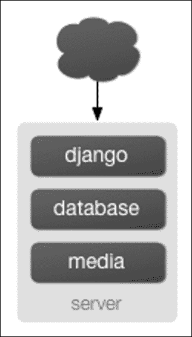
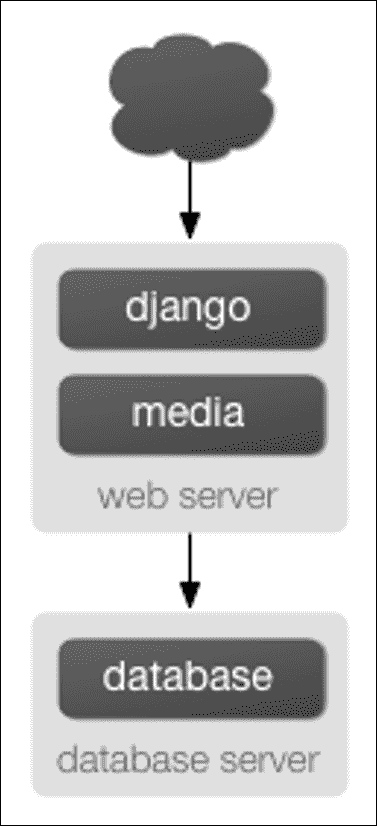
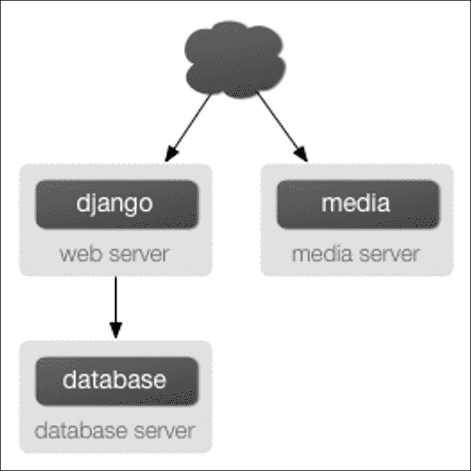
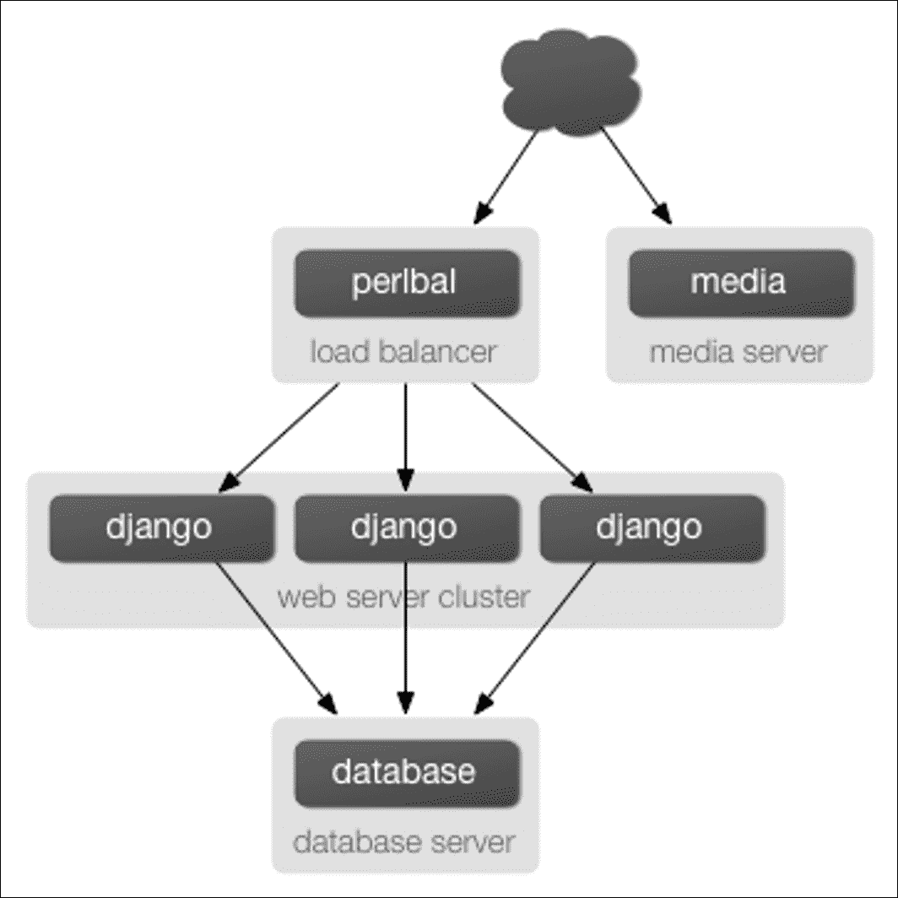
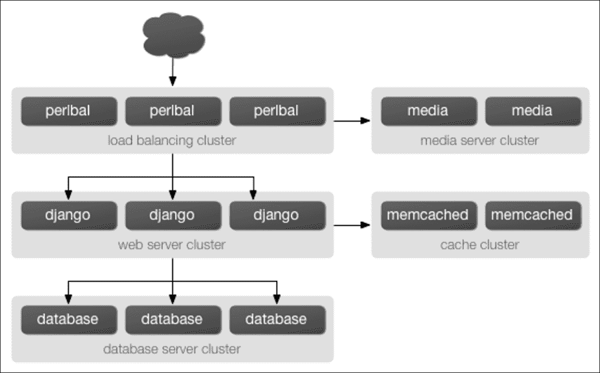

# 第十三章：部署 Django

本章涵盖了构建 Django 应用程序的最后一个基本步骤：将其部署到生产服务器。

如果您一直在跟着我们的示例，您可能一直在使用 `runserver`，这使得事情变得非常容易-使用 `runserver`，您不必担心 web 服务器的设置。但是 `runserver` 仅适用于在本地机器上进行开发，而不适用于在公共网络上暴露。

要部署您的 Django 应用程序，您需要将其连接到像 Apache 这样的工业级 Web 服务器。在本章中，我们将向您展示如何做到这一点-但首先，我们将为您提供一个在您上线之前在您的代码库中要做的事情的清单。

# 为生产准备您的代码库

## 部署清单

互联网是一个敌对的环境。在部署 Django 项目之前，您应该花些时间审查您的设置，考虑安全性、性能和操作。

Django 包含许多安全功能。有些是内置的并且始终启用。其他是可选的，因为它们并不总是合适的，或者因为它们对开发来说不方便。例如，强制使用 HTTPS 可能不适用于所有网站，并且对于本地开发来说是不切实际的。

性能优化是另一类便利性的权衡。例如，在生产中缓存很有用，但在本地开发中不那么有用。错误报告的需求也是非常不同的。以下清单包括以下设置：

+   必须正确设置才能让 Django 提供预期的安全级别，

+   在每个环境中都有所不同，

+   启用可选的安全功能，

+   启用性能优化；和，

+   提供错误报告。

许多这些设置是敏感的，应该被视为机密。如果您发布项目的源代码，一个常见的做法是发布适合开发的设置，并为生产使用私有设置模块。可以使用所描述的检查来自动化以下检查

`-deploy` 选项的 `check` 命令。务必根据选项的文档描述运行它针对您的生产设置文件。

# 关键设置

## SECRET_KEY

**秘钥必须是一个大的随机值，并且必须保密。**

确保在生产中使用的密钥没有在其他任何地方使用，并且避免将其提交到源代码控制。这减少了攻击者可能获取密钥的向量数量。考虑从环境变量中加载秘密密钥，而不是在设置模块中将秘密密钥硬编码：

```py
import os
SECRET_KEY = os.environ['SECRET_KEY']
```

或者从一个文件：

```py
with open('/etc/secret_key.txt') as f:
SECRET_KEY = f.read().strip()
```

## 调试

**您绝对不能在生产中启用调试。**

当我们在第一章 *Django 简介* *和入门*中创建项目时，`django-admin startproject` 命令创建了一个带有 `DEBUG` 设置为 `True` 的 `settings.py` 文件。Django 的许多内部部分都会检查此设置，并在 `DEBUG` 模式开启时改变它们的行为。

例如，如果 `DEBUG` 设置为 `True`，那么：

+   所有数据库查询将被保存在内存中作为对象 `django.db.connection.queries`。你可以想象，这会消耗内存！

+   任何 404 错误都将由 Django 的特殊 404 错误页面（在第三章中介绍，*模板*）呈现，而不是返回正确的 404 响应。这个页面包含潜在的敏感信息，不应该暴露在公共互联网上。

+   您的 Django 应用程序中的任何未捕获异常-从基本的 Python 语法错误到数据库错误和模板语法错误-都将由您可能已经了解和喜爱的 Django 漂亮错误页面呈现。这个页面包含的敏感信息甚至比 404 页面还要多，绝不能暴露给公众。

简而言之，将`DEBUG`设置为`True`告诉 Django 假设只有可信任的开发人员在使用您的网站。互联网上充满了不可信任的流氓，当您准备部署应用程序时，第一件事就是将`DEBUG`设置为`False`。

# 特定于环境的设置

## ALLOWED_HOSTS

当`DEBUG = False`时，Django 在没有适当的`ALLOWED_HOSTS`值的情况下根本无法工作。这个设置是必需的，以保护您的网站免受一些 CSRF 攻击。如果您使用通配符，您必须执行自己的`Host` HTTP 头的验证，或者确保您不容易受到这类攻击的影响。

## 缓存

如果您使用缓存，连接参数在开发和生产中可能不同。缓存服务器通常具有弱身份验证。确保它们只接受来自应用服务器的连接。如果您使用**Memcached**，考虑使用缓存会话以提高性能。

## 数据库

开发和生产中的数据库连接参数可能不同。数据库密码非常敏感。您应该像保护`SECRET_KEY`一样保护它们。为了最大的安全性，请确保数据库服务器只接受来自应用服务器的连接。如果您还没有为数据库设置备份，请立即进行设置！

## EMAIL_BACKEND 和相关设置

如果您的网站发送电子邮件，这些值需要正确设置。

## STATIC_ROOT 和 STATIC_URL

静态文件由开发服务器自动提供。在生产中，您必须定义一个`STATIC_ROOT`目录，`collectstatic`将在其中复制它们。

## MEDIA_ROOT 和 MEDIA_URL

媒体文件是由您的用户上传的。它们是不受信任的！确保您的 Web 服务器永远不会尝试解释它们。例如，如果用户上传了一个`.php`文件，Web 服务器不应该执行它。现在是检查这些文件的备份策略的好时机。

# HTTPS

任何允许用户登录的网站都应强制执行全站 HTTPS，以避免在明文中传输访问令牌。在 Django 中，访问令牌包括登录/密码、会话 cookie 和密码重置令牌。（如果通过电子邮件发送它们，你无法保护密码重置令牌。）

保护敏感区域，如用户帐户或管理员是不够的，因为相同的会话 cookie 用于 HTTP 和 HTTPS。您的 Web 服务器必须将所有 HTTP 流量重定向到 HTTPS，并且只将 HTTPS 请求传输到 Django。设置 HTTPS 后，启用以下设置。

## CSRF_COOKIE_SECURE

将其设置为`True`，以避免意外通过 HTTP 传输 CSRF cookie。

## SESSION_COOKIE_SECURE

将其设置为`True`，以避免意外通过 HTTP 传输会话 cookie。

# 性能优化

将`DEBUG = False`设置为禁用一些仅在开发中有用的功能。此外，您可以调整以下设置。

## CONN_MAX_AGE

启用持久数据库连接可以在连接到数据库占请求处理时间的重要部分时获得良好的加速。这在网络性能有限的虚拟化主机上非常有帮助。

## 模板

启用缓存模板加载器通常会大大提高性能，因为它避免了每次需要呈现模板时都要编译模板。有关更多信息，请参阅模板加载器文档。

# 错误报告

当您将代码推送到生产环境时，希望它是健壮的，但您不能排除意外错误。幸运的是，Django 可以捕获错误并相应地通知您。

## 日志记录

在将网站投入生产之前，请检查您的日志配置，并在收到一些流量后立即检查它是否按预期工作。

## ADMINS 和 MANAGERS

`ADMINS`将通过电子邮件收到 500 错误的通知。`MANAGERS`将收到 404 错误的通知。`IGNORABLE_404_URLS`可以帮助过滤掉虚假报告。

通过电子邮件进行错误报告并不是很有效。在您的收件箱被报告淹没之前，考虑使用 Sentry 等错误监控系统（有关更多信息，请访问 [`sentry.readthedocs.org/en/latest/`](http://sentry.readthedocs.org/en/latest/)）。Sentry 还可以聚合日志。

## 自定义默认错误视图

Django 包括了几个 HTTP 错误代码的默认视图和模板。您可能希望通过在根模板目录中创建以下模板来覆盖默认模板：`404.html`、`500.html`、`403.html` 和 `400.html`。默认视图应该适用于 99% 的 Web 应用程序，但如果您希望自定义它们，请参阅这些指令（[`docs.djangoproject.com/en/1.8/topics/http/views/#customizing-error-views`](https://docs.djangoproject.com/en/1.8/topics/http/views/#customizing-error-views)），其中还包含有关默认模板的详细信息：

+   `http_not_found_view`

+   `http_internal_server_error_view`

+   `http_forbidden_view`

+   `http_bad_request_view`

# 使用虚拟环境

如果您在虚拟环境中安装了项目的 Python 依赖项（有关更多信息，请访问 [`www.virtualenv.org/`](http://www.virtualenv.org/)），您还需要将此虚拟环境的 `site-packages` 目录的路径添加到您的 Python 路径中。为此，添加一个额外的路径到您的 `WSGIPythonPath` 指令，如果使用类 UNIX 系统，则使用冒号（`:`）分隔多个路径，如果使用 Windows，则使用分号（`;`）分隔。如果目录路径的任何部分包含空格字符，则必须引用完整的参数字符串：

```py
WSGIPythonPath /path/to/mysite.com:/path/to/your/venv/lib/python3.X/site-packages 

```

确保您提供正确的虚拟环境路径，并用正确的 Python 版本（例如 `python3.4`）替换 `python3.X`。

# 在生产中使用不同的设置

到目前为止，在本书中，我们只处理了一个设置文件：由 `django-admin startproject` 生成的 `settings.py`。但是当您准备部署时，您可能会发现自己需要多个设置文件，以保持开发环境与生产环境隔离。（例如，您可能不希望在本地机器上测试代码更改时将 `DEBUG` 从 `False` 更改为 `True`。）Django 通过允许您使用多个设置文件来使这一切变得非常容易。如果您希望将设置文件组织成生产和开发设置，您可以通过以下三种方式之一来实现：

+   设置两个完全独立的设置文件。

+   设置一个基本设置文件（比如开发），以及一个第二个（比如生产）设置文件，它只是从第一个文件中导入，并定义任何需要定义的覆盖。

+   只使用一个具有 Python 逻辑的设置文件来根据上下文更改设置。

我们将逐个来看这些。首先，最基本的方法是定义两个单独的设置文件。如果您在跟着做，您已经有了 `settings.py`。现在，只需复制它，命名为 `settings_production.py`。（我们随便取的名字；您可以随意命名。）在这个新文件中，更改 `DEBUG` 等。第二种方法类似，但减少了冗余。不是拥有两个内容大部分相似的设置文件，您可以将一个作为基本文件，并创建另一个文件从中导入。例如：

```py
# settings.py 

DEBUG = True 
TEMPLATE_DEBUG = DEBUG 

DATABASE_ENGINE = 'postgresql_psycopg2' 
DATABASE_NAME = 'devdb' 
DATABASE_USER = '' 
DATABASE_PASSWORD = '' 
DATABASE_PORT = '' 

# ... 

# settings_production.py 

from settings import * 

DEBUG = TEMPLATE_DEBUG = False 
DATABASE_NAME = 'production' 
DATABASE_USER = 'app' 
DATABASE_PASSWORD = 'letmein' 

```

在这里，`settings_production.py` 从 `settings.py` 导入所有内容，并重新定义了特定于生产的设置。在这种情况下，`DEBUG` 设置为 `False`，但我们还为生产设置了不同的数据库访问参数。（后者表明您可以重新定义任何设置，而不仅仅是基本的设置，比如 `DEBUG`。）最后，实现两个设置环境最简洁的方法是使用一个设置文件，根据环境进行分支。其中一种方法是检查当前的主机名。例如：

```py
# settings.py 

import socket 

if socket.gethostname() == 'my-laptop': 
    DEBUG = TEMPLATE_DEBUG = True 
else: 
    DEBUG = TEMPLATE_DEBUG = False 

# ... 

```

在这里，我们从 Python 的标准库中导入`socket`模块，并使用它来检查当前系统的主机名。我们可以检查主机名来确定代码是否在生产服务器上运行。这里的一个核心教训是，设置文件只是*Python 代码*。它们可以从其他文件导入，可以执行任意逻辑，等等。只要确保，如果您选择这条路，设置文件中的 Python 代码是无懈可击的。如果它引发任何异常，Django 可能会严重崩溃。

随意将您的`settings.py`重命名为`settings_dev.py`或`settings/dev.py`或`foobar.py`-Django 不在乎，只要告诉它您正在使用哪个设置文件即可。

但是，如果您重命名了`django-admin startproject`生成的`settings.py`文件，您会发现`manage.py`会给出一个错误消息，说它找不到设置。这是因为它尝试导入一个名为`settings`的模块。您可以通过编辑`manage.py`将`settings`更改为您的模块的名称来解决此问题，或者使用`django-admin`而不是`manage.py`。在后一种情况下，您需要将`DJANGO_SETTINGS_MODULE`环境变量设置为您的设置文件的 Python 路径（例如，`'mysite.settings'`）。

# 将 Django 部署到生产服务器

### 注意

无需头痛的部署

如果您真的想要部署一个实时网站，真的只有一个明智的选择-找到一个明确支持 Django 的主机。

不仅会得到一个独立的媒体服务器（通常是 Nginx），而且他们还会照顾一些小事情，比如正确设置 Apache 并设置一个定期重启 Python 进程的 cron 作业（以防止您的网站挂起）。对于更好的主机，您还可能会得到某种形式的一键部署。

省点心，花几块钱每月找一个懂 Django 的主机。

# 使用 Apache 和 mod_wsgi 部署 Django

使用 Apache（[`httpd.apache.org/`](http://httpd.apache.org/)）和`mod_wsgi`（[`code.google.com/p/modwsgi`](http://code.google.com/p/modwsgi)）部署 Django 是一个经过验证的将 Django 投入生产的方法。`mod_wsgi`是一个可以托管任何 Python WSGI 应用程序（包括 Django）的 Apache 模块。Django 将与支持`mod_wsgi`的任何版本的 Apache 一起工作。官方的`mod_wsgi`文档非常棒；这是您获取有关如何使用`mod_wsgi`的所有细节的来源。您可能希望从安装和配置文档开始。

## 基本配置

一旦安装并激活了`mod_wsgi`，编辑 Apache 服务器的`httpd.conf`文件并添加以下内容。请注意，如果您使用的是早于 2.4 版本的 Apache，将`Require all granted`替换为`Allow from all`，并在其前面添加`Order deny,allow`行。

```py
WSGIScriptAlias / /path/to/mysite.com/mysite/wsgi.py 
WSGIPythonPath /path/to/mysite.com 

<Directory /path/to/mysite.com/mysite> 
<Files wsgi.py> 
Require all granted 
</Files> 
</Directory> 

```

`WSGIScriptAlias`行中的第一部分是您希望在其上提供应用程序的基本 URL 路径（`/`表示根 URL），第二部分是系统上 WSGI 文件的位置，通常在您的项目包内（例如此示例中的`mysite`）。这告诉 Apache 使用在该文件中定义的 WSGI 应用程序来提供任何遵循给定 URL 的请求。

`WSGIPythonPath`行确保您的项目包可以在 Python 路径上导入；换句话说，`import mysite`有效。`<Directory>`部分只是确保 Apache 可以访问您的`wsgi.py`文件。

接下来，我们需要确保存在带有 WSGI 应用程序对象的`wsgi.py`。从 Django 版本 1.4 开始，`startproject`会为您创建一个；否则，您需要自己创建。

查看 WSGI 概述，了解您应该在此文件中放置的默认内容，以及您可以添加的其他内容。

### 注意

如果在单个`mod_wsgi`进程中运行多个 Django 站点，则所有这些站点都将使用首先运行的站点的设置。这可以通过更改`wsgi.py`中的`os.environ.setdefault("DJANGO_SETTINGS_MODULE", "{{ project_name }}.settings")`来解决，例如：`os.environ["DJANGO_SETTINGS_MODULE"] = "{{ project_name }}.settings"`或者使用`mod_wsgi`守护程序模式，并确保每个站点在其自己的守护进程中运行。

## 使用 mod_wsgi 守护程序模式

守护程序模式是在非 Windows 平台上运行`mod_wsgi`的推荐模式。要创建所需的守护进程组并委托 Django 实例在其中运行，您需要添加适当的`WSGIDaemonProcess`和`WSGIProcessGroup`指令。

如果使用守护程序模式，则对上述配置需要进一步更改，即不能使用`WSGIPythonPath`；相反，您应该使用`WSGIDaemonProcess`的`python-path`选项，例如：

```py
WSGIDaemonProcess example.com python-path=/path/to/mysite.com:/path/to/venv/lib/python2.7/site-packages 
WSGIProcessGroup example.com 

```

有关设置守护程序模式的详细信息，请参阅官方`mod_wsgi`文档。

## 提供文件

Django 本身不提供文件服务；它将这项工作留给您选择的任何 Web 服务器。我们建议使用单独的 Web 服务器（即不运行 Django 的服务器）来提供媒体。以下是一些不错的选择：

+   Nginx（有关更多信息，请访问[`code.google.com/p/modwsgi`](http://code.google.com/p/modwsgi)）

+   Apache 的精简版本

然而，如果您别无选择，只能在与 Django 相同的 Apache `VirtualHost`上提供媒体文件，您可以设置 Apache 以将某些 URL 作为静态媒体提供，然后使用`mod_wsgi`接口将其他 URL 用于 Django。

此示例在站点根目录设置 Django，但显式提供`robots.txt`，`favicon.ico`，任何 CSS 文件以及`/static/`和`/media/` URL 空间中的任何内容作为静态文件。所有其他 URL 将使用`mod_wsgi`进行提供：

```py
Alias /robots.txt /path/to/mysite.com/static/robots.txt 
Alias /favicon.ico /path/to/mysite.com/static/favicon.ico 

Alias /media/ /path/to/mysite.com/media/ 
Alias /static/ /path/to/mysite.com/static/ 

<Directory /path/to/mysite.com/static> 
Require all granted 
</Directory> 

<Directory /path/to/mysite.com/media> 
Require all granted 
</Directory> 

WSGIScriptAlias / /path/to/mysite.com/mysite/wsgi.py 

<Directory /path/to/mysite.com/mysite> 
<Files wsgi.py> 
Require all granted 
</Files> 
</Directory> 

```

如果您使用的是早于 2.4 的 Apache 版本，请用`Allow from all`替换`Require all granted`，并在其前面添加`Order deny,allow`行。

## 提供管理文件

当`django.contrib.staticfiles`在`INSTALLED_APPS`中时，Django 开发服务器会自动提供管理应用程序（以及任何其他已安装的应用程序）的静态文件。但是，当您使用其他服务器安排时，情况并非如此。您需要负责设置 Apache 或您正在使用的任何其他 Web 服务器以提供管理文件。

管理文件位于 Django 分发的(`django/contrib/admin/static/admin`)中。我们建议使用`django.contrib.staticfiles`来处理管理文件（以及在前一节中概述的 Web 服务器一起使用；这意味着使用`collectstatic`管理命令在`STATIC_ROOT`中收集静态文件，然后配置您的 Web 服务器以在`STATIC_URL`处提供`STATIC_ROOT`），但这里有其他三种方法：

1.  从您的文档根目录创建到管理静态文件的符号链接（这可能需要在 Apache 配置中使用`+FollowSymLinks`）。

1.  使用`Alias`指令，如前一段所示，将适当的 URL（可能是`STATIC_URL` + `admin/`）别名为管理文件的实际位置。

1.  复制管理静态文件，使其位于 Apache 文档根目录中。

## 如果遇到 UnicodeEncodeError

如果您正在利用 Django 的国际化功能，并且打算允许用户上传文件，您必须确保用于启动 Apache 的环境已配置为接受非 ASCII 文件名。如果您的环境配置不正确，当调用`os.path`中包含非 ASCII 字符的文件名时，将触发`UnicodeEncodeError`异常。

为了避免这些问题，用于启动 Apache 的环境应包含类似以下设置的环境：

```py
export LANG='en_US.UTF-8' 
export LC_ALL='en_US.UTF-8' 

```

请查阅操作系统的文档，了解适当的语法和放置这些配置项的位置；在 Unix 平台上，`/etc/apache2/envvars`是一个常见的位置。添加了这些语句到您的环境后，重新启动 Apache。

# 在生产环境中提供静态文件

将静态文件放入生产环境的基本概述很简单：当静态文件更改时运行`collectstatic`命令，然后安排将收集的静态文件目录（`STATIC_ROOT`）移动到静态文件服务器并提供服务。

根据`STATICFILES_STORAGE`，文件可能需要手动移动到新位置，或者`Storage`类的`post_process`方法可能会处理这个问题。

当然，与所有部署任务一样，魔鬼在细节中。每个生产设置都会有所不同，因此您需要根据自己的需求调整基本概述。

以下是一些可能有所帮助的常见模式。

## 从同一服务器提供站点和静态文件

如果您希望从已经提供站点的同一服务器提供静态文件，则该过程可能看起来像这样：

+   将您的代码推送到部署服务器。

+   在服务器上，运行`collectstatic`将所有静态文件复制到`STATIC_ROOT`中。

+   配置您的 Web 服务器，以便在`STATIC_ROOT`下的 URL`STATIC_URL`中提供文件。

您可能希望自动化这个过程，特别是如果您有多个 Web 服务器。有许多种方法可以进行这种自动化，但许多 Django 开发人员喜欢的一个选择是 Fabric（[`fabfile.org/`](http://fabfile.org/)）。

接下来，在接下来的几节中，我们将展示一些示例**fabfiles**（即 Fabric 脚本），这些脚本可以自动化这些文件部署选项。fabfile 的语法相当简单，但这里不会涉及到; 请参阅 Fabric 的文档，了解语法的完整解释。因此，一个用于将静态文件部署到一对 Web 服务器的 fabfile 可能看起来像这样：

```py
from fabric.api import * 

# Hosts to deploy onto 
env.hosts = ['www1.example.com', 'www2.example.com'] 

# Where your project code lives on the server 
env.project_root = '/home/www/myproject' 

def deploy_static(): 
    with cd(env.project_root): 
        run('./manage.py collectstatic -v0 -noinput') 

```

## 从专用服务器提供静态文件

大多数较大的 Django 站点使用单独的 Web 服务器-即不运行 Django 的服务器-用于提供静态文件。这个服务器通常运行不同类型的 Web 服务器-速度更快但功能不那么全面。一些常见的选择是：

+   Nginx

+   Apache 的简化版本

配置这些服务器不在本文档的范围之内; 请查看每个服务器的相应文档以获取说明。由于您的静态文件服务器不会运行 Django，因此您需要修改部署策略，看起来像这样：

1.  当您的静态文件更改时，在本地运行`collectstatic`。

1.  将本地的`STATIC_ROOT`推送到静态文件服务器中正在提供服务的目录。`rsync`（[`rsync.samba.org/`](https://rsync.samba.org/)）是这一步的常见选择，因为它只需要传输已更改的静态文件位。

以下是 fabfile 中的示例：

```py
from fabric.api import * 
from fabric.contrib import project 

# Where the static files get collected locally. Your STATIC_ROOT setting. 
env.local_static_root = '/tmp/static' 

# Where the static files should go remotely 
env.remote_static_root = '/home/www/static.example.com' 

@roles('static') 
def deploy_static(): 
    local('./manage.py collectstatic') 
    project.rsync_project( 
        remote_dir = env.remote_static_root, 
        local_dir = env.local_static_root, 
        delete = True 
    ) 

```

## 从云服务或 CDN 提供静态文件

另一种常见的策略是从云存储提供商（如 Amazon 的 S3）和/或 CDN（内容传送网络）提供静态文件。这样可以忽略提供静态文件的问题，并且通常可以使网页加载更快（特别是在使用 CDN 时）。

在使用这些服务时，基本工作流程看起来可能与前面的段落有些不同，只是不是使用`rsync`将静态文件传输到服务器，而是需要将静态文件传输到存储提供商或 CDN。您可能有许多种方法可以做到这一点，但如果提供商有 API，自定义文件存储后端将使这个过程变得非常简单。

如果您已经编写或正在使用第三方自定义存储后端，可以通过将`STATICFILES_STORAGE`设置为存储引擎来告诉`collectstatic`使用它。例如，如果您在`myproject.storage.S3Storage`中编写了一个 S3 存储后端，您可以使用它：

```py
STATICFILES_STORAGE = 'myproject.storage.S3Storage'
```

完成后，您只需运行`collectstatic`，您的静态文件将通过存储包推送到 S3。如果以后需要切换到不同的存储提供程序，只需更改`STATICFILES_STORAGE`设置即可。有第三方应用程序可提供许多常见文件存储 API 的存储后端。一个很好的起点是`djangopackages.com`上的概述。

# 扩展

现在您知道如何在单个服务器上运行 Django，让我们看看如何扩展 Django 安装。本节将介绍网站如何从单个服务器扩展到一个可以每小时服务数百万次点击的大规模集群。然而，需要注意的是，几乎每个大型网站在不同方面都很大，因此扩展绝非一刀切的操作。

以下覆盖应该足以展示一般原则，并且在可能的情况下，我们将尝试指出可以做出不同选择的地方。首先，我们将做出一个相当大的假设，并且专门讨论 Apache 和`mod_python`下的扩展。虽然我们知道有许多成功的中到大型规模的 FastCGI 部署，但我们对 Apache 更为熟悉。

## 在单个服务器上运行

大多数网站最初在单个服务器上运行，其架构看起来有点像*图 13.1*。然而，随着流量的增加，您很快会发现不同软件之间存在*资源争用*的问题。

数据库服务器和 Web 服务器喜欢拥有整个服务器，因此当它们在同一台服务器上运行时，它们经常会争夺它们更愿意垄断的相同资源（RAM 和 CPU）。将数据库服务器移至第二台机器很容易解决这个问题。



图 13.1：单服务器 Django 设置。

## 分离数据库服务器

就 Django 而言，分离数据库服务器的过程非常简单：您只需要将`DATABASE_HOST`设置更改为数据库服务器的 IP 或 DNS 名称。如果可能的话，最好使用 IP，因为不建议依赖 DNS 来连接您的 Web 服务器和数据库服务器。有了单独的数据库服务器，我们的架构现在看起来像*图 13.2*。

在这里，我们开始进入通常称为**n 层**架构的领域。不要被这个流行词吓到-它只是指 Web 堆栈的不同层被分离到不同的物理机器上。

在这一点上，如果您预计将来需要超出单个数据库服务器，最好开始考虑连接池和/或数据库复制。不幸的是，在本书中没有足够的空间来充分讨论这些主题，因此您需要咨询数据库的文档和/或社区以获取更多信息。



图 13.2：将数据库移至专用服务器。

## 运行单独的媒体服务器

我们仍然有一个大问题留在单服务器设置中：从处理动态内容的同一台机器上提供媒体。这两个活动在不同情况下表现最佳，将它们合并在同一台机器上会导致它们都表现不佳。

因此，下一步是将媒体-即任何不是由 Django 视图生成的东西-分离到专用服务器上（见*图 13.3*）。

理想情况下，这个媒体服务器应该运行一个针对静态媒体传递进行优化的精简 Web 服务器。Nginx 是首选选项，尽管**lighttpd**是另一个选项，或者一个经过大幅简化的 Apache 也可以工作。对于静态内容丰富的网站（照片、视频等），将其移至单独的媒体服务器至关重要，很可能是扩展的第一步。

然而，这一步可能有点棘手。如果您的应用涉及文件上传，Django 需要能够将上传的媒体写入媒体服务器。如果媒体存储在另一台服务器上，您需要安排一种方式让该写入通过网络进行。



图 13.3：分离媒体服务器。

## 实现负载平衡和冗余

在这一点上，我们已经尽可能地将事情分解了。这种三台服务器的设置应该可以处理非常大量的流量-我们从这种结构中每天提供了大约 1000 万次点击-因此，如果您进一步增长，您将需要开始添加冗余。

实际上，这是一件好事。仅看一眼*图 13.3*就会告诉你，即使你的三台服务器中的一台失败，你也会使整个站点崩溃。因此，随着添加冗余服务器，不仅可以增加容量，还可以增加可靠性。为了这个例子，让我们假设 Web 服务器首先达到容量。

在不同的硬件上运行多个 Django 站点的副本相对容易-只需将所有代码复制到多台机器上，并在所有机器上启动 Apache。然而，您需要另一种软件来在多台服务器上分发流量：*负载均衡器*。

您可以购买昂贵的专有硬件负载均衡器，但也有一些高质量的开源软件负载均衡器。Apache 的`mod_proxy`是一个选择，但我们发现 Perlbal（[`www.djangoproject.com/r/perlbal/`](http://www.djangoproject.com/r/perlbal/)）非常棒。它是一个由编写`memcached`的同一批人编写的负载均衡器和反向代理（参见第十六章，“Django 的缓存框架”）。

现在，随着 Web 服务器的集群化，我们不断发展的架构开始变得更加复杂，如*图 13.4*所示。



图 13.4：一个负载平衡、冗余的服务器设置。

请注意，在图中，Web 服务器被称为集群，表示服务器的数量基本上是可变的。一旦您在前面放置了负载均衡器，您就可以轻松地添加和删除后端 Web 服务器，而不会有一秒钟的停机时间。

## 扩大规模

在这一点上，接下来的几个步骤基本上是上一个步骤的衍生：

+   当您需要更多的数据库性能时，您可能希望添加复制的数据库服务器。MySQL 包含内置的复制功能；PostgreSQL 用户应该研究 Slony（[`www.djangoproject.com/r/slony/`](http://www.djangoproject.com/r/slony/)）和 pgpool（[`www.djangoproject.com/r/pgpool/`](http://www.djangoproject.com/r/pgpool/)）用于复制和连接池。

+   如果单个负载均衡器不够，您可以在前面添加更多负载均衡器机器，并使用轮询 DNS 进行分发。

+   如果单个媒体服务器不够，您可以添加更多媒体服务器，并使用负载平衡集群分发负载。

+   如果您需要更多的缓存存储，您可以添加专用的缓存服务器。

+   在任何阶段，如果集群性能不佳，您可以向集群添加更多服务器。

经过几次迭代后，一个大规模的架构可能看起来像*图 13.5*。



图 13.5：一个大规模 Django 设置的示例。

尽管我们在每个级别只显示了两到三台服务器，但你可以添加的服务器数量并没有根本限制。

# 性能调优

如果你有大量的资金，你可以不断地投入硬件来解决扩展问题。然而，对于我们其他人来说，性能调优是必不可少的。

### 注意

顺便说一句，如果有人拥有大量资金正在阅读这本书，请考虑向 Django 基金会进行大额捐赠。他们也接受未加工的钻石和金锭。

不幸的是，性能调优更多地是一门艺术而不是一门科学，而且比扩展更难写。如果你真的想部署一个大规模的 Django 应用程序，你应该花大量时间学习如何调优你的每个部分。

接下来的章节介绍了多年来我们发现的一些 Django 特定的调优技巧。

## 没有太多的 RAM 这种事

即使是非常昂贵的 RAM 在今天也相对实惠。尽可能多地购买 RAM，然后再多买一点。更快的处理器不会显著提高性能；大多数 Web 服务器花费高达 90%的时间在等待磁盘 I/O。一旦开始交换，性能就会急剧下降。更快的磁盘可能会稍微有所帮助，但它们比 RAM 要贵得多，以至于并不重要。

如果你有多台服务器，将 RAM 放在数据库服务器是首选。如果你有能力，获得足够的 RAM 来容纳整个数据库到内存中。这并不难；我们开发了一个拥有超过 50 万篇报纸文章的网站，只需要不到 2GB 的空间。

接下来，充分利用 Web 服务器上的 RAM。理想情况是服务器从不交换。如果你达到了这一点，你应该能够承受大部分正常的流量。

## 关闭保持活动状态

保持活动状态是 HTTP 的一个特性，允许多个 HTTP 请求通过单个 TCP 连接提供，避免了 TCP 建立/拆除的开销。乍一看，这看起来不错，但它可能会影响 Django 网站的性能。如果你从一个单独的服务器正确地提供媒体，每个浏览你网站的用户大约每十秒钟只会从你的 Django 服务器请求一个页面。这会让 HTTP 服务器等待下一个保持活动状态的请求，而空闲的 HTTP 服务器只会消耗应该被活跃服务器使用的内存。

## 使用 Memcached

尽管 Django 支持许多不同的缓存后端，但没有一个能够像 Memcached 一样快。如果你有一个高流量的网站，甚至不要考虑其他后端，直接使用 Memcached。

## 经常使用 Memcached

当然，如果你实际上不使用 Memcached，选择 Memcached 对你没有好处。第十六章，*Django 的缓存框架*，是你的好朋友：学习如何使用 Django 的缓存框架，并在可能的地方使用它。积极的、预防性的缓存通常是唯一能够在大流量下保持网站稳定的方法。

## 加入讨论

Django 的每个部分-从 Linux 到 Apache 再到 PostgreSQL 或 MySQL-都有一个强大的社区支持。如果你真的想从你的服务器中获得最后 1%，加入你软件背后的开源社区并寻求帮助。大多数自由软件社区成员都会乐意帮助。还要确保加入 Django 社区-一个活跃、不断增长的 Django 开发者群体。我们的社区有大量的集体经验可以提供。

# 接下来是什么？

剩下的章节关注其他 Django 功能，这取决于你的应用是否需要。随意按照你选择的任何顺序阅读它们。
