# 附录 G. 使用 Visual Studio 开发 Django

不管您在互联网上听到了什么，微软 Visual Studio（VS）一直是一个非常强大和功能齐全的集成开发环境（IDE）。作为多平台开发人员，我尝试过几乎所有其他的东西，最终都回到了 VS。

过去，更广泛使用 VS 的最大障碍是（在我看来）：

+   缺乏对微软生态系统之外的语言（C++、C#和 VB）的良好支持

+   完整功能的 IDE 成本。以前的微软“免费”IDE 版本在专业开发方面有些不够用。

几年前发布了 Visual Studio 社区版，最近发布了 Python Tools for Visual Studio（PTVS），这种情况已经发生了戏剧性的变化。因此，我现在在 VS 中进行所有开发工作-包括 Microsoft 技术和 Python 和 Django。

我不打算继续谈论 VS 的优点，以免开始听起来像是在为微软做广告，所以让我们假设您至少已经决定尝试一下 VS 和 PTVS。

首先，我将解释如何在 Windows 上安装 VS 和 PTVS，然后我将简要概述您可以使用的所有酷炫的 Django 和 Python 工具。

# 安装 Visual Studio

### 注意

**开始之前**

因为它仍然是微软，我们无法忽视 VS 是一个庞大的安装程序。

为了最大程度地减少麻烦的可能性，请：

1.  在安装过程中关闭您的防病毒软件

1.  确保您有良好的互联网连接。有线连接比无线连接更好

1.  暂停其他占用内存/磁盘空间的应用程序，如 OneDrive 和 Dropbox

1.  关闭所有不必要打开的应用程序

在您仔细注意了前面的警告之后，访问 Visual Studio 网站（[`www.visualstudio.com/`](https://www.visualstudio.com/)）并下载免费的 Visual Studio 社区版 2015（*图 G.1*）：

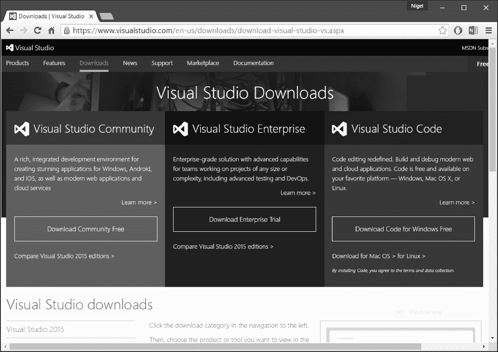

图 G.1：Visual Studio 下载

启动下载的安装程序文件，确保选择默认安装选项（*图 G.2*）并点击安装：

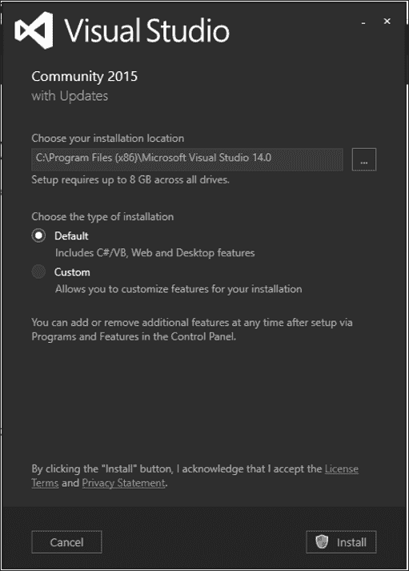

图 G.2：Visual Studio 的默认安装

现在是时候去冲杯咖啡了。或者七杯。记住，微软-这需要一些时间。根据您的互联网连接，这可能需要 15 分钟到一小时以上的时间。

在极少数情况下会失败。这总是（根据我的经验）要么是忘记关闭防病毒软件，要么是您的互联网连接短暂中断。幸运的是，VS 的恢复过程非常强大，我发现在失败后重新启动安装过程每次都有效。VS 甚至会记住它的进度，所以您不必从头开始。

## 安装 PTVS 和 Web Essentials

安装完 VS 后，是时候添加 Python Tools for Visual Studio（PTVS）和 Visual Studio Web Essentials 了。从顶部菜单中选择`工具 > 扩展和更新`（*图 G.3*）：

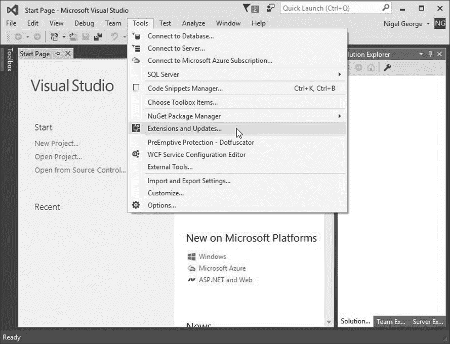

图 G.3：安装 Visual Studio 的扩展

一旦打开“扩展和更新”窗口，从左侧的下拉菜单中选择**在线**，进入 VS 在线应用程序库。在右上角的搜索框中输入`python`，PTVS 扩展应该出现在列表的顶部（*图 G.4*）：

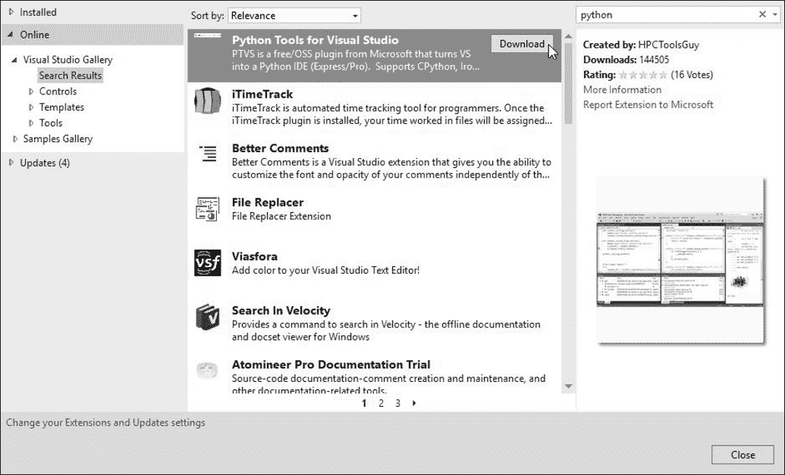

图 G.4：安装 PTVS 扩展

重复相同的过程安装 VS Web Essentials（*图 G.5*）。请注意，根据 VS 的版本和之前安装的扩展，Web Essentials 可能已经安装。如果是这种情况，**下载**按钮将被替换为绿色的勾号图标：

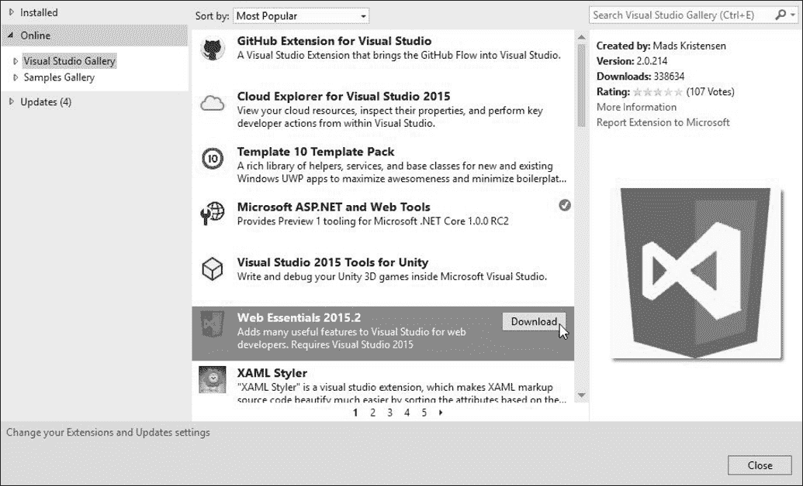

图 G.5：安装 Web Essentials 扩展

# 创建一个 Django 项目

在 VS 中进行 Django 开发的一大优势是，除了 VS 之外，您只需要安装 Python。因此，如果您按照第一章的说明安装了 Python，那么除了 VS 以外没有其他事情要做-VS 会处理虚拟环境，安装您需要的任何 Python 模块，甚至在 IDE 中内置了所有 Django 的管理命令。

为了演示这些功能，让我们从第一章的*介绍 Django 和入门*中创建我们的`mysite`项目，但这次我们将在 VS 内部完成所有操作。

## 开始一个 Django 项目

从顶部菜单中选择`文件 > 新建 > 项目`，然后从左侧的下拉菜单中选择一个 Python Web 项目。您应该看到类似*图 G.6*的东西。选择一个空白的 Django Web 项目，为您的项目命名，然后单击确定：

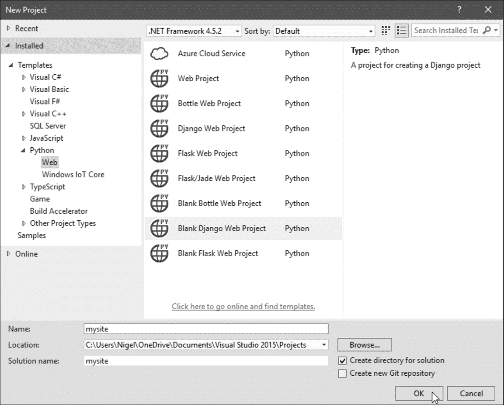

图 G.6：创建一个空白的 Django 项目

然后，Visual Studio 将显示一个弹出窗口，指出此项目需要外部包（*图 G.7*）。这里最简单的选项是直接安装到虚拟环境（选项 1），但这将安装最新版本的 Django，在撰写本文时是 1.9.7。由于本书是针对 1.8 LTS 版本的，我们希望选择选项 3**我将自己安装它们**，以便我们可以对`requirements.txt`文件进行必要的更改：

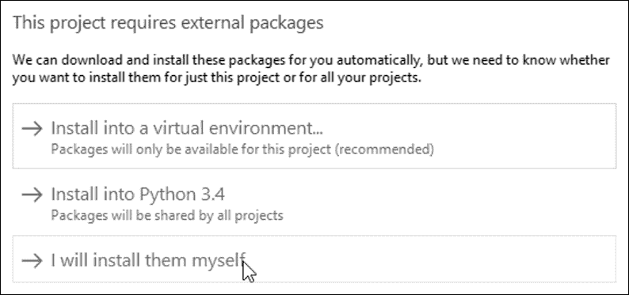

图 G.7：安装外部包

项目安装完成后，您会注意到在 VS 屏幕右侧的“解决方案资源管理器”中，已为您创建了完整的 Django 项目结构。下一步是添加一个运行 Django 1.8 的虚拟环境。在撰写本文时，最新版本是 1.8.13，因此我们必须编辑我们的`requirements.txt`文件，使第一行读取：

```py
django==1.8.13 

```

保存文件，然后在解决方案资源管理器中右键单击**Python 环境**，选择**添加虚拟环境...**（*图 G.8*）：

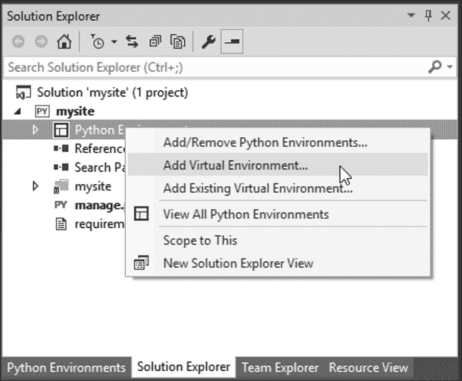

图 G.8：添加虚拟环境

在弹出窗口中，将默认环境名称从**env**更改为更有意义的名称（如果您正在从第一章的示例中继续进行，*Django 简介和入门*，请使用`env_mysite`）。单击**创建**，VS 将为您创建一个虚拟环境（*图 G.9*）：

### 注意

在使用 VS 时，您不必显式激活虚拟环境-您运行的任何代码都会自动在解决方案资源管理器中的活动虚拟环境中运行。

这对于像针对 Python 2.7 和 3.4 测试代码这样的情况非常有用-您只需右键单击并激活您想要运行的任何环境。

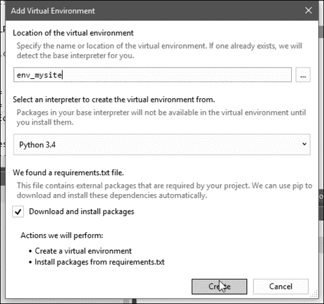

图 G.9：创建虚拟环境

# 在 Visual Studio 中进行 Django 开发

微软公司已经付出了很多努力，以确保在 VS 中开发 Python 应用程序尽可能简单和无忧。对于初学者来说，最重要的功能是对所有 Python 和 Django 模块的完整智能感知。这将加速您的学习，因为您不必查看模块实现的文档。

VS 真正简化的 Python/Django 编程的另一个重要方面是：

+   Django 管理命令的集成

+   轻松安装 Python 包

+   轻松安装新的 Django 应用程序

## Django 管理命令的集成

所有 Django 的常见管理命令都可以从项目菜单中找到（*图 G.10*）：

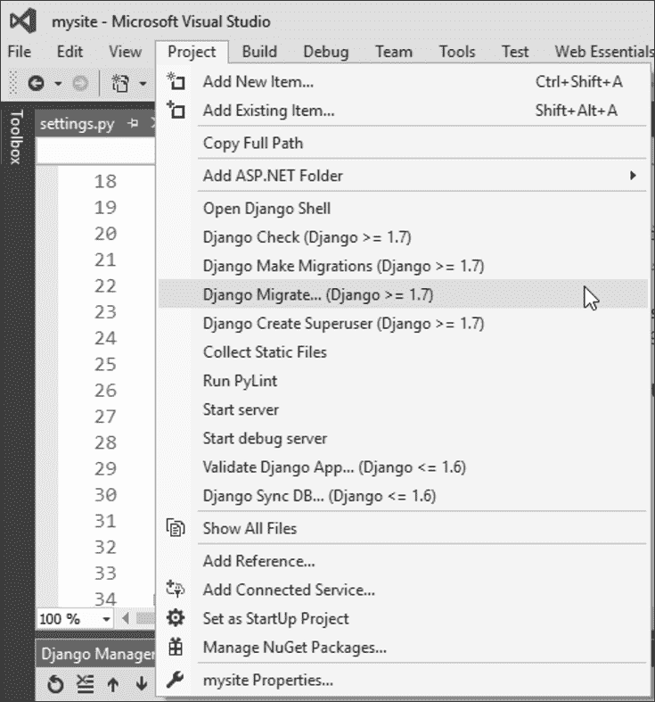

图 G.10：项目菜单上的常见 Django 命令

从此菜单中，您可以运行迁移，创建超级用户，打开 Django shell 并运行开发服务器。

## 轻松安装 Python 包

Python 包可以直接安装到任何虚拟环境中，只需在 Solution Explorer 中右键单击环境，然后选择**安装 Python 包...**（*图 G.11*）。

包可以使用`pip`或`easy_install`安装。

## 轻松安装新的 Django 应用程序

最后，向项目添加新的 Django 应用程序就像右键单击项目并选择`添加 > Django 应用程序...`一样简单（*图 G.12*）。给您的应用程序命名，然后单击**确定**，VS 将向您的项目添加一个新应用程序：

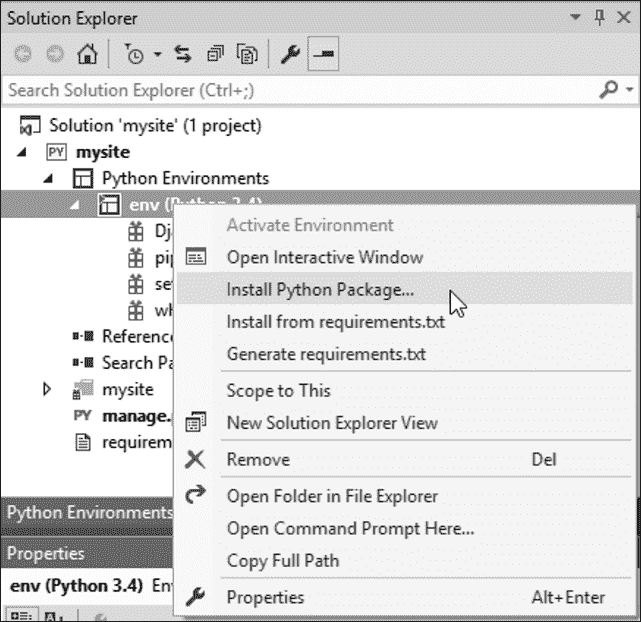

图 G.11：安装 Python 包

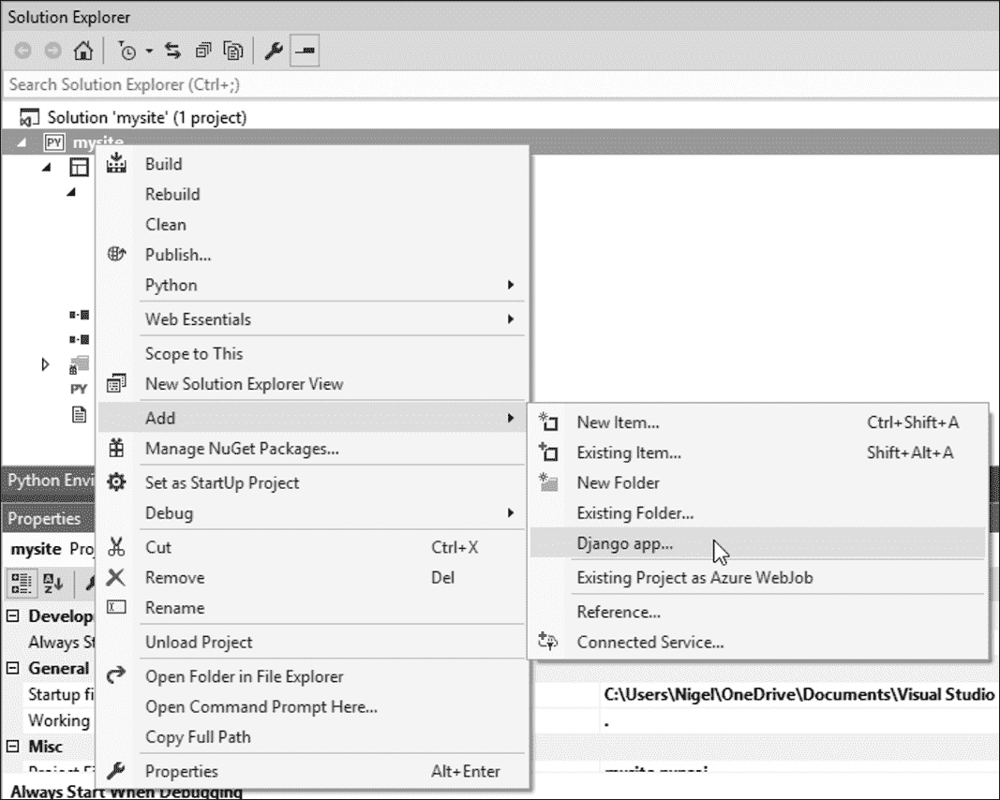

图 G.12：添加 Django 应用程序

这只是 Visual Studio 可以做的事情的简要概述；只是为了让您开始。值得探索的其他事物包括：

+   VS 的存储库管理包括与本地 Git 存储库和 GitHub 的完全集成。

+   使用免费的 MSDN 开发人员帐户部署到 Azure（仅在写作时支持 MySQL 和 SQLite）。

+   内置混合模式调试器。例如，在同一个调试器中调试 Django 和 JavaScript。

+   内置测试支持。

+   我提到了完整的 IntelliSense 支持吗？
