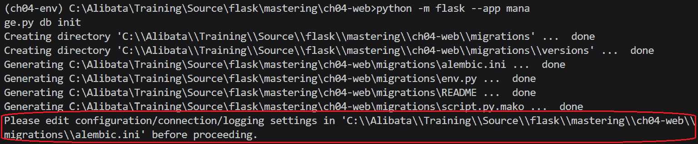
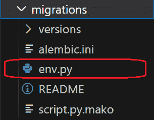
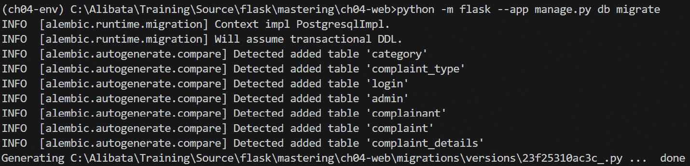
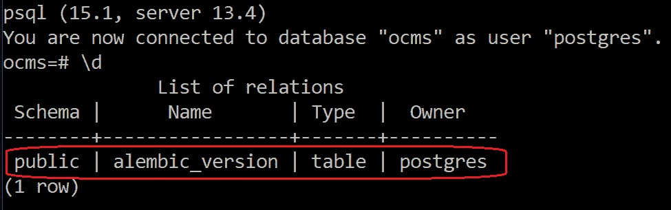
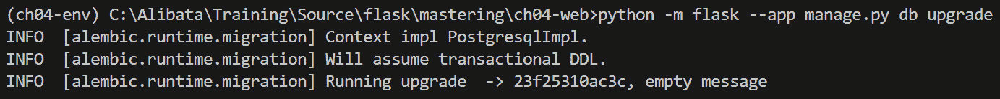
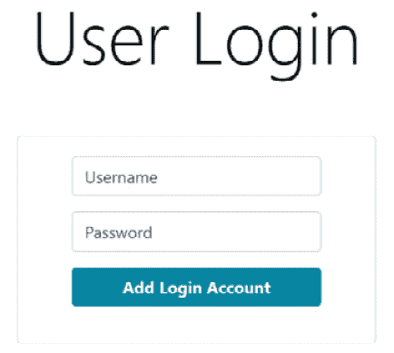
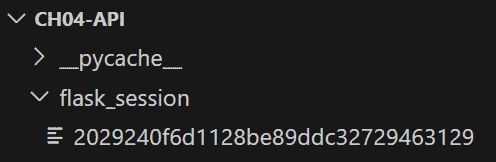
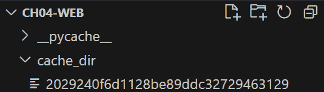

# 第五章：利用 Flask 扩展

Flask 因其扩展而流行，这些扩展是可安装的外部或第三方模块或插件，它们增加了支持并甚至增强了可能看起来重复创建的一些内置功能，例如表单处理、会话处理、认证过程，以及缓存。

将 Flask 扩展应用于项目开发可以节省时间和精力，与重新创建相同功能相比。此外，这些模块可以与其他必要的 Python 和 Flask 模块具有相互依赖性，而无需太多配置，这对于向基线项目添加新功能来说很方便。然而，尽管有积极的因素，但安装 Flask 应用的扩展也有一些副作用，例如与某些已安装模块发生冲突以及与当前 Flask 版本存在版本问题，这导致我们必须降级某些 Flask 扩展或 Flask 版本本身。版本冲突、弃用和非支持是利用 Flask 扩展时的核心关注点；因此，在平台上安装每个 Flask 扩展之前，建议阅读每个 Flask 扩展的文档。

本章将展示与第一章到第三章中创建的相同项目组件，包括网页表单、REST 服务、后端数据库、网页会话和外观，但使用它们各自的 Flask 扩展模块。此外，本章还将向您展示如何应用缓存并将邮件功能集成到应用程序中。

本章将涵盖以下主题：

+   使用 Flask-Migrate 应用数据库迁移

+   使用 Bootstrap-Flask 设计 UI

+   使用 Flask-WTF 构建 Flask 表单

+   使用 Flask-RESTful 构建 RESTful 服务

+   使用 Flask-Session 实现会话处理

+   使用 Flask-Caching 应用缓存

+   使用 Flask-Mail 添加邮件功能

# 技术要求

<st c="1884">本章将突出介绍两个用于</st> *<st c="1935">在线投诉管理系统</st> <st c="1969">的原型，该系统利用了不同的流行 Flask 3.0 扩展。</st> <st c="2024">这些扩展将构建投诉、管理、登录和报告模块。</st> <st c="2110">`<st c="2114">ch04-web</st>` <st c="2122">项目将包括基于表单的一侧，而</st> `<st c="2178">ch04-api</st>` <st c="2186">项目包含 RESTful 服务，以适应各种投诉细节。</st> <st c="2264">这两个应用程序都将利用</st> `<st c="2295">Blueprints</st>` <st c="2305">来组织它们的目录结构，并使用</st> *<st c="2352">SQLAlchemy</st> <st c="2362">* <st c="2362">与它们的 PostgreSQL 数据库执行 CRUD 事务。</st> <st c="2424">所有这些项目都已上传到</st> <st c="2462">[<st c="2465">https://github.com/PacktPublishing/Mastering-Flask-Web-Development/tree/main/ch04</st>](https://github.com/PacktPublishing/Mastering-Flask-Web-Development/tree/main/ch04)<st c="2546">。</st>

# <st c="2547">应用数据库迁移</st>

<st c="2594">在构建应用程序时，要使用的最重要的第三方 Flask 模块是用于管理数据模型层的模块，那就是</st> **<st c="2739">Flask-Migrate</st>** <st c="2752">扩展。</st> <st c="2764">尽管有时使用</st> <st c="2803">*<st c="2839">Alembic</st> <st c="2846">*<st c="2848">来定制数据库迁移是合适的，但</st> *<st c="2848">Flask-Migrate</st> <st c="2861">*<st c="2861">提供了更少的编码和更快的配置设置。</st>

<st c="2932">重要注意事项</st>

<st c="2947">Alembic 是一个轻量级且快速的 SQLAlchemy 数据库迁移工具，可以定制以支持各种</st> <st c="3063">数据库后端。</st>

**<st c="3081">数据库迁移</st>** <st c="3100">是从 Flask 模型类推导和生成数据库架构的一种方式，并允许在整个应用程序的生命周期中监控和审计这些架构中的更改，例如添加和删除表列、修改表约束以及重命名列，而不会破坏当前数据。</st> <st c="3422">所有这些机制都由</st> <st c="3455">*<st c="3458">Flask-Migrate</st> <st c="3471">*<st c="3471">管理。</st>

<st c="3472">现在，让我们了解如何使用</st> *<st c="3553">Flask-Migrate</st> <st c="3566">来设置我们应用程序的数据库后端，而不是手动创建</st> <st c="3600">表架构。</st>

## <st c="3614">使用 Flask-Migrate 应用数据库迁移</st>

<st c="3660">首先，由于我们的应用程序将使用</st> *<st c="3704">SQLAlchemy</st> <st c="3714">作为 ORM 选项，请通过</st> `<st c="3742">flask-sqlalchemy</st>` <st c="3758">通过</st> `<st c="3771">pip</st>` <st c="3774">命令安装：</st>

```py
 pip install flask-sqlalchemy
```

<st c="3812">其次，通过创建</st> `<st c="3855">engine</st>`<st c="3861">,</st> `<st c="3863">db_session</st>`<st c="3873">, 和</st> `<st c="3879">Base</st>` <st c="3883">类来启用</st> `<st c="3828">SQLAlchemy</st>` <st c="3838">，因为我们的原型将利用</st> *<st c="3930">声明式方法</st>* <st c="3950">进行数据库连接。</st> <st c="3977">此设置可在</st> `<st c="4008">/model/config.py</st>` <st c="4024">模块的</st> `<st c="4035">两个应用程序</st>中找到。

<st c="4053">现在，使用</st> `<st c="4069">Base</st>` <st c="4073">类创建模型类，这些类将成为数据库迁移的基础。</st> <st c="4162">以下代码片段展示了如何使用 SQLAlchemy 的</st> `<st c="4245">Base</st>` <st c="4249">类实现模型类：</st>

```py
 class Complaint(<st c="4273">Base</st>):
   __tablename__ = 'complaint'
   id = Column(Integer, <st c="4331">Sequence('complaint_id_seq', increment=1)</st>, <st c="4374">primary_key = True</st>)
   cid = Column(Integer, <st c="4417">ForeignKey('complainant.id')</st>, nullable = False)
   catid = Column(Integer, <st c="4489">ForeignKey('category.id')</st>, nullable = False)
   ctype = Column(Integer, <st c="4558">ForeignKey('complaint_type.id')</st>, nullable = False) <st c="4609">category = relationship('Category', back_populates="complaints")</st><st c="4673">complainants = relationship('Complainant', back_populates="complaints")</st>
 <st c="4745">complaint_type = relationship('ComplaintType', back_populates="complaints")</st>
<st c="4952">Base</st> class to create an SQLAlchemy model class that will depict the schema of its corresponding table. For instance, a given <st c="5077">Complaint</st> class corresponds to the <st c="5112">complaint</st> table with the <st c="5137">id</st>, <st c="5141">cid</st>, <st c="5146">catid</st>, and <st c="5157">ctype</st> columns, as defined by the <st c="5190">Column</st> helper class with the matching column type classes. All column metadata must be correct since *<st c="5291">Flask-Migrate</st>* will derive the table schema details from this metadata during migration. All column metadata, including the *<st c="5414">primary</st>*, *<st c="5423">unique</st>*, and *<st c="5435">foreign key constraints</st>*, will be part of this database migration. After migration, the following model classes will generate sub-tables for the <st c="5579">complaint</st> table:

```

class Category(<st c="5611">Base</st>):

__tablename__ = 'category'

id = Column(Integer, <st c="5668">Sequence('category_id_seq', increment=1)</st>, <st c="5710">primary_key = True</st>)

name = Column(String(45), nullable = False) <st c="5775">complaints = relationship('Complaint', back_populates="category")</st> … … … … … …

class ComplaintType(Base):

__tablename__ = 'complaint_type'

id = Column(Integer, <st c="5933">Sequence('complaint_type_id_seq', increment=1)</st>, <st c="5981">primary_key = True</st>)

name = Column(String(45), nullable = False) <st c="6046">complaints = relationship('Complaint', back_populates="complaint_type")</st> … … … … … …

class ComplaintDetails(<st c="6152">Base</st>):

__tablename__ = 'complaint_details'

id = Column(Integer, <st c="6218">Sequence('complaint_details_id_seq', increment=1)</st>, <st c="6269">primary_key = True</st>)

compid = Column(Integer, <st c="6315">ForeignKey('complaint.id')</st>, nullable = False, <st c="6361">unique=True</st>)

statement = Column(String(100), nullable = False)

status = Column(String(50))

resolution = Column(String(100))

date_resolved = Column(Date) <st c="6515">complaint = relationship('Complaint', back_populates="complaint_details")</st> … … … … … …

```py

			<st c="6599">The</st> `<st c="6604">Category</st>`<st c="6612">,</st> `<st c="6614">ComplaintType</st>`<st c="6627">, and</st> `<st c="6633">ComplaintDetails</st>` <st c="6649">classes all reference the parent</st> `<st c="6683">Complaint</st>`<st c="6692">, as depicted by</st> <st c="6709">their respective</st> `<st c="6726">relationship()</st>` <st c="6740">parameters.</st>
			<st c="6752">With SQLAlchemy set up, install the</st> `<st c="6789">flask-migrate</st>` <st c="6802">extension module:</st>

```

pip install flask-migrate

```py

			<st c="6846">Before running the migration commands from the extension module, create a module file (not</st> `<st c="6938">main.py</st>`<st c="6945">) to provide the</st> <st c="6962">necessary helper classes to run the migration commands locally.</st> <st c="7027">The following</st> `<st c="7041">manage.py</st>` <st c="7050">file of our prototypes will run the module’s</st> `<st c="7096">install</st>`<st c="7103">,</st> `<st c="7105">manage</st>`<st c="7111">, and</st> `<st c="7117">upgrade</st>` <st c="7124">CLI commands:</st>

```

<st c="7138">从 flask_migrate 导入 Migrate</st>

<st c="7172">从 flask_sqlalchemy 导入 SQLAlchemy</st>

<st c="7212">从 model.config 导入 Base</st> from main import app

import toml

app.config.from_file('config-dev.toml', toml.load) <st c="7327">db = SQLAlchemy(app, metadata=Base.metadata)</st>

<st c="7438">flask-sqlalchemy</st>方法，其中 SQLAlchemy 类的实例创建模型类，实例化</st> `<st c="7553">Migrate</st>` <st c="7593">类只需传递</st> `<st c="7593">app</st>`实例和 SQLAlchemy 实例。在这种方法中，SQLAlchemy 仍然是迁移过程的重要组成部分，但其显式实例化将取决于</st> `<st c="7755">Base.metadata</st>`构造函数参数，除了</st> `<st c="7806">app</st>`实例之外。</st> `<st c="7845">Migration</st>` <st c="7879">类的实例化也需要</st> `<st c="7879">app</st>`实例和派生的 SQLAlchemy 实例，如给定的模块脚本所示。

            <st c="7965">现在，如果迁移</st> `<st c="7988">设置准备就绪且正确，</st> `<st c="8020">migrate</st>` <st c="8027">实例由</st> `<st c="8049">manage.py</st>` <st c="8058">提供，可以运行</st> `<st c="8071">init</st>` <st c="8075">CLI 命令。</st> <st c="8089">这次执行将生成迁移过程所需的 Alembic 文件。</st>

            <st c="8169">设置 Alembic 配置</st>

            <st c="8206">Flask-Migrate 使用 Alembic 来</st> <st c="8246">建立和管理数据库迁移。</st> <st c="8279">从</st> `<st c="8291">migrate</st>` <st c="8295">实例运行</st> `<st c="8317">init</st>` <st c="8324">CLI 命令将在项目目录内生成 Alembic 配置文件。</st> <st c="8410">以下 Python 命令运行 Flask-Migrate 的</st> `<st c="8460">init</st>` <st c="8464">CLI 命令，使用我们的</st> `<st c="8487">manage.py</st>` <st c="8496">文件：</st>

```py
 python -m flask --app manage.py db init
```

            <st c="8542">在前面的命令中，</st> `<st c="8569">db</st>` <st c="8571">指定了传递给</st> `<st c="8630">migrate</st>` <st c="8637">实例的 SQLAlchemy</st> `<st c="8597">db</st>` <st c="8599">实例，而</st> `<st c="8654">init</st>` <st c="8658">是</st> `<st c="8698">flask_migrate</st>` <st c="8711">模块的一部分。</st> <st c="8720">运行前面的命令将创建日志，列出由</st> `<st c="8820">init</st>` <st c="8824">命令生成的所有文件夹和文件，如图</st> *<st c="8849">图 4</st>**<st c="8857">.1</st>*<st c="8859">所示：</st>

            

            <st c="9611">图 4.1 – init CLI 命令日志</st>

            <st c="9649">所有的 Alembic 文件都在</st> `<st c="9687">migrations</st>` <st c="9697">文件夹内，并且由前面的命令自动生成。</st> <st c="9754">该</st> `<st c="9758">migrations</st>` <st c="9768">文件夹包含主要的 Alembic 文件，</st> `<st c="9808">env.py</st>`<st c="9814">，它可以进行调整或进一步配置以支持一些额外的迁移需求。</st> *<st c="9910">图 4</st>**<st c="9918">.2</st>* <st c="9920">显示了</st> `<st c="9946">migrations</st>` <st c="9956">文件夹的内容：</st>

            

            <st c="10027">图 4.2 – 迁移文件夹</st>

            <st c="10061">除了</st> `<st c="10073">env.py</st>`<st c="10079">之外，以下文件也包含在</st> `<st c="10126">migrations</st>` <st c="10136">文件夹中：</st>

                +   <st c="10144">该</st> `<st c="10149">alembic.ini</st>` <st c="10160">文件，其中包含默认的 Alembic</st> <st c="10202">配置变量。</st>

                +   <st c="10226">该</st> `<st c="10231">script.py.mako</st>` <st c="10245">文件，作为迁移文件的模板文件。</st>

            <st c="10310">还将有一个</st> `<st c="10332">versions</st>` <st c="10340">文件夹，其中将包含运行</st> `<st c="10406">migrate</st>` <st c="10413">命令后的迁移脚本。</st>

            <st c="10422">创建迁移</st>

            <st c="10446">在生成 Alembic 文件后，</st> `<st c="10487">migrate</st>` <st c="10494">CLI 命令将准备好开始</st> *<st c="10534">初始迁移</st>*<st c="10551">。首次运行</st> `<st c="10565">migrate</st>` <st c="10572">命令将根据 SQLAlchemy 模型类从头开始生成所有表。</st> <st c="10683">运行</st> `<st c="10713">migrate</st>` <st c="10720">CLI 命令的 Python 命令如下：</st>

```py
 python -m flask --app manage.py db migrate -m "Initial"
```

            *<st c="10803">图 4</st>**<st c="10812">.3</st>* <st c="10814">显示了运行此</st> <st c="10857">初始迁移后的日志消息：</st>

            

            <st c="11707">图 4.3 – migrate CLI 命令日志</st>

            成功的初始迁移将<st c="11748">创建一个</st> <st c="11784">数据库中的</st> `<st c="11795">alembic_version</st>` <st c="11810">表。</st> *<st c="11834">图 4</st>**<st c="11842">.4</st>* <st c="11844">显示了初始数据库迁移后</st> `<st c="11870">ocms</st>` <st c="11874">数据库的内容：</st>

            

            <st c="12131">图 4.4 – alembic_version 表</st>

            <st c="12169">每次执行</st> `<st c="12193">migrate</st>` <st c="12200">命令都会创建一个与分配的唯一</st> *<st c="12283">版本号</st>*<st c="12297">相似的迁移脚本文件名。</st> Flask-Migrate 在</st> `<st c="12347">alembic_version</st>` <st c="12362">表中记录这些版本号，并将所有迁移脚本放置在</st> `<st c="12413">migrations</st>` <st c="12423">文件夹中，该文件夹位于</st> `<st c="12441">/versions</st>` <st c="12450">子目录下。</st> <st c="12466">以下是一个此类</st> <st c="12500">迁移脚本的示例：</st>

```py
 """empty message
Revision ID: 9eafa601a7db
Revises:
Create Date: 2023-06-08 06:51:46.327352
"""
from alembic import op
import sqlalchemy as sa
# revision identifiers, used by Alembic. <st c="12702">revision = '9eafa601a7db'</st> down_revision = None
branch_labels = None
depends_on = None <st c="12788">def upgrade():</st> # ### commands auto generated by Alembic - please adjust! ###
    op.create_table('category',
    sa.Column('id', sa.Integer(), nullable=False),
    sa.Column('name', sa.String(length=45), nullable=False),
    sa.PrimaryKeyConstraint('id')
    )
    op.create_table('complaint_type',
    sa.Column('id', sa.Integer(), nullable=False),
    sa.Column('name', sa.String(length=45), nullable=False),
    sa.PrimaryKeyConstraint('id')
    )
  … … … … … … …
```

            <st c="13212">这些自动生成的迁移脚本有时需要验证、编辑和重新编码，因为它们并不总是对 SQLAlchemy 模型类的精确描述。</st> <st c="13385">有时，这些脚本没有</st> <st c="13417">捕捉到应用于</st> <st c="13504">模型的关系表和元数据中的所需更改。</st>

            <st c="13515">现在，为了实现最终的迁移脚本，需要执行</st> `<st c="13566">升级</st>` <st c="13573">CLI 命令</st>。</st>

            <st c="13607">应用数据库更改</st>

            <st c="13637">运行</st> <st c="13673">升级</st> `<st c="13677">CLI 命令</st>` 的完整 Python 命令如下：</st>

```py
 python -m flask --app manage.py db upgrade
```

            *<st c="13754">图 4</st>**<st c="13763">.6</st>* 展示了运行 `<st c="13807">升级</st>` <st c="13814">CLI 命令</st>` 后的日志消息：

            

            <st c="14141">图 4.5 – 升级 CLI 命令日志</st>

            <st c="14182">初始升级执行会生成初始迁移脚本中定义的所有表。</st> <st c="14282">此外，后续的脚本将始终根据应用于模型类的更改修改模式。</st> <st c="14410">另一方面，</st> `<st c="14512">降级</st>` <st c="14521">CLI 命令。</st> <st c="14535">此命令将恢复数据库的先前版本。</st>

            <st c="14594">在 Flask 项目中，没有 Flask-Migrate，数据库迁移将不会直接且无缝。</st> <st c="14696">从头开始编写迁移设置和流程将非常耗时且相当严格。</st>

            <st c="14802">下一个可以帮助开发团队节省处理 Bootstrap 静态文件并将其导入 Jinja2 模板时间的扩展是</st> *<st c="14945">Bootstrap-Flask</st>*<st c="14960">。</st>

            <st c="14961">使用 Bootstrap-Flask 设计 UI</st>

            <st c="15000">有几种方法可以将</st> <st c="15026">具有外观和感觉的上下文数据渲染到 Jinja2 模板中</st> <st c="15089">而不必过于担心下载资源文件或从</st> **<st c="15196">内容分发网络</st>** <st c="15220">(</st>**<st c="15222">CDN</st>**<st c="15225">) 存储库</st> <st c="15239">中引用静态文件并将它们导入模板页面以管理最佳的 UI 设计来呈现。</st> <st c="15331">其中最理想和最及时</st> <st c="15368">的选项是</st> **<st c="15379">Bootstrap-Flask</st>**<st c="15394">，这是一个与</st> *<st c="15428">Flask-Bootstrap</st>* <st c="15443">扩展模块</st> <st c="15462">截然不同的模块。</st> <st c="15462">后者仅使用 Bootstrap 版本 3.0，而</st> *<st c="15512">Bootstrap-Flask</st>* <st c="15527">可以支持高达</st> *<st c="15546">Bootstrap 5.0</st>*<st c="15559">。因此，建议在设置 Flask-Bootstrap 之前先卸载 Flask-Bootstrap 和其他 UI 相关模块，以避免意外冲突。</st> <st c="15683">仅允许 Bootstrap-Flask 管理 UI 设计可以提供</st> <st c="15779">更好的结果。</st>

            <st c="15794">但首先，让我们通过运行以下</st> *<st c="15820">Bootstrap-Flask</st>* <st c="15835">命令来安装它：</st> `<st c="15861">pip</st>` <st c="15864">命令：</st>

```py
 pip install bootstrap-flask
```

            <st c="15901">接下来，我们将设置</st> <st c="15942">具有所需 Bootstrap</st> <st c="15969">框架发行版的</st> Bootstrap 模块。</st>

            <st c="15992">设置 UI 模块</st>

            <st c="16017">为了使模块与 Flask 平台协同工作，必须在</st> `<st c="16091">main.py</st>` <st c="16098">模块中</st> <st c="16107">设置。</st> `<st c="16111">bootstrap_flask</st>` <st c="16126">模块具有</st> `<st c="16138">Bootstrap4</st>` <st c="16148">和</st> `<st c="16153">Bootstrap5</st>` <st c="16163">核心类，必须在将框架的资产应用之前将它们连接到 Flask 实例。</st> <st c="16262">应用程序只能使用一个</st> <st c="16294">Bootstrap 发行版：我们的</st> `<st c="16322">ch04-web</st>` <st c="16330">应用程序使用</st> `<st c="16356">Bootstrap4</st>` <st c="16366">类来保持与</st> *<st c="16402">第三章</st>*<st c="16411">的 Bootstrap 偏好的一致性。</st> `<st c="16437">以下</st>` `<st c="16451">main.py</st>` <st c="16458">模块实例化</st> `<st c="16479">Bootstrap4</st>`<st c="16489">，这启用了</st> <st c="16509">扩展模块：</st>

```py
 from flask import Flask <st c="16551">from flask_bootstrap import Bootstrap4</st> import toml
from model.config import init_db
init_db()
app = Flask(__name__, template_folder='pages', static_folder="resources")
app.config.from_file('config-dev.toml', toml.load) <st c="16802">Bootstrap4</st> class requires the <st c="16832">app</st> instance as its constructor argument to proceed with the instantiation. After this setup, the Jinja2 templates can now load the necessary built-in resource files and start the web design process.
			<st c="17031">Applying the Bootstrap files and assets</st>
			<st c="17071">Bootstrap-Flask has a</st> `<st c="17094">bootstrap.load_css()</st>` <st c="17114">helper function that loads the CSS resources into the Jinja2 template and a</st> `<st c="17191">bootstrap.load_js()</st>` <st c="17210">helper function that loads all Bootstrap</st> <st c="17251">JavaScript files.</st> <st c="17270">The following is the</st> `<st c="17291">login.html</st>` <st c="17301">template of the</st> `<st c="17318">ch04-web</st>` <st c="17326">application with the preceding two</st> <st c="17362">helper functions:</st>

```

<!DOCTYPE html>

<html lang="en">

<head>

    <meta charset="utf-8" />

    <meta http-equiv="x-ua-compatible" content="ie=edge" />

    <meta name="viewport" content="width=device-width, initial-scale=1" />

    <title>在线投诉管理系统</title> <st c="17622">{{ bootstrap.load_css() }}</st> </head>

<body>

    … … … … … … <st c="17675">{{ bootstrap.load_js() }}</st> </body>

</html>

```py

			<st c="17716">It is always the standard to call</st> `<st c="17751">bootstrap.load_css()</st>` <st c="17771">in</st> `<st c="17775"><head></st>`<st c="17781">, which is the appropriate markup to call the</st> `<st c="17827"><style></st>` <st c="17834">tag.</st> <st c="17840">Calling</st> `<st c="17848">bootstrap.load_js()</st>` <st c="17867">in</st> `<st c="17871"><head></st>` <st c="17877">is also feasible, but for many, the custom is to load all the JavaScript files in the last part of the</st> `<st c="17981"><body></st>` <st c="17987">content, which is why</st> `<st c="18010">bootstrap.load_css()</st>` <st c="18030">is present there.</st> <st c="18049">On the other hand, if there are custom</st> `<st c="18088">styles.css</st>` <st c="18098">or JavaScript files for the applications, the module can allow their imports in the Jinja2 templates, so long as there are no conflicts with the</st> <st c="18244">Bootstrap resources.</st>
			<st c="18264">After loading the CSS and</st> <st c="18291">JavaScript, we can start designing the pages with the Bootstrap components.</st> <st c="18367">The following code shows the content of the given</st> `<st c="18417">login.html</st>` <st c="18427">page with all the needed</st> *<st c="18453">Bootstrap</st>* *<st c="18463">4</st>* <st c="18464">components:</st>

```

<body>

    <section class="<st c="18500">position-relative py-4 py-xl-5</st>">

        <div class="<st c="18547">container position-relative</st>">

            <div class="<st c="18591">row mb-5</st>">

                <div class="<st c="18616">col-md-8 col-xl-6 text-center</st> <st c="18646">mx-auto</st>">

                    <h2 class="<st c="18669">display-3</st>">用户登录</h2>

                </div>

            </div>

            <div class="<st c="18724">row d-flex justify-content-center</st>">

                <div class="<st c="18774">col-md-6 col-xl-4</st>">

                    <div class="<st c="18808">card</st>">

                        <div class="<st c="18829">card-body text-center</st> <st c="18851">d-flex flex-column align-items-center</st>">

                        <form action="{{ request.path }}" method = "post">

                            … … … … … …

                        </form>

                        </div>

                    </div>

                </div>

            </div>

        </div>

    </section>

… … … … … …

</body>

```py

			*<st c="19029">Figure 4</st>**<st c="19038">.6</st>* <st c="19040">shows the</st> <st c="19051">published version of the given</st> `<st c="19082">login.html</st>` <st c="19092">web design:</st>
			

			<st c="19143">Figure 4.6 – The login.html page using Bootstrap 4</st>
			<st c="19193">Aside from the updated Bootstrap support, the Bootstrap-Flask module has macros and built-in configurations that applications can use to create a better</st> <st c="19347">UI design.</st>
			<st c="19357">Utilizing built-in features</st>
			<st c="19385">The extension module</st> <st c="19406">has five built-in</st> *<st c="19425">macros</st>* <st c="19431">that Jinja2 templates can import to create fewer HTML codes and manageable components.</st> <st c="19519">These built-in macros are</st> <st c="19545">as follows:</st>

				*   `<st c="19556">bootstrap4/form.html</st>`<st c="19577">: This can render</st> *<st c="19596">Flask-WTF</st>* <st c="19605">forms or form components and their hidden</st> <st c="19648">error messages.</st>
				*   `<st c="19663">bootstrap4/nav.html</st>`<st c="19683">: This can render navigations</st> <st c="19714">and breadcrumbs.</st>
				*   `<st c="19730">bootstrap4/pagination.html</st>`<st c="19757">: This can provide paginations to</st> *<st c="19792">Flask-SQLAlchemy</st>* <st c="19808">data.</st>
				*   `<st c="19814">bootstrap4/table.html</st>`<st c="19836">: This can render table-formatted</st> <st c="19871">context data.</st>
				*   `<st c="19884">bootstrap4/utils.html</st>`<st c="19906">: This can provide other utilities, such as rendering flash messages, icons, and resource</st> <st c="19997">reference code.</st>

			<st c="20012">The module also has built-in</st> *<st c="20042">configuration variables</st>* <st c="20065">to enable and disable some features and customize Bootstrap components.</st> <st c="20138">For instance,</st> `<st c="20152">BOOTSTRAP_SERVE_LOCAL</st>` <st c="20173">disables the process of loading built-in CSS and JavaScript when set to</st> `<st c="20246">false</st>` <st c="20251">and allows us to refer to CDN or local resources in</st> `<st c="20304">/static</st>` <st c="20311">instead.</st> <st c="20321">In addition,</st> `<st c="20334">BOOTSTRAP_BTN_SIZE</st>` <st c="20352">and</st> `<st c="20357">BOOTSTRAP_BTN_STYLE</st>` <st c="20376">can</st> <st c="20380">customize buttons.</st> <st c="20400">The</st> **<st c="20404">TOML</st>** <st c="20408">or any configuration file is where all these</st> <st c="20454">configuration variables are registered</st> <st c="20493">and set.</st>
			<st c="20501">Next, we’ll focus on</st> *<st c="20523">Flask-WTF</st>*<st c="20532">, a module supported</st> <st c="20553">by</st> *<st c="20556">Bootstrap-Flask</st>*<st c="20571">.</st>
			<st c="20572">Building Flask forms with Flask-WTF</st>
			`<st c="20750">WTForms</st>` <st c="20757">library to enhance form handling in Flask applications.</st> <st c="20814">Instead of using HTML markup, Flask-WTF provides</st> <st c="20863">the necessary utilities</st> <st c="20886">to manage the web forms in a Pythonic way through</st> <st c="20937">form models.</st>
			<st c="20949">Creating the form models</st>
			<st c="20974">Form models must extend the</st> `<st c="21003">FlaskForm</st>` <st c="21012">core class to create and render the</st> `<st c="21049"><form></st>` <st c="21055">tag.</st> <st c="21061">Its attributes</st> <st c="21076">correspond to the form fields defined by the following</st> <st c="21131">helper classes:</st>

				*   `<st c="21146">StringField</st>`<st c="21158">: Defines and creates a text input field that accepts</st> <st c="21213">string-typed data.</st>
				*   `<st c="21231">IntegerField</st>`<st c="21244">: Defines and creates a text input field that</st> <st c="21291">accepts integers.</st>
				*   `<st c="21308">DecimalField</st>`<st c="21321">: Defines and creates a text input field that asks for</st> <st c="21377">decimal values.</st>
				*   `<st c="21392">DateField</st>`<st c="21402">: Defines and creates a text input field that supports</st> `<st c="21458">Date</st>` <st c="21462">types with the default format</st> <st c="21493">of</st> `<st c="21496">yyyy-mm-dd</st>`<st c="21506">.</st>
				*   `<st c="21507">EmailField</st>`<st c="21518">: Defines and creates a text input that uses a regular expression to manage</st> <st c="21595">email-formatted</st> <st c="21611">values.</st>
				*   `<st c="21618">SelectField</st>`<st c="21630">: Defines and creates a</st> <st c="21655">combo box.</st>
				*   `<st c="21665">SelectMultipleField</st>`<st c="21685">: Defines and creates a combo box with a list</st> <st c="21732">of options.</st>
				*   `<st c="21743">TextAreaField</st>`<st c="21757">: Defines a text area for multi-line</st> <st c="21795">text input.</st>
				*   `<st c="21806">FileField</st>`<st c="21816">: Defines and creates a file upload field for</st> <st c="21863">uploading files.</st>
				*   `<st c="21879">PasswordField</st>`<st c="21893">: Defines a password</st> <st c="21915">input field.</st>

			<st c="21927">The following code shows a form model that utilizes the given helper classes to build the</st> `<st c="22018">Complainant</st>` <st c="22029">form</st> *<st c="22035">widgets</st>* <st c="22042">for the</st> `<st c="22051">add_complainant()</st>` <st c="22068">view:</st>

```

<st c="22074">from flask_wtf import FlaskForm</st>

<st c="22106">from wtforms import StringField, IntegerField, SelectField, DateField, EmailField</st>

<st c="22188">from wtforms.validators import InputRequired, Length, Regexp, Email</st> class ComplainantForm(<st c="22279">FlaskForm</st>):

    id = <st c="22298">SelectField</st>('选择登录 ID: ', validators=[InputRequired()])

    firstname = <st c="22374">StringField</st>('输入名字:', validators=[InputRequired(), Length(max=50)])

    middlename = <st c="22466">StringField</st>('输入中间名:', validators=[InputRequired(), Length(max=50)])

    lastname = <st c="22557">StringField</st>('输入姓氏:', validators=[InputRequired(), Length(max=50)])

    email = <st c="22643">EmailField</st>('输入邮箱:', validators=[InputRequired(), Length(max=20), Email()])

    mobile = <st c="22735">StringField</st>('输入手机:', validators=[InputRequired(), Length(max=20), Regexp(regex=r"^(\+63)[-]{1}\d{3}

                [-]{1}\d{3}[-]{1}\d{4}$", message="有效的电话号码格式为 +63-xxx-xxx-xxxx")])

    address = <st c="22939">StringField</st>('输入地址:', validators=[InputRequired(), Length(max=100)])

    zipcode = <st c="23027">IntegerField</st>('输入邮编:',  validators=[InputRequired()])

    status = <st c="23099">SelectField</st>('输入状态:', choices=[('active', 'ACTIVE'),

        ('无效', 'INACTIVE'), ('已阻止', 'BLOCKED')], validators=[InputRequired()])

    date_registered = <st c="23348">firstname</st>，<st c="23359">middlename</st>，<st c="23371">lastname</st>和<st c="23385">address</st>是具有不同长度的输入类型文本框，是必填表单参数。对于特定的输入类型，<st c="23500">date_registered</st>是<st c="23552">Date</st>类型的必填表单参数，日期格式为<st c="23584">yyyy-mm-dd</st>，而<st c="23602">email</st>是电子邮件类型文本框。另一方面，<st c="23658">status</st>和<st c="23669">id</st>表单参数是组合框，但不同的是<st c="23753">id</st>中没有选项。<st c="23761">status</st>表单参数的<st c="23791">choices</st>选项已经在表单中定义，而在<st c="23849">id</st>表单参数中，视图函数将在运行时填充这些字段。以下是一个管理<st c="23959">add_complainant()</st>视图的<st c="23999">id</st>参数选项的代码片段：

```py
 @complainant_bp.route('/complainant/add', methods=['GET', 'POST'])
def add_complainant(): <st c="24113">form:ComplainantForm = ComplainantForm()</st> login_repo = LoginRepository(db_session)
    users = login_repo.select_all() <st c="24227">form.id.choices = [(f"{u.id}", f"{u.username}") for u</st> <st c="24280">in users]</st><st c="24290">if request.method == 'GET':</st><st c="24318">return render_template('complainant_add.html',</st> <st c="24365">form=form), 200</st><st c="24381">else:</st><st c="24387">if form.validate_on_submit():</st><st c="24417">details = dict()</st><st c="24434">details["id"] = int(form.id.data)</st><st c="24468">details["firstname"] = form.firstname.data</st><st c="24511">details["lastname"]  = form.lastname.data</st> … … … … … … <st c="24564">complainant:Complainant =</st> <st c="24589">Complainant(**details)</st><st c="24612">complainant_repo:ComplainantRepository =</st> <st c="24653">ComplainantRepository(db_session)</st><st c="24687">result = complainant_repo.insert(complainant)</st> if result:
                records = complainant_repo.select_all()
                return render_template( 'complainant_list_all.html', records=records), 200 <st c="24860">else:</st><st c="24865">return render_template('complainant_add.html',</st><st c="24912">form=form), 500</st> else:
            return render_template('complainant_add.html', form=form), 500
```

            <st c="24997">前面的视图访问了</st> `<st c="25030">choices</st>` <st c="25037">参数的</st> `<st c="25055">id</st>` <st c="25057">表单参数，将其分配给一个包含</st> `<st c="25101">(id, username) Tuple</st>`<st c="25121">的列表，其中<st c="25128">username</st>作为标签，<st c="25136">id</st>作为其值。

            <st c="25170">另一方面，<st c="25223">add_complainant()</st> <st c="25240">视图的 HTTP POST 事务将在提交后通过</st> `<st c="25310">form</st>` <st c="25314">参数的</st> `<st c="25327">validate_on_submit()</st>`<st c="25347">验证表单验证错误。如果没有错误，视图函数将提取所有表单数据从</st> `<st c="25421">form</st>` <st c="25425">对象，将</st> <st c="25444">投诉详情插入数据库，并渲染所有投诉者的列表。</st> <st c="25521">否则，它将返回带有提交的</st> `<st c="25580">ComplainantForm</st>` <st c="25595">实例和表单数据值的表单页面。</st> <st c="25628">现在我们已经实现了表单模型和管理的视图函数，我们可以专注于如何使用 Jinja2 模板将这些模型映射到它们各自的</st> `<st c="25772"><form></st>` <st c="25778">标签。

            <st c="25807">渲染表单</st>

            在将 WTF 表单模型返回到 Jinja2 模板之前，视图函数必须访问并实例化 FlaskForm 子类，甚至用值填充一些字段以准备</st> `<st c="26024"><form></st>` <st c="26030">映射。</st> <st c="26040">将模型表单与适当的值关联可以避免在</st> `<st c="26124"><</st>``<st c="26125">form></st>` <st c="26130">加载时出现 Jinja2 错误。

            <st c="26139">现在，表单渲染仅在存在</st> <st c="26172">HTTP GET</st> <st c="26202">请求以加载表单或当 HTTP POST 在提交过程中遇到验证错误时发生，需要重新加载显示当前值和错误状态的表单页面。</st> <st c="26392">HTTP 请求的类型决定了在渲染表单之前将哪些值分配给表单模型的字段。</st> <st c="26504">因此，在给定的</st> `<st c="26523">add_complainant()</st>` <st c="26540">视图中，检查</st> `<st c="26559">request.method</st>` <st c="26573">是否为</st> *<st c="26579">GET</st> <st c="26582">请求意味着验证何时使用具有基础或初始化值的</st> `<st c="26626">complainant_add.html</st>` <st c="26646">表单模板和</st> `<st c="26670">ComplainantForm</st>` <st c="26685">实例进行渲染。</st> <st c="26728">否则，它将是一个渲染当前表单值和</st> <st c="26810">验证错误的表单页面。</st>

            <st c="26828">以下</st> `<st c="26843">complainant_add.html</st>` <st c="26863">页面将</st> `<st c="26878">ComplainantForm</st>` <st c="26893">字段，包括基础或当前值，映射到</st> `<st c="26938"><</st>``<st c="26939">form></st>` <st c="26944">标签：

```py
 <form action = "{{ request.path }}" method = "post"> <st c="27003">{{ form.csrf_token }}</st> <div class="mb-3">{{ <st c="27046">form.id</st>(<st c="27055">size</st>=1, <st c="27064">class</st>="form-control") }}</div>
  <div class="mb-3"> {{ <st c="27118">form.firstname</st>(<st c="27134">size</st>=50, <st c="27144">placeholder</st>='Firstname', <st c="27170">class</st>="form-control") }}
  </div> <st c="27203"></st><st c="27233"><ul></st><st c="27238"></st><st c="27278"><li>{{ error }}</li></st><st c="27299"></st><st c="27312"></ul></st><st c="27318"></st> … … … … … …
  <div class="mb-3"> {{ <st c="27364">form.mobile</st>(<st c="27377">size</st>=50, <st c="27387">placeholder</st>='+63-XXX-XXX-XXXX', <st c="27420">class</st>="form-control") }}
  </div>
  … … … … … …
  <div class="mb-3"> {{ <st c="27487">form.email</st>(<st c="27499">size</st>=50,<st c="27508">placeholder</st>='xxxxxxx@xxxx.xxx', <st c="27542">class</st>="form-control") }}
  </div>
  … … … … … …
   <div class="mb-3"> {{ <st c="27609">form.zipcode</st>(<st c="27623">size</st>=50, <st c="27633">placeholder</st>='Zip Code', <st c="27658">class</st>="form-control") }}
   </div>
   … … … … … …
</form>
```

            <st c="27710">将单个模型字段绑定到</st> `<st c="27749"><form></st>` <st c="27755">需要调用字段的属性 - 例如，</st> `<st c="27814">context_name.field()</st>`<st c="27834">。因此，要渲染</st> `<st c="27854">firstname</st>` <st c="27863">表单字段</st> `<st c="27878">ComplainantForm</st>`<st c="27893">，例如，Jinja2 模板必须在</st> `<st c="27939">form.firstname()</st>` <st c="27955">内部调用</st> `<st c="27967">{{}}</st>` <st c="27971">语句。</st> <st c="27983">方法调用还可以包括其</st> `<st c="28020">kwargs</st>` <st c="28026">或</st> *<st c="28030">关键字参数</st>* <st c="28047">的小部件属性，例如</st> `<st c="28078">size</st>`<st c="28082">，</st> `<st c="28084">placeholder</st>`<st c="28095">，和</st> `<st c="28101">class</st>`<st c="28106">，如果在渲染过程中小部件的默认设置发生了变化。</st> <st c="28182">如模板所示，</st> *<st c="28212">Flask-WTF</st>* <st c="28221">小部件支持由</st> *<st c="28279">Bootstrap-Flask</st>* <st c="28294">模块扩展提供的 Bootstrap 组件。</st> <st c="28313">使用小部件添加自定义 CSS 样式也是可行的，只要 CSS 属性设置在小部件的</st> <st c="28411">kwargs</st><st c="28426">中。</st>

            现在，让我们探讨 Flask 是否可以像 Django 的表单一样，防止来自**跨站请求伪造** <st c="28427">（CSRF）问题。</st>

            应用 CSRF

            Flask-WTF 通过其`<st c="28571">csrf_token</st>` <st c="28599">生成内置了 CSRF 支持。</st> <st c="28643">要</st> <st c="28646">通过 Flask-WTF 启用 CSRF，在`<st c="28689">CSRFProtect</st>` <st c="28700">从`<st c="28710">flask_wtf</st>` <st c="28719">模块中实例化`<st c="28730">main.py</st>`<st c="28737">，如下面的代码片段所示：</st>

```py
<st c="28773">from flask_wtf import CSRFProtect</st> app = Flask(__name__, template_folder='pages', static_folder="resources")
app.config.from_file('config-dev.toml', toml.load)
bootstrap = Bootstrap4(app) <st c="29019">csrf_token</st>) using the WTF form context inside the <st c="29071">{{}}</st> statement enables the token generation per-user access, as shown in the given <st c="29154">complainant_add.html</st> template. Flask-WTF generates a unique token for every rendition of the form fields. Note that CRSF protection is only possible with Flask-WTF if the <st c="29325">SECRET_KEY</st> configuration variable is part of the configuration file and has the appropriate hash value.
			<st c="29428">CRSF protection occurs in every form submission that involves the form model instance.</st> <st c="29516">Now, let’s discuss the general flow of form submission with the</st> <st c="29580">Flask-WTF module.</st>
			<st c="29597">Submitting the form</st>
			<st c="29617">After clicking the submit button, the</st> *<st c="29656">HTTP POST</st>* <st c="29665">request transaction of</st> `<st c="29689">add_complainant()</st>` <st c="29706">retrieves the</st> <st c="29720">form values after the validation, as shown in the preceding snippet.</st> <st c="29790">Flask-WTF sends the form data to the view function through the</st> *<st c="29853">HTTP POST</st>* <st c="29862">request method, requiring the view function to have validation for the incoming</st> `<st c="29943">POST</st>` <st c="29947">requests.</st> <st c="29958">If</st> `<st c="29961">request.method</st>` <st c="29975">is</st> `<st c="29979">POST</st>`<st c="29983">, the view must perform another evaluation on the extension’s</st> `<st c="30045">validate_on_submit()</st>` <st c="30065">to check for violation of some form constraints.</st> <st c="30115">If the results for all these evaluations are</st> `<st c="30160">True</st>`<st c="30164">, the view function can access all the form data in</st> `<st c="30216">form_object.<field_name>.data</st>`<st c="30245">. Otherwise, the view function will redirect the users to the form page with the corresponding error message(s) and</st> *<st c="30361">HTTP Status</st>* *<st c="30373">Code 500</st>*<st c="30381">.</st>
			<st c="30382">But what comprises Flask-WTF’s form</st> <st c="30419">validation framework, or what criteria are the basis of the</st> `<st c="30479">validate_on_submit()</st>` <st c="30499">result after</st> <st c="30513">form submission?</st>
			<st c="30529">Validating form fields</st>
			<st c="30552">Flask-WTF has a list of useful built-in</st> <st c="30593">validator classes that support core validation rules such as</st> `<st c="30654">InputRequired()</st>`<st c="30669">, which imposes the HTML-required constraint.</st> <st c="30715">Some constraints are specific to widgets, such as the</st> `<st c="30769">Length()</st>` <st c="30777">validator, which can restrict the input length of the</st> `<st c="30832">StringField</st>` <st c="30843">values, and</st> `<st c="30856">RegExp()</st>`<st c="30864">, which can impose regular expressions for mobile and telephone data formats.</st> <st c="30942">Moreover, some validators require dependency modules to be installed, such as</st> `<st c="31020">Email()</st>`<st c="31027">, which needs an email-validator external library.</st> <st c="31078">All these built-in validators are ready to be imported from</st> *<st c="31138">Flask-WTF</st>*<st c="31147">’s</st> `<st c="31151">wtforms.validators</st>` <st c="31169">module.</st> <st c="31178">The</st> `<st c="31182">validators</st>` <st c="31192">parameter of every</st> *<st c="31212">FlaskForm</st>* <st c="31221">attribute can accept any callables from validator classes to impose</st> <st c="31290">constraint rules.</st>
			<st c="31307">Violations are added to the field’s errors list that can trigger</st> `<st c="31373">validate_on_submit()</st>` <st c="31393">to return</st> `<st c="31404">False</st>`<st c="31409">. The form template must render all such error messages per field during redirection after an</st> *<st c="31503">HTTP Status Code</st>* *<st c="31520">500</st>* <st c="31523">error.</st>
			<st c="31530">The module can also support</st> <st c="31559">custom validation for some constraints that are not typical.</st> <st c="31620">There are many ways to implement custom validations, and one is through the</st> *<st c="31696">in-line validator approach</st>* <st c="31722">exhibited in the</st> <st c="31740">following snippet:</st>

```

class ComplainantForm(FlaskForm):

    … … … … … …

    zipcode = IntegerField('输入邮编:', validators=[InputRequired()])

    … … … … … …

    def validate_<st c="31902">zipcode</st>(self, <st c="31918">zipcode</st>):

        如果`zipcode.data`字符串的长度不等于 4: FlaskForm 函数，其方法名以`validate_`为前缀，后跟它验证的表单字段名称，该字段作为参数传递。给定的`validate_zipcode()`检查表单字段的`zipcode`是否为四位数字值。如果不是，它将抛出一个异常类。另一种方法是实现验证器作为*典型 FlaskForm 函数*，但验证器函数需要显式地注入到它验证的字段的`validators`参数中。

            最后，*类似闭包或可调用的方法* <st c="32543">用于验证器的实现也是可能的。</st> <st c="32634">在这里</st> `<st c="32639">disallow_invalid_dates()</st>` <st c="32663">是一个不允许在给定</st> `<st c="32734">date_after</st>` <st c="32750">之前的日期输入的闭包类型验证器。</st>

```py
<st c="32752">from wtforms.validators ValidationError</st> class ComplainantForm(FlaskForm): <st c="32826">def disallow_invalid_dates(date_after):</st> message = 'Must be after %s.' % (date_after) <st c="32911">def _disallow_invalid_dates(form, field):</st> base_date = datetime.strptime(date_after, '%Y-%m-%d').date()
          if field.data < base_date: <st c="33041">raise ValidationError(message)</st><st c="33071">return _disallow_invalid_dates</st> … … … … … …
     … … … … … …
     date_registered = DateField('Enter date registered', format='%Y-%m-%d', validators=[InputRequired(), <st c="33409">disallow_invalid_dates()</st>, the closure is <st c="33450">_disallow_invalid_dates(form, field)</st>, which raises <st c="33501">ValidationError</st> when the <st c="33526">field.data</st> or <st c="33540">date_registered</st> form value is before the specified boundary date’s <st c="33607">date_after</st> provided by the validator function. To apply validators, you can call them just like a typical method – that is, with parameter values in the <st c="33760">validators</st> parameter of the field class.
			<st c="33800">Another extension module that is popular nowadays and supports the recent Flask framework is the</st> *<st c="33898">Flask-RESTful</st>* <st c="33911">module.</st> <st c="33920">We’ll take a look at it in the</st> <st c="33951">next section.</st>
			<st c="33964">Building RESTful services with Flask-RESTful</st>
			<st c="34009">The</st> `<st c="34014">flask-RESTful</st>` <st c="34027">module uses the</st> *<st c="34044">class-based view strategy</st>* <st c="34069">of Flask to build RESTful services.</st> <st c="34106">It provides a</st> `<st c="34120">Resource</st>` <st c="34128">class to create custom resources to build from the ground up HTTP-based services instead of</st> <st c="34221">endpoint-based routes.</st>
			<st c="34243">This chapter specifies another</st> <st c="34275">application,</st> `<st c="34288">ch04-api</st>`<st c="34296">, that implements</st> <st c="34314">RESTful endpoints for managing user complaints and related details.</st> <st c="34382">Here’s one of the resource-based implementations of our application’s</st> <st c="34452">API endpoints:</st>

```

<st c="34466">from flask_restful import Resource</st> class ListComplaintRestAPI(<st c="34529">资源</st>): <st c="34542">def get(self):</st> repo = ComplaintRepository(db_session)

        records = repo.select_all()

        complaint_rec = [rec.to_json() for rec in records]

        return make_response(jsonify(complaint_rec), 201)

```py

			<st c="34724">Here,</st> `<st c="34731">flask_restful</st>` <st c="34744">provides the</st> `<st c="34758">Resource</st>` <st c="34766">class that creates resources for views.</st> <st c="34807">In this case,</st> `<st c="34821">ListComplaintRestAPI</st>` <st c="34841">sub-classes the</st> `<st c="34858">Resource</st>` <st c="34866">class to override its</st> `<st c="34889">get()</st>` <st c="34894">instance method, which will retrieve all complaints from the database through an HTTP</st> *<st c="34981">GET</st>* <st c="34984">request.</st> <st c="34994">On the other hand,</st> `<st c="35013">AddComplaintRestAPI</st>` <st c="35032">implements the</st> *<st c="35048">INSERT</st>* <st c="35054">complaint transaction through an HTTP</st> *<st c="35093">POST</st>* <st c="35097">request:</st>

```

class AddComplaintRestAPI(<st c="35133">资源</st>): <st c="35146">def post(self):</st> complaint_json = request.get_json()

        repo = ComplaintRepository(db_session)

        complaint = Complaint(**complaint_json)

        result = repo.insert(complaint)

        if result:

            content = jsonify(complaint_json)

            return make_response(content, 201)

        else:

            content = jsonify(message="插入投诉记录时遇到问题")

            return make_response(content, 500)

```py

			<st c="35504">The</st> `<st c="35509">Resource</st>` <st c="35517">class</st> <st c="35523">has a</st> `<st c="35530">post()</st>` <st c="35536">method that needs to be overridden to</st> <st c="35575">create</st> *<st c="35582">POST</st>* <st c="35586">transactions.</st> <st c="35601">The following</st> `<st c="35615">UpdateComplainantRestAPI</st>`<st c="35639">,</st> `<st c="35641">DeleteComplaintRestAPI</st>`<st c="35663">, and</st> `<st c="35669">UpdateComplaintRestAPI</st>` <st c="35691">resources implement HTTP</st> *<st c="35717">PATCH</st>*<st c="35722">,</st> *<st c="35724">DELETE</st>*<st c="35730">, and</st> *<st c="35736">PUT</st>*<st c="35739">, respectively:</st>

```

class UpdateComplainantRestAPI(<st c="35786">资源</st>): <st c="35799">def patch(self, id):</st> complaint_json = request.get_json()

        repo = ComplaintRepository(db_session)

        result = repo.update(id, complaint_json)

        if result:

            `content = jsonify(complaint_json)`

            返回`make_response(content, 201)`

        否则：

            `content = jsonify(message="更新投诉人 ID 时遇到问题")`

            返回`make_response(content, 500)`

```py

			<st c="36129">The</st> `<st c="36134">Resource</st>` <st c="36142">class’</st> `<st c="36150">patch()</st>` <st c="36157">method implements the HTTP</st> *<st c="36185">PATCH</st>* <st c="36190">request when overridden.</st> <st c="36216">Like HTTP</st> *<st c="36226">GET</st>*<st c="36229">,</st> `<st c="36231">patch()</st>` <st c="36238">can also accept path variables or request parameters by declaring local parameters to the override.</st> <st c="36339">The</st> `<st c="36343">id</st>` <st c="36345">parameter in the</st> `<st c="36363">patch()</st>` <st c="36370">method of</st> `<st c="36381">UpdateComplaintRestAPI</st>` <st c="36403">is a path variable for a complainant ID.</st> <st c="36445">This is</st> <st c="36452">required to retrieve the</st> <st c="36478">complainant’s profile:</st>

```

`class DeleteComplaintRestAPI(<st c="36530">Resource</st>): <st c="36543">def delete(self, id):</st>` `repo = ComplaintRepository(db_session)`

        `result = repo.delete(id)`

        如果`result`：

            `content = jsonify(message=f'投诉 {id} 已删除')`

            返回`make_response(content, 201)`

        否则：

            `content = jsonify(message="删除投诉记录时遇到问题")`

            返回`make_response(content, 500)`

```py

			<st c="36843">The</st> `<st c="36848">delete()</st>` <st c="36856">override of</st> `<st c="36869">DeleteComplaintRestAPI</st>` <st c="36891">also has an</st> `<st c="36904">id</st>` <st c="36906">parameter that’s used to delete</st> <st c="36939">the</st> <st c="36942">complaint:</st>

```

`class UpdateComplaintRestAPI(<st c="36983">Resource</st>): <st c="36996">def put(self):</st>` `complaint_json = request.get_json()`

        `repo = ComplaintRepository(db_session)`

        `result = repo.update(complaint_json['id'], complaint_json)`

        如果`result`：

            `content = jsonify(complaint_json)`

            返回`make_response(content, 201)`

        否则：

            `content = jsonify(message="更新投诉记录时遇到问题")`

            返回`make_response(content, 500)`

```py

			<st c="37340">To utilize all the preceding resources, the Flask-RESTful extension module has an</st> `<st c="37423">Api</st>` <st c="37426">class that must be instantiated with</st> <st c="37463">the</st> `<st c="37468">Flask</st>` <st c="37473">or</st> `<st c="37477">Blueprint</st>` <st c="37486">instance as its constructor argument.</st> <st c="37525">Since</st> <st c="37530">the</st> `<st c="37535">ch04-api</st>` <st c="37543">project uses blueprints, the following</st> `<st c="37583">__init__.py</st>` <st c="37594">file of the complaint blueprint module highlights how to create the</st> `<st c="37663">Api</st>` <st c="37666">instance and map all these resources with their respective</st> <st c="37726">URL patterns:</st>

```

`<st c="37739">从 flask 导入 Blueprint</st>`

`<st c="37767">从 flask_restful 导入 Api</st>`

`<st c="37797">complaint_bp</st> = Blueprint('complaint_bp', __name__)`

从`modules.complaint.api.complaint`导入`AddComplaintRestAPI`, `ListComplaintRestAPI`, `UpdateComplainantRestAPI`, `UpdateComplaintRestAPI`, `DeleteComplaintRestAPI`

… … … … … … `<st c="38021">api = Api(complaint_bp)</st>` `api.<st c="38049">add_resource</st>(<st c="38064">AddComplaintRestAPI</st>, '/complaint/add', endpoint='add_complaint')`

`api.<st c="38133">add_resource</st>(<st c="38148">ListComplaintRestAPI</st>, '/complaint/list/all', endpoint='list_all_complaint')`

`api.<st c="38228">add_resource</st>(<st c="38243">UpdateComplainantRestAPI</st>, '/complaint/update/complainant/<int:id>', endpoint='update_complainant')`

`api.<st c="38346">add_resource</st>(<st c="38361">UpdateComplaintRestAPI</st>, '/complaint/update', endpoint='update_complaint')`

`api.<st c="38541">Api</st> 类有一个 <st c="38558">add_resource()</st> 方法，它将每个资源映射到其 *<st c="38612">URL 模式</st>* 和 *<st c="38628">端点</st>* 或 *<st c="38640">视图函数名称</st>*。此脚本展示了如何将投诉模块的所有资源类注入平台作为完整的 API 端点。蓝图模块内外的端点名称和 URL 冲突会导致编译时错误，因此每个资源都必须具有唯一详细信息。`

            `<st c="38945">下一个模块扩展，</st> *<st c="38973">Flask-Session</st>*<st c="38986">，为 Flask 提供了一个比其</st> <st c="39052">内置实现</st>更好的会话处理解决方案。</st>`

            `<st c="39076">使用 Flask-Session 实现会话处理</st>`

            `<st c="39125">The</st> **<st c="39130">Flask-Session</st>** <st c="39143">模块，就像 Flask 的内置会话一样，易于配置和使用，除了模块扩展不会</st> <st c="39249">在</st> <st c="39263">浏览器</st>中存储会话数据。</st>`

            <st c="39288">Before you can configure this module, you must install it using the</st> `<st c="39357">pip</st>` <st c="39360">command:</st>

```py
 pip install flask-session
```

            <st c="39395">Then, import the</st> `<st c="39413">Session</st>` <st c="39420">class into the</st> `<st c="39436">main.py</st>` <st c="39443">module to instantiate and integrate the extension module into the Flask platform.</st> <st c="39526">The following</st> `<st c="39540">main.py</st>` <st c="39547">snippet shows the configuration</st> <st c="39580">of</st> *<st c="39583">Flask-Session</st>*<st c="39596">:</st>

```py
<st c="39598">from flask_session import Session</st> app = Flask(__name__)
app.config.from_file('config-dev.toml', toml.load) <st c="39705">sess = Session()</st>
<st c="39745">Session</st> instance is only used for configuration and not for session handling per se. Flask’s <st c="39838">session</st> proxy object should always directly access the session data for storage and retrieval.
			<st c="39932">Afterward, set some Flask-Session configuration variables, such as</st> `<st c="40000">SESSION_FILE_THRESHOLD</st>`<st c="40022">, which sets the maximum number of data the session stores before deletion, and</st> `<st c="40102">SESSION_TYPE</st>`<st c="40114">, which determines the kind of data storage for the session data.</st> <st c="40180">The following are some</st> `<st c="40203">SESSION_TYPE</st>` <st c="40215">options:</st>

				*   `<st c="40224">null</st>` <st c="40229">(default): This utilizes</st> `<st c="40255">NullSessionInterface</st>`<st c="40275">, which triggers an</st> `<st c="40295">Exception</st>` <st c="40304">error.</st>
				*   `<st c="40311">redis</st>`<st c="40317">: This utilizes</st> `<st c="40334">RedisSessionInterface</st>` <st c="40355">to use</st> *<st c="40363">Redis</st>* <st c="40368">as a</st> <st c="40374">data store.</st>
				*   `<st c="40385">memcached</st>`<st c="40395">: This utilizes</st> `<st c="40412">MemcachedSessionInterface</st>` <st c="40437">to</st> <st c="40441">use</st> *<st c="40445">memcached</st>*<st c="40454">.</st>
				*   `<st c="40455">filesystem</st>`<st c="40466">: This utilizes</st> `<st c="40483">FileSystemSessionInterface</st>` <st c="40509">to use the</st> *<st c="40521">filesystem</st>* <st c="40531">as</st> <st c="40535">the datastore.</st>
				*   `<st c="40549">mongodb</st>`<st c="40557">: This utilizes</st> `<st c="40574">MongoDBSessionInterface</st>` <st c="40597">to use the</st> <st c="40609">MongoDB database.</st>
				*   `<st c="40626">sqlalchemy</st>`<st c="40637">: This uses</st> `<st c="40650">SqlAlchemySessionInterface</st>` <st c="40676">to apply the SQLAlchemy ORM for a</st> <st c="40710">relational database as</st> <st c="40734">session</st> <st c="40741">storage.</st>

			<st c="40750">The module can also recognize Flask session config variables such</st> <st c="40817">as</st> `<st c="40820">SESSION_LIFETIME</st>`<st c="40836">.</st>
			<st c="40837">The following configuration variables are registered in the</st> `<st c="40898">config-dev.toml</st>` <st c="40913">file for</st> <st c="40923">both applications:</st>

```

SESSION_LIFETIME = true <st c="40966">SESSION_TYPE = "filesystem"</st> SESSION_FILE_THRESHOLD = 600

SESSION_PERMANENT = true

```py

			<st c="41047">Lastly, start the Flask server to load all the configurations and check the module’s integration.</st> <st c="41146">The module will establish database connectivity to the specified data storage at server startup.</st> <st c="41243">In our case, the</st> *<st c="41260">Flask-Session</st>* <st c="41273">module will create a</st> `<st c="41295">flask_session</st>` <st c="41308">directory inside the project</st> <st c="41338">directory when the</st> <st c="41357">application starts.</st>
			*<st c="41376">Figure 4</st>**<st c="41385">.7</st>* <st c="41387">shows the</st> `<st c="41398">flask_session</st>` <st c="41411">folder and</st> <st c="41423">its content:</st>
			

			<st c="41502">Figure 4.7 – The session files inside the flask_session folder</st>
			<st c="41564">With everything set up, utilize</st> <st c="41596">Flask’s</st> `<st c="41605">session</st>` <st c="41612">to handle session data.</st> <st c="41637">This can be seen in</st> `<st c="41657">login_db_auth()</st>`<st c="41672">, which stores</st> `<st c="41687">username</st>` <st c="41695">as a session attribute for other</st> <st c="41729">views’ reach:</st>

```

from flask import session

@login_bp.route('/login/auth', methods=['GET', 'POST'])

def login_db_auth():

    authForm:LoginAuthForm = LoginAuthForm()

    … … … … … …

    if authForm.validate_on_submit():

        repo = LoginRepository(db_session)

        username = authForm.username.data

        … … … … … …

        if user == None:

            return render_template('login.html', form=authForm), 500

        elif not user.password == password:

            return render_template('login.html', form=authForm), 500

        else: <st c="42189">session['username'] = request.form['username']</st> return redirect('/ch04/login/add')

    else:

    return render_template('login.html', form=authForm), 500

```py

			<st c="42334">Similar to</st> *<st c="42346">Flask-Session</st>*<st c="42359">, another</st> <st c="42369">extension module that can help</st> <st c="42399">build a better enterprise-grade Flask application is the</st> *<st c="42457">Flask-Caching</st>* <st c="42470">module.</st>
			<st c="42478">Applying caching using Flask-Caching</st>
			`<st c="42794">BaseCache</st>` <st c="42803">class from its</st> `<st c="42819">flask_caching.backends.base</st>` <st c="42846">module.</st>
			<st c="42854">Before we can configure Flask-Caching, we must install the</st> `<st c="42914">flask-caching</st>` <st c="42927">module via the</st> `<st c="42943">pip</st>` <st c="42946">command:</st>

```

pip install flask-caching

```py

			<st c="42981">Then, we must register some of its configuration variables in the configuration file, such as</st> `<st c="43076">CACHE_TYPE</st>`<st c="43086">, which sets the cache type suited for the application, and</st> `<st c="43146">CACHE_DEFAULT_TIMEOUT</st>`<st c="43167">, which sets the caching timeout.</st> <st c="43201">The following are the applications’ caching configuration variables declared in their respective</st> `<st c="43298">config-dev.toml</st>` <st c="43313">files:</st>

```

<st c="43320">CACHE_TYPE = "FileSystemCache"</st> CACHE_DEFAULT_TIMEOUT = 300

CACHE_DIR = "./cache_dir/"

CACHE_THRESHOLD = 800

```py

			<st c="43428">Here,</st> `<st c="43435">CACHE_DIR</st>` <st c="43444">sets the cache folder for the filesystem cache type, while</st> `<st c="43504">CACHE_THRESHOLD</st>` <st c="43519">sets the maximum number of cached items before it starts</st> <st c="43577">deleting some.</st>
			<st c="43591">Afterward, to avoid cyclic collisions, create a</st> <st c="43639">separate module file, such as</st> `<st c="43670">main_cache.py</st>`<st c="43683">, to instantiate</st> <st c="43699">the</st> `<st c="43704">Cache</st>` <st c="43709">class from the</st> `<st c="43725">flask_caching</st>` <st c="43738">module.</st> <st c="43747">Access to the</st> `<st c="43761">cache</st>` <st c="43766">instance must be done from</st> `<st c="43794">main_cache.py</st>`<st c="43807">, not</st> `<st c="43813">main.py</st>`<st c="43820">, even though the final setup of the extension module occurs in</st> `<st c="43884">main.py</st>`<st c="43891">. The following snippet integrates the</st> *<st c="43930">Flask-Caching</st>* <st c="43943">module into the</st> <st c="43960">Flask platform:</st>

```

<st c="43975">from main_cache import cache</st> app = Flask(__name__, template_folder='pages', static_folder="resources")

app.config.from_file('config-dev.toml', toml.load) <st c="44296">cache_dir</st> must be created inside the main folder, as shown in *<st c="44358">Figure 4</st>**<st c="44366">.8</st>*:

            

            <st c="44449">Figure 4.8 – The cache files in cache_dir</st>

            <st c="44490">If the setup is successful, components can now access</st> `<st c="44545">main_cache.py</st>` <st c="44558">for the cache instance.</st> <st c="44583">It has a</st> `<st c="44592">cached()</st>` <st c="44600">decorator that can provide caching for various functions.</st> <st c="44659">First, it can cache views, usually with an HTTP</st> *<st c="44707">GET</st>* <st c="44710">request to retrieve bulk records from the database.</st> <st c="44763">The following view function from the</st> `<st c="44800">complainant.py</st>` <st c="44814">module of the</st> `<st c="44829">ch04-web</st>` <st c="44837">application caches all its results to</st> `<st c="44876">cache_dir</st>` <st c="44885">for</st> <st c="44890">optimal performance:</st>

```py
<st c="44910">from main_cache import cache</st> @complainant_bp.route('/complainant/list/all', methods=['GET']) <st c="45004">@cache.cached(timeout=50, key_prefix="all_complaints")</st> def list_all_complainant():
     repo:ComplainantRepository = ComplainantRepository(db_session)
     records = repo.select_all()
     return render_template('complainant_list_all.html', records=records), 200
```

            <st c="45251">要装饰</st> `<st c="45283">cached()</st>` <st c="45291">装饰器的确切位置</st> <st c="45316">在函数定义和视图函数的路由装饰器之间。</st> <st c="45383">装饰器需要</st> `<st c="45403">key_prefix</st>` <st c="45413">来生成</st> `<st c="45426">cache_key</st>`<st c="45435">。如果没有指定，*<st c="45455">Flask-Caching</st>* <st c="45468">将使用默认的</st> `<st c="45490">request.path</st>` <st c="45502">作为</st> `<st c="45510">cache_key</st>` <st c="45519">值。</st> <st c="45527">请注意</st> `<st c="45537">cache_key</st>` <st c="45546">是用于访问函数缓存的值的键，并且仅用于模块访问。</st> <st c="45653">给定的</st> `<st c="45663">list_all_complainant()</st>` <st c="45685">使用</st> `<st c="45730">prefix_key</st>` <st c="45740">设置为</st> `<st c="45748">all_complaints</st>`<st c="45762">来缓存渲染的投诉列表。</st>

            <st c="45763">此外，由 Flask-RESTful 创建的资源型 API 的端点函数也可以通过</st> `<st c="45897">@cached()</st>` <st c="45906">装饰器</st> <st c="45918">缓存它们的返回值。</st> <st c="45918">以下代码展示了</st> `<st c="45943">ListComplaintDetailsRestAPI</st>` <st c="45970">来自</st> `<st c="45980">ch04-api</st>` <st c="45988">应用程序，它将</st> `<st c="46027">ComplaintDetails</st>` <st c="46043">记录的列表</st> <st c="46052">缓存到</st> `<st c="46057">cache_dir</st>`<st c="46066">：</st>

```py
 class ListComplaintDetailsRestAPI(Resource): <st c="46114">@cache.cached(timeout=50)</st> def get(self):
        repo = ComplaintDetailsRepository(db_session)
        records = repo.select_all()
        compdetails_rec = [rec.to_json() for rec in records]
        return make_response(jsonify(compdetails_rec), 201)
```

            <st c="46333">如前述代码片段所示，装饰器放置在</st> `<st c="46433">Resource</st>` <st c="46441">类的覆盖方法之上。</st> <st c="46449">此规则也适用于其他</st> <st c="46488">基于类的视图。</st>

            <st c="46506">该模块还可以缓存在用户访问期间检索大量数据的存储库和</st> <st c="46547">服务函数。</st> <st c="46622">以下代码展示了</st> `<st c="46649">select_all()</st>` <st c="46661">函数，该函数从</st> `<st c="46700">login</st>` <st c="46705">表中检索数据：</st>

```py
<st c="46712">from main_cache import cache</st> class LoginRepository:
    def __init__(self, sess:Session):
        self.sess = sess
    … … … … … … <st c="46828">@cache.cached(timeout=50, key_prefix='all_login')</st> def select_all(self) -> List[Any]:
        users = self.sess.query(Login).all()
        return users
    … … … … … …
```

            此外，该模块还支持<st c="46974">存储值的过程</st> *<st c="47014">记忆化</st>* <st c="47025">，类似于缓存，但用于频繁访问的自定义函数。</st> <st c="47126">缓存</st> <st c="47130">实例有一个</st> <st c="47135">memoize()</st> <st c="47151">装饰器</st> <st c="47160">来管理这些函数以提高性能。</st> <st c="47224">以下代码展示了</st> `<st c="47253">@memoize</st>` <st c="47261">装饰的</st> `<st c="47279">方法</st> <st c="47282">ComplaintRepository</st>`<st c="47301">：</st>

```py
<st c="47303">from main_cache import cache</st> class ComplaintRepository:
    def __init__(self, sess:Session):
        self.sess = sess <st c="47410">@cache.memoize(timeout=50)</st> def select_all(self) -> List[Any]:
        complaint = self.sess.query(Complaint).all()
        return complaint
```

            <st c="47533">给定的</st> `<st c="47544">select_all()</st>` <st c="47556">方法将缓存所有查询记录 50 秒以提高其数据检索性能。</st> <st c="47657">为了在服务器启动后清除缓存，始终在</st> `<st c="47711">cache.clear()</st>` <st c="47724">在</st> `<st c="47732">main.py</st>` <st c="47739">模块</st> <st c="47746">在</st> `<st c="47753">蓝图注册</st>》之后调用。</st>

            <st c="47776">为了能够通过电子邮件发送投诉，让我们展示一个流行的扩展模块</st> <st c="47865">称为</st> *<st c="47872">Flask-Mail</st>*<st c="47882">。</st>

            <st c="47883">使用 Flask-Mail 添加邮件功能</st>

            **<st c="47921">Flask-Mail</st>** <st c="47932">是一个扩展模块，用于在不进行太多配置的情况下向电子邮件服务器发送邮件。</st> <st c="48015">它处理发送邮件到电子邮件服务器，无需太多配置。</st>

            <st c="48034">首先，使用</st> `<st c="48054">flask-mail</st>` <st c="48064">模块通过</st> `<st c="48082">pip</st>` <st c="48085">命令安装：</st>

```py
 pip install flask-mail
```

            <st c="48117">然后，创建一个单独的模块脚本，例如</st> `<st c="48165">mail_config.py</st>`<st c="48179">，以实例化</st> `<st c="48200">Mail</st>` <st c="48204">类。</st> <st c="48212">这种方法解决了当视图或端点函数访问</st> `<st c="48310">mail</st>` <st c="48314">实例以进行实用方法时发生的循环冲突。</st>

            <st c="48348">尽管有一个独立的模块，但</st> `<st c="48382">main.py</st>` <st c="48389">模块仍然需要访问</st> `<st c="48423">mail</st>` <st c="48427">实例，以便将模块集成到 Flask 平台。</st> <st c="48486">以下</st> `<st c="48500">main.py</st>` <st c="48507">代码片段显示了如何使用 Flask 设置</st> *<st c="48540">Flask-Mail</st>* <st c="48550">模块</st> <st c="48558">：</st>

```py
<st c="48569">from mail_config import mail</st> app = Flask(__name__, template_folder='pages', static_folder="resources")
app.config.from_file('config-dev.toml', toml.load) <st c="48724">mail.init_app(app)</st>
```

            <st c="48742">之后，设置需要将一些配置变量设置在配置文件中。</st> <st c="48832">以下配置</st> <st c="48860">变量是本章中我们应用程序的最基本设置：</st>

```py
 MAIL_SERVER ="smtp.gmail.com"
MAIL_PORT = 465 <st c="48986">MAIL_USERNAME = "your_email@gmail.com"</st>
<st c="49024">MAIL_PASSWORD = "xxxxxxxxxxxxxxxx"</st> MAIL_USE_TLS = false
MAIL_USE_SSL = true
```

            <st c="49100">这些详细信息适用于一个</st> *<st c="49128">Gmail</st>* <st c="49133">账户，但您可以用</st> *<st c="49173">Yahoo!</st>* <st c="49179">账户的详细信息替换它们。</st> <st c="49197">最好</st> `<st c="49209">MAIL_USE_SSL</st>` <st c="49221">设置为</st> `<st c="49237">true</st>`<st c="49241">。请注意，</st> `<st c="49253">MAIL_PASSWORD</st>` <st c="49266">是从电子邮件账户的</st> *<st c="49304">应用密码</st>* <st c="49316">生成的令牌，而不是实际密码，以建立与邮件服务器的安全连接。</st> <st c="49414">服务器启动后，如果没有</st> <st c="49479">编译错误，Flask-Mail 即可使用。</st>

            <st c="49495">以下</st> `<st c="49510">email_complaint()</st>` <st c="49527">视图函数使用</st> `<st c="49551">mail</st>` <st c="49555">实例通过</st> *<st c="49597">Flask-WTF</st>* <st c="49606">和</st> *<st c="49611">Flask-Mail</st>* <st c="49621">扩展模块发送投诉：</st>

```py
<st c="49640">from flask_mail import Message</st>
<st c="49671">from mail_config import mail</st> @complaint_bp.route("/complaint/email")
def email_complaint(): <st c="49764">form:EmailComplaintForm = EmailComplaintForm()</st> if request.method == 'GET':
        return render_template('email_form.html', form=form), 200
    if form.validate_on_submit():
       try:
           recipients = [rec for rec in str(form.to.data).split(';')]
           msg = <st c="49997">Message(form.subject, sender = 'your_email@gmail.com', recipients = recipients)</st><st c="50076">msg.body = form.message.data</st><st c="50105">mail.send(msg)</st> form:EmailComplaintForm = EmailComplaintForm()
           return render_template('email_.html', form=form, message='Email sent.'), 200
       except:
         return render_template('email_.html', form=form), 500
```

            <st c="50306">在此处，</st> `<st c="50313">EmailComplaintForm</st>` <st c="50331">为</st> `<st c="50357">Message()</st>` <st c="50366">属性提供详细信息，除了发送者，这是分配给</st> `<st c="50452">MAIL_USERNAME</st>` <st c="50465">配置变量的电子邮件地址。</st> <st c="50490">`<st c="50494">mail</st>` <st c="50498">实例提供了</st> `<st c="50521">send()</st>` <st c="50527">实用方法，用于将消息发送给</st> `<st c="50566">收件人</st>`。</st>

            <st c="50583">摘要</st>

            <st c="50591">本章解释了在构建应用程序时如何利用 Flask 扩展模块。</st> <st c="50682">大多数扩展模块将让我们专注于需求，而不是配置和设置的复杂性，例如</st> *<st c="50814">Flask-WTF</st>* <st c="50823">和</st> *<st c="50828">Bootstrap-Flask</st>* <st c="50843">模块。</st> <st c="50853">一些可以缩短开发时间，而不是反复编写代码片段或再次处理所有细节，例如</st> *<st c="50983">Flask-Migrate</st>* <st c="50996">在数据库迁移上和</st> *<st c="51024">Flask-Mail</st>* <st c="51034">用于向电子邮件服务器发送消息。</st> <st c="51074">一些模块可以增强 Flask 框架的内置功能并提供更好的配置选项，例如</st> *<st c="51194">Flask_Caching</st>* <st c="51207">和</st> *<st c="51212">Flask-Session</st>*<st c="51225">。最后，一些模块会组织概念和组件的实现，例如</st> *<st c="51317">Flask-RESTful</st>*<st c="51333">。</st>

            <st c="51334">尽管可能会出现版本冲突和过时模块的问题，但扩展模块提供的许多优势超过了所有缺点。</st> <st c="51492">但最重要的是，在应用这些扩展模块时，软件需求必须始终放在首位。</st> <st c="51595">你应该始终能够从这些模块中选择最合适的选项，以最好地满足所需的需求，而不仅仅是因为它们可以</st> <st c="51744">提供捷径。</st>

            <st c="51762">下一章将介绍 Flask 框架和</st> <st c="51818">异步编程</st>。

```py

```

```py

```

```py

```

```py

```

```py

```

# <st c="0">第二部分：构建高级 Flask 3.x 应用程序</st>

<st c="48">在本部分，您将学习如何扩展您的 Flask 技能，使用异步视图和 API 端点构建具有增强性能的企业应用程序。</st> <st c="213">您将学习如何使用异步 SQLAlchemy 构建异步存储库事务和非关系型数据库来管理非结构化或半结构化大数据。</st> <st c="383">总体而言，本部分将引导您实现利用异步后台任务、上传 XLSX 和 CSV 文件以生成图表、图形和表格数据、生成 PDF 文档、使用 WebSockets 和</st> **<st c="597">服务器端事件</st>** <st c="615">(</st>**<st c="617">SSE</st>**<st c="620">)，实现非 BPMN 和 BPMN 工作流程，并保护应用程序免受</st> <st c="695">网络攻击。</st>

<st c="707">本部分包括以下章节：</st>

+   *<st c="750">第五章</st>*<st c="760">,</st> *<st c="762">构建异步事务</st>*

+   *<st c="796">第六章</st>*<st c="806">,</st> *<st c="808">开发计算和科学应用程序</st>*

+   *<st c="860">第七章</st>*<st c="870">,</st> *<st c="872">使用非关系型数据存储</st>*

+   *<st c="905">第八章</st>*<st c="915">,</st> *<st c="917">使用 Flask 构建工作流程</st>*

+   *<st c="946">第九章</st>*<st c="956">,</st> *<st c="958">保护 Flask 应用程序</st>*
