# 第八章：<st c="0">7</st>

# <st c="2">使用非关系型数据存储</st>

<st c="35">大多数使用大量或大数据，并且用户交易持续增加的应用程序，不使用关系型数据库进行存储。</st> <st c="182">例如，科学信息管理系统、与销售相关的应用程序、股票和投资相关软件以及位置查找器等应用程序可能会利用来自各种类型的数据结构（如对象、列表、字典和字节）的数据。</st> <st c="467">这些数据可以是结构化的（例如，Excel 格式的医疗记录和 CSV 格式的位置数据），半结构化的（例如，销售库存的 XML 数据和电子邮件），以及非结构化的（例如，图像、视频、社交媒体帖子以及 Word 文档）。</st> <st c="739">关系型数据库没有支持管理此类数据，但</st> **<st c="809">NoSQL</st>** <st c="814">数据库可以。</st>

<st c="828">NoSQL，代表</st> **<st c="853">不仅限于 SQL</st>**<st c="865">，是一种无模式的存储形式，没有行和列的概念来存储信息记录。</st> <st c="977">像任何框架一样，Flask，当用于构建大数据应用程序时，可以支持访问这些非关系型数据库，以管理数据用于数据挖掘、建模、分析和</st> <st c="1156">图形投影。</st>

<st c="1178">本章的主要目标是展示如何安装和配置不同的 NoSQL 数据库，以及 Flask 应用程序如何连接到这些数据库并执行</st> **<st c="1354">INSERT</st>**<st c="1360">,</st> **<st c="1362">UPDATE</st>**<st c="1368">,</st> **<st c="1370">DELETE</st>**<st c="1376">, 和</st> **<st c="1382">QUERY</st>** <st c="1387">事务。</st>

<st c="1401">本章将涵盖以下主题——这将为您构建大数据应用程序</st> <st c="1530">使用 Flask</st>：

+   <st c="1541">使用 Apache HBase 管理非关系型数据</st>

+   <st c="1589">利用 Apache Cassandra 的列存储</st>

+   <st c="1638">在 Redis 中存储搜索数据</st> <st c="1659"></st>

+   <st c="1667">使用 MongoDB 处理 BSON 文档</st> <st c="1698"></st>

+   <st c="1710">使用 Couchbase 管理基于键的 JSON 文档</st> <st c="1745"></st>

+   <st c="1759">与 Neo4J 建立数据关系</st> <st c="1793"></st>

# <st c="1803">技术要求</st>

<st c="1826">本章重点介绍一个</st> *<st c="1853">导师查找器</st>* <st c="1865">应用程序，该应用程序接受学生和导师的资料。</st> <st c="1920">该应用程序的主要目标是提供一个平台，供寻找不同专业导师或教练的个人学生使用。</st> <st c="2063">除了资料外，它还有一个</st> *<st c="2094">支付模块</st>* <st c="2108">，学生可以根据支付方式支付导师的费用，</st> *<st c="2172">课程模块</st>* <st c="2186">用于课程详情，以及</st> *<st c="2211">搜索模块</st>* <st c="2225">用于查找合适的导师和学生资料。</st> <st c="2278">该应用程序独特且实验性，因为它展示了所有 NoSQL 数据库作为其后端存储，作为本章的示例。</st> <st c="2430">另一方面，该应用程序利用了</st> *<st c="2478">工厂模式</st>* <st c="2493">作为其主要项目结构设计。</st> <st c="2532">所有文件均可在</st> <st c="2556">[<st c="2559">https://github.com/PacktPublishing/Mastering-Flask-Web-Development/tree/main/ch07</st>](https://github.com/PacktPublishing/Mastering-Flask-Web-Development/tree/main/ch07)<st c="2640">找到。</st>

# <st c="2641">使用 Apache HBase 管理非关系型数据</st>

<st c="2689">最受欢迎的</st> <st c="2700">NoSQL 数据库之一是</st> `<st c="3208">byte[]</st>` <st c="3214">类型。</st> <st c="3221">这种</st> `<st c="3226">byte[]</st>` <st c="3232">数据由列族处理，列族由</st> *<st c="3295">列限定符</st>* <st c="3312">或</st> *<st c="3316">列</st>*<st c="3323">组成，每个存储在一个</st> *<st c="3342">单元格</st>*<st c="3346">中。每个列限定符对应一个</st> *<st c="3384">数据字段</st>* <st c="3394">，并带有</st> *<st c="3402">时间戳</st>* <st c="3411">，用于跟踪每次更新中每个列字段的版本。</st>

<st c="3482">关于列式数据库，本章将专注于将 Apache HBase 集成到我们的 Flask 应用程序中。</st> <st c="3613">最初，就像任何数据库一样，我们将首先设计 HBase 表，然后再将其</st> <st c="3703">集成到 Flask 中。</st>

## <st c="3714">设计 HBase 表</st>

<st c="3737">使用关系数据库的一个优势是，有许多设计工具可以帮助我们使用不同的规范化级别来规划和组织表模式。</st> <st c="3933">只有少数数据建模</st> <st c="3957">工具，例如</st> `<st c="4168">支付</st>` <st c="4176">和</st> `<st c="4181">预订</st>` <st c="4189">HBase 表使用 UML 类图方法。</st> *<st c="4245">图 7</st>**<st c="4253">.1</st>* <st c="4255">显示了</st> `<st c="4285">支付</st>` <st c="4293">和</st> `<st c="4298">预订</st>` <st c="4306">表的 UML 设计：</st>

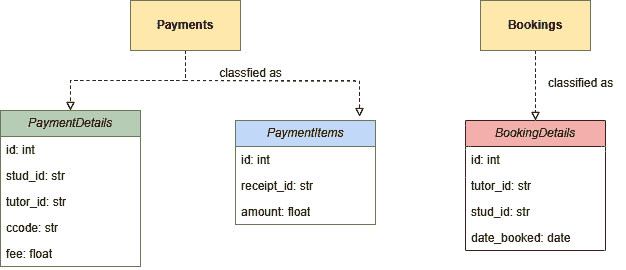

<st c="4372">图 7.1 – 付款和预订的 HBase 表设计</st>

<st c="4429">`<st c="4434">payments</st>` <st c="4442">和</st> `<st c="4447">bookings</st>` <st c="4455">上下文表示 HBase 数据库的两个表。</st> `<st c="4515">payments</st>` <st c="4523">表有两个列族，即</st> `<st c="4562">PaymentDetails</st>` <st c="4576">和</st> `<st c="4581">PaymentItems</st>`<st c="4593">。`<st c="4599">bookings</st>` <st c="4607">表有一个列族，即</st> `<st c="4629">BookingDetails</st>`<st c="4651">。</st>

<st c="4652">请注意</st> `<st c="4663">PaymentDetails</st>` <st c="4677">包含</st> `<st c="4682">id</st>`<st c="4684">,</st> `<st c="4686">stud_id</st>`<st c="4693">,</st> `<st c="4695">tutor_id</st>`<st c="4703">,</st> `<st c="4705">ccode</st>`<st c="4710">, 和</st> `<st c="4716">fee</st>` <st c="4719">作为列限定符，而</st> `<st c="4748">PaymentItems</st>` <st c="4760">包含</st> `<st c="4765">id</st>`<st c="4767">,</st> `<st c="4769">receipt_id</st>`<st c="4779">, 和</st> `<st c="4785">amount</st>`<st c="4791">。此外，</st> `<st c="4806">BookingDetails</st>` <st c="4820">包含</st> `<st c="4825">id</st>`<st c="4827">,</st> `<st c="4829">tutor_id</st>`<st c="4837">,</st> `<st c="4839">stud_id</st>`<st c="4846">, 和</st> `<st c="4852">date_booked</st>` <st c="4863">列。</st> <st c="4873">一个 JSON 格式的示例记录将看起来像这样：</st>

```py
 "payments": {
  "<st c="4940">details:id</st>": 1001, "<st c="4962">details:stud_id</st>": "STD-001",
  "<st c="4994">details:tutor_id</st>": "TUT-001", "<st c="5027">details:ccode</st>": "PY-100",
  "<st c="5056">details:fee</st>": 5000.00", "<st c="5083">items:id</st>": 1001,
  "<st c="5103">items:receipt_id</st>": "OR-901", "<st c="5135">items:amount</st>": 3000.00"
}
"bookings" : {
   "<st c="5179">details:id</st>": 101, "<st c="5200">details:tutor_id</st>": TUT-002",
   "<st c="5232">details:stud_id</st>": "STD-201",
   "<st c="5264">details:date_booked</st>": "2023-10-10"
}
```

<st c="5302">当通过 Flask 应用程序访问时，列限定符的实际名称是列族和列名本身的</st> *<st c="5382">连接</st>* <st c="5395">。</st> <st c="5445">给定记录的一个示例</st> <st c="5478">是</st> `<st c="5481">details:stud_id</st>`<st c="5496">。</st>

<st c="5497">现在我们已经设计了</st> <st c="5521">表结构，让我们看看我们如何安装和配置 Apache HBase 和 Apache Hadoop 平台。</st> <st c="5636">我们将从</st> <st c="5651">使用 Java 开始。</st>

## <st c="5662">设置基本要求</st>

<st c="5699">Apache HBase 是一个基于 Java 的平台，并且所有</st> <st c="5746">其组件</st> <st c="5761">都依赖于</st> `<st c="5933">JAVA_HOME</st>` <st c="5942">系统环境变量在您的 Windows、Linux 或 macOS 环境中，并更新</st> `<st c="6027">CLASSPATH</st>` <st c="6036">以帮助 HBase 访问 Java 的</st> `<st c="6085">/bin</st>` <st c="6089">文件夹中的 JDK 命令，以便它可以执行服务器启动和</st> <st c="6139">关闭操作。</st>

<st c="6159">由于 Apache HBase</st> <st c="6178">是一个使用</st> `<st c="6255">hadoop-3.3.6/hadoop-3.3.6.tar.gz</st>` <st c="6287">文件（来自 [<st c="6298">https://hadoop.apache.org/releases.html</st>](https://hadoop.apache.org/releases.html)）<st c="6337">并将其解压缩到与 HBase 安装文件夹相同的本地驱动器上。</st> <st c="6415">创建一个</st> `<st c="6424">HADOOP_HOME</st>` <st c="6435">文件，并更新操作系统的</st> `<st c="6456">CLASSPATH</st>` <st c="6465">变量，以便在启动时使 Hadoop</st> `<st c="6518">/bin</st>` <st c="6522">命令对 HBase 可用。</st> <st c="6567">让我们简要了解一下 Apache Hadoop 框架，以便更好地理解。</st>

## <st c="6648">配置 Apache Hadoop</st>

<st c="6674">Apache Hadoop 是一个基于 Java 的</st> <st c="6704">框架，它管理着分布式集群设置中的可扩展大数据处理。</st> <st c="6793">它因其</st> *<st c="6818">MapReduce</st>* <st c="6827">算法而流行，该算法在节点集群上并行执行数据处理，使框架的分布式操作快速。</st> <st c="6962">此外，该</st> <st c="6975">框架具有</st> **<st c="6990">HDFS</st>** <st c="6994">文件系统。</st> <st c="7009">这是它包含输入和</st> <st c="7049">输出数据集的地方。</st>

<st c="7065">The</st> *<st c="7070">MapReduce</st>* <st c="7079">过程始于这些大数据集通过 Flask 应用程序存储在 HDFS 中。</st> <st c="7166">它们通过内部 Hadoop 服务器传递，这些服务器运行 <st c="7232">Map()</st> <st c="7237">函数，将数据分解成键值对的元组。</st> <st c="7303">然后，这些键值数据块组经过另一个称为 <st c="7378">Reduce()</st><st c="7386"> 的过程，由其他 Hadoop 服务器执行。</st> <st c="7432">这将这些数据块暴露给各种 reduce 函数，如求和、平均、连接、压缩、排序和洗牌，然后将其作为输出数据集 <st c="7614">存储在 HDFS 中。</st>

<st c="7622">除了</st> *<st c="7638">MapReduce</st>* <st c="7647">分布式数据处理之外，HBase 需要使用 Hadoop 的 HDFS，因为它为 HBase 平台提供了高延迟的批量处理操作。</st> <st c="7788">作为回报，HBase 允许读写事务访问存储在 HDFS 中的数据，并且可以提供一个 thrift 服务器，以便第三方应用程序可以访问</st> <st c="7951">大数据集。</st>

<st c="7964">重要提示</st>

<st c="7979">一个</st> *<st c="7982">Thrift 服务器</st>* <st c="7995">是 HBase 中一个兼容 Hive 的接口，它支持多语言，允许使用 Python、Java、C#、C++、NodeJS、Go、PHP 和 JavaScript 开发的应用程序访问大数据。</st> <st c="8183">另一方面，术语</st> *<st c="8192">Hive</st>*<st c="8196">指的是运行在 Hadoop 之上并具有强大 SQL 工具的客户端应用程序，这些工具用于实现大型数据集的 CRUD 操作。</st>

<st c="8368">以下是使用单节点集群设置 Hadoop 平台的步骤：</st>

1.  <st c="8458">前往</st> *<st c="8492">Apache Hadoop 3.3.6</st>* <st c="8511">的安装文件夹，并打开</st> `<st c="8521">/etc/hadoop/core-site.xml</st>`<st c="8546">。然后，设置</st> `<st c="8562">fs.defaultFS</st>` <st c="8574">属性。</st> <st c="8585">这表示集群中</st> *<st c="8624">NameNode</st>* <st c="8632">(主节点)的默认位置 – 在我们的案例中，是默认的</st> <st c="8688">文件系统。</st> <st c="8701">它的值是一个 URL 地址，DataNode</st> <st c="8737">（从节点）将向其发送心跳。</st> *<st c="8782">NameNode</st>* <st c="8790">包含存储在 HDFS 中的数据的元数据，而</st> *<st c="8847">DataNode</st>* <st c="8855">包含大数据集。</st> <st c="8883">以下是我们的</st> `<st c="8895">core-site.xml</st>` <st c="8908">文件：</st>

    ```py
     <configuration>
        <property> <st c="8942"><name>fs.defaultFS</name></st><st c="8967"><value>hdfs://localhost:9000</value></st> </property>
    </configuration>
    ```

1.  <st c="8438">在同一个安装文件夹内，创建一个名为</st> `<st c="9101">data</st>` <st c="9105">的自定义文件夹，其中包含两个子文件夹，分别命名为</st> `<st c="9134">datanode</st>` <st c="9142">和</st> `<st c="9147">namenode</st>`<st c="9155">，如图 7.2 所示**<st c="9169">**<st c="9177">.2</st>**<st c="9179">。这些文件夹最终将包含</st> *<st c="9246">DataNode</st>* <st c="9254">和</st> *<st c="9259">NameNode</st>*<st c="9267">的配置文件，分别：</st>

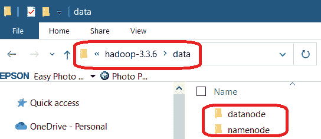

<st c="9388">图 7.2 – DataNode 和 NameNode 配置文件夹</st>

1.  <st c="9441">接下来，打开</st> `<st c="9453">/etc/hadoop/hdfs-site.xml</st>` <st c="9478">并声明新创建的</st> `<st c="9509">datanode</st>` <st c="9517">和</st> `<st c="9522">namenode</st>` <st c="9530">文件夹作为各自节点的最终配置位置。</st> <st c="9596">此外，将</st> `<st c="9610">dfs.replication</st>` <st c="9625">属性设置为</st> `<st c="9638">1</st>` <st c="9639">，因为我们只有一个节点</st> <st c="9673">集群用于我们的</st> *<st c="9689">Tutor Finder</st>* <st c="9701">项目。</st> <st c="9711">以下是我们的</st> `<st c="9723">hdf-site.xml</st>` <st c="9735">文件：</st>

    ```py
     <configuration>
     <property> <st c="9769"><name>dfs.replication</name></st><st c="9797"><value>1</value></st> </property>
       <property> <st c="9838"><name>dfs.namenode.name.dir</name></st><st c="9872"><value></st><st c="9880">file:///C:/Alibata/Development/Database/hadoop-3.3.6/data/namenode</value></st> </property>
       <property> <st c="9979"><name>dfs.datanode.data.dir</name></st><st c="10013"><value></st><st c="10021">file:///C:/Alibata/Development/Database/hadoop-3.3.6/data/datanode</value></st> </property>
    </configuration>
    ```

1.  <st c="10125">由于我们的项目将使用安装在 Windows 上的 Hadoop，请从</st> `<st c="10195">hadoop-3.3.6-src.tar.gz</st>` <st c="10218">文件从</st> `<st c="10229">https://hadoop.apache.org/releases.html</st>` <st c="10268">下载并使用 Maven 编译 Hadoop 源文件以生成 Windows 的 Hadoop 二进制文件，例如</st> `<st c="10366">winutils.exe</st>`<st c="10378">,</st> `<st c="10380">hadoop.dll</st>`<st c="10390">, 和</st> `<st c="10396">hdfs.dll</st>`<st c="10404">。将这些文件放入</st> `<st c="10432">/</st>``<st c="10433">bin</st>` <st c="10436">文件夹。</st>

1.  <st c="10444">通过在命令行运行以下命令来格式化新的活动</st> *<st c="10467">NameNode</st>*<st c="10475">(s)：</st>

    ```py
     hdfs namenode -format
    ```

    <st c="10555">此命令将清理</st> *<st c="10587">NameNode</st>*<st c="10595">(s) 如果它们有现有的</st> <st c="10622">存储元数据。</st>

<st c="10638">现在，我们可以开始设置</st> <st c="10664">一个与 Apache</st> <st c="10724">Hadoop 3.3.6 兼容的 Apache HBase 版本。</st>

## <st c="10737">配置 Zookeeper 和 Apache HBase</st>

<st c="10776">Apache HBase 在运行其集群时依赖于 Apache Zookeeper</st> <st c="10797">，因此下一步是安装和配置一个 Zookeeper 服务器。</st> **<st c="10910">Apache Zookeeper</st>** <st c="10926">是一个高性能服务，通过提供同步和集中式服务来管理分布式和基于云的应用程序，并维护这些应用程序的详细信息。</st> <st c="11110">请注意，此项目使用与 HBase 捆绑的 Zookeeper，因此除非设置涉及</st> <st c="11244">多个集群</st>，否则您不应单独安装 Zookeeper。

<st c="11262">现在，下载</st> *<st c="11277">Apache HBase 2.5.5</st>*<st c="11295">，与 Apache Hadoop 3.3.6 最兼容的 HBase 发行版，到 Apache Hadoop 3.3.6。</st> <st c="11361">将其解压到 Hadoop 所在的文件夹。</st> <st c="11406">然后，通过执行以下步骤来配置 HBase：</st>

1.  首先，创建一个<st c="11462">系统环境变量</st> `<st c="11480">HBASE_HOME</st>` <st c="11490">来注册 HBase</st> <st c="11544">安装文件夹。</st>

1.  <st c="11564">在安装文件夹内创建两个文件夹，</st> `<st c="11616">hbase</st>` <st c="11621">和</st> `<st c="11626">zookeeper</st>`<st c="11635">。这些将分别作为 HBase 和内置 Zookeeper</st> <st c="11710">服务器的根文件夹。</st>

1.  <st c="11731">在安装文件夹中，打开</st> `<st c="11769">/conf/hbase-site.xml</st>`<st c="11789">。在此，设置</st> `<st c="11805">hbase.rootdir</st>` <st c="11818">属性，使其指向</st> `<st c="11853">hbase</st>` <st c="11858">文件夹，并设置</st> `<st c="11874">hbase.zookeeper.property.dataDir</st>` <st c="11906">属性，使其指向</st> `<st c="11941">zookeeper</st>` <st c="11950">文件夹。</st> <st c="11959">现在，注册</st> `<st c="11977">hbase.zookeeper.quorum</st>` <st c="11999">属性。</st> <st c="12010">这将指示 Zookeeper 服务器的主机。</st> <st c="12058">然后，设置</st> `<st c="12072">hbase.cluster.distributed</st>` <st c="12097">属性。</st> <st c="12108">这将指定 HBase 服务器设置的类型。</st> <st c="12158">以下是我们</st> `<st c="12179">hbase-site.xml</st>` <st c="12193">文件：</st>

    ```py
     <configuration>
      <property> <st c="12227"><name>hbase.cluster.distributed</name></st><st c="12265"><value>false</value></st> </property>
      <property> <st c="12310"><name>hbase.tmp.dir</name></st><st c="12336"><value>./tmp</value></st> </property>
      <property> <st c="12380"><name>hbase.rootdir</name></st><st c="12406"><value></st><st c="12414">file:///C:/Alibata/Development/Database/hbase-2.5.5/hbase</value></st> </property>
     <property> <st c="12504"><name>hbase.zookeeper.property.dataDir</name></st><st c="12549"><value></st><st c="12557">/C:/Alibata/Development/Database/hbase-2.5.5/zookeeper</value></st> </property>
     <property> <st c="12644"><name>hbase.zookeeper.quorum</name></st><st c="12679"><value>localhost</value></st> </property>
       … … … … … …
    </configuration>
    ```

1.  <st c="12744">接下来，打开</st> `<st c="12756">/bin/hbase.cmd</st>` <st c="12770">如果您使用的是 Windows，并搜索</st> `<st c="12811">java_arguments</st>` <st c="12825">属性。</st> <st c="12836">删除</st> `<st c="12843">%HEAP_SETTINGS%</st>` <st c="12858">以便新的声明将是</st> <st c="12893">如下所示：</st>

    ```py
     set java_arguments=%HBASE_OPTS% -classpath "%CLASSPATH%" %CLASS% %hbase-command-arguments%
    ```

1.  <st c="12995">打开</st> `<st c="13001">/conf/hbase-env.cmd</st>` <st c="13020">并添加</st> <st c="13028">以下</st> `<st c="13043">JAVA_HOME</st>` <st c="13052">和</st> `<st c="13057">HBASE_*</st>` <st c="13064">详细信息</st> <st c="13072">到</st> <st c="13076">文件：</st>

    ```py
     set JAVA_HOME=%JAVA_HOME%
    set HBASE_CLASSPATH=%HBASE_HOME%\lib\client-facing-thirdparty\*
    set HBASE_HEAPSIZE=8000
    set HBASE_OPTS="-Djava.net.preferIPv4Stack=true"
    set SERVER_GC_OPTS="-verbose:gc" <st c="13282">"-Xlog:gc*=info:stdout" "-XX:+UseG1GC"</st><st c="13320">"-XX:MaxGCPauseMillis=100" "-XX:-ResizePLAB"</st> %HBASE_GC_OPTS%
    set HBASE_USE_GC_LOGFILE=true
    set HBASE_JMX_BASE="-Dcom.sun.management.jmxremote.ssl=false" "-Dcom.sun.management.jmxremote.authenticate=false"
    set HBASE_MASTER_OPTS=%HBASE_JMX_BASE% "-Dcom.sun.management.jmxremote.port=10101"
    set HBASE_REGIONSERVER_OPTS=%HBASE_JMX_BASE% "-Dcom.sun.management.jmxremote.port=10102"
    set HBASE_THRIFT_OPTS=%HBASE_JMX_BASE% "-Dcom.sun.management.jmxremote.port=10103"
    set HBASE_ZOOKEEPER_OPTS=%HBASE_JMX_BASE% -Dcom.sun.management.jmxremote.port=10104"
    set HBASE_REGIONSERVERS=%HBASE_HOME%\conf\regionservers
    set HBASE_LOG_DIR=%HBASE_HOME%\logs
    set HBASE_IDENT_STRING=%USERNAME%
    set HBASE_MANAGES_ZK=true
    ```

    <st c="14017">我们的</st> *<st c="14022">导师寻找</st> <st c="14035">项目使用</st> *<st c="14049">Java JDK 11</st> <st c="14060">来运行 HBase 数据库服务器。</st> <st c="14095">因此，与 Java 1.8 一起工作的常规垃圾收集器现在已弃用且无效。</st> <st c="14184">对于使用 Java JDK 11 的 HBase 平台，最合适的 GC 选项是</st> <st c="14294">G1GC</st> <st c="14297">，以实现更好的服务器性能。</st>

1.  <st c="14302">最后，转到</st> `<st c="14322">/bin</st>` <st c="14326">文件夹</st> <st c="14333">并运行</st> `<st c="14346">start-hbase</st>` <st c="14357">命令</st> <st c="14365">以启动服务器。</st> *<st c="14387">图 7</st>**<st c="14395">.3</st>* <st c="14397">显示了启动时的 HBase 日志快照：</st>

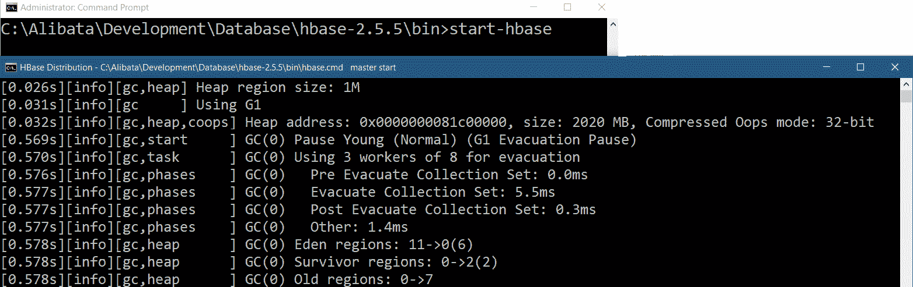

<st c="15289">图 7.3 – 启动 HBase 服务器</st>

1.  <st c="15330">要停止服务器，运行</st> `<st c="15355">stop-hbase</st>`<st c="15365">，然后</st> `<st c="15372">hbase master stop --</st>``<st c="15392">shutDownCluster</st>`<st c="15408">。</st>

<st c="15409">HBase 服务器日志，如</st> *<st c="15441">图 7</st>**<st c="15449">.4</st>*<st c="15451">所示，显示了 Zookeeper 服务器检索所有 Hadoop 配置文件以处理所有 Hadoop 集群并提供必要的</st> <st c="15588">操作服务：</st>

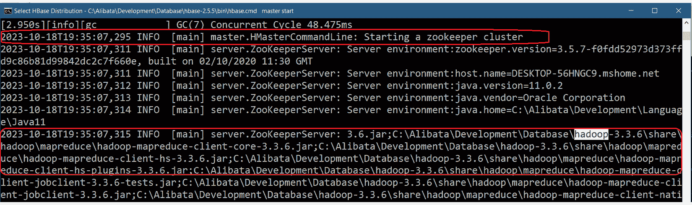

<st c="16885">图 7.4 – 使用 Hadoop 集群启动 Zookeeper</st>

<st c="16946">现在我们已经完成了</st> <st c="16966">这些服务器</st> <st c="16979">配置，让我们运行 HBase 客户端，以便我们可以创建我们的</st> `<st c="17049">支付</st>` <st c="17057">和</st> `<st c="17062">预订</st>` <st c="17070">表</st>。

## <st c="17078">设置 HBase 壳</st>

<st c="17105">Apache HBase 有一个内置的交互式</st> <st c="17145">shell 客户端，通过 Java 创建，可以与 HDFS 进行大数据通信。</st> <st c="17221">启动 shell 的命令是</st> `<st c="17255">hbase shell</st>`<st c="17266">。在 Apache HBase 2.5.5 中，运行此命令将给出以下</st> <st c="17339">错误信息</st>：

```py
 This file has been superceded by packaging our ruby files into a jar and using jruby's bootstrapping to invoke them. If you need to source this file for some reason it is now named 'jar-bootstrap.rb' and is located in the root of the file hbase-shell.jar and in the source tree at 'hbase-shell/src/main/ruby'.
```

<st c="17663">这个错误的背后原因是客户端壳缺少安装所需的 JAR 文件。</st> <st c="17772">因此，为了修复这个错误，从 Maven 仓库下载</st> `<st c="17804">jansi-1.18.jar</st>` <st c="17818">和</st> `<st c="17823">jruby-complete-9.2.13.0.jar</st>` <st c="17850">，并将它们放置在</st> `<st c="17899">/lib</st>` <st c="17903">目录中。</st> <st c="17915">然后，进入</st> `<st c="17931">/lib</st>` <st c="17935">文件夹，并运行以下命令以打开</st> <st c="17985">客户端壳</st>：

```py
 java -cp hbase-shell-2.5.5.jar;client-facing-thirdparty/*;* org.jruby.JarBootstrapMain
```

*<st c="18085">图 7</st>**<st c="18094">.5</st>* <st c="18096">显示了打开</st> <st c="18133">HBase 壳</st>的给定命令：

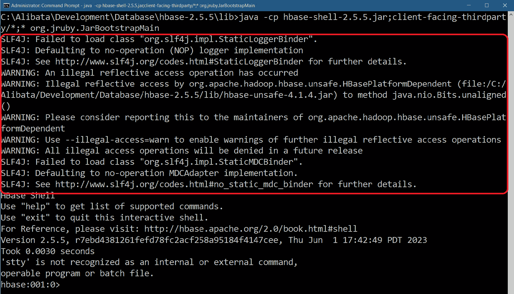

<st c="19652">图 7.5 – 调用 HBase 壳</st>

<st c="19689">日志中出现的警告是由于 Hadoop 的</st> `<st c="19789">/common/lib</st>` <st c="19800">和 HBase 的</st> `<st c="19813">/lib/client-facing-thirdparty</st>`<st c="19842">中的 SL4J 日志库冲突引起的。</st> <st c="19924">现在我们已经最终确定了表</st> <st c="19958">设计并设置了 HBase 环境，我们将构建</st> <st c="20017">HBase 表</st>。

## <st c="20030">创建 HBase 表</st>

<st c="20056">HBase 客户端应用程序</st> <st c="20085">提供了不同的命令，用于执行 HBase 数据集的管理、表、数据操作、集群相关和通用操作。</st> <st c="20227">它可以根据这些命令与 HBase 存储进行交互。</st> *<st c="20287">图 7</st>**<st c="20295">.6</st>* <st c="20297">显示了常见的通用命令，例如</st> `<st c="20345">whoami</st>`<st c="20351">，该命令检查已记录在 shell 中的用户信息，以及</st> `<st c="20424">version</st>`<st c="20431">，该命令指定正在运行的 HBase 的版本。</st> <st c="20483">它还显示了</st> `<st c="20501">status</st>` <st c="20507">命令，该命令指定服务器状态和平均负载值 – 即所有服务器中每个区域服务器跨所有服务器的平均区域数：</st>

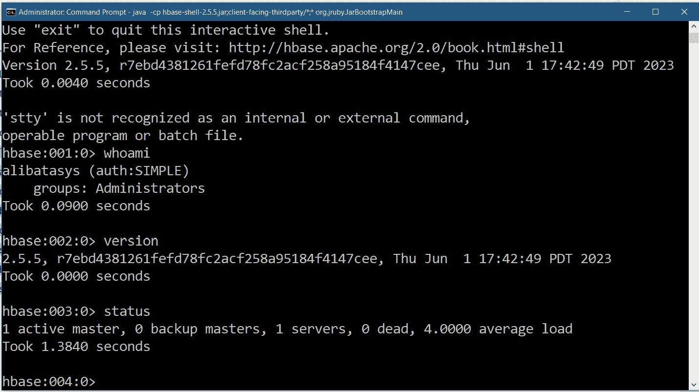

<st c="21320">图 7.6 – 运行通用的 HBase 命令</st>

<st c="21371">大多数企业应用程序依赖于 DBA</st> <st c="21412">进行表设计和创建。</st> <st c="21444">对于 HBase 数据库用户，数据模型器允许在每次服务器启动时生成应用程序的数据层表。</st> <st c="21571">但是，通常开发人员会在开发前使用 HBase shell 构建表。</st> <st c="21652">在我们的应用程序中，例如，</st> `<st c="21690">payments</st>` <st c="21698">和</st> `<st c="21703">bookings</st>` <st c="21711">表是使用 HBase 的</st> `<st c="21760">create</st>` <st c="21766">命令预先生成的。</st> *<st c="21776">图 7</st>**<st c="21784">.7</st>* <st c="21786">显示了如何使用</st> `<st c="21808">create</st>` <st c="21814">命令：</st>

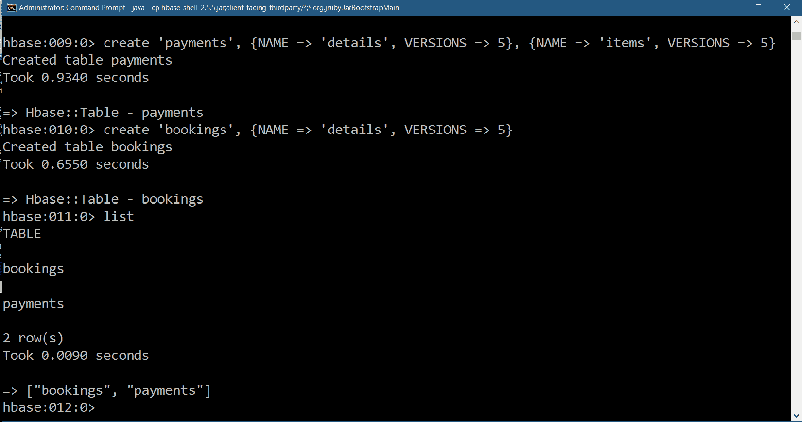

<st c="22250">图 7.7 – 使用创建和列表命令</st>

<st c="22297">要创建 HBase 表，请使用</st> `<st c="22332">create</st>` <st c="22338">命令并带有以下参数：</st>

+   <st c="22377">单引号或双引号表名（例如，</st> `<st c="22431">'bookings'</st>` <st c="22441">或</st> `<st c="22445">"payments"</st>`<st c="22455">）。</st>

+   <st c="22458">引号中的列族名称（或包含列族属性的字典），包括</st> `<st c="22563">NAME</st>` <st c="22567">和其他属性，如</st> `<st c="22597">VERSIONS</st>`<st c="22605">，它们的值都在引号中。</st>

*<st c="22639">图 7</st>**<st c="22648">.7</st>* <st c="22650">显示了使用</st> `<st c="22661">payments</st>` <st c="22669">表创建</st> <st c="22689">带有</st> `<st c="22699">details</st>` <st c="22706">和</st> `<st c="22711">items</st>` <st c="22716">列族，每个列族最多只有五个版本。</st> <st c="22777">`VERSIONS` <st c="22781">属性设置了可以施加在列族列上的最大更新数量。</st> <st c="22884">因此，如果`payments` <st c="22895">表将`VERSIONS` <st c="22914">设置为</st> `<st c="22930">5</st>`<st c="22931">，则其列族值允许的最大更新次数最多只有五次。</st> <st c="23036">分配给每个单元格存储的列限定符的时间戳追踪这些更新。</st>

<st c="23129">现在，要查看所有表格，请使用</st> `<st c="23167">list</st>` <st c="23171">命令。</st> <st c="23181">还有</st> `<st c="23199">describe</st>` <st c="23207">命令，您可以使用它来检查每个表格的元数据信息（例如，</st> `<st c="23297">describe "bookings"</st>`<st c="23316">）。</st> <st c="23320">要删除一个表格，首先禁用该表格（例如，</st> `<st c="23375">disable "bookings"</st>`<st c="23393">），然后再删除它（例如，通过</st> `<st c="23433">drop "bookings"</st>`<st c="23448">）。</st>

<st c="23451">在 HBase 存储中创建表格后</st> <st c="23477">，我们可以将我们的 HBase 数据库集成到我们的</st> <st c="23541">Flask 应用程序中。</st>

## <st c="23559">建立 HBase 连接</st>

<st c="23592">许多现代 Python 库可以将 HBase 集成到 Flask 中，这些库是专有的，例如</st> <st c="23621">这个 CData Python 驱动程序（</st>[<st c="23709">https://www.cdata.com/drivers/hbase/download/python/</st>](https://www.cdata.com/drivers/hbase/download/python/)<st c="23762">），它可以利用 SQLAlchemy 来管理 HBase 存储。</st> <st c="23820">但是，在</st> *<st c="23879">PyPI</st>* <st c="23883">仓库中有一个可靠且流行的 Python 驱动程序，可以将任何 Python 应用程序集成到 Hbase 中：`HappyBase`库。</st>

<st c="23971">`<st c="23976">happybase</st>` <st c="23985">模块是一个标准的 Python 库，它使用</st> *<st c="24036">Python Thrift</st>* <st c="24049">库通过</st> *<st c="24101">Thrift</st>* <st c="24107">服务连接到任何 HBase 数据库，该服务已经是 Apache HBase</st> <st c="24159">2.5.5 平台的一部分。</st>

<st c="24174">要使用</st> `<st c="24190">happybase</st>` <st c="24199">模块，请使用</st> `<st c="24229">pip</st>` <st c="24232">命令安装：</st>

```py
 pip install happybase
```

<st c="24263">为了</st> *<st c="24268">Tutor Finder</st>* <st c="24280">建立与 HBase 的连接并创建多个线程以重用连接，`<st c="24406">__init__.py</st>` <st c="24417">中的应用程序工厂函数必须从 `<st c="24430">ConnectionPool</st>` <st c="24444">模块中导入</st> `<st c="24454">happybase</st>` <st c="24463">，并提供 Thrift 网关的</st> `<st c="24490">主机</st>` <st c="24494">和</st> `<st c="24499">端口</st>` <st c="24503">值，以及池中的连接数。</st> <st c="24584">以下脚本显示了初始化</st> `<st c="24678">happybase</st>` <st c="24687">设置的</st> `<st c="24645">create_app()</st>`<st c="24657">应用程序工厂函数：</st>

```py
 from flask import Flask
import toml <st c="24731">import happybase</st> def create_app(config_file):
    app = Flask(__name__)
    app.config.from_file(config_file, toml.load) <st c="24844">global pool</st><st c="24855">pool = happybase.ConnectionPool(size=5,</st> <st c="24895">host='localhost', port=9090)</st> with app.app_context():
        import modules.api.hbase.payments
        import modules.api.hbase.bookings
```

<st c="25016">HBase 平台的入口点是</st> `<st c="25062">Connection</st>` <st c="25072">类。</st> <st c="25080">`<st c="25084">Connection</st>` <st c="25094">类通过 Thrift 服务创建一个到 HBase 数据库的开放套接字。</st> <st c="25174">但是</st> `<st c="25178">ConnectionPool</st>` <st c="25192">比单个</st> `<st c="25232">Connection</st>` <st c="25242">实例提供更快的访问速度，尤其是在 Flask 应用程序处于异步模式时。</st> <st c="25314">唯一的要求是应用程序使用一个</st> `<st c="25367">with</st>` <st c="25371">上下文管理器</st>来为连接池生成一个</st> `<st c="25423">Connection</st>` <st c="25433">实例，分配一个线程给它，并在事务结束时处理线程，最终将连接的状态返回到</st> `<st c="25540">池中</st>` <st c="25567">。</st>

<st c="25576">让我们使用</st> `<st c="25587">ConnectionPool</st>` <st c="25601">来构建</st> `<st c="25615">仓库层</st>。</st>

## <st c="25632">构建仓库层</st>

<st c="25662">从</st> `<st c="25667">ConnectionPool</st>` <st c="25681">实例</st> <st c="25690">中</st> `<st c="25696">create_app()</st>` <st c="25708">提供的</st> `<st c="25722">Connection</st>` <st c="25732">实例</st> <st c="25781">实现了 CRUD 事务。</st> <st c="25796">但它需要一个</st> `<st c="25800">with</st>` <st c="25828">上下文管理器</st>来生成一个</st> `<st c="25838">Connection</st>` <st c="25838">实例</st> 或从池中重用连接状态，以便线程可以使用</st> `<st c="25949">happybase</st>` <st c="25958">实用方法</st> <st c="25976">运行 CRUD 事务。</st> <st c="25976">以下脚本显示了使用</st> `<st c="26038">ConnectionPool</st>` <st c="26052">实例</st> 来实现</st> `<st c="26105">payments</st>` <st c="26113">表</st> 的 CRUD 事务的仓库类：</st>

```py
 from typing import Dict, List, Any <st c="26156">from happybase import Table</st> class PaymentRepository:
    def __init__(self, <st c="26228">pool</st>): <st c="26236">self.pool = pool</st> def upsert_details(self, rowkey, tutor_id, stud_id, ccode, fee) -> bool:
        record = <st c="26335">{'details:id' : str(rowkey),</st> <st c="26363">'details:tutor_id': tutor_id, 'details:stud_id':</st> <st c="26412">stud_id, 'details:course_code': ccode,</st> <st c="26451">'details:total_package': str(fee)}</st> try: <st c="26492">with self.pool.connection() as conn:</st><st c="26528">tbl:Table = conn.table("payments")</st><st c="26563">tbl.put(row=str(rowkey).encode('utf-8'),</st> <st c="26604">data=record)</st> return True
        except Exception as e:
            print(e)
        return False
```

`<st c="26674">The</st>` `<st c="26679">PaymentRepository</st>` `<st c="26696">类需要一个`<st c="26714">ConnectionPool</st>` `<st c="26728">实例（`<st c="26739">pool</st>`）`作为其构造函数参数以进行实例化。</st> `<st c="26796">该`<st c="26800">pool</st>` `<st c="26804">对象有一个`<st c="26818">connection()</st>` `<st c="26830">方法，它返回一个 HBase 连接，该连接提供了`<st c="26889">happybase</st>` `<st c="26898">实用方法，用于 CRUD 事务。</st>` `<st c="26938">借助线程的帮助，连接对象有一个`<st c="26993">table()</st>` `<st c="27000">实用方法，它访问 HBase 表并返回一个`<st c="27053">Table</st>` `<st c="27058">对象，该对象提供了一些方法来执行数据库事务，例如`<st c="27138">put()</st>` `<st c="27143">。</st>

`<st c="27144">The</st>` `<st c="27149">put()</st>` `<st c="27154">方法执行了` *<st c="27176">INSERT</st>` *和` *<st c="27187">UPDATE</st>` *事务。它需要`<st c="27220">rowkey</st>`作为其主要参数，以便以字典格式插入记录。</st> `<st c="27297">字典记录由一个` *<st c="27333">列限定符-值对</st>` *组成，其中所有值都应该是字节字符串或任何转换为`<st c="27435">bytes</st>`的类型的值。</st> `<st c="27472">此外，`<st c="27478">rowkey</st>` `<st c="27484">应始终是字节字符串。</st>` `<st c="27517">给定的`<st c="27527">upsert_details()</st>` `<st c="27543">将支付记录插入到 HBase 数据库的`<st c="27577">payments</st>` `<st c="27585">表`中。</st>

除了`<st c="27614">put()</st>`之外，`<st c="27637">Table</st>`对象还有一个`<st c="27656">delete()</st>`方法，它使用其`<st c="27704">rowkey</st>`来删除记录。以下`<st c="27726">delete_payment_details()</st>``<st c="27750">函数`<st c="27763">PaymentRepository</st>``<st c="27780">突出了从`<st c="27831">payments</st>``<st c="27839">表`中删除的支付详情：</st>

```py
 def delete_payment_items(self, rowkey) -> bool:
        try: <st c="27900">with self.pool.connection() as conn:</st><st c="27936">tbl:Table = conn.table("payments")</st><st c="27971">tbl.delete(rowkey.encode('utf-8'),</st> <st c="28006">columns=["items"])</st> return True
        except Exception as e:
            print(e)
        return False
```

`<st c="28082">除了`<st c="28094">rowkey</st>`之外，`<st c="28106">delete()</st>` `<st c="28114">方法` `<st c="28121">需要其`<st c="28177">columns</st>` `<st c="28184">参数中的列族或列族的名称，这意味着删除整个记录。</st>` `<st c="28235">但有时，删除只需要删除列限定符（s）或列（s）而不是整个行，这样只有列限定符名称（s）出现在`<st c="28401">columns</st>` `<st c="28408">参数中。</st>`

<st c="28419">`<st c="28424">Table</st>` <st c="28429">对象有一个`<st c="28443">rows()</st>` <st c="28449">方法，该方法返回一个`<st c="28472">Tuple</st>` <st c="28477">值或元组列表，每个元组包含`<st c="28519">rowkey</st>` <st c="28525">和以`<st c="28544">bytes</st>`<st c="28549">形式存储的记录。</st> 此方法有两个参数，即搜索中数据记录的`<st c="28587">行键</st>` <st c="28594">和`<st c="28599">列族或列族</st>` <st c="28624">。</st> 这里，`<st c="28666">select_records_ids()</st>` <st c="28686">根据所选行键列表和一些指定的列族返回支付记录列表：</st>

```py
 def select_records_ids(self, rowkeys:List[str], cols:List[str] = None):
        try: <st c="28872">with self.pool.connection() as conn:</st> tbl:Table = conn.table("payments")
                if cols == None or len(cols) == 0: <st c="28979">rowkeys = tbl.rows(rowkeys)</st><st c="29006">rows = [rec[1] for rec in rowkeys]</st> else: <st c="29048">rowkeys = tbl.rows(rowkeys, cols)</st><st c="29081">rows = [rec[1] for rec in rowkeys]</st> records = list() <st c="29134">for r in rows:</st><st c="29148">records.append({key.decode():value.decode()</st> <st c="29192">for key, value in r.items()})</st> return records
        except Exception as e:
            print(e)
        return None
```

<st c="29281">`<st c="29286">rows()</st>` <st c="29292">方法返回一个</st> `<st c="29310">Tuple</st>` <st c="29315">值或包含</st> *<st c="29347">行键</st>* <st c="29354">作为第一个元素和</st> *<st c="29384">字典格式的记录</st>* <st c="29391">作为第二个元素的元组。</st> <st c="29436">因此，我们只需要使用列表推导来移动字典部分，如代码所示。</st> <st c="29537">此外，解码每个字段字典将避免在 Flask 生成响应时的 JSON 错误。</st>

<st c="29641">对于其输入，`<st c="29661">select_records_ids()</st>` <st c="29681">函数可以接受包含搜索中记录行键的 JSON 请求，如下所示：</st> <st c="29769">这里：</st>

```py
 { <st c="29783">"rowkeys": ["1", "2", "101"],</st> "cols": []
}
```

<st c="29825">或者，它还可以接受行键和列族，例如以下</st> <st c="29924">请求数据：</st>

```py
 {
    "rowkeys": ["1", "2", "101"], <st c="29970">"cols": ["details"]</st> }
```

<st c="29991">它还可以接受需要在搜索输出中出现的特定列限定符，如下面的代码所示：</st> <st c="30095">以下代码：</st>

```py
 {
    "rowkeys": ["1", "2", "101"], <st c="30143">"cols": ["details:stud_id", "details:tutor_id",</st> <st c="30190">"details:course_code"]</st> }
```

<st c="30215">在`<st c="30253">happybase</st>` <st c="30262">模块中检索数据的另一种方法是使用`<st c="30285">scan()</st>` <st c="30291">方法，该方法返回一个元组的生成器——类似于`<st c="30365">rows()</st>`<st c="30371">返回的元组。</st> 这里，`<st c="30379">select_all_records()</st>` <st c="30399">展示了如何使用`<st c="30417">scan()</st>` <st c="30423">检索所有</st> `<st c="30444">支付记录：</st>`

```py
 def select_all_records(self):
        records = []
        try: <st c="30509">with self.pool.connection() as conn:</st> tbl:Table = conn.table("payments") <st c="30581">datalist = tbl.scan(columns=['details',</st> <st c="30620">'items'])</st><st c="30630">for key, data in datalist:</st><st c="30657">data_str = {k.decode(): v.decode() for</st> <st c="30696">k, v in data.items()}</st> records.append(data_str)
                return records
        except Exception as e:
            print(e)
        return records
```

<st c="30805">该方法需要一个</st> `<st c="30828">for</st>` <st c="30831">循环来从生成器中提取所有这些记录并解码所有详细信息，包括列限定符作为键和每个键的值，然后将它们添加到列表中。</st> <st c="31017">这种检索比使用许多列表和字典推导使用`<st c="31118">rows()</st>`<st c="31124">`消耗的运行时间更少。</st>

<st c="31125">使用</st> <st c="31143">`scan()`</st> <st c="31159">而不是</st> <st c="31171">`rows()`</st> 的另一个优点是其高级功能，可以通过列上的谓词条件来过滤记录，类似于 SQL 语句中的 `<st c="31276">WHERE</st>` <st c="31281">子句。</st> <st c="31309">以下查询事务检索所有具有特定</st> *<st c="31387">导师 ID</st>* <st c="31395">的支付记录，该 ID 由</st> <st c="31409">客户指定：</st>

```py
 def select_records_tutor(self, tutor_id):
   records = []
   try: <st c="31481">with self.pool.connection() as conn:</st> tbl:Table = conn.table("payments") <st c="31553">datalist = tbl.scan(columns=["details", "items"],</st> <st c="31602">filter="SingleColumnValueFilter('details',</st> <st c="31645">'tutor_id', =,'binary:{}')".format(tutor_id))</st><st c="31691">for key, data in datalist:</st><st c="31718">data_str = {k.decode(): v.decode() for k, v in</st> <st c="31765">data.items()}</st><st c="31779">records.append(data_str)</st> return records
   except Exception as e:
       print(e)
   return records
```

<st c="31866">`scan()`</st> <st c="31871">方法有一个</st> <st c="31877">`filter`</st> <st c="31891">参数，它接受一个</st> *<st c="31923">过滤字符串</st>* <st c="31936">，该字符串构成</st> *<st c="31954">过滤类</st>* <st c="31966">及其</st> *<st c="31975">构造函数参数</st>*<st c="31996">，这将简化搜索。</st> <st c="32032">`filter`</st> <st c="32042">参数指示要实例化哪个过滤类以构建适当的搜索约束。</st> <st c="32141">给定的</st> `<st c="32151">select_records_tutor()</st>` <st c="32173">函数使用</st> `<st c="32188">SingleColumnValueFilter</st>`<st c="32211">，它根据提供给</st> *<st c="32273">列族</st>*<st c="32286">，*<st c="32288">列限定符</st>*<st c="32304">，*<st c="32306">条件运算符</st>*<st c="32326">，以及</st> `<st c="32332">BinaryComparator (二进制)</st>`<st c="32357">的值约束来过滤行。</st> 除了 `<st c="32370">SingleColumnValueFilter</st>`<st c="32393">之外，这里还有一些广泛使用的过滤类类型，可以为 `<st c="32487">scan()</st>` <st c="32493">方法创建搜索条件：</st>

+   `<st c="32501">RowFilter</st>`<st c="32511">：接受一个比较运算符和所需的比较器（例如，`<st c="32587">ByteComparator</st>`<st c="32601">，`<st c="32603">RegexStringComparator</st>`<st c="32624">，等等），用于将指示值与每一行的键进行比较。</st>

+   `<st c="32693">QualifierFilter</st>`<st c="32709">：接受一个条件运算符和所需的比较器（例如，`<st c="32786">ByteComparator</st>`<st c="32800">，`<st c="32802">RegexStringComparator</st>`<st c="32823">，等等），用于将每一行的列限定符名称与给定的值进行比较。</st>

+   `<st c="32913">ColumnRangeFilter</st>`<st c="32931">：接受最小范围列和最大范围列，然后检查指示值是否位于列值范围内。</st>

+   `<st c="33069">ValueFilter</st>`<st c="33081">：接受一个条件运算符和所需的比较器，用于将值与每一字段的值进行比较。</st>

<st c="33192">除了</st> `<st c="33204">BinaryComparator</st>`<st c="33220">之外，其他提供转换和比较方法的比较器，用于过滤类，包括</st> `<st c="33310">BinaryPrefixComparator</st>`<st c="33332">、</st> `<st c="33334">RegexStringComparator</st>`<st c="33355">、</st> `<st c="33357">和</st> `<st c="33361">SubStringComparator</st>`<st c="33380">。</st>

在下一节中，我们将应用<st c="33381">`PaymentsRepository`</st> <st c="33415">以便我们可以在`payments` <st c="33500">表</st>中存储和检索支付详情。</st>

## <st c="33515">将仓库应用于 API 函数</st>

<st c="33554">以下 API 函数</st> <st c="33581">使用</st> `<st c="33587">upsert_details()`</st> <st c="33603">从</st> `<st c="33609">PaymentRepository</st>` <st c="33626">执行一个</st> *<st c="33641">INSERT</st> <st c="33647">事务</st>，在从客户端收到 JSON 请求数据后：</st>

```py
<st c="33710">from modules import pool</st>
<st c="33735">@current_app.post('/ch07/payment/details/add')</st> def add_payment_details():
    data = request.get_json() <st c="33836">repo = PaymentRepository(pool)</st><st c="33866">result = repo.upsert_details(data['id'],</st> <st c="33907">data['tutor_id'], data['stud_id'], data['ccode'],</st> <st c="33957">data['fee'])</st> if result == False:
        return jsonify(message="error encountered in payment details record insert"), 500
    return jsonify(message="inserted payment details record"), 201
```

<st c="34135">仓库的</st> `<st c="34153">select_all_records()</st>` <st c="34173">提供了以下</st> `<st c="34197">list_all_payments()</st>` <st c="34216">函数，用于渲染</st> `<st c="34235">所有来自`</st> `<st c="34261">payments</st>` <st c="34269">表的</st> `<st c="34235">记录：</st>

```py
<st c="34276">from modules import pool</st>
<st c="34301">@current_app.get('/ch07/payment/list/all')</st> def list_all_payments(): <st c="34370">repo = PaymentRepository(pool)</st><st c="34400">results = repo.select_all_records()</st> return jsonify(records=results), 201
```

<st c="34473">在这里，</st> `<st c="34480">pool</st>` <st c="34484">是</st> `<st c="34492">ConnectionPool</st>` <st c="34506">实例，该实例是在</st> `<st c="34540">create_app()</st>` <st c="34552">工厂中从</st> `<st c="34570">__init__.py</st>` <st c="34581">文件中的</st> `<st c="34594">modules</st>` <st c="34601">包创建的。</st>

<st c="34610">现在，为了使</st> `<st c="34620">happybase</st>` <st c="34629">工作，启动</st> *<st c="34652">thrift 服务器</st>**<st c="34665">。让我们在 HBase 平台上展示 Apache Thrift 框架。</st>

## <st c="34732">运行 thrift 服务器</st>

`<st c="35027">hbase thrift start</st>` <st c="35045">命令。</st> *<st c="35055">图 7</st>**<st c="35063">.8</st>* <st c="35065">显示了启动 thrift 服务器后的日志：</st>

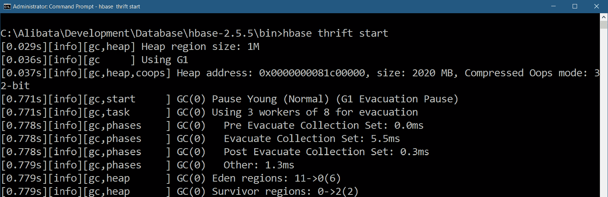

<st c="35871">图 7.8 – 运行内置的 HBase thrift 服务器</st>

<st c="35922">Apache Thrift 仅在 Apache HBase、Hadoop 和 Zookeeper 都运行时才会运行。</st>

<st c="36006">The</st> `<st c="36011">happybase</st>` <st c="36020">模块是非 Flask 特定的，这意味着任何 Python 客户端都可以使用它来连接到</st> `<st c="36110">HBase</st>` <st c="36115">服务器。</st> <st c="36124">考虑到 Python 库使用</st> *<st c="36235">Thrift 1</st>* <st c="36243">或</st> *<st c="36247">2</st>* <st c="36248">库来建立连接，thrift 服务器将始终在客户端和 HBase 之间建立桥梁。</st> <st c="36284">`happybase` <st c="36288">模块使用 Thrift</st> <st c="36297">1 库。</st>

<st c="36331">现在我们已经为 HBase 数据库创建了 Flask 仓库事务，让我们探索一种使用列和行进行</st> <st c="36478">数据存储的 NoSQL 存储。</st>

# <st c="36491">利用 Apache Cassandra 的列存储</st>

**<st c="36540">Apache Cassandra</st>** <st c="36557">是一个*<st c="36563">列族</st>* <st c="36576">NoSQL 数据库</st> <st c="36591">，也可以存储大量数据。</st> <st c="36610">HBase 可以通过自动分片在各个区域之间共享大数据，这使得 HBase 具有水平可扩展性。</st> <st c="36634">同样，Cassandra 支持水平添加更多节点以提高服务器吞吐量，这是水平扩展的一个特性。</st> <st c="36740">但是，在架构、表读写性能、数据</st> <st c="37004">建模方法以及</st> <st c="37029">查询</st> <st c="37035">语言方面，这两种存储之间也存在一些差异。</st>

<st c="37045">让我们首先设计我们的</st> `<st c="37075">课程</st>`<st c="37081">，</st> `<st c="37083">学位水平</st>`<st c="37095">，</st> `<st c="37097">学生</st>`<st c="37104">，以及</st> `<st c="37110">学生表现</st>` <st c="37122">Cassandra 表。</st>

## <st c="37140">设计 Cassandra 表</st>

<st c="37167">与 HBase 不同，Cassandra 按行存储其数据，将所有列字段分组，因此数据模型方法是一个*<st c="37283">列族</st>*<st c="37296">。其数据库事务是原子性、隔离性和持久性的，但具有最终</st> <st c="37376">或可调的一致性，因此它不提供类似关系数据库管理系统（</st> **<st c="37424">原子性、一致性、隔离性、持久性</st>** <st c="37469">(</st> **<st c="37471">ACID</st>** <st c="37475">)）的模型，如</st> **<st c="37491">关系数据库管理系统</st>** <st c="37528">(</st> **<st c="37530">RDBMS</st>** <st c="37535">)。</st> <st c="37539">有时，Cassandra 的配置更倾向于</st> <st c="37576">高可用性性能而不是原子性和</st> <st c="37625">隔离性事务。</st>

<st c="37647">该项目使用了</st> *<st c="37666">draw.io</st>* <st c="37673">来使用 UML 类图设计 Cassandra 中的表。</st> *<st c="37734">图 7.9</st>**<st c="37742">.9</st>* <st c="37744">显示了项目 Cassandra 数据存储的数据模型：</st> <st c="37794">数据存储：</st>

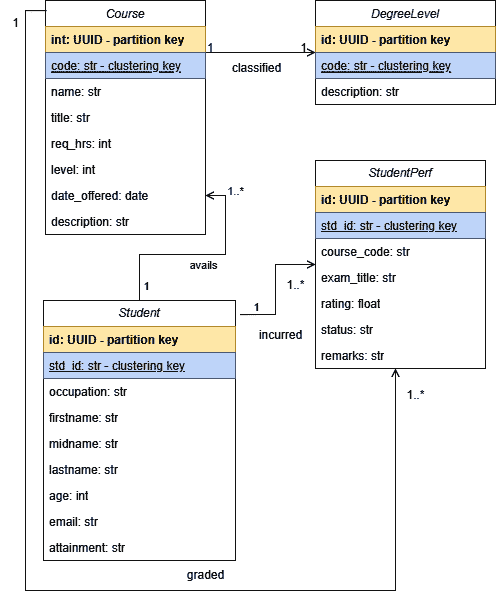

<st c="38370">图 7.9 – 使用 UML 设计的 Cassandra 表</st>

<st c="38416">每个 Cassandra 表都必须</st> <st c="38442">有一个主键。</st> <st c="38463">但是，与 RDBMS 不同，*<st c="38502">列族</st>* <st c="38515">存储中的主键至少有一个</st> *<st c="38541">分区键</st>* <st c="38554>和零个或多个</st> *<st c="38572">聚类键</st>*<st c="38587">。由于 Cassandra 存储运行在集群和节点分布的环境中，因此</st> *<st c="38674">分区键</st>* <st c="38687">将行数据均匀分布在集群存储中。</st> <st c="38750">另一方面，</st> *<st c="38773">聚类键</st>* <st c="38787">对表中的数据进行排序和管理。</st> <st c="38835">此外，查询事务的性能是表设计的最终依据；查询越快，设计就越好</st> <st c="38967">。</st>

<st c="38978">让我们安装 Apache Cassandra，以便我们可以实现我们的</st> <st c="39037">表设计。</st>

## <st c="39050">安装和配置 Apache Cassandra</st>

<st c="39094">在</st> [<st c="39141">https://cassandra.apache.org/_/download.html</st>](https://cassandra.apache.org/_/download.html)<st c="39185">下载 Apache Cassandra 的 ZIP 文件。3.x 及以下版本</st> **<st c="39191">通用可用性</st>** <st c="39211">(</st>**<st c="39213">GA</st>**<st c="39215">) 版本支持 Windows，但不支持 4.x 版本。</st> <st c="39240">由于项目使用的是 4.1.3 版本，因此必须使用安装了 WSL2 的 Windows PowerShell 来配置和运行</st> <st c="39389">服务器。</st>

<st c="39400">解压文件后，使用</st> `<st c="39464">sudo</st>` <st c="39468">命令启用 Ubuntu 防火墙：</st>

```py
 sudo ufw enable
```

<st c="39493">然后，使用以下</st> `<st c="39660">sudo</st>` <st c="39664">命令允许非 WSL 客户端访问端口</st> *<st c="39538">7000</st>* <st c="39542">(集群通信端口)，</st> *<st c="39577">9042</st>* <st c="39581">(客户端访问的默认端口)，以及</st> *<st c="39620">7199</st>* <st c="39624">(JMX 端口)：</st>

```py
 sudo ufw allow 7000
sudo ufw allow 9042
sudo ufw allow 7199
```

<st c="39734">Apache Cassandra 4.1.3 需要</st> *<st c="39767">Java 11</st>* <st c="39774">作为其虚拟机，因此运行以下</st> `<st c="39820">sudo</st>` <st c="39824">命令在 Ubuntu 环境中安装 Java SDK 11：</st>

```py
 sudo apt install openjdk-11-jdk
```

<st c="39914">之后，进入 Cassandra 安装文件夹的</st> `<st c="39932">/conf</st>` <st c="39937">目录并打开</st> `<st c="39996">jvm11-server.options</st>` <st c="40016">文件。</st> <st c="40023">注释掉所有</st> *<st c="40039">CMS</st>* <st c="40042">GC 选项的详细信息，并取消注释</st> *<st c="40075">G1GC</st>*<st c="40079">，这是 Java 11 的默认 GC 选项。</st>

<st c="40115">最后，从</st> `<st c="40160">/</st>``<st c="40161">conf</st>` <st c="40165">目录中运行以下命令：</st>

```py
 cassandra -f
```

<st c="40189">要关闭 Cassandra 服务器，请使用</st> `<st c="40233">nodetool</st>` `<st c="40242">drain</st>` <st c="40247">命令。</st>

<st c="40256">现在，让我们打开 Cassandra shell 客户端来创建</st> <st c="40309">项目的表，并学习</st> **<st c="40341">Cassandra 查询语言</st>** <st c="40365">(</st>**<st c="40367">CQL</st>**<st c="40370">) 命令。</st>

## <st c="40382">运行 CQL shell 客户端</st>

<st c="40411">Cassandra 4.1.3 有一个名为</st> `<st c="40625">cqlsh</st>` <st c="40630">的查询语言命令，位于</st> `<st c="40646">/conf</st>` <st c="40651">目录中。</st> *<st c="40663">图 7</st>**<st c="40671">.10</st>* <st c="40674">显示了打开</st> *<st c="40708">CQL</st>* *<st c="40712">shell</st>* <st c="40717">(</st>`<st c="40719">cqlsh</st>`<st c="40724">):</st>

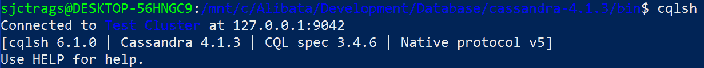

<st c="40952">图 7.10 – 运行 cqlsh 命令</st>

<st c="40991">CQL 有</st> `<st c="41130">create</st>` <st c="41136">|</st> <st c="41138">alter</st>` <st c="41143">|</st> `<st c="41146">drop keyspace</st>`<st c="41159">,</st> `<st c="41161">create</st>` <st c="41167">|</st> `<st c="41170">alter</st>` <st c="41175">|</st> `<st c="41178">drop table</st>`<st c="41188">,</st> `<st c="41190">use</st>`<st c="41193">, 和</st> `<st c="41199">truncate</st>` <st c="41207">语句。</st> <st c="41220">对于 DML，它有</st> `<st c="41236">insert</st>`<st c="41242">,</st> `<st c="41244">delete</st>`<st c="41250">,</st> `<st c="41252">update</st>`<st c="41258">, 和</st> `<st c="41264">batch</st>` <st c="41269">命令。</st> <st c="41280">对于查询事务，它使用 SQL 中的</st> `<st c="41320">select</st>` <st c="41326">子句。</st> <st c="41347">然而，</st> `<st c="41360">where</st>` <st c="41365">子句仅限于分区、聚簇和复合键。</st> <st c="41435">一些 CQL 命令以</st> <st c="41462">分号</st> 结尾。

<st c="41474">CQL 具有通用</st> <st c="41498">命令，例如</st> `<st c="41516">show version</st>`<st c="41528">,</st> `<st c="41530">expand</st>`<st c="41536">, 和</st> `<st c="41542">describe</st>`<st c="41550">。要检查所有集群，请运行</st> `<st c="41587">describe cluster</st>` <st c="41603">命令。</st> <st c="41613">要检查所有键空间，请运行</st> `<st c="41649">describe keyspaces</st>` <st c="41667">命令。</st> <st c="41677">要列出键空间中的所有表，请运行</st> `<st c="41723">describe tables</st>` <st c="41738">命令。</st> *<st c="41748">图 7</st>**<st c="41756">.11</st>* <st c="41759">显示了查看 Cassandra 数据存储的一系列 CQL 命令：</st>

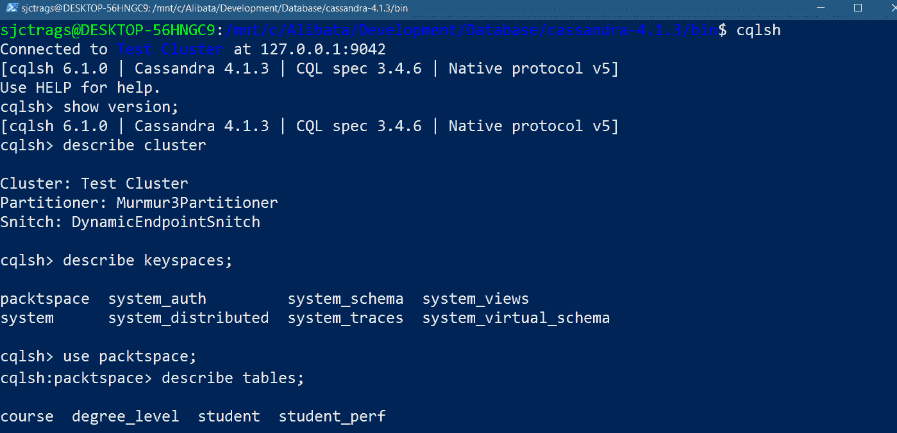

<st c="42521">图 7.11 – 运行 CQL 通用命令</st>

<st c="42571">在表上运行</st> `<st c="42584">describe</st>` <st c="42592">命令将返回 Cassandra 表的元数据描述，如图</st> *<st c="42681">图 7</st>**<st c="42689">.12</st>*<st c="42692">所示：</st>

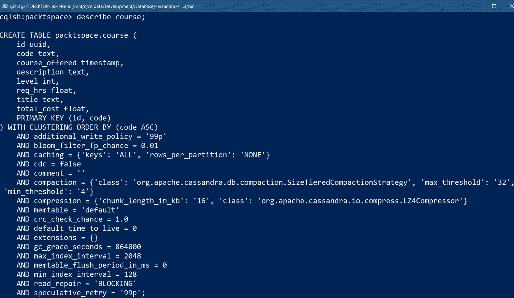

<st c="43661">图 7.12 – 在表上运行 describe 命令</st>

<st c="43713">一个</st> *<st c="43716">cluster</st>* <st c="43723">包含多个数据中心，一个</st> *<st c="43766">data center</st>* <st c="43777">可以有多个节点。</st> <st c="43807">每个</st> *<st c="43812">node</st>* <st c="43816">必须有一个键空间来存储所有表、物化视图、用户定义的类型、函数和聚合。</st> <st c="43929">因此，在使用 CQL shell 客户端构建项目表之前，你必须首先运行</st> `<st c="43998">create keyspace</st>` <st c="44013">命令。</st> <st c="44060">以下代码创建</st> `<st c="44087">packtspace</st>`<st c="44097">，它存储我们应用程序的表：</st>

```py
 CREATE KEYSPACE packtspace WITH replication = {'class': 'NetworkTopologyStrategy', 'datacenter1': '1'}  AND durable_writes = false;
```

<st c="44272">所使用的复制策略称为</st> *<st c="44277">replication strategy</st>* <st c="44297">，称为</st> `<st c="44320">NetworkTopologyStrategy</st>`<st c="44343">。它使</st> `<st c="44354">packtspace</st>` <st c="44364">在长期内对复制和数据存储扩展开放，并且也适用于</st> <st c="44453">生产部署。</st>

<st c="44475">在创建</st> `<st c="44491">packspace</st>`<st c="44500">后，您可以使用 CQL 命令在</st> `<st c="44588">keyspace</st>` <st c="44596">中手动创建</st> `<st c="44530">course</st>`<st c="44536">,</st> `<st c="44538">student</st>`<st c="44545">,</st> `<st c="44547">degree_level</st>`<st c="44559">, 和</st> `<st c="44565">student_perf</st>` <st c="44577">表。</st> <st c="44620">然而，DataStax 有一个</st> `<st c="44644">cassandra-driver</st>` <st c="44660">模块，该模块可以建立到 Cassandra 的数据库连接，并使用实体或模型类生成表。</st> <st c="44776">让我们使用这个外部模块</st> <st c="44806">来构建应用程序的</st> <st c="44834">模型层。</st>

## <st c="44846">建立数据库连接</st>

<st c="44881">cassandra-driver</st> <st c="44902">模块是一个 Python</st> <st c="44921">客户端驱动程序，它将 Apache Cassandra 集成到 Flask 应用程序中。</st> <st c="44997">它包含在安装模块后才会可用的类和方法，使用</st> `<st c="45095">pip</st>` <st c="45098">命令安装模块：</st>

```py
 pip install cassandra-driver
```

<st c="45136">为了我们的</st> *<st c="45145">导师搜索器</st>* <st c="45157">建立 Cassandra 数据库连接，从</st> `<st c="45211">setup()</st>` <st c="45218">导入</st> `<st c="45228">cassandra.cqlengine.connection</st>` <st c="45258">模块中的</st> `<st c="45273">__init__.py</st>` <st c="45284">文件中的</st> `<st c="45297">modules</st>` <st c="45304">包，并在</st> `<st c="45343">create_app()</st>` <st c="45355">工厂方法中调用</st> `<st c="45324">setup()</st>` <st c="45331">，传入其</st> `<st c="45398">hosts</st>`<st c="45403">,</st> `<st c="45405">default_keyspace</st>`<st c="45421">, 和</st> `<st c="45427">protocol_version</st>` <st c="45443">参数。</st> <st c="45456">以下代码片段展示了整个</st> <st c="45488">过程：</st>

```py
<st c="45502">from cassandra.cqlengine.connection import setup</st> def create_app(config_file):
    app = Flask(__name__)
    app.config.from_file(config_file, toml.load) <st c="45707">hosts</st> parameter provides the initial set of IP addresses that will serve as the contact points for the clusters. The second parameter is <st c="45844">keyspace</st>, which was created beforehand with the CQL shell. The <st c="45907">protocol version</st> parameter refers to the native protocol that <st c="45969">cassandra-driver</st> uses to communicate with the server. It depicts the maximum number of requests a connection can handle during communication.
			<st c="46110">Next, we’ll create the</st> <st c="46134">model layer.</st>
			<st c="46146">Building the model layer</st>
			<st c="46171">Instead of using the CQL</st> <st c="46196">shell to create the tables, we’ll use the</st> `<st c="46239">cassandra-driver</st>` <st c="46255">module since it can create the tables programmatically using entity model classes that can translate into actual tables upon application server startup.</st> <st c="46409">These model classes are often referred to as</st> *<st c="46454">object mappers</st>* <st c="46468">since they also map</st> <st c="46488">to the metadata of the</st> <st c="46512">physical tables.</st>
			<st c="46528">Unlike HBase, Cassandra recognizes data structures and data types for its tables.</st> <st c="46611">Thus, the driver has a</st> `<st c="46634">Model</st>` <st c="46639">class that subclasses entities for Cassandra table generation.</st> <st c="46703">It also provides helper classes, such as</st> `<st c="46744">UUID</st>`<st c="46748">,</st> `<st c="46750">Integer</st>`<st c="46757">,</st> `<st c="46759">Float</st>`<st c="46764">, and</st> `<st c="46770">DateTime</st>`<st c="46778">, that can define column metadata in an entity class.</st> <st c="46832">The following code shows the entity models that are created through the</st> `<st c="46904">cassandra-driver</st>` <st c="46920">module:</st>

```

import uuid <st c="46941">从 cassandra.cqlengine.columns 导入 UUID, Text, Float,</st> <st c="46999">DateTime, Integer, Blob</st>

<st c="47023">从 cassandra.cqlengine.models 导入 Model</st>

<st c="47068">从 cassandra.cqlengine.management 模块中导入 sync_table</st> class Course(<st c="47136">Model</st>):

    id      = <st c="47151">UUID</st>(primary_key=True, default=uuid.uuid4)

    code    = <st c="47202">Text</st>(primary_key=True, max_length=20, required=True, clustering_order="ASC")

    title   = <st c="47287">Text</st>(required=True, max_length=100)

    req_hrs = <st c="47334">Float</st>(required=True, default = 0)

    total_cost = <st c="47382">Float</st>(required=True, default = 0.0)

    course_offered  = <st c="47436">DateTime</st>()

    level = <st c="47456">Integer</st>(required=True, default=-1)

    description   = <st c="47506">Text</st>(required=False, max_length=200) <st c="47544">def get_json(self):</st> return {

            'id': str(self.id),

            'code': self.code,

            'title' : self.title,

            'req_hrs': self.req_hrs,

            'total_cost': self.total_cost,

            'course_offered': self.course_offered,

            'level': self.level,

            'description': self.description

    }

```py

			<st c="47783">In the given</st> `<st c="47797">Course</st>` <st c="47803">entity,</st> `<st c="47812">id</st>` <st c="47814">and</st> `<st c="47819">code</st>` <st c="47823">are columns</st> <st c="47835">that are declared as</st> *<st c="47857">primary keys</st>*<st c="47869">;</st> `<st c="47872">id</st>` <st c="47874">is the</st> *<st c="47882">partition key</st>*<st c="47895">, while</st> `<st c="47903">code</st>` <st c="47907">is the</st> *<st c="47915">clustering key</st>* <st c="47929">that will manage and sort the records per node in ascending order.</st> <st c="47997">The</st> `<st c="48001">title</st>`<st c="48006">,</st> `<st c="48008">req_hrs</st>`<st c="48015">,</st> `<st c="48017">total_cost</st>`<st c="48027">,</st> `<st c="48029">course_offered</st>`<st c="48043">,</st> `<st c="48045">level</st>`<st c="48050">, and</st> `<st c="48056">descriptions</st>` <st c="48068">columns are typical columns that contain their respective metadata.</st> <st c="48137">On the other hand, the</st> `<st c="48160">get_json()</st>` <st c="48170">custom method is an optional mechanism that will serialize the model when</st> `<st c="48245">jsonify()</st>` <st c="48254">needs to render them as a</st> <st c="48281">JSON response.</st>
			<st c="48295">The following model classes define the</st> `<st c="48335">degree_level</st>`<st c="48347">,</st> `<st c="48349">student</st>`<st c="48356">, and</st> `<st c="48362">student_perf</st>` <st c="48374">tables:</st>

```

class DegreeLevel(<st c="48401">模型</st>):

    id = <st c="48416">UUID</st>(主键=True, 默认=uuid.uuid4)

    code = <st c="48467">整数</st>(主键=True, 必填=True, 聚簇顺序="ASC")

    description = <st c="48546">文本</st>(必填=True)

    … … … … … …

    … … … … … …

class Student(模型):

    id = UUID(主键=True, 默认=uuid.uuid4)

    std_id = Text(主键=True, 必填=True, 最大长度=12, 聚簇顺序="ASC")

    firstname = Text(必填=True, 最大长度=60)

    midname = Text(必填=True, 最大长度=60)

    … … … … … …

    … … … … … …

class StudentPerf(模型):

    id = UUID(主键=True, 默认=uuid.uuid4)

    std_id = Text(主键=True, 必填=True, 最大长度=12)

    course_code = Text(必填=True, 最大长度=20)

    … … … … … …

    … … … … … …

sync_table(Course)

sync_table(DegreeLevel)

sync_table(Student)

sync_table(StudentPerf)

```py

			<st c="49156">Here,</st> `<st c="49163">sync_table()</st>` <st c="49175">from</st> `<st c="49181">cassandra-driver</st>` <st c="49197">converts each model into a table and synchronizes any changes made in the model classes to the mapped table in</st> `<st c="49309">keyspace</st>`<st c="49317">. However, applying this method to the model class with too many changes may mess up the existing table’s metadata.</st> <st c="49433">So, it is more acceptable to drop all old tables using the CQL shell before running</st> `<st c="49517">sync_table()</st>` <st c="49529">with the updated</st> <st c="49547">model classes.</st>
			<st c="49561">After building the model layer, the subsequent</st> <st c="49608">procedure is to implement the repository transactions to access the data in Cassandra.</st> <st c="49696">So, let’s access the keyspace and tables in our Cassandra platform so that we can perform</st> <st c="49786">CRUD operations.</st>
			<st c="49802">Implementing the repository layer</st>
			<st c="49836">Entity models inherit</st> <st c="49858">some attributes from the</st> `<st c="49884">Model</st>` <st c="49889">class, such as</st> `<st c="49905">__table_name__</st>`<st c="49919">, which accepts and replaces the default table name of the mapping, and</st> `<st c="49991">__keyspace__</st>`<st c="50003">, which replaces the default</st> *<st c="50032">keyspace</st>* <st c="50040">of the</st> <st c="50048">mapped table.</st>
			<st c="50061">Moreover, entity models also inherit some other</st> <st c="50110">instance methods:</st>

				*   `<st c="50127">save()</st>`<st c="50134">: Persists the entity object in</st> <st c="50167">the database.</st>
				*   `<st c="50180">update(**kwargs)</st>`<st c="50197">: Updates the existing column fields based on the new column (</st>`<st c="50260">kwargs</st>`<st c="50267">) details.</st>
				*   `<st c="50278">delete()</st>`<st c="50287">: Removes the record from</st> <st c="50314">the database.</st>
				*   `<st c="50327">batch()</st>`<st c="50335">: Runs synchronized updates or inserts</st> <st c="50375">on replicas.</st>
				*   `<st c="50387">iff(**kwargs)</st>`<st c="50401">: Checks if the indicated</st> `<st c="50428">kwargs</st>` <st c="50434">matches the column values of the object before the update or</st> <st c="50496">delete happens.</st>
				*   `<st c="50511">if_exists()</st>`<st c="50523">/</st>`<st c="50525">if_not_exists()</st>`<st c="50540">: Verifies if the mapped record exists in</st> <st c="50583">the database.</st>

			<st c="50596">Also, the entity classes derive the</st> `<st c="50633">objects</st>` <st c="50640">class variable from their</st> `<st c="50667">Model</st>` <st c="50672">superclass, which can provide query methods such as</st> `<st c="50725">filter()</st>`<st c="50733">,</st> `<st c="50735">allow_filtering()</st>`<st c="50752">, and</st> `<st c="50758">get()</st>` <st c="50763">for record retrieval.</st> <st c="50786">They also inherit the</st> `<st c="50808">create()</st>` <st c="50816">class method, which can insert records into the database, an option other</st> <st c="50891">than</st> `<st c="50896">save()</st>`<st c="50902">.</st>
			<st c="50903">All these derived methods are the building blocks of our repository class.</st> <st c="50979">The following repository class shows how the</st> `<st c="51024">Course</st>` <st c="51030">model implements its</st> <st c="51052">CRUD transactions:</st>

```

<st c="51070">从 modules.models.db.cassandra_models 导入 Course</st> from datetime import datetime

from typing import Dict, Any

class CourseRepository:

    def __init__(self):

        pass

    def insert_course(self, details:Dict[str, Any]):

        try: <st c="51287">Course.create(**details)</st> return True

        except Exception as e:

            print(e)

        return False

```py

			<st c="51368">Gere,</st> `<st c="51375">insert_course()</st>` <st c="51390">uses the</st> `<st c="51400">create()</st>` <st c="51408">method</st> <st c="51415">to persist a</st> `<st c="51429">course</st>` <st c="51435">record instead of applying</st> `<st c="51463">save()</st>`<st c="51469">. For the update transaction,</st> `<st c="51499">update_course()</st>` <st c="51514">filters a</st> `<st c="51525">course</st>` <st c="51531">record by course code</st> <st c="51554">for updating:</st>

```

def update_course(self, details:Dict[str, Any]):

        try: <st c="51622">rec = Course.objects.filter(</st><st c="51650">code=str(details['code']))</st><st c="51677">.allow_filtering().get()</st> del details['id']

            del details['code'] <st c="51740">rec.update(**details)</st> return True

        except Exception as e:

            print(e)

        return False

```py

			<st c="51818">In Cassandra, when querying records with constraints, the</st> *<st c="51877">partition key</st>* <st c="51890">must always be included in the constraint.</st> <st c="51934">However,</st> `<st c="51943">update_course()</st>` <st c="51958">uses the</st> `<st c="51968">allow_filtering()</st>` <st c="51985">method to allow data retrieval without the</st> *<st c="52029">partition key</st>* <st c="52042">and bypass the</st> *<st c="52058">Invalid Query Error</st>* <st c="52077">or</st> *<st c="52081">error</st>* *<st c="52087">code 2200</st>*<st c="52096">.</st>
			<st c="52097">The following</st> `<st c="52112">delete_course_code()</st>` <st c="52132">transaction</st> <st c="52144">uses the</st> `<st c="52154">delete()</st>` <st c="52162">entity class method to remove the filtered record object.</st> <st c="52221">Again, the</st> `<st c="52232">allow_filtering()</st>` <st c="52249">method helps filter the record by code without messing up the</st> *<st c="52312">partition key</st>*<st c="52325">:</st>

```

def delete_course_code(self, code):

        try: <st c="52369">rec = Course.objects.filter(code=code)</st><st c="52407">.allow_filtering().get()</st><st c="52431">rec.delete()</st> return True

        except Exception as e:

            print(e)

        return False

```py

			<st c="52501">Here,</st> `<st c="52508">search_by_code()</st>` <st c="52524">and</st> `<st c="52529">search_all_courses()</st>` <st c="52549">are the two query transactions of this</st> `<st c="52589">CourseRepository</st>`<st c="52605">. The former retrieves a single record based on a</st> `<st c="52655">course</st>` <st c="52661">code, while the latter filters all</st> `<st c="52697">course</st>` <st c="52703">records without any condition.</st> <st c="52735">The</st> `<st c="52739">get()</st>` <st c="52744">method of</st> `<st c="52755">objects</st>` <st c="52762">returns a non-JSONable</st> `<st c="52786">Course</st>` <st c="52792">object that</st> `<st c="52805">jsonify()</st>` <st c="52814">cannot process.</st> <st c="52831">But wrapping the object with</st> `<st c="52860">dict()</st>` <st c="52866">after converts it into a JSON serializable record.</st> <st c="52918">In</st> `<st c="52921">search_all_courses()</st>`<st c="52941">, the custom</st> `<st c="52954">get_json()</st>` <st c="52964">method helps generate a list of JSONable course records for easy</st> `<st c="53030">Response</st>` <st c="53038">generation:</st>

```

def search_by_code(self, code:str): <st c="53087">result = Course.objects.filter(code=code).allow_filtering().get()</st><st c="53152">records = dict(result)</st> return records

    def search_all_courses(self): <st c="53221">result = Course.objects.all()</st><st c="53250">records = [course.get_json() for course in result]</st> return records

```py

			<st c="53316">Cassandra is known for its faster write than read operations.</st> <st c="53379">It writes data to the commit log and then caches it simultaneously, preserving data from unexpected occurrences, damage, or downtime.</st> <st c="53513">But there is one form of NoSQL data storage that’s popular</st> <st c="53571">for its faster reads operations:</st> **<st c="53605">Remote Dictionary</st>** **<st c="53623">Server</st>** <st c="53629">(</st>**<st c="53631">Redis</st>**<st c="53636">).</st>
			<st c="53639">Storing search data in Redis</st>
			<st c="53668">Redis is a fast, open</st> <st c="53690">source, in-memory,</st> *<st c="53710">key-value</st>* <st c="53719">form of NoSQL storage</st> <st c="53741">that’s popular in messaging and caching.</st> <st c="53783">In</st> *<st c="53786">Chapter 5</st>*<st c="53795">, we used it as the message broker of Celery, while in</st> *<st c="53850">Chapter 6</st>*<st c="53859">, we used it as a message queue for the SSE and WebSocket programming.</st> <st c="53930">However, this chapter will utilize Redis as a data cache to create a fast</st> <st c="54004">search mechanism.</st>
			<st c="54021">First, let’s install Redis on</st> <st c="54052">our system.</st>
			<st c="54063">Installing the Redis server</st>
			<st c="54091">For Windows, download</st> <st c="54113">the latest Redis</st> <st c="54130">TAR file from</st> [<st c="54145">https://redis.io/download/</st>](https://redis.io/download/)<st c="54171">, unzip it to an installation folder, and run</st> `<st c="54217">redis-server.exe</st>` <st c="54233">from</st> <st c="54239">the directory.</st>
			<st c="54253">For WSL, run the following series of</st> `<st c="54291">sudo</st>` <st c="54295">commands:</st>

```

sudo apt-add-repository ppa:redislabs/redis

sudo apt-get update

sudo apt-get upgrade

sudo apt-get install redis-server

```py

			<st c="54424">Then, run</st> `<st c="54435">redis-cli -v</st>` <st c="54447">to check if the installation was successful.</st> <st c="54493">If so, run the</st> `<st c="54508">redis-server</st>` <st c="54520">command to start the Redis server.</st> *<st c="54556">Figure 7</st>**<st c="54564">.13</st>* <st c="54567">shows the server log after the Redis server starts up on the</st> <st c="54629">WSL-Ubuntu platform:</st>
			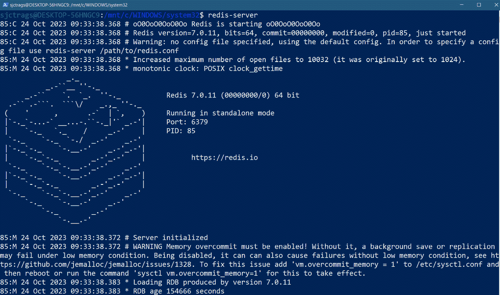

			<st c="56140">Figure 7.13 – Running the redis-server command</st>
			<st c="56186">To stop the server, run the</st> `<st c="56215">redis-cli</st>` <st c="56224">shutdown command or press</st> *<st c="56251">Ctrl</st>* <st c="56255">+</st> *<st c="56258">C</st>* <st c="56259">on</st> <st c="56263">your keyboard.</st>
			<st c="56277">Now, let’s explore the Redis</st> <st c="56306">server using its client shell and understand its CLI commands so that we can run its</st> <st c="56392">CRUD operations.</st>
			<st c="56408">Understanding the Redis database</st>
			<st c="56441">Key-value storage uses a</st> *<st c="56467">hashtable</st>* <st c="56476">data</st> <st c="56481">structure model wherein its unique key value serves as a pointer to a corresponding value of any type.</st> <st c="56585">For Redis, the key is always a string that points to values of type strings, JSON, lists, sets, hashes, sorted set, streams, bitfields, geospatial, and time series.</st> <st c="56750">Since Redis is an in-memory storage type, it stores all its simple to complex key-value pairs of data in the host’s RAM, which is volatile and cannot persist data permanently.</st> <st c="56926">However, in return, Redis can provide faster reads and access to its data than HBase</st> <st c="57011">and Cassandra.</st>
			<st c="57025">To learn more about this storage, Redis has a built-in shell client that interacts with the database through some commands.</st> *<st c="57150">Figure 7</st>**<st c="57158">.14</st>* <st c="57161">shows opening a client shell by running the</st> `<st c="57206">redis-cli</st>` <st c="57215">command and checking the number of databases the storage has using the</st> `<st c="57287">CONFIG GET</st>` `<st c="57298">databases</st>` <st c="57307">command:</st>
			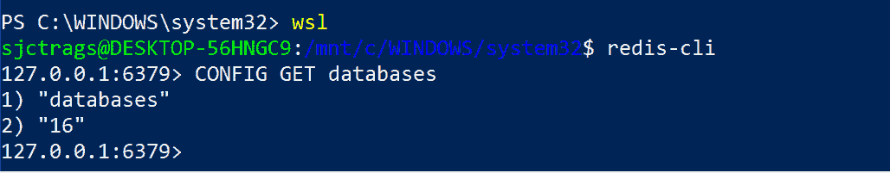

			<st c="57476">Figure 7.14 – Opening a Redis shell</st>
			<st c="57511">The typical number of databases</st> <st c="57543">in Redis storage is</st> *<st c="57564">16</st>*<st c="57566">. Redis databases are named from</st> *<st c="57599">0</st>* <st c="57601">to</st> *<st c="57604">15</st>*<st c="57606">, like indexes of an array.</st> <st c="57634">The default database name is</st> *<st c="57663">0</st>*<st c="57664">, but it has a</st> `<st c="57679">select</st>` <st c="57685">command that chooses the preferred database other than 0 (for example,</st> `<st c="57757">select 1</st>`<st c="57765">).</st>
			<st c="57768">Since Redis is a simple NoSQL database, it only has the following</st> <st c="57834">few commands, including CRUD, we need</st> <st c="57873">to consider:</st>

				*   `<st c="57885">set</st>`<st c="57889">: Adds a key-value pair to</st> <st c="57917">the database.</st>
				*   `<st c="57930">get</st>`<st c="57934">: Retrieves the value of</st> <st c="57960">a key.</st>
				*   `<st c="57966">hset</st>`<st c="57971">: Adds a hash with multiple</st> <st c="58000">key-value pairs.</st>
				*   `<st c="58016">hget</st>`<st c="58021">: Retrieves the value of a key in</st> <st c="58056">a hash.</st>
				*   `<st c="58063">hgetall</st>`<st c="58071">: Retrieves all the key-value pairs in</st> <st c="58111">a hash.</st>
				*   `<st c="58118">hkeys</st>`<st c="58124">: Retrieves all the keys in</st> <st c="58153">a hash.</st>
				*   `<st c="58160">hvals</st>`<st c="58166">: Retrieves all the values in</st> <st c="58197">a hash.</st>
				*   `<st c="58204">del</st>`<st c="58208">: Removes an existing key-value pair using the key or the</st> <st c="58267">whole hash.</st>
				*   `<st c="58278">hdel</st>`<st c="58283">: Removes single or multiple key-value pairs in</st> <st c="58332">a hash.</st>

			<st c="58339">Redis hashes are records or structured</st> <st c="58378">types that can hold collections of field-value pairs with values of varying types.</st> <st c="58462">In a way, it can represent a Python object persisted in the database.</st> *<st c="58532">Figure 7</st>**<st c="58540">.15</st>* <st c="58543">shows a list of Redis commands being run on the</st> <st c="58592">Redis shell:</st>
			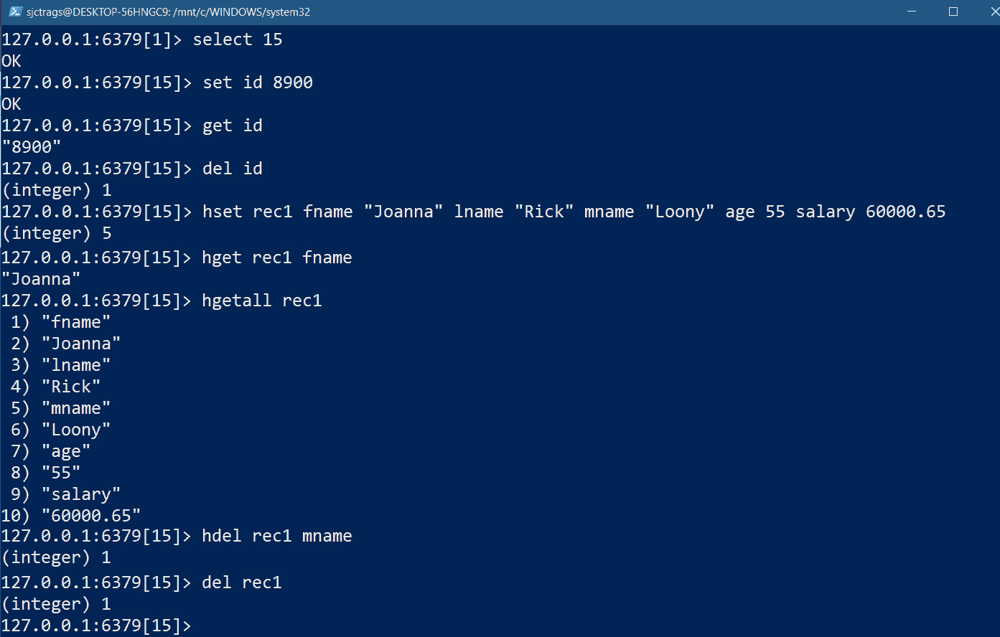

			<st c="59167">Figure 7.15 – Running Redis commands on the Redis shell</st>
			<st c="59222">But how can our</st> *<st c="59239">Tutor Finder</st>* <st c="59251">application</st> <st c="59264">connect to a Redis database as a client?</st> <st c="59305">We’ll answer this question in the</st> <st c="59339">next section.</st>
			<st c="59352">Establishing a database connection</st>
			<st c="59387">In</st> *<st c="59391">Chapter 5</st>* <st c="59400">and</st> *<st c="59405">Chapter 6</st>*<st c="59414">, the</st> *<st c="59420">redis-py</st>* <st c="59428">module established</st> <st c="59447">a connection to Redis as a broker or message queue.</st> <st c="59500">This time, our application will connect to the Redis database for data storage</st> <st c="59579">and caching.</st>
			<st c="59591">So far, the Redis OM module is the most efficient and convenient Redis database connector that can provide database connectivity and methods for CRUD operations, similar to an ORM.</st> <st c="59773">However, before accessing its utilities, install it using the</st> `<st c="59835">pip</st>` <st c="59838">command:</st>

```

pip install redis-om

```py

			`<st c="59868">redis-py</st>` <st c="59877">is the other library that’s included in the installation of the</st> `<st c="59942">redis-om</st>` <st c="59950">module.</st> <st c="59959">The</st> `<st c="59963">redis</st>` <st c="59968">module has a Redis callable object that builds the database connectivity.</st> <st c="60043">The callable has a</st> `<st c="60062">from_url()</st>` <st c="60072">method that accepts the database URL and some parameter values for the</st> `<st c="60144">encoding</st>` <st c="60152">and</st> `<st c="60157">decode_responses</st>` <st c="60173">parameters.</st> <st c="60186">The following code shows</st> `<st c="60211">create_app()</st>`<st c="60223">, which creates the Redis connection to</st> <st c="60263">database</st> `<st c="60272">0</st>`<st c="60273">:</st>

```

<st c="60274">导入 redis</st> def create_app(config_file):

    app = Flask(__name__)

    app.config.from_file(config_file, toml.load) <st c="60478">redis</st> 在 URI 中表示连接是 Redis 独立数据库 <st c="60563">0</st> 在 localhost 的 <st c="60586">6379</st> 端口。所有 <st c="60613">redis-om</st> 事务的响应都解码为字符串，因为 <st c="60672">decode_responses</st> 参数被分配了 <st c="60722">True</st> 的值。所有这些字符串结果都是 <st c="60760">UTF-8</st> 编码。

            <st c="60775">在此阶段，</st> `<st c="60795">redis-om</st>` <st c="60803">模块已准备好</st> <st c="60819">构建应用程序的</st> <st c="60847">模型层。</st>

            <st c="60859">实现模型层</st>

            `<st c="61031">redis-py</st>` <st c="61039">模块。</st> <st c="61048">每个模型类都包含由 Pydantic 验证器验证的类型哈希字段。</st> <st c="61135">一旦实例化，模型对象将持有键的值，在将它们插入</st> <st c="61230">数据库时，使用自动生成的</st> **<st c="61268">哈希值</st>** <st c="61278">或</st> **<st c="61282">pk</st>**<st c="61284">。</st>

            <st c="61285">The</st> `<st c="61290">redis-om</st>` <st c="61298">模块具有</st> `<st c="61314">HashModel</st>` <st c="61323">类，该类将实现应用程序的实体类。</st> <st c="61391">The</st> `<st c="61395">HashModel</st>` <st c="61404">类是 Redis 哈希的表示。</st> <st c="61448">它捕获键值对，并使用其实例方法来管理数据。</st> <st c="61530">它为每个模型对象自动生成主键或哈希键。</st> <st c="61608">以下是为</st> `<st c="61630">HashModel</st>` <st c="61639">类创建的</st> *<st c="61656">课程</st>*, *<st c="61664">学生</st>*, 和 *<st c="61671">导师</st> <st c="61682">数据：</st>

```py
<st c="61688">from redis_om import  HashModel, Field,</st> <st c="61727">get_redis_connection</st>
<st c="61748">redis_conn = get_redis_connection(decode_responses=True)</st> class SearchCourse(<st c="61825">HashModel</st>):
    code: str  = Field(index=True)
    title: str
    description: str
    req_hrs: float
    total_cost: float
    level: int
class SearchStudent(<st c="61961">HashModel</st>):
    std_id: str
    firstname: str
    midname: str
    lastname: str
    … … … … … …
class SearchTutor(<st c="62059">HashModel</st>):
    firstname: str
    lastname: str
    midname: str
    … … … … … … <st c="62167">CourseSearch</st>, <st c="62181">SearchStudent</st>, and <st c="62200">SearchTutor</st> are model classes that have been created to cache incoming request data to the Redis database for fast search transactions. Each class has declared attributes that correspond to the keys of a record. After its instantiation, the model object will have a <st c="62466">pk</st> instance variable that contains the unique hash key of the data record.
			<st c="62540">Aside from relying on the Redis</st> <st c="62572">connection created by</st> `<st c="62595">Redis.from_url()</st>`<st c="62611">, a</st> `<st c="62615">HashModel</st>` <st c="62624">object can independently or directly connect to the Redis database by assigning a connection instance to its</st> `<st c="62734">Meta</st>` <st c="62738">object’s</st> `<st c="62748">database</st>` <st c="62756">variable.</st> <st c="62767">In either of these connectivity approaches, the model object can still emit the methods that will operate the</st> <st c="62877">repository layer.</st>
			<st c="62894">After establishing the Redis connection and creating the model classes, the next step is to build the</st> <st c="62997">repository layer.</st>
			<st c="63014">Building the repository layer</st>
			<st c="63044">Like in Cassandra’s repository</st> <st c="63075">layer, the model object of the</st> `<st c="63107">redis-om</st>` <st c="63115">module implements the repository class.</st> <st c="63156">The</st> `<st c="63160">HashModel</st>` <st c="63169">entity emits methods that will implement the CRUD transactions.</st> <st c="63234">The following</st> `<st c="63248">SearchCourseRepository</st>` <st c="63270">class manages course details in the</st> <st c="63307">Redis database:</st>

```

<st c="63322">from modules.models.db.redis_models import SearchCourse</st> from typing import Dict, Any

class SearchCourseRepository:

    def __init__(self):

        pass

    def insert_course(self, details:Dict[str, Any]):

        try: <st c="63517">课程 = SearchCourse(**details)</st><st c="63549">课程.save()</st> return True

        except Exception as e:

            print(e)

        return False

```py

			<st c="63620">The given</st> `<st c="63631">insert_course()</st>` <st c="63646">method uses the</st> `<st c="63663">HashModel</st>` <st c="63672">entity’s</st> `<st c="63682">save()</st>` <st c="63688">instance method, which adds</st> <st c="63716">the course details as key-value pairs in database</st> `<st c="63767">0</st>` <st c="63768">of Redis.</st> <st c="63779">To update a record, retrieve the data object using its</st> `<st c="63834">pk</st>` <st c="63836">from the database and then invoke the</st> `<st c="63875">update()</st>` <st c="63883">method of the resulting model object with the new field values.</st> <st c="63948">The following</st> `<st c="63962">update_course()</st>` <st c="63977">method applies this</st> `<st c="63998">redis-om</st>` <st c="64006">approach:</st>

```

def update_course(self, details:Dict[str, Any]):

        try: <st c="64071">记录 = SearchCourse.get(details['pk'])</st><st c="64111">记录.update(**details)</st> return True

        except Exception as e:

            print(e)

        return False

```py

			<st c="64193">When deleting a record,</st> `<st c="64218">HashModel</st>` <st c="64227">has a class method called</st> `<st c="64254">delete()</st>` <st c="64262">that removes a hashed object using its</st> `<st c="64302">pk</st>`<st c="64304">, similar to the following</st> `<st c="64331">delete_course()</st>` <st c="64346">method:</st>

```

def delete_course(self, pk):

        try: <st c="64389">SearchCourse.delete(pk)</st> return True

        except Exception as e:

            print(e)

        return False

```py

			<st c="64469">When retrieving data</st> <st c="64490">from the database, the</st> `<st c="64514">get()</st>` <st c="64519">method is the only way to retrieve a single model object using an existing</st> `<st c="64595">pk</st>`<st c="64597">. Querying all the records requires a</st> `<st c="64635">for</st>` <st c="64638">loop to enumerate all</st> `<st c="64661">pk</st>` <st c="64663">values from the</st> `<st c="64680">HashModel</st>` <st c="64689">entity’s</st> `<st c="64699">all_pks()</st>` <st c="64708">generator, which retrieves all</st> `<st c="64740">pk</st>` <st c="64742">from the database.</st> <st c="64762">The loop will fetch all the model objects using the enumerated</st> `<st c="64825">pk</st>`<st c="64827">. The following</st> `<st c="64843">select_course()</st>` <st c="64858">class retrieves all course details from the</st> `<st c="64903">search_course</st>` <st c="64916">table using the</st> `<st c="64933">pk</st>` <st c="64935">value of</st> <st c="64945">each record:</st>

```

def select_course(self, pk):

        try: <st c="64992">记录 = SearchCourse.get(pk)</st><st c="65021">return 记录.dict()</st> except Exception as e:

            print(e)

        return None

    def select_all_course(self):

        records = list() <st c="65133">for id in SearchCourse.all_pks():</st><st c="65166">records.append(SearchCourse.get(id).dict())</st> return records

```py

			<st c="65225">All resulting objects from the query transactions are JSONable and don’t need a JSON serializer.</st> <st c="65323">Running the given</st> `<st c="65341">select_all_course()</st>` <st c="65360">class will return the following sample</st> <st c="65400">Redis records:</st>

```

{

    "records": [

        {

            "code": "PY-201",

            "description": "高级 Python",

            "level": 3, <st c="65496">"pk": "01HDH2VPZBGJJ16JKE3KE7RGPQ",</st> "req_hrs": 50.0,

            "title": "高级 Python 编程",

            "total_cost": 15000.0

        },

        {

            "code": "PY-101",

            "description": "Python 编程入门",

            "level": 1, <st c="65692">"pk": "01HDH2SVYR7AYMRD28RE6HSHYB",</st> "req_hrs": 45.0,

            "title": "Python 基础",

            "total_cost": 5000.0

        },

```py

			<st c="65794">Although Redis OM</st> <st c="65812">is perfectly compatible with FastAPI, it can also make any Flask application a client for Redis.</st> <st c="65910">Now, Redis OM cannot implement filtered queries.</st> <st c="65959">If Redis OM needs a filtered search with some constraints, it needs a</st> *<st c="66029">RediSearch</st>* <st c="66039">extension module that calibrates and provides more search constraints to query transactions.</st> <st c="66133">But</st> *<st c="66137">RediSearch</st>* <st c="66147">can only run with Redis OM if the application uses Redis Stack instead of the</st> <st c="66226">typical server.</st>
			<st c="66241">The next section will highlight a</st> *<st c="66276">document-oriented</st>* <st c="66293">NoSQL database that’s popular for enterprise application</st> <st c="66351">development:</st> *<st c="66364">MongoDB</st>*<st c="66371">.</st>
			<st c="66372">Handling BSON-based documents with MongoDB</st>
			**<st c="66415">MongoDB</st>** <st c="66423">is a NoSQL database that stores JSON-like</st> <st c="66465">documents of key-value pairs</st> <st c="66495">with a flexible and scalable schema, thus classified as a document-oriented database.</st> <st c="66581">It can store huge volumes of data with varying data structures, types,</st> <st c="66652">and formations.</st>
			<st c="66667">These JSON-like documents use</st> **<st c="66698">Binary Javascript Object Notation</st>** <st c="66731">(</st>**<st c="66733">BSON</st>**<st c="66737">), a binary-encoded representation</st> <st c="66772">of JSON documents suitable for network-based data transport because of its compact nature.</st> <st c="66864">It has non-JSON-native data type support for date and binary data and recognizes embedded documents or an array of documents because of its</st> <st c="67004">traversable structure.</st>
			<st c="67026">Next, we’ll install MongoDB and compare its process to HBase, Cassandra,</st> <st c="67100">and Redis.</st>
			<st c="67110">Installing and configuring the MongoDB server</st>
			<st c="67156">First, download the</st> <st c="67176">preferred MongoDB</st> <st c="67194">community server from</st> [<st c="67217">https://www.mongodb.com/try/download/community</st>](https://www.mongodb.com/try/download/community)<st c="67263">. Install it to</st> <st c="67278">your preferred drive and directory.</st> <st c="67315">Next, create a data directory where MongoDB can store its documents.</st> <st c="67384">If the data folder doesn’t exist, MongoDB will resort to</st> `<st c="67441">C:\data\db</st>` <st c="67451">as its default data folder.</st> <st c="67480">Afterward, run the server by running the</st> <st c="67521">following command:</st>

```

mongod.exe --dbpath="c:\data\db"

```py

			<st c="67572">The default host of the server is localhost, and its port</st> <st c="67631">is</st> `<st c="67634">27017</st>`<st c="67639">.</st>
			<st c="67640">Download MongoDB Shell</st> <st c="67663">from</st> [<st c="67669">https://www.mongodb.com/try/download/shell</st>](https://www.mongodb.com/try/download/shell) <st c="67711">to open the client console for the server.</st> <st c="67755">Also, download</st> <st c="67769">MongoDB Compass from</st> [<st c="67791">https://www.mongodb.com/try/download/compass</st>](https://www.mongodb.com/try/download/compass)<st c="67835">, the GUI administration tool for the</st> <st c="67873">database server.</st>
			<st c="67889">So far, installing the MongoDB server and its tools takes less time than installing the other NoSQL databases.</st> <st c="68001">Next, we’ll integrate MongoDB into our</st> *<st c="68040">Tutor</st>* *<st c="68046">Finder</st>* <st c="68052">application.</st>
			<st c="68065">Establishing a database connection</st>
			<st c="68100">To create database</st> <st c="68119">connectivity, MongoDB uses the</st> `<st c="68151">pymongo</st>` <st c="68158">module as its native driver, which is made from BSON utilities.</st> <st c="68223">However, the driver requires more codes to implement the CRUD transactions because it offers low-level utilities.</st> <st c="68337">A high-level and object-oriented module, such as</st> `<st c="68386">mongoengine</st>`<st c="68397">, can provide a better database connection than</st> `<st c="68445">pymongo</st>`<st c="68452">. The</st> `<st c="68458">mongoengine</st>` <st c="68469">library is a popular</st> **<st c="68491">object document mapper</st>** <st c="68513">(</st>**<st c="68515">ODM</st>**<st c="68518">) that can build a client application</st> <st c="68556">with a model and</st> <st c="68574">repository layers.</st>
			<st c="68592">The</st> `<st c="68597">flask-mongoengine</st>` <st c="68614">library is written solely for Flask.</st> <st c="68652">However, since Flask 3.x, the</st> `<st c="68682">flask.json</st>` <st c="68692">module, on which the module is tightly dependent, was removed.</st> <st c="68756">This change affected the</st> `<st c="68781">MongoEngine</st>` <st c="68792">class of the</st> `<st c="68806">flask_mongoengine</st>` <st c="68823">library, which creates a MongoDB client.</st> <st c="68865">Until the library is updated so that it supports the latest version of Flask, the native</st> `<st c="68954">connect()</st>` <st c="68963">method from the native</st> `<st c="68987">mongoengine.connection</st>` <st c="69009">module will always be the solution to connect to the MongoDB database.</st> <st c="69081">The following snippet from the</st> *<st c="69112">Tutor Finder</st>* <st c="69124">application’s</st> `<st c="69139">create_app()</st>` <st c="69151">factory method uses</st> `<st c="69172">connect()</st>` <st c="69181">to establish communication with the</st> <st c="69218">MongoDB server:</st>

```

<st c="69233">from mongoengine.connection 导入 连接</st> def 创建应用(配置文件):

    app = Flask(__name__)

    app.config.from_file(配置文件, toml.load <st c="69455">连接()</st> 方法需要 <st c="69481">数据库名</st>，<st c="69490">主机</st>，<st c="69496">端口</st>，以及服务器将用于识别 UUID 主键的 <st c="69518">UUID</st> 类型。这可以是 <st c="69590">未指定</st>，<st c="69603">标准</st>，<st c="69613">pythonLegacy</st>，<st c="69627">javaLegacy</st>，或 <st c="69642">csharpLegacy</st>。

            <st c="69655">另一方面，客户端</st> <st c="69685">可以调用</st> `<st c="69701">断开连接()</st>` <st c="69713">方法来关闭</st> <st c="69730">连接。</st>

            <st c="69745">现在，让我们使用来自</st> `<st c="69813">flask-mongoengine</st>` <st c="69830">模块的辅助类来构建模型层。</st>

            <st c="69838">构建模型层</st>

            <st c="69863">`<st c="69868">flask-mongoengine</st>` <st c="69885">模块有一个</st> `<st c="70151">文档</st>` <st c="70159">基类来构建我们应用的登录详细信息：</st>

```py
 from mongoengine import <st c="70242">Document</st>, <st c="70252">SequenceField</st>, <st c="70267">BooleanField</st>, <st c="70281">EmbeddedDocumentField</st>, <st c="70304">BinaryField</st>, <st c="70317">IntField</st>, <st c="70327">StringField</st>, <st c="70340">DateField</st>, <st c="70351">EmailField</st>, <st c="70363">EmbeddedDocumentListField</st>, <st c="70390">EmbeddedDocument</st> class Savings(<st c="70421">EmbeddedDocument</st>):
    acct_name = StringField(db_field='acct_name', max_length=100, required=True)
    acct_number = StringField(db_field='acct_number', max_length=16, required=True)
        … … … … … …
class Checking(EmbeddedDocument):
    acct_name = StringField(db_field='acct_name', max_length=100, required=True)
    acct_number = StringField(db_field='acct_number', max_length=16, required=True)
    bank =  StringField(db_field='bank', max_length=100, required=True)
    … … … … … …
class PayPal(EmbeddedDocument):
    email = EmailField(db_field='email', max_length=20, required=True)
    address = StringField(db_field='address', max_length=200, required=True)
class Tutor(EmbeddedDocument):
    firstname = StringField(db_field='firstname', max_length=50, required=True)
    lastname = StringField(db_field='lastname', max_length=50, required=True)
    … … …. … … <st c="71245">savings = EmbeddedDocumentListField(Savings, required=False)</st><st c="71305">checkings = EmbeddedDocumentListField(Checking, required=False)</st><st c="71369">gcash = EmbeddedDocumentField(GCash, required=False)</st><st c="71422">paypal = EmbeddedDocumentField(PayPal, required=False)</st> class TutorLogin(Document):
    id = SequenceField(required=True, primary_key=True)
    username = StringField(db_field='email',max_length=25, required=True)
    password = StringField(db_field='password',maxent=25, required=True)
    encpass = BinaryField(db_field='encpass', required=True) <st c="71827">flask-mongengine</st> offers helper classes, such as <st c="71875">StringField</st>, <st c="71888">BinaryField</st>, <st c="71901">DateField</st>, <st c="71912">IntField</st>, and <st c="71926">EmailField</st>, that build the metadata of a document. These helper classes have parameters, such as <st c="72023">db_field</st> and <st c="72036">required</st>, that will add details to the key-value pairs. Moreover, some parameters appear only in one helper class, such as <st c="72159">min_length</st> and <st c="72174">max_length</st> in <st c="72188">StringField</st>, because they control the number of characters in the string. Likewise, <st c="72272">ByteField</st> has a <st c="72288">max_bytes</st> parameter that will not appear in other helper classes. Note that, the <st c="72369">Document</st> base class’ <st c="72390">BinaryField</st> translates to BSON’s binary data and <st c="72439">DateField</st> to BSON’s date type, not the common Python type.
			<st c="72497">Unlike Cassandra, Redis, and HBase, MongoDB</st> <st c="72541">allows relationships among structures.</st> <st c="72581">Although not normalized like in an RDBMS, MongoDB can link one document to its subdocuments using the</st> `<st c="72683">EmbeddedDocumentField</st>` <st c="72704">and</st> `<st c="72709">EmbeddedDocumentListField</st>` <st c="72734">helper classes.</st> <st c="72751">In the given model classes, the</st> `<st c="72783">TutorLogin</st>` <st c="72793">model will create a parent document collection called</st> `<st c="72848">tutor_login</st>` <st c="72859">that will reference a</st> `<st c="72882">tutor</st>` <st c="72887">sub-document because the sub-document’s</st> `<st c="72928">Tutor</st>` <st c="72933">model is an</st> `<st c="72946">EmbeddedDocumentField</st>` <st c="72967">helper class of the parent</st> `<st c="72995">TutorLogin</st>` <st c="73005">model.</st> <st c="73013">The idea is similar to a one-to-one relationship concept in a relational ERD but not totally the same.</st> <st c="73116">On the other hand, the relationship between</st> `<st c="73160">Tutor</st>` <st c="73165">and</st> `<st c="73170">Savings</st>` <st c="73177">is like a one-to-many relationship because</st> `<st c="73221">Savings</st>` <st c="73228">is the</st> `<st c="73236">EmbeddedDocumentListField</st>` <st c="73261">helper class of the</st> `<st c="73282">Tutor</st>` <st c="73287">model.</st> <st c="73295">In other words, the</st> `<st c="73315">tutor</st>` <st c="73320">document collections will reference a list of savings sub-documents.</st> <st c="73390">Here</st> `<st c="73395">EmbeddedDocumentField</st>` <st c="73416">does not have an</st> `<st c="73434">_id</st>` <st c="73437">field because it cannot construct an actual document</st> <st c="73490">collection, unlike in an independent</st> `<st c="73528">Document</st>` <st c="73536">base class.</st>
			<st c="73548">Next, we’ll create the repository layer from the</st> `<st c="73598">Tutor</st>` <st c="73603">document and</st> <st c="73617">its sub-documents.</st>
			<st c="73635">Implementing the repository</st>
			<st c="73663">The</st> `<st c="73668">Document</st>` <st c="73676">object emits utility methods</st> <st c="73705">that perform CRUD operations for the repository layer.</st> <st c="73761">Here is a</st> `<st c="73771">TutorLoginRepository</st>` <st c="73791">class that inserts, updates, deletes, and retrieves</st> `<st c="73844">tutor_login</st>` <st c="73855">documents:</st>

```

from typing 导入 Dict, Any

from 模块.模型.db.mongo_models 导入 导师登录

import json

class 导师登录存储库:

    def 插入登录(self, 详细信息: Dict[str, Any]) -> bool:

        try: <st c="74051">登录 = 导师登录(**详细信息)</st><st c="74080">登录保存()</st> except Exception as e:

            print(e)

            返回 False

        返回 True

```py

			<st c="74150">The</st> `<st c="74155">insert_login()</st>` <st c="74169">method uses the</st> `<st c="74186">save()</st>` <st c="74192">method of the</st> `<st c="74207">TutorLogin</st>` <st c="74217">model object for persistence.</st> <st c="74248">The</st> `<st c="74252">save()</st>` <st c="74258">method will persist all the</st> `<st c="74287">kwargs</st>` <st c="74293">data that’s passed to the constructor</st> <st c="74332">of</st> `<st c="74335">TutorLogin</st>`<st c="74345">.</st>
			<st c="74346">Like the Cassandra</st> <st c="74365">driver, the</st> `<st c="74378">Document</st>` <st c="74386">class has an</st> `<st c="74400">objects</st>` <st c="74407">class attribute that provides all query methods.</st> <st c="74457">Updating a document uses the</st> `<st c="74486">objects</st>` <st c="74493">attribute to filter the data using any document keys and then fetches the record using the attribute’s</st> `<st c="74597">get()</st>` <st c="74602">method.</st> <st c="74611">If the document exists, the</st> `<st c="74639">update()</st>` <st c="74647">method of the filtered record object will update the given</st> `<st c="74707">kwargs</st>` <st c="74713">of fields that require updating.</st> <st c="74747">The following code shows</st> `<st c="74772">update_login()</st>`<st c="74786">, which updates a</st> `<st c="74804">TutorLogin</st>` <st c="74814">document:</st>

```

def 更新登录(self, id: int, 详细信息: Dict[str, Any]) -> bool:

    try: <st c="74894">登录 = 导师登录对象(id=id).获取()</st><st c="74933">登录更新(**详细信息)</st> except:

        返回 False

    返回 True

```py

			<st c="74990">Deleting a document in MongoDB also uses the</st> `<st c="75036">objects</st>` <st c="75043">attribute to filter and extract the document that needs to be removed.</st> <st c="75115">The</st> `<st c="75119">delete()</st>` <st c="75127">method of the retrieved model object will delete the filtered record from the database once the repository invokes it.</st> <st c="75247">Here,</st> `<st c="75253">delete_login()</st>` <st c="75267">removes a filtered document from</st> <st c="75301">the database:</st>

```

def 删除登录(self, id: int) -> bool:

        try: <st c="75360">登录 = 导师登录对象(id=id).获取()</st><st c="75399">登录删除()</st> except:

            返回 False

        返回 True

```py

			<st c="75447">The</st> `<st c="75452">objects</st>` <st c="75459">attribute is responsible</st> <st c="75484">for implementing all the query transactions.</st> <st c="75530">Here,</st> `<st c="75536">get_login()</st>` <st c="75547">fetches a single object identified by its unique</st> `<st c="75597">_id</st>` <st c="75600">value using the</st> `<st c="75617">get()</st>` <st c="75622">method, while the</st> `<st c="75641">get_login_username()</st>` <st c="75661">transaction retrieves a single record filtered by the tutor’s username and password.</st> <st c="75747">On the other hand,</st> `<st c="75766">get_all_login()</st>` <st c="75781">retrieves all the</st> `<st c="75800">tutor_login</st>` <st c="75811">documents from</st> <st c="75827">the database:</st>

```

<st c="75840">def 获取所有登录(self):</st><st c="75865">登录 = 导师登录对象()</st> return json.loads(登录.to_json()) <st c="75930">def 获取登录(self, id: int):</st><st c="75958">登录 = 导师登录对象(id=id).获取()</st><st c="75998">返回 登录.to_json()</st><st c="76021">def 获取登录用户名(self, 用户名: str,</st> <st c="76064">密码: str):</st><st c="76079">登录 = 导师登录对象(username=用户名,</st> <st c="76125">密码=密码).获取()</st> return 登录.to_json()

```py

			<st c="76173">All these query transactions invoke the built-in</st> `<st c="76223">to_json()</st>` <st c="76232">method, which serializes and converts the BSON-based documents into JSON for the API’s response</st> <st c="76329">generation process.</st>
			<st c="76348">Embedded documents do not have dedicated collection storage because they are part of a parent document collection.</st> <st c="76464">Adding and removing embedded documents from the parent document requires using string queries and operators or typical object referencing in Python, such as setting to</st> `<st c="76632">None</st>` <st c="76636">when removing a sub-document.</st> <st c="76667">The following repository adds</st> <st c="76696">and removes a tutor’s profile details from the</st> <st c="76744">login credentials:</st>

```

from typing 导入 Dict, Any

from 模块.模型.db.mongo_models 导入 导师登录, 导师

class 导师档案存储库:

    def 添加导师档案(self, 详细信息: Dict[str, Any]) -> bool:

        try: <st c="76949">登录 = 导师登录对象(id=详细信息['id'])</st> <st c="76993">.获取()</st> del 详细信息['id'] <st c="77018">档案 = 导师(**详细信息)</st><st c="77044">登录更新(导师=档案)</st> except Exception as e:

            print(e)

            返回 False

        返回 True

```py

			<st c="77129">Here,</st> `<st c="77136">add_tutor_profile()</st>` <st c="77155">embeds the</st> `<st c="77167">TutorProfile</st>` <st c="77179">document via the tutor key of the</st> `<st c="77214">TutorLogin</st>` <st c="77224">main document.</st> <st c="77240">Another solution is to pass the</st> `<st c="77272">set_tutor=profile</st>` <st c="77289">query parameter to the</st> `<st c="77313">update()</st>` <st c="77321">operation.</st> <st c="77333">The following transaction removes the tutor</st> <st c="77376">profile from the</st> <st c="77394">main document:</st>

```

def 删除导师档案(self, id: int) -> bool:

        try: <st c="77462">登录 = 导师登录对象(id=id).获取()</st><st c="77501">登录更新(导师=None)</st> except Exception as e:

            print(e)

            返回 False

        返回 True

```py

			<st c="77583">Then,</st> `<st c="77590">delete_tutor_profile()</st>` <st c="77612">unsets the profile document from the</st> `<st c="77650">TutorLogin</st>` <st c="77660">document by setting the tutor field to</st> `<st c="77700">None</st>`<st c="77704">. Another way to do this is to use the</st> `<st c="77743">unset__tutor=True</st>` <st c="77760">query parameter for the</st> `<st c="77785">update()</st>` <st c="77793">method.</st>
			<st c="77801">The most effective way to manage a list of embedded documents is to use query strings or query parameters to avoid lengthy implementations.</st> <st c="77942">The following</st> `<st c="77956">SavingsRepository</st>` <st c="77973">class adds and removes a bank account from a list of savings accounts of a tutor.</st> <st c="78056">Its</st> `<st c="78060">add_savings()</st>` <st c="78073">method adds a new saving account to the tutor’s list of saving accounts.</st> <st c="78147">It uses the</st> `<st c="78159">update()</st>` <st c="78167">method with the</st> `<st c="78184">push__tutor__savings=savings</st>` <st c="78212">query parameter, which pushes a new</st> `<st c="78249">Savings</st>` <st c="78256">instance to</st> <st c="78269">the list:</st>

```

from typing import Dict, Any

from modules.models.db.mongo_models import Savings, TutorLogin

class SavingsRepository: <st c="78396">def add_savings(self, details:Dict[str, Any]):</st> try: <st c="78448">login = TutorLogin.objects(id=details['id'])</st> <st c="78492">.get()</st><st c="78498">del details['id']</st><st c="78516">savings = Savings(**details)</st><st c="78545">login.update(push__tutor__savings=savings)</st> except Exception as e:

            print(e)

            return False

        return True

```py

			<st c="78645">On the other hand, the</st> `<st c="78669">delete_savings()</st>` <st c="78685">method deletes an account using the</st> `<st c="78722">pull__tutor__savings__acct_number= details['acct_number']</st>` <st c="78779">query parameter, which removes a savings account from</st> <st c="78834">the list:</st>

```

<st c="78843">def delete_savings(self, details:Dict[str, Any]):</st> try: <st c="78899">login = TutorLogin.objects(id=details['id'])</st> .get() <st c="78950">login.update(pull__tutor__savings__acct_number=</st> <st c="78997">details['acct_number'])</st> except Exception as e:

            print(e)

            return False

        return True

```py

			<st c="79078">Although MongoDB is popular</st> <st c="79106">and has the most support, it slows down when the number of users increases.</st> <st c="79183">When the datasets become massive, adding more replications and configurations becomes difficult due to its master-slave architecture.</st> <st c="79317">Adding caches is also part of the plan to improve</st> <st c="79367">data retrieval.</st>
			<st c="79382">However, there is another document-oriented NoSQL database that’s designed for distributed architecture and high availability with internal caching for</st> <st c="79535">datasets:</st> **<st c="79545">Couchbase</st>**<st c="79554">.</st>
			<st c="79555">Managing key-based JSON documents with Couchbase</st>
			**<st c="79604">Couchbase</st>** <st c="79614">is a NoSQL database that’s designed</st> <st c="79650">for distributed architectures</st> <st c="79680">and offers high performance on concurrent, web-based, and cloud-based applications.</st> <st c="79765">It</st> <st c="79767">supports distributed</st> **<st c="79789">ACID</st>** <st c="79793">transactions and has a</st> <st c="79816">SQL-like language called</st> **<st c="79842">N1QL</st>**<st c="79846">. All documents stored in Couchbase databases</st> <st c="79892">are JSON-formatted.</st>
			<st c="79911">Now, let’s install and configure the Couchbase</st> <st c="79959">database server.</st>
			<st c="79975">Installing and configuring the database instance</st>
			<st c="80024">To begin, download</st> <st c="80043">Couchbase Community Edition from</st> [<st c="80077">https://www.couchbase.com/downloads/</st>](https://www.couchbase.com/downloads/)<st c="80113">. Once it’s been installed, Couchbase will need cluster</st> <st c="80168">configuration details</st> <st c="80190">to be added, including the user profile for accessing the server dashboard at</st> `<st c="80269">http://localhost:8091/ui/index.html</st>`<st c="80304">. Accepting the user agreement for the configuration is also part of the process.</st> <st c="80386">After configuring the cluster, the URL will show us the login form to access the default server instance.</st> *<st c="80492">Figure 7</st>**<st c="80500">.16</st>* <st c="80503">shows the login page of the Couchbase</st> <st c="80542">web portal:</st>
			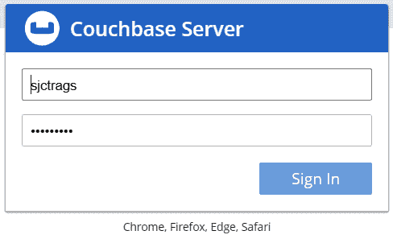

			<st c="80601">Figure 7.16 – Accessing the login page of Couchbase</st>
			<st c="80652">After logging in to the portal, the next step is to create a</st> *<st c="80714">bucket</st>*<st c="80720">. A</st> *<st c="80724">bucket</st>* <st c="80730">is a named container that saves all the data in Couchbase.</st> <st c="80790">It groups all the keys and values based on collections and scopes.</st> <st c="80857">Somehow, it is similar to the concept of a database schema in a relational DBMS.</st> *<st c="80938">Figure 7</st>**<st c="80946">.17</st>* <st c="80949">shows</st> **<st c="80956">packtbucket</st>**<st c="80967">, which has been created on the</st> **<st c="80999">Buckets</st>** <st c="81006">dashboard:</st>
			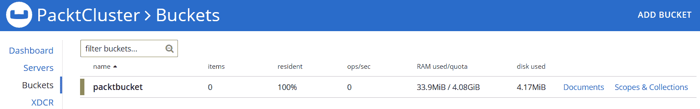

			<st c="81241">Figure 7.17 – Creating a bucket in the cluster</st>
			<st c="81287">Afterward, create a scope</st> <st c="81313">that will hold the tables or document</st> <st c="81352">collections of the database instance.</st> <st c="81390">A bucket scope is a named mechanism that manages and organizes these collections.</st> <st c="81472">In some aspects, it is similar to a tablespace in a relational DBMS.</st> <st c="81541">To create these scopes, click the</st> **<st c="81575">Scopes & Collections</st>** <st c="81595">hyperlink to the right of the bucket name on the</st> **<st c="81645">Add Bucket</st>** <st c="81655">page.</st> <st c="81662">The</st> **<st c="81666">Add Scope</st>** <st c="81675">page will appear, as shown in</st> *<st c="81706">Figure 7</st>**<st c="81714">.18</st>*<st c="81717">:</st>
			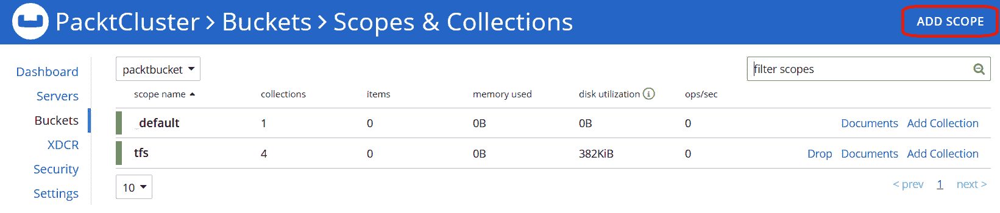

			<st c="81968">Figure 7.18 – Creating a scope in a bucket</st>
			<st c="82010">On the</st> `<st c="82134">tfs</st>`<st c="82137">.</st>
			<st c="82138">Lastly, click the</st> `<st c="82342">tfs</st>` <st c="82345">collections:</st>
			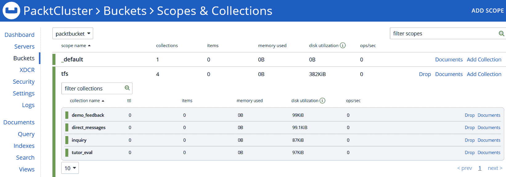

			<st c="82943">Figure 7.19 – List of collections in a tfs scope</st>
			<st c="82991">Now, let’s establish the bucket connection using the</st> `<st c="83045">couchbase</st>` <st c="83054">module.</st>
			<st c="83062">Setting up the server connection</st>
			<st c="83095">To create a client connection</st> <st c="83125">to Couchbase, install the</st> `<st c="83152">couchbase</st>` <st c="83161">module using the</st> `<st c="83179">pip</st>` <st c="83182">command:</st>

```

pip 安装 couchbase

```py

			<st c="83213">In the</st> `<st c="83221">create_app()</st>` <st c="83233">factory function of the application, perform the following steps to access the Couchbase</st> <st c="83323">server instance:</st>

				1.  <st c="83339">Create a</st> `<st c="83349">PasswordAuthenticator</st>` <st c="83370">object with the correct user profile’s credential to access the</st> <st c="83435">specified bucket.</st>
				2.  <st c="83452">Instantiate the</st> `<st c="83469">Cluster</st>` <st c="83476">class with its required constructor arguments, namely the Couchbase URL and some options, such as the</st> `<st c="83579">PasswordAuthenticator</st>` <st c="83600">object, wrapped in the</st> `<st c="83624">ClusterOptions</st>` <st c="83638">instance.</st>
				3.  <st c="83648">Access the preferred bucket by calling the</st> `<st c="83692">Cluster</st>`<st c="83699">’s</st> `<st c="83703">bucket()</st>` <st c="83711">instance method.</st>

			<st c="83728">The following snippet shows</st> <st c="83756">how to implement these steps in our</st> *<st c="83793">Tutor Finder</st>* <st c="83805">application’s</st> `<st c="83820">create_app()</st>` <st c="83832">method:</st>

```

<st c="83840">from couchbase.auth import PasswordAuthenticator</st>

<st c="83889">from couchbase.cluster import Cluster</st>

<st c="83927">from couchbase.options import ClusterOptions</st> def create_app(config_file):

    app = Flask(__name__)

    app.config.from_file(config_file, toml.load) <st c="84069">auth = PasswordAuthenticator("sjctrags", "packt2255",)</st><st c="84123">cluster = Cluster('couchbase://localhost',</st> <st c="84166">ClusterOptions(auth))</st> cluster.wait_until_ready(timedelta(seconds=5))

    全局 cb <st c="84285">Cluster</st> 对象有一个 <st c="84306">wait_until_ready()</st> 方法，它会 ping Couchbase 服务以检查连接状态，并在连接就绪后返回控制权给 <st c="84424">create_app()</st>。但是调用此方法会减慢 Flask 服务器的启动速度。我们的应用程序仅出于实验目的调用了该方法。

            `<st c="84608">在成功</st> `<st c="84628">设置</st>` `<st c="84654">Bucket</st>` `<st c="84660">对象后，我们必须确保</st>` `<st c="84698">存储层</st>` `<st c="84698">可以实施。</st>`

            <st c="84715">创建存储层</st>

            <st c="84745">存储层</st> <st c="84766">需要</st> `<st c="84777">Bucket</st>` <st c="84783">对象从</st> `<st c="84796">create_app()</st>` <st c="84808">中实现 CRUD 事务。</st> `<st c="84849">Bucket</st>` <st c="84855">对象有一个</st> `<st c="84869">scope()</st>` <st c="84876">方法，它将访问包含集合的容器空间。</st> `<st c="84952">它返回一个</st> `<st c="84965">Scope</st>` <st c="84970">对象，该对象会发出</st> `<st c="84989">collection()</st>`<st c="85001">，以检索首选文档集合。</st> `<st c="85055">在此处，</st>` `<st c="85061">DirectMessageRepository</st>` <st c="85084">管理学生向教练发送的所有直接消息以及</st> `<st c="85152">反之亦然：</st>`

```py
 class DirectMessageRepository:
    def insert_dm(self, details:Dict[str, Any]):
        try: <st c="85245">cb_coll = cb.scope("tfs")</st> <st c="85270">.collection("direct_messages")</st> key = "chat_" + str(details['id']) + '-' + str(details["date_sent"]) <st c="85370">cb_coll.insert(key, details)</st> return True
        except Exception as e:
            print(e)
        return False
```

            `<st c="85455">The</st>` `<st c="85460">dm_insert()</st>` <st c="85471">方法使我们能够访问</st> `<st c="85502">tfs</st>` <st c="85505">范围及其</st> `<st c="85520">direct_messages</st>` <st c="85535">文档集合。</st> <st c="85558">其主要目标是使用集合的</st> `<st c="85719">insert()</st>` <st c="85727">方法通过给定的键将导师和训练师之间的聊天消息的详细信息插入文档集合。</st>

            `<st c="85735">另一方面，</st>` `<st c="85759">update_dm()</st>` <st c="85770">方法使用集合的</st> `<st c="85800">upsert()</st>` <st c="85808">方法通过键来更新 JSON 文档：</st>

```py
 def update_dm(self, details:Dict[str, Any]):
        try: <st c="85905">cb_coll = cb.scope("tfs")</st> <st c="85930">.collection("direct_messages")</st> key = "chat_" + str(details['id']) + '-' + str(details["date_sent"]) <st c="86030">cb_coll.upsert(key, details)</st> return True
        except Exception as e:
            print(e)
        return False
```

            `<st c="86115">集合的</st>` `<st c="86133">remove()</st>` <st c="86141">方法从集合中删除一个文档。</st> <st c="86189">这可以在以下</st> `<st c="86223">delete_dm()</st>` <st c="86234">事务中看到，其中它使用</st> `<st c="86286">其</st>` `<st c="86290">键</st>`<st c="86293">删除一个聊天消息：</st>

```py
 def delete_dm_key(self, details:Dict[str, Any]):
        try: <st c="86350">cb_coll = cb.scope("tfs")</st> <st c="86375">.collection("direct_messages")</st> key = "chat_" + str(details['id']) + '-' + str(details["date_sent"]) <st c="86475">cb_coll.remove(key)</st> return True
        except Exception as e:
            print(e)
        return False
```

            Couchbase 与 MongoDB 不同，使用一种类似 SQL 的机制，称为*<st c="86612">N1QL</st>*来检索文档。<st c="86616">以下</st> *<st c="86654">DELETE</st>* <st c="86660">事务使用 N1QL 查询事务而不是集合的</st> `<st c="86733">delete()</st>` <st c="86741">方法：</st>

```py
 def delete_dm_sender(self, sender):
        try: <st c="86791">cb_scope = cb.scope("tfs")</st><st c="86817">stmt = f"delete from `direct_messages` where</st> <st c="86862">`sender_id` LIKE '{sender}'"</st><st c="86891">cb_scope.query(stmt)</st> return True
        except Exception as e:
            print(e)
        return False
```

            `<st c="86969">The</st>` `<st c="86974">Scope</st>` <st c="86979">实例，由</st> `<st c="87007">Bucket</st>` <st c="87013">对象的</st> `<st c="87023">scope()</st>` <st c="87030">方法派生而来，有一个</st> `<st c="87045">query()</st>` <st c="87052">方法，用于执行字符串形式的查询语句。</st> <st c="87108">查询语句应将集合和字段名称用引号括起来（</st>```py<st c="87190">``</st>```<st c="87193">），而其字符串约束值应使用单引号。</st> <st c="87260">因此，我们有了</st> ``<st c="87278">delete from `direct_messages` where `sender_id` LIKE '{sender},'</st>`` <st c="87342">查询语句在</st> `<st c="87362">delete_dm_sender()</st>`<st c="87380">中，其中</st> `<st c="87388">sender</st>` <st c="87394">是一个</st> <st c="87400">参数值。</st>

            `<st c="87416">在</st> *<st c="87456">DELETE</st>* <st c="87462">和</st> *<st c="87467">UPDATE</st>* <st c="87473">事务中使用 N1QL 查询的优势在于，键不是执行这些操作的唯一依据。</st> <st c="87524">*<st c="87562">DELETE</st>* <st c="87568">操作可以基于其他字段来删除文档，例如使用给定的</st> <st c="87674">sender ID</st> <st c="87678">删除聊天消息：</st>

```py
 def delete_dm_sender(self, sender):
        try:
            cb_scope = cb.scope("tfs")
            stmt = f"delete from `direct_messages` where `sender_id` LIKE '{sender}'"
            cb_scope.query(stmt)
            return True
        except Exception as e:
            print(e)
        return False
```

            *<st c="87904">N1QL</st>* <st c="87909">在从键空间中检索 JSON 文档时，无论是否有约束，都很受欢迎。</st> <st c="87997">以下查询事务使用</st> *<st c="88038">SELECT</st>* <st c="88044">查询语句来检索</st> `<st c="88098">direct_messages</st>` <st c="88113">集合中的所有文档：</st>

```py
 def select_all_dm(self):
        cb_scope = cb.scope("tfs")
        raw_data = cb_scope.query('select * from `direct_messages`', QueryOptions(read_only=True))
        records = [rec for rec in raw_data.rows()]
        return records
```

            <st c="88327">Couchbase 可以是 Flask 应用程序管理 JSON 数据转储的合适后端存储形式。</st> <st c="88438">Flask 和 Couchbase 可以构建快速、可扩展且高效的微服务或分布式应用程序，具有快速开发和较少的数据库管理。</st> <st c="88597">然而，与 HBase、Redis、Cassandra、MongoDB 和 Couchbase 相比，Flask 可以与图数据库，如 Neo4J，集成以进行</st> <st c="88686">图相关算法。</st>

            <st c="88753">与 Neo4J 建立数据关系</st>

            **<st c="88797">Neo4J</st>** <st c="88803">是一个专注于数据之间关系的 NoSQL 数据库。</st> <st c="88836">它不存储文档，而是存储节点、关系以及连接这些节点的属性。</st> <st c="88964">Neo4J 也因其基于由节点和节点之间有向线组成的图模型的概念而被称为流行的图数据库。</st>

            <st c="89107">在将我们的应用程序集成到 Neo4J 数据库之前，我们必须使用 Neo4J 桌面安装当前版本的 Neo4J 平台。</st> <st c="89232">。</st>

            <st c="89246">安装 Neo4J 桌面</st>

            <st c="89271">Neo4J 桌面提供了一个本地开发环境，并包括学习数据库所需的所有功能，从创建自定义本地数据库到启动</st> <st c="89441">Neo4J 浏览器。</st> <st c="89461">其安装程序可在</st> <st c="89488">[<st c="89491">https://neo4j.com/download/</st>](https://neo4j.com/download/)<st c="89518">找到。</st>

            <st c="89519">安装完成后，创建一个包含本地数据库和配置设置的 Neo4J 项目。</st> <st c="89635">除了项目名称外，此过程还会要求输入用户名和密码以供身份验证详情使用。</st> <st c="89752">完成这些操作后，删除其默认的 Movie 数据库，并创建必要的图数据库。</st> *<st c="89850">图 7</st>**<st c="89858">.20</st>* <st c="89861">显示</st> **<st c="89868">Packt Flask 项目</st>** <st c="89887">与一个</st> **<st c="89895">导师</st>** <st c="89900">数据库：</st>

            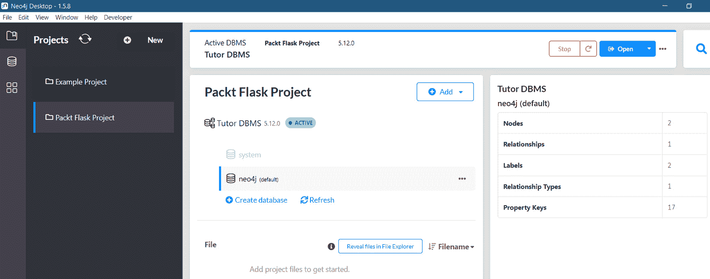

            <st c="90213">图 7.20 – Neo4J 桌面仪表板</st>

            <st c="90254">Flask 可以通过多种方式连接到图数据库，其中之一是通过</st> `<st c="90348">py2neo</st>` <st c="90354">库。</st> <st c="90364">我们将在下一节中对此进行更详细的探讨。</st>

            <st c="90417">建立数据库连接</st>

            <st c="90459">首先，使用</st> `<st c="90478">py2neo</st>` <st c="90484">通过</st> `<st c="90491">pip</st>` <st c="90498">命令安装：</st>

```py
 pip install py2neo
```

            <st c="90526">接下来，在主项目文件夹中创建一个</st> `<st c="90542">neo4j_config.py</st>` <st c="90557">模块，包含以下脚本以确保</st> <st c="90628">数据库连接：</st>

```py
<st c="90650">from py2neo import Graph</st> def db_auth(): <st c="90691">graph = Graph("bolt://127.0.0.1:7687", auth=("neo4j",</st> <st c="90744">"packt2255"))</st> return graph
```

            <st c="90771">现在，调用给定的</st> `<st c="90795">db_auth()</st>` <st c="90804">方法将启动与主机、端口和认证详情的 bolts 连接协议，通过</st> `<st c="90970">Graph</st>` <st c="90975">实例（负责仓库层实现的对象）为我们的</st> *<st c="90933">导师查找器</st>* <st c="90945">应用程序打开一个连接。</st>

            <st c="91045">实现仓库</st>

            `<st c="91333">Graph</st>` <st c="91338">实例具有几个实用方法来推导模块的构建块，即</st> `<st c="91428">SubGraph</st>`<st c="91436">,</st> `<st c="91438">Node</st>`<st c="91442">,</st> `<st c="91444">NodeMatcher</st>`<st c="91455">, 和</st> `<st c="91461">Relationship</st>`<st c="91473">。在这里，</st> `<st c="91481">StudentNodeRepository</st>` <st c="91502">展示了如何使用 py2neo 的 API 类和方法来管理</st> `<st c="91573">学生节点</st>`：</st>

```py
<st c="91587">from main import graph</st>
<st c="91610">from py2neo import Node, NodeMatcher, Subgraph, Transaction</st>
<st c="91670">from py2neo.cypher import Cursor</st> from typing import Any, Dict
class StudentNodeRepository:
    def __init__(self):
        pass
    def insert_student_node(self, details:Dict[str, Any]):
        try: <st c="91847">tx:Transaction = graph.begin()</st><st c="91877">node_trainer = Node("Tutor", **details)</st><st c="91917">graph.create(node_trainer)</st><st c="91944">graph.commit(tx)</st> return True
        except Exception as e:
            print(e)
        return False
```

            <st c="92018">`<st c="92023">insert_student_node()</st>` <st c="92044">方法创建一个</st> `<st c="92062">Student</st>` <st c="92069">节点并将它的详细信息存储在图数据库中。</st> <st c="92121">节点是 Neo4J 中的基本数据单元；它可以是一个独立的节点，也可以通过</st> `<st c="92236">关系</st>` <st c="92251">与其他节点相连。</st>

            <st c="92251">使用</st> `<st c="92298">py2neo</st>` <st c="92304">库创建节点有两种方式：</st>

                +   <st c="92313">使用 Cypher 的</st> *<st c="92344">CREATE</st>* <st c="92350">事务通过 Graph 的</st> `<st c="92377">query()</st>` <st c="92384">或</st> `<st c="92388">run()</st>` <st c="92393">方法运行查询。</st>

                +   <st c="92402">使用</st> `<st c="92418">Node</st>` <st c="92422">对象通过</st> `<st c="92440">Graph</st>` <st c="92445">对象的</st> `<st c="92455">create()</st>` <st c="92463">方法持久化。</st>

            <st c="92471">创建节点需要事务管理，因此我们必须启动一个</st> `<st c="92540">事务</st>` <st c="92551">上下文来提交所有数据操作。</st> <st c="92608">在此处，</st> `<st c="92614">insert_student_node()</st>` <st c="92635">创建一个</st> `<st c="92646">事务</st>` <st c="92657">对象，为</st> `<st c="92733">图</st>` <st c="92738">对象的</st> `<st c="92748">commit()</st>` <st c="92756">方法</st> <st c="92764">创建一个逻辑上下文，以便提交：</st>

```py
 def update_student_node(self, details:Dict[str, Any]):
        try: <st c="92835">tx = graph.begin()</st><st c="92853">matcher = NodeMatcher(graph)</st><st c="92882">student_node:Node  = matcher.match('Student',</st> <st c="92927">student_id=details['student_id']).first()</st> if not student_node == None:
                del details['student_id'] <st c="93025">student_node.update(**details)</st><st c="93055">graph.push(student_node)</st><st c="93080">graph.commit(tx)</st> return True
            else:
                return False
        except Exception as e:
            print(e)
        return False
```

            *<st c="93173">节点管理器</st>* <st c="93185">可以根据键值对中的条件定位特定的节点</st> <st c="93212">。</st> <st c="93252">在此处，</st> `<st c="93258">update_student_node()</st>` <st c="93279">使用</st> `<st c="93289">match()</st>` <st c="93296">方法从</st> `<st c="93309">节点管理器</st>` <st c="93320">中筛选出一个具有特定</st> `<st c="93337">节点</st>` <st c="93341">对象和</st> `<st c="93367">student_id</st>` <st c="93377">值</st>。</st> <st c="93385">在检索到图节点后，如果有的话，你必须调用</st> `<st c="93451">节点</st>` <st c="93455">对象的</st> `<st c="93465">update()</st>` <st c="93473">方法，并使用新数据的</st> `<st c="93490">kwargs</st>` <st c="93496">值。</st> <st c="93520">要将更新的</st> `<st c="93541">节点</st>` <st c="93545">对象与其提交版本合并，调用</st> `<st c="93592">图</st>` <st c="93597">对象的</st> `<st c="93607">push()</st>` <st c="93613">方法并执行</st> <st c="93633">提交。</st>

            <st c="93642">另一种搜索和检索</st> `<st c="93685">节点</st>` <st c="93689">匹配的方法是通过</st> `<st c="93711">图</st>` <st c="93716">对象的</st> `<st c="93726">query()</st>` <st c="93733">方法。</st> <st c="93742">它可以执行</st> *<st c="93757">CREATE</st>* <st c="93763">和其他 Cipher 操作命令，因为它具有自动提交功能。</st> <st c="93840">但在大多数情况下，它应用于节点检索事务。</st> <st c="93905">在此处，</st> `<st c="93911">delete_student_node()</st>` <st c="93932">使用带有</st> `<st c="93966">MATCH</st>` <st c="93971">命令的</st> `<st c="93942">query()</st>` <st c="93949">方法检索要删除的特定节点：</st>

```py
 def delete_student_node(self, student_id:str):
        try: <st c="94074">tx = graph.begin()</st><st c="94092">student_cur:Cursor = graph.query(f"MATCH</st> <st c="94133">(st:Student) WHERE st.student_id =</st> <st c="94168">'{student_id}' Return st")</st><st c="94195">student_sg:Subgraph = student_cur.to_subgraph()</st><st c="94243">graph.delete(student_sg)</st><st c="94268">graph.commit(tx)</st> return True
        except Exception as e:
            print(e)
        return False
```

            `<st c="94342">The</st>` `<st c="94347">Graph</st>` <st c="94352">对象上的</st> `<st c="94362">query()</st>` <st c="94369">方法返回</st> `<st c="94385">Cursor</st>`<st c="94391">，它是节点流的导航器。</st> `<st c="94436">Graph</st>` <st c="94440">对象有一个</st> `<st c="94459">delete()</st>` <st c="94467">方法，可以删除通过</st> `<st c="94514">query()</st>`<st c="94521">检索到的任何节点，但节点应该以</st> *<st c="94550">SubGraph</st>* <st c="94558">形式存在。</st> `<st c="94565">要删除检索到的节点，需要通过调用</st> `<st c="94661">to_subgraph()</st>` <st c="94674">方法将</st> `<st c="94608">Cursor</st>` <st c="94614">对象转换为</st> *<st c="94629">SubGraph</st>* <st c="94637">。</st> `<st c="94683">然后，调用</st> `<st c="94694">commit()</st>` <st c="94702">来处理整个</st> <st c="94723">删除事务。</st>

            `<st c="94742">在</st> `<st c="94763">py2neo</st>` <st c="94769">中检索节点可以利用</st> `<st c="94781">NodeManager</st>` <st c="94800">或</st> `<st c="94808">Graph</st>` <st c="94813">对象的</st> `<st c="94823">query()</st>` <st c="94830">方法。</st> `<st c="94839">在此，</st> `<st c="94845">get_student_node()</st>` <st c="94863">使用</st> `<st c="94927">NodeMatcher</st>`<st c="94938">通过学生 ID 过滤检索特定的</st> `<st c="94885">Student</st>` <st c="94892">节点，而</st> `<st c="94946">select_student_nodes()</st>` <st c="94968">使用</st> `<st c="94974">query()</st>` <st c="94981">检索</st> `<st c="95004">Student</st>` <st c="95011">节点列表：</st>

```py
 def get_student_node(self, student_id:str): <st c="95063">matcher = NodeMatcher(graph)</st><st c="95091">student_node:Node  = matcher.match('Student',</st> <st c="95136">student_id=student_id).first()</st><st c="95167">record = dict(student_node)</st> return record
    def select_student_nodes(self): <st c="95242">student_cur:Cursor = graph.query(f"MATCH (st:Student)</st> <st c="95295">Return st")</st> records = student_cur.data()
        return records
```

            `<st c="95351">The</st>` `<st c="95356">dict()</st>` <st c="95362">函数将一个</st> `<st c="95383">Node</st>` <st c="95387">对象转换为字典，从而通过给定的</st> `<st c="95481">get_student_node()</st>`<st c="95499">函数使用</st> `<st c="95452">dict()</st>` <st c="95458">函数将</st> `<st c="95430">Student</st>` <st c="95437">节点包装起来。另一方面，</st> `<st c="95520">Cursor</st>` <st c="95526">有一个</st> `<st c="95533">data()</st>` <st c="95539">函数，可以将</st> `<st c="95575">Node</st>` <st c="95579">对象的流转换为字典元素的列表。</st> <st c="95624">因此，</st> `<st c="95628">select_student_nodes()</st>` <st c="95650">返回的</st> `<st c="95673">Student</st>` <st c="95680">节点流是一个</st> `<st c="95686">Student</st>` <st c="95700">记录的列表。</st>

            `<st c="95716">Summary</st>`

            <st c="95724">有许多 NoSQL 数据库可以存储 Flask 3.x 构建的大数据应用的非关系型数据。</st> <st c="95842">Flask 可以</st> `<st c="95852">PUT</st>`<st c="95855">,</st> `<st c="95857">GET</st>`<st c="95860">, 和</st> `<st c="95866">SCAN</st>` <st c="95870">数据在 HBase 中使用 HDFS，访问 Cassandra 数据库，执行</st> `<st c="95936">HGET</st>` <st c="95940">一个</st> `<st c="95944">HSET</st>` <st c="95948">与 Redis，在 Couchbase 和 MongoDB 中执行 CRUD 操作，并使用 Neo4J 管理节点。</st> <st c="96040">尽管一些支持模块（例如在</st> `<st c="96103">flask-mongoengine</st>`<st c="96120">中）有所变化，因为 Flask 内部模块（例如，移除</st> `<st c="96212">flask.json</st>`<st c="96222">）发生了变化，但 Flask 仍然可以适应其他 Python 模块扩展和解决方案来连接和管理其数据，例如使用与 FastAPI 兼容的</st> <st c="96370">Redis OM。</st>

            <st c="96379">总的来说，本章展示了 Flask 几乎与所有高效、流行和广泛使用的 NoSQL 数据库的兼容性。</st> <st c="96510">它也是一个适合构建许多企业和科学发展的大数据应用的 Python 框架，因为它支持许多</st> <st c="96659">NoSQL 存储。</st>

            <st c="96674">下一章将介绍如何使用 Flask 通过工作流实现任务管理</st> <st c="96742">。</st>

```py

```

```py

```

```py

```
