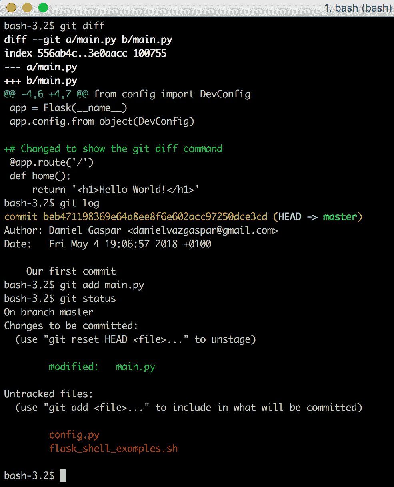
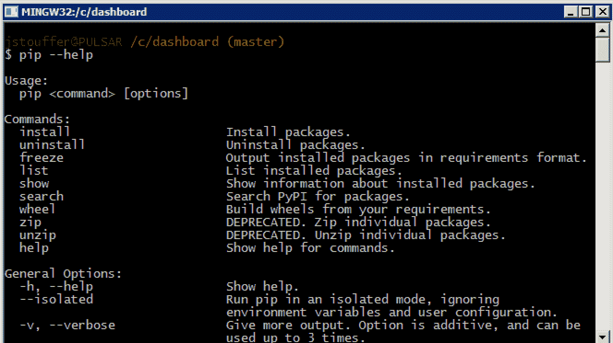

# 第一章：入门指南

在本书的整个过程中，你将接触到多个概念，这些概念将使你能够构建一个完整的现代网络应用程序。你将从“Hello world”网页进步到一个完整的网络应用程序，该应用程序使用数据库、缓存、异步任务处理、身份验证、基于角色的访问、REST API 和国际化。你将学习一种全面的方法来构建你的应用程序，使其能够轻松扩展。为了在 SQL 和 NoSQL 技术之间做出选择，你将学习如何使用最常用的 Flask 扩展来帮助你利用多种技术，从发送电子邮件到使用社交媒体账户进行身份验证。在本书的结尾，你将学习如何编写测试、使用 Docker 和 Jenkins 构建现代的持续集成/交付管道、将你的应用程序部署到多个云服务，以及如何处理高可用性和扩展。我们将以简单实用的方法解决所有这些问题。

**Flask** 是我们将要使用的 Python 网络框架。它有一个非常精心设计的 API，易于学习，并且对你要使用的任何技术栈不做任何假设，因此不会妨碍你。Flask 有一个微小的足迹，但利用了一个包含数百个来自非常活跃和充满活力的社区包的扩展系统。

在本章中，你将学习如何设置你的开发环境并构建你的第一个 Flask 应用程序。我们将涵盖以下主题：

+   设置和使用 Git，一个强大的版本控制系统

+   学习 pip，Python 管理系统，以及如何使用不同的设置创建虚拟环境

+   设置和学习 Docker 的基本事实

+   构建第一个简单的 Flask 应用程序

# 使用 Git 进行版本控制

使用 Python 或任何其他语言需要你使用版本控制系统。版本控制系统是一个记录文件随时间变化的工具。这允许程序员回滚到文件的早期版本并更容易地识别错误。你可以测试新想法而不用担心破坏当前的代码，你的团队可以使用预定义的工作流程工作，而不会互相干扰。Git 是由 Linux 的创始人 Linus Torvalds 开发的。它是分布式的、轻量级的，并且具有完成工作的正确方式的功能。

# 安装 Git

安装 Git 非常简单。只需访问 [`www.git-scm.com/downloads`](http://www.git-scm.com/downloads) 并点击正在运行的 **操作系统**（**OS**），程序将开始下载并引导你完成基本的安装过程。

# Windows 上的 Git

Git 最初是专门为 Unix 操作系统（例如，Linux 和 macOS X）开发的。因此，在 Windows 上使用 Git 并不流畅。在安装过程中，安装程序会询问你是否想将 Git 与正常的 Windows 命令提示符一起安装。不要选择此选项。选择默认选项，该选项将在你的系统上安装一种新的命令处理器，名为**Bash**（**Bourne-again shell**），这是 Unix 系统使用的相同命令处理器。Bash 比默认的 Windows 命令行强大得多，这就是我们将在这本书的所有示例中使用的东西。

对于初学者来说，可以在[`linuxcommand.org`](http://linuxcommand.org)找到 Bash 的良好介绍。

# Git 基础

Git 是一个非常复杂的工具；本节将只涵盖本书所需的基本内容。

要了解更多信息，请参阅 Git 文档[`www.git-scm.com/doc`](http://www.git-scm.com/doc)。

Git 不会自动跟踪你的更改。为了使 Git 正常运行，我们必须给它以下信息：

+   哪些文件夹要跟踪

+   何时保存代码的状态

+   要跟踪什么，不要跟踪什么

在我们能够做任何事情之前，我们必须告诉 Git 在我们的目录中初始化一个新的`git`仓库。在你的终端上运行以下代码：

```py
$ git init
```

Git 现在将开始跟踪我们项目中的更改。当`git`跟踪我们的文件时，我们可以通过输入以下命令来查看我们跟踪的文件的状态以及任何未被跟踪的文件：

```py
$ git status
```

现在，我们可以保存我们的第一个`commit`，这是我们在运行`commit`命令时的代码快照：

```py
# In Bash, comments are marked with a #, just like Python
# Add any files that have changes and you wish to save in this      
# commit
$ git add main.py
# Commit the changes, add in your commit message with -m
$ git commit -m "Our first commit"
```

现在，在未来的任何时刻，我们都可以回到我们项目中的这个点。将要提交的文件在 Git 中被称为**暂存**文件。记住，只有当你准备好提交这些文件时，才应该添加暂存文件。一旦文件被暂存，任何进一步的更改都不会被暂存。以下是一个更高级 Git 使用的示例：使用你的文本编辑器向`main.py`文件中添加任何文本，然后运行以下命令：

```py
    # To see the changes from the last commit
    $ git diff
    # To see the history of your changes
    $ git log
    # As an example, we will stage main.py
    # and then remove any added files from the stage
    $ git add main.py
    $ git status
    $ git reset HEAD main.py
    # After any complicated changes, be sure to run status
    # to make sure everything went well
    $ git status
    # lets delete the changes to main.py, reverting to its state at the   
    # last commit # This can only be run on files that aren't staged
    $ git checkout -- main.py
```

你的终端应该看起来像以下这样：



注意，在先前的例子中，我已经通过添加注释`# Changed to show the git diff command`修改了`main.py`文件。

在每个 Git 仓库中包含的一个重要步骤是`.gitignore`文件。这个文件告诉 Git 忽略哪些文件。这样你就可以安全地提交和添加所有你的文件。以下是一些你可以忽略的常见文件：

+   Python 的字节码文件（`*.pyc`）

+   数据库（特别是我们使用 SQLLite 数据库文件的示例）(`*.db`)

+   秘密（永远不要将秘密（密码、密钥等）推送到你的仓库）

+   IDE 元数据文件（`.idea`）

+   `Virtualenv`目录（`env`或`venv`）

这里是一个简单的`gitignore`文件示例：

```py
*.pyc
*.pem
*.pub
*.tar.gz
*.zip
*.sql
*.db
secrets.txt
./tmp
./build/*
.idea/*
.idea
env
venv
```

现在，我们可以安全地将所有文件添加到`git`并提交它们：

```py
 $ git add --all
 $ git status
 $ git commit -a -m "Added gitignore and all the projects missing 
    files"
```

Git 系统的 `checkout` 命令对于这个简单的介绍来说相当高级，但它用于更改 Git 系统的 `HEAD` 指针的当前状态，该指针指向我们项目历史中的代码当前位置。这将在下一个示例中展示。

现在，如果我们想查看之前的提交中的代码，我们应该首先运行以下命令：

```py
$ git log commit cd88be37f12fb596be743ccba7e8283dd567ac05 (HEAD -> master)
Author: Daniel Gaspar
Date: Sun May 6 16:59:46 2018 +0100

Added gitignore and all the projects missing files
commit beb471198369e64a8ee8f6e602acc97250dce3cd
Author: Daniel Gaspar
Date: Fri May 4 19:06:57 2018 +0100

Our first commit
```

在我们的 `commit` 消息旁边的字符序列，`beb4711`，被称为我们的 **hash**。它是提交的唯一标识符，我们可以用它返回到保存的状态。现在，要将项目回滚到之前的状态，请运行以下命令：

```py
$ git checkout beb4711
```

您的 Git 项目现在处于一个特殊状态，任何更改或提交都不会被保存，也不会影响您检出之后的任何提交。这种状态仅用于查看旧代码。要返回 Git 的正常模式，请运行以下命令：

```py
$ git checkout master
```

# Git 分支和流程

版本控制分支是团队项目中一个重要的功能，它非常适合团队合作。开发者可以从特定的时间点、修订或标签创建新的代码分支。这样，开发新功能、创建发布版本以及修复错误或热修复都可以在团队审查和/或自动集成工具（如测试、代码覆盖率、代码检查工具）的支持下安全地进行。一个分支可以与其他分支合并，直到最终达到主代码线，称为 *主分支*。

但让我们来做一个实际的练习。假设我们想要开发一个新功能。我们的第一个章节示例显示了传统的“Hello World”消息，但我们希望它对用户说“早上好”。首先，我们从名为 `feature/good-morning` 的特殊分支创建一个分支，目前它是主分支的副本，如下面的代码所示：

```py
# Display our branches
$ git branch * master # Create a branch called feature/good-morning from master
$ git branch feature/good-morning
# Display our branches again
$ git branch  feature/good-morning
* master # Check out the new feature/good-morning branch
$ git checkout feature/good-morning 
```

这可以简化为以下内容：

```py
$ git checkout -b feature/good-morning master
```

现在，让我们修改我们的代码，使其能够向访问特定 URL 的访客显示“早上好”，以及他们的名字。为此，我们修改 `main.py`，如下面的代码所示：

```py
@app.route('/')
def home():
    return '<h1>Hello world</h1>'
```

我们将 `main.py` 修改为以下内容：

```py
@app.route('/username')
def home():
    return '<h1>Good Morning %s</h1>' % username
```

让我们看看我们做了什么：

```py
$ git diff
diff --git a/main.py b/main.py
index 3e0aacc..1a930d9 100755
--- a/main.py
+++ b/main.py
@@ -5,9 +5,9 @@ app = Flask(__name__)
 app.config.from_object(DevConfig)

 # Changed to show the git diff command
-@app.route('/')
-def home():
- return '<h1>Hello World!</h1>'
+@app.route('/<username>')
+def home(username):
+ return '<h1>Good Morning %s</h1>' % username

 if __name__ == '__main__':
 app.run()
```

看起来不错。让我们按照以下代码进行提交：

```py
$ git commit -m "Display good morning because its nice"
[feature/good-morning d4f7fb8] Display good morning because its nice
 1 file changed, 3 insertions(+), 3 deletions(-)
```

现在，如果我们作为团队的一部分工作，或者我们的工作是开源的（或者如果我们只是想备份我们的工作），我们应该将我们的代码上传（推送）到集中的远程仓库。这样做的一种方式是将我们的代码推送到版本控制系统，如 **Bitbucket** 或 **GitHub**，然后向主分支提交一个 **pull request**。这个 pull request 将显示我们的更改。因此，可能需要其他团队成员的批准，以及这些系统可以提供的许多其他功能。

Flask 项目的 pull request 例子可以在 [`github.com/pallets/flask/pull/1767`](https://github.com/pallets/flask/pull/1767) 找到。

对于我们的例子，我们只需将代码合并到主分支，如下面的代码所示：

```py
# Get back to the master branch
$ git checkout master
Switched to branch 'master'
bash-3.2$ git log
commit 139d121d6ecc7508e1017f364e6eb2e4c5f57d83 (HEAD -> master)
Author: Daniel Gaspar
Date: Fri May 4 23:32:42 2018 +0100

 Our first commit
# Merge our feature into the master branch
$ git merge feature/good-morning
Updating 139d121..5d44a43
Fast-forward
 main.py | 6 +++---
 1 file changed, 3 insertions(+), 3 deletions(-)
bash-3.2$ git log
commit 5d44a4380200f374c879ec1f7bda055f31243263 (HEAD -> master, feature/good-morning)
Author: Daniel Gaspar
Date: Fri May 4 23:34:06 2018 +0100

Display good morning because its nice commit 139d121d6ecc7508e1017f364e6eb2e4c5f57d83
Author: Daniel Gaspar <daniel.gaspar@miniclip.com>
Date: Fri May 4 23:32:42 2018 +0100

Our first commit
```

如你所见，Git 默认使用快速前进策略。如果我们想保留一个额外的提交日志消息，提到合并本身，那么我们可以在 `git merge` 命令中使用 `--no-ff` 标志。这个标志将禁用快速前进合并策略。

更多详情，请访问 [`git-scm.com/book/en/v2/Git-Branching-Basic-Branching-and-Merging`](https://git-scm.com/book/en/v2/Git-Branching-Basic-Branching-and-Merging)。

现在想象一下，我们后悔我们的更改，并想将我们刚刚创建的功能回滚到早期版本。为此，我们可以使用以下代码：

```py
$ git revert
```

使用 Git，你实际上可以删除你的提交，但这被认为是一种非常不好的做法。请注意，`revert` 命令并没有删除我们的合并，而是创建了一个带有还原更改的新提交。被认为是一个好习惯，不要重写过去。

所展示的是一个功能分支简单的工作流程。对于大型团队或项目，通常采用更复杂的流程来更好地隔离功能、修复和发布，并保持代码的稳定性。这就是使用 git-flow 流程时所提出的。

现在我们有了版本控制系统，我们准备介绍 Python 的包管理系统。

# 使用 pip 进行 Python 包管理

在 Python 中，程序员可以从其他程序员那里下载扩展标准 Python 库功能的库。正如你从使用 Flask 中已经知道的那样，Python 的许多强大功能都来自于其大量的社区创建的库。

然而，正确安装第三方库可能是一个巨大的麻烦。比如说，你想安装包 X。很简单：下载 ZIP 文件并运行 `setup.py`，对吧？但并不完全是这样。包 X 依赖于包 Y，而 Y 又依赖于 Z 和 Q。这些信息都没有在包 X 的网站上列出，但这些包需要安装才能使 X 正常工作。然后你必须一个接一个地找到所有这些包并安装它们，然后希望你安装的包本身不需要任何额外的包。

为了自动化这个过程，我们使用 **pip**，Python 的包管理器。

# 在 Windows 上安装 Python 包管理器

如果你正在使用 Windows，并且之前安装的 Python 版本就是当前版本，那么你已经有 pip 了！如果你的 Python 安装不是最新版本，那么最简单的方法就是重新安装它。下载 Python Windows 安装程序，请访问 [`www.python.org/downloads/`](https://www.python.org/downloads/)。

在 Windows 中，控制哪些程序可以通过命令行访问的变量是 `path`。为了将 Python 和 pip 包含到我们的 `path` 中，我们必须添加 `C:\Python27` 和 `C:\Python27\Tools`。通过打开 Windows 菜单，右键单击计算机，然后单击属性来编辑 Windows 的 `path`。在高级系统设置下，点击环境变量...向下滚动直到找到 Path，双击它，并在末尾添加 `;C:\Python27;C:\Python27\Tools`。

为了确保你已经正确修改了你的路径，请关闭并重新打开你的终端，并在命令行中输入以下内容：

```py
pip --help
```

Pip 应该已经打印了它的使用信息，如下面的截图所示：



# 在 macOS X 和 Linux 上安装 pip Python 包管理器

一些 Linux 的 Python 安装没有包含 pip，Mac OS X 的安装默认也不包含 pip。如果你使用的是 Python 2.7，那么你可能需要安装 pip，但 pip 已经包含在 Python 3.4 及其后续版本中。你可以使用以下方法进行检查：

```py
$ python3 -m pip list
```

如果你需要安装它，请从 [`bootstrap.pypa.io/get-pip.py`](https://bootstrap.pypa.io/get-pip.py) 下载 `get-pip.py` 文件。

下载完成后，使用以下代码以提升权限运行它：

```py
# Download and install pip
$ wget https://bootstrap.pypa.io/get-pip.py    
$ sudo python get-pip.py
```

一旦输入完成，pip 将会自动安装。

# Pip 基础

我们现在将学习使用 Python 包管理器的基本命令。要使用 `pip` 安装一个包，请输入以下代码：

```py
$ pip install [package-name]
```

在 Mac 和 Linux 上，因为你是在用户拥有的文件夹外安装程序，你可能需要在 `install` 命令前加上 `sudo`。要安装 Flask，只需运行以下命令：

```py
$ pip install flask
```

一旦你完成这个步骤，所有你需要用于使用 Flask 的依赖项都将为你安装。

如果你想要删除你不再使用的包，请运行以下命令：

```py
$ pip uninstall [package-name]
```

如果你希望探索或查找一个包，但不知道它的确切名称，你可以使用 `search` 命令：

```py
$ pip search [search-term]
```

现在我们已经安装了一些包，在 Python 社区中，这是一种礼貌的做法，创建一个包含运行项目所需所有包的列表，以便其他人可以快速安装每个必要的包。这也带来了额外的便利，即任何新加入你项目的人都能快速运行你的代码。

这个列表可以通过运行以下命令使用 pip 创建：

```py
$ pip freeze > requirements.txt
```

这个命令究竟做了什么？`pip freeze` 命令会自动打印出已安装的包及其版本列表。在我们的例子中，它打印了以下内容：

```py
click==6.7
Flask==0.12.4
itsdangerous==0.24
Jinja2==2.10
MarkupSafe==1.0
Werkzeug==0.14.1
```

`>` 操作符告诉 Bash 将最后一条命令打印的所有内容写入此文件。如果你查看你的项目目录，你可以看到一个名为 `requirements.txt` 的新文件，它包含了 `pip freeze` 的输出。

要安装此文件中的所有包，新的项目维护者必须运行以下代码，如下所示。通常，这也会用于部署项目的生产环境：

```py
$ pip install -r requirements.txt
```

上述代码告诉`pip`读取`requirements.txt`中列出的所有包并安装它们。

# 使用 virtualenv 进行依赖沙盒化

所以你已经安装了你新项目所需的所有包。太好了！但如果我们稍后开发第二个项目，它将使用相同包的新版本，会发生什么呢？还有，当你希望使用的库依赖于为第一个项目安装的库，但该库使用这些包的较旧版本时，会发生什么？当包的新版本包含破坏性更改时，升级它们可能需要在较旧的项目上做额外的工作，而你可能负担不起。因此，在我们的系统中，我们可能在项目之间有冲突的 Python 包。

我们还应该考虑自动构建环境，例如**Jenkins**，在那里我们想要运行测试。这些构建可能运行在其他项目正在构建的同一系统上，因此在构建作业期间，我们创建一个不共享于作业之间的 Python 包环境是至关重要的。这个环境是由我们之前创建的`requirements.txt`文件中的信息创建的。这样，多个 Python 应用程序可以在同一系统上构建和测试，而不会相互冲突。

幸运的是，有**virtualenv**这个工具，它可以沙盒化你的 Python 项目。virtualenv 的秘密在于欺骗你的计算机在项目目录中而不是在主 Python 目录中查找和安装包，这允许你将它们完全分开。

如果你使用 Python 3——我建议你这样做，因为 Python 2 的支持将在 2020 年结束——那么你不需要安装 virtualenv；你可以像运行包一样运行它，如下所示：

```py
# Create a python 3 virtualenv
$ python3 -m venv env
```

现在我们有了 pip，如果我们需要安装`virtualenv`，我们只需运行以下命令：

```py
$ pip install virtualenv
```

# Virtualenv 基础知识

让我们按照以下方式初始化我们的项目`virtualenv`：

```py
$ virtualenv env
```

额外的`env`告诉 virtualenv 将所有包存储在一个名为`env`的文件夹中。virtualenv 要求你在沙盒化项目之前启动它。你可以使用以下代码来完成此操作：

```py
$ source env/bin/activate
# Your prompt should now look like
(env) $
```

`source`命令告诉 Bash 在当前目录的上下文中运行`env/bin/activate`脚本。让我们按照以下方式在我们的新沙盒中重新安装 Flask：

```py
# you won't need sudo anymore
(env) $ pip install flask
# To return to the global Python
(env) $ deactivate
```

# 设置 Docker

您的开发项目通常需要比 Web 服务器应用程序层更多的东西；您肯定需要某种类型的数据库系统。您可能正在使用缓存、**redis**、带有**Celery**的工作者、一个消息队列系统，或者别的什么。通常，所有使您的应用程序正常工作的系统都统称为**栈**。一个简单的方法是轻松定义并快速生成所有这些组件是使用**Docker**容器。使用 Docker，您定义所有应用程序组件以及如何安装和配置它们，然后您可以与您的团队共享您的栈，并使用完全相同的规范将其发送到生产环境。

您可以从[`docs.docker.com/install/`](https://docs.docker.com/install/)下载并安装 Docker。

首先，让我们创建一个非常简单的**Dockerfile**。此文件定义了如何设置您的应用程序。每一行都将作为容器层，以实现非常快的重建。一个非常简单的 Dockerfile 看起来如下所示：

```py
FROM python:3.6.5
# Set the working directory to /app
WORKDIR /app
# Copy local contents into the container
ADD . /app
# Install all required dependencies
RUN pip install -r requirements.txt
EXPOSE 5000
CMD ["python", "main.py"]
```

接下来，让我们构建第一个容器镜像。我们将将其标记为`chapter_1`，以便于进一步的使用，如下面的代码所示：

```py
$ docker build -t chapter_1 . 
```

然后，我们将运行它，如下面的代码所示：

```py
$ docker run -p 5000:5000 chapter_1
# List all the running containers
$ docker container list
```

Docker 很简单，但它是一个复杂的工具，具有许多配置和部署容器的选项。我们将在第十三章，*部署 Flask 应用程序*中更详细地了解 Docker。

# 我们项目的开始

最后，我们可以进入我们的第一个 Flask 项目。为了在本书的结尾构建一个复杂的项目，我们需要一个简单的 Flask 项目作为起点。

# 简单的应用程序

Flask 非常强大，但绝对不会妨碍您。您可以使用它使用单个文件创建一个简单的 Web 应用程序。我们的目标是创建一个结构化的项目，使其可以扩展且易于理解。目前，我们将首先创建一个`config`文件。在名为`config.py`的文件中，添加以下内容：

```py
class Config(object): 
    pass 

class ProdConfig(Config): 
    pass 

class DevConfig(Config): 
    DEBUG = True 
```

现在，在另一个名为`main.py`的文件中，添加以下内容：

```py
from flask import Flask 
from config import DevConfig 

app = Flask(__name__) 
app.config.from_object(DevConfig) 

@app.route('/') 
def home(): 
    return '<h1>Hello World!</h1>' 

if __name__ == '__main__': 
    app.run() 
```

对于熟悉基础 Flask API 的人来说，这个程序非常基础。如果我们导航到`http://127.0.0.1:5000`，它将简单地显示`Hello World!`。可能对 Flask 用户不太熟悉的是使用短语`config.from_object`而不是`app.config['DEBUG']`。我们使用`from_object`是因为在未来，将使用多个配置，当我们需要在不同配置之间切换时，手动更改每个变量是耗时的。

# 项目结构

我们创建了一个非常简单的项目结构，但它能否作为任何 Python 项目的基架。在第五章，*高级应用程序结构*中，我们将接触到更可扩展的结构，但现在，让我们回到我们的环境，如下面的代码所示：

```py
Dockerfile # Instructions to configure and run our application on a container
requirements.txt # All the dependencies needed to run our application
/venv # We will not add this folder to our Git repo, our virtualenv
.gitignore # Instruction for Git to ignore files
main.py # Our main Flask application
config.py # Our configuration file
```

记得像下面的代码一样在 Git 中提交这些更改：

```py
# The --all flag will tell git to stage all changes you have made
# including deletions and new files
$ git add --all
$ git commit -m" ""created the base application"
```

你将不再被提醒何时将更改提交到 Git。养成在达到一个停止点时提交更改的习惯取决于你。还假设你将在虚拟环境中操作，因此所有命令行提示将不会以`(env)`为前缀。

# 使用 Flask 的命令行界面

为了使下一章对读者来说更容易理解，我们将探讨如何使用 Flask CLI（从版本 0.11 开始）。CLI 允许程序员创建在 Flask 的**应用程序上下文**中运行的命令——也就是说，允许修改`Flask`对象的 Flask 状态。Flask CLI 自带一些默认命令，可以在应用程序上下文中运行服务器和 Python shell。

让我们看看 Flask CLI 以及如何初始化它。首先，我们必须使用以下代码告诉它如何发现我们的应用程序：

```py
$ export FLASK_APP=main.py
```

然后，我们将使用以下代码使用 Flask CLI 运行我们的应用程序：

```py
$ flask run
```

现在，让我们进入应用程序上下文中的 shell，看看如何使用以下代码获取所有定义的 URL 路由：

```py
$ flask shell Python 3.6.5 (v3.6.5:f59c0932b4, Mar 28 2018, 03:03:55)
[GCC 4.2.1 (Apple Inc. build 5666) (dot 3)] on darwin
App: main [debug]
Instance: /chapter_1/instance >>> app.url_map
Map([<Rule '/' (OPTIONS, GET, HEAD) -> home>,
 <Rule '/static/<filename>' (OPTIONS, GET, HEAD) -> static>])
```

如你所见，我们已经有两条路由定义：显示"`Hello World`"句子的`/`路由和 Flask 创建的静态默认路由。一些其他有用的信息显示了 Flask 认为我们的模板和静态文件夹在哪里，如下面的代码所示：

```py
>>> app.static_folder
/chapter_1/static'
>>> app.template_folder
'templates'
```

Flask CLI 使用 Flask 创建者的`click`库。它被设计成易于扩展，以便 Flask 扩展可以扩展它并实现当使用时可用的新命令。我们确实应该扩展它——我们自己扩展它使其更有用。这是为我们的应用程序创建管理命令的正确方式。想想你可以用来迁移数据库模式、创建用户、修剪数据等命令。

# 摘要

既然我们已经设置了我们的开发环境，我们就可以继续在 Flask 中实现高级应用程序功能。在我们能够进行任何可视化操作之前，我们需要显示的内容。这些内容将保存在数据库中。在下一章中，你将了解如何在 Flask 中与数据库一起工作，以及如何掌握它们。
