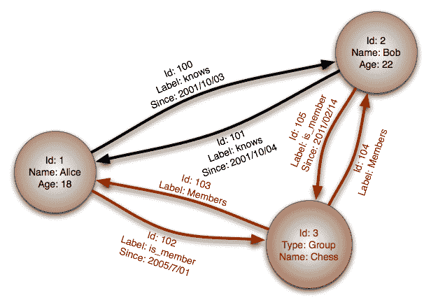
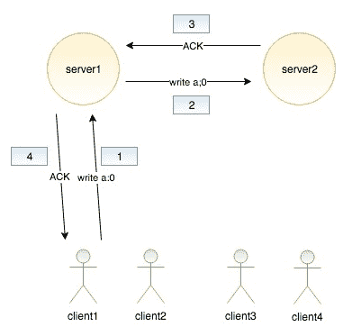
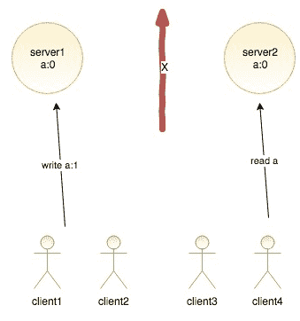

# 第七章：在 Flask 中使用 NoSQL

**NoSQL**（代表**Not Only SQL**）数据库是指任何非关系型数据存储。它通常侧重于速度和可扩展性。过去七年中，NoSQL 一直在 Web 开发世界中掀起风暴。像 Netflix 和 Google 这样的大公司已经宣布，他们正在将许多服务迁移到 NoSQL 数据库，许多较小的公司也效仿了它们的做法。

本章将与本书的其他部分有所不同，因为它不会主要关注 Flask。在关于 Flask 的书中关注数据库设计可能看起来有些奇怪，但选择适合您应用程序的正确数据库可能是您在设计技术堆栈时可以做出的最重要的决定。在绝大多数 Web 应用程序中，数据库是瓶颈，因此您选择的数据库将决定您应用程序的整体速度。亚马逊进行的一项研究表明，即使 100 毫秒的延迟也会导致销售额下降 1%，因此速度始终应该是 Web 开发者关注的重点之一。在程序员社区中，关于 Web 开发者选择流行的 NoSQL 数据库但并未真正理解数据库在管理方面的要求的恐怖故事也很多。这导致大量数据丢失和崩溃，进而意味着客户流失。总的来说，可以说您为应用程序选择的数据库可能是您的应用程序成功与失败之间的区别。

在本章中，我们将通过检查每种类型的 NoSQL 数据库以及 NoSQL 与传统数据库之间的差异，来说明 NoSQL 数据库的优点和缺点。

# NoSQL 数据库类型

NoSQL 是一个总称，用于描述在数据库中存储数据的非传统方法。绝大多数 NoSQL 数据库都不是关系型数据库——与 RDBMS 不同——这意味着它们通常无法执行诸如`JOIN`之类的操作。还有许多其他特性将 SQL 数据库与 NoSQL 数据库区分开来。使用 NoSQL 数据库，我们有能力不强制实施固定模式——例如，MongoDB 上的集合可以包含不同的字段，因此它们可以接受任何类型的文档。使用 NoSQL，您可以（并且应该）利用反规范化，在存储和速度之间做出权衡。

现代 NoSQL 数据库包括键值存储、文档存储、列族存储和图数据库。

# 键值存储

**键值**型 NoSQL 数据库在功能上与 Python 中的字典非常相似。单个值与一个键相关联，并通过该键访问。同样，像 Python 字典一样，大多数键值数据库的读取速度不受条目数量的影响。高级程序员可能会将这称为**O(1)读取**。在一些键值存储中，一次只能检索一个键，而不是传统 SQL 数据库中的多行。在大多数键值存储中，值的内文是不可查询的，但键是可查询的。值只是二进制块：它们可以是任何东西，从字符串到电影文件。然而，一些键值存储提供默认类型，如字符串、列表、集合和字典，同时仍然提供添加二进制数据的选择。

由于它们的简单性，键值存储通常非常快。然而，它们的简单性使它们不适合作为大多数应用程序的主要数据库。因此，大多数键值存储用例涉及存储需要在一定时间后过期的简单对象。这种模式的两个常见例子是存储用户的会话数据和购物车数据。此外，键值存储通常用作应用程序或其他数据库的缓存。例如，将常用或 CPU 密集型查询或函数的结果存储为键，以查询或函数名称作为键。应用程序将在数据库上运行查询之前检查键值存储中的缓存，从而减少页面加载时间和数据库的压力。这种功能的示例将在第十章，*有用的 Flask 扩展*中展示。

最流行的键值存储包括**Redis**、**Riak**和**Amazon DynamoDB**。

# 文档存储

**文档存储**是 NoSQL 数据库中最受欢迎的类型之一，通常用于替代 RDBMS。数据库将数据存储在称为文档的键值对集合中。这些文档是无模式的，这意味着没有文档遵循任何其他文档的结构。此外，在文档创建后，可以附加额外的键。文档存储可以存储**JSON**、BSON 和 XML 格式的数据。例如，以下是在 JSON 中存储的两个不同的帖子对象：

```py
{ 
  "title": "First Post", 
  "text": "Lorem ipsum...", 
  "date": "2015-01-20", 
  "user_id": 45 
},
{ 
  "title": "Second Post", 
  "text": "Lorem ipsum...", 
  "date": "2015-01-20", 
  "user_id": 45, 
  "comments": [ 
    { 
      "name": "Anonymous", 
      "text": "I love this post." 
    } 
  ] 
} 
```

注意，第一个文档没有评论数组。如前所述，文档是无模式的，因此这种格式是完全有效的。无模式也意味着在数据库级别没有类型检查。数据库中没有阻止整数被输入到帖子标题字段中的内容。无模式数据是文档存储最强大的功能之一，吸引了众多开发者将其用于他们的应用程序。然而，它也可以被认为是非常危险的，因为这意味着有更少的检查来阻止错误或不规范的数据进入您的数据库。

一些文档存储将类似的对象收集到文档集合中，以简化对象的查询。然而，在某些文档存储中，所有对象都会一次性查询。文档存储存储每个对象的元数据，这使得可以查询每个文档中的所有值并返回匹配的文档。

最受欢迎的文档存储包括 **MongoDB**、**CouchDB** 和 **Couchbase**。

# 列族存储

**列族存储**，也称为 **宽列存储**，与键值存储和文档存储有许多共同之处。列族存储是 NoSQL 数据库中最快的一种类型，因为它们是为大型应用程序设计的。它们的主要优势是能够通过智能地跨多个服务器分配数据来处理数以 TB 计的数据，同时仍然保持非常快的读写速度。

列族存储也最难理解，部分原因是由于列族存储的术语，因为它们使用了与 RDBMSes 相同的许多术语，但含义却截然不同。为了清楚地理解什么是列族存储，让我们直接进入一个例子。让我们在一个典型的列族存储中创建一个简单的 *用户到帖子* 关联。

首先，我们需要一个用户表。在列族存储中，数据通过唯一键存储和访问，就像键值存储一样，但内容由非结构化列组成，就像文档存储一样。考虑以下用户表：

| **键** | `Jack` |  |  | `John` |  |
| --- | --- | --- | --- | --- | --- |
| **列** | `全名` | `简介` | `位置` | `全名` | `简介` |
| **值** | `Jack Stouffer` | `这是我关于我的介绍` | `美国，密歇根州` | `John Doe` | `这是我关于我的介绍` |

注意，每个键都包含列，这些列也是键值对。此外，每个键不需要具有相同数量或类型的列。每个键可以存储数百个独特的列，或者它们可以具有相同数量的列，以简化应用程序开发。这与键值存储不同，每个键可以存储任何类型的数据。这与文档存储也略有不同，文档存储可以在每个文档中存储类型，如数组和字典。现在让我们创建我们的帖子表：

| **键** | `Post/1` |  |  | `Post/2` |  |  |
| --- | --- | --- | --- | --- | --- | --- |
| **列** | `标题` | `日期` | `文本` | `标题` | `日期` | `文本` |
| **值** | `Hello World` | `2015-01-01` | `帖子文本...` | `仍在这里` | `2015-02-01` | `帖子文本...` |

在我们继续之前，有几件事情需要了解关于列族存储。首先，在列族存储中，数据只能通过单个键或键范围进行选择；无法查询列的内容。为了解决这个问题，许多程序员使用外部搜索工具与他们的数据库一起使用——例如**Elasticsearch**——该工具以可搜索的格式（Lucene 的倒排索引）存储列的内容，并返回匹配的键以在数据库上进行查询。这种限制使得在列族存储中进行适当的**模式**设计变得至关重要，必须在存储任何数据之前仔细考虑。

其次，数据不能按列的内容排序。数据只能按键排序，这就是为什么帖子键是整数的原因。这允许帖子以它们被输入的顺序返回。这不是用户表的要求，因为不需要按顺序排列用户。

第三，没有`JOIN`运算符，我们无法查询包含用户键的列。根据我们当前的架构，无法将帖子与用户关联起来。为了创建这个功能，我们需要一个包含用户到帖子关联的第三个表，如下所示：

| **键** | `Jack` |  |  |
| --- | --- | --- | --- |
| **列** | `Posts` | `Posts/1` | `Post/1` |
| **值** |  | `Posts/2` | `Post/2` |

这与其他我们迄今为止看到的表格略有不同。`Posts`列被命名为**超级列**，这是一个包含其他列的列。在这个表中，超级列与我们的用户键相关联，它保存了一个帖子位置与一个帖子的关联。聪明的读者可能会问，为什么我们不在我们的`user`表中存储这个关联，就像在文档存储中解决问题一样。这是因为常规列和超级列不能在同一个表中保存。你必须在每个表创建时选择一个。

要获取一个用户的全部帖子列表，我们首先必须使用我们的用户键查询帖子关联表，使用返回的关联列表获取帖子表中的所有键，然后使用这些键查询帖子表。

如果这个查询过程看起来很绕，那是因为它确实如此，而且这是设计使然。列族存储的限制性质使其能够如此快速地处理大量数据。通过移除如按值和列名搜索等特性，列族存储能够处理数百 TB 的数据。说 SQLite 对于程序员来说比典型的列族存储更复杂，并不夸张。

因此，大多数 Flask 开发者应该避免使用列族存储，因为它们为应用程序增加了不必要的复杂性。除非你的应用程序将要处理每秒数百万次的读写操作，否则使用列族存储就像用原子弹钉钉子一样。

最受欢迎的列族存储是 **BigTable**、**Cassandra** 和 **HBase**。

# 图数据库

设计用于描述和查询关系，**图数据库**类似于文档存储，但具有创建和描述两个节点之间链接的机制。

**节点**类似于对象的实例，通常是一组键值对或 JSON 文档的集合。节点可以通过标签来标记它们属于某个类别——例如，用户或组。在定义了节点之后，可以在节点之间创建任意数量的单向关系，称为**链接**，并具有它们自己的属性。例如，如果我们的数据有两个用户节点，并且两个用户彼此认识，我们会在它们之间定义两个`知道`链接来描述这种关系，如下面的图所示。这将允许你查询知道一个用户的所有人或者一个用户知道的所有人：



图数据库还允许你通过链接的属性进行查询。这使你能够轻松创建其他情况下复杂的查询，例如搜索 2001 年 10 月被一个用户标记为已知的所有用户。图数据库可以跟随节点到节点的链接来创建更复杂的查询。如果这个示例数据集有更多组，我们可以查询我们认识的人加入但尚未加入的组。否则，我们可以查询与用户在同一组但用户不认识的人。图数据库中的查询还可以跟随大量链接来回答复杂问题，例如“纽约哪些提供汉堡并拥有三星或更高评价的餐厅，我的朋友喜欢过？”

图数据库最常见的使用案例是构建推荐引擎。例如，假设我们有一个图数据库，里面存储了来自社交网络网站的朋友数据。使用这些数据，我们可以通过查询被我们超过两个朋友标记为朋友的用户来构建一个共同朋友查找器。

图数据库作为应用程序的主要数据存储使用的情况非常罕见。大多数图存储的使用中，每个节点都充当它们主数据库中数据的一部分的表示，通过存储其唯一标识符和一些其他识别信息来实现。

最受欢迎的图数据库是 **Neo4j** 和 **InfoGrid**。

# RDBMS 与 NoSQL 的比较

NoSQL 是一个工具，就像任何工具一样，有一些特定的用例它做得很好，而有些用例其他工具可能更适合。没有人会用螺丝刀敲钉子；这是可能的，但用锤子会让工作更容易。NoSQL 数据库的一个大问题是，当 RDBMS 也能很好地解决问题，甚至更好时，人们仍然采用它们。

要了解何时使用哪种工具，我们必须理解这两种系统的优势和劣势。

# RDBMS 数据库的优势

RDBMS（关系型数据库管理系统）最大的优势之一是其成熟度。RDBMS 背后的技术已经存在了 40 多年，基于关系代数和关系演算的坚实基础理论。正因为其成熟度，它们在许多不同行业中处理数据的安全和可靠方面有着长期的、经过验证的记录。

# 数据完整性

完整性也是 RDBMS 最大的卖点之一。RDBMS 有几种方法来确保输入数据库的数据不仅正确，而且数据丢失实际上是不存在的。这些方法结合起来形成了所谓的**ACID**（代表**原子性**、**一致性**、**隔离性**和**持久性**）。ACID 是一组规则，用于保证事务的安全处理。

原子性原则要求每个事务要么全部完成，要么全部不完成。如果事务的一部分失败，整个事务就会失败。这就像以下来自*Python 之禅*的引言：

“错误绝不应该默默无闻。除非明确地被压制。”

如果更改或输入的数据存在问题，事务不应该继续运行，因为后续的操作很可能需要前面的操作成功。

一致性原则要求事务修改或添加的任何数据都必须遵循每个表的规则。这些规则包括类型检查、用户定义的约束（如*外键*）、级联规则和触发器。如果任何规则被违反，根据原子性规则，事务将被取消。

隔离性原则要求，如果数据库为了加速写入而并发运行事务，那么事务的结果应该与它们串行运行时相同。这主要是一条针对数据库程序员的规则，并不是网络开发者需要担心的事情。

最后，持久性原则要求一旦事务被接受，数据就绝不能丢失，除非是在事务被接受后硬盘故障。如果数据库崩溃或断电，持久性原则要求在服务器备份时，任何在问题发生之前写入的数据仍然应该存在。这实际上意味着一旦事务被接受，所有事务都必须写入磁盘。

# 速度和规模

一个常见的误解是 ACID 原则使得 RDBMS 变得**慢**和**无法扩展**。这只有一半是真的——RDBMS 完全可以扩展。例如，由专业数据库管理员配置的 Oracle 数据库可以每秒处理数万个复杂查询。像 Facebook、Twitter、Tumblr 和 Yahoo！这样的大公司正在有效地使用 MySQL，而 PostgreSQL 由于其比 MySQL 更快的速度优势，正在成为许多程序员的喜爱。

# 工具

当评估一种编程语言时，支持或反对采用它的最强论点是其社区的大小和活跃度。一个更大、更活跃的社区意味着如果你遇到困难时会有更多帮助，以及更多开源工具可供你在项目中使用。

数据库也是如此。例如 MySQL 和 PostgreSQL 这样的 RDBMSes，为商业环境中使用的几乎每种语言都提供了官方库，为其他所有内容提供了非官方库。例如 Excel 这样的工具可以轻松地从这些数据库中下载最新数据，并允许用户将其视为任何其他数据集。每个数据库都有几个免费的桌面 GUI，其中一些由数据库的赞助公司官方支持。

# 诺斯克数据库的优势

许多人使用诺斯克数据库的主要原因是其速度优势，这种优势超过了传统数据库。开箱即用的许多诺斯克数据库可以超越 RDBMSes。然而，经过良好调整和适当扩展的带有读从机的 SQL 数据库可以超越诺斯克数据库。许多诺斯克数据库，尤其是文档存储，为了可用性牺牲了一致性。这意味着它们可以处理许多并发读取和写入，但这些写入可能相互冲突。然而，这并不简单，正如我们将在 CAP 定理中看到的那样。

诺斯克数据库吸引人们的第二个特点是它处理未格式化数据的能力。将数据存储在 XML 或 JSON 中允许每个文档具有任意结构。存储用户设计数据的应用程序从采用诺斯克数据库中受益匪浅。例如，一款允许玩家将自定义关卡提交到某个中央存储库的视频游戏现在可以将数据存储在可查询的格式中，而不是二进制 blob 中。

诺斯克数据库吸引人们的第三个特点是创建一个协同工作的数据库集群非常容易。没有`JOIN`操作符或仅通过键访问值，与关系型数据库管理系统（RDBMSes）相比，将数据分散到服务器上变得相当简单。这是因为`JOIN`操作符需要扫描整个表，即使它分布在许多不同的服务器上。当文档或键可以通过像其唯一标识符的起始字符这样简单的算法分配给服务器时，`JOIN`操作符会变得更慢——例如，以字母 A–H 开头的所有内容都发送到服务器 1，I–P 发送到服务器 2，Q–Z 发送到服务器 3。这使得查找连接客户端的数据位置非常快。

接下来，我们将简要解释 CAP 定理，以便您了解数据库分布式系统背后的基本问题。

# CAP 定理

**CAP**定理代表**一致性**、**可用性**和**分区容错性**，并指出分布式系统无法保证所有三者，因此必须做出权衡。

以下列表显示了在分布式系统中这些保证的确切含义：

+   **一致性**：保证集群中的每个节点返回最新的写入并保持线性一致性

+   **可用性**：每个非故障节点都能以非错误响应响应请求

+   **分区容错性**：系统在网络中断/延迟的情况下仍能继续运行

该定理表明，在出现网络分区的情况下，分布式系统必须在一致性和可用性之间做出选择，因此，在网络分区的情况下，系统必须分为两大类，CP 和 AP。

对这样一个分布式系统的简单可视化将是两个实例在各自的数据中心并发地为许多客户端提供服务。一个客户端发送：将键值**a:0**写入**server1**。然后**server1**将**a:0**发送给**server2**，**server2**将确认信息发送回**server1**，**server1**再将确认信息发送回客户端。这在上面的图中展示：



假设发生网络分区，这阻止了**server1**与**server2**通信。同时，**client1**请求**server1**将**a:0**改为**a:1**。如果系统追求一致性，那么它将拒绝这个事务，因为它不能将写入发送到**server2**，而**server2**将拒绝任何事务，因为它可以提供脏读，而我们追求的是一致性。这种关系在上面的图中展示：



如果我们想要追求可用性，我们必须放宽一致性。在今天的数据库 RDBMS 或 NoSQL 中，系统不是 100%的 CP 或 AP，但它们可以被配置为在一定程度上更加或更少地放宽其一致性和可用性。

虽然不是 100%正确，但 MongoDB 旨在实现一致性和分区容错性。在集群架构中，MongoDB 使用单主设置，这意味着单个节点可以接受写入。通过在大多数其他节点与当前主节点失去联系时具有切换能力，它避免了**单点故障**（**SPOF**）。这通过以下原因降低了一致性来提高可用性：

+   如果你使用单个节点，那么在 MongoDB 中对同一系统的读写将使其成为一个非常一致的系统，但如果你使用异步复制的多个实例进行读取，那么整个系统最终将变得一致

+   当旧的主节点恢复后，它将以从节点的身份重新加入集群，并且它可能有的所有脏写操作都将被回滚

# 何时使用哪种数据库

因此，每个数据库都有不同的用途。本节开头提到，当程序员在选择 NoSQL 数据库作为其技术栈时遇到的主要问题是，他们在 RDBMS 也能正常工作的情况下选择了它。这源于一些常见的误解。首先，人们试图使用关系型思维和数据模型，并认为它们在 NoSQL 数据库中也能同样工作。人们通常产生这种误解是因为 NoSQL 数据库在各种网站上的营销误导，并鼓励用户在没有考虑非关系型模型是否适用于他们的项目的情况下放弃当前的数据库。

其次，人们认为你必须为你的应用程序只使用一个数据存储。许多应用程序可以从使用多个数据存储中受益。以 Facebook 复制品为例。它可以使用 MySQL 来存储用户数据，Redis 来存储会话数据，文档存储来存储人们相互分享的测验和调查数据，以及图数据库来实现查找朋友的功能。

如果应用程序功能需要非常快的写入，并且写入安全性不是首要关注的问题，那么你应该使用文档存储数据库。如果你需要存储和查询无模式数据，那么你应该使用文档存储数据库。

如果应用程序功能需要存储在指定时间后自动删除的数据，或者如果数据不需要被搜索，那么你应该使用键值存储。

如果应用程序功能涉及在两个或多个数据集之间找到或描述复杂的关系，那么你应该使用图存储。

如果应用程序功能需要保证写入安全性，或者如果每个条目都需要符合指定的模式，或者需要在数据库中使用 `JOIN` 操作符比较不同的数据集，或者对输入的数据有约束，那么你应该使用 RDBMS。

# MongoDB 在 Flask 中

MongoDB 是最受欢迎的 NoSQL 数据库。MongoDB 也是 Flask 和 Python 的一般情况下支持最好的 NoSQL 数据库。因此，我们的示例将专注于 MongoDB。

MongoDB 是一种文档存储的 NoSQL 数据库。文档存储在集合中，允许将相似的文档分组，但存储在集合中的文档之间没有必要有相似性。文档由一个名为 **BSON**（即 **Binary JSON**）的 JSON 扩展定义。BSON 允许将 JSON 以二进制格式而不是字符串格式存储，从而节省大量空间。BSON 还区分了几种不同的存储数字的方式，例如 32 位整数和双精度浮点数。

要了解 MongoDB 的基本知识，我们将使用**Flask-MongoEngine**来覆盖前几章中 Flask-SQLAlchemy 的功能。请记住，这些只是示例。将我们当前的代码重构为使用 MongoDB 没有任何好处，因为 MongoDB 无法为我们提供任何新的功能。MongoDB 的新功能将在下一节中展示。

# 安装 MongoDB

要安装 MongoDB，请访问[`www.mongodb.org/downloads`](https://www.mongodb.org/downloads)，然后在“下载 MongoDB”标题下的选项卡中选择您的操作系统。每个有支持版本的操作系统旁边都有安装说明，列在安装程序的下载按钮旁边。

要运行 MongoDB，请进入 Bash 并运行以下命令：

```py
$ mongod
```

这将使服务器在窗口打开期间一直运行。

使用 Docker，您可以轻松启动 MongoDB 服务器，而无需在您的计算机上安装任何其他东西。

要在 Docker 上启动 MongoDB 服务器，请输入以下命令：

```py
$docker run -d -p 27017:27017 mongo:3.2.20-jessie
$docker container list CONTAINER ID IMAGE COMMAND CREATED STATUS PORTS NAMES
4c6706af399b mongo:3.2.20-jessie "docker-entrypoint.s…" About a minute ago Up About a minute 0.0.0.0:27017->27017/tcp silly_ardinghelli
```

# 设置 MongoEngine

如果您正在遵循本书提供的示例代码（您可以在[`github.com/PacktPublishing/Hands-On-Web-Development-with-Flask`](https://github.com/PacktPublishing/Hands-On-Web-Development-with-Flask)找到），那么您需要做的就是创建一个新的 Python 虚拟环境并安装所有必要的依赖项。您会注意到提供的`init.sh`和`requirements.txt`。在`init.sh`中，我们包含了所有必要的命令来帮助我们设置，如下面的代码所示：

```py
if [ ! -d "venv" ]; then
    virtualenv venv
fi
source venv/bin/activate
pip install -r requirements.txt
```

当然，我们的**`requirements.txt`**文件包含了以下必要的包：

```py
Flask
Flask-MongoEngine
```

在`__init__.py`文件中，将创建一个`mongo`对象，它代表我们的数据库，如下面的代码所示：

```py
from flask_mongoengine import MongoEngine

mongo = MongoEngine

def create_app(object_name):
...
    mongo.init_app(app)
...
```

在我们的应用程序运行之前，`config.py`中的`DevConfig`对象需要设置`mongo`连接的参数：

```py
MONGODB_SETTINGS = { 
  'db': 'local', 
  'host': 'localhost', 
  'port': 27017 
} 
```

这些是全新 MongoDB 安装的默认设置。

# 定义文档

MongoEngine 是一个基于 Python 对象系统的 ORM，专门为 MongoDB 设计。不幸的是，没有支持所有 NoSQL 驱动器的 SQLAlchemy 风格的包装器。在 RDBMS 中，SQL 的实现非常相似，因此创建一个通用接口是可能的。然而，每个文档存储的底层实现差异足够大，以至于创建类似接口的任务可能比它值得的麻烦更多。

您 Mongo 数据库中的每个集合都由一个继承自`mongo.Document`的类表示，如下面的代码所示：

```py
class Post(mongo.Document): 
    title = mongo.StringField(required=True) 
    text = mongo.StringField() 
    publish_date = mongo.DateTimeField(default=datetime.datetime.now()) 

    def __repr__(self): 
        return "<Post '{}'>".format(self.title) 
```

每个类变量都是文档中属于键的表示，在这个`Post`类的示例中。类变量名称用作文档中的键。

与 SQLAlchemy 不同，不需要定义主键。在`id`属性下会为您自动生成一个唯一的 ID。前面的代码将生成一个类似于以下内容的 BSON 文档：

```py
{ 
  "_id": "55366ede8b84eb00232da905", 
  "title": "Post 0", 
  "text": "<p>Lorem ipsum dolor...", 
  "publish_date": {"$date": 1425255876037} 
} 
```

# 字段类型

存在大量字段，每个字段在 Mongo 中表示一种独特的数据类别。与底层数据库不同，每个字段在允许文档保存或修改之前都会进行类型检查。最常用的字段如下：

+   `BooleanField`

+   `DateTimeField`

+   `DictField`

+   `DynamicField`

+   `EmbeddedDocumentField`

+   `FloatField`

+   `IntField`

+   `ListField`

+   `ObjectIdField`

+   `ReferenceField`

+   `StringField`

要获取字段和详细文档的完整列表，请访问 MongoEngine 网站[`docs.mongoengine.org`](http://docs.mongoengine.org)。

大多数这些字段都是以它们接受的 Python 类型命名的，并且与 SQLAlchemy 类型的工作方式相同。然而，也有一些新的类型在 SQLAlchemy 中没有对应项。让我们详细看看它们：

+   `DynamicField` 是一个可以存储任何类型值且不对值进行类型检查的字段。

+   `DictField` 可以存储任何可以通过`json.dumps()`序列化的 Python 字典。

+   `ReferenceField` 仅存储文档的唯一 ID，当查询时，MongoEngine 将返回引用的文档。

+   `EmbeddedDocumentField` 将传递的文档存储在父文档中，因此无需进行第二次查询。

+   `ListField` 表示特定类型的字段列表。这通常用于存储对其他文档的引用列表或嵌入文档列表以创建一对一关系。如果需要未知类型的列表，则可以使用`DynamicField`。

每个字段类型都接受一些常见的参数，如下面的代码所示：

```py
Field( 
  primary_key=None 
  db_field=None, 
  required=False, 
  default=None, 
  unique=False, 
  unique_with=None, 
  choices=None 
) 
```

+   `primary_key` 参数指定您不希望 MongoEngine 自动生成唯一键，但应使用字段的值作为 ID。现在，该字段的值将从`id`属性和字段名称中访问。

+   `db_field` 定义了每个文档中键的名称。如果未设置，则默认为类变量的名称。

+   如果`required`定义为`True`，则该键必须存在于文档中。否则，该类型的文档不需要存在该键。当定义一个类时，查询不存在的键将返回`None`。

+   `default` 指定如果没有定义值，该字段将赋予的值。

+   如果`unique`设置为`True`，则 MongoEngine 将检查确保集合中不会有其他文档具有该字段的相同值：

    +   当传递字段名称列表时，`unique_with`将确保在组合中，所有字段的值对于每个文档都是唯一的。这类似于 RDBMS 中的多列`UNIQUE`索引。

+   最后，当给定一个列表时，`choices`选项将限制该字段的允许值为列表中的元素。

# 文档类型

MongoEngine 定义文档的方法允许在集合级别上实现灵活性或刚性。从`mongo.Document`继承意味着只有类中定义的键可以保存到数据库中。类中定义的键可以是空的，但其他所有内容都将被忽略。另一方面，如果你的类继承自`mongo.DynamicDocument`，那么设置的任何额外字段都将被视为`DynamicField`并与文档一起保存，如下所示：

```py
class Post(mongo.DynamicDocument): 
  title = mongo.StringField(required=True, unique=True) 
  text = mongo.StringField() 
  ... 
```

为了展示极端情况（不推荐这样做），以下类是完全有效的；它没有必需的字段，允许设置任何字段：

```py
class Post(mongo.DynamicDocument): 
  pass 
```

最后一种文档类型是`EmbeddedDocument`。一个`EmbeddedDocument`简单地说是一个传递给`EmbeddedDocumentField`并按原样存储在文档中的文档，如下所示：

```py
class Comment(mongo.EmbeddedDocument):
    name = mongo.StringField(required=True)
    text = mongo.StringField(required=True)
    date = mongo.DateTimeField(default=datetime.datetime.now())
```

为什么在它们似乎执行相同功能的情况下使用`EmbeddedDocumentField`而不是`DictField`？使用每个的最终结果都是相同的。然而，一个嵌入文档定义了数据结构，而`DictField`可以是任何东西。为了更好地理解这一点，可以这样想：`Document`相对于`DynamicDocument`，就像`EmbeddedDocument`相对于`DictField`。

# `meta`属性

使用`meta`类变量，可以手动设置文档的许多属性。如果你正在处理一组现有数据，并且想要将你的类连接到集合中，那么请设置`meta`字典的集合键，如下所示：

```py
class Post(mongo.Document): 
  ... 
  meta = {'collection': 'user_posts'} 
```

你也可以手动设置集合中文档的最大数量和每个文档的最大大小。在以下示例中，只能有 10,000 个文档，并且每个文档的大小不能超过 2 MB：

```py
class Post(mongo.Document): 
  ... 
  meta = { 
    'collection': 'user_posts', 
    'max_documents': 10000, 
    'max_size': 2000000 
  } 
```

索引也可以通过 MongoEngine 设置。索引可以通过使用字符串创建单字段索引，或者使用元组创建多字段索引，如下所示：

```py
class Post(mongo.Document): 
  ... 
  meta = { 
    'collection': 'user_posts', 
    'max_documents': 10000, 
    'max_size': 2000000, 
    'indexes': [ 
      'title', 
      ('title', 'user') 
    ] 
  } 
```

可以通过`meta`变量使用**排序键**来设置集合的默认排序，如下面的代码所示。当以`-`开头时，它告诉 MongoEngine 按该字段的降序排序结果。如果以`+`开头，它告诉 MongoEngine 按该字段的升序排序结果。如果查询中指定了`order_by`函数，则将覆盖此默认行为，这将在*CRUD*部分中展示：

```py
class Post(mongo.Document): 
  ... 
  meta = { 
    'collection': 'user_posts', 
    'max_documents': 10000, 
    'max_size': 2000000, 
    'indexes': [ 
      'title', 
      ('title', 'user') 
    ], 
    'ordering': ['-publish_date'] 
  } 
```

`meta`变量还可以启用从用户定义的文档继承，默认情况下是禁用的。原始文档的子类将被视为父类的一个成员，并将存储在同一个集合中，如下所示：

```py
class Post(mongo.Document): 
  ... 
  meta = {'allow_inheritance': True} 

class Announcement(Post): 
  ... 
```

# CRUD

如第二章所述，*使用 SQLAlchemy 创建模型*，任何数据存储都必须实现四种主要的数据操作形式。它们是创建新数据、读取现有数据、更新现有数据以及删除数据。

# 创建

要创建一个新的文档，只需创建该类的新实例并调用`save`方法，如下所示：

```py
>>> post = Post()
>>> post.title = "Post From The Console"
>>> post.text = "Lorem Ipsum..."
>>> post.save()
```

否则，可以在对象创建时作为关键字参数传递值，如下所示：

```py
>>> post = Post(title="Post From Console", text="Lorem Ipsum...")
```

与 SQLAlchemy 不同，MongoEngine 不会自动保存存储在 `ReferenceFields` 中的相关对象。要保存对引用文档的任何更改以及当前文档的更改，请将 `cascade` 设置为 `True`，如下所示：

```py
>>> post.save(cascade=True)
```

如果你希望插入一个文档并跳过其与类定义中定义的参数的检查，那么请将 `validate` 设置为 `False`，如下所示：

```py
>>> post.save(validate=False)
```

请记住，这些检查存在是有原因的。只有在非常合理的情况下才关闭它们。

# 写入安全性

默认情况下，MongoDB 在确认写入之前不会等待数据写入磁盘。这意味着已确认的写入可能会失败，无论是由于硬件故障还是写入时发生的某些错误。为了确保在 Mongo 确认写入之前数据已写入磁盘，请使用 `write_concern` 关键字。`write_concern` 参数告诉 Mongo 应在何时返回写入确认，如下所示：

```py
# will not wait for write and not notify client if there was an error
>>> post.save(write_concern={"w": 0})
# default behavior, will not wait for write
>>> post.save(write_concern={"w": 1})
# will wait for write
>>> post.save(write_concern={"w": 1, "j": True})
```

如在 *RDBMS 与 NoSQL* 部分所述，了解你使用的 NoSQL 数据库如何处理写入非常重要。要了解更多关于 MongoDB 写入关注的内容，请访问 [`docs.mongodb.org/manual/reference/write-concern/`](http://docs.mongodb.org/manual/reference/write-concern/)。

# 阅读

`objects` 属性用于访问数据库中的文档。要读取集合中的所有文档，请使用 `all` 方法，如下所示：

```py
>>> Post.objects.all()
[<Post: "Post From The Console">]
```

要限制返回的项目数量，请使用 `limit` 方法，如下所示：

```py
# only return five items
>>> Post.objects.limit(5).all()
```

这个 `limit` 命令与 SQL 版本略有不同。在 SQL 中，`limit` 命令也可以用来跳过第一个结果。为了复制此功能，请使用 `skip` 方法，如下所示：

```py
# skip the first 5 items and return items 6-10
>>> Post.objects.skip(5).limit(5).all()
```

默认情况下，MongoDB 按创建时间顺序返回结果。为了控制这一点，有 `order_by` 函数，其用法如下：

```py
# ascending
>>> Post.objects.order_by("+publish_date").all()
# descending
>>> Post.objects.order_by("-publish_date").all()
```

如果你只想从查询中获取第一个结果，请使用 `first` 方法。如果你的查询没有返回任何内容，而你预期它会返回，那么请使用 `first_or_404` 以自动终止并返回 `404` 错误。这与其 Flask-SQLAlchemy 对应方法的行为完全相同，由 Flask-MongoEngine 提供，如下所示：

```py
>>> Post.objects.first()
<Post: "Post From The Console">
>>> Post.objects.first_or_404()
<Post: "Post From The Console">
```

同样的行为也适用于 `get` 方法，它期望查询只返回一个结果，否则将引发异常，如下所示：

```py
# The id value will be different your document
>>> Post.objects(id="5534451d8b84ebf422c2e4c8").get()
<Post: "Post From The Console">
>>> Post.objects(id="5534451d8b84ebf422c2e4c8").get_or_404()
<Post: "Post From The Console">
```

`paginate` 方法也存在，并且与 Flask-SQLAlchemy 的对应方法具有完全相同的 API，如下所示：

```py
>>> page = Post.objects.paginate(1, 10)
>>> page.items()
[<Post: "Post From The Console">]
```

此外，如果你的文档有一个 `ListField` 方法，那么文档对象的 `paginate_field` 方法可以用来分页遍历列表中的项。

# 过滤

如果你知道要过滤的字段的精确值，则可以将该值作为关键字传递给 `objects` 方法，如下所示：

```py
>>> Post.objects(title="Post From The Console").first()
<Post: "Post From The Console">
```

与 SQLAlchemy 不同，我们无法传递真值测试来过滤我们的结果。相反，使用特殊的关键字参数来测试值。例如，要查找所有在 2015 年 1 月 1 日之后发布的帖子，请输入以下内容：

```py
>>> Post.objects(
        publish_date__gt=datetime.datetime(2015, 1, 1)
).all()
[<Post: "Post From The Console">]
```

附加到关键字末尾的`__gt`称为运算符。MongoEngine 支持以下运算符：

+   `ne`: 不等于

+   `lt`: 小于

+   `lte`: 小于或等于

+   `gt`: 大于

+   `gte`: 大于或等于

+   `not`: 取消运算符——例如，`publish_date__not__gt`

+   `in`: 值在列表中

+   `nin`: 值不在列表中

+   `mod`: 值 % a == b——a 和 b 作为（a, b）传递

+   `all`: 提供的值列表中的每个项目都在字段中

+   `size`: 列表的大小

+   `exists`: 字段存在值

MongoEngine 还提供了以下运算符来测试字符串值：

+   `exact`: 字符串等于值

+   `iexact`: 字符串等于值（不区分大小写）

+   `contains`: 字符串包含值

+   `icontains`: 字符串包含值（不区分大小写）

+   `startswith`: 字符串以值开头

+   `istartswith`: 字符串以值开头（不区分大小写）

+   `endswith`: 字符串以值结尾

+   `iendswith`: 字符串以值结尾（不区分大小写）`Update`

这些运算符可以组合起来创建与前面章节中创建的相同强大的查询。例如，要查找所有在 2015 年 1 月 1 日之后创建的帖子，标题中不使用单词 `post`。相反，正文文本应以单词 `Lorem` 开头，并按发布日期排序，从最新开始。你可以使用以下代码来完成此操作：

```py
>>> Post.objects(
        title__not__icontains="post",
        text__istartswith="Lorem",
        publish_date__gt=datetime.datetime(2015, 1, 1),
).order_by("-publish_date").all()
```

然而，如果有一个复杂的查询无法用这些工具表示，则可以传递一个原始的 Mongo 查询，如下所示：

```py
>>> Post.objects(__raw__={"title": "Post From The Console"})
```

# Update

要更新对象，请在查询结果上调用`update`方法，如下所示：

```py
>>> Post.objects(
        id="5534451d8b84ebf422c2e4c8"
).update(text="Ipsum lorem")
```

如果你的查询只应返回一个值，那么使用`update_one`只修改第一个结果，如下所示：

```py
>>> Post.objects(
        id="5534451d8b84ebf422c2e4c8"
).update_one(text="Ipsum lorem")
```

与传统的 SQL 不同，在 MongoDB 中有许多不同的方式来更改一个值。运算符用于以下不同的方式来更改字段的值：

+   `set`: 设置一个值（与之前给出的相同）

+   `unset`: 删除一个值并移除键

+   `inc`: 增加一个值

+   `dec`: 减少一个值

+   `push`: 将一个值追加到列表中

+   `push_all`: 将多个值追加到列表中

+   `pop`: 移除列表的第一个或最后一个元素

+   `pull`: 从列表中移除一个值

+   `pull_all`: 从列表中移除多个值

+   `add_to_set`: 如果值不在列表中，则将其添加到列表中

例如，如果需要将一个 `Python` 值添加到名为 `tags` 的 `ListField` 中，对于所有带有 `MongoEngine` 标签的 `Post` 文档，如下所示：

```py
>>> Post.objects(
        tags__in="MongoEngine",
        tags__not__in="Python"
).update(push__tags="Python")
```

与更新一样，相同的写入关注参数也存在，如下所示：

```py
>>> Post.objects(
        tags__in="MongoEngine"
      ).update(push__tags="Python", write_concern={"w": 1, "j": True})
```

# Delete

要删除一个文档实例，调用其`delete`方法，如下所示：

```py
>>> post = Post.objects(
        id="5534451d8b84ebf422c2e4c8"
).first()
>>> post.delete()

```

# NoSQL 中的关系

就像我们在 SQLAlchemy 中创建关系一样，我们可以在 MongoEngine 中创建对象之间的关系。只是在 MongoEngine 中，我们将不使用`JOIN`运算符。

# 一对多关系

在 MongoEngine 中创建一对一关系有两种方式。第一种方法是通过使用`ReferenceField`指向另一个对象的 ID 来在两个文档之间创建关系，如下所示：

```py
class Post(mongo.Document): 
  ... 
  user = mongo.ReferenceField(User) 
```

访问`ReferenceField`的属性为我们提供了直接访问引用对象的权限，如下所示：

```py
>>> user = User.objects.first()
>>> post = Post.objects.first()
>>> post.user = user
>>> post.save()
>>> post.user
<User Jack>
```

与 SQLAlchemy 不同，MongoEngine 没有访问与其他对象有关联的对象的方法。在 SQLAlchemy 中，可以声明一个`db.relationship`变量，允许用户对象访问所有具有匹配`user_id`列的帖子。MongoEngine 中没有这样的变量。

一种解决方案是获取您要搜索的帖子的用户 ID，并使用`user`字段进行过滤。这与 SQLAlchemy 在幕后所做的是同一件事，但我们正在手动执行，如下所示：

```py
>>> user = User.objects.first()
>>> Post.objects(user__id=user.id)
```

创建一对一关系的第二种方式是使用`EmbeddedDocumentField`与`EmbeddedDocument`，如下所示：

```py
class Post(mongo.Document): 
    title = mongo.StringField(required=True) 
    text = mongo.StringField() 
    publish_date = mongo.DateTimeField(default=datetime.datetime.now()) 
    user = mongo.ReferenceField(User) 
    comments = mongo.ListField(mongo.EmbeddedDocumentField(Comment)) 
```

访问`comments`属性会得到所有嵌入文档的列表。要向帖子添加新的评论，将其视为列表，并将`comment`文档追加到其中，如下所示：

```py
>>> comment = Comment()
>>> comment.name = "Jack"
>>> comment.text = "I really like this post!"
>>> post.comments.append(comment)
>>> post.save()
>>> post.comments
[<Comment 'I really like this post!'>]

```

注意，没有在`comment`变量上调用`save`方法。这是因为评论文档不是一个真正的文档；它只是`DictField`的一个抽象。此外，请注意，文档的大小只能达到 16 MB，因此请小心每个文档上的`EmbeddedDocumentFields`数量以及每个文档所包含的`EmbeddedDocuments`数量。

# 多对多关系

多对多关系在文档存储数据库中不存在。这是因为使用`ListFields`后，它们变得完全无关。为了为`Post`对象创建标签功能，添加以下字符串列表：

```py
class Post(mongo.Document):
    title = mongo.StringField(required=True) 
    text = mongo.StringField() 
    publish_date = mongo.DateTimeField(default=datetime.datetime.now()) 
    user = mongo.ReferenceField(User) 
    comments = mongo.ListField(mongo.EmbeddedDocumentField(Comment)) 
    tags = mongo.ListField(mongo.StringField()) 
```

现在，当我们希望查询具有特定标签或多个标签的所有`Post`对象时，我们只需要一个简单的查询，如下面的代码所示：

```py
>>> Post.objects(tags__in="Python").all()
>>> Post.objects(tags__all=["Python", "MongoEngine"]).all()
```

对于每个用户对象的角色列表，我们使用`ReferenceField(Role)`的`ListField`来引用，如下面代码中高亮显示的文本所示：

```py
...
class Role(mongo.Document):
    name = mongo.StringField(max_length=64, required=True, unique=True)
    description = mongo.StringField()
...

class User(mongo.Document):
    username = mongo.StringField(required=True)
    password = mongo.StringField()
    roles = mongo.ListField(mongo.ReferenceField(Role))
...
```

# 利用 NoSQL 的力量

为了展示 NoSQL 的独特优势，让我们添加一个在 SQLAlchemy 中可能实现但会困难得多的功能：不同的帖子类型，每个类型都有自己的自定义正文。这将会非常类似于流行的博客平台 Tumblr 的功能。

首先，允许你的帖子类型充当父类，并从`Post`类中移除文本字段，因为并非所有帖子都有文本。这如下面的代码所示：

```py
class Post(mongo.Document): 
    title = mongo.StringField(required=True) 
    publish_date = mongo.DateTimeField(default=datetime.datetime.now()) 
    user = mongo.ReferenceField(Userm) 
    comments = mongo.ListField( 
    mongo.EmbeddedDocumentField(Commentm) 
  ) 
    tags = mongo.ListField(mongo.StringField()) 

    meta = { 
        'allow_inheritance': True 
    } 
```

每个帖子类型都将继承自`Post`类。这样做将允许代码将任何`Post`子类视为帖子。我们的博客应用将有四种帖子类型：一篇普通博客帖子、一篇图片帖子、一篇视频帖子和一篇引用帖子。这些在以下代码中展示：

```py
class BlogPost(Post): 
    text = db.StringField(required=True) 

    @property
    def type(self): 
      return "blog" 

class VideoPost(Post): 
    url = db.StringField(required=True) 

    @property
    def type(self): 
      return "video" 

class ImagePost(Post): 
    image_url = db.StringField(required=True) 

    @property 
    def type(self): 
      return "image" 

class QuotePost(Post): 
    quote = db.StringField(required=True) 
    author = db.StringField(required=True) 

    @property 
    def type(self): 
      return "quote" 
```

我们创建帖子页面需要能够创建这些帖子类型中的每一个。处理帖子创建的`forms.py`中的`PostForm`对象需要修改以首先处理新字段。我们将添加一个选择字段以确定帖子类型，一个用于引用类型的`author`字段，一个用于存储 URL 的`image`字段，以及一个用于存储嵌入 HTML iframe 的`video`字段。`quote`和`blog`帖子内容都将共享`text`字段，如下所示：

```py
class PostForm(Form): 
    title = StringField('Title', [ 
      DataRequired(), 
      Length(max=255) 
    ]) 
    type = SelectField('Post Type', choices=[ 
      ('blog', 'Blog Post'), 
      ('image', 'Image'), 
      ('video', 'Video'), 
      ('quote', 'Quote') 
    ]) 
    text = TextAreaField('Content') 
    image = StringField('Image URL', [URL(), Length(max=255)]) 
    video = StringField('Video Code', [Length(max=255)]) 
    author = StringField('Author', [Length(max=255)]) 
```

`blog/controllers.py`控制器中的`new_post`视图函数也需要更新以处理新的帖子类型，如下所示：

```py
@blog_blueprint.route('/new', methods=['GET', 'POST']) 
@login_required 
@poster_permission.require(http_exception=403) 
def new_post(): 
  form = PostForm() 
  if form.validate_on_submit(): 
    if form.type.data == "blog": 
      new_post = BlogPost() 
      new_post.text = form.text.data 
    elif form.type.data == "image": 
      new_post = ImagePost() 
      new_post.image_url = form.image.data 
    elif form.type.data == "video": 
      new_post = VideoPost() 
      new_post.video_object = form.video.data 
    elif form.type.data == "quote": 
      new_post = QuotePost() 
      new_post.text = form.text.data 
      new_post.author = form.author.data 
    new_post.title = form.title.data 
    new_post.user = User.objects( 
      username=current_user.username 
    ).one() 
    new_post.save() 
  return render_template('new.html', form=form) 
```

渲染我们的`form`对象的`new.html`文件需要显示添加到表单中的新字段，如下所示：

```py
<form method="POST" action="{{ url_for('.new_post') }}"> 
... 
<div class="form-group"> 
  {{ form.type.label }} 
   
     
      <p class="help-block">{{ e }}</p> 
     
   
  {{ form.type(class_='form-control') }} 
</div> 
... 
<div id="image_group" class="form-group"> 
  {{ form.image.label }} 
   
     
      <p class="help-block">{{ e }}</p> 
     
   
  {{ form.image(class_='form-control') }} 
</div> 
<div id="video_group" class="form-group"> 
  {{ form.video.label }} 
   
     
      <p class="help-block">{{ e }}</p> 
     
   
  {{ form.video(class_='form-control') }} 
</div> 
<div id="author_group" class="form-group"> 
  {{ form.author.label }} 
     
       
        <p class="help-block">{{ e }}</p> 
       
     
    {{ form.author(class_='form-control') }} 
</div> 
<input class="btn btn-primary" type="submit" value="Submit"> 
</form> 
```

现在我们有了新的输入，我们可以添加一些 JavaScript 来根据帖子的类型显示和隐藏字段，如下所示：

```py
 
<script src="img/ckeditor.js"></script> 
<script> 
  CKEDITOR.replace('editor'); 

  $(function () { 
    $("#image_group").hide(); 
    $("#video_group").hide(); 
    $("#author_group").hide(); 

    $("#type").on("change", function () { 
      switch ($(this).val()) { 
        case "blog": 
          $("#text_group").show(); 
          $("#image_group").hide(); 
          $("#video_group").hide(); 
          $("#author_group").hide(); 
          break; 
        case "image": 
          $("#text_group").hide(); 
          $("#image_group").show(); 
          $("#video_group").hide(); 
          $("#author_group").hide(); 
          break; 
        case "video": 
          $("#text_group").hide(); 
          $("#image_group").hide(); 
          $("#video_group").show(); 
          $("#author_group").hide(); 
          break; 
        case "quote": 
          $("#text_group").show(); 
          $("#image_group").hide(); 
          $("#video_group").hide(); 
          $("#author_group").show(); 
          break; 
      } 
    }); 
  }) 
</script> 
 
```

最后，`post.html`文件需要能够正确显示我们的帖子类型。我们有以下代码：

```py
<div class="col-lg-12">
{{ post.text | safe }}
</div>
```

所需的只是将此替换为以下内容：

```py
<div class="col-lg-12"> 
   
    {{ post.text | safe }} 
   
     
   
    {{ post.video_object | safe }} 
   
    <blockquote> 
      {{ post.text | safe }} 
    </blockquote> 
    <p>{{ post.author }}</p> 
   
</div> 
```

# 摘要

在本章中，我们概述了 NoSQL 和传统 SQL 系统之间的基本区别。我们探讨了 NoSQL 系统的主要类型以及为什么一个应用程序可能需要或不需要设计为使用 NoSQL 数据库。我们讨论了 CAP 定理及其对现代数据库系统的影响。

以我们的应用程序模型为基础，通过展示如何简单设置复杂的关系和继承，展示了 MongoDB 和 MongoEngine 的强大功能。

在下一章中，我们的博客应用将通过一个为其他希望使用我们的网站构建自己服务的程序员设计的功能进行扩展——即 RESTful 端点。
