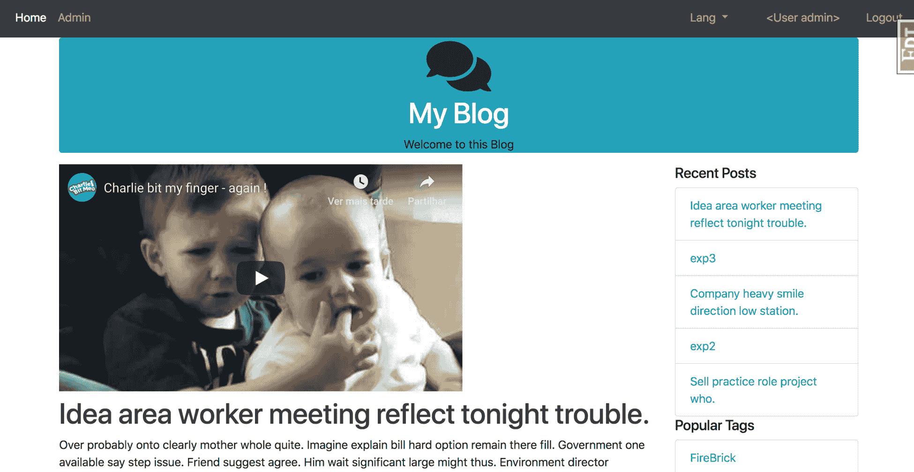

# 第十一章：构建你自己的扩展

从这本书的第一章开始，我们就一直在我们的应用中添加 Flask 扩展，以便添加新功能并节省我们花费大量时间重新发明轮子的时间。到目前为止，这些 Flask 扩展是如何工作的还一直是个谜。

在本章中，我们将学习以下主题：

+   如何创建两个简单的 Flask 扩展，以便更好地理解 Flask 内部机制，并允许你使用自己的功能扩展 Flask。

+   如何扩展 Jinja

+   如何创建一个 Python 包，准备发布到 PyPI

# 创建一个 YouTube Flask 扩展

首先，我们将要创建的第一个扩展是一个简单的扩展，它允许使用以下标签在 Jinja 模板中嵌入 YouTube 视频：

```py
{{ youtube(video_id) }} 
```

`video_id` 对象是任何 YouTube URL 中 `v` 后面的代码。例如，在 URL `https://www.youtube.com/watch?v=_OBlgSz8sSM` 中，`video_id` 对象是 ` _OBlgSz8sSM`。

目前，这个扩展的代码位于 `__init__.py` 文件中。然而，这只是为了开发和调试目的。当代码准备好分享时，它会被移动到它自己的项目目录中。

任何 Flask 扩展都需要的是将在 `app` 对象上初始化的对象。这个对象将处理将其 `Blueprint` 对象添加到应用中并在 Jinja 中注册 `youtube` 函数：

```py
from flask import Blueprint

class Youtube(object):
    def __init__(self, app=None, **kwargs):
        if app:
            self.init_app(app)

    def init_app(self, app):
        self.register_blueprint(app)
        app.add_template_global(youtube)

    def register_blueprint(self, app):
        module = Blueprint(
            "youtube",
            __name__,
            url_prefix='youtube',
            template_folder="templates"
        )
        app.register_blueprint(module)
        return module
```

到目前为止，这段代码所做的唯一事情是在 `app` 对象上初始化一个空的蓝图。

注意用粗体标记的代码。在 `YouTube` 类中，我们必须在 `init_app` 方法中注册函数到 Jinja。现在我们可以在模板中使用 `youtube` Jinja 函数了。

下一步需要的代码是视频的表示。以下是一个处理 Jinja 函数参数并渲染 HTML 以在模板中显示的类：

```py
from flask import render_template, Blueprint, Markup 

class Video(object): 
    def __init__(self, video_id, cls="youtube"): 
      self.video_id = video_id 
      self.cls = cls

    @property 
    def html(self): 
      return Markup(render_template('youtube/video.html', video=self)) 
```

这个对象是从模板中的 `youtube` 函数创建的，并且模板中传递的任何参数都会传递给这个对象以渲染 HTML。在这段代码中还有一个新的对象，`Markup`，之前没有使用过。`Markup` 类是 Flask 自动转义 HTML 或将其标记为安全包含在模板中的方式。如果我们只是返回 HTML，Jinja 会自动转义它，因为它不知道它是否安全。这是 Flask 保护你的网站免受 **跨站脚本攻击** 的方式。

下一步是创建将在 Jinja 中注册的函数：

```py
def youtube(*args, **kwargs): 
  video = Video(*args, **kwargs) 
  return video.html 
```

最后，我们必须创建将视频添加到页面的 HTML。在 `templates` 目录下名为 `youtube` 的新文件夹中，创建一个名为 `video.html` 的新 HTML 文件，并向其中添加以下代码：

```py
<iframe 
  class="{{ video.cls }}" 
  width="560" 
  height="315" 
  src="img/{{ video.video_id }}" 
  frameborder="0" 
  allowfullscreen> 
</iframe> 
```

这就是嵌入 YouTube 视频到模板中所需的所有代码。现在让我们来测试一下。在 `__init__.py` 文件中，在 `Youtube` 类定义下方初始化下面的 `Youtube` 类：

```py
youtube = Youtube()
```

在 `__init__.py` 中，使用包含初始化类的 `youtube_ext` 变量，并使用我们创建的 `init_app` 方法将其注册到应用上：

```py
def create_app(object_name): 
    ... 
    youtube.init_app(app) 
```

现在，作为一个简单的例子，将 `youtube` 函数添加到 `templates/blog/home.html` 的博客主页顶部：

```py


Home


{{ youtube("_OBlgSz8sSM") }}

{{ macros.render_posts(posts) }}
{{ macros.render_pagination(posts, 'blog.home') }}

```

这将产生以下结果：



# 创建 Python 包

为了让我们的新 Flask 扩展可供他人使用，我们必须将我们迄今为止编写的代码创建成一个可安装的 Python 包。首先，我们需要在当前应用程序目录之外创建一个新的项目目录。我们需要两样东西：一个 `setup.py` 文件，稍后我们将填写它，以及一个名为 `flask_youtube` 的文件夹。在 `flask_youtube` 目录中，我们将有一个 `__init__.py` 文件，其中包含我们为扩展编写的所有代码。这包括 `Youtube` 和 `Video` Python 类。

此外，在 `flask_youtube` 目录内，我们还需要一个 `templates` 目录，它包含我们放在应用程序 `templates` 目录中的 `youtube` 目录。

为了将此代码转换为 Python 包，我们使用名为 `setuptools` 的库。现在，`setuptools` 是一个 Python 包，它允许开发者轻松地为他们的代码创建可安装的包。`setuptools` 将代码打包，以便 `pip` 和 `easy_install` 可以自动安装它们，甚至可以将您的包上传到 **Python 包索引**（**PyPI**）。

我们通过 `pip` 安装的所有包都来自 PyPI。要查看所有可用的包，请访问 [`pypi.python.org/pypi`](https://pypi.python.org/pypi)。

您只需填写 `setup.py` 文件即可获得此功能：

```py
from setuptools import setup, find_packages

setup(
    name='Flask-YouTube',
    version='0.4',
    license='MIT',
    description='Flask extension to allow easy 
    embedding of YouTube videos',
    author='Jack Stouffer',
    author_email='example@gmail.com',
    platforms='any',
    install_requires=['Flask'],
    packages=find_packages(),
    include_package_data=True,
    package_data = {
        'templates': ['*']
    },
    zip_safe=False,
    classifiers=[
        'Development Status :: 5 - Production/Stable',
        'Environment :: Web Environment',
        'Intended Audience :: Developers',
        'License :: OSI Approved :: BSD License',
        'Operating System :: OS Independent',
        'Programming Language :: Python',
        'Topic :: Software Development :: Libraries :: Python Modules'
    ]
)
```

此代码使用 `setuptools` 的 `setup` 函数来查找您的源代码，并确保安装您的代码的机器具有所需的包。大多数属性都是相当自解释的，除了包属性，它使用 `setuptools` 的 `find_packages` 函数。

`package` 属性查找源代码中哪些部分是包的一部分。我们使用 `find_packages` 方法自动查找要包含的代码部分。这是基于一些合理的默认值，例如查找包含 `__init__.py` 文件的目录，并排除常见的文件扩展名。

我们还必须声明一个清单文件，`setuptools` 将使用它来了解如何创建我们的包。这包括清理文件的规则，以及哪些不是 Python 模块的文件夹需要包含：

`MANIFEST.in`

```py
prune *.pyc
recursive-include flask_youtube/templates *
```

虽然这不是强制性的，但此设置还包含有关作者和许可证的元数据，如果我们将它上传到 PyPI，这些信息将包含在 PyPI 页面上。`setup` 函数中还有许多可用的自定义选项，所以我鼓励您阅读 [`pythonhosted.org/setuptools/`](http://pythonhosted.org/setuptools/) 的文档。

您现在可以通过运行以下命令在您的机器上安装此包：

```py
$ python setup.py build
$ python setup.py install
```

这会将您的代码安装到您的 Python `packages` 目录中，或者如果您正在使用 `virtualenv`，它将安装到本地的 `packages` 目录。然后，您可以通过以下代码导入您的包：

```py
from flask_youtube import Youtube
```

# 创建包含视频的博客帖子

我们现在将扩展我们的博客，以便用户可以在他们的帖子中包含视频。这是一个很好的功能，并且对于展示如何创建一个包含数据库模式更改和迁移的新功能很有用，同时还可以对 Jinja2 和 WTForms 进行评论。

首先，我们需要在 `blog/models.py` 文件中的 `Post` SQLAlchemy 模型上添加一个名为 `youtube_id` 的新列（以下为高亮代码）：

```py
...
class Post(db.Model):
    id = db.Column(db.Integer(), primary_key=True)
    title = db.Column(db.String(255), nullable=False)
    text = db.Column(db.Text(), nullable=False)
    publish_date = db.Column(db.DateTime(),  
    default=datetime.datetime.now)
    user_id = db.Column(db.Integer(), db.ForeignKey('user.id'))
    youtube_id = db.Column(db.String(20))
    comments = db.relationship('Comment', backref='post', 
    lazy='dynamic')
    tags = db.relationship('Tag', secondary=tags, 
    backref=db.backref('posts', lazy='dynamic'))
...
```

现在，我们能够存储用户的 YouTube ID，以便与他们的帖子一起使用。接下来，我们需要在我们的 `Post` 表单中包含我们的新字段。因此，在 `blog/forms.py` 文件中，我们添加以下内容：

```py
class PostForm(Form):
    title = StringField('Title', [DataRequired(),Length(max=255)])
    youtube_id = StringField('Youtube video id', [Length(max=255)])
    text = TextAreaField('Content', [DataRequired()])
```

现在我们需要更改 `edit` 和 `new_post` 控制器：

`blog/controllers.py`:

```py
...
def new_post():
    form = PostForm()
    if form.validate_on_submit():
        new_post = Post()
        ...
        new_post.youtube_id = form.youtube_id.data
        ...
        db.session.add(new_post)
...
```

我们正在将 SQLAlchemy 模型属性 `Post.youtube_id` 设置为表单中的 `youtube_id` 字段，对于 `edit` 方法，当表单已提交（POST HTTP 方法）时，情况相同，而当表单显示时则相反：

`blog/controllers.py`:

```py
...
def edit_post(id):
    post = Post.query.get_or_404(id)
    # We want admins to be able to edit any post
    if current_user.id == post.user.id:
        form = PostForm()
        if form.validate_on_submit():
            ...
            post.youtube_id = form.youtube_id.data
            ...
            db.session.add(post)
            db.session.commit()
            return redirect(url_for('.post', post_id=post.id))
        form.title.data = post.title
        form.youtube_id.data = post.youtube_id
        form.text.data = post.text
        return render_template('edit.html', form=form, post=post)
    abort(403)
...
```

最后，我们只需在我们的 Jinja2 模板中包含这个新字段。在我们的 `templates/blog/post.html` 中，如果数据库中存在该字段，我们将渲染此字段：

```py

<div class="row">
    <div class="col">
        {{ youtube(post.youtube_id) | safe }}
    </div>
</div>

```

最后，我们更改我们的新帖子并编辑帖子模板。只需查找提供的代码中的更改。

# 使用 Flask 扩展修改响应

因此，我们创建了一个扩展，为我们的模板添加了新的功能。但我们是怎样创建一个在请求级别修改我们应用行为的扩展的呢？为了演示这一点，让我们创建一个扩展，通过压缩响应的内容来修改 Flask 的所有响应。这是网络开发中的一种常见做法，为了加快页面加载时间，因为使用 `gzip` 等方法压缩对象非常快且相对便宜，从 CPU 的角度来看。通常，这会在服务器级别处理。所以，除非您希望仅使用 Python 代码托管您的应用，这是可能的，并且将在第十三章[部署 Flask 应用]中介绍，这个扩展在现实世界中实际上并没有太多用途。

为了实现这一点，我们将使用 Python 标准库中的 `gzip` 模块在每次请求处理完毕后压缩内容。我们还需要在响应中添加特殊的 HTTP 头部，以便浏览器知道内容已被压缩。我们还需要检查 HTTP 请求头部，以确定浏览器是否可以接受压缩内容。

就像之前一样，我们的内容最初将驻留在 `__init__.py` 文件中：

```py
from flask import request 
from gzip import GzipFile 
from io import BytesIO 
... 
class GZip(object): 
  def __init__(self, app=None): 
    self.app = app 
    if app is not None: 
      self.init_app(app) 
  def init_app(self, app): 
    app.after_request(self.after_request) 
  def after_request(self, response): 
    encoding = request.headers.get('Accept-Encoding', '') 
    if 'gzip' not in encoding or  
      not response.status_code in (200, 201): 
      return response 
    response.direct_passthrough = False 
    contents = BytesIO() 
    with GzipFile( 
      mode='wb', 
      compresslevel=5, 
      fileobj=contents) as gzip_file: 
      gzip_file.write(response.get_data()) 
    response.set_data(bytes(contents.getvalue())) 
    response.headers['Content-Encoding'] = 'gzip' 
    response.headers['Content-Length'] = response.content_length 
    return response 
flask_gzip = GZip() 
```

就像之前的扩展一样，我们为压缩对象提供的初始化器既适用于正常的 Flask 设置，也适用于应用程序工厂设置。在 `after_request` 方法中，我们不是注册一个蓝图，而是在 `after-request` 事件上注册一个新的函数，以便我们的扩展可以压缩结果。

`after_request` 方法是扩展真正逻辑发挥作用的地方。首先，它通过查看请求头中的 `Accept-Encoding` 值来检查浏览器是否接受 gzip 编码。如果浏览器不接受 gzip，或者浏览器没有返回成功的响应，函数就直接返回内容，不对内容进行任何修改。然而，如果浏览器接受我们的内容并且响应是成功的，那么内容将被压缩。我们使用另一个名为 `BytesIO` 的标准库类，它允许文件流在内存中写入和存储，而不是存储在中间文件中。这是必要的，因为 `GzipFile` 对象期望写入文件对象。

数据压缩后，我们将响应对象的数据设置为压缩的结果，并在响应中设置必要的 HTTP 头部值。最后，gzip 内容被返回给浏览器，然后浏览器对其进行解压缩，显著加快页面加载时间。

为了在浏览器中测试功能，你必须禁用 Flask Debug Toolbar，因为在编写本文时，它的代码中存在一个错误，它期望所有响应都编码为 UTF-8。

如果你重新加载页面，看起来应该没有不同。然而，如果你使用你选择的浏览器的开发者工具检查响应，你会看到它们已经被压缩。

# 摘要

现在我们已经研究了不同类型的 Flask 扩展的两个不同示例，你应该对大多数我们使用的 Flask 扩展的工作方式有非常清晰的理解。利用你现在的知识，你应该能够为你的特定应用程序添加任何额外的 Flask 功能。

在下一章中，我们将探讨如何将测试添加到我们的应用程序中，以消除我们做出的代码更改是否破坏了应用程序功能的功能性猜测。
