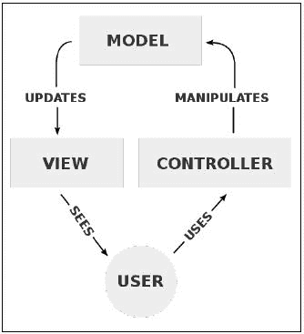

# 前言

Flask 是 Python 的一个 Web 框架，专门设计为提供创建 Web 应用程序所需的最少功能。与其他 Web 框架不同，特别是其他语言中的框架，Flask 没有整个与其捆绑的库生态系统，用于诸如数据库查询或表单处理之类的功能。相反，Flask 更喜欢是一个实现不可知的框架。

这种设置的主要特点是它允许程序员以任何他们想要的方式设计他们的应用程序和工具。不提供常见抽象的自己版本也意味着标准库可以比其他框架更常用，这保证了它们的稳定性和其他 Python 程序员的可读性。由于 Flask 社区相当庞大，也有许多不同的社区提供的添加常见功能的方式。本书的主要重点之一是介绍这些扩展，并找出它们如何帮助避免重复造轮子。这些扩展的最大优点是，如果您不需要它们的额外功能，您不需要包含它们，您的应用程序将保持较小。

这种设置的主要缺点是，绝大多数新的 Flask 用户不知道如何正确地构建大型应用程序，最终创建了难以理解和难以维护的代码混乱。这就是本书的另一个主要重点，即如何在 Flask 应用程序中创建模型视图控制器（MVC）架构。

最初是为设计桌面用户界面而发明的 MVC 设置允许数据处理（模型）、用户交互（控制器）和用户界面（视图）分离为三个不同的组件。



将这三个不同的组件分开允许程序员重用代码，而不是为每个网页重新实现相同的功能。例如，如果数据处理代码没有分割成自己独立的函数，我们将不得不在渲染网页的每个函数中编写相同的数据库连接代码和 SQL 查询。

大量的研究和大量的痛苦的第一手经验使本书成为最全面的 Flask 资源，因此我真诚地希望您会喜欢阅读它。

# 本书涵盖内容

第一章，“入门”，帮助读者使用 Python 项目的最佳实践设置 Flask 开发环境。读者将获得一个非常基本的 Flask 应用程序框架，该框架将贯穿整本书。

第二章，“使用 SQLAlchemy 创建模型”，展示了如何使用 Python 数据库库 SQLAlchemy 与 Flask 一起创建面向对象的数据库 API。

第三章，“使用模板创建视图”，展示了如何使用 Flask 的模板系统 Jinja，通过利用 SQLAlchemy 模型动态创建 HTML。

第四章，“使用蓝图创建控制器”，介绍了如何使用 Flask 的蓝图功能来组织您的视图代码，同时避免重复。

第五章，“高级应用程序结构”，利用前四章所学的知识，解释了如何重新组织代码文件，以创建更易维护和可测试的应用程序结构。

第六章，“保护您的应用程序”，解释了如何使用各种 Flask 扩展来添加具有基于权限的访问权限的登录系统。

第七章，“在 Flask 中使用 NoSQL”，展示了 NoSQL 数据库是什么，以及如何在允许更强大功能时将其集成到您的应用程序中。

第八章，“构建 RESTful API”，展示了如何以安全且易于使用的方式向第三方提供应用程序数据库中存储的数据。

第九章，“使用 Celery 创建异步任务”，解释了如何将昂贵或耗时的程序移到后台，以便应用程序不会变慢。

第十章，“有用的 Flask 扩展”，解释了如何利用流行的 Flask 扩展，以使您的应用程序更快，添加更多功能，并使调试更容易。

第十一章，“构建您自己的扩展”，教您 Flask 扩展的工作原理以及如何创建您自己的扩展。

第十二章，“测试 Flask 应用”，解释了如何为您的应用程序添加单元测试和用户界面测试，以确保质量并减少错误代码的数量。

第十三章，“部署 Flask 应用”，解释了如何将您完成的应用程序从开发转移到托管在实时服务器上。

# 您需要为本书做好准备

要开始阅读本书，您只需要选择一个文本编辑器，一个网络浏览器，并在您的计算机上安装 Python。

Windows，Mac OS X 和 Linux 用户都应该能够轻松地跟上本书的内容。

# 这本书是为谁写的

这本书是为已经对 Flask 有一定了解并希望将他们的 Flask 理解从入门到精通的 Web 开发人员编写的。

# 约定

在本书中，您将找到一些区分不同类型信息的文本样式。以下是这些样式的一些示例及其含义的解释。

文本中的代码单词，数据库表名，文件夹名，文件名，文件扩展名，路径名，虚拟 URL，用户输入和 Twitter 句柄显示如下：“`first()`和`all()`方法返回一个值，因此结束链。”

代码块设置如下：

```py
class User(db.Model):
    id = db.Column(db.Integer(), primary_key=True)
    username = db.Column(db.String(255))
    password = db.Column(db.String(255))
    posts = db.relationship(
        'Post',
        backref='user',
        lazy='dynamic'
    )
```

当我们希望引起您对代码块的特定部分的注意时，相关行或项目将以粗体显示：

```py
from flask.ext.sqlalchemy import SQLAlchemy

app = Flask(__name__)
app.config.from_object(DevConfig)
db = SQLAlchemy(app)

```

任何命令行输入或输出都以以下方式编写：

```py
$ python manage.py db init

```

**新术语**和**重要单词**以粗体显示。您在屏幕上看到的单词，例如菜单或对话框中的单词，会以这样的方式出现在文本中：“点击另一个按钮，上面写着**下载 Bootstrap**，然后您将开始下载一个 Zip 文件。”

### 注意

警告或重要说明会出现在这样的框中。

### 提示

提示和技巧会以这种方式出现。
