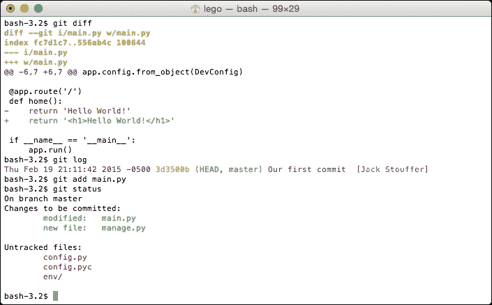
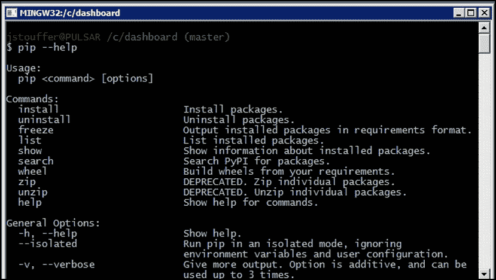

# 第一章：入门

**Python**是一种灵活的语言，给程序员自由构建他们的编程环境。然而，这种自由的危险后果是从一开始就不设置一个新的 Python 项目，以避免未来出现问题。

例如，你可能已经进行了一半的项目，意识到你五天前删除了一个你现在需要使用的文件或代码。再举一个例子，你希望使用的两个包需要同一个基础包的不同版本。除了本章介绍的工具之外，修复已经有解决方案的问题将需要大量额外的工作。在开始时多做一点额外的工作可以节省未来数天的工作。

为此，我们需要安装三个程序：**Git**、**pip**和**virtualenv**。

# 使用 Git 进行版本控制

为了防止人为错误，我们将使用一个名为 Git 的版本控制系统。**版本控制**是一种记录文件随时间变化的工具。这使得程序员可以看到代码如何从以前的修订版变化，并甚至将代码恢复到以前的状态。版本控制系统还使得合作比以往更容易，因为更改可以在许多不同的程序员之间共享，并自动合并到项目的当前版本中，而无需复制和粘贴数百行代码。

简而言之，版本控制就像是你的代码的备份，只是更强大。

## 安装 Git

安装 Git 非常简单。只需转到[`www.git-scm.com/downloads`](http://www.git-scm.com/downloads)，然后点击正在运行的**操作系统**（**OS**）。一个程序将开始下载，它将引导您完成基本的安装过程。

### Windows 上的 Git

Git 最初仅为 Unix 操作系统（例如 Linux、Mac OS X）开发。因此，在 Windows 上使用 Git 并不是无缝的。在安装过程中，安装程序会询问您是否要在普通的 Windows 命令提示符旁边安装 Git。不要选择此选项。选择默认选项，将在系统上安装一个名为**Bash**的新类型的命令行，这是 Unix 系统使用的相同命令行。Bash 比默认的 Windows 命令行更强大，本书中的所有示例都将使用它。

### 注意

初学者的 Bash 入门教程位于[`linuxcommand.org/learning_the_shell.php#contents`](http://linuxcommand.org/learning_the_shell.php#contents)。

## Git 基础知识

Git 是一个非常复杂的工具；这里只会涵盖本书所需的基础知识。

### 注意

要了解更多，请参阅 Git 文档[`www.git-scm.com/doc`](http://www.git-scm.com/doc)。

Git 不会自动跟踪你的更改。为了让 Git 正常运行，我们必须提供以下信息：

+   要跟踪哪些文件夹

+   何时保存代码的状态

+   要跟踪什么，不要跟踪什么

在我们做任何事情之前，我们告诉 Git 在我们的目录中创建一个`git`实例。在你的项目目录中，在终端中运行以下命令：

```py
$ git init

```

Git 现在将开始跟踪我们项目中的更改。当`git`跟踪我们的文件时，我们可以通过输入以下命令来查看我们跟踪文件的状态，以及任何未跟踪的文件：

```py
$ git status

```

现在我们可以保存我们的第一个**提交**，这是在运行`commit`命令时代码的快照。

```py
# In Bash, comments are marked with a #, just like Python
# Add any files that have changes and you wish to save in this commit
$ git add main.py
# Commit the changes, add in your commit message with -m
$ git commit -m"Our first commit"

```

在将来的任何时候，我们都可以返回到项目的这一点。将要提交的文件称为 Git 中的**暂存**文件。记住只有在准备好提交它们时才添加暂存文件。一旦文件被暂存，任何进一步的更改也不会被暂存。对于更高级的 Git 使用示例，请向你的`main.py`文件添加任何文本，然后运行以下命令：

```py
# To see the changes from the last commit
$ git diff
# To see the history of your changes
$ git log
# As an example, we will stage main.py
# and then remove any added files from the stage
$ git add main.py
$ git status
$ git reset HEAD main.py
# After any complicated changes, be sure to run status
# to make sure everything went well
$ git status
# lets delete the changes to main.py, reverting to its state at the last commit
# This can only be run on files that aren't staged
$ git checkout -- main.py

```

你的终端应该看起来像这样：



Git 系统的 `checkout` 命令对于这个简单的介绍来说相当高级，但它用于改变 Git 系统的 `HEAD` 指针的当前状态，也就是我们代码在项目历史中的当前位置。这将在下一个示例中展示。

现在，要查看以前提交的代码，请先运行此命令：

```py
$ git log
Fri Jan 23 19:16:43 2015 -0500 f01d1e2 Our first commit  [Jack Stouffer]

```

紧挨着我们提交消息的字符串 `f01d1e2`，被称为我们提交的 **哈希**。它是该提交的唯一标识符，我们可以使用它返回到保存的状态。现在，要将项目恢复到该状态，请运行此命令：

```py
$ git checkout f01d1e2

```

您的 Git 项目现在处于一种特殊状态，任何更改或提交都不会被保存，也不会影响您检出后进行的任何提交。这种状态只用于查看旧代码。要返回到 Git 的正常模式，请运行此命令：

```py
$ git checkout master

```

# 使用 pip 进行 Python 包管理

在 Python 中，程序员可以从其他程序员那里下载库，以扩展标准 Python 库的功能。就像您从 Flask 中了解到的那样，Python 的很多功能来自于其大量的社区创建的库。

然而，安装第三方库可能会非常麻烦。假设有一个名为 X 的包需要安装。很简单，下载 Zip 文件并运行 `setup.py`，对吗？并不完全是这样。包 X 依赖于包 Y，而包 Y 又依赖于 Z 和 Q。这些信息都没有在包 X 的网站上列出，但它们需要被安装才能让 X 正常工作。然后，您必须逐个找到所有的包并安装它们，希望您安装的包不需要额外的包。

为了自动化这个过程，我们使用 **pip**，即 Python 包管理器。

## 在 Windows 上安装 pip Python 包管理器

如果您使用的是 Windows，并且已安装了当前版本的 Python，那么您已经有了 pip！如果您的 Python 安装不是最新的，最简单的方法就是重新安装它。在 [`www.python.org/downloads/`](https://www.python.org/downloads/) 下载 Python Windows 安装程序。

在 Windows 上，控制从命令行访问哪些程序的变量是 **path**。要修改您的路径以包括 Python 和 pip，我们必须添加 `C:\Python27` 和 `C:\Python27\Tools`。通过打开 Windows 菜单，右键单击 **计算机**，然后单击 **属性** 来编辑 Windows 路径。在 **高级系统设置** 下，单击 **环境变量...**。向下滚动直到找到 **Path**，双击它，并在末尾添加 `;C:\Python27;C:\Python27\Tools`。

确保您已正确修改了路径，请关闭并重新打开终端，并在命令行中输入以下内容：

```py
pip --help

```

### 提示

**下载示例代码**

您可以从 [`www.packtpub.com`](http://www.packtpub.com) 的帐户中下载您购买的所有 Packt Publishing 图书的示例代码文件。如果您在其他地方购买了这本书，您可以访问 [`www.packtpub.com/support`](http://www.packtpub.com/support) 并注册，以便直接通过电子邮件接收文件。

`pip` 应该已经打印出其使用消息，如下面的屏幕截图所示：



## 在 Mac OS X 和 Linux 上安装 pip Python 包管理器

一些 Linux 上的 Python 安装不带有 pip，Mac OS X 上的安装默认也不带有 pip。要安装它，请从 [`raw.githubusercontent.com/pypa/pip/master/contrib/get-pip.py`](https://raw.githubusercontent.com/pypa/pip/master/contrib/get-pip.py) 下载 `get-pip.py` 文件。

下载后，使用以下命令以提升的权限运行它：

```py
$ sudo python get-pip.py

```

然后 pip 将被自动安装。

## pip 基础知识

要使用 `pip` 安装一个包，请按照以下简单步骤进行：

```py
$ pip install [package-name]

```

在 Mac 和 Linux 上，因为你在用户拥有的文件夹之外安装程序，你可能需要在安装命令前加上`sudo`。要安装 Flask，只需运行这个命令：

```py
$ pip install flask

```

然后，Flask 的所有要求将被安装。

如果你想要移除一个不再使用的包，运行这个命令：

```py
$ pip uninstall [package-name]

```

如果你想探索或找到一个包，但不知道它的确切名称，你可以使用搜索命令：

```py
$ pip search [search-term]

```

现在我们安装了一些包，在 Python 社区中，通常习惯创建一个运行项目所需的包的列表，这样其他人可以快速安装所有所需的东西。这也有一个额外的好处，即你项目的任何新成员都能够快速运行你的代码。

这个列表可以通过 pip 运行这个命令来创建：

```py
$ pip freeze > requirements.txt

```

这个命令到底做了什么？`pip freeze`单独运行会打印出安装的包及其版本的列表，如下所示：

```py
Flask==0.10.1
itsdangerous==0.24
Jinja2==2.7.3
MarkupSafe==0.23
Werkzeug==0.10.4
wheel==0.24.0
```

`>`操作符告诉 Bash 获取上一个命令打印的所有内容并将其写入这个文件。如果你查看你的项目目录，你会看到一个名为`requirements.txt`的新文件，其中包含了`pip freeze`的输出。

要安装这个文件中的所有包，新的项目维护者将不得不运行这个命令：

```py
$ pip install -r requirements.txt

```

这告诉`pip`读取`requirements.txt`中列出的所有包并安装它们。

# 使用 virtualenv 进行依赖隔离

所以你已经安装了你的新项目所需的所有包。太好了！但是，当我们在以后开发第二个项目时，会使用这些包的更新版本会发生什么？当你希望使用的库依赖于你为第一个项目安装的库的旧版本时会发生什么？当更新的包包含破坏性更改时，升级它们将需要在旧项目上进行额外的开发工作，这可能是你无法承受的。

幸运的是，有一个名为 virtualenv 的工具，它可以为你的 Python 项目提供隔离。virtualenv 的秘密在于欺骗你的计算机，让它在项目目录中查找并安装包，而不是在主 Python 目录中，这样你可以完全隔离它们。

现在我们有了 pip，要安装 virtualenv 只需运行这个命令：

```py
$ pip install virtualenv

```

## virtualenv 基础

让我们按照以下方式为我们的项目初始化 virtualenv：

```py
$ virtualenv env

```

额外的`env`告诉`virtualenv`将所有的包存储到一个名为`env`的文件夹中。virtualenv 要求你在对项目进行隔离之前启动它：

```py
$ source env/bin/activate
# Your prompt should now look like
(env) $

```

`source`命令告诉 Bash 在当前目录的上下文中运行脚本`env/bin/activate`。让我们在我们的新隔离环境中重新安装 Flask：

```py
# you won't need sudo anymore
(env) $ pip install flask
# To return to the global Python
(env) $ deactivate

```

然而，跟踪你不拥有的东西违反了 Git 的最佳实践，所以我们应该避免跟踪第三方包的更改。要忽略项目中的特定文件，需要`gitignore`文件。

```py
$ touch .gitignore

```

`touch`是 Bash 创建文件的命令，文件名开头的点告诉 Bash 不要列出它的存在，除非特别告诉它显示隐藏文件。我们现在将创建一个简单的`gitignore`文件：

```py
env/
*.pyc
```

这告诉 Git 忽略整个`env`目录和所有以`.pyc`结尾的文件（一个*编译*的 Python 文件）。在这种用法中，`*`字符被称为**通配符**。

# 我们项目的开始

最后，我们可以开始我们的第一个 Flask 项目了。为了在本书结束时拥有一个复杂的项目，我们需要一个简单的 Flask 项目来开始。

在名为`config.py`的文件中，添加以下内容：

```py
class Config(object):
    pass

class ProdConfig(Config):
    pass

class DevConfig(Config):
    DEBUG = True
```

现在，在另一个名为`main.py`的文件中，添加以下内容：

```py
from flask import Flask
from config import DevConfig

app = Flask(__name__)
app.config.from_object(DevConfig)

@app.route('/')
def home():
    return '<h1>Hello World!</h1>'

if __name__ == '__main__':
    app.run()
```

对于熟悉基本 Flask API 的人来说，这个程序非常基础。如果我们导航到`http://127.0.0.1:5000/`，它只会在浏览器上显示`Hello World!`。对于 Flask 用户可能不熟悉的一点是`config.from_object`，而不是`app.config['DEBUG']`。我们使用`from_object`是因为将来会使用多个配置，并且在需要在配置之间切换时手动更改每个变量是很繁琐的。

记得在 Git 中提交这些更改：

```py
# The --all flag will tell git to stage all changes you have made
# including deletions and new files
$ git add --all
$ git commit -m "created the base application"

```

### 注意

不再提醒何时将更改提交到 Git。读者需要养成在达到一个停顿点时提交的习惯。还假定您将在虚拟环境中操作，因此所有命令行提示都不会以`(env)`为前缀。

## 使用 Flask Script

为了使读者更容易理解接下来的章节，我们将使用第一个**Flask 扩展**（扩展 Flask 功能的软件包）之一，名为**Flask Script**。Flask Script 允许程序员创建在 Flask 的**应用上下文**中操作的命令，即 Flask 中允许修改`Flask`对象的状态。Flask Script 带有一些默认命令来在应用上下文中运行服务器和 Python shell。要使用`pip`安装 Flask Script，请运行以下命令：

```py
$ pip install flask-script

```

我们将在第十章中涵盖 Flask Script 的更高级用法；现在，让我们从一个名为`manage.py`的简单脚本开始。首先按照以下方式导入 Flask Script 的对象和你的应用程序：

```py
from flask.ext.script import Manager, Server
from main import app
```

然后，将您的应用程序传递给`Manager`对象，它将初始化 Flask Script：

```py
manager = Manager(app)
```

现在我们添加我们的命令。服务器与通过`main.py`运行的普通开发服务器相同。`make_shell_context`函数将创建一个可以在应用上下文中运行的 Python shell。返回的字典将告诉 Flask Script 默认要导入什么：

```py
manager.add_command("server", Server())

@manager.shell
def make_shell_context():
    return dict(app=app)
```

### 注意

通过`manage.py`运行 shell 将在稍后变得必要，因为当 Flask 扩展只有在创建 Flask 应用程序时才会初始化时。运行默认的 Python shell 会导致这些扩展返回错误。

然后，以 Python 标准的方式结束文件，只有当用户运行了这个文件时才会运行：

```py
if __name__ == "__main__":
    manager.run()
```

现在您可以使用以下命令运行开发服务器：

```py
$ python manage.py server

```

使用以下命令运行 shell：

```py
$ python manage.py shell
# Lets check if our app imported correctly
>>> app
<Flask 'main'>

```

# 摘要

现在我们已经设置好了开发环境，我们可以继续在 Flask 中实现高级应用程序功能。在我们可以做任何可视化之前，我们需要有东西来显示。在下一章中，您将被介绍并掌握在 Flask 中使用数据库。
