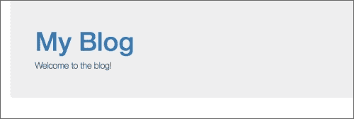
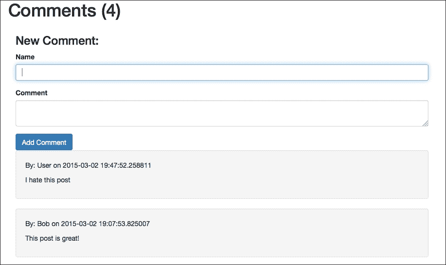

# 第三章：使用模板创建视图

现在我们的数据以一种方便访问的格式呈现，将信息显示在网页上变得更加容易。在本章中，我们将使用 Flask Jinja 的包含模板语言，从我们的 SQLAlchemy 模型动态创建 HTML。我们还将研究 Jinja 的方法，自动创建 HTML 并修改数据以在模板内进行呈现。然后，本章将以使用 Jinja 自动创建和验证 HTML 表单结束。

# Jinja 的语法

**Jinja**是用 Python 编写的模板语言。**模板语言**是一种旨在帮助自动创建文档的简单格式。在任何模板语言中，传递给模板的变量将替换模板中预定义的位置。在 Jinja 中，变量替换由`{{}}`定义。`{{}}`语法称为**变量块**。还有由``定义的**控制块**，它声明语言函数，如**循环**或`if`语句。例如，当从上一章传递给它的`Post`模型时，我们有以下 Jinja 代码：

```py
<h1>{{ post.title }}</h1>
```

这将产生以下结果：

```py
<h1>First Post</h1>
```

在 Jinja 模板中显示的变量可以是任何 Python 类型或对象，只要它们可以通过 Python 函数`str（）`转换为字符串。例如，传递给模板的字典或列表可以通过其属性显示：

```py
{{ your_dict['key'] }}
{{ your_list[0] }}
```

许多程序员更喜欢使用 JavaScript 来模板化和动态创建他们的 HTML 文档，以减轻服务器的 HTML 渲染负载。本章不会涵盖这个话题，因为这是一个高级的 JavaScript 话题。然而，许多 JavaScript 模板引擎也使用`{{}}`语法。如果您选择将 Jinja 和在 HTML 文件中定义的 JavaScript 模板结合在一起，则将 JavaScript 模板包装在`raw`控制块中，以告诉 Jinja 忽略它们：

```py

<script id="template" type="text/x-handlebars-template">
    <h1>{{title}}</h1>
    <div class="body">
        {{body}}
    </div>
</script>

```

## 过滤器

认为 Jinja 和 Python 的语法是相同的是一个常见的错误，因为它们相似。然而，它们之间有很多不同之处。正如您将在本节中看到的，普通的 Python 函数实际上并不存在。相反，在 Jinja 中，变量可以传递给修改变量以供显示目的的内置函数。这些函数，称为过滤器，使用管道字符`|`在变量块中调用：

```py
{{ variable | filter_name(*args) }}
```

否则，如果没有向过滤器传递参数，则可以省略括号，如下所示：

```py
{{ variable | filter_name }}
```

过滤器也可以被称为控制块，以将它们应用于文本块：

```py

    A bunch of text

```

Jinja 中有许多过滤器；本书将仅涵盖最有用的过滤器。为了简洁起见，在每个示例中，每个过滤器的输出将直接列在过滤器本身下面。

### 注意

有关 Jinja 中所有默认过滤器的完整列表，请访问[`jinja.pocoo.org/docs/dev/templates/#list-of-builtin-filters`](http://jinja.pocoo.org/docs/dev/templates/#list-of-builtin-filters)。

### 默认

如果传递的变量是`None`，则将其替换为默认值，如下所示：

```py
{{ post.date | default('2015-01-01') }}
2015-01-01
```

如果您希望用默认值替换变量，并且如果变量求值为`False`，则将可选的第二个参数传递给`True`：

```py
{{ '' | default('An empty string', True) }}
An empty string
```

### 逃脱

如果传递的变量是 HTML 字符串，则将打印`&`，`<`，`>`，`'`和`"`字符作为 HTML 转义序列：

```py
{{ "<h1>Title</h1>" | escape }}
&#60;h1&#62;Title&#60;/h1&#62;
```

### float

这将使用 Python 的`float（）`函数将传递的值转换为浮点数，如下所示：

```py
{{ 75 | float }}
75.0
```

### 整数

这将使用 Python 的`int（）`函数将传递的值转换为整数，如下所示：

```py
{{ 75.7 | int }}
75
```

### 连接

这是一个使用字符串和字符串列表的元素连接的过滤器，与相同名称的`list`方法完全相同。它被给定为：

```py
{{ ['Python', 'SQLAlchemy'] | join(',') }}
Python, SQLAlchemy
```

### 长度

这是一个填充与 Python `len（）`函数相同作用的过滤器。它被给定为：

```py
Tag Count: {{ post.tags | length }}
Tag Count: 2
```

### 圆

这将四舍五入浮点数到指定的精度：

```py
{{ 3.141592653589793238462 | round(1) }}
3.1
```

您还可以指定要将数字舍入到的方式：

```py
{{ 4.7 | round(1, "common") }}
5
{{ 4.2 | round(1, "common") }}
4
{{ 4.7 | round(1, "floor") }}
4
{{ 4.2 | round(1, "ceil") }}
5
```

`common`选项像人一样四舍五入：大于或等于 0.5 的四舍五入，小于 0.5 的舍去。`floor`选项总是向下舍入数字，`ceil`选项总是向上舍入，不考虑小数。

### safe

如果你尝试从变量插入 HTML 到你的页面中，例如，当你希望显示一个博客文章时，Jinja 将自动尝试向输出添加 HTML 转义序列。看下面的例子：

```py
{{ "<h1>Post Title</h1>" }}
&lt;h1&gt;Post Title&lt;/h1&gt;
```

这是一个必要的安全功能。当应用程序具有允许用户提交任意文本的输入时，它允许恶意用户输入 HTML 代码。例如，如果用户提交一个脚本标签作为评论，而 Jinja 没有这个功能，该脚本将在访问页面的所有浏览器上执行。

然而，我们仍然需要一种方法来显示我们知道是安全的 HTML，比如我们博客文章的 HTML。我们可以使用`safe`过滤器来实现这一点，如下所示：

```py
{{ "<h1>Post Title</h1>" | safe }}
<h1>Post Title</h1>
```

### title

我们使用标题格式来大写字符串，如下所示：

```py
{{ "post title" | title }}
Post Title
```

### tojson

我们可以将变量传递给 Python 的`json.dumps`函数。请记住，你传递的对象必须是`json`模块可序列化的。

```py
{{ {'key': False, 'key2': None, 'key3': 45} | tojson }}
{key: false, key2: null, key3: 45}
```

这个功能最常用于在页面加载时将 SQLAlchemy 模型传递给 JavaScript MVC 框架，而不是等待 AJAX 请求。如果你以这种方式使用`tojson`，请记住也将结果传递给`safe`过滤器，以确保你的 JavaScript 中不会出现 HTML 转义序列。以下是一个使用`Backbone.js`的示例，这是一个流行的 JavaScript MVC 框架，包含了一系列模型：

```py
var collection = new PostCollection({{ posts | tojson | safe }});
```

### truncate

这将获取一个长字符串，并返回指定长度的字符串，并附加省略号：

```py
{{ "A Longer Post Body Than We Want" | truncate(10) }}
A Longer...
```

默认情况下，任何在中间被截断的单词都会被丢弃。要禁用这一点，作为额外参数传递`True`：

```py
{{ "A Longer Post Body Than We Want" | truncate(10, True) }}
A Longer P...
```

### 自定义过滤器

将自己的过滤器添加到 Jinja 中就像编写 Python 函数一样简单。为了理解自定义过滤器，我们将看一个例子。我们的简单过滤器将计算字符串中子字符串的出现次数并返回它。看下面的调用：

```py
{{ variable | filter_name("string") }}
```

这将被更改为：

```py
filter_name(variable, "string")
```

我们可以定义我们的过滤器如下：

```py
def count_substring(string, sub):
    return string.count(sub)
```

要将此功能添加到可用过滤器列表中，我们必须手动将其添加到`main.py`文件中`jinja_env`对象的`filters`字典中：

```py
app.jinja_env.filters['count_substring'] = count_substring
```

## 注释

模板中的注释由`{# #}`定义，将被 Jinja 忽略，并不会出现在返回的 HTML 代码中：

```py
{# Note to the maintainers of this code #}
```

## if 语句

Jinja 中的`if`语句类似于 Python 的`if`语句。任何返回或是布尔值的东西决定了代码的流程：

```py
 
    <a href='/logout'>Logout</a>

    <a href='/login'>Login</a>

```

过滤器也可以用在`if`语句中：

```py
 
    There are {{ comments | length }} comments

    There are no comments

```

## 循环

我们可以在 Jinja 中使用循环来迭代任何列表或生成器函数：

```py

    <div>
        <h1>{{ post.title }}</h1>
        <p>{{ post.text | safe }}</p>
    </div>

```

循环和`if`语句可以结合使用，以模仿 Python 循环中的`break`功能。在这个例子中，只有当`post.text`不是`None`时，循环才会使用`post`：

```py

    <div>
        <h1>{{ post.title }}</h1>
        <p>{{ post.text | safe }}</p>
    </div>

```

在循环内，你可以访问一个名为`loop`的特殊变量，它可以让你访问有关`for`循环的信息。例如，如果我们想知道当前循环的当前索引以模拟 Python 中的`enumerate`函数，我们可以使用循环变量的索引变量，如下所示：

```py

    {{ loop.index }}. {{ post.title }}

```

这将产生以下输出：

```py
1\. Post Title
2\. Second Post
```

`loop`对象公开的所有变量和函数在下表中列出：

| 变量 | 描述 |
| --- | --- |
| `loop.index` | 循环的当前迭代（从 1 开始索引） |
| `loop.index0` | 循环的当前迭代（从 0 开始索引） |
| `loop.revindex` | 距离循环末尾的迭代次数（从 1 开始索引） |
| `loop.revindex0` | 距离循环末尾的迭代次数（从 0 开始索引） |
| `loop.first` | 如果当前项目是迭代器中的第一个，则为 True |
| `loop.last` | 如果当前项目是迭代器中的最后一个，则为 True |
| `loop.length` | 迭代器中的项目数 |
| `loop.cycle` | 用于在迭代器中循环的辅助函数，稍后会解释 |
| `loop.depth` | 表示递归循环中当前循环的深度（从级别 1 开始） |
| `loop.depth0` | 表示递归循环中当前循环的深度（从级别 0 开始） |

`cycle`函数是一个在每次循环时逐个遍历迭代器的函数。我们可以使用前面的示例来演示： 

```py

    {{ loop.cycle('odd', 'even') }} {{ post.title }} 

```

这将输出：

```py
odd Post Title
even Second Post
```

## 宏

**宏**最好理解为 Jinja 中返回模板或 HTML 字符串的函数。这用于避免重复的代码，并将其减少到一个函数调用。例如，以下是一个用于在模板中添加 Bootstrap CSS 输入和标签的宏：

```py

    <div class="form-group">
        <label for"{{ name }}">{{ label }}</label>
        <input type="{{ type }}" name="{{ name }}"
            value="{{ value | escape }}" class="form-control">
    </div>

```

现在，要在任何模板中快速添加输入到表单，使用以下方式调用您的宏：

```py
{{ input('name', 'Name') }}
```

这将输出：

```py
<div class="form-group">
    <label for"name">Name</label>
    <input type="text" name="name" value="" class="form-control">
</div>
```

## Flask 特定的变量和函数

Flask 在模板中默认提供了几个函数和对象。

### config

Flask 在模板中提供了当前的`config`对象：

```py
{{ config.SQLALCHEMY_DATABASE_URI }}
sqlite:///database.db
```

### request

这是 Flask 的`request`对象，用于当前请求。

```py
{{ request.url }}
http://127.0.0.1/
```

### session

Flask 的`session`对象是：

```py
{{ session.new }}
True
```

### url_for()

`url_for`函数通过将路由函数名称作为参数返回路由的 URL。这允许更改 URL 而不必担心链接会断开。

```py
{{ url_for('home') }}
/
```

如果我们有一个在 URL 中有位置参数的路由，我们将它们作为`kwargs`传递。它们将在生成的 URL 中为我们填充：

```py
{{ url_for('post', post_id=1) }}
/post/1
```

### get_flashed_messages()

这将返回通过 Flask 中的`flash()`函数传递的所有消息的列表。`flash`函数是一个简单的函数，用于排队消息，这些消息只是 Python 字符串，供`get_flashed_messages`函数消耗。

```py

    {{ message }}

```

# 创建我们的视图

要开始，我们需要在项目目录中创建一个名为`templates`的新文件夹。该文件夹将存储所有的 Jinja 文件，这些文件只是带有 Jinja 语法的 HTML 文件。我们的第一个模板将是我们的主页，它将是前 10 篇帖子的摘要列表。还将有一个用于显示帖子内容、页面上的评论、作者用户页面的链接和标签页面的链接的帖子视图。还将有用户和标签页面，显示用户的所有帖子和具有特定标签的所有帖子。每个页面还将有一个侧边栏，显示最近的五篇帖子和使用最多的五个标签。

## 视图函数

因为每个页面都会有相同的侧边栏信息，我们可以将其拆分为一个单独的函数，以简化我们的代码。在`main.py`文件中，添加以下代码：

```py
from sqlalchemy import func
...
def sidebar_data():
    recent = Post.query.order_by(
        Post.publish_date.desc()
    ).limit(5).all()
    top_tags = db.session.query(
        Tag, func.count(tags.c.post_id).label('total')
    ).join(
        tags
    ).group_by(Tag).order_by('total DESC').limit(5).all()

    return recent, top_tags
```

最近的帖子查询很直接，但最受欢迎的标签查询看起来有些熟悉，但有点奇怪。这有点超出了本书的范围，但使用 SQLAlchemy 的`func`库返回计数，我们可以按最常用的标签对标签进行排序。`func`函数在[`docs.sqlalchemy.org/en/rel_1_0/core/sqlelement.html#sqlalchemy.sql.expression.func`](http://docs.sqlalchemy.org/en/rel_1_0/core/sqlelement.html#sqlalchemy.sql.expression.func)中有详细说明。

`main.py`中的主页函数将需要一个分页对象中的所有帖子和侧边栏信息：

```py
from flask import Flask, render_template 
...
@app.route('/')
@app.route('/<int:page>')
def home(page=1):
    posts = Post.query.order_by(
        Post.publish_date.desc()
    ).paginate(page, 10)
    recent, top_tags = sidebar_data()

    return render_template(
        'home.html',
        posts=posts,
        recent=recent,
        top_tags=top_tags
    )
```

在这里，我们终于看到了 Flask 和 Jinja 是如何联系在一起的。Flask 函数`render_template`接受模板文件夹中的文件名，并将所有`kwargs`作为变量传递给模板。另外，我们的`home`函数现在有多个路由来处理分页，并且如果斜杠后面没有内容，将默认显示第一页。

现在您已经掌握了编写视图函数所需的所有知识，我挑战您尝试根据前面的描述编写其余的视图函数。尝试后，将您的结果与以下内容进行比较：

```py
@app.route('/post/<int:post_id>')
def post(post_id):
    post = Post.query.get_or_404(post_id)
    tags = post.tags
    comments = post.comments.order_by(Comment.date.desc()).all()
    recent, top_tags = sidebar_data()

    return render_template(
        'post.html',
        post=post,
        tags=tags,
        comments=comments,
        recent=recent,
        top_tags=top_tags
    )

@app.route('/tag/<string:tag_name>')
def tag(tag_name):
    tag = Tag.query.filter_by(title=tag_name).first_or_404()
    posts = tag.posts.order_by(Post.publish_date.desc()).all()
    recent, top_tags = sidebar_data()

    return render_template(
        'tag.html',
        tag=tag,
        posts=posts,
        recent=recent,
        top_tags=top_tags
    )

@app.route('/user/<string:username>')
def user(username):
    user = User.query.filter_by(username=username).first_or_404()
    posts = user.posts.order_by(Post.publish_date.desc()).all()
    recent, top_tags = sidebar_data()
    return render_template(
        'user.html',
        user=user,
        posts=posts,
        recent=recent,
        top_tags=top_tags
    )
```

在编写所有视图之后，唯一剩下的事情就是编写模板。

## 编写模板和继承

因为本书不专注于界面设计，我们将使用 CSS 库 Bootstrap，并避免编写自定义 CSS。如果你以前没有使用过，**Bootstrap**是一组默认的 CSS 规则，可以使你的网站在所有浏览器上运行良好，并具有工具，可以轻松控制网站的布局。要下载 Bootstrap，转到[`getbootstrap.com/`](http://getbootstrap.com/)，点击**下载 Bootstrap**按钮。再点击另一个按钮**下载 Bootstrap**，你将开始下载一个 Zip 文件。将此文件解压缩到你的项目目录，并将文件夹重命名为`static`。`static`文件夹必须与`main.py`文件在同一目录级别，Flask 才能自动找到这些文件。从现在开始，我们将在这里保存我们的 CSS、字体、图像和 JavaScript 文件。

因为每个路由都将有一个分配给它的模板，每个模板都需要具有我们的元信息、样式表、常用 JavaScript 库等的必需 HTML **样板**代码。为了保持我们的模板**DRY**（**不要重复自己**），我们将使用 Jinja 最强大的功能之一，模板继承。**模板继承**是指子模板可以导入基础模板作为起点，并只替换基础模板中标记的部分。要开始我们的基础模板，我们需要一个基本的 HTML 骨架如下：

```py
<!DOCTYPE html>
<html>
<head>
  <meta charset="utf-8">
  <meta http-equiv="X-UA-Compatible" content="IE=edge">
  <meta name="viewport" content="width=device-width, initial- scale=1">
  <title>Blog</title>
  <link rel="stylesheet" href="{{ url_for('static', filename='css/bootstrap.min.css') }}">
</head>
<body>
  <div class="container">
    <div class="jumbotron">
      <h1><a href="{{ url_for('home') }}">My Blog</a></h1>
        <p>Welcome to the blog!</p>
    </div>
    
    
  </div>

  <script src="img/jquery.min.js') }}">></script>
  <script src="img/bootstrap.min.js') }}">></script>
</body>
</html>
```

将其保存为`base.html`在你的`templates`目录中。`block`控制块在继承中用于标记可以由子模板替换的部分。因为我们将在几个不同的页面中使用分页，让我们创建一个宏来渲染一个分页小部件：

```py

  <nav>
    <ul class="pagination">
      <li>
        <a href="{{ url_for('home', page=pagination.prev().page) }}" aria-label="Previous">
          <span aria-hidden="true">&laquo;</span>
        </a>
      </li>
      
        
          
            <li>
              <a href="{{ url_for(endpoint, page=page) }}">
                {{ page }}
              </a>
            </li>
          
            <li><a href="">{{ page }}</a></li>
          
        
          <li><a>…</a><li>
        
      
      <li>
        <a href="{{ url_for('home', page=pagination.next().page) }}" aria-label="Next">
          <span aria-hidden="true">&raquo;</span>
        </a>
      </li>
    </ul>
  </nav>

```

这个宏接受一个 Flask SQLAlchemy 分页对象和一个视图函数名称，并构建一个 Bootstrap 页面链接列表。将其添加到`base.html`的顶部，以便所有从中继承的页面都可以访问它。

### 主页模板

要继承一个模板，使用`extends`控制块：

```py

Home
```

这个模板将使用所有 HTML `base.html`，但替换`title`块中的数据。如果我们不声明一个`title`块，`base.html`中的内容将保持不变。将此模板保存为`index.html`。现在我们可以看到它的效果。在浏览器中打开`http://127.0.0.1:5000/`，你应该会看到以下内容：



在这一点上，如果你有代表性的假数据，开发和模拟 UI 会更容易。因为我们只有两篇文章，手动从命令行添加大量模型是繁琐的（我们将在第十章中解决这个问题，*有用的 Flask 扩展*），让我们使用以下脚本添加 100 个示例文章：

```py
import random
import datetime

user = User.query.get(1)

tag_one = Tag('Python')
tag_two = Tag('Flask')
tag_three = Tag('SQLAlechemy')
tag_four = Tag('Jinja')
tag_list = [tag_one, tag_two, tag_three, tag_four]

s = "Example text"

for i in xrange(100):
    new_post = Post("Post " + str(i))
    new_post.user = user
    new_post.publish_date = datetime.datetime.now()
    new_post.text = s
    new_post.tags = random.sample(tag_list, random.randint(1, 3))
    db.session.add(new_post)

db.session.commit()
```

这个脚本是一个简单的循环，设置一个新文章的所有属性，并随机确定文章的标签。现在，为了认真地开发我们的模板，我们将从主页开始添加以下内容：博客文章的摘要和链接，最近的博客文章，以及最常用的标签。

现在，让我们将内容添加到`home.html`中：

```py

<div class="row">
  <div class="col-lg-9">
    
    <div class="row">
      <div class="col-lg-12">
        <h1>{{ post.title }}</h1>
      </div>
    </div>
    <div class="row">
      <div class="col-lg-12">
        {{ post.text | truncate(255) | safe }}
        <a href="{{
          url_for('posts', post_id=post.id)
          }}">Read More</a>
      </div>
    </div>
    
  </div>
  <div class="col-lg-3">
    <div class="row">
      <h5>Recent Posts</h5>
      <ul>
        
        <li><a href="{{
          url_for('post', post_id=post.id)
          }}">{{ post.title }}</a></li>
        
      </ul>
    </div>
    <div class="row">
      <h5>Popular Tags</h5>
      <ul>
        
        <li><a href="{{ url_for('tag', tag_name=tag[0].title) }}">{{ tag[0].title }}</a></li>
        
      </ul>
    </div>
  </div>
</div>

```

所有其他页面将采用这种中间内容一般形式，侧边栏链接到热门内容。

### 编写其他模板

现在你已经了解了继承的各个方面，也知道了哪些数据将会放到每个模板中，我将提出与上一节相同的挑战。尝试编写剩余模板的内容部分。完成后，你应该能够自由地浏览你的博客，点击文章并查看用户页面。在本章中还有一个最后的功能要添加——读者添加评论的能力。

# Flask WTForms

在应用程序中添加表单似乎是一项简单的任务，但当您开始编写服务器端代码时，随着表单变得更加复杂，验证用户输入的任务变得越来越大。安全性至关重要，因为数据来自不可信任的来源，并将被输入到数据库中。**WTForms**是一个库，通过检查输入与常见表单类型进行验证，来处理服务器端表单验证。Flask WTForms 是在 WTForms 之上的 Flask 扩展，它添加了功能，如 Jinja HTML 渲染，并保护您免受**SQL 注入**和**跨站请求伪造**等攻击。要安装 Flask WTForms 和 WTForms，我们有：

```py
$ pip install Flask-WTF

```

### 注意

保护自己免受 SQL 注入和跨站请求伪造是非常重要的，因为这些是您的网站将接收到的最常见的攻击形式。要了解更多关于这些攻击的信息，请访问[`en.wikipedia.org/wiki/SQL_injection`](https://en.wikipedia.org/wiki/SQL_injection)和[`en.wikipedia.org/wiki/Cross-site_request_forgery`](https://en.wikipedia.org/wiki/Cross-site_request_forgery)分别了解 SQL 注入和跨站请求伪造。

为了使 Flask WTForms 的安全措施正常工作，我们需要一个秘钥。**秘钥**是一个随机的字符串，将用于对需要进行真实性测试的任何内容进行加密签名。这不能是任何字符串；它必须是随机的，以避免削弱安全保护的强度。要生成一个随机字符串，请在 Bash 中输入以下内容：

```py
$ cat /dev/urandom | tr -cd 'a-f0-9' | head -c 32

```

如果您使用 Mac，请输入以下内容：

```py
cat /dev/urandom | env LC_CTYPE=C tr -cd 'a-f0-9' | head -c 32

```

在`Config`对象的`config.py`中添加输出：

```py
class Config(object):
    SECRET_KEY = 'Your key here'
```

## WTForms 基础

WTForms 有三个主要部分——**表单**、**字段**和**验证器**。字段是输入字段的表示，并进行基本的类型检查，验证器是附加到字段的函数，确保表单中提交的数据在我们的约束范围内。表单是一个包含字段和验证器的类，并在`POST`请求时对自身进行验证。让我们看看这个过程，以便更好地理解。在`main.py`文件中添加以下内容：

```py
from flask_wtf import Form
from wtforms import StringField, TextAreaField
from wtforms.validators import DataRequired, Length
…
class CommentForm(Form):
    name = StringField(
        'Name',
        validators=[DataRequired(), Length(max=255)]
    )
    text = TextAreaField(u'Comment', validators=[DataRequired()])
```

这里我们有一个从 Flask WTForm 的`Form`对象继承的类，并使用等于 WTForm 字段的类变量定义输入。字段接受一个可选参数`validators`，这是一个将应用于我们数据的 WTForm 验证器列表。最常用的字段有：

+   `fields.DateField`

这代表了一个 Python `Date`对象，并接受一个可选参数格式，该格式采用`stftime`格式字符串来翻译数据。

+   `fields.IntegerField`

这尝试将传递的数据强制转换为整数，并在模板中呈现为数字输入。

+   `fields.FloatField`

这尝试将传递的数据强制转换为浮点数，并在模板中呈现为数字输入。

+   `fields.RadioField`

这代表了一组单选输入，并接受一个`choices`参数，即一个元组列表，作为显示值和返回值。

+   `fields.SelectField`

与`SelectMultipleField`一起，它代表一组单选输入。接受一个`choices`参数，即一个元组列表，作为显示值和返回值。

+   `fields.StringField`

这代表了一个普通的文本输入，并将尝试将返回的数据强制转换为字符串。

### 注意

有关验证器和字段的完整列表，请访问 WTForms 文档[`wtforms.readthedocs.org`](http://wtforms.readthedocs.org)。

最常用的验证器如下：

+   `validators.DataRequired()`

+   `validators.Email()`

+   `validators.Length(min=-1, max=-1)`

+   `validators.NumberRange(min=None, max=None)`

+   `validators.Optional()`

+   `validators.Regexp(regex)`

+   `validators.URL()`

这些验证都遵循 Python 的命名方案。因此，它们对于它们的功能是相当直接的。所有验证器都接受一个名为`message`的可选参数，这是验证器失败时将返回的错误消息。如果未设置消息，则使用相同的默认值。

## 自定义验证器

编写自定义验证函数非常简单。所需的只是编写一个函数，该函数以`form`对象和`field`对象作为参数，并在数据未通过测试时引发 WTForm.`ValidationError`。以下是一个自定义电子邮件验证器的示例：

```py
import re
import wtforms
def custom_email(form, field):
  if not re.match(r"[^@]+@[^@]+\.[^@]+", field.data):
    raise wtforms.ValidationError('Field must be a valid email address.')
```

要使用此函数，只需将其添加到字段的验证器列表中。

## 发布评论

现在我们有了评论表单，并且了解了如何构建它，我们需要将其添加到我们的帖子视图的开头：

```py
@app.route('/post/<int:post_id>', methods=('GET', 'POST'))
def post(post_id):
form = CommentForm()
if form.validate_on_submit():
        new_comment = Comment()
    new_comment.name = form.name.data
    new_comment.text = form.text.data
    new_comment.post_id = post_id
    new_comment.date = datetime.datetime.now()

    db.session.add(new_comment)
    db.session.commit()
    post = Post.query.get_or_404(post_id)
    tags = post.tags
    comments = post.comments.order_by(Comment.date.desc()).all()
    recent, top_tags = sidebar_data()

    return render_template(
        'post.html',
        post=post,
        tags=tags,
        comments=comments,
        recent=recent,
        top_tags=top_tags,
        form=form
    )
```

首先，我们将`POST`方法添加到视图的允许方法列表中。然后，创建一个新的表单对象实例。然后，“validate_on_submit（）”方法检查 Flask 请求是否为`POST`请求。如果是`POST`请求，则将请求表单数据发送到表单对象。如果数据经过验证，那么“validate_on_submit（）”将返回`True`并将数据添加到`form`对象中。然后，我们从每个字段中获取数据，填充一个新的评论，并将其添加到数据库中。最后，我们将表单添加到要发送到模板的变量中，以便将表单添加到我们的`post.html`文件中：

```py
<div class="col-lg-12">
  <h3>New Comment:</h3>
  <form method="POST" action="{{ url_for('post', post_id=post.id) }}">
    {{ form.hidden_tag() }}
    <div class="form-group">
      {{ form.name.label }}
      
        
          <p class="help-block">{{ e }}</p>
        
      
      {{ form.name(class_='form-control') }}
    </div>
    <div class="form-group">
      {{ form.text.label }}
      
        
          <p class="help-block">{{ e }}</p>
        
      
      {{ form.text(class_='form-control') }}
    </div>
    <input class="btn btn-primary" type="submit" value="Add Comment">
  </form>
</div>
```

这里发生了几件新事情。首先，“form.hidden_tag（）”方法会自动添加一个反跨站请求伪造措施。其次，`field.errors`列表用于呈现我们的验证器在验证失败时发送的任何消息。第三，调用字段本身作为方法将呈现该字段的 HTML 代码。最后，调用`field.label`将自动为我们的输入创建一个 HTML 标签。现在，向字段添加信息并按下提交按钮应该会添加您的评论！

这将看起来像以下的屏幕截图：



读者的最后一个挑战是制作一个宏，该宏接受一个`form`对象和一个要发送`POST`请求的端点，并自动生成整个表单标记的 HTML。如果遇到困难，请参考 WTForms 文档。这有点棘手，但不是太难。

# 摘要

现在，仅仅三章之后，您已经拥有了一个完全功能的博客。这是很多关于 Web 开发技术的书籍会结束的地方。然而，还有 10 章要去将您的实用博客转变为用户实际用于其网站的东西。在下一章中，我们将专注于构建 Flask 应用程序以适应长期开发和更大规模的项目。
