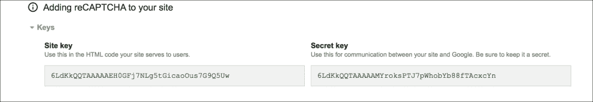
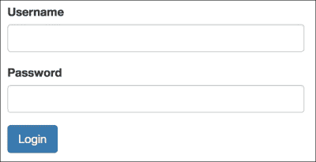
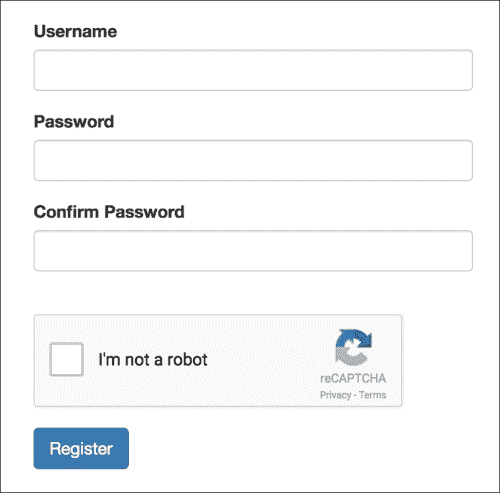
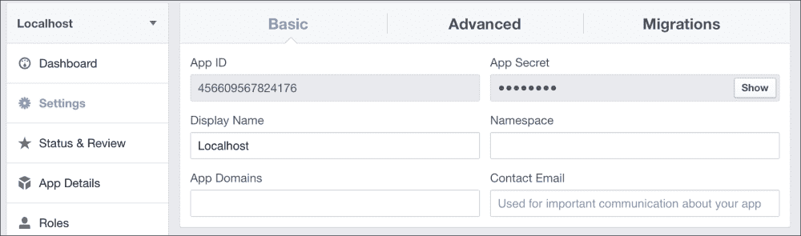

# 第六章：保护您的应用程序

我们有一个大部分功能正常的博客应用，但缺少一些关键功能，比如用户登录、注册以及从浏览器添加和编辑帖子。用户登录功能可以通过许多不同的方式创建，因此每个部分演示了创建登录的互斥方法。第一种方法是直接使用浏览器的 cookies，第二种方法是使用名为**Flask Login**的 Flask 扩展。

# 设置

在我们立即开始创建用户认证系统之前，需要进行大量的设置代码。为了运行任何类型的认证，我们的应用程序将需要以下所有常见的元素：

+   首先，用户模型将需要适当的密码哈希

+   其次，需要登录表单和注册表单来验证用户输入

+   其次，需要登录视图和注册视图以及每个视图的模板

+   其次，需要设置各种社交登录，以便在实施登录系统时将它们与登录系统绑定

## 更新模型

直到现在，我们的用户的密码以明文形式存储在数据库中。这是一个重大的安全漏洞。如果任何恶意用户能够访问数据库中的数据，他们可以登录到任何账户。这样的违规行为的后果将比我们的网站更大。互联网上有很多人在许多网站上使用相同的密码。

如果攻击者能够获得电子邮件和密码的组合，很可能可以使用这些信息登录到 Facebook 账户甚至银行账户。

为了保护我们用户的密码，它们将使用一种名为**哈希算法**的单向加密方法进行加密。单向加密意味着在信息加密后，无法从结果中恢复原始信息。然而，对于相同的数据，哈希算法将始终产生相同的结果。提供给哈希算法的数据可以是从文本文件到电影文件的任何内容。在这种情况下，数据只是一串字符。有了这个功能，我们的密码可以被存储为**哈希值**（已经被哈希过的数据）。然后，当用户在登录或注册页面输入他们的密码时，输入的文本密码将通过相同的哈希算法发送，然后验证存储的哈希和输入的哈希是否匹配。

有许多哈希算法，其中大多数都不安全，因为它们很容易被**暴力破解**。黑客不断尝试将数据通过哈希算法，直到有匹配的数据。为了最好地保护用户密码，bcrypt 将是我们选择的哈希算法。**Bcrypt**被特意设计成对计算机来说是低效和慢的（毫秒级对比微秒级），从而使其更难以被暴力破解。要将 bcrypt 添加到我们的项目中，需要安装**Flask Bcrypt**包，方法如下：

```py
$ pip install Flask-Bcrypt

```

这是第二个将在`app`对象上初始化的 Flask 扩展，另一个是 SQLAlchemy 对象。`db`对象存储在`models.py`文件中，但没有明显的地方来初始化 Flask Bcrypt。为了保存所有未来的扩展，需要在与`__init__.py`文件相同的目录中添加名为`extensions.py`的文件。在其中，需要初始化 Flask Bcrypt：

```py
from flask.ext.bcrypt import Bcrypt
bcrypt = Bcrypt()
```

然后将其添加到`app`对象中：

```py
from webapp.extensions import bcrypt

def create_app(object_name):
    app = Flask(__name__)
    app.config.from_object(object_name)

    db.init_app(app)
    bcrypt.init_app(app)
```

Bcrypt 现在已经准备好使用。为了让我们的`User`对象使用 bcrypt，我们将添加两个方法来设置密码并检查字符串是否与存储的哈希匹配：

```py
from webapp.extensions import bcrypt

class User(db.Model):
    id = db.Column(db.Integer(), primary_key=True)
    username = db.Column(db.String(255))
    password = db.Column(db.String(255))
    posts = db.relationship(
        'Post',
        backref='user',
        lazy='dynamic'
    )

    def __init__(self, username):
        self.username = username

    def __repr__(self):
        return '<User {}>'.format(self.username)

    def set_password(self, password):
        self.password = bcrypt.generate_password_hash(password)

    def check_password(self, password):
        return bcrypt.check_password_hash(self.password, password)
```

现在，我们的`User`模型可以安全地存储密码。接下来，我们的登录过程需要使用这些方法来创建新用户和检查密码。

## 创建表单

需要三种表单：登录表单、注册表单和**发布创建**页面的表单。登录表单将包含用户名和密码字段：

```py
from wtforms import (
    StringField,
    TextAreaField,
    PasswordField,
    BooleanField
)
from wtforms.validators import DataRequired, Length, EqualTo, URL

class LoginForm(Form):
    username = StringField('Username', [
        DataRequired(), Length(max=255)
    ])
    password = PasswordField('Password', [DataRequired()])

   def validate(self):
        check_validate = super(LoginForm, self).validate()

        # if our validators do not pass
        if not check_validate:
            return False

        # Does our the exist
        user = User.query.filter_by(
           username=self.username.data
        ).first()
        if not user:
            self.username.errors.append(
                'Invalid username or password'
            )
            return False

        # Do the passwords match
        if not self.user.check_password(self.password.data):
            self.username.errors.append(
                'Invalid username or password'
            )
            return False

        return True
```

除了正常的验证外，我们的`LoginForm`方法还将检查传递的用户名是否存在，并使用`check_password()`方法来检查哈希值。

### 使用 reCAPTCHA 保护您的表单免受垃圾邮件攻击

注册表单将包含用户名字段、带有确认字段的密码字段和名为 reCAPTCHA 字段的特殊字段。CAPTCHA 是 Web 表单上的一个特殊字段，用于检查输入表单数据的人是否真的是一个人，还是一个正在向您的站点发送垃圾邮件的自动化程序。reCAPTCHA 只是 CAPTCHA 的一种实现。reCAPTCHA 已经集成到 WTForms 中，因为它是 Web 上最流行的实现。

要使用 reCAPTCHA，您需要从[`www.google.com/recaptcha/intro/index.html`](https://www.google.com/recaptcha/intro/index.html)获取 reCAPTCHA 登录。由于 reCAPTCHA 是 Google 产品，您可以使用 Google 账户登录。

登录后，它将要求您添加一个站点。在这种情况下，任何名称都可以，但域字段必须包含`localhost`。一旦部署您的站点，您的域也必须添加到此列表中。

现在您已经添加了一个站点，下拉菜单中将显示有关服务器和客户端集成的说明。当我们创建登录和注册视图时，给定的`script`标签将需要添加到我们的模板中。WTForms 需要从此页面获取的是如下截图中显示的密钥：



记住永远不要向公众展示这些密钥。由于这些密钥仅注册给`localhost`，因此可以在此处显示而不会受到影响。

将这些密钥添加到`config.py`文件中的`config`对象中，以便 WTForms 可以访问它们，如下所示：

```py
class Config(object):
    SECRET_KEY = 'Key Here'
    RECAPTCHA_PUBLIC_KEY = 
"6LdKkQQTAAAAAEH0GFj7NLg5tGicaoOus7G9Q5Uw"
    RECAPTCHA_PRIVATE_KEY =
'6LdKkQQTAAAAAMYroksPTJ7pWhobYb88fTAcxcYn'
```

以下是我们的注册表单：

```py
class RegisterForm(Form):
    username = StringField('Username', [
        DataRequired(),
        Length(max=255)
    ])
    password = PasswordField('Password', [
        DataRequired(),
        Length(min=8)
    ])
    confirm = PasswordField('Confirm Password', [
        DataRequired(),
        EqualTo('password')
    ])
    recaptcha = RecaptchaField()

    def validate(self):
        check_validate = super(RegisterForm, self).validate()

        # if our validators do not pass
        if not check_validate:
            return False

        user = User.query.filter_by(
            username=self.username.data
        ).first()

        # Is the username already being used
        if user:
            self.username.errors.append(
                "User with that name already exists"
            )
            return False

        return True
```

帖子创建表单将只包含标题的文本输入和帖子内容的文本区域输入：

```py
class PostForm(Form):
    title = StringField('Title', [
        DataRequired(), 
        Length(max=255)
    ])
    text = TextAreaField('Content', [DataRequired()])
```

## 创建视图

在上一章中，包含重定向到博客主页的索引视图存储在`create_app`函数中。这对于一个视图来说是可以的。现在，本节将在站点的基本 URL 上添加许多视图。因此，我们需要在`controllers/main.py`中添加一个新的控制器：

```py
main_blueprint = Blueprint(
    'main',
    __name__,
    template_folder='../templates/main'
)

@main_blueprint.route('/')
def index():
    return redirect(url_for('blog.home'))
```

登录和注册视图将创建我们的表单对象并将它们传递给模板。目前，如果传递的数据验证通过，登录表单将不执行任何操作。实际的登录功能将在下一节中添加。但是，如果数据通过验证，注册视图将创建一个新用户。除了登录和注册视图之外，还需要一个注销视图，目前也不会执行任何操作。

在`main.py`控制器中，添加以下内容：

```py
from webapp.forms import LoginForm, RegisterForm

@main_blueprint.route('/login', methods=['GET', 'POST'])
def login():
    form = LoginForm()

    if form.validate_on_submit():
        flash("You have been logged in.", category="success") 
        return redirect(url_for('blog.home'))

    return render_template('login.html', form=form)

@main_blueprint.route('/logout', methods=['GET', 'POST'])
def logout():
    flash("You have been logged out.", category="success")
    return redirect(url_for('.home'))

@main_blueprint.route('/register', methods=['GET', 'POST'])
def register():
    form = RegisterForm()

    if form.validate_on_submit():
        new_user = User()
        new_user.username = form.username.data
        new_user.set_password(form.username.data)

        db.session.add(new_user)
        db.session.commit()

        flash(
            "Your user has been created, please login.", 
            category="success"
        )

           return redirect(url_for('.login'))

    return render_template('register.html', form=form)
```

在前面的代码中使用的`login.html`和`register.html`模板（放置在`templates/main`文件夹中）可以使用第三章中创建的`form`宏来创建，但是 reCAPTCHA 的`script`标签尚不能添加到`register.html`中。

首先，我们的子模板需要一种方法来向`base.html`模板添加新的 JavaScript 文件。还需要一种方法让我们的视图使用 Flask 的`flash`函数向用户闪现消息。在`base.html`文件中还需要添加一个新的内容块以及对消息的循环：

```py
<body>
  <div class="container">
    <div class="jumbotron">
      <h1><a href="{{ url_for('blog.home') }}">My Blog</a></h1>
      <p>Welcome to the blog!</p>
    </div>
    
      
        
           <div class="alert alert-{{ category }} alert-dismissible" 
             role="alert">
           <button type="button" class="close" data-dismiss="alert" aria-label="Close"><span aria-hidden="true">&times;</span></button>

           {{ message }}
          </div>
        
      
    
    
    
  </div>
  <script 
    src="img/jquery.min.js"> 
    </script>
  <script 
    src="img/bootstrap.min.js"> 
    </script>
  
  
</body>
```

您的登录页面现在应该类似于以下内容：



您的注册页面应该如下所示：



现在我们需要创建帖子创建和编辑页面，以便可以进行安全保护。这两个页面将需要将文本区域字段转换为**所见即所得**（**WYSIWYG**）编辑器，以处理将帖子文本包装在 HTML 中。在`blog.py`控制器中，添加以下视图：

```py
from webapp.forms import CommentForm, PostForm

@blog_blueprint.route('/new', methods=['GET', 'POST'])
def new_post():
    form = PostForm()

    if form.validate_on_submit():
        new_post = Post(form.title.data)
        new_post.text = form.text.data
        new_post.publish_date = datetime.datetime.now() 

        db.session.add(new_post)
        db.session.commit()

    return render_template('new.html', form=form)

@blog_blueprint.route('/edit/<int:id>', methods=['GET', 'POST'])
def edit_post(id):

    post = Post.query.get_or_404(id)
    form = PostForm()

    if form.validate_on_submit():
        post.title = form.title.data
        post.text = form.text.data
        post.publish_date = datetime.datetime.now()

        db.session.add(post)
        db.session.commit()

        return redirect(url_for('.post', post_id=post.id))

    form.text.data = post.text

    return render_template('edit.html', form=form, post=post)
```

这个功能与用于添加新评论的代码非常相似。文本字段的数据在视图中设置，因为没有简单的方法在模板中设置`TextAreaField`的内容。

`new.html` 模板将需要一个用于所见即所得编辑器的 JavaScript 文件。**CKEditor** 安装和使用非常简单。现在，我们的 `new.html` 文件可以按以下方式创建：

```py

Post Creation

<div class="row">
  <h1 class="text-center">Create A New Post</h1>
  <form method="POST" action="{{ url_for('.new_post') }}">
    {{ form.hidden_tag() }}
    <div class="form-group">
      {{ form.title.label }}
      
        
          <p class="help-block">{{ e }}</p>
        
      
      {{ form.title(class_='form-control') }}
    </div>
    <div class="form-group">
      {{ form.text.label }}
      
        
          <p class="help-block">{{ e }}</p>
        
      
      {{ form.text(id="editor", class_='form-control') }}
    </div>
    <input class="btn btn-primary" type="submit" value="Submit">
  </form>
</div>



<script src="img/ckeditor.js"></script>
<script>
    CKEDITOR.replace('editor');
</script>

```

这就是将用户输入存储为 HTML 在数据库中所需的全部内容。因为我们在帖子模板中传递了安全过滤器，所以 HTML 代码在我们的帖子页面上显示正确。`edit.html` 模板类似于 `new.html` 模板。唯一的区别是 `form` 开放标签和创建 `title` 字段：

```py
<form method="POST" action="{{ url_for('.edit_post', id=post.id) }}">
…
{{ form.title(class_='form-control', value=post.title) }}
…
</form>
```

`post.html` 模板将需要一个按钮，以将作者链接到编辑页面：

```py
<div class="row">
  <div class="col-lg-6">
    <p>Written By <a href="{{ url_for('.user', username=post.user.username) 
      }}">{{ post.user.username }}</a> on {{ post.publish_date }}</p>
  </div>
  …
  <div class="row">
    <div class="col-lg-2">
    <a href="{{ url_for('.edit_post', id=post.id) }}" class="btn btn- 
      primary">Edit</a>
  </div>
</div>
```

当我们能够检测到当前用户时，编辑按钮将只显示给创建帖子的用户。

## 社交登录

随着时间的推移，将替代登录和注册选项集成到您的网站变得越来越重要。每个月都会有另一个公告称密码已从热门网站中被盗。实现以下登录选项意味着我们网站的数据库永远不会为该用户存储密码。

验证由一个大型品牌公司处理，用户已经对其信任。通过使用社交登录，用户对其所使用的网站的信任程度要低得多。您的登录流程也变得更短，降低了用户使用您的应用的门槛。

社交认证用户表现为普通用户，与基于密码的登录方法不同，它们可以同时使用。

### OpenID

**OpenID** 是一种开放协议，允许在一个站点上的用户由实现该协议的任何第三方站点进行身份验证，这些站点被称为 **Relaying Parties** (**RPs**)。OpenID 登录表示为来自其中一个 RP 的 URL，通常是网站的个人资料页面。

### 注意

要了解使用 OpenID 的所有网站列表以及如何使用每个网站，转到 [`openid.net/get-an-openid/`](http://openid.net/get-an-openid/)。

要将 OpenID 添加到 Flask，需要一个名为 **Flask-OpenID** 的 Flask 扩展：

```py
$ pip install Flask-OpenID

```

我们的应用程序将需要一些东西来实现 OpenID：

+   一个新的表单对象

+   登录和注册页面的表单验证

+   表单提交后的回调以登录用户或创建新用户

在 `extensions.py` 文件中，可以按以下方式初始化 OpenID 对象：

```py
from flask.ext.bcrypt import Bcrypt
from flask.ext.openid import OpenID
bcrypt = Bcrypt()
oid = OpenID()
```

在 `__init__.py` 文件中，将 `oid` 对象注册到 `app` 对象：

```py
from .models import db

def create_app(object_name):
    app = Flask(__name__)
    app.config.from_object(object_name)

    db.init_app(app)
    bcrypt.init_app(app)
    oid.init_app(app)
```

新的 `form` 对象只需要 RP 的 URL：

```py
from wtforms.validators import DataRequired, Length, EqualTo, URL

class OpenIDForm(Form):
    openid = StringField('OpenID URL', [DataRequired(), URL()])
```

在登录和注册视图上，将初始化 `OpenIDForm()`，如果数据有效，将发送登录请求：

```py
from webapp.extensions import oid
…

@main_blueprint.route('/login', methods=['GET', 'POST'])
@oid.loginhandler
def login():
    form = LoginForm()
    openid_form = OpenIDForm()

    if openid_form.validate_on_submit():
        return oid.try_login(
            openid_form.openid.data,
            ask_for=['nickname', 'email'],
            ask_for_optional=['fullname']
        )

    if form.validate_on_submit():
        flash("You have been logged in.", category="success")
        return redirect(url_for('blog.home'))

    openid_errors = oid.fetch_error()
    if openid_errors:
        flash(openid_errors, category="danger")

    return render_template(
       'login.html',
       form=form,
       openid_form=openid_form
    )

@main_blueprint.route('/register', methods=['GET', 'POST'])
@oid.loginhandler
def register():
    form = RegisterForm()
    openid_form = OpenIDForm()

    if openid_form.validate_on_submit():
        return oid.try_login(
            openid_form.openid.data,
            ask_for=['nickname', 'email'],
            ask_for_optional=['fullname']
        )

    if form.validate_on_submit():
        new_user = User(form.username.data)
        new_user.set_password(form.password.data)

        db.session.add(new_user)
        db.session.commit()

        flash(
            "Your user has been created, please login.", 
            category="success"
        )

        return redirect(url_for('.login'))

    openid_errors = oid.fetch_error()
    if openid_errors:
        flash(openid_errors, category="danger")

    return render_template(
        'register.html',
        form=form,
        openid_form=openid_form
    )
```

两个视图都有新的装饰器 `@oid.loginhandler`，告诉 Flask-OpenID 监听来自 RP 的身份验证信息。使用 OpenID，登录和注册是相同的。可以从登录表单创建用户，也可以从注册表单登录。两个页面上都出现相同的字段，以避免用户混淆。

要处理用户创建和登录，需要在 `extensions.py` 文件中创建一个新函数：

```py
@oid.after_login
def create_or_login(resp):
    from models import db, User
    username = resp.fullname or resp.nickname or resp.email
    if not username:
        flash('Invalid login. Please try again.', 'danger')
        return redirect(url_for('main.login'))

    user = User.query.filter_by(username=username).first()
    if user is None:
        user = User(username)
        db.session.add(user)
        db.session.commit()

    # Log the user in here
    return redirect(url_for('blog.home'))
```

每次从 RP 收到成功响应后都会调用此函数。如果登录成功并且不存在与该身份对应的用户对象，则此函数将创建一个新的 `User` 对象。如果已经存在，则即将到来的身份验证方法将登录用户。OpenID 不需要返回所有可能的信息，因此可能只会返回电子邮件而不是全名。这就是为什么用户名可以是昵称、全名或电子邮件的原因。在函数内导入 `db` 和 `User` 对象，以避免从导入 `bcrypt` 对象的 `models.py` 文件中导入循环导入。

### Facebook

要使用 Facebook 登录，以及后来的 Twitter，使用名为 **OAuth** 的协议。我们的应用程序不会直接使用 OAuth，而是将使用另一个名为 **Flask OAuth** 的 Flask 扩展：

```py
$ pip install Flask-OAuth

```

使用 Facebook 登录，我们的应用程序需要使用我们应用程序的密钥定义一个 Facebook OAuth 对象。定义一个视图，将用户重定向到 Facebook 服务器上的登录授权过程，并在 Facebook 方法上定义一个函数，从登录过程中加载`auth`令牌。

首先，需要在[`developers.facebook.com`](http://developers.facebook.com)创建一个 Facebook 应用。创建新应用后，查找列出应用程序 ID 和密钥的面板。



在`extensions.py`中添加以下代码时使用这些值：

```py
from flask_oauth import OAuth

bcrypt = Bcrypt()
oid = OpenID()
oauth = OAuth()

…

facebook = oauth.remote_app(
    'facebook',
    base_url='https://graph.facebook.com/',
    request_token_url=None,
    access_token_url='/oauth/access_token',
    authorize_url='https://www.facebook.com/dialog/oauth',
    consumer_key=' FACEBOOK_APP_ID',
    consumer_secret=' FACEBOOK_APP_SECRET',
    request_token_params={'scope': 'email'}
)
@facebook.tokengetter
def get_facebook_oauth_token():
    return session.get('facebook_oauth_token')
```

在 Facebook 开发者界面中，请确保添加新的授权网站为`http://localhost:5000/`，否则登录将无法工作。在`main.py`控制器中，添加以下代码：

```py
from webapp.extensions import oid, facebook
…

@main_blueprint.route('/facebook')
def facebook_login():
    return facebook.authorize(
        callback=url_for(
            '.facebook_authorized',
            next=request.referrer or None,
            _external=True
        )
    )

@main_blueprint.route('/facebook/authorized')
@facebook.authorized_handler
def facebook_authorized(resp):
    if resp is None:
        return 'Access denied: reason=%s error=%s' % (
            request.args['error_reason'],
            request.args['error_description']
        )

    session['facebook_oauth_token'] = (resp['access_token'], '')

    me = facebook.get('/me')
    user = User.query.filter_by(
        username=me.data['first_name'] + " " + me.data['last_name']
    ).first()

    if not user:
        user = User(me.data['first_name'] + " " + me.data['last_name'])
        db.session.add(user)
        db.session.commit()

    # Login User here
    flash("You have been logged in.", category="success")

    return redirect(
        request.args.get('next') or url_for('blog.home')
    )
```

第一个路由`facebook_login`只是重定向到 Facebook 网站上的登录过程。`facebook_authorized`视图接收来自 Facebook 服务器的响应，并且与 OpenID 过程一样，要么创建一个新用户，要么登录用户。现在，要开始这个过程，向注册和登录模板添加以下链接：

```py
<h2 class="text-center">Register With Facebook</h2>
<a href="{{ url_for('.facebook_login') }}">Login via Facebook</a>
```

### Twitter

Twitter 登录过程非常相似。要创建 Twitter 应用并获取您的密钥，请转到[`apps.twitter.com/`](https://apps.twitter.com)。在`extensions.py`中：

```py
twitter = oauth.remote_app(
    'twitter',
    base_url='https://api.twitter.com/1.1/',
    request_token_url='https://api.twitter.com/oauth/request_token',
    access_token_url='https://api.twitter.com/oauth/access_token',
    authorize_url='https://api.twitter.com/oauth/authenticate',
    consumer_key='',
    consumer_secret=''
)

@twitter.tokengetter
def get_twitter_oauth_token():
    return session.get('twitter_oauth_token')
```

在`main.py`控制器中，添加以下视图：

```py
@main_blueprint.route('/twitter-login')
def twitter_login():
    return twitter.authorize(
        callback=url_for(
            '.twitter_authorized',
            next=request.referrer or None,
            _external=True
        )
    )

@main_blueprint.route('/twitter-login/authorized')
@twitter.authorized_handler
def twitter_authorized(resp):
    if resp is None:
        return 'Access denied: reason: {} error: {}'.format(
            request.args['error_reason'],
            request.args['error_description']
        )

    session['twitter_oauth_token'] = resp['oauth_token'] + \
        resp['oauth_token_secret']

    user = User.query.filter_by(
        username=resp['screen_name']
    ).first()

    if not user:
        user = User(resp['screen_name'], '')
        db.session.add(user)
        db.session.commit()

    # Login User here
    flash("You have been logged in.", category="success")

    return redirect(
        request.args.get('next') or url_for('blog.home')
    )
```

这些视图执行与它们的 Facebook 对应项相同的功能。最后，在注册和登录模板中，添加以下链接以开始登录过程：

```py
<h2 class="text-center">Register With Twitter</h2>
<a href="{{ url_for('.twitter_login') }}">Login</a>
```

# 使用会话

在 Flask 中创建身份验证的一种方法是使用`session`对象。`session`对象是 Flask 中的一个对象，它为服务器提供了一种使用 cookie 在用户浏览器中存储信息的简单方式。存储的数据使用应用程序的密钥进行加密签名。如果用户尝试修改 cookie，则签名将不再有效，cookie 将无法读取。

会话对象具有与`dict`对象相同的 API。要向其中添加数据，只需使用此代码：

```py
session['key'] = data
```

要检索数据，请使用此代码：

```py
session['key']
```

要登录用户，将用户名键添加到会话中，并设置为当前用户的用户名。

```py
@main_blueprint.route('/login', methods=['GET', 'POST'])
def login():
    form = LoginForm()

    if form.validate_on_submit():
        # Add the user's name to the cookie
        session['username'] = form.username.data

    return render_template('login.html', form=form)
```

要注销用户，可以从会话中弹出密钥：

```py
@main_blueprint.route('/logout', methods=['GET', 'POST'])
def logout():
    # Remove the username from the cookie
    session.pop('username', None)
    return redirect(url_for('.login'))
```

要检查用户当前是否已登录，视图可以测试会话中是否存在用户名键。考虑以下新帖子视图：

```py
@blog_blueprint.route('/new', methods=['GET', 'POST'])
def new_post ():
    if 'username' not in session:
        return redirect(url_for('main.login'))
    …
```

我们的一些模板将需要访问当前用户对象。在每个请求开始时，我们的`blog`蓝图可以检查会话中是否存在用户名。如果是，则将`User`对象添加到`g`对象中，通过模板可以访问。

```py
@blog_blueprint.before_request
def check_user():
    if 'username' in session:
        g.current_user = User.query.filter_by(
            username=session['username']
        ).one()
    else:
        g.current_user = None
```

我们的登录检查可以更改为：

```py
@blog_blueprint.route('/new', methods=['GET', 'POST'])
def new_post():
    if not g.current_user:
        return redirect(url_for('main.login'))
    …
```

此外，帖子页面上的编辑按钮只有在当前用户是作者时才会出现：

```py

<div class="row">
  <div class="col-lg-2">
    <a href="{{ url_for('.edit_post', id=post.id) }}" class="btn btn- 
      primary">Edit</a>
  </div>
</div>

```

编辑页面本身还应执行以下检查：

```py
@blog_blueprint.route('/edit/<int:id>', methods=['GET', 'POST'])
def edit_post(id):
    if not g.current_user:
        return redirect(url_for('main.login'))

    post = Post.query.get_or_404(id)

    if g.current_user != post.user:
        abort(403)
    …
```

现在，我们的应用程序具有一个功能齐全的登录系统，具有传统的用户名和密码组合以及许多社交登录。但是，此系统中还有一些功能未涵盖。例如，如果我们希望一些用户只能评论而给其他人创建帖子的权限呢？此外，我们的登录系统没有实现`记住我`功能。为了覆盖这些功能，我们将重构我们的应用程序，使用名为**Flask 登录**的 Flask 扩展，而不是直接使用会话。

# Flask 登录

要开始使用 Flask 登录，首先需要下载它：

```py
$ pip install flask-login

```

主要的 Flask 登录对象是`LoginManager`对象。像其他 Flask 扩展一样，在`extensions.py`中初始化`LoginManager`对象：

```py
from flask.ext.login import LoginManager
…
login_manager = LoginManager()
```

有一些需要在对象上更改的配置选项：

```py
login_manager.login_view = "main.login"
login_manager.session_protection = "strong"
login_manager.login_message = "Please login to access this page"
login_manager.login_message_category = "info"

@login_manager.user_loader
def load_user(userid):
    from models import User
    return User.query.get(userid)
```

上述配置值定义了哪个视图应该被视为登录页面，以及用户在登录时应该看到什么样的消息。将选项`session_protection`设置为`strong`可以更好地防止恶意用户篡改他们的 cookie。当检测到篡改的 cookie 时，该用户的会话对象将被删除，并强制用户重新登录。`load_user`函数接受一个 id 并返回`User`对象。这是为了让 Flask Login 检查 id 是否标识了正确的用户对象。

`User`模型需要更新，包括一些用于 Flask Login 的方法。首先是`is_authenticated`，用于检查`User`对象是否已登录。接下来是`is_active`，用于检查用户是否已经通过某种激活过程，比如电子邮件确认。否则，它允许网站管理员封禁用户而不删除他们的数据。然后，`is_anonymous`用于检查这个用户是否是匿名用户且未登录。最后，`get_id`函数返回该`User`对象的唯一`unicode`标识符。

这个应用程序将使用一个简单的实现方式：

```py
from flask.ext.login import AnonymousUserMixin
…

class User(db.Model):
    id = db.Column(db.Integer(), primary_key=True)
    username = db.Column(db.String(255))
    password = db.Column(db.String(255))
    posts = db.relationship(
        'Post',
        backref='user',
        lazy='dynamic'
    )

    def __init__(self, username):
        self.username = username

    def __repr__(self):
        return '<User {}>'.format(self.username)

    def set_password(self, password):
        self.password = bcrypt.generate_password_hash(password)

    def check_password(self, password):
        return bcrypt.check_password_hash(self.password, password)

    def is_authenticated(self):
        if isinstance(self, AnonymousUserMixin):
            return False
        else:
            return True

    def is_active(self):
        return True

    def is_anonymous(self):
        if isinstance(self, AnonymousUserMixin):
            return True
        else:
            return False

    def get_id(self):
        return unicode(self.id)
```

在 Flask Login 中，站点上的每个用户都继承自某个用户对象。默认情况下，它们继承自`AnonymousUserMixin`对象。如果您的站点需要一些匿名用户的功能，可以创建一个从`AnonymousUserMixin`继承的类，并将其设置为默认用户类，如下所示：

```py
login_manager.anonymous_user = CustomAnonymousUser
```

### 注意

要更好地理解**混入**的概念，请访问[`en.wikipedia.org/wiki/Mixin`](https://en.wikipedia.org/wiki/Mixin)。

要使用 Flask Login 登录用户，使用：

```py
from flask.ext.login import login_user
login_user(user_object)
```

Flask Login 会处理所有的会话处理。要让用户被记住，添加`remember=True`到`login_user`调用中。可以在登录表单中添加复选框，让用户选择：

```py
from wtforms import (
    StringField,
    TextAreaField,
    PasswordField,
    BooleanField
)

class LoginForm(Form):
    username = StringField('Username', [
        DataRequired(),
        Length(max=255)
    ])
    password = PasswordField('Password', [DataRequired()])
    remember = BooleanField("Remember Me")
    …
```

在登录视图中，添加这个：

```py
if form.validate_on_submit():
    user = User.query.filter_by(
        username=form.username.data
    ).one()
    login_user(user, remember=form.remember.data)
```

要注销当前用户，使用以下命令：

```py
from flask.ext.login import login_user, logout_user
logout_user()
```

要保护视图不被未经授权的用户访问并将他们发送到登录页面，需要添加`login_required`装饰器如下：

```py
from flask.ext.login import login_required

@blog_blueprint.route('/new', methods=['GET', 'POST'])
@login_required
def new_post():
    form = PostForm()
    …
```

Flask Login 还提供了一个代理，用于表示已登录用户的`current_user`。这个代理在视图和模板中都可用。因此，在我们的博客控制器中，可以删除自定义的`before_request`处理程序，并且我们对`g.current_user`的调用应该替换为`current_user`。

现在，使用 Flask Login，我们应用程序的登录系统更加符合 Python 的风格和安全。还有一个最后的功能要实现：用户角色和权限。

## 用户角色

要向我们的应用程序添加用户权限，我们的`User`模型将需要与`Role`对象的多对多关系，并且还需要另一个名为**Flask Principal**的 Flask 扩展。

使用我们从第二章中的代码，*使用 SQLAlchemy 创建模型*，向`User`对象添加一个多对多的关系很容易：

```py
roles = db.Table(
    'role_users',
    db.Column('user_id', db.Integer, db.ForeignKey('user.id')),
    db.Column('role_id', db.Integer, db.ForeignKey('role.id'))
)

class User(db.Model):
    id = db.Column(db.Integer(), primary_key=True)
    username = db.Column(db.String(255), unique=True)
    password = db.Column(db.String(255))
    posts = db.relationship(
        'Post',
        backref='user',
        lazy='dynamic'
    )
    roles = db.relationship(
        'Role',
        secondary=roles,
        backref=db.backref('users', lazy='dynamic')
    )

    def __init__(self, username):
        self.username = username

        default = Role.query.filter_by(name="default").one()
        self.roles.append(default)
    …

class Role(db.Model):
    id = db.Column(db.Integer(), primary_key=True)
    name = db.Column(db.String(80), unique=True)
    description = db.Column(db.String(255))

    def __init__(self, name):
        self.name = name

    def __repr__(self):
        return '<Role {}>'.format(self.name)
```

从命令行中，使用以下命令填充角色表格，包括三个角色：admin，poster 和 default。这些将作为 Flask Principal 的主要权限。

Flask Principal 围绕着身份的概念展开。应用程序中的某个东西，在我们的例子中是一个`User`对象，与之关联了一个身份。身份提供`Need`对象，它们本质上只是命名元组。`Needs`定义了身份可以做什么。权限是用`Need`初始化的，并且它们定义了资源需要访问的`Need`对象。

Flask Principal 提供了两个方便的`Need`对象：`UserNeed`和`RoleNeed`，这正是我们应用程序所需要的。在`extensions.py`中，Flask Principal 将被初始化，并且我们的`RoleNeed`对象将被创建：

```py
from flask.ext.principal import Principal, Permission, RoleNeed
principals = Principal()
admin_permission = Permission(RoleNeed('admin'))
poster_permission = Permission(RoleNeed('poster'))
default_permission = Permission(RoleNeed('default'))
```

Flask Principal 需要一个函数，在身份发生变化后向其中添加`Need`对象。因为这个函数需要访问`app`对象，所以这个函数将驻留在`__init__.py`文件中：

```py
from flask.ext.principal import identity_loaded, UserNeed, RoleNeed
from extensions import bcrypt, oid, login_manager, principals
def create_app(object_name):
    app = Flask(__name__)
    app.config.from_object(object_name)

    db.init_app(app)
    bcrypt.init_app(app)
    oid.init_app(app)
    login_manager.init_app(app)
    principals.init_app(app)

    @identity_loaded.connect_via(app)
    def on_identity_loaded(sender, identity):
        # Set the identity user object
        identity.user = current_user

        # Add the UserNeed to the identity
        if hasattr(current_user, 'id'):
            identity.provides.add(UserNeed(current_user.id))

        # Add each role to the identity
        if hasattr(current_user, 'roles'):
            for role in current_user.roles:
                identity.provides.add(RoleNeed(role.name))
     …
```

现在，当身份发生变化时，它将添加一个`UserNeed`和所有的`RoleNeed`对象。当用户登录或注销时，身份发生变化：

```py
from flask.ext.principal import (
    Identity,
    AnonymousIdentity,
    identity_changed
)    
@main_blueprint.route('/login', methods=['GET', 'POST'])
@oid.loginhandler
def login():
    …

    if form.validate_on_submit():
        user = User.query.filter_by(
            username=form.username.data
        ).one()
        login_user(user, remember=form.remember.data)

        identity_changed.send(
            current_app._get_current_object(),
            identity=Identity(user.id)
        )

        flash("You have been logged in.", category="success")
        return redirect(url_for('blog.home'))
@main_blueprint.route('/logout', methods=['GET', 'POST'])
def logout():
    logout_user()

    identity_changed.send(
        current_app._get_current_object(),
        identity=AnonymousIdentity()
    )

    flash("You have been logged out.", category="success")
    return redirect(url_for('.login'))
```

当用户登录时，他们的身份将触发`on_identity_loaded`方法，并设置他们的`Need`对象。现在，如果我们有一个页面，我们只想让发布者访问：

```py
from webapp.extensions import poster_permission
@blog_blueprint.route('/edit/<int:id>', methods=['GET', 'POST'])
@login_required
@poster_permission.require(http_exception=403)
def edit_post(id):
    …
```

我们还可以在同一个视图中用`UserNeed`检查替换我们的用户检查，如下所示：

```py
from webapp.extensions import poster_permission, admin_permission

@blog_blueprint.route('/edit/<int:id>', methods=['GET', 'POST'])
@login_required
@poster_permission.require(http_exception=403)
def edit_post(id):
    post = Post.query.get_or_404(id)
    permission = Permission(UserNeed(post.user.id))

    # We want admins to be able to edit any post
    if permission.can() or admin_permission.can():
        form = PostForm()

        if form.validate_on_submit():
            post.title = form.title.data
            post.text = form.text.data
            post.publish_date = datetime.datetime.now()

            db.session.add(post)
            db.session.commit()

            return redirect(url_for('.post', post_id=post.id))

        form.text.data = post.text
        return render_template('edit.html', form=form, post=post)

    abort(403)
```

### 注意

访问[`pythonhosted.org/Flask-Principal/`](https://pythonhosted.org/Flask-Principal/)上的 Flask Principal 文档，了解如何创建更复杂的`Need`对象。

# 摘要

我们的用户现在拥有安全登录、多重登录和注册选项，以及明确的访问权限。我们的应用程序具备成为一个完整的博客应用程序所需的一切。在下一章中，本书将停止跟随这个示例应用程序，以介绍一种名为**NoSQL**的技术。
