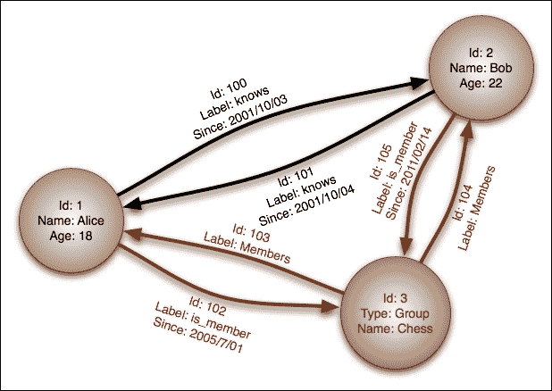

# 第七章：使用 Flask 与 NoSQL

**NoSQL**（缩写为**Not Only SQL**）数据库是任何非关系型数据存储。它通常侧重于速度和可伸缩性。在过去的 7 年里，NoSQL 一直在网页开发领域掀起了风暴。像 Netflix 和 Google 这样的大公司宣布他们正在将许多服务迁移到 NoSQL 数据库，许多较小的公司也跟随着这样做。

这一章将偏离本书的其余部分，其中 Flask 不会是主要焦点。在一本关于 Flask 的书中，专注于数据库设计可能看起来有些奇怪，但选择正确的数据库对于设计技术栈来说可能是最重要的决定。在绝大多数网络应用中，数据库是瓶颈，因此你选择的数据库将决定应用的整体速度。亚马逊进行的一项研究表明，即使 100 毫秒的延迟也会导致 1%的销售额减少，因此速度应该始终是网络开发人员的主要关注点之一。此外，程序员社区中有大量关于选择流行的 NoSQL 数据库然后并不真正了解数据库在管理方面需要什么的恐怖故事。这导致大量数据丢失和崩溃，进而意味着失去客户。总的来说，毫不夸张地说，你选择应用的数据库可能是应用成功与否的关键。

为了说明 NoSQL 数据库的优势和劣势，将对每种 NoSQL 数据库进行检查，并阐明 NoSQL 与传统数据库之间的区别。

# NoSQL 数据库的类型

NoSQL 是一个用来描述数据库中非传统数据存储方法的总称。更让人困惑的是，NoSQL 也可能指的是关系型但没有使用 SQL 作为查询语言的数据库，例如**RethinkDB**。绝大多数 NoSQL 数据库不是关系型的，不像 RDBMS，这意味着它们无法执行诸如`JOIN`之类的操作。缺少`JOIN`操作是一种权衡，因为它允许更快的读取和更容易的去中心化，通过将数据分布在多个服务器甚至是不同的数据中心。

现代 NoSQL 数据库包括键值存储、文档存储、列族存储和图数据库。

## 键值存储

**键值** NoSQL 数据库的工作方式类似于 Python 中的字典。一个键关联一个值，并通过该键访问。此外，就像 Python 字典一样，大多数键值数据库的读取速度不受条目数量的影响。高级程序员会知道这是**O(1)读取**。在一些键值存储中，一次只能检索一个键，而不是传统 SQL 数据库中的多行。在大多数键值存储中，值的内容是不可*查询*的，但键是可以的。值只是二进制块；它们可以是从字符串到电影文件的任何东西。然而，一些键值存储提供默认类型，如字符串、列表、集合和字典，同时还提供添加二进制数据的选项。

由于其简单性，键值存储通常非常快。但是，它们的简单性使它们不适合大多数应用程序的主数据库。因此，大多数键值存储用例是存储需要在一定时间后过期的简单对象。这种模式的两个常见示例是存储用户会话数据和购物车数据。此外，键值存储通常用作应用程序或其他数据库的缓存。例如，经常运行或 CPU 密集型查询或函数的结果与查询或函数名称一起存储为键。应用程序在运行数据库上的查询之前将检查键值存储中的缓存，从而减少页面加载时间和对数据库的压力。此功能的示例将在第十章中展示，*有用的 Flask 扩展*。

最流行的键值存储是**Redis**，**Riak**和**Amazon DynamoDB**。

## 文档存储

**文档存储**是最流行的 NoSQL 数据库类型之一，通常用于替代 RDBMS。数据库将数据存储在称为文档的键值对集合中。这些文档是无模式的，意味着没有文档必须遵循另一个文档的结构。此外，可以在文档创建后附加额外的键。大多数文档存储将数据存储在**JSON**（**JavaScript 对象表示法**）中，JSON 的超集，或 XML 中。例如，以下是存储在 JSON 中的两个不同的帖子对象：

```py
{
    "title": "First Post",
    "text": "Lorem ipsum...",
    "date": "2015-01-20",
    "user_id": 45
}
{
    "title": "Second Post",
    "text": "Lorem ipsum...",
    "date": "2015-01-20",
    "user_id": 45,
    "comments": [
        {
            "name": "Anonymous",
            "text": "I love this post."
        }
    ]
}
```

请注意，第一个文档没有评论数组。如前所述，文档是无模式的，因此此格式是完全有效的。无模式还意味着在数据库级别没有类型检查。数据库上没有任何内容可以阻止将整数输入到帖子的标题字段中。无模式数据是文档存储的最强大功能，并吸引许多人采用它们的应用程序。但是，它也可能被认为非常危险，因为有一个检查可以阻止错误或格式错误的数据进入数据库。

一些文档存储将类似的对象收集到文档集合中，以便更容易地查询对象。但是，在一些文档存储中，所有对象都是一次查询的。文档存储存储每个对象的元数据，这允许查询并返回匹配的文档中的所有值。

最流行的文档存储是**MongoDB**，**CouchDB**和**Couchbase**。

## 列族存储

**列族存储**，也称为宽列存储，与键值存储和文档存储有许多共同之处。列族存储是最快的 NoSQL 数据库类型，因为它们设计用于大型应用程序。它们的主要优势是能够处理大量数据，并且通过以智能方式将数据分布在多台服务器上，仍然具有非常快的读写速度。

列族存储也是最难理解的，部分原因是列族存储的行话，因为它们使用与 RDBMS 相同的术语，但含义大相径庭。为了清楚地理解列族存储是什么，让我们直接举个例子。让我们在典型的列族存储中创建一个简单的*用户到帖子*关联。

首先，我们需要一个用户表。在列族存储中，数据是通过唯一键存储和访问的，例如键值存储，但内容是无结构的列，例如文档存储。考虑以下用户表：

| 键 | 杰克 | 约翰 |
| --- | --- | --- |
| **列** | **全名** | **生物** | **位置** | **全名** | **生物** |
| **值** | 杰克·斯托弗 | 这是我的个人简介 | 美国密歇根州 | 约翰·多 | 这是我的个人简介 |

请注意，每个键都包含列，这些列也是键值对。而且，并不要求每个键具有相同数量或类型的列。每个键可以存储数百个唯一的列，或者它们可以都有相同数量的列，以便更容易进行应用程序开发。这与键值存储形成对比，后者可以存储每个键的任何类型的数据。这也与文档存储略有不同，后者可以在每个文档中存储类型，比如数组和字典。现在让我们创建我们的帖子表：

| 键 | 帖子/1 | 帖子/2 |
| --- | --- | --- |
| **列** | **标题** | **日期** | **文本** | **标题** | **日期** | **文本** |
| **值** | 你好，世界 | 2015-01-01 | 发布的文本... | 仍然在这里 | 2015-02-01 | 发布的文本... |

在我们继续之前，有几件事情需要了解关于列族存储。首先，在列族存储中，数据只能通过单个键或键范围进行选择；无法查询列的内容。为了解决这个问题，许多程序员使用外部搜索工具与他们的数据库一起使用，比如**Elasticsearch**，它将列的内容存储在可搜索的格式中，并返回匹配的键供数据库查询。这种限制性是为什么在列族存储中适当的*模式*设计是如此关键的，必须在存储任何数据之前仔细考虑。

其次，数据不能按列的内容排序。数据只能按键排序，这就是为什么帖子的键是整数的原因。这样可以按照输入顺序返回帖子。这不是用户表的要求，因为没有必要按顺序排序用户。

第三，没有`JOIN`运算符，我们无法查询包含用户键的列。根据我们当前的模式，没有办法将帖子与用户关联起来。要创建这个功能，我们需要一个第三个表来保存用户到帖子的关联：

| 键 | 杰克 |
| --- | --- |
| **列** | 帖子 | 帖子/1 | 帖子/1 |
| **值** |   | 帖子/2 | 帖子/2 |

这与我们迄今为止看到的其他表略有不同。`帖子`列被命名为超级列，它是一个包含其他列的列。在这个表中，超级列与我们的用户键相关联，它包含了一个帖子到一个帖子的位置的关联。聪明的读者可能会问，为什么我们不把这个关联存储在用户表中，就像在文档存储中解决问题的方式一样。这是因为常规列和超级列不能存储在同一张表中。您必须在创建每个表时选择一个。

要获取用户的所有帖子列表，我们首先必须查询帖子关联表，使用我们的用户键，使用返回的关联列表获取帖子表中的所有键，并使用这些键查询帖子表。

如果这个查询对你来说似乎是一个绕圈子的过程，那是因为它确实是这样，而且它是有意设计成这样的。列族存储的限制性质使得它能够如此快速地处理如此多的数据。删除诸如按值和列名搜索等功能，使列族存储能够处理数百 TB 的数据。毫不夸张地说，SQLite 对程序员来说比典型的列族存储更复杂。

因此，大多数 Flask 开发人员应该避免使用列族存储，因为它给应用程序增加了不必要的复杂性。除非您的应用程序要处理每秒数百万次的读写操作，否则使用列族存储就像用原子弹钉打钉子。

最受欢迎的列族存储包括**BigTable**、**Cassandra**和**HBase**。

## 图数据库

图数据库旨在描述然后查询关系，它们类似于文档存储，但具有创建和描述两个**节点**之间链接的机制。

图存储中的节点是单个数据，通常是一组键值对或 JSON 文档。节点可以被标记为属于某个类别，例如用户或组。在定义了节点之后，可以创建任意数量的节点之间的单向关系（称为**链接**），并带有自己的属性。例如，如果我们的数据有两个用户节点，每个用户都认识对方，我们可以在它们之间定义两个“认识”链接来描述这种关系。这将允许您查询所有认识一个用户的人，或者一个用户认识的所有人。



图存储还允许您按照链接的属性进行查询。这使您可以轻松地创建否则复杂的查询，例如在 2001 年 10 月被一个用户标记为已知的所有用户。图存储可以从节点到节点跟随链接，创建更复杂的查询。如果这个示例数据集有更多的群组，我们可以查询那些我们认识的人已经加入但我们还没有加入的群组。或者，我们可以查询与某个用户在同一群组的人，但该用户不认识他们。图存储中的查询还可以跟随大量的链接来回答复杂的问题，比如“纽约有哪些评分为三星或更高的餐厅，提供汉堡，我的朋友们喜欢吗？”

图数据库最常见的用例是构建推荐引擎。例如，假设我们有一个图存储，其中填充了来自社交网络网站的朋友数据。利用这些数据，我们可以通过查询用户来构建一个共同的朋友查找器，其中超过两个朋友标记他们为朋友。

图数据库很少被用作应用程序的主要数据存储。大多数图存储的用途是，每个节点都充当主数据库中数据片段的表示，通过存储其唯一标识符和少量其他标识信息。

最流行的图存储是 Neo4j 和 InfoGrid。

# RDBMS 与 NoSQL

NoSQL 是一种工具，就像任何工具一样，它有特定的用例，它擅长的地方，以及其他工具更适合的用例。没有人会用螺丝刀来敲钉子。这是可能的，但使用锤子会让工作更容易。NoSQL 数据库的一个很大的问题是，人们在 RDBMS 可以同样好甚至更好地解决问题时采用了它们。

要了解何时使用哪种工具，我们必须了解两种系统的优势和劣势。

## RDBMS 数据库的优势

关系型数据库管理系统（RDBMS）的最大优势之一是其成熟性。RDBMS 背后的技术已经存在了 40 多年，基于关系代数和关系演算的坚实理论。由于它们的成熟性，在许多不同行业中，它们都有着长期的、经过验证的数据处理记录。

### 数据安全

安全性也是 RDBMS 的最大卖点之一。RDBMS 有几种方法来确保输入到数据库中的数据不仅是正确的，而且数据丢失几乎是不存在的。这些方法结合在一起形成了所谓的**ACID**，即原子性、一致性、隔离性和持久性。ACID 是一组事务规则，保证事务的安全处理。

首先，原子性要求每个事务要么全部完成，要么全部失败。这很像 Python 之禅中的思维方式：“错误不应悄悄地过去。除非明确地被消除。”如果数据更改或输入存在问题，事务不应继续操作，因为后续操作很可能需要先前的操作成功。

其次，一致性要求事务修改或添加的任何数据都要遵循每个表的规则。这些规则包括类型检查、用户定义的约束，如“外键”、级联规则和触发器。如果任何规则被违反，那么根据原子性规则，事务将被取消。

第三，隔离要求如果数据库并发运行事务以加快写入速度，那么如果它们按顺序运行，事务的结果将是相同的。这主要是数据库程序员的规则，而不是 Web 开发人员需要担心的事情。

最后，持久性要求一旦接受了一个事务，数据就绝不能丢失，除非在事务被接受后发生硬盘故障。如果数据库崩溃或断电，持久性原则要求在问题发生之前写入的任何数据在服务器备份时仍然存在。这基本上意味着一旦事务被接受，所有事务必须被写入磁盘。

### 速度和规模

一个常见的误解是 ACID 原则使得关系型数据库无法扩展并且速度慢。这只是一半正确；关系型数据库完全可以扩展。例如，由专业数据库管理员配置的 Oracle 数据库可以处理每秒数万个复杂查询。像 Facebook、Twitter、Tumblr 和 Yahoo!这样的大公司正在有效地使用 MySQL，而由于其速度优势，PostgreSQL 正在成为许多程序员的首选。

然而，关系型数据库最大的弱点是无法通过将数据跨多个数据库进行分割来轻松扩展。这并非不可能，正如一些批评者所暗示的那样，只是比 NoSQL 数据库更困难。这是由于`JOIN`的性质，它需要扫描整个表中的所有数据，即使它分布在多个服务器上。存在一些工具来帮助创建分区设置，但这仍然主要是专业数据库管理员的工作。

### 工具

在评估编程语言时，对于或反对采用它的最有力的观点是其社区的规模和活跃程度。更大更活跃的社区意味着如果遇到困难会有更多的帮助，并且更多的开源工具可用于项目中。

数据库也不例外。例如 MySQL 或 PostgreSQL 等关系型数据库为商业环境中几乎每种语言都有官方库，而其他语言也有非官方库。诸如 Excel 之类的工具可以轻松地从这些数据库中下载最新数据，并允许用户像对待任何其他数据集一样处理它。每个数据库都有几个免费的桌面 GUI，并且一些是由数据库的公司赞助的官方支持的。

## NoSQL 数据库的优势

许多人使用 NoSQL 数据库的主要原因是它在传统数据库上的速度优势。许多 NoSQL 数据库可以在开箱即用的情况下比关系型数据库表现出色。然而，速度是有代价的。许多 NoSQL 数据库，特别是文档存储，为了可用性而牺牲了一致性。这意味着它们可以处理许多并发读写，但这些写入可能彼此冲突。这些数据库承诺“最终一致性”，而不是在每次写入时进行一致性检查。简而言之，许多 NoSQL 数据库不提供 ACID 事务，或者默认情况下已关闭。一旦启用 ACID 检查，数据库的速度会接近传统数据库的性能。每个 NoSQL 数据库都以不同的方式处理数据安全，因此在选择一个数据库之前仔细阅读文档非常重要。

吸引人们使用 NoSQL 的第二个特性是其处理非格式化数据的能力。将数据存储为 XML 或 JSON 允许每个文档具有任意结构。存储用户设计的数据的应用程序从采用 NoSQL 中受益良多。例如，允许玩家将他们的自定义级别提交到某个中央存储库的视频游戏现在可以以可查询的格式存储数据，而不是以二进制大块存储。

吸引人们使用 NoSQL 的第三个特性是轻松创建一组协同工作的数据库集群。没有`JOIN`或者只通过键访问值使得在多台服务器之间分割数据相对来说是一个相当简单的任务，与关系型数据库相比。这是因为`JOIN`需要扫描整个表，即使它分布在许多不同的服务器上。当文档或键可以通过简单的算法分配到服务器时，`JOIN`变得更慢，例如，可以根据其唯一标识符的起始字符将其分配到服务器。例如，以字母 A-H 开头的所有内容发送到服务器一，I-P 发送到服务器二，Q-Z 发送到服务器三。这使得查找连接客户端的数据位置非常快。

## 在选择数据库时使用哪种

因此，每个数据库都有不同的用途。在本节的开头就提到了一个主要问题，即程序员在选择 NoSQL 数据库作为技术栈时的主要问题是，他们选择了一个关系型数据库同样适用的情况下。这源于一些常见的误解。首先，人们试图使用关系型思维和数据模型，并认为它们在 NoSQL 数据库中同样适用。人们通常会产生这种误解，因为 NoSQL 数据库网站上的营销是误导性的，并鼓励用户放弃他们当前的数据库，而不考虑非关系模型是否适用于他们的项目。

其次，人们认为必须只使用一个数据存储来进行应用程序。许多应用程序可以从使用多个数据存储中受益。以使用 Facebook 克隆为例，它可以使用 MySQL 来保存用户数据，redis 来存储会话数据，文档存储来保存人们共享的测验和调查数据，以及图形数据库来实现查找朋友的功能。

如果一个应用程序功能需要非常快的写入，并且写入安全性不是主要关注点，那么就使用文档存储数据库。如果需要存储和查询无模式数据，那么应该使用文档存储数据库。

如果一个应用程序功能需要存储一些在指定时间后自行删除的东西，或者数据不需要被搜索，那么就使用键值存储。

如果一个应用程序功能依赖于查找或描述两个或多个数据集之间的复杂关系，则使用图形存储。

如果一个应用程序功能需要保证写入安全性，每个条目可以固定到指定的模式，数据库中的不同数据集需要使用 JOIN 进行比较，或者需要对输入的数据进行约束，那么就使用关系型数据库。

# Flask 中的 MongoDB

MongoDB 远远是最受欢迎的 NoSQL 数据库。MongoDB 也是 Flask 和 Python 中最受支持的 NoSQL 数据库。因此，我们的示例将重点放在 MongoDB 上。

MongoDB 是一个文档存储的 NoSQL 数据库。文档存储在集合中，允许对类似的文档进行分组，但在存储文档时不需要文档之间的相似性。文档在一个名为 BSON 的 JSON 超集中定义，BSON 代表二进制 JSON。BSON 允许以二进制格式存储 JSON，而不是字符串格式，节省了大量空间。BSON 还区分了存储数字的几种不同方式，例如 32 位整数和双精度浮点数。

为了理解 MongoDB 的基础知识，我们将使用 Flask-MongoEngine 来覆盖前几章中 Flask-SQLAlchemy 的相同功能。请记住，这些只是例子。重构我们当前的代码以使用 MongoDB 没有任何好处，因为 MongoDB 无法为我们的用例提供任何新功能。MongoDB 的新功能将在下一节中展示。

## 安装 MongoDB

要安装 MongoDB，请转到[`www.mongodb.org/downloads`](https://www.mongodb.org/downloads)，并从标题“下载并运行 MongoDB 自己”下的选项卡中选择您的操作系统。每个支持版本的操作系统都有安装说明列在安装程序的下载按钮旁边。

要运行 MongoDB，请转到 bash 并运行：

```py
$ mongod

```

这将在窗口打开的时间内运行服务器。

## 设置 MongoEngine

在开始之前，需要使用 pip 安装 MongoEngine：

```py
$ pip install Flask-MongoEngine

```

在`models.py`文件中，将创建一个代表我们数据库的 mongo 对象：

```py
from flask.ext.mongoengine import MongoEngine
…
db = SQLAlchemy()
mongo = MongoEngine()
```

与 SQLAlchemy 对象一样，我们的 mongo 对象需要在`__init__.py`中的 app 对象上初始化。

```py
from models import db, mongo
…
db.init_app(app)
mongo.init_app(app)
```

在我们的应用程序运行之前，我们的`config.py`中的`DevConfig`对象需要设置 mongo 连接的参数：

```py
MONGODB_SETTINGS = {
    'db': 'local',
    'host': 'localhost',
    'port': 27017
}
```

这些是全新 MongoDB 安装的默认值。

## 定义文档

MongoEngine 是围绕 Python 对象系统构建的 ORM，专门用于 MongoDB。不幸的是，没有支持所有 NoSQL 驱动程序的 SQLAlchemy 风格的包装器。在关系型数据库管理系统中，SQL 的实现是如此相似，以至于创建一个通用接口是可能的。然而，每个文档存储的基本实现都有足够的不同，以至于创建类似接口的任务比它的价值更麻烦。

您的 mongo 数据库中的每个集合都由从 mongo.Document 继承的类表示：

```py
class Post(mongo.Document):
    title = mongo.StringField(required=True)
    text = mongo.StringField()
    publish_date = mongo.DateTimeField(
        default=datetime.datetime.now()
    )

    def __repr__(self):
        return "<Post '{}'>".format(self.title)
```

每个类变量都是文档所属的键的表示，这在本例中代表了一个 Post 类。类变量名称用作文档中的键。

与 SQLAlchemy 不同，无需定义主键。唯一的 ID 将在 ID 属性下为您生成。前面的代码将生成一个类似于以下的 BSON 文档：

```py
{
    "_id": "55366ede8b84eb00232da905",
    "title": "Post 0",
    "text": "<p>Lorem ipsum dolor...",
    "publish_date": {"$date": 1425255876037}
}
```

### 字段类型

有许多字段，每个字段代表 Mongo 中的一个不同数据类别。与底层数据库不同，每个字段在允许保存或更改文档之前提供类型检查。最常用的字段如下：

+   BooleanField

+   DateTimeField

+   DictField

+   DynamicField

+   EmbeddedDocumentField

+   FloatField

+   IntField

+   ListField

+   ObjectIdField

+   ReferenceField

+   StringField

### 注意

要获取字段的完整列表和详细文档，请访问 MongoEngine 网站[`docs.mongoengine.org`](http://docs.mongoengine.org)。

其中大多数都以它们接受的 Python 类型命名，并且与 SQLAlchemy 类型的工作方式相同。但是，还有一些新类型在 SQLAlchemy 中没有对应的。`DynamicField`是一个可以容纳任何类型值并且对值不执行类型检查的字段。`DictField`可以存储`json.dumps()`序列化的任何 Python 字典。`ReferenceField`只是存储文档的唯一 ID，并且在查询时，MongoEngine 将返回引用的文档。与`ReferenceField`相反，`EmbeddedDocumentField`将传递的文档存储在父文档中，因此不需要进行第二次查询。`ListField`类型表示特定类型的字段列表。

这通常用于存储对其他文档的引用列表或嵌入式文档的列表，以创建一对多的关系。如果需要一个未知类型的列表，可以使用`DynamicField`。每种字段类型都需要一些常见的参数，如下所示。

```py
Field(
    primary_key=None
    db_field=None,
    required=False,
    default=None,
    unique=False,
    unique_with=None,
    choices=None
)
```

`primary_key`参数指定您不希望 MongoEngine 自动生成唯一键，而应使用字段的值作为 ID。现在，该字段的值将从`id`属性和字段的名称中访问。

`db_field`定义了每个文档中键的名称。如果未设置，它将默认为类变量的名称。

如果将`required`定义为`True`，则该键必须存在于文档中。否则，该类型的文档不必存在该键。当查询定义了一个类的不存在键时，它将返回 None。

`default`指定如果未定义值，则该字段将被赋予的值。

如果`unique`设置为`True`，MongoEngine 会检查确保集合中没有其他文档具有该字段的相同值。

当传递字段名称列表时，`unique_with`将确保在组合中取值时，所有字段的值对于每个文档都是唯一的。这很像 RDBMS 中的多列`UNIQUE`索引。

最后，当给定一个列表时，`choices`选项将限制该字段的可允许值为列表中的元素。

### 文档类型

MongoEngine 定义文档的方法可以根据集合的不同实现灵活性或严格性。从`mongo.Document`继承意味着只有在类中定义的键才能保存到数据库中。类中定义的键可以为空，但其他所有内容都将被忽略。另一方面，如果您的类继承`mongo.DynamicDocument`，任何设置的额外字段都将被视为`DynamicFields`并将与文档一起保存。

```py
class Post(mongo.DynamicDocument):
    title = mongo.StringField(required=True, unique=True)
    text = mongo.StringField()
    …
```

为了展示不推荐的极端情况，以下类是完全有效的；它没有必填字段，并允许设置任何字段：

```py
class Post(mongo.DynamicDocument):
    pass
```

最后一种文档类型是`EmbeddedDocument`。`EmbeddedDocument`只是一个传递给`EmbeddedDocumentField`并按原样存储在文档中的文档，如下所示：

```py
class Comment(mongo.EmbeddedDocument):
    name = mongo.StringField(required=True)
    text = mongo.StringField(required=True)
    date = mongo.DateTimeField(
        default=datetime.datetime.now()
    )

```

为什么在它们似乎执行相同功能时使用`EmbeddedDocumentField`而不是`DictField`？使用每个的最终结果是相同的。然而，嵌入式文档为数据定义了一个结构，而`DictField`可以是任何东西。为了更好地理解，可以这样想：`Document`对应于`DynamicDocument`，而`EmbeddedDocument`对应于`DictField`。

### meta 属性

使用`meta`类变量，可以手动设置文档的许多属性。如果您正在处理现有数据集并希望将您的类连接到集合，请设置`meta`字典的 collection 键：

```py
class Post(mongo.Document):
    …
    meta = {'collection': 'user_posts'}
```

您还可以手动设置集合中文档的最大数量以及每个文档的大小。在此示例中，只能有 10,000 个文档，每个文档的大小不能超过 2 MB：

```py
 class Post(mongo.Document):
    …
    meta = {
```

```py
        'collection': 'user_posts',
        'max_documents': 10000,
        'max_size': 2000000
    }
```

索引也可以通过 MongoEngine 设置。索引可以使用字符串设置单个字段，或使用元组设置多字段：

```py
class Post(mongo.Document):
    …
    meta = {
```

```py
        'collection': 'user_posts',
        'max_documents': 10000,
        'max_size': 2000000,
        'indexes': [
            'title',
            ('title', 'user')
        ]
    }
```

集合的默认排序可以通过`meta`变量和**ordering key**进行设置。当在字段前加上`-`时，它告诉 MongoEngine 按该字段的降序顺序排序结果。如果在字段前加上`+`，它告诉 MongoEngine 按该字段的升序顺序排序结果。如果在查询中指定了`order_by`函数，将覆盖此默认行为，这将在*CRUD*部分中显示。

```py
class Post(mongo.Document):
    …
    meta = {
```

```py
        'collection': 'user_posts',
        'max_documents': 10000,
        'max_size': 2000000,
        'indexes': [
            'title',
            ('title', 'user')
        ],
        'ordering': ['-publish_date']
    }
```

`meta`变量还可以启用从用户定义的文档继承，这默认情况下是禁用的。原始文档的子类将被视为父类的成员，并将存储在同一集合中，如下所示：

```py
class Post(mongo.Document):
    …
    meta = {'allow_inheritance': True}

class Announcement(Post):
    …
```

## CRUD

如第二章中所述，使用 SQLAlchemy 创建模型，任何数据存储必须实现四种主要形式的数据操作。它们是创建新数据，读取现有数据，更新现有数据和删除数据。

### 创建

要创建新文档，只需创建类的新实例并调用`save`方法。

```py
>>> post = Post()
>>> post.title = "Post From The Console"
>>> post.text = "Lorem Ipsum…"
>>> post.save()

```

否则，可以将值作为关键字传递给对象创建：

```py
>>> post = Post(title="Post From Console", text="Lorem Ipsum…")

```

与 SQLAlchemy 不同，MongoEngine 不会自动保存存储在`ReferenceFields`中的相关对象。要保存对当前文档的引用文档的任何更改，请将`cascade`传递为`True`：

```py
>>> post.save(cascade=True)

```

如果您希望插入文档并跳过其对类定义中定义的参数的检查，则将 validate 传递为`False`。

```py
>>> post.save(validate=False)

```

### 提示

记住这些检查是有原因的。只有在非常充分的理由下才关闭它

#### 写入安全性

默认情况下，MongoDB 在确认写入发生之前不会等待数据写入磁盘。这意味着已确认的写入可能失败，无论是硬件故障还是写入时发生的某些错误。为了确保数据在 Mongo 确认写入之前写入磁盘，请使用`write_concern`关键字。**写关注**告诉 Mongo 何时应该返回写入的确认：

```py
# will not wait for write and not notify client if there was an error
>>> post.save(write_concern={"w": 0})
# default behavior, will not wait for write
>>> post.save(write_concern={"w": 1})
# will wait for write
>>> post.save(write_concern={"w": 1, "j": True})

```

### 注意

如 RDBMS 与 NoSQL 部分所述，您了解您使用的 NoSQL 数据库如何处理写入非常重要。要了解有关 MongoDB 写入关注的更多信息，请访问[`docs.mongodb.org/manual/reference/write-concern/`](http://docs.mongodb.org/manual/reference/write-concern/)。

### 阅读

要访问数据库中的文档，使用`objects`属性。要读取集合中的所有文档，请使用`all`方法：

```py
>>> Post.objects.all()
[<Post: "Post From The Console">]

```

要限制返回的项目数量，请使用`limit`方法：

```py
# only return five items
>>> Post.objects.limit(5).all()

```

此`limit`命令与 SQL 版本略有不同。在 SQL 中，`limit`命令也可用于跳过第一个结果。要复制此功能，请使用`skip`方法如下：

```py
# skip the first 5 items and return items 6-10
>>> Post.objects.skip(5).limit(5).all()

```

默认情况下，MongoDB 返回按其创建时间排序的结果。要控制此行为，有`order_by`函数：

```py
# ascending
>>> Post.objects.order_by("+publish_date").all()
# descending
>>> Post.objects.order_by("-publish_date").all()

```

如果您只想要查询的第一个结果，请使用`first`方法。如果您的查询返回了空值，并且您期望它是这样的，请使用`first_or_404`来自动中止并返回 404 错误。这与其 Flask-SQLAlchemy 对应物完全相同，并由 Flask-MongoEngine 提供。

```py
>>> Post.objects.first()
<Post: "Post From The Console">
>>> Post.objects.first_or_404()
<Post: "Post From The Console">

```

`get`方法也具有相同的行为，它期望查询只返回一个结果，否则将引发异常：

```py
# The id value will be different your document
>>> Post.objects(id="5534451d8b84ebf422c2e4c8").get()
<Post: "Post From The Console">
>>> Post.objects(id="5534451d8b84ebf422c2e4c8").get_or_404()
<Post: "Post From The Console">

```

`paginate`方法也存在，并且与其 Flask-SQLAlchemy 对应物具有完全相同的 API：

```py
>>> page = Post.objects.paginate(1, 10)
>>> page.items()
[<Post: "Post From The Console">]

```

此外，如果您的文档具有`ListField`方法，则可以使用文档对象上的`paginate_field`方法来分页显示列表项。

#### 过滤

如果您知道要按字段过滤的确切值，请将其值作为关键字传递给`objects`方法：

```py
>>> Post.objects(title="Post From The Console").first()
<Post: "Post From The Console">

```

与 SQLAlchemy 不同，我们不能通过真值测试来过滤结果。相反，使用特殊的关键字参数来测试值。例如，要查找 2015 年 1 月 1 日后发布的所有帖子：

```py
>>> Post.objects(
 publish_date__gt=datetime.datetime(2015, 1, 1)
 ).all()
[<Post: "Post From The Console">]

```

关键字末尾的`__gt`称为操作符。MongoEngine 支持以下操作符：

+   `ne`：不等于

+   `lt`：小于

+   `lte`：小于或等于

+   `gt`：大于

+   `gte`：大于或等于

+   `not`：否定操作符，例如，`publish_date__not__gt`

+   `in`：值在列表中

+   `nin`：值不在列表中

+   `mod`：*value % a == b*，*a*和*b*作为(*a*, *b*)传递

+   `all`：提供的值列表中的每个项目都在字段中

+   `size`：列表的大小

+   `exists`：字段存在值

MongoEngine 还提供了以下操作符来测试字符串值：

+   `exact`：字符串等于该值

+   `iexact`：字符串等于该值（不区分大小写）

+   `contains`：字符串包含该值

+   `icontains`：字符串包含该值（不区分大小写）

+   `startswith`：字符串以该值开头

+   `istartswith`：字符串以该值开头（不区分大小写）

+   `endswith`：字符串以该值结尾

+   `iendswith`：字符串以该值结尾（不区分大小写）`更新`

这些运算符可以组合在一起，创建与前几节中创建的相同强大的查询。例如，要查找所有在 2015 年 1 月 1 日之后创建的帖子，标题中不包含`post`一词，正文以`Lorem`一词开头，并按发布日期排序，最新的在前：

```py
>>> Post.objects(
 title__not__icontains="post",
 text__istartswith="Lorem",
 publish_date__gt=datetime.datetime(2015, 1, 1),
).order_by("-publish_date").all()

```

但是，如果有一些无法用这些工具表示的复杂查询，那么也可以传递原始的 Mongo 查询：

```py
>>> Post.objects(__raw__={"title": "Post From The Console"})

```

### 更新

要更新对象，需要在查询结果上调用`update`方法。

```py
>>> Post.objects(
 id="5534451d8b84ebf422c2e4c8"
 ).update(text="Ipsum lorem")

```

如果查询只应返回一个值，则使用`update_one`仅修改第一个结果：

```py
>>> Post.objects(
 id="5534451d8b84ebf422c2e4c8"
 ).update_one(text="Ipsum lorem")

```

与传统的 SQL 不同，在 MongoDB 中有许多不同的方法来更改值。使用运算符以不同的方式更改字段的值：

+   `set`：这设置一个值（与之前给定的相同）

+   `unset`：这会删除一个值并移除键

+   `inc`：这增加一个值

+   `dec`：这减少一个值

+   `push`：这将一个值附加到列表

+   `push_all`：这将多个值附加到列表

+   `pop`：这会移除列表的第一个或最后一个元素

+   `pull`：这从列表中移除一个值

+   `pull_all`：这会从列表中移除多个值

+   `add_to_set`：仅当列表中不存在时，将值添加到列表中

例如，如果需要将`Python`值添加到具有`MongoEngine`标签的所有`Post`文档的名为标签的`ListField`中：

```py
>>> Post.objects(
 tags__in="MongoEngine",
 tags__not__in="Python"
 ).update(push__tags="Python")

```

相同的写关注参数对于更新存在。

```py
>>> Post.objects(
 tags__in="MongoEngine"
 ).update(push__tags="Python", write_concern={"w": 1, "j": True})

```

### 删除

要删除文档实例，请调用其`delete`方法：

```py
>>> post = Post.objects(
 id="5534451d8b84ebf422c2e4c8"
 ).first()
>>> post.delete()

```

## NoSQL 中的关系

就像我们在 SQLAlchemy 中创建关系一样，我们可以在 MongoEngine 中创建对象之间的关系。只有使用 MongoEngine，我们将在没有`JOIN`运算符的情况下这样做。

### 一对多关系

在 MongoEngine 中创建一对多关系有两种方法。第一种方法是通过使用`ReferenceField`在两个文档之间创建关系，指向另一个对象的 ID。

```py
class Post(mongo.Document):
    …
    user = mongo.ReferenceField(User)
```

访问`ReferenceField`的属性直接访问引用对象如下：

```py
>>> user = User.objects.first()
>>> post = Post.objects.first()
>>> post.user = user
>>> post.save()
>>> post.user
<User Jack>

```

与 SQLAlchemy 不同，MongoEngine 没有办法访问具有与另一个对象的关系的对象。使用 SQLAlchemy，可以声明`db.relationship`变量，允许用户对象访问具有匹配`user_id`列的所有帖子。MongoEngine 中不存在这样的并行。

一个解决方案是获取要搜索的帖子的用户 ID，并使用用户字段进行过滤。这与 SQLAlchemy 在幕后执行的操作相同，但我们只是手动执行：

```py
>>> user = User.objects.first()
>>> Post.objects(user__id=user.id)

```

创建一对多关系的第二种方法是使用带有`EmbeddedDocument`的`EmbeddedDocumentField`：

```py
class Post(mongo.Document):
    title = mongo.StringField(required=True)
    text = mongo.StringField()
    publish_date = mongo.DateTimeField(
        default=datetime.datetime.now()
    )
    user = mongo.ReferenceField(User)
    comments = mongo.ListField(
        mongo.EmbeddedDocumentField(Comment)
    )
```

访问`comments`属性会给出所有嵌入文档的列表。要向帖子添加新评论，将其视为列表并将`comment`文档附加到其中：

```py
>>> comment = Comment()
>>> comment.name = "Jack"
>>> comment.text = "I really like this post!"
>>> post.comments.append(comment)
>>> post.save()
>>> post.comments
[<Comment 'I really like this post!'>]

```

请注意，评论变量上没有调用`save`方法。这是因为评论文档不是真正的文档，它只是`DictField`的抽象。还要记住，文档只能有 16MB 大，所以要小心每个文档上有多少`EmbeddedDocumentFields`以及每个文档上有多少`EmbeddedDocuments`。

### 多对多关系

文档存储数据库中不存在多对多关系的概念。这是因为使用`ListFields`它们变得完全无关紧要。为了按照惯例为`Post`对象创建标签功能，添加一个字符串列表：

```py
class Post(mongo.Document):
    title = mongo.StringField(required=True)
    text = mongo.StringField()
    publish_date = mongo.DateTimeField(
        default=datetime.datetime.now()
    )
    user = mongo.ReferenceField(User)
    comments = mongo.ListField(
        mongo.EmbeddedDocumentField(Comment)
    )
    tags = mongo.ListField(mongo.StringField())
```

现在，当我们希望查询具有特定标签或多个标签的所有`Post`对象时，这是一个简单的查询：

```py
>>> Post.objects(tags__in="Python").all()
>>> Post.objects(tags__all=["Python", "MongoEngine"]).all()

```

对于每个用户对象上的角色列表，可以提供可选的 choices 参数来限制可能的角色：

```py
available_roles = ('admin', 'poster', 'default')

class User(mongo.Document):
    username = mongo.StringField(required=True)
    password = mongo.StringField(required=True)
    roles = mongo.ListField(
        mongo.StringField(choices=available_roles)
    )

    def __repr__(self):
        return '<User {}>'.format(self.username)
```

# 利用 NoSQL 的强大功能

到目前为止，我们的 MongoEngine 代码应该如下所示：

```py
available_roles = ('admin', 'poster', 'default')

class User(mongo.Document):
    username = mongo.StringField(required=True)
    password = mongo.StringField(required=True)
    roles = mongo.ListField(
        mongo.StringField(choices=available_roles)
    )

    def __repr__(self):
        return '<User {}>'.format(self.username)

class Comment(mongo.EmbeddedDocument):
    name = mongo.StringField(required=True)
    text = mongo.StringField(required=True)
    date = mongo.DateTimeField(
        default=datetime.datetime.now()
    )

    def __repr__(self):
        return "<Comment '{}'>".format(self.text[:15])

class Post(mongo.Document):
    title = mongo.StringField(required=True)
    text = mongo.StringField()
    publish_date = mongo.DateTimeField(
        default=datetime.datetime.now()
    )
    user = mongo.ReferenceField(User)
    comments = mongo.ListField(
        mongo.EmbeddedDocumentField(Comment)
    )
    tags = mongo.ListField(mongo.StringField())

    def __repr__(self):
        return "<Post '{}'>".format(self.title)
```

这段代码实现了与 SQLAlchemy 模型相同的功能。为了展示 NoSQL 的独特功能，让我们添加一个在 SQLAlchemy 中可能实现但更加困难的功能：不同的帖子类型，每种类型都有自己的自定义内容。这将类似于流行博客平台 Tumblr 的功能。

首先，允许您的帖子类型充当父类，并从`Post`类中删除文本字段，因为并非所有帖子都会有文本：

```py
class Post(mongo.Document):
    title = mongo.StringField(required=True)
    publish_date = mongo.DateTimeField(
        default=datetime.datetime.now()
    )
    user = mongo.ReferenceField(Userm)
    comments = mongo.ListField(
        mongo.EmbeddedDocumentField(Commentm)
    )
    tags = mongo.ListField(mongo.StringField())

    meta = {
        'allow_inheritance': True
    }
```

每种帖子类型都将继承自`Post`类。这样做将使代码能够将任何`Post`子类视为`Post`。我们的博客应用将有四种类型的帖子：普通博客帖子、图片帖子、视频帖子和引用帖子。

```py
class BlogPost(Post):
    text = db.StringField(required=True)

    @property
    def type(self):
        return "blog"

class VideoPost(Post):
    url = db.StringField(required=True)

    @property
    def type(self):
        return "video"

class ImagePost(Post):
    image_url = db.StringField(required=True)

    @property
    def type(self):
        return "image"

class QuotePost(Post):
    quote = db.StringField(required=True)
    author = db.StringField(required=True)

    @property
    def type(self):
        return "quote"
```

我们的帖子创建页面需要能够创建每种帖子类型。`forms.py`中的`PostForm`对象，用于处理帖子创建，将需要修改以首先处理新字段。我们将添加一个选择字段来确定帖子类型，一个用于引用类型的`author`字段，一个用于保存 URL 的`image`字段，以及一个用于保存嵌入式 HTML iframe 的`video`字段。引用和博客帖子内容都将共享`text`字段，如下所示：

```py
class PostForm(Form):
    title = StringField('Title', [
        DataRequired(),
        Length(max=255)
    ])
    type = SelectField('Post Type', choices=[
        ('blog', 'Blog Post'),
        ('image', 'Image'),
        ('video', 'Video'),
        ('quote', 'Quote')
    ])
    text = TextAreaField('Content')
    image = StringField('Image URL', [URL(), Length(max=255)])
    video = StringField('Video Code', [Length(max=255)])
    author = StringField('Author', [Length(max=255)])
```

`blog.py`控制器中的`new_post`视图函数还需要更新以处理新的帖子类型：

```py
@blog_blueprint.route('/new', methods=['GET', 'POST'])
@login_required
@poster_permission.require(http_exception=403)
def new_post():
    form = PostForm()

    if form.validate_on_submit():
        if form.type.data == "blog":
            new_post = BlogPost()
            new_post.text = form.text.data
        elif form.type.data == "image":
            new_post = ImagePost()
            new_post.image_url = form.image.data
        elif form.type.data == "video":
            new_post = VideoPost()
            new_post.video_object = form.video.data
        elif form.type.data == "quote":
            new_post = QuotePost()
            new_post.text = form.text.data
            new_post.author = form.author.data

        new_post.title = form.title.data
        new_post.user = User.objects(
            username=current_user.username
        ).one()

        new_post.save()

    return render_template('new.html', form=form)
```

渲染我们的表单对象的`new.html`文件将需要显示添加到表单的新字段：

```py
<form method="POST" action="{{ url_for('.new_post') }}">
…
<div class="form-group">
    {{ form.type.label }}
    
        
            <p class="help-block">{{ e }}</p>
        
    
    {{ form.type(class_='form-control') }}
</div>
…
<div id="image_group" class="form-group">
    {{ form.image.label }}
    
         
            <p class="help-block">{{ e }}</p>
         
    
    {{ form.image(class_='form-control') }}
</div>
<div id="video_group" class="form-group">
    {{ form.video.label }}
    
        
            <p class="help-block">{{ e }}</p>
        
    
    {{ form.video(class_='form-control') }}
</div>
<div id="author_group" class="form-group">
    {{ form.author.label }}
        
            
                <p class="help-block">{{ e }}</p>
            
        
        {{ form.author(class_='form-control') }}
</div>
<input class="btn btn-primary" type="submit" value="Submit">
</form>

```

现在我们有了新的输入，我们可以添加一些 JavaScript 来根据帖子类型显示和隐藏字段：

```py

<script src="img/ckeditor.js"></script>
<script>
    CKEDITOR.replace('editor');

    $(function () {
        $("#image_group").hide();
        $("#video_group").hide();
        $("#author_group").hide();

        $("#type").on("change", function () {
            switch ($(this).val()) {
                case "blog":
                    $("#text_group").show();
                    $("#image_group").hide();
                    $("#video_group").hide();
                    $("#author_group").hide();
                    break;
                case "image":
                    $("#text_group").hide();
                    $("#image_group").show();
                    $("#video_group").hide();
                    $("#author_group").hide();
                    break;
                case "video":
                    $("#text_group").hide();
                    $("#image_group").hide();
                    $("#video_group").show();
                    $("#author_group").hide();
                    break;
                case "quote":
                    $("#text_group").show();
                    $("#image_group").hide();
                    $("#video_group").hide();
                    $("#author_group").show();
                    break;
            }
        });
    })
</script>

```

最后，`post.html`需要能够正确显示我们的帖子类型。我们有以下内容：

```py
<div class="col-lg-12">
    {{ post.text | safe }}
</div>
All that is needed is to replace this with:
<div class="col-lg-12">
    
        {{ post.text | safe }}
    
        
    
        {{ post.video_object | safe }}
    
        <blockquote>
            {{ post.text | safe }}
        </blockquote>
        <p>{{ post.author }}</p>
    
</div>
```

# 摘要

在本章中，介绍了 NoSQL 和传统 SQL 系统之间的基本区别。我们探讨了 NoSQL 系统的主要类型，以及应用程序可能需要或不需要使用 NoSQL 数据库的原因。利用我们应用程序的模型作为基础，展示了 MongoDB 和 MongoEngine 的强大之处，以及设置复杂关系和继承的简单性。在下一章中，我们的博客应用将通过一个专为希望使用我们网站构建自己服务的其他程序员设计的功能进行扩展，即 RESTful 端点。
