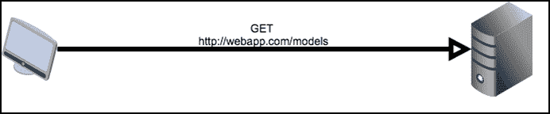
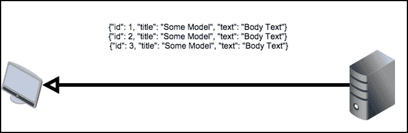
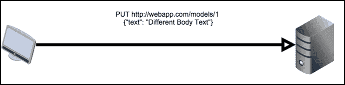

# 第八章：构建 RESTful API

表述状态转移，或者**REST**，是在客户端和服务器之间传输信息的一种方法。在 Web 上，REST 是建立在 HTTP 之上的，并允许浏览器和服务器通过利用基本的 HTTP 命令轻松通信。通过使用 HTTP 命令，REST 是平台和编程语言无关的，并且解耦了客户端和服务器，使开发更加容易。这通常用于需要在服务器上拉取或更新用户信息的 JavaScript 应用程序。REST 还用于为外部开发人员提供用户数据的通用接口。例如，Facebook 和 Twitter 在其应用程序编程接口（**API**）中使用 REST，允许开发人员获取信息而无需解析网站的 HTML。

# REST 是什么

在深入了解 REST 的细节之前，让我们看一个例子。使用一个客户端，这里是一个 Web 浏览器，和一个服务器，客户端通过 HTTP 向服务器发送请求以获取一些模型，如下所示：



然后服务器将回应包含所有模型的文档。



然后客户端可以通过`PUT` HTTP 请求修改服务器上的数据：



然后服务器将回应已经修改了数据。这只是一个非常简化的例子，但它将作为 REST 定义的背景。

REST 不是严格的标准，而是对通信的一组约束，以定义一种可以以多种方式实现的方法。这些约束是通过多年与其他通信协议（如**远程过程调用**（**RPC**）或**简单对象访问协议**（**SOAP**））的试验和错误产生的。这些协议由于其严格性、冗长性和使用它们创建 API 的困难而被淘汰。这些系统的问题被识别出来，REST 的约束被创建出来，以防止这些问题再次发生。

第一个约束要求客户端和服务器必须有关注点的分离。客户端不能处理永久数据存储，服务器不能处理任何与用户界面有关的事务。

第二个约束是服务器必须是无状态的。这意味着处理请求所需的任何信息都存储在请求本身或由客户端存储。服务器无状态的一个例子是 Flask 中的会话对象。会话对象不会将其信息存储在服务器上，而是将其存储在客户端的 cookie 中。每次请求都会发送 cookie 给服务器解析，并确定所请求资源的必要数据是否存储在其中，而不是服务器为每个用户存储会话信息。

第三个约束是提供的所有资源必须具有统一的接口。这个约束有许多不同的部分，如下所示：

+   接口是围绕资源构建的，在我们的案例中是模型。

+   服务器发送的数据不是服务器中的实际数据，而是一个表示。例如，实际数据库不会随每个请求发送，而是发送数据的 JSON 抽象。

+   服务器发送的数据足以让客户端修改服务器上的数据。在前面的例子中，传递给客户端的 ID 起到了这个作用。

+   API 提供的每个资源必须以相同的方式表示和访问。例如，一个资源不能以 XML 表示，另一个以 JSON 表示，一个通过原始 TCP，一个通过 HTTP。

最后一个约束是系统必须允许层。负载均衡器、代理、缓存和其他服务器和服务可以在客户端和服务器之间起作用，只要最终结果与它们不在那里时相同。

当系统遵循所有这些约束时，被认为是一个 RESTful 系统。最常见的 RESTful 系统形式是由 HTTP 和 JSON 构建的。每个资源位于自己的 URL 路径上，并使用不同的 HTTP 请求类型进行修改。通常采用以下形式：

| HTTP 方法 | URL | 操作 |
| --- | --- | --- |
| `GET` | `http://host/resource` | 获取所有资源表示 |
| `GET` | `http://host/resource/1` | 获取 ID 为 1 的资源 |
| `POST` | `http://host/resource` | 从`POST`中的表单数据创建新资源 |
| `PUT` | `http://host/resource/1` | 修改 ID 为 1 的资源的现有数据 |
| `DELETE` | `http://host/resource/1` | 删除 ID 为 1 的资源 |

例如，对第二个`GET`请求的响应将如下所示：

```py
{
    "id": 100,
    "date": "2015-03-02T00:24:36+00:00",
    "title": "Resource #98"
}
```

在 REST API 中，返回正确的 HTTP 状态代码与响应数据同样非常重要，以便通知客户端服务器上实际发生了什么，而无需客户端解析返回的消息。以下是 REST API 中使用的主要 HTTP 代码及其含义的列表。

| HTTP 代码 | 名称 | 含义 |
| --- | --- | --- |
| 200 | OK | HTTP 的默认代码。请求成功，并返回了数据。 |
| 201 | 创建成功 | 请求成功，并在服务器上创建了一个新资源。 |
| 204 | 无内容 | 请求成功，但响应未返回任何内容。 |
| 400 | 错误请求 | 请求被拒绝，因为存在某种感知的客户端错误，要么是格式错误的请求，要么是缺少必需的数据。 |
| 401 | 未经授权 | 请求被拒绝，因为客户端未经身份验证，应在再次请求此资源之前进行身份验证。 |
| 403 | 禁止 | 请求被拒绝，因为客户端没有权限访问此资源。这与 401 代码相反，后者假定用户未经身份验证。403 代码表示无论身份验证如何，资源都是不可访问的。 |
| 404 | 未找到 | 请求的资源不存在。 |
| 405 | 方法不允许 | 请求被拒绝，因为 URL 不可用的 HTTP 方法。 |

# 设置 RESTful Flask API

在我们的应用程序中，我们将在数据库中创建一个博客文章数据的 RESTful 接口。数据的表示将以 JSON 格式发送。数据将使用前面表格中的一般形式进行检索和修改，但 URI 将是`/api/posts`。

我们可以使用标准的 Flask 视图来创建 API，但 Flask 扩展**Flask Restful**使任务变得更加容易。

安装 Flask Restful：

```py
$ pip install Flask-Restful

```

在`extensions.py`文件中，初始化将处理所有路由的`Api`对象：

```py
from flask.ext.restful import Api
…
rest_api = Api()
```

我们的 Post API 的控制逻辑和视图应存储在`controllers`文件夹中的新文件夹`rest`中。在此文件夹中，我们需要一个空的`__init__.py`和一个名为`post.py`的文件。在`post.py`中，让我们创建一个简单的*Hello World*示例： 

```py
from flask.ext.restful import Resource

class PostApi(Resource):
    def get(self):
        return {'hello': 'world'}
```

在 Flask Restful 中，每个 REST 资源都被定义为从`Resource`对象继承的类。就像第四章中显示的`MethodView`对象一样，从`Resource`对象继承的任何类都使用命名为 HTTP 方法的方法定义其逻辑。例如，当`GET` HTTP 方法命中`PostApi`类时，将执行`get`方法。

就像我们使用的其他 Flask 扩展一样，在`__init__.py`文件中的应用程序对象上需要初始化`Api`对象，该文件包含`create_app`函数。`PostApi`类还将使用`Api`对象的`add_resource()`方法定义其路由：

```py
from .extensions import (
    bcrypt,
    oid,
    login_manager,
    principals,
    rest_api
)
from .controllers.rest.post import PostApi

def create_app(object_name):
    …
    rest_api.add_resource(PostApi, '/api/post')
    rest_api.init_app(app)
```

现在，如果您在浏览器中打开`/api/post` URI，将显示*Hello World* JSON。

# GET 请求

对于我们的一些`GET`，`PUT`和`DELETE`请求，我们的 API 将需要修改帖子的 ID。`add_resource`方法可以接受多个路由，因此让我们添加捕获传递的 ID 的第二个路由：

```py
   rest_api.add_resource(
        PostApi,
        '/api/post',
        '/api/post/<int:post_id>',
        endpoint='api'
    )
```

现在`get`方法将需要接受`post_id`作为关键字参数：

```py
class PostApi(Resource):
    def get(self, post_id=None):
        if post_id:
            return {"id": post_id}

        return {"hello": "world"}
```

要发送到客户端的数据必须是 JSON 中的 Post 对象的表示，那么我们的 Post 对象将如何转换？Flask Restful 通过`fields`对象和`marshal_with`函数装饰器提供了将任何对象转换为 JSON 的方法。

## 输出格式

输出格式是通过创建代表基本类型的`field`对象的字典来定义的。字段的键定义了字段将尝试转换的属性。通过将字典传递给`marshal_with`装饰器，`get`方法尝试返回的任何对象都将首先使用字典进行转换。这也适用于对象列表：

```py
from flask import abort 
from flask.ext.restful import Resource, fields, marshal_with
from webapp.models import Post

post_fields = {
    'title': fields.String(),
    'text': fields.String(),
    'publish_date': fields.DateTime(dt_format='iso8601')
}

class PostApi(Resource):
    @marshal_with(post_fields)
    def get(self, post_id=None):
        if post_id:
            post = Post.query.get(post_id)
            if not post:
                abort(404)

            return post
        else:
            posts = Post.query.all()
            return posts
```

在浏览器中重新加载 API 时，每个 Post 对象将以 JSON 格式显示。但是，问题在于 API 不应返回帖子创建表单中所见的 WYSIWYG 编辑器中的 HTML。如前所述，服务器不应关心 UI，而 HTML 纯粹是用于输出规范。为了解决这个问题，我们需要一个自定义字段对象，它可以从字符串中去除 HTML。在名为`fields.py`的`rest`文件夹中添加以下内容：

```py
from HTMLParser import HTMLParser
from flask.ext.restful import fields

class HTMLStripper(HTMLParser):
    def __init__(self):
        self.reset()
        self.fed = []

    def handle_data(self, d):
        self.fed.append(d)

    def get_data(self):
        return ''.join(self.fed)

    def strip_tags(html):
        s = HTMLStripper()
        s.feed(html)

    return s.get_data()

class HTMLField(fields.Raw):
    def format(self, value):
        return strip_tags(str(value))
```

现在，我们的`post_fields`字典应该更新以适应新字段：

```py
from .fields import HTMLField

post_fields = {
    'title': fields.String(),
    'text': HTMLField(),
    'publish_date': fields.DateTime(dt_format='iso8601')
}
```

使用标准库`HTMLParser`模块，我们现在有一个`strip_tags`函数，它将返回任何已清除 HTML 标记的字符串。通过从`fields.Raw`类继承并通过`strip_tags`函数发送值，定义了一个新的字段类型`HTMLfield`。如果页面再次重新加载，所有 HTML 都将消失，只剩下文本。

Flask Restful 提供了许多默认字段：

+   `fields.String`：这将使用`str()`转换值。

+   `fields.FormattedString`：这在 Python 中传递格式化的字符串，变量名在括号中。

+   `fields.Url`：这提供了与 Flask `url_for`函数相同的功能。

+   `fields.DateTime`：这将 Python `date`或`datetime`对象转换为字符串。格式关键字参数指定字符串应该是`ISO8601`日期还是`RFC822`日期。

+   `fields.Float`：这将将值转换为浮点数的字符串表示。

+   `fields.Integer`：这将将值转换为整数的字符串表示。

+   `fields.Nested`：这允许通过另一个字段对象的字典来表示嵌套对象。

+   `fields.List`：与 MongoEngine API 类似，此字段将另一个字段类型作为参数，并尝试将值列表转换为字段类型的 JSON 列表。

+   `fields.Boolean`：这将将值转换为布尔参数的字符串表示。

还有两个字段应该添加到返回的数据中：作者和标签。评论将被省略，因为它们应该包含在自己的资源下。

```py
nested_tag_fields = {
    'id': fields.Integer(),
    'title': fields.String()
}

post_fields = {
    'author': fields.String(attribute=lambda x: x.user.username),
    'title': fields.String(),
    'text': HTMLField(),
    'tags': fields.List(fields.Nested(nested_tag_fields)),
    'publish_date': fields.DateTime(dt_format='iso8601')
}
```

`author`字段使用`field`类的属性关键字参数。这允许表示对象的任何属性，而不仅仅是基本级别的属性。因为标签的多对多关系返回对象列表，所以不能使用相同的解决方案。使用`ListField`中的`NestedField`类型和另一个字段字典，现在可以返回标签字典的列表。这对 API 的最终用户有额外的好处，因为它们可以轻松查询标签 ID，就像有一个标签 API 一样。

## 请求参数

在向资源的基础发送`GET`请求时，我们的 API 当前发送数据库中的所有 Post 对象。如果对象的数量较少或使用 API 的人数较少，则这是可以接受的。但是，如果任一方增加，API 将对数据库施加大量压力。与 Web 界面类似，API 也应该进行分页。

为了实现这一点，我们的 API 将需要接受一个`GET`查询字符串参数`page`，指定要加载的页面。Flask Restful 提供了一种方法来获取请求数据并解析它。如果必需的参数不存在，或者类型不匹配，Flask Restful 将自动创建一个 JSON 错误消息。在名为`parsers.py`的`rest`文件夹中的新文件中，添加以下代码：

```py
from flask.ext.restful import reqparse

post_get_parser = reqparse.RequestParser()
post_get_parser.add_argument(
    'page',
    type=int,
    location=['args', 'headers'],
    required=False
)
```

现在，`PostApi`类将需要更新以与我们的解析器一起使用：

```py
from .parsers import post_get_parser

class PostApi(Resource):
    @marshal_with(post_fields)
    def get(self, post_id=None):
        if post_id:
            post = Post.query.get(post_id)
            if not post:
                abort(404)

            return post
        else:
            args = post_get_parser.parse_args()
            page = args['page'] or 1
            posts = Post.query.order_by(
                Post.publish_date.desc()
            ).paginate(page, 30)

            return posts.items
```

在上面的示例中，`RequestParser`在查询字符串或请求标头中查找`page`变量，并从该页面返回 Post 对象的页面。

使用`RequestParser`创建解析器对象后，可以使用`add_argument`方法添加参数。`add_argument`的第一个参数是要解析的参数的键，但`add_argument`还接受许多关键字参数：

+   `action`：这是解析器在成功解析后对值执行的操作。两个可用选项是`store`和`append`。`store`将解析的值添加到返回的字典中。`append`将解析的值添加到字典中列表的末尾。

+   `case_sensitive`：这是一个`boolean`参数，用于允许或不允许键区分大小写。

+   `choices`：这类似于 MongoEngine，是参数允许的值列表。

+   `default`：如果请求中缺少参数，则生成的值。

+   `dest`：这是将解析值添加到返回数据中的键。

+   `help`：这是一个消息，如果验证失败，将返回给用户。

+   `ignore`：这是一个`boolean`参数，允许或不允许类型转换失败。

+   `location`：这表示要查找数据的位置。可用的位置是：

+   `args`以查找`GET`查询字符串

+   `headers`以查找 HTTP 请求标头

+   `form`以查找 HTTP `POST`数据

+   `cookies`以查找 HTTP cookies

+   `json`以查找任何发送的 JSON

+   `files`以查找`POST`文件数据

+   required：这是一个`boolean`参数，用于确定参数是否是可选的。

+   store_missing：这是一个`boolean`参数，用于确定是否应存储默认值，如果参数不在请求中。

+   类型：这是 Python 类型，用于转换传递的值。

使用 Flask Restful 解析器，很容易向 API 添加新参数。例如，让我们添加一个用户参数，允许我们搜索用户发布的所有帖子。首先，在`parsers.py`文件中，添加以下内容：

```py
post_get_parser = reqparse.RequestParser()
post_get_parser.add_argument(
    'page',
    type=int,
    location=['json', 'args', 'headers']
)
post_get_parser.add_argument(
    'user',
    type=str,
    location=['json', 'args', 'headers']
)
```

然后，在`post.py`中添加以下内容：

```py
class PostApi(Resource):
    @marshal_with(post_fields)
    def get(self, post_id=None):
        if post_id:
            post = Post.query.get(post_id)
            if not post:
                abort(404)

            return post
        else:
            args = post_get_parser.parse_args()
            page = args['page'] or 1

            if args['user']:
                user = User.query.filter_by(
                    username=args['user']
                ).first()
                if not user:
                    abort(404)

                posts = user.posts.order_by(
                    Post.publish_date.desc()
                ).paginate(page, 30)
            else:
                posts = Post.query.order_by(
                    Post.publish_date.desc()
                ).paginate(page, 30)

            return posts.items
```

当从`Resource`调用 Flask 的`abort`函数时，Flask Restful 将自动创建一个错误消息，以与状态代码一起返回。

# POST 请求

使用我们对 Flask Restful 解析器的新知识，可以添加`POST`端点。首先，我们需要一个解析器，它将获取标题、正文文本和标签列表。在`parser.py`文件中，添加以下内容：

```py
post_post_parser = reqparse.RequestParser()
post_post_parser.add_argument(
    'title',
    type=str,
    required=True,
    help="Title is required"
)
post_post_parser.add_argument(
    'text',
    type=str,
    required=True,
    help="Body text is required"
)
post_post_parser.add_argument(
    'tags',
    type=str,
    action='append'
)
```

接下来，`PostApi`类将需要一个`post`方法来处理传入的请求。`post`方法将使用给定的标题和正文文本。此外，如果存在标签键，则将标签添加到帖子中，如果传递的标签不存在，则创建新标签：

```py
import datetime
from .parsers import (
    post_get_parser,
    post_post_parser
)
from webapp.models import db, User, Post, Tag

class PostApi(Resource):
    …
    def post(self, post_id=None):
        if post_id:
            abort(400)
        else:
            args = post_post_parser.parse_args(strict=True)
            new_post = Post(args['title']) 
            new_post.date = datetime.datetime.now()
            new_post.text = args['text']

            if args['tags']:
                for item in args['tags']:
                    tag = Tag.query.filter_by(title=item).first()

                    # Add the tag if it exists.
                    # If not, make a new tag
                    if tag:
                        new_post.tags.append(tag)
                    else:
                        new_tag = Tag(item) 
                        new_post.tags.append(new_tag)

            db.session.add(new_post)
            db.session.commit()
            return new_post.id, 201
```

在`return`语句处，如果返回一个元组，则第二个参数将被视为状态代码。还有一个作为额外标头值的第三个值，通过传递一个字典。

为了测试这段代码，必须使用与 Web 浏览器不同的工具，因为在浏览器中很难创建自定义的 POST 请求而不使用浏览器插件。而是使用名为 curl 的工具。**Curl**是 Bash 中包含的命令行工具，允许创建和操作 HTTP 请求。要使用 curl 执行`GET`请求，只需传递 URL：

```py
$ curl http://localhost:5000/api/post/1

```

要传递`POST`变量，使用`d`标志：

```py
$ curl -d "title=From REST" \
-d "text=The body text from REST" \
-d "tag=Python" \
http://localhost:5000/api/post

```

新创建的帖子的 id 应该被返回。但是，如果你现在在浏览器中加载你创建的帖子，会出现错误。这是因为我们的`Post`对象没有与之关联的用户。为了让帖子对象分配给用户，并且只有网站的经过身份验证的用户才有权限`POST`帖子，我们需要创建一个身份验证系统。

## 身份验证

为了解决我们的身份验证问题，可以使用 Flask-Login，并检查登录的 cookie 数据。然而，这将要求希望使用我们的 API 的开发人员通过 Web 界面登录他们的程序。我们也可以让开发人员在每个请求中发送他们的登录数据，但是只在绝对必要时发送敏感信息是一个很好的设计实践。相反，我们的 API 将提供一个`auth`端点，允许他们发送登录凭据并获得一个访问令牌。

这个`access`令牌将由 Flask 使用的 Python 库*it's dangerous*创建，用于对 cookie 上的会话数据进行编码，因此它应该已经安装。令牌将是一个由应用程序的秘钥加密签名的 Python 字典，其中包含用户的 id。这个令牌中编码了一个过期日期，在过期后将不允许使用。这意味着即使令牌被恶意用户窃取，它在客户端必须重新进行身份验证之前只能在有限的时间内使用。首先，需要一个新的解析器来处理解析用户名和密码数据：

```py
user_post_parser = reqparse.RequestParser()
user_post_parser.add_argument('username', type=str, required=True)
user_post_parser.add_argument('password', type=str, required=True)
```

在`rest`文件夹内新建一个名为`auth.py`的文件，添加以下代码：

```py
from flask import abort, current_app

from .parsers import user_post_parser
from itsdangerous import TimedJSONWebSignatureSerializer as Serializer

class AuthApi(Resource):
    def post(self):
        args = user_post_parser.parse_args()
        user = User.query.filter_by(
            username=args['username']
        ).one()

        if user.check_password(args['password']):
            s = Serializer(
                current_app.config['SECRET_KEY'], 
                expires_in=600
            )
            return {"token": s.dumps({'id': user.id})}
        else:
            abort(401)
```

### 注意

不要允许用户通过不安全的连接发送他们的登录凭据！如果你希望保护用户的数据，需要使用 HTTPS。最好的解决方案是要求整个应用程序都使用 HTTPS，以避免可能性。

我们的 API 的用户必须将从这个资源接收到的令牌传递给任何需要用户凭据的方法。但是，首先我们需要一个验证令牌的函数。在`models.py`文件中，`verify_auth_token`将是`User`对象上的`staticmethod`：

```py
from itsdangerous import (
    TimedJSONWebSignatureSerializer as Serializer,
    BadSignature,
    SignatureExpired
)
from flask import current_app

class User(db.Model):
…
    @staticmethod
    def verify_auth_token(token):
        s = Serializer(current_app.config['SECRET_KEY'])

        try:
            data = s.loads(token)
        except SignatureExpired:
            return None
        except BadSignature:
            return None

        user = User.query.get(data['id'])
        return user
```

我们的`POST`解析器需要一个令牌参数来接受`auth`令牌：

```py
post_post_parser = reqparse.RequestParser()
post_post_parser.add_argument(
    'token',
    type=str,
    required=True,
    help="Auth Token is required to create posts"
)
```

现在，我们的`post`方法可以正确地添加新的帖子，如下所示：

```py
class PostApi(Resource):
    def get(self, post_id=None):
       …

    def post(self, post_id=None):
        if post_id:
            abort(405)
        else:
            args = post_post_parser.parse_args(strict=True)

            user = User.verify_auth_token(args['token'])
            if not user:
                abort(401)

            new_post = Post(args['title'])
            new_post.user = user
            …
```

使用 curl，我们现在可以测试我们的`auth`和`post`API。为了简洁起见，这里省略了令牌，因为它非常长：

```py
$ curl -d "username=user" \
-d "password=password" \
http://localhost:5000/api/auth

{token: <the token>}

$ curl -d "title=From REST" \
-d "text=this is from REST" \
-d "token=<the token>" \
-d "tags=Python" \
-d "tags=Flask" \
http://localhost:5000/api/post

```

# PUT 请求

如本章开头的表格所列，`PUT`请求用于更改现有资源的值。与`post`方法一样，首先要做的是在`parsers.py`中创建一个新的解析器：

```py
post_put_parser = reqparse.RequestParser()
post_put_parser.add_argument(
    'token',
    type=str,
    required=True,
    help="Auth Token is required to edit posts"
)
post_put_parser.add_argument(
    'title',
    type=str
)
post_put_parser.add_argument(
    'text',
    type=str
)
post_put_parser.add_argument(
    'tags',
    type=str,
    action='append'
)
```

`put`方法的逻辑与`post`方法非常相似。主要区别在于每个更改都是可选的，任何没有提供`post_id`的请求都将被拒绝：

```py
from .parsers import (
    post_get_parser,
    post_post_parser,
    post_put_parser
)

class PostApi(Resource):
    @marshal_with(post_fields)
    def get(self, post_id=None):
        …

    def post(self, post_id=None):
        …

    def put(self, post_id=None):
        if not post_id:
            abort(400)

        post = Post.query.get(post_id)
        if not post:
            abort(404)

        args = post_put_parser.parse_args(strict=True)
        user = User.verify_auth_token(args['token'])
        if not user:
            abort(401)
        if user != post.user:
            abort(403)

        if args['title']:
            post.title = args['title']

        if args['text']:
            post.text = args['text']

        if args['tags']:
            for item in args['tags']:
                tag = Tag.query.filter_by(title=item).first()

                # Add the tag if it exists. If not, make a new tag
                if tag:
                    post.tags.append(tag)
                else:
                    new_tag = Tag(item)
                    post.tags.append(new_tag)

        db.session.add(post)
        db.session.commit()
        return post.id, 201
```

为了测试这个方法，curl 也可以使用`-X`标志创建`PUT`请求：

```py
$ curl -X PUT \
-d "title=Modified From REST" \
-d "text=this is from REST" \
-d "token=<the token>" \
-d "tags=Python" -d "tags=Flask" -d "tags=REST" \
http://localhost:5000/api/post/101

```

# DELETE 请求

最后，我们有`DELETE`请求，这是四种支持方法中最简单的。`delete`方法的主要区别在于它不返回任何内容，这是`DELETE`请求的接受标准：

```py
class PostApi(Resource):
    @marshal_with(post_fields)
    def get(self, post_id=None):
        …

    def post(self, post_id=None):
        …

    def put(self, post_id=None):
        …

    def delete(self, post_id=None):
        if not post_id:
            abort(400)

        post = Post.query.get(post_id)
        if not post:
            abort(404)

        args = post_delete_parser.parse_args(strict=True)
        user = verify_auth_token(args['token'])
        if user != post.user:
            abort(403)

        db.session.delete(post)
        db.session.commit()
        return "", 204
```

同样，我们可以测试：

```py
$ curl -X DELETE\
-d "token=<the token>"\
http://localhost:5000/api/post/102

```

如果一切顺利删除，你应该收到一个 204 状态码，什么都不应该显示出来。

在我们完全迁移出 REST 之前，读者还有一个最后的挑战，来测试你对 Flask Restful 的理解。尝试创建一个评论 API，不仅可以从`http://localhost:5000/api/comments`进行修改，还允许开发人员通过 URL`http://localhost:5000/api/post/<int:post_id>/comments`来修改特定帖子上的评论。

# 摘要

我们的 Post API 现在是一个完整的功能。如果开发者希望，他们可以使用这个 API 创建桌面或移动应用程序，而无需使用 HTML 抓取，这是一个非常繁琐和漫长的过程。给予希望将您的网站作为平台使用的开发者这样做的能力将增加您网站的受欢迎程度，因为他们实质上会通过他们的应用程序或网站为您提供免费广告。

在下一章中，我们将使用流行的程序 Celery 来异步运行程序和任务与我们的应用程序。
