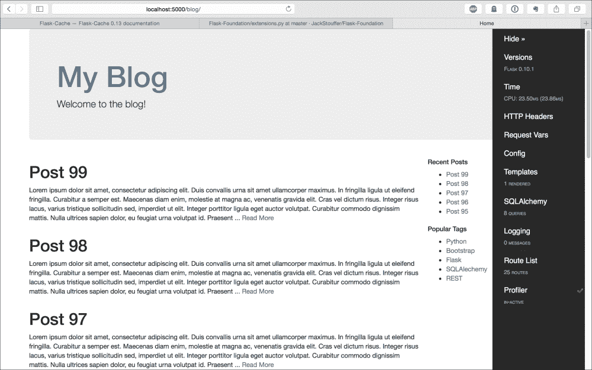
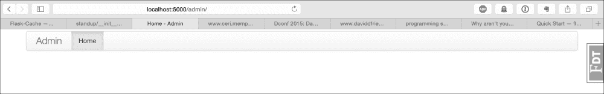
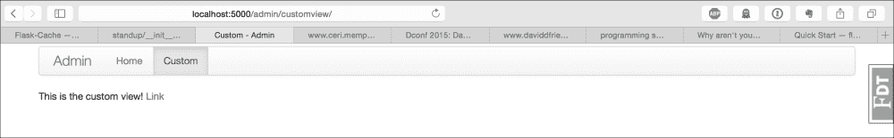
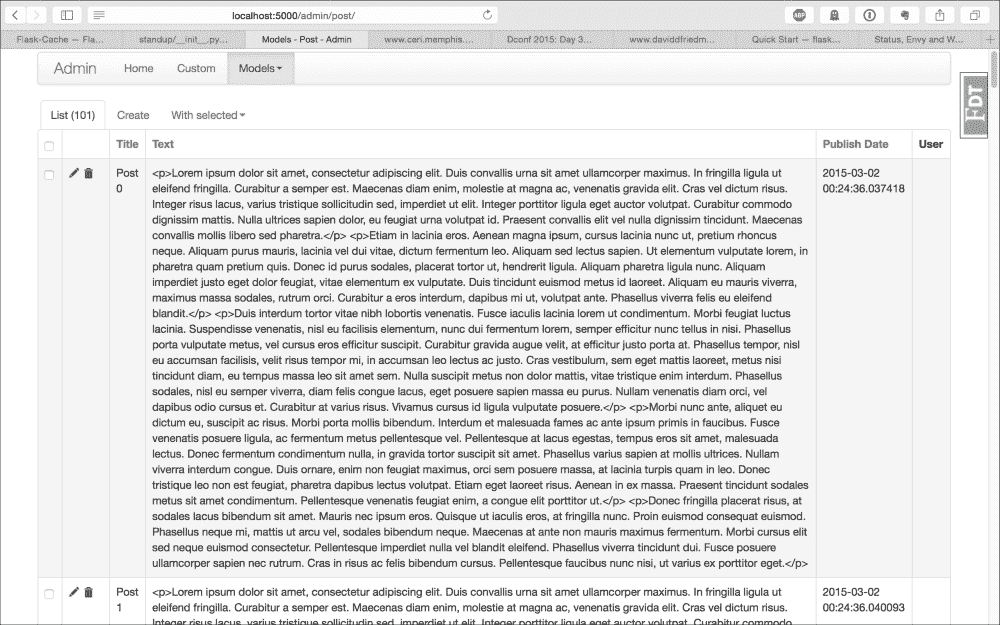
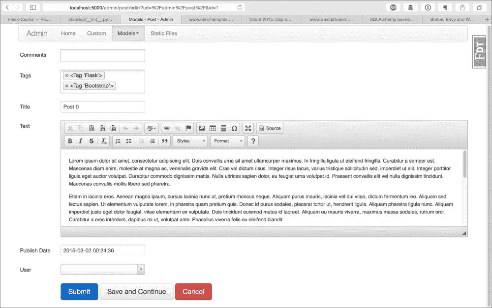

# 第十章：有用的 Flask 扩展

正如我们在整本书中所看到的，Flask 的设计是尽可能小，同时又给您提供了创建 Web 应用程序所需的灵活性和工具。然而，许多 Web 应用程序都具有许多共同的特性，这意味着许多应用程序将需要编写执行相同任务的代码。为了解决这个问题，人们已经为 Flask 创建了扩展，以避免重复造轮子，我们已经在整本书中看到了许多 Flask 扩展。本章将重点介绍一些更有用的 Flask 扩展，这些扩展内容不足以单独成章，但可以节省大量时间和烦恼。

# Flask Script

在第一章中，*入门*，我们使用 Flask 扩展 Flask Script 创建了一个基本的管理脚本，以便轻松运行服务器并使用 shell 进行调试。在本章中，我们将介绍那些基本介绍中未涉及的功能。

在 Flask Script 中，您可以创建自定义命令以在应用程序上下文中运行。所需的只是创建一个命令，用 Flask Script 提供的装饰器函数装饰一个普通的 Python 函数。例如，如果我们想要一个任务，返回字符串"Hello, World!"，我们将把以下内容添加到`manage.py`中：

```py
@manager.command
def test():
    print "Hello, World!"
```

从命令行，现在可以使用以下命令运行`test`命令：

```py
$ python manage.py test
Hello, World!

```

删除测试命令，让我们创建一个简单的命令，以帮助为我们的应用程序设置新开发人员的 SQLite 数据库并填充测试数据。这个命令部分地来自第四章中创建的脚本，*创建蓝图控制器*：

```py
@manager.command
def setup_db():
    db.create_all()

    admin_role = Role()
    admin_role.name = "admin"
    admin_role.description = "admin"
    db.session.add(admin_role)

    default_role = Role()
    default_role.name = "default"
    default_role.description = "default"
    db.session.add(default_role)

    admin = User()
    admin.username = "admin"
    admin.set_password("password")
    admin.roles.append(admin_role)
    admin.roles.append(default_role)
    db.session.add(admin)

    tag_one = Tag('Python')
    tag_two = Tag('Flask')
    tag_three = Tag('SQLAlechemy')
    tag_four = Tag('Jinja')
    tag_list = [tag_one, tag_two, tag_three, tag_four]

    s = "Body text"

    for i in xrange(100):
        new_post = Post("Post {}".format(i))
        new_post.user = admin
        new_post.publish_date = datetime.datetime.now()
        new_post.text = s
        new_post.tags = random.sample(
            tag_list,
            random.randint(1, 3)
        )
        db.session.add(new_post)

    db.session.commit()
```

现在，如果有新的开发人员被分配到项目中，他们可以从我们的服务器下载`git repo`，安装`pip`库，运行`setup_db`命令，然后就可以运行项目了。

Flask Script 还提供了两个实用函数，可以轻松添加到我们的项目中。

```py
from flask.ext.script.commands import ShowUrls, Clean
…
manager = Manager(app)
manager.add_command("server", Server())
manager.add_command("show-urls", ShowUrls())
manager.add_command("clean", Clean())
```

`show-urls`命令列出了在`app`对象上注册的所有路由以及与该路由相关的 URL。这在调试 Flask 扩展时非常有用，因为可以轻松地查看其蓝图的注册是否有效。清理命令只是从工作目录中删除`.pyc`和`.pyo`编译的 Python 文件。

# Flask Debug Toolbar

Flask Debug Toolbar 是一个 Flask 扩展，通过将调试工具添加到应用程序的 Web 视图中，帮助开发。它会提供一些信息，比如视图渲染代码中的瓶颈，以及渲染视图所需的 SQLAlchemy 查询次数。

像往常一样，我们将使用`pip`来安装 Flask Debug Toolbar：

```py
$ pip install flask-debugtoolbar

```

接下来，我们需要将 Flask Debug Toolbar 添加到`extensions.py`文件中。由于在本章中我们将经常修改这个文件，所以以下是文件的开头以及初始化 Flask Debug Toolbar 的代码：

```py
from flask import flash, redirect, url_for, session
from flask.ext.bcrypt import Bcrypt
from flask.ext.openid import OpenID
from flask_oauth import OAuth
from flask.ext.login import LoginManager
from flask.ext.principal import Principal, Permission, RoleNeed
from flask.ext.restful import Api
from flask.ext.celery import Celery
from flask.ext.debugtoolbar import DebugToolbarExtension

bcrypt = Bcrypt()
oid = OpenID()
oauth = OAuth()
principals = Principal()
celery = Celery()
debug_toolbar = DebugToolbarExtension()
```

现在，需要在`__init__.py`中的`create_app`函数中调用初始化函数：

```py
from .extensions import (
    bcrypt,
    oid,
    login_manager,
    principals,
    rest_api,
    celery,
    debug_toolbar,
)

def create_app(object_name):

    debug_toolbar.init_app(app)
```

这就是让 Flask Debug Toolbar 运行起来所需的全部内容。如果应用程序的`config`中的`DEBUG`变量设置为*true*，则工具栏将显示出来。如果`DEBUG`没有设置为*true*，则工具栏将不会被注入到页面中。



在屏幕的右侧，您将看到工具栏。每个部分都是一个链接，点击它将在页面上显示一个值表。要获取呈现视图所调用的所有函数的列表，请点击**Profiler**旁边的复选标记以启用它，重新加载页面，然后点击**Profiler**。这个视图可以让您快速诊断应用程序中哪些部分最慢或被调用最多。

默认情况下，Flask Debug Toolbar 拦截`HTTP 302 重定向`请求。要禁用此功能，请将以下内容添加到您的配置中：

```py
class DevConfig(Config):
    DEBUG = True
    DEBUG_TB_INTERCEPT_REDIRECTS = False
```

另外，如果您使用 Flask-MongoEngine，可以通过覆盖渲染的面板并添加 MongoEngine 的自定义面板来查看渲染页面时所做的所有查询。

```py
class DevConfig(Config):
    DEBUG = True
    DEBUG_TB_PANELS = [
        'flask_debugtoolbar.panels.versions.VersionDebugPanel',
        'flask_debugtoolbar.panels.timer.TimerDebugPanel',
        'flask_debugtoolbar.panels.headers.HeaderDebugPanel',
        'flask_debugtoolbar.panels.request_vars.RequestVarsDebugPanel',
        'flask_debugtoolbar.panels.config_vars.ConfigVarsDebugPanel ',
        'flask_debugtoolbar.panels.template.TemplateDebugPanel',
        'flask_debugtoolbar.panels.logger.LoggingPanel',
        'flask_debugtoolbar.panels.route_list.RouteListDebugPanel'
        'flask_debugtoolbar.panels.profiler.ProfilerDebugPanel',
        'flask.ext.mongoengine.panels.MongoDebugPanel'
    ]
    DEBUG_TB_INTERCEPT_REDIRECTS = False
```

这将在工具栏中添加一个与默认 SQLAlchemy 非常相似的面板。

# Flask Cache

在第七章中，*使用 Flask 进行 NoSQL*，我们了解到页面加载时间是确定您的 Web 应用程序成功的最重要因素之一。尽管我们的页面并不经常更改，而且由于新帖子不会经常发布，但我们仍然在用户浏览器每次请求页面时渲染模板并查询数据库。

Flask Cache 通过允许我们存储视图函数的结果并返回存储的结果而不是再次渲染模板来解决了这个问题。首先，我们需要从`pip`安装 Flask Cache：

```py
$ pip install Flask-Cache

```

接下来，在`extensions.py`中初始化它：

```py
from flask.ext.cache import Cache

cache = Cache()
```

然后，在`__init__.py`中的`create_app`函数中注册`Cache`对象：

```py
from .extensions import (
    bcrypt,
    oid,
    login_manager,
    principals,
    rest_api,
    celery,
    debug_toolbar,
    cache
)

def create_app(object_name):
    …
    cache.init_app(app)
```

在我们开始缓存视图之前，需要告诉 Flash Cache 我们希望如何存储新函数的结果。

```py
class DevConfig(Config):
    …
    CACHE_TYPE = 'simple'
```

`simple`选项告诉 Flask Cache 将结果存储在 Python 字典中的内存中，对于绝大多数 Flask 应用程序来说是足够的。我们将在本节后面介绍更多类型的缓存后端。

## 缓存视图和函数

为了缓存视图函数的结果，只需在任何函数上添加装饰器：

```py
@blog_blueprint.route('/')
@blog_blueprint.route('/<int:page>')
@cache.cached(timeout=60)
def home(page=1):
    posts = Post.query.order_by(
        Post.publish_date.desc()
    ).paginate(page, 10)
    recent, top_tags = sidebar_data()

    return render_template(
        'home.html',
        posts=posts,
        recent=recent,
        top_tags=top_tags
    )
```

`timeout`参数指定缓存结果在函数再次运行并再次存储之前应该持续多少秒。要确认视图实际上被缓存了，可以在调试工具栏上查看 SQLAlchemy 部分。此外，我们可以通过激活分析器并比较之前和之后的时间来看到缓存对页面加载时间的影响。在作者顶级的笔记本电脑上，主博客页面需要 34 毫秒来渲染，主要是因为对数据库进行了 8 次不同的查询。但在激活缓存后，这个时间减少到 0.08 毫秒。这是速度提高了 462.5%！

视图函数并不是唯一可以被缓存的东西。要缓存任何 Python 函数，只需在函数定义中添加类似的装饰器：

```py
@cache.cached(timeout=7200, key_prefix='sidebar_data')
def sidebar_data():
    recent = Post.query.order_by(
        Post.publish_date.desc()
    ).limit(5).all()

    top_tags = db.session.query(
        Tag, func.count(tags.c.post_id).label('total')
    ).join(
        tags
    ).group_by(
        Tag
    ).order_by('total DESC').limit(5).all()

    return recent, top_tags
```

关键字参数`key_prefix`对于非视图函数是必要的，以便 Flask Cache 正确地存储函数的结果。这需要对每个被缓存的函数都是唯一的，否则函数的结果将互相覆盖。另外，请注意，此函数的超时设置为 2 小时，而不是前面示例中的 60 秒。这是因为这个函数的结果不太可能改变，如果数据过时，这不是一个大问题。

## 带参数的函数缓存

然而，普通的缓存装饰器不考虑函数参数。如果我们使用普通的缓存装饰器缓存了带有参数的函数，它将对每个参数集返回相同的结果。为了解决这个问题，我们使用`memoize`函数：

```py
    class User(db.Model):
        …

        @staticmethod
        @cache.memoize(60)
        def verify_auth_token(token):
            s = Serializer(current_app.config['SECRET_KEY'])

            try:
                data = s.loads(token)
            except SignatureExpired:
                return None
            except BadSignature:
                return None

            user = User.query.get(data['id'])
            return user
```

`Memoize`存储传递给函数的参数以及结果。在前面的例子中，`memoize`被用来存储`verify_auth_token`方法的结果，该方法被多次调用并且每次都查询数据库。如果传递给它相同的令牌，这个方法可以安全地被记忆化，因为它每次都返回相同的结果。唯一的例外是如果用户对象在函数被存储的 60 秒内被删除，但这是非常不可能的。

小心不要对依赖于全局作用域变量或不断变化数据的函数进行`memoize`或缓存。这可能导致一些非常微妙的错误，甚至在最坏的情况下会导致数据竞争。最适合 memoization 的候选者是所谓的纯函数。纯函数是当传递相同的参数时将产生相同结果的函数。函数运行多少次都无所谓。纯函数也没有任何副作用，这意味着它们不会改变全局作用域变量。这也意味着纯函数不能执行任何 IO 操作。虽然`verify_auth_token`函数不是纯函数，因为它执行数据库 IO，但这没关系，因为正如之前所述，底层数据很少会改变。

在开发应用程序时，我们不希望缓存视图函数，因为结果会不断变化。为了解决这个问题，将`CACHE_TYPE`变量设置为 null，并在生产配置中将`CACHE_TYPE`变量设置为 simple，这样当应用程序部署时，一切都能按预期运行：

```py
class ProdConfig(Config):
    …
    CACHE_TYPE = 'simple'

class DevConfig(Config):
    …
    CACHE_TYPE = 'null'
```

## 使用查询字符串缓存路由

一些路由，比如我们的主页和`post`路由，通过 URL 传递参数并返回特定于这些参数的内容。如果缓存这样的路由，就会遇到问题，因为无论 URL 参数如何，路由的第一次渲染都将返回所有请求。解决方案相当简单。缓存方法中的`key_prefix`关键字参数可以是一个字符串或一个函数，该函数将被执行以动态生成一个键。这意味着可以创建一个函数来生成一个与 URL 参数相关联的键，因此只有在之前调用过具有特定参数组合的请求时，每个请求才会返回一个缓存的页面。在`blog.py`文件中，添加以下内容：

```py
def make_cache_key(*args, **kwargs):
    path = request.path
    args = str(hash(frozenset(request.args.items())))
    lang = get_locale()
    return (path + args + lang).encode('utf-8')

@blog_blueprint.route(
    '/post/<int:post_id>',
    methods=('GET', 'POST')
)
@cache.cached(timeout=600, key_prefix=make_cache_key)
def post(post_id):
    …
```

现在，每个单独的帖子页面将被缓存 10 分钟。

## 使用 Redis 作为缓存后端

如果视图函数的数量或传递给缓存函数的唯一参数的数量变得太大而超出内存限制，您可以使用不同的缓存后端。正如在第七章中提到的，*在 Flask 中使用 NoSQL*，Redis 可以用作缓存的后端。要实现该功能，只需将以下配置变量添加到`ProdConfig`类中，如下所示：

```py
class ProdConfig(Config):
    …
    CACHE_TYPE = 'redis'
    CACHE_REDIS_HOST = 'localhost'
    CACHE_REDIS_PORT = '6379'
    CACHE_REDIS_PASSWORD = 'password'
    CACHE_REDIS_DB = '0'
```

如果用自己的数据替换变量的值，Flask Cache 将自动创建到您的`redis`数据库的连接，并使用它来存储函数的结果。所需的只是安装 Python `redis`库：

```py
$ pip install redis

```

## 使用 memcached 作为缓存后端

与`redis`后端一样，`memcached`后端提供了一种替代的存储结果的方式，如果内存选项太过限制。与`redis`相比，`memcached`旨在缓存对象以供以后使用，并减少对数据库的负载。`redis`和`memcached`都可以达到相同的目的，选择其中一个取决于个人偏好。要使用`memcached`，我们需要安装其 Python 库：

```py
$ pip install memcache

```

连接到您的`memcached`服务器在配置对象中处理，就像`redis`设置一样：

```py
class ProdConfig(Config):
    …
    CACHE_TYPE = 'memcached'
    CACHE_KEY_PREFIX = 'flask_cache'
    CACHE_MEMCACHED_SERVERS = ['localhost:11211']
```

# Flask Assets

Web 应用程序中的另一个瓶颈是下载页面的 CSS 和 JavaScript 库所需的 HTTP 请求数量。只有在加载和解析页面的 HTML 之后才能下载额外的文件。为了解决这个问题，许多现代浏览器会同时下载许多这些库，但是浏览器发出的同时请求数量是有限制的。

服务器上可以做一些事情来减少下载这些文件所花费的时间。开发人员使用的主要技术是将所有 JavaScript 库连接成一个文件，将所有 CSS 库连接成另一个文件，同时从结果文件中删除所有空格和换行符。这样可以减少多个 HTTP 请求的开销，删除不必要的空格和换行符可以将文件大小减少多达 30％。另一种技术是告诉浏览器使用专门的 HTTP 头在本地缓存文件，因此文件只有在更改后才会再次加载。这些手动操作可能很繁琐，因为它们需要在每次部署到服务器后进行。

幸运的是，Flask Assets 实现了上述所有技术。Flask Assets 通过给它一个文件列表和一种连接它们的方法来工作，然后在模板中添加一个特殊的控制块，代替正常的链接和脚本标签。然后，Flask Assets 将添加一个链接或脚本标签，链接到新生成的文件。要开始使用 Flask Assets，需要安装它。我们还需要安装`cssmin`和`jsmin`，这是处理文件修改的 Python 库：

```py
$ pip install Flask-Assets cssmin jsmin

```

现在，需要创建要连接的文件集合，即命名捆绑包。在`extensions.py`中，添加以下内容：

```py
from flask_assets import Environment, Bundle

assets_env = Environment()

main_css = Bundle(
    'css/bootstrap.css',
    filters='cssmin',
    output='css/common.css'
)

main_js = Bundle(
    'js/jquery.js',
    'js/bootstrap.js',
    filters='jsmin',
    output='js/common.js'
)
```

每个`Bundle`对象都需要无限数量的文件作为位置参数来定义要捆绑的文件，一个关键字参数`filters`来定义要通过的过滤器，以及一个`output`来定义`static`文件夹中要保存结果的文件名。

### 注意

`filters`关键字可以是单个值或列表。要获取可用过滤器的完整列表，包括自动 Less 和 CSS 编译器，请参阅[`webassets.readthedocs.org/en/latest/`](http://webassets.readthedocs.org/en/latest/)上的文档。

虽然我们的网站样式较轻，CSS 捆绑包中只有一个文件。但是将文件放入捆绑包仍然是一个好主意，原因有两个。

在开发过程中，我们可以使用未压缩版本的库，这样调试更容易。当应用程序部署到生产环境时，库会自动进行压缩。

这些库将被发送到浏览器，并带有缓存头，通常在 HTML 中链接它们不会。

在测试 Flask Assets 之前，需要进行三项更改。首先，在`__init__.py`格式中，需要注册扩展和捆绑包：

```py
from .extensions import (
    bcrypt,
    oid,
    login_manager,
    principals,
    rest_api,
    celery,
    debug_toolbar,
    cache,
    assets_env,
    main_js,
    main_css
)

def create_app(object_name):
    …
    assets_env.init_app(app)

    assets_env.register("main_js", main_js)
    assets_env.register("main_css", main_css)
```

接下来，`DevConfig`类需要一个额外的变量，告诉 Flask Assets 在开发过程中不要编译库：

```py
class DevConfig(Config):
    DEBUG = True
    DEBUG_TB_INTERCEPT_REDIRECTS = False

    ASSETS_DEBUG = True
```

最后，`base.html`文件中的链接和脚本标签都需要用 Flask Assets 的控制块替换。我们有以下内容：

```py
<link rel="stylesheet" href=https://maxcdn.bootstrapcdn.com/bootstrap/3.3.2/css/bootstrap.min.css>
```

用以下内容替换：

```py

<link rel="stylesheet" type="text/css" href="{{ ASSET_URL }}" />

```

我们还有以下内容：

```py
<script src="img/jquery.min.js"></script>
<script src="img/bootstrap.min.js"></script>
```

用以下内容替换：

```py

<script src="img/{{ ASSET_URL }}"></script>

```

现在，如果重新加载页面，所有的 CSS 和 JavaScript 现在都将由 Flask Assets 处理。

# Flask Admin

在第六章中，*保护您的应用程序*，我们创建了一个界面，允许用户创建和编辑博客文章，而无需使用命令行。这足以演示本章介绍的安全措施，但仍然没有办法使用界面删除帖子或为其分配标签。我们也没有办法删除或编辑我们不希望普通用户看到的评论。我们的应用程序需要的是一个功能齐全的管理员界面，与 WordPress 界面相同。这对于应用程序来说是一个常见的需求，因此创建了一个名为 Flask Admin 的 Flask 扩展，以便轻松创建管理员界面。要开始使用 Flask Admin，请使用`pip`安装 Flask Admin：

```py
$ pip install Flask-Admin

```

像往常一样，在`extensions.py`中需要创建`extension`对象：

```py
from flask.ext.admin import Admin

admin = Admin()
```

然后，需要在`__init__.py`中的`app`对象上注册该对象：

```py
from .extensions import (
    bcrypt,
    oid,
    login_manager,
    principals,
    rest_api,
    celery,
    debug_toolbar,
    cache,
    assets_env,
    main_js,
    main_css,
    admin
)

def create_app(object_name):
    …
    admin.init_app(app)
```

如果您导航到`localhost:5000/admin`，您现在应该看到空的 Flask Admin 界面：



Flask Admin 通过在定义一个或多个路由的`admin`对象上注册视图类来工作。Flask Admin 有三种主要类型的视图：`ModelView`、`FileAdmin`和`BaseView`视图。

## 创建基本管理页面

`BaseView`类允许将普通的 Flask 页面添加到您的`admin`界面中。这通常是 Flask Admin 设置中最少使用的视图类型，但如果您希望包括类似使用 JavaScript 图表库的自定义报告，您可以使用基本视图。在名为`admin.py`的控制器文件夹中添加以下内容：

```py
from flask.ext.admin import BaseView, expose

class CustomView(BaseView):
    @expose('/')
    def index(self):
        return self.render('admin/custom.html')

    @expose('/second_page')
    def second_page(self):
        return self.render('admin/second_page.html')
```

在`BaseView`的子类中，如果它们一起定义，可以一次注册多个视图。但是请记住，`BaseView`的每个子类都需要至少一个在路径`/`上公开的方法。此外，除了路径`/`中的方法之外，管理员界面的导航中将不会有其他方法，并且必须将它们链接到类中的其他页面。`expose`和`self.render`函数的工作方式与普通 Flask API 中的对应函数完全相同。

要使您的模板继承 Flask Admin 的默认样式，请在模板目录中创建一个名为`admin`的新文件夹，其中包含一个名为`custom.html`的文件，并添加以下 Jinja 代码：

```py


    This is the custom view!
    <a href="{{ url_for('.second_page') }}">Link</a>

```

要查看此模板，需要在`admin`对象上注册`CustomView`的实例。这将在`create_app`函数中完成，而不是在`extensions.py`文件中，因为我们的一些管理页面将需要数据库对象，如果注册在`extensions.py`中会导致循环导入。在`__init__.py`中，添加以下代码来注册该类：

```py
from webapp.controllers.admin import CustomView
…
def create_app(object_name):
    …
    admin.add_view(CustomView(name='Custom'))
```

`name`关键字参数指定`admin`界面顶部导航栏上使用的标签应该读取`Custom`。在将`CustomView`注册到`admin`对象之后，您的`admin`界面现在应该有第二个链接在导航栏中，如下所示。



## 创建数据库管理页面

Flask Admin 的主要功能来自于您可以通过将您的 SQLAlchemy 或 MongoEngine 模型提供给 Flask Admin 来自动创建数据的管理员页面。创建这些页面非常容易；在`admin.py`中，只需添加以下代码：

```py
from flask.ext.admin.contrib.sqla import ModelView
# or, if you use MongoEngine
from flask.ext.admin.contrib.mongoengine import ModelView

class CustomModelView(ModelView):
    pass
```

然后，在`__init__.py`中，按照以下方式注册要使用的模型和数据库`session`对象的类：

```py
from controllers.admin import CustomView, CustomModelView
from .models import db, Reminder, User, Role, Post, Comment, Tag

def create_app(object_name):

    admin.add_view(CustomView(name='Custom'))
    models = [User, Role, Post, Comment, Tag, Reminder]

    for model in models:
       admin.add_view(
           CustomModelView(model, db.session, category='models')
       )
```

`category`关键字告诉 Flask Admin 将具有相同类别值的所有视图放入导航栏上的同一个下拉菜单中。

如果您现在转到浏览器，您将看到一个名为**Models**的新下拉菜单，其中包含指向数据库中所有表的管理页面的链接，如下所示：



每个模型的生成界面提供了许多功能。可以创建新的帖子，并可以批量删除现有的帖子。可以从这个界面设置所有字段，包括关系字段，这些字段实现为可搜索的下拉菜单。`date`和`datetime`字段甚至具有带有日历下拉菜单的自定义 JavaScript 输入。总的来说，这是对第六章中手动创建的界面的巨大改进，*保护您的应用程序*。

## 增强文章管理

虽然这个界面在质量上有了很大的提升，但还是有一些功能缺失。我们不再拥有原始界面中可用的所见即所得编辑器，这个页面可以通过启用一些更强大的 Flask Admin 功能来改进。

要将所见即所得编辑器添加回`post`创建页面，我们需要一个新的`WTForms`字段，因为 Flask Admin 使用 Flask WTF 构建其表单。我们还需要用这种新的字段类型覆盖`post`编辑和创建页面中的`textarea`字段。需要做的第一件事是在`forms.py`中使用`textarea`字段作为基础创建新的字段类型：

```py
from wtforms import (
    widgets,
    StringField,
    TextAreaField,
    PasswordField,
    BooleanField
)

class CKTextAreaWidget(widgets.TextArea):
    def __call__(self, field, **kwargs):
        kwargs.setdefault('class_', 'ckeditor')
        return super(CKTextAreaWidget, self).__call__(field, **kwargs)

class CKTextAreaField(TextAreaField):
    widget = CKTextAreaWidget()
```

在这段代码中，我们创建了一个新的字段类型`CKTextAreaField`，它为`textarea`添加了一个小部件，而小部件所做的就是向 HTML 标签添加一个类。现在，要将此字段添加到`Post`管理员页面，`Post`将需要自己的`ModelView`：

```py
from webapp.forms import CKTextAreaField

class PostView(CustomModelView):
    form_overrides = dict(text=CKTextAreaField)
    column_searchable_list = ('text', 'title')
    column_filters = ('publish_date',)

    create_template = 'admin/post_edit.html'
    edit_template = 'admin/post_edit.html'
```

在这段代码中有几个新的东西。首先，`form_overrides`类变量告诉 Flask Admin 用这种新的字段类型覆盖名称文本的字段类型。`column_searchable_list`函数定义了哪些列可以通过文本进行搜索。添加这个将允许 Flask Admin 在概述页面上包括一个搜索字段，用于搜索已定义字段的值。接下来，`column_filters`类变量告诉 Flask Admin 在此模型的概述页面上创建一个`filters`界面。`filters`界面允许非文本列通过向显示的行添加条件进行过滤。使用上述代码的示例是创建一个过滤器，显示所有`publish_date`值大于 2015 年 1 月 1 日的行。最后，`create_template`和`edit_template`类变量允许您定义 Flask Admin 要使用的自定义模板。对于我们将要使用的自定义模板，我们需要在 admin 文件夹中创建一个新文件`post_edit.html`。在这个模板中，我们将包含与第六章中使用的相同的 JavaScript 库，*保护您的应用*：

```py


    {{ super() }}
    <script
        src="img/ckeditor.js">
    </script>

```

继承模板的尾部块位于文件末尾。创建模板后，您的`post`编辑和创建页面应如下所示：



## 创建文件系统管理员页面

大多数`admin`界面涵盖的另一个常见功能是能够从 Web 访问服务器的文件系统。幸运的是，Flask Admin 通过`FileAdmin`类包含了这个功能

```py
class CustomFileAdmin(FileAdmin):
    pass
Now, just import the new class into your __init__.py file and pass in the path that you wish to be accessible from the web:
import os
from controllers.admin import (
    CustomView,
    CustomModelView,
    PostView,
    CustomFileAdmin
)

def create_app(object_name):

    admin.add_view(
        CustomFileAdmin(
            os.path.join(os.path.dirname(__file__), 'static'),
            '/static/',
            name='Static Files'
        )
    )
```

## 保护 Flask Admin

目前，整个`admin`界面对世界都是可访问的；让我们来修复一下。`CustomView`中的路由可以像任何其他路由一样进行保护：

```py
class CustomView(BaseView):
    @expose('/')
    @login_required
    @admin_permission.require(http_exception=403)
    def index(self):
        return self.render('admin/custom.html')

    @expose('/second_page')
    @login_required
    @admin_permission.require(http_exception=403)
    def second_page(self):
        return self.render('admin/second_page.html')
```

要保护`ModeView`和`FileAdmin`子类，它们需要定义一个名为`is_accessible`的方法，该方法返回*true*或*false*。

```py
class CustomModelView(ModelView):
    def is_accessible(self):
        return current_user.is_authenticated() and\
               admin_permission.can()

class CustomFileAdmin(FileAdmin):
    def is_accessible(self):
        return current_user.is_authenticated() and\
               admin_permission.can()
```

因为我们在第六章中正确设置了我们的身份验证，所以这个任务很简单。

# Flask Mail

本章将介绍的最终 Flask 扩展是 Flask Mail，它允许您从 Flask 的配置中连接和配置您的 SMTP 客户端。Flask Mail 还将帮助简化第十二章中的应用测试，*测试 Flask 应用*。第一步是使用`pip`安装 Flask Mail：

```py
$ pip install Flask-Mail

```

接下来，在`extentions.py`文件中需要初始化`Mail`对象：

```py
from flask_mail import Mail

mail = Mail()
```

`flask_mail`将通过读取`app`对象中的配置变量连接到我们选择的 SMTP 服务器，因此我们需要将这些值添加到我们的`config`对象中：

```py
class DevConfig(Config):

    MAIL_SERVER = 'localhost'
    MAIL_PORT = 25
    MAIL_USERNAME = 'username'
    MAIL_PASSWORD = 'password'
```

最后，在`__init__.py`中的`app`对象上初始化`mail`对象：

```py
from .extensions import (
    bcrypt,
    oid,
    login_manager,
    principals,
    rest_api,
    celery,
    debug_toolbar,
    cache,
    assets_env,
    main_js,
    main_css,
    admin,
    mail
)

def create_app(object_name):

    mail.init_app(app)
```

要了解 Flask Mail 如何简化我们的邮件代码，这是在第九章中创建的提醒任务，*使用 Celery 创建异步任务*，但使用 Flask Mail 而不是标准库 SMTP 模块：

```py
from flask_mail import Message
from webapp.extensions import celery, mail

@celery.task(
    bind=True,
    ignore_result=True,
    default_retry_delay=300,
    max_retries=5
)
def remind(self, pk):
    reminder = Reminder.query.get(pk)
    msg = MIMEText(reminder.text)
    msg = Message("Your reminder",
                  sender="from@example.com",
                  recipients=[reminder.email])

    msg.body = reminder.text
    mail.send(msg)
```

# 摘要

本章大大增加了我们应用的功能。我们现在拥有一个功能齐全的管理员界面，在浏览器中有一个有用的调试工具，两个大大加快页面加载速度的工具，以及一个使发送电子邮件变得不那么头疼的实用程序。

正如本章开头所述，Flask 是一个基本的框架，允许您挑选并选择您想要的功能。因此，重要的是要记住，在您的应用程序中并不需要包含所有这些扩展。如果您是应用程序的唯一内容创建者，也许命令行界面就是您所需要的，因为添加这些功能需要开发时间和维护时间，当它们不可避免地出现故障时。本章末尾提出了这个警告，因为许多 Flask 应用程序变得难以管理的主要原因之一是它们包含了太多的扩展，测试和维护所有这些扩展变成了一项非常庞大的任务。

在下一章中，您将学习扩展的内部工作原理以及如何创建自己的扩展。
