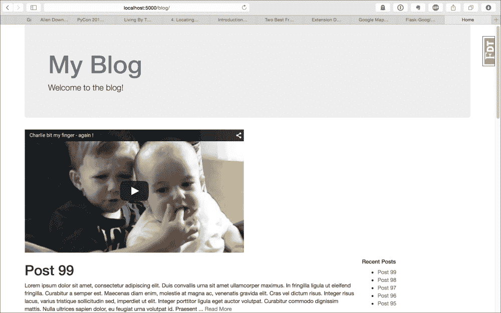

# 第十一章：创建自己的扩展

从本书的第一章开始，我们一直在向我们的应用程序中添加 Flask 扩展，以添加新功能并节省我们花费大量时间重新发明轮子。到目前为止，这些 Flask 扩展是如何工作的还是未知的。在本章中，我们将创建两个简单的 Flask 扩展，以更好地理解 Flask 的内部工作，并允许您使用自己的功能扩展 Flask。

# 创建 YouTube Flask 扩展

首先，我们要创建的第一个扩展是一个简单的扩展，允许在 Jinja 模板中嵌入 YouTube 视频，标签如下：

```py
{{ youtube(video_id) }}
```

`video_id`对象是任何 YouTube URL 中`v`后面的代码。例如，在 URL [`www.youtube.com/watch?v=_OBlgSz8sSM`](https://www.youtube.com/watch?v=_OBlgSz8sSM) 中，`video_id`对象将是`_OBlgSz8sSM`。

目前，这个扩展的代码将驻留在`extensions.py`中。但是，这只是为了开发和调试目的。当代码准备分享时，它将被移动到自己的项目目录中。

任何 Flask 扩展需要的第一件事是将在应用程序上初始化的对象。这个对象将处理将其`Blueprint`对象添加到应用程序并在 Jinja 上注册`youtube`函数：

```py
from flask import Blueprint

class Youtube(object):
    def __init__(self, app=None, **kwargs):
        if app:
            self.init_app(app)

    def init_app(self, app):
        self.register_blueprint(app)

    def register_blueprint(self, app):
        module = Blueprint(
            "youtube",
            __name__,
            template_folder="templates"
        )
        app.register_blueprint(module)
        return module
```

到目前为止，这段代码唯一做的事情就是在`app`对象上初始化一个空的蓝图。下一段所需的代码是视频的表示。接下来将是一个处理 Jinja 函数参数并渲染 HTML 以在模板中显示的类：

```py
from flask import (
    flash,
    redirect,
    url_for,
    session,
    render_template,
    Blueprint,
    Markup
)

class Video(object):
    def __init__(self, video_id, cls="youtube"):
        self.video_id = video_id
        self.cls = cls

    def render(self, *args, **kwargs):
        return render_template(*args, **kwargs)

    @property
    def html(self):
        return Markup(
            self.render('youtube/video.html', video=self)
        )
```

这个对象将从模板中的`youtube`函数创建，并且模板中传递的任何参数都将传递给这个对象以渲染 HTML。在这段代码中还有一个新对象，`Markup`，我们以前从未使用过。`Markup`类是 Flask 自动转义 HTML 或将其标记为安全包含在模板中的方式。如果我们只返回 HTML，Jinja 会自动转义它，因为它不知道它是否安全。这是 Flask 保护您的网站免受**跨站脚本攻击**的方式。

下一步是创建将在 Jinja 中注册的函数：

```py
def youtube(*args, **kwargs):
    video = Video(*args, **kwargs)
    return video.html
```

在`YouTube`类中，我们必须在`init_app`方法中向 Jinja 注册函数：

```py
class Youtube(object):
    def __init__(self, app=None, **kwargs):
        if app:
            self.init_app(app)

    def init_app(self, app):
        self.register_blueprint(app)
        app.add_template_global(youtube)
```

最后，我们必须创建 HTML，将视频添加到页面中。在`templates`目录中的一个名为`youtube`的新文件夹中，创建一个名为`video.html`的新 HTML 文件，并将以下代码添加到其中：

```py
<iframe
    class="{{ video.cls }}"
    width="560"
    height="315" 
    src="img/{{ video.video_id }}"
    frameborder="0"
    allowfullscreen>
</iframe>
```

这是在模板中嵌入 YouTube 视频所需的所有代码。现在让我们来测试一下。在`extensions.py`中，在`Youtube`类定义下方初始化`Youtube`类：

```py
youtube_ext = Youtube()
```

在`__init__.py`中，导入`youtube_ext`变量，并使用我们创建的`init_app`方法将其注册到应用程序上：

```py
from .extensions import (
    bcrypt,
    oid,
    login_manager,
    principals,
    rest_api,
    celery,
    debug_toolbar,
    cache,
    assets_env,
    main_js,
    main_css,
    admin,
    mail,
    youtube_ext
)

def create_app(object_name):
    …
    youtube_ext.init_app(app)
```

现在，作为一个简单的例子，在博客主页的顶部添加`youtube`函数：

```py
{{ youtube("_OBlgSz8sSM") }}
```

这将产生以下结果：



## 创建 Python 包

为了使我们的新 Flask 扩展可供他人使用，我们必须从到目前为止编写的代码中创建一个可安装的 Python 包。首先，我们需要一个新的项目目录，位于当前应用程序目录之外。我们需要两样东西：一个`setup.py`文件，稍后我们将填写它，和一个名为`flask_youtube`的文件夹。在`flask_youtube`目录中，我们将有一个`__init__.py`文件，其中将包含我们为扩展编写的所有代码。

以下是包含在`__init__.py`文件中的该代码的最终版本：

```py
from flask import render_template, Blueprint, Markup

class Video(object):
    def __init__(self, video_id, cls="youtube"):
        self.video_id = video_id
        self.cls = cls

    def render(self, *args, **kwargs):
        return render_template(*args, **kwargs)

    @property
    def html(self):
        return Markup(
            self.render('youtube/video.html', video=self)
        )

def youtube(*args, **kwargs):
    video = Video(*args, **kwargs)
    return video.html

class Youtube(object):
    def __init__(self, app=None, **kwargs):
        if app:
            self.init_app(app)

    def init_app(self, app):
        self.register_blueprint(app)
        app.add_template_global(youtube)

    def register_blueprint(self, app):
        module = Blueprint(
            "youtube",
            __name__,
            template_folder="templates"
        )
        app.register_blueprint(module)
        return module
```

还在`flask_youtube`目录中，我们将需要一个`templates`目录，其中将包含我们放在应用程序`templates`目录中的`youtube`目录。

为了将这段代码转换成 Python 包，我们将使用名为`setuptools`的库。`setuptools`是一个 Python 包，允许开发人员轻松创建可安装的包。`setuptools`将捆绑代码，以便`pip`和`easy_install`可以自动安装它们，并且甚至可以将你的包上传到**Python Package Index**（**PyPI**）。

### 注意

我们一直从 PyPI 安装的所有包都来自`pip`。要查看所有可用的包，请转到[`pypi.python.org/pypi`](https://pypi.python.org/pypi)。

要获得这个功能，只需要填写`setup.py`文件即可。

```py
from setuptools import setup, find_packages
setup(
    name='Flask-YouTube',
    version='0.1',
    license='MIT',
    description='Flask extension to allow easy embedding of YouTube videos',
    author='Jack Stouffer',
    author_email='example@gmail.com',
    platforms='any',
    install_requires=['Flask'],
    packages=find_packages()
)
```

这段代码使用`setuptools`中的`setup`函数来查找你的源代码，并确保安装你的代码的机器具有所需的包。大多数属性都相当容易理解，除了`package`属性，它使用`setuptools`中的`find_packages`函数。`package`属性的作用是找到我们源代码中要发布的部分。我们使用`find_packages`方法自动找到要包含的代码部分。这基于一些合理的默认值，比如查找带有`__init__.py`文件的目录并排除常见的文件扩展名。

虽然这不是强制性的，但这个设置也包含了关于作者和许可的元数据，如果我们要在 PyPI 页面上上传这个设置，这些信息也会被包含在其中。`setup`函数中还有更多的自定义选项，所以我鼓励你阅读[`pythonhosted.org/setuptools/`](http://pythonhosted.org/setuptools/)上的文档。

现在，你可以通过运行以下命令在你的机器上安装这个包：

```py
$ python setup.py build
$ python setup.py install

```

这将把你的代码安装到 Python 的`packages`目录中，或者如果你使用`virtualenv`，它将安装到本地的`packages`目录中。然后，你可以通过以下方式导入你的包：

```py
from flask_youtube import Youtube
```

# 使用 Flask 扩展修改响应

因此，我们创建了一个扩展，为我们的模板添加了新的功能。但是，我们如何创建一个修改应用程序在请求级别行为的扩展呢？为了演示这一点，让我们创建一个扩展，它通过压缩响应的内容来修改 Flask 的所有响应。这是 Web 开发中的常见做法，以加快页面加载时间，因为使用像**gzip**这样的方法压缩对象非常快速，而且在 CPU 方面相对便宜。通常，这将在服务器级别处理。因此，除非你希望仅使用 Python 代码托管你的应用程序，这在现实世界中并没有太多用处。

为了实现这一点，我们将使用 Python 标准库中的`gzip`模块来在每个请求处理后压缩内容。我们还需要在响应中添加特殊的 HTTP 头，以便浏览器知道内容已经被压缩。我们还需要在 HTTP 请求头中检查浏览器是否能接受 gzip 压缩的内容。

就像以前一样，我们的内容最初将驻留在`extensions.py`文件中：

```py
from flask import request 
from gzip import GzipFile
from io import BytesIO
…

class GZip(object):
    def __init__(self, app=None):
        self.app = app
        if app is not None:
            self.init_app(app)

    def init_app(self, app):
        app.after_request(self.after_request)

    def after_request(self, response):
        encoding = request.headers.get('Accept-Encoding', '')

        if 'gzip' not in encoding or \
           not response.status_code in (200, 201):
            return response

        response.direct_passthrough = False

        contents = BytesIO()
        with GzipFile(
            mode='wb',
            compresslevel=5,
            fileobj=contents) as gzip_file:
            gzip_file.write(response.get_data())

        response.set_data(bytes(contents.getvalue()))

        response.headers['Content-Encoding'] = 'gzip'
        response.headers['Content-Length'] = response.content_length

        return response

flask_gzip = GZip()
```

就像以前的扩展一样，我们的压缩对象的初始化器适应了普通的 Flask 设置和应用工厂设置。在`after_request`方法中，我们注册一个新的函数来在请求后事件上注册一个新函数，以便我们的扩展可以压缩结果。

`after_request`方法是扩展的真正逻辑所在。首先，它通过查看请求头中的`Accept-Encoding`值来检查浏览器是否接受 gzip 编码。如果浏览器不接受 gzip，或者没有返回成功的响应，函数将只返回内容并不对其进行任何修改。但是，如果浏览器接受我们的内容并且响应成功，那么我们将压缩内容。我们使用另一个名为`BytesIO`的标准库类，它允许文件流被写入和存储在内存中，而不是在中间文件中。这是必要的，因为`GzipFile`对象期望写入文件对象。

数据压缩后，我们将响应对象的数据设置为压缩的结果，并在响应中设置必要的 HTTP 头值。最后，gzip 内容被返回到浏览器，然后浏览器解压内容，大大加快了页面加载时间。

为了测试浏览器中的功能，您必须禁用**Flask Debug Toolbar**，因为在撰写本文时，其代码中存在一个 bug，它期望所有响应都以 UTF-8 编码。

如果重新加载页面，什么都不应该看起来不同。但是，如果您使用所选浏览器的开发人员工具并检查响应，您将看到它们已经被压缩。

# 摘要

现在我们已经通过了两个不同类型的 Flask 扩展的示例，您应该非常清楚我们使用的大多数 Flask 扩展是如何工作的。利用您现在拥有的知识，您应该能够为您的特定应用程序添加任何额外的 Flask 功能。

在下一章中，我们将看看如何向我们的应用程序添加测试，以消除我们对代码更改是否破坏了应用程序功能的猜测。
