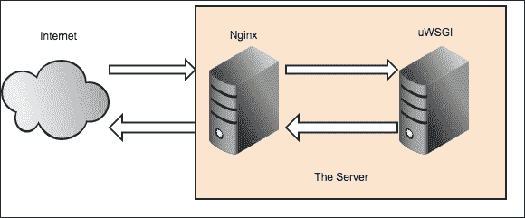
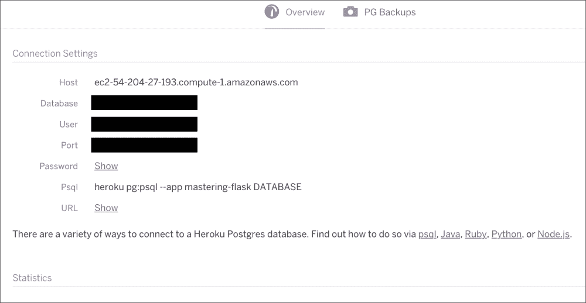
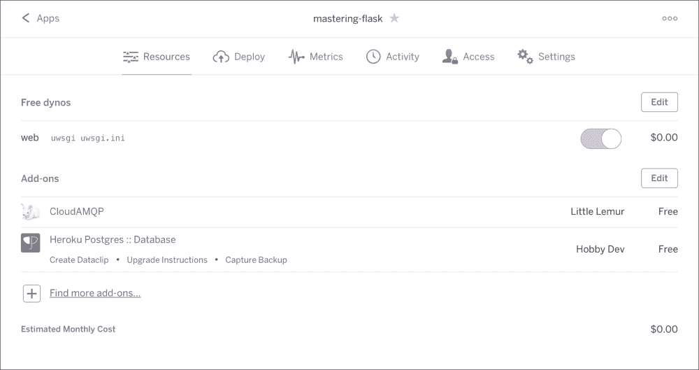
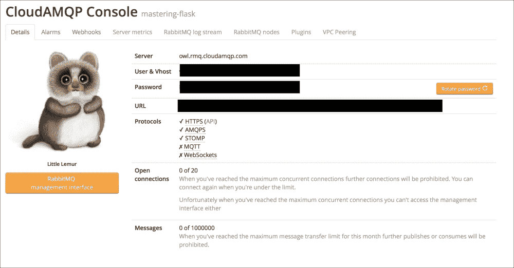
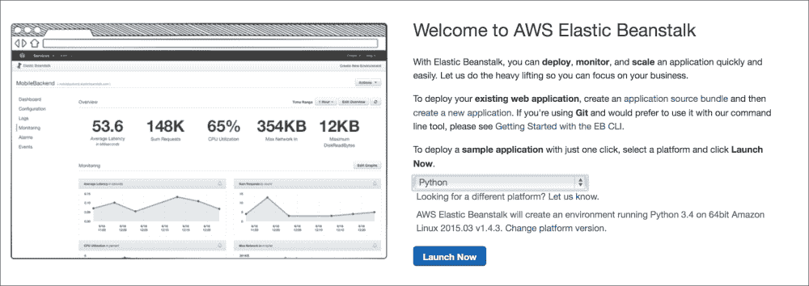
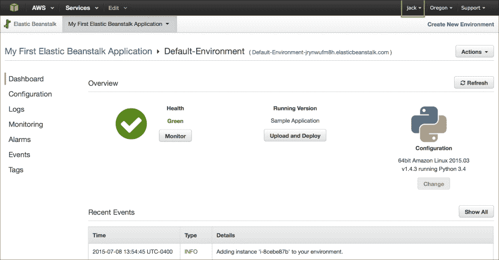
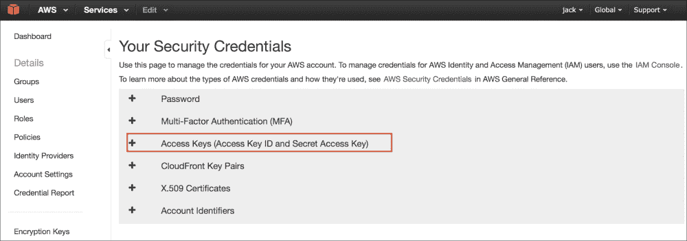
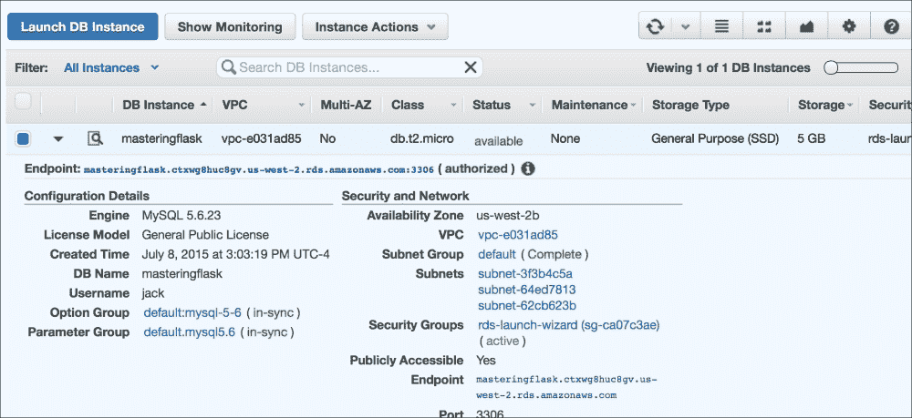
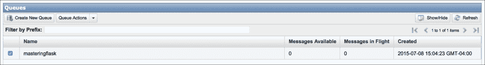

# 第十三章：部署 Flask 应用程序

现在我们已经到达了书的最后一章，并且在 Flask 中制作了一个完全功能的 Web 应用程序，我们开发的最后一步是使该应用程序对外开放。有许多不同的方法来托管您的 Flask 应用程序，每种方法都有其优缺点。本章将介绍最佳解决方案，并指导您在何种情况下选择其中一种。

请注意，在本章中，术语服务器用于指代运行操作系统的物理机器。但是，当使用术语 Web 服务器时，它指的是服务器上接收 HTTP 请求并发送响应的程序。

# 在您自己的服务器上部署

部署任何 Web 应用程序的最常见方法是在您可以控制的服务器上运行它。在这种情况下，控制意味着可以使用管理员帐户访问服务器上的终端。与其他选择相比，这种部署方式为您提供了最大的自由度，因为它允许您安装任何程序或工具。这与其他托管解决方案相反，其中 Web 服务器和数据库是为您选择的。这种部署方式也恰好是最便宜的选择。

这种自由的缺点是您需要负责保持服务器运行，备份用户数据，保持服务器上的软件最新以避免安全问题等。关于良好的服务器管理已经写了很多书。因此，如果您认为您或您的公司无法承担这种责任，最好选择其他部署选项之一。

本节将基于基于 Debian Linux 的服务器，因为 Linux 是远远最受欢迎的运行 Web 服务器的操作系统，而 Debian 是最受欢迎的 Linux 发行版（一种特定的软件和 Linux 内核的组合，作为一个软件包发布）。任何具有 bash 和名为 SSH 的程序（将在下一节介绍）的操作系统都适用于本章。唯一的区别将是安装服务器上软件的命令行程序。

这些 Web 服务器将使用名为**Web 服务器网关接口**（**WSGI**）的协议，这是一种旨在允许 Python Web 应用程序与 Web 服务器轻松通信的标准。我们永远不会直接使用 WSGI，但我们将使用的大多数 Web 服务器接口都将在其名称中包含 WSGI，如果您不知道它是什么，可能会感到困惑。

## 使用 fabric 将代码推送到您的服务器

为了自动化设置和将应用程序代码推送到服务器的过程，我们将使用一个名为 fabric 的 Python 工具。Fabric 是一个命令行程序，它使用名为 SSH 的工具在远程服务器上读取和执行 Python 脚本。SSH 是一种协议，允许一台计算机的用户远程登录到另一台计算机并在命令行上执行命令，前提是用户在远程机器上有一个帐户。

要安装`fabric`，我们将使用`pip`如下：

```py
$ pip install fabric

```

`fabric`命令是一组命令行程序，将在远程机器的 shell 上运行，本例中为 bash。我们将创建三个不同的命令：一个用于运行单元测试，一个用于根据我们的规格设置全新的服务器，一个用于让服务器使用`git`更新其应用程序代码的副本。我们将把这些命令存储在项目目录根目录下的一个名为`fabfile.py`的新文件中。

因为它是最容易创建的，让我们首先创建测试命令：

```py
from fabric.api import local

def test():
    local('python -m unittest discover')
```

要从命令行运行此函数，我们可以使用`fabric`命令行界面，通过传递要运行的命令的名称来运行：

```py
$ fab test
[localhost] local: python -m unittest discover
.....
---------------------------------------------------------------------
Ran 5 tests in 6.028s
OK

```

Fabric 有三个主要命令：`local`，`run`和`sudo`。`local`函数在前面的函数中可见，`run`在本地计算机上运行命令。`run`和`sudo`函数在远程计算机上运行命令，但`sudo`以管理员身份运行命令。所有这些函数都会通知 fabric 命令是否成功运行。如果命令未成功运行，这意味着在这种情况下我们的测试失败，函数中的任何其他命令都不会运行。这对我们的命令很有用，因为它允许我们强制自己不要将任何未通过测试的代码推送到服务器。

现在我们需要创建一个命令来从头开始设置新服务器。这个命令将安装我们的生产环境需要的软件，并从我们的集中式`git`存储库下载代码。它还将创建一个新用户，该用户将充当 web 服务器的运行者以及代码存储库的所有者。

### 注意

不要使用 root 用户运行您的 web 服务器或部署您的代码。这会使您的应用程序面临各种安全漏洞。

这个命令将根据您的操作系统而有所不同，我们将根据您选择的服务器在本章的其余部分中添加这个命令：

```py
from fabric.api import env, local, run, sudo, cd

env.hosts = ['deploy@[your IP]']

def upgrade_libs():
    sudo("apt-get update")
    sudo("apt-get upgrade")

def setup():
    test()
    upgrade_libs()

    # necessary to install many Python libraries 
    sudo("apt-get install -y build-essential")
    sudo("apt-get install -y git")
    sudo("apt-get install -y python")
    sudo("apt-get install -y python-pip")
    # necessary to install many Python libraries
    sudo("apt-get install -y python-all-dev")

    run("useradd -d /home/deploy/ deploy")
    run("gpasswd -a deploy sudo")

    # allows Python packages to be installed by the deploy user
    sudo("chown -R deploy /usr/local/")
    sudo("chown -R deploy /usr/lib/python2.7/")

    run("git config --global credential.helper store")

    with cd("/home/deploy/"):
        run("git clone [your repo URL]")

    with cd('/home/deploy/webapp'):
        run("pip install -r requirements.txt")
        run("python manage.py createdb")
```

此脚本中有两个新的 fabric 功能。第一个是`env.hosts`赋值，它告诉 fabric 应该登录到的机器的用户和 IP 地址。其次，有与关键字一起使用的`cd`函数，它在该目录的上下文中执行任何函数，而不是在部署用户的主目录中。修改`git`配置的行是为了告诉`git`记住存储库的用户名和密码，这样您就不必每次希望将代码推送到服务器时都输入它。此外，在设置服务器之前，我们确保更新服务器的软件以保持服务器的最新状态。

最后，我们有一个将新代码推送到服务器的功能。随着时间的推移，这个命令还将重新启动 web 服务器并重新加载来自我们代码的任何配置文件。但这取决于您选择的服务器，因此这将在后续部分中填写。

```py
def deploy():
    test()
    upgrade_libs()
    with cd('/home/deploy/webapp'):
        run("git pull")
        run("pip install -r requirements.txt")
```

因此，如果我们要开始在新服务器上工作，我们只需要运行以下命令：

```py
$ fabric setup
$ fabric deploy
```

## 使用 supervisor 运行您的 web 服务器

现在我们已经自动化了更新过程，我们需要服务器上的一些程序来确保我们的 web 服务器以及如果您没有使用 SQLite 的话数据库正在运行。为此，我们将使用一个名为 supervisor 的简单程序。supervisor 的所有功能都是自动在后台进程中运行命令行程序，并允许您查看正在运行的程序的状态。Supervisor 还监视其正在运行的所有进程，如果进程死掉，它会尝试重新启动它。

要安装`supervisor`，我们需要将其添加到`fabfile.py`中的设置命令中：

```py
def setup():
    …
    sudo("apt-get install -y supervisor")
```

告诉`supervisor`要做什么，我们需要创建一个配置文件，然后在部署`fabric`命令期间将其复制到服务器的`/etc/supervisor/conf.d/`目录中。当`supervisor`启动并尝试运行时，它将加载此目录中的所有文件。

在项目目录的根目录中新建一个名为`supervisor.conf`的文件，添加以下内容：

```py
[program:webapp]
command=
directory=/home/deploy/webapp
user=deploy

[program:rabbitmq]
command=rabbitmq-server
user=deploy

[program:celery]
command=celery worker -A celery_runner 
directory=/home/deploy/webapp
user=deploy
```

### 注意

这是使 web 服务器运行所需的最低配置。但是，supervisor 还有很多配置选项。要查看所有自定义内容，请访问 supervisor 文档[`supervisord.org/`](http://supervisord.org/)。

此配置告诉`supervisor`在`deploy`用户的上下文中运行命令`/home/deploy/webapp`。命令值的右侧为空，因为它取决于您正在运行的服务器，并将填充到每个部分中。

现在我们需要在部署命令中添加一个`sudo`调用，将此配置文件复制到`/etc/supervisor/conf.d/`目录中，如下所示。

```py
def deploy():
    …
    with cd('/home/deploy/webapp'):
        …
        sudo("cp supervisord.conf /etc/supervisor/conf.d/webapp.conf")

    sudo('service supervisor restart')
```

许多项目只是在服务器上创建文件然后忘记它们，但是将配置文件存储在我们的`git`存储库中，并在每次部署时复制它们具有几个优点。首先，这意味着如果出现问题，可以使用`git`轻松恢复更改。其次，这意味着我们不必登录服务器即可对文件进行更改。

### 注意

不要在生产中使用 Flask 开发服务器。它不仅无法处理并发连接，还允许在服务器上运行任意 Python 代码。

## Gevent

让 Web 服务器运行起来的最简单的选择是使用一个名为 gevent 的 Python 库来托管您的应用程序。Gevent 是一个 Python 库，它提供了一种在 Python 线程库之外进行并发编程的替代方式，称为**协程**。Gevent 具有一个接口来运行简单且性能良好的 WSGI 应用程序。一个简单的 gevent 服务器可以轻松处理数百个并发用户，这比互联网上网站的用户数量多 99%。这种选择的缺点是它的简单性意味着缺乏配置选项。例如，无法向服务器添加速率限制或添加 HTTPS 流量。这种部署选项纯粹是为了那些您不希望接收大量流量的网站。记住 YAGNI；只有在真正需要时才升级到不同的 Web 服务器。

### 注意

协程有点超出了本书的范围，因此可以在[`en.wikipedia.org/wiki/Coroutine`](https://en.wikipedia.org/wiki/Coroutine)找到一个很好的解释。

要安装`gevent`，我们将使用`pip`：

```py
$ pip install gevent

```

在项目目录的根目录中新建一个名为`gserver.py`的文件，添加以下内容：

```py
from gevent.wsgi import WSGIServer
from webapp import create_app

app = create_app('webapp.config.ProdConfig')

server = WSGIServer(('', 80), app)
server.serve_forever()
```

要在 supervisor 中运行服务器，只需将命令值更改为以下内容：

```py
[program:webapp]
command=python gserver.py 
directory=/home/deploy/webapp
user=deploy

```

现在，当您部署时，`gevent`将通过在每次添加新依赖项后适当地 pip 冻结来自动安装，也就是说，如果您在每次添加新依赖项后都进行 pip 冻结。

## Tornado

Tornado 是部署 WSGI 应用程序的另一种非常简单的纯 Python 方式。Tornado 是一个设计用来处理成千上万个同时连接的 Web 服务器。如果您的应用程序需要实时数据，Tornado 还支持 WebSockets，以实现与服务器的持续、长期的连接。

### 注意

不要在 Windows 服务器上生产使用 Tornado。Tornado 的 Windows 版本不仅速度慢得多，而且被认为是质量不佳的测试版软件。

为了将 Tornado 与我们的应用程序一起使用，我们将使用 Tornado 的`WSGIContainer`来包装应用程序对象，使其与 Tornado 兼容。然后，Tornado 将开始监听端口*80*的请求，直到进程终止。在一个名为`tserver.py`的新文件中，添加以下内容：

```py
from tornado.wsgi import WSGIContainer
from tornado.httpserver import HTTPServer
from tornado.ioloop import IOLoop
from webapp import create_app
app = WSGIContainer(create_app("webapp.config.ProdConfig"))
http_server = HTTPServer(app)
http_server.listen(80)
IOLoop.instance().start()
```

要在 supervisor 中运行 Tornado，只需将命令值更改为以下内容：

```py
[program:webapp]
command=python tserver.py 
directory=/home/deploy/webapp
user=deploy
```

## Nginx 和 uWSGI

如果您需要更高的性能或自定义，部署 Python Web 应用程序的最流行方式是使用 Web 服务器 Nginx 作为 WSGI 服务器 uWSGI 的前端，通过使用反向代理。反向代理是网络中的一个程序，它从服务器检索内容，就好像它们是从代理服务器返回的一样：



Nginx 和 uWSGI 是以这种方式使用的，因为我们既可以获得 Nginx 前端的强大功能，又可以拥有 uWSGI 的自定义功能。

Nginx 是一个非常强大的 Web 服务器，通过提供速度和定制性的最佳组合而变得流行。Nginx 始终比其他 Web 服务器（如 Apache httpd）更快，并且原生支持 WSGI 应用程序。它实现这种速度的方式是通过几个良好的架构决策，以及早期决定他们不打算像 Apache 那样覆盖大量用例。功能集较小使得维护和优化代码变得更加容易。从程序员的角度来看，配置 Nginx 也更容易，因为没有一个需要在每个项目目录中用`.htaccess`文件覆盖的巨大默认配置文件（`httpd.conf`）。

其中一个缺点是 Nginx 的社区比 Apache 要小得多，因此如果遇到问题，您可能不太可能在网上找到答案。此外，有可能在 Nginx 中不支持大多数程序员在 Apache 中习惯的功能。

uWSGI 是一个支持多种不同类型的服务器接口（包括 WSGI）的 Web 服务器。uWSGI 处理应用程序内容以及诸如负载平衡流量等事项。

要安装 uWSGI，我们将使用`pip`。

```py
$ pip install uwsgi

```

为了运行我们的应用程序，uWSGI 需要一个包含可访问的 WSGI 应用程序的文件。在项目目录的顶层中创建一个名为`wsgi.py`的新文件，添加以下内容：

```py
from webapp import create_app

app = create_app("webapp.config.ProdConfig")
```

为了测试 uWSGI，我们可以使用以下命令从命令行运行它：

```py
$ uwsgi --socket 127.0.0.1:8080 \
--wsgi-file wsgi.py \
--callable app \
--processes 4 \
--threads 2

```

如果您在服务器上运行此操作，您应该能够访问*8080*端口并查看您的应用程序（如果您没有防火墙的话）。

这个命令的作用是从`wsgi.py`文件中加载 app 对象，并使其可以从*8080*端口的`localhost`访问。它还生成了四个不同的进程，每个进程有两个线程，这些进程由一个主进程自动进行负载平衡。对于绝大多数网站来说，这个进程数量是过剩的。首先，使用一个进程和两个线程，然后逐步扩展。

我们可以创建一个文本文件来保存配置，而不是在命令行上添加所有配置选项，这样可以带来与在 supervisor 部分列出的配置相同的好处。

在项目目录的根目录中的一个名为`uwsgi.ini`的新文件中添加以下代码：

```py
[uwsgi]
socket = 127.0.0.1:8080
wsgi-file = wsgi.py
callable = app
processes = 4
threads = 2
```

### 注意

uWSGI 支持数百种配置选项，以及几个官方和非官方的插件。要充分利用 uWSGI 的功能，您可以在[`uwsgi-docs.readthedocs.org/`](http://uwsgi-docs.readthedocs.org/)上查阅文档。

现在让我们从 supervisor 运行服务器：

```py
[program:webapp]
command=uwsgi uwsgi.ini
directory=/home/deploy/webapp
user=deploy
```

我们还需要在设置函数中安装 Nginx：

```py
def setup():
    …
    sudo("apt-get install -y nginx")
```

因为我们是从操作系统的软件包管理器中安装 Nginx，所以操作系统会为我们处理 Nginx 的运行。

### 注意

在撰写本文时，官方 Debian 软件包管理器中的 Nginx 版本已经过时数年。要安装最新版本，请按照这里的说明进行操作：[`wiki.nginx.org/Install`](http://wiki.nginx.org/Install)。

接下来，我们需要创建一个 Nginx 配置文件，然后在推送代码时将其复制到`/etc/nginx/sites-available/`目录中。在项目目录的根目录中的一个名为`nginx.conf`的新文件中添加以下内容：

```py
server {
    listen 80;
    server_name your_domain_name;

    location / {
        include uwsgi_params;
        uwsgi_pass 127.0.0.1:8080;
    }

    location /static {
        alias /home/deploy/webapp/webapp/static;
    }
}
```

这个配置文件的作用是告诉 Nginx 在*80*端口监听传入请求，并将所有请求转发到在*8080*端口监听的 WSGI 应用程序。此外，它对静态文件的任何请求进行了例外处理，并直接将这些请求发送到文件系统。绕过 uWSGI 处理静态文件可以大大提高性能，因为 Nginx 在快速提供静态文件方面非常出色。

最后，在`fabfile.py`文件中：

```py
def deploy():
    …
    with cd('/home/deploy/webapp'):
        …
        sudo("cp nginx.conf "
             "/etc/nginx/sites-available/[your_domain]")
        sudo("ln -sf /etc/nginx/sites-available/your_domain "
             "/etc/nginx/sites-enabled/[your_domain]") 

    sudo("service nginx restart")
```

## Apache 和 uWSGI

使用 Apache httpd 与 uWSGI 基本上具有相同的设置。首先，我们需要在项目目录的根目录中的一个名为`apache.conf`的新文件中创建一个 apache 配置文件：

```py
<VirtualHost *:80>
    <Location />
        ProxyPass / uwsgi://127.0.0.1:8080/
    </Location>
</VirtualHost>
```

这个文件只是告诉 Apache 将所有端口为*80*的请求传递到端口为*8080*的 uWSGI Web 服务器。但是，此功能需要来自 uWSGI 的额外 Apache 插件，名为`mod-proxy-uwsgi`。我们可以在 set 命令中安装这个插件以及 Apache：

```py
def setup():

    sudo("apt-get install -y apache2")
    sudo("apt-get install -y libapache2-mod-proxy-uwsgi")
```

最后，在`deploy`命令中，我们需要将我们的 Apache 配置文件复制到 Apache 的配置目录中：

```py
def deploy():
    …
    with cd('/home/deploy/webapp'):
        …
        sudo("cp apache.conf "
             "/etc/apache2/sites-available/[your_domain]")
        sudo("ln -sf /etc/apache2/sites-available/[your_domain] "
             "/etc/apache2/sites-enabled/[your_domain]") 

    sudo("service apache2 restart")
```

# 在 Heroku 上部署

Heroku 是本章将要介绍的**平台即服务**（**PaaS**）提供商中的第一个。PaaS 是提供给 Web 开发人员的一项服务，允许他们在由他人控制和维护的平台上托管他们的网站。以牺牲自由为代价，您可以确保您的网站将随着用户数量的增加而自动扩展，而无需您额外的工作。使用 PaaS 通常也比运行自己的服务器更昂贵。

Heroku 是一种旨在对 Web 开发人员易于使用的 PaaS，它通过连接已经存在的工具并不需要应用程序中的任何大更改来工作。Heroku 通过读取名为`Procfile`的文件来工作，该文件包含您的 Heroku dyno 基本上是一个坐落在服务器上的虚拟机将运行的命令。在开始之前，您将需要一个 Heroku 帐户。如果您只是想进行实验，可以使用免费帐户。

在目录的根目录中新建一个名为`Procfile`的文件，添加以下内容：

```py
web: uwsgi uwsgi.ini 
```

这告诉 Heroku 我们有一个名为 web 的进程，它将运行 uWSGI 命令并传递`uwsgi.ini`文件。Heroku 还需要一个名为`runtime.txt`的文件，它将告诉它您希望使用哪个 Python 运行时（在撰写本文时，最新的 Python 版本是 2.7.10）：

```py
python-2.7.10
```

最后，我们需要对之前创建的`uwsgi.ini`文件进行一些修改：

```py
[uwsgi]
http-socket = :$(PORT)
die-on-term = true
wsgi-file = wsgi.py
callable = app
processes = 4
threads = 2
```

我们将端口设置为 uWSGI 监听环境变量端口，因为 Heroku 不直接将 dyno 暴露给互联网。相反，它有一个非常复杂的负载均衡器和反向代理系统，因此我们需要让 uWSGI 监听 Heroku 需要我们监听的端口。此外，我们将**die-on-term**设置为 true，以便 uWSGI 正确监听来自操作系统的终止信号事件。

要使用 Heroku 的命令行工具，我们首先需要安装它们，可以从[`toolbelt.heroku.com`](https://toolbelt.heroku.com)完成。

接下来，您需要登录到您的帐户：

```py
$ heroku login

```

我们可以使用 foreman 命令测试我们的设置，以确保它在 Heroku 上运行之前可以正常工作：

```py
$ foreman start web

```

Foreman 命令模拟了 Heroku 用于运行我们的应用的相同生产环境。要创建将在 Heroku 服务器上运行应用程序的 dyno，我们将使用`create`命令。然后，我们可以推送到`git`存储库上的远程分支 Heroku，以便 Heroku 服务器自动拉取我们的更改。

```py
$ heroku create
$ git push heroku master

```

如果一切顺利，您应该在新的 Heroku dyno 上拥有一个可工作的应用程序。您可以使用以下命令在新的标签页中打开新的 Web 应用程序：

```py
$ heroku open

```

要查看 Heroku 部署中的应用程序运行情况，请访问[`mastering-flask.herokuapp.com/`](https://mastering-flask.herokuapp.com/)。

## 使用 Heroku Postgres

正确地维护数据库是一项全职工作。幸运的是，我们可以利用 Heroku 内置的功能之一来自动化这个过程。Heroku Postgres 是由 Heroku 完全维护和托管的 Postgres 数据库。因为我们正在使用 SQLAlchemy，所以使用 Heroku Postgres 非常简单。在您的 dyno 仪表板上，有一个指向**Heroku Postgres**信息的链接。点击它，您将被带到一个页面，就像这里显示的页面一样：



点击**URL**字段，您将获得一个 SQLAlchemy URL，您可以直接复制到生产配置对象中。

## 在 Heroku 上使用 Celery

我们已经设置了生产 Web 服务器和数据库，但我们仍然需要设置 Celery。使用 Heroku 的许多插件之一，我们可以在云中托管 RabbitMQ 实例，同时在 dyno 上运行 Celery worker。

第一步是告诉 Heroku 在`Procfile`中运行您的 celery worker：

```py
web: uwsgi uwsgi.ini
celery: celery worker -A celery_runner
```

接下来，要安装 Heroku RabbitMQ 插件并使用免费计划（名为`lemur`计划），请使用以下命令：

```py
$  heroku addons:create cloudamqp:lemur

```

### 注意

要获取 Heroku 插件的完整列表，请转到[`elements.heroku.com/addons`](https://elements.heroku.com/addons)。

在 Heroku Postgres 列出的仪表板上的相同位置，您现在将找到**CloudAMQP**：



点击它还会给您一个可复制的 URL 屏幕，您可以将其粘贴到生产配置中：



# 在亚马逊网络服务上部署

**亚马逊网络服务**（**AWS**）是由亚马逊维护的一组应用程序平台，构建在运行[amazon.com](http://amazon.com)的相同基础设施之上。为了部署我们的 Flask 代码，我们将使用亚马逊弹性 Beanstalk，而数据库将托管在亚马逊关系数据库服务上，我们的 Celery 消息队列将托管在亚马逊简单队列服务上。

## 在亚马逊弹性 Beanstalk 上使用 Flask

Elastic Beanstalk 是一个为 Web 应用程序提供许多强大功能的平台，因此 Web 开发人员无需担心维护服务器。

例如，您的 Elastic Beanstalk 应用程序将通过利用更多服务器自动扩展，因为同时使用您的应用程序的人数增加。对于 Python 应用程序，Elastic Beanstalk 使用 Apache 与`mod_wsgi`结合连接到 WSGI 应用程序，因此不需要额外的配置。

在我们开始之前，您将需要一个[Amazon.com](http://Amazon.com)账户并登录[`aws.amazon.com/elasticbeanstalk`](http://aws.amazon.com/elasticbeanstalk)。登录后，您将看到如下图所示的屏幕：



点击下拉菜单选择 Python，如果您的应用程序需要特定的 Python 版本，请务必点击**更改平台版本**并选择您需要的 Python 版本。您将通过设置过程，并最终您的应用程序将在亚马逊的服务器上进行初始化过程。在此期间，我们可以安装 Elastic Beanstalk 命令行工具。这些工具将允许我们自动部署应用程序的新版本。要安装它们，请使用`pip`：

```py
$ pip install awsebcli

```

在我们部署应用程序之前，您将需要一个 AWS Id 和访问密钥。要做到这一点，请点击显示在页面顶部的用户名的下拉菜单，然后点击**安全凭据**。



然后，点击灰色框，上面写着**访问密钥**以获取您的 ID 和密钥对：



一旦您拥有密钥对，请不要与任何人分享，因为这将使任何人都能完全控制您在 AWS 上的所有平台实例。现在我们可以设置命令行工具。在您的项目目录中，运行以下命令：

```py
$ eb init

```

选择您之前创建的应用程序，将此目录与该应用程序绑定。我们可以通过运行以下命令来查看应用程序实例上正在运行的内容：

```py
$ eb open

```

现在，您应该只看到一个占位应用程序。让我们通过部署我们的应用程序来改变这一点。Elastic Beanstalk 在您的项目目录中寻找名为`application.py`的文件，并且它期望在该文件中有一个名为 application 的 WSGI 应用程序，因此现在让我们创建该文件：

```py
from webapp import create_app
application = create_app("webapp.config.ProdConfig")
```

创建了该文件后，我们最终可以部署应用程序：

```py
$ eb deploy

```

这是在 AWS 上运行 Flask 所需的。要查看该书的应用程序在 Elastic Beanstalk 上运行，请转到[`masteringflask.elasticbeanstalk.com`](http://masteringflask.elasticbeanstalk.com)。

## 使用亚马逊关系数据库服务

亚马逊关系数据库服务是一个在云中自动管理多个方面的数据库托管平台，例如节点故障时的恢复以及在不同位置保持多个节点同步。

要使用 RDS，转到服务选项卡，然后单击关系数据库服务。要创建数据库，请单击**开始**，然后按照简单的设置过程进行操作。

一旦您的数据库已配置并创建，您可以使用 RDS 仪表板上列出的**端点**变量以及数据库名称和密码来在生产配置对象中创建 SQLAlchemy URL：



这就是在云上使用 Flask 创建一个非常弹性的数据库所需的全部步骤！

## 使用 Celery 与亚马逊简单队列服务

为了在 AWS 上使用 Celery，我们需要让 Elastic Beanstalk 实例在后台运行我们的 Celery worker，并设置**简单队列服务**（**SQS**）消息队列。为了让 Celery 支持 SQS，它需要从`pip`安装一个辅助库：

```py
$ pip install boto

```

在 SQS 上设置一个新的消息队列非常容易。转到服务选项卡，然后单击应用程序选项卡中的**简单队列服务**，然后单击**创建新队列**。在一个非常简短的配置屏幕之后，您应该看到一个类似以下的屏幕：



现在我们必须将`CELERY_BROKER_URL`和`CELERY_BACKEND_URL`更改为新的 URL，其格式如下：

```py
sqs://aws_access_key_id:aws_secret_access_key@
```

这使用了您在 Elastic Beanstalk 部分创建的密钥对。

最后，我们需要告诉 Elastic Beanstalk 在后台运行 Celery worker。我们可以在项目根目录下的一个新目录中的`.ebextensions`文件夹中使用`.conf`文件来完成这个操作（注意文件夹名称开头的句点）。在这个新目录中的一个文件中，可以随意命名，添加以下命令：

```py
  celery_start: 
    command: celery multi start worker1 -A celery_runner
```

现在每当实例重新启动时，此命令将在服务器运行之前运行。

# 总结

正如本章所解释的，托管应用程序有许多不同的选项，每种选项都有其优缺点。选择一个取决于您愿意花费的时间和金钱以及您预期的用户总数。

现在我们已经到达了本书的结尾。我希望这本书对您理解 Flask 以及如何使用它轻松创建任何复杂度的应用程序并进行简单维护有所帮助。
