# 第一部分：通过特殊方法创建 Pythonic 类

__init__()方法

与 Python 无缝集成 - 基本特殊方法

属性访问、属性和描述符

一致设计的 ABCs

使用可调用对象和上下文

创建容器和集合

创建数字

装饰器和混合 - 横切方面

# 通过特殊方法创建 Pythonic 类

Python 通过其特殊方法名称暴露了大量的内部机制。这个想法在整个 Python 中都是普遍的。例如，`len()`这样的函数将利用类的`__len__()`特殊方法。

这意味着我们有一个整洁的、通用的公共接口（`len(x)`），可以在任何类型的类上使用。Python 的多态性部分基于任何类都可以实现`__len__()`方法；任何这样的类的对象都将响应`len()`函数。

当我们定义一个类时，我们可以（也应该）包括这些特殊方法，以改进我们的类与 Python 其他部分之间的集成。部分 1，*通过特殊方法创建 Pythonic 类*，将扩展基本的面向对象编程技术，以创建更*Pythonic*的类。任何类都应该能够与 Python 的其他部分无缝集成。与 Python 的其他部分紧密结合将使我们能够使用许多语言和标准库功能，我们包和模块的客户端将更有信心地使用它们，并更成功地维护和扩展它们。

在某种程度上，我们的类可以看作是 Python 的扩展。我们希望我们的类非常像本机 Python 类，以至于语言、标准库和我们的应用之间的区别被最小化。

Python 语言使用了大量的特殊方法名称。它们可以分为以下几个离散的类别：

+   属性访问：这些特殊方法实现了我们在表达式中看到的`object.attribute`，在赋值的左侧看到的`object.attribute`，以及在`del`语句中看到的`object.attribute`。

+   可调用对象：这个特殊方法实现了我们所看到的作用于参数的函数，就像内置的`len()`函数一样。

+   集合：这些特殊方法实现了集合的许多特性。这涉及到诸如`sequence[index]`、`mapping[key]`和`some_set|another_set`等方法。

+   数字：这些特殊方法提供了算术运算符和比较运算符。我们可以使用这些方法来扩展 Python 处理的数字的领域。

+   上下文：有两个特殊方法，我们将使用它们来实现一个与`with`语句一起工作的上下文管理器。

+   迭代器：有一些特殊方法定义了迭代器。这并不是必需的，因为生成器函数如此优雅地处理了这个特性。然而，我们将看看如何设计我们自己的迭代器。

一些这些特殊方法名称已经在《Python 3 面向对象编程》中介绍过。我们将回顾这些主题，并介绍一些适合于一种*基本*类别的额外特殊方法名称。

即使在这个基本类别中，我们还有更深入的主题要探讨。我们将从真正基本的特殊方法开始。有一些相当高级的特殊方法被归类为基本类别，因为它们似乎不属于其他任何地方。

`__init__()`方法允许在提供对象的初始值时具有很大的灵活性。对于不可变对象，这是实例的基本定义，清晰度变得非常重要。在第一章中，我们将回顾该方法的众多设计替代方案。

# 第一章：`__init__()`方法

`__init__()`方法有两个重要原因。初始化是对象生命周期中的第一步；每个对象必须得到适当的初始化才能正常工作。第二个原因是`__init__()`的参数值可以采用许多形式。

因为有很多种方法可以向`__init__()`提供参数值，所以有很多对象创建的用例。我们将看几种。我们希望最大限度地提高清晰度，因此需要定义一个正确描述问题域的初始化。

然而，在我们可以进入`__init__()`方法之前，我们需要看一下 Python 中的隐式类层次结构，简要地看一下名为`object`的类。这将为比较默认行为与我们自己类的不同行为奠定基础。

在本章中，我们将研究简单对象（例如扑克牌）的不同初始化形式。之后，我们可以研究更复杂的对象，例如涉及集合的手和涉及策略和状态的玩家。

## 隐式超类 - object

每个 Python 类定义都有一个隐式的超类：`object`。这是一个非常简单的类定义，几乎什么都不做。我们可以创建`object`的实例，但我们不能对它们做太多事情，因为许多特殊方法只是简单地引发异常。

当我们定义自己的类时，`object`是超类。以下是一个简单扩展`object`的新名称的示例类定义：

```py
class X:
    pass
```

以下是与我们的类的一些交互：

```py
>>> X.__class__
<class 'type'>
>>> X.__class__.__base__
<class 'object'>
```

我们可以看到一个类是名为`type`的类的对象，我们新类的基类是名为`object`的类。

在我们查看每种方法时，我们还会看一下从`object`继承的默认行为。在某些情况下，超类特殊方法的行为恰好是我们想要的。在其他情况下，我们需要覆盖特殊方法。

## 基类对象`__init__()`方法

对象的生命周期的创建、初始化和销毁是基本的。我们将把创建和销毁推迟到更高级特殊方法的后一章，现在只关注初始化。

所有类的超类`object`具有`__init__()`的默认实现，相当于`pass`。我们不需要实现`__init__()`。如果我们不实现它，那么在创建对象时不会创建任何实例变量。在某些情况下，这种默认行为是可以接受的。

我们可以始终向`object`的子类添加属性。考虑以下类，它需要两个实例变量，但没有初始化它们：

```py
class Rectangle:
    def area( self ):
        return self.length * self.width
```

`Rectangle`类有一个使用两个属性返回值的方法。这些属性在任何地方都没有被初始化。这是合法的 Python。避免明确设置属性有点奇怪，但是是有效的。

以下是与`Rectangle`类的交互：

```py
>>> r= Rectangle()
>>> r.length, r.width = 13, 8
>>> r.area()
104
```

虽然这是合法的，但这可能是深度混淆的潜在来源，这是避免的一个很好的理由。

然而，这种设计方式提供了灵活性，因此可能有时我们不需要在`__init__()`方法中设置所有属性。我们在这里走了一条细线。可选属性是一种未正式声明为正确子类的子类。我们正在以一种可能导致混乱和不恰当使用复杂的`if`语句的方式创建多态性。虽然未初始化的属性可能有用，但它们可能是糟糕设计的症状。

*Python 之禅*诗（`import this`）提供以下建议：

> “明确胜于含蓄。”

`__init__()`方法应该使实例变量明确。

### 提示

**相当差的多态性**

在灵活性和愚蠢之间有一条细微的界限。

一旦我们感到有必要编写：

```py
if 'x' in self.__dict__:
```

或者：

```py
try:
    self.x
except AttributeError:
```

是时候重新考虑 API 并添加一个公共方法或属性了。重构比添加`if`语句更好。

## 在超类中实现 __init__()

我们通过实现`__init__()`方法来初始化对象。当对象被创建时，Python 首先创建一个空对象，然后调用该新对象的`__init__()`方法。这个方法通常创建对象的实例变量并执行任何其他一次性处理。

以下是`Card`类层次结构的一些示例定义。我们将定义一个`Card`超类和三个子类，这些子类是`Card`基本主题的变体。我们有两个实例变量，它们直接从参数值设置，还有两个变量，它们是通过初始化方法计算得出的：

```py
class Card:
    def  __init__( self, rank, suit ):
        self.suit= suit
        self.rank= rank
        self.hard, self.soft = self._points()
class NumberCard( Card ):
    def _points( self ):
        return int(self.rank), int(self.rank)
class AceCard( Card ):
    def _points( self ):
        return 1, 11
class FaceCard( Card ):
    def _points( self ):
        return 10, 10
```

在这个例子中，我们将`__init__()`方法分解到超类中，以便超类`Card`中的通用初始化适用于所有三个子类`NumberCard`、`AceCard`和`FaceCard`。

这显示了一个常见的多态设计。每个子类提供了`_points()`方法的独特实现。所有子类具有相同的签名：它们具有相同的方法和属性。这三个子类的对象可以在应用程序中互换使用。

如果我们简单地使用字符表示花色，我们就可以创建`Card`实例，如下面的代码片段所示：

```py
cards = [ AceCard('A', '♠'), NumberCard('2','♠'), NumberCard('3','♠'), ]
```

我们在列表中为几张卡片枚举了类、等级和花色。从长远来看，我们需要一个更聪明的工厂函数来构建`Card`实例；以这种方式枚举所有 52 张卡片是乏味且容易出错的。在我们开始工厂函数之前，我们先看一下其他一些问题。

## 使用 __init__()创建显式常量

我们可以为我们的卡片花色定义一个类。在 21 点游戏中，花色并不重要，一个简单的字符字符串就可以工作。

我们以创建常量对象的方式作为示例来使用花色构造。在许多情况下，我们的应用程序将具有可以由一组常量定义的对象的小领域。静态对象的小领域可能是实现**策略**或**状态**设计模式的一部分。

在某些情况下，我们可能会有一个在初始化或配置文件中创建的常量对象池，或者我们可能会根据命令行参数创建常量对象。我们将在第十六章中详细讨论初始化设计和启动设计的细节，*处理命令行*。

Python 没有一个简单的正式机制来定义对象为不可变的。我们将在第三章中查看确保不可变性的技术，*属性访问、属性和描述符*。在这个例子中，使花色的属性不可变可能是有意义的。

以下是我们将用来构建四个显式常量的类：

```py
class Suit:
    def __init__( self, name, symbol ):
        self.name= name
        self.symbol= symbol
```

以下是围绕这个类构建的“常量”领域：

```py
Club, Diamond, Heart, Spade = Suit('Club','♣'), Suit('Diamond','♦'), Suit('Heart','♥'), Suit('Spade','♠')
```

我们现在可以创建`cards`，如下面的代码片段所示：

```py
cards = [ AceCard('A', Spade), NumberCard('2', Spade), NumberCard('3', Spade), ]
```

对于这么小的一个例子，这种方法并没有比单个字符的花色代码有多大的改进。在更复杂的情况下，可能会有一系列短的策略或状态对象可以像这样创建。这可以通过重用来自一个小的静态常量池的对象，使策略或状态设计模式能够高效地工作。

我们必须承认，在 Python 中，这些对象在技术上并不是常量；它们是可变的。做额外的编码使这些对象真正不可变可能会有一些好处。

### 提示

**不可变性的无关性**

不可变性可能成为一个有吸引力的麻烦。有时，这是由神秘的“恶意程序员”来证明的，他们修改了他们的应用程序中的常量值。作为设计考虑，这是愚蠢的。这个神秘的、恶意的程序员不能通过这种方式停止。在 Python 中，没有简单的方法来“防傻”代码。恶意的程序员可以访问源代码，并且可以像编写代码来修改常量一样轻松地调整它。

最好不要花太多时间来定义不可变对象的类。在第三章 *属性访问、属性和描述符*中，我们将展示实现不可变性的方法，为有错误的程序提供适当的诊断信息。

## 通过工厂函数利用 __init__()

我们可以通过一个工厂函数构建一副完整的扑克牌。这比枚举所有 52 张牌要好。在 Python 中，我们有两种常见的工厂方法，如下所示：

+   我们定义一个创建所需类的对象的函数。

+   我们定义一个具有创建对象方法的类。这是完整的工厂设计模式，如设计模式书籍中所述。在诸如 Java 之类的语言中，需要工厂类层次结构，因为该语言不支持独立函数。

在 Python 中，一个类并不是*必需的*。当相关的工厂很复杂时，使用类层次结构只是一个好主意。Python 的一个优点是，当一个简单的函数可能同样有效时，我们并不被迫使用类层次结构。

### 注意

虽然这是一本关于面向对象编程的书，但函数确实很好。这是常见的，符合惯例的 Python。

如果需要，我们总是可以重写一个函数成为一个适当的可调用对象。从可调用对象，我们可以将其重构为我们的工厂类层次结构。我们将在第五章 *使用可调用对象和上下文*中讨论可调用对象。

一般来说，类定义的优势是通过继承实现代码重用。工厂类的作用是包装一些目标类层次结构和对象构造的复杂性。如果有一个工厂类，我们可以在扩展目标类层次结构时将子类添加到工厂类中。这给我们多态工厂类；不同的工厂类定义具有相同的方法签名，并且可以互换使用。

这种类级别的多态性对于静态编译语言（如 Java 或 C++）非常有帮助。编译器在生成代码时可以解析类和方法的细节。

如果替代工厂定义实际上没有重用任何代码，那么在 Python 中类层次结构将不会有帮助。我们可以简单地使用具有相同签名的函数。

以下是我们各种`Card`子类的工厂函数：

```py
def card( rank, suit ):
    if rank == 1: return AceCard( 'A', suit )
    elif 2 <= rank < 11: return NumberCard( str(rank), suit )
    elif 11 <= rank < 14:
        name = { 11: 'J', 12: 'Q', 13: 'K' }[rank]
        return FaceCard( name, suit )
    else:
        raise Exception( "Rank out of range" )
```

这个函数从一个数字`rank`和一个`suit`对象构建一个`Card`类。现在我们可以更简单地构建卡片。我们将构造问题封装到一个单一的工厂函数中，允许应用程序构建而不需要精确知道类层次结构和多态设计的工作原理。

以下是一个使用这个工厂函数构建一副牌的示例：

```py
deck = [card(rank, suit)
    for rank in range(1,14)
        for suit in (Club, Diamond, Heart, Spade)]
```

这枚举了所有的等级和花色，以创建一副完整的 52 张牌。

### 错误的工厂设计和模糊的 else 子句

注意`card()`函数中`if`语句的结构。我们没有使用一个通用的`else`子句来进行任何处理；我们只是引发了一个异常。使用通用的`else`子句是一个小小的争论点。

一方面，可以说属于`else`子句的条件不应该被省略，因为它可能隐藏了微妙的设计错误。另一方面，一些`else`子句条件确实是显而易见的。

避免模糊的`else`子句是很重要的。

考虑一下对这个工厂函数定义的以下变体：

```py
def card2( rank, suit ):
    if rank == 1: return AceCard( 'A', suit )
    elif 2 <= rank < 11: return NumberCard( str(rank), suit )
    else:
        name = { 11: 'J', 12: 'Q', 13: 'K' }[rank]
        return FaceCard( name, suit )
```

以下是当我们尝试构建一副牌时会发生的情况：

```py
deck2 = [card2(rank, suit) for rank in range(13) for suit in (Club, Diamond, Heart, Spade)]
```

它有效吗？如果`if`条件更复杂会怎么样？

有些程序员可以一眼看出这个`if`语句。其他人将努力确定所有情况是否都是正确排他的。

对于高级 Python 编程，我们不应该让读者推断适用于`else`子句的条件。条件要么对最新的 n00bz 是显而易见的，要么应该是明确的。

### 提示

**何时使用 catch-all else**

很少。只有在条件明显时才使用。如果有疑问，要明确使用`else`来引发异常。

避免模糊的`else`子句。

### 使用`elif`序列的简单和一致性

我们的工厂函数`card()`是两种非常常见的工厂设计模式的混合：

+   一个`if-elif`序列

+   一个映射

为了简单起见，最好专注于这些技术中的一个，而不是两者都关注。

我们总是可以用`elif`条件替换映射。（是的，总是。反之则不然；将`elif`条件转换为映射可能具有挑战性。）

以下是一个没有映射的`Card`工厂：

```py
def card3( rank, suit ):
    if rank == 1: return AceCard( 'A', suit )
    elif 2 <= rank < 11: return NumberCard( str(rank), suit )
    elif rank == 11:
        return FaceCard( 'J', suit )
    elif rank == 12:
        return FaceCard( 'Q', suit )
    elif rank == 13:
        return FaceCard( 'K', suit )
    else:
        raise Exception( "Rank out of range" )
```

我们重写了`card()`工厂函数。映射被转换为额外的`elif`子句。这个函数的优点是它比以前的版本更一致。

### 使用映射和类对象的简单性

在某些情况下，我们可以使用映射来代替一系列`elif`条件。可能会发现条件非常复杂，以至于一系列`elif`条件是表达它们的唯一明智的方式。然而，对于简单的情况，映射通常效果更好，而且易于阅读。

由于`class`是一个一流对象，我们可以很容易地从`rank`参数映射到必须构造的类。

以下是一个只使用映射的`Card`工厂：

```py
def card4( rank, suit ):
    class_= {1: AceCard, 11: FaceCard, 12: FaceCard,
        13: FaceCard}.get(rank, NumberCard)
    return class_( rank, suit )
```

我们将`rank`对象映射到一个类。然后，我们将该类应用于`rank`和`suit`值，以构建最终的`Card`实例。

我们也可以使用`defaultdict`类。但是，对于一个微不足道的静态映射来说，它并不更简单。代码如下所示：

```py
defaultdict( lambda: NumberCard, {1: AceCard, 11: FaceCard, 12: FaceCard, 12: FaceCard} )
```

请注意`defaultdict`类的*default*必须是零参数的函数。我们使用了`lambda`构造来创建必要的函数包装器，围绕一个常量。然而，这个函数有一个严重的缺陷。它缺少从`1`到`A`和`13`到`K`的转换，这是我们在以前版本中有的。当我们尝试添加该功能时，我们遇到了问题。

我们需要改变映射，以提供`Card`子类以及`rank`对象的字符串版本。对于这种两部分映射，我们可以做什么？有四种常见的解决方案：

+   我们可以做两个并行映射。我们不建议这样做，但我们将展示它以强调它的不可取之处。

+   我们可以映射到一个二元组。这也有一些缺点。

+   我们可以映射到`partial()`函数。`partial()`函数是`functools`模块的一个特性。

+   我们还可以考虑修改我们的类定义，以更容易地适应这种映射。我们将在下一节关于将`__init__()`推入子类定义中看看这种替代方案。

我们将用一个具体的例子来看看每一个。

#### 两个并行映射

以下是两个并行映射解决方案的本质：

```py
class_= {1: AceCard, 11: FaceCard, 12: FaceCard, 13: FaceCard }.get(rank, NumberCard)
rank_str= {1:'A', 11:'J', 12:'Q', 13:'K'}.get(rank,str(rank))
return class_( rank_str, suit )
```

这是不可取的。它涉及到映射键`1`、`11`、`12`和`13`序列的重复。重复是不好的，因为并行结构在软件更新后似乎永远不会保持不变。

### 提示

**不要使用并行结构**

两个并行结构应该被替换为元组或某种适当的集合。

#### 映射到一个值的元组

以下是映射到二元组的本质：

```py
class_, rank_str= {
    1:  (AceCard,'A'),
    11: (FaceCard,'J'),
    12: (FaceCard,'Q'),
    13: (FaceCard,'K'),
    }.get(rank, (NumberCard, str(rank)))
return class_( rank_str, suit )
```

这是相当愉快的。要解决纸牌的特殊情况并不需要太多的代码。我们将看到如果需要修改或扩展`Card`类层次结构以添加`Card`的其他子类，它可能会如何被修改或扩展。

将`rank`值映射到`class`对象，并将其中一个参数映射到该类初始化程序似乎有些奇怪。将 rank 映射到一个简单的类或函数对象，而不提供一些（但不是全部）参数，似乎更合理。

#### 部分函数解决方案

我们可以创建一个`partial()`函数，而不是映射到函数和一个参数的二元组。这是一个已经提供了一些（但不是全部）参数的函数。我们将使用`functools`库中的`partial()`函数来创建一个带有`rank`参数的部分。

以下是从`rank`到可以用于对象构造的`partial()`函数的映射：

```py
from functools import partial
part_class= {
    1:  partial(AceCard,'A'),
    11: partial(FaceCard,'J'),
    12: partial(FaceCard,'Q'),
    13: partial(FaceCard,'K'),
    }.get(rank, partial(NumberCard, str(rank)))
return part_class( suit )
```

该映射将`rank`对象与分配给`part_class`的`partial()`函数相关联。然后可以将此`partial()`函数应用于`suit`对象以创建最终对象。使用`partial()`函数是函数式编程的一种常见技术。它在这种特定情况下起作用，其中我们有一个函数而不是对象方法。

总的来说，`partial()`函数对大多数面向对象编程并不是很有帮助。与其创建`partial()`函数，我们可以简单地更新类的方法，以接受不同组合的参数。`partial()`函数类似于为对象构造创建流畅的接口。

#### 工厂的流畅 API

在某些情况下，我们设计一个类，其中方法的使用顺序是有定义的。顺序评估方法非常类似于创建`partial()`函数。

在对象表示法中，我们可能会有`x.a().b()`。我们可以将其视为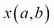。`x.a()`函数是一种等待`b()`的`partial()`函数。我们可以将其视为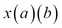。

这里的想法是，Python 为我们提供了两种管理状态的替代方案。我们可以更新对象，也可以创建一个（在某种程度上）有状态的`partial()`函数。由于这种等价性，我们可以将`partial()`函数重写为流畅的工厂对象。我们使`rank`对象的设置成为返回`self`的流畅方法。设置`suit`对象实际上将创建`Card`实例。

以下是一个流畅的`Card`工厂类，其中有两个必须按特定顺序使用的方法函数：

```py
class CardFactory:
    def rank( self, rank ):
        self.class_, self.rank_str= {
            1:(AceCard,'A'),
            11:(FaceCard,'J'),
            12:(FaceCard,'Q'),
            13:(FaceCard,'K'),
            }.get(rank, (NumberCard, str(rank)))
        return self
    def suit( self, suit ):
        return self.class_( self.rank_str, suit )
```

`rank()`方法更新构造函数的状态，而`suit()`方法实际上创建最终的`Card`对象。

这个工厂类可以如下使用：

```py
card8 = CardFactory()
deck8 = [card8.rank(r+1).suit(s) for r in range(13) for s in (Club, Diamond, Heart, Spade)]
```

首先，我们创建一个工厂实例，然后使用该实例创建`Card`实例。这并不会实质性地改变`Card`类层次结构中`__init__()`本身的工作方式。但是，它改变了我们的客户端应用程序创建对象的方式。

## 在每个子类中实现`__init__()`

当我们查看用于创建`Card`对象的工厂函数时，我们看到了`Card`类的一些替代设计。我们可能希望重构排名数字的转换，使其成为`Card`类本身的责任。这将初始化推入到每个子类中。

这通常需要对超类进行一些常见的初始化，以及子类特定的初始化。我们需要遵循**不要重复自己**（**DRY**）原则，以防止代码被克隆到每个子类中。

以下是一个示例，其中初始化是每个子类的责任：

```py
class Card:
    pass
class NumberCard( Card ):
    def  __init__( self, rank, suit ):
        self.suit= suit
        self.rank= str(rank)
        self.hard = self.soft = rank
class AceCard( Card ):
    def  __init__( self, rank, suit ):
        self.suit= suit
        self.rank= "A"
        self.hard, self.soft =  1, 11
class FaceCard( Card ):
    def  __init__( self, rank, suit ):
        self.suit= suit
        self.rank= {11: 'J', 12: 'Q', 13: 'K' }[rank]
        self.hard = self.soft = 10
```

这仍然显然是多态的。然而，缺乏一个真正共同的初始化导致了一些令人不快的冗余。这里令人不快的是`suit`的重复初始化。这必须被*提升*到超类中。我们可以让每个`__init__()`子类对超类进行显式引用。

这个`Card`类的版本在超类级别有一个初始化器，每个子类都使用它，如下面的代码片段所示：

```py
class Card:
    def __init__( self, rank, suit, hard, soft ):
        self.rank= rank
        self.suit= suit
        self.hard= hard
        self.soft= soft
class NumberCard( Card ):
    def  __init__( self, rank, suit ):
        super().__init__( str(rank), suit, rank, rank )
class AceCard( Card ):
    def  __init__( self, rank, suit ):
        super().__init__( "A", suit, 1, 11 )
class FaceCard( Card ):
    def  __init__( self, rank, suit ):
        super().__init__( {11: 'J', 12: 'Q', 13: 'K' }[rank], suit, 10, 10 )
```

我们在子类和超类级别都提供了`__init__()`。这有一个小优点，就是它简化了我们的工厂函数，如下面的代码片段所示：

```py
def card10( rank, suit ):
    if rank == 1: return AceCard( rank, suit )
    elif 2 <= rank < 11: return NumberCard( rank, suit )
    elif 11 <= rank < 14: return FaceCard( rank, suit )
    else:
        raise Exception( "Rank out of range" )
```

简化工厂函数不应该是我们的重点。从这个变化中我们可以看到，我们为了在工厂函数中稍微改进而创建了相当复杂的`__init__()`方法。这是一个常见的权衡。

### 提示

**工厂函数封装复杂性**

在复杂的`__init__()`方法和工厂函数之间存在一个权衡。通常更好的做法是坚持使用更直接但不太友好的`__init__()`方法，并将复杂性推入工厂函数。如果你希望包装和封装构造复杂性，工厂函数会起作用。

## 简单的复合对象

一个复合对象也可以被称为**容器**。我们将看一个简单的复合对象：一叠单独的卡片。这是一个基本的集合。事实上，它是如此基本，以至于我们可以不费吹灰之力地使用一个简单的`list`作为一叠卡片。

在设计一个新的类之前，我们需要问这个问题：使用一个简单的`list`是否合适？

我们可以使用`random.shuffle()`来洗牌，使用`deck.pop()`来发牌到玩家的`Hand`中。

有些程序员急于定义新的类，好像使用内置类违反了某些面向对象设计原则。避免新类会使我们得到以下代码片段中所示的东西：

```py
d= [card6(r+1,s) for r in range(13) for s in (Club, Diamond, Heart, Spade)]
random.shuffle(d)
hand= [ d.pop(), d.pop() ]
```

如果这么简单，为什么要写一个新的类呢？

答案并不完全清晰。一个优点是，一个类提供了一个简化的、无实现的接口给对象。正如我们之前提到的，在讨论工厂时，一个类在 Python 中并不是必需的。

在前面的代码中，这个牌组只有两个简单的用例，而且一个类定义似乎并没有简化事情太多。它的优点在于隐藏了实现的细节。但是这些细节如此微不足道，以至于暴露它们似乎没有太大的成本。在本章中，我们主要关注`__init__()`方法，所以我们将看一些设计来创建和初始化一个集合。

为了设计一个对象的集合，我们有以下三种一般的设计策略：

+   **包装**：这个设计模式是一个现有的集合定义。这可能是**外观**设计模式的一个例子。

+   **扩展**：这个设计模式是一个现有的集合类。这是普通的子类定义。

+   **发明**：这是从头开始设计的。我们将在第六章中看到这个，*创建容器和集合*。

这三个概念是面向对象设计的核心。在设计一个类时，我们必须始终做出这个选择。

### 包装一个集合类

以下是一个包含内部集合的包装设计：

```py
class Deck:
    def __init__( self ):
        self._cards = [card6(r+1,s) for r in range(13) for s in (Club, Diamond, Heart, Spade)]
        random.shuffle( self._cards )
    def pop( self ):
        return self._cards.pop()
```

我们已经定义了`Deck`，使得内部集合是一个`list`对象。`Deck`的`pop()`方法只是委托给了包装的`list`对象。

然后我们可以用以下代码创建一个`Hand`实例：

```py
d= Deck()
hand= [ d.pop(), d.pop() ]
```

通常，外观设计模式或包装类包含了简单地委托给底层实现类的方法。这种委托可能会变得啰嗦。对于一个复杂的集合，我们可能最终会委托大量的方法给包装对象。

### 扩展一个集合类

包装的另一种选择是扩展内置类。通过这样做，我们不必重新实现`pop()`方法，我们可以直接继承它。

`pop()`方法的优点在于它可以创建一个类，而不需要编写太多的代码。在这个例子中，扩展`list`类的缺点在于它提供了比我们实际需要的更多的函数。

以下是扩展内置`list`的`Deck`定义：

```py
class Deck2( list ):
    def __init__( self ):
        super().__init__( card6(r+1,s) for r in range(13) for s in (Club, Diamond, Heart, Spade) )
        random.shuffle( self )
```

在某些情况下，我们的方法将不得不明确地使用超类方法，以便具有适当的类行为。我们将在接下来的章节中看到其他例子。

我们利用超类的`__init__()`方法来用一副初始的牌组填充我们的`list`对象。然后我们洗牌。`pop()`方法只是从`list`继承而来，完美地工作。其他从`list`继承的方法也可以工作。

### 更多要求和另一个设计

在赌场里，牌通常是从一个混合了半打牌组的鞋子中发出的。这个考虑使我们必须建立我们自己的`Deck`版本，而不仅仅使用一个朴素的`list`对象。

此外，赌场鞋子并不是完全发牌。相反，会插入一个标记牌。由于标记牌，一些牌实际上被搁置不用于游戏。

以下是包含多副 52 张牌组的`Deck`定义：

```py
class Deck3(list):
    def __init__(self, decks=1):
        super().__init__()
        for i in range(decks):
            self.extend( card6(r+1,s) for r in range(13) for s in (Club, Diamond, Heart, Spade) )
        random.shuffle( self )
        burn= random.randint(1,52)
        for i in range(burn): self.pop()
```

在这里，我们使用`__init__()`超类来构建一个空集合。然后，我们使用`self.extend()`来将多副 52 张牌的牌组附加到鞋子上。我们也可以使用`super().extend()`，因为在这个类中我们没有提供覆盖的实现。

我们还可以通过`super().__init__()`使用更深层嵌套的生成器表达式来完成整个任务，如下面的代码片段所示：

```py
( card6(r+1,s) for r in range(13) for s in (Club, Diamond, Heart, Spade) for d in range(decks) )
```

这个类为我们提供了一系列`Card`实例，我们可以用它来模拟从鞋子中发牌的赌场 21 点。

在赌场里有一个奇怪的仪式，他们会揭示被烧毁的牌。如果我们要设计一个计牌玩家策略，我们可能也想模拟这种细微差别。

## 复杂的复合对象

以下是一个适合模拟玩法策略的 21 点`Hand`描述的例子：

```py
class Hand:
    def __init__( self, dealer_card ):
        self.dealer_card= dealer_card
        self.cards= []
    def hard_total(self ):
        return sum(c.hard for c in self.cards)
    def soft_total(self ):
        return sum(c.soft for c in self.cards)
```

在这个例子中，我们有一个基于`__init__()`方法的参数的实例变量`self.dealer_card`。然而，`self.cards`实例变量并不基于任何参数。这种初始化方式创建了一个空集合。

要创建`Hand`的一个实例，我们可以使用以下代码：

```py
d = Deck()
h = Hand( d.pop() )
h.cards.append( d.pop() )
h.cards.append( d.pop() )
```

这种初始化方式的缺点是使用了一长串陈述来构建`Hand`对象的实例。使用这种初始化方式，将`Hand`对象序列化并重新构建会变得困难。即使我们在这个类中创建了一个显式的`append()`方法，初始化集合仍然需要多个步骤。

我们可以尝试创建一个流畅的接口，但这并不能真正简化事情；它只是改变了构建`Hand`对象的语法方式。流畅的接口仍然会导致多个方法的评估。当我们在第二部分中查看对象的序列化时，*持久性和序列化*我们希望一个单一的类级函数接口，理想情况下是类构造函数。我们将在第九章中深入研究，*序列化和保存 - JSON、YAML、Pickle、CSV 和 XML*。

还要注意，这里显示的硬总和和软总和方法函数并不完全遵循 21 点的规则。我们将在第二章中回到这个问题，*与 Python 无缝集成 - 基本特殊方法*。

### 完整的复合对象初始化

理想情况下，`__init__()`初始化方法将创建一个完整的对象实例。当创建一个包含内部其他对象集合的容器的完整实例时，这会更加复杂。如果我们可以一次性构建这个复合体将会很有帮助。

通常会有一个逐步累积项目的方法，以及一个可以一次性加载所有项目的初始化特殊方法。

例如，我们可能有一个类，如下面的代码片段：

```py
class Hand2:
    def __init__( self, dealer_card, *cards ):
        self.dealer_card= dealer_card
        self.cards = list(cards)
    def hard_total(self ):
        return sum(c.hard for c in self.cards)
    def soft_total(self ):
        return sum(c.soft for c in self.cards)
```

这种初始化可以一次性设置所有实例变量。其他方法只是前一个类定义的副本。我们可以以两种方式构建`Hand2`对象。第一个例子是一次将一张牌加载到`Hand2`对象中：

```py
d = Deck()
P = Hand2( d.pop() )
p.cards.append( d.pop() )
p.cards.append( d.pop() )
```

这个第二个例子使用`*cards`参数一次性加载一个`Cards`类的序列：

```py
d = Deck()
h = Hand2( d.pop(), d.pop(), d.pop() )
```

对于单元测试，以这种方式一次性构建一个复合对象通常是有帮助的。更重要的是，下一部分的一些序列化技术将受益于一种在单个简单评估中构建复合对象的方法。

## 没有`__init__()`的无状态对象

以下是一个不需要`__init__()`方法的退化类的示例。这是**策略**对象的常见设计模式。策略对象被插入到主对象中以实现算法或决策。它可能依赖于主对象中的数据；策略对象本身可能没有任何数据。我们经常设计策略类遵循**享元**设计模式：我们避免在`Strategy`对象中存储内部数据。所有值都作为方法参数值提供给`Strategy`。`Strategy`对象本身可以是无状态的。它更像是一组方法函数而不是其他任何东西。

在这种情况下，我们为`Player`实例提供游戏玩法决策。以下是一个（愚蠢的）选择牌和拒绝其他赌注的策略示例：

```py
class GameStrategy:
    def insurance( self, hand ):
        return False
    def split( self, hand ):
        return False
    def double( self, hand ):
        return False
    def hit( self, hand ):
        return sum(c.hard for c in hand.cards) <= 17
```

每种方法都需要当前的“手牌”作为参数值。决策是基于可用信息的；也就是说，基于庄家的牌和玩家的牌。

我们可以构建这种策略的单个实例，供各种`Player`实例使用，如下面的代码片段所示：

```py
dumb = GameStrategy()
```

我们可以想象创建一系列相关的策略类，每个类使用不同的规则来决定玩家在二十一点中所面临的各种决策。

## 一些额外的类定义

如前所述，玩家有两种策略：一种是下注策略，一种是打牌策略。每个`Player`实例都与一个更大的模拟引擎有一系列的交互。我们将更大的引擎称为`Table`类。

`Table`类需要`Player`实例按以下顺序进行一系列事件：

+   玩家必须根据下注策略下注初始赌注。

+   然后玩家将收到一手牌。

+   如果手牌可以分牌，玩家必须根据玩法策略决定是否要分牌。这可能会创建额外的`Hand`实例。在一些赌场，额外的手牌也可以分牌。

+   对于每个`Hand`实例，玩家必须根据玩法策略决定是否要叫牌、加倍或站立。

+   然后玩家将收到赔付，他们必须根据胜负更新他们的投注策略。

从中我们可以看到`Table`类有许多 API 方法来接收赌注，创建一个`Hand`对象，提供分牌，解决每一手牌，并支付赌注。这是一个大对象，用一组`Players`跟踪游戏状态。

以下是处理赌注和牌的`Table`类的开始部分：

```py
class Table:
    def __init__( self ):
        self.deck = Deck()
    def place_bet( self, amount ):
        print( "Bet", amount )
    def get_hand( self ):
        try:
            self.hand= Hand2( d.pop(), d.pop(), d.pop() )
            self.hole_card= d.pop()
        except IndexError:
            # Out of cards: need to shuffle.
            self.deck= Deck()
            return self.get_hand()
        print( "Deal", self.hand )
        return self.hand
    def can_insure( self, hand ):
        return hand.dealer_card.insure
```

`Table`类被`Player`类用于接受赌注，创建`Hand`对象，并确定这手牌是否有保险赌注。`Player`类可以使用其他方法来获取牌并确定赔付。

`get_hand()`中显示的异常处理并不是赌场游戏的精确模型。这可能导致轻微的统计不准确。更准确的模拟需要开发一个在空时重新洗牌而不是引发异常的牌组。

为了正确交互并模拟真实的游戏，`Player`类需要一个下注策略。下注策略是一个有状态的对象，确定初始下注的水平。各种下注策略通常根据游戏是赢还是输来改变下注。

理想情况下，我们希望有一系列的下注策略对象。Python 有一个带有装饰器的模块，允许我们创建一个抽象超类。创建策略对象的非正式方法是为必须由子类实现的方法引发异常。

我们已经定义了一个抽象超类以及一个特定的子类，如下所示，以定义一个平级下注策略：

```py
class BettingStrategy:
    def bet( self ):
        raise NotImplementedError( "No bet method" )
    def record_win( self ):
        pass
    def record_loss( self ):
        pass

class Flat(BettingStrategy):
    def bet( self ):
        return 1
```

超类定义了具有方便的默认值的方法。抽象超类中的基本`bet()`方法引发异常。子类必须覆盖`bet()`方法。其他方法可以保留以提供默认值。鉴于前一节中的游戏策略以及这里的下注策略，我们可以看看围绕`Player`类的更复杂的`__init__()`技术。

我们可以利用`abc`模块来规范化一个抽象超类定义。它看起来像以下代码片段：

```py
import abc
class BettingStrategy2(metaclass=abc.ABCMeta):
    @abstractmethod
    def bet( self ):
        return 1
    def record_win( self ):
        pass
    def record_loss( self ):
        pass
```

这样做的好处是，它使得创建`BettingStrategy2`的实例，或者任何未能实现`bet()`的子类的实例都是不可能的。如果我们尝试使用未实现的抽象方法创建此类的实例，它将引发异常而不是创建对象。

是的，抽象方法有一个实现。可以通过`super().bet()`访问它。

## 多策略 __init__()

我们可能有从各种来源创建的对象。例如，我们可能需要克隆一个对象作为创建备忘录的一部分，或者冻结一个对象，以便将其用作字典的键或放入集合中；这就是`set`和`frozenset`内置类背后的思想。

有几种整体设计模式可以构建对象的多种方式。一个设计模式是复杂的`__init__()`，称为多策略初始化。还有多个类级（静态）构造方法。

这些方法是不兼容的。它们具有根本不同的接口。

### 提示

避免克隆方法

在 Python 中很少需要不必要地复制对象的克隆方法。使用克隆可能表明未能理解 Python 中可用的面向对象设计原则。

克隆方法将对象创建的知识封装在错误的位置。被克隆的源对象不能了解从克隆创建的目标对象的结构。然而，反过来（目标了解源）是可以接受的，如果源提供了一个相当封装良好的接口。

我们在这里展示的示例实际上是克隆，因为它们非常简单。我们将在下一章中扩展它们。然而，为了展示这些基本技术被用于不仅仅是微不足道的克隆的方式，我们将看看如何将可变的`Hand`对象转换为冻结的不可变的`Hand`对象。

以下是可以用两种方式构建的`Hand`对象的示例：

```py
class Hand3:
    def __init__( self, *args, **kw ):
        if len(args) == 1 and isinstance(args[0],Hand3):
            # Clone an existing hand; often a bad idea
            other= args[0]
            self.dealer_card= other.dealer_card
            self.cards= other.cards
        else:
            # Build a fresh, new hand.
            dealer_card, *cards = args
            self.dealer_card=  dealer_card
            self.cards= list(cards)
```

在第一种情况下，从现有的`Hand3`对象构建了一个`Hand3`实例。在第二种情况下，从单独的`Card`实例构建了一个`Hand3`对象。

这与从单个项目或现有`set`对象构建`frozenset`对象的方式相似。我们将在下一章中更多地了解创建不可变对象。从现有的`Hand`创建一个新的`Hand`使我们能够使用以下代码片段创建`Hand`对象的备忘录：

```py
h = Hand( deck.pop(), deck.pop(), deck.pop() )
memento= Hand( h )
```

我们将`Hand`对象保存在`memento`变量中。这可以用来比较最终手牌和原始发牌的手牌，或者我们可以将其*冻结*以供在集合或映射中使用。

### 更复杂的初始化替代方案

为了编写多策略初始化，我们经常不得不放弃特定的命名参数。这种设计的优点是灵活，但缺点是参数名是不透明的，没有意义的。它需要大量的文档来解释各种用例。

我们可以扩展我们的初始化来拆分`Hand`对象。拆分`Hand`对象的结果只是另一个构造函数。以下代码片段显示了拆分`Hand`对象可能是什么样子：

```py
class Hand4:
    def __init__( self, *args, **kw ):
        if len(args) == 1 and isinstance(args[0],Hand4):
            # Clone an existing handl often a bad idea
            other= args[0]
            self.dealer_card= other.dealer_card
            self.cards= other.cards
        elif len(args) == 2 and isinstance(args[0],Hand4) and 'split' in kw:
            # Split an existing hand
            other, card= args
            self.dealer_card= other.dealer_card
            self.cards= [other.cards[kw['split']], card]
        elif len(args) == 3:
            # Build a fresh, new hand.
            dealer_card, *cards = args
            self.dealer_card=  dealer_card
            self.cards= list(cards)
        else:
            raise TypeError( "Invalid constructor args={0!r} kw={1!r}".format(args, kw) )
    def __str__( self ):
        return ", ".join( map(str, self.cards) )
```

这种设计涉及获取额外的牌来构建适当的拆分手牌。当我们从另一个`Hand4`对象创建一个`Hand4`对象时，我们提供一个拆分关键字参数，该参数使用原始`Hand4`对象的`Card`类的索引。

以下代码片段显示了我们如何使用这个方法来拆分一手牌：

```py
d = Deck()
h = Hand4( d.pop(), d.pop(), d.pop() )
s1 = Hand4( h, d.pop(), split=0 )
s2 = Hand4( h, d.pop(), split=1 )
```

我们创建了一个`Hand4`的初始实例`h`，并将其拆分成另外两个`Hand4`实例`s1`和`s2`，并为每个实例发了一张额外的`Card`类。二十一点的规则只允许在初始手牌有两张相同等级的牌时才能这样做。

虽然这个`__init__()`方法相当复杂，但它的优点是可以并行地创建`fronzenset`对象。缺点是需要一个大的文档字符串来解释所有这些变化。

### 初始化静态方法

当我们有多种创建对象的方式时，有时使用静态方法来创建和返回实例比复杂的`__init__()`方法更清晰。

也可以使用类方法作为替代初始化程序，但是将类作为方法的参数并没有太大的优势。在冻结或拆分`Hand`对象的情况下，我们可能希望创建两个新的静态方法来冻结或拆分`Hand`对象。在构造中使用静态方法作为替代构造函数是一个微小的语法变化，但在组织代码时有巨大的优势。

下面是一个带有静态方法的`Hand`版本，可以用来从现有的`Hand`实例构建新的`Hand`实例：

```py
class Hand5:
    def __init__( self, dealer_card, *cards ):
        self.dealer_card= dealer_card
        self.cards = list(cards)
    @staticmethod
    def freeze( other ):
        hand= Hand5( other.dealer_card, *other.cards )
        return hand
    @staticmethod
    def split( other, card0, card1 ):
        hand0= Hand5( other.dealer_card, other.cards[0], card0 )
        hand1= Hand5( other.dealer_card, other.cards[1], card1 )
        return hand0, hand1
    def __str__( self ):
        return ", ".join( map(str, self.cards) )
```

一种方法是冻结或创建一个备忘录版本。另一种方法是拆分一个`Hand5`实例，创建两个新的`Hand5`子实例。

这样做会更加可读，并保留参数名来解释接口。

以下代码片段显示了如何使用这个类的版本拆分`Hand5`实例：

```py
d = Deck()
h = Hand5( d.pop(), d.pop(), d.pop() )
s1, s2 = Hand5.split( h, d.pop(), d.pop() )
```

我们创建了一个`Hand5`的初始实例`h`，将其拆分成另外两个手牌`s1`和`s2`，并为每个实例发了一张额外的`Card`类。`split()`静态方法比通过`__init__()`实现的等效功能要简单得多。然而，它不遵循从现有`set`对象创建`fronzenset`对象的模式。

## 更多的 __init__()技术

我们将看一些其他更高级的`__init__()`技术。这些技术并不像前面的技术那样普遍有用。

以下是使用两个策略对象和一个`table`对象的`Player`类的定义。这显示了一个看起来不太好的`__init__()`方法：

```py
class Player:
    def __init__( self, table, bet_strategy, game_strategy ):
 **self.bet_strategy = bet_strategy
 **self.game_strategy = game_strategy
 **self.table= table
    def game( self ):
        self.table.place_bet( self.bet_strategy.bet() )
        self.hand= self.table.get_hand()
        if self.table.can_insure( self.hand ):
            if self.game_strategy.insurance( self.hand ):
                self.table.insure( self.bet_strategy.bet() )
        # Yet more... Elided for now
```

`Player`的`__init__()`方法似乎只是做一些簿记工作。我们只是将命名参数传递给同名的实例变量。如果有很多参数，简单地将参数传递到内部变量中将会产生大量看起来多余的代码。

我们可以像这样使用这个`Player`类（和相关对象）：

```py
table = Table()
flat_bet = Flat()
dumb = GameStrategy()
p = Player( table, flat_bet, dumb )
p.game()
```

通过将关键字参数值直接传递到内部实例变量中，我们可以提供一个非常简短和非常灵活的初始化。

以下是使用关键字参数值构建`Player`类的方法：

```py
class Player2:
    def __init__( self, **kw ):
        """Must provide table, bet_strategy, game_strategy."""
        self.__dict__.update( kw )
    def game( self ):
        self.table.place_bet( self.bet_strategy.bet() )
        self.hand= self.table.get_hand()
        if self.table.can_insure( self.hand ):
            if self.game_strategy.insurance( self.hand ):
                self.table.insure( self.bet_strategy.bet() )
        # etc.
```

这牺牲了很多可读性以换取简洁性。它跨越了潜在的晦涩领域。

由于`__init__()`方法被简化为一行，它从方法中删除了一定程度的“啰嗦”。然而，这种啰嗦转移到了每个单独的对象构造表达式。由于我们不再使用位置参数，我们必须向对象初始化表达式添加关键字，如下面的代码片段所示：

```py
p2 = Player2( table=table, bet_strategy=flat_bet, game_strategy=dumb )
```

为什么这样做？

这确实有一个*潜在*的优势。像这样定义的类非常容易扩展。我们只需担心一些特定的问题，就可以向构造函数提供额外的关键字参数。

以下是预期的用例：

```py
>>> p1= Player2( table=table, bet_strategy=flat_bet, game_strategy=dumb)
>>> p1.game()
```

以下是一个额外的用例：

```py
>>> p2= Player2( table=table, bet_strategy=flat_bet, game_strategy=dumb, log_name="Flat/Dumb" )
>>> p2.game()
```

我们添加了一个`log_name`属性，而没有触及类定义。这可以用作更大的统计分析的一部分。`Player2.log_name`属性可用于注释日志或其他收集的数据。

我们在添加内容方面受到限制；我们只能添加与类内已使用的名称冲突的参数。需要一些了解类实现的知识才能创建一个不滥用已使用的关键字集的子类。由于`**kw`参数提供的信息很少，我们需要仔细阅读。在大多数情况下，我们宁愿相信类能够正常工作，而不是审查实现细节。

这种基于关键字的初始化可以在超类定义中完成，以使超类更容易实现子类。当子类的独特特性涉及简单的新实例变量时，我们可以避免在每个子类中编写额外的`__init__()`方法。

这种方法的缺点是，我们有一些不是通过子类定义正式记录的晦涩实例变量。如果只有一个小变量，那么为了向类添加一个变量，整个子类可能是太多的编程开销。然而，一个小变量往往会导致第二个和第三个。不久之后，我们会意识到，与极其灵活的超类相比，一个子类会更明智。

我们可以（也应该）将其与混合位置和关键字实现相结合，如下面的代码片段所示：

```py
class Player3( Player ):
    def __init__( self, table, bet_strategy, game_strategy, **extras ):
        self.bet_strategy = bet_strategy
        self.game_strategy = game_strategy
        self.table= table
        self.__dict__.update( extras )
```

这比完全开放的定义更明智。我们已经将必需的参数作为位置参数。我们将任何非必需的参数留作关键字。这澄清了传递给`__init__()`方法的任何额外关键字参数的用法。

这种灵活的、基于关键字的初始化取决于我们是否有相对透明的类定义。这种开放性需要一些小心，以避免由于关键字参数名称是开放式的而导致调试名称冲突。

### 带有类型验证的初始化

类型验证很少是一个明智的要求。在某种程度上，这可能是对 Python 的不完全理解。概念上的目标是验证所有参数都是*适当*类型的。尝试这样做的问题在于，*适当*的定义通常太狭窄，以至于真正有用。

这与验证对象是否符合其他标准是不同的。例如，数字范围检查可能是必要的，以防止无限循环。

可能会出问题的是尝试在`__init__()`方法中做以下操作：

```py
class ValidPlayer:
    def __init__( self, table, bet_strategy, game_strategy ):
        assert isinstance( table, Table )
        assert isinstance( bet_strategy, BettingStrategy )
        assert isinstance( game_strategy, GameStrategy )

        self.bet_strategy = bet_strategy
        self.game_strategy = game_strategy
        self.table= table
```

`isinstance()`方法检查规避了 Python 正常的**鸭子类型**。

我们编写一个赌场游戏模拟，以便尝试对`GameStrategy`进行无尽的变化。这些变化如此简单（仅仅四种方法），以至于从超类继承几乎没有真正的好处。我们可以独立定义这些类，没有整体的超类。

在这个例子中所示的初始化错误检查将迫使我们创建子类，仅仅是为了通过错误检查。没有从抽象超类继承可用的代码。

最大的鸭子类型问题之一涉及数字类型。不同的数字类型将在不同的上下文中起作用。尝试验证参数的类型可能会阻止一个完全合理的数字类型正常工作。在尝试验证时，我们在 Python 中有以下两种选择：

+   我们进行验证，以便允许相对狭窄的类型集合，并且有一天，代码会因为禁止了本来可以合理工作的新类型而出错

+   我们避免验证，以便允许广泛的类型集合，并且有一天，代码会因为使用了不合理的类型而出错

请注意，两者本质上是一样的。代码可能会在某一天出现问题。它可能会因为某种类型被阻止使用而导致问题，即使它是合理的，或者使用了一种不太合理的类型。

### 提示

**只是允许它**

通常，被认为更好的 Python 风格是允许任何类型的数据被使用。

我们将在第四章*一致设计的 ABC*中回到这一点。

问题是：为什么要限制潜在的未来用例？

通常的答案是没有好的理由限制潜在的未来用例。

与其阻止一个合理的，但可能是意想不到的用例，我们可以提供文档、测试和调试日志，以帮助其他程序员理解可以处理的类型的任何限制。我们必须提供文档、日志和测试用例，所以涉及的额外工作很少。

以下是一个提供类期望的示例文档字符串：

```py
class Player:
    def __init__( self, table, bet_strategy, game_strategy ):
        """Creates a new player associated with a table, and configured with proper betting and play strategies

        :param table: an instance of :class:`Table`
        :param bet_strategy: an instance of :class:`BettingStrategy`
        :param  game_strategy: an instance of :class:`GameStrategy`
        """
        self.bet_strategy = bet_strategy
        self.game_strategy = game_strategy
        self.table= table
```

使用这个类的程序员已经被警告了类型限制是什么。允许使用其他类型。如果类型与预期类型不兼容，那么事情将会出错。理想情况下，我们将使用像`unittest`或`doctest`这样的工具来发现错误。

### 初始化、封装和隐私

关于隐私的一般 Python 政策可以总结如下：*我们都是成年人*。

面向对象设计明确区分了接口和实现。这是封装思想的一个结果。一个类封装了一个数据结构、一个算法、一个外部接口或者其他有意义的东西。这个想法是让胶囊将基于类的接口与实现细节分开。

然而，没有一种编程语言能反映出每一个设计细微之处。通常情况下，Python 不会将所有设计考虑作为显式代码实现。

一个没有完全体现在代码中的类设计方面是对象的*私有*（实现）和*公共*（接口）方法或属性之间的区别。在支持它的语言中（C++或 Java 是两个例子），隐私的概念已经相当复杂。这些语言包括私有、受保护和公共等设置，以及“未指定”，这是一种半私有。私有关键字经常被错误地使用，使得子类定义变得不必要地困难。

Python 对隐私的概念很简单，如下所示：

+   它们都是*基本上*公开的。源代码是可用的。我们都是成年人。没有什么是真正隐藏的。

+   通常情况下，我们会以不太公开的方式对待一些名称。它们通常是可能会在没有通知的情况下发生变化的实现细节，但没有正式的私有概念。

以`_`开头的名称在 Python 的某些部分被认为是不太公开的。`help()`函数通常会忽略这些方法。像 Sphinx 这样的工具可以将这些名称从文档中隐藏起来。

Python 的内部名称以`__`开头（和结尾）。这是 Python 内部与上面的应用程序功能不发生冲突的方式。这些内部名称的集合完全由语言参考定义。此外，尝试使用`__`在我们的代码中创建“超级私有”属性或方法没有任何好处。所有会发生的是，如果 Python 的一个版本开始使用我们为内部目的选择的名称，我们就会创建潜在的未来问题。此外，我们很可能会违反对这些名称应用的内部名称混淆。

Python 名称的可见性规则如下：

+   大多数名称都是公开的。

+   以`_`开头的名称稍微不太公开。将它们用于真正可能会发生变化的实现细节。

+   以`__`开头和结尾的名称是 Python 内部的。我们从不自己创造这些名字；我们使用语言参考中定义的名字。

一般来说，Python 的方法是使用文档和精心选择的名称来注册方法（或属性）的意图。通常，接口方法将有详细的文档，可能包括`doctest`示例，而实现方法将有更简略的文档，可能没有`doctest`示例。

对于刚接触 Python 的程序员来说，隐私并没有被广泛使用有时会令人惊讶。对于有经验的 Python 程序员来说，令人惊讶的是有多少大脑能量被用来解决并不真正有帮助的私有和公共声明，因为方法名称和文档的意图是显而易见的。

## 总结

在本章中，我们已经回顾了`__init__()`方法的各种设计替代方案。在下一章中，我们将研究特殊方法，以及一些高级方法。

# 第二章：与 Python 基本特殊方法无缝集成

有许多特殊方法允许我们的类与 Python 之间进行紧密集成。*标准库参考*将它们称为**基本**。更好的术语可能是*基础*或*必要*。这些特殊方法为构建与其他 Python 功能无缝集成的类奠定了基础。

例如，我们需要给定对象值的字符串表示。基类`object`有一个`__repr__()`和`__str__()`的默认实现，提供对象的字符串表示。遗憾的是，这些默认表示非常不具信息性。我们几乎总是希望覆盖其中一个或两个默认定义。我们还将研究`__format__()`，它更复杂一些，但具有相同的目的。

我们还将研究其他转换，特别是`__hash__()`，`__bool__()`和`__bytes__()`。这些方法将对象转换为数字、真/假值或字节字符串。例如，当我们实现`__bool__()`时，我们可以在`if`语句中使用我们的对象：`if someobject:`。

然后，我们可以查看实现比较运算符`__lt__()`、`__le__()`、`__eq__()`、`__ne__()`、`__gt__()`和`__ge__()`的特殊方法。

这些基本特殊方法几乎总是需要在类定义中。

我们将最后查看`__new__()`和`__del__()`，因为这些方法的用例相当复杂。我们不需要这些方法的频率与我们需要其他基本特殊方法的频率一样高。

我们将详细研究如何扩展简单的类定义以添加这些特殊方法。我们需要查看从对象继承的默认行为，以便了解需要覆盖哪些以及何时实际需要覆盖。

## `__repr__()`和`__str__()`方法

Python 有两种对象的字符串表示。这些与内置函数`repr()`、`str()`、`print()`和`string.format()`方法密切相关。

+   一般来说，对象的`str()`方法表示通常被期望对人更友好。这是通过对象的`__str__()`方法构建的。

+   `repr()`方法的表示通常会更加技术性，甚至可能是一个完整的 Python 表达式来重建对象。文档中说：

> 对于许多类型，此函数尝试返回一个字符串，当传递给`eval()`时将产生相同值的对象。

这是通过对象的`__repr__()`方法构建的。

+   `print()`函数将使用`str()`来准备对象进行打印。

+   字符串的`format()`方法也可以访问这些方法。当我们使用`{!r}`或`{!s}`格式化时，我们分别请求`__repr__()`或`__str__()`。

让我们先看看默认实现。

以下是一个简单的类层次结构：

```py
class Card:
    insure= False
    def  __init__( self, rank, suit ):
        self.suit= suit
        self.rank= rank
        self.hard, self.soft = self._points()
class NumberCard( Card ):
    def _points( self ):
        return int(self.rank), int(self.rank)
```

我们已经定义了两个简单的类，每个类中有四个属性。

以下是与这些类中的一个对象的交互：

```py
>>> x=NumberCard( '2', '♣')
>>> str(x)
'<__main__.NumberCard object at 0x1013ea610>'
>>> repr(x)
'<__main__.NumberCard object at 0x1013ea610>'
>>> print(x)
<__main__.NumberCard object at 0x1013ea610>
```

我们可以从这个输出中看到，`__str__()`和`__repr__()`的默认实现并不是非常有信息性的。

当我们重写`__str__()`和`__repr__()`时，有两种广泛的设计情况：

+   **非集合对象**：一个“简单”的对象不包含其他对象的集合，通常也不涉及对该集合的非常复杂的格式化

+   **集合对象**：包含集合的对象涉及到更复杂的格式化

### 非集合 __str__()和 __repr__()

正如我们之前看到的，`__str__()`和`__repr__()`的输出并不是非常有信息性的。我们几乎总是需要重写它们。以下是在没有涉及集合时重写`__str__()`和`__repr__()`的方法。这些方法属于之前定义的`Card`类：

```py
    def __repr__( self ):
        return "{__class__.__name__}(suit={suit!r}, rank={rank!r})".format(
            __class__=self.__class__, **self.__dict__)
    def __str__( self ):
        return "{rank}{suit}".format(**self.__dict__)
```

这两种方法依赖于将对象的内部实例变量字典`__dict__`传递给`format()`函数。这对于使用`__slots__`的对象不合适；通常，这些是不可变对象。在格式规范中使用名称使得格式更加明确。它还使格式模板变得更长。在`__repr__()`的情况下，我们传递了内部的`__dict__`加上对象的`__class__`作为关键字参数值传递给`format()`函数。

模板字符串使用了两种格式规范：

+   `{__class__.__name__}`模板也可以写为`{__class__.__name__!s}`，以更明确地提供类名的简单字符串版本

+   `{suit!r}`和`{rank!r}`模板都使用`!r`格式规范来生成属性值的`repr()`方法

在`__str__()`的情况下，我们只传递了对象的内部`__dict__`。格式化使用了隐式的`{!s}`格式规范来生成属性值的`str()`方法。

### 集合 __str__()和 __repr__()

当涉及到集合时，我们需要格式化集合中的每个单独项目以及这些项目的整体容器。以下是一个具有`__str__()`和`__repr__()`方法的简单集合：

```py
class Hand:
    def __init__( self, dealer_card, *cards ):
        self.dealer_card= dealer_card
        self.cards= list(cards)
    def __str__( self ):
        return ", ".join( map(str, self.cards) )
    def __repr__( self ):
        return "{__class__.__name__}({dealer_card!r}, {_cards_str})".format(
        __class__=self.__class__,
        _cards_str=", ".join( map(repr, self.cards) ),
        **self.__dict__ )
```

`__str__()`方法是一个简单的配方，如下所示：

1.  将`str()`映射到集合中的每个项目。这将创建一个迭代器，遍历生成的字符串值。

1.  使用`, `.join()`将所有项目字符串合并成一个单一的长字符串。

`__repr__()`方法是一个多部分的配方，如下所示：

1.  将`repr()`映射到集合中的每个项目。这将创建一个迭代器，遍历生成的字符串值。

1.  使用`, `.join()`将所有项目字符串合并在一起。

1.  使用`__class__`、集合字符串和`__dict__`中的各种属性创建一组关键字。我们将集合字符串命名为`_cards_str`，以避免与现有属性冲突。

1.  使用`"{__class__.__name__}({dealer_card!r}, {_cards_str})".format()`来组合类名和项目值的长字符串。我们使用`!r`格式化来确保属性也使用`repr()`转换。

在某些情况下，这可以被优化并变得更简单。使用位置参数进行格式化可以在一定程度上缩短模板字符串。

## __format__()方法

`__format__()`方法被`string.format()`和`format()`内置函数使用。这两个接口都用于获取给定对象的可呈现字符串版本。

以下是参数将被呈现给`__format__()`的两种方式：

+   `someobject.__format__("")`：当应用程序执行`format(someobject)`或类似于`"{0}".format(someobject)`时会发生这种情况。在这些情况下，提供了一个零长度的字符串规范。这应该产生一个默认格式。

+   `someobject.__format__(specification)`：当应用程序执行`format(someobject, specification)`或类似于`"{0:specification}".format(someobject)`时会发生这种情况。

请注意，类似于`"{0!r}".format()`或`"{0!s}".format()`并不使用`__format__()`方法。这些直接使用`__repr__()`或`__str__()`。

使用`""`作为规范，一个明智的响应是`return str(self)`。这提供了一个明显的一致性，使对象的各种字符串表示之间保持一致。

格式规范将是格式字符串中`":"`后面的所有文本。当我们写`"{0:06.4f}"`时，`06.4f`是应用于要格式化的参数列表中的项目`0`的格式规范。

*Python 标准库*文档的 6.1.3.1 节定义了一个复杂的数值规范，它是一个九部分的字符串。这是格式规范迷你语言。它具有以下语法：

```py
[[fill]align][sign][#][0][width][,][.precision][type]
```

我们可以使用**正则表达式**（**RE**）来解析这些标准规范，如下面的代码片段所示：

```py
re.compile(
r"(?P<fill_align>.?[\<\>=\^])?"
"(?P<sign>[-+ ])?"
"(?P<alt>#)?"
"(?P<padding>0)?"
"(?P<width>\d*)"
"(?P<comma>,)?"
"(?P<precision>\.\d*)?"
"(?P<type>[bcdeEfFgGnosxX%])?" )
```

这个 RE 将规范分成八组。第一组将包括原始规范中的`fill`和`alignment`字段。我们可以使用这些组来解决我们定义的类的数字数据的格式化问题。

然而，Python 的格式规范迷你语言可能不太适用于我们定义的类。因此，我们可能需要定义自己的规范迷你语言，并在我们的类`__format__()`方法中处理它。如果我们正在定义数值类型，我们应该坚持预定义的迷你语言。然而，对于其他类型，没有理由坚持预定义的语言。

例如，这是一个使用字符`%r`来显示等级和字符`%s`来显示花色的微不足道的语言。结果字符串中的`%%`字符变成`%`。所有其他字符都被字面重复。

我们可以扩展我们的`Card`类，如下面的代码片段所示：

```py
    def __format__( self, format_spec ):
        if format_spec == "":
            return str(self)
        rs= format_spec.replace("%r",self.rank).replace("%s",self.suit)
        rs= rs.replace("%%","%")
        return rs
```

这个定义检查格式规范。如果没有规范，则使用`str()`函数。如果提供了规范，则进行一系列替换，将等级、花色和任何`%`字符折叠到格式规范中，将其变成输出字符串。

这使我们能够按照以下方式格式化卡片：

```py
print( "Dealer Has {0:%r of %s}".format( hand.dealer_card) )
```

格式规范(`"%r of %s"`)作为`format`参数传递给我们的`__format__()`方法。使用这个，我们能够为我们定义的类的对象的呈现提供一个一致的接口。

或者，我们可以定义如下：

```py
    default_format= "some specification"
    def __str__( self ):
        return self.__format__( self.default_format )
    def __format__( self, format_spec ):
        if format_spec == "":  format_spec = self.default_format
       # process the format specification.
```

这样做的好处是将所有字符串表示都放入`__format__()`方法中，而不是在`__format__()`和`__str__()`之间分散。这有一个缺点，因为我们并不总是需要实现`__format__()`，但我们几乎总是需要实现`__str__()`。

### 嵌套格式规范

`string.format()`方法可以处理`{}`的嵌套实例，以执行简单的关键字替换到格式规范中。这种替换是为了创建最终的格式字符串，该字符串传递给我们的类`__format__()`方法。这种嵌套替换简化了一些相对复杂的数值格式化，通过对本来是通用规范的参数化。

以下是一个示例，我们已经在`format`参数中使`width`易于更改：

```py
width=6
for hand,count in statistics.items():
    print( "{hand} {count:{width}d}".format(hand=hand,count=count,width=width) )
```

我们定义了一个通用格式，`"{hand:%r%s} {count:{width}d}"`，它需要一个`width`参数来将其转换为一个适当的格式规范。

提供给`format()`方法的`width=`参数的值用于替换`{width}`嵌套规范。一旦替换了这个值，整个最终格式将提供给`__format__()`方法。

### 集合和委托格式规范

在格式化包含集合的复杂对象时，我们有两个格式化问题：如何格式化整个对象以及如何格式化集合中的项目。例如，当我们看`Hand`时，我们看到我们有一个由单个`Cards`类组成的集合。我们希望`Hand`将一些格式化细节委托给`Hand`集合中的单个`Card`实例。

以下是适用于`Hand`的`__format__()`方法：

```py
    def __format__( self, format_specification ):
        if format_specification == "":
            return str(self)
        return ", ".join( "{0:{fs}}".format(c, fs=format_specification)
            for c in self.cards )
```

`format_specification`参数将用于`Hand`集合中的每个`Card`实例。`"{0:{fs}}"`的格式规范使用了嵌套格式规范技术，将`format_specification`字符串推送到创建适用于每个`Card`实例的格式中。有了这种方法，我们可以格式化一个`Hand`对象`player_hand`如下：

```py
"Player: {hand:%r%s}".format(hand=player_hand)
```

这将对`Hand`对象的每个`Card`实例应用`%r%s`格式规范。

## `__hash__()`方法

内置的`hash()`函数调用给定对象的`__hash__()`方法。这个哈希是一个计算，它将一个（可能复杂的）值减少到一个小的整数值。理想情况下，哈希反映了源值的所有位。其他哈希计算——通常用于加密目的——可以产生非常大的值。

Python 包括两个哈希库。加密质量的哈希函数在`hashlib`中。`zlib`模块有两个高速哈希函数：`adler32()`和`crc32()`。对于相对简单的值，我们不使用这两者。对于大型、复杂的值，这些算法可以提供帮助。

`hash()`函数（以及相关的`__hash__()`方法）用于创建一个小整数键，用于处理诸如`set`、`frozenset`和`dict`之类的集合。这些集合使用**不可变**对象的哈希值来快速定位集合中的对象。

这里的不可变性很重要；我们会多次提到它。不可变对象不会改变它们的状态。例如，数字`3`不会改变状态。它始终是`3`。同样，更复杂的对象也可以具有不可变的状态。Python 字符串是不可变的，因此它们可以用作映射和集合的键。

从对象继承的默认`__hash__()`实现返回基于对象内部 ID 值的值。可以使用`id()`函数来查看这个值，如下所示：

```py
>>> x = object()
>>> hash(x)
269741571
>>> id(x)
4315865136
>>> id(x) / 16
269741571.0
```

从这个例子中，我们可以看到在作者特定的系统上，哈希值是对象的`id//16`。这个细节可能因平台而异。例如，CPython 使用可移植的`C`库，而 Jython 依赖于 Java JVM。

重要的是内部 ID 和默认的`__hash__()`方法之间有很强的相关性。这意味着默认行为是每个对象都是可哈希的，而且即使它们看起来具有相同的值，它们也是完全不同的。

如果我们想要将具有相同值的不同对象合并为单个可散列对象，我们需要修改这个。我们将在下一节中看一个例子，我们希望单个`Card`实例的两个实例被视为同一个对象。

### 决定要哈希什么

并非每个对象都应该提供哈希值。特别是，如果我们正在创建一个有状态、可变对象的类，该类应该*永远*不返回哈希值。`__hash__`的定义应该是`None`。

另一方面，不可变对象可能合理地返回一个哈希值，以便该对象可以用作字典的键或集合的成员。在这种情况下，哈希值需要与相等测试的方式相对应。拥有声称相等但具有不同哈希值的对象是不好的。相反，具有相同哈希值但实际上不相等的对象是可以接受的。

`__eq__()`方法，我们也将在比较运算符部分进行讨论，与哈希密切相关。

有三个层次的相等比较：

+   **相同的哈希值**：这意味着两个对象可能是相等的。哈希值为我们提供了一个快速检查可能相等的方法。如果哈希值不同，这两个对象不可能相等，也不可能是同一个对象。

+   **比较为相等**：这意味着哈希值也必须相等。这是`==`运算符的定义。对象可能是同一个对象。

+   **相同的 IDD**：这意味着它们是同一个对象。它们也比较为相等，并且将具有相同的哈希值。这是`is`运算符的定义。

**哈希基本定律**（**FLH**）是这样的：比较为相等的对象具有相同的哈希值。

我们可以将哈希比较视为相等测试的第一步。

然而，反之不成立。对象可以具有相同的哈希值，但比较为不相等。这是有效的，并且在创建集合或字典时会导致一些预期的处理开销。我们无法可靠地从更大的数据结构中创建不同的 64 位哈希值。将会有不相等的对象被减少为巧合相等的哈希值。

巧合的是，当使用`sets`和`dicts`时，相等的哈希值是预期的开销。这些集合具有内部算法，以在哈希冲突发生时使用备用位置。

通过`__eq__()`和`__hash__()`方法函数定义相等测试和哈希值有三种用例：

+   **不可变对象**：这些是无状态对象，如元组、命名元组和不可变集合的类型，不能被更新。我们有两种选择：

+   既不定义`__hash__()`也不定义`__eq__()`。这意味着什么都不做，使用继承的定义。在这种情况下，`__hash__()`返回对象的 ID 值的一个微不足道的函数，`__eq__()`比较 ID 值。默认的相等测试有时可能令人费解。我们的应用程序可能需要两个`Card(1,Clubs)`实例测试为相等并计算相同的哈希；这不会默认发生。

+   同时定义`__hash__()`和`__eq__()`。请注意，对于不可变对象，我们期望同时定义两者。

+   **可变对象**：这些是可以在内部修改的有状态对象。我们有一个设计选择：

+   定义`__eq__()`但将`__hash__`设置为`None`。这些不能用作`dict`键或`sets`中的项目。

请注意，还有一个额外的可能组合：定义`__hash__()`但使用默认的`__eq__()`定义。这只是浪费代码，因为默认的`__eq__()`方法与`is`运算符相同。默认的`__hash__()`方法将涉及编写更少的代码以实现相同的行为。

我们将详细讨论这三种情况。

### 继承不可变对象的定义

让我们看看默认定义是如何运作的。以下是一个使用`__hash__()`和`__eq__()`的默认定义的简单类层次结构：

```py
class Card:
    insure= False
    def __init__( self, rank, suit, hard, soft ):
        self.rank= rank
        self.suit= suit
        self.hard= hard
        self.soft= soft
    def __repr__( self ):
        return "{__class__.__name__}(suit={suit!r}, rank={rank!r})".format(__class__=self.__class__, **self.__dict__)
    def __str__( self ):
        return "{rank}{suit}".format(**self.__dict__)

class NumberCard( Card ):
    def  __init__( self, rank, suit ):
        super().__init__( str(rank), suit, rank, rank )

class AceCard( Card ):
    def  __init__( self, rank, suit ):
        super().__init__( "A", suit, 1, 11 )

class FaceCard( Card ):
    def  __init__( self, rank, suit ):
        super().__init__( {11: 'J', 12: 'Q', 13: 'K' }[rank], suit, 10, 10 )
```

这是一个*哲学上*不可变对象的类层次结构。我们没有注意实现特殊方法来防止属性被更新。我们将在下一章中讨论属性访问。

让我们看看当我们使用这个类层次结构时会发生什么：

```py
>>> c1 = AceCard( 1, '♣' )
>>> c2 = AceCard( 1, '♣' )
```

我们定义了两个看起来是相同的`Card`实例。我们可以检查`id()`值，如下面的代码片段所示：

```py
>>> print( id(c1), id(c2) )
4302577232 4302576976
```

它们有不同的`id()`编号；它们是不同的对象。这符合我们的期望。

我们可以使用`is`运算符来检查它们是否相同，如下面的代码片段所示：

```py
>>> c1 is c2
False
```

“is 测试”是基于`id()`编号的；它显示它们确实是不同的对象。

我们可以看到它们的哈希值彼此不同：

```py
>>> print( hash(c1), hash(c2) )
268911077 268911061
```

这些哈希值直接来自`id()`值。这是我们对继承方法的期望。在这个实现中，我们可以从`id()`函数中计算哈希，如下面的代码片段所示：

```py
>>> id(c1) / 16
268911077.0
>>> id(c2) / 16
268911061.0
```

由于哈希值不同，它们不应该相等。这符合哈希和相等的定义。然而，这违反了我们对这个类的期望。以下是一个相等性检查：

```py
>>> print( c1 == c2 )
False
```

我们使用相同的参数创建了它们。它们并不相等。在某些应用中，这可能不太好。例如，在累积有关庄家牌的统计计数时，我们不希望因为模拟使用了 6 副牌而为一张牌有六个计数。

我们可以看到它们是适当的不可变对象，因为我们可以将它们放入一个集合中：

```py
>>> print( set( [c1, c2] ) )
{AceCard(suit='♣', rank=1), AceCard(suit='♣', rank=1)}
```

这是来自*标准库参考*文档的记录行为。默认情况下，我们将得到一个基于对象 ID 的`__hash__()`方法，以便每个实例看起来都是唯一的。然而，这并不总是我们想要的。

### 覆盖不可变对象的定义

以下是一个简单的类层次结构，为我们提供了`__hash__()`和`__eq__()`的定义：

```py
class Card2:
    insure= False
    def __init__( self, rank, suit, hard, soft ):
        self.rank= rank
        self.suit= suit
        self.hard= hard
        self.soft= soft
    def __repr__( self ):
        return "{__class__.__name__}(suit={suit!r}, rank={rank!r})".format(__class__=self.__class__, **self.__dict__)
    def __str__( self ):
        return "{rank}{suit}".format(**self.__dict__)
    def __eq__( self, other ):
        return self.suit == other.suit and self.rank == other.rank
    def __hash__( self ):
        return hash(self.suit) ^ hash(self.rank)
class AceCard2( Card2 ):
    insure= True
    def  __init__( self, rank, suit ):
        super().__init__( "A", suit, 1, 11 )
```

这个对象原则上是不可变的。没有正式的机制使其不可变。我们将在第三章中看到如何防止属性值的更改，*属性访问、属性和描述符*。

另外，注意到前面的代码省略了两个子类，它们与前一个示例没有显著变化。

`__eq__()`方法函数比较了这两个基本值：`suit`和`rank`。它不比较硬值和软值；它们是从`rank`派生出来的。

二十一点的规则使得这个定义有些可疑。在二十一点中，花色实际上并不重要。我们应该只比较等级吗？我们应该定义一个额外的方法只比较等级吗？或者，应该依赖应用程序正确比较等级？这些问题没有最佳答案；这些只是权衡。

`__hash__()`方法函数使用异或运算符从这两个基本值中计算出一个位模式。使用^运算符是一种快速而简单的哈希方法，通常效果很好。对于更大更复杂的对象，可能需要更复杂的哈希方法。在发明可能存在错误的东西之前，先从`ziplib`开始。

让我们看看这些类的对象的行为。我们期望它们比较相等，并且在集合和字典中表现正常。这里有两个对象：

```py
>>> c1 = AceCard2( 1, '♣' )
>>> c2 = AceCard2( 1, '♣' )
```

我们定义了两个看起来是相同的卡片实例。我们可以检查 ID 值以确保它们是不同的对象：

```py
>>> print( id(c1), id(c2) )
4302577040 4302577296
>>> print( c1 is c2 )
False
```

它们有不同的`id()`编号。当我们使用`is`运算符进行测试时，我们发现它们是不同的。

让我们比较一下哈希值：

```py
>>> print( hash(c1), hash(c2) )
1259258073890 1259258073890
```

哈希值是相同的。这意味着它们可能是相等的。

相等运算符显示它们确实比较相等：

```py
>>> print( c1 == c2 )
True
```

由于它们是不可变的，我们可以将它们放入一个集合中，如下所示：

```py
>>> print( set( [c1, c2] ) )
{AceCard2(suit='♣', rank='A')}
```

这符合我们对复杂不可变对象的期望。我们必须重写两个特殊方法才能获得一致且有意义的结果。

### 覆盖可变对象的定义

这个例子将继续使用`Cards`类。可变卡片的概念是奇怪的，甚至可能是错误的。然而，我们希望对先前的示例进行一点小调整。

以下是一个类层次结构，为可变对象提供了`__hash__()`和`__eq__()`的定义：

```py
class Card3:
    insure= False
    def __init__( self, rank, suit, hard, soft ):
        self.rank= rank
        self.suit= suit
        self.hard= hard
        self.soft= soft
    def __repr__( self ):
        return "{__class__.__name__}(suit={suit!r}, rank={rank!r})".format(__class__=self.__class__, **self.__dict__)
    def __str__( self ):
        return "{rank}{suit}".format(**self.__dict__)
    def __eq__( self, other ):
        return self.suit == other.suit and self.rank == other.rank
        # and self.hard == other.hard and self.soft == other.soft
    __hash__ = None
class AceCard3( Card3 ):
    insure= True
    def  __init__( self, rank, suit ):
        super().__init__( "A", suit, 1, 11 )
```

让我们看看这些类的对象如何行为。我们期望它们相等，但不能与集合或字典一起使用。我们将创建两个对象如下：

```py
>>> c1 = AceCard3( 1, '♣' )
>>> c2 = AceCard3( 1, '♣' )
```

我们已经定义了两个看起来相同的卡片实例。

我们将查看它们的 ID 值，以确保它们确实是不同的。

```py
>>> print( id(c1), id(c2) )
4302577040 4302577296
```

这里没有什么意外。我们将看看是否可以获得哈希值：

```py
>>> print( hash(c1), hash(c2) )
Traceback (most recent call last):
  File "<stdin>", line 1, in <module>
TypeError: unhashable type: 'AceCard3'
```

由于`__hash__`设置为`None`，这些`Card3`对象无法被哈希，也无法为`hash()`函数提供值。这是预期的行为。

我们可以执行相等性比较，如下面的代码片段所示：

```py
>>> print( c1 == c2 )
True
```

相等性测试正常工作，允许我们比较卡片。它们只是不能插入到集合中或用作字典的键。

当我们尝试时会发生以下情况：

```py
>>> print( set( [c1, c2] ) )
Traceback (most recent call last):
  File "<stdin>", line 1, in <module>
TypeError: unhashable type: 'AceCard3'
```

当尝试将它们放入集合时，我们会得到一个适当的异常。

显然，这不是对像卡片这样在现实生活中是不可变的东西的正确定义。这种定义方式更适合于状态对象，比如`Hand`，其中手牌的内容总是在变化。我们将在下一节为您提供另一个状态对象的示例。

### 从可变手牌制作冻结手牌

如果我们想对特定的`Hand`实例执行统计分析，我们可能希望创建一个将`Hand`实例映射到计数的字典。我们不能使用可变的`Hand`类作为映射中的键。但是，我们可以并行设计`set`和`frozenset`，并创建两个类：`Hand`和`FrozenHand`。这允许我们通过`FrozenHand`“冻结”`Hand`类；冻结版本是不可变的，可以用作字典中的键。

以下是一个简单的`Hand`定义：

```py
class Hand:
     def __init__( self, dealer_card, *cards ):
        self.dealer_card= dealer_card
        self.cards= list(cards)
    def __str__( self ):
        return ", ".join( map(str, self.cards) )
    def __repr__( self ):
        return "{__class__.__name__}({dealer_card!r}, {_cards_str})".format(
        __class__=self.__class__,
        _cards_str=", ".join( map(repr, self.cards) ),
        **self.__dict__ )
    def __eq__( self, other ):
        return self.cards == other.cards and self.dealer_card == other.dealer_card
    __hash__ = None
```

这是一个可变对象（`__hash__`是`None`），它具有适当的相等性测试，可以比较两手牌。

以下是`Hand`的冻结版本：

```py
import sys
class FrozenHand( Hand ):
    def __init__( self, *args, **kw ):
        if len(args) == 1 and isinstance(args[0], Hand):
            # Clone a hand
            other= args[0]
            self.dealer_card= other.dealer_card
            self.cards= other.cards
        else:
            # Build a fresh hand
            super().__init__( *args, **kw )
    def __hash__( self ):
        h= 0
        for c in self.cards:
            h = (h + hash(c)) % sys.hash_info.modulus
        return h
```

冻结版本有一个构造函数，可以从另一个`Hand`类构建一个`Hand`类。它定义了一个`__hash__()`方法，该方法对限制为`sys.hash_info.modulus`值的卡片哈希值求和。在大多数情况下，这种基于模的计算方法对于计算复合对象的哈希值是合理的。

现在我们可以使用这些类进行以下操作：

```py
stats = defaultdict(int)

d= Deck()
h = Hand( d.pop(), d.pop(), d.pop() )
h_f = FrozenHand( h )
stats[h_f] += 1
```

我们初始化了一个统计字典`stats`，作为一个可以收集整数计数的`defaultdict`字典。我们也可以使用`collections.Counter`对象来实现这一点。

通过冻结`Hand`类，我们可以将其用作字典中的键，收集实际发放的每个手牌的计数。

## __bool__()方法

Python 对虚假的定义很愉快。参考手册列出了许多值，这些值将测试为等同于`False`。这包括诸如`False`、`0`、`''`、`()`、`[]`和`{}`等内容。大多数其他对象将测试为等同于`True`。

通常，我们希望通过以下简单语句检查对象是否“非空”：

```py
if some_object:
    process( some_object )
```

在幕后，这是`bool()`内置函数的工作。这个函数依赖于给定对象的`__bool__()`方法。

默认的`__bool__()`方法返回`True`。我们可以通过以下代码看到这一点：

```py
>>> x = object()
>>> bool(x)
True
```

对于大多数类来说，这是完全有效的。大多数对象不应该是`False`。然而，对于集合来说，这是不合适的。空集合应该等同于`False`。非空集合可以返回`True`。我们可能希望为我们的`Deck`对象添加一个类似的方法。

如果我们包装一个列表，我们可能会有以下代码片段中显示的内容：

```py
def __bool__( self ):
    return bool( self._cards )
```

这将布尔函数委托给内部的`_cards`集合。

如果我们扩展一个列表，可能会有以下内容：

```py
def __bool__( self ):
    return super().__bool__( self )
```

这将委托给超类定义的`__bool__()`函数。

在这两种情况下，我们都在专门委托布尔测试。在 wrap 情况下，我们委托给集合。在 extend 情况下，我们委托给超类。无论哪种方式，wrap 或 extend，空集合都将是`False`。这将让我们有办法看到`Deck`对象是否已经完全发放并且为空。

我们可以按照以下代码片段所示的方式进行操作：

```py
d = Deck()
while d:
    card= d.pop()
    # process the card
```

这个循环将处理所有的卡片，而不会在牌堆用尽时出现`IndexError`异常。

## `__bytes__()`方法

很少有机会将对象转换为字节。我们将在第二部分中详细讨论*持久性和序列化*。

在最常见的情况下，应用程序可以创建一个字符串表示，Python IO 类的内置编码功能将用于将字符串转换为字节。这对几乎所有情况都有效。主要的例外情况是当我们定义一种新类型的字符串时。在这种情况下，我们需要定义该字符串的编码。

`bytes()`函数根据参数执行各种操作：

+   `bytes(integer)`: 返回一个具有给定数量的`0x00`值的不可变字节对象。

+   `bytes(string)`: 这将把给定的字符串编码为字节。编码和错误处理的额外参数将定义编码过程的细节。

+   `bytes(something)`: 这将调用`something.__bytes__()`来创建一个字节对象。这里不会使用编码或错误参数。

基本的`object`类没有定义`__bytes__()`。这意味着我们的类默认情况下不提供`__bytes__()`方法。

有一些特殊情况，我们可能有一个需要直接编码成字节的对象，然后再写入文件。使用字符串并允许`str`类型为我们生成字节通常更简单。在处理字节时，重要的是要注意，没有*简单*的方法从文件或接口解码字节。内置的`bytes`类只会解码字符串，而不是我们独特的新对象。我们可能需要解析从字节解码的字符串。或者，我们可能需要显式地使用`struct`模块解析字节，并从解析的值创建我们独特的对象。

我们将研究将`Card`编码和解码为字节。由于只有 52 张卡片，每张卡片可以打包成一个字节。然而，我们选择使用一个字符来表示`suit`和一个字符来表示`rank`。此外，我们需要正确重建`Card`的子类，因此我们需要编码几件事情：

+   `Card`的子类（`AceCard`，`NumberCard`，`FaceCard`）

+   子类定义的`__init__()`的参数

请注意，我们的一些替代`__init__()`方法会将数字等级转换为字符串，从而丢失原始的数值。为了可逆的字节编码，我们需要重建这个原始的数字等级值。

以下是`__bytes__()`的实现，它返回`Cards`类，`rank`和`suit`的**UTF-8**编码：

```py
    def __bytes__( self ):
        class_code= self.__class__.__name__[0]
        rank_number_str = {'A': '1', 'J': '11', 'Q': '12', 'K': '13'}.get( self.rank, self.rank )
        string= "("+" ".join([class_code, rank_number_str, self.suit,] ) + ")"
        return bytes(string,encoding="utf8")
```

这通过创建`Card`对象的字符串表示，然后将字符串编码为字节来实现。这通常是最简单和最灵活的方法。

当我们得到一堆字节时，我们可以解码字符串，然后将字符串解析成一个新的`Card`对象。以下是一个可以用来从字节创建`Card`对象的方法：

```py
def card_from_bytes( buffer ):
    string = buffer.decode("utf8")
    assert string[0 ]=="(" and string[-1] == ")"
    code, rank_number, suit = string[1:-1].split()
    class_ = { 'A': AceCard, 'N': NumberCard, 'F': FaceCard }[code]
    return class_( int(rank_number), suit )
```

在上述代码中，我们已经将字节解码为字符串。然后我们解析了字符串成单独的值。从这些值中，我们可以找到类并构建原始的`Card`对象。

我们可以按照以下方式构建`Card`对象的字节表示：

```py
b= bytes(someCard)
```

我们可以按照以下方式从字节重建`Card`对象：

```py
someCard = card_from_bytes(b)
```

重要的是要注意，外部字节表示通常很难设计。我们正在创建对象状态的表示。Python 已经有了许多适合我们类定义的表示。

通常最好使用 `pickle` 或 `json` 模块，而不是发明一个对象的低级字节表示。这是第九章 *序列化和保存 – JSON、YAML、Pickle、CSV 和 XML* 的主题。

## 比较操作符方法

Python 有六个比较操作符。这些操作符有特殊的方法实现。根据文档，映射如下：

+   `x<y` 调用 `x.__lt__(y)`

+   `x<=y` 调用 `x.__le__(y)`

+   `x==y` 调用 `x.__eq__(y)`

+   `x!=y` 调用 `x.__ne__(y)`

+   `x>y` 调用 `x.__gt__(y)`

+   `x>=y` 调用 `x.__ge__(y)`

我们将在第七章 *创建数字* 中再次讨论比较操作符。

这里还有一个关于实际实现了哪些操作符的额外规则。这些规则基于这样一个想法，即左边的对象类定义了所需的特殊方法。如果没有定义，Python 可以尝试通过改变顺序来尝试替代操作。

### 提示

**以下是两个基本规则**

首先，检查左边的操作数是否有操作符实现：`A<B` 意味着 `A.__lt__(B)`。

其次，检查右边的操作数是否有反向操作符实现：`A<B` 意味着 `B.__gt__(A)`。

这种情况的罕见例外是右操作数是左操作数的子类；然后，首先检查右操作数以允许子类覆盖超类。

我们可以通过定义一个只有一个操作符定义的类，然后用它进行其他操作来看看它是如何工作的。

以下是一个我们可以使用的部分类：

```py
class BlackJackCard_p:
    def __init__( self, rank, suit ):
        self.rank= rank
        self.suit= suit
    def __lt__( self, other ):
        print( "Compare {0} < {1}".format( self, other ) )
        return self.rank < other.rank
    def __str__( self ):
        return "{rank}{suit}".format( **self.__dict__ )
```

这遵循了二十一点比较规则，其中花色无关紧要。我们省略了比较方法，以查看 Python 在操作符缺失时会如何回退。这个类将允许我们执行 `<` 比较。有趣的是，Python 也可以使用这个类来执行 `>` 比较，方法是交换参数顺序。换句话说，*x<y≡y>x*。这是镜像反射规则；我们将在第七章 *创建数字* 中再次看到它。

当我们尝试评估不同的比较操作时，我们会看到这一点。我们将创建两个 `Cards` 类并以各种方式进行比较，如下面的代码片段所示：

```py
>>> two = BlackJackCard_p( 2, '♠' )
>>> three = BlackJackCard_p( 3, '♠' )
>>> two < three
Compare 2♠ < 3♠
True
>>> two > three
Compare 3♠ < 2♠
False
>>> two == three
False
>>> two <= three
Traceback (most recent call last):
  File "<stdin>", line 1, in <module>
TypeError: unorderable types: BlackJackCard_p() <= BlackJackCard_p()
```

从中我们可以看到 `two < three` 映射到 `two.__lt__(three)`。

然而，对于 `two > three`，没有定义 `__gt__()` 方法；Python 使用 `three.__lt__(two)` 作为备用计划。

默认情况下，`__eq__()` 方法是从 `object` 继承的；它比较对象的 ID；对象参与 `==` 和 `!=` 测试如下：

```py
>>> two_c = BlackJackCard_p( 2, '♣' )
>>> two == two_c
False
```

我们可以看到结果并不完全符合我们的预期。我们经常需要覆盖 `__eq__()` 的默认实现。

此外，这些操作符之间没有逻辑连接。从数学上讲，我们可以从其中两个推导出所有必要的比较。Python 不会自动执行这一点。相反，Python 默认处理以下四个简单的反射对：

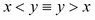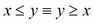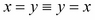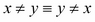

这意味着我们必须至少提供四对中的一个。例如，我们可以提供 `__eq__()`、`__ne__()`、`__lt__()` 和 `__le__()`。

`@functools.total_ordering` 装饰器克服了默认限制，并从 `__eq__()` 和其中一个 `__lt__()`、`__le__()`、`__gt__()` 或 `__ge__()` 推断出其余的比较。我们将在第七章 *创建数字* 中重新讨论这个问题。

### 设计比较

在定义比较运算符时有两个考虑因素：

+   如何比较同一类的两个对象的明显问题

+   如何比较不同类的对象的不太明显的问题

对于一个具有多个属性的类，当查看比较运算符时，我们经常会有一个深刻的模糊。我们可能不清楚我们要比较什么。

考虑谦卑的纸牌（再次！）。诸如`card1 == card2`的表达显然是用来比较`rank`和`suit`的。对吗？或者这总是正确的吗？毕竟，在二十一点中`suit`并不重要。

如果我们想要决定一个`Hand`对象是否可以分割，我们必须看看哪个代码片段更好。以下是第一个代码片段：

```py
if hand.cards[0] == hand.cards[1]
```

以下是第二个代码片段：

```py
if hand.cards[0].rank == hand.cards[1].rank
```

虽然一个更短，简洁并不总是最好的。如果我们定义相等只考虑`rank`，我们将很难定义单元测试，因为一个简单的`TestCase.assertEqual()`方法将容忍各种各样的卡片，而单元测试应该专注于完全正确的卡片。

诸如`card1 <= 7`的表达显然是用来比较`rank`的。

我们是否希望一些比较比较卡片的所有属性，而其他比较只比较`rank`？我们如何按`suit`对卡片进行排序？此外，相等比较必须与哈希计算相对应。如果我们在哈希中包含了多个属性，我们需要在相等比较中包含它们。在这种情况下，似乎卡片之间的相等（和不等）必须是完全的`Card`比较，因为我们正在对`Card`值进行哈希以包括`rank`和`suit`。

然而，`Card`之间的排序比较应该只是`rank`。同样，对整数的比较也应该只是`rank`。对于检测分割的特殊情况，`hand.cards[0].rank == hand.cards[1].rank`将很好，因为它明确了分割的规则。

### 实现相同类的对象的比较

我们将通过查看一个更完整的`BlackJackCard`类来看一个简单的同类比较：

```py
 class BlackJackCard:
    def __init__( self, rank, suit, hard, soft ):
        self.rank= rank
        self.suit= suit
        self.hard= hard
        self.soft= soft
    def __lt__( self, other ):
        if not isinstance( other, BlackJackCard ): return NotImplemented
        return self.rank < other.rank

    def __le__( self, other ):
        try:
            return self.rank <= other.rank
        except AttributeError:
            return NotImplemented
    def __gt__( self, other ):
        if not isinstance( other, BlackJackCard ): return NotImplemented
        return self.rank > other.rank
    def __ge__( self, other ):
        if not isinstance( other, BlackJackCard ): return NotImplemented
        return self.rank >= other.rank
    def __eq__( self, other ):
        if not isinstance( other, BlackJackCard ): return NotImplemented
        return self.rank == other.rank and self.suit == other.suit
    def __ne__( self, other ):
        if not isinstance( other, BlackJackCard ): return NotImplemented
        return self.rank != other.rank and self.suit != other.suit
    def __str__( self ):
        return "{rank}{suit}".format( **self.__dict__ )
```

我们现在已经定义了所有六个比较运算符。

我们向您展示了两种类型检查：**显式**和**隐式**。显式类型检查使用`isinstance()`。隐式类型检查使用`try:`块。使用`try:`块有一个微小的概念优势：它避免了重复类的名称。完全有可能有人想要发明一个与`BlackJackCard`的定义兼容但未定义为正确子类的卡的变体。使用`isinstance()`可能会阻止一个否则有效的类正常工作。

`try:`块可能允许一个偶然具有`rank`属性的类工作。这变成一个难以解决的问题的风险为零，因为该类在此应用中的其他任何地方都可能失败。此外，谁会将`Card`的实例与一个具有等级排序属性的金融建模应用程序的类进行比较？

在以后的示例中，我们将专注于`try:`块。`isinstance()`方法检查是 Python 的成语，并且被广泛使用。我们明确返回`NotImplemented`以通知 Python 这个运算符对于这种类型的数据没有实现。Python 可以尝试颠倒参数顺序，看看另一个操作数是否提供了实现。如果找不到有效的运算符，那么将引发`TypeError`异常。

我们省略了三个子类定义和工厂函数`card21()`。它们留作练习。

我们还省略了类内比较；我们将在下一节中保存。有了这个类，我们可以成功地比较卡片。以下是一个我们创建和比较三张卡片的示例：

```py
>>> two = card21( 2, '♠' )
>>> three = card21( 3, '♠' )
>>> two_c = card21( 2, '♣' )
```

鉴于这些`Cards`类，我们可以执行许多比较，如下面的代码片段所示：

```py
>>> two == two_c
False
>>> two.rank == two_c.rank
True
>>> two < three
True
>>> two_c < three
True
```

定义似乎按预期工作。

### 混合类对象的比较实现

我们将使用`BlackJackCard`类作为一个例子，看看当我们尝试比较两个不同类的操作数时会发生什么。

以下是我们可以与`int`值进行比较的`Card`实例：

```py
>>> two = card21( 2, '♣' )
>>> two < 2
Traceback (most recent call last):
  File "<stdin>", line 1, in <module>
TypeError: unorderable types: Number21Card() < int()
>>> two > 2
Traceback (most recent call last):
  File "<stdin>", line 1, in <module>
TypeError: unorderable types: Number21Card() > int()
```

这是我们预期的：`BlackJackCard`的子类`Number21Card`没有提供所需的特殊方法，因此会有一个`TypeError`异常。

然而，考虑以下两个例子：

```py
>>> two == 2
False
>>> two == 3
False
```

为什么这些提供了响应？当遇到`NotImplemented`值时，Python 会颠倒操作数。在这种情况下，整数值定义了一个`int.__eq__()`方法，容忍意外类的对象。

### 硬总数、软总数和多态性

让我们定义`Hand`，以便它执行有意义的混合类比较。与其他比较一样，我们必须确定我们要比较的内容。

对于`Hands`之间的相等比较，我们应该比较所有的卡。

对于`Hands`之间的排序比较，我们需要比较每个`Hand`对象的属性。对于与`int`字面值的比较，我们应该将`Hand`对象的总数与字面值进行比较。为了得到一个总数，我们必须解决 Blackjack 游戏中硬总数和软总数的微妙之处。

当手中有一张 ace 时，接下来有两个候选总数：

+   **软总数**将 ace 视为 11。如果软总数超过 21，那么这个 ace 的版本必须被忽略。

+   **硬总数**将 ace 视为 1。

这意味着手的总数不是卡的简单总和。

我们首先必须确定手中是否有 ace。有了这个信息，我们可以确定是否有一个有效的（小于或等于 21）软总数。否则，我们将退回到硬总数。

**相当差的多态性**的一个症状是依赖`isinstance()`来确定子类成员资格。一般来说，这是对基本封装的违反。一个良好的多态子类定义应该完全等同于相同的方法签名。理想情况下，类定义是不透明的；我们不需要查看类定义。一个糟糕的多态类集使用了大量的`isinstance()`测试。在某些情况下，`isinstance()`是必要的。这可能是因为使用了内置类。我们不能事后向内置类添加方法函数，而且可能不值得为了添加一个多态辅助方法而对其进行子类化。

在一些特殊方法中，有必要使用`isinstance()`来实现跨多个对象类的操作，其中没有简单的继承层次结构。我们将在下一节中展示`isinstance()`在不相关类中的惯用用法。

对于我们的卡类层次结构，我们希望有一个方法（或属性）来识别一个 ace，而不必使用`isinstance()`。这是一个多态辅助方法。它确保我们可以区分否则相等的类。

我们有两个选择：

+   添加一个类级别的属性

+   添加一个方法

由于保险赌注的工作方式，我们有两个原因要检查 ace。如果庄家的卡是 ace，它会触发一个保险赌注。如果庄家的手（或玩家的手）有一个 ace，就会有一个软总数与硬总数的计算。

硬总数和软总数总是由 ace 的`card.soft-card.hard`值不同。我们可以查看`AceCard`的定义，看到这个值是 10。然而，查看实现会通过深入查看类的实现来破坏封装。

我们可以将`BlackjackCard`视为不透明，并检查`card.soft-card.hard!=0`是否为真。如果是真的，这就足够了解手的硬总数与软总数。

以下是使用软与硬差值的`total`方法的版本：

```py
def total( self ):
    delta_soft = max( c.soft-c.hard for c in self.cards )
    hard = sum( c.hard for c in self.cards )
    if hard+delta_soft <= 21: return hard+delta_soft
    return hard
```

我们将计算硬总数和软总数之间的最大差值作为`delta_soft`。对于大多数卡片，差值为零。对于一张 A 牌，差值将不为零。

给定硬总和`delta_soft`，我们可以确定要返回的总数。如果`hard+delta_soft`小于或等于 21，则值为软总数。如果软总数大于 21，则恢复到硬总数。

我们可以考虑在类中将值 21 作为一个显式常量。有时，有意义的名称比字面量更有帮助。由于 21 点的规则，21 点不太可能会改变为其他值。很难找到比字面量 21 更有意义的名称。

### 混合类比较示例

给定`Hand`对象的总数定义，我们可以有意义地定义`Hand`实例之间的比较以及`Hand`和`int`之间的比较。为了确定我们正在进行哪种比较，我们被迫使用`isinstance()`。

以下是对`Hand`进行比较的部分定义：

```py
class Hand:
    def __init__( self, dealer_card, *cards ):
        self.dealer_card= dealer_card
        self.cards= list(cards)
    def __str__( self ):
        return ", ".join( map(str, self.cards) )
    def __repr__( self ):
        return "{__class__.__name__}({dealer_card!r}, {_cards_str})".format(
        __class__=self.__class__,
        _cards_str=", ".join( map(repr, self.cards) ),
        **self.__dict__ )

    def __eq__( self, other ):
        if isinstance(other,int):
            return self.total() == other
        try:
            return (self.cards == other.cards 
                and self.dealer_card == other.dealer_card)
        except AttributeError:
            return NotImplemented
    def __lt__( self, other ):
        if isinstance(other,int):
            return self.total() < other
        try:
            return self.total() < other.total()
        except AttributeError:
            return NotImplemented
    def __le__( self, other ):
        if isinstance(other,int):
            return self.total() <= other
        try:
            return self.total() <= other.total()
        except AttributeError:
            return NotImplemented
    __hash__ = None
    def total( self ):
        delta_soft = max( c.soft-c.hard for c in self.cards )
        hard = sum( c.hard for c in self.cards )
        if hard+delta_soft <= 21: return hard+delta_soft
        return hard
```

我们定义了三种比较，而不是全部六种。

为了与`Hands`交互，我们需要一些`Card`对象：

```py
>>> two = card21( 2, '♠' )
>>> three = card21( 3, '♠' )
>>> two_c = card21( 2, '♣' )
>>> ace = card21( 1, '♣' )
>>> cards = [ ace, two, two_c, three ]
```

我们将使用这组卡片来查看两个不同的`hand`实例。

这个第一个`Hands`对象有一个无关紧要的庄家`Card`对象和之前创建的四张`Card`的集合。其中一张`Card`是一张 A 牌。

```py
>>> h= Hand( card21(10,'♠'), *cards )
>>> print(h)
A♣, 2♠, 2♣, 3♠
>>> h.total()
18
```

软总数是 18，硬总数是 8。

以下是一个具有额外`Card`对象的第二个`Hand`对象：

```py
>>> h2= Hand( card21(10,'♠'), card21(5,'♠'), *cards )
>>> print(h2)
5♠, A♣, 2♠, 2♣, 3♠
>>> h2.total()
13
```

硬总数是 13。没有软总数，因为它会超过 21。

`Hands`之间的比较非常好，如下面的代码片段所示：

```py
>>> h < h2
False
>>> h > h2
True
```

我们可以根据比较运算符对`Hands`进行排名。

我们也可以将`Hands`与整数进行比较，如下所示：

```py
>>> h == 18
True
>>> h < 19
True
>>> h > 17
Traceback (most recent call last):
  File "<stdin>", line 1, in <module>
TypeError: unorderable types: Hand() > int()
```

与整数的比较只要 Python 不被迫尝试回退就可以工作。前面的例子向我们展示了当没有`__gt__()`方法时会发生什么。Python 检查了反射操作数，整数 17 对于`Hand`也没有适当的`__lt__()`方法。

我们可以添加必要的`__gt__()`和`__ge__()`函数，使`Hand`与整数正常工作。

## `__del__()`方法

`__del__()`方法有一个相当模糊的用例。

意图是在对象从内存中删除之前给对象一个机会做任何清理或最终处理。上下文管理器对象和`with`语句可以更清晰地处理这种用例。这是第五章的主题，*使用可调用和上下文*。创建上下文比处理`__del__()`和 Python 垃圾收集算法更可预测。

在 Python 对象具有相关 OS 资源的情况下，`__del__()`方法是从 Python 应用程序中干净地释放资源的最后机会。例如，隐藏打开文件、挂载设备或者子进程的 Python 对象都可能受益于在`__del__()`处理中释放资源。

`__del__()`方法不会在任何易于预测的时间被调用。当对象被`del`语句删除时，并不总是调用它，当命名空间被删除时，也不总是调用它。`__del__()`方法的文档描述了*不稳定*的情况，并在异常处理上提供了额外的注意事项：执行期间发生的异常将被忽略，并在`sys.stderr`上打印警告。

出于这些原因，上下文管理器通常比实现`__del__()`更可取。

### 引用计数和销毁

对于 CPython 实现，对象有一个引用计数。当对象被分配给一个变量时，引用计数会增加，当变量被移除时，引用计数会减少。当引用计数为零时，对象不再需要，可以被销毁。对于简单对象，`__del__()`将被调用并且对象将被移除。

对于具有对象之间循环引用的复杂对象，引用计数可能永远不会降为零，并且`__del__()`不能轻易被调用。

以下是一个我们可以用来查看发生了什么的类：

```py
class Noisy:
    def __del__( self ):
        print( "Removing {0}".format(id(self)) )
```

我们可以创建（并查看移除）这些对象，如下所示：

```py
>>> x= Noisy()
>>> del x
Removing 4313946640
```

我们创建并移除了一个`Noisy`对象，几乎立即就看到了`__del__()`方法的消息。这表明当删除`x`变量时，引用计数正确地降为零。一旦变量消失，对`Noisy`实例的引用也就不存在了，它也可以被清理了。

以下是一个经常出现的涉及经常创建的浅拷贝的情况：

```py
>>> ln = [ Noisy(), Noisy() ]
>>> ln2= ln[:]
>>> del ln
```

对于这个`del`语句没有响应。`Noisy`对象的引用计数还没有降为零；它们仍然在某个地方被引用，如下面的代码片段所示：

```py
>>> del ln2
Removing 4313920336
Removing 4313920208
```

`ln2`变量是`ln`列表的浅拷贝。`Noisy`对象被两个列表引用。只有当这两个列表都被移除，将引用计数降为零后，它们才能被销毁。

还有许多其他创建浅拷贝的方法。以下是一些创建对象浅拷贝的方法：

```py
a = b = Noisy()
c = [ Noisy() ] * 2
```

关键在于我们经常会被对象的引用数量所困扰，因为浅拷贝在 Python 中很常见。

### 循环引用和垃圾回收

这是一个涉及循环引用的常见情况。一个类`Parent`包含一个子类的集合。每个`Child`实例都包含对`Parent`类的引用。

我们将使用这两个类来检查循环引用：

```py
class Parent:
    def __init__( self, *children ):
        self.children= list(children)
        for child in self.children:
            child.parent= self
    def __del__( self ):
        print( "Removing {__class__.__name__} {id:d}".format( __class__=self.__class__, id=id(self)) )

class Child:
    def __del__( self ):
        print( "Removing {__class__.__name__} {id:d}".format( __class__=self.__class__, id=id(self)) )
```

`Parent`实例有一个简单的`list`作为子类的集合。

每个`Child`实例都引用包含它的`Parent`类。这个引用是在初始化时创建的，当子类被插入到父类的内部集合中。

我们使这两个类都很吵闹，这样我们就可以看到对象何时被移除。以下是发生的情况：

```py
>>>> p = Parent( Child(), Child() )
>>> id(p)
4313921808
>>> del p
```

`Parent`和两个初始的`Child`实例都无法被移除。它们彼此之间都包含引用。

我们可以创建一个没有子类的`Parent`实例，如下面的代码片段所示：

```py
>>> p= Parent()
>>> id(p)
4313921744
>>> del p
Removing Parent 4313921744
```

这被删除了，如预期的那样。

由于相互引用或循环引用，`Parent`实例及其`Child`实例的列表无法从内存中移除。如果我们导入垃圾收集器接口`gc`，我们可以收集并显示这些不可移除的对象。

我们将使用`gc.collect()`方法来收集所有具有`__del__()`方法的不可移除对象，如下面的代码片段所示：

```py
>>> import gc
>>> gc.collect()
174
>>> gc.garbage
[<__main__.Parent object at 0x101213910>, <__main__.Child object at 0x101213890>, <__main__.Child object at 0x101213650>, <__main__.Parent object at 0x101213850>, <__main__.Child object at 0x1012130d0>, <__main__.Child object at 0x101219a10>, <__main__.Parent object at 0x101213250>, <__main__.Child object at 0x101213090>, <__main__.Child object at 0x101219810>, <__main__.Parent object at 0x101213050>, <__main__.Child object at 0x101213210>, <__main__.Child object at 0x101219f90>, <__main__.Parent object at 0x101213810>, <__main__.Child object at 0x1012137d0>, <__main__.Child object at 0x101213790>]
```

我们可以看到我们的`Parent`对象（例如，ID 为`4313921808 = 0x101213910`）在不可移除的垃圾列表中很显眼。为了将引用计数降为零，我们需要更新垃圾列表中的每个`Parent`实例以移除子类，或者更新列表中的每个`Child`实例以移除对`Parent`实例的引用。

请注意，我们不能通过在`__del__()`方法中放置代码来打破循环引用。`__del__()`方法在循环引用被打破并且引用计数已经为零之后才会被调用。当存在循环引用时，我们不能再依赖简单的 Python 引用计数来清除未使用对象的内存。我们必须显式地打破循环引用，或者使用`weakref`引用来进行垃圾回收。

### 循环引用和 weakref 模块

在需要循环引用但又希望`__del__()`正常工作的情况下，我们可以使用**弱引用**。循环引用的一个常见用例是相互引用：一个父对象有一组子对象；每个子对象都有一个指向父对象的引用。如果`Player`类有多个手，那么`Hand`对象包含对拥有`Player`类的引用可能会有所帮助。

默认的对象引用可以称为**强引用**；然而，直接引用是一个更好的术语。它们被 Python 中的引用计数机制使用，并且如果引用计数无法移除对象，它们可以被垃圾回收器发现。它们不能被忽视。

对对象的强引用直接跟随。考虑以下语句：

当我们说：

```py
a= B()
```

`a`变量直接引用了创建的`B`类的对象。`B`的实例的引用计数至少为 1，因为`a`变量有一个引用。

弱引用涉及两步过程来找到关联的对象。弱引用将使用`x.parent()`，调用弱引用作为可调用对象来跟踪实际的父对象。这两步过程允许引用计数或垃圾回收器移除引用的对象，使弱引用悬空。

`weakref`模块定义了许多使用弱引用而不是强引用的集合。这使我们能够创建字典，例如，允许对否则未使用的对象进行垃圾回收。

我们可以修改我们的`Parent`和`Child`类，使用从`Child`到`Parent`的弱引用，允许更简单地销毁未使用的对象。

下面是一个修改过的类，它使用从`Child`到`Parent`的弱引用：

```py
import weakref
class Parent2:
    def __init__( self, *children ):
        self.children= list(children)
        for child in self.children:
            child.parent= weakref.ref(self)
    def __del__( self ):
        print( "Removing {__class__.__name__} {id:d}".format( __class__=self.__class__, id=id(self)) )
```

我们已经将子到父的引用更改为`weakref`对象引用。

在`Child`类内部，我们必须通过两步操作来定位`parent`对象：

```py
p = self.parent()
if p is not None:
    # process p, the Parent instance
else:
    # the parent instance was garbage collected.
```

我们可以明确检查确保找到了引用的对象。有可能引用被悬空。

当我们使用这个新的`Parent2`类时，我们看到引用计数变为零，对象被移除：

```py
>>> p = Parent2( Child(), Child() )
>>> del p
Removing Parent2 4303253584
Removing Child 4303256464
Removing Child 4303043344
```

当`weakref`引用失效（因为引用对象被销毁）时，我们有三种潜在的响应：

+   重新创建引用。可能从数据库重新加载。

+   使用`warnings`模块在低内存情况下写入调试信息，其中垃圾回收器意外地移除了对象。

+   忽略这个问题。

通常，`weakref`引用已经失效，因为对象已被移除：变量已经超出作用域，命名空间不再使用，应用程序正在关闭。因此，第三种响应是非常常见的。试图创建引用的对象可能也即将被移除。

### `__del__()`和`close()`方法

`__del__()`最常见的用途是确保文件被关闭。

通常，打开文件的类定义将具有类似以下代码的内容：

```py
__del__ = close
```

这将确保`__del__()`方法也是`close()`方法。

比这更复杂的任何事情最好使用上下文管理器来完成。有关上下文管理器的更多信息，请参见第五章，*使用可调用对象和上下文*。

## `__new__()`方法和不可变对象

`__new__()`方法的一个用例是初始化否则不可变的对象。`__new__()`方法是我们的代码可以构建未初始化对象的地方。这允许在调用`__init__()`方法设置对象的属性值之前进行处理。

`__new__()`方法用于扩展不可变类，其中`__init__()`方法不能轻松地被覆盖。

以下是一个不起作用的类。我们将定义一个携带有关单位信息的`float`的版本：

```py
class Float_Fail( float ):
    def __init__( self, value, unit ):
        super().__init__( value )
        self.unit = unit
```

我们正在（不当地）初始化一个不可变对象。

当我们尝试使用这个类定义时会发生什么，以下是发生的情况：

```py
>>> s2 = Float_Fail( 6.5, "knots" )
Traceback (most recent call last):
  File "<stdin>", line 1, in <module>
TypeError: float() takes at most 1 argument (2 given)
```

由此可见，我们无法轻松地覆盖内置的不可变`float`类的`__init__()`方法。我们在所有其他不可变类中也会遇到类似的问题。我们无法设置不可变对象`self`的属性值，因为这就是不可变性的定义。我们只能在对象构造期间设置属性值。在此之后进入`__new__()`方法。

`__new__()`方法自动成为一个静态方法。这是真的，即使没有使用`@staticmethod`装饰器。它不使用`self`变量，因为它的工作是创建最终将分配给`self`变量的对象。

对于这种用例，方法签名是`__new__(cls, *args, **kw)`。`cls`参数是必须创建实例的类。对于下一节中的元类用例，`args`值序列比这里显示的更复杂。

`__new__()`的默认实现只是这样做：`return super().__new__(cls)`。它将操作委托给超类。最终工作被委托给`object.__new__()`，它构建了一个简单的、空的所需类的对象。`__new__()`的参数和关键字，除了`cls`参数，将作为标准 Python 行为的一部分传递给`__init__()`。

除了两个显著的例外，这正是我们想要的。以下是例外情况：

+   当我们想要对一个不可变的类定义进行子类化时。我们稍后会深入讨论这一点。

+   当我们需要创建一个元类时。这是下一节的主题，因为它与创建不可变对象的方法有根本的不同。

在创建内置不可变类型的子类时，我们必须在创建时通过覆盖`__new__()`来调整对象，而不是覆盖`__init__()`。以下是一个示例类定义，向我们展示了扩展`float`的正确方法：

```py
class Float_Units( float ):
    def __new__( cls, value, unit ):
       obj= super().__new__( cls, value )
       obj.unit= unit
       return obj
```

在前面的代码中，我们在创建对象时设置了一个属性的值。

以下代码片段为我们提供了一个带有附加单位信息的浮点值：

```py
>>> speed= Float_Units( 6.5, "knots" )
>>> speed
6.5
>>> speed * 10
65.0
>>> speed.unit
'knots'
```

请注意，诸如`speed * 10`这样的表达式不会创建一个`Float_Units`对象。这个类定义继承了`float`的所有操作符特殊方法；`float`算术特殊方法都会创建`float`对象。创建`Float_Units`对象是第七章*创建数字*的主题。

## `__new__()`方法和元类

`__new__()`方法作为元类的一部分的另一个用例是控制类定义的构建方式。这与`__new__()`控制构建不可变对象的方式不同，前面已经展示过。

元类构建一个类。一旦类对象被构建，类对象就被用来构建实例。所有类定义的元类都是`type`。`type()`函数用于创建类对象。

此外，`type()`函数可以作为一个函数来显示对象的类。

以下是一个用`type()`直接构建一个新的、几乎无用的类的愚蠢示例：

```py
Useless= type("Useless",(),{})
```

一旦我们创建了这个类，我们就可以创建这个`Useless`类的对象。但是，它们不会做太多事情，因为它们没有方法或属性。

我们可以使用这个新创建的`Useless`类来创建对象，尽管价值不大。以下是一个例子：

```py
>>> Useless()
<__main__.Useless object at 0x101001910>
>>> u=_
>>> u.attr= 1    
>>> dir(u)
['__class__', '__delattr__', '__dict__', '__dir__', '__doc__', '__eq__', '__format__', '__ge__', '__getattribute__', '__gt__', '__hash__', '__init__', '__le__', '__lt__', '__module__', '__ne__', '__new__', '__reduce__', '__reduce_ex__', '__repr__', '__setattr__', '__sizeof__', '__str__', '__subclasshook__', '__weakref__', 'attr']
```

我们可以向这个类的对象添加属性。它确实可以作为一个对象工作。

这几乎等同于使用`types.SimpleNamespace`或者以下方式定义一个类：

```py
class Useless:
    pass
```

这引出了一个重要的问题：为什么我们要首先搞乱类的定义方式呢？

答案是，一些类的默认特性并不完全适用于一些边缘情况。我们将讨论四种情况，我们可能想要引入一个元类：

+   我们可以使用元类来保留关于类的源文本的一些信息。由内置的`type`构建的类使用`dict`来存储各种方法和类级属性。由于`dict`是无序的，属性和方法没有特定的顺序。它们极不可能按照源代码中最初的顺序出现。我们将在第一个示例中展示这一点。

+   元类用于创建**抽象基类**（**ABC**），我们将在第四章到第七章中介绍。ABC 依赖于元类`__new__()`方法来确认具体子类是否完整。我们将在第四章中介绍这一点，*一致设计的 ABC*。

+   元类可以用来简化对象序列化的一些方面。我们将在第九章中介绍这一点，*序列化和保存-JSON、YAML、Pickle、CSV 和 XML*。

+   作为最后一个相当简单的例子，我们将看一个类内的自引用。我们将设计引用*master*类的类。这不是一个超类-子类关系。这是一组同级子类，但与同级群体中的一个类有关联，作为主类。为了与同级保持一致，主类需要引用自身，这是不可能的，没有元类。这将是我们的第二个例子。

### 元类示例 1-有序属性

这是《Python 语言参考》第 3.3.3 节“自定义类创建”的典型示例。这个元类将记录属性和方法函数定义的顺序。

这个配方有以下三个部分：

1.  创建一个元类。该元类的`__prepare__()`和`__new__()`函数将改变目标类的构建方式，用`OrderedDict`类替换了普通的`dict`类。

1.  创建一个基于元类的抽象超类。这个抽象类简化了其他类的继承。

1.  创建从抽象超类派生的子类，这些子类受益于元类。

以下是将保留属性创建顺序的示例元类：

```py
import collections
class Ordered_Attributes(type):
    @classmethod
    def __prepare__(metacls, name, bases, **kwds):
        return collections.OrderedDict()
    def __new__(cls, name, bases, namespace, **kwds):
        result = super().__new__(cls, name, bases, namespace)
        result._order = tuple(n for n in namespace if not n.startswith('__'))
        return result
```

这个类扩展了内置的默认元类`type`，使用了`__prepare__()`和`__new__()`的新版本。

`__prepare__()`方法在创建类之前执行；它的工作是创建初始的命名空间对象，其中将添加定义。这个方法可以在处理类体之前的任何其他准备工作上工作。

`__new__()`静态方法在类体元素被添加到命名空间后执行。它接收类对象、类名、超类元组和完全构建的命名空间映射对象。这个例子很典型：它将`__new__()`的真正工作委托给了超类；元类的超类是内置的`type`；我们使用`type.__new__()`来创建可以调整的默认类对象。

在这个示例中，`__new__()`方法向类定义中添加了一个名为`_order`的属性，显示了属性的原始顺序。

我们可以在定义新的抽象超类时使用这个元类，而不是`type`。

```py
class Order_Preserved( metaclass=Ordered_Attributes ):
    pass
```

然后我们可以将这个新的抽象类作为我们定义的任何新类的超类，如下所示：

```py
class Something( Order_Preserved ):
    this= 'text'
    def z( self ):
        return False
    b= 'order is preserved'
    a= 'more text'
```

当我们查看`Something`类时，我们会看到以下代码片段：

```py
>>> Something._order
>>> ('this', 'z', 'b', 'a')
```

我们可以考虑利用这些信息来正确序列化对象或提供与原始源定义相关的调试信息。

### 元类示例 2-自引用

我们将看一个涉及单位转换的例子。例如，长度单位包括米、厘米、英寸、英尺和许多其他单位。管理单位转换可能是具有挑战性的。表面上，我们需要一个包含所有各种单位之间所有可能转换因子的矩阵。英尺到米，英尺到英寸，英尺到码，米到英寸，米到码，等等-每一种组合。

实际上，如果我们定义一个长度的标准单位，我们可以做得更好。我们可以将任何单位转换为标准单位，将标准单位转换为任何其他单位。通过这样做，我们可以轻松地执行任何可能的转换作为一个两步操作，消除了所有可能转换的复杂矩阵：英尺到标准单位，英寸到标准单位，码到标准单位，米到标准单位。

在下面的例子中，我们不会以任何方式对`float`或`numbers.Number`进行子类化。我们不会将单位绑定到值，而是允许每个值保持一个简单的数字。这是**享元**设计模式的一个例子。这个类不定义包含相关值的对象。对象只包含转换因子。

另一种方法（将单位绑定到值）会导致相当复杂的维度分析。虽然有趣，但相当复杂。

我们将定义两个类：`Unit`和`Standard_Unit`。我们可以很容易确保每个`Unit`类都有一个指向其适当`Standard_Unit`的引用。我们如何确保每个`Standard_Unit`类都有一个指向自身的引用？在类定义内部进行自引用是不可能的，因为类还没有被定义。

以下是我们的`Unit`类定义：

```py
class Unit:
    """Full name for the unit."""
    factor= 1.0
    standard= None # Reference to the appropriate StandardUnit
    name= "" # Abbreviation of the unit's name.
    @classmethod
    def value( class_, value ):
        if value is None: return None
        return value/class_.factor
    @classmethod
    def convert( class_, value ):
        if value is None: return None
        return value*class_.factor
```

我们的意图是`Unit.value()`将把给定单位的值转换为标准单位。`Unit.convert()`方法将把标准值转换为给定单位。

这使我们能够使用单位，如下面的代码片段所示：

```py
>>> m_f= FOOT.value(4)
>>> METER.convert(m_f)
1.2191999999999998
```

创建的值是内置的`float`值。对于温度，需要重写`value()`和`convert()`方法，因为简单的乘法不起作用。

对于`Standard_Unit`，我们想做如下的事情：

```py
class INCH:
    standard= INCH
```

然而，这样做是行不通的。`INCH`在`INCH`的主体内部还没有被定义。在定义之后类才存在。

作为备选方案，我们可以这样做：

```py
class INCH:
    pass
INCH.standard= INCH
```

然而，这相当丑陋。

我们可以定义一个装饰器如下：

```py
@standard
class INCH:
    pass
```

这个装饰器函数可以调整类定义以添加一个属性。我们将在第八章*装饰器和混入-横切面*中回到这个问题。

相反，我们将定义一个元类，可以将循环引用插入类定义，如下所示：

```py
class UnitMeta(type):
    def __new__(cls, name, bases, dict):
        new_class= super().__new__(cls, name, bases, dict)
        new_class.standard = new_class
        return new_class
```

这迫使类变量标准进入类定义。

对于大多数单位，`SomeUnit.standard`引用`TheStandardUnit`类。与此同时，我们还将有`TheStandardUnit.standard`引用`TheStandardUnit`类。`Unit`和`Standard_Unit`子类之间的这种一致结构可以帮助编写文档并自动化单位转换。

以下是`Standard_Unit`类：

```py
class Standard_Unit( Unit, metaclass=UnitMeta ):
    pass
```

从`Unit`继承的单位转换因子是 1.0，因此这个类对提供的值没有任何作用。它包括特殊的元类定义，以便它将有一个自引用，澄清这个类是这个特定测量维度的标准。

作为一种优化，我们可以重写`value()`和`convert()`方法以避免乘法和除法。

以下是一些单位的样本类定义：

```py
class INCH( Standard_Unit ):
    """Inches"""
    name= "in"

class FOOT( Unit ):
    """Feet"""
    name= "ft"
    standard= INCH
    factor= 1/12

class CENTIMETER( Unit ):
    """Centimeters"""
    name= "cm"
    standard= INCH
    factor= 2.54

class METER( Unit ):
    """Meters"""
    name= "m"
    standard= INCH
    factor= .0254
```

我们将`INCH`定义为标准单位。其他单位的定义将转换为英寸和从英寸转换。

我们为每个单位提供了一些文档：在文档字符串中是全名，在`name`属性中是简称。转换因子是通过从`Unit`继承的`convert()`和`value()`函数自动应用的。

这些定义允许我们的应用程序进行以下类型的编程：

```py
>>> x_std= INCH.value( 159.625 )
>>> FOOT.convert( x_std )
13.302083333333332
>>> METER.convert( x_std )
4.054475
>>> METER.factor
0.0254
```

我们可以从给定的英寸值中设置特定的测量，并以任何其他兼容的单位报告该值。

元类的作用是允许我们从单位定义类中进行这样的查询：

```py
>>> INCH.standard.__name__
'INCH'
>>> FOOT.standard.__name__
'INCH'
```

这些引用可以让我们跟踪给定维度的所有各种单位。

## 总结

我们已经看过一些*基本*特殊方法，这些是我们设计的任何类的基本特性。这些方法已经是每个类的一部分，但我们从对象继承的默认值可能不符合我们的处理要求。

我们几乎总是需要覆盖`__repr__()`、`__str__()`和`__format__()`。这些方法的默认实现并不是很有帮助。

我们很少需要覆盖`__bool__()`，除非我们正在编写自己的集合。这是第六章的主题，*创建容器和集合*。

我们经常需要覆盖比较和`__hash__()`方法。这些定义适用于简单的不可变对象，但对于可变对象则完全不合适。我们可能不需要编写所有的比较运算符；我们将在第八章中看到`@functools.total_ordering`装饰器，*装饰器和混合 - 横切方面*。

另外两个*基本*特殊方法名称`__new__()`和`__del__()`是用于更专门的目的。使用`__new__()`来扩展不可变类是这种方法函数的最常见用例。

这些基本特殊方法，以及`__init__()`，几乎会出现在我们编写的每个类定义中。其余的特殊方法是为更专门的目的而设计的；它们分为六个离散的类别：

+   **属性访问**：这些特殊方法实现了我们在表达式中看到的`object.attribute`，在赋值的左侧看到的`object.attribute`，以及在`del`语句中看到的`object.attribute`。

+   **可调用**：一个特殊方法实现了我们所看到的作为应用于参数的函数，就像内置的`len()`函数一样。

+   **集合**：这些特殊方法实现了集合的许多特性。这涉及诸如`sequence[index]`、`mapping[key]`和`set | set`等内容。

+   **数字**：这些特殊方法提供了算术运算符和比较运算符。我们可以使用这些方法来扩展 Python 处理的数字域。

+   **上下文**：有两个特殊方法，我们将使用它们来实现一个与`with`语句一起工作的上下文管理器。

+   迭代器：有一些特殊的方法来定义迭代器。这并非必要，因为生成器函数如此优雅地处理了这个特性。然而，我们将看看如何设计我们自己的迭代器。

在下一章中，我们将讨论属性、属性和描述符。

# 第三章：属性访问、属性和描述符

对象是一组特性，包括方法和属性。`object`类的默认行为涉及设置、获取和删除命名属性。我们经常需要修改这种行为，以改变对象中可用的属性。

本章将重点介绍属性访问的以下五个层次：

+   我们将研究内置属性处理，这是最简单但最不复杂的选项。

+   我们将回顾`@property`装饰器。属性扩展了属性的概念，包括在方法函数中定义的处理。

+   我们将研究如何利用控制属性访问的低级特殊方法：`__getattr__()`、`__setattr__()`和`__delattr__()`。这些特殊方法允许我们构建更复杂的属性处理。

+   我们还将看一下`__getattribute__()`方法，它可以更精细地控制属性。这可以让我们编写非常不寻常的属性处理。

+   最后，我们将看一下描述符。这些用于访问属性，但它们涉及更复杂的设计决策。描述符在 Python 底层被大量使用，用于实现属性、静态方法和类方法。

在本章中，我们将详细了解默认处理的工作原理。我们需要决定何时以及在何处覆盖默认行为。在某些情况下，我们希望我们的属性不仅仅是实例变量。在其他情况下，我们可能希望阻止添加属性。我们可能有更复杂的行为属性。

此外，当我们探索描述符时，我们将更深入地了解 Python 内部的工作原理。我们通常不需要显式使用描述符。但我们经常隐式使用它们，因为它们是实现许多 Python 特性的机制。

## 基本属性处理

默认情况下，我们创建的任何类都将允许以下四种属性行为：

+   通过设置其值来创建一个新属性

+   设置现有属性的值

+   获取属性的值

+   删除属性

我们可以使用以下简单的代码进行实验。我们可以创建一个简单的通用类和该类的一个对象：

```py
>>> class Generic:
...     pass
...     
>>> g= Generic()
```

上述代码允许我们创建、获取、设置和删除属性。我们可以轻松地创建和获取属性。以下是一些示例：

```py
>>> g.attribute= "value"
>>> g.attribute
'value'
>>> g.unset
Traceback (most recent call last):
  File "<stdin>", line 1, in <module>
AttributeError: 'Generic' object has no attribute 'unset'
>>> del g.attribute
>>> g.attribute
Traceback (most recent call last):
  File "<stdin>", line 1, in <module>
AttributeError: 'Generic' object has no attribute 'attribute'
```

我们可以添加、更改和删除属性。如果尝试获取未设置的属性或删除尚不存在的属性，将会引发异常。

这样做的一个稍微更好的方法是使用`types.SimpleNamespace`类的一个实例。功能集是相同的，但我们不需要创建额外的类定义。我们可以创建`SimpleNamespace`类的对象，如下所示：

```py
>>> import types
>>> n = types.SimpleNamespace()
```

在下面的代码中，我们可以看到相同的用例适用于`SimpleNamespace`类：

```py
>>> n.attribute= "value"
>>> n.attribute
'value'
>>> del n.attribute
>>> n.attribute
Traceback (most recent call last):
  File "<stdin>", line 1, in <module>
AttributeError: 'namespace' object has no attribute 'attribute'
```

我们可以为此对象创建属性。任何尝试使用未定义的属性都会引发异常。`SimpleNamespace`类的行为与我们创建对象类的实例时所看到的不同。对象类的简单实例不允许创建新属性；它缺少 Python 存储属性和值的内部`__dict__`结构。

### 属性和`__init__()`方法

大多数情况下，我们使用类的`__init__()`方法创建一组初始属性。理想情况下，我们在`__init__()`中为所有属性提供默认值。

在`__init__()`方法中*不*需要提供所有属性。因此，属性的存在或不存在可以作为对象状态的一部分。

可选属性推动了类定义的边界。一个类拥有一组明确定义的属性是非常合理的。通过创建子类或超类，可以更清晰地添加（或删除）属性。

因此，可选属性意味着一种非正式的子类关系。因此，当我们使用可选属性时，我们会遇到相当差的多态性。

考虑一个只允许单次分牌的二十一点游戏。如果一手被分牌，就不能再次分牌。我们可以用几种方式来建模：

+   我们可以从`Hand.split()`方法创建一个`SplitHand`的子类。我们不会详细展示这一点。

+   我们可以在名为`Hand`的对象上创建一个状态属性，该对象可以从`Hand.split()`方法创建。理想情况下，这是一个布尔值，但我们也可以将其实现为可选属性。

以下是`Hand.split()`的一个版本，它可以通过可选属性检测可分割与不可分割的手：

```py
def  split( self, deck ):
    assert self.cards[0].rank == self.cards[1].rank
    try:
        self.split_count
        raise CannotResplit
    except AttributeError:
        h0 = Hand( self.dealer_card, self.cards[0], deck.pop() )
        h1 = Hand( self.dealer_card, self.cards[1], deck.pop() )
        h0.split_count= h1.split_count= 1
        return h0, h1
```

实际上，`split()`方法测试是否存在`split_count`属性。如果存在这个属性，则这是一个分牌手，该方法会引发异常。如果`split_count`属性不存在，则这是一个初始发牌，允许分牌。

可选属性的优势在于使`__init__()`方法相对不那么混乱，没有状态标志。它的缺点是模糊了对象状态的某些方面。使用`try:`块来确定对象状态可能会非常令人困惑，应该避免。

## 创建属性

属性是一个方法函数，从语法上看，它是一个简单的属性。我们可以像获取、设置和删除属性值一样获取、设置和删除属性值。这里有一个重要的区别。属性实际上是一个方法函数，可以处理引用另一个对象，而不仅仅是保留引用。

除了复杂程度之外，属性和属性之间的另一个区别是，我们不能轻松地将新属性附加到现有对象；但是，我们可以轻松地向对象添加属性，默认情况下。在这一点上，属性与简单属性并不相同。

创建属性有两种方法。我们可以使用`@property`装饰器，也可以使用`property()`函数。区别纯粹是语法上的。我们将专注于装饰器。

我们将看看两种属性的基本设计模式：

+   **急切计算**：在这种设计模式中，当我们通过属性设置值时，其他属性也会被计算

+   **懒惰计算**：在这种设计模式中，计算被推迟到通过属性请求时

为了比较前面两种属性的方法，我们将`Hand`对象的一些常见特性拆分为一个抽象的超类，如下所示：

```py
class Hand:
    def __str__( self ):
        return ", ".join( map(str, self.card) )
    def __repr__( self ):
        return "{__class__.__name__}({dealer_card!r}, {_cards_str})".format(
        __class__=self.__class__,
        _cards_str=", ".join( map(repr, self.card) ),
        **self.__dict__ )
```

在前面的代码中，我们只定义了一些字符串表示方法，没有别的。

以下是`Hand`的一个子类，其中`total`是一个懒惰计算的属性，只有在需要时才计算：

```py
class Hand_Lazy(Hand):
    def __init__( self, dealer_card, *cards ):
        self.dealer_card= dealer_card
        self._cards= list(cards)
    @property
    def total( self ):
        delta_soft = max(c.soft-c.hard for c in self._cards)
        hard_total = sum(c.hard for c in self._cards)
        if hard_total+delta_soft <= 21: return hard_total+delta_soft
        return hard_total
    @property
    def card( self ):
        return self._cards
    @card.setter
    def card( self, aCard ):
        self._cards.append( aCard )
    @card.deleter
    def card( self ):
        self._cards.pop(-1)
```

`Hand_Lazy`类使用`Cards`对象的列表初始化一个`Hand`对象。`total`属性是一个方法，只有在请求时才计算总数。此外，我们定义了一些其他属性来更新手中的卡片集合。`card`属性可以获取、设置或删除手中的卡片。我们将在设置器和删除器属性部分查看这些属性。

我们可以创建一个`Hand`对象，`total`看起来就像一个简单的属性：

```py
>>> d= Deck()
>>> h= Hand_Lazy( d.pop(), d.pop(), d.pop() )
>>> h.total
19
>>> h.card= d.pop()
>>> h.total
29
```

总数是通过每次请求总数时重新扫描手中的卡片来进行懒惰计算的。这可能是一个昂贵的开销。

### 急切计算的属性

以下是`Hand`的一个子类，其中`total`是一个简单属性，每添加一张卡片都会急切计算：

```py
class Hand_Eager(Hand):
    def __init__( self, dealer_card, *cards ):
        self.dealer_card= dealer_card
        self.total= 0
        self._delta_soft= 0
        self._hard_total= 0
        self._cards= list()
        for c in cards:
            self.card = c
    @property
    def card( self ):
        return self._cards
    @card.setter
    def card( self, aCard ):
        self._cards.append(aCard)
        self._delta_soft = max(aCard.soft-aCard.hard, self._delta_soft)
        self._hard_total += aCard.hard
        self._set_total()
    @card.deleter
    def card( self ):
        removed= self._cards.pop(-1)
        self._hard_total -= removed.hard
        # Issue: was this the only ace?
        self._delta_soft = max( c.soft-c.hard for c in self._cards )
        self._set_total()
    def _set_total( self ):
        if self._hard_total+self._delta_soft <= 21:
            self.total= self._hard_total+self._delta_soft
        else:
            self.total= self._hard_total
```

在这种情况下，每次添加一张卡片时，`total`属性都会更新。

另一个`card`属性——删除器——在删除卡片时急切地更新`total`属性。我们将在下一节详细介绍删除器。

客户端在这两个子类（`Hand_Lazy()`和`Hand_Eager()`）中看到相同的语法：

```py
d= Deck()
h1= Hand_Lazy( d.pop(), d.pop(), d.pop() )
print( h1.total )
h2= Hand_Eager( d.pop(), d.pop(), d.pop() )
print( h2.total )
```

在这两种情况下，客户端软件只是使用`total`属性。

使用属性的优势在于，当实现更改时，语法不必更改。我们也可以对 getter/setter 方法函数提出类似的要求。但是，getter/setter 方法函数涉及的额外语法并不是很有帮助，也不具有信息性。以下是两个示例，一个使用了 setter 方法，另一个使用了赋值运算符：

```py
obj.set_something(value)
obj.something = value
```

赋值运算符（`=`）的存在使意图非常明显。许多程序员发现查找赋值语句比查找 setter 方法函数更清晰。

### 设置器和删除器属性

在前面的示例中，我们定义了`card`属性，将额外的卡片分发到`Hand`类的对象中。

由于 setter（和 deleter）属性是从 getter 属性创建的，我们必须始终首先使用以下代码定义 getter 属性：

```py
    @property
    def card( self ):
        return self._cards
    @card.setter
    def card( self, aCard ):
        self._cards.append( aCard )
    @card.deleter
    def card( self ):
        self._cards.pop(-1)
```

这使我们能够通过以下简单的语句将一张卡添加到手中：

```py
h.card= d.pop()
```

前面的赋值语句有一个缺点，因为它看起来像是用一张卡替换了所有的卡。另一方面，它也有一个优点，因为它使用简单的赋值来更新可变对象的状态。我们可以使用`__iadd__()`特殊方法来更清晰地做到这一点。但是，我们将等到第七章*创建数字*，来介绍其他特殊方法。

对于我们目前的示例，没有强制使用 deleter 属性的理由。即使没有强制使用的理由，deleter 仍然有一些用途。然而，我们可以利用它来移除最后一张发出的卡片。这可以作为分割手牌过程的一部分使用。

我们将考虑一个类似以下代码的`split()`版本：

```py
    def split( self, deck ):
        """Updates this hand and also returns the new hand."""
        assert self._cards[0].rank == self._cards[1].rank
        c1= self._cards[-1]
        del self.card
        self.card= deck.pop()
        h_new= self.__class__( self.dealer_card, c1, deck.pop() )
        return h_new
```

前面的方法更新了给定的手牌并返回一个新的手牌。以下是手牌分割的一个示例：

```py
>>> d= Deck()
>>> c= d.pop()
>>> h= Hand_Lazy( d.pop(), c, c ) # Force splittable hand
>>> h2= h.split(d)
>>> print(h)
2♠, 10♠
>>> print(h2)
2♠, A♠
```

一旦我们有了两张卡，我们就可以使用`split()`来产生第二手牌。一张卡从初始手牌中被移除。

这个`split()`版本肯定可行。然而，似乎更好的是让`split()`方法返回两个全新的`Hand`对象。这样，旧的、预分割的`Hand`实例可以用作收集统计信息的备忘录。

## 使用特殊方法进行属性访问

我们将研究三种用于属性访问的经典特殊方法：`__getattr__()`、`__setattr__()`和`__delattr__()`。此外，我们将使用`__dir__()`方法来显示属性名称。我们将在下一节中讨论`__getattribute__()`。

第一节中显示的默认行为如下：

+   `__setattr__()`方法将创建并设置属性。

+   `__getattr__()`方法将执行两件事。首先，如果属性已经有一个值，`__getattr__()`就不会被使用；属性值会直接返回。其次，如果属性没有值，那么`__getattr__()`就有机会返回一个有意义的值。如果没有属性，它必须引发`AttributeError`异常。

+   `__delattr__()`方法删除一个属性。

+   `__dir__()`方法返回属性名称的列表。

`__getattr__()`方法函数只是更大过程中的一步；只有在属性否则未知时才会使用它。如果属性是已知属性，则不会使用此方法。`__setattr__()`和`__delattr__()`方法没有内置处理。这些方法不与其他处理交互。

我们有许多设计选择来控制属性访问。这些选择遵循我们的三个基本设计选择：扩展、包装或发明。设计选择如下：

+   我们可以通过覆盖`__setattr__()`和`__delattr__()`来扩展一个类，使其几乎不可变。我们还可以用`__slots__`替换内部的`__dict__`。

+   我们可以包装一个类，并将属性访问委托给被包装的对象（或对象的组合）。这可能涉及覆盖这三种方法。

+   我们可以在类中实现类似属性的行为。使用这些方法，我们可以确保所有属性处理都是集中的。

+   我们可以创建延迟属性，直到需要它们时才计算值。我们可能有一个属性，直到从文件、数据库或网络中读取时才有值。这是`__getattr__()`的常见用法。

+   我们可以有急切属性，其中设置一个属性会自动创建其他属性的值。这是通过对`__setattr__()`进行覆盖来实现的。

我们不会考虑所有这些替代方案。相反，我们将专注于两种最常用的技术：扩展和包装。我们将创建不可变对象，并研究急切计算属性值的其他方法。

### 使用 __slots__ 创建不可变对象

如果我们无法设置属性或创建新属性，那么对象就是不可变的。以下是我们希望在交互式 Python 中看到的：

```py
>>> c= card21(1,'♠')
>>> c.rank= 12
Traceback (most recent call last):
  File "<stdin>", line 1, in <module>
  File "<stdin>", line 30, in __setattr__
TypeError: Cannot set rank
>>> c.hack= 13
Traceback (most recent call last):
  File "<stdin>", line 1, in <module>
  File "<stdin>", line 31, in __setattr__
AttributeError: 'Ace21Card' has no attribute 'hack'
```

上面的代码表明，我们不允许更改此对象的属性或添加属性。

我们需要对类定义进行两处更改才能实现这一点。我们将省略大部分类，只关注使对象不可变的三个特性，如下所示：

```py
class BlackJackCard:
    """Abstract Superclass"""
    __slots__ = ( 'rank', 'suit', 'hard', 'soft' )
    def __init__( self, rank, suit, hard, soft ):
        super().__setattr__( 'rank', rank )
        super().__setattr__( 'suit', suit )
        super().__setattr__( 'hard', hard )
        super().__setattr__( 'soft', soft )
    def __str__( self ):
        return "{0.rank}{0.suit}".format( self )
    def __setattr__( self, name, value ):
        raise AttributeError( "'{__class__.__name__}' has no attribute '{name}'".format( __class__= self.__class__, name= name ) )
```

我们做了三个重大改变：

+   我们将`__slots__`设置为只允许属性的名称。这将关闭对象的内部`__dict__`功能，并限制我们只能使用属性，没有更多。

+   我们定义了`__setattr__()`来引发异常，而不是做任何有用的事情。

+   我们定义了`__init__()`来使用超类版本的`__setattr__()`，以便在这个类中没有有效的`__setattr__()`方法的情况下正确设置值。

经过一些小心翼翼的处理，我们可以绕过不可变特性。

```py
object.__setattr__(c, 'bad', 5)
```

这就带来了一个问题。“我们如何防止一个‘邪恶’的程序员绕过不可变特性？”这个问题很愚蠢。我们无法阻止邪恶的程序员。另一个同样愚蠢的问题是，“为什么一些邪恶的程序员要写那么多代码来规避不可变性？”我们无法阻止邪恶的程序员做坏事。

如果这个虚构的程序员不喜欢类中的不可变性，他们可以修改类的定义，以删除对`__setattr__()`的重新定义。这样一个不可变对象的目的是保证`__hash__()`返回一个一致的值，而不是阻止人们编写糟糕的代码。

### 提示

**不要滥用 __slots__**

`__slots__`特性主要是为了通过限制属性的数量来节省内存。

### 将不可变对象创建为 tuple 子类

我们还可以通过将我们的`Card`属性设置为`tuple`的子类，并覆盖`__getattr__()`来创建一个不可变对象。在这种情况下，我们将`__getattr__(name)`请求转换为`self[index]`请求。正如我们将在第六章中看到的那样，*创建容器和集合*，`self[index]`是由`__getitem__(index)`实现的。

以下是对内置的`tuple`类的一个小扩展：

```py
class BlackJackCard2( tuple ):
    def __new__( cls, rank, suit, hard, soft ):
        return super().__new__( cls, (rank, suit, hard, soft) )
    def __getattr__( self, name ):
        return self[{'rank':0, 'suit':1, 'hard':2 , 'soft':3}[name]]
    def __setattr__( self, name, value ):
        raise AttributeError
```

在这个例子中，我们只是引发了一个简单的`AttributeError`异常，而没有提供详细的错误消息。

当我们使用上面的代码时，我们会看到以下类型的交互：

```py
>>> d = BlackJackCard2( 'A', '♠', 1, 11 )
>>> d.rank
'A'
>>> d.suit
'♠'
>>> d.bad= 2
Traceback (most recent call last):
  File "<stdin>", line 1, in <module>
  File "<stdin>", line 7, in __setattr__AttributeError
```

我们无法轻易更改卡的值。但是，我们仍然可以调整`d.__dict__`来引入*额外*的属性。

### 注意

**这真的有必要吗？**

也许，这样做太麻烦了，只是为了确保对象不会被意外滥用。实际上，我们更感兴趣的是异常和回溯提供的诊断信息，而不是一个超级安全的不可变类。

### 急切计算的属性

我们可以定义一个对象，在设置值后尽快计算属性。这个对象通过一次计算来优化访问，并将结果留下来供多次使用。

我们可以定义一些属性设置器来实现这一点。然而，对于复杂的计算，每个属性设置器都会计算多个属性，这可能会变得很啰嗦。

我们可以集中处理属性。在下面的例子中，我们将使用一些调整来扩展 Python 内部的`dict`类型。扩展`dict`的优势在于它与字符串的`format()`方法很好地配合。此外，我们不必担心设置额外的属性值，否则这些值会被忽略。

我们希望看到类似下面的代码：

```py
>>> RateTimeDistance( rate=5.2, time=9.5 )
{'distance': 49.4, 'time': 9.5, 'rate': 5.2}
>>> RateTimeDistance( distance=48.5, rate=6.1 )
{'distance': 48.5, 'time': 7.950819672131148, 'rate': 6.1}
```

我们可以设置这个`RateTimeDistance`对象中的值。只要有足够的数据，就会计算额外的属性。我们可以像之前展示的那样一次性完成，也可以像下面的代码一样分阶段完成：

```py
>>> rtd= RateTimeDistance()
>>> rtd.time= 9.5
>>> rtd   
{'time': 9.5}
>>> rtd.rate= 6.24
>>> rtd
{'distance': 59.28, 'time': 9.5, 'rate': 6.24}
```

以下是内置 `dict` 的扩展。我们扩展了 `dict` 实现的基本映射，以计算缺少的属性：

```py
class RateTimeDistance( dict ):
    def __init__( self, *args, **kw ):
        super().__init__( *args, **kw )
        self._solve()
    def __getattr__( self, name ):
        return self.get(name,None)
    def __setattr__( self, name, value ):
        self[name]= value
        self._solve()
    def __dir__( self ):
        return list(self.keys())
    def _solve(self):
        if self.rate is not None and self.time is not None:
            self['distance'] = self.rate*self.time
        elif self.rate is not None and self.distance is not None:
            self['time'] = self.distance / self.rate
        elif self.time is not None and self.distance is not None:
            self['rate'] = self.distance / self.time
```

`dict` 类型使用 `__init__()` 来填充内部字典，然后尝试解决是否有足够的数据。它使用 `__setattr__()` 来向字典添加新项目。每次设置一个值时，它也会尝试解决方程。

在 `__getattr__()` 中，我们使用 `None` 来表示方程中的缺失值。这允许我们将属性设置为 `None` 来表示它是一个缺失值，并且这将迫使解决方案寻找这个值。例如，我们可能基于用户输入或网络请求进行这样的操作，其中所有参数都被赋予一个值，但一个变量被设置为 `None`。

我们可以像下面这样使用它：

```py
>>> rtd= RateTimeDistance( rate=6.3, time=8.25, distance=None )
>>> print( "Rate={rate}, Time={time}, Distance={distance}".format( **rtd ) )
Rate=6.3, Time=8.25, Distance=51.975
```

### 注意

请注意，我们不能轻松地在这个类定义内设置属性值。

让我们考虑以下代码行：

```py
self.distance = self.rate*self.time
```

如果我们编写上述代码片段，`__setattr__()` 和 `_solve()` 之间将会产生无限递归。在示例中，当我们使用 `self['distance']` 时，我们避免了对 `__setattr__()` 的递归调用。

还要注意的是，一旦所有三个值都被设置，这个对象就不能轻松地提供新的解决方案了。

我们不能简单地设置 `rate` 的新值并计算 `time` 的新值，同时保持 `distance` 不变。为了调整这个模型，我们需要清除一个变量并为另一个变量设置一个新值：

```py
>>> rtd.time= None
>>> rtd.rate= 6.1
>>> print( "Rate={rate}, Time={time}, Distance={distance}".format( **rtd ) )
Rate=6.1, Time=8.25, Distance=50.324999999999996
```

在这里，我们清除了 `time` 并改变了 `rate` 以使用已建立的 `distance` 值来获得 `time` 的新解决方案。

我们可以设计一个跟踪变量设置顺序的模型；这个模型可以避免我们在重新计算相关结果之前清除一个变量然后设置另一个变量。

## __getattribute__() 方法

更低级的属性处理是 `__getattribute__()` 方法。默认实现尝试在内部 `__dict__`（或 `__slots__`）中查找值作为现有属性。如果找不到属性，则调用 `__getattr__()` 作为后备。如果找到的值是一个描述符（见下面的 *创建描述符* 部分），那么它会处理描述符。否则，值将被简单地返回。

通过覆盖这个方法，我们可以执行以下任何一种任务：

+   我们可以有效地阻止对属性的访问。通过引发异常而不是返回一个值，这种方法可以使属性比仅仅使用前导下划线 (`_`) 标记一个名称作为实现私有更加保密。

+   我们可以像 `__getattr__()` 一样发明新的属性。然而，在这种情况下，我们可以绕过默认查找由默认版本的 `__getattribute__()` 完成的查找。

+   我们可以使属性执行独特和不同的任务。这可能会使程序非常难以理解或维护。这也可能是一个可怕的主意。

+   我们可以改变描述符的行为方式。虽然在技术上是可能的，但改变描述符的行为听起来像是一个可怕的主意。

当我们实现 `__getattribute__()` 方法时，重要的是要注意方法体中不能有任何内部属性访问。如果我们尝试获取 `self.name` 的值，将导致无限递归。

### 注意

`__getattribute__()` 方法不能简单地给出任何 `self.name` 属性访问；这将导致无限递归。

为了在 `__getattribute__()` 方法内获取属性值，我们必须明确地引用在 `object` 中定义的基本方法，如下所示：

```py
object.__getattribute__(self, name)
```

例如，我们可以修改我们的不可变类，使用 `__getattribute__()` 并阻止对内部 `__dict__` 属性的访问。以下是一个隐藏所有以下划线字符 (`_`) 开头的名称的类：

```py
class BlackJackCard3:
    """Abstract Superclass"""
    def __init__( self, rank, suit, hard, soft ):
        super().__setattr__( 'rank', rank )
        super().__setattr__( 'suit', suit )
        super().__setattr__( 'hard', hard )
        super().__setattr__( 'soft', soft )
    def __setattr__( self, name, value ):
        if name in self.__dict__:
            raise AttributeError( "Cannot set {name}".format(name=name) )
        raise AttributeError( "'{__class__.__name__}' has no attribute '{name}'".format( __class__= self.__class__, name= name ) )
    def __getattribute__( self, name ):
        if name.startswith('_'): raise AttributeError
        return object.__getattribute__( self, name )
```

我们已经重写了`__getattribute__()`，以便在私有名称和 Python 的内部名称上引发属性错误。这比之前的例子有微小的优势：我们根本不允许对对象进行调整。我们将看到与这个类的实例交互的一个例子。

以下是这个类的对象被改变的一个例子：

```py
>>> c = BlackJackCard3( 'A', '♠', 1, 11 )
>>> c.rank= 12
Traceback (most recent call last):
  File "<stdin>", line 1, in <module>
  File "<stdin>", line 9, in __setattr__
  File "<stdin>", line 13, in __getattribute__
AttributeError
>>> c.__dict__['rank']= 12
Traceback (most recent call last):
  File "<stdin>", line 1, in <module>
  File "<stdin>", line 13, in __getattribute__
AttributeError
```

作为一般建议，擅自修改`__getattribute__()`通常不是一个好主意。默认方法非常复杂，几乎我们需要的一切都可以作为属性或者作为对`__getattr__()`的更改而获得。

## 创建描述符

描述符是一个调解属性访问的类。描述符类可以用来获取、设置或删除属性值。描述符对象是在类定义时内部构建的。

描述符设计模式有两个部分：一个**所有者类**和**属性描述符**本身。所有者类使用一个或多个描述符来定义其属性。描述符类定义了一些组合的获取、设置和删除方法。描述符类的实例将成为所有者类的属性。

属性是基于所有者类的方法函数。与属性不同，描述符是一个与拥有类不同的类的实例。因此，描述符通常是可重用的、通用的属性。拥有类可以有每个描述符类的多个实例，以管理具有类似行为的属性。

与其他属性不同，描述符是在类级别创建的。它们不是在`__init__()`初始化中创建的。虽然可以在初始化期间设置描述符的值，但通常描述符是作为类的一部分在任何方法函数之外构建的。

每个描述符对象在定义所有者类时将成为绑定到不同类级属性名称的描述符类的实例。

要被识别为描述符，一个类必须实现以下三种方法的任意组合。

+   `Descriptor.__get__( self, instance, owner ) → object`：在这个方法中，`instance`参数是被访问的对象的`self`变量。`owner`参数是拥有类的对象。如果在类上下文中调用这个描述符，`instance`参数将得到一个`None`值。这必须返回描述符的值。

+   `Descriptor.__set__( self, instance, value )`：在这个方法中，`instance`参数是被访问的对象的`self`变量。`value`参数是描述符需要设置的新值。

+   `Descriptor.__delete__( self, instance )`：在这个方法中，`instance`参数是被访问的对象的`self`变量。这个描述符的方法必须删除这个属性的值。

有时，描述符类还需要一个`__init__()`方法函数来初始化描述符的内部状态。

根据定义的方法，描述符有两种类型：

+   **非数据描述符**：这种描述符定义了`__set__()`或者`__delete__()`或者两者。它不能定义`__get__()`。非数据描述符对象通常作为更大表达式的一部分使用。它可能是一个可调用对象，或者它可能有自己的属性或方法。不可变的非数据描述符必须实现`__set__()`但可以简单地引发`AttributeError`。这些描述符设计起来稍微简单一些，因为接口更加灵活。

+   **数据描述符**：这种描述符至少定义了`__get__()`。通常，它同时定义了`__get__()`和`__set__()`来创建一个可变对象。描述符不能定义这个对象的任何其他属性或方法，因为描述符基本上是不可见的。对于值为数据描述符的属性的引用将被委托给描述符的`__get__()`、`__set__()`或`__delete__()`方法。这些可能很难设计，所以我们将在第二个例子中看一下它们。

描述符有各种用途。在内部，Python 使用描述符有几个原因：

+   在底层，类的方法被实现为描述符。这些是应用方法函数到对象和各种参数值的非数据描述符。

+   通过创建命名属性的数据描述符来实现`property()`函数。

+   类方法或静态方法被实现为描述符；这适用于类而不是类的实例。

当我们在第十一章中查看对象关系映射时，*通过 SQLite 存储和检索对象*，我们会看到许多 ORM 类定义大量使用描述符将 Python 类定义映射到 SQL 表和列。

当我们考虑描述符的目的时，我们还必须检查描述符处理的数据的三种常见用例：

+   **描述符对象**具有或获取数据。在这种情况下，描述符对象的`self`变量是相关的，描述符是有状态的。对于数据描述符，`__get__()`方法返回这个内部数据。对于非数据描述符，描述符有其他方法或属性来访问这些数据。

+   **拥有者实例**包含数据。在这种情况下，描述符对象必须使用`instance`参数来引用拥有对象中的值。对于数据描述符，`__get__()`方法从实例中获取数据。对于非数据描述符，描述符的其他方法访问实例数据。

+   **拥有者类**包含相关数据。在这种情况下，描述符对象必须使用`owner`参数。当描述符实现适用于整个类的静态方法或类方法时，通常会使用这种方法。

我们将详细查看第一种情况。我们将查看如何使用`__get__()`和`__set__()`方法创建数据描述符。我们还将查看如何创建一个没有`__get__()`方法的非数据描述符。

第二种情况（拥有实例中的数据）展示了`@property`装饰器的作用。描述符相对于常规属性可能具有的优势是，它将计算移到描述符类中，而不是拥有者类。这往往会导致类设计的碎片化，可能不是最佳的方法。如果计算确实非常复杂，那么策略模式可能更好。

第三种情况展示了`@staticmethod`和`@classmethod`装饰器的实现。我们不需要重新发明这些轮子。

### 使用非数据描述符

我们经常有一些与少量紧密绑定的属性值的小对象。例如，我们将查看与度量单位绑定的数值。

以下是一个简单的没有`__get__()`方法的非数据描述符类：

```py
class UnitValue_1:
    """Measure and Unit combined."""
    def __init__( self, unit ):
        self.value= None
        self.unit= unit
        self.default_format= "5.2f"
    def __set__( self, instance, value ):
        self.value= value
    def __str__( self ):
        return "{value:{spec}} {unit}".format( spec=self.default_format, **self.__dict__)
    def __format__( self, spec="5.2f" ):
        #print( "formatting", spec )
        if spec == "": spec= self.default_format
        return "{value:{spec}} {unit}".format( spec=spec, **self.__dict__)
```

这个类定义了一对简单的值，一个是可变的（值），另一个是有效不可变的（单位）。

当访问此描述符时，描述符对象本身可用，并且可以使用描述符的其他方法或属性。我们可以使用此描述符创建管理与物理单位相关的测量和其他数字的类。

以下是一个急切地进行速率-时间-距离计算的类：

```py
class RTD_1:
    rate= UnitValue_1( "kt" )
    time= UnitValue_1( "hr" )
    distance= UnitValue_1( "nm" )
    def __init__( self, rate=None, time=None, distance=None ):
        if rate is None:
            self.time = time
            self.distance = distance
            self.rate = distance / time
        if time is None:
            self.rate = rate
            self.distance = distance
            self.time = distance / rate
        if distance is None:
            self.rate = rate
            self.time = time
            self.distance = rate * time
    def __str__( self ):
        return "rate: {0.rate} time: {0.time} distance: {0.distance}".format(self)
```

一旦对象被创建并且属性被加载，缺失的值就会被计算。一旦计算完成，就可以检查描述符以获取值或单位的名称。此外，描述符对`str()`和格式化请求有一个方便的响应。

以下是描述符和`RTD_1`类之间的交互：

```py
>>> m1 = RTD_1( rate=5.8, distance=12 )
>>> str(m1)
'rate:  5.80 kt time:  2.07 hr distance: 12.00 nm'
>>> print( "Time:", m1.time.value, m1.time.unit )
Time: 2.0689655172413794 hr
```

我们使用`rate`和`distance`参数创建了`RTD_1`的一个实例。这些参数用于评估`rate`和`distance`描述符的`__set__()`方法。

当我们要求`str(m1)`时，这将评估`RTD_1`的整体`__str__()`方法，而`RTD_1`又使用了速率、时间和距离描述符的`__format__()`方法。这为我们提供了附加单位的数字。

我们还可以访问描述符的各个元素，因为非数据描述符没有`__get__()`，也不返回它们的内部值。

### 使用数据描述符

数据描述符的设计有些棘手，因为它的接口非常有限。它必须有一个`__get__()`方法，而且只能有`__set__()`或`__delete__()`。这就是整个接口：从一个到三个这些方法，没有其他方法。引入额外的方法意味着 Python 将不会将该类识别为适当的数据描述符。

我们将设计一个过于简化的单位转换模式，使用描述符可以在它们的`__get__()`和`__set__()`方法中执行适当的转换。

以下是一个单位描述符的超类，将执行到标准单位的转换：

```py
class Unit:
    conversion= 1.0
    def __get__( self, instance, owner ):
        return instance.kph * self.conversion
    def __set__( self, instance, value ):
        instance.kph= value / self.conversion
```

这个类执行简单的乘法和除法，将标准单位转换为其他非标准单位，反之亦然。

有了这个超类，我们可以定义一些从标准单位的转换。在前面的情况下，标准单位是 KPH（每小时公里）。

以下是两个转换描述符：

```py
class Knots( Unit ):
    conversion= 0.5399568
```

```py
class MPH( Unit ):
    conversion= 0.62137119
```

继承的方法非常有用。唯一改变的是转换因子。这些类可以用于处理涉及单位转换的值。我们可以互换地使用 MPH 或节。以下是一个标准单位，每小时公里的单位描述符：

```py
class KPH( Unit ):
    def __get__( self, instance, owner ):
        return instance._kph
    def __set__( self, instance, value ):
        instance._kph= value
```

这个类代表一个标准，所以它不做任何转换。它在实例中使用一个私有变量来保存以 KPH 为单位的速度的标准值。避免任何算术转换只是一种优化技术。避免引用公共属性之一是避免无限递归的关键。

以下是一个为给定测量提供多种转换的类：

```py
class Measurement:
    kph= KPH()
    knots= Knots()
    mph= MPH()
    def __init__( self, kph=None, mph=None, knots=None ):
        if kph: self.kph= kph
        elif mph: self.mph= mph
        elif knots: self.knots= knots
        else:
            raise TypeError
    def __str__( self ):
        return "rate: {0.kph} kph = {0.mph} mph = {0.knots} knots".format(self)
```

每个类级属性都是不同单位的描述符。各种描述符的获取和设置方法将执行适当的转换。我们可以使用这个类来在各种单位之间转换速度。

以下是与`Measurement`类交互的一个示例：

```py
>>> m2 = Measurement( knots=5.9 )
>>> str(m2)
'rate: 10.92680006993152 kph = 6.789598762345432 mph = 5.9 knots'
>>> m2.kph
10.92680006993152
>>> m2.mph
6.789598762345432
```

我们通过设置各种描述符创建了一个`Measurement`类的对象。在第一种情况下，我们设置了 knots 描述符。

当我们将值显示为一个大字符串时，每个描述符的`__get__()`方法都被使用了。这些方法从拥有对象中获取内部的`kph`属性值，应用转换因子，然后返回结果值。

`kph`属性也使用了一个描述符。这个描述符不执行任何转换；然而，它只是返回拥有对象中缓存的私有值。`KPH`和`Knots`描述符要求拥有类实现一个`kph`属性。

## 摘要、设计考虑和权衡

在本章中，我们看了几种处理对象属性的方法。我们可以使用`object`类的内置功能来获取和设置属性值。我们可以定义属性来修改属性的行为。

如果我们想要更复杂的功能，我们可以调整`__getattr__()`、`__setattr__()`、`__delattr__()`或`__getattribute__()`的基础特殊方法实现。这允许我们对属性行为进行非常精细的控制。当我们触及这些方法时，我们要小心，因为我们可能会对 Python 的行为进行根本性（和令人困惑的）更改。

在内部，Python 使用描述符来实现方法函数、静态方法函数和属性等功能。描述符的许多酷用例已经是语言的一流特性。

来自其他语言（特别是 Java 和 C++）的程序员通常有冲动尝试将所有属性设为私有，并编写大量的 getter 和 setter 函数。这种编码在静态编译类型定义的语言中是必要的。

在 Python 中，将所有属性视为公共属性要简单得多。这意味着以下内容：

+   它们应该有很好的文档。

+   它们应该正确地反映对象的状态；它们不应该是临时或瞬时值。

+   在属性具有潜在混乱（或脆弱）值的罕见情况下，单个下划线字符（`_`）标记名称为“不是定义接口的一部分”。它实际上并不是私有的。

将私有属性视为一种麻烦是很重要的。封装并没有因为语言中缺乏复杂的隐私机制而被破坏；它是因为糟糕的设计而被破坏。

### 属性与属性之间的区别

在大多数情况下，可以在类外部设置属性而不会产生不良后果。我们的`Hand`类的示例就表明了这一点。对于类的许多版本，我们可以简单地追加到`hand.cards`，属性的延迟计算将完美地工作。

在属性的更改应导致其他属性的相关更改的情况下，需要更复杂的类设计：

+   方法函数可能会澄清状态变化。当需要多个参数值时，这将是必要的。

+   属性设置器可能比方法函数更清晰。当需要单个值时，这将是一个明智的选择。

+   我们也可以使用就地操作符。我们将把这个推迟到第七章，“创建数字”。

没有严格的规定。在这种情况下，当我们需要设置单个参数值时，方法函数和属性之间的区别完全是 API 语法以及它如何传达意图的问题。

对于计算值，属性允许延迟计算，而属性需要急切计算。这归结为一个性能问题。延迟计算与急切计算的好处基于预期的用例。

### 使用描述符进行设计

许多描述符的示例已经是 Python 的一部分。我们不需要重新发明属性、类方法或静态方法。

创建新描述符的最具说服力的案例与 Python 和非 Python 之间的映射有关。例如，对象关系数据库映射需要非常小心，以确保 Python 类具有正确的属性顺序，以匹配 SQL 表和列。此外，当映射到 Python 之外的内容时，描述符类可以处理数据的编码和解码，或者从外部来源获取数据。

在构建 Web 服务客户端时，我们可能会考虑使用描述符来发出 Web 服务请求。`__get__()`方法，例如，可能会变成 HTTP GET 请求，`__set__()`方法可能会变成 HTTP PUT 请求。

在某些情况下，单个请求可能会填充多个描述符的数据。在这种情况下，`__get__()`方法会在发出 HTTP 请求之前检查实例缓存并返回该值。

许多数据描述符操作可以通过属性更简单地处理。这为我们提供了一个起点：首先编写属性。如果属性处理变得过于繁琐或复杂，那么我们可以切换到描述符来重构类。

### 展望未来

在下一章中，我们将仔细研究我们将在第 5、6 和 7 章中利用的**ABC**（抽象基类）。这些 ABC 将帮助我们定义与现有 Python 功能良好集成的类。它们还将允许我们创建强制一致设计和扩展的类层次结构。

# 第四章：一致设计的 ABC

Python 标准库为多个容器特性提供了抽象基类。它为内置的容器类（如`list`、`map`和`set`）提供了一致的框架。

此外，该库还为数字提供了抽象基类。我们可以使用这些类来扩展 Python 中可用的数字类套件。

我们将总体上看一下`collections.abc`模块中的抽象基类。从那里，我们可以专注于一些用例，这些用例将成为未来章节中详细检查的主题。

我们有三种设计策略：包装、扩展和发明。我们将总体上看一下我们可能想要包装或扩展的各种容器和集合背后的概念。同样，我们将研究我们可能想要实现的数字背后的概念。

我们的目标是确保我们的应用程序类与现有的 Python 特性无缝集成。例如，如果我们创建一个集合，那么通过实现`__iter__()`来创建一个迭代器是合适的。实现`__iter__()`的集合将与`for`语句无缝协作。

## 抽象基类

**抽象基类**（**ABC**）的核心定义在一个名为`abc`的模块中。这包含了创建抽象的所需装饰器和元类。其他类依赖于这些定义。

在 Python 3.2 中，集合的抽象基类被隐藏在`collections`中。然而，在 Python 3.3 中，抽象基类已经被拆分成一个名为`collections.abc`的单独子模块。

我们还将研究`numbers`模块，因为它包含了数字类型的 ABC。`io`模块中也有用于 I/O 的抽象基类。

我们将专注于 Python 3.3 版本。这些定义在 Python 3.2 中也会非常类似，但`import`语句会略有变化以反映更扁平的库结构。

抽象基类具有以下特点：

+   抽象意味着这些类并不包含完全工作所需的所有方法定义。为了使其成为一个有用的子类，我们需要提供一些方法定义。

+   基类意味着其他类将使用它作为超类。

+   抽象类为方法函数提供了一些定义。最重要的是，抽象基类为缺失的方法函数提供了签名。子类必须提供正确的方法来创建一个符合抽象类定义的接口的具体类。

抽象基类的特点包括以下几点：

+   我们可以使用它们来为 Python 内部类和我们定制的应用程序类定义一致的基类集。

+   我们可以使用它们来创建一些常见的可重用的抽象，可以在我们的应用程序中使用。

+   我们可以使用它们来支持对类的适当检查，以确定它的功能。这允许库类和我们应用程序中的新类更好地协作。为了进行适当的检查，有必要有诸如“容器”和“数字”之类的概念的正式定义。

没有抽象基类（也就是在“旧的不好的日子里”），一个容器可能会或可能不会一致地提供`Sequence`类的所有特性。这经常导致一个类几乎成为一个序列或类似序列。这反过来导致了奇怪的不一致和笨拙的解决方法，因为一个类并没有完全提供序列的所有特性。

有了抽象基类，你可以确保应用程序给定的类将具有宣传的特性。如果缺少某个特性，未定义的抽象方法的存在将使该类无法用于构建对象实例。

我们将在几种情况下使用 ABC，如下：

+   我们将在定义自己的类时使用 ABC 作为超类

+   我们将在方法中使用 ABC 来确认一个操作是否可能

+   我们将在诊断消息或异常中使用 ABC 来指示为什么操作无法工作

对于第一个用例，我们可以编写以下代码样式的模块：

```py
import collections.abc
class SomeApplicationClass( collections.abc.Callable ):
    pass
```

我们的`SomeApplicationClass`被定义为一个`Callable`类。然后，它必须实现`Callable`所需的特定方法，否则我们将无法创建实例。

函数是`Callable`类的一个具体示例。抽象是定义`__call__()`方法的类。我们将在下一节和第五章中查看`Callables`类，使用*可调用和上下文*。

对于第二个用例，我们可以编写以下代码样式的方法：

```py
def some_method( self, other ):
    assert isinstance(other, collections.abc.Iterator)
```

我们的`some_method()`要求`other`参数是`Iterator`的子类。如果`other`参数无法通过此测试，我们会得到一个异常。`assert`的一个常见替代方案是引发`TypeError`的`if`语句，这可能更有意义。我们将在下一节中看到这一点。

对于第三个用例，我们可能会有以下内容：

```py
try:
    some_obj.some_method( another )
except AttributeError:
    warnings.warn( "{0!r} not an Iterator, found {0.__class__.__bases__!r}".format(another) )
    raise
```

在这种情况下，我们编写了一个诊断警告，显示给定对象的基类。这可能有助于调试应用程序设计中的问题。

## 基类和多态性

在本节中，我们将探讨**相当差的多态性**的概念。检查参数值是一种应该只用于少数特殊情况的 Python 编程实践。

良好的多态性遵循有时被称为**里氏替换原则**的原则。多态类可以互换使用。每个多态类具有相同的属性套件。有关更多信息，请访问[`en.wikipedia.org/wiki/Liskov_substitution_principle`](http://en.wikipedia.org/wiki/Liskov_substitution_principle)。

过度使用`isinstance()`来区分参数类型可能会导致程序变得不必要复杂（和缓慢）。实例比较一直在进行，但错误通常只是通过软件维护引入的。单元测试是发现编程错误的更好方法，而不是在代码中进行冗长的类型检查。

具有大量`isinstance()`方法的方法函数可能是多态类设计不良（或不完整）的症状。与在类定义之外具有特定于类型的处理相比，通常最好扩展或包装类，使它们更适当地多态化，并在类定义内封装特定于类型的处理。

`isinstance()`方法的一个很好的用途是创建诊断消息。一个简单的方法是使用`assert`语句：

```py
assert isinstance( some_argument, collections.abc.Container ), "{0!r} not a Container".format(some_argument)
```

这将引发`AssertionError`异常以指示存在问题。这有一个优点，即它简短而直接。但是，它有两个缺点：断言可能会被消除，并且最好引发`TypeError`。以下示例可能更好：

```py
if not isinstance(some_argument, collections.abc.Container):
    raise TypeError( "{0!r} not a Container".format(some_argument) )
```

前面的代码有一个优点，即它引发了正确的错误。但是，它的缺点是冗长。

更 Pythonic 的方法总结如下：

> “宁愿请求宽恕，也不要请求许可。”

这通常被理解为我们应该尽量减少对参数的前期测试（请求许可），以查看它们是否是正确的类型。参数类型检查很少有任何实际好处。相反，我们应该适当地处理异常（请求宽恕）。

最好的方法是在不太可能发生不适当类型的情况下，将诊断信息与异常结合在一起，并通过单元测试进入操作。

通常情况下会做以下操作：

```py
try:
    found = value in some_argument
except TypeError:
    if not isinstance(some_argument, collections.abc.Container):
        warnings.warn( "{0!r} not a Container".format(some_argument) )
    raise
```

`isinstance()`方法假定`some_argument`是`collections.abc.Container`类的一个适当实例，并且将响应`in`运算符。

在极少数情况下，如果有人更改了应用程序，并且`some_argument`现在是错误的类，应用程序将写入诊断消息，并因`TypeError`异常而崩溃。

## 可调用对象

Python 对**可调用对象**的定义包括使用`def`语句创建的明显函数定义。

它还包括，非正式地，任何具有`__call__()`方法的类。我们可以在*Python 3 面向对象编程*，*Dusty Phillips*，*Packt Publishing*中看到几个例子。为了更正式，我们应该使每个可调用类定义成为`collections.abc.Callable`的适当子类。

当我们查看任何 Python 函数时，我们会看到以下行为：

```py
>>> abs(3)
3
>>> isinstance(abs, collections.abc.Callable)
True
```

内置的`abs()`函数是`collections.abc.Callable`的一个正确实例。我们定义的函数也是如此。以下是一个例子：

```py
>>> def test(n):
...     return n*n
...
>>> isinstance(test, collections.abc.Callable)
True
```

每个函数都报告自己是`Callable`。这简化了对参数值的检查，并有助于编写有意义的调试消息。

我们将在第五章*使用可调用对象和上下文*中详细讨论可调用对象。

## 容器和集合

`collections`模块定义了许多超出内置容器类的集合。容器类包括`namedtuple()`、`deque`、`ChainMap`、`Counter`、`OrderedDict`和`defaultdict`。所有这些都是基于 ABC 定义的类的示例。

以下是一个快速交互，展示了我们如何检查集合以查看它们将支持的方法：

```py
>>> isinstance( {}, collections.abc.Mapping )
True
>>> isinstance( collections.defaultdict(int), collections.abc.Mapping )
True
```

我们可以检查简单的`dict`类，看它是否遵循基本的映射协议并支持所需的方法。

我们可以检查`defaultdict`集合以确认它也是一个映射。

创建新类型的容器时，我们可以不正式地进行。我们可以创建一个具有所有正确特殊方法的类。但是，我们并不*需要*正式声明它是某种类型的容器。

使用适当的 ABC 作为应用程序类的基类更清晰（也更可靠）。额外的形式性具有以下两个优点：

+   它向阅读（可能使用或维护）我们的代码的人宣传了我们的意图。当我们创建`collections.abc.Mapping`的子类时，我们对该类将如何使用做出了非常强烈的声明。

+   它创建了一些诊断支持。如果我们以某种方式未能正确实现所有所需的方法，我们就无法创建抽象基类的实例。如果我们无法运行单元测试，因为无法创建对象的实例，那么这表明存在需要修复的严重问题。

内置容器的整个家族树反映在抽象基类中。较低级别的特性包括`Container`、`Iterable`和`Sized`。这些是更高级别的构造的一部分；它们需要一些特定的方法，特别是`__contains__()`、`__iter__()`和`__len__()`。

更高级别的特性包括以下特征：

+   `Sequence`和`MutableSequence`：这些是具体类`list`和`tuple`的抽象。具体的序列实现还包括`bytes`和`str`。

+   `MutableMapping`：这是`dict`的抽象。它扩展了`Mapping`，但没有内置的具体实现。

+   `Set`和`MutableSet`：这些是具体类`frozenset`和`set`的抽象。

这使我们能够构建新类或扩展现有类，并与 Python 的其他内置特性保持清晰和正式的集成。

我们将在第六章*创建容器和集合*中详细讨论容器和集合。

## 数字

在创建新的数字（或扩展现有数字）时，我们会转向`numbers`模块。这个模块包含了 Python 内置数值类型的抽象定义。这些类型形成了一个高高瘦瘦的层次结构，从最简单到最复杂。在这种情况下，简单（和复杂）指的是可用的方法集合。

有一个名为`numbers.Number`的抽象基类，它定义了所有的数字和类似数字的类。我们可以通过以下交互来看到这一点：

```py
>>> import numbers
>>> isinstance( 42, numbers.Number )
True
>>> 355/113            
3.1415929203539825
>>> isinstance( 355/113, numbers.Number )
True
```

显然，整数和浮点数值是抽象`numbers.Number`类的子类。

子类包括`numbers.Complex`、`numbers.Real`、`numbers.Rational`和`numbers.Integral`。这些定义大致上是对各种数字类的数学思考。

然而，`decimal.Decimal`类并不非常适合这个层次结构。我们可以使用`issubclass()`方法来检查关系，如下所示：

```py
>>> issubclass( decimal.Decimal, numbers.Number )
True
>>> issubclass( decimal.Decimal, numbers.Integral )
False
>>> issubclass( decimal.Decimal, numbers.Real )
False
>>> issubclass( decimal.Decimal, numbers.Complex )
False
>>> issubclass( decimal.Decimal, numbers.Rational )
False
```

`Decimal`不太适合已建立的数字类型并不太令人惊讶。对于`numbers.Rational`的具体实现，请查看`fractions`模块。我们将在第七章中详细讨论各种数字，*创建数字*。

## 一些额外的抽象

我们将看一些其他有趣的 ABC 类，这些类的扩展范围较小。并不是这些抽象较少被使用。更多的是具体实现很少需要扩展或修订。

我们将看一下由`collections.abc.Iterator`定义的迭代器。我们还将看一下与上下文管理器无关的概念。这并没有像其他 ABC 类那样正式定义。我们将在第五章中详细讨论这一点，*使用可调用和上下文*。

### 迭代器抽象

当我们使用`for`语句与可迭代容器一起使用时，迭代器会隐式创建。我们很少关心迭代器本身。而我们确实关心迭代器的几次，我们很少想要扩展或修订类定义。

我们可以通过`iter()`函数暴露 Python 使用的隐式迭代器。我们可以以以下方式与迭代器交互：

```py
>>> x = [ 1, 2, 3 ]
>>> iter(x)
<list_iterator object at 0x1006e3c50>
>>> x_iter = iter(x)
>>> next(x_iter)
1
>>> next(x_iter)
2
>>> next(x_iter)
3
>>> next(x_iter)
Traceback (most recent call last):
  File "<stdin>", line 1, in <module>
StopIteration
>>> isinstance( x_iter, collections.abc.Iterator )
True
```

我们创建了一个列表对象上的迭代器，然后使用`next()`函数逐步遍历该迭代器中的值。

最后的`isinstance()`表达式确认了这个迭代器对象是`collections.abc.Iterator`的一个实例。

大多数时候，我们将使用由集合类自己创建的迭代器。然而，当我们扩展集合类或构建自己的集合类时，我们可能也需要构建一个独特的迭代器。我们将在第六章中详细讨论迭代器，*创建容器和集合*。

### 上下文和上下文管理器

上下文管理器与`with`语句一起使用。当我们写类似以下内容时，我们正在使用上下文管理器：

```py
with function(arg) as context:
    process( context )
```

在前面的情况下，`function(arg)`创建了上下文管理器。

一个非常常用的上下文管理器是文件。当我们打开一个文件时，我们应该定义一个上下文，这样也会自动关闭文件。因此，我们几乎总是以以下方式使用文件：

```py
with open("some file") as the_file:
    process( the_file )
```

在`with`语句的末尾，我们可以确保文件会被正确关闭。`contextlib`模块提供了几种构建正确上下文管理器的工具。这个库并没有提供抽象基类，而是提供了装饰器，可以将简单函数转换为上下文管理器，以及一个`contextlib.ContextDecorator`基类，可以用来扩展构建一个上下文管理器的类。

我们将在第五章中详细讨论上下文管理器，*使用可调用和上下文*。

## abc 模块

创建 ABC 的核心方法在`abc`模块中定义。这个模块包括提供几个特性的`ABCMeta`类。

首先，`ABCMeta`类确保抽象类不能被实例化。然而，提供了所有必需定义的子类可以被实例化。元类将调用抽象类的特殊方法`__subclasshook__()`，作为处理`__new__()`的一部分。如果该方法返回`NotImplemented`，那么将引发异常，以显示该类没有定义所有必需的方法。

其次，它为`__instancecheck__()`和`__subclasscheck__()`提供了定义。这些特殊方法实现了`isinstance()`和`issubclass()`内置函数。它们提供了确认对象（或类）属于适当 ABC 的检查。这包括一个子类的缓存，以加快测试速度。

`abc`模块还包括许多装饰器，用于创建必须由抽象基类的具体实现提供的抽象方法函数。其中最重要的是`@abstractmethod`装饰器。

如果我们想创建一个新的抽象基类，我们会使用类似以下的东西：

```py
from abc import ABCMeta, abstractmethod
class AbstractBettingStrategy(metaclass=ABCMeta):
    __slots__ = ()
    @abstractmethod
    def bet(self, hand):
        return 1
    @abstractmethod
    def record_win(self, hand):
        pass
    @abstractmethod
    def record_loss(self, hand):
        pass
    @classmethod
    def __subclasshook__(cls, subclass):
        if cls is Hand:
            if (any("bet" in B.__dict__ for B in subclass.__mro__)
            and any("record_win" in B.__dict__ for B in subclass.__mro__)
            and any("record_loss" in B.__dict__ for B in subclass.__mro__)
            ):
                return True
        return NotImplemented
```

这个类包括`ABCMeta`作为它的元类；它还使用`__subclasshook__()`方法，检查完整性。这些提供了抽象类的核心特性。

这个抽象使用`abstractmethod`装饰器来定义三个抽象方法。任何具体的子类必须定义这些方法，以便成为抽象基类的完整实现。

`__subclasshook__`方法要求子类提供所有三个抽象方法。这可能有些过分，因为一个超级简单的投注策略不应该必须提供计算赢和输的方法。

子类挂钩依赖于 Python 类定义的两个内部特性：`__dict__`属性和`__mro__`属性。`__dict__`属性是记录类定义的方法名和属性名的地方。这基本上是类的主体。`__mro__`属性是方法解析顺序。这是这个类的超类的顺序。由于 Python 使用多重继承，可以有许多超类，这些超类的顺序决定了解析名称的优先顺序。

以下是一个具体类的例子：

```py
class Simple_Broken(AbstractBettingStrategy):
    def bet( self, hand ):
        return 1
```

前面的代码无法构建，因为它没有为所有三种方法提供必要的实现。

当我们尝试构建它时会发生以下情况：

```py
>>> simple= Simple_Broken()
Traceback (most recent call last):
  File "<stdin>", line 1, in <module>
TypeError: Can't instantiate abstract class Simple_Broken with abstract methods record_loss, record_win
```

错误消息表明具体类是不完整的。以下是一个更好的具体类，通过了完整性测试：

```py
class Simple(AbstractBettingStrategy):
    def bet( self, hand ):
        return 1
    def record_win(self, hand):
        pass
    def record_loss(self, hand):
        pass
```

我们可以构建这个类的一个实例，并将其用作我们模拟的一部分。

正如我们之前指出的，`bet()`方法可能应该是唯一*必需*的方法。其他两个方法应该允许默认为单个语句`pass`。

## 总结、设计考虑和权衡

在本章中，我们看了抽象基类的基本要素。我们看到了每种抽象的一些特性。

我们还学到了一个好的类设计规则是尽可能继承。我们在这里看到了两种广泛的模式。我们还看到了这个规则的常见例外。

一些应用类的行为与 Python 的内部特性没有重叠。从我们的二十一点示例中，`Card`与数字、容器、迭代器或上下文并不相似。它只是一张扑克牌。在这种情况下，我们通常可以发明一个新的类，因为没有任何内置特性可以继承。

然而，当我们看`Hand`时，我们会发现手显然是一个容器。正如我们在第一章方法")和第二章中注意到的，以下是三种基本的设计策略：

+   包装现有的容器

+   扩展现有的容器

+   发明一种全新的容器类型

大多数情况下，我们将包装或扩展现有的容器。这符合我们尽可能继承的规则。

当我们扩展一个现有的类时，我们的应用类将很好地适应类层次结构。对内置的`list`的扩展已经是`collections.abc.MutableSequence`的一个实例。

然而，当我们包装一个现有的类时，我们必须仔细考虑我们想要支持原始接口的哪些部分，以及我们不想支持哪些部分。在前几章的例子中，我们只想暴露我们包装的列表对象的`pop()`方法。

因为包装类不是一个完整的可变序列实现，它有很多事情做不了。另一方面，扩展类参与了一些可能会变得有用的用例。例如，扩展`list`的手将变得可迭代。

如果我们发现扩展一个类不能满足我们的要求，我们可以建立一个全新的集合。ABC 定义提供了大量关于需要哪些方法才能与 Python 宇宙的其余部分无缝集成的指导。我们将在第六章中详细介绍如何发明一个集合的例子。

### 展望未来

在接下来的章节中，我们将广泛使用本章讨论的这些抽象基类。在第五章中，我们将研究可调用和容器的相对简单的特性。在第六章中，我们将研究可用的容器和集合。我们还将在本章中构建一种独特的新型容器。最后，在第七章中，我们将研究各种数字类型以及如何创建我们自己的数字类型。

# 第五章：使用可调用和上下文

我们可以利用`collections.abc.Callable` ABC 并采用一种称为**记忆化**的技术来创建行为类似函数但执行非常快的对象，因为它们能够缓存先前的结果。在某些情况下，记忆化对于创建在合理时间内完成的算法是必不可少的。

**上下文**概念允许我们创建优雅、可靠的资源管理。`with`语句定义了一个上下文，并创建了一个上下文管理器来控制在该上下文中使用的资源。Python 文件通常是上下文管理器；当在`with`语句中使用时，它们会被正确关闭。

我们将使用`contextlib`模块中的工具来创建几种上下文管理器的方法。

在 Python 3.2 中，抽象基类位于`collections`模块中。

在 Python 3.3 中，抽象基类位于一个名为`collections.abc`的单独子模块中。在本章中，我们将专注于 Python 版本 3.3。基本定义对于 Python 3.2 也是正确的，但`import`语句会改变。

我们将展示一些可调用对象的变体设计。这将向我们展示为什么有状态的可调用对象有时比简单的函数更有用。我们还将看看如何在深入编写自己的上下文管理器之前使用一些现有的 Python 上下文管理器。

## 使用 ABC 可调用对象进行设计

有两种简单的方法可以在 Python 中创建可调用对象，如下所示：

+   使用`def`语句创建一个函数

+   通过创建一个使用`collections.abc.Callable`作为基类的类的实例

我们还可以将**lambda**形式分配给一个变量。lambda 是一个由一个表达式组成的小型匿名函数。我们不太愿意强调将 lambda 保存在变量中，因为这会导致混乱的情况，即我们有一个类似函数的可调用对象，但没有使用`def`语句定义。以下是从类创建的一个简单的可调用对象：

```py
import collections.abc
class Power1( collections.abc.Callable ):
    def __call__( self, x, n ):
        p= 1
        for i in range(n):
            p *= x
        return p
pow1= Power1()
```

前面的可调用对象有三个部分，如下所示：

+   我们将类定义为`abc.Callable`的子类

+   我们定义了`__call__()`方法

+   我们创建了一个类的实例，`pow1()`

是的，这个算法看起来效率低下。我们将解决这个问题。

显然，这是如此简单，以至于真的不需要一个完整的类定义。为了展示各种优化，从可调用对象开始要比将函数变异为可调用对象稍微简单一些。

现在我们可以像使用其他函数一样使用`pow1()`函数。以下是如何在 Python 命令行中使用`pow1()`函数：

```py
>>> pow1( 2, 0 )
1
>>> pow1( 2, 1 )
2
>>> pow1( 2, 2 )
4
>>> pow1( 2, 10 )
1024
```

我们已经用各种参数值评估了可调用对象。将可调用对象作为`abc.Callable`的子类并不是*必需*的。但是，它有助于调试。

考虑这个有缺陷的定义：

```py
class Power2( collections.abc.Callable ):
    def __call_( self, x, n ):
        p= 1
        for i in range(n):
            p *= x
        return p
```

前面的类定义有一个错误，并且不符合可调用对象的定义。

找到错误了吗？如果没有，那么错误就在章节的末尾。

当我们尝试创建这个类的实例时，会发生以下情况：

```py
>>> pow2= Power2()
Traceback (most recent call last):
  File "<stdin>", line 1, in <module>
TypeError: Can't instantiate abstract class Power2 with abstract methods __call__
```

可能并不明显出了什么问题，但我们有一个很大的机会来调试这个问题。如果我们没有将`collections.abc.Callable`作为子类，我们将有一个更加神秘的问题需要调试。

以下是更神秘的问题会是什么样子。我们将跳过`Power3`的实际代码。它与`Power2`相同，只是没有将`collections.abc.Callable`作为子类。它以`class Power3`开始；其他方面都是相同的。

当我们尝试将`Power3`用作不符合可调用对象期望并且也不是`abc.Callable`的子类的类时，会发生以下情况：

```py
>>> pow3= Power3()
>>> pow3( 2, 5 )
Traceback (most recent call last):
  File "<stdin>", line 1, in <module>
TypeError: 'Power3' object is not callable
```

这个错误提供的指导不够明确，无法解释`Power3`类定义有什么问题。`Power2`错误对问题的性质更加明确。

## 提高性能

我们将看看`Power3`类的两种性能调整。

首先是更好的算法。然后是与记忆化相结合的更好的算法，其中涉及缓存；因此，函数变得有状态。这就是可调用对象的优势所在。

第一个修改是使用**分而治之**的设计策略。之前的版本将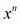分成*n*步；循环执行*n*个单独的乘法操作。如果我们能找到一种方法将问题分成两个相等的部分，问题就会分解成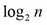步。给定`pow1(2,1024)`，`Power1`可调用对象执行了 1024 次乘以 2 的计算。我们可以将这个优化到 10 次乘法，显著提高速度。

而不是简单地乘以一个固定值，我们将使用“快速指数”算法。它使用三个计算的基本规则，如下所示：

+   如果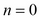：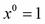，结果就是 1。

+   如果*n*为奇数且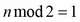，结果是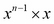。这涉及到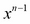的递归计算。这仍然进行了乘法，但并非真正的优化。

+   如果*n*是偶数且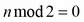，结果是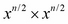。这涉及到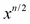的递归计算。这将乘法次数减半。

以下是递归可调用对象：

```py
class Power4( abc.Callable ):
    def __call__( self, x, n ):
        if n == 0: return 1
        elif n % 2 == 1:
            return self.__call__(x, n-1)*x
        else: # n % 2 == 0:
            t= self.__call__(x, n//2)
            return t*t

pow4= Power4()
```

我们对输入值应用了三条规则。如果*n*为零，我们将返回 1。如果*n*为奇数，我们将进行递归调用并返回。如果*n*为偶数，我们将进行递归调用并返回。

执行时间大大加快。我们可以使用`timeit`模块来查看性能上的差异。有关使用`timeit`的信息，请参阅*一些准备工作*。当我们比较运行`pow1(2,1024)`和`pow4(2,1024)` 10000 次时，我们会看到先前版本大约需要 183 秒，而这个版本只需要 8 秒。然而，我们可以通过备忘录做得更好。

以下是我们如何使用`timeit`收集性能数据：

```py
import timeit
iterative= timeit.timeit( "pow1(2,1024)","""
import collections.abc
class Power1( collections.abc.Callable ):
    def __call__( self, x, n ):
        p= 1
        for i in range(n):
            p *= x
        return p

pow1= Power1()
""", number=100000 ) # otherwise it takes 3 minutes
print( "Iterative", iterative )
```

我们导入了`timeit`模块。`timeit.timeit()`函数将在定义的上下文中评估给定的语句。在这种情况下，我们的表达式是简单的`pow1(2,1024)`表达式。这个语句的上下文是`pow1()`函数的定义；它包括导入、类定义和实例的创建。

请注意，我们提供了`number=100000`来加快速度。如果我们使用了默认值进行迭代，可能需要将近 2 分钟。

### 使用备忘录或缓存

备忘录的理念是缓存先前的结果，以避免重新计算它们。我们将使用更多的内存，但也可以通过避免计算来大大提高性能。

普通函数没有地方来缓存先前的结果。不希望函数有状态。然而，可调用对象可以有状态。它可以包括一个缓存的先前结果。

以下是我们的`Power`可调用对象的备忘录版本：

```py
class Power5( collections.abc.Callable ):
    def __init__( self ):
        self.memo = {}
    def __call__( self, x, n ):
        if (x,n) not in self.memo:
            if n == 0:
                self.memo[x,n]= 1
            elif n % 2 == 1:
                self.memo[x,n]= self.__call__(x, n-1) * x
            elif n % 2 == 0:
                t= self.__call__(x, n//2)
                self.memo[x,n]= t*t
            else:
                raise Exception("Logic Error")
        return self.memo[x,n]
pow5= Power5()
```

我们修改了我们的算法以适应`self.memo`缓存。

如果之前已经请求过的值，那么将返回该结果，不进行计算。这就是我们之前所说的巨大加速。

否则，必须计算并保存的值在备忘录缓存中。使用三条规则来计算快速指数，以获取和放置缓存中的值。这确保了未来的计算将能够利用缓存的值。

备忘录的重要性不言而喻。计算的减少可能是巨大的。通常是通过用可调用对象替换一个慢、昂贵的函数来完成的。

## 使用 functools 进行备忘录

Python 库中包括了`functools`模块中的备忘录装饰器。我们可以使用这个模块而不是创建我们自己的可调用对象。

我们可以这样使用：

```py
from functools import lru_cache
@lru_cache(None)
def pow6( x, n ):
    if n == 0: return 1
    elif n % 2 == 1:
        return pow6(x, n-1)*x
    else: # n % 2 == 0:
        t= pow6(x, n//2)
        return t*t
```

这定义了一个函数`pow6()`，它被装饰为**最近最少使用**（**LRU**）缓存。先前的请求被存储在备忘录缓存中。请求在缓存中被跟踪，并且大小是有限的。LRU 缓存的理念是最近做出的请求被保留，而最不常做出的请求则被悄悄清除。

使用`timeit`，我们可以看到`pow5()`的 10000 次迭代大约需要 1 秒，而`pow6()`的迭代大约需要 8 秒。

这也表明，`timeit`的一个微不足道的用法可能会误导记忆算法的性能。`timeit`模块的请求应该更加复杂，以反映更现实的用例，以正确地混合缓存命中和缓存未命中。简单的随机数并不总是适用于所有问题领域。

### 使用可调用的 API 来追求简单

可调用对象的背后思想是，我们有一个专注于单个方法的 API。

一些对象有多个相关方法。例如，一个二十一点`Hand`必须添加卡片并产生总数。一个二十一点`Player`必须下注，接受手牌，并做出打牌决定（例如，要牌、停牌、分牌、投保、加倍下注等）。这些是更复杂的接口，不适合作为可调用对象。

然而，赌注策略是一个可调用的候选对象。

赌注策略可以实现为几种方法（一些设置器和一个获取器方法），或者它可以是一个可调用接口，具有一些公共属性。

以下是直接的赌注策略。它总是相同的：

```py
class BettingStrategy:
    def __init__( self ):
       self.win= 0
       self.loss= 0
    def __call__( self ):
        return 1
bet=  BettingStrategy()
```

这个 API 的想法是，`Player`对象将通知赌注策略的赢得金额和损失金额。`Player`对象可能有以下方法来通知赌注策略有关结果的情况：

```py
    def win( self, amount ):
        self.bet.win += 1
        self.stake += amount
    def loss( self, amount ):
         self.bet.loss += 1
         self.stake -= amount
```

这些方法通知一个赌注策略对象（`self.bet`对象）手牌是赢还是输。当是下注的时候，`Player`将执行类似以下操作来获取当前的下注水平：

```py
    def initial_bet( self ):
        return self.bet()
```

这是一个非常简短的 API。毕竟，赌注策略除了封装一些相对简单的规则之外，并没有做太多事情。

这个接口的简短性是可调用对象的一个优雅特性。我们没有太多的方法名，也没有复杂的语法用于一个简单的事情。

## 复杂性和可调用 API

让我们看看当我们的处理变得更加复杂时，这个 API 能否经得起考验。以下是每次损失都加倍的策略（也称为**马丁尼**赌注系统）：

```py
class BettingMartingale( BettingStrategy ):
    def __init__( self ):
        self._win= 0
        self._loss= 0
        self.stage= 1
    @property
    def win(self): return self._win
    @win.setter
    def win(self, value):
        self._win = value
        self.stage= 1
    @property
    def loss(self): return self._loss
    @loss.setter
    def loss(self, value):
        self._loss = value
        self.stage *= 2
    def __call__( self ):
       return self.stage
```

每次损失都会将赌注加倍，将阶段乘以二。这将持续下去，直到我们赢得并收回我们的损失，达到桌子限制，或者破产并不能再下注。赌场通过施加桌子限制来防止这种情况。

每当我们赢得时，赌注就会重置为基本赌注。阶段被重置为一个值为一的值。

为了保持属性接口——例如`bet.win += 1`这样的代码，我们需要创建属性，以便根据赢和输正确地进行状态更改。我们只关心设置器属性，但我们必须定义获取器属性，以便清楚地创建设置器属性。

我们可以看到这个类的实际操作如下：

```py
>>> bet= BettingMartingale()
>>> bet()
1
>>> bet.win += 1
>>> bet()
1
>>> bet.loss += 1
>>> bet()
2
```

API 仍然非常简单。我们可以计算赢得次数并将赌注重置为基本赌注，或者我们可以计算损失次数，赌注将加倍。

属性的使用使得类定义变得冗长且丑陋。我们真正感兴趣的只是设置器而不是获取器，因此我们可以使用`__setattr__()`来简化类定义，如下面的代码所示：

```py
class BettingMartingale2( BettingStrategy ):
    def __init__( self ):
        self.win= 0
        self.loss= 0
        self.stage= 1
    def __setattr__( self, name, value ):
        if name == 'win':
            self.stage = 1
        elif name == 'loss':
            self.stage *= 2
        super().__setattr__( name, value )
    def __call__( self ):
       return self.stage
```

我们使用`__setattr__()`来监视对`win`和`loss`的更新。除了使用`super().__setattr__()`设置实例变量之外，我们还更新了赌注金额的内部状态。

这是一个更好看的类定义，并且保留了一个具有两个属性的简单 API 作为可调用对象。

## 管理上下文和`with`语句

上下文和上下文管理器在 Python 中的几个地方使用。我们将看一些例子来建立基本术语。

上下文由`with`语句定义。以下程序是一个小例子，它解析日志文件，创建一个有用的日志 CSV 摘要。由于有两个打开的文件，我们期望看到嵌套的`with`上下文。示例使用了一个复杂的正则表达式`format_1_pat`。我们很快就会定义这个。

我们可能会在应用程序中看到以下内容：

```py
import gzip
import csv
with open("subset.csv", "w") as target:
    wtr= csv.writer( target )
    **with gzip.open(path) as source:
        line_iter= (b.decode() for b in source)
        match_iter = (format_1_pat.match( line ) for line in line_iter)
        wtr.writerows( (m.groups() for m in match_iter if m is not None) )
```

在这个示例中强调了两个上下文和两个上下文管理器。

最外层的上下文从`with open("subset.csv", "w") as target`开始。内置的`open()`函数打开一个文件，同时也是一个上下文管理器，并将其分配给`target`变量以供进一步使用。

内部上下文从`with gzip.open(path, "r") as source`开始。这个`gzip.open()`函数的行为与`open()`函数类似，它打开一个文件，同时也是一个上下文管理器。

当`with`语句结束时，上下文退出，文件被正确关闭。即使在`with`上下文的主体中出现异常，上下文管理器的退出也将被正确处理，文件将被关闭。

### 提示

**始终在文件周围使用 with**

由于文件涉及操作系统资源，确保应用程序和操作系统之间的纠缠在不再需要时被释放是很重要的。`with`语句确保资源被正确使用。

为了完成示例，以下是用于解析 Apache HTTP 服务器日志文件的**通用日志格式**的正则表达式：

```py
import re
format_1_pat= re.compile(
    r"([\d\.]+)\s+" # digits and .'s: host
    r"(\S+)\s+"     # non-space: logname
    r"(\S+)\s+"     # non-space: user
    r"\[(.+?)\]\s+" # Everything in []: time
    r'"(.+?)"\s+'   # Everything in "": request
    r"(\d+)\s+"     # digits: status
    r"(\S+)\s+"     # non-space: bytes
    r'"(.*?)"\s+'   # Everything in "": referrer
    r'"(.*?)"\s*'   # Everything in "": user agent
)
```

在前面的示例中找到了用于前面示例中使用的各种日志格式字段。

### 使用十进制上下文

经常使用的另一个上下文是十进制上下文。这个上下文定义了`decimal.Decimal`计算的许多属性，包括用于舍入或截断值的量化规则。

我们可能会看到以下样式的应用程序编程：

```py
import decimal
PENNY=decimal.Decimal("0.00")

price= decimal.Decimal('15.99')
rate= decimal.Decimal('0.0075')
print( "Tax=", (price*rate).quantize(PENNY), "Fully=", price*rate )

with decimal.localcontext() as ctx:
    ctx.rounding= decimal.ROUND_DOWN
    tax= (price*rate).quantize(PENNY)
    print( "Tax=", tax )
```

前面的示例显示了默认上下文以及局部上下文。默认上下文具有默认的舍入规则。然而，局部上下文显示了如何通过为特定计算设置十进制舍入来确保一致的操作。

`with`语句用于确保在局部更改后恢复原始上下文。在此上下文之外，将应用默认舍入。在此上下文中，将应用特定的舍入。

### 其他上下文

还有一些其他常见的上下文。几乎所有与基本输入/输出操作相关的模块都会创建一个上下文以及类似文件的对象。

上下文还与锁定和数据库事务相关联。我们可能会获取和释放外部锁，比如信号量，或者我们可能希望数据库事务在成功提交时正确提交，或者在失败时回滚。这些都是 Python 中定义上下文的事情。

PEP 343 文档提供了`with`语句和上下文管理器可能被使用的其他一些示例。还有其他地方我们可能想要使用上下文管理器。

我们可能需要创建仅仅是上下文管理器的类，或者我们可能需要创建可以具有多种用途的类之一是作为上下文管理器。`file()`对象类似。我们将研究一些上下文的设计策略。

我们将在第八章中再次讨论这个问题，*装饰器和混入-横切面*，在那里我们可以涵盖创建具有上下文管理器功能的类的更多方法。

## 定义`__enter__()`和`__exit__()`方法

上下文管理器的定义特征是它具有两个特殊方法：`__enter__()`和`__exit__()`。这些方法由`with`语句用于进入和退出上下文。我们将使用一个简单的上下文，以便看到它们是如何工作的。

我们经常使用上下文管理器进行瞬时全局更改。这可能是对数据库事务状态或锁定状态的更改，我们希望在事务完成时撤消。

在这个示例中，我们将全局更改随机数生成器。我们将创建一个上下文，在这个上下文中，随机数生成器使用一个固定和已知的种子，提供一个固定的值序列。

以下是上下文管理器类的定义：

```py
import random
class KnownSequence:
    def __init__(self, seed=0):
        self.seed= 0
    def __enter__(self):
        self.was= random.getstate()
        random.seed(self.seed, version=1)
        return self
    def __exit__(self, exc_type, exc_value, traceback):
        random.setstate(self.was)
```

我们定义了所需的`__enter__()`和`__exit__()`方法。`__enter__()`方法将保存随机模块的先前状态，然后将种子重置为给定值。`__exit__()`方法将恢复随机数生成器的原始状态。

请注意，`__enter__()` 返回 `self`。这对于已添加到其他类定义中的**mixin**上下文管理器是常见的。我们将在第八章中讨论 mixin 的概念，*装饰器和 Mixin-横切方面*。

`__exit__()`方法的参数在正常情况下将具有`None`的值。除非我们有特定的异常处理需求，通常会忽略参数值。我们将在下面的代码中讨论异常处理。

以下是使用上下文的示例：

```py
print( tuple(random.randint(-1,36) for i in range(5)) )
with KnownSequence():
    print( tuple(random.randint(-1,36) for i in range(5)) )
print( tuple(random.randint(-1,36) for i in range(5)) )
with KnownSequence():
    print( tuple(random.randint(-1,36) for i in range(5)) )
print( tuple(random.randint(-1,36) for i in range(5)) )
```

每次我们创建`KnownSequence`的实例时，我们都会修改`random`模块的工作方式。在`with`语句的上下文中，我们将获得一系列固定的值。在上下文之外，随机种子将被恢复，我们将获得随机值。

输出通常如下所示：

```py
(12, 0, 8, 21, 6)
(23, 25, 1, 15, 31)
(6, 36, 1, 34, 8)
(23, 25, 1, 15, 31)
(9, 7, 13, 22, 29)
```

部分输出取决于机器。虽然确切的值可能有所不同，但第二行和第四行将匹配，因为种子由上下文固定。其他行不一定匹配，因为它们依赖于`random`模块自己的随机化特性。

### 处理异常

在一个块中出现的异常将传递给上下文管理器的`__exit__()`方法。异常的标准部分-类、参数和回溯堆栈-都将作为参数值提供。

`__exit__()`方法可以对异常信息执行以下两种操作之一：

+   通过返回一些`True`值来消除异常。

+   通过返回任何其他`False`值来允许异常正常上升。返回什么也不同于返回`None`，这是一个`False`值；这允许异常传播。

异常也可以用于更改上下文管理器在退出时的操作。例如，我们可能必须对可能出现的某些类型的 OS 错误进行特殊处理。

## 上下文管理器作为工厂

我们可以创建一个上下文管理器类，它是应用程序对象的工厂。这使我们在不使应用程序类混杂上下文管理特性的情况下，愉快地分离设计考虑。

假设我们想要一个确定性的用于 21 点的`Deck`。这并不像听起来那么有用。对于单元测试，我们将需要一个完全模拟的具有特定卡片序列的牌组。这样做的好处是上下文管理器可以与我们已经看到的类一起使用。

我们将扩展之前显示的简单上下文管理器，以创建一个可以在`with`语句上下文中使用的`Deck`。

以下是一个工厂`Deck`并调整`random`模块的类：

```py
class Deterministic_Deck:
    def __init__( self, *args, **kw ):
        self.args= args
        self.kw= kw
    def __enter__( self ):
        self.was= random.getstate()
        random.seed( 0, version=1 )
        return Deck( *self.args, **self.kw )
    def __exit__( self, exc_type, exc_value, traceback ):
        random.setstate( self.was )
```

前面的上下文管理器类保留参数值，以便它可以使用给定的参数创建一个`Deck`。

`__enter__()`方法保留了旧的随机数状态，然后设置了`random`模块的模式，以提供一系列固定的值。这用于构建和洗牌牌组。

请注意，`__enter__()`方法返回一个新创建的`Deck`对象，以便在`with`语句上下文中使用。这是通过`with`语句中的`as`子句分配的。

我们也可以以另一种方式提供类似的功能。我们可以在`Deck`类中创建`random.Random(x=seed)`的实例。虽然这也很有效，但它倾向于使`Deck`类混杂了仅用于演示的代码。

以下是使用此工厂上下文管理器的方法：

```py
with Deterministic_Deck( size=6 ) as deck:
    h = Hand( deck.pop(), deck.pop(), deck.pop() )
```

上面的代码示例保证了我们可以用于演示目的的特定顺序的卡片。

### 在上下文管理器中清理

在本节中，我们将讨论一个更复杂的上下文管理器，在出现问题时尝试进行一些清理。

这解决了我们想要保存正在重写的文件的备份副本的常见问题。我们希望能够做类似以下的事情：

```py
with Updating( "some_file" ):
    with open( "some_file", "w" ) as target:
        process( target )
```

意图是将原始文件重命名为`some_file copy`。如果上下文正常工作——没有异常——那么备份副本可以被删除或重命名为`some_file old`。

如果上下文不能正常工作——有一个异常——我们希望将新文件重命名为`some_file error`，并将旧文件重命名为`some_file`，将原始文件放回异常发生之前的状态。

我们将需要一个如下的上下文管理器：

```py
import os
class Updating:
    def __init__( self, filename ):
        self.filename= filename
    def __enter__( self ):
        try:
            self.previous= self.filename+" copy"
            os.rename( self.filename, self.previous )
        except FileNotFoundError:
            # Never existed, no previous copy
            self.previous= None
    def __exit__( self, exc_type, exc_value, traceback ):
        if exc_type is not None:
            try:
                os.rename( self.filename, self.filename+ " error" )
            except FileNotFoundError:
                pass # Never even got created?
            if self.previous:
                os.rename( self.previous, self.filename )
```

这个上下文管理器的`__enter__()`方法将尝试保留已命名文件的先前副本。如果它不存在，就没有什么可以保留的了。

`__exit__()`方法将提供有关上下文中发生的任何异常的信息。如果没有异常，它将简单地返回任何先前存在的文件，保留了在上下文中创建的文件也将存在。如果有异常，那么`__exit__()`方法将尝试保留输出（带有后缀"error"）以进行调试，它还将把文件的任何先前版本放回原位。

这在功能上等同于`try-except-finally`块。但它的优势在于它将相关的应用处理与上下文管理分开。应用处理写在`with`语句中。上下文问题被放到一个单独的类中。

## 总结

我们看了类定义的三个特殊方法。`__call__()`方法用于创建可调用对象。可调用对象用于创建有状态的函数。我们的主要示例是一个记忆化先前结果的函数。

`__enter__()`和`__exit__()`方法用于创建上下文管理器。上下文用于处理局部化到 with 语句体中的处理。我们的大多数示例包括输入输出处理。然而，Python 提供了许多其他情况，其中局部上下文可能会派上用场。将重点放在创建容器和集合上。

### 可调用设计考虑和权衡

在设计可调用对象时，我们需要考虑以下事项：

+   第一个是对象的 API。如果对象需要具有类似函数的接口，那么可调用对象是一个明智的设计方法。使用`collections.abc.Callable`确保可调用 API 被正确构建，并且它告诉任何阅读代码的人类的意图是什么。

+   第二个是函数的状态性。Python 中的普通函数没有滞后性——没有保存的状态。然而，可调用对象可以轻松保存状态。记忆化设计模式很好地利用了有状态的可调用对象。

可调用对象的唯一缺点是所需的语法量。普通函数定义更短，因此更不容易出错，更容易阅读。

将已定义的函数迁移到可调用对象很容易，如下所示：

```py
def x(args):
    body
```

前面的函数可以转换为以下可调用对象：

```py
class X(collections.abc.callable):
    def __call__(self, args):
        body
x= X()
```

这是在新形式中使函数通过单元测试所需的最小更改集。现有的主体将在新上下文中不经修改地工作。

一旦更改完成，就可以向可调用对象的函数版本添加功能。

### 上下文管理器设计考虑和权衡

上下文通常用于获取/释放、打开/关闭和锁定/解锁类型的操作对。大多数示例与文件 I/O 相关，Python 中的大多数类似文件的对象已经是适当的上下文管理器。

几乎总是需要上下文管理器来处理任何具有包围基本处理步骤的东西。特别是，任何需要最终`close()`方法的东西都应该被上下文管理器包装。

一些 Python 库具有打开/关闭操作，但对象不是适当的上下文。例如，`shelve`模块并不创建适当的上下文。

我们可以（也应该）在`shelve`文件上使用`contextllib.closing()`上下文。我们将在第九章中展示这一点，*序列化和保存 - JSON，YAML，Pickle，CSV 和 XML*。

对于我们自己的需要`close()`方法的类，我们可以使用`closing()`函数。当面对具有任何类型获取/释放生命周期的类时，我们希望在`__init__()`或类级`open()`方法中获取资源，并在`close()`中释放资源。这样，我们的类就可以很好地与这个`closing()`函数集成。

以下是一个需要`close()`函数的类的示例：

```py
with contextlib.closing( MyClass() ) as my_object:
    process( my_object )
```

`contextllib.closing()`函数将调用作为参数给定的对象的`close()`方法。我们可以保证`my_object`将评估其`close()`方法。

### 展望未来

在接下来的两章中，我们将研究用于创建容器和数字的特殊方法。在第六章中，*创建容器和集合*，我们将研究标准库中的容器和集合。我们还将研究构建一种独特的新类型的容器。在第七章中，*创建数字*，我们将研究各种数字类型以及如何创建我们自己的数字类型。

# 第六章：创建容器和集合

我们可以扩展多个 ABC 来创建新类型的集合。ABC 为我们提供了扩展内置容器的设计指南。这些允许我们微调特性或根本定义更精确地适应我们问题域的新数据结构。

我们将研究容器类的 ABC 基础知识。有相当多的抽象用于组装 Python 内置类型，如`list`，`tuple`，`dict`，`set`和`frozenset`。

我们将回顾涉及成为容器并提供各种容器特性的各种特殊方法。我们将这些分为核心容器方法，与更专门的序列，映射和集合方法分开。

我们将讨论扩展内置容器以添加特性。我们还将研究包装内置容器并通过包装器委托方法到底层容器。

最后，我们将研究构建全新的容器。这是一个具有挑战性的领域，因为 Python 标准库中已经存在着大量有趣和有用的集合算法。为了避免深入的计算机科学研究，我们将构建一个相当无聊的集合。在开始真正的应用程序之前，有必要仔细研究 Cormen，Leiserson，Rivest 和 Stein 的《算法导论》。

最后，我们将总结一些设计考虑因素，这些因素涉及扩展或创建新集合。

## 集合的 ABC

`collections.abc`模块提供了丰富的抽象基类，将集合分解为多个离散的特性集。

我们可以成功地使用`list`类，而不需要深入思考各种特性以及它们与`set`类或`dict`类的关系。然而，一旦我们开始研究 ABC，我们就可以看到这些类有一些微妙之处。通过分解每个集合的方面，我们可以看到重叠的领域，这些领域表现为即使在不同的数据结构之间也有一种优雅的多态性。

在基类的底部有一些“一招鲜”的定义。这些是需要一个特殊方法的基类：

+   `Container`基类要求具体类实现`__contains__()`方法。这个特殊方法实现了`in`运算符。

+   `Iterable`基类需要`__iter__()`。这个特殊方法被`for`语句和生成器表达式以及`iter()`函数使用。

+   `Sized`基类需要`__len__()`。这个方法被`len()`函数使用。实现`__bool__()`也是明智的，但这不是这个抽象基类所要求的。

+   `Hashable`基类需要`__hash__()`。这是`hash()`函数使用的。如果实现了这个方法，这意味着对象是不可变的。

这些抽象类都用于构建我们应用程序中可以使用的更高级别的、复合的结构的定义。这些复合结构包括`Sized`、`Iterable`和`Container`的较低级别基类。以下是我们可能在应用程序中使用的一些复合基类：

+   `Sequence`和`MutableSequence`类基于基础并折叠方法，如`index()`、`count()`、`reverse()`、`extend()`和`remove()`。

+   `Mapping`和`MutableMapping`类折叠方法，如`keys()`、`items()`、`values()`和`get()`，等等。

+   `Set`和`MutableSet`类比较和算术运算符来执行集合操作。

如果我们更深入地研究内置集合，我们可以看到 ABC 类定义如何组织我们需要编写或修改的特殊方法。

## 特殊方法的例子

当查看一个黑杰克`Hand`对象时，我们对包含有一个有趣的特殊情况。我们经常想知道手中是否有一张王牌。如果我们将`Hand`定义为`list`的扩展，那么我们不能要求一个通用的王牌。我们只能要求特定的卡片。我们不想写这样的东西：

```py
any( card(1,suit) for suit in Suits )
```

这似乎是一个冗长的寻找一手牌中的王牌的方式。

这是一个更好的例子，但可能仍然不太理想：

```py
any( c.rank == 'A' for c in hand.cards )
```

所以，我们想要这样的东西：

```py
'A' in hand.cards
```

这意味着我们正在修改`Hand`对象对`list`的“包含”含义。我们不是在寻找一个`Card`实例，我们只是在寻找`Card`对象的等级属性。我们可以重写`__contains__()`方法来实现这一点：

```py
def __contains__( self, rank ):
    return any( c.rank==rank for rank in hand.cards )
```

这使我们可以在手中对给定等级进行更简单的`in`测试。

类似的设计考虑可以应用于`__iter__()`和`__len__()`特殊方法。但是要小心。改变`len()`的语义或集合与`for`语句的交互方式可能是灾难性的。

## 使用标准库扩展

我们将看一些已经是标准库一部分的内置类的扩展。这些是扩展或修改内置集合的集合。这些大多数在《Python 3 面向对象编程》等书籍中以一种形式或另一种形式进行了讨论。

我们将看一下以下六个库集合：

+   `namedtuple()`函数创建具有命名属性的元组子类。我们可以使用这个来代替定义一个完整的类，仅仅为属性值分配名称。

+   `deque`（注意不寻常的拼写）是一个双端队列，一个类似列表的集合，可以在任一端执行快速的附加和弹出操作。这个类的一部分特性将创建单端堆栈或队列。

+   在某些情况下，我们可以使用`ChainMap`来代替合并映射。这是多个映射的视图。

+   `OrderedDict`集合是一个维护原始键入顺序的映射。

+   `defaultdict`（注意不寻常的拼写）是一个`dict`子类，它使用一个工厂函数来为缺失的键提供值。

+   `Counter`是一个`dict`子类，可用于计算对象以创建频率表。但实际上，它是一种称为**multiset**或**bag**的更复杂的数据结构。

我们将看到前述每个集合的示例。从研究库集合中可以学到两个重要的教训：

+   已经存在且不需要重新发明的东西

+   如何扩展 ABCs 以向语言添加有趣和有用的结构

此外，阅读库的源代码很重要。源代码将展示给我们许多 Python 面向对象编程技术。除了这些基础知识外，还有更多的模块。它们如下：

+   `heapq`模块是一组函数，它在现有的`list`对象上施加了一个堆队列结构。堆队列不变式是在堆中维护的那些项目的集合，以便允许按升序快速检索。如果我们在`list`结构上使用`heapq`方法，我们将永远不必显式对列表进行排序。这可能会带来显著的性能改进。

+   `array`模块是一种为某些类型的值优化存储的序列。这为潜在的大量简单值提供了类似列表的功能。

此外，当然还有支持这些各种数据结构定义的更深层次的计算机科学。

### namedtuple()函数

`namedtuple()`函数从提供的参数创建一个新的类定义。这将有一个类名、字段名和一对可选关键字，用于定义所创建类的行为。

使用`namedtuple()`将类定义压缩成一个非常简短的简单不可变对象的定义。它使我们不必为了常见情况下想要命名一组固定属性而编写更长更复杂的类定义。

对于像扑克牌这样的东西，我们可能希望在类定义中插入以下代码：

```py
from collections import namedtuple
BlackjackCard = namedtuple('BlackjackCard','rank,suit,hard,soft')
```

我们定义了一个新类，并提供了四个命名属性：`rank`、`suit`、`hard`和`soft`。由于这些对象都是不可变的，我们不必担心一个行为不端的应用程序试图更改`BlackjackCard`实例的等级。

我们可以使用工厂函数来创建这个类的实例，如下面的代码所示：

```py
def card( rank, suit ):
    if rank == 1:
        return BlackjackCard( 'A', suit, 1, 11 )
    elif 2 <= rank < 11:
        return BlackjackCard( str(rank), suit, rank, rank )
    elif rank == 11:
        return BlackjackCard( 'J', suit, 10, 10 )
    elif rank == 12:
        return BlackjackCard( 'Q', suit, 10, 10 )
    elif rank == 13:
        return BlackjackCard( 'K', suit, 10, 10 )
```

这将使用正确设置硬和软总数的各种卡等级构建一个`BlackjackCard`实例。通过填写一个`tuple`子类的模板来创建一个名为`namedtuple`的新类，基本上，模板从这种代码开始：

```py
class TheNamedTuple(tuple):
    __slots__ = ()
    _fields = {field_names!r}
    def __new__(_cls, {arg_list}):
        return _tuple.__new__(_cls, ({arg_list}))
```

模板代码扩展了内置的`tuple`类。没有什么令人惊讶的。

它将`__slots__`设置为空元组。管理实例变量有两种方法：`__slots__`和`__dict__`。通过设置`__slots__`，禁用了`__dict__`的替代方案，从而无法向该类的对象添加新的实例变量。此外，生成的对象保持在绝对最小的大小。

模板创建了一个名为`_fields`的类级变量，用于命名字段。`{field_names!r}`构造是模板文本填充了字段名列表的地方。

模板定义了一个`__new__()`方法，用于初始化不可变对象。`{arg_list}`构造是模板填充了用于构建每个实例的参数列表的地方。

还有其他几个方法函数，但这提供了一些关于`namedtuple`函数在幕后工作的提示。

当然，我们可以对`namedtuple`类进行子类化以添加功能。但是，我们必须谨慎尝试向`namedtuple`类添加属性。属性列表被编码在`_fields`中，以及`__new__()`的参数。

以下是一个对`namedtuple`类进行子类化的示例：

```py
BlackjackCard = namedtuple('BlackjackCard','rank,suit,hard,soft')
class AceCard( BlackjackCard ):
    __slots__ = ()
    def __new__( self, rank, suit ):
        return super().__new__( AceCard, 'A', suit, 1, 11 )
```

我们使用`__slots__`来确保子类没有`__dict__`；我们不能添加任何新属性。我们重写了`__new__()`，这样我们就可以用只有两个值（`rank`和`suit`）构建实例，但是填充所有四个值。

### deque 类

`list`对象旨在为容器中的任何元素提供统一的性能。某些操作会有性能惩罚。特别是，列表前端的任何操作（`list.insert(0, item)`或`list.pop(0)`）会产生一些开销，因为列表大小发生了变化，每个元素的位置也发生了变化。

`deque`——双端队列——旨在为列表的第一个和最后一个元素提供统一的性能。其设计思想是，追加和弹出的速度将比内置的`list`对象更快。

### 提示

**拼写不规范**

类名通常采用标题大小写。然而，`deque`类不是。

我们为一副牌的设计避免了`list`对象的潜在性能陷阱，始终从末尾弹出，而不是从开头弹出。

然而，由于我们几乎没有使用`list`对象的特性，也许像 deque 这样的结构更适合我们的问题。我们只存储卡片，以便可以对其进行洗牌和弹出。除了洗牌之外，我们的应用程序从不通过它们的索引位置引用列表中的元素。

虽然`deque.pop()`方法可能非常快，但洗牌可能会受到影响。洗牌将对容器进行随机访问，这是 deque 不设计的功能。

为了确认潜在的成本，我们可以使用`timeit`来比较`list`和`deque`的洗牌性能，如下所示：

```py
>>> timeit.timeit('random.shuffle(x)',"""
... import random
... x=list(range(6*52))""")
597.951664149994
>>>
>>> timeit.timeit('random.shuffle(d)',"""
... from collections import deque
... import random
... d=deque(range(6*52))""")      
609.9636979339994
```

我们使用`random.shuffle()`调用了`timeit`。一个在`list`对象上工作，另一个在 deque 上工作。

这些结果表明，洗牌 deque 只比洗牌`list`对象慢一点点——大约慢 2%。这种区别微乎其微。我们可以有信心地尝试用`deque`对象替换`list`。

这种变化的意义在于：

```py
from collections import dequeue
class Deck(dequeue):
    def __init__( self, size=1 ):
        super().__init__()
        for d in range(size):
           cards = [ card(r,s) for r in range(13) for s in Suits ]
            super().extend( cards )
        random.shuffle( self )
```

我们在`Deck`的定义中用`deque`替换了`list`。否则，该类是相同的。

实际的性能差异是什么？让我们创建 10 万张卡片的牌组并发牌：

```py
>>> timeit.timeit('x.pop()', "x=list(range(100000))", number=100000)
0.032304395994287916
>>> timeit.timeit('x.pop()', "from collections import deque; x=deque(range(100000))", number=100000)
0.013504189992090687
```

我们使用`x.pop()`调用了`timeit`。一个在`list`上工作，另一个在 deque 上工作。

发牌时间几乎减少了一半（实际上是 42%）。我们从数据结构的微小变化中获得了巨大的节省。

总的来说，选择最佳的数据结构对应用程序很重要。尝试几种变体可以向我们展示什么更有效。

### ChainMap 的用例

将地图链接在一起的用例与 Python 的本地与全局定义概念很好地契合。当我们在 Python 中使用一个变量时，首先搜索本地命名空间，然后搜索全局命名空间，按照这个顺序。除了在两个命名空间中搜索变量之外，设置变量在本地命名空间中进行，而不会影响全局命名空间。这种默认行为（没有`global`或`nonlocal`语句）也是`ChainMap`的工作原理。

当我们的应用程序开始运行时，我们经常有来自命令行参数、配置文件、操作系统环境变量以及可能的全局设置的属性。我们希望将这些合并成一个类似字典的结构，以便我们可以轻松地找到一个设置。

我们可能有一个应用程序启动，将几个配置选项的来源组合在一起，例如：

```py
import argparse
import json
import os
parser = argparse.ArgumentParser(description='Process some integers.')
parser.add_argument( "-c", "--configuration", type=open, nargs='?')
parser.add_argument( "-p", "--playerclass", type=str, nargs='?', default="Simple" )
cmdline= parser.parse_args('-p Aggressive'.split())

if cmdline.configuration:
    config_file= json.load( options.configuration )
    options.configuration.close()
else:
    config_file= {}

with open("defaults.json") as installation:
    defaults= json.load( installation )
# Might want to check ~/defaults.json and /etc/thisapp/defaults.json, also.

from collections import ChainMap
options = ChainMap(vars(cmdline), config_file, os.environ, defaults)
```

前面的代码向我们展示了来自多个来源的配置，例如以下内容：

+   命令行参数。我们看到一个名为`playerclass`的令牌参数，但通常还有许多其他参数。

+   其中一个参数`configuration`是配置文件的名称，其中包含额外的参数。预计这是以 JSON 格式，读取文件内容。

+   另外，还有一个`defaults.json`文件，可以查找配置值的另一个地方。

从前面的来源中，我们可以构建一个单一的`ChainMap`对象用例，允许在列出的每个位置中查找参数。`ChainMap`实例用例将按顺序搜索每个映射，寻找给定值。这为我们提供了一个整洁、易于使用的运行时选项和参数来源。

我们将在第十三章 *配置文件和持久性* 中再次讨论这个问题，以及第十六章 *应对命令行*。

### 有序字典集合

`OrderedDict`集合类巧妙地利用了两种存储结构。有一个底层的`dict`对象类型，将键映射到值。此外，还有一个维护插入顺序的键的双向链表。

`OrderedDict`的一个常见用途是处理 HTML 或 XML 文件，其中对象的顺序必须保留，但对象可能通过 ID 和 IDREF 属性具有交叉引用。我们可以通过使用 ID 作为字典键来优化对象之间的连接。我们可以使用`OrderedDict`结构保留源文档的顺序。

我们不想在这里过多地深入 XML 解析。这是第九章的主题，*序列化和保存 - JSON、YAML、Pickle、CSV 和 XML*。

考虑一个 XML 文档的简短示例，其中有几个索引之间的引用网络相当复杂。我们将想象一个简单的微博文档，其中有按顺序排列的条目，这些条目具有 ID，索引具有对原始条目的 IDREFs。

我们将 XML 分成两部分：

```py
<blog>
    <topics> … </topics> <indices> … </indices>
</blog>
```

将有一个关于主题的部分，另一个关于索引的部分。这是博客的主题部分：

```py
    <topics>
        <entry ID="UUID98766"><title>first</title><body>more words</body></entry>
        <entry ID="UUID86543"><title>second</title><body>words</body></entry>
        <entry ID="UUID64319"><title>third</title><body>text</body></entry>
    </topics>
```

每个主题都有一系列条目。每个条目都有一个唯一的 ID。我们暗示它们可能属于**通用唯一标识符**（**UUID**），但我们没有提供实际的例子。

这是博客的一个索引：

```py
    <indices>
        <bytag>
            <tag text="#sometag">
                <entry IDREF="UUID98766"/>
                <entry IDREF="UUID86543"/>
            </tag>
            <tag text="#anothertag">
                <entry IDREF="UUID98766"/>
                <entry IDREF="UUID64319/>

            </tag>
        </bytag>
    </indices>
```

一个索引按标签呈现博客条目。我们可以看到每个标签都有一个条目列表。每个条目都有对原始微博条目的引用。

当我们解析这个 XML 文档时，我们需要保持主题的原始顺序。但是，我们还必须跟踪每个条目的 ID 作为键。

这是一个技术性的尖峰，将解析文档并构建一个`OrderedDict`集合：

```py
from collections import OrderedDict
import xml.etree.ElementTree as etree

doc= etree.XML( source ) # **Parse

topics= OrderedDict() # **Gather
for topic in doc.findall( "topics/entry" ):
    topics[topic.attrib['ID']] = topic

for topic in topics: # **Display
    print( topic, topics[topic].find("title").text )
```

第一部分`# Parse`将解析 XML 源文档，创建一个`ElementTree`对象。

第二部分`# Gather`将遍历 XML 文档中主题部分的条目。每个主题都按 ID 加载到一个主题的`OrderedDict`集合中。原始顺序保留，以便可以按正确的顺序呈现材料。

最后一部分`# Display`向我们展示了条目的原始顺序和它们的 ID。

### `defaultdict`子类

普通的`dict`类型在找不到键时会抛出异常。`defaultdict`集合类会评估给定的函数，并将该函数的值插入字典中。

### 提示

**请注意拼写不规则**

类名通常是 TitleCase。但是，`defaultdict`类不是。

`defaultdict`类的一个常见用例是为对象创建索引。当几个对象具有共同的键时，我们可以创建共享此键的对象列表。

这是一个技术性尖峰的一部分，向我们展示了如何累积由庄家明牌索引的结果列表：

```py
outcomes = defaultdict(list)
self.play_hand( table, hand )
outcome= self.get_payout()
outcomes[hand.dealer_card.rank].append(outcome)
```

`outcomes[rank]`的每个值将是模拟支付的列表。我们可以对这些进行平均或总结，以总结支付。我们可以计算赢得与损失的次数，或执行其他定量分析，以确定最小化损失和最大化赢利的游戏策略。

在某些情况下，我们可能希望使用`defaultdict`集合类来提供一个常量值。我们希望写`container[key]`而不是写`container.get(key,"N/A")`，如果找不到键，则提供字符串常量值`"N/A"`。这样做的困难在于，`defaultdict`类是使用零参数函数创建默认值的。我们不能轻易使用一个常量。

我们可以创建一个零参数的`lambda`对象。这非常好用。下面是一个例子：

```py
>>> from collections import defaultdict
>>> messages = defaultdict( lambda: "N/A" )
>>> messages['error1']= 'Full Error Text'
>>> messages['other']
'N/A'
```

默认值被返回，并且键（在这个例子中是`'other'`）被添加到字典中。我们可以通过查找所有值为`"N/A"`的键来确定输入了多少个新值：

```py
>>> [k for k in messages if messages[k] == "N/A"]
['other']
```

正如您在前面的输出中看到的，我们找到了被分配默认值`"N/A"`的键。这通常是正在累积的数据的一个有用的摘要。它向我们展示了所有与默认值相关联的键。

### 计数集合

`defaultdict`类最常见的用例之一是在累积事件计数时。我们可能会编写类似这样的代码：

```py
frequency = defaultdict(int)
for k in some_iterator():
    frequency[k] += 1
```

我们正在计算每个键值`k`在`some_iterator()`值序列中出现的次数。

这种用例是如此常见，以至于`defaultdict`主题有一个变体执行与前面代码中显示的相同操作的`Counter`。然而，`Counter`集合比简单的`defaultdict`类要复杂得多。考虑确定最常见值的附加用例，统计学家称之为**模式**。

我们需要重新构造`defaultdict`对象中的值以找到模式。这并不困难，但可能会让人恼火，因为这是一个样板代码。它看起来像这样：

```py
by_value = defaultdict(list)
for k in frequency:
    by_value[ frequency[k] ].append(k)
```

我们创建了第二个字典。这个新的`by_value`字典的键是频率值。每个键与出现此频率的所有原始`some_iterator()`值相关联。

然后，我们可以使用以下处理来定位并按出现频率的顺序显示最常见的值：

```py
for freq in sorted(by_value, reverse=True):
    print( by_value[freq], freq )
```

这将创建一种频率直方图，显示具有给定频率的键值列表和所有这些键值共享的频率计数。

所有这些特性已经是`Counter`集合的一部分。下面是一个例子，从某些数据源创建一个频率直方图：

```py
from collections import Counter
frequency = Counter(some_iterator())
for k,freq in frequency.most_common():
    print( k, freq )
```

这个例子向我们展示了如何通过向`Counter`提供任何可迭代的项目来轻松收集统计数据。它将收集该可迭代项目中值的频率数据。在这种情况下，我们提供了一个名为`some_iterator()`的可迭代函数。我们可能提供了一个序列或其他集合。

然后，我们可以按照受欢迎程度的降序显示结果。但等等！这还不是全部。

`Counter`集合不仅仅是`defaultdict`集合的简单变体。这个名字是误导的。`Counter`对象实际上是一个"多重集"，有时被称为"袋子"。

它是一个类似集合的集合，但允许袋子中的值重复。它不是一个由索引或位置标识的序列；顺序并不重要。它不是一个具有键和值的映射。它就像一个集合，其中的项代表它们自己，顺序并不重要。但它不像一个集合，因为在这种情况下，元素可以重复。

由于元素可以重复，`Counter`对象用整数计数表示多次出现。因此，它被用作频率表。但它不仅仅是这样。由于一个袋子就像一个集合，我们可以比较两个袋子的元素来创建一个并集或交集。

让我们创建两个袋子：

```py
>>> bag1= Counter("aardwolves")
>>> bag2= Counter("zymologies")
>>> bag1
Counter({'a': 2, 'o': 1, 'l': 1, 'w': 1, 'v': 1, 'e': 1, 'd': 1, 's': 1, 'r': 1})
>>> bag2
Counter({'o': 2, 'm': 1, 'l': 1, 'z': 1, 'y': 1, 'g': 1, 'i': 1, 'e': 1, 's': 1})
```

我们通过检查一系列字母来构建每个袋子。对于出现多次的字符，有一个大于一的计数。

我们可以轻松地计算两个袋子的并集：

```py
>>> bag1+bag2
Counter({'o': 3, 's': 2, 'l': 2, 'e': 2, 'a': 2, 'z': 1, 'y': 1, 'w': 1, 'v': 1, 'r': 1, 'm': 1, 'i': 1, 'g': 1, 'd': 1})
```

这向我们展示了两个字符串之间的整套字母。`o`有三个实例。毫不奇怪，其他字母不那么受欢迎。

我们也可以轻松地计算两个袋子之间的差异：

```py
>>> bag1-bag2
Counter({'a': 2, 'w': 1, 'v': 1, 'd': 1, 'r': 1})
>>> bag2-bag1
Counter({'o': 1, 'm': 1, 'z': 1, 'y': 1, 'g': 1, 'i': 1})
```

第一个表达式向我们展示了`bag1`中不在`bag2`中的字符。

第二个表达式向我们展示了`bag2`中不在`bag1`中的字符。请注意，字母`o`在`bag2`中出现了两次，在`bag1`中出现了一次。差异只移除了`bag1`中的一个`o`字符。

## 创建新类型的集合

我们将看一下我们可能对 Python 内置容器类进行的一些扩展。尽管我们不会展示扩展每个容器的例子。如果这样做，这本书的大小将变得不可控。

我们将选择一个扩展特定容器的例子，并看看这个过程是如何工作的：

1.  定义需求。这可能包括在维基百科上进行研究，通常从这里开始：[`en.wikipedia.org/wiki/Data_structure`](http://en.wikipedia.org/wiki/Data_structure)。数据结构的设计可能会很复杂，因为通常存在复杂的边缘情况。

1.  如果必要，查看`collections.abc`模块，看看必须实现哪些方法来创建新的功能。

1.  创建一些测试案例。这也需要仔细研究算法，以确保边缘情况得到适当的覆盖。

1.  代码。

我们需要强调在尝试发明新类型的数据结构之前，研究基础知识的重要性。除了搜索网络上的概述和摘要外，还需要详细信息。参见 Cormen、Leiserson、Rivest 和 Stein 的《算法导论》，或 Aho、Ullman 和 Hopcroft 的《数据结构与算法》，或 Steven Skiena 的《算法设计手册》。

正如我们之前看到的，ABCs 定义了三种广义的集合：序列、映射和集合。我们有三种设计策略可以用来创建我们自己的新类型的集合：

+   **扩展**：这是一个现有的序列。

+   **包装**：这是一个现有的序列。

+   **发明**：这是一个全新的序列。

原则上，我们可以给出多达九个例子——每种基本类型的集合与每种基本设计策略。我们不会像那样过分强调这个主题。我们将深入研究如何创建新类型的序列，学习如何扩展和包装现有序列。

由于有许多扩展映射（如`ChainMap`、`OrderedDict`、`defaultdict`和`Counter`），我们只会轻轻地涉及创建新类型的映射。我们还将深入研究创建一种新类型的有序多重集或袋子。

## 定义一种新类型的序列

进行统计分析时的一个常见要求是对一组数据进行基本均值、众数和标准偏差的计算。我们的二十一点模拟将产生必须进行统计分析的结果，以查看我们是否真的发明了更好的策略。

当我们模拟一种玩牌策略时，我们应该得到一些结果数据，这些数据将是一系列数字，显示了使用给定策略玩一系列手牌的最终结果。游戏速度从拥挤的桌子上每小时 50 手到独自与庄家时每小时 200 手不等。我们将假设 200 手相当于二小时的二十一点，然后需要休息一下。

我们可以将结果累积到内置的`list`类中。我们可以通过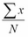来计算均值，其中 N 是*x*中的元素数：

```py
def mean( outcomes ):
    return sum(outcomes)/len(outcomes)
```

标准偏差可以通过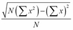来计算：

```py
def stdev( outcomes ):
    n= len(outcomes)
    return math.sqrt( n*sum(x**2 for x in outcomes)-sum(outcomes)**2 )/n
```

这两个都是相对简单的计算函数，易于使用。然而，随着事情变得更加复杂，这些松散的函数变得不那么有用。面向对象编程的好处之一是将功能与数据绑定在一起。

我们的第一个示例不涉及重写`list`的任何特殊方法。我们只需对`list`进行子类化，以添加将计算统计信息的方法。这是一种非常常见的扩展。

我们将在第二个示例中重新审视这一点，以便我们可以修改和扩展特殊方法。这将需要对 ABC 特殊方法进行一些研究，以查看我们需要添加或修改什么，以便我们的新列表子类正确继承内置的`list`类的所有特性。

因为我们正在研究序列，所以我们还必须处理 Python 的`slice`表示法。我们将在*使用`__getitem__`、`__setitem__`、`__delitem__`和切片*部分中查看切片是什么以及它是如何在内部工作的。

第二个重要的设计策略是包装。我们将在列表周围创建一个包装器，并看看如何将方法委托给包装的列表。在对象持久性方面，包装具有一些优势，这是第九章的主题，*序列化和保存–JSON、YAML、Pickle、CSV 和 XML*。

我们还可以看看需要从头开始发明新类型序列的事情。

### 统计列表

将均值和标准偏差特性直接合并到`list`的子类中是很有意义的。我们可以这样扩展`list`：

```py
class Statslist(list):
    @property
    def mean(self):
        return sum(self)/len(self)
    @property
    def stdev(self):
        n= len(self)
        return math.sqrt( n*sum(x**2 for x in self)-sum(self)**2 )/n
```

通过对内置的`list`类进行这种简单扩展，我们可以相对轻松地累积数据并报告统计信息。

我们可以想象一个整体的模拟脚本，看起来像这样。

```py
for s in SomePlayStrategy, SomeOtherStrategy:
    sim = Simulator( s, SimpleBet() )
    data = sim.run( hands=200 )
    print( s.__class__.__name__, data.mean, data.stdev )
```

### 选择急切计算与懒惰计算

请注意，我们的计算是懒惰的；它们只在被请求时才执行。这也意味着每次请求时都会执行它们。这可能是一个相当大的开销，取决于这些类的对象在哪种上下文中使用。

将这些统计摘要转换为急切计算实际上是明智的，因为我们知道何时从列表中添加和删除元素。尽管需要更多的编程来创建这些函数的急切版本，但在累积大量数据时，它会提高性能。

急切统计计算的重点是避免计算总和的循环。如果我们急切地计算总和，那么在创建列表时，我们就避免了对数据的额外循环。

当我们查看`Sequence`类的特殊方法时，我们可以看到数据被添加到、从序列中移除和修改的所有地方。我们可以使用这些信息来重新计算所涉及的两个总和。我们从*Python 标准库*文档的`collections.abc`部分开始，8.4.1 节在[`docs.python.org/3.4/library/collections.abc.html#collections-abstract-base-classes`](http://docs.python.org/3.4/library/collections.abc.html#collections-abstract-base-classes)。

以下是`MutableSequence`类所需的方法：`__getitem__`、`__setitem__`、`__delitem__`、`__len__`、`insert`、`append`、`reverse`、`extend`、`pop`、`remove`和`__iadd__`。文档还提到了**继承的序列方法**。但是，由于这些方法适用于不可变序列，我们当然可以忽略它们。

以下是每种方法必须完成的详细信息：

+   `__getitem__`：没有任何变化，因为状态没有改变。

+   `__setitem__`：这会改变一个项目。我们需要从每个总和中取出旧项目，并将新项目折叠到每个总和中。

+   `__delitem__`：这会移除一个项目。我们需要从每个总和中取出旧项目。

+   `__len__`：这里也没有任何变化，因为状态没有改变。

+   `insert`：由于这会添加一个新项目，我们需要将其折叠到每个总和中。

+   `append`：由于这也添加了一个新项目，我们需要将其折叠到每个总和中。

+   `reverse`：这里也没有任何变化，因为均值或标准偏差的状态没有改变。

+   `extend`：这会添加许多新项目，例如`__init__`，因此我们需要在扩展列表之前处理每个项目。

+   `pop`：这将移除一个项目。我们需要从每个总和中取出旧项目。

+   `remove`：这也移除一个项目。我们需要从每个总和中取出旧项目。

+   `__iadd__`：这是`+=`增强赋值语句，就地加法。它实际上与`extend`关键字相同。

我们不会详细查看每个方法，因为实际上只有两种用例：

+   折叠一个新值

+   移除一个旧值

替换情况是移除和折叠操作的组合。

这是一个急切`StatsList`类的元素。我们将只看到`insert`和`pop`：

```py
class StatsList2(list):
    """Eager Stats."""
    def __init__( self, *args, **kw ):
        self.sum0 = 0 # len(self)
        self.sum1 = 0 # sum(self)
        self.sum2 = 0 # sum(x**2 for x in self)
        super().__init__( *args, **kw )
        for x in self:
            self._new(x)
    def _new( self, value ):
        self.sum0 += 1
        self.sum1 += value
        self.sum2 += value*value
    def _rmv( self, value ):
        self.sum0 -= 1
        self.sum1 -= value
        self.sum2 -= value*value
    def insert( self, index, value ):
        super().insert( index, value )
        self._new(value)
    def pop( self, index=0 ):
        value= super().pop( index )
        self._rmv(value)
        return value
```

我们提供了三个内部变量，并附上快速注释，以显示这个类将维护它们的不变性。我们将这些称为“总和不变性”，因为它们每个都包含一种特定类型的总和，在每种状态变化后都保持不变（始终为真）。这种急切计算的本质是`_rmv()`和`_new()`方法，它们根据列表的变化更新我们的三个内部总和，以确保关系真正保持不变。

当我们移除一个项目，也就是在成功的`pop()`操作之后，我们必须调整我们的总和。当我们添加一个项目（初始时或通过`insert()`方法），我们也必须调整我们的总和。我们需要实现的其他方法将利用这两种方法来确保这三个总和不变。我们保证 L.sum0 总是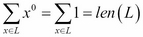，sum1 总是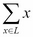，sum2 总是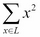。

其他方法，如`append()`，`extend()`和`remove()`，在许多方面与这些方法类似。我们没有展示它们，因为它们很相似。

有一个重要的部分缺失：通过`list[index]= value`进行单个项目替换。我们将在下一段深入讨论。

我们可以通过处理一些数据来看看这个列表是如何工作的：

```py
>>> sl2 = StatsList2( [2, 4, 3, 4, 5, 5, 7, 9, 10] )
>>> sl2.sum0, sl2.sum1, sl2.sum2
(9, 49, 325)
>>> sl2[2]= 4
>>> sl2.sum0, sl2.sum1, sl2.sum2
(9, 50, 332)
>>> del sl2[-1]
>>> sl2.sum0, sl2.sum1, sl2.sum2
(8, 40, 232)
>>> sl2.insert( 0, -1 )
>>> sl2.pop()                            
-1
>>> sl2.sum0, sl2.sum1, sl2.sum2
(8, 40, 232)
```

我们可以创建一个列表，并且初始计算出总和。每个后续的变化都会急切地更新各种总和。我们可以更改、移除、插入和弹出一个项目；每个变化都会产生一组新的总和。

剩下的就是添加我们的均值和标准差计算，我们可以这样做：

```py
    @property
    def mean(self):
        return self.sum1/self.sum0
    @property
    def stdev(self):
        return math.sqrt( self.sum0*self.sum2-self.sum1*self.sum1 )/self.sum0
```

这些利用了已经计算的总和。没有额外的循环来计算这两个统计数据。

### 使用 __getitem__()，__setitem__()，__delitem__()和切片

`StatsList2`示例没有显示`__setitem__()`或`__delitem__()`的实现，因为它们涉及切片。在实现这些方法之前，我们需要查看切片的实现。

序列有两种不同的索引：

+   `a[i]`：这是一个简单的整数索引。

+   `a[i:j]`或`a[i:j:k]`：这些是带有`start:stop:step`值的`slice`表达式。切片表达式可以非常复杂，有七种不同的变体，适用于不同种类的默认值。

这个基本的语法在三个上下文中都适用：

+   在一个表达式中，依赖于`__getitem__()`来获取一个值

+   在赋值的左侧，依赖于`__setitem__()`来设置一个值

+   在`del`语句上，依赖于`__delitem__()`来删除一个值

当我们做类似`seq[:-1]`的操作时，我们写了一个`slice`表达式。底层的`__getitem__()`方法将得到一个`slice`对象，而不是一个简单的整数。

参考手册告诉我们一些关于切片的事情。一个`slice`对象将有三个属性：`start`，`stop`和`step`。它还将有一个名为`indices()`的方法函数，它将正确计算切片的任何省略的属性值。

我们可以用一个扩展`list`的微不足道的类来探索`slice`对象：

```py
class Explore(list):
    def __getitem__( self, index ):
        print( index, index.indices(len(self)) )
        return super().__getitem__( index )
```

这个类将输出`slice`对象和`indices()`函数结果的值。然后，使用超类实现，以便列表在其他方面表现正常。

有了这个类，我们可以尝试不同的`slice`表达式，看看我们得到了什么：

```py
>>> x= Explore('abcdefg')
>>> x[:]
slice(None, None, None) (0, 7, 1)
['a', 'b', 'c', 'd', 'e', 'f', 'g']
>>> x[:-1]
slice(None, -1, None) (0, 6, 1)
['a', 'b', 'c', 'd', 'e', 'f']
>>> x[1:]
slice(1, None, None) (1, 7, 1)
['b', 'c', 'd', 'e', 'f', 'g']
>>> x[::2]
slice(None, None, 2) (0, 7, 2)
['a', 'c', 'e', 'g']
```

在上述的`slice`表达式中，我们可以看到`slice`对象有三个属性，这些属性的值直接来自 Python 语法。当我们向`indices()`函数提供适当的长度时，它会返回一个包含开始、停止和步长值的三元组值。

### 实现 __getitem__()，__setitem__()和 __delitem__()

当我们实现`__getitem__()`、`__setitem__()`和`__delitem__()`方法时，我们必须处理两种类型的参数值：`int`和`slice`。

当我们重载各种序列方法时，必须适当处理切片情况。

这是一个与切片一起使用的`__setitem__()`方法：

```py
    def __setitem__( self, index, value ):
        if isinstance(index, slice):
            start, stop, step = index.indices(len(self))
            olds = [ self[i] for i in range(start,stop,step) ]
            super().__setitem__( index, value )
            for x in olds:
                self._rmv(x)
            for x in value:
                self._new(x)
        else:
            old= self[index]
            super().__setitem__( index, value )
            self._rmv(old)
            self._new(value)
```

上述方法有两种处理路径：

+   如果索引是一个`slice`对象，我们将计算`start`、`stop`和`step`值。然后，找到将被移除的所有旧值。然后，我们可以调用超类操作，并合并替换旧值的新值。

+   如果索引是一个简单的`int`对象，旧值是一个单个项目，新值也是一个单个项目。

这是与切片一起使用的`__delitem__()`方法：

```py
    def __delitem__( self, index ):
        # Index may be a single integer, or a slice
        if isinstance(index, slice):
            start, stop, step = index.indices(len(self))
            olds = [ self[i] for i in range(start,stop,step) ]
            super().__delitem__( index )
            for x in olds:
                self._rmv(x)
        else:
            old= self[index]
            super().__delitem__( index )
            self._rmv(old)
```

上述代码也扩展了切片，以确定可以删除哪些值。如果索引是一个简单的整数，那么就只删除一个值。

当我们向我们的`StatsList2`类引入适当的切片处理时，我们可以创建列表，它可以做到基本的`list`类所做的一切，还可以（快速）返回当前列表中的平均值和标准差。

### 注意

请注意，这些方法函数将分别创建一个临时列表对象`olds`；这涉及一些开销，可以消除。作为读者的练习，将`_rmv()`函数前移这些方法，以消除对`olds`变量的使用，这是有帮助的。

### 包装列表和委托

我们将看看如何包装 Python 的内置容器类之一。包装现有类意味着一些方法必须委托给底层容器。

由于任何内置集合中都有大量方法，包装集合可能需要相当多的代码。在创建持久类时，包装比扩展具有优势。这是第九章的主题，*序列化和保存 - JSON、YAML、Pickle、CSV 和 XML*。在某些情况下，我们希望公开内部集合，以避免编写大量委托给内部列表的序列方法。

统计数据类的一个常见限制是它们需要是“仅插入”的。我们将禁用一些方法函数。这是一种需要包装的重大变化。

我们可以设计一个仅支持`append`和`__getitem__`的类，例如。它将包装一个`list`类。以下代码可用于从模拟中累积数据：

```py
class StatsList3:
    def __init__( self ):
        self._list= list()
        self.sum0 = 0 # len(self), sometimes called "N"
        self.sum1 = 0 # sum(self)
        self.sum2 = 0 # sum(x**2 for x in self)
    def append( self, value ):
        self._list.append(value)
        self.sum0 += 1
        self.sum1 += value
        self.sum2 += value*value
    def __getitem__( self, index ):
        return self._list.__getitem__( index )
    @property
    def mean(self):
        return self.sum1/self.sum0
    @property
    def stdev(self):
        return math.sqrt( self.sum0*self.sum2-self.sum1*self.sum1 )/self.sum0
```

这个类有一个内部的`_list`对象，是底层列表。列表始终最初为空。由于我们只定义了`append()`作为更新列表的方法，我们可以轻松地维护各种和。我们需要小心地将工作委托给超类，以确保列表在我们的子类处理参数值之前实际更新。

我们可以直接将`__getitem__()`委托给内部列表对象，而不检查参数或结果。

我们可以像这样使用这个类：

```py
>>> sl3= StatsList3()
>>> for data in 2, 4, 4, 4, 5, 5, 7, 9:
...     sl3.append(data)
...
>>> sl3.mean
5.0
>>> sl3.stdev   
2.0
```

我们创建了一个空列表，并向列表中添加了项目。由于我们在添加项目时保持和，我们可以非常快速地计算平均值和标准差。

我们并没有有意使我们的类可迭代。我们没有定义`__iter__()`。

因为我们定义了`__getitem__()`，现在有几件事可以做。我们不仅可以获取项目，而且还会有一个默认实现，允许我们遍历值序列。

这是一个例子：

```py
>>> sl3[0]
2
>>> for x in sl3:
...     print(x)
...
2
4
4
4
5
5
7
9
```

前面的输出告诉我们，一个围绕集合的最小包装通常足以满足许多用例。

请注意，我们没有使列表可伸缩。如果我们尝试获取大小，它将引发异常，如下所示：

```py
>>> len(sl3)
Traceback (most recent call last):
  File "<stdin>", line 1, in <module>
TypeError: object of type 'StatsList3' has no len()
```

我们可能想要添加一个`__len__()`方法，将真正的工作委托给内部的`_list`对象。我们可能还想将`__hash__`设置为`None`，因为这是一个可变对象，这是明智的。

我们可能想要定义`__contains__()`并将此功能委托给内部的`_list`。这将创建一个提供容器的低级特性集的极简主义容器。

### 使用`__iter__()`创建迭代器

当我们的设计涉及包装现有类时，我们需要确保我们的类是可迭代的。当我们查看`collections.abc.Iterable`的文档时，我们看到我们只需要定义`__iter__()`来使对象可迭代。`__iter__()`方法可以返回一个适当的`Iterator`对象，也可以是一个生成器函数。

创建一个`Iterator`对象，虽然并不是非常复杂，但很少是必要的。创建生成器函数要简单得多。对于包装的集合，我们应该总是简单地将`__iter__()`方法委托给底层集合。

对于我们的`StatsList3`类，它看起来像这样：

```py
    def __iter__(self):
        return iter(self._list)
```

这个方法函数将迭代委托给底层列表的`Iterator`。

## 创建一种新的映射

Python 有一个名为`dict`的内置映射，以及许多库映射。除了`collections`模块对`dict`的扩展（`defaultdict`、`Counter`、`OrderedDict`和`ChainMap`）之外，还有几个其他库模块包含类似映射的结构。

`shelve`模块是另一个映射的重要示例。我们将在第十章中查看这一点，*通过 Shelve 存储和检索对象*。`dbm`模块类似于`shelve`，它也将键映射到值。

`mailbox`模块和`email.message`模块都有提供类似于`dict`的接口的类，用于管理本地电子邮件的邮箱结构。

就设计策略而言，我们可以扩展或包装现有的映射，以添加更多功能。

我们可以升级`Counter`，将存储为频率分布的数据添加均值和标准差。事实上，我们还可以很容易地从这个类中计算中位数和众数。

这里是`StatsCounter`对`Counter`的扩展，添加了一些统计函数：

```py
from collections import Counter
class StatsCounter(Counter):
    @property
    def mean( self ):
        sum0= sum( v for k,v in self.items() )
        sum1= sum( k*v for k,v in self.items() )
        return sum1/sum0
    @property
    def stdev( self ):
        sum0= sum( v for k,v in self.items() )
        sum1= sum( k*v for k,v in self.items() )
        sum2= sum( k*k*v for k,v in self.items() )
        return math.sqrt( sum0*sum2-sum1*sum1 )/sum0
```

我们扩展了`Counter`类，增加了两个新方法，用于计算频率分布的均值和标准差。这些公式与之前在`list`对象上进行的急切计算的示例类似，尽管它们是在`Counter`对象上进行的懒惰计算。

我们使用`sum0= sum( v for k,v in self.items() )`来计算值`v`的总和，忽略`k`键。我们可以使用下划线（`_`）代替`k`，以强调我们正在忽略键。我们也可以使用`sum( v for v in self.values() )`来强调我们没有使用键。我们更喜欢`sum0`和`sum1`的明显并行结构。

我们可以使用这个类来高效地收集统计数据，并对原始数据进行定量分析。我们可以运行多个模拟，使用`Counter`对象来收集结果。

这里是一个与样本数据列表的交互，代表真实结果：

```py
>>> sc = StatsCounter( [2, 4, 4, 4, 5, 5, 7, 9] )
>>> sc.mean
5.0
>>> sc.stdev
2.0
>>> sc.most_common(1)
[(4, 3)]
>>> list(sorted(sc.elements()))
[2, 4, 4, 4, 5, 5, 7, 9]
```

`most_common()`的结果报告为两个元组的序列，包括模式值（4）和值出现的次数（3）。我们可能想要获取前三个值，以将模式与下两个不太流行的项进行比较。我们可以通过`sc.most_common(3)`这样的评估来获取几个流行的值。

`elements()`方法重建一个像原始数据一样的`list`，其中的项被适当地重复。

从排序的元素中，我们可以提取中位数，即中间的项：

```py
    @property
    def median( self ):
        all= list(sorted(sc.elements()))
        return all[len(all)//2]
```

这种方法不仅是懒惰的，而且在内存上非常奢侈；它仅仅为了找到最中间的项就创建了整个可用值的序列。

虽然简单，但这通常是使用 Python 的一种昂贵的方式。

更聪明的方法是通过`sum(self.values())//2`来计算有效长度和中点。一旦知道了这一点，就可以按照这个顺序访问键，使用计数来计算给定键的位置范围。最终，将找到一个包含中点的范围的键。

代码看起来像下面这样：

```py
    @property
    def median( self ):
        mid = sum(self.values())//2
        low= 0
        for k,v in sorted(self.items()):
            if low <= mid < low+v: return k
            low += v
```

我们逐步遍历键和它们出现的次数，以找到最中间的键。请注意，这使用了内部的`sorted()`函数，这并不是没有成本的。

通过`timeit`，我们可以得知奢侈版需要 9.5 秒；而更聪明的版本只需要 5.2 秒。

## 创建一种新的集合类型

创建一个全新的集合需要一些初步工作。我们需要有新的算法或新的内部数据结构，可以显著改进内置集合。在设计新的集合之前，进行彻底的“大 O”复杂度计算非常重要。在实施后使用`timeit`来确保新的集合确实是内置类的改进也很重要。

例如，我们可能想要创建一个二叉搜索树结构，以保持元素的正确顺序。由于我们希望这是一个可变的结构，我们将不得不执行以下类型的设计活动：

+   设计基本的二叉树结构

+   决定基础结构是`MutableSequence`、`MutableMapping`还是`MutableSet`

+   查看`Python 标准库`文档的`collections.abc`部分中集合的特殊方法，第 8.4.1 节。

二叉搜索树有两个分支的节点：一个是“小于”这个节点的所有键的分支，另一个是“大于或等于”这个节点的键的分支。

我们需要检查我们的集合与 Python ABCs 之间的匹配：

+   这不是一个很好的序列，因为我们通常不会在二叉树中使用索引。我们在搜索树中通常通过它们的键来引用元素。但是，我们可以不太困难地强制使用整数索引。

+   它可以用于映射的键；这将保持键的排序顺序。这是二叉搜索树的常见用法。

+   这是一个很好的选择，可以替代`set`或`Counter`类，因为它可以容易地容纳多个项，使其类似于袋子。

我们将研究创建一个排序的多重集或者一个袋子。这可以包含对象的多个副本。它将依赖于对象之间相对简单的比较测试。

这是一个相当复杂的设计。有很多细节。要创建一个背景，重要的是阅读诸如[`en.wikipedia.org/wiki/Binary_search_tree`](http://en.wikipedia.org/wiki/Binary_search_tree)这样的文章。在前面的维基百科页面的末尾有许多外部链接，可以提供更多信息。在书籍中学习基本算法也是非常重要的，比如 Cormen、Leiserson、Rivest 和 Stein 的*算法导论*，Aho、Ullman 和 Hopcroft 的*数据结构与算法*，或者 Steven Skiena 的*算法设计手册*。

### 一些设计原理

我们将把集合分成两个类：`TreeNode`和`Tree`。

`TreeNode`类将包含项目以及`more`、`less`和`parent`引用。我们还将把一些功能委托给这个类。

例如，搜索特定项目以使用`__contains__()`或`discard()`将被委托给节点本身，使用简单的递归。算法的概要如下。

+   如果目标项目等于自身项目，则返回`self`

+   如果目标项目小于`self.item`，则递归使用`less.find(target item)`

+   如果目标项目大于`self.item`，则递归使用`more.find(target.item)`

我们将使用类似的委托给 TreeNode 类来完成更多维护树结构的真正工作。

第二个类将是一个**Facade**，它定义了`Tree`本身。Facade 设计也可以称为**Wrapper**；其思想是为特定接口添加所需的功能。我们将提供`MutableSet`抽象基类所需的外部接口。

如果根节点为空并且始终比所有其他键值小，则算法可能会更简单。这在 Python 中可能会有挑战，因为我们事先不知道节点可能具有的数据类型；我们无法轻松地为根节点定义底部值。相反，我们将使用`None`的特殊情况值，并忍受检查根节点的`if`语句的开销。

### 定义树类

这是对`MutableSet`类的扩展核心，提供了最小的方法函数：

```py
class Tree(collections.abc.MutableSet):
    def __init__( self, iterable=None ):
        self.root= TreeNode(None)
        self.size= 0
        if iterable:
            for item in iterable:
                self.root.add( item )
    def add( self, item ):
        self.root.add( item )
        self.size += 1
    def discard( self, item ):
        try:
            self.root.more.remove( item )
            self.size -= 1
        except KeyError:
            pass
    def __contains__( self, item ):
        try:
            self.root.more.find( item )
            return True
        except KeyError:
            return False
    def __iter__( self ):
        for item in iter(self.root.more):
            yield item
    def __len__( self ):
        return self.size
```

初始化类似于`Counter`对象；这个类将接受一个可迭代对象，并将元素加载到结构中。

`add()`和`discard()`方法会跟踪整体大小。这样可以通过对树进行递归遍历来节省计算节点的数量。这些方法还将它们的工作委托给树根处的`TreeNode`对象。

`__contains__()`特殊方法执行递归查找。它将`KeyError`异常转换为`False`返回值。

`__iter__()`特殊方法是一个生成器函数。它还将真正的工作委托给`TreeNode`类内的递归迭代器。

我们定义了`discard()`；可变集合要求在尝试丢弃缺失的键时保持沉默。抽象超类提供了`remove()`的默认实现，如果找不到键，则会引发异常。两种方法函数都必须存在；我们基于`remove()`定义了`discard()`，通过消除异常来保持沉默。在某些情况下，基于`discard()`定义`remove()`可能更容易，如果发现问题则引发异常。

### 定义 TreeNode 类

整个`Tree`类依赖于`TreeNode`类来处理添加、删除和遍历包中各种项目的详细工作。这个类相当大，所以我们将它分成三个部分呈现。

这是包括查找和遍历节点的第一部分：

```py
import weakref
class TreeNode:
    def __init__( self, item, less=None, more=None, parent=None ):
        self.item= item
        self.less= less
        self.more= more
        if parent != None:
            self.parent = parent
    @property
    def parent( self ):
        return self.parent_ref()
    @parent.setter
    def parent( self, value ):
        self.parent_ref= weakref.ref(value)
    def __repr__( self ):
        return( "TreeNode({item!r},{less!r},{more!r})".format( **self.__dict__ ) )
    def find( self, item ):
        if self.item is None: # Root
            if self.more: return self.more.find(item)
        elif self.item == item: return self
        elif self.item > item and self.less: return self.less.find(item)
        elif self.item < item and self.more: return self.more.find(item)
        raise KeyError
    def __iter__( self ):
        if self.less:
            for item in iter(self.less):
                yield item
        yield self.item
        if self.more:
            for item in iter(self.more):
                yield item
```

我们定义了节点的基本初始化，有两种变体。我们可以提供尽可能少的项目；我们也可以提供项目、两个子树和父链接。

属性用于确保父属性实际上是一个类似强引用的`weakref`属性。有关弱引用的更多信息，请参见第二章，“与 Python 无缝集成-基本特殊方法”。我们在`TreeNode`父对象和其子对象之间有相互引用；这种循环可能使得难以删除`TreeNode`对象。使用`weakref`打破了这种循环。

我们看到了`find()`方法，它从树中执行递归搜索，通过适当的子树寻找目标项目。

`__iter__()`方法执行所谓的中序遍历，遍历这个节点及其子树。通常情况下，这是一个生成器函数，它从每个子树的迭代器中产生值。虽然我们可以创建一个与我们的`Tree`类相关联的单独的迭代器类，但当生成器函数可以满足我们的所有需求时，几乎没有什么好处。

这是这个类的下一部分，用于向树中添加一个新节点：

```py
    def add( self, item ):
        if self.item is None: # Root Special Case
            if self.more:
                self.more.add( item )
            else:
                self.more= TreeNode( item, parent=self )
        elif self.item >= item:
            if self.less:
                self.less.add( item )
            else:
                self.less= TreeNode( item, parent=self )
        elif self.item < item:
            if self.more:
                self.more.add( item )
            else:
                self.more= TreeNode( item, parent=self )
```

这是递归搜索适当位置以添加新节点。这个结构与`find()`方法相似。

最后，我们有（更复杂的）处理从树中删除节点。这需要一些小心，以重新链接围绕缺失节点的树：

```py
    def remove( self, item ):
        # Recursive search for node
        if self.item is None or item > self.item:
            if self.more:
                self.more.remove(item)
            else:
                raise KeyError
        elif item < self.item:
            if self.less:
                self.less.remove(item)
            else:
                raise KeyError
        else: # self.item == item
            if self.less and self.more: # Two children are present
                successor = self.more._least() 
                self.item = successor.item
                successor.remove(successor.item)
            elif self.less:   # One child on less
                self._replace(self.less)
            elif self.more:  # On child on more
                self._replace(self.more)
            else: # Zero children
                self._replace(None)
    def _least(self):
        if self.less is None: return self
        return self.less._least()
    def _replace(self,new=None):
        if self.parent:
            if self == self.parent.less:
                self.parent.less = new
            else:
                self.parent.more = new
        if new is not None:
            new.parent = self.parent
```

`remove()`方法有两部分。第一部分是递归搜索目标节点。

一旦找到节点，有三种情况需要考虑：

+   当我们删除一个没有子节点的节点时，我们只需删除它，并更新父节点以用`None`替换链接。

+   当我们删除一个只有一个子节点的节点时，我们可以将单个子节点上移，以替换父节点下的这个节点。

+   当有两个子节点时，我们需要重构树。我们找到后继节点（`more`子树中的最小项）。我们可以用这个后继节点的内容替换要删除的节点。然后，我们可以删除重复的前任后继节点。

我们依赖于两个私有方法。`_least()`方法对给定树进行递归搜索，找到最小值节点。`_replace()`方法检查父节点，看它是否应该触及`less`或`more`属性。

### 演示二叉树集合

我们构建了一个完整的新集合。ABC 定义自动包括了许多方法。这些继承方法可能并不特别高效，但它们被定义了，它们起作用，而且我们没有为它们编写代码。

```py
>>> s1 = Tree( ["Item 1", "Another", "Middle"] )
>>> list(s1)
['Another', 'Item 1', 'Middle']
>>> len(s1)
3
>>> s2 = Tree( ["Another", "More", "Yet More"] )
>>>
>>> union= s1|s2
>>> list(union)
['Another', 'Another', 'Item 1', 'Middle', 'More', 'Yet More']
>>> len(union)
6
>>> union.remove('Another')
>>> list(union)
['Another', 'Item 1', 'Middle', 'More', 'Yet More']
```

这个例子向我们展示了集合对象的`union`运算符是如何正常工作的，即使我们没有为它专门提供代码。因为这是一个包，项目也被正确地复制了。

## 总结

在这一章中，我们看了一些内置类的定义。内置集合是大多数设计工作的起点。我们经常会从`tuple`、`list`、`dict`或`set`开始。我们可以利用`namedtuple()`创建的对`tuple`的扩展来创建应用程序的不可变对象。

除了这些类，我们还有其他标准库类在`collections`模式中可以使用：

+   `deque`

+   `ChainMap`

+   `OrderedDict`

+   `defaultdict`

+   `Counter`

我们也有三种标准的设计策略。我们可以包装任何这些现有类，或者我们可以扩展一个类。

最后，我们还可以发明一种全新的集合类型。这需要定义一些方法名和特殊方法。

### 设计考虑和权衡

在处理容器和集合时，我们有一个多步设计策略：

1.  考虑序列、映射和集合的内置版本。

1.  考虑集合模块中的库扩展，以及`heapq`、`bisect`和`array`等额外内容。

1.  考虑现有类定义的组合。在许多情况下，`tuple`对象的列表或`dict`的列表提供了所需的功能。

1.  考虑扩展前面提到的类之一，以提供额外的方法或属性。

1.  考虑将现有结构包装为提供额外方法或属性的另一种方式。

1.  最后，考虑一个新颖的数据结构。通常情况下，有很多仔细的分析可用。从维基百科这样的文章开始：

[`en.wikipedia.org/wiki/List_of_data_structures`](http://en.wikipedia.org/wiki/List_of_data_structures)

一旦设计替代方案被确定，剩下的评估部分有两个：

+   接口与问题域的契合程度如何。这是一个相对主观的判断。

+   数据结构的性能如何，可以通过`timeit`来衡量。这是一个完全客观的结果。

避免分析瘫痪是很重要的。我们需要*有效地*找到合适的集合。

在大多数情况下，最好对工作应用程序进行性能分析，以查看哪种数据结构是性能瓶颈。在某些情况下，考虑数据结构的复杂性因素将在开始实施之前揭示其适用于特定问题类型的适用性。

也许最重要的考虑是：“为了获得最佳性能，避免搜索”。

这就是为什么集合和映射需要可散列对象的原因。可散列对象几乎不需要处理就可以在集合或映射中找到。在列表中通过值（而不是索引）定位一个项目可能需要很长时间。

这是一个使用列表的不良类似集合的比较和使用集合的正确使用的比较：

```py
>>> import timeit
>>> timeit.timeit( 'l.remove(10); l.append(10)', 'l = list(range(20))' )
0.8182099789992208
>>> timeit.timeit( 'l.remove(10); l.add(10)', 'l = set(range(20))' )
0.30278149300283985
```

我们从列表和集合中删除并添加了一个项目。

显然，滥用列表以执行类似集合的操作会使集合运行时间延长 2.7 倍。

作为第二个例子，我们将滥用列表使其类似映射。这是基于一个真实世界的例子，原始代码中有两个并行列表来模拟映射的键和值。

我们将比较一个适当的映射和两个并行列表，如下所示：

```py
>>> timeit.timeit( 'i= k.index(10); v[i]= 0', 'k=list(range(20)); v=list(range(20))' )
0.6549435159977293
>>> timeit.timeit( 'm[10]= 0', 'm=dict(zip(list(range(20)),list(range(20))))' )
0.0764331009995658
```

我们使用一个列表来查找一个值，然后在第二个并行列表中设置该值。在另一种情况下，我们只是更新了一个映射。

显然，在两个并行列表上执行索引和更新是一个可怕的错误。通过`list.index()`定位某物所需的时间是定位映射和哈希值的 8.6 倍。

### 展望未来

在下一章中，我们将仔细研究内置数字以及如何创建新类型的数字。与容器一样，Python 提供了丰富多样的内置数字。创建新类型的数字时，我们将不得不定义许多特殊方法。

在查看数字之后，我们可以看一些更复杂的设计技术。我们将看看如何创建自己的装饰器，并使用它们来简化类定义。我们还将研究使用混合类定义，这类似于 ABC 定义。

# 第七章：创建数字

我们可以扩展`numbers`模块中的 ABC 抽象，以创建新类型的数字。我们可能需要这样做来创建比内置数字类型更精确地适应我们问题域的数字类型。

首先需要查看`numbers`模块中的抽象，因为它们定义了现有的内置类。在使用新类型的数字之前，了解现有数字是至关重要的。

我们将离题一下，看看 Python 的运算符到方法映射算法。这个想法是，二元运算符有两个操作数；任何一个操作数都可以定义实现该运算符的类。Python 定位相关类的规则对于决定要实现哪些特殊方法至关重要。

基本的算术运算符，如`+`，`-`，`*`，`/`，`//`，`%`和`**`构成了数字操作的基础。还有其他运算符，包括`^`，`|`和`&`。这些用于整数的位运算处理。它们也用作集合之间的运算符。在这个类别中还有一些运算符，包括`<<`，`>>`。比较运算符在第二章中已经介绍过，*与 Python 基本特殊方法无缝集成*。这些包括`<`，`>`，`<=`，`>=`，`==`和`!=`。我们将在本章中复习并扩展对比较运算符的研究。

数字还有许多其他特殊方法。这些包括各种转换为其他内置类型。Python 还定义了"就地"赋值与运算符的组合。这些包括`+=`、`-=`、`*=`、`/=`、`//=`、`%=`、`**=`、`&=`、`|=`、`^=`、`>>=`和`<<=`。这些更适用于可变对象而不是数字。最后，我们将总结一些扩展或创建新数字时涉及的设计考虑。

## 数字的 ABC

`numbers`包提供了一系列数字类型，它们都是`numbers.Number`的实现。此外，`fractions`和`decimal`模块提供了扩展的数字类型：`fractions.Fraction`和`decimal.Decimal`。

这些定义大致与数学上对各类数字的思考相一致。一篇文章在[`en.wikipedia.org/wiki/Number_theory`](http://en.wikipedia.org/wiki/Number_theory)上介绍了不同类型数字的基础知识。

重要的是计算机如何实现数学抽象。更具体地说，我们希望确保在数学的抽象世界中可以计算的任何东西都可以使用具体的计算机进行计算。这就是可计算性问题如此重要的原因。"图灵完备"编程语言的理念是它可以计算图灵机可以计算的任何东西。可以在[`en.wikipedia.org/wiki/Computability_theory`](http://en.wikipedia.org/wiki/Computability_theory)找到一篇有用的文章。

Python 定义了以下抽象及其相关的实现类。此外，这些类形成了一个继承层次结构，其中每个抽象类都继承自上面的类。随着我们向下移动列表，类具有更多的特性。由于类很少，它形成了一个*塔*而不是一棵树。

+   `numbers.Complex`由`complex`实现

+   `numbers.Real`由`float`实现

+   `numbers.Rational`由`fractions.Fraction`实现

+   `numbers.Integral`由`int`实现

此外，我们还有`decimal.Decimal`，它有点像`float`；它不是`numbers.Real`的适当子类，但有些类似。

### 提示

虽然这可能是显而易见的，但重复一遍`float`值仅仅是一个近似值。它不是精确的。

不要对这种事情感到惊讶。以下是使用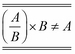近似的一个例子：

`>>> (3*5*7*11)/(11*13*17*23*29)`

`0.0007123135264946712`

`>>> _*13*17*23*29`

`105.00000000000001`

原则上，我们沿着数字塔向下走，无穷的次序会变得更小。这可能是一个令人困惑的主题。虽然各种抽象定义的数字都是无穷的，但可以证明存在不同的无穷次序。这导致了一个观点，即在原则上，浮点数表示的数字比整数多。从实际上来看，64 位浮点数和 64 位整数具有相同数量的不同值。

除了数字类的定义之外，还有许多在各种类之间的转换。不可能从每种类型转换到其他每种类型，因此我们必须制定一个矩阵，显示可以进行的转换和不能进行的转换。以下是一个总结：

+   `complex`：这不能转换为任何其他类型。`complex`值可以分解为`real`和`imag`部分，两者都是`float`。

+   `float`：这可以显式转换为任何类型，包括`decimal.Decimal`。算术运算符不会将`float`值隐式转换为`Decimal`。

+   `Fractions.Fraction`：这可以转换为任何其他类型，除了`decimal.Decimal`。要转换为`decimal`需要一个两部分的操作：(1)转换为`float` (2)转换为`decimal.Decimal`。这会导致近似值。

+   `int`：这可以转换为任何其他类型。

+   `Decimal`：这可以转换为任何其他类型。它不会通过算术运算隐式地强制转换为其他类型。

上下转换来自先前显示的数值抽象的塔。

### 决定使用哪些类型

由于转换，我们看到了以下四个数值处理的一般领域：

+   **复数**：一旦我们涉及复杂的数学，我们将使用`complex`、`float`以及`cmath`模块。我们可能根本不会使用`Fraction`或`Decimal`。然而，没有理由对数值类型施加限制；大多数数字将被转换为复数。

+   **货币**：对于与货币相关的操作，我们绝对必须使用`Decimal`。通常，在进行货币计算时，没有理由将小数值与非小数值混合在一起。有时，我们会使用`int`值，但没有理由使用`float`或`complex`与`Decimal`一起工作。记住，浮点数是近似值，在处理货币时是不可接受的。

+   **位操作**：对于涉及位和字节处理的操作，我们通常只会使用`int`，只有`int`，仅仅是`int`。

+   传统：广泛而模糊的“其他一切”类别。对于大多数传统数学运算，`int`、`float`和`Fraction`是可以互换的。事实上，一个写得很好的函数通常可以是适当的多态的；它可以很好地与任何数值类型一起使用。Python 类型，特别是`float`和`int`，将参与各种隐式转换。这使得为这些问题选择特定的数值类型有些无关紧要。

这些通常是问题领域的明显方面。通常很容易区分可能涉及科学或工程和复数的应用程序，以及涉及财务计算、货币和小数的应用程序。在应用程序中尽可能宽容地使用数值类型是很重要的。通过`isinstance()`测试不必要地缩小类型的领域通常是浪费时间和代码。

### 方法解析和反射运算符概念

算术运算符（`+`、`-`、`*`、`/`、`//`、`%`、`**`等）都映射到特殊的方法名。当我们提供一个表达式，比如`355+113`，通用的`+`运算符将被映射到特定数值类的具体`__add__()`方法。这个例子将被计算，就好像我们写了`355.__add__(113)`一样。最简单的规则是，最左边的操作数决定了所使用的运算符的类。

但等等，还有更多！当我们有一个混合类型的表达式时，Python 可能会得到两个特殊方法的实现，每个类一个。考虑`7-0.14`作为一个表达式。使用左侧的`int`类，这个表达式将被尝试为`7.__sub__(0.14)`。这涉及到一个不愉快的复杂性，因为`int`运算符的参数是一个`float`值`0.14`，将`float`转换为`int`可能会丢失精度。从`int`向上转换到`complex`的类型塔不会丢失精度。向下转换类型塔意味着可能会丢失精度。

然而，使用右侧的`float`版本，这个表达式将被尝试为：`0.14.__rsub__(7)`。在这种情况下，`float`运算符的参数是一个`int`值`7`；将`int`转换为`float`不会（通常）丢失精度。（一个真正巨大的`int`值可能会丢失精度；然而，这是一个技术上的争论，而不是一个一般原则。）

`__rsub__()`操作是“反射减法”。`X.__sub__(Y)`操作是预期的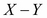。`A.__rsub__(B)`操作是反射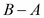；实现方法来自右操作数的类。我们已经看到了以下两条规则：

+   首先尝试左操作数的类。如果可以，很好。如果操作数返回`NotImplemented`作为值，那么使用规则 2。

+   尝试反射运算符的右操作数。如果可以，很好。如果返回`NotImplemented`，那么它确实没有实现，因此必须引发异常。

值得注意的例外情况是当两个操作数恰好具有子类关系时。这个额外的规则适用于第一对规则之前作为特殊情况：

+   如果右操作数是左操作数的子类，并且子类为运算符定义了反射特殊方法名称，则将尝试子类的反射运算符。这允许使用子类覆盖，即使子类操作数位于运算符的右侧。

+   否则，使用规则 1 并尝试左侧。

想象一下，我们写了一个 float 的子类`MyFloat`。在`2.0-MyFloat(1)`这样的表达式中，右操作数是左操作数类的子类。由于这种子类关系，将首先尝试`MyFloat(1).__rsub__(2.0)`。这条规则的目的是给子类优先权。

这意味着一个类必须从其他类型进行隐式转换，必须实现前向和反射运算符。当我们实现或扩展一个数值类型时，我们必须确定我们的类型能够进行的转换。

## 算术运算符的特殊方法

总共有 13 个二元运算符及其相关的特殊方法。我们将首先关注明显的算术运算符。特殊方法名称与运算符（和函数）匹配，如下表所示：

| 方法 | 运算符 |
| --- | --- |
| `object.__add__(self, other)` | `+` |
| `object.__sub__(self, other)` | `-` |
| `object.__mul__(self, other)` | `*` |
| `object.__truediv__(self, other)` | `/` |
| `object.__floordiv__(self, other)` | `//` |
| `object.__mod__(self, other)` | `%` |
| `object.__divmod__(self, other)` | `divmod()` |
| `object.__pow__(self, other[, modulo])` | `pow()` 以及 `**` |

是的，有趣的是，各种符号运算符都包括了两个函数。有许多一元运算符和函数，它们具有特殊的方法名称，如下表所示：

| 方法 | 运算符 |
| --- | --- |
| `object.__neg__(self)` | `-` |
| `object.__pos__(self)` | `+` |
| `object.__abs__(self)` | `abs()` |
| `object.__complex__(self)` | `complex()` |
| `object.__int__(self)` | `int()` |
| `object.__float__(self)` | `float()` |
| `object.__round__(self[, n])` | `round()` |
| `object.__trunc__(self[, n])` | `math.trunc()` |
| `object.__ceil__(self[, n])` | `math.ceil()` |
| `object.__floor__(self[, n])` | `math.floor()` |

是的，这个列表中也有很多函数。我们可以调整 Python 的内部跟踪，看看底层发生了什么。我们将定义一个简单的跟踪函数，它将为我们提供一点点关于发生了什么的可见性：

```py
def trace( frame, event, arg ):
    if frame.f_code.co_name.startswith("__"):
        print( frame.f_code.co_name, frame.f_code.co_filename, event )
```

当与跟踪帧相关联的代码的名称以`"__"`开头时，此函数将转储特殊方法名称。我们可以使用以下代码将此跟踪函数安装到 Python 中：

```py
import sys
sys.settrace(trace)
```

一旦安装，一切都通过我们的`trace()`函数。我们正在过滤特殊方法名称的跟踪事件。我们将定义一个内置类的子类，以便我们可以探索方法解析规则：

```py
class noisyfloat( float ):
    def __add__( self, other ):
        print( self, "+", other )
        return super().__add__( other )
    def __radd__( self, other ):
        print( self, "r+", other )
        return super().__radd__( other )
```

这个类只重写了两个操作符的特殊方法名称。当我们添加`noisyfloat`值时，我们将看到操作的打印摘要。此外，跟踪将告诉我们发生了什么。以下是显示 Python 选择实现给定操作的类的交互：

```py
>>> x = noisyfloat(2)
>>> x+3
__add__ <stdin> call
2.0 + 3
5.0
>>> 2+x
__radd__ <stdin> call
2.0 r+ 2
4.0
>>> x+2.3
__add__ <stdin> call
2.0 + 2.3
4.3
>>> 2.3+x
__radd__ <stdin> call
2.0 r+ 2.3
4.3
```

从`x+3`，我们看到`noisyfloat+int`提供了`int`对象`3`给`__add__()`方法。这个值被传递给了超类`float`，它处理了 3 到`float`的强制转换，并且也进行了加法。`2+x`展示了右侧`noisyfloat`版本的操作是如何被使用的。同样，`int`被传递给了处理`float`的超类。从`x+2.3`，我们知道`noisyfloat+float`使用了左侧的子类。另一方面，`2.3+x`展示了`float+noisyfloat`是如何使用右侧的子类和反射的`__radd__()`操作符。

## 创建一个数值类

我们将尝试设计一种新的数字类型。当 Python 已经提供了无限精度的整数、有理分数、标准浮点数和货币计算的十进制数时，这并不是一件容易的任务。我们将定义一类“缩放”数字。这些数字包括一个整数值和一个缩放因子。我们可以用这些来进行货币计算。对于世界上许多货币，我们可以使用 100 的比例，并进行最接近的分的所有计算。

缩放算术的优势在于可以通过使用低级硬件指令来非常简单地完成。我们可以将这个模块重写为一个 C 语言模块，并利用硬件速度操作。发明新的缩放算术的缺点在于，`decimal`包已经非常好地执行了精确的十进制算术。

我们将称这个类为`FixedPoint`类，因为它将实现一种固定的小数点数。比例因子将是一个简单的整数，通常是 10 的幂。原则上，一个 2 的幂作为缩放因子可能会更快，但不太适合货币。

缩放因子是 2 的幂可以更快的原因是，我们可以用`value << scale`替换`value*(2**scale)`，用`value >> scale`替换`value/(2**scale)`。左移和右移操作通常是比乘法或除法快得多的硬件指令。

理想情况下，缩放因子是 10 的幂，但我们并没有明确强制执行这一点。跟踪缩放幂和与幂相关的比例因子是一个相对简单的扩展。我们可以将 2 存储为幂，并将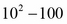存储为因子。我们已经简化了这个类的定义，只需跟踪因子。

### 定义 FixedPoint 初始化

我们将从初始化开始，包括将各种类型转换为`FixedPoint`值，如下所示：

```py
import numbers
import math

class FixedPoint( numbers.Rational ):
    __slots__ = ( "value", "scale", "default_format" )
    def __new__( cls, value, scale=100 ):
        self = super().__new__(cls)
        if isinstance(value,FixedPoint):
            self.value= value.value
            self.scale= value.scale
        elif isinstance(value,int):
            self.value= value
            self.scale= scale
        elif isinstance(value,float):
            self.value= int(scale*value+.5) # Round half up
            self.scale= scale
        else:
            raise TypeError
        digits= int( math.log10( scale ) )
        self.default_format= "{{0:.{digits}f}}".format(digits=digits)
        return self
    def __str__( self ):
        return self.__format__( self.default_format )
    def __repr__( self ):
        return "{__class__.__name__:s}({value:d},scale={scale:d})".format( __class__=self.__class__, value=self.value, scale=self.scale )
    def __format__( self, specification ):
        if specification == "": specification= self.default_format
        return specification.format( self.value/self.scale ) # no rounding
    def numerator( self ):
        return self.value
    def denominator( self ):
        return self.scale
```

我们的`FixedPoint`类被定义为`numbers.Rational`的子类。我们将包装两个整数值，`scale`和`value`，并遵循分数的一般定义。这需要大量的特殊方法定义。初始化是为了一个不可变的对象，所以它重写了`__new__()`而不是`__init__()`。它定义了有限数量的插槽，以防止添加任何额外的属性。初始化包括以下几种转换：

+   如果我们得到另一个`FixedPoint`对象，我们将复制内部属性以创建一个新的`FixedPoint`对象，它是原始对象的克隆。它将有一个唯一的 ID，但我们可以确信它具有相同的哈希值并且比较相等，使得克隆在很大程度上是不可区分的。

+   当给定整数或有理数值（`int`或`float`的具体类），这些值被用来设置`value`和`scale`属性。

+   我们可以添加处理`decimal.Decimal`和`fractions.Fraction`的情况，以及解析输入字符串值。

我们定义了三个特殊方法来生成字符串结果：`__str__()`、`__repr__()`和`__format__()`。对于格式操作，我们决定利用格式规范语言的现有浮点特性。因为这是一个有理数，我们需要提供分子和分母方法。

请注意，我们也可以从现有的`fractions.Fraction`类开始。还要注意，我们在舍入规则上玩得很快。在将此类应用于特定问题域之前，这也应该以合理的方式定义。

### 定义 FixedPoint 二进制算术运算符

定义新类别数字的整个原因是为了重载算术运算符。每个`FixedPoint`对象有两部分：`value`和`scale`。我们可以这样说：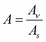。

请注意，我们已经使用正确但低效的浮点表达式在下面的示例中解出了代数。我们将讨论稍微更有效的纯整数操作。

加法（和减法）的一般形式是这样的：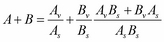。但它创建了一个有很多无用精度的结果。

想象一下添加 9.95 和 12.95。我们将（原则上）有 229000/10000。这可以正确地减少为 2290/100。问题是它也减少为 229/10，这不再是分。我们希望避免以一般方式减少分数，而尽可能坚持分或毫。

我们可以确定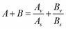有两种情况：

+   **比例因子匹配**：在这种情况下，总和是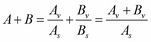。当添加`FixedPoint`和普通整数时，这也可以工作，因为我们可以强制普通整数具有所需的比例因子。

+   **比例因子不匹配**：正确的做法是产生一个具有两个输入值的最大比例因子的结果，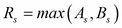。从这里，我们可以计算两个比例因子，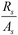和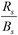。其中一个比例因子将是 1，另一个将小于 1。我们现在可以用一个公共值在分母上相加。代数上，它是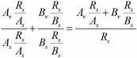。这可以进一步优化为两种情况，因为一个因子是 1，另一个是 10 的幂。

我们实际上不能优化乘法。它本质上是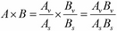。当我们相乘`FixedPoint`值时，精度确实会增加。

除法是乘以倒数，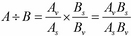。如果 A 和 B 具有相同的比例，这些值将取消，以便我们确实有一个方便的优化可用。然而，这将把比例从分变为整，这可能不合适。前向运算符，围绕类似的样板构建，看起来像这样：

```py
    def __add__( self, other ):
        if not isinstance(other,FixedPoint):
            new_scale= self.scale
            new_value= self.value + other*self.scale
        else:
            new_scale= max(self.scale, other.scale)
            new_value= (self.value*(new_scale//self.scale)
            + other.value*(new_scale//other.scale))
        return FixedPoint( int(new_value), scale=new_scale )
    def __sub__( self, other ):
        if not isinstance(other,FixedPoint):
            new_scale= self.scale
            new_value= self.value - other*self.scale
        else:
            new_scale= max(self.scale, other.scale)
            new_value= (self.value*(new_scale//self.scale)
            - other.value*(new_scale//other.scale))
        return FixedPoint( int(new_value), scale=new_scale )
    def __mul__( self, other ):
        if not isinstance(other,FixedPoint):
            new_scale= self.scale
            new_value= self.value * other
        else:
            new_scale= self.scale * other.scale
            new_value= self.value * other.value
        return FixedPoint( int(new_value), scale=new_scale )
    def __truediv__( self, other ):
        if not isinstance(other,FixedPoint):
            new_value= int(self.value / other)
        else:
            new_value= int(self.value / (other.value/other.scale))
        return FixedPoint( new_value, scale=self.scale )
    def __floordiv__( self, other ):
        if not isinstance(other,FixedPoint):
            new_value= int(self.value // other)
        else:
            new_value= int(self.value // (other.value/other.scale))
        return FixedPoint( new_value, scale=self.scale )
    def __mod__( self, other ):
        if not isinstance(other,FixedPoint):
            new_value= (self.value/self.scale) % other
        else:
            new_value= self.value % (other.value/other.scale)
        return FixedPoint( new_value, scale=self.scale )
    def __pow__( self, other ):
        if not isinstance(other,FixedPoint):
            new_value= (self.value/self.scale) ** other
        else:
            new_value= (self.value/self.scale) ** (other.value/other.scale)
        return FixedPoint( int(new_value)*self.scale, scale=self.scale )
```

对于简单的加法、减法和乘法情况，我们提供了可以优化以消除一些相对较慢的浮点中间结果的版本。

对于两个除法，`__mod__()`和`__pow__()`方法，我们没有进行任何优化来尝试消除通过浮点除法引入的噪音。相反，我们提供了一个可用于一套单元测试的工作 Python 实现，作为优化和重构的基础。

重要的是要注意，除法操作可以正确地减少比例因子。但这可能是不希望的。在进行货币工作时，我们可能会将货币汇率（美元）除以非货币值（小时）以获得每小时美元的结果。正确的答案可能没有相关的小数位，这将是 1 的比例，但我们可能希望强制该值具有以分为单位的比例为 100。该实现确保左操作数决定所需的小数位数。

### 定义 FixedPoint 一元算术运算符

以下是一元运算符方法函数：

```py
    def __abs__( self ):
        return FixedPoint( abs(self.value), self.scale )
    def __float__( self ):
        return self.value/self.scale
    def __int__( self ):
        return int(self.value/self.scale)
    def __trunc__( self ):
        return FixedPoint( math.trunc(self.value/self.scale), self.scale )
    def __ceil__( self ):
        return FixedPoint( math.ceil(self.value/self.scale), self.scale )
    def __floor__( self ):
        return FixedPoint( math.floor(self.value/self.scale), self.scale )
    def __round__( self, ndigits ):
        return FixedPoint( round(self.value/self.scale, ndigits=0), self.scale )
    def __neg__( self ):
        return FixedPoint( -self.value, self.scale )
    def __pos__( self ):
        return self
```

对于`__round__()`、`__trunc__()`、`__ceil__()`和`__floor__()`运算符，我们已将工作委托给 Python 库函数。有一些潜在的优化，但我们采取了创建浮点近似值并使用它来创建所需结果的懒惰方式。这一系列方法确保我们的`FixedPoint`对象将与许多算术函数一起使用。是的，Python 中有很多运算符。这并不是整套。我们还没有涵盖比较或位操作符。

### 实现 FixedPoint 反射运算符

反射运算符在以下两种情况下使用：

+   右操作数是左操作数的子类。在这种情况下，首先尝试反射运算符，以确保子类覆盖父类。

+   左操作数的类没有实现所需的特殊方法。在这种情况下，将使用右操作数的反射特殊方法。

以下表格显示了反射特殊方法和运算符之间的映射关系。

| 方法 | 运算符 |
| --- | --- |
| `object.__radd__(self, other)` | `+` |
| `object.__rsub__(self, other)` | `-` |
| `object.__rmul__(self, other)` | `*` |
| `object.__rtruediv__(self, other)` | `/` |
| `object.__rfloordiv__(self, other)` | `//` |
| `object.__rmod__(self, other)` | `%` |
| `object.__rdivmod__(self, other)` | `divmod()` |
| `object.__rpow__(self, other[, modulo])` | `pow()` 以及 `**` |

这些反射操作特殊方法也围绕一个常见的样板构建。由于这些是反射的，减法、除法、模数和幂运算中的操作数顺序很重要。对于加法和乘法等可交换操作，顺序并不重要。以下是反射运算符：

```py
    def __radd__( self, other ):
        if not isinstance(other,FixedPoint):
            new_scale= self.scale
            new_value= other*self.scale + self.value
        else:
            new_scale= max(self.scale, other.scale)
            new_value= (other.value*(new_scale//other.scale)
            + self.value*(new_scale//self.scale))
        return FixedPoint( int(new_value), scale=new_scale )
    def __rsub__( self, other ):
        if not isinstance(other,FixedPoint):
            new_scale= self.scale
            new_value= other*self.scale - self.value
        else:
            new_scale= max(self.scale, other.scale)
            new_value= (other.value*(new_scale//other.scale)
            - self.value*(new_scale//self.scale))
        return FixedPoint( int(new_value), scale=new_scale )
    def __rmul__( self, other ):
        if not isinstance(other,FixedPoint):
            new_scale= self.scale
            new_value= other*self.value
        else:
            new_scale= self.scale*other.scale
            new_value= other.value*self.value
        return FixedPoint( int(new_value), scale=new_scale )
    def __rtruediv__( self, other ):
        if not isinstance(other,FixedPoint):
            new_value= self.scale*int(other / (self.value/self.scale))
        else:
            new_value= int((other.value/other.scale) / self.value)
        return FixedPoint( new_value, scale=self.scale )
    def __rfloordiv__( self, other ):
        if not isinstance(other,FixedPoint):
            new_value= self.scale*int(other // (self.value/self.scale))
        else:
            new_value= int((other.value/other.scale) // self.value)
        return FixedPoint( new_value, scale=self.scale )
    def __rmod__( self, other ):
        if not isinstance(other,FixedPoint):
            new_value= other % (self.value/self.scale)
        else:
            new_value= (other.value/other.scale) % (self.value/self.scale)
        return FixedPoint( new_value, scale=self.scale )
    def __rpow__( self, other ):
        if not isinstance(other,FixedPoint):
            new_value= other ** (self.value/self.scale)
        else:
            new_value= (other.value/other.scale) ** self.value/self.scale
        return FixedPoint( int(new_value)*self.scale, scale=self.scale )
```

我们尝试使用与正向运算符相同的数学。这样做的想法是以简单的方式交换操作数。这是最常见的情况。使正向和反向方法的文本相匹配可以简化代码检查。

与正向运算符一样，我们保持除法、模数和幂运算符的简单，以避免优化。这里显示的版本可以通过将其转换为浮点近似值然后转回`FixedPoint`值来引入噪音。 

### 实现 FixedPoint 比较运算符

以下是六个比较运算符和实现它们的特殊方法：

| 方法 | 运算符 |
| --- | --- |
| `object.__lt__(self, other)` | `<` |
| `object.__le__(self, other)` | `<=` |
| `object.__eq__(self, other)` | `==` |
| `object.__ne__(self, other)` | `!=` |
| `object.__gt__(self, other)` | `>` |
| `object.__ge__(self, other)` | `>=` |

`is`运算符比较对象 ID。我们无法有意义地覆盖它，因为它独立于任何特定的类。`in`比较运算符由`object.__contains__( self, value )`实现。这对于数值没有意义。

请注意，相等性测试是一个微妙的问题。由于浮点数是近似值，我们必须非常小心，避免直接使用浮点值进行相等性测试。我们真的需要比较值是否在一个小范围内，即 epsilon。它永远不应该被写成 `a == b`。比较浮点近似值的一般方法应该是 `abs(a-b) <= eps`。或者更正确地说，`abs(a-b)/a <= eps`。

在我们的 `FixedPoint` 类中，比例表示两个值需要多接近，以便将一个 `float` 值视为相等。对于比例为 100，epsilon 可以是 0.01。我们实际上会更保守一些，当比例为 100 时，使用 0.005 作为比较的基础。

此外，我们必须决定 `FixedPoint(123, 100)` 是否应该等于 `FixedPoint(1230, 1000)`。虽然它们在数学上是相等的，但一个值是以分为单位，另一个值是以毫为单位。这可以被视为关于两个数字不同精度的声明；额外的有效数字的存在可能表明它们不应该简单地看起来相等。如果我们遵循这种方法，那么我们需要确保哈希值也是不同的。

我们认为区分比例对于我们的应用程序不合适。我们希望 `FixedPoint(123, 100)` 等于 `FixedPoint(1230, 1000)`。这也是推荐的 `__hash__()` 实现的假设。以下是我们的 `FixedPoint` 类比较的实现：

```py
    def __eq__( self, other ):
        if isinstance(other, FixedPoint):
            if self.scale == other.scale:
                return self.value == other.value
            else:
                return self.value*other.scale//self.scale == other.value
        else:
            return abs(self.value/self.scale - float(other)) < .5/self.scale
    def __ne__( self, other ):
        return not (self == other)
    def __le__( self, other ):
        return self.value/self.scale <= float(other)
    def __lt__( self, other ):
        return self.value/self.scale <  float(other)
    def __ge__( self, other ):
        return self.value/self.scale >= float(other)
    def __gt__( self, other ):
        return self.value/self.scale >  float(other)
```

每个比较函数都容忍一个不是 `FixedPoint` 值的值。唯一的要求是另一个值必须有一个浮点表示。我们已经为 `FixedPoint` 对象定义了一个 `__float__()` 方法，所以当比较两个 `FixedPoint` 值时，比较操作将完全正常工作。

我们不需要写所有六个比较。`@functools.total_ordering` 装饰器可以从只有两个 `FixedPoint` 值生成缺失的方法。我们将在第八章中看到这一点，*装饰器和混入 - 横切面方面*。

## 计算数值哈希

我们确实需要正确定义 `__hash__()` 方法。有关计算数值类型的哈希值的信息，请参阅 *Python 标准库* 第 4.4.4 节。该部分定义了一个 `hash_fraction()` 函数，这是我们正在做的事情的推荐解决方案。我们的方法如下：

```py
    def __hash__( self ):
        P = sys.hash_info.modulus
        m, n = self.value, self.scale
        # Remove common factors of P.  (Unnecessary if m and n already coprime.)
        while m % P == n % P == 0:
            m, n = m // P, n // P
        if n % P == 0:
            hash_ = sys.hash_info.inf
        else:
            # Fermat's Little Theorem: pow(n, P-1, P) is 1, so
            # pow(n, P-2, P) gives the inverse of n modulo P.
            **hash_ = (abs(m) % P) * pow(n, P - 2, P) % P
        if m < 0:
            hash_ = -hash_
        if hash_ == -1:
            hash_ = -2
        return hash_
```

这将一个两部分的有理分数值减少到一个单一的标准化哈希。这段代码是从参考手册复制过来的，稍作修改。计算的核心部分，即高亮部分，将分子乘以分母的倒数。实际上，它执行了分子除以分母的 `mod P`。我们可以优化这个，使它更具体化到我们的问题域。

首先，我们可以（也应该）修改我们的 `__new__()` 方法，以确保比例不为零，消除了对 `sys.hash_info.inf` 的任何需求。其次，我们应该明确限制比例因子的范围小于 `sys.hash_info.modulus`（通常为 64 位计算机）。我们可以消除去除 `P` 的常见因素的需要。这将使哈希简化为 `hash_ = (abs(m) % P) * pow(n, P - 2, P) % P`，符号处理和特殊情况 -1 映射到 -2。

最后，我们可能希望记住任何哈希计算的结果。这需要一个额外的插槽，只有在第一次请求哈希时才填充。`pow(n, P - 2, P)` 表达式相对昂贵，我们不希望计算它的频率超过必要的次数。

### 设计更有用的四舍五入

我们在四舍五入的演示中进行了截断。我们定义了`round()`和`trunc()`的必需函数，没有进一步的解释。这些定义是抽象超类的最低要求。然而，这些定义对我们的目的来说还不够。

要处理货币，我们经常会有类似以下的代码：

```py
>>> price= FixedPoint( 1299, 100 )
>>> tax_rate= FixedPoint( 725, 1000 )
>>> price * tax_rate
FixedPoint(941775,scale=100000)
```

然后，我们需要将这个值四舍五入到`100`的比例，得到一个值为`942`。我们需要一些方法，将一个数字四舍五入（以及截断）到一个新的比例因子。以下是一个四舍五入到特定比例的方法：

```py
    def round_to( self, new_scale ):
        f = new_scale/self.scale
        return FixedPoint( int(self.value*f+.5), scale=new_scale )
```

以下代码允许我们正确地重新调整值：

```py
>>> price= FixedPoint( 1299, 100 )
>>> tax_rate= FixedPoint( 725, 1000 )
>>> tax= price * tax_rate
>>> tax.round_to(100)
FixedPoint(942,scale=100)
```

这表明我们有一组最小的函数来计算货币。

## 实现其他特殊方法

除了核心算术和比较运算符，我们还有一组额外的运算符（通常）仅为`numbers.Integral`值定义。由于我们不定义整数值，我们可以避免这些特殊方法：

| 方法 | 运算符 |
| --- | --- |
| `object.__lshift__(self, other)` | `<<` |
| `object.__rshift__(self, other)` | `>>` |
| `object.__and__(self, other)` | `&` |
| `object.__xor__(self, other)` | `^` |
| `object.__or__(self, other)` | ` | ` |

此外，还有这些运算符的反射版本：

| 方法 | 运算符 |
| --- | --- |
| `object.__rlshift__(self, other)` | `<<` |
| `object.__rrshift__(self, other)` | `>>` |
| `object.__rand__(self, other)` | `&` |
| `object.__rxor__(self, other)` | `^` |
| `object.__ror__(self, other)` | ` | ` |

此外，还有一个用于值的按位取反的一元运算符：

| 方法 | 运算符 |
| --- | --- |
| `object.__invert__(self)` | `~` |

有趣的是，其中一些运算符也适用于集合，以及整数。它们不适用于我们的有理数值。定义这些运算符的原则与其他算术运算符相同。

## 使用就地运算符进行优化

通常，数字是不可变的。然而，数字运算符也用于可变对象。例如，列表和集合对一些定义的增强赋值运算符做出响应。作为一种优化，一个类可以包括所选运算符的就地版本。这些方法实现了可变对象的增强赋值语句。请注意，这些方法预期以`return self`结尾，以便与普通赋值兼容。

| 方法 | 运算符 |
| --- | --- |
| `object.__iadd__(self, other)` | `+=` |
| `object.__isub__(self, other)` | `-=` |
| `object.__imul__(self, other)` | `*=` |
| `object.__itruediv__(self, other)` | `/=` |
| `object.__ifloordiv__(self, other)` | `//=` |
| `object.__imod__(self, other)` | `%=` |
| `object.__ipow__(self, other[, modulo])` | `**=` |
| `object.__ilshift__(self, other)` | `<<=` |
| `object.__irshift__(self, other)` | `>>=` |
| `object.__iand__(self, other)` | `&=` |
| `object.__ixor__(self, other)` | `^=` |
| `object.__ior__(self, other)` | ` | =` |

由于我们的`FixedPoint`对象是不可变的，我们不应该定义这些方法。暂时离开这个例子，我们可以看到就地运算符的更典型的用法。我们可以很容易地为我们的 Blackjack `Hand`对象定义一些就地运算符。我们可能希望将此定义添加到`Hand`中，如下所示：

```py
    def __iadd__( self, aCard ):
        self._cards.append( aCard )
        return self
```

这使我们能够使用以下代码处理`hand`：

```py
player_hand += deck.pop()
```

这似乎是一种优雅的方式来表明`hand`已经更新为另一张牌。

## 总结

我们已经看过内置的数字类型。我们还看过了发明新的数字类型所需的大量特殊方法。与 Python 的其余部分无缝集成的专门的数字类型是该语言的核心优势之一。这并不意味着工作容易。只是在正确完成时使其优雅和有用。

### 设计考虑和权衡

在处理数字时，我们有一个多步设计策略：

1.  考虑`complex`，`float`和`int`的内置版本。

1.  考虑库扩展，如`decimal`和`fractions`。对于财务计算，必须使用`decimal`；没有其他选择。

1.  考虑使用以上类之一扩展额外的方法或属性。

1.  最后，考虑一个新颖的数字。这是特别具有挑战性的，因为 Python 提供的可用数字种类非常丰富。

定义新数字涉及几个考虑：

+   **完整性和一致性**：新数字必须执行完整的操作集，并且在所有类型的表达式中表现一致。这实际上是一个问题，即正确实现这种新类型的可计算数字的形式数学定义。

+   **与问题域的契合**：这个数字真的适合吗？它是否有助于澄清解决方案？

+   **性能**：与其他设计问题一样，我们必须确保我们的实现足够高效，以至于值得编写所有这些代码。例如，本章中的示例使用了一些效率低下的浮点运算，可以通过进行更多的数学运算而不是编码来进行优化。

### 展望未来

下一章是关于使用装饰器和混入来简化和规范类设计。我们可以使用装饰器来定义应该存在于多个类中的特性，这些特性不在简单的继承层次结构中。同样，我们可以使用混入类定义来从组件类定义中创建完整的应用程序类。有一个有助于定义比较运算符的装饰器是`@functools.total_ordering`装饰器。

# 第八章：装饰器和混入-横切面

软件设计通常具有适用于多个类、函数或方法的方面。我们可能有一个技术方面，例如日志记录、审计或安全，必须一致地实现。在面向对象编程中，重用功能的一般方法是通过类层次结构进行继承。然而，继承并不总是奏效。软件设计的一些方面与类层次结构正交。这些有时被称为“横切关注点”。它们横跨类，使设计变得更加复杂。

装饰器提供了一种定义功能的方式，该功能不受继承层次结构的约束。我们可以使用装饰器来设计应用程序的一个方面，然后将装饰器应用于类、方法或函数。

此外，我们可以有纪律性地使用多重继承来创建横切面。我们将考虑基类加上混入类定义来引入特性。通常，我们将使用混入类来构建横切面。

重要的是要注意，横切面很少与手头的应用程序有关。它们通常是通用的考虑因素。日志记录、审计和安全的常见示例可以被视为与应用程序细节分开的基础设施。

Python 带有许多装饰器，我们可以扩展这个标准的装饰器集。有几种不同的用例。我们将研究简单的函数装饰器、带参数的函数装饰器、类装饰器和方法装饰器。

## 类和含义

对象的一个基本特征是它们可以被分类。每个对象都属于一个类。这是对象与类之间的简单直接关系，具有简单的单继承设计。

使用多重继承，分类问题可能变得复杂。当我们看真实世界的对象，比如咖啡杯，我们可以将它们分类为容器而不会遇到太多困难。毕竟，这是它们的主要用例。它们解决的问题是容纳咖啡。然而，在另一个情境中，我们可能对其他用例感兴趣。在装饰性的陶瓷马克杯收藏中，我们可能更感兴趣的是尺寸、形状和釉面，而不是杯子的容纳咖啡的方面。

大多数对象与一个类有一个直接的*is-a*关系。在我们的咖啡杯问题领域中，桌子上的杯子既是咖啡杯，也是一个容器。对象还可以与其他类有几个*acts-as*关系。杯子作为一个陶瓷艺术品，具有尺寸、形状和釉面属性。杯子作为一个纸张重量，具有质量和摩擦属性。通常，这些其他特性可以被视为混入类，并为对象定义了额外的接口或行为。

在进行面向对象设计时，通常会确定*is-a*类和该类定义的基本方面。其他类可以混入对象也将具有的接口或行为。我们将看看类是如何构建和装饰的。我们将从函数定义和装饰开始，因为这比类构建要简单一些。

### 构建函数

我们分两个阶段构建函数。第一阶段是使用原始定义的`def`语句。

### 提示

从技术上讲，可以使用 lambda 和赋值来构建函数；我们将避免这样做。

`def`语句提供了名称、参数、默认值、`docstring`、代码对象和其他一些细节。函数是由 11 个属性组成的集合，在*Python 语言参考*的第 3.2 节中定义了标准类型层次结构。参见[`docs.python.org/3.3/reference/datamodel.html#the-standard-type-hierarchy`](http://docs.python.org/3.3/reference/datamodel.html#the-standard-type-hierarchy)。

第二阶段是将装饰器应用于原始定义。当我们将装饰器(`@d`)应用于函数(`F`)时，效果就好像我们创建了一个新函数，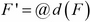。名称是相同的，但功能可能会有所不同，具体取决于已添加、删除或修改的功能类型。然后，我们将编写以下代码：

```py
@decorate
def function():
    pass
```

装饰器紧跟在函数定义的前面。发生的情况是：

```py
def function():
    pass
function= decorate( function )
```

装饰器修改函数定义以创建一个新函数。以下是函数的属性列表：

| 属性 | 内容 |
| --- | --- |
| `__doc__` | 文档字符串，或`None`。 |
| `__name__` | 函数的原始名称。 |
| `__module__` | 函数定义所在的模块的名称，或`None`。 |
| `__qualname__` | 函数的完全限定名称，`__module__.__name__`。 |
| `__defaults__` | 默认参数值，如果没有默认值则为 none。 |
| `__kwdefaults__` | 关键字参数的默认值。 |
| `__code__` | 代表编译函数体的代码对象。 |
| `__dict__` | 函数属性的命名空间。 |
| `__annotations__` | 参数的注释，包括返回注释`'return'`。 |
| `__globals__` | 函数定义所在模块的全局命名空间；这用于解析全局变量，是只读的。 |
| `__closure__` | 函数的自由变量的绑定，或者没有。它是只读的。 |

除了`__globals__`和`__closure__`之外，装饰器可以改变这些属性中的任何一个。然而，我们将在后面看到，深度修改这些属性是不切实际的。

实际上，装饰通常涉及定义一个*包装*现有函数的新函数。可能需要复制或更新一些先前的属性。这为装饰器可以做什么以及应该做什么定义了一个实际的限制。

### 构建类

类构造是一组嵌套的两阶段过程。使类构造更复杂的是类方法的引用方式，涉及到多步查找。对象的类将定义一个**方法解析顺序**（**MRO**）。这定义了如何搜索基类以定位属性或方法名称。MRO 沿着继承层次结构向上工作；这意味着子类名称会覆盖超类名称。这种实现方法搜索符合我们对继承含义的期望。

类构造的第一阶段是原始定义的`class`语句。这个阶段涉及到元类的评估，然后在`class`内部执行一系列赋值和`def`语句。类内的每个`def`语句都会扩展为一个嵌套的两阶段函数构造，如前面所述。装饰器可以应用到每个方法函数上，作为构建类的过程的一部分。

类构造的第二阶段是将整体类装饰器应用于类定义。通常，`decorator`函数可以添加特性。通常更常见的是添加属性而不是添加方法。然而，我们会看到一些装饰器也可以添加方法函数。

从超类继承的特性显然不能通过装饰器进行修改，因为它们是通过方法解析查找惰性解析的。这导致了一些重要的设计考虑。我们通常通过类和混合类来引入方法。我们只能通过装饰器或混合类定义来引入属性。以下是一些为类构建的属性列表。一些额外的属性是元类的一部分；它们在下表中描述：

| 属性 | 内容 |
| --- | --- |
| `__doc__` | 类的文档字符串，如果未定义则为`None` |
| `__name__` | 类名 |
| `__module__` | 定义类的模块名称 |
| `__dict__` | 包含类命名空间的字典 |
| `__bases__` | 一个元组（可能为空或单个元素），包含基类，按照它们在基类列表中的出现顺序；它用于计算方法解析顺序 |
| `__class__` | 这个类的超类，通常是`type`类 |

一些作为类的一部分的额外方法函数包括`__subclasshook__`，`__reduce__`和`__reduce_ex__`，它们是`pickle`接口的一部分。

### 一些类设计原则

在定义一个类时，我们有以下三个属性和方法的来源：

+   类语句

+   应用于类定义的装饰器

+   最后给出的基类与混合类

我们需要意识到每个属性的可见级别。`class`语句是最明显的属性和方法来源。混合类和基类比类体稍微不那么明显。确保基类名称澄清其作为基本的角色是有帮助的。我们试图将基类命名为现实世界的对象。

混合类通常会定义类的额外接口或行为。清楚地了解混合类如何用于构建最终的类定义是很重要的。虽然`docstring`类是其中的重要部分，但整个模块`docstring`也很重要，可以展示如何从各个部分组装一个合适的类。

在编写`class`语句时，基本的超类最后列出，混合类在其之前列出。这不仅仅是约定。最后列出的类是基本的*is-a*类。将装饰器应用于类会导致一些更加晦涩的特性。通常，装饰器的作用相对较小。对一个或几个特性的强调有助于澄清装饰器的作用。

### 面向方面的编程

**面向方面的编程**（AOP）的部分内容与装饰器相关。我们在这里的目的是利用一些面向方面的概念来帮助展示 Python 中装饰器和混合类的目的。横切关注的概念对 AOP 至关重要。以下是一些额外的背景信息：[`en.wikipedia.org/wiki/Cross-cutting_concern`](http://en.wikipedia.org/wiki/Cross-cutting_concern)。以下是一些常见的横切关注的例子：

+   **日志记录**：我们经常需要在许多类中一致地实现日志记录功能。我们希望确保记录器的命名一致，并且日志事件以一致的方式遵循类结构。

+   **可审计性**：日志主题的一个变种是提供一个审计跟踪，显示可变对象的每个转换。在许多面向商业的应用程序中，交易是代表账单或付款的业务记录。业务记录处理过程中的每个步骤都需要进行审计，以显示处理过程中没有引入错误。

+   **安全性**：我们的应用程序经常会有安全方面的需求，涵盖每个 HTTP 请求和网站下载的每个内容。其目的是确认每个请求都涉及经过身份验证的用户，该用户被授权进行请求。必须一致使用 Cookie、安全套接字和其他加密技术，以确保整个 Web 应用程序的安全。

一些语言和工具对 AOP 有深入的正式支持。Python 借鉴了一些概念。Python 对 AOP 的方法涉及以下语言特性：

+   **装饰器**：使用装饰器，我们可以在函数的两个简单连接点之一建立一致的方面实现。我们可以在现有函数之前或之后执行方面的处理。我们不能轻易地在函数的代码内部找到连接点。对于装饰器来说，最容易的方法是通过包装函数或方法来转换它并添加额外的功能。

+   **混合类**：使用混合类，我们可以定义一个存在于单个类层次结构之外的类。混合类可以与其他类一起使用，以提供横切面方面的一致实现。为了使其工作，混合 API 必须被混合到的类使用。通常，混合类被认为是抽象的，因为它们不能有实际意义地实例化。

## 使用内置装饰器

Python 有几个内置装饰器，它们是语言的一部分。`@property`、`@classmethod`和`@staticmethod`装饰器用于注释类的方法。`@property`装饰器将一个方法函数转换为一个描述符。我们使用这个来给一个方法函数提供一个简单属性的语法。应用到方法的属性装饰器还创建了一个额外的属性对，可以用来创建`setter`和`deleter`属性。我们在第三章中看到了这一点，*属性访问、属性和描述符*。

`@classmethod`和`@staticmethod`装饰器将一个方法函数转换为一个类级函数。装饰后的方法现在可以从一个类中调用，而不是一个对象。在静态方法的情况下，没有对类的明确引用。另一方面，对于类方法，类是方法函数的第一个参数。以下是一个包括`@staticmethod`和一些`@property`定义的类的示例：

```py
class Angle( float ):
    __slots__ = ( "_degrees", )
    @staticmethod
    def from_radians( value ):
        return Angle(180*value/math.pi)
    def __new__( cls, value ):
        self = super().__new__(cls)
        self._degrees= value
        return self
    @property
    def radians( self ):
        return math.pi*self._degrees/180
    @property
    def degrees( self ):
        return self._degrees
```

这个类定义了一个可以用度或弧度表示的“角度”。构造函数期望度数。然而，我们还定义了一个`from_radians()`方法函数，它发出类的一个实例。这个函数不适用于实例变量；它适用于类本身，并返回类的一个实例。`__new__()`方法隐式地是一个类方法。没有使用装饰器。

此外，我们提供了`degrees()`和`radians()`方法函数，它们已经被装饰为属性。在底层，这些装饰器创建了一个描述符，以便访问属性名`degrees`或`radians`将调用命名的方法函数。我们可以使用`static`方法创建一个实例，然后使用`property`方法访问一个方法函数：

```py
>>> b=Angle.from_radians(.227)
>>> b.degrees
13.006141949469686
```

静态方法实际上是一个函数，因为它不与`self`实例变量绑定。它的优势在于它在语法上绑定到类；使用`Angle.from_radians`可能比使用名为`angle_from_radians`的函数微小地更有帮助。使用这些装饰器可以确保实现正确和一致。

### 使用标准库装饰器

标准库有许多装饰器。像`contextlib`、`functools`、`unittest`、`atexit`、`importlib`和`reprlib`这样的模块包含了优秀的跨切面软件设计的装饰器示例。例如，`functools`库提供了`total_ordering`装饰器来定义比较运算符。它利用`__eq__()`和`__lt__()`、`__le__()`、`__gt__()`或`__ge__()`来创建一个完整的比较套件。以下是定义了两个比较的`Card`类的变化：

```py
import functools
@functools.total_ordering
class Card:
    __slots__ = ( "rank", "suit" )
    def __new__( cls, rank, suit ):
        self = super().__new__(cls)
        self.rank= rank
        self.suit= suit
        return self
    def __eq__( self, other ):
        return self.rank == other.rank
    def __lt__( self, other ):
        return self.rank < other.rank
```

我们的类被一个类级装饰器`@functools.total_ordering`包装。这个装饰器创建了缺失的方法函数。我们可以使用这个类来创建可以使用所有比较运算符进行比较的对象，即使只定义了两个。以下是我们定义的比较的示例，以及我们没有定义的比较：

```py
>>> c1= Card( 3, '♠' )
>>> c2= Card( 3, '♥' )
>>> c1 == c2
True
>>> c1 < c2
False
>>> c1 <= c2
True
>>> c1 >= c2
True
```

这个交互显示了我们能够进行未在原始类中定义的比较。装饰器为原始类定义添加了方法函数。

## 使用标准库混合类

标准库使用了混合类定义。有几个模块包含了示例，包括`io`、`socketserver`、`urllib.request`、`contextlib`和`collections.abc`。

当我们基于`collections.abc`抽象基类定义自己的集合时，我们利用混合来确保容器的交叉切面方面得到一致的定义。顶层集合（`Set`、`Sequence`和`Mapping`）都是由多个混合构建的。非常重要的是要查看*Python 标准库*的第 8.4 节，看看混合如何贡献特性，因为整体结构是由各个部分构建起来的。

仅看一行，`Sequence`的摘要，我们看到它继承自`Sized`、`Iterable`和`Container`。这些混合类导致了`__contains__()`、`__iter__()`、`__reversed__()`、`index()`和`count()`方法。

### 使用上下文管理器混合类

当我们在第五章中看上下文管理器时，*使用可调用和上下文*，我们忽略了`ContextDecorator`混合，而是专注于特殊方法本身。使用混合可以使定义更清晰。

### 提示

在之前的示例版本中，我们创建了一个改变全局状态的上下文管理器；它重置了随机数种子。我们将重新设计该设计，使得一副牌可以成为自己的上下文管理器。当作为上下文管理器使用时，它可以生成一系列固定的牌。这并不是测试一副牌的最佳方式。然而，这是上下文管理器的一个简单用法。

将上下文管理定义为应用类的混合需要一些小心。我们可能需要重新设计初始化方法以去除一些假设。我们的应用类可以以以下两种不同的方式使用：

+   当在`with`语句之外使用时，`__enter__()`和`__exit__()`方法将不会被评估

+   当在`with`语句中使用时，`__enter__()`和`__exit__()`方法将被评估

在我们的情况下，我们不能假设在`__init__()`处理期间评估`shuffle()`方法是有效的，因为我们不知道上下文管理器方法是否会被使用。我们不能将洗牌推迟到`__enter__()`，因为它可能不会被使用。这种复杂性可能表明我们提供了太多的灵活性。要么我们必须懒洋洋地洗牌，就在第一次`pop()`之前，要么我们必须提供一个可以被子类关闭的方法函数。以下是一个扩展`list`的简单`Deck`定义：

```py
class Deck( list ):
    def __init__( self, size=1 ):
        super().__init__()
        self.rng= random.Random()
        for d in range(size):
            cards = [ card(r,s) for r in range(13) for s in Suits ]
            super().extend( cards )
        self._init_shuffle()
    def _init_shuffle( self ):
        self.rng.shuffle( self )
```

我们已经定义了这个牌组有一个可移除的`_init_shuffle()`方法。子类可以重写这个方法来改变何时洗牌完成。`Deck`的子类可以在洗牌之前设置随机数生成器的种子。这个版本的类可以避免在创建时洗牌。以下是包含`contextlib.ContextDecorator`混入的`Deck`的子类：

```py
class TestDeck( ContextDecorator, Deck ):
    def __init__( self, size= 1, seed= 0 ):
        super().__init__( size=size )
        self.seed= seed
    def _init_shuffle( self ):
        """Don't shuffle during __init__."""
        pass
    def __enter__( self ):
        self.rng.seed( self.seed, version=1 )
        self.rng.shuffle( self )
        return self
    def __exit__( self, exc_type, exc_value, traceback ):
        pass
```

这个子类通过重写`_init_shuffle()`方法来防止初始化期间的洗牌。因为它混入了`ContextDecorator`，所以它还必须定义`__enter__()`和`__exit__()`。`Deck`的这个子类可以在`with`上下文中工作。在`with`语句中使用时，随机数种子被设置，洗牌将使用已知的序列。如果在`with`语句之外使用，那么洗牌将使用当前的随机数设置，并且不会进行`__enter__()`评估。

这种编程风格的目的是将类的真正基本特征与`Deck`实现的其他方面分开。我们已经将一些随机种子处理与`Deck`的其他方面分开。显然，如果我们坚持要求使用上下文管理器，我们可以大大简化事情。这并不是`open()`函数的典型工作方式。然而，这可能是一个有用的简化。我们可以使用以下示例来查看行为上的差异：

```py
for i in range(3):
    d1= Deck(5)
    print( d1.pop(), d1.pop(), d1.pop() )
```

这个例子展示了`Deck`如何单独使用来生成随机洗牌。这是使用`Deck`生成洗牌卡片的简单用法。下一个例子展示了带有给定种子的`TestDeck`：

```py
for i in range(3):
    with TestDeck(5, seed=0) as d2:
        print( d2.pop(), d2.pop(), d2.pop() )
```

这展示了`TestDeck`，`Deck`的子类，它被用作上下文管理器来生成一系列已知的卡片。每次调用它，我们都会得到相同的卡片序列。

### 关闭类功能

我们通过重新定义一个方法函数的主体为`pass`来关闭初始化期间的洗牌功能。这个过程可能看起来有点冗长，以便从子类中删除一个功能。在子类中删除功能的另一种方法是将方法名称设置为`None`。我们可以在`TestDeck`中这样做来移除初始洗牌：

```py
_init_shuffle= None
```

前面的代码需要在超类中进行一些额外的编程来容忍缺失的方法，这在以下片段中显示：

```py
try:
    self._init_shuffle()
except AttributeError, TypeError:
    pass
```

这可能是在子类定义中删除一个功能的一种更加明确的方式。这表明该方法可能丢失，或者已经被故意设置为`None`。另一种替代设计是将对`_init_shuffle()`的调用从`__init__()`移动到`__enter__()`方法。这将需要使用上下文管理器来使对象正常工作。如果清楚地记录下来，这并不是太繁琐的负担。

## 编写一个简单的函数装饰器

`decorator`函数是一个返回新函数的函数（或可调用对象）。最简单的情况涉及一个参数：要装饰的函数。装饰器的结果是一个已经包装过的函数。基本上，额外的功能要么放在原始功能之前，要么放在原始功能之后。这是函数中两个可用的连接点。

当我们定义一个装饰器时，我们希望确保装饰的函数具有原始函数的名称和`docstring`。这些属性应该由装饰器设置，我们将使用它们来编写装饰的函数。使用`functools.wraps`编写新装饰器可以简化我们需要做的工作，因为这部分繁琐的工作已经为我们处理了。

为了说明功能可以插入的两个位置，我们可以创建一个调试跟踪装饰器，它将记录函数的参数和返回值。这将在调用函数之前和之后放置功能。以下是我们想要包装的一些定义的函数，`some_function`：

```py
logging.debug( "function(", args, kw, ")" )
result= some_function( *args, **kw )
logging.debug( "result = ", result )
return result
```

这段代码显示了我们将有新的处理来包装原始函数。

通过戳击底层的`__code__`对象很难在定义的函数中插入处理。在极少数情况下，似乎有必要在函数中间注入一个方面时，将函数重写为可调用对象要容易得多，通过将功能分解为多个方法函数。然后，我们可以使用混合和子类定义，而不是复杂的代码重写。以下是一个调试装饰器，在函数评估之前和之后插入日志记录：

```py
def debug( function ):
    @functools.wraps( function )
    def logged_function( *args, **kw ):
        logging.debug( "%s( %r, %r )", function.__name__, args, kw, )
        result= function( *args, **kw )
        logging.debug( "%s = %r", function.__name__, result )
        return result
    return logged_function
```

我们已经使用`functools.wraps`装饰器来确保原始函数的名称和`docstring`在结果函数中得到保留。现在，我们可以使用我们的装饰器来产生嘈杂、详细的调试。例如，我们可以这样做，将装饰器应用于某个函数`ackermann()`：

```py
@debug
def ackermann( m, n ):
    if m == 0: return n+1
    elif m > 0 and n == 0: return ackermann( m-1, 1 )
    elif m > 0 and n > 0: return ackermann( m-1, ackermann( m, n-1 ) )
```

此定义使用日志模块将调试信息写入`root`记录器，以调试`ackermann()`函数。我们配置记录器以生成以下调试输出：

```py
logging.basicConfig(stream=sys.stderr, level=logging.DEBUG)
```

我们将在第十四章中详细讨论日志记录，*日志和警告模块*。当我们评估`ackermann(2,4)`时，我们将看到这种结果：

```py
DEBUG:root:ackermann( (2, 4), {} )
DEBUG:root:ackermann( (2, 3), {} )
DEBUG:root:ackermann( (2, 2), {} )
.
.
.
DEBUG:root:ackermann( (0, 10), {} )
DEBUG:root:ackermann = 11
DEBUG:root:ackermann = 11
DEBUG:root:ackermann = 11
```

### 创建单独的记录器

作为日志优化，我们可能希望为每个包装的函数使用特定的记录器，而不是过度使用根记录器进行此类调试输出。我们将在第十四章中返回记录器，*日志和警告模块*。以下是我们的装饰器的一个版本，它为每个单独的函数创建一个单独的记录器：

```py
def debug2( function ):
    @functools.wraps( function )
    def logged_function( *args, **kw ):
        log= logging.getLogger( function.__name__ )
        log.debug( "call( %r, %r )", args, kw, )
        result= function( *args, **kw )
        log.debug( "result %r", result )
        return result
    return logged_function
```

这个版本修改了输出，看起来像这样：

```py
DEBUG:ackermann:call( (2, 4), {} )
DEBUG:ackermann:call( (2, 3), {} )
DEBUG:ackermann:call( (2, 2), {} )
.
.
.
DEBUG:ackermann:call( (0, 10), {} )
DEBUG:ackermann:result 11
DEBUG:ackermann:result 11
DEBUG:ackermann:result 11
```

函数名现在是记录器名称。这可以用于微调调试输出。我们现在可以为单个函数启用日志记录。我们不能轻易更改装饰器并期望装饰的函数也会改变。

我们需要将修改后的装饰器应用于函数。这意味着无法从`>>>`交互提示符轻松地进行调试和实验。我们必须在调整装饰器定义后重新加载函数定义。这可能涉及大量的复制和粘贴，或者可能涉及重新运行定义装饰器、函数，然后运行测试或演示脚本以展示一切都按预期工作。

## 给装饰器加参数

有时我们想要为装饰器提供更复杂的参数。想法是我们将要定制包装函数。当我们这样做时，装饰变成了一个两步过程。

当我们编写以下代码时，我们为函数定义提供了一个带参数的装饰器：

```py
@decorator(arg)
def func( ):
    pass
```

装饰器的使用是以下代码的简写：

```py
def func( ):
    pass
func= decorator(arg)(func)
```

这两个示例都做了以下三件事：

+   定义了一个函数，`func`

+   将抽象装饰器应用于其参数，以创建具体装饰器，`decorator(arg)`

+   将定义的函数应用具体装饰器，以创建函数的装饰版本，`decorator(arg)(func)`

这意味着带有参数的装饰器将需要间接构造最终函数。让我们再次微调我们的调试装饰器。我们想要做以下事情：

```py
@debug("log_name")
def some_function( args ):
    pass
```

这种代码允许我们明确命名调试输出将要进入的日志。我们不使用根记录器，也不默认为每个函数使用不同的记录器。参数化装饰器的概要如下所示：

```py
def decorator(config):
    def concrete_decorator(function):
        @functools.wraps( function )
        def wrapped( *args, **kw ):
            return function( *args, ** kw )
        return wrapped
    return concrete_decorator
```

在查看示例之前，让我们先剥开这个装饰器的层层皮。装饰器定义（`def decorator(config)`）显示了我们在使用装饰器时将提供的参数。其中的具体装饰器是返回的具体装饰器。具体装饰器（`def concrete_decorator(function)`）是将应用于目标函数的装饰器。这与前一节中显示的简单函数装饰器一样。它构建了包装函数（`def wrapped(*args, **kw)`），然后返回它。以下是我们命名的调试版本：

```py
def debug_named(log_name):
    def concrete_decorator(function):
        @functools.wraps( function )
        def wrapped( *args, **kw ):
            log= logging.getLogger( log_name )
            log.debug( "%s( %r, %r )", function.__name__, args, kw, )
            result= function( *args, **kw )
            log.debug( "%s = %r", function.__name__, result )
            return result
        return wrapped
    return concrete_decorator
```

这个`decorator`函数接受一个参数，即要使用的日志的名称。它创建并返回一个具体装饰器函数。当这个函数应用于一个函数时，具体装饰器返回给定函数的包装版本。当函数以以下方式使用时，装饰器会添加嘈杂的调试行。它们将输出到名为`recursion`的日志中，如下所示：

```py
@debug_named("recursion")
def ackermann( m, n ):
    if m == 0: return n+1
    elif m > 0 and n == 0: return ackermann( m-1, 1 )
    elif m > 0 and n > 0: return ackermann( m-1, ackermann( m, n-1 ) )
```

## 创建方法函数装饰器

类定义的方法函数的装饰器与独立函数的装饰器是相同的。它只是在不同的上下文中使用。这种不同上下文的一个小后果是，我们经常必须明确命名`self`变量。

方法函数装饰的一个应用是为对象状态变化产生审计跟踪。业务应用程序通常创建有状态记录；通常情况下，这些记录在关系数据库中表示为行。我们将在第九章中查看对象表示，*序列化和保存 - JSON、YAML、Pickle、CSV 和 XML*，第十章，*通过 Shelve 存储和检索对象*，和第十一章，*通过 SQLite 存储和检索对象*。

### 注意

当我们有有状态的记录时，状态变化需要进行审计。审计可以确认记录已经进行了适当的更改。为了进行审计，每个记录的之前和之后版本必须在某个地方可用。有状态的数据库记录是一个长期的传统，但并不是必需的。不可变的数据库记录是一个可行的设计替代方案。

当我们设计有状态的类时，我们编写的任何 setter 方法都会导致状态变化。这些 setter 方法通常使用`@property`装饰器，以便它们看起来像简单的属性。如果我们这样做，我们可以加入一个`@audit`装饰器，用于跟踪对象的更改，以便我们有一个正确的更改记录。我们将通过`logging`模块创建审计日志。我们将使用`__repr__()`方法函数生成一个完整的文本表示，用于检查更改。以下是一个审计装饰器：

```py
def audit( method ):
    @functools.wraps(method)
    def wrapper( self, *args, **kw ):
        audit_log= logging.getLogger( 'audit' )
        before= repr(self)
        try:
            result= method( self, *args, **kw )
            after= repr(self)
        except Exception as e:
           audit_log.exception(
               '%s before %s\n after %s', method.__qualname__, before, after )
           raise
        audit_log.info(
               '%s before %s\n after %s', method.__qualname__, before, after )
        return result
    return wrapper
```

我们已经创建了对象的*之前*版本的文本备忘录。然后，我们应用了原始方法函数。如果出现异常，我们将生成包含异常详细信息的审计日志。否则，我们将在日志中产生一个`INFO`条目，其中包含方法的限定名称、更改前备忘录和更改后备忘录。以下是显示如何使用此装饰器的`Hand`类的修改：

```py
class Hand:
    def __init__( self, *cards ):
        self._cards = list(cards)
    **@audit
    def __iadd__( self, card ):
        self._cards.append( card )
        return self
    def __repr__( self ):
        cards= ", ".join( map(str,self._cards) )
        return "{__class__.__name__}({cards})".format(__class__=self.__class__, cards=cards)
```

这个定义修改了`__iadd__()`方法函数，使得添加一张卡变成了一个可审计的事件。这个装饰器将执行审计操作，保存`Hand`操作前后的文本备忘录。

这种方法装饰器的使用正式声明了一个特定的方法函数已经进行了重大的状态改变。我们可以轻松地使用代码审查来确保所有适当的方法函数都被标记为像这样的审核。一个悬而未决的问题是审核对象的创建。并不十分清楚对象的创建是否需要审核记录。可以争论说对象的创建不是状态改变。

如果我们想要审核创建，我们不能在`__init__()`方法函数上使用这个`audit`装饰器。因为在执行`__init__()`之前没有之前的图像。我们可以采取两种补救措施，如下所示：

+   我们可以添加一个`__new__()`方法，确保将一个空的`_cards`属性作为一个空集合添加到类中

+   我们可以调整`audit()`装饰器以容忍`AttributeError`，这将在处理`__init__()`时出现

第二个选项更加灵活。我们可以这样做：

```py
try:
    before= repr(self)
except AttributeError as e:
    before= repr(e)
```

这将记录一条消息，例如`AttributeError: 'Hand' object has no attribute '_cards'`，用于初始化期间的前状态。

## 创建一个类装饰器

类似于装饰函数，我们可以编写一个类装饰器来为类定义添加功能。基本规则是相同的。装饰器是一个函数（或可调用对象）。它接收一个类对象作为参数，并返回一个类对象作为结果。

在整个类定义中，我们有有限的连接点。在大多数情况下，类装饰器会将额外的属性合并到类定义中。从技术上讲，可以创建一个包装原始类定义的新类。这是具有挑战性的，因为包装类必须非常通用。还可以创建一个是装饰类定义的子类的新类。这可能会让装饰器的用户感到困惑。还可以从类定义中删除功能，这似乎非常糟糕。

之前展示了一个复杂的类装饰器。`functools.Total_Ordering`装饰器将一些新的方法函数注入到类定义中。这个实现中使用的技术是创建 lambda 对象并将它们分配给类的属性。

我们将看一个稍微简单的装饰器。在调试和记录日志期间，我们可能会遇到一个小问题，即创建专注于我们的类的记录器。通常，我们希望每个类都有一个唯一的记录器。我们经常被迫做类似以下的事情：

```py
class UglyClass1:
    def __init__( self ):
        self.logger= logging.getLogger(self.__class__.__qualname__)
        self.logger.info( "New thing" )
    def method( self, *args ):
        self.logger.info( "method %r", args )
```

这个类的缺点是它创建了一个`logger`实例变量，它实际上并不是类的操作的一部分，而是类的一个独立方面。我们希望避免用这个额外的方面来污染类。而且，尽管`logging.getLogger()`非常高效，但成本是非零的。我们希望避免在每次创建`UglyClass1`的实例时都产生这种额外的开销。

以下是一个稍微更好的版本。记录器被提升为类级实例变量，并且与类的每个单独对象分开：

```py
class UglyClass2:
    logger= logging.getLogger("UglyClass2")
    def __init__( self ):
        self.logger.info( "New thing" )
    def method( self, *args ):
        self.logger.info( "method %r", args )
```

这样做的好处是只实现了一次`logging.getLogger()`。然而，它存在一个严重的 DRY 问题。我们无法在类定义中自动设置类名。因为类还没有被创建，所以我们被迫重复类名。通过一个小装饰器解决了 DRY 问题，如下所示：

```py
def logged( class_ ):
    class_.logger= logging.getLogger( class_.__qualname__ )
    return class_
```

这个装饰器调整了类定义，将`logger`引用作为类级属性添加进去。现在，每个方法都可以使用`self.logger`来生成审计或调试信息。当我们想要使用这个功能时，我们可以在整个类上使用`@logged`装饰器。以下是一个已记录的类`SomeClass`的示例：

```py
@logged
class SomeClass:
    def __init__( self ):
        self.logger.info( "New thing" )
    def method( self, *args ):
        self.logger.info( "method %r", args )
```

现在，我们的类有一个`logger`属性，可以被任何方法使用。日志记录器的值不是对象的特性，这使得这个方面与类的其余方面分离开来。这个属性的附加好处是它在模块导入期间创建了日志记录器实例，稍微减少了日志记录的开销。让我们将其与`UglyClass1`进行比较，其中`logging.getLogger()`在每个实例创建时都会被评估。

## 向类添加方法函数

类装饰器通过两步过程创建新的方法函数：创建方法函数，然后将其插入类定义中。这通常比通过装饰器更好地通过混入类来完成。混入的明显和预期的用途是插入方法。以另一种方式插入方法不太明显，可能会令人惊讶。

在`Total_Ordering`装饰器的例子中，插入的确切方法函数是灵活的，并且取决于已经提供的内容。这是一种典型但非常聪明的特殊情况。

我们可能想要定义一个标准的`memento()`方法。我们希望在各种类中包含这个标准方法函数。我们将看一下装饰器和混入版本的设计。以下是添加标准方法的装饰器版本：

```py
def memento( class_ ):
    def memento( self ):
        return "{0.__class__.__qualname__}({0!r})".format(self)
    class_.memento= memento
    return class_
```

这个装饰器包括一个插入到类中的方法函数定义。以下是我们如何使用`@memento`装饰器向类添加方法函数：

```py
@memento
class SomeClass:
    def __init__( self, value ):
        self.value= value
    def __repr__( self ):
        return "{0.value}".format(self)
```

装饰器将一个新方法`memento()`合并到装饰类中。然而，这有以下缺点：

+   我们不能覆盖`memento()`方法函数的实现以处理特殊情况。它是在类的定义之后构建的。

+   我们不能轻易地扩展装饰器函数。我们必须升级为可调用对象以提供扩展或特殊化。如果我们要升级为可调用对象，我们应该放弃这种方法，并使用混入来添加方法。

以下是添加标准方法的混入类：

```py
class Memento:
    def memento( self ):
        return "{0.__class__.__qualname__}({0!r})".format(self)
```

以下是我们如何使用`Memento`混入类来定义一个应用程序类：

```py
class SomeClass2( Memento ):
    def __init__( self, value ):
        self.value= value
    def __repr__( self ):
        return "{0.value}".format(self)
```

混入提供了一个新方法`memento()`；这是混入的预期和典型目的。我们可以更容易地扩展`Memento`混入类以添加功能。此外，我们可以覆盖`memento()`方法函数以处理特殊情况。

## 使用装饰器进行安全性

软件充满了横切关注点，需要一致地实现，即使它们在不同的类层次结构中。试图在横切关注点周围强加一个类层次结构通常是错误的。我们已经看过一些例子，比如日志记录和审计。

我们不能合理地要求每个可能需要写入日志的类也是某个`loggable`超类的子类。我们可以设计一个`loggable`混入或一个`loggable`装饰器。这些不会干扰我们需要设计的正确继承层次结构，以使多态性正常工作。

一些重要的横切关注点围绕着安全性。在 Web 应用程序中，安全问题有两个方面，如下所示：

+   **认证**：我们知道谁在发出请求吗？

+   **授权**：经过认证的用户是否被允许发出请求？

一些 Web 框架允许我们使用安全要求装饰我们的请求处理程序。例如，Django 框架有许多装饰器，允许我们为视图函数或视图类指定安全要求。其中一些装饰器如下：

+   `user_passes_test`：这是一个低级别的装饰器，非常通用，用于构建其他两个装饰器。它需要一个测试函数；与请求相关联的已登录的`User`对象必须通过给定的函数。如果`User`实例无法通过给定的测试，它们将被重定向到登录页面，以便用户提供所需的凭据来发出请求。

+   `login_required`：这个装饰器基于`user_passes_test`。它确认已登录用户已经通过身份验证。这种装饰器用于适用于所有访问站点的人的 Web 请求。例如，更改密码或注销登录等请求不应需要更具体的权限。

+   `permission_required`：这个装饰器与 Django 内部定义的数据库权限方案一起工作。它确认已登录用户（或用户组）与给定权限相关联。这种装饰器用于需要特定管理权限才能发出请求的 Web 请求。

其他包和框架也有表达 Web 应用程序的这种横切方面的方法。在许多情况下，Web 应用程序可能会有更严格的安全考虑。我们可能有一个 Web 应用程序，用户功能是基于合同条款和条件有选择地解锁的。也许，额外的费用将解锁一个功能。我们可能需要设计一个像下面这样的测试：

```py
def user_has_feature( feature_name ):
    def has_feature( user ):
        return feature_name in (f.name for f in user.feature_set())
    return user_passes_test( has_feature )
```

我们已经定义了一个函数，检查已登录的`User`的`feature_set`集合，以查看命名的功能是否与`User`相关联。我们使用了我们的`has_feature()`函数与 Django 的`user_passes_test`装饰器来创建一个可以应用于相关`view`函数的新装饰器。然后我们可以创建一个`view`函数如下：

```py
@user_has_feature( 'special_bonus' )
def bonus_view( request ):
    pass
```

这确保安全性问题将一致地应用于许多`view`函数。

## 总结

我们已经看过使用装饰器来修改函数和类定义。我们还看过混入，它允许我们将一个较大的类分解为组件，然后将它们组合在一起。

这两种技术的想法都是将特定于应用程序的特性与安全性、审计或日志记录等通用特性分开。我们将区分类的固有特性和不固有但是额外关注的方面。固有特性是显式设计的一部分。它们是继承层次结构的一部分；它们定义了对象是什么。其他方面可以是混入或装饰；它们定义了对象可能还会起到的作用。

### 设计考虑和权衡

在大多数情况下，*是*和*行为*之间的区分是非常明确的。固有特征是整体问题域的一部分。当谈论模拟 21 点游戏时，诸如卡片、手牌、下注、要牌和停牌等内容显然是问题域的一部分。类似地，数据收集和结果的统计分析是解决方案的一部分。其他事情，如日志记录、调试和审计，不是问题域的一部分，而是与解决方案技术相关的。

虽然大多数情况都很明确，固有和装饰方面之间的分界线可能很微妙。在某些情况下，这可能会变成审美判断。一般来说，在编写不专注于特定问题的框架和基础设施类时，决策变得困难。一般策略如下：

+   首先，与问题相关的方面将直接导致类定义。许多类是问题的固有部分，并形成适当的类层次结构，以便多态性能够正常工作。

+   其次，某些方面会导致混合类定义。当存在多维方面时，这种情况经常发生。我们可能会有独立的设计轴或维度。每个维度都可以提供多态的选择。当我们看 21 点游戏时，有两种策略：玩牌策略和下注策略。这些是独立的，可以被视为整体玩家设计的混合元素。

当我们定义单独的混合元素时，可以为混合元素定义单独的继承层次结构。对于 21 点下注策略，我们可以定义一个与玩牌策略的多态层次结构无关的多态层次结构。然后我们可以定义玩家，其混合元素来自两个层次结构。

方法通常是从类定义中创建的。它们可以是主类的一部分，也可以是混合类的一部分。如上所述，我们有三种设计策略：包装、扩展和发明。我们可以通过“包装”一个类来引入功能。在某些情况下，我们发现自己不得不暴露大量方法，这些方法只是委托给底层类。在这种情况下，我们有一个模糊的边界，我们委托过多；装饰器或混合类定义可能是更好的选择。在其他情况下，包装一个类可能比引入混合类定义更清晰。

与问题正交的方面通常可以通过装饰器定义来处理。装饰器可以用来引入不属于对象与其类之间*is-a*关系的特性。

### 展望未来

接下来的章节将改变方向。我们已经了解了几乎所有 Python 的特殊方法名称。接下来的五章将专注于对象持久化和序列化。我们将从将对象序列化和保存到各种外部表示法开始，包括 JSON、YAML、Pickle、CSV 和 XML。

序列化和持久化为我们的类引入了更多的面向对象设计考虑。我们将研究对象关系以及它们的表示方式。我们还将研究序列化和反序列化对象的成本复杂性，以及与从不可信来源反序列化对象相关的安全问题。
