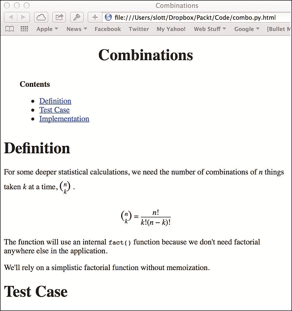

# 第三部分：测试、调试、部署和维护

日志和警告模块

测试设计

应对命令行

模块和包设计

质量和文档

# 测试、调试、部署和维护

应用程序开发涉及许多技能，超出了在 Python 中进行面向对象设计和编程。我们将看一些额外的主题，帮助我们从仅仅编程向解决用户问题迈进：

+   第十四章*日志和警告模块*将介绍如何使用`logging`和`warnings`模块来创建审计信息以及调试。我们将迈出一个重要的步骤，超越使用`print()`函数。`logging`模块为我们提供了许多功能，使我们能够以简单和统一的方式生成审计、调试和信息消息。由于这是高度可配置的，我们可以提供有用的调试以及冗长的处理选项。

+   我们将研究测试设计以及我们如何在第十五章*测试设计*中使用`unittest`和`doctest`。自动化测试应被视为绝对必要。在没有自动化单元测试提供充分证据表明代码有效之前，编程不应被视为完成。

+   我们的程序的命令行界面为我们提供了选项和参数。这主要适用于小型、面向文本的程序以及长时间运行的应用程序服务器。然而，即使是 GUI 应用程序也可以使用命令行选项进行配置。第十六章*应对命令行*将介绍如何使用`argparse`模块来解析选项和参数。我们将进一步采用**命令**设计模式来创建可以组合和扩展的程序组件，而无需编写 shell 脚本。

+   在第十七章*模块和包设计*中，我们将研究模块和包设计。这是一个比我们迄今为止所看到的类设计主题更高级别的考虑。模块和类设计重复了 Wrap、Extend 或 Invent 的策略。我们不是在看相关数据和操作，而是在看模块中相关的类和包中相关的模块。

+   在第十八章*质量和文档*中，我们将看一下如何记录我们的设计，以建立我们的软件是正确的并且是正确实现的信任。

本部分强调使用这些附加模块来提高软件质量的方法。与第一部分中的*通过特殊方法创建 Pythonic 类*和第二部分中的*持久性和序列化*不同，这些工具和技术并不狭隘地专注于解决特定问题。这些主题更广泛地适用于掌握面向对象的 Python。

# 第十四章：日志和警告模块

有一些基本的日志技术，我们可以用于调试以及应用程序的操作支持。特别是，一个良好的日志可以帮助证明应用程序满足其安全性和可审计性要求。

有时我们会有多个具有不同类型信息的日志。我们可能会将安全、审计和调试分开成单独的日志。在某些情况下，我们可能需要一个统一的日志。我们将看一些做这件事的例子。

我们的用户可能希望获得详细的输出，以确认程序的正确运行。这与调试输出不同；最终用户正在检查程序如何解决他们的问题。例如，他们可能希望更改他们的输入或以不同方式处理您程序的输出。设置详细程度会产生一个满足用户需求的日志。

`warnings`模块可以为开发人员和用户提供有用的信息。对于开发人员，我们可以使用警告来告诉您某个 API 已被弃用。对于用户，我们可能想告诉您结果是有问题的，但严格来说并不是错误的。可能存在有问题的假设或可能令用户困惑的默认值，应该向用户指出。

软件维护人员需要启用日志记录以进行有用的调试。我们很少希望*全面*调试输出：结果日志可能会难以阅读。我们经常需要有针对性的调试来追踪特定问题，以便我们可以修改单元测试用例并修复软件。

在尝试解决程序崩溃问题时，我们可能希望创建一个小的循环队列来捕获最近的几个事件。我们可以使用这个来隔离问题，而不必筛选大型日志文件。

## 创建一个基本日志

日志记录有两个必要的步骤：

+   使用`logging.getLogger()`函数获取一个`logging.Logger`实例。

+   使用该`Logger`创建消息。有许多方法，如`warn()`、`info()`、`debug()`、`error()`和`fatal()`，可以创建具有不同重要性级别的消息。

然而，这两个步骤还不足以给我们任何输出。还有第三步，只有在需要查看输出时才会执行。有些日志记录是为了调试目的，不一定总是需要查看日志。可选的步骤是配置`logging`模块的处理程序、过滤器和格式化程序。我们可以使用`logging.basicConfig()`函数来实现这一点。

甚至可以跳过第一步。我们可以使用`logging`模块顶层函数中的默认记录器。我们在第八章中展示了这一点，*装饰器和混入-横切面*，因为重点是装饰，而不是记录。我们建议您不要使用默认的根记录器。我们需要一些背景知识才能理解为什么最好避免使用根记录器。

`Logger`的实例由名称标识。这些名称是由`.`分隔的字符串，形成一个层次结构。有一个名称为`""`的根记录器-空字符串。所有其他`Loggers`都是这个根`Logger`的子记录器。

由于这个命名为`Loggers`的树，我们通常使用根`Logger`来配置整个树。当找不到适当命名的`Logger`时，我们也会使用它。如果我们还使用根`Logger`作为特定模块的第一类日志，那么只会造成混乱。

除了名称外，`Logger`还可以配置一个处理程序列表，确定消息写入的位置，以及一个`Filters`列表，确定传递或拒绝哪种类型的消息。记录器是记录日志的基本 API：我们使用记录器来创建`LogRecords`。然后这些记录被路由到`Filters`和`Handlers`，通过的记录被格式化，最终被存储在本地文件或通过网络传输。

最佳实践是为我们的每个类或模块创建一个独立的记录器。由于`Logger`名称是由`.`分隔的字符串，`Logger`名称可以与类或模块名称平行；我们应用程序的组件定义层次结构将有一个平行的记录器层次结构。我们可能有一个类似以下代码的类：

```py
import logging
class Player:
    def __init__( self, bet, strategy, stake ):
        self.logger= logging.getLogger( self.__class__.__qualname__ )
        self.logger.debug( "init bet {0}, strategy {1}, stake {2}".format(
            bet, strategy, stake) )
```

这将确保用于此类的`Logger`对象将具有与类的限定名称相匹配的名称。

### 创建一个共享的类级别的记录器

正如我们在第八章中指出的，*装饰器和混合 - 横切面方面*，通过定义一个在类定义本身之外创建记录器的装饰器，可以使创建类级别的记录器变得更加清晰。这是我们定义的装饰器：

```py
def logged( class_ ):
    class_.logger= logging.getLogger( class_.__qualname__ )
    return class_
```

这将创建`logger`作为类的一个特性，由所有实例共享。现在，我们可以定义一个类，如以下代码：

```py
@logged
class Player:
    def __init__( self, bet, strategy, stake ):
        self.logger.debug( "init bet {0}, strategy {1}, stake {2}".format(
            bet, strategy, stake) )
```

这将向我们保证该类具有预期名称的记录器。然后，我们可以在各种方法中使用`self.logger`，并确信它将是`logging.Logger`的有效实例。

当我们创建`Player`的实例时，我们将激活记录器。默认情况下，我们看不到任何东西。`logging`模块的初始配置不包括产生任何输出的处理程序或级别。我们需要更改`logging`配置才能看到任何内容。

`logging`模块工作的最重要的好处是，我们可以在我们的类和模块中包含日志记录功能，而不必担心整体配置。默认行为将是静默的，并且引入的开销非常小。因此，我们可以在我们定义的每个类中始终包含日志记录功能。

### 配置记录器

我们需要提供两个配置细节才能看到我们日志中的输出：

+   我们正在使用的记录器需要与产生显着输出的处理程序相关联

+   处理程序需要一个将传递我们的日志消息的日志级别

`logging`包有各种配置方法。我们将在这里展示`logging.basicConfig()`。我们将单独查看`logging.config.dictConfig()`。

`logging.basicConfig()`方法允许使用一些参数创建一个单一的`logging.handlers.StreamHandler`来记录输出。在许多情况下，这就是我们所需要的：

```py
import logging
import sys
logging.basicConfig( stream=sys.stderr, level=logging.DEBUG )
```

这将配置一个`StreamHandler`实例，它将写入`sys.stderr`。它将传递具有大于或等于给定级别的消息。通过使用`logging.DEBUG`，我们确保看到所有消息。默认级别是`logging.WARN`。

执行此配置后，我们将看到我们的调试消息：

```py
>>> p= Player( 1, 2, 3 )
DEBUG:Player:init bet 1, strategy 2, stake 3
```

默认格式显示了级别（`DEBUG`），记录器的名称（`Player`）和我们生成的字符串。`LogRecord`中还有更多的属性可以显示。通常，这种默认格式是可以接受的。

### 启动和关闭日志系统

`logging`模块以一种避免手动管理全局状态信息的方式定义。全局状态在`logging`模块内部处理。我们可以将应用程序写成单独的部分，并确信这些组件将通过`logging`接口正确合作。例如，我们可以在一些模块中包含`logging`，而在其他模块中完全省略它，而不必担心兼容性或配置。

最重要的是，我们可以在整个应用程序中包含日志记录请求，而无需配置任何处理程序。顶层主脚本可以完全省略`import logging`。在这种情况下，日志记录代码不会出现任何错误或问题。

由于日志记录的分散性质，很容易在应用程序的顶层仅配置一次。我们应该只在应用程序的`if __name__ == "__main__":`部分内部配置`logging`。我们将在第十六章中更详细地讨论这个问题，*处理命令行*。

我们的许多日志处理程序涉及缓冲。在大多数情况下，缓冲区将在正常事件过程中刷新。虽然我们可以忽略日志记录如何关闭，但使用`logging.shutdown()`稍微更可靠，以确保所有缓冲区都刷新到设备。

处理顶层错误和异常时，我们有两种明确的技术来确保所有缓冲区都被写入。一种技术是在`try:`块上使用`finally`子句：

```py
import sys
if __name__ == "__main__":
    logging.config.dictConfig( yaml.load("log_config.yaml") )
    try:
        application= Main()
        status= application.run()
    except Exception as e:
        logging.exception( e )
        status= 2
    finally:
        logging.shutdown()
    sys.exit(status)
```

这个例子向我们展示了如何尽早配置`logging`，并尽可能晚地关闭`logging`。这确保了尽可能多的应用程序被正确配置的记录器所包围。这包括一个异常记录器；在一些应用程序中，`main()`函数处理所有异常，使得这里的 except 子句多余。

另一种方法是包含一个`atexit`处理程序来关闭`logging`：

```py
import atexit
import sys
if __name__ == "__main__":
    logging.config.dictConfig( yaml.load("log_config.yaml") )
    atexit.register(logging.shutdown)
    try:
        application= Main()
        status= application.run()
    except Exception as e:
        logging.exception( e )
        status= 2
    sys.exit(status)
```

这个版本向我们展示了如何使用`atexit`处理程序来调用`logging.shutdown()`。当应用程序退出时，给定的函数将被调用。如果异常在`main()`函数内得到了正确处理，`try:`块可以被更简单的`status= main(); sys.exit(status)`所替代。

还有第三种技术，使用上下文管理器来控制日志记录。我们将在第十六章中看到这种替代方法，*处理命令行*。

### 命名记录器

使用`logging.getLogger()`为我们的`Loggers`命名有四种常见用例。我们经常选择与我们应用程序架构相对应的名称：

+   **模块名称**：对于包含大量小函数或创建大量对象的类的模块，我们可能会有一个模块全局的`Logger`实例。例如，当我们扩展`tuple`时，我们不希望每个实例中都有对`Logger`的引用。我们经常会在全局范围内这样做，通常这个记录器的创建会保持在模块的前面。在这个例子中，就在导入之后：

```py
import logging
logger= logging.getLogger( __name__ )
```

+   **对象实例**：这是之前显示的，当我们在`__init__()`方法中创建`Logger`时。这个`Logger`将是实例唯一的；仅使用合格的类名可能会产生误导，因为类的实例会有多个。更好的设计是在记录器的名称中包含一个唯一的实例标识符：

```py
def __init__( self, player_name )
    self.name= player_name
    self.logger= logging.getLogger( "{0}.{1}".format(
        self.__class__.__qualname__, player_name ) )
```

+   **类名称**：这是之前显示的，当我们定义一个简单的装饰器时。我们可以使用`__class__.__qualname__`作为`Logger`的名称，并将`Logger`分配给整个类。它将被类的所有实例共享。

+   **函数名称**：对于经常使用的小函数，我们经常会使用模块级别的日志，如前面所示。对于很少使用的大型函数，我们可能会在函数内部创建一个日志：

```py
def main():
    log= logging.getLogger("main")
```

这里的想法是确保我们的`Logger`名称与软件架构匹配。这为我们提供了最透明的日志记录，简化了调试。

然而，在某些情况下，我们可能会有一个更复杂的`Loggers`集合。我们可能有来自一个类的几种不同类型的信息消息。两个常见的例子是财务审计日志和安全访问日志。我们可能希望有几个并行的`Loggers`层次结构：一个以`audit.`开头的名称，另一个以`security.`开头的名称。一个类可能有更专业的`Loggers`，名称如`audit.module.Class`或`security.module.Class`：

```py
self.audit_log= logging.getLogger( "audit." + self.__class__.__qualname__ )
```

在类中有多个日志记录器对象可用，这使我们能够精细地控制输出的类型。我们可以配置每个`Logger`具有不同的`handlers`。我们将在下一节中使用更高级的配置来将输出定向到不同的目的地。

### 扩展日志记录级别

`logging`模块有五个预定义的重要级别。每个级别都有一个全局变量（或两个）与级别数字对应。重要性级别代表了从调试消息（很少重要到足够显示）到关键或致命错误（总是重要）的可选性范围。

| Logging 模块变量 | 值 |
| --- | --- |
| `DEBUG` | `10` |
| `INFO` | `20` |
| `WARNING or WARN` | `30` |
| `ERROR` | `40` |
| `CRITICAL or FATAL` | `50` |

我们可以添加额外的级别，以更精细地控制传递或拒绝哪些消息。例如，一些应用程序支持多个详细级别。同样，一些应用程序包括多个调试详细级别。

对于普通的静默输出，我们可以将日志级别设置为`logging.WARNING`，这样只会显示警告和错误。对于第一个冗长级别，我们可以将日志级别设置为`logging.INFO`以查看信息消息。对于第二个冗长级别，我们可能希望添加一个值为 15 的级别，并将根记录器设置为包括这个新级别。

我们可以使用这个来定义我们的新的冗长消息级别：

```py
logging.addLevelName(15, "VERBOSE")
logging.VERBOSE= 15
```

我们可以通过`Logger.log()`方法使用我们的新级别，该方法将级别编号作为参数：

```py
self.logger.log( logging.VERBOSE, "Some Message" )
```

虽然添加这样的级别几乎没有额外开销，但它们可能会被滥用。微妙之处在于级别将多个概念——可见性和错误行为——合并为一个单一的数字代码。级别应该局限于简单的可见性或错误范围。任何更复杂的操作必须通过`Logger`名称或实际的`Filter`对象来完成。

### 为多个目的地定义处理程序

我们有几种用例可以将日志输出发送到多个目的地，这些用例显示在以下项目列表中：

+   我们可能希望复制日志以提高操作的可靠性。

+   我们可能会使用复杂的`Filter`对象来创建不同的消息子集。

+   我们可能会为每个目的地定义不同的级别。我们可以使用这个来将调试消息与信息消息分开。

+   我们可能会根据`Logger`名称使用不同的处理程序来表示不同的焦点。

当然，我们也可以将它们组合起来创建相当复杂的场景。为了创建多个目的地，我们必须创建多个`Handlers`。每个`Handler`可能包含一个定制的`Formatter`；它可以包含一个可选级别和一个可选的过滤器列表，可以应用。

一旦我们有了多个`Handlers`，我们就可以将`Loggers`绑定到所需的`Handlers`。`Loggers`形成一个适当的层次结构；这意味着我们可以使用高级或低级名称将`Loggers`绑定到`Handlers`。由于`Handlers`具有级别过滤器，我们可以有多个处理程序，根据级别显示不同组的消息。此外，如果需要更复杂的过滤，我们还可以明确使用`Filter`对象。

虽然我们可以通过`logging`模块 API 进行配置，但通常更清晰的做法是在配置文件中定义大部分日志记录细节。处理这个问题的一种优雅方式是使用配置字典的 YAML 表示法。然后，我们可以使用相对简单的`logging.config.dictConfig(yaml.load(somefile))`来加载字典。

YAML 表示法比`configparser`接受的表示法更紧凑。*Python 标准库*中的`logging.config`文档使用 YAML 示例，因为它们更清晰。我们将遵循这种模式。

以下是一个配置文件示例，其中包含两个处理程序和两个日志记录器系列：

```py
version: 1
handlers:
  console:
    class: logging.StreamHandler
    stream: ext://sys.stderr
    formatter: basic
  audit_file:
    class: logging.FileHandler
    filename: p3_c14_audit.log
    encoding: utf-8
    formatter: basic
formatters:
  basic:
    style: "{"
    format: "{levelname:s}:{name:s}:{message:s}"
loggers:
  verbose:
    handlers: [console]
    level: INFO
  audit:
    handlers: [audit_file]
    level: INFO
```

我们定义了两个处理程序：`console`和`audit_file`。`console`是一个`StreamHandler`，它被发送到`sys.stderr`。请注意，我们必须使用`ext://sys.stderr`的 URI 样式语法来命名*外部*Python 资源。在这种情况下，外部意味着配置文件之外的外部。默认假设是值是一个简单的字符串，而不是对对象的引用。`audit_file`是一个`FileHandler`，将写入给定的文件。默认情况下，文件以`a`模式打开以进行追加。

我们还定义了格式化程序，名为`basic`，以生成我们从`basicConfig()`中获得的日志格式。如果我们不使用这个，我们的消息将使用略有不同的默认格式，只包含消息文本。

最后，我们定义了两个顶级记录器：`verbose`和`audit`。`verbose`实例将被所有具有`verbose`顶级名称的记录器使用。然后，我们可以使用`verbose.example.SomeClass`这样的`Logger`名称来创建一个是`verbose`子级的实例。每个记录器都有一个处理程序列表；在这种情况下，每个列表中只有一个元素。此外，我们还为每个记录器指定了日志级别。

这是我们如何加载这个配置文件的方法：

```py
import logging.config
import yaml
config_dict= yaml.load(config)
logging.config.dictConfig(config_dict)
```

我们将 YAML 文本解析为`dict`，然后使用`dictConfig()`函数使用给定的字典配置日志记录。以下是获取记录器和编写消息的一些示例：

```py
verbose= logging.getLogger( "verbose.example.SomeClass" )
audit= logging.getLogger( "audit.example.SomeClass" )
verbose.info( "Verbose information" )
audit.info( "Audit record with before and after" )
```

我们创建了两个`Logger`对象，一个在`verbose`家族树下，另一个在`audit`家族树下。当我们写入`verbose`日志记录时，我们将在控制台上看到输出。然而，当我们写入`audit`日志记录时，我们在控制台上将看不到任何内容；记录将会被发送到配置中命名的文件中。

当我们查看`logging.handlers`模块时，我们会看到许多处理程序可以利用。默认情况下，`logging`模块使用旧式的`%`样式格式规范。这些与`str.format()`方法的格式规范不同。当我们定义格式化参数时，我们使用了`{`样式格式化，这与`str.format()`一致。

### 管理传播规则

`Loggers`的默认行为是使日志记录从命名的`Logger`通过所有父级`Loggers`传播到根`Logger`。我们可能有具有特殊行为的低级别`Loggers`和定义所有`Loggers`的默认行为的根`Logger`。

由于日志记录会传播，根级别记录器还将处理我们定义的低级别`Loggers`的任何日志记录。如果子记录器产生输出并允许传播，这将导致重复的输出：首先是子记录器，然后是父记录器。如果我们希望在子记录器产生输出时避免重复，我们必须关闭低级别记录器的传播。

我们之前的示例没有配置根级别`Logger`。如果我们应用程序的某个部分创建了名称不以`audit.`或`verbose.`开头的记录器，则该附加记录器将不会与`Handler`关联。要么我们需要更多的顶级名称，要么我们需要配置一个捕获所有的根级别记录器。

如果我们添加一个根级别记录器来捕获所有这些其他名称，那么我们必须小心传播规则。以下是对配置文件的修改：

```py
loggers:
  verbose:
    handlers: [console]
    level: INFO
    propagate: False # Added
  audit:
    handlers: [audit_file]
    level: INFO
    propagate: False # Added
root: # Added
  handlers: [console]
  level: INFO
```

我们关闭了两个低级别日志记录器`verbose`和`audit`的传播。我们添加了一个新的根级别日志记录器。由于此记录器没有名称，因此这是作为一个单独的顶级字典`root:`与`loggers:`条目并列完成的。

如果我们没有关闭两个低级别记录器的传播，每个`verbose`或`audit`记录都会被处理两次。在审计日志的情况下，双重处理实际上可能是可取的。审计数据将会同时发送到控制台和审计文件。

`logging`模块的重要之处在于，我们不必对应用程序进行任何更改来完善和控制日志记录。我们几乎可以通过配置文件实现所需的任何操作。由于 YAML 是一种相对优雅的表示法，我们可以非常简单地编码许多功能。

## 配置陷阱

日志的`basicConfig()`方法会小心地保留在配置之前创建的任何记录器。然而，`logging.config.dictConfig()`方法的默认行为是禁用在配置之前创建的任何记录器。

在组装一个大型复杂的应用程序时，我们可能会在`import`过程中创建模块级别的记录器。主脚本导入的模块可能在创建`logging.config`之前创建记录器。此外，任何全局对象或类定义可能在配置之前创建记录器。

我们经常不得不在我们的配置文件中添加这样一行：

```py
disable_existing_loggers: False
```

这将确保在配置之前创建的所有记录器仍然传播到配置创建的根记录器。

## 专门为控制、调试、审计和安全而记录日志

有许多种类的日志记录；我们将专注于这四种：

+   **错误和控制**：应用程序的基本错误和控制会导致一个主要的日志，帮助用户确认程序确实在做它应该做的事情。这将包括足够的错误信息，用户可以根据这些信息纠正问题并重新运行应用程序。如果用户启用了详细日志记录，它将通过附加用户友好的细节放大这个主要的错误和控制日志。

+   **调试**：这是由开发人员和维护人员使用的；它可能包括相当复杂的实现细节。我们很少希望启用*全面*的调试，但通常会为特定模块或类启用调试。

+   **审计**：这是一个正式的确认，跟踪应用于数据的转换，以便我们可以确保处理是正确的。

+   **安全**：这可以用来显示谁已经经过身份验证；它可以帮助确认授权规则是否被遵循。它还可以用于检测涉及重复密码失败的某些攻击。

我们经常对这些种类的日志有不同的格式和处理要求。此外，其中一些是动态启用和禁用的。主要的错误和控制日志通常是由非 DEBUG 消息构建的。我们可能有一个结构如下代码的应用程序：

```py
from collections import Counter
class Main:
    def __init__( self ):
        self.balance= Counter()
        self.log= logging.getLogger( self.__class__.__qualname__ )
    def run( self ):
        self.log.info( "Start" )

        # Some processing
        self.balance['count'] += 1
        self.balance['balance'] += 3.14

        self.log.info( "Counts {0}".format(self.balance) )

        for k in self.balance:
            self.log.info( "{0:.<16s} {1:n}".format(
                k, self.balance[k]) )
```

我们创建了一个与类的限定名称（`Main`）匹配的记录器。我们已经向这个记录器写入了信息消息，以向您展示我们的应用程序正常启动和正常完成。在这种情况下，我们使用`Counter`来累积一些可以用来确认处理了正确数据量的余额信息。

在某些情况下，我们可能会在处理结束时显示更正式的余额信息。我们可能会这样做，以提供一个稍微易于阅读的显示：

```py
    for k in balance:
        self.log.info( "{0:.<16s} {1:n}".format(k, balance[k]) )
```

这个版本将在日志中将键和值显示在单独的行上。错误和控制日志通常使用最简单的格式；它可能只显示消息文本，几乎没有额外的上下文。可以使用这样的记录`Formatter`对象：

```py
formatters:
  control:
    style: "{"
    format: "{levelname:s}:{message:s}"
```

这将配置`格式化程序`以显示级别名称（`INFO`、`WARNING`、`ERROR`、`CRITICAL`）以及消息文本。这消除了许多细节，只提供了用户所需的基本事实。我们称这个格式化程序为`控制`。

在下面的代码中，我们已将控制格式化程序与控制处理程序关联起来：

```py
handlers:
  console:
    class: logging.StreamHandler
    stream: ext://sys.stderr
    formatter: control
```

这将使用`控制` `格式化程序`与`控制` `处理程序`。

### 创建调试日志

调试日志通常由开发人员启用，用于监视正在开发的程序。它通常专注于特定的功能、模块或类。因此，我们通常会通过名称启用和禁用记录器。配置文件可能将一些记录器的级别设置为`DEBUG`，将其他记录器设置为`INFO`，或者甚至是`WARNING`级别。

我们经常会在我们的类中设计调试信息。事实上，我们可能会将调试能力作为类设计的一个特定质量特征。这可能意味着引入一系列丰富的记录请求。例如，我们可能有一个复杂的计算，其中类状态是必要的信息：

```py
@logged
class OneThreeTwoSix( BettingStrategy ):
    def __init__( self ):
        self.wins= 0
    def _state( self ):
        return dict( wins= self.wins )
    def bet( self ):
        bet= { 0: 1, 1: 3, 2: 2, 3: 6 }[self.wins%4]
        self.logger.debug( "Bet {1}; based on {0}".format(self._state(), bet) )
    def record_win( self ):
        self.wins += 1
        self.logger.debug( "Win: {0}".format(self._state()) )
    def record_loss( self ):
        self.wins = 0
        self.logger.debug( "Loss: {0}".format(self._state()) )
```

在这个类定义中，我们创建了一个`_state()`方法，它公开了相关的内部状态。这个方法只用于支持调试。我们避免使用`self.__dict__`，因为这通常包含的信息太多，不够有帮助。然后我们可以在方法函数中的几个地方审计对这个状态信息的更改。

调试输出通常是通过编辑配置文件来选择性地启用的，以在某些地方启用和禁用调试。我们可能会对日志配置文件进行如下更改：

```py
loggers:
    betting.OneThreeTwoSix:
       handlers: [console]
       level: DEBUG
       propagate: False
```

我们根据类的限定名称确定了特定类的记录器。这个例子假设已经定义了一个名为`console`的处理程序。此外，我们关闭了传播，以防止调试消息被复制到根记录器中。

在这个设计中隐含的是，调试不是我们希望仅通过简单的`-D`选项或`--DEBUG`选项从命令行启用的东西。为了进行有效的调试，我们经常希望通过配置文件启用选定的记录器。我们将在第十六章 *处理命令行*中讨论命令行问题。

### 创建审计和安全日志

审计和安全日志经常在两个处理程序之间重复：主控制处理程序加上一个用于审计和安全审查的文件处理程序。这意味着我们将做以下事情：

+   为审计和安全定义额外的记录器

+   为这些记录器定义多个处理程序

+   可选地，为审计处理程序定义额外的格式

如前所示，我们经常会创建“审计”或“安全”日志的单独层次结构。创建单独的记录器层次结构比尝试通过新的日志级别引入审计或安全要简单得多。添加新级别是具有挑战性的，因为这些消息本质上是`INFO`消息；它们不属于`INFO`一侧的`WARNING`，因为它们不是错误，也不属于`INFO`一侧的`DEBUG`，因为它们不是可选的。

这是一个装饰器，可以用来构建包括审计的类：

```py
def audited( class_ ):
    class_.logger= logging.getLogger( class_.__qualname__ )
    class_.audit= logging.getLogger( "audit." + class_.__qualname__ )
    return class_
```

这创建了两个记录器。一个记录器的名称仅基于类的限定名称。另一个记录器使用限定名称，但带有一个前缀，将其放在“审计”层次结构中。以下是我们如何使用这个装饰器：

```py
@audited
class Table:
    def bet( self, bet, amount ):
        self.audit.info( "Bet {0} Amount {1}".format(bet, amount) )
```

我们创建了一个类，它将在“审计”层次结构中的记录器上生成记录。我们可以配置日志记录以处理这些额外的记录器层次结构。我们将看看我们需要的两个处理程序：

```py
handlers:
  console:
    class: logging.StreamHandler
    stream: ext://sys.stderr
    formatter: basic
  audit_file:
    class: logging.FileHandler
    filename: p3_c14_audit.log
    encoding: utf-8
    formatter: detailed
```

`console`处理程序具有使用`basic`格式的面向用户的日志条目。 `audit_file`处理程序使用名为“详细”的更复杂的格式化程序。以下是这些“处理程序”引用的两个“格式化程序”：

```py
formatters:
  basic:
    style: "{"
    format: "{levelname:s}:{name:s}:{message:s}"
  detailed:
    style: "{"
    format: "{levelname:s}:{name:s}:{asctime:s}:{message:s}"
    datefmt: "%Y-%m-%d %H:%M:%S"
```

`basic`格式只显示消息的三个属性。 “详细”格式规则有些复杂，因为日期格式化是单独完成的。 `datetime`模块使用`%`样式格式化。我们使用`{`样式格式化整体消息。以下是两个`Logger`定义：

```py
loggers:
  audit:
    handlers: [console,audit_file]
    level: INFO
    propagate: True
root:
  handlers: [console]
  level: INFO
```

我们为“审计”层次结构定义了一个记录器。所有“审计”的子记录器都会将它们的消息写入`console Handler`和`audit_file Handler`。根记录器将定义所有其他记录器仅使用控制台。现在我们将看到审计消息的两种形式。

控制台可能包含这样的行：

```py
INFO:audit.Table:Bet One Amount 1
INFO:audit.Table:Bet Two Amount 2
```

审计文件可能如下所示：

```py
INFO:audit.Table:2013-12-29 10:24:57:Bet One Amount 1
INFO:audit.Table:2013-12-29 10:24:57:Bet Two Amount 2
```

这种重复使我们能够在主控制台日志的上下文中获得审计信息，以及在单独的日志中获得专注的审计跟踪，可以保存以供以后分析。

## 使用警告模块

面向对象的开发通常涉及对类或模块进行重大重构。第一次编写应用程序时，很难完全正确地获得 API。事实上，为了完全正确地获得 API 所需的设计时间可能会被浪费：Python 的灵活性允许我们在更多了解问题领域和用户需求时进行更改。

支持设计演变的工具之一是`warnings`模块。`warnings`有两个明确的用例和一个模糊的用例：

+   警告开发人员 API 更改，通常是弃用或即将弃用的功能。弃用和即将弃用的警告默认是静默的。运行`unittest`模块时，这些消息不会静默；这有助于我们确保我们正确使用了升级的库包。

+   提醒用户配置问题。例如，可能有几种模块的替代实现：当首选实现不可用时，我们可能希望提供警告，表明未使用最佳实现。

+   我们可能通过警告用户计算结果可能存在其他问题来推动应用的边界。我们的应用程序可能以多种方式表现出来。

对于前两种用例，我们通常会使用 Python 的`warnings`模块来向您显示可纠正的问题。对于第三种模糊的用例，我们可能会使用`logger.warn()`方法来警告用户可能存在的问题。我们不应该依赖`warnings`模块，因为默认行为是只显示一次警告。

我们可能在应用程序中看到以下任何行为：

+   理想情况下，我们的应用程序正常完成并且一切正常。结果是明确有效的。

+   应用程序产生警告消息，但正常完成；警告消息意味着结果不可信。任何输出文件都将可读，但质量或完整性可能有问题。这可能会让用户感到困惑；我们将在下一节中漫游在这些特定模糊性的泥沼中，显示可能的软件问题与警告部分。

+   应用程序可能产生错误消息，但仍然得出有序的结论。很明显，结果是明显错误的，不应该用于除调试之外的任何其他用途。`logging`模块允许我们进一步细分错误。产生错误的程序可能仍然得出有序的结论。我们经常使用`CRITICAL`（或`FATAL`）错误消息来指示 Python 程序可能没有正确终止，任何输出文件可能已损坏。我们经常将`CRITICAL`消息保留给顶层的`try:`块。

+   应用程序可能在操作系统级别崩溃。在这种情况下，Python 的异常处理或日志中可能没有消息。这也很明显，因为没有可用的结果。

*可疑结果*的第二种意义并不是一个好的设计。使用警告——无论是通过`warnings`模块还是`logging`中的`WARN`消息——并不能真正帮助用户。

### 显示警告的 API 更改

当我们更改模块、包或类的 API 时，我们可以通过`warnings`模块提供一个方便的标记。这将在被弃用或即将被弃用的方法中引发警告：

```py
import warnings
class Player:
    __version__= "2.2"
    def bet( self ):
        warnings.warn( "bet is deprecated, use place_bet", DeprecationWarning, stacklevel=2 )
        etc.
```

当我们这样做时，应用程序中使用`Player.bet()`的任何部分都将收到`DeprecationWarning`。默认情况下，此警告是静默的。但是，我们可以调整`warnings`过滤器以查看消息，如下所示：

```py
>>> warnings.simplefilter("always", category=DeprecationWarning)
>>> p2= Player()
>>> p2.bet()
__main__:4: DeprecationWarning: bet is deprecated, use place_bet
```

这种技术使我们能够找到我们的应用程序必须因 API 更改而进行更改的所有位置。如果我们的单元测试用例覆盖了接近 100％的代码，这种简单的技术很可能会揭示所有弃用方法的用法。

由于这对规划和管理软件更改非常有价值，我们有三种方法可以确保我们在应用程序中看到所有警告：

+   命令行`-Wd`选项将为所有警告设置操作为`default`。这将启用通常静默的弃用警告。当我们运行`python3.3 -Wd`时，我们将看到所有弃用警告。

+   使用`unittest`，它总是以`warnings.simplefilter('default')`模式执行。

+   在我们的应用程序中包括`warnings.simplefilter('default')`。这也将对所有警告应用`default`操作；这相当于`-Wd`命令行选项。

### 显示警告的配置问题

对于给定的类或模块，我们可能有多个实现。我们通常会使用配置文件参数来决定哪个实现是合适的。有关此技术的更多信息，请参见第十三章，“配置文件和持久性”。

然而，在某些情况下，应用程序可能悄悄地依赖于其他软件包是否属于 Python 安装的一部分。一个实现可能是最佳的，另一个实现可能是备用计划。一个常见的技术是尝试多个`import`替代项来定位已安装的软件包。我们可以生成警告，显示可能的配置困难。以下是管理此替代实现导入的方法：

```py
import warnings
try:
    import simulation_model_1 as model
except ImportError as e:
    warnings.warn( e )
if 'model' not in globals():
    try:
        import simulation_model_2 as model
    except ImportError as e:
        warnings.warn( e )
if 'model' not in globals():
    raise ImportError( "Missing simulation_model_1 and simulation_model_2" )
```

我们尝试导入一个模块。如果失败，我们将尝试另一个导入。我们使用`if`语句来减少异常的嵌套。如果有两个以上的选择，嵌套异常可能会导致异常看起来非常复杂。通过使用额外的`if`语句，我们可以使长序列的选择变得扁平，以便异常不会嵌套。

我们可以通过更改消息的类来更好地管理此警告消息。在前面的代码中，这将是`UserWarning`。这些默认显示，为用户提供了一些证据表明配置不是最佳的。

如果我们将类更改为`ImportWarning`，它将默认保持静默。这在用户对软件包的选择无关紧要的情况下提供了通常的静默操作。运行`-Wd`选项的典型开发人员技术将显示`ImportWarning`消息。

要更改警告的类，我们更改对`warnings.warn()`的调用：

```py
warnings.warn( e, ImportWarning )
```

这将把警告更改为默认情况下保持静默的类。消息仍然可以对应该使用`-Wd`选项的开发人员可见。

### 显示可能的软件问题与警告

面向最终用户的警告的概念有点模糊：应用程序是工作还是失败了？警告真正意味着什么？用户应该做出不同的反应吗？

由于潜在的模棱两可性，用户界面中的警告不是一个好主意。为了真正可用，程序应该要么正确工作，要么根本不工作。当出现错误时，错误消息应包括用户对问题的响应建议。我们不应该让用户承担评估输出质量并确定其适用性的负担。我们将强调这一点。

### 提示

程序应该要么正确工作，要么根本不工作*。* 

端用户警告的一个潜在明确的用途是警告用户输出不完整。例如，应用程序可能在完成网络连接时出现问题。基本结果是正确的，但其中一个数据源未能正常工作。

有些情况下，应用程序正在执行的操作与用户请求的操作不同，输出是有效且有用的。在网络问题的情况下，使用了默认行为而不是基于网络资源的行为。通常，用正确的东西替换有问题的东西，但不完全符合用户请求的行为是警告的一个很好的候选。这种警告最好使用`logging`在 WARN 级别进行，而不是使用`warnings`模块。警告模块产生一次性消息；我们可能需要向用户提供更多细节。以下是我们如何使用简单的“Logger.warn（）”消息在日志中描述问题：

```py
try:
    with urllib.request.urlopen("http://host/resource/", timeout= 30 ) as resource:
        content= json.load(resource)
except socket.timeout as e:
    self.log.warn("Missing information from  http://host/resource")
    content= []
```

如果发生超时，将向日志写入警告消息，并且程序将继续运行。资源的内容将设置为空列表。每次都会写入日志消息。通常，`warnings`模块警告只会从程序中的给定位置显示一次，之后就会被抑制。

## 高级日志 - 最后几条消息和网络目的地

我们将研究另外两种高级技术，可以帮助提供有用的调试信息。其中之一是*日志尾巴*：这是在某个重要事件之前的最后几条日志消息的缓冲区。这个想法是有一个小文件，可以读取以查看应用程序死机之前的最后几条日志消息。这有点像自动应用于完整日志输出的操作系统`tail`命令。

第二种技术使用日志框架的一个特性，将日志消息通过网络发送到集中的日志处理服务。这可以用于 consoli 日志来自多个并行 web 服务器。我们需要为日志创建发送方和接收方。

### 构建自动尾部缓冲区

日志尾缓冲区是`logging`框架的扩展。我们将扩展`MemoryHandler`以略微改变其行为。内置的`MemoryHandler`行为包括三种写入用例：当达到容量时，它将写入另一个`handler`；当`logging`关闭时，它将写入任何缓冲消息；最重要的是，当记录了给定级别的消息时，它将写入整个缓冲区。

我们将略微更改第一个用例。我们不会在缓冲区满时写入，而是只删除最旧的消息，保留缓冲区中的其他消息。其他两个用例将保持不变。这将导致在关闭之前倾倒最后几条消息，以及在错误之前倾倒最后几条消息。

我们经常会配置内存处理程序，直到记录了大于或等于错误级别的消息之前，才会缓冲消息。这将导致以错误结束的倾倒缓冲区。

要理解这个示例，重要的是要找到您的 Python 安装位置，并详细查看`logging.handlers`模块。

这个对`MemoryHandler`的扩展将保留最后几条消息，基于在创建`TailHandler`类时定义的容量：

```py
class TailHandler(logging.handlers.MemoryHandler):
    def shouldFlush(self, record):
        """
        Check for buffer full or a record at the flushLevel or higher.
        """
        if record.levelno >= self.flushLevel: return True
        while len(self.buffer) >= self.capacity:
            self.acquire()
            try:
                del self.buffer[0]
            finally:
                self.release()
```

我们扩展了`MemoryHandler`，以便它将累积日志消息直到达到给定的容量。当达到容量时，旧消息将被删除，新消息将被添加。请注意，我们必须锁定数据结构以允许多线程记录。

如果接收到具有适当级别的消息，则整个结构将被发送到目标处理程序。通常，目标是`FileHandler`，用于将日志写入尾文件以进行调试和支持。

此外，当`logging`关闭时，最后几条消息也将写入尾文件。这应该表明正常终止，不需要任何调试或支持。

通常，我们会将`DEBUG`级别的消息发送到这种处理程序，以便在崩溃情况下获得大量细节。配置应明确将级别设置为`DEBUG`，而不是允许级别默认设置。

以下是使用此`TailHandler`的配置：

```py
version: 1
disable_existing_loggers: False
handlers:
  console:
    class: logging.StreamHandler
    stream: ext://sys.stderr
    formatter: basic
  tail:
    (): __main__.TailHandler
    target: cfg://handlers.console
    capacity: 5
formatters:
  basic:
    style: "{"
    format: "{levelname:s}:{name:s}:{message:s}"
loggers:
  test:
    handlers: [tail]
    level: DEBUG
    propagate: False
root:
  handlers: [console]
  level: INFO
```

`TailHandler`的定义向我们展示了`logging`配置的几个附加特性。它向我们展示了类引用以及配置文件的其他元素。

我们在配置中引用了自定义类定义。标签“（）”指定该值应解释为模块和类名。在这种情况下，它是我们的`__main__.TailHandler`类的一个实例。而不是“（）”的`class`标签使用了`logging`包中的模块和类。

我们在配置中引用了另一个记录器。在前面的配置文件中，`cgf://handlers.console`文本指的是配置文件中`handlers`部分中定义的`console`处理程序。为了演示目的，我们使用了一个使用`sys.stderr`的`StreamHandler`作为 tail 目标。如前所述，另一种设计可能是使用一个将目标定位到调试文件的`FileHandler`。

我们创建了使用我们的`tail`处理程序的`test`日志记录器层次结构。写入这些记录器的消息将被缓冲，并且只在错误或关闭时显示。

以下是演示脚本：

```py
logging.config.dictConfig( yaml.load(config8) )
log= logging.getLogger( "test.demo8" )

print( "Last 5 before error" )
for i in range(20):
    log.debug( "Message {:d}".format(i) )
log.error( "Error causes dump of last 5" )

print( "Last 5 before shutdown" )
for i in range(20,40):
    log.debug( "Message {:d}".format(i) )
logging.shutdown()
```

在错误之前，我们生成了 20 条消息。然后，在关闭日志记录并刷新缓冲区之前，我们生成了 20 条消息。这将产生以下输出：

```py
Last 5 before error
DEBUG:test.demo8:Message 16
DEBUG:test.demo8:Message 17
DEBUG:test.demo8:Message 18
DEBUG:test.demo8:Message 19
ERROR:test.demo8:Error causes dump of last 5
Last 5 before shutdown
DEBUG:test.demo8:Message 36
DEBUG:test.demo8:Message 37
DEBUG:test.demo8:Message 38
DEBUG:test.demo8:Message 39
```

中间消息被`tail`处理程序静默丢弃。由于容量设置为五，因此在错误（或关闭）之前的最后五条消息将被显示。

### 将日志消息发送到远程进程

一种高性能的设计模式是拥有一组进程，用于解决单个问题。我们可能有一个应用程序分布在多个应用程序服务器或多个数据库客户端上。对于这种类型的架构，我们经常希望在所有各种进程之间有一个集中的日志。

创建统一日志的一种技术是包括准确的时间戳，然后将来自多个日志文件的记录排序到单个统一日志中。这种排序和合并是额外的处理，可以通过从多个并发生产者进程远程记录到单个消费者进程来避免。

我们的共享日志解决方案利用了`multiprocessing`模块中的共享队列。有关多进程的更多信息，请参见第十二章，“传输和共享对象”。

构建多进程应用程序的三个步骤：

+   首先，我们将创建共享队列对象，以便日志消费者可以对消息应用过滤器。

+   其次，我们将创建消费者进程，从队列中获取日志记录。

+   其次，我们将创建源进程池，这些进程将执行我们应用程序的实际工作，并将日志记录生成到共享队列中。

`ERROR`和`FATAL`消息可以通过短信或电子邮件立即通知相关用户。消费者还可以处理与旋转日志文件相关的（相对）较慢的处理。

创建生产者和消费者的整体父应用程序大致类似于启动各种操作系统级进程的 Linux`init`程序。如果我们遵循`init`设计模式，那么父应用程序可以监视各种生产者子进程，以查看它们是否崩溃，并且可以记录相关错误，甚至尝试重新启动它们。

以下是消费者进程的定义：

```py
import collections
import logging
import multiprocessing
class Log_Consumer_1(multiprocessing.Process):
    """In effect, an instance of QueueListener."""
    def __init__( self, queue ):
        self.source= queue
        super().__init__()
        logging.config.dictConfig( yaml.load(consumer_config) )
        self.combined= logging.getLogger(
            "combined." + self.__class__.__qualname__ )
        self.log= logging.getLogger( self.__class__.__qualname__  )
        self.counts= collections.Counter()
    def run( self ):
        self.log.info( "Consumer Started" )
        while True:
            log_record= self.source.get()
            if log_record == None: break
            self.combined.handle( log_record )
            words= log_record.getMessage().split()
            self.counts[words[1]] += 1
        self.log.info( "Consumer Finished" )
        self.log.info( self.counts )
```

这个过程是`multiprocessing.Process`的子类。我们将使用“start（）”方法启动它；超类将 fork 一个执行“run（）”方法的子进程。

在进程运行时，它将从队列中获取日志记录，然后将它们路由到一个记录器实例。在这种情况下，我们将创建一个名为`combined.`的特殊记录器，这将为来自源进程的每条记录提供一个父名称。

此外，我们将根据每条消息的第二个单词提供一些计数。在这个例子中，我们设计了应用程序，使得第二个单词将是消息文本中的进程 ID 号。这些计数将显示我们正确处理了多少条消息。

这是用于此过程的`logging`配置文件：

```py
version: 1
disable_existing_loggers: False
handlers:
  console:
    class: logging.StreamHandler
    stream: ext://sys.stderr
    formatter: basic
formatters:
  basic:
    style: "{"
    format: "{levelname:s}:{name:s}:{message:s}"
loggers:
  combined:
    handlers: [ console ]
    formatter: detail
    level: INFO
    propagate: False
root:
  handlers: [ console ]
  level: INFO
```

我们定义了一个简单的控制台`Logger`，具有基本格式。我们还定义了以`combined.`开头的名称的日志记录器层次结构的顶层。这些记录器将用于显示各个生产者的组合输出。

这是日志生产者：

```py
class Log_Producer(multiprocessing.Process):
    handler_class= logging.handlers.QueueHandler
    def __init__( self, proc_id, queue ):
        self.proc_id= proc_id
        self.destination= queue
        super().__init__()
 **self.log= logging.getLogger(
 **"{0}.{1}".format(self.__class__.__qualname__, self.proc_id) )
 **self.log.handlers = [ self.handler_class( self.destination ) ]
 **self.log.setLevel( logging.INFO )
    def run( self ):
        self.log.info( "Producer {0} Started".format(self.proc_id) )
        for i in range(100):
            self.log.info( "Producer {:d} Message {:d}".format(self.proc_id, i) )
        self.log.info( "Producer {0} Finished".format(self.proc_id) )
```

生产者在配置方面并没有做太多。它只是获取一个用于限定类名和实例标识符（`self.proc_id`）的记录器。它设置要包裹在`Queue`实例周围的`QueueHandler`的处理程序列表。此记录器的级别设置为`INFO`。

我们将`handler_class`作为类定义的属性，因为我们计划对其进行更改。对于第一个示例，它将是`logging.handlers.QueueHandler`。对于以后的示例，我们将更改为另一个类。

实际执行此工作的过程使用记录器创建日志消息。这些消息将被加入队列以供集中消费者处理。在这种情况下，该过程只是尽可能快地向队列中注入 102 条消息。

这是我们如何启动消费者和生产者的方法。我们将分步显示。首先，我们创建队列：

```py
import multiprocessing
queue= multiprocessing.Queue(100)
```

这个队列太小了，无法处理 10 个生产者在一秒钟内发送 102 条消息。小队列的想法是看看当消息丢失时会发生什么。这是我们启动消费者进程的方法：

```py
consumer = Log_Consumer_1( queue )
consumer.start()
```

这是如何启动一系列生产者进程的方法：

```py
producers = []
for i in range(10):
    proc= Log_Producer( i, queue )
    proc.start()
    producers.append( proc )
```

如预期的那样，10 个并发生产者将使队列溢出。每个生产者将收到一些异常的队列，以向我们显示消息已丢失。

这是如何清理完成处理的方法：

```py
for p in producers:
    p.join()
queue.put( None )
consumer.join()
```

首先，我们等待每个生产者进程完成，然后重新加入父进程。然后，我们将一个标记对象放入队列，以便消费者能够干净地终止。最后，我们等待消费者进程完成并重新加入父进程。

### 防止队列溢出

日志模块的默认行为是使用`Queue.put_nowait()`方法将消息放入队列。这样做的好处是允许生产者在不受日志记录延迟的情况下运行。这样做的缺点是，如果队列太小无法处理最坏情况下的日志记录消息突发，消息将会丢失。

我们有两种选择来优雅地处理这些消息的突发情况：

+   我们可以从`Queue`切换到`SimpleQueue`。`SimpleQueue`的大小是不确定的。由于它具有稍微不同的 API，我们需要扩展`QueueHandler`以使用`Queue.put()`而不是`Queue.put_nowait()`。

+   在罕见情况下，如果队列已满，我们可以减慢生产者的速度。这是对`QueueHandler`的一个小改动，使用`Queue.put()`而不是`Queue.put_nowait()`。

有趣的是，相同的 API 更改对`Queue`和`SimpleQueue`都适用。这是更改：

```py
class WaitQueueHandler( logging.handlers.QueueHandler ):
    def enqueue(self, record):
        self.queue.put( record )
```

我们替换了`enqueue()`方法的主体，以使用`Queue`的不同方法。现在，我们可以使用`SimpleQueue`或`Queue`。如果我们使用`Queue`，它将在队列满时等待，防止日志消息丢失。如果我们使用`SimpleQueue`，队列将悄悄地扩展以容纳所有消息。

这是修改后的生产者类：

```py
class Log_Producer_2(Log_Producer):
    handler_class= WaitQueueHandler
```

这个类使用我们的新`WaitQueueHandler`。否则，生产者与之前的版本相同。

创建`Queue`和启动消费者的其余脚本是相同的。生产者是`Log_Producer_2`的实例，但启动和加入的脚本与第一个示例相同。

这种变化运行速度更慢，但永远不会丢失消息。我们可以通过创建更大的队列容量来提高性能。如果我们创建一个容量为 1,020 条消息的队列，那么对于这个示例来说，性能是最大化的。找到最佳队列容量需要仔细的实验。

## 总结

我们看到了如何使用日志记录模块与更高级的面向对象设计技术。我们创建了与模块、类、实例和函数相关的日志。我们使用装饰器来创建日志记录，作为跨多个类定义的一致性横切方面。

我们看到了如何使用`warnings`模块来显示配置或弃用方法存在问题。我们可以使用警告来进行其他用途，但我们需要谨慎使用警告，并避免创建模糊的情况，以便不清楚应用程序是否正常工作。

### 设计考虑和权衡

`logging`模块支持可审计性和调试能力，以及一些安全要求。我们可以使用日志记录作为保留处理步骤记录的简单方式。通过选择性地启用和禁用日志记录，我们可以支持试图了解处理真实世界数据时代码实际操作的开发人员。

`warnings`模块支持调试能力以及可维护性特性。我们可以使用警告来警告开发人员有关 API 问题、配置问题和其他潜在的错误来源。

在使用`logging`模块时，我们经常会创建大量不同的日志记录器，这些记录器会向少数`handlers`提供信息。我们可以利用`Logger`名称的分层性质来引入新的或专门的日志消息集合。一个类可以有两个日志记录器：一个用于审计，一个用于更通用的调试，这并没有什么不可以。

我们可以引入新的日志级别数字，但这应该是勉强的。级别往往会混淆开发人员关注的内容（调试、信息、警告）和用户关注的内容（信息、错误、致命）。从不需要对致命错误消息进行静默处理的调试消息到致命错误消息之间存在一种*可选性*的谱系。我们可以添加一个用于详细信息或可能的详细调试的级别，但这就是级别应该做的全部。

`logging`模块允许我们为不同的目的提供多个配置文件。作为开发人员，我们可以使用一个设置日志级别为`DEBUG`并启用特定模块下的日志记录器的配置文件。对于最终部署，我们可以提供一个将日志级别设置为`INFO`并提供不同处理程序以支持更正式审计或安全审查需求的配置文件。

我们将包括一些来自*Python 之禅*的思考：

> 错误永远不应该悄悄地传递。除非明确地被消除。

`warnings`和`logging`模块直接支持这个想法。

这些模块更多地面向整体质量，而不是解决问题的具体解决方案。它们允许我们通过相当简单的编程提供一致性。随着我们的面向对象设计变得越来越大和复杂，我们可以更多地专注于解决的问题，而不是浪费时间在基础设施考虑上。此外，这些模块允许我们定制输出，以提供开发人员或用户所需的信息。

### 展望未来

在接下来的章节中，我们将看看如何设计可测试性以及如何使用`unittest`和`doctest`。自动化测试是必不可少的；除非有自动化单元测试提供充分的证据表明代码有效，否则编程不应被认为是完成的。我们将研究使软件更易于测试的面向对象设计技术。

# 第十五章：可测试性设计

高质量的程序都有自动化测试。我们需要利用一切手段来确保我们的软件工作正常。黄金法则是：*要交付的特性必须有单元测试*。

没有自动化单元测试，特性就不能被信任，也不应该被使用。根据肯特·贝克在《极限编程解释》中的说法：

> “任何没有自动化测试的程序特性都不存在。”

关于程序特性的自动化测试有两个关键点：

+   **自动化**：这意味着没有人为判断。测试涉及一个脚本，比较实际响应和预期响应。

+   **特性**：这些是被单独测试以确保它们单独工作的。这是单元测试，其中每个“单元”都有足够的软件来实现给定的特性。理想情况下，它是一个小单元，比如一个类。但是，它也可以是一个更大的单元，比如一个模块或包。

Python 有两个内置的测试框架，可以轻松编写自动化单元测试。我们将研究如何使用`doctest`和`unittest`进行自动化测试。我们将研究一些必要的设计考虑因素，以使测试变得实用。

想了解更多，请阅读*Ottinger 和 Langr*的**FIRST**单元测试属性：**快速**，**隔离**，**可重复**，**自我验证**和**及时**。在很大程度上，可重复和自我验证需要一个自动化测试框架。及时意味着测试是在被测试的代码之前编写的。请参阅[`pragprog.com/magazines/2012-01/unit-tests-are-first`](http://pragprog.com/magazines/2012-01/unit-tests-are-first)。

## 定义和隔离用于测试的单元

由于测试是必不可少的，可测试性是一个重要的设计考虑因素。我们的设计也必须支持测试和调试，因为一个看似工作的类是没有价值的。一个有证据证明它工作的类更有价值。

理想情况下，我们希望有一个测试的层次结构。在基础层是单元测试。在这里，我们测试每个类或函数，以确保它满足 API 的契约义务。每个类或函数都是一个单独的被测试单元。在这之上是集成测试。一旦我们知道每个类和函数都单独工作，我们就可以测试类的组和集群。我们也可以测试整个模块和整个包。在集成测试工作之后，我们可以看看完整应用的自动化测试。

这并不是测试类型的详尽列表。我们也可以进行性能测试或安全漏洞测试。然而，我们将专注于自动化单元测试，因为它对所有应用程序都至关重要。这种测试层次结构揭示了一个重要的复杂性。对于单个类或类组的测试用例可以非常狭义地定义。当我们将更多的单元引入集成测试时，输入的领域就会增长。当我们尝试测试整个应用程序时，整个人类行为的范围都成为候选输入；这包括在测试中关闭设备、拔掉插头，以及将东西从桌子上推下去，看看它们在从硬木地板上掉下三英尺后是否仍然工作。行为领域的巨大使得*完全*自动化应用程序测试变得困难。

我们将专注于那些最容易自动化测试的事物。一旦单元测试工作，更大的、聚合的系统更有可能工作。

### 最小化依赖关系

当我们设计一个类时，我们必须考虑该类周围的依赖网络：它所依赖的类和依赖它的类。为了简化对类定义的测试，我们需要将其与周围的类隔离开来。

一个例子是`Deck`类依赖于`Card`类。我们可以很容易地单独测试`Card`，但是当我们想要测试`Deck`类时，我们需要将其从`Card`的定义中分离出来。

这是我们之前看过的`Card`的一个（多个）先前定义：

```py
class Card:
    def __init__( self, rank, suit, hard=None, soft=None ):
        self.rank= rank
        self.suit= suit
        self.hard= hard or int(rank)
        self.soft= soft or int(rank)
    def __str__( self ):
        return "{0.rank!s}{0.suit!s}".format(self)

class AceCard( Card ):
    def __init__( self, rank, suit ):
        super().__init__( rank, suit, 1, 11 )

class FaceCard( Card ):
    def __init__( self, rank, suit ):
        super().__init__( rank, suit, 10, 10 )
```

我们可以看到这些类中的每一个都有一个简单的继承依赖关系。每个类都可以独立测试，因为只有两个方法和四个属性。

我们可以（误）设计一个`Deck`类，其中存在一些问题的依赖关系：

```py
Suits = '♣', '♦', '♥', '♠'
class Deck1( list ):
    def __init__( self, size=1 ):
        super().__init__()
        self.rng= random.Random()
        for d in range(size):
            for s in Suits:
                cards = ([AceCard(1, s)]
                + [Card(r, s) for r in range(2, 12)]
                + [FaceCard(r, s) for r in range(12, 14)])
                super().extend( cards )
        self.rng.shuffle( self )
```

这个设计有两个缺陷。首先，它与`Card`类层次结构中的三个类紧密相关。我们无法将`Deck`与`Card`隔离以进行独立的单元测试。其次，它依赖于随机数生成器，这使得创建可重复的测试变得困难。

一方面，`Card`是一个非常简单的类。我们可以测试`Deck`的这个版本，同时保留`Card`。另一方面，我们可能希望重用具有不同行为的扑克牌或皮诺克尔牌的`Deck`，而不是黑杰克牌。

理想情况是使`Deck`独立于任何特定的`Card`实现。如果我们做得好，那么我们不仅可以独立于任何`Card`实现测试`Deck`，还可以使用任何`Card`和`Deck`定义的组合。

这是我们首选的分离依赖项的方法。我们可以使用一个工厂函数：

```py
def card( rank, suit ):
    if rank == 1: return AceCard( rank, suit )
    elif 2 <= rank < 11: return Card( rank, suit )
    elif 11 <= rank < 14: return FaceCard( rank, suit )
    else: raise Exception( "LogicError" )
```

`card()`函数将根据请求的等级构建`Card`的适当子类。这允许`Deck`类使用此函数，而不是直接构建`Card`类的实例。我们通过插入一个中间函数来分离这两个类定义。

我们有其他技术来将`Card`类与`Deck`类分离。我们可以重构工厂函数成为`Deck`的一个方法。我们还可以通过类级属性或初始化方法参数使类名成为一个单独的绑定。

以下是一个避免使用工厂函数的示例，而是在初始化方法中使用更复杂的绑定：

```py
class Deck2( list ):
    def __init__( self, size=1,
        random=random.Random(),
        ace_class=AceCard, card_class=Card, face_class=FaceCard ):
        super().__init__()
        self.rng= random
        for d in range(size):
            for s in Suits:
                cards =  ([ace_class(1, s)]
                + [ card_class(r, s) for r in range(2, 12) ]
                + [ face_class(r, s) for r in range(12, 14) ] )
                super().extend( cards )
        self.rng.shuffle( self )
```

虽然这种初始化方式很啰嗦，但`Deck`类并没有与`Card`类层次结构或特定的随机数生成器紧密绑定。为了测试目的，我们可以提供一个具有已知种子的随机数生成器。我们还可以用其他类（如`tuple`）替换各种`Card`类定义，以简化我们的测试。

在接下来的部分中，我们将专注于`Deck`类的另一种变体。这将使用`card()`工厂函数。该工厂函数封装了`Card`层次结构绑定和将卡类按等级分离的规则，使其成为一个可测试的位置。

### 创建简单的单元测试

我们将创建一些`Card`类层次结构和`card()`工厂函数的简单单元测试。

由于`Card`类非常简单，没有理由进行过于复杂的测试。总是有可能在不必要的复杂性方面出错。在测试驱动的开发过程中，盲目地进行开发似乎需要为一个只有少量属性和方法的类编写相当多而不是很有趣的单元测试。

重要的是要理解，测试驱动的开发是*建议*，而不是质量守恒定律之类的自然法则。它也不是一个必须毫无思考地遵循的仪式。

关于命名测试方法有几种不同的观点。我们将强调一种包括描述测试条件和预期结果的命名风格。以下是这个主题的三种变体：

+   我们可以使用由`_should_`分隔的两部分名称，例如`StateUnderTest_should_ExpectedBehavior`。我们总结状态和响应。我们将专注于这种形式的名称。

+   我们可以使用`when_`和`_should_`的两部分名称，例如`when_StateUnderTest_should_ExpectedBehavior`。我们仍然总结状态和响应，但我们提供了更多的语法。

+   我们可以使用三部分名称，`UnitOfWork_StateUnderTest_ExpectedBehavior`。这包括正在测试的单元，这可能有助于阅读测试输出日志。

有关更多信息，请阅读[`osherove.com/blog/2005/4/3/naming-standards-for-unit-tests.html`](http://osherove.com/blog/2005/4/3/naming-standards-for-unit-tests.html)。

可以配置`unittest`模块以使用不同的模式来发现测试方法。我们可以将其更改为查找`when_`。为了保持简单，我们将依赖于测试方法名称以`test`开头的内置模式。

例如，这是对`Card`类的一个测试：

```py
class TestCard( unittest.TestCase ):
    def setUp( self ):
        self.three_clubs= Card( 3, '♣' )
    def test_should_returnStr( self ):
        self.assertEqual( "3♣", str(self.three_clubs) )
    def test_should_getAttrValues( self ):
        self.assertEqual( 3, self.three_clubs.rank )
        self.assertEqual( "♣", self.three_clubs.suit )
        self.assertEqual( 3, self.three_clubs.hard )
        self.assertEqual( 3, self.three_clubs.soft )
```

我们定义了一个测试`setUp()`方法，它创建了一个正在测试的类的对象。我们还对这个对象定义了两个测试。由于这里没有真正的交互，测试名称中没有*正在测试的状态*：它们是简单的通用行为，应该始终有效。

有些人问，这种测试是否过多，因为测试比应用程序代码更多。答案是否定的；这并不过多。没有法律规定应该有更多的应用程序代码而不是测试代码。事实上，比较测试和应用程序代码的数量是没有意义的。最重要的是，即使一个小的类定义仍然可能存在错误。

简单地测试属性的值似乎并不能测试这个类中的处理。在测试属性值时有两种观点，如下例所示：

+   **黑盒**视角意味着我们忽略了实现。在这种情况下，我们需要测试所有属性。这些属性可能是属性，它们必须经过测试。

+   **白盒**视角意味着我们可以检查实现细节。在进行这种风格的测试时，我们可以更加谨慎地决定测试哪些属性。例如，`suit`属性并不值得太多测试。然而，`hard`和`soft`属性确实需要测试。

有关更多信息，请参阅[`en.wikipedia.org/wiki/White-box_testing`](http://en.wikipedia.org/wiki/White-box_testing)和[`en.wikipedia.org/wiki/Black-box_testing`](http://en.wikipedia.org/wiki/Black-box_testing)。

当然，我们需要测试`Card`类层次结构的其余部分。我们将只展示`AceCard`测试用例。在这个例子之后，`FaceCard`测试用例应该很清楚：

```py
class TestAceCard( unittest.TestCase ):
    def setUp( self ):
        self.ace_spades= AceCard( 1, '♠' )
    def test_should_returnStr( self ):
        self.assertEqual( "A♠", str(self.ace_spades) )
    def test_should_getAttrValues( self ):
        self.assertEqual( 1, self.ace_spades.rank )
        self.assertEqual( "♠", self.ace_spades.suit )
        self.assertEqual( 1, self.ace_spades.hard )
        self.assertEqual( 11, self.ace_spades.soft )
```

这个测试用例还设置了一个特定的`Card`实例，以便我们可以测试字符串输出。它检查了这张固定卡的各种属性。

### 创建一个测试套件

正式定义测试套件通常是有帮助的。`unittest`包默认可以发现测试。当从多个测试模块聚合测试时，有时最好在每个测试模块中创建一个测试套件。如果每个模块定义了一个`suite()`函数，我们可以用每个模块导入`suite()`函数来替换测试发现。此外，如果我们自定义了`TestRunner`，我们必须使用一个测试套件。我们可以按照以下方式执行我们的测试：

```py
def suite2():
    s= unittest.TestSuite()
    load_from= unittest.defaultTestLoader.loadTestsFromTestCase
    s.addTests( load_from(TestCard) )
    s.addTests( load_from(TestAceCard) )
    s.addTests( load_from(TestFaceCard) )
    return s
```

我们从三个`TestCases`类定义中构建了一个测试套件，然后将该套件提供给`unittest.TextTestRunner()`实例。我们使用了`unittest`中的默认`TestLoader`。这个`TestLoader`检查`TestCase`类以定位所有测试方法。`TestLoader.testMethodPrefix`的值是`test`，这是类中标识测试方法的方式。加载器使用每个方法名来创建一个单独的测试对象。

使用`TestLoader`从`TestCase`的适当命名方法构建测试实例是使用`TestCases`的两种方法之一。在后面的部分中，我们将看看如何手动创建`TestCase`的实例；我们不会依赖`TestLoader`来进行这些示例。我们可以像以下代码一样运行这个测试套件：

```py
if __name__ == "__main__":
    t= unittest.TextTestRunner()
    t.run( suite2() )
```

我们将看到以下代码的输出：

```py
...F.F
======================================================================
FAIL: test_should_returnStr (__main__.TestAceCard)
----------------------------------------------------------------------
Traceback (most recent call last):
  File "p3_c15.py", line 80, in test_should_returnStr
    self.assertEqual( "A♠", str(self.ace_spades) )
AssertionError: 'A♠' != '1♠'
- A♠
+ 1♠
======================================================================
FAIL: test_should_returnStr (__main__.TestFaceCard)
----------------------------------------------------------------------
Traceback (most recent call last):
  File "p3_c15.py", line 91, in test_should_returnStr
    self.assertEqual( "Q♥", str(self.queen_hearts) )
AssertionError: 'Q♥' != '12♥'
- Q♥
+ 12♥

----------------------------------------------------------------------
Ran 6 tests in 0.001s

FAILED (failures=2)
```

`TestLoader`类从每个`TestCase`类创建了两个测试。这给了我们总共六个测试。测试名称是以`test`开头的方法名称。

显然，我们有一个问题。我们的测试提供了一个预期结果，而我们的类定义并不符合。为了通过这个简单的单元测试套件，我们需要为`Card`类做更多的开发工作。修复方法应该很清楚，我们将把它留给读者作为练习。

### 包括边界和角落的情况

当我们转向作为一个整体测试`Deck`类时，我们需要确认一些事情：它是否产生了所有必需的`Cards`类，以及它是否真正正确地洗牌。我们不需要测试它是否正确发牌，因为我们依赖于`list`和`list.pop()`方法；由于这些方法是 Python 的一流部分，它们不需要额外的测试。

我们想要独立于任何特定的`Card`类层次结构来测试`Deck`类的构造和洗牌。正如前面所述，我们可以使用一个工厂函数使两个`Deck`和`Card`定义独立。引入工厂函数会引入更多的测试。考虑到以前在`Card`类层次结构中发现的错误，这并不是一件坏事。

这是一个工厂函数的测试：

```py
class TestCardFactory( unittest.TestCase ):
    def test_rank1_should_createAceCard( self ):
        c = card( 1, '♣' )
        self.assertIsInstance( c, AceCard )
    def test_rank2_should_createCard( self ):
        c = card( 2, '♦' )
        self.assertIsInstance( c, Card )
    def test_rank10_should_createCard( self ):
        c = card( 10, '♥' )
        self.assertIsInstance( c, Card )
    def test_rank10_should_createFaceCard( self ):
        c = card( 11, '♠' )
        self.assertIsInstance( c, Card )
    def test_rank13_should_createFaceCard( self ):
        c = card( 13, '♣' )
        self.assertIsInstance( c, Card )
    def test_otherRank_should_exception( self ):
        with self.assertRaises( LogicError ):
            c = card(14, '♦')
        with self.assertRaises( LogicError ):
            c = card(0, '♦')
```

我们没有测试所有 13 个等级，因为 2 到 10 应该是相同的。相反，我们遵循了*Boris Beizer*的建议：

> “错误潜伏在角落里，聚集在边界上。”

测试用例涉及每个卡片范围的边界值。因此，我们对值 1、2、10、11 和 13 进行了测试，以及非法值 0 和 14。我们用最小值、最大值、最小值下面的一个值和最大值上面的一个值来对每个范围进行了分组。

当运行时，这个测试用例也会报告问题。最大的问题之一将是一个未定义的异常，`LogicError`。这只是`Exception`的一个子类，它定义了异常仍然不足以使测试用例通过。其余的修复工作留给读者作为练习。

### 模拟依赖进行测试

为了测试`Deck`，我们有两种选择来处理依赖关系：

+   **模拟**：我们可以为`Card`类创建一个模拟（或替代）类，以及一个模拟的`card()`工厂函数，用于生成模拟类。使用模拟对象的优势在于，我们可以真正确信被测试的单元不受另一个类中的变通方法的影响；这可以弥补另一个类中的错误。一个很少见的潜在缺点是，我们可能需要调试超复杂模拟类的行为，以确保它是真实类的有效替代品。

+   **集成**：如果我们相信`Card`类层次结构有效，并且`card()`工厂函数有效，我们可以利用它们来测试`Deck`。这偏离了纯单元测试的高道路，在纯单元测试中，所有依赖关系都被剔除以进行测试。然而，实际上这可能效果很好，因为通过了所有单元测试的类可以和模拟类一样可信。在非常复杂的有状态 API 的情况下，应用类可能比模拟类更可信。这样做的缺点是，如果一个基础类出现问题，将导致所有依赖它的类出现大量测试失败。此外，很难对非模拟类进行 API 符合性的详细测试。模拟类可以跟踪调用历史，从而可以跟踪调用次数和使用的参数。

`unittest`包括`unittest.mock`模块，可用于为测试目的修补现有类。它还可用于提供完整的模拟类定义。

当我们设计一个类时，我们必须考虑必须为单元测试进行模拟的依赖关系。在`Deck`的情况下，我们有三个依赖关系需要模拟：

+   **Card 类**：这个类非常简单，我们可以为这个类创建一个模拟，而不是基于现有实现。由于`Deck`类的行为不依赖于`Card`的任何特定特性，我们的模拟对象可以很简单。

+   **card()工厂函数**：这个函数需要被替换为一个模拟函数，以便我们可以确定`Deck`是否正确调用了这个函数。

+   **random.Random.shuffle()方法**：为了确定方法是否使用了正确的参数值进行调用，我们可以提供一个模拟对象来跟踪使用情况，而不是实际进行任何洗牌。

这是一个使用`card()`工厂函数的`Deck`版本：

```py
class Deck3( list ):
    def __init__( self, size=1,
        random=random.Random(),
        card_factory=card ):
        super().__init__()
        self.rng= random
        for d in range(size):
            super().extend(
                 card_factory(r,s) for r in range(1,13) for s in Suits )
        self.rng.shuffle( self )
    def deal( self ):
        try:
            return self.pop(0)
        except IndexError:
            raise DeckEmpty()
```

这个定义有两个特别指定为`__init__()`方法参数的依赖项。它需要一个随机数生成器`random`和一个卡片工厂`card_factory`。它具有合适的默认值，因此可以在应用程序中非常简单地使用。它也可以通过提供模拟对象来进行测试，而不是使用默认对象。

我们包含了一个`deal()`方法，通过弹出一张卡片对对象进行更改。如果牌组为空，`deal()`方法将引发一个`DeckEmpty`异常。

这是一个测试用例，用来展示牌组是否被正确构建：

```py
import unittest
import unittest.mock

class TestDeckBuid( unittest.TestCase ):
    def setUp( self ):
        self.test_card= unittest.mock.Mock( return_value=unittest.mock.sentinel )
        self.test_rng= random.Random()
        self.test_rng.shuffle= unittest.mock.Mock( return_value=None )
    def test_deck_1_should_build(self):
        d= Deck3( size=1, random=self.test_rng, card_factory= self.test_card )
        self.assertEqual( 52*[unittest.mock.sentinel], d )
        self.test_rng.shuffle.assert_called_with( d )
        self.assertEqual( 52, len(self.test_card.call_args_list) )
        expected = [
            unittest.mock.call(r,s)
                for r in range(1,14)
                    for s in ('♣', '♦', '♥', '♠') ]
        self.assertEqual( expected, self.test_card.call_args_list )
```

在这个测试用例的`setUp()`方法中，我们创建了两个模拟对象。模拟卡片工厂函数`test_card`是一个`Mock`函数。定义的返回值是一个`mock.sentinel`对象，而不是一个`Card`实例。这个 sentinel 是一个独特的对象，可以让我们确认创建了正确数量的实例。它与所有其他 Python 对象都不同，因此我们可以区分没有正确的`return`语句返回`None`的函数。

我们创建了一个`random.Random()`生成器的实例，但我们用一个返回`None`的模拟函数替换了`shuffle()`方法。这为我们提供了一个适当的方法返回值，并允许我们确定`shuffle()`方法是否使用了正确的参数值进行调用。

我们的测试创建了一个`Deck`类，其中包含了两个模拟对象。然后我们可以对这个`Deck`实例`d`进行多个断言：

+   创建了 52 个对象。这些预期是 52 个`mock.sentinel`的副本，表明只有工厂函数被用来创建对象。

+   `shuffle()`方法被调用时使用了`Deck`实例作为参数。这向我们展示了模拟对象如何跟踪它的调用。我们可以使用`assert_called_with()`来确认在调用`shuffle()`时参数值是否符合要求。

+   工厂函数被调用了 52 次。

+   工厂函数被调用时使用了特定的预期等级和花色值列表。

`Deck`类定义中有一个小错误，所以这个测试没有通过。修复留给读者作为练习。

### 使用更多的模拟对象来测试更多的行为

前面的模拟对象用于测试`Deck`类是如何构建的。有 52 个相同的 sentinels 使得确认`Deck`是否正确发牌变得困难。我们将定义一个不同的模拟对象来测试发牌功能。

这是第二个测试用例，以确保`Deck`类正确发牌：

```py
class TestDeckDeal( unittest.TestCase ):
    def setUp( self ):
        self.test_card= unittest.mock.Mock( side_effect=range(52) )
        self.test_rng= random.Random()
        self.test_rng.shuffle= unittest.mock.Mock( return_value=None )
    def test_deck_1_should_deal( self ):
        d= Deck3( size=1, random=self.test_rng, card_factory= self.test_card )
        dealt = []
        for c in range(52):
            c= d.deal()
            dealt.append(c)
        self.assertEqual( dealt, list(range(52)) )
    def test_empty_deck_should_exception( self ):
        d= Deck3( size=1, random=self.test_rng, card_factory= self.test_card )
        for c in range(52):
            c= d.deal()
        self.assertRaises( DeckEmpty, d.deal )
```

这个卡片工厂函数的模拟使用了`side_effect`参数来创建`Mock()`。当提供一个可迭代对象时，它会在每次调用时返回可迭代对象的另一个值。

我们模拟了`shuffle()`方法，以确保卡片实际上没有被重新排列。我们希望它们保持原始顺序，这样我们的测试就有可预测的预期值。

第一个测试（`test_deck_1_should_deal`）将 52 张卡片的发牌结果累积到一个变量`dealt`中。然后断言这个变量具有原始模拟卡片工厂的 52 个预期值。

第二个测试（`test_empty_deck_should_exception`）从一个`Deck`实例中发出了所有的卡片。然而，它多做了一个 API 请求。断言是在发出所有卡片后，`Deck.deal()`方法将引发适当的异常。

由于`Deck`类的相对简单，可以将`TestDeckBuild`和`TestDeckDeal`合并为一个更复杂的模拟。虽然这在这个例子中是可能的，但重构测试用例使其更简单既不是必要的，也不一定是可取的。事实上，对测试的过度简化可能会忽略 API 功能。

## 使用 doctest 定义测试用例

`doctest`模块为我们提供了比`unittest`模块更简单的测试形式。有许多情况下，可以在文档字符串中显示简单的交互，并且可以通过`doctest`自动化测试。这将把文档和测试用例合并成一个整洁的包。

`doctest`用例被写入模块、类、方法或函数的文档字符串中。`doctest`用例向我们展示了交互式 Python 提示符`>>>`、语句和响应。`doctest`模块包含一个应用程序，用于查找这些示例在文档字符串中。它运行给定的示例，并将文档字符串中显示的预期结果与实际输出进行比较。

对于更大更复杂的类定义，这可能是具有挑战性的。在某些情况下，我们可能会发现简单的可打印结果难以处理，我们需要更复杂的比较从`unittest`中提供。

通过精心设计 API，我们可以创建一个可以与之交互的类。如果可以与之交互，那么可以从该交互构建一个`doctest`示例。

事实上，一个设计良好的类的两个属性是它可以与之交互，并且在文档字符串中有`doctest`示例。许多内置模块包含 API 的`doctest`示例。我们可能选择下载的许多其他软件包也将包含`doctest`示例。

通过一个简单的函数，我们可以提供以下文档：

```py
def ackermann( m, n ):
    """Ackermann's Function
    ackermann( m, n ) -> 2↑^{m-2}(n+3) - 3

    See http://en.wikipedia.org/wiki/Ackermann_function and
    http://en.wikipedia.org/wiki/Knuth%27s_up-arrow_notation.

    >>> from p3_c15 import ackermann
    >>> ackermann(2,4)
    11
    >>> ackermann(0,4)
    5
    >>> ackermann(1,0)
    2
    >>> ackermann(1,1)
    3

    """
    if m == 0: return n+1
    elif m > 0 and n == 0: return ackermann( m-1, 1 )
    elif m > 0 and n > 0: return ackermann( m-1, ackermann( m, n-1 ) )
```

我们定义了 Ackermann 函数的一个版本，其中包括文档字符串注释，其中包括来自交互式 Python 的五个示例响应。第一个示例输出是`import`语句，不应产生任何输出。其他四个示例输出向我们展示了函数的不同值。

在这种情况下，结果都是正确的。没有留下任何隐藏的错误供读者练习。我们可以使用`doctest`模块运行这些测试。当作为程序运行时，命令行参数是应该被测试的文件。`doctest`程序会定位所有文档字符串，并查找这些字符串中的交互式 Python 示例。重要的是要注意，`doctest`文档提供了有关用于定位字符串的正则表达式的详细信息。在我们的例子中，我们在最后一个`doctest`示例之后添加了一个难以看到的空行，以帮助`doctest`解析器。

我们可以从命令行运行`doctest`：

```py
python3.3 -m doctest p3_c15.py

```

如果一切正确，这是无声的。我们可以通过添加`-v`选项来显示一些细节：

```py
python3.3 -m doctest -v p3_c15.py

```

这将为我们提供从文档字符串解析出的每个详细信息和从文档字符串中获取的每个测试用例。

这将显示各种类、函数和方法以及没有测试的组件，以及具有测试的组件。这些可以确认我们的测试在文档字符串中被正确格式化。

在某些情况下，我们的输出不会轻松匹配交互式 Python。在这些情况下，我们可能需要在文档字符串中添加一些注释，修改测试用例和预期结果的解析方式。

有一个特殊的注释字符串，我们可以用于更复杂的输出。我们可以附加以下两个命令中的任何一个来启用（或禁用）可用的各种指令。以下是第一个命令：

```py
# doctest: +DIRECTIVE

```

以下是第二个命令：

```py
# doctest: -DIRECTIVE

```

有十几种修改方法可以处理预期结果的方式。其中大多数是关于间距和应该如何比较实际值和预期值的罕见情况。

`doctest`文档强调**精确匹配原则**：

*“doctest 在要求期望输出的精确匹配方面是严肃的。”*

### 提示

如果甚至有一个字符不匹配，测试就会失败。您需要在一些预期输出中构建灵活性。如果构建灵活性变得太复杂，这就暗示`unittest`可能是一个更好的选择。

以下是一些特定情况，`doctest`的预期值和实际值不容易匹配：

+   Python 不保证字典键的顺序。使用类似`sorted(some_dict.items())`而不是`some_dict`的构造。

+   方法函数`id()`和`repr()`涉及物理内存地址；Python 不能保证它们是一致的。如果显示`id()`或`repr()`，请使用`#doctest: +ELLIPSIS`指令，并在示例输出中用`...`替换 ID 或地址。

+   浮点结果可能在不同的平台上不一致。始终使用格式化或四舍五入显示浮点数，以减少无意义的数字的数量。使用`"{:.4f}".format(value)`或`round(value,4)`来确保忽略不重要的数字。

+   Python 不保证集合的顺序。使用类似`sorted(some_set)`而不是`some_set`的构造。

+   当前日期或时间当然不能使用，因为那不会是一致的。涉及时间或日期的测试需要强制使用特定的日期或时间，通常是通过模拟`time`或`datetime`。

+   操作系统的详细信息，如文件大小或时间戳，可能会有所不同，不应该在没有省略号的情况下使用。有时，在`doctest`脚本中包含一个有用的设置或拆卸来管理 OS 资源是可能的。在其他情况下，模拟`os`模块是有帮助的。

这些考虑意味着我们的`doctest`模块可能包含一些不仅仅是 API 一部分的额外处理。我们可能在交互式 Python 提示符下做了一些类似这样的事情：

```py
>>> sum(values)/len(values)
3.142857142857143
```

这向我们展示了特定实现的完整输出。我们不能简单地将其复制粘贴到文档字符串中；浮点结果可能会有所不同。我们需要做一些类似以下代码的事情：

```py
>>> round(sum(values)/len(values),4)
3.1429
```

这是一个值，不应该在不同的实现之间变化。

### 结合 doctest 和 unittest

`doctest`模块中有一个钩子，可以从文档字符串注释中创建一个适当的`unittest.TestSuite`。这使我们可以在一个大型应用程序中同时使用`doctest`和`unittest`。

我们要做的是创建一个`doctest.DocTestSuite()`的实例。这将从模块的文档字符串构建一个套件。如果我们不指定一个模块，那么当前正在运行的模块将用于构建套件。我们可以使用一个如下的模块：

```py
    import doctest
    suite5= doctest.DocTestSuite()
    t= unittest.TextTestRunner(verbosity=2)
    t.run( suite5 )
```

我们从当前模块的`doctest`字符串构建了一个套件`suite5`。我们在这个套件上使用了`unittest`的`TextTestRunner`。作为替代，我们可以将`doctest`套件与其他`TestCases`组合，创建一个更大、更完整的套件。

### 创建一个更完整的测试包

对于较大的应用程序，每个应用程序模块都可以有一个并行模块，其中包括该模块的`TestCases`。这可以形成两个并行的包结构：一个`src`结构，其中包含应用程序模块，一个`test`结构，其中包含测试模块。以下是两个并行目录树，显示了模块的集合：

```py
src
    __init__.py
    __main__.py
    module1.py
    module2.py
    setup.py
test
    __init__.py
    module1.py
    module2.py
    all.py
```

显然，并行性并不是精确的。我们通常不会为`setup.py`编写自动化单元测试。一个设计良好的`__main__.py`可能不需要单独的单元测试，因为它不应该包含太多代码。我们将看一些设计`__main__.py`的方法，在第十六章中，*处理命令行*。

我们可以创建一个顶级的`test/all.py`模块，其中包含一个构建所有测试的主体套件：

```py
import module1
import module2
import unittest
import doctest
all_tests= unittest.TestSuite()
for mod in module1, module2:
    all_tests.addTests( mod.suite() )    
    all_tests.addTests( doctest.DocTestSuite(mod) )
t= unittest.TextTestRunner()
t.run( all_tests )
```

我们从其他测试模块中的套件构建了一个单一套件`all_tests`。这为我们提供了一个方便的脚本，可以运行作为分发的一部分可用的所有测试。

也有办法使用`unittest`模块的测试发现功能来做到这一点。我们可以从命令行执行包范围的测试，类似以下代码：

```py
python3.3 -m unittest test/*.py

```

这将使用`unittest`的默认测试发现功能来定位给定文件中的`TestCases`。这有一个缺点，即依赖于 shell 脚本功能而不是纯 Python 功能。通配符文件规范有时会使开发变得更加复杂，因为可能会测试不完整的模块。

## 使用设置和拆卸

`unittest`模块有三个级别的设置和拆卸。以下是三种不同的测试范围：方法，类和模块。

+   测试用例 setUp()和 tearDown()方法：这些方法确保`TestCase`类中的每个单独测试方法都有适当的设置和拆卸。通常，我们会使用`setUp()`方法来创建单元对象和所需的任何模拟对象。我们不希望做一些昂贵的事情，比如创建整个数据库，因为这些方法在每个测试方法之前和之后都会被使用。

+   测试用例 setUpClass()和 tearDownClass()方法：这些方法在`TestCase`类中的所有测试周围执行一次性设置（和拆卸）。这些方法将每个方法的`setUp()-testMethod()-tearDown()`序列括在一起。这是一个创建和销毁测试数据或数据库中的测试模式的好地方。

+   模块 setUpModule()和 tearDownModule()函数：这些独立的函数为模块中所有的`TestCase`类提供了一次性设置。这是在运行一系列`TestCase`类之前创建和销毁整个测试数据库的好地方。

我们很少需要定义所有这些`setUp()`和`tearDown()`方法。有几种测试场景将成为我们的可测试性设计的一部分。这些场景之间的基本区别是涉及的集成程度。正如前面所述，我们的测试层次结构中有三个层次：孤立的单元测试、集成测试和整体应用程序测试。这些测试层次与各种设置和拆卸功能一起工作的方式有几种。

+   没有集成-没有依赖：一些类或函数没有外部依赖；它们不依赖文件、设备、其他进程或其他主机。其他类有一些可以模拟的外部资源。当`TestCase.setUp()`方法的成本和复杂性较小时，我们可以在那里创建所需的对象。如果模拟对象特别复杂，类级`TestCase.setUpClass()`可能更适合分摊在多个测试方法中重新创建模拟对象的成本。

+   内部集成-一些依赖：类或模块之间的自动集成测试通常涉及更复杂的设置情况。我们可能有一个复杂的类级`setUpClass()`甚至是模块级`setUpModule()`来为集成测试准备环境。在第十章和第十一章中处理数据库访问层时，我们经常进行包括我们的类定义以及我们的访问层的集成测试。这可能涉及向测试数据库或架子中添加适当的数据进行测试。

+   **外部集成**：我们可以对应用程序的更大更复杂的部分进行自动集成测试。在这些情况下，我们可能需要启动外部进程或创建数据库并填充数据。在这种情况下，我们可以使用`setUpModule()`来为模块中的所有`TestCase`类准备一个空数据库。在第十二章中使用 RESTful web 服务，或者在第十七章中测试**大规模编程**（PITL），这种方法可能会有所帮助。

请注意，单元测试的概念并没有定义被测试的单元是什么。*单元*可以是一个类、一个模块、一个包，甚至是一个集成的软件组件集合。它只需要与其环境隔离开来，就可以成为被测试的单元。

在设计自动集成测试时，重要的是要意识到要测试的组件。我们不需要测试 Python 库；它们有自己的测试。同样，我们不需要测试操作系统。集成测试必须专注于测试我们编写的代码，而不是我们下载和安装的代码。

### 使用操作系统资源进行设置和拆卸

在许多情况下，测试用例可能需要特定的操作系统环境。在处理文件、目录或进程等外部资源时，我们可能需要在测试之前创建或初始化它们。我们可能还需要在测试之前删除这些资源。我们可能需要在测试结束时拆除这些资源。

假设我们有一个名为`rounds_final()`的函数，它应该处理给定的文件。我们需要测试函数在文件不存在的罕见情况下的行为。通常会看到`TestCases`具有以下结构：

```py
import os
class Test_Missing( unittest.TestCase ):
    def setUp( self ):
        try:
            os.remove( "p3_c15_sample.csv" )
        except OSError as e:
            pass
    def test_missingFile_should_returnDefault( self ):
        self.assertRaises( FileNotFoundError, rounds_final,  "p3_c15_sample.csv", )
```

我们必须处理尝试删除根本不存在的文件的可能异常。这个测试用例有一个`setUp()`方法，确保所需的文件确实丢失。一旦`setUp()`确保文件真的消失了，我们就可以执行带有缺失文件“`p3_c15_sample.csv`”参数的`rounds_final()`函数。我们期望这会引发`FileNotFoundError`错误。

请注意，引发`FileNotFoundError`是 Python 的`open()`方法的默认行为。这可能根本不需要测试。这引出了一个重要的问题：*为什么要测试内置功能*？如果我们进行黑盒测试，我们需要测试外部接口的所有功能，包括预期的默认行为。如果我们进行白盒测试，我们可能需要测试`rounds_final()`函数正文中的异常处理`try:`语句。

`p3_c15_sample.csv` 文件名在测试的正文中重复出现。有些人认为 DRY 原则应该适用于测试代码。在编写测试时，这种优化的价值是有限的。以下是建议：

### 提示

测试代码变得脆弱是可以接受的。如果对应用程序的微小更改导致测试失败，这确实是一件好事。测试应该重视简单和清晰，而不是健壮性和可靠性。

### 使用数据库进行设置和拆卸

在使用数据库和 ORM 层时，我们经常需要创建测试数据库、文件、目录或服务器进程。我们可能需要在测试通过后拆除测试数据库，以确保其他测试可以运行。我们可能不希望在测试失败后拆除数据库；我们可能需要保留数据库，以便我们可以检查结果行以诊断测试失败。

在复杂的、多层次的架构中管理测试范围非常重要。回顾第十一章，*通过 SQLite 存储和检索对象*，我们不需要专门测试 SQLAlchemy ORM 层或 SQLite 数据库。这些组件在我们的应用程序测试之外有自己的测试程序。但是，由于 ORM 层从我们的代码中创建数据库定义、SQL 语句和 Python 对象的方式，我们不能轻易地模拟 SQLAlchemy 并希望我们正确地使用它。我们需要测试我们的应用程序如何使用 ORM 层，而不是陷入测试 ORM 层本身。

其中一个更复杂的测试用例设置情况将涉及创建一个数据库，然后为给定的测试用例填充适当的示例数据。在处理 SQL 时，这可能涉及运行相当复杂的 SQL DDL 脚本来创建必要的表，然后运行另一个 SQL DML 脚本来填充这些表。相关的拆卸将是另一个复杂的 SQL DDL 脚本。

这种测试用例可能会变得冗长，所以我们将其分为三个部分：一个有用的函数来创建数据库和模式，`setUpClass()`方法，以及其余的单元测试。

这是创建数据库的函数：

```py
from p2_c11 import Base, Blog, Post, Tag, assoc_post_tag
import datetime

import sqlalchemy.exc
from sqlalchemy import create_engine

def build_test_db( name='sqlite:///./p3_c15_blog.db' ):
    engine = create_engine(name, echo=True)
    Base.metadata.drop_all(engine)
    Base.metadata.create_all(engine)
    return engine
```

这通过删除与 ORM 类相关的所有表并重新创建这些表来构建一个新的数据库。其目的是确保一个新的、空的数据库，符合当前的设计，无论这个设计自上次运行单元测试以来有多大的变化。

在这个例子中，我们使用文件构建了一个 SQLite 数据库。我们可以使用*内存*SQLite 数据库功能使测试运行速度更快。使用内存数据库的缺点是我们没有持久的数据库文件，无法用于调试失败的测试。

这是我们在`TestCase`子类中使用的方式：

```py
from sqlalchemy.orm import sessionmaker
class Test_Blog_Queries( unittest.TestCase ):
    @staticmethod
    def setUpClass():
        engine= build_test_db()
 **Test_Blog_Queries.Session = sessionmaker(bind=engine)
        session= Test_Blog_Queries.Session()

        tag_rr= Tag( phrase="#RedRanger" )
        session.add( tag_rr )
        tag_w42= Tag( phrase="#Whitby42" )
        session.add( tag_w42 )
        tag_icw= Tag( phrase="#ICW" )
        session.add( tag_icw )
        tag_mis= Tag( phrase="#Mistakes" )
        session.add( tag_mis )

        blog1= Blog( title="Travel 2013" )
        session.add( blog1 )
        b1p1= Post( date=datetime.datetime(2013,11,14,17,25),
            title="Hard Aground",
            rst_text="""Some embarrassing revelation. Including ☹ and ⎕""",
            blog=blog1,
            tags=[tag_rr, tag_w42, tag_icw],
            )
        session.add(b1p1)
        b1p2= Post( date=datetime.datetime(2013,11,18,15,30),
            title="Anchor Follies",
            rst_text="""Some witty epigram. Including ☺ and ☀""",
            blog=blog1,
            tags=[tag_rr, tag_w42, tag_mis],
            )
        session.add(b1p2)

        blog2= Blog( title="Travel 2014" )
        session.add( blog2 )
        session.commit()
```

我们定义了`setUpClass()`，以便在运行这个类的测试之前创建一个数据库。这允许我们定义一些将共享一个公共数据库配置的测试方法。数据库建立后，我们可以创建一个会话并添加数据。

我们将会话制造者对象放入类中作为一个类级属性，`Test_Blog_Queries.Session = sessionmaker(bind=engine)`。然后可以在`setUp()`和单独的测试方法中使用这个类级对象。

这是`setUp()`和两个单独的测试方法：

```py
    def setUp( self ):
        self.session= Test_Blog_Queries.Session()

    def test_query_eqTitle_should_return1Blog( self ):
        results= self.session.query( Blog ).filter(
            Blog.title == "Travel 2013" ).all()
        self.assertEqual( 1, len(results) )
        self.assertEqual( 2, len(**results[0].entries**) )

    def test_query_likeTitle_should_return2Blog( self ):
        results= self.session.query( Blog ).filter(
            Blog.title.like("Travel %") ).all()
        self.assertEqual( 2, len(results) )
```

`setUp()`方法创建一个新的空会话对象。这将确保每个查询都必须生成 SQL 并从数据库中获取数据。

`query_eqTitle_should_return1Blog()`测试将找到请求的`Blog`实例，并通过`entries`关系导航到`Post`实例。请求的`filter()`部分并不真正测试我们的应用程序定义；它是对 SQLAlchemy 和 SQLite 的练习。最终断言中的`results[0].entries`测试是对我们类定义的有意义的测试。

`query_likeTitle_should_return2Blog()`测试几乎完全是对 SQLAlchemy 和 SQLite 的测试。除了在`Blog`中存在名为`title`的属性之外，它并没有真正对我们的应用程序做出有意义的使用。这些测试通常是在创建初始技术性探索时留下的。即使它们作为测试用例并没有太多价值，它们可以帮助澄清应用程序 API。

这里还有两个测试方法：

```py
    def test_query_eqW42_tag_should_return2Post( self ):
        results= self.session.query(Post)\
        .join(assoc_post_tag).join(Tag).filter(
            Tag.phrase == "#Whitby42" ).all()
        self.assertEqual( 2, len(results) )
    def test_query_eqICW_tag_should_return1Post( self ):
        results= self.session.query(Post)\
        .join(assoc_post_tag).join(Tag).filter(
            Tag.phrase == "#ICW" ).all()
        self.assertEqual( 1, len(results) )
        self.assertEqual( "Hard Aground", results[0].title )
        self.assertEqual( "Travel 2013", **results[0].blog.title** )
        self.assertEqual( set(["#RedRanger", "#Whitby42", "#ICW"]), **set(t.phrase for t in results[0].tags)** )
```

`query_eqW42_tag_should_return2Post()`测试执行更复杂的查询，以定位具有给定标签的帖子。这涉及到类中定义的多个关系。

类似地，`query_eqICW_tag_should_return1Post（）`测试涉及复杂的查询。它测试从`Post`到拥有`Blog`的导航，通过`results[0].blog.title`。它还测试从`Post`到`Tags`的关联集合的导航，通过`set(t.phrase for t in results[0].tags)`。我们必须使用显式的`set()`，因为在 SQL 中结果的顺序不能保证。

`Test_Blog_Queries`的重要之处在于它通过`setUpClass（）`方法创建了数据库模式和一组特定的定义行。这种测试设置对于数据库应用程序很有帮助。它可能变得相当复杂，并且通常通过从文件或 JSON 文档加载示例行来补充，而不是在 Python 中编写行。

## TestCase 类层次结构

继承在`TestCase`类之间起作用。理想情况下，每个`TestCase`都是唯一的。实际上，测试用例之间可能存在共同特征。`TestCase`类可能重叠的三种常见方式：

+   常见的 setUp（）：我们可能有一些数据在多个`TestCases`中使用。没有理由重复数据。只定义`setUp（）`或`tearDown（）`而没有测试方法的`TestCase`类是合法的，但可能会导致混乱的日志，因为没有涉及任何测试。

+   常见的 tearDown（）：通常需要对涉及操作系统资源的测试进行常见的清理。我们可能需要删除文件和目录或者终止子进程。

+   常见的结果检查：对于算法复杂的测试，我们可能有一个结果检查方法来验证结果的一些属性。

回顾第三章，*属性访问、属性和描述符*，例如，考虑`RateTimeDistance`类。该类根据另外两个值填充字典中的缺失值：

```py
class RateTimeDistance( dict ):
    def __init__( self, *args, **kw ):
        super().__init__( *args, **kw )
        self._solve()
    def __getattr__( self, name ):
        return self.get(name,None)
    def __setattr__( self, name, value ):
        self[name]= value
        self._solve()
    def __dir__( self ):
        return list(self.keys())
    def _solve(self):
        if self.rate is not None and self.time is not None:
            self['distance'] = self.rate*self.time
        elif self.rate is not None and self.distance is not None:
            self['time'] = self.distance / self.rate
        elif self.time is not None and self.distance is not None:
            self['rate'] = self.distance / self.time
```

每个单元测试方法可以包括以下代码：

```py
self.assertAlmostEqual( object.distance, object.rate * object.time )
```

如果我们使用多个`TestCase`子类，我们可以将此有效性检查作为单独的方法继承：

```py
def validate( self, object ):self.assertAlmostEqual( object.distance, object.rate * object.time )
```

这样，每个测试只需要包括`self.validate（object）`，以确保所有测试提供一致的正确定义。

`unittest`模块定义的一个重要特性是测试用例是合适的类，具有合适的继承。我们可以像应用程序类一样，精心设计`TestCase`类层次结构。

## 使用外部定义的预期结果

对于一些应用程序，用户可以阐述描述软件行为的处理规则。在其他情况下，分析员或设计师的工作是将用户的愿望转化为软件的过程描述。

在许多情况下，用户更容易提供预期结果的具体示例。对于一些面向业务的应用程序，用户可能更习惯创建一个显示示例输入和预期结果的电子表格。从用户提供的具体示例数据中开发软件可以简化开发过程。

*尽可能让真实用户产生正确结果的具体示例*。创建过程描述或软件规范非常困难。从示例创建具体示例并从示例概括到软件规范的过程不那么复杂和混乱。此外，它符合测试用例驱动开发的风格。给定一套测试用例，我们有一个*完成*的具体定义。跟踪软件开发项目状态会问今天有多少测试用例，其中有多少通过。

给定具体示例的电子表格，我们需要将每一行转换为`TestCase`实例。然后我们可以从这些对象构建一个测试套件。

在本章的前面例子中，我们从基于`TestCase`的类中加载了测试用例。我们使用`unittest.defaultTestLoader.loadTestsFromTestCase`来定位所有以`test`开头的方法。加载器从每个方法创建一个测试对象，并将它们组合成一个测试套件。实际上，加载器创建的每个对象都是通过使用测试用例名称调用类构造函数创建的离散对象：`SomeTestCase("test_method_name")`。传递给`SomeTestCase__init__()`方法的参数将是用于定义类的方法名称。每个方法都被单独详细说明为一个测试用例。

对于这个例子，我们将使用另一种方法来构建测试用例实例。我们将定义一个只有一个测试的类，并将多个这个`TestCase`类的实例加载到一个测试套件中。这样做时，`TestCase`类必须只定义一个测试，并且默认情况下，该方法的名称应该是`runTest()`。我们不会使用加载器来创建测试对象；我们将直接从外部提供的数据行创建它们。

让我们来看一个我们需要测试的具体函数。这是来自第三章，“属性访问、属性和描述符”：

```py
from p1_c03 import RateTimeDistance
```

这是一个在初始化时急切计算多个属性的类。这个简单函数的用户向我们提供了一些测试用例，我们从中提取了 CSV 文件。有关 CSV 文件的更多信息，请参见第九章，“序列化和保存 - JSON、YAML、Pickle、CSV 和 XML”。我们需要将每一行转换为`TestCase`：

```py
rate_in,time_in,distance_in,rate_out,time_out,distance_out
2,3,,2,3,6
5,,7,5,1.4,7
,11,13,1.18,11,13
```

以下是我们可以用来从 CSV 文件的每一行创建测试实例的测试用例：

```py
def float_or_none( text ):
    if len(text) == 0: return None
    return float(text)

class Test_RTD( unittest.TestCase ):
    def __init__( self, rate_in,time_in,distance_in,
        rate_out,time_out,distance_out ):
        super().__init__()
        self.args = dict( rate=float_or_none(rate_in),
            time=float_or_none(time_in),
            distance=float_or_none(distance_in) )
        self.result= dict( rate=float_or_none(rate_out),
            time=float_or_none(time_out),
            distance=float_or_none(distance_out) )
    def shortDescription( self ):
        return "{0} -> {1}".format(self.args, self.result)
    def setUp( self ):
        self.rtd= RateTimeDistance( **self.args )
    def runTest( self ):
        self.assertAlmostEqual( self.rtd.distance, self.rtd.rate*self.rtd.time )
        self.assertAlmostEqual( self.rtd.rate, self.result['rate'] )
        self.assertAlmostEqual( self.rtd.time, self.result['time'] )
        self.assertAlmostEqual( self.rtd.distance, self.result['distance'] )
```

`float_or_none()`函数是处理 CSV 源数据的常用方法。它将单元格的文本转换为`float`值或`None`。

`Test_RTD`类做了三件事：

+   `__init__()`方法将电子表格的一行解析为两个字典：输入值`self.args`和预期输出值`self.result`

+   `setUp()`方法创建了一个`RateTimeDistance`对象并提供了输入参数值

+   `runTest()`方法可以通过检查结果与用户提供的值进行比较来简单验证输出

我们还为您提供了一个`shortDescription()`方法，返回测试的简要摘要。这可以帮助调试。我们可以按以下方式构建一个测试套件：

```py
import csv
def suite9():
    suite= unittest.TestSuite()
    with open("p3_c15_data.csv","r",newline="") as source:
        rdr= csv.DictReader( source )
        for row in rdr:
            suite.addTest( Test_RTD(**row) )
    return suite
```

我们打开了 CSV 文件，并将该文件的每个测试用例行读取为一个`dict`对象。如果 CSV 列标题与`Test_RTD.__init__()`方法的期望匹配，那么每行就成为一个测试用例对象，并可以添加到测试套件中。如果 CSV 列标题不匹配，我们将会有一个`KeyError`异常；我们需要修复电子表格以匹配`Test_RTD`类。我们按以下方式运行测试：

```py
    t= unittest.TextTestRunner()
    t.run( suite9() )
```

输出如下：

```py
..F
======================================================================
FAIL: runTest (__main__.Test_RTD)
{'rate': None, 'distance': 13.0, 'time': 11.0} -> {'rate': 1.18, 'distance': 13.0, 'time': 11.0}
----------------------------------------------------------------------
Traceback (most recent call last):
  File "p3_c15.py", line 504, in runTest
    self.assertAlmostEqual( self.rtd.rate, self.result['rate'] )
AssertionError: 1.1818181818181819 != 1.18 within 7 places

----------------------------------------------------------------------
Ran 3 tests in 0.000s

FAILED (failures=1)
```

用户提供的数据有一个小问题；用户提供了一个只舍入到两位小数的值。要么样本数据需要提供更多位数，要么我们的测试断言需要处理舍入。

让用户提供精确的示例数据可能不会很好。如果用户不能更精确，那么我们的测试断言需要包括一些基于用户输入的四舍五入。这可能是有挑战性的，因为电子表格以一种精确的十进制值显示数据，而实际上是一个舍入和格式化的浮点近似值。在许多情况下，可以使用一个统一的舍入假设，而不是试图通过反向工程电子表格来解析用户的意图。

## 自动集成或性能测试

我们可以使用`unittest`包执行不专注于单个孤立类定义的测试。如前所述，我们可以使用`unittest`自动化来测试由多个组件集成的单元。这种测试只能在已经通过孤立组件的单元测试的软件上执行。当组件的单元测试未正确工作时，尝试调试失败的集成测试是没有意义的。

性能测试可以在几个集成级别进行。对于大型应用程序，使用整个构建进行性能测试可能并不完全有帮助。一个传统观点是，程序花费 90%的时间执行仅有 10%的可用代码。因此，我们通常不需要优化整个应用程序；我们只需要找到代表真正性能瓶颈的程序的一小部分。

在某些情况下，很明显我们有一个涉及搜索的数据结构。我们知道去除搜索将极大地提高性能。正如我们在第五章中看到的，通过实现记忆化，可以通过避免重新计算来实现显著的性能改进。

为了进行适当的性能测试，我们需要遵循一个三步工作循环：

1.  使用设计审查和代码分析的组合来找到可能是性能问题的应用程序部分。Python 标准库中有两个分析模块。除非有更复杂的要求，`cProfile`将定位需要关注的应用程序部分。

1.  使用`unittest`创建一个自动化测试场景，以展示任何实际的性能问题。使用`timeit`或`time.perf_counter()`收集性能数据。

1.  优化选定测试用例的代码，直到性能可接受。

重点是尽可能自动化，并避免模糊地调整事物，希望性能会有所改善。大多数情况下，必须替换中心数据结构或算法（或两者），从而进行大规模重构。自动化单元测试使大规模重构成为可能。

当性能测试缺乏具体的通过-失败标准时，可能会出现尴尬的情况。可能需要使某些东西*更快*，而没有*足够快*的明确定义。当有可衡量的性能目标时，情况总是更简单；正式的自动化测试可用于断言结果既正确，获取这些结果所花费的时间也是可接受的。

对于性能测试，我们可能会使用以下类似的代码：

```py
import unittest
import timeit
class Test_Performance( unittest.TestCase ):
    def test_simpleCalc_shouldbe_fastEnough( self ):
        t= timeit.timeit(
        stmt="""RateTimeDistance( rate=1, time=2 )""",
        setup="""from p1_c03 import RateTimeDistance"""
        )
        print( "Run time", t )
        self.assertLess( t, 10, "run time {0} >= 10".format(t) )
```

使用`unittest`进行自动化性能测试。由于`timeit`模块执行给定语句 100 万次，这应该最大程度地减少来自进行测试的计算机后台工作的测量变异性。

在前面的例子中，RTD 构造函数的每次执行都需要少于 1/100,000 秒。一百万次执行应该少于 10 秒。

## 总结

我们看了如何使用`unittest`和`doctest`创建自动化单元测试。我们还看了如何创建一个测试套件，以便可以将测试集合打包以便重用，并将其聚合到具有更大范围的套件中，而不依赖于自动化测试发现过程。

我们看了如何创建模拟对象，以便我们可以独立测试软件单元。我们还看了各种设置和拆卸功能。这些允许我们编写具有复杂初始状态或持久结果的测试。

单元测试的**FIRST**属性与`doctest`和`unittest`都很匹配。FIRST 属性如下：

+   **快速**：除非我们编写了极其糟糕的测试，否则`doctest`和`unitest`的性能应该非常快。

+   **隔离**：`unittest`包为我们提供了一个可以用来隔离类定义的模拟模块。此外，我们可以在设计中小心处理，以确保我们的组件彼此隔离。

+   **可重复**：使用`doctest`和`unittest`进行自动化测试可以确保可重复性。

+   **自我验证**：`doctest`和`unittest`都将测试结果与测试用例条件绑定，确保测试中不涉及主观判断。

+   **及时**：我们可以在类、函数或模块的框架出现后立即编写和运行测试用例。一个只有`pass`的类主体就足以运行测试脚本。

对于项目管理的目的，编写的测试数量和通过的测试数量有时是非常有用的状态报告。

### 设计考虑和权衡

在创建软件时，测试用例是必需的交付内容。任何没有自动化测试的功能实际上就是不存在。如果没有测试，就不能相信功能是正确的。如果不能信任，就不应该使用。

唯一真正的权衡问题是是否使用`doctest`或`unittest`或两者兼用。对于简单的编程，`doctest`可能非常合适。对于更复杂的情况，将需要`unittest`。对于需要包含示例的 API 文档的框架，组合效果很好。

在某些情况下，简单地创建一个充满`TestCase`类定义的模块可能就足够了。`TestLoader`类和测试发现功能可能完全足够定位所有测试。

更一般地，`unittest`涉及使用`TestLoader`从每个`TestCase`子类中提取多个测试方法。我们将测试方法打包到一个单一的类中，根据它们可以共享类级别的`setUp()`，可能还有`setUpClass()`方法。

我们还可以在没有`TestLoader`的情况下创建`TestCase`实例。在这种情况下，默认的`runTest()`方法被定义为具有测试用例断言。我们可以从这种类的实例创建一个测试套件。

最困难的部分可能是为可测试性进行设计。消除依赖关系，使单元可以独立测试，有时会感觉增加软件设计复杂性的程度。在大多数情况下，暴露依赖关系所花费的时间是投入到创建更易维护和更灵活的软件中的时间。

一般规则是：*类之间的隐式依赖关系是糟糕的设计*。

可测试的设计具有明确的依赖关系；这些可以很容易地用模拟对象替换。

### 展望未来

下一章将讨论从命令行启动的编写完整应用程序。我们将探讨在 Python 应用程序中处理启动选项、环境变量和配置文件的方法。

在第十七章中，*模块和包设计*，我们将扩展应用程序设计。我们将增加将应用程序组合成更大的应用程序以及将应用程序分解成更小部分的能力。

# 第十六章：应对命令行

命令行启动选项、环境变量和配置文件对许多应用程序都很重要，特别是服务器的实现。处理程序启动和对象创建有许多方法。在本章中，我们将讨论两个问题：参数解析和应用程序的总体架构。

本章将从第十三章中的配置文件和持久性中扩展配置文件处理技术，涉及命令行程序和服务器的顶层。它还将扩展第十四章中的一些日志设计特性，*日志和警告模块*。

在下一章中，我们将扩展这些原则，继续研究一种我们将称之为*大规模编程*的架构设计。我们将使用**命令**设计模式来定义可以聚合而不依赖外壳脚本的软件组件。这在编写应用服务器使用的后台处理组件时特别有帮助。

## 操作系统接口和命令行

通常，外壳启动应用程序时会提供 OS API 的几个信息：

+   外壳为每个应用程序提供了其环境变量的集合。在 Python 中，可以通过`os.environ`来访问这些变量。

+   外壳准备了三个标准文件。在 Python 中，这些文件映射到`sys.stdin`、`sys.stdout`和`sys.stderr`。还有一些其他模块，如`fileinput`，可以提供对`sys.stdin`的访问。

+   外壳将命令行解析为单词。命令行的部分在`sys.argv`中可用。Python 将提供一些原始命令行；我们将在以下部分中查看细节。对于 POSIX 操作系统，外壳可能会替换外壳环境变量和通配符文件名。在 Windows 中，简单的`cmd.exe`外壳不会为我们进行通配符文件名。

+   操作系统还维护上下文设置，如当前工作目录、用户 ID 和组。这些可以通过`os`模块获得。它们不是作为命令行参数提供的。

操作系统期望应用程序在终止时提供一个数字状态码。如果我们想返回一个特定的数字代码，我们可以在我们的应用程序中使用`sys.exit()`。如果我们的程序正常终止，Python 将返回零。

外壳的操作是 OS API 的重要部分。给定一行输入，外壳执行多个替换，取决于（相当复杂的）引用规则和替换选项。然后将生成的行解析为以空格分隔的单词。第一个单词必须是内置的外壳命令（如`cd`或`set`），或者必须是文件的名称。外壳会在其定义的`PATH`中搜索这个文件。

命令的第一个单词必须具有`执行（x）`权限。外壳命令`chmod +x somefile.py`将文件标记为可执行。与之匹配但不可执行的文件会得到一个*OS 权限被拒绝错误*。

可执行文件的前几个字节有一个魔术数字，外壳用它来决定如何执行该文件。一些魔术数字表示文件是一个二进制可执行文件；外壳可以分叉一个子外壳并执行它。其他魔术数字，特别是`b'#!'`，表示文件是一个文本脚本，需要一个解释器。这种文件的第一行的其余部分是解释器的名称。

我们经常使用这样的一行：

```py
#!/usr/bin/env python3.3

```

如果一个 Python 文件有执行权限，并且作为第一行，那么外壳将运行`env`程序。`env`程序的参数（`python3.3`）将导致它设置一个环境并运行 Python3.3 程序，Python 文件作为第一个位置参数。

实际上，从 OS 外壳通过可执行脚本到 Python 的概念上的步骤序列如下：

1.  外壳解析了`ourapp.py -s someinput.csv`这一行。第一个单词是`ourapp.py`。这个文件在外壳的`PATH`上，并且具有`x`可执行权限。外壳打开文件并找到`#!`字节。外壳读取这一行的其余部分，并找到一个新的命令：`/usr/bin/env python3.3`。

1.  外壳解析了新的`/usr/bin/env`命令，这是一个二进制可执行文件。因此，外壳启动了这个程序。这个程序又启动了`python3.3`。原始命令行的单词序列作为 OS API 的一部分提供给 Python。

1.  Python 将从原始命令行中解析这个单词序列，以提取在第一个参数之前的任何选项。这些第一个选项由 Python 使用。第一个参数是要运行的 Python 文件名。这个文件名参数和行上剩下的所有单词将分别保存在`sys.argv`中。

1.  Python 根据找到的选项进行正常的启动。根据`-s`选项，可能会使用`site`模块来设置导入路径`sys.path`。如果我们使用了`-m`选项，Python 将使用`runpy`模块启动我们的应用程序。给定的脚本文件可能会（重新）编译为字节码。

1.  我们的应用程序可以利用`sys.argv`来使用`argparse`模块解析选项和参数。我们的应用程序可以在`os.environ`中使用环境变量。它还可以解析配置文件；有关此主题的更多信息，请参见第十三章，*配置文件和持久性*。

如果缺少文件名，Python 解释器将从标准输入读取。如果标准输入是控制台（在 Linux 术语中称为 TTY），那么 Python 将进入**读取-执行-打印循环（REPL）**并显示`>>>`提示符。虽然我们作为开发人员使用这种模式，但我们通常不会将这种模式用于成品应用程序。

另一种可能性是标准输入是一个重定向的文件；例如，`python <some_file`或`some_app | python`。这两种都是有效的，但可能会令人困惑。

### 参数和选项

为了运行程序，shell 将命令行解析为单词。这个单词序列对所有启动的程序都是可用的。通常，这个序列的第一个单词是 shell 对命令的理解。命令行上剩下的单词被理解为选项和参数。

有一些处理选项和参数的指导方针。基本规则如下：

+   选项首先出现。它们之前有`-`或`--`。有两种格式：`-letter`和`--word`。有两种类型的选项：没有参数的选项和带参数的选项。没有参数的选项的示例是使用`-V`显示版本或使用`--version`显示版本。带参数选项的示例是`-m module`，其中`-m`选项必须跟着模块名。

+   没有选项参数的短格式（单字母）选项可以在单个`-`后面分组。我们可以使用`-bqv`来组合`-b -q -v`选项以方便使用。

+   参数放在最后。它们没有前导`-`或`--`。有两种常见的参数：

+   对于位置参数，位置在语义上是重要的。我们可能有两个位置参数：输入文件名和输出文件名。顺序很重要，因为输出文件将被修改。当文件将被覆盖时，通过位置进行简单区分需要小心以防止混淆。

+   一系列参数的列表，它们在语义上是等价的。我们可能有所有输入文件名称的参数。这与 shell 执行文件名通配符的方式非常匹配。当我们说`process.py *.html`时，shell 将`*.html`命令扩展为成为位置参数的文件名。（这在 Windows 中不起作用，因此必须使用`glob`模块。）

还有更多细节。有关命令行选项的更多信息，请参见[`pubs.opengroup.org/onlinepubs/9699919799/basedefs/V1_chap12.html#tag_12_02`](http://pubs.opengroup.org/onlinepubs/9699919799/basedefs/V1_chap12.html#tag_12_02)。Python 命令行有大约 12 个选项，可以控制 Python 行为的一些细节。有关这些选项的更多信息，请参见*Python 设置和用法*文档。Python 命令的位置参数是要运行的脚本的名称；这将是我们应用程序的顶层文件。

## 使用 argparse 解析命令行

使用`argparse`的一般方法包括四个步骤。

1.  创建`ArgumentParser`。我们可以在这里提供关于命令行界面的整体信息。这可能包括描述、显示选项和参数的格式更改，以及`-h`是否是“帮助”选项。通常，我们只需要提供描述；其余选项都有合理的默认值。

1.  定义命令行选项和参数。这是通过使用`ArgumentParser.add_argument()`方法函数添加参数来完成的。

1.  解析`sys.argv`命令行以创建一个详细描述选项、选项参数和整体命令行参数的命名空间对象。

1.  使用生成的命名空间对象来配置应用程序并处理参数。有许多替代方法来优雅地处理这个问题。这可能涉及解析配置文件，以及命令行选项。我们将看几种设计。

`argparse`的一个重要特性是它为我们提供了对选项和参数的统一视图。两者之间的主要区别在于它们出现的次数。选项是可选的，可以出现零次或一次。参数通常出现一次或多次。

我们可以像下面的代码一样轻松地创建一个解析器：

```py
parser = argparse.ArgumentParser( description="Simulate Blackjack" )
```

我们提供了描述，因为对于这个没有很好的默认值。以下是定义应用程序的命令行 API 的一些常见模式：

+   一个简单的开关选项：我们经常会将其表示为`-v`或`--verbose`选项

+   **带参数的选项**：这可能是一个`-s ','`或`–separator '|'`选项

+   **一个位置参数**：当我们有一个输入文件和一个输出文件作为命令行参数时，可以使用这个选项

+   **所有其他参数**：当我们有一个输入文件列表时，我们会使用这些参数

+   **--version**：这是一个特殊选项，用于显示版本号并退出

+   **--help**：此选项将显示帮助信息并退出。这是一个默认选项，我们不需要做任何事情来实现它

一旦参数被定义，我们就可以解析它们并使用它们。以下是我们如何解析它们的方法：

```py
config= parser.parse_args()
```

`config`对象是一个`argparse.Namespace`对象；该类类似于`types.SimpleNamespace`。它将具有许多属性，我们可以很容易地向该对象添加更多属性。

我们将分别查看这六种常见类型的参数。`ArgumentParser`类中提供了许多聪明和复杂的解析选项。其中大多数超出了常见的命令行参数处理的简单指南。一般来说，我们应该避免那种像`find`这样的程序所特有的超级复杂选项。当选项变得非常复杂时，我们可能已经开始在 Python 之上创建领域特定语言。为什么不直接使用 Python 呢？

### 一个简单的开关选项

我们将使用一个字母的短名称定义一个简单的开关选项，我们也可以提供一个更长的名称；我们还应该提供一个明确的动作。如果我们省略了更长的名称或更长的名称作为 Python 变量不好，我们可能需要提供一个目标变量：

```py
parser.add_argument( '-v', '--verbose', action='store_true', default=False )
```

这将定义命令行选项的长版本和短版本。如果选项存在，它将将`verbose`选项设置为`True`。如果选项不存在，verbose 选项将默认为`False`。以下是这个主题的一些常见变化：

+   我们可以将动作更改为`'store_false'`，默认值为`True`。

+   有时，我们的默认值可能是`None`，而不是`True`或`False`。

+   有时，我们会使用`'store_const'`的动作，并陦加一个`const=`参数。这使我们能够超越简单的布尔值，并存储诸如日志级别或其他对象之类的东西。

+   我们可能还会使用`'count'`的动作，这允许选项重复出现，增加计数。在这种情况下，默认值通常为零。

如果我们正在使用记录器，我们可以定义一个调试选项，如下面的代码：

```py
parser.add_argument( '--debug', action='store_const', const=logging.DEBUG, default=logging.INFO, dest="logging_level" )
```

我们将操作更改为`store_const`，它存储一个常量值并提供`logging.DEBUG`的特定常量值。这意味着生成的选项对象将直接提供配置根记录器所需的值。然后我们可以简单地使用`config.logging_level`配置记录器，而无需进一步的映射或条件处理。

### 带参数的选项

我们将定义一个带有长名称和可选短名称的参数的选项。我们将提供一个存储提供的参数值的操作。我们还可以提供类型转换，以防我们想要`float`或`int`值而不是字符串：

```py
parser.add_argument( "-b", "--bet", action="store", default="Flat", choices=["Flat", "Martingale", "OneThreeTwoSix"], dest='betting_rule')
parser.add_argument( "-s", "--stake", action="store", default=50, type=int )
```

第一个例子将定义命令行语法的两个版本，长的和短的。在解析命令行参数值时，一个字符串值必须跟在选项后面，并且必须来自可用的选择。目标名称`betting_rule`将接收选项的参数字符串。

第二个例子还定义了命令行语法的两个版本；它包括类型转换。在解析参数值时，这将存储跟在选项后面的整数值。长名称`stake`将成为解析器创建的选项对象中的值。

在某些情况下，可能会有与参数相关联的值列表。在这种情况下，我们可以提供一个`nargs="+"`选项，以便将由空格分隔的多个值收集到一个列表中。

### 位置参数

我们使用没有"`-`"修饰的名称定义位置参数。在我们有固定数量的位置参数的情况下，我们将适当地将它们添加到解析器中：

```py
parser.add_argument( "input_filename", action="store" )
parser.add_argument( "output_filename", action="store" )
```

在解析参数值时，两个位置参数字符串将被存储到最终的命名空间对象中。我们可以使用`config.input_filename`和`config.output_filename`来处理这些参数值。

### 所有其他参数

我们使用没有`-`修饰的名称和`nargs`参数中的一条建议来定义参数列表。如果规则是一个或多个参数值，我们指定`nargs="+"`。如果规则是零个或多个参数值，我们指定`nargs="*"`。如果规则是*可选的*，我们指定`nargs="?"`。这将把所有其他参数值收集到结果命名空间中的一个序列中：

```py
parser.add_argument( "filenames", action="store", nargs="*", metavar="file..." )
```

当文件名列表是可选的时，通常意味着如果没有提供特定的文件名，将使用`STDIN`或`STDOUT`。

如果我们指定了`nargs=`，那么结果将变成一个列表。如果我们指定了`nargs=1`，那么结果对象将是一个单元素列表。如果我们省略了`nargs`，那么结果就是提供的单个值。

创建一个列表（即使它只有一个元素）很方便，因为我们可能希望以这种方式处理参数：

```py
for filename in config.filenames:
    process( filename )
```

在某些情况下，我们可能希望提供一个包括`STDIN`的输入文件序列。这种情况的常见约定是将文件名`-`作为参数。我们将不得不在我们的应用程序中处理这个，使用以下代码之类的东西：

```py
for filename in config.filenames:
    if filename == '-':
        process(sys.stdin)
    else:
        with open(filename) as input:
            process(input)
```

这向我们展示了一个循环，将尝试处理多个文件名，可能包括`-`以显示何时在文件列表中处理标准输入。`try:`块可能应该在`with`语句周围使用。

### --version 显示并退出

显示版本号的选项是如此常见，以至于有一个特殊的快捷方式来显示版本信息：

```py
parser.add_argument( "-V", "--version", action="version", version=__version__ )
```

这个例子假设我们在文件的某个地方有一个全局模块`__version__= "3.3.2"`。这个特殊的`action="version"`将在显示版本信息后退出程序。

### --help 显示并退出

显示帮助的选项是`argparse`的默认功能。另一个特殊情况允许我们更改`help`选项的默认设置为`-h`或`--help`。这需要两件事。首先，我们必须使用`add_help=False`创建解析器。这将关闭内置的`-h`，`--help`功能。之后，我们将添加我们想要使用的参数（例如`'-?'`），并使用`action="help"`。这将显示帮助文本并退出。

## 集成命令行选项和环境变量

环境变量的一般政策是它们是配置输入，类似于命令行选项和参数。在大多数情况下，我们使用环境变量来设置很少更改的设置。我们经常通过`.bashrc`或`.bash_profile`文件设置它们，以便每次登录时都适用这些值。我们还可以在`/etc/bashrc`文件中更全局地设置环境变量，以便它们适用于所有用户。我们也可以在命令行上设置环境变量，但这些设置只在会话登录期间持续。

在某些情况下，我们所有的配置设置都可以在命令行上提供。在这种情况下，环境变量可以用作慢慢变化的变量的备用语法。

在其他情况下，我们提供的配置值可能被分隔成由环境变量提供的设置和由命令行选项提供的设置。我们可能需要从环境中获取一些值，并合并来自命令行的值。

我们可以利用环境变量来设置配置对象中的默认值。我们希望在解析命令行参数之前收集这些值。这样，命令行参数可以覆盖环境变量。有两种常见的方法：

+   **在定义命令行选项时明确设置值**：这样做的好处是默认值会显示在帮助消息中。这仅适用于与命令行选项重叠的环境变量。我们可以这样做，使用`SIM_SAMPLES`环境变量提供一个可以被覆盖的默认值：

```py
parser.add_argument( "--samples", action="store",
    **default=int(os.environ.get("SIM_SAMPLES",100)),
    type=int, help="Samples to generate" )
```

+   **隐式设置值作为解析过程的一部分**：这样可以简单地将环境变量与命令行选项合并为单个配置。我们可以用默认值填充命名空间，然后用来自命令行解析的值覆盖它。这为我们提供了三个级别的选项值：解析器中定义的默认值，种子到命名空间的覆盖值，最后是命令行提供的任何覆盖值。

```py
config4= argparse.Namespace()
config4.samples= int(os.environ.get("SIM_SAMPLES",100))
config4a= parser.parse_args( namespace=config4 )
```

### 注意

参数解析器可以执行非简单字符串的值的类型转换。然而，收集环境变量并不自动涉及类型转换。对于具有非字符串值的选项，我们必须在应用程序中执行类型转换。

### 提供更多可配置的默认值

我们可以将配置文件与环境变量和命令行选项一起使用。这为我们提供了三种向应用程序提供配置的方式：

+   配置文件的层次结构可以提供默认值。参见第十三章，“配置文件和持久性”，有关如何执行此操作的示例。

+   环境变量可以提供对配置文件的覆盖。这可能意味着从环境变量命名空间转换为配置命名空间。

+   命令行选项定义了最终的覆盖。

同时使用这三种方式可能过于繁琐。如果有太多地方可以搜索，查找设置可能变得混乱。关于配置的最终决定通常取决于与整体应用程序和框架的一致性。我们应该努力使我们的编程与其他组件无缝配合。

我们将看两个与此主题有关的小变化。第一个示例向我们展示了如何使用环境变量覆盖配置文件设置。第二个示例向我们展示了配置文件覆盖全局环境变量设置。

### 使用环境变量覆盖配置文件设置

我们将使用一个三阶段过程来整合环境变量，并认为它们比配置文件设置更重要。首先，我们将从环境变量构建一些默认设置：

```py
env_values= [
    ("attribute_name", os.environ.get( "SOMEAPP_VARNAME", None )),
    ("another_name", os.environ.get( "SOMEAPP_OTHER", None )),
    etc.
]
```

创建这样的映射会将外部环境变量名称（`SOMEAPP_VARNAME`）重写为内部配置名称（`attribute_name`），这将与我们应用程序的配置属性匹配。对于未定义的环境变量，我们将得到`None`作为默认值。我们稍后会将这些过滤掉。

接下来，我们将解析一系列配置文件的层次结构，以收集背景配置：

```py
config_name= "someapp.yaml"
config_locations = (
        os.path.curdir,
        os.path.expanduser("~/"),
        "/etc",
        os.path.expanduser("~thisapp/"), # or thisapp.__file__,
)
candidates = ( os.path.join(dir,config_name)
   for dir in config_locations )
config_names = ( name for name in candidates if os.path.exists(name) )
files_values = [yaml.load(file) for file in config_names]
```

我们按优先顺序构建了一个位置列表，从最重要的（用户拥有的）到最不重要的（安装的一部分）。对于每个实际存在的文件，我们解析内容以创建从名称到值的映射。我们依赖于 YAML 表示法，因为它灵活且易于人们使用。

我们可以从这些来源构建`ChainMap`对象的实例：

```py
defaults= ChainMap( dict( (k,v) for k,v in env_values if v is not None ), *files_values )
```

我们将各种映射组合成一个单一的`ChainMap`。首先搜索环境变量。当值存在时，首先从用户的配置文件中查找这些值，然后查找其他配置，如果用户配置文件没有提供值。

我们可以使用以下代码来解析命令行参数并更新这些默认值：

```py
config= parser.parse_args( namespace=argparse.Namespace( **defaults ) )
```

我们将我们的配置文件设置的`ChainMap`转换为`argparse.Namespace`对象。然后，我们解析命令行选项以更新该命名空间对象。由于环境变量在`ChainMap`中排在第一位，它们会覆盖任何配置文件。

### 使用配置文件覆盖环境变量

一些应用程序使用环境变量作为可以被配置文件覆盖的基础默认值。在这种情况下，我们将改变构建`ChainMap`的顺序。在先前的示例中，我们首先放置了环境变量。我们可以将`env_config`放在`defaults.maps`的最后，使其成为最终的后备：

```py
defaults= ChainMap( *files_values )
defaults.maps.append( dict( (k,v) for k,v in env_values if v is not None ) )
```

最后，我们可以使用以下代码来解析命令行参数并更新这些默认值：

```py
config= parser.parse_args( namespace=argparse.Namespace( **defaults ) )
```

我们将我们的配置文件设置的`ChainMap`转换为`argparse.Namespace`对象。然后，我们解析命令行选项以更新该命名空间对象。由于环境变量在`ChainMap`中排在最后，它们提供了配置文件中缺失的任何值。

### 使配置了解`None`值

设置环境变量的这个三阶段过程包括许多常见的参数和配置设置来源。我们并不总是需要环境变量、配置文件和命令行选项。一些应用程序可能只需要这些技术的子集。

我们经常需要类型转换，以保留`None`值。保留`None`值将确保我们可以知道环境变量未设置时。以下是一个更复杂的类型转换，它是`None-aware`的：

```py
def nint( x ):
    if x is None: return x
    return int(x)
```

我们可以在以下上下文中使用`nint()`转换来收集环境变量：

```py
env_values= [
    ('samples', nint(os.environ.get("SIM_SAMPLES", None)) ),
    ('stake', nint(os.environ.get( "SIM_STAKE", None )) ),
    ('rounds', nint(os.environ.get( "SIM_ROUNDS", None )) ),
]
```

如果环境变量未设置，将使用默认值`None`。如果环境变量已设置，则将值转换为整数。在后续处理步骤中，我们可以依赖`None`值来仅从正确的值构建字典，而不是`None`。

## 自定义帮助输出

以下是直接来自默认`argparse.print_help()`代码的一些典型输出：

```py
usage: p3_c16.py [-v] [--debug] [--dealerhit {Hit17,Stand17}]
                 [--resplit {ReSplit,NoReSplit,NoReSplitAces}] [--decks DECKS]
                 [--limit LIMIT] [--payout PAYOUT]
                 [-p {SomeStrategy,AnotherStrategy}]
                 [-b {Flat,Martingale,OneThreeTwoSix}] [-r ROUNDS] [-s STAKE]
                 [--samples SAMPLES] [-V] [-?]
                 output

Simulate Blackjack

positional arguments:
  output

optional arguments:
  -v, --verbose
  --debug
  --dealerhit {Hit17,Stand17}
  --resplit {ReSplit,NoReSplit,NoReSplitAces}
  --decks DECKS
  --limit LIMIT
  --payout PAYOUT
  -p {SomeStrategy,AnotherStrategy}, --playerstrategy {SomeStrategy,AnotherStrategy}
  -b {Flat,Martingale,OneThreeTwoSix}, --bet {Flat,Martingale,OneThreeTwoSix}
  -r ROUNDS, --rounds ROUNDS
  -s STAKE, --stake STAKE
  --samples SAMPLES
  -V, --version         show program's version number and exit
  -?, --help
```

默认帮助文本是从我们的解析器定义中的四个部分构建的：

+   使用行是选项的摘要。我们可以用我们自己的使用文本替换默认的计算，省略不常用的细节。

+   接着是描述。默认情况下，我们提供的文本会被清理一下。在这个例子中，我们提供了一个简陋的两个词的描述，所以没有明显的清理。

+   然后显示参数。首先是位置参数，然后是选项，按照我们定义的顺序。

+   之后显示可选的结语文本。

在某些情况下，这种简洁的提醒是足够的。然而，在其他情况下，我们可能需要提供更多的细节。我们有三个支持更详细帮助的层次：

+   **在参数定义中添加 help=**：这是定制帮助细节的起点

+   **使用其他帮助格式化类之一，创建更美观的输出**：这是在构建`ArgumentParser`时使用`formatter_class=`参数完成的。请注意，`ArgumentDefaultsHelpFormatter`需要为参数定义添加`help=`；它将在我们提供的帮助文本中添加默认值。

+   **扩展 ArgumentParser 类并覆盖 print_usage()和 print_help()方法**：我们也可以编写一个新的帮助格式化程序。如果我们的选项太复杂，需要这样做，也许我们已经走得太远。

我们的目标是提高可用性。即使我们的程序工作正常，我们也可以通过提供命令行支持来建立信任，使我们的程序更易于使用。

## 创建一个顶层 main()函数

在第十三章中，*配置文件和持久性*，我们提出了两种应用程序配置设计模式：

+   **全局属性映射**：在前面的例子中，我们使用`ArgumentParser`创建的`Namespace`对象实现了全局属性映射。

+   **对象构建**：对象构建的想法是从配置参数构建所需的对象实例，有效地将全局属性映射降级为`main()`函数内的本地属性映射，并不保存属性。

在前一节中，我们向您展示了使用本地`Namespace`对象收集所有参数。从这里，我们可以构建必要的应用程序对象，这些对象将完成应用程序的实际工作。这两种设计模式并不是二分法；它们是互补的。我们使用`Namespace`积累了一致的值集，然后基于该命名空间中的值构建了各种对象。

这引导我们设计一个顶层函数。在看实现之前，我们需要考虑一个合适的函数名称；有两种方法来命名函数：

+   将其命名为`main()`，因为这是应用程序整体起点的常用术语

+   不要将其命名为`main()`，因为`main()`太模糊，从长远来看没有意义

我们认为这也不是一个二分法，我们应该做两件事。定义一个名为`verb_noun()`的顶层函数，描述操作。添加一行`main= verb_noun`来提供一个`main()`函数，帮助其他开发人员了解应用程序的工作方式。

这个两部分的实现让我们通过扩展来改变`main()`的定义。我们可以添加函数并重新分配名称`main`。旧的函数名称保留在原地，作为一个稳定的、不断增长的 API 的一部分。

这是一个顶层应用程序脚本，它从配置`Namespace`对象构建对象。

```py
import ast
import csv
def simulate_blackjack( config ):
    dealer_rule= {'Hit17': Hit17, 'Stand17': Stand17,
  }[config.dealer_rule]()
    split_rule= {'ReSplit': ReSplit,
  'NoReSplit': NoReSplit, 'NoReSplitAces':NoReSplitAces,
  }[config.split_rule]()
    try:
       payout= ast.literal_eval( config.payout )
       assert len(payout) == 2
    except Exception as e:
       raise Exception( "Invalid payout {0}".format(config.payout) ) from e
    table= Table( decks=config.decks, limit=config.limit, dealer=dealer_rule,
        split=split_rule, payout=payout )
    player_rule= {'SomeStrategy': SomeStrategy,
  'AnotherStrategy': AnotherStrategy,
  }[config.player_rule]()
    betting_rule= {"Flat":Flat,
  "Martingale":Martingale, "OneThreeTwoSix":OneThreeTwoSix,
  }[config.betting_rule]()
    player= Player( play=player_rule, betting=betting_rule,
        rounds=config.rounds, stake=config.stake )
    simulate= Simulate( table, player, config.samples )
    with open(config.outputfile, "w", newline="") as target:
        wtr= csv.writer( target )
        **wtr.writerows( simulate )

```

这个函数依赖于外部提供的带有配置属性的`Namespace`对象。它没有命名为`main()`，这样我们可以进行未来更改，改变`main`的含义。

我们构建了各种对象——`Table`、`Player`、`Simulate`——这是必需的。我们根据配置参数的初始值配置了这些对象。

我们实际上已经完成了真正的工作。在所有对象构造之后，实际工作是一行突出显示的代码：`wtr.writerows( simulate )`。程序的 90%时间将在这里度过，生成样本并将其写入所需的文件。

GUI 应用程序也适用类似的模式。它们进入一个主循环来处理 GUI 事件。这种模式也适用于进入主循环以处理请求的服务器。

我们依赖于将配置对象作为参数传递。这符合我们最小化依赖关系的测试策略。这个顶层的`simulate_blackjack()`函数不依赖于配置是如何创建的细节。然后我们可以在应用程序脚本中使用这个函数：

```py
if __name__ == "__main__":
        logging.config.dictConfig( yaml.load("logging.config") )
    config5= gather_configuration()
    simulate_blackjack( config5 )
    logging.shutdown()
```

这代表了关注点的分离。我们将应用程序的工作嵌套到了两个封装级别中。

外层封装由日志定义。我们在所有其他应用程序组件之外配置日志，以确保各种顶层模块、类或函数之间没有冲突尝试配置日志。如果应用程序的特定部分尝试配置日志，那么进行更改可能会导致冲突。特别是当我们考虑将应用程序合并到更大的复合处理中时，我们需要确保两个被合并的应用程序不会产生冲突的日志配置。

内层封装由应用程序的配置定义。我们不希望在单独的应用程序组件之间发生冲突。我们希望允许我们的命令行 API 与我们的应用程序分开发展。我们希望能够将应用程序处理嵌入到单独的环境中，可能由`multiprocessing`或 RESTful web 服务器定义。

### 确保配置的 DRY

我们在构建参数解析器和使用参数配置应用程序之间存在潜在的 DRY 问题。我们使用了一些重复的键来构建参数。

我们可以通过创建一些全局内部配置来消除这种重复。例如，我们可以定义这个全局变量如下所示：

```py
dealer_rule_map = { "Hit17": Hit17, "Stand17", Stand17 }
```

我们可以用它来创建参数解析器：

```py
parser.add_argument( "--dealerhit", action="store", default="Hit17", choices=dealer_rule_map.keys(), dest='dealer_rule')
```

我们可以用它来创建工作对象：

```py
dealer_rule= dealer_rule_map[config.dealer_rule]()
```

这消除了重复。它允许我们在应用程序发展的过程中在一个地方添加新的类定义和参数键映射。它还允许我们缩写或以其他方式重写外部 API，如下所示：

```py
dealer_rule_map = { "H17": Hit17, "S17": Stand17 }
```

有四种从命令行（或配置文件）字符串到应用程序类的映射。使用这些内部映射简化了`simulate_blackjack()`函数。

### 管理嵌套的配置上下文

在某种程度上，嵌套上下文的存在意味着顶层脚本应该看起来像以下代码：

```py
if __name__ == "__main__":
    with Logging_Config():
        with Application_Config() as config:
            simulate_blackjack( config )
```

我们添加了两个上下文管理器。有关更多信息，请参见第五章，*使用可调用和上下文*。这里有两个上下文管理器：

```py
class Logging_Config:
    def __enter__( self, filename="logging.config" ):
       logging.config.dictConfig( yaml.load(filename) )
    def __exit__( self, *exc ):
       logging.shutdown()

class Application_Config:
    def __enter__( self ):
        # Build os.environ defaults.
        # Load files.
        # Build ChainMap from environs and files.
        # Parse command-line arguments.
        return namespace
    def __exit__( self, *exc ):
        pass
```

`Logging_Config`上下文管理器配置日志。它还确保在应用程序完成时正确关闭日志。

`Application_Config`上下文管理器可以从多个文件以及命令行参数中收集配置。在这种情况下，使用上下文管理器并非必要。然而，它为扩展留下了空间。

这种设计模式可能会澄清围绕应用程序启动和关闭的各种关注点。虽然对于大多数应用程序来说可能有点多，但这种设计符合 Python 上下文管理器的哲学，似乎在应用程序增长和扩展时会有所帮助。

当我们面对一个不断增长和扩展的应用程序时，我们经常会进行大规模编程。因此，将可变的应用程序处理与不太可变的处理上下文分离开来非常重要。

## 大规模编程

让我们为我们的二十一点模拟添加一个功能：结果分析。我们有几种方法来实现这个新增功能。我们的考虑有两个方面，导致了大量的组合。我们考虑的一个方面是如何设计新功能：

+   添加一个函数

+   使用命令设计模式

另一个方面是如何打包新功能：

+   编写一个新的顶层脚本文件。我们会有基于文件的新命令，文件名类似`simulate.py`和`analyze.py`。

+   向应用程序添加一个参数，允许一个脚本执行模拟或分析。我们会有类似`app.py simulate`和`app.py analyze`的命令。

这四种组合都是实现这一点的合理方式。我们将专注于使用**命令**设计模式。首先，我们将修改现有的应用程序以使用命令设计模式。然后，我们将通过添加功能来扩展我们的应用程序。

### 设计命令类

许多应用程序涉及隐式的命令设计模式。毕竟，我们正在*处理*数据。为了做到这一点，必须至少有一个定义应用程序如何转换、创建或消耗数据的主动语态动词。一个非常简单的应用程序可能只有一个动词，实现为一个函数。使用命令类设计模式可能没有帮助。

更复杂的应用程序将具有多个相关的动词。GUI 和 Web 服务器的关键特性之一是它们可以执行多个操作，从而导致多个命令。在许多情况下，GUI 菜单选项定义了应用程序的动词域。

在某些情况下，应用程序的设计源自对更大、更复杂的动词的分解。我们可以将整体处理分解为几个较小的命令步骤，然后将它们组合成最终的应用程序。

当我们看应用程序的演变时，我们经常看到一种模式，即新功能的堆积。在这些情况下，每个新功能都可以成为应用程序类层次结构中添加的一种独立的命令子类。

这是命令的抽象超类：

```py
class Command:
    def set_config( self, config ):
        self.__dict__.update( config.__dict__ )
    config= property( fset=set_config )
    def run( self ):
        pass
```

我们通过将`config`属性设置为`types.SimpleNamespace`或`argparse.Namespace`，甚至另一个`Command`实例来配置这个`Command`类。这将从`namespace`对象中填充实例变量。

一旦对象被配置，我们可以通过调用`run()`方法来让它执行命令的工作。这个类实现了一个相对简单的用例：

```py
    main= SomeCommand()
    main.config= config
    main.run()
```

这是一个实现二十一点模拟的具体子类：

```py
class Simulate_Command( Command ):
    dealer_rule_map = {"Hit17": Hit17, "Stand17": Stand17}
    split_rule_map = {'ReSplit': ReSplit,
        'NoReSplit': NoReSplit, 'NoReSplitAces': NoReSplitAces}
    player_rule_map = {'SomeStrategy': SomeStrategy,
        'AnotherStrategy': AnotherStrategy}
    betting_rule_map = {"Flat": Flat,
        "Martingale": Martingale, "OneThreeTwoSix": OneThreeTwoSix}

    def run( self ):
        dealer_rule= self.dealer_rule_map[self.dealer_rule]()
        split_rule= self.split_rule_map[self.split_rule]()
        try:
           payout= ast.literal_eval( self.payout )
           assert len(payout) == 2
        except Exception as e:
           raise Exception( "Invalid payout {0}".format(self.payout) ) from e
        table= Table( decks=self.decks, limit=self.limit, dealer=dealer_rule,
            split=split_rule, payout=payout )
        player_rule= self.player_rule_map[self.player_rule]()
        betting_rule= self.betting_rule_map[self.betting_rule]()
        player= Player( play=player_rule, betting=betting_rule,
            rounds=self.rounds, stake=self.stake )
        simulate= Simulate( table, player, self.samples )
        with open(self.outputfile, "w", newline="") as target:
            wtr= csv.writer( target )
            wtr.writerows( simulate )
```

这个类实现了配置各种对象然后执行模拟的基本顶层函数。我们将之前显示的`simulate_blackjack()`函数包装起来，以创建`Command`类的具体扩展。这可以在主脚本中像下面的代码一样使用：

```py
if __name__ == "__main__":
    with Logging_Config():
        with Application_Config() as config:    
            main= Simulate_Command()
            main.config= config
            main.run()
```

虽然我们可以将这个命令变成`Callable`，并使用`main()`而不是`main.run()`，但使用可调用对象可能会令人困惑。我们明确地分离了三个设计问题：

+   **构造**：我们特意保持了初始化为空。在后面的部分，我们将向您展示一些 PITL 的示例，我们将从较小的组件命令构建一个更大的复合命令。

+   **配置**：我们通过`property` setter 设置了配置，与构造和控制隔离开来。

+   **控制**：这是命令在构建和配置后的真正工作。

当我们看一个可调用对象或函数时，构造是定义的一部分。配置和控制合并到函数调用本身中。如果我们尝试定义一个可调用对象，我们会牺牲一点灵活性。

### 添加分析命令子类

我们将通过添加分析功能来扩展我们的应用程序。由于我们使用了命令设计模式，我们可以为分析添加另一个子类。

这是我们的分析功能：

```py
class Analyze_Command( Command ):
    def run( self ):
        with open(self.outputfile, "r", newline="") as target:
            rdr= csv.reader( target )
            outcomes= ( float(row[10]) for row in rdr )
            first= next(outcomes)
            sum_0, sum_1 = 1, first
            value_min = value_max = first
            for value in outcomes:
                sum_0 += 1 # value**0
                sum_1 += value # value**1
                value_min= min( value_min, value )
                value_max= max( value_max, value )
            mean= sum_1/sum_0
            print(
        "{4}\nMean = {0:.1f}\nHouse Edge = {1:.1%}\nRange = {2:.1f} {3:.1f}".format(
        mean, 1-mean/50, value_min, value_max, self.outputfile) )
```

这并不是太有统计意义，但重点是向您展示使用配置命名空间来执行与我们的模拟相关的工作的第二个命令。我们使用`outputfile`配置参数来命名要读取以执行一些统计分析的文件。

### 向应用程序添加和打包更多功能

先前，我们注意到支持多个功能的一种常见方法。一些应用程序使用多个顶级主程序，分别在单独的`.py`脚本文件中。

当我们想要组合在不同文件中的命令时，我们被迫编写一个 shell 脚本来创建一个更高级的复合程序。引入另一个工具和另一种语言来进行 PITL 似乎并不是最佳选择。

创建单独的脚本文件的一个稍微更灵活的替代方法是使用位置参数来选择特定的顶级`Command`对象。对于我们的示例，我们想要选择模拟或分析命令。为此，我们将在命令行参数解析以下代码中添加一个参数：

```py
parser.add_argument( "command", action="store", default='simulate', choices=['simulate', 'analyze'] )
parser.add_argument( "outputfile", action="store", metavar="output" )
```

这将改变命令行 API 以向命令行添加顶级动词。我们可以轻松地将我们的参数值映射到类名：

```py
{'simulate': Simulate_Command, 'analyze': Analyze_Command}[options.command]
```

这使我们能够创建更高级的复合功能。例如，我们可能希望将模拟和分析合并为单个整体程序。此外，我们希望这样做而不使用 shell。

### 设计一个更高级的复合命令

以下是我们如何设计一个由其他命令构建的复合命令。我们有两种设计策略：对象组合和类组合。

如果我们使用对象组合，那么我们的复合命令是基于内置的`list`或`tuple`。我们可以扩展或包装现有序列之一。我们将创建复合`Command`对象作为其他`Command`对象的实例集合。我们可能考虑编写以下代码：

```py
    simulate_and_analyze = [Simulate(), Analyze()]
```

这样做的缺点是我们没有为我们独特的复合命令创建一个新的类。我们创建了一个通用的复合命令，并用实例填充了它。如果我们想创建更高级的组合，我们将不得不解决低级`Command`类和基于内置序列类的更高级复合`Command`对象之间的不对称性。

我们更希望复合命令也是`command`的子类。如果我们使用类组合，那么我们将为我们的低级命令和更高级的复合命令拥有更一致的结构。

这是一个实现其他命令序列的类：

```py
class Command_Sequence(Command):
    sequence = []
    def __init__( self ):
        self._sequence = [ class_() for class_ in self.sequence ]
    def set_config( self, config ):
        for step in self._sequence:
            step.config= config
    config= property( fset=set_config )
    def run( self ):
        for step in self._sequence:
            step.run()
```

我们定义了一个类级变量`sequence`，用于包含一系列命令类。在对象初始化期间，`__init__()`将使用`self.sequence`中命名类的对象构造内部实例变量`_sequence`。

当配置设置时，它将被推送到每个组成对象中。当通过`run()`执行复合命令时，它将被委托给复合命令中的每个组件。

这是一个由其他两个`Command`子类构建的`Command`子类：

```py
class Simulate_and_Analyze(Command_Sequence):
    sequence = [Simulate_Command, Analyze_Command]
```

我们现在可以创建一个包含单个步骤序列的类。由于这是`Command`类本身的子类，它具有必要的多态 API。我们现在可以使用这个类创建组合，因为它与`Command`的所有其他子类兼容。

我们现在可以对参数解析进行非常小的修改，以将此功能添加到应用程序中：

```py
parser.add_argument( "command", action="store", default='simulate', choices=['simulate', 'analyze', 'simulate_analyze'] )
```

我们只是在参数选项值中添加了另一个选择。我们还需要微调从参数选项字符串到类的映射：

```py
{'simulate': Simulate_Command, 'analyze': Analyze_Command, 'simulate_analyze': Simulate_and_Analyze}[options.command]
```

请注意，我们不应该使用模糊的名称，比如`both`来组合两个命令。如果我们避免模糊，我们就有机会扩展或修改我们的应用程序。使用命令设计模式使添加功能变得愉快。我们可以定义复合命令，或者我们可以将更大的命令分解为更小的子命令。

打包和实现可能涉及添加选项选择并将该选择映射到类名。如果我们使用更复杂的配置文件（参见第十三章，“配置文件和持久性”），我们可以直接在配置文件中提供类名，并保存从选项字符串到类的映射。

## 其他复合命令设计模式

我们可以识别出许多复合设计模式。在前面的例子中，我们设计了一个序列复合。为了获得灵感，我们可以看一下 bash shell 的复合运算符：`;`，`&`，`|`，以及`()`用于分组。除此之外，我们还有 shell 中的`if`，`for`和`while`循环。

我们在`Command_Sequence`类定义中看到了序列运算符（`;`）。这种*序列*的概念是如此普遍，以至于许多编程语言（如 shell 和 Python）不需要显式的运算符；语法简单地使用行尾作为隐含的序列运算符。

shell 中的`&`运算符创建了两个同时运行而不是顺序运行的命令。我们可以创建一个`Command_Concurrent`类定义，其中包含一个使用`multiprocessing`创建两个子进程并等待两者都完成的`run()`方法。

shell 中的`|`运算符创建了一个管道：一个命令的输出缓冲区是另一个命令的输入缓冲区；这些命令同时运行。在 Python 中，我们需要创建一个队列以及两个进程来读取和写入该队列。这是一个更复杂的情况；它涉及将队列对象填充到各个子对象的配置中。第十二章，“传输和共享对象”中有一些使用`multiprocessing`和队列在并发进程之间传递对象的示例。

shell 中的`if`命令有许多用例。然而，没有必要提供比`Command`子类中的方法更多的东西。创建一个复杂的`Command`类来模仿 Python 的`if-elif-else`处理是没有帮助的。我们可以——也应该——只使用 Python。

shell 中的`while`和`for`命令同样不是我们需要在更高级别的`Command`子类中定义的东西。我们可以在 Python 中的一个方法中简单地编写这个。

以下是一个应用现有命令到集合中所有值的*for-all*类定义的示例：

```py
class ForAllBets_Simulate( Command ):
    def run( self ):
        for bet_class in "Flat", "Martingale", "OneThreeTwoSix":
            self.betting_rule= bet_class
            self.outputfile= "p3_c16_simulation7_{0}.dat".format(bet_class)
            sim= Simulate_Command()
            sim.config= self
            sim.run()
```

我们列举了模拟中的三种投注类别。对于这些类别中的每一个，我们调整了配置，创建了一个模拟，并执行了该模拟。

请注意，这个*for-all*类与之前定义的`Analyze_Command`类不兼容。我们不能简单地创建反映不同工作范围的复合。`Analyze_Command`类运行单个模拟，但`ForAllBets_Simulate`类运行一系列模拟。我们有两种选择来创建兼容的工作范围：我们可以创建一个`Analyze_All`命令或`ForAllBets_Sim_and_Analyze`命令。设计决策取决于用户的需求。

## 与其他应用程序集成

在与其他应用程序集成时，我们可以使用 Python 的几种方法。由于有许多应用程序，每个应用程序都具有独特的特点，因此很难提供全面的概述。我们可以向您展示一些广泛的设计模式：

+   Python 可能是应用的脚本语言。对于许多示例，这里有一个包含 Python 作为添加功能的主要方法的应用程序列表：[`wiki.python.org/moin/AppsWithPythonScripting`](https://wiki.python.org/moin/AppsWithPythonScripting)

+   Python 模块可以实现应用程序的 API。许多应用程序包括提供与应用程序 API 绑定的 Python 模块的 Python 模块。在一种语言中工作的应用程序开发人员通常会为其他语言提供 API 库，包括 Python。

+   我们可以使用`ctypes`模块直接在 Python 中实现另一个应用程序的 API。这在针对 C 或 C ++的应用程序库的情况下效果很好。

+   我们可以使用`STDIN`和`STDOUT`来创建一个与另一个应用程序连接的 shell 级管道。在构建与 shell 兼容的应用程序时，我们可能还需要查看`fileinput`模块。

+   我们可以使用`subprocess`模块来访问应用程序的命令行界面。这可能还涉及连接到应用程序的 stdin 和 stdout 以正确地与其交互。

+   我们还可以用 C 或 C ++编写自己的 Python 兼容模块。在这种情况下，我们可以在 C 中实现外部应用程序的 API，提供 Python 应用程序可以利用的类或函数。这可能比使用`ctypes` API 性能更好。由于这需要编译 C 或 C ++，因此工具更加密集。

这种灵活性意味着我们经常使用 Python 作为集成框架或粘合剂，从较小的应用程序创建更大的复合应用程序。在使用 Python 进行集成时，我们经常会有 Python 类和对象，这些类和对象与另一个应用程序中的定义相对应。

还有一些额外的设计考虑，我们将在第十七章中保存，*模块和包设计*。这些是更高级别的架构设计考虑，超出了处理命令行的范围。

## 总结

我们看了如何使用`argparse`和`os.environ`来收集命令行参数和配置参数。这是在第十三章中展示的技术的基础上构建的，*配置文件和持久性*。

我们可以使用`argparse`实现许多常见的命令行功能。这包括常见功能，例如显示版本号并退出或显示帮助文本并退出。

我们研究了使用命令设计模式来创建可以扩展或重构以提供新功能的应用程序。我们的目标是明确地使顶级主函数的主体尽可能小。

### 设计考虑和权衡

命令行 API 是成品应用程序的重要部分。虽然我们的大部分设计工作集中在程序运行时的操作上，但我们确实需要解决两个边界状态：启动和关闭。启动应用程序时，必须易于配置。此外，必须优雅地关闭，正确地刷新所有输出缓冲区并释放所有操作系统资源。

在使用面向公众的 API 时，我们必须解决模式演变问题的变化。随着我们的应用程序的发展以及我们对用户的了解的发展，我们将修改命令行 API。这可能意味着我们将拥有遗留功能或遗留语法。这也可能意味着我们需要打破与遗留命令行设计的兼容性。

在许多情况下，我们需要确保主版本号是应用程序名称的一部分。我们不应该编写名为`someapp`的顶级模块。我们应该考虑从`someapp1`开始，以便数字始终是应用程序名称的一部分。我们不应该通过添加版本号作为新后缀来更改命令行 API；从`someapp1`开始，可以预期可能过渡到`someapp2`。

### 展望未来

在下一章中，我们将扩展一些这些顶层设计思想，并研究模块和包的设计。一个小的 Python 应用程序也可以是一个模块；它可以被导入到一个更大的应用程序中。一个复杂的 Python 应用程序可能是一个包。它可能包括其他应用程序模块，并且可能被包含到更大规模的应用程序中。

# 第十七章：模块和包设计

Python 为我们提供了几个更高级的构造来组织软件。在第一部分中，*通过特殊方法创建 Python 类*，我们研究了使用类定义的高级技术，以正确地将结构和行为绑定在一起。在本章中，我们将研究模块来封装类、函数和全局对象。在模块分组之上，我们还有包作为一种设计模式，将相关模块组合在一起。

Python 非常容易创建简单的模块。每当我们创建一个 Python 文件时，我们就创建了一个模块。随着我们设计的范围变得更大和更复杂，使用包对于保持模块之间的清晰组织变得更加重要。

我们还有一些专门的模块。对于一个更大的应用程序，我们可以实现一个`__main__`模块。这个模块必须被设计为将操作系统命令行界面暴露给应用程序。它还必须以一种不会阻碍简单重用应用程序来创建更大的复合应用程序的方式进行定义。

我们在安装模块时也有一些灵活性。我们可以使用默认的工作目录、环境变量设置、`.pth`文件，以及 Python 的`lib/site-packages`目录。每种方法都有优缺点。

我们将避免分发 Python 代码的更复杂问题。有许多技术可以为 Python 项目创建源代码分发。各种分发技术超出了面向对象的设计。《Python 标准库》的第三十章解决了一些物理文件打包问题。《分发 Python 模块》文档提供了有关创建代码分发的信息。

## 设计一个模块

模块是 Python 实现和重用的单位。所有的 Python 编程都是在模块级别提供的。类是面向对象设计和编程的基础。模块——一组类——是一个更高级别的分组，也是 Python 中重用的单位。我们不能轻松地单独重用一个类。一个经过正确设计的模块可以被重用。

Python 模块是一个文件。文件名的扩展名必须是`.py`。`.py`前面的文件名必须是一个有效的 Python 名称。《Python 语言参考》的 2.3 节为我们提供了名称的完整定义。在这个定义中的一个条款是：*在 ASCII 范围内（U+0001..U+007F），标识符的有效字符是大写和小写字母 A 到 Z、下划线 _ 和除第一个字符外的数字 0 到 9*。

操作系统文件名允许使用 ASCII 范围内的更多字符，而不是 Python 名称；必须忽略这种额外的操作系统复杂性。文件名（不带`.py`）就是模块名。

每次我们创建一个`.py`文件，我们就创建了一个模块。通常，我们会创建一个 Python 文件，而不会做太多的设计工作。在本章中，我们将研究一些设计考虑因素，以创建可重用的模块。

### 提示

Python 也可能为自己的私有目的创建`.pyc`和`.pyo`文件；最好是简单地忽略这些文件。许多程序员试图利用`.pyc`文件作为一种编译的对象代码，以便代替`.py`文件，以某种方式保持源代码的机密性，这样做是浪费脑力。`.pyc`文件可以很容易地反编译；它们不会保持任何机密性。如果您需要防止应用程序的逆向工程，您可能需要考虑使用其他语言。

### 一些模块设计模式

Python 模块通常有三种常见的设计模式：

+   **纯库模块**：这些模块是用于导入的。它们包含类、函数的定义，也许还有一些赋值语句来创建一些全局变量。它们不执行任何真正的工作，因此可以被导入而不用担心导入操作的副作用。我们将看一下两种用例：

+   **整个模块**：一些模块被设计为整体导入，创建包含所有项目的模块命名空间

+   **项目集合**：一些模块被设计成可以导入单独的项目，而不是创建一个模块对象

+   **主脚本模块**：这些模块是用于从命令行执行的。它们包含的不仅仅是类和函数定义。它们将包括执行真正工作的语句；它们可能有副作用；它们不能被有意义地导入，因为有惊人的副作用。如果尝试导入主脚本模块，它实际上会执行——执行工作，可能更新文件，或者在运行时模块设计的任何其他操作。

+   **条件脚本模块**：这些模块有两种用例：它们可以被导入，也可以从命令行运行。这些模块将具有主导入开关，如*Python 标准库*第 28.4 节所述，*__main__—顶层脚本环境*。

以下是库文档中简化的条件脚本开关：

```py
if __name__ == "__main__":
    main()
```

`main()`函数执行脚本的工作。这种设计支持两种用例：`run`和`import`。当模块从命令行运行时，它会评估`main()`并执行预期的工作。当模块被导入时，函数不会被评估，导入只会提供定义而不执行任何真正的工作。

我们建议使用更复杂的方法，如第十六章中所示，*处理命令行*：

```py
if __name__ == "__main__":
    with Logging_Config():
        with Application_Config() as config:    
            main= Simulate_Command()
            main.config= config
            main.run()
```

我们的观点是要重申以下重要的设计提示：

### 提示

导入模块应该有很少的副作用。

创建一些模块级变量是导入的可接受副作用。真正的工作——访问网络资源、打印输出、更新文件和其他类型的副作用——在导入模块时不应该发生。

没有`__name__ == "__main__"`部分的主脚本模块通常是一个坏主意，因为它不能被导入和重用。除此之外，文档工具很难处理主脚本模块，并且很难进行测试。文档工具倾向于导入模块，导致意外执行工作。同样，测试需要小心避免在测试设置的一部分导入模块。

### 模块与类

模块和类定义之间有许多相似之处：

+   模块和类都有一个 Python 名称。模块通常以小写字母开头；类通常以大写字母开头。

+   模块和类定义是包含其他对象的命名空间。

+   模块是全局命名空间`sys.modules`中的**单例**对象。类定义在命名空间中是唯一的，可以是全局命名空间`__main__`或某个局部命名空间。类不是一个合适的**单例**；定义可以被替换。一旦被导入，模块就不会再次被导入，除非它被删除。

+   类或模块的定义被作为一系列语句在一个命名空间中进行评估。

+   在模块中定义的函数类似于类定义中的静态方法。

+   在模块中定义的类类似于在另一个类中定义的类。

模块和类之间有两个重要的区别：

+   我们不能创建模块的实例；它总是一个单例。我们可以创建多个类的实例。

+   模块中的赋值语句创建了一个在模块命名空间中全局的变量；它可以在模块内部使用而不需要限定符。类定义中的赋值语句创建了一个属于类命名空间的变量，需要限定符来区分它与全局变量。

### 提示

模块就像一个类。模块、包和类可以用来封装数据和处理——属性和操作——成一个整洁的对象。

模块和类之间的相似之处意味着在它们之间进行选择是一个具有权衡和替代方案的设计决策。在大多数情况下，对*实例*的需求是决定因素。模块的单例特性意味着我们将使用一个模块（或包）来包含只扩展一次的类和函数定义，即使被多次导入。

然而，有一些模块可能非常类似于类。例如，`logging`模块经常被多个其他模块导入。单例特性意味着日志配置只需进行一次，就会应用于所有其他模块。

类似地，配置模块可能会在多个地方被导入。模块的单例特性确保了配置可以被任何模块导入，但确实是真正的全局的。

在编写与单个连接的数据库一起工作的应用程序时，具有多个函数的模块将类似于单例类。数据库访问层可以在整个应用程序中导入，但将是一个单一的、共享的全局对象。

### 模块的预期内容

Python 模块有一个典型的组织结构。在某种程度上，这是由 PEP 8 定义的，[`www.python.org/dev/peps/pep-0008/`](http://www.python.org/dev/peps/pep-0008/)。

模块的第一行可以是`#!`注释；典型的版本看起来像以下代码：

```py
#!/usr/bin/env python3.3
```

这用于帮助`bash`等 OS 工具定位可执行脚本文件的 Python 解释器。对于 Windows，这一行可能是`#!C:\Python3\python.exe`之类的。

旧的 Python 模块可能包括一个编码注释来指定其余文本的编码。这可能看起来像以下代码：

```py
# -*- coding: utf-8 -*-
```

Python 3 通常不需要编码注释；操作系统编码信息就足够了。旧的 Python 实现假定文件是用 ASCII 编码的；对于不是 ASCII 编码的文件，需要编码注释。

模块的下一行应该是一个三引号的模块文档字符串，定义了模块文件的内容。与其他 Python 文档字符串一样，文本的第一段应该是一个摘要。这之后应该是对模块内容、目的和用法的更完整的定义。这可能包括 RST 标记，以便文档工具可以从文档字符串中产生优雅的结果。我们将在第十八章中讨论这个问题，*质量和文档*。

在文档字符串之后，我们可以包含任何版本的控制信息。例如，我们可能有以下代码：

```py
__version__ = "2.7.18"
```

这是一个全局模块，我们可能会在应用程序的其他地方使用它来确定模块的版本号。这是在文档字符串之后但在模块的主体之前。在这之后是模块的`import`语句。按照惯例，它们通常在模块的开头以一个大块的形式出现。

在`import`语句之后是模块的各种类和函数定义。这些按照需要的顺序呈现，以确保它们能够正确工作，并对阅读代码的人有意义。

### 提示

Java 和 C++倾向于一个文件一个类。

这是一个愚蠢的限制。它不适用于 Python，也不是宇宙的自然法则。

如果文件有很多类，我们可能会发现模块有点难以理解。如果我们发现自己使用大量注释块来将模块分成几个部分，这表明我们所写的可能比单个模块更复杂。我们肯定有多个模块；我们可能有一个包。

一些模块的常见特征是在模块的命名空间内创建对象。类级别属性等有状态的模块变量并不是一个好主意。这些变量的可见性是一个潜在的混淆区域。

有时，全局模块很方便。`logging`模块大量使用这一点。另一个例子是`random`模块创建`Random`类的默认实例的方式。这允许一些模块级函数提供一个简单的随机数 API。我们不必创建`random.Random`的实例。

## 整个模块与模块项目

库模块的内容有两种方法。一些模块是一个整体，有些更像是一组不太相关的项目。当我们将模块设计为一个整体时，它通常会有一些类或函数，它们是模块的公共 API。当我们将模块设计为一组松散相关的项目时，每个单独的类或函数往往是独立的。

我们经常在导入和使用模块的方式中看到这种区别。我们将看到三种变化：

+   使用`import some_module`命令

`some_module.py`模块文件被评估，并且生成的对象被收集到一个名为`some_module`的单一命名空间中。这要求我们对模块中的所有对象使用限定名称。我们必须使用`some_module.this`和`some_module.that`。这种使用限定名称的方式使模块成为一个整体。

+   使用`from some_module import this`命令

`some_module.py`模块文件被评估，只有命名对象被创建在当前本地命名空间中。通常，这是全局命名空间。现在我们可以在不加限定的情况下使用`this`或`that`。这种使用不加限定的名称声称该模块看起来像是一组不相关的对象。

+   使用`from math import sqrt, sin, cos`命令

这将为我们提供一些数学函数，我们可以在不加限定的情况下使用。

+   使用`from some_module import *`命令

默认行为是使所有非私有名称成为命名空间的一部分。私有名称以`_`开头。我们可以通过在模块中提供一个`__all__`列表来显式限制导入的名称数量。这是一个字符串对象名称的列表；这些名称是由`import *`语句扩展的名称。

我们可以使用`__all__`变量来隐藏构建模块的实用函数，但不是 API 的一部分，这些函数提供给模块的客户端。

当我们回顾我们设计的卡牌组的设计时，我们可以选择将花色作为默认情况下不导入的实现细节。如果我们有一个`cards.py`模块，我们可以包含以下代码：

```py
__all__ = ["Deck", "Shoe"]
class Suit:
    etc.
suits = [ Suit("♣"), Suit("♢"), Suit("♡"), Suit("♠") ]
class Card:
    etc.
def card( rank, suit ):
    etc.
class Deck:
    etc.
class Shoe( Deck ):
    etc.
```

使用`__all__`变量使`Suit`和`Card`类的类定义，`card()`函数和`suits`变量作为默认情况下不导入的实现细节。例如，当我们执行以下代码时：

```py
from cards import *	
```

这个语句只会在应用程序脚本中创建`Deck`和`Shoe`，因为它们是`__all__`变量中唯一明确给出的名称。

当我们执行以下命令时，它将导入模块，但不会将任何名称放入全局命名空间：

```py
import cards
```

即使它没有被导入到命名空间，我们仍然可以访问合格的`cards.card()`方法来创建一个`Card`类。

每种技术都有优点和缺点。整个模块需要使用模块名称作为限定符；这使得对象的来源变得明确。从模块导入项目会缩短它们的名称，这可以使复杂的编程更紧凑和更易理解。

## 设计一个包

设计包的一个重要考虑是*不要*。*Python 之禅*诗（也称为`import this`）包括这一行：

> "平铺胜于嵌套"

我们可以在 Python 标准库中看到这一点。库的结构相对平铺；嵌套模块很少。深度嵌套的包可能被过度使用。我们应该对过度嵌套持怀疑态度。

包本质上是一个带有额外文件`__init__.py`的目录。目录名称必须是一个合适的 Python 名称。操作系统名称包括许多 Python 名称中不允许的字符。

我们经常看到三种包的设计模式：

+   简单的包是一个带有空的`__init__.py`文件的目录。这个包名称成为内部模块名称的限定符。我们将使用以下代码：

```py
import package.module
```

+   模块包可以有一个`__init__.py`文件，实际上是一个模块定义。这可以从包目录中导入其他模块。或者，它可以作为包括顶层模块和合格子模块的更大设计的一部分。我们将使用以下代码：

```py
import package
```

+   目录是`__init__.py`文件在替代实现中进行选择的地方。我们将使用以下代码：

```py
import package
```

第一种包相对简单。我们添加一个`__init__.py`文件，就创建了一个包。另外两种包稍微复杂一些；我们将详细看看这些。

### 设计模块包混合体

在某些情况下，设计会演变成一个非常复杂的模块，以至于单个文件变得不合适。我们可能需要将这个复杂的模块重构为一个包，其中包含几个较小的模块。

在这种情况下，包可以简单到以下结构。这是一个名为`blackjack`的包目录中的`__init__.py`文件：

```py
"""Blackjack package"""
from blackjack.cards import Shoe
from blackjack.player import Strategy_1, Strategy_2
from blackjack.casino import ReSplit, NoReSplit, NoReSplitAces,  Hit17, Stand17
from blackjack.simulator import Table, Player, Simulate
from betting import Flat, Martingale, OneThreeTwoSix
```

这向我们展示了如何构建一个类似模块的包，实际上是从其他子模块导入的部分组装。然后整体应用程序可以这样做：

```py
from blackjack import *
table= Table( decks=6, limit=500, dealer=Hit17(),
        split=NoReSplitAces(), payout=(3,2)  )
player= Player( play=Strategy_1(),  betting=Martingale(), rounds=100, stake=100 )
simulate= Simulate( table, player, 100 )
for result in simulate:
    print( result )
```

这段代码向我们展示了如何使用`from blackjack import *`来创建许多类定义，这些类定义源自其他包中的模块。具体来说，有一个名为`blackjack`的整体包，其中包含以下模块：

+   `blackjack.cards`包含`Card`、`Deck`和`Shoe`的定义

+   `blackjack.player`包含各种玩法策略

+   `blackjack.casino`包含定制赌场规则的多个类

+   `blackjack.simulator`包含顶层模拟工具

+   `betting`包也被应用程序用来定义不仅适用于 21 点游戏的各种投注策略

这个包的架构可能简化我们的设计升级。如果每个模块都更小更专注，那么它更易读和更易理解。单独更新每个模块可能更简单。

### 设计具有替代实现的包

在某些情况下，我们会有一个顶层`__init__.py`文件，它在包目录中选择一些替代实现。决定可能基于平台、CPU 架构或操作系统库的可用性。

对于具有替代实现的包，有两种常见的设计模式和一种不太常见的设计模式：

+   检查`platform`或`sys`以确定实现的细节，并决定使用`if`语句导入什么。

+   尝试`import`并使用`try`块异常处理来解决配置细节。

+   作为一个不太常见的替代方案，应用程序可以检查配置参数以确定应该导入什么。这有点复杂。我们在导入应用程序配置和根据配置导入其他应用程序模块之间存在排序问题。直接导入而不需要这种潜在复杂的步骤序列要简单得多。

这是一个`some_algorithm`包的`__init__.py`，它根据平台信息选择一个实现：

```py
import platform
bits, linkage = platform.architecture()
if bits == '64bit':
    from some_algorithm.long_version import *
else:
    from some_algorithm.short_version import *
```

这使用`platform`模块来确定平台架构的详细信息。这里存在一种排序依赖性，但依赖于标准库模块优于更复杂的应用程序配置模块。

我们将在`some_algorithm`包中提供两个模块，`long_version`模块提供适用于 64 位架构的实现；`short_version`模块提供替代实现。设计必须具有模块同构性；这类似于类同构性。两个模块必须包含具有相同名称和相同 API 的类和函数。

如果两个文件都定义了一个名为`SomeClass`的类，那么我们可以在应用程序中编写以下代码：

```py
import some_algorithm
process= some_algorithm.SomeClass()
```

我们可以导入`some_algorithm`包，就像它是一个模块一样。该包会找到一个合适的实现，并提供所需的类和函数定义。

`if`语句的替代方案是使用`try`语句来定位候选实现。当存在不同的分发时，这种技术效果很好。通常，特定于平台的分发可能包含特定于该平台的文件。

在第十四章中，《日志和警告模块》，我们向您展示了在配置错误或问题发生时提供警告的设计模式。在某些情况下，追踪变体配置并不值得警告，因为变体配置是一种设计特性。

这是一个`some_algorithm`包的`__init__.py`，它根据包内模块文件的可用性选择一个实现：

```py
try:
    from some_algorithm.long_version import *
except ImportError as e:
    from some_algorithm.short_version import *
```

这取决于有两个不同的分发，其中一个将包括`some_algorithm/long_version.py`文件，另一个将包括`some_algorithm/short_version.py`文件。如果未找到`some_algorithm.long_version`模块，则将导入`short_version`。

这不适用于超过两到三个替代实现。随着选择数量的增加，`except`块将变得非常深层嵌套。另一种选择是将每个`try`包装在`if`中，以创建一个更扁平的设计。

## 设计一个主脚本和`__main__`模块

顶层主脚本将执行我们的应用程序。在某些情况下，我们可能有多个主脚本，因为我们的应用程序会做一些事情。我们有三种编写顶层主脚本的一般方法：

+   对于非常小的应用程序，我们可以使用`python3.3 some_script.py`运行应用程序。这是我们在大多数示例中向您展示的风格。

+   对于一些较大的应用程序，我们会有一个或多个文件，我们使用操作系统的`chmod +x`命令将其标记为可执行文件。我们可以将这些可执行文件放入 Python 的`scripts`目录，并与我们的`setup.py`安装一起使用。我们可以在命令行中使用`some_script.py`运行这些应用程序。

+   对于复杂的应用程序，我们可能会在应用程序包中添加一个`__main__.py`模块。为了提供一个整洁的接口，标准库提供了`runpy`模块和`-m`命令行选项，将使用这个特别命名的模块。我们可以使用`python3.3 -m some_app`运行这个。

我们将详细讨论最后两个选项。

### 创建一个可执行脚本文件

要使用可执行脚本文件，我们有一个两步实现：使其可执行并包含一个`#!`（"shebang"）行。我们将看一下细节。

我们使用`chmod +x some_script.py`标记脚本为可执行。然后，我们包含一个`#!` shebang 行。

```py
#!/usr/bin/env python3.3
```

这一行将指示操作系统使用指定的程序来执行脚本文件。在这种情况下，我们使用`/usr/bin/env`程序来定位`python3.3`程序来运行脚本。Python3.3 程序将被给定脚本文件作为其输入。

一旦脚本文件被标记为可执行，并包含`#!`行，我们就可以在命令行上使用`some_script.py`来运行脚本。

对于更复杂的应用程序，这个顶层脚本可能会导入其他模块和包。这些顶层可执行脚本文件应尽可能简单。我们强调了顶层可执行脚本文件的设计。

### 提示

+   尽量保持脚本模块尽可能小。

+   脚本模块不应该有新的或独特的代码。它应该总是导入现有的代码。

+   没有一个程序是独立的。

我们的设计目标必须始终包括复合、大规模编程的概念。在 Python 库中有一些部分，而在脚本目录中有其他部分，这是很尴尬的。主脚本文件应尽可能简短。这是我们的例子：

```py
import simulation
with simulation.Logging_Config():
   with simulation.Application_Config() as config:    
       main= simulation.Simulate_Command()
       main.config= config
       main.run()
```

所有相关的工作代码都是从一个名为`simulation`的模块中导入的。在这个模块中没有引入任何独特或独特的新代码。

### 创建一个 __main__ 模块

为了使用`runpy`接口，我们有一个简单的实现。我们在应用程序的顶层包中添加了一个小的`__main__.py`模块。我们强调了这个顶层可执行脚本文件的设计。

我们应该始终允许重构应用程序以构建更大、更复杂的复合应用程序。如果`__main__.py`中有功能隐藏，我们需要将其提取到一个具有清晰可导入名称的模块中，以便其他应用程序可以使用它。

一个`__main__.py`模块应该是一些小的东西，就像以下代码：

```py
import simulation
with simulation.Logging_Config():
   with simulation.Application_Config() as config:    
       main= simulation.Simulate_Command()
       main.config= config
       main.run()
```

我们已经做了最少的工作来为我们的应用程序创建工作环境。所有真正的处理都是从包中导入的。此外，我们假设这个`__main__.py`模块永远不会被导入。

这就是`__main__`模块中应该有的全部内容。我们的目标是最大化应用程序的重用潜力。

### 大规模编程

这里有一个例子，说明为什么我们不应该将独特的工作代码放入`__main__.py`模块中。我们将向您展示一个快速的假设性例子，以扩展现有的包。

想象一下，我们有一个名为`stats`的通用统计包，其中有一个顶层`__main__.py`模块。这个模块实现了一个命令行接口，用于计算给定 CSV 文件的描述性统计信息。这个应用程序有一个命令行 API，如下所示：

```py
python3.3 -m stats -c 10 some_file.csv
```

这个命令使用`-c`选项来指定要分析的列。输入文件名作为命令行上的位置参数提供。

让我们进一步假设，我们有一个糟糕的设计问题。我们在`stats/__main__.py`模块中定义了一个高级函数`analyze()`。

我们的目标是将其与我们的 Blackjack 模拟结合起来。由于我们有一个设计错误，这不会很顺利。我们可能*认为*我们可以这样做：

```py
import stats
import simulation
import types
def sim_and_analyze():
    with simulation.Application_Config() as config_sim:
        config_sim.outputfile= "some_file.csv" s = simulation.Simulate()
        s.run()
    config_stats= types.SimpleNamespace( column=10, input="some_file.csv" )
    stats.analyze( config_stats )
```

我们尝试使用`stats.analyze()`，假设有用的高级接口是包的一部分，而不是`__main__.py`的一部分。这种简单的组合被`__main__`中定义的函数不必要地复杂化了。

我们希望避免被迫这样做：

```py
def analyze( column, filename ):
    import subprocess
    subprocess.check_call( "python3.3 -m stats -c {0} {1}".format(
        column, filename) )
```

我们不应该需要通过命令行 API 创建复合的 Python 应用程序。为了创建现有应用程序的合理组合，我们可能被迫重构`stats/__main__.py`，将该模块中的任何定义移除，并将其推送到整个包中。

## 设计长时间运行的应用程序

长时间运行的应用程序服务器将从某种队列中读取请求并对这些请求进行响应。在许多情况下，我们利用 HTTP 协议并将应用程序服务器构建到 Web 服务器框架中。有关如何按照 WSGI 设计模式实现 RESTful Web 服务的详细信息，请参见第十二章。

桌面 GUI 应用程序与服务器有许多共同特点。它从包括鼠标和键盘操作的队列中读取事件。它处理每个事件并给出某种 GUI 响应。在某些情况下，响应可能是对文本部件的小更新。在其他情况下，文件可能会被打开或关闭，菜单项的状态可能会改变。

在这两种情况下，应用程序的核心特性是一个永远运行的循环，处理事件或请求。由于这些循环很简单，它们通常是框架的一部分。对于 GUI 应用程序，我们可能会有以下代码的循环：

```py
root= Tkinter.Tk()
app= Application(root)
root.mainloop()
```

对于`Tkinter`应用程序，顶层部件的`mainloop()`接收每个 GUI 事件并将其交给适当的框架组件进行处理。当处理事件的对象——在本例中是顶层部件`root`——执行`quit()`方法时，循环将被优雅地终止。

对于基于 WSGI 的 Web 服务器框架，我们可能会有以下代码的循环：

```py
httpd = make_server('', 8080, debug)
httpd.serve_forever()
```

在这种情况下，服务器的`serve_forever()`方法接收每个请求并将其交给应用程序——在本例中是`debug`——进行处理。当应用程序执行服务器的`shutdown()`方法时，循环将被优雅地终止。

我们经常有一些额外的要求，区分长时间运行的应用程序：

+   **健壮的**：在某种意义上，这种要求是多余的；所有软件都应该工作。然而，当处理外部操作系统或网络资源时，必须成功地应对超时和其他错误。允许插件和扩展的应用程序框架可能存在一个扩展组件隐藏错误的可能性，整体框架必须优雅地处理。Python 的普通异常处理非常适合编写健壮的服务器。

+   **可审计的**：一个简单的集中日志并不总是足够的。在第十四章中，*日志和警告模块*，我们讨论了创建多个日志以支持安全或财务审计要求的技术。

+   **可调试的**：普通的单元测试和集成测试减少了对复杂调试工具的需求。然而，外部资源和软件插件或扩展创建了可能难以处理的复杂性，因此可能需要提供一些调试支持。更复杂的日志记录可能会有所帮助。

+   **可配置的**：除了简单的技术尖峰外，我们希望能够启用或禁用应用程序功能。例如，启用或禁用调试日志是一种常见的配置更改。在某些情况下，我们希望进行这些更改而不完全停止和重新启动应用程序。在第十三章中，*配置文件和持久性*，我们研究了一些配置应用程序的技术。在第十六章中，*处理命令行*，我们扩展了这些技术。

+   **可控制的**：一个简单的长时间运行的服务器可以简单地被杀死以使用不同的配置重新启动。为了确保缓冲区被正确刷新并且操作系统资源被正确释放，最好使用除`SIGKILL`之外的信号来强制终止。Python 在`signal`模块中提供了信号处理功能。

这最后两个要求——动态配置和干净的关闭——导致我们将主要事件或请求输入与次要的控制输入分开。这个控制输入可以提供额外的配置或关闭请求。

我们有多种方法通过额外的通道提供异步输入：

+   最简单的方法之一是使用`multiprocessing`模块创建一个队列。在这种情况下，一个简单的管理客户端可以与这个队列交互，以控制或询问服务器或 GUI。有关`multiprocessing`的更多示例，请参见第十二章*传输和共享对象*。我们可以在管理客户端和服务器之间传输控制或状态对象。

+   较低级别的技术在*Python 标准库*的*第十八章*中定义。这些模块也可以用于与长时间运行的服务器或 GUI 应用程序协调。它们不像通过`multiprocessing`创建队列或管道那样复杂。

通常情况下，我们使用`multiprocessing`提供的高级 API 会更加成功。较低级别的技术（`socket`、`signal`、`mmap`、`asyncore`和`asynchat`）相对较为原始，并提供的功能较少。它们应该被视为高级模块（如`multiprocessing`）的内部支持。

## 将代码组织成 src、bin 和 test

正如我们在前一节中所指出的，没有必要复杂的目录结构。简单的 Python 应用程序可以在一个简单的、扁平的目录中构建。我们可以包括应用程序模块、测试模块，以及`setup.py`和`README`。这样做非常简单，易于操作。

然而，当模块和包变得更加复杂时，我们通常需要更加有结构化。对于复杂的应用程序，一个常见的方法是将 Python 代码分成三个包。为了使示例具体化，让我们假设我们的应用程序叫做`my_app`。这是我们可能创建的典型目录：

+   `my_app/my_app`：这个目录包含了所有工作应用程序代码。所有各种模块和包都在这里。一个名为`src`的模糊命名的目录没有提供信息。这个`my_app`目录应该包括一个空的`__init__.py`文件，以便应用程序也可以作为一个包。

+   `my_app/bin`或`my_spp/scripts`：这个目录可以包含形成操作系统级命令行 API 的任何脚本。这些脚本可以通过`setup.py`复制到 Python 的`scripts`目录中。如前所述，这些脚本应该像`__main__.py`模块一样；它们应该非常简短，并且可以被视为 Python 代码的操作系统文件名别名。

+   `my_app/test`：这个目录可以有各种`unittest`模块。这个目录也应该包括一个空的`__init__.py`文件，以便它可以作为一个包。它还可以包括`__main__.py`来运行整个包中的所有测试。

顶级目录名称`my_app`可能会增加一个版本号，以允许不混淆地使用版本。我们可能会将`my_app-v1.1`作为顶级目录名称。该顶级目录中的应用程序必须有一个合适的 Python 名称，因此我们会看到`my_app-v1.1/my_app`作为应用程序的路径。

顶级目录应该包含`setup.py`文件，以将应用程序安装到 Python 的标准库结构中。有关更多信息，请参见*分发 Python 模块*。此外，当然，`README`文件应该放在这个目录中。

当应用程序模块和测试模块位于不同的目录中时，在运行测试时，我们需要将应用程序作为已安装的模块进行引用。我们可以使用`PYTHONPATH`环境变量来实现这一点。我们可以像以下代码一样运行测试套件：

```py
PYTHONPATH=my_app python3.3 -m test
```

我们在执行命令的同一行上设置环境变量。这可能令人惊讶，但这是`bash` shell 的一流特性。这使我们能够对`PYTHONPATH`环境变量进行非常局部的覆盖。

## 安装 Python 模块

我们有几种技术来安装 Python 模块或包：

+   我们可以编写`setup.py`并使用分发工具模块`distutils`将包安装到 Python 的`lib/site-packages`目录中。参见*分发 Python 模块*。

+   我们可以设置`PYTHONPATH`环境变量以包括我们的包和模块。我们可以在 shell 中临时设置它，或者通过编辑我们的`~/.bash_profile`或系统的`/etc/profile`来更加永久地设置它。我们稍后将更深入地研究这个问题。

+   我们可以包含`.pth`文件以将目录添加到导入路径。这些文件可以位于本地目录或`lib/site-packages`中，以提供对模块或包的间接引用。有关更多信息，请参阅*Python 标准库*中的`site`模块文档。

+   本地目录也是一个包。它始终位于`sys.path`列表的第一位。在简单的单模块 Python 应用程序中，这非常方便。在更复杂的应用程序中，当前工作目录可能会随着编辑不同文件而更改，这使得它成为一个不好的选择。

设置环境变量可以是临时的或持久的。我们可以在交互式会话中使用以下代码来设置它：

```py
export PYTHONPATH=~/my_app-v1.2/my_app
```

这将`PYTHONPATH`设置为在搜索模块时包括指定目录。通过这种简单的环境更改，模块实际上被安装。没有写入 Python 的`lib/site-packages`。

这是一个临时设置，当我们结束终端会话时可能会丢失。另一种选择是更新我们的`~/.bash_profile`以包含对环境的更加永久的更改。我们只需将`export`行附加到`.bash_profile`中，这样每次登录时都会使用该包。

对于共享服务器上的用户，我们可以在`/etc/profile`中包含环境设置，这样他们就不必更改他们的`~/.bash_profile`。对于个人工作站上的用户，提供基于`distutils`的`setup.py`可能比调整系统设置更简单。

对于 Web 应用程序，Apache 配置可能需要更新以包括对必要的 Python 模块的访问。为了支持应用程序变更的快速部署，通常不需要为大型复杂应用程序使用`setup.py`。相反，我们经常使用一系列应用程序目录和简单的`.pth`更改或`PYTHONPATH`更改来转移到新版本。

我们可能拥有以下类型的目录，由一个虚拟用户`myapp`拥有：

```py
/Users/myapp/my_app-v1.2/my_app
/Users/myapp/my_app-v1.3/my_app
```

这使我们能够与现有版本并行构建新版本。我们可以通过将`PYTHONPATH`更改为引用`/Users/myapp/my_app-v1.3/my_app`来从版本 1.2 切换到版本 1.3。

## 总结

我们研究了设计模块和包的许多考虑因素。模块和单例类之间的相似之处很深。当我们设计一个模块时，封装结构和处理的基本问题与类设计一样相关。

当我们设计一个包时，我们需要对深度嵌套结构的需求持怀疑态度。当存在变体实现时，我们需要使用包；我们研究了处理这种变化的多种方法。我们还可能需要定义一个包，将多个模块组合成一个类似模块的包。我们研究了`__init__.py`如何从包内导入。

### 设计考虑和权衡

我们有一个深层次的打包技术层次结构。我们可以简单地将功能组织成定义的函数。我们可以将定义的函数及其相关数据组合成一个类。我们可以将相关类组合成一个模块。我们可以将相关模块组合成一个包。

当我们把软件看作是捕捉知识和表示的语言时，我们必须考虑类或模块的*含义*。模块是 Python 软件构建、分发、使用和重用的单位。除了少数例外，模块必须围绕重用的可能性进行设计。

在大多数情况下，我们会使用类，因为我们期望有多个类的实例对象。通常情况下，一个类会有有状态的实例变量。

当我们看到只有一个实例的类时，不太清楚是否真的需要一个类。独立的函数可能和单实例类一样有意义。在某些情况下，一个由单独函数组成的模块可能是一个合适的设计，因为模块本质上是单例的。

有状态的模块——比如有状态的类——是一般的期望。模块是一个带有可以修改的局部变量的命名空间。

虽然我们可以创建不可变的类（使用`__slots__`，扩展`tuple`，或者重写属性设置方法），但我们不能轻易地创建一个不可变的模块。似乎没有不可变模块对象的用例。

一个小应用可能是一个单一模块。一个更大的应用通常会是一个包。与模块设计一样，包应该被设计用于重用。一个更大的应用程序包应该正确地包含一个`__main__`模块。

### 期待

在下一章中，我们将整合许多我们的 OO 设计技术。我们将审视我们设计和实现的整体质量。一个考虑是确保他人信任我们的软件。可信赖软件的一个方面是连贯、易于使用的文档。

# 第十八章：质量和文档

优秀的软件不是偶然发生的；它是精心制作的。可交付的产品包括可读的、准确的文档。我们将介绍两种从代码生成文档的工具：`pydoc`和 Sphinx。如果我们使用一种轻量级标记语言编写文档，Sphinx 工具将得到增强。我们将描述一些**ReStructured Text**（**RST**）的特性，以帮助我们的文档更易读。

文档是软件的一个重要质量方面；它是建立信任的一个方面。测试用例是建立信任的另一种方式。使用`doctest`编写测试用例可以同时解决这两个质量方面的问题。

我们还将简要介绍文学编程技术。其思想是编写一个愉快、易于理解的文档，其中包含整个源代码主体以及解释性注释和设计细节。文学编程并不简单，但它可以产生良好的代码，同时产生一个非常清晰和完整的文档。

## 为 help()函数编写文档字符串

Python 提供了许多包含文档的地方。包、模块、类或函数的定义都有一个字符串的位置，其中包含了正在定义的对象的描述。在本书中，我们避免在每个示例中展示文档字符串，因为我们的重点是 Python 编程细节，而不是正在交付的整体软件产品。

当我们超越高级 OO 设计，看整体可交付产品时，文档字符串成为交付的重要部分。文档字符串可以为我们提供一些关键信息：

+   API：参数、返回值和引发的异常。

+   期待的描述。

+   可选地，`doctest`测试结果。更多信息，请参见第十五章，*可测试性设计*。

当然，我们可以在文档字符串中写更多内容。我们可以提供有关设计、架构和要求的更多细节。在某个时候，这些更抽象、更高层次的考虑并不直接与 Python 代码相关。这种更高层次的设计和要求并不适合于代码或文档字符串。

`help()`函数提取并显示文档字符串。它对文本进行了一些最小的格式化。`help()`函数由`site`包安装到交互式 Python 环境中。该函数实际上是在`pydoc`包中定义的。原则上，我们可以导入并扩展此包以自定义`help()`输出。

编写适用于`help()`的文档相对简单。以下是`help(round)`的典型输出示例。

```py
round(...)
    round(number[, ndigits]) -> number

    Round a number to a given precision in decimal digits (default 0 digits).
    This returns an int when called with one argument, otherwise the
    same type as the number. ndigits may be negative.
```

这向我们展示了所需的元素：摘要、API 和描述。 API 和摘要是第一行：`function( parameters ) -> results`。

描述文本定义了函数的功能。更复杂的函数可能描述了可能对这个函数重要或独特的异常或边缘情况。例如，`round()`函数并没有详细说明可能引发的`TypeError`等情况。

`help()`导向的文档字符串预期是纯文本，没有标记。我们可以添加一些 RST 标记，但`help()`不会使用它。

要使`help()`起作用，我们只需提供文档字符串。因为它如此简单，没有理由不这样做。每个函数或类都需要一个文档字符串，以便`help()`显示出有用的内容。

## 使用 pydoc 进行文档编写

我们使用库模块`pydoc`从 Python 代码生成 HTML 文档。事实证明，当我们在交互式 Python 中评估`help()`函数时，我们正在使用它。此函数生成没有标记的*文本模式*文档。

当我们使用`pydoc`来生成文档时，我们将以以下三种方式之一使用它：

+   准备文本模式文档文件，并使用诸如`more`或`less`等命令行工具查看它们

+   准备 HTML 文档并保存文件以供以后浏览

+   启动 HTTP 服务器并根据需要创建 HTML 文件进行浏览

我们可以运行以下命令行工具来准备模块的基于文本的文档：

```py
pydoc somemodule
```

我们还可以使用以下代码：

```py
python3.3 -m pydoc somemodule
```

任一命令都将基于 Python 代码创建文本文档。输出将显示在诸如`less`（在 Linux 或 Mac OS X 上）或`more`（在 Windows 上）等分页长输出流的程序中。

通常，`pydoc`假设我们提供了要导入的模块名称。这意味着模块必须在 Python 路径上进行普通导入。作为替代，我们可以通过包括路径分隔符字符`/`（在 Linux 或 Mac OS X 上）或`\`（在 Windows 上）和`.py`文件扩展名来指定物理文件名。例如`pydoc ./mymodule.py`将可以选择一个不在导入路径上的文件。

要查看 HTML 文档，我们使用`-w`选项。这将在本地目录中写入一个 HTML 文件：

```py
python3.3 -m pydoc -w somemodule
```

然后我们可以在浏览器中打开`somemodule.html`来阅读给定模块的文档。第三个选项是启动一个专用的 Web 服务器来浏览包或模块的文档。除了简单地启动服务器外，我们还可以结合启动服务器和启动默认浏览器。以下是一种简单启动端口 8080 上服务器的方法：

```py
python3.3 -m pydoc -p 8080
```

这将启动一个 HTTP 服务器，查看当前目录中的代码。如果当前目录是一个合适的包（即它有一个`__init__.py`文件），那么将会有一个很好的顶级模块索引。

一旦我们启动了服务器，我们可以将浏览器指向`http://localhost:8080`来查看文档。我们还可以使用重写规则将本地 Apache 服务器指向这个`pydoc`服务器，以便团队可以在 Web 服务器上共享文档。

我们还可以同时启动本地服务器和浏览器：

```py
python3.3 -m pydoc -b
```

这将找到一个未使用的端口，启动服务器，然后启动默认浏览器指向服务器。注意使用`python3.3`命令；这在旧版本的 Python 中不起作用。

定制`pydoc`的输出并不容易。各种样式和颜色实际上都是硬编码到类定义中的。修改和扩展`pydoc`以使用外部 CSS 样式将是一个有趣的练习。

## 通过 RST 标记提供更好的输出

如果我们使用更复杂的工具集，我们的文档可以更加美观。有几件事情我们希望能够做，比如以下：

+   微调呈现以包括加粗、斜体或颜色等强调。

+   为参数、返回值、异常和 Python 对象之间的交叉引用提供语义标记。

+   提供查看源代码的链接。

+   过滤包含或拒绝的代码。我们可以微调此过滤器，以包括或排除许多组件和成员：标准库模块、以`__`开头的私有成员、以`__`开头的系统成员或超类成员。

+   调整 CSS 以为生成的 HTML 页面提供不同的样式。

我们可以通过 docstrings 中更复杂的标记来满足前两个要求；我们需要使用 RST 标记语言。我们需要另一个工具来满足最后三个要求。

一旦我们开始使用更复杂的标记，我们可以扩展到超出 HTML，包括 LaTeX 以获得更美观的文档。这使我们还可以从单一源生成除 HTML 之外的 PostScript 或 PDF 输出。

RST 是一种简单、轻量级的标记语言。与 Python `docutils`项目相关的教程和摘要有很多。详情请参见[`docutils.sourceforge.net`](http://docutils.sourceforge.net)。

这里有一个快速概述：[`docutils.sourceforge.net/docs/user/rst/quickstart.html`](http://docutils.sourceforge.net/docs/user/rst/quickstart.html)。

`docutils`工具集的要点是，一个非常智能的解析器允许我们使用非常简单的标记。HTML 和 XML 依赖于一个相对不太复杂的解析器，并将复杂的标记的负担放在人类（或编辑工具）身上。虽然 XML 和 HTML 允许各种用例，但`docutils`解析器更专注于自然语言文本。由于狭窄的焦点，`docutils`能够根据空行和一些 ASCII 标点字符推断我们的意图。

对于我们的目的，`docutils`解析器识别以下三个基本事物：

+   文本块：段落、标题、列表、块引用、代码示例和`doctest`块。这些都是由空行分隔的。

+   内联标记可以出现在文本块内。这涉及使用简单的标点符号来标记文本块内的字符。有两种内联标记；我们将在后面的部分详细讨论。

+   指令也是文本块，但它们以`..`作为行的前两个字符开始。指令是开放的，可以扩展以向 docutils 添加功能。

### 文本块

文本块就是一个段落，由一个空行与其他段落分隔开。这是 RST 标记的基本单位。RST 识别了许多种类的段落，基于遵循的模式。这是一个标题的例子：

```py
This Is A Heading
=================
```

这被识别为标题，因为它用一系列特殊字符*下划线*标记。

`docutils`解析器完全基于它们的使用推断标题下划线的层次结构。我们必须在标题和它们的嵌套上保持一致。选择一个标准并坚持下去是有帮助的。保持文档相对*平坦*而不是复杂的、嵌套的标题也是有帮助的。通常只需要三个级别；这意味着我们可以使用`====`、`----`和`~~~~`来表示三个级别。

项目符号列表项以特殊字符开头；内容也必须缩进。由于 Python 使用 4 个空格缩进，这在 RST 中也很常见。然而，几乎任何一致的缩进都可以工作：

```py
Bullet Lists

-   Leading Special Character.

-   Consistent Indent.
```

注意段落之间的空行。对于某些简单的项目符号列表，空行不是必需的。一般来说，空行是个好主意。

数字列表以数字或字母和罗马数字开头。要自动生成数字，可以使用`#`作为列表项：

```py
Number Lists

1\.  Leading digit or letter.

2\.  Auto-numbering with #.

#.  Looks like this.
```

我们可以使用缩进规则在列表中创建列表。这可能会很复杂，`docutils` RST 解析器通常会弄清楚你的意思。

块引用只是缩进的文本：

```py
Here's a paragraph with a cool quote.

    Cool quotes might include a tip.

Here's another paragraph.
```

代码示例用双冒号`::`表示；它们是缩进的，并以空行结束。虽然`::`可以在行尾或单独一行，但将`::`放在单独一行上会使查找代码示例稍微容易一些。

这是一个代码示例：

```py
::

    x = Deck()
    first_card= x.pop()

This shows two lines of code. It will be distinguished from surrounding text.
```

`docutils`解析器还会找到`doctest`材料并将其放在一边进行特殊格式化，类似于代码块。它们以`>>>`开头，并以空行结尾。

这是一些`doctest`的示例输出：

```py
>>> x= Unsorted_Deck()
>>> x.pop()
'A♣'
```

测试输出末尾的空行是必不可少的，而且很容易被忽视。

### RST 内联标记

在大多数文本块中，我们可以包含内联标记。我们不能在代码示例或`doctest`块中包含内联标记。请注意，我们也不能嵌套内联标记。

RST 内联标记包括各种常见的 ASCII 文本处理。例如，我们有`*emphasis*`和`**strong emphasis**`，通常会分别产生斜体和粗体。我们可能想要强调文本块中的代码段；我们使用`` `literal` ``来强制使用等宽字体。

我们还可以将交叉引用包含在内联标记中。尾部的`_`表示一个引用，并指向外部；前面的`_`表示一个目标，并指向内部。例如，我们可能有`` `some phrase`_ ``作为一个引用。然后我们可以使用`` _`some phrase` ``作为该引用的目标。我们不需要为节标题提供显式目标：我们可以引用`` `This Is A Heading`_ ``，因为所有的节标题都已经定义为目标。对于 HTML 输出，这将生成预期的`<a>`标签。对于 PDF 输出，将生成文本链接。

我们不能嵌套内联标记。嵌套内联标记几乎没有必要；使用太多的排版技巧会导致视觉混乱。如果我们的写作对排版非常敏感，我们可能应该直接使用 LaTeX。

内联标记也可以有显式的角色指示符。这是`:role:`后面跟着``text``。简单的 RST 具有相对较少的角色。我们可以使用`:code:`some code``来更明确地表示文本中存在代码示例。当我们使用 Sphinx 时，会有许多角色指示符。使用显式角色可以提供大量的语义信息。

在做一些更复杂的数学运算时，我们可能会使用 LaTeX 数学排版功能。这使用了`:math:`角色；它看起来像这样：`:math:`a=\pi r²``。

角色是开放式的。我们可以提供一个配置给 docutils，以添加新的角色。

### RST 指令

RST 还包括指令。指令是以`..`开头的块写的；它可能有缩进的内容。它也可能有参数。RST 有大量的指令，我们可以使用它们来创建更复杂的文档。对于文档准备，我们很少会使用到可用指令的大部分。指令是开放式的；诸如 Sphinx 之类的工具将添加指令以生成更复杂的文档。

三个常用的指令是`image`，`csv-table`和`math`。如果我们有一个应该包含在文档中的图像，我们可以这样包含它：

```py
..  image:: media/some_file.png
    :width: 6in
```

我们将文件命名为`media/some_file.png`。我们还提供了一个`width`参数，以确保我们的图像适合我们的文档页面布局。我们可以使用许多其他参数来调整图像的呈现方式。

+   `:align`: 我们可以提供关键字，如`top`，`middle`，`bottom`，`left`，`center`或`right`。这个值将提供给 HTML ``标签的`align`属性。

+   `:alt`: 这是图像的替代文本。这个值将提供给 HTML ``标签的`alt`属性。

+   `:height`: 这是图像的高度。

+   `:scale`: 这是一个比例因子，可以代替高度和宽度。

+   `:width`: 这是图像的宽度。

+   `:target`: 这是图像的目标超链接。这可以是完整的 URI，也可以是``name`_`形式的 RST 引用。

对于高度和宽度，可以使用 CSS 中可用的任何长度单位。这些包括`em`（元素的字体高度），`ex`（字母“x”的高度），`px`（像素），以及绝对尺寸：`in`，`cm`，`mm`，`pt`（点），和`pc`（pica）。

我们可以以以下方式在我们的文档中包含一个表格：

```py
..  csv-table:: Suits
    :header: symbol, name

    "'♣'", Clubs
    "'♦'", Diamonds
    "'♥'", Hearts
    "'♠'", Spades
```

这使我们能够准备数据，将其转换为简单的 CSV 符号，成为一个复杂的 HTML 表。我们可以使用`math`指令来使用更复杂的公式：

```py
..  math::
    c = 2 \pi r
```

这使我们能够编写更大的 LaTeX 数学公式，这将成为一个单独的方程。这些可以进行编号和交叉引用。

### 学习 RST

学习 RST 的一种方法是安装`docutils`并使用`rst2html.py`脚本解析 RST 文档并将其转换为 HTML 页面。一个简单的练习文档可以很容易地展示给我们各种 RST 特性。

一个项目的所有需求、架构和文档都可以使用 RST 编写，并转换为 HTML 或 LaTeX。在 RST 中编写用户故事并将这些文件放入一个可以组织和重组的目录中相对廉价。更复杂的工具可能并不比`docutils`更有价值。

使用纯文本文件和 RST 标记的优势在于，我们可以轻松地与源代码并行管理我们的文档。我们不使用专有的文字处理文件格式。我们不使用冗长的 HTML 或 XML 标记，必须压缩才能实用。我们只是存储更多的文本以及源代码。

如果我们正在使用 RST 创建文档，我们还可以使用`rst2latex.py`脚本创建一个`.tex`文件，然后可以通过 LaTeX 工具集运行它来创建 postscript 或 PDF 文档。这需要一个 LaTeX 工具集；通常，**TeXLive**发行版用于此。请参阅[`www.tug.org/texlive/`](http://www.tug.org/texlive/)，了解将 TeX 转换为优雅的最终文档的全面工具集。TeXLive 包括 pdfTeX 工具，可用于将 LaTeX 输出转换为 PDF 文件。

## 编写有效的文档字符串

在编写文档字符串时，我们需要专注于受众需要的基本信息。当我们使用一个库模块时，我们需要知道什么？无论我们问什么问题，其他程序员通常也会有类似的问题。当我们编写文档字符串时，我们应该留在两个边界内：

+   最好避免抽象的概述、高层需求、用户故事或与代码直接无关的背景。我们应该把文档字符串的重点放在代码本身上。我们应该在单独的文档中提供背景信息。像 Sphinx 这样的工具可以将背景材料和代码合并到一个文档中。

+   最好也避免过于详细的*工作原理*实现细节。代码是 readily available 的，因此在文档中重复代码是没有意义的。如果代码太难理解，也许应该重新编写以使其更清晰。

也许开发人员最想要的是如何使用 Python 对象的工作示例。RST `::`文字块是这些示例的支柱。

我们经常以以下方式编写代码示例：

```py
Here's an example::

    d= Deck()
    c= d.pop()
```

双冒号`::`在缩进块之前。RST 解析器识别缩进块为代码，并将其直接传递到最终文档。

除了示例，正式的 API 也很重要。我们将在后面的部分看一下几种 API 定义技术。这些依赖于 RST *field list*语法。它非常简单，这使得它非常灵活。

一旦我们完成了示例和 API，还有许多其他事情争夺第三名。我们需要写什么取决于上下文。似乎有三种情况：

+   **文件（包括包和模块）**：在这些情况下，我们提供了对模块、类或函数定义集合的概述或介绍。我们需要提供文件中各个元素的简单路线图或概述。在模块相对较小的情况下，我们可能会在这个级别提供 doctest 和代码示例。

+   **类（包括方法函数）**：这通常是我们提供代码示例和`doctest`块来解释类 API 的地方。因为类可能是有状态的，可能有相对复杂的 API，我们可能需要提供相当长的文档。单独的方法函数通常会有详细的文档。

+   **函数**：我们可能会提供代码示例和`doctest`块来解释函数。因为函数通常是无状态的，我们可能有一个相对简单的 API。在某些情况下，我们可能会避免更复杂的 RST 标记，而专注于`help()`函数的文档。

我们将详细研究这些广泛的、模糊的文档上下文。

## 编写文件级别的文档字符串，包括模块和包

包或模块的目的是包含一些元素。包含模块、类、全局变量和函数。模块包含类、全局变量和函数。这些容器的顶层文档字符串可以充当路线图，解释包或模块的一般特性。细节委托给各个类或函数。

我们可能有一个模块文档字符串，看起来像下面的代码：

```py
Blackjack Cards and Decks
=========================

This module contains a definition of ``Card``, ``Deck`` and ``Shoe`` suitable for Blackjack.

The ``Card`` class hierarchy
-----------------------------

The ``Card`` class hierarchy includes the following class definitions.

``Card`` is the superclass as well as being the class for number cards.
``FaceCard`` defines face cards: J, Q and K.
``AceCard`` defines the Ace. This is special in Blackjack because it creates a soft total for a hand.

We create cards using the ``card()`` factory function to create the proper
``Card`` subclass instances from a rank and suit.

The ``suits`` global variable is a sequence of Suit instances.
>>> import cards
>>> ace_clubs= cards.card( 1, cards.suits[0] )
>>> ace_clubs
'A♣'
>>> ace_diamonds= cards.card( 1, cards.suits[1] )
>>> ace_clubs.rank ==  ace_diamonds.rank
True

The ``Deck`` and ``Shoe`` class hierarchy
-------------------------------------------

The basic ``Deck`` creates a single 52-card deck. The ``Shoe`` subclass creates a given number of decks. A ``Deck`` can be shuffled before the cards can be extracted with the ``pop()`` method. A ``Shoe`` must be shuffled and *burned*. The burn operation sequesters a random number of cards based on a mean and standard deviation. The mean is a number of cards (52 is the default.) The standard deviation for the burn is also given as a number of cards (2 is the default.)
```

这个文档字符串中的大部分文本提供了对该模块内容的路线图。它描述了类层次结构，使得定位相关类稍微容易一些。

文档字符串包括基于`doctest`的`card()`工厂函数的简单示例。这将该函数作为整个模块的重要特性进行宣传。也许有必要提供`Shoe`类的`doctest`解释，因为这可能是该模块最重要的部分。

这个文档字符串包括一些内联的 RST 标记，将类名放入等宽字体中。章节标题用`===`和`---`线*下划线*。RST 解析器可以确定用`===`下划线划线划线划线的标题是用`---`下划线划线划线划线的标题的父标题。

我们将在后面的部分看一下使用 Sphinx 生成文档。Sphinx 将利用 RST 标记生成漂亮的 HTML 文档。

### 用 RST 标记编写 API 细节

使用 RST 标记的好处之一是我们可以提供正式的 API 文档。API 参数和返回值使用 RST *field list*格式化。通常，字段列表的形式如下：

```py
:field1: some value
:field2: another value
```

字段列表是一系列字段标签（如`:label:`）和与该标签相关联的值。标签通常很短，值可以很长。字段列表也用于为指令提供参数。

当字段列表的文本出现在 RST 文档中时，docutils 工具可以创建一个看起来不错的、类似表格的显示。在 PDF 中，它可能看起来像下面的代码：

```py
field1	some value
field2	another value
```

我们将使用扩展的 RST 字段列表语法来编写 API 文档。我们将扩展字段名称以成为多部分项目。我们将添加带有关键字的前缀，如`param`或`type`。前缀后面跟着参数的名称。

有几个字段前缀。我们可以使用其中任何一个：`param`、`parameter`、`arg`、`argument`、`key`和`keyword`。例如，我们可能会写下以下代码：

```py
:param rank: Numeric rank of the card
:param suit: Suit of the card
```

我们通常使用`param`（或`parameter`）表示位置参数，使用`key`（或`keyword`）表示关键字参数。我们建议您不要使用`arg`或`argument`来记录 Python 代码，因为它们不符合 Python 语法类别。这些前缀可以用于记录其他语言的 shell 脚本或 API。

这些字段列表定义将被收集到一个缩进的部分中。Sphinx 工具还将比较文档中的名称与函数参数列表中的名称，以确保它们匹配。

我们还可以使用`type`作为前缀来定义参数的类型：

```py
:type rank: integer in the range 1-13.
```

由于 Python 的灵活性，这可能是一个不必要的细节。在许多情况下，参数值只需要是数字，简单的`:param somearg:`可以在描述中包含通用类型信息。我们在之前的示例中展示了这种风格：`卡片的数字排名`。

对于返回值的函数，我们应该描述结果。我们可以使用`returns`或`return`字段标签总结返回值。我们还可以使用`rtype`正式指定返回值的类型。我们可能会写下以下代码：

```py
:returns: soft total for this card
:rtype: integer
```

此外，我们还应该包括关于此函数特有的异常信息。我们有四个别名：`raises`、`raise`、`except`和`exception`。我们会写下以下代码：

```py
:raises TypeError: rank value not in range(1, 14).
```

我们还可以描述类的属性。为此，我们可以使用`var`、`ivar`或`cvar`。我们可能会写下以下代码：

```py
:ivar soft: soft points for this card; usually hard points, except for aces.
:ivar hard: hard points for this card; usually the rank, except for face cards.
```

我们应该使用`ivar`表示实例变量，使用`cvar`表示类变量。然而，在最终的 HTML 输出中没有明显的区别。

这些字段列表结构用于准备类、类方法和独立函数的文档字符串。我们将在后面的部分中查看每种情况。

### 编写类和方法函数文档字符串

一个类通常包含许多元素，包括属性和方法函数。一个有状态的类可能还具有相对复杂的 API。对象将被创建，状态将发生变化，并且可能在生命周期结束时被垃圾回收。我们可能希望在类文档字符串或方法函数文档字符串中描述一些（或全部）这些状态变化。

我们将使用字段列表技术来记录整体类文档字符串中的类变量。这将主要侧重于使用`:ivar variable:`、`:cvar variable:`和`:var variable:`字段列表项。

每个单独的方法函数也将使用字段列表来定义参数、返回值和每个方法函数引发的异常。以下是我们可能开始编写包含类和方法函数文档字符串的类的方式：

```py
class Card:
    """Definition of a numeric rank playing card.
    Subclasses will define ``FaceCard`` and ``AceCard``.

    :ivar rank: Rank
    :ivar suit: Suit
    :ivar hard: Hard point total for a card
    :ivar soft: Soft total; same as hard for all cards except Aces.
    """
    def __init__( self, rank, suit, hard, soft=None ):
        """Define the values for this card.

        :param rank: Numeric rank in the range 1-13.
        :param suit: Suit object (often a character from '♣♡♢♠')
        :param hard: Hard point total (or 10 for FaceCard or 1 for AceCard)
        :param soft: The soft total for AceCard, otherwise defaults to hard.
        """
        self.rank= rank
        self.suit= suit
        self.hard= hard
        self.soft= soft if soft is not None else hard
```

当我们在文档字符串中包含这种 RST 标记时，像 Sphinx 这样的工具可以格式化非常漂亮的 HTML 输出。我们为您提供了实例变量的类级文档以及一个方法函数的参数的方法级文档。

当我们使用`help()`查看时，RST 是可见的。这并不是太令人反感，因为它在语义上是有意义的，而且并不太令人困惑。这指出了我们可能需要在`help()`文本和 Sphinx 文档之间取得平衡。

### 编写函数文档字符串

函数文档字符串可以使用字段列表格式化，以定义参数、返回值和引发的异常。以下是包含文档字符串的函数的示例：

```py
def card( rank, suit ):
    """Create a ``Card`` instance from rank and suit.

    :param rank: Numeric rank in the range 1-13.
    :param suit: Suit object (often a character from '♣♡♢♠')
    :returns: Card instance
    :raises TypeError: rank out of range.

    >>> import p3_c18
    >>> p3_c18.card( 3, '♡' )
    3♡
    """
    if rank == 1: return AceCard( rank, suit, 1, 11 )
    elif 2 <= rank < 11: return Card( rank, suit, rank )
    elif 11 <= rank < 14: return FaceCard( rank, suit, 10 )
    else:
        raise TypeError( 'rank out of range' )
```

这个函数的文档字符串包括参数定义、返回值和引发的异常。有四个单独的字段列表项，形式化了 API。我们已经包含了一个`doctest`序列。当我们在 Sphinx 中记录这个模块时，我们将得到非常漂亮的 HTML 输出。此外，我们可以使用`doctest`工具来确认函数是否与简单的测试用例匹配。

## 更复杂的标记技术

还有一些额外的标记技术可以使文档更容易阅读。特别是，我们经常希望在类定义之间有有用的交叉引用。我们可能还希望在文档内的章节和主题之间进行交叉引用。

在*纯* RST（即没有 Sphinx 的情况下），我们需要提供正确的 URL 来引用文档的不同部分。我们有三种引用方式：

+   **对章节标题的隐式引用**：我们可以使用``Some Heading`_`来引用`Some Heading`部分。这对 docutils 识别的所有标题都适用。

+   **对目标的明确引用**：我们可以使用`target_`来引用文档中`_target`的位置。

+   **文档间引用**：我们必须创建一个完整的 URL，明确引用文档中的一个章节标题。Docutils 会将章节标题转换为全小写，并用`-`替换标点符号。这使我们能够创建对外部文档中的章节标题的引用，如下所示：``Design <file:build.py.html#design>`_`。

当我们使用 Sphinx 时，我们甚至可以获得更多的文档间交叉引用能力。这些能力使我们能够避免尝试编写详细的 URL。

## 使用 Sphinx 生成文档

Sphinx 工具可以以多种格式生成非常漂亮的文档。它可以轻松地将源代码的文档与额外的设计说明、需求或背景文件结合在一起。

Sphinx 工具可以在[`sphinx-doc.org`](http://sphinx-doc.org)找到。下载可能会变得复杂，因为 Sphinx 依赖于其他几个项目。首先安装`setuptools`可能更容易，其中包括`easy_install`脚本，然后使用它来安装 Sphinx。这可以帮助我们跟踪必须首先安装的其他项目的细节。

请参阅[`pypi.python.org/pypi/setuptools`](https://pypi.python.org/pypi/setuptools)获取有关`setuptools`的帮助。

一些开发人员更喜欢使用`pip`进行这种安装。请参阅[`pypi.python.org/pypi/pip`](https://pypi.python.org/pypi/pip)获取有关`pip`的信息。

Sphinx 教程非常出色。从那里开始，确保你可以使用`sphinx-quickstart`和`sphinx-build`。通常，通过`make`程序来运行`sphinx-build`，这稍微简化了 Sphinx 的命令行使用。

### 使用 Sphinx 快速入门

`sphinx-quickstart`的方便之处在于，它通过交互式问答会话填充了相当复杂的`config.py`文件。

这是一个这样的会话的一部分，显示了对话的外观；我们已经突出显示了一些响应，在这些响应中，默认值似乎不是最佳的。

对于更复杂的项目，将文档与工作代码分开在长远来看更简单。在整体项目树中创建一个`doc`目录通常是一个好主意：

```py
Enter the root path for documentation.
> Root path for the documentation [.]: doc

```

对于非常小的文档，将源代码和 HTML 交错使用是可以的。对于较大的文档，特别是可能需要生成 LaTeX 和 PDF 的文档，将这些文件与文档的 HTML 版本分开是很方便的：

```py
You have two options for placing the build directory for Sphinx output.
Either, you use a directory "_build" within the root path, or you separate
"source" and "build" directories within the root path.
> Separate source and build directories (y/N) [n]: y

```

下一批问题确定了特定的附加组件；它以以下说明开始：

```py
Please indicate if you want to use one of the following Sphinx extensions:
```

我们将建议一组最适用于一般 Python 开发的附加组件。对于第一次使用 Sphinx 的用户来说，这将足以开始并生成出色的文档。显然，特定项目的需求和目标将覆盖这些通用建议。

我们几乎总是希望包括`autodoc`功能来从文档字符串生成文档。如果我们在 Python 编程之外使用 Sphinx 来生成文档，也许我们可以关闭`autodoc`：

```py
> autodoc: automatically insert docstrings from modules (y/N) [n]: y

```

如果我们有`doctest`示例，我们可以让 Sphinx 为我们运行 doctest。对于小型项目，大部分测试是通过`doctest`完成的，这可能非常方便。对于较大的项目，我们通常会有一个包含 doctest 的单元测试脚本。通过 Sphinx 以及正式的单元测试执行 doctest 仍然是一个好主意：

```py
> doctest: automatically test code snippets in doctest blocks (y/N) [n]: y

```

成熟的开发工作可能有许多相关的项目；这可能有多个相关的 Sphinx 文档目录：

```py
> intersphinx: link between Sphinx documentation of different projects (y/N) [n]:
```

`todo`扩展允许我们在文档字符串中包含一个`.. todo::`指令。然后我们可以添加一个特殊的`.. todolist::`指令来创建官方的待办事项列表在文档中：

```py
> todo: write "todo" entries that can be shown or hidden on build (y/N) [n]:
```

覆盖报告可能是一个方便的质量保证指标：

```py
> coverage: checks for documentation coverage (y/N) [n]:
```

对于涉及任何数学的项目，拥有 LaTeX 工具集使我们能够将数学漂亮地排版为图像，并包含到 HTML 中。它还保留了 LaTeX 输出中的原始数学。MathJax 是一个基于 Web 的 JavaScript 库，也以以下方式工作：

```py
> pngmath: include math, rendered as PNG images (y/N) [n]: y
> mathjax: include math, rendered in the browser by MathJax (y/N) [n]:
```

对于非常复杂的项目，我们可能需要生成变体文档：

```py
> ifconfig: conditional inclusion of content based on config values (y/N) [n]:
```

大多数应用程序文档描述了一个 API。我们应该包括`autodoc`和`viewcode`功能。`viewcode`选项允许读者查看源代码，以便他们可以详细了解实现：

```py
> viewcode: include links to the source code of documented Python objects (y/N) [n]: y

```

`autodoc`和`doctest`功能意味着我们可以专注于在我们的代码中编写文档字符串。我们只需要编写非常小的 Sphinx 文档文件来提取文档字符串信息。对于一些开发人员来说，专注于代码减少了与编写文档相关的恐惧因素。

### 编写 Sphinx 文档

软件开发项目有两个常见的起始点：

+   已经创建了一些起始文档，应该保留这些文档

+   没有；起始从空白状态开始

在项目以一些遗留文档开始的情况下，这可能包括需求、用户故事或架构说明。它还可能包括组织政治、过时的预算和时间表等技术上不相关的材料。

理想情况下，这些起始文档已经是文本文件。如果不是，它们可能是以某种文字处理格式保存为文本的。当我们有面向文本的起始文档时，相对容易添加足够的 RST 标记来显示大纲结构，并将这些文本文件组织成一个简单的目录结构。

没有理由将内容保留为文字处理文档。一旦它成为软件开发项目的技术内容的一部分，RST 允许更灵活地使用起始信息。

一个困难的情况是，起始文档是使用 Keynote、PowerPoint 或类似工具构建的幻灯片。这些不容易转换为以文本为中心的 RST，因为图表和图像是内容的重要部分。在这些情况下，最好有时将演示文稿导出为 HTML 文档，并将其放入 Sphinx `doc/source/_static`目录中。这将允许我们通过简单的 RST 链接将原始材料集成到 Sphinx 中，形式为``Inception <_static/inception_doc/index.html>`_`。

当使用交互式的基于 Web 的工具来管理项目或用户故事时，起始和背景文档需要通过简单的 URL 引用来处理：``Background <http://someservice/path/to/page.html>`_`.

通常最容易的方法是从文档的占位符大纲开始，随着软件开发的进行，文档将不断积累。可能有用的一个结构是基于体系结构的 4+1 视图。最初的文档通常是 4+1 视图中的场景或用户故事的一部分。有时，最初的文档是开发或物理部署的一部分。

有关更多信息，请参阅：

[`en.wikipedia.org/wiki/4%2B1_architectural_view_model`](http://en.wikipedia.org/wiki/4%2B1_architectural_view_model)

我们可以在`index.html`根目录下创建五个顶级文档：`user_stories`、`logical`、`process`、`implementation`和`physical`。这些文档都必须有一个 RST 标题，但文件中不需要其他内容。

然后，我们可以更新 Sphinx `index.rst`文件中默认生成的`.. toctree::`指令：

```py
.. Mastering OO Python documentation master file, created by
   sphinx-quickstart on Fri Jan 31 09:21:55 2014.
   You can adapt this file completely to your liking, but it should at least
   contain the root `toctree` directive.

Welcome to Mastering OO Python's documentation!
===============================================

Contents:

.. toctree::
   :maxdepth: 2

   user_stories
 logical
 process
 implementation
 physical

Indices and tables
==================
* :ref:`genindex`
* :ref:`modindex`
* :ref:`search`
```

一旦我们有了一个顶层结构，我们可以使用`make`命令来构建我们的文档：

```py
make doctest html
```

这将运行我们的 doctests；如果所有测试都通过，它将创建 HTML 文档。

### 填写文档的 4+1 视图

随着开发的进行，4+1 视图可以用来组织积累的细节。这用于属于文档字符串狭窄焦点之外的信息。

`user_stories.rst`文档是我们收集用户故事、需求和其他高层背景注释的地方。如果用户故事变得复杂，这可能会演变成一个目录树。

`logical.rst`文档将收集我们的类、模块和包的初始 OO 设计。这应该是我们设计思想的起源。它可能包含备选方案、注释、数学背景、正确性证明以及逻辑软件设计的图表。对于相对简单的项目——设计相对清晰的项目——这可能保持为空。对于复杂的项目，这可能描述一些复杂的分析和设计，作为实施的背景或理由。

最终的 OO 设计将是属于`implementation.rst`文件的 Python 模块和类。我们将更详细地看一下这一点，因为这将成为我们的 API 文档。这部分将直接基于我们的 Python 代码和 RST 标记的文档字符串。

`process.rst`文档可以收集有关动态运行时行为的信息。这将包括诸如并发性、分布和集成等主题。它还可能包含有关性能和可伸缩性的信息。网络设计和使用的协议可能在这里描述。

对于较小的应用程序，应该放入过程文档的材料并不十分清晰。这个文档可能与逻辑设计和整体架构信息重叠。如果有疑问，我们必须努力实现基于受众对信息需求的清晰度。对于一些用户，许多小文档是有帮助的。对于其他用户，一个大型文档更受欢迎。

`physical.rst`文件是记录部署细节的地方。配置细节的描述将放在这里：环境变量、配置文件格式细节、可用的记录器名称以及管理和支持所需的其他信息。这可能还包括配置信息，如服务器名称、IP 地址、帐户名称、目录路径和相关注释。在一些组织中，管理员可能认为其中一些细节不适合一般软件文档。

### 编写实施文档

`implementation.rst`文档可以基于使用`automodule`来创建文档。以下是`implementation.rst`文档可能开始的方式。

```py
Implementation
================

Here's a reference to the `inception document <_static/inception_doc/index.html>`_

The p3_c18 module
-----------------------

..  automodule:: p3_c18
    :members:
    :undoc-members:
    :special-members:

The simulation_model module
--------------------------------

..  automodule:: simulation_model
    :members:
    :undoc-members:
    :special-members:
```

我们使用了两种 RST 标题：一个顶级标题和两个子标题。RST 推断出父级和子级之间的关系。在这个例子中，我们使用"`===`"作为父标题（也是标题）的下划线，"`---`"作为子标题。

我们为您提供了对一个文档的显式引用，该文档被复制到`_static`目录中，名为`inception_doc`。我们从*inception document*这些词到实际文档的`index.html`文件创建了一个复杂的 RST 链接。

在两个子标题中，我们使用了 Sphinx 的`.. automodule::`指令从两个模块中提取文档字符串。我们为 automodule 指令提供了三个参数：

+   `:members:`：这包括模块的所有成员。我们可以列出显式成员类和函数，而不是列出所有成员。

+   `:undoc-members:`：这包括缺乏适当文档字符串的成员。这在开始开发时很方便；我们仍然会得到一些 API 信息，但它将是最小的。

+   `:undoc-members:`：这包括特殊方法名成员，默认情况下不包含在 Sphinx 文档中。

这给了我们一个相对完整的视图，有时太完整了。如果我们省略所有这些参数，`:undoc-members:`和`:special-members:`，我们将得到一个更小、更集中的文档。

我们的`implementation.rst`文件可以随着项目的发展而发展。我们将在模块完成时添加`automodule`引用。

`.. automodule::`指令的组织可以为我们提供一个有用的路线图或对复杂模块或包集合的概述。花一点时间组织演示，以便向我们展示软件组件如何协同工作，比大量的废话更有价值。重点不是创造出色的叙述文学；重点是为其他开发人员提供指导。

### 创建 Sphinx 交叉引用

Sphinx 通过 RST 扩展了可用的交叉引用技术。最重要的一组交叉引用能力是直接引用特定的 Python 代码特性。这些使用内联 RST 标记使用`:role:`text``语法。在这种情况下，大量额外的角色是 Sphinx 的一部分。

我们有以下类型的交叉引用角色可用：

+   `:py:mod:`some_module``语法将生成一个链接到此模块或包的定义。

+   `:py:func:`some_function``语法将生成一个链接到函数的定义。可以使用`module.function`或`package.module.function`的限定名称。

+   `:py:data:`variable``和`:py:const:`variable``语法将生成一个链接到使用`.. py:data:: variable`指令定义的模块变量。*常量*只是一个不应该被更改的变量。

+   `:py:class:`some_class``语法将链接到类定义。可以使用`module.class`等限定名称。

+   `:py:meth:`class.method``语法将链接到方法定义。

+   `:py:attr:`class.attribute``语法将链接到使用`.. py:attribute:: name`指令定义的属性。

+   `:py:exc:`exception``语法将链接到已定义的异常。

+   `：py：obj：`some_object``语法可以创建一个指向对象的通用链接。

如果我们在文档字符串中使用`` `pySomeClass` ``，我们将以等宽字体获得类名。如果我们使用`` :py:class:`SomeClass` ``，我们将得到一个指向类定义的正确链接，这通常更有帮助。

每个角色上的`:py:`前缀是因为 Sphinx 可以用来撰写关于其他语言的文档，而不仅仅是 Python。通过在每个角色上使用这个`:py:`前缀，Sphinx 可以提供适当的语法补充和高亮。

这是一个包含对其他类和异常的显式交叉引用的文档字符串：

```py
def card( rank, suit ):
    """Create a :py:class:`Card` instance from rank and suit.

    :param rank: Numeric rank in the range 1-13.
    :param suit: Suit object (often a character from '♣♡♢♠')
    :returns: :py:class:`Card` instance
    :raises :py:exc:`TypeError`: rank out of range.
    Etc.
    """
```

通过使用`` :py:class:`Card` ``而不是`` `pyCard` ``，我们能够在这个注释块和`Card`类的定义之间创建明确的链接。同样，我们使用`` :py:exc:`TypeError` ``来允许对这个异常的定义进行明确的链接。

此外，我们可以通过`.._some-name::`定义一个链接目标，并在 Sphinx 文档树中的任何文档中使用`` :ref:`some-name` ``引用该标签。名称`some-name`必须是全局唯一的。为了确保这一点，通常最好定义一种层次结构，使得名称从文档到部分再到主题成为一种路径。

### 将 Sphinx 文件重构为目录

对于更大的项目，我们需要使用目录而不是简单的文件。在这种情况下，我们将执行以下步骤将文件重构为目录：

1.  将目录添加到`implementation`，例如。

1.  将原始的`implementation.rst`文件移动到`implementation/index.rst`。

1.  更改原始的`index.rst`文件。将`.. toctree::`指令更改为引用`implementation/index`而不是`implementation`。

然后我们可以在`implementation`目录中使用`implementation/index.rst`文件中的`.. toctree::`指令来包含该目录中的其他文件。

当我们的文档被分成简单的文本文件的简单目录时，我们可以编辑小而专注的文件。个别开发人员可以做出重大贡献，而不会遇到在尝试编辑大型文字处理文档时出现的文件共享冲突。

## 编写文档

软件质量的重要部分来自于意识到产品不仅仅是针对编译器或解释器的*代码*。正如我们在第十五章中所指出的，*可测试性设计*，不能信任的代码是不能使用的。在那一章中，我们建议测试是建立信任的关键。我们想要概括一下。除了详细的测试之外，还有几个其他的质量属性使得代码可用，可信任性就是其中之一。

我们在以下情况下信任代码：

+   我们理解使用案例

+   我们理解数据模型和处理模型

+   我们理解测试用例

当我们看更多技术质量属性时，我们会发现这些实际上是关于理解的。例如，调试似乎意味着我们可以确认我们对应用程序工作原理的理解。可审计性也似乎意味着我们可以通过查看特定示例来确认我们对处理的理解，以展示它们按预期工作。

文档创建信任。有关软件质量的更多信息，请从这里开始：[`en.wikipedia.org/wiki/Software_quality`](http://en.wikipedia.org/wiki/Software_quality)。关于软件质量有很多东西要学习；这是一个非常庞大的主题，这只是其中一个小方面。

## 文学编程

将*文档*与*代码*分开的想法可以被视为一种人为的区分。从历史上看，我们之所以在代码之外编写文档，是因为编程语言相对不透明，并且更倾向于高效编译而不是清晰的表达。已经尝试了不同的技术来减少工作代码和关于代码的文档之间的距离。例如，嵌入更复杂的注释是一个长期的传统。Python 通过在包、模块、类和函数中包含正式的文档字符串进一步推进了这一步骤。

软件开发中的文学编程方法是由*唐纳德·克努斯*首创的。其理念是单一的源文件可以生成高效的代码以及漂亮的文档。对于面向机器的汇编语言和 C 等语言，移向强调翻译的标记语言的另一个好处是，可以产生强调清晰表达的文档。此外，一些文学编程语言充当更高级的编程语言；这可能适用于 C 或 Pascal，但对于 Python 来说并不是很有帮助。

文学编程是为了促进对代码的更深入理解。对于 Python 来说，源代码本身就非常易读。对于 Python 来说，并不需要复杂的文学编程来使程序易懂。事实上，文学编程对于 Python 的主要好处在于以一种比简单的 Unicode 文本更易读的形式携带更深层次的设计和用例信息的理念。

有关更多信息，请参见[`www.literateprogramming.com`](http://www.literateprogramming.com)和[`xml.coverpages.org/xmlLitProg.html`](http://xml.coverpages.org/xmlLitProg.html)。唐纳德·克努斯的书籍*Literate Programming*是这个主题的开创性著作。

### 文学编程的用例

创建文学程序时有两个基本目标：

+   **一个工作程序**：这是从源文件中提取的代码，为编译器或解释器准备的。

+   **易读的文档**：这是解释加上代码加上任何为演示准备的有用标记。这个文档可以是 HTML 格式，准备好被查看。或者它可以是 RST 格式，我们可以使用 docutils 的`rst2html.py`将其转换为 HTML。或者，它可以是 LaTeX 格式，我们可以通过 LaTeX 处理器将其转换为 PDF 文档。

*工作程序*目标意味着我们的文学编程文档将涵盖整个源代码文件套件。虽然这看起来令人生畏，但我们必须记住，良好组织的代码片段不需要复杂的手势；在 Python 中，代码本身可以清晰而有意义。

*易读的文档*目标意味着我们要生成一个使用单一字体以外的东西的文档。虽然大多数代码都是用等宽字体编写的，但这对我们的眼睛来说并不是最容易的。基本的 Unicode 字符集也不包括粗体或斜体等有用的字体变体。这些额外的显示细节（字体变化、大小变化和样式变化）经过几个世纪的发展，使文档更易读。

在许多情况下，我们的 Python IDE 会对 Python 源代码进行颜色编码。这也是有帮助的。书面交流的历史包括许多可以增强可读性的特性，这些特性在简单的 Python 源代码中都是不可用的。

此外，文档应该围绕问题和解决方案进行组织。在许多语言中，代码本身*不能*遵循清晰的组织，因为它受到纯粹技术上的语法和编译顺序的限制。

我们的两个目标归结为两个技术用例：

+   将原始源文本转换为代码

+   将原始源文本转换为最终文档

我们可以在某种程度上以一些深刻的方式重构这两个用例。例如，我们可以从代码中提取文档。这就是`pydoc`模块所做的，但它并不很好地处理标记。

代码和最终文档两者可以是同构的。这是 PyLit 项目采用的方法。最终文档可以完全嵌入到 Python 代码中，通过 docstrings 和`#`注释。代码可以完全嵌入到 RST 文档中，使用`::`文字块。

### 使用文学编程工具

有许多**文学编程**（**LP**）工具可用。从工具到工具变化的基本要素是将解释与代码分开的高级标记语言。

我们写的源文件将包含以下三件事：

+   带有标记的文本是解释和描述

+   代码

+   高级标记来分隔文本（带有标记）和代码

由于 XML 的灵活性，这可以用作文学编程的高级标记。然而，这并不容易写。有一些工具可以使用基于原始 Web（以及后来的 CWeb）工具的类似 LaTeX 的标记。也有一些工具可以使用 RST 作为高级标记。

选择工具的关键步骤是看一下所使用的高级标记。如果我们发现标记很容易写，我们就可以放心地使用它来生成源文件。

Python 提出了一个有趣的挑战。因为我们有基于 RST 的工具，比如 Sphinx，我们可以有非常文学的 docstrings。这使我们有了两个层次的文档：

+   文学编程的解释和背景在代码之外。这应该是太一般化，不集中在代码本身的背景材料。

+   嵌入在 docstrings 中的参考和 API 文档。

这导致了一种愉快的、渐进的文学编程方法：

+   最初，我们可以通过将 RST 标记嵌入我们的 docstrings 中，使得 Sphinx 生成的文档看起来不错，并为实现选择提供整洁的解释。

+   我们可以超越狭窄的 docstring 焦点，创建背景文档。这可能包括关于设计决策、架构、需求和用户故事的信息。特别是非功能性质量要求的描述应该在代码之外。

+   一旦我们开始正式化这个高级设计文档，我们就可以更容易地选择一个 LP 工具。然后，这个工具将决定我们如何将文档和代码结合成一个整体的文档结构。我们可以使用 LP 工具来提取代码并生成文档。一些 LP 工具也可以用来运行测试套件。

我们的目标是创建不仅设计良好，而且值得信赖的软件。正如之前所述，我们通过多种方式建立信任，包括提供整洁、清晰的解释为什么我们的设计是好的。

如果我们使用 PyLit 这样的工具，我们可能会创建类似以下代码的 RST 文件：

```py
#############
Combinations
#############

..  contents::

Definition
==========

For some deeper statistical calculations,
we need the number of combinations of *n* things
taken *k* at a time, :math:`\binom{n}{k}`.

..  math::

    \binom{n}{k} = \dfrac{n!}{k!(n-k)!}

The function will use an internal ``fact()`` function because
we don't need factorial anywhere else in the application.

We'll rely on a simplistic factorial function without memoization.

Test Case
=========

Here are two simple unit tests for this function provided
as doctest examples.

>>> from combo import combinations
>>> combinations(4,2)
6
>>> combinations(8,4)
70

Implementation
===============
Here's the essential function definition, with docstring:
::

  def combinations( n, k ):
      """Compute :math:`\binom{n}{k}`, the number of
      combinations of *n* things taken *k* at a time.

      :param n: integer size of population
      :param k: groups within the population
      :returns: :math:`\binom{n}{k}`
      """

An important consideration here is that someone hasn't confused
the two argument values.
::

      assert k <= n

Here's the embedded factorial function. It's recursive. The Python
stack limit is a limitation on the size of numbers we can use.
::

      def fact(a):
          if a == 0: return 1
          return a*fact(a-1)

Here's the final calculation. Note that we're using integer division.
Otherwise, we'd get an unexpected conversion to float.
::

      return fact(n)//( fact(k)*fact(n-k) )
```

这是一个完全用 RST 标记编写的文件。它包含一些解释性文本，一些正式的数学，甚至一些测试用例。这些为我们提供了支持相关代码部分的额外细节。由于 PyLit 的工作方式，我们将文件命名为`combo.py.txt`。我们可以对这个文件做三件事：

+   我们可以使用 PyLit 以以下方式从这个文本文件中提取代码：

```py
python3.3 -m pylit combo.py.txt
```

这将从`combo.py.txt`创建`combo.py`。这是一个准备好使用的 Python 模块。

+   我们还可以使用 docutils 将这个 RST 格式化为 HTML 页面，以便我们更容易阅读比原始的单一字体文本。

```py
rst2html.py combo.py.txt combo.py.html
```

这将创建`combo.py.html`，准备浏览。docutils 将使用`mathjax`包来排版数学部分，从而产生非常漂亮的输出。

+   此外，我们可以使用 PyLit 来运行`doctest`并确认这个程序确实有效。

```py
python3.3 -m pylit --doctest combo.py.txt
```

这将从代码中提取`doctest`块并通过`doctest`工具运行它们。我们会看到三个测试（导入和两个函数评估）都产生了预期的结果。

由此产生的最终网页将类似于以下的屏幕截图：



我们的目标是创建可信赖的软件。对我们的设计为何好的整洁、清晰的解释是这种信任的重要部分。通过在单一源文本中并排编写软件和文档，我们可以确保我们的文档是完整的，并提供对设计决策和软件整体质量的合理审查。一个简单的工具可以从单一源中提取工作代码和文档，使我们能够轻松创建软件和文档。

## 总结

我们看了以下四种创建可用文档的方法：

+   我们可以将信息合并到软件的文档字符串中。

+   我们可以使用`pydoc`从我们的软件中提取 API 参考信息。

+   我们可以使用 Sphinx 来创建更复杂和精心制作的文档

+   此外，我们可以使用文学编程工具来创建更深入和更有意义的文档

### 设计考虑和权衡

文档字符串应被视为 Python 源代码的任何其他部分一样重要。这确保了`help()`函数和`pydoc`的正确工作。与单元测试用例一样，这应被视为软件的强制要素。

Sphinx 创建的文档可能非常漂亮；它往往会与 Python 文档平行。我们一直以来的目标是与 Python 的其他功能无缝集成。使用 Sphinx 往往会为文档源和构建引入额外的目录结构。

在设计我们的类时，如何描述设计的问题几乎和最终设计本身一样重要。不能快速和清晰地解释的软件将被视为不可信任。

花时间写解释可能会发现隐藏的复杂性或不规则性。在这些情况下，我们可能不是为了纠正错误或改进性能而重构设计，而是为了更容易解释。解释的能力是一种具有巨大价值的质量因素。
