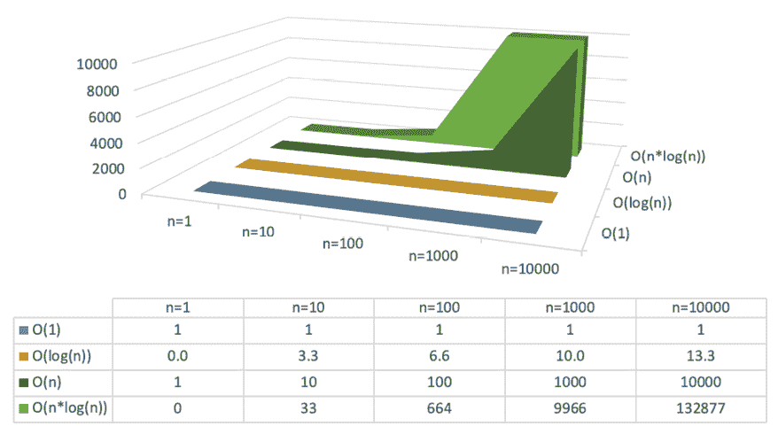
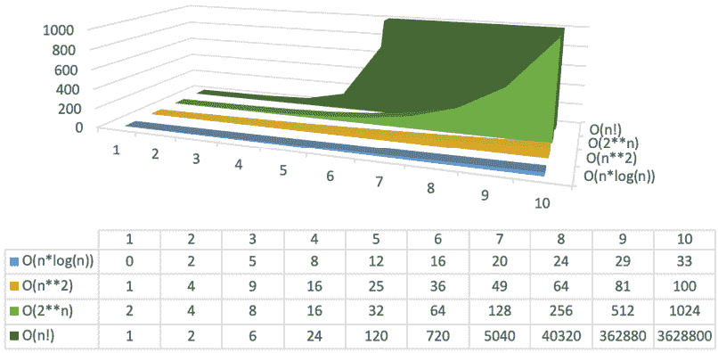

# 第四章：Pythonic 设计模式

上一章涵盖了在 Python 中应该做什么和避免做什么的大量指南。接下来，我们将探索一些使用 Python 内置模块以 Python 风格工作的示例。

设计模式在很大程度上依赖于存储数据；为此，Python 自带了几个非常有用的集合。最基本的数据结构，如`list`、`tuple`、`set`和`dict`，您可能已经熟悉，但 Python 还自带了更高级的集合。这些集合中的大多数只是将基本类型组合起来以提供更强大的功能。在本章中，我将解释如何以 Python 风格使用这些数据类型和集合。

在我们能够正确讨论数据结构和相关性能之前，需要基本理解时间复杂度（特别是大 O 符号）。这个概念非常简单，但如果没有它，我无法轻易解释操作的性能特征以及为什么看起来很漂亮的代码可能会表现得很糟糕。

在本章中，一旦大 O 符号变得清晰，我们将讨论一些数据结构，并展示一些示例设计模式，以及如何使用它们。我们将从以下基本数据结构开始：

+   `list`

+   `dict`

+   `set`

+   `tuple`

在基本数据结构的基础上，我们将继续探讨更高级的集合，例如以下内容：

+   类似字典的类型：

    +   `ChainMap`

    +   `Counter`

    +   `Defaultdict`

    +   `OrderedDict`

+   列表类型：`heapq`

+   元组类型：`dataclass`

+   其他类型：`enum`

# 时间复杂度 – 大 O 符号

在我们开始本章之前，有一个简单的符号你需要理解。本章使用大 O 符号来表示操作的复杂度。如果你已经熟悉这个符号，可以自由跳过这一节。虽然这个符号听起来非常复杂，但概念实际上非常简单。

大 O 字母指的是希腊字母奥米克戎的大写版本，它代表小-o（米克戎-o）。

当我们说一个函数需要`O(1)`时间时，这意味着它通常只需要`1`步来执行。同样，一个`O(n)`时间的函数将需要`n`步来执行，其中`n`通常是对象的大小（或长度）。这种时间复杂度只是执行代码时预期的一个基本指标，因为它通常是最重要的。

除了 O 之外，文献中可能会出现几个其他字符。以下是这些字符的概述：

+   `Ο` 大Ω：上界/最坏情况。

+   `Ω` 大Ω：下界/最佳情况。

+   `Θ` 大Θ：紧界，意味着 O 和Ω是相同的。

一个算法在这些方面差异很大的好例子是 quicksort 算法。quicksort 算法是最广泛使用的排序算法之一，如果你只根据时间复杂度（大 O）来看，这可能会让你感到惊讶。quicksort 的最坏情况是`O(n**2)`，最佳情况是`Ω(n log n)`或`Ω(n)`，这取决于实现方式。

考虑到最坏情况为`O(n**2)`，你可能不会期望算法被大量使用，但它一直是许多编程语言的默认排序算法。在 C 语言中，它仍然是默认的；对于 Java，它曾是 Java 6 的默认算法；Python 则使用它直到 2002 年。那么，为什么/为什么 quicksort 如此受欢迎？对于 quicksort 来说，查看平均情况非常重要，这比最坏情况更有可能发生。实际上，平均情况是`O(n log n)`，这对于排序算法来说是非常好的。

大 O 记号的目的在于根据需要执行的操作步数来指示操作的近似性能。一个执行单个步骤比另一个版本快 1,000 倍的代码，如果对于`n`等于 10 或更多，它仍然需要执行`O(2**n)`步骤，那么它仍然会比另一个版本慢。

这是因为`2**n`对于`n=10`是`2**10=1024`，这意味着执行相同代码需要 1,024 步。这使得选择正确的算法非常重要，即使在像`C`/`C++`这样的语言中，这些语言通常预期会比 Python 的 CPython 解释器有更好的性能。如果代码使用了错误的算法，对于非平凡`n`值，它仍然会更慢。

例如，假设你有一个包含 1,000 个项目的列表，并且你逐个检查它们。这将需要`O(n)`时间，因为共有`n=1000`个项目。检查一个项目是否存在于列表中意味着以类似的方式静默地遍历项目，这意味着它也花费`O(n)`时间，所以是 1,000 步。

如果你用有 1,000 个键/项的`dict`或`set`做同样的操作，它将只需要`O(1)`步，因为`dict`/`set`的结构方式。`dict`和`set`是如何在内部结构化的，将在本章后面讨论。

这意味着，如果你想在那个`list`或`dict`中检查 100 个项目的存在，对于`list`来说需要`100*O(n)`，而对于`dict`或`set`来说则是`100*O(1)`。这就是 100 步和 100,000 步之间的区别，这意味着在这种情况下`dict`/`set`比`list`快 1,000 倍。

即使代码看起来非常相似，性能特征差异却很大：

```py
>>> n = 1000
>>> a = list(range(n))
>>> b = dict.fromkeys(range(n))

>>> for i in range(100):
...     assert i in a  # takes n=1000 steps
...     assert i in b  # takes 1 step 
```

为了说明`O(1)`、`O(n)`和`O(n**2)`函数：

```py
>>> def o_one(items):
...     return 1  # 1 operation so O(1)

>>> def o_n(items):
...     total = 0
...     # Walks through all items once so O(n)
...     for item in items:
...         total += item
...     return total

>>> def o_n_squared(items):
...     total = 0
...     # Walks through all items n*n times so O(n**2)
...     for a in items:
...         for b in items:
...             total += a * b
...     return total

>>> n = 10
>>> items = range(n)
>>> o_one(items)  # 1 operation
1
>>> o_n(items)  # n = 10 operations
45
>>> o_n_squared(items)  # n*n = 10*10 = 100 operations
2025 
```

为了说明这一点，我们首先将查看一些增长较慢的函数：



图 4.1：n=1 到 n=10,000 时慢增长函数的时间复杂度

如你所见，`O(log(n))`函数与较大的数字配合得非常好；这就是为什么二分查找对于大型数据集来说如此之快。在本章的后面部分，你将看到一个二分查找算法的例子。

`O(n*log(n))`的结果显示了一种相当快的增长，这是不希望的，但比一些替代方案要好，如你在*图 4.2*中看到的更快增长的函数：



图 4.2：n=1 到 n=10 的快速增长函数的时间复杂度

通过查看这些图表，与`O(n*log(n))`相比，看起来相当不错。正如你将在本章后面看到的那样，许多排序算法使用`O(n*log(n))`函数，一些使用`O(n**2)`。

这些算法迅速增长到无法计算的大小；例如，`O(2**n)`函数在 10 个项目上已经需要 1,024 步，并且每一步都会翻倍。一个著名的例子是解决汉诺塔问题的当前解决方案，其中`n`是盘子的数量。

`O(n!)`阶乘函数要糟糕得多，在几步之后就会变得无法计算。最著名的例子之一是旅行商问题：找到覆盖一系列城市且恰好访问一次的最短路线。

接下来，我们将深入探讨核心集合。

# 核心集合

在我们能够查看本章后面部分更高级的合并集合之前，你需要了解核心 Python 集合的工作原理。这不仅仅关于它们的用法；还涉及到它们的时间复杂度，这可能会强烈影响你的应用程序随着增长的行为。如果你对这些对象的时间复杂度了如指掌，并且对 Python 3 的元组打包和解包了如指掌，那么你可以自由地跳转到*高级集合*部分。

## list – 一个可变的项目列表

`list`很可能是你在 Python 中使用最多的容器结构。在用法上很简单，并且在大多数情况下，它表现出优异的性能。

虽然你可能已经非常熟悉`list`的使用，但你可能并不了解`list`对象的时间复杂度。幸运的是，`list`的许多时间复杂度都非常低；`append`、获取操作、设置操作和`len`都只需要`O(1)`时间——这是最好的。然而，你可能不知道`remove`和`insert`的最坏情况时间复杂度是`O(n)`。所以，要从 1,000 个项目中删除一个项目，Python 可能需要遍历 1,000 个项目。在内部，`remove`和`insert`操作执行的操作大致如下：

```py
>>> def remove(items, value):
...     new_items = []
...     found = False
...     for item in items:
...         # Skip the first item which is equal to value
...         if not found and item == value:
...             found = True
...             continue
...         new_items.append(item)
...
...     if not found:
...         raise ValueError('list.remove(x): x not in list')
...
...     return new_items

>>> def insert(items, index, value):
...     new_items = []
...     for i, item in enumerate(items):
...         if i == index:
...             new_items.append(value)
...         new_items.append(item)
...     return new_items
>>> items = list(range(10))
>>> items
[0, 1, 2, 3, 4, 5, 6, 7, 8, 9]

>>> items = remove(items, 5)
>>> items
[0, 1, 2, 3, 4, 6, 7, 8, 9]

>>> items = insert(items, 2, 5)
>>> items
[0, 1, 5, 2, 3, 4, 6, 7, 8, 9] 
```

要从/向列表中移除或插入单个项目，Python 需要在插入/删除点之后移动列表中的其余部分。对于大型 `list`，这可能会成为性能负担，如果可能的话，应通过使用 `append` 而不是 `insert` 来避免。当只执行一次时，当然，这并不是那么糟糕。但是，当执行大量 `remove` 操作时，使用 `filter` 或 `list` 简化表达式会是一个更快的方法，因为如果结构合理，它只需要复制一次列表。

例如，假设我们希望从列表中删除一组特定的数字。我们有很多选择来做这件事。第一个是使用 `remove` 的解决方案，如果需要删除的项目数量变得很大，它就会变慢。

接下来是构建一个新的列表，一个 `list` 简化表达式，或者一个 `filter` 语句。*第五章*，*函数式编程 – 可读性 versus 简洁性*，将更详细地解释 `list` 简化表达式和 `filter` 语句。但首先，让我们看看一些例子：

```py
>>> primes = set((1, 2, 3, 5, 7))

# Classic solution
>>> items = list(range(10))
>>> for prime in primes:
...     items.remove(prime)
>>> items
[0, 4, 6, 8, 9]

# List comprehension
>>> items = list(range(10))
>>> [item for item in items if item not in primes]
[0, 4, 6, 8, 9]

# Filter
>>> items = list(range(10))
>>> list(filter(lambda item: item not in primes, items))
[0, 4, 6, 8, 9] 
```

后两个例子对于大型项目列表来说要快得多。这是因为操作要快得多。为了比较使用 `n=len(items)` 和 `m=len(primes)`，第一个例子需要 `O(m*n)=5*10=50` 次操作，而后两个例子需要 `O(n*1)=10*1=10` 次操作。

第一种方法实际上比所说的稍微好一些，因为 `n` 在循环中会减少。所以，它实际上是 `10+9+8+7+6=40`，但这是一个可以忽略不计的效果。在 `n=1000` 的情况下，这将是 `1000+999+998+997+996=4990` 和 `5*1000=5000` 之间的差异，这在现实世界中没有真正的区别。

当然，`min`、`max` 和 `in` 也都采用 `O(n)`，但对于这种没有针对这些类型查找进行优化的结构来说，这是预期的。

它们可以像这样实现：

```py
>>> def in_(items, value):
...     for item in items:
...         if item == value:
...             return True
...     return False

>>> def min_(items):
...     current_min = items[0]
...     for item in items[1:]:
...         if current_min > item:
...             current_min = item
...     return current_min

>>> def max_(items):
...     current_max = items[0]
...     for item in items[1:]:
...         if current_max < item:
...             current_max = item
...     return current_max

>>> items = range(5)
>>> in_(items, 3)
True
>>> min_(items)
0
>>> max_(items)
4 
```

通过这些例子，也很明显，`in` 操作符是一个很好的例子，其中最佳、最坏和平均情况差异很大。最佳情况是 `O(1)`，这是幸运地在我们找到的第一个项目。最坏情况是 `O(n)`，因为可能不存在，或者它可能是最后一个项目。从这个角度来看，您可能会期望平均情况是 `O(n/2)`，但您会错了。平均情况仍然是 `O(n)`，因为项目根本不在列表中的可能性很大。

## dict – 项目的映射

`dict` 可能是您将选择使用的容器结构。您可能没有意识到，您一直在不断地使用它，而没有明确地使用 `dict`。每次函数调用和变量访问都会通过 `dict` 来从 `local()` 或 `global()` 范围字典中查找名称。

`dict` 快速、简单易用，并且对于广泛的用例非常有效。对于 `get`、`set` 和 `delete` 操作的平均时间复杂度是 `O(1)`。

然而，你需要注意这个时间复杂度有一些例外。`dict`的工作方式是通过使用`hash`函数（该函数调用作为键的对象的`__hash__`方法）将键转换为哈希，并将其存储在哈希表中。

魔法方法，例如 `__hash__`，被称为**魔法方法**或**双下划线方法**，其中**双下划线**是双下划线的缩写。

然而，哈希表有两个问题。第一个也是最明显的问题是，项目将按哈希排序，这在大多数情况下看起来是随机的。哈希表的第二个问题是它们可能发生哈希冲突，哈希冲突的结果是在最坏的情况下，所有之前的操作都可以用`O(n)`完成。哈希冲突并不太可能发生，但它们确实可能发生，如果一个大的`dict`表现不佳，那就是需要查看的地方。

自从 Python 3.6 版本以来，CPython 中的默认`dict`实现已经改为按插入顺序排序的版本。从 Python 3.7 版本开始，这被保证为一种行为，因为其他 Python 版本，如 Jython 和 PyPy，在 3.7 版本之前可能使用不同的实现。

让我们看看这在实践中是如何工作的。为了这个示例，我将使用我能想到的最简单的哈希算法之一，它使用数字的最显著位。所以，对于`12345`的情况，这个哈希函数将返回`1`，而对于`56789`，它将返回`5`：

```py
>>> def most_significant(value):
...     while value >= 10:
...         value //= 10
...     return value

>>> most_significant(12345)
1
>>> most_significant(99)
9
>>> most_significant(0)
0 
```

现在，我们将使用具有这种哈希方法的`list`的`list`来模拟`dict`。我们知道我们的哈希方法只能返回从`0`到`9`的数字，所以我们的列表中只需要 10 个桶。现在，我们将添加一些值并看看`contains`函数是如何工作的：

```py
>>> def add(collection, key, value):
...     index = most_significant(key)
...     collection[index].append((key, value))

>>> def contains(collection, key):
...     index = most_significant(key)
...     for k, v in collection[index]:
...         if k == key:
...             return True
...     return False

# Create the collection of 10 lists
>>> collection = [[], [], [], [], [], [], [], [], [], []]
# Add some items, using key/value pairs
>>> add(collection, 123, 'a')
>>> add(collection, 456, 'b')
>>> add(collection, 789, 'c')
>>> add(collection, 101, 'c')

# Look at the collection
>>> collection
[[], [(123, 'a'), (101, 'c')], [], [],
 [(456, 'b')], [], [], [(789, 'c')], [], []]

# Check if the contains works correctly
>>> contains(collection, 123)
True
>>> contains(collection, 1)
False 
```

这段代码显然与`dict`实现不完全相同，但它是相似的。由于我们可以通过简单的索引直接获取值为`123`的项`1`，所以在一般情况下，我们只有`O(1)`的查找成本。然而，由于两个键`123`和`101`都位于`1`桶中，在最坏的情况下，运行时间实际上可以增加到`O(n)`，即所有键都有相同的哈希。如前所述，这就是哈希冲突。为了缓解`hash()`函数已经做的哈希冲突之外的问题，Python `dict`使用探测序列在需要时自动移动哈希。这种方法的具体细节在 Python 源代码的`dictobject.c`文件中有很好的解释。

要调试哈希冲突，你可以使用`hash()`函数与`collections.Counter`配合使用。这将快速显示哈希冲突发生的位置，但它不考虑`dict`的探测序列。

除了哈希碰撞性能问题之外，还有另一种可能让你感到惊讶的行为。当你从字典中删除项目时，实际上并不会在内存中对字典进行大小调整。结果是，复制和遍历整个字典都需要`O(m)`时间（其中`m`是字典的最大大小）；`n`，当前的项目数量，没有被使用。所以，如果你向一个`dict`中添加 1,000 个项目并删除 999 个，遍历和复制仍然需要 1,000 步。解决这个问题的唯一方法是通过重新创建字典，这是`copy`和`insert`操作都会做的事情。请注意，在`insert`操作期间的重创建不保证，并且取决于内部可用的空闲槽位数量。

## `set` – 类似于没有值的`dict`

一个`set`是一个使用`hash()`函数来获取唯一值集合的结构。在内部，它与`dict`非常相似，存在相同的哈希碰撞问题，但`set`有一些实用的特性需要展示：

```py
# All output in the table below is generated using this function
>>> def print_set(expression, set_):
...     'Print set as a string sorted by letters'
...     print(expression, ''.join(sorted(set_)))

>>> spam = set('spam')
>>> print_set('spam:', spam)
spam: amps

>>> eggs = set('eggs')
>>> print_set('eggs:', eggs)
eggs: egs 
```

前几项基本上符合预期。当我们到达运算符时，事情变得有趣：

| **表达式** | **输出** | **说明** |
| --- | --- | --- |
| `spam` | `amps` | 所有唯一项。`set`不允许重复项。 |
| `eggs` | `egs` |
| `spam & eggs` | `s` | 在两个中的每个项。 |
| `spam &#124; eggs` | `aegmps` | 要么在其中一个或两个中的每个项。 |
| `spam ^ eggs` | `aegmp` | 要么在其中一个但不在两个中的每个项。 |
| `spam - eggs` | `amp` | 在第一个中但不在后者中的每个项。 |
| `eggs - spam` | `eg` |
| `spam > eggs` | `False` | 如果后者中的每个项都在第一个中则为真。 |
| `eggs > spam` | `False` |
| `spam > sp` | `True` |
| `spam < sp` | `False` | 如果第一个中的每个项都包含在后者中则为真。 |

`set`操作的一个有用示例是计算两个对象之间的差异。例如，假设我们有两个列表：

+   `current_users`：组中的当前用户

+   `new_users`：组中的新用户列表

在权限系统中，这是一个非常常见的场景——大量添加和/或从组中删除用户。在许多权限数据库中，一次设置整个列表并不容易，所以你需要一个用于插入的列表和一个用于删除的列表。这就是`set`真正派上用场的地方：

```py
# The set function takes a sequence as argument so the double ( is required.
>>> current_users = set((
...     'a',
...     'b',
...     'd',
... ))

>>> new_users = set((
...     'b',
...     'c',
...     'd',
...     'e',
... ))

>>> to_insert = new_users - current_users
>>> sorted(to_insert)
['c', 'e']
>>> to_delete = current_users - new_users
>>> sorted(to_delete)
['a']
>>> unchanged = new_users & current_users
>>> sorted(unchanged)
['b', 'd'] 
```

现在，我们有了所有添加、删除和未更改的用户列表。请注意，`sorted`只需要用于一致的输出，因为`set`没有预定义的排序顺序。

## `tuple` – 不可变列表

`tuple`是另一个你可能经常使用而甚至没有意识到的对象。当你最初看它时，它似乎是一个无用的数据结构。它就像一个你不能修改的列表，所以为什么不直接使用`list`呢？实际上，有一些情况下`tuple`提供了一些非常实用的功能，而`list`则没有。

首先，它们是可哈希的。这意味着你可以使用`tuple`作为`dict`的键或`set`的项，这是`list`无法做到的：

```py
>>> spam = 1, 2, 3
>>> eggs = 4, 5, 6

>>> data = dict()
>>> data[spam] = 'spam'
>>> data[eggs] = 'eggs'

>>> import pprint  # Using pprint for consistent and sorted output

>>> pprint.pprint(data)
{(1, 2, 3): 'spam', (4, 5, 6): 'eggs'} 
```

然而，元组可以包含比简单的数字更多的内容。你可以使用嵌套元组、字符串、数字以及任何`hash()`函数返回一致结果的任何其他内容：

```py
>>> spam = 1, 'abc', (2, 3, (4, 5)), 'def'
>>> eggs = 4, (spam, 5), 6

>>> data = dict()
>>> data[spam] = 'spam'
>>> data[eggs] = 'eggs'

>>> import pprint  # Using pprint for consistent and sorted output

>>> pprint.pprint(data)
{(1, 'abc', (2, 3, (4, 5)), 'def'): 'spam',
 (4, ((1, 'abc', (2, 3, (4, 5)), 'def'), 5), 6): 'eggs'} 
```

你可以使其变得尽可能复杂。只要元组的所有部分都是可哈希的，你将没有问题对元组进行哈希。你仍然可以构建一个包含`list`或其他不可哈希类型的元组，而不会出现问题，但这将使元组不可哈希。

可能更有用的是这样一个事实，即元组也支持元组打包和解包：

```py
# Assign using tuples on both sides
>>> a, b, c = 1, 2, 3
>>> a
1

# Assign a tuple to a single variable
>>> spam = a, (b, c)
>>> spam
(1, (2, 3))

# Unpack a tuple to two variables
>>> a, b = spam
>>> a
1
>>> b
(2, 3) 
```

除了常规的打包和解包，从 Python 3 开始，我们实际上可以使用可变数量的项目进行打包和解包对象：

```py
# Unpack with variable length objects which assigns a list instead
# of a tuple
>>> spam, *eggs = 1, 2, 3, 4
>>> spam
1
>>> eggs
[2, 3, 4]

# Which can be unpacked as well of, course
>>> a, b, c = eggs
>>> c
4

# This works for ranges as well
>>> spam, *eggs = range(10)
>>> spam
0
>>> eggs
[1, 2, 3, 4, 5, 6, 7, 8, 9]

# And it works both ways
>>> a, b, *c = a, *eggs
>>> a, b
(2, 1)
>>> c
[2, 3, 4, 5, 6, 7, 8, 9] 
```

打包和解包可以应用于函数参数：

```py
>>> def eggs(*args):
...     print('args:', args)

>>> eggs(1, 2, 3)
args: (1, 2, 3) 
```

当从函数返回时，它们同样非常有用：

```py
>>> def spam_eggs():
...     return 'spam', 'eggs'

>>> spam, eggs = spam_eggs()
>>> spam
'spam'
>>> eggs
'eggs' 
```

现在你已经看到了核心 Python 集合及其局限性，你应该更好地理解何时某些集合是一个好主意（或不是一个好主意）。更重要的是，如果一个数据结构的表现不符合你的预期，你将理解为什么。

不幸的是，现实世界中的问题通常不像你在本章中看到的那样简单，因此你将不得不权衡数据结构的优缺点，并为你的情况选择最佳解决方案。或者，你也可以通过组合这些结构中的几个来构建一个更高级的数据结构。然而，在你开始构建自己的结构之前，请继续阅读，因为我们将现在深入探讨更多高级集合，它们正是为此而设计的：结合核心集合。

# 使用高级集合的 Pythonic 模式

以下集合主要是基础集合的扩展；其中一些相对简单，而其他一些则更高级。对于所有这些，了解底层结构的特征是非常重要的。如果不理解它们，将很难理解集合的特征。

由于性能原因，有一些集合是用原生 C 代码实现的，但它们也可以很容易地在纯 Python 中实现。以下示例不仅将展示这些集合的功能和特征，还将展示一些它们可能有用处的示例设计模式。当然，这不是一个详尽的列表，但它应该能给你一个可能性方面的概念。

## 使用数据类进行类型提示的智能数据存储

Python（自 3.5 以来）最有用的最近添加之一是类型提示。通过类型注解，你可以向你的编辑器、文档生成器以及其他阅读你代码的人提供类型提示。

在 Python 中，我们通常期望自己是“同意的成年人”，这意味着提示不会被强制执行。这与 Python 中的私有和受保护变量不被强制执行的方式相似。这意味着我们可以很容易地给出与我们的提示完全不同的类型：

```py
>>> spam: int
>>> __annotations__['spam']
<class 'int'>

>>> spam = 'not a number'
>>> __annotations__['spam']
<class 'int'> 
```

即使有`int`类型提示，我们仍然可以插入一个`str`。

`dataclasses`模块是在 Python 3.7 中引入的（Python 3.6 有后向兼容版本），它使用类型提示系统自动生成类，包括基于这些类型的文档和构造函数：

```py
>>> import dataclasses

>>> @dataclasses.dataclass
... class Sandwich:
...     spam: int
...     eggs: int = 3

>>> Sandwich(1, 2)
Sandwich(spam=1, eggs=2)

>>> sandwich = Sandwich(4)
>>> sandwich
Sandwich(spam=4, eggs=3)
>>> sandwich.eggs
3
>>> dataclasses.asdict(sandwich)
{'spam': 4, 'eggs': 3}
>>> dataclasses.astuple(sandwich)
(4, 3) 
```

基本类看起来相当简单，似乎没有什么特别之处，但如果你仔细观察，`dataclass`已经为我们生成了多个方法。哪些方法被生成，当查看`dataclass`参数时就会变得明显：

```py
>>> help(dataclasses.dataclass)
Help on ... dataclass(..., *, init=True, repr=True, eq=True,
order=False, unsafe_hash=False, frozen=False) ... 
```

如您所见，`dataclass`有几个布尔标志，用于决定生成什么内容。

首先，`init`标志告诉`dataclass`创建一个类似于下面的`__init__`方法：

```py
>>> def __init__(self, spam, eggs=3):
...    self.spam = spam
...    self.eggs = eggs 
```

此外，`dataclass`还有以下标志：

+   `repr`：这生成一个`__repr__`魔法函数，生成一个像`Sandwich(spam=1, eggs=2)`这样既美观又易读的输出，而不是像`<__main__.Sandwich object at 0x...>`这样的输出。

+   `eq`：这生成一个自动比较方法，当执行`if sandwich_a == sandwich_b`时，通过它们的值来比较两个`Sandwich`实例。

+   `order`：这生成一系列方法，以便比较运算符如`>=`和`<`通过比较`dataclasses.astuple`的输出来工作。

+   `unsafe_hash`：这将强制生成一个`__hash__`方法，以便您可以在其上使用`hash()`函数。默认情况下，只有当对象的所有部分都被视为不可变时，才会生成`__hash__`函数。这样做的原因是`hash()`应该*始终*保持一致。如果您希望将对象存储在`set`中，它需要有一个一致的哈希值。由于`set`使用`hash()`来决定使用哪个内存地址，如果对象发生变化，`set`需要移动该对象。

+   `frozen`：这将防止在实例创建后进行更改。这种用法的主要目的是确保对象的`hash()`保持一致。

+   `slots`：这自动添加一个`__slots__`属性，使属性访问和存储更快、更高效。关于插槽的更多信息请参阅*第十二章*，*性能 – 跟踪和减少您的内存和 CPU 使用*。

唯一添加验证的标志是`frozen`标志，它使所有内容都变为只读，并阻止我们更改`__setattr__`和`__getattr__`方法，否则这些方法可以用来修改实例。

类型提示系统仍然只提供提示；然而，这些提示以任何方式都不会被强制执行。在*第六章*，*装饰器 – 通过装饰实现代码重用*中，您将看到我们如何使用自定义装饰器将这些类型的强制执行添加到我们的代码中。

为了提供一个包含依赖关系的更有用的示例，假设我们有一些用户，他们属于系统中的一个或多个组：

```py
>>> import typing

>>> @dataclasses.dataclass
... class Group:
...     name: str
...     parent: 'Group' = None

>>> @dataclasses.dataclass
... class User:
...     username: str
...     email: str = None
...     groups: typing.List[Group] = None

>>> users = Group('users')
>>> admins = Group('admins', users)
>>> rick = User('rick', groups=[admins])
>>> gvr = User('gvanrossum', 'guido@python.org', [admins])

>>> rick.groups
[Group(name='admins', parent=Group(name='users', parent=None))]

>>> rick.groups[0].parent
Group(name='users', parent=None) 
```

除了将数据类相互链接之外，这还展示了如何将集合作为字段创建，以及如何有递归定义。如您所见，`Group`类引用了自己的定义作为父类。

这些数据类在用于从数据库或 CSV 文件读取数据时特别有用。你可以轻松扩展数据类的行为以包括自定义方法，这使得它们成为存储自定义数据模型的一个非常有用的基础。

## 使用`ChainMap`组合多个作用域

从 Python 3.3 开始引入的`ChainMap`允许你将多个映射（例如字典）组合成一个。当组合多个上下文时，这特别有用。例如，当在当前作用域中查找变量时，默认情况下，Python 会搜索`locals()`、`globals()`，最后是`builtins`。

要明确编写代码来完成这个任务，我们可以这样做：

```py
>>> import builtins

>>> builtin_vars = vars(builtins)

>>> key = 'something to search for'

>>> if key in locals():
...     value = locals()[key]
... elif key in globals():
...     value = globals()[key]
... elif key in builtin_vars:
...     value = builtin_vars[key]
... else:
...     raise NameError(f'name {key!r} is not defined')
Traceback (most recent call last):
...
NameError: name 'something to search for' is not defined 
```

这确实可行，但至少看起来很丑。我们可以通过删除一些重复的代码来让它更美观：

```py
>>> mappings = locals(), globals(), vars(builtins)

>>> for mapping in mappings:
...     if key in mapping:
...         value = mapping[key]
...         break
... else:
...     raise NameError(f'name {key!r} is not defined')
Traceback (most recent call last):
...
NameError: name 'something to search for' is not defined 
```

这好多了！此外，这实际上可以被认为是一个不错的解决方案。但自从 Python 3.3 以来，这甚至更容易。现在，我们只需简单地使用以下代码：

```py
>>> import collections

>>> mappings = collections.ChainMap(
...     locals(), globals(), vars(builtins))
>>> mappings[key]
Traceback (most recent call last):
...
KeyError: 'something to search for' 
```

如您所见，`ChainMap`类会自动将请求的值通过每个给定的`dict`合并，直到找到匹配项。如果找不到值，则会引发`KeyError`，因为它表现得像`dict`。

这对于从多个来源读取配置并简单地获取第一个匹配项非常有用。对于命令行应用程序，这可以从命令行参数开始，然后是本地配置文件，然后是全球配置文件，最后是默认值。为了说明一些类似于我在小型命令行脚本中使用的代码：

```py
>>> import json
>>> import pathlib
>>> import argparse
>>> import collections

>>> DEFAULT = dict(verbosity=1)

>>> config_file = pathlib.Path('config.json')
>>> if config_file.exists():
...     config = json.load(config_file.open())
... else:
...     config = dict()

>>> parser = argparse.ArgumentParser()
>>> parser.add_argument('-v', '--verbose', action='count',
...                     dest='verbosity')
_CountAction(...)

>>> args, _ = parser.parse_known_args()
>>> defined_args = {k: v for k, v in vars(args).items() if v}
>>> combined = collections.ChainMap(defined_args, config, DEFAULT)
>>> combined['verbosity']
1

>>> args, _ = parser.parse_known_args(['-vv'])
>>> defined_args = {k: v for k, v in vars(args).items() if v}
>>> combined = collections.ChainMap(defined_args, config, DEFAULT)
>>> combined['verbosity']
2 
```

可以清楚地看到继承。当给出特定的命令行参数（`-vv`）时，将使用该结果。否则，代码将回退到`DEFAULTS`或任何其他可用的变量。

## 使用`defaultdict`设置默认字典值

`defaultdict`是我在`collections`包中最喜欢的对象之一。在它被添加到核心之前，我写过几个类似的对象。虽然它是一个相当简单的对象，但它对各种设计模式非常有用。你不必每次都要检查键的存在并添加一个值，你只需从一开始就声明默认值，就无需担心其他事情。

例如，假设我们正在从一个连接节点的列表中构建一个非常基本的图结构。

这是我们的连接节点列表（单向）：

```py
nodes = [
    ('a', 'b'),
    ('a', 'c'),
    ('b', 'a'),
    ('b', 'd'),
    ('c', 'a'),
    ('d', 'a'),
    ('d', 'b'),
    ('d', 'c'),
] 
```

现在，让我们把这个图放入一个正常的字典中：

```py
>>> graph = dict()
>>> for from_, to in nodes:
...     if from_ not in graph:
...         graph[from_] = []
...     graph[from_].append(to)

>>> import pprint

>>> pprint.pprint(graph)
{'a': ['b', 'c'],
 'b': ['a', 'd'],
 'c': ['a'],
 'd': ['a', 'b', 'c']} 
```

当然，可能有一些变体，例如使用`setdefault`。然而，它们仍然比必要的更复杂。

真正的 Python 风格版本使用`defaultdict`：

```py
>>> import collections

>>> graph = collections.defaultdict(list)
>>> for from_, to in nodes:
...     graph[from_].append(to)

>>> import pprint

>>> pprint.pprint(graph)
defaultdict(<class 'list'>,
            {'a': ['b', 'c'],
             'b': ['a', 'd'],
             'c': ['a'],
             'd': ['a', 'b', 'c']}) 
```

这段代码不是很好看吗？`defaultdict`也可以用作`Counter`对象的基本版本。它没有`Counter`那么花哨，也没有所有那些装饰，但在许多情况下它都能完成任务：

```py
>>> counter = collections.defaultdict(int)
>>> counter['spam'] += 5
>>> counter
defaultdict(<class 'int'>, {'spam': 5}) 
```

`defaultdict` 的默认值需要是一个可调用对象。在前面的例子中，这些是 `int` 和 `list`，但你可以轻松定义自己的函数来用作默认值。这就是以下示例所使用的，尽管我不建议在生产环境中使用，因为它缺乏一些可读性。然而，我相信，这是一个展示 Python 力量的美丽示例。

这就是我们在 Python 中一行代码创建 `tree` 的方法：

```py
import collections
def tree(): return collections.defaultdict(tree) 
```

太棒了，下面是如何实际使用的例子：

```py
>>> import json
>>> import collections

>>> def tree():
...     return collections.defaultdict(tree)

>>> colours = tree()
>>> colours['other']['black'] = 0x000000
>>> colours['other']['white'] = 0xFFFFFF
>>> colours['primary']['red'] = 0xFF0000
>>> colours['primary']['green'] = 0x00FF00
>>> colours['primary']['blue'] = 0x0000FF
>>> colours['secondary']['yellow'] = 0xFFFF00
>>> colours['secondary']['aqua'] = 0x00FFFF
>>> colours['secondary']['fuchsia'] = 0xFF00FF

>>> print(json.dumps(colours, sort_keys=True, indent=4))
{
    "other": {
        "black": 0,
        "white": 16777215
    },
    "primary": {
        "blue": 255,
        "green": 65280,
        "red": 16711680
    },
    "secondary": {
        "aqua": 65535,
        "fuchsia": 16711935,
        "yellow": 16776960
    }
} 
```

好处在于你可以让它深入到你想要的程度。由于 `defaultdict` 的基础，它会递归地生成。

## 枚举 – 一组常量

Python 3.4 中引入的 `enum` 包在功能上与其他许多编程语言（如 C 和 C++）中的枚举非常相似。它有助于为你的模块创建可重用的常量，这样你可以避免使用任意常量。一个基本的例子如下：

```py
>>> import enum

>>> class Color(enum.Enum):
...     red = 1
...     green = 2
...     blue = 3

>>> Color.red
<Color.red: 1>
>>> Color['red']
<Color.red: 1>
>>> Color(1)
<Color.red: 1>
>>> Color.red.name
'red'
>>> Color.red.value
1
>>> isinstance(Color.red, Color)
True
>>> Color.red is Color['red']
True
>>> Color.red is Color(1)
True 
```

`enum` 包的一些实用功能包括对象是可迭代的，可以通过数值和文本值表示访问，并且，通过适当的继承，甚至可以与其他类进行比较。

以下代码展示了基本 API 的使用：

```py
>>> for color in Color:
...     color
<Color.red: 1>
<Color.green: 2>
<Color.blue: 3>

>>> colors = dict()
>>> colors[Color.green] = 0x00FF00
>>> colors
{<Color.green: 2>: 65280} 
```

`enum` 包的一个不太为人所知的功能是，除了通常使用的身份比较之外，你还可以使值比较工作。这对所有类型都有效——不仅限于整数，还包括（你自己的）自定义类型。

对于常规的 `enum`，只有身份检查（即 `a is b`）是有效的：

```py
>>> import enum

>>> class Spam(enum.Enum):
...     EGGS = 'eggs'

>>> Spam.EGGS == 'eggs'
False 
```

当我们将 `enum` 继承 `str` 时，它开始比较值以及身份：

```py
>>> import enum

>>> class Spam(str, enum.Enum):
...     EGGS = 'eggs'

>>> Spam.EGGS == 'eggs'
True 
```

除了前面的例子之外，`enum` 包还有一些其他变体，如 `enum.Flag` 和 `enum.IntFlag`，它们允许进行位运算。这些可以用于表示权限，如下所示：`permissions = Perm.READ | Perm.Write`。

每当你有一组可以一起分组的常量时，考虑使用 `enum` 包。它使得验证比多次使用 `if/elif/elif/else` 清洁得多。

## 使用 `heapq` 对集合进行排序

`heapq` 模块是一个很棒的模块，它使得在 Python 中创建优先队列变得非常容易。这是一个数据结构，它总是以最小的（或最大的，取决于实现）项可用，且无需太多努力。API 非常简单，其使用的一个最佳例子可以在 `OrderedDict` 对象中看到。虽然你可能不经常需要它，但如果需要，它是一个非常有用的结构。如果你希望了解 `OrderedDict` 等类的工作原理，理解其内部工作方式很重要。

如果你正在寻找一个始终保持列表排序的结构，请尝试下一节中介绍的 `bisect` 模块。

`heapq` 的基本用法简单，但一开始可能有些令人困惑：

```py
>>> import heapq

>>> heap = [1, 3, 5, 7, 2, 4, 3]
>>> heapq.heapify(heap)
>>> heap
[1, 2, 3, 7, 3, 4, 5]

>>> while heap:
...     heapq.heappop(heap), heap
(1, [2, 3, 3, 7, 5, 4])
(2, [3, 3, 4, 7, 5])
(3, [3, 5, 4, 7])
(3, [4, 5, 7])
(4, [5, 7])
(5, [7])
(7, []) 
```

在这里需要注意的一个重要事项——你可能已经从前面的例子中理解到了——`heapq`模块并不创建一个特殊对象。它包含一些方法，可以将普通列表视为一个`heap`。这并不使它变得不那么有用，但这是需要考虑的事情。

初看起来，最令人困惑的部分是排序顺序。实际上，数组是排序的，但不是作为一个列表；它是作为一个树来排序的。为了说明这一点，请看以下树，它显示了树应该如何读取：

```py
 1
 2   3
7 3 4 5 
```

最小的数字始终位于树的顶部，最大的数字始终位于树的底部行。正因为如此，找到最小的数字非常容易，但找到最大的数字就不那么容易了。要获取堆的排序版本，我们只需简单地不断移除树的顶部，直到所有项都消失。因此，堆排序算法可以按以下方式实现：

```py
>>> def heapsort(iterable):
...     heap = []
...     for value in iterable:
...         heapq.heappush(heap, value)
...
...     while heap:
...         yield heapq.heappop(heap)

>>> list(heapsort([1, 3, 5, 2, 4, 1]))
[1, 1, 2, 3, 4, 5] 
```

由于`heapq`负责重负载，因此编写你自己的`sorted()`函数版本变得极其简单。

由于`heappush`和`heappop`函数都具有`O(log(n))`的时间复杂度，因此它们可以被认为是真的很快。将它们结合用于前面可迭代对象的`n`个元素，我们得到`heapsort`函数的`O(n*log(n))`。`heappush`方法内部使用`list.append()`并交换列表中的项以避免`list.insert()`的`O(n)`时间复杂度。

`log(n)`指的是以 2 为底的对数函数。为了计算这个值，可以使用`math.log2()`函数。这导致每次数字大小加倍时，值增加 1。对于`n=2`，`log(n)`的值是`1`，因此对于`n=4`和`n=8`，对数值分别是`2`和`3`。而`n=1024`的结果是一个对数仅为`10`。

这意味着一个 32 位数字，即`2**32 = 4294967296`，其对数是`32`。

## 使用 bisect 在排序集合中进行搜索

上一节中的`heapq`模块为我们提供了一种简单的方法来排序一个结构并保持其排序。但如果我们想搜索一个排序集合以查看项目是否存在？或者如果不存在，下一个最大/最小项目是什么？这就是`bisect`算法帮助我们的地方。

`bisect`模块以这种方式在对象中插入项，使它们保持排序并易于搜索。如果你的主要目的是搜索，那么`bisect`应该是你的选择。如果你经常修改你的集合，`heapq`可能更适合你。

与`heapq`类似，`bisect`实际上并不创建一个特殊的数据结构。`bisect`模块期望一个`list`，并期望这个`list`始终保持排序状态。理解这一点的性能影响是很重要的。虽然向`list`中添加项的时间复杂度为`O(1)`，但插入的时间复杂度为`O(n)`，这使得它成为一个非常耗时的操作。实际上，使用`bisect`创建一个排序列表的时间复杂度为`O(n*n)`，这相当慢，尤其是因为使用`heapq`或`sorted()`创建相同的排序列表只需要`O(n*log(n))`。

如果你有一个已排序的结构，并且只需要添加一个单独的项，那么可以使用`bisect`算法进行插入。否则，通常直接添加项并在之后调用`list.sort()`或`sorted()`会更快速。

为了说明，我们有这些行：

```py
>>> import bisect

# Using the regular sort:
>>> sorted_list = []
>>> sorted_list.append(5)  # O(1)
>>> sorted_list.append(3)  # O(1)
>>> sorted_list.append(1)  # O(1)
>>> sorted_list.append(2)  # O(1)
>>> sorted_list.sort()  # O(n * log(n)) = 4 * log(4) = 8
>>> sorted_list
[1, 2, 3, 5]

# Using bisect:
>>> sorted_list = []
>>> bisect.insort(sorted_list, 5)  # O(n) = 1
>>> bisect.insort(sorted_list, 3)  # O(n) = 2
>>> bisect.insort(sorted_list, 1)  # O(n) = 3
>>> bisect.insort(sorted_list, 2)  # O(n) = 4
>>> sorted_list
[1, 2, 3, 5] 
```

对于少量项，这种差异是可以忽略不计的，但使用`bisect`进行排序所需的操作数量会迅速增长到差异很大的程度。对于`n=4`，差异只是`4 * 1 + 8 = 12`与`1 + 2 + 3 + 4 = 10`之间的差异，使得`bisect`解决方案更快。但如果我们插入 1,000 个项，它将是`1000 + 1000 * log(1000) = 10966`与`1 + 2 + … 1000 = 1000 * (1000 + 1) / 2 = 500500`。所以，在插入多个项时要非常小心。

在列表中进行搜索非常快；因为它是有序的，我们可以使用一个非常简单的二分搜索算法。例如，如果我们想检查几个数字是否存在于列表中？最简单的算法，如下所示，只是简单地遍历列表并检查所有项，导致最坏情况下的性能为`O(n)`：

```py
>>> sorted_list = [1, 2, 5]

>>> def contains(sorted_list, value):
...     for item in sorted_list:
...         if item > value:
...             break
...         elif item == value:
...             return True
...     return False

>>> contains(sorted_list, 2)  # Need to walk through 2 items, O(n) = 2
True
>>> contains(sorted_list, 4)  # Need to walk through 3 items, O(n) = 3
False
>>> contains(sorted_list, 6)  # Need to walk through 3 items, O(n) = 3
False 
```

然而，使用`bisect`算法，就没有必要遍历整个列表：

```py
>>> import bisect

>>> sorted_list = [1, 2, 5]
>>> def contains(sorted_list, value):
...     i = bisect.bisect_left(sorted_list, value)
...     return i < len(sorted_list) and sorted_list[i] == value

>>> contains(sorted_list, 2)  # Found it after the first step, O(log(n)) = 1
True
>>> contains(sorted_list, 4)  # No result after 2 steps, O(log(n)) = 2
False
>>> contains(sorted_list, 6)  # No result after 2 steps, O(log(n)) = 2
False 
```

`bisect_left`函数试图找到数字应该放置的位置。这正是`bisect.insort`所做的；它通过搜索数字的位置来在正确的位置插入数字。

这些方法之间最大的区别是`bisect`在内部执行二分搜索，这意味着它从中间开始，根据列表中的值是否大于我们正在寻找的值，跳到左或右部分的中间。为了说明，我们将在一个从`0`到`14`的数字列表中搜索`4`：

```py
sorted_list = [0, 1, 2, 3, 4, 5, 6, 7, 8, 9, 10, 11, 12, 13, 14]
Step 1: 4 > 7                       ^
Step 2: 4 > 3           ^
Step 3: 4 > 5                 ^
Step 4: 4 > 5              ^ 
```

如你所见，经过仅四步，我们就找到了我们搜索的数字。根据数字（例如`7`），它可能更快，但找到数字的步骤永远不会超过`O(log(n))`。

对于一个常规列表，搜索将简单地遍历所有项，直到找到所需的项。如果你很幸运，它可能是你遇到的第一个数字，但如果你不幸，它可能是最后一个项。在 1,000 个项的情况下，这将是 1,000 步与`log(1000) = 10`步之间的区别。

虽然非常快速和高效，但`bisect`模块一点也不像 Python 风格。让我们通过创建自己的`SortedList`类来解决这个问题：

```py
>>> import bisect
>>> import collections

>>> class SortedList:
...     def __init__(self, *values):
...         self._list = sorted(values)
...     
...     def index(self, value):
...         i = bisect.bisect_left(self._list, value)
...         if i < len(self._list) and self._list[i] == value:
...             return index
...
...     def delete(self, value):
...         del self._list[self.index(value)]
...
...     def add(self, value):
...         bisect.insort(self._list, value)
...
...     def __iter__(self):
...         for value in self._list:
...             yield value
...
...     def __exists__(self, value):
...         return self.index(value) is not None

>>> sorted_list = SortedList(1, 3, 6, 2)
>>> 3 in sorted_list
True
>>> 5 in sorted_list
False
>>> sorted_list.add(5)
>>> 5 in sorted_list
True
>>> list(sorted_list)
[1, 2, 3, 5, 6] 
```

虽然这个实现是功能性的，但显然仍然有点局限。但如果你需要这种结构，这无疑是一个很好的起点。

## 使用 Borg 或单例模式的全局实例

大多数程序员都会熟悉单例模式，该模式确保一个类只有一个实例存在。在 Python 中，对此的一个常见替代解决方案是 Borg 模式，该模式以《星际迷航》中的博格命名。单例模式强制执行单个实例，而 Borg 模式则强制所有实例和子类都保持单一状态。由于 Python 中类创建的方式，Borg 模式比单例模式更容易实现和修改。

为了说明这两个示例：

Borg 类：

```py
>>> class Borg:
...     _state = {}
...     def __init__(self):
...         self.__dict__ = self._state

>>> class SubBorg(Borg):
...     pass

>>> a = Borg()
>>> b = Borg()
>>> c = Borg()
>>> a.a_property = 123
>>> b.a_property
123
>>> c.a_property
123 
```

单例类：

```py
>>> class Singleton:
...     def __new__(cls):
...         if not hasattr(cls, '_instance'):
...             cls._instance = super(Singleton, cls).__new__(cls)
...
...         return cls._instance

>>> class SubSingleton(Singleton):
...     pass

>>> a = Singleton()
>>> b = Singleton()
>>> c = SubSingleton()
>>> a.a_property = 123
>>> b.a_property
123
>>> c.a_property
123 
```

Borg 模式通过覆盖包含实例状态的实例的`__dict__`来实现。单例通过覆盖`__new__`（注意，不是`__init__`）方法，以确保我们始终只返回该类的单个实例。

## 使用属性不需要 getters 和 setters

在许多语言（尤其是 Java）中，访问实例变量的常见设计模式是使用 getters 和 setters，这样你可以在未来需要时修改行为。在 Python 中，我们可以透明地更改现有类的属性行为，而无需修改调用代码：

```py
>>> class Sandwich:
...     def __init__(self, spam):
...         self.spam = spam
...
...     @property
...     def spam(self):
...         return self._spam
...
...     @spam.setter
...     def spam(self, value):
...         self._spam = value
...         if self._spam >= 5:
...             print('You must be hungry')
...
...     @spam.deleter
...     def spam(self):
...         self._spam = 0

>>> sandwich = Sandwich(2)
>>> sandwich.spam += 1
>>> sandwich.spam += 2
You must be hungry 
```

调用代码根本不需要改变。我们可以完全透明地改变属性的调用行为。

## 字典联合操作符

这实际上不是一个单独的高级集合，但它是对`dict`集合的高级使用。自 Python 3.9 以来，我们有几种简单的方法来组合多个`dict`实例。旧解决方案是使用`dict.update()`，可能还结合使用`dict.copy()`来创建一个新实例。虽然这可以正常工作，但它相当冗长且有点笨拙。

由于这是一个几个示例比仅仅解释更有用的案例，让我们看看旧解决方案是如何工作的：

```py
>>> a = dict(x=1, y=2)
>>> b = dict(y=1, z=2)

>>> c = a.copy()
>>> c
{'x': 1, 'y': 2}
>>> c.update(b)

>>> a
{'x': 1, 'y': 2}
>>> b
{'y': 1, 'z': 2}
>>> c
{'x': 1, 'y': 1, 'z': 2} 
```

该解决方案效果很好，但自 Python 3.9 及以上版本，我们可以用更简单、更短的方式来做：

```py
>>> a = dict(x=1, y=2)
>>> b = dict(y=1, z=2)

>>> a | b
{'x': 1, 'y': 1, 'z': 2} 
```

这是一个在指定函数参数时非常有用的功能，特别是如果你想自动用默认参数填充关键字参数时：

```py
some_function(**(default_arguments | given_arguments)) 
```

现在你已经看到了 Python 附带的一些更高级的集合，你应该对何时应用哪种类型的集合有一个相当好的了解。你可能还了解了一些新的 Python 设计模式。

# 练习

除了增强本章中的示例外，还有很多其他的练习：

+   创建一个使用`keyfunc`来决定排序顺序的`SortedDict`集合。

+   创建一个具有`O(log(n))`插入操作和每次迭代都返回排序列表的`SortedList`集合。

+   创建一个具有每个子类状态的 Borg 模式。

这些练习的示例答案可以在 GitHub 上找到：`github.com/mastering-python/exercises`。我们鼓励你提交自己的解决方案，并从他人的替代方案中学习。

# 摘要

在某些方面，Python 与其他语言略有不同，而在其他语言中常见的几种设计模式在 Python 中几乎没有什么意义。在本章中，你已经看到了一些常见的 Python 设计模式，但还有很多模式存在。在你开始根据这些模式实现自己的集合之前，快速在网上搜索一下是否已经存在现成的解决方案。特别是，`collections`模块经常更新，所以你的问题可能已经被解决了。

如果你曾好奇这些结构是如何工作的，可以查看以下源代码：[`github.com/python/cpython/blob/master/Lib/collections/__init__.py`](https://github.com/python/cpython/blob/master/Lib/collections/__init__.py)。

完成这一章后，你应该了解基本 Python 结构的时复杂度。你也应该熟悉一些解决特定问题的 Python 方法。许多示例使用了`collections`模块，但本章并未列出`collections`模块中的所有类。

在你的应用程序中选择正确的数据结构是代码性能最重要的因素。这使得对性能特性的基本知识对于任何严肃的程序员来说都是必不可少的。

在下一章中，我们将继续介绍函数式编程，包括`lambda`函数、`list`推导式、`dict`推导式、`set`推导式以及一系列相关主题。此外，你还将了解函数式编程的数学背景。

# 加入我们的 Discord 社区

加入我们的社区 Discord 空间，与作者和其他读者进行讨论：[`discord.gg/QMzJenHuJf`](https://discord.gg/QMzJenHuJf)


