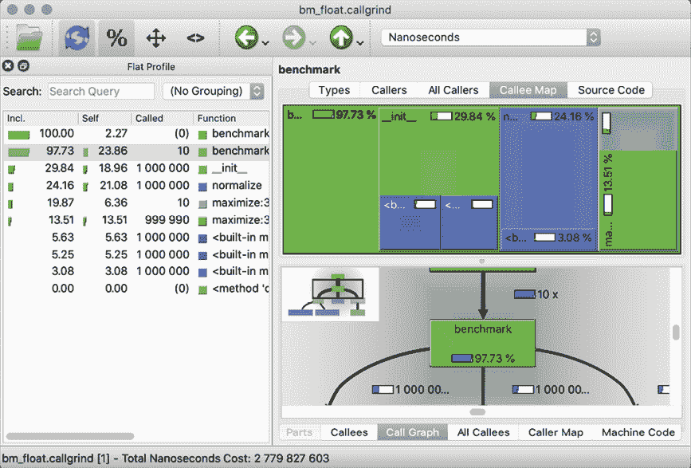
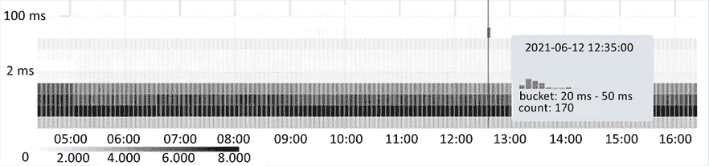
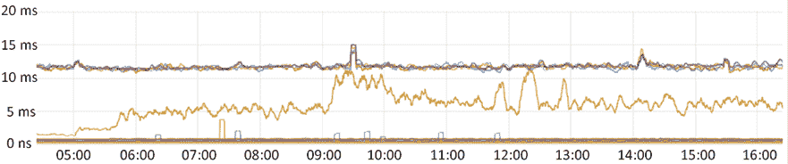

# 第十二章：性能 - 跟踪和减少你的内存和 CPU 使用

在我们讨论性能之前，首先需要考虑的是 Donald Knuth 的一句话：

> “真正的问题在于程序员在错误的地方和错误的时间花费了太多的时间去担心效率；过早的优化是编程中所有邪恶（至少是大部分邪恶）的根源。”

Donald Knuth 通常被称为算法分析的鼻祖。他的书系《计算机程序设计艺术》可以被认为是所有基本算法的圣经。

只要你选择正确的数据结构和合适的算法，性能就不应该是你担心的事情。这并不意味着你应该完全忽略性能，但只是确保你选择了正确的战斗，并且只有在真正需要的时候才进行优化。微/过早的优化确实很有趣，但只有非常少的情况下才有用。

我们已经在第二章《Pythonic 语法和常见陷阱》中看到了许多数据结构的性能特征，所以我们将不会讨论这一点，但我们会向你展示如何测量性能以及如何检测问题。在某些情况下，微优化会有所帮助，但你不知道直到你测量了性能。

在本章中，我们将涵盖：

+   分析 CPU 使用情况

+   分析内存使用情况

+   学习如何正确比较性能指标

+   优化性能

+   寻找和修复内存泄漏

从全局来看，本章分为 CPU 使用和/或 CPU 时间以及内存使用。本章的前半部分主要关注 CPU/时间；后半部分涵盖内存使用。

# 什么是性能？

性能是一个非常广泛的概念。它有许多不同的含义，在许多情况下，它被错误地定义。在本章中，我们将尝试从 CPU 使用/时间和内存使用方面来测量和改进性能。这里的大多数例子都是执行时间和内存使用之间的权衡。请注意，一个只能使用单个 CPU 核心的快速算法，在执行时间上可能会被一个足够多的 CPU 核心就能轻松并行化的较慢算法所超越。

当涉及到关于性能的错误陈述时，你可能已经听到了类似“语言 X 比 Python 快”这样的说法。这个说法本身是错误的。Python 既不快也不慢；Python 是一种编程语言，而一种语言根本没有任何性能指标。如果你要说 CPython 解释器比语言 X 的解释器 Y 快或慢，那是可能的。代码的性能特征在不同解释器之间可能会有很大的差异。只需看看这个小的测试（它使用 ZSH shell 脚本）：

```py
$ export SCRIPT='"".join(str(i) for i in range(10000))'

$ for p in pypy3 pyston python3.{8..10}; do echo -n "$p: "; $p -m timeit "$SCRIPT"; done
pypy3: ... 2000 loops, average of 7: 179 +- 6.05 usec per loop ...
pyston: 500 loops, best of 5: 817 usec per loop
python3.8: 200 loops, best of 5: 1.21 msec per loop
python3.9: 200 loops, best of 5: 1.64 msec per loop
python3.10: 200 loops, best of 5: 1.14 msec per loop 
```

五种不同的 Python 解释器，每个都有不同的性能！它们都是 Python，但解释器显然各不相同。

你可能还没有听说过 PyPy3 和 Pyston 解释器。

PyPy3 解释器是一个替代 Python 解释器，它使用 JIT（即时）编译，在许多情况下比 CPython 表现更好，但当然并非所有情况。PyPy3 的一个大问题是，那些在 C 中有速度提升且依赖于 CPython 扩展（这是大量性能关键库的一部分）的代码要么不支持 PyPy3，要么会遭受性能损失。

Pyston 试图成为 CPython 的替代品，并添加了 JIT 编译。虽然 JIT 编译可能很快就会添加到 CPython 中，但截至 Python 3.10，这还不是事实。这就是为什么 Pyston 可以提供比 CPython 更大的性能优势。缺点是它目前仅支持 Unix/Linux 系统。

看到这个基准测试，你可能想完全放弃 CPython 解释器，只使用 PyPy3。这样的基准测试的危险在于，它们很少提供任何有意义的成果。在这个有限的例子中，Pypy 解释器比 CPython3.10 解释器快了大约 200 倍，但这对于一般情况几乎没有相关性。可以安全得出的唯一结论是，这个特定版本的 PyPy3 解释器在这个特定测试中比这个特定版本的 CPython3 快得多。对于任何其他测试和解释器版本，结果可能会有很大不同。

# 测量 CPU 性能和执行时间

当谈论性能时，你可以测量许多事物。当涉及到 CPU 性能时，我们可以测量：

+   “墙上的时间”（时钟上的绝对时间）。

+   相对时间（当比较多次运行或多个函数时）

+   使用 CPU 时间。由于多线程、多进程或异步处理，这可能与墙上的时间有很大差异。

+   当检查真正低级别的性能时，需要测量 CPU 周期数和循环计数。

除了所有这些不同的测量选项之外，你还应该考虑观察者效应。简单来说，测量需要时间，并且根据你如何测量性能，影响可能很大。

在本节中，我们将探讨几种检查代码 CPU 性能和执行时间的方法。在测量后提高性能的技巧将在本章后面介绍。

## Timeit – 比较代码片段性能

在我们开始提高执行/CPU 时间之前，我们需要一个可靠的方法来测量它们。Python 有一个非常棒的模块（`timeit`），其特定目的是测量代码片段的执行时间。它多次执行一小段代码，以确保尽可能少的变异性，并使测量尽可能干净。如果你想要比较几个代码片段，这非常有用。以下是一些示例执行：

```py
$ python3 -m timeit 'x=[]; [x.insert(0, i) for i in range(10000)]'
10 loops, best of 3: 30.2 msec per loop
$ python3 -m timeit 'x=[]; [x.append(i) for i in range(10000)]'
1000 loops, best of 3: 1.01 msec per loop
$ python3 -m timeit 'x=[i for i in range(10000)]'
1000 loops, best of 3: 381 usec per loop
$ python3 -m timeit 'x=list(range(10000))'
10000 loops, best of 3: 212 usec per loop 
```

这几个示例展示了 `list.insert`、`list.append`、列表推导式和 `list` 函数之间的性能差异。正如我们在 *第四章* 中所看到的，执行 `list.insert` 非常低效，并且在这里很快就会显示出来，在这种情况下比 `list.append` 慢 30 倍。

然而，更重要的是，这段代码展示了我们如何使用 `timeit` 模块以及它是如何工作的。正如你在输出中可以看到的，`list.append` 变体只执行了 `10` 次，而 `list` 调用执行了 `10000` 次。这是 `timeit` 模块最方便的特性之一：它自动为你计算出一些有用的参数，并显示“最佳 3 次”以尝试减少测试中的方差。

`timeit` 模块非常适合比较代码库中相似代码片段的性能。使用 `timeit` 比较不同 Python 解释器的执行时间通常是无用的，因为这很少能代表你整个应用程序的性能。

自然地，这个命令也可以与常规脚本一起使用，但它不会像命令行界面那样自动确定重复次数。因此，我们必须自己来做这件事：

```py
import timeit

def test_list():
    return list(range(10000))

def test_list_comprehension():
    return [i for i in range(10000)]

def test_append():
    x = []
    for i in range(10000):
        x.append(i)

    return x

def test_insert():
    x = []
    for i in range(10000):
        x.insert(0, i)

    return x

def benchmark(function, number=100, repeat=10):
    # Measure the execution times. Passing the globals() is an
    # easy way to make the functions available.
    times = timeit.repeat(function, number=number,
                          globals=globals())
    # The repeat function gives 'repeat' results so we take the
    # min() and divide it by the number of runs
    time = min(times) / number
    print(f'{number} loops, best of {repeat}: {time:9.6f}s :: ',
          function.__name__)

if __name__ == '__main__':
    benchmark(test_list)
    benchmark(test_list_comprehension)
    benchmark(test_append)
    benchmark(test_insert) 
```

当执行此操作时，你将得到以下类似的结果：

```py
$ python3 T_00_timeit.py
100 loops, best of 10:  0.000168s ::  test_list
100 loops, best of 10:  0.000322s ::  test_list_comprehension
100 loops, best of 10:  0.000573s ::  test_append
100 loops, best of 10:  0.027552s ::  test_insert 
```

如你所注意到的，这个脚本仍然有点基础。虽然命令行版本的 `timeit` 会一直尝试，直到达到 0.2 秒或更长时间，但这个脚本只有固定的执行次数。从 Python 3.6 开始，我们确实有使用 `timeit.Timer.autorange` 来复制此行为的选项，但这使用起来不太方便，并且在我们的当前情况下会产生更多的输出。然而，根据你的使用情况，尝试这个基准代码可能是有用的：

```py
def autorange_benchmark(function):
    def print_result(number, time_taken):
        # The autorange function keeps trying until the total
        # runtime (time_taken) reaches 0.2 seconds. To get the
        # time per run we need to divide it by the number of runs
        time = time_taken / number
        name = function.__name__
        print(f'{number} loops, average: {time:9.6f}s :: {name}')

    # Measure the execution times. Passing the globals() is an
    # easy way to make the functions available.
    timer = timeit.Timer(function, globals=globals())
    timer.autorange(print_result) 
```

如果你想要交互式地使用 `timeit`，我建议使用 IPython，因为它有一个魔法命令 `%timeit`，可以显示更多有用的输出：

```py
$ ipython
In [1]: %timeit x=[]; [x.insert(0, i) for i in range(100000)]
2.5 s ± 112 ms per loop (mean ± std. dev. of 7 runs, 1 loop each)

In [2]: %timeit x=[]; [x.append(i) for i in range(100000)]
6.67 ms ± 252 µs per loop (mean ± std. dev. of 7 runs, 100 loops each) 
```

在这种情况下，IPython 会自动处理字符串包装和 `globals()` 的传递。尽管如此，这仍然非常有限，并且仅适用于比较执行同一任务的不同方法。当涉及到完整的 Python 应用程序时，还有更多可用的方法，我们将在本章后面看到。

要查看 IPython 函数和常规模块的源代码，在 IPython 命令行中输入 `object??` 会返回源代码。在这种情况下，只需输入 `timeit??` 来查看 `timeit` IPython 函数的定义。

实现类似于 `%timeit` 函数的最简单方法是通过调用 `timeit.main`：

```py
import timeit

timeit.main(args=['[x for x in range(1000000)]']) 
```

这实际上与以下操作相同：

```py
$ python3 -m timeit '[x for x in range(1000000)]' 
```

`timeit` 模块的内部结构并没有什么特别之处，但请注意尽量减少一些可能导致不准确的因素，例如设置和清理代码。此外，该模块报告的是最快的运行时间，因为系统上的其他进程可能会干扰测量。

基本版本可以通过调用几次`time.perf_counter`（Python 中可用的最高分辨率计时器）来实现，该计时器也被`timeit`内部使用。`timeit.default_timer`函数仅仅是`time.perf_counter`的一个引用。`timeit`函数的基本实现与`timeit`模块的内部实现相当：

```py
import gc
import time
import functools

assert time

TIMEIT_TEMPLATE = '''
def run(number):
    {setup}
    start = time.perf_counter()
    for i in range(number):
        {statement}
    stop = time.perf_counter()
    return stop - start
'''

def timeit(statement, setup='', number=1000000, globals_=None):
    # Get or create globals
    globals_ = globals() if globals_ is None else globals_

    # Create the test code so we can separate the namespace
    src = TIMEIT_TEMPLATE.format(
        statement=statement,
        setup=setup,
        number=number,
    )
    # Compile the source
    code = compile(src, '<source>', 'exec')

    # Define locals for the benchmarked code
    locals_ = {}

    # Execute the code so we can get the benchmark fuction
    exec(code, globals_, locals_)

    # Get the run function from locals() which was added by 'exec'
    run = functools.partial(locals_['run'], number=number)

    # Disable garbage collection to prevent skewing results
    gc.disable()
    try:
        result = run()
    finally:
        gc.enable()

    return result 
```

实际的`timeit`代码在检查输入方面要复杂一些，但这个例子大致展示了如何实现`timeit.timeit`函数，包括为提高精度而添加的几个特性：

+   首先，我们可以看到代码有一个默认值为 1 百万的`number`参数。这样做是为了稍微减少结果的变化性，正如我们在运行代码时将看到的。

+   其次，代码禁用了 Python 垃圾回收器，这样我们就不会因为 Python 决定清理其内存而出现任何减速。

当我们实际调用这段代码时，我们将看到为什么`number`的高值可能很重要：

```py
>>> from T_02_custom_timeit import timeit

>>> statement = '[x for x in range(100)]'

>>> print('{:.7f}'.format(timeit(statement, number=1)))
0.0000064
>>> print('{:.7f}'.format(timeit(statement) / 1000000))
0.0000029
>>> print('{:.7f}'.format(timeit(statement, number=1)))
0.0000287
>>> print('{:.7f}'.format(timeit(statement) / 1000000))
0.0000029 
```

尽管我们每次都调用了完全相同的代码，但第一次运行的单次重复时间比 1 百万次重复版本多两倍以上，第二次运行则比 1 百万次重复版本多 10 倍以上。为了使你的结果在运行之间更加一致和可靠，总是重复测试几次是个好主意，而`timeit`可以在这方面提供帮助。

`timeit.repeat`函数简单地多次调用`timeit.timeit`函数，可以使用列表推导来模拟：

```py
[timeit(statement) for _ in range(repeat)] 
```

既然我们已经知道了如何测试简单的代码语句，那么让我们看看如何找到代码中的慢速语句。

## cProfile – 寻找最慢的组件

```py
profile/cProfile modules are only useful for relative results because profiling increases the runtime. There are ways to make the results more accurate, but more about that later.
```

`profile`和`cProfile`模块提供了完全相同的接口，但后者是用 C 编写的，速度要快得多。如果系统上可用，我建议使用`cProfile`。如果不可用，你可以在以下示例中安全地将任何`cProfile`的出现替换为`profile`。

### 首次分析运行

让我们分析第六章中的斐波那契函数，*装饰器 – 通过装饰实现代码重用*，既有缓存函数也有无缓存函数的情况。首先，代码：

```py
import sys
import functools

@functools.lru_cache()
def fibonacci_cached(n):
    if n < 2:
        return n
    else:
        return fibonacci_cached(n - 1) + fibonacci_cached(n - 2)

def fibonacci(n):
    if n < 2:
        return n
    else:
        return fibonacci(n - 1) + fibonacci(n - 2)

if __name__ == '__main__':
    n = 30
    if sys.argv[-1] == 'cache':
        fibonacci_cached(n)
    else:
        fibonacci(n) 
```

为了提高可读性，所有`cProfile`统计信息都将从所有`cProfile`输出中的`percall`列中去除。这些列包含每次函数调用的持续时间，在这些示例中，这些值几乎总是为 0 或与`cumtime`（累积时间）列相同，因此对于这些示例来说是不相关的。

首先，我们将不使用缓存执行该函数：

```py
$ python3 -m cProfile T_03_profile_fibonacci.py no_cache
   2692557 function calls (21 primitive calls) in 0.596 seconds

   Ordered by: standard name

   ncalls tottime cumtime filename:lineno(function)
        1   0.000   0.596 T_03_profile_fibonacci.py:1(<module>)
2692537/1   0.596   0.596 T_03_profile_fibonacci.py:13(fibonacci)
        1   0.000   0.000 functools.py:35(update_wrapper)
        1   0.000   0.000 functools.py:479(lru_cache)
        1   0.000   0.000 functools.py:518(decorating_function)
        1   0.000   0.596 {built-in method builtins.exec}
        7   0.000   0.000 {built-in method builtins.getattr}
        1   0.000   0.000 {built-in method builtins.isinstance}
        5   0.000   0.000 {built-in method builtins.setattr}
        1   0.000   0.000 {method 'disable' of '_lsprof.Profile...
        1   0.000   0.000 {method 'update' of 'dict' objects} 
```

我们看到总共有`2692557`次调用，这相当多。我们几乎调用了 300 万次`test_fibonacci`函数。这就是分析模块提供大量见解的地方。让我们进一步分析这些指标，按照它们出现的顺序：

+   `ncalls`: 调用该函数的次数。

+   `tottime`: 该函数中花费的总时间，**不包括**子函数。

+   `percall`: 每次调用（不包括子函数）的时间：`tottime / ncalls`。

+   `cumtime`：在这个函数中花费的总时间，**包括**子函数。

+   `percall`：包括子函数的每次调用时间：`cumtime / ncalls`。这个指标与上面的`percall`指标名称相同，但含义不同。

哪个最有用取决于你的用例。使用默认输出中的`-s`参数更改排序顺序非常简单。但现在让我们看看使用缓存版本的结果。再次，使用去除输出的方式：

```py
$ python3 -m cProfile T_03_profile_fibonacci.py cache
         51 function calls (21 primitive calls) in 0.000 seconds

   Ordered by: standard name

ncalls tottime cumtime filename:lineno(function)
     1  0.000  0.000 T_03_profile_fibonacci.py:1(<module>)
  31/1  0.000  0.000 T_03_profile_fibonacci.py:5(fibonacci_cached)
     1  0.000  0.000 functools.py:35(update_wrapper)
     1  0.000  0.000 functools.py:479(lru_cache)
     1  0.000  0.000 functools.py:518(decorating_function)
     1  0.000  0.000 {built-in method builtins.exec}
     7  0.000  0.000 {built-in method builtins.getattr}
     1  0.000  0.000 {built-in method builtins.isinstance}
     5  0.000  0.000 {built-in method builtins.setattr}
     1  0.000  0.000 {method 'disable' of '_lsprof.Profiler' ...}
     1  0.000  0.000 {method 'update' of 'dict' objects} 
```

这次我们看到一个`tottime`为`0.000`，因为它太快而无法测量。此外，尽管`fibonacci_cached`函数仍然是执行次数最多的函数，但它只执行了 31 次，而不是 300 万次。

### 校准剖析器

为了说明`profile`和`cProfile`之间的区别，让我们再次尝试使用`profile`模块而不是缓存运行。提醒一下：这会慢得多，所以如果你发现它稍微卡顿，不要感到惊讶：

```py
$ python3 -m profile T_03_profile_fibonacci.py no_cache
         2692558 function calls (22 primitive calls) in 4.541 seconds

   Ordered by: standard name

   ncalls  tottime cumtime filename:lineno(function)
        1    0.000   4.530 :0(exec)
        7    0.000   0.000 :0(getattr)
        1    0.000   0.000 :0(isinstance)
        5    0.000   0.000 :0(setattr)
        1    0.010   0.010 :0(setprofile)
        1    0.000   0.000 :0(update)
        1    0.000   4.530 T_03_profile_fibonacci.py:1(<module>)
2692537/1    4.530   4.530 T_03_profile_fibonacci.py:13(fibonacci)
        1    0.000   0.000 functools.py:35(update_wrapper)
        1    0.000   0.000 functools.py:479(lru_cache)
        1    0.000   0.000 functools.py:518(decorating_function)
        1    0.000   4.541 profile:0(<code object <module> at ...
        0    0.000   0.000 profile:0(profiler) 
```

代码现在运行速度慢了近 10 倍，唯一的区别是使用纯 Python 的`profile`模块而不是`cProfile`模块。这确实表明`profile`模块存在一个大问题。模块本身的开销足够大，足以扭曲结果，这意味着我们应该考虑到这个偏差。

这正是`Profile.calibrate()`函数负责的，因为它计算了剖析模块引起的性能偏差。为了计算偏差，我们可以使用以下脚本：

```py
import profile

if __name__ == '__main__':
    profiler = profile.Profile()
    for i in range(10):
        print(profiler.calibrate(100000)) 
```

数字会有轻微的变化，但你应该能够得到一个关于`profile`模块引入到你的代码中的性能偏差的合理估计。它实际上在启用和禁用剖析的情况下运行了一小段代码，并计算一个乘数，将其应用于所有结果，使它们更接近实际持续时间。

如果数字仍然变化很大，你可以将试验次数从`100000`增加到更大。

注意，在许多现代处理器中，CPU 的突发性能（前几秒）与持续性能（2 分钟或更长时间）可能会有很大的差异。

CPU 性能也高度依赖于温度，所以如果你的系统有一个大型的 CPU 散热器或者水冷，在 100% CPU 负载下，它可能需要 20 分钟才能使 CPU 性能变得一致。那 20 分钟之后的偏差将完全无法作为冷 CPU 的偏差使用。

这种校准类型仅适用于`profile`模块，并且应该有助于实现更准确的结果。对于所有新创建的剖析器，偏差可以全局设置：

```py
import profile

# The number here is bias calculated earlier
profile.Profile.bias = 9.809351906482531e-07 
```

或者，对于特定的`Profile`实例：

```py
import profile

profiler = profile.Profile(bias=9.809351906482531e-07) 
```

注意，一般来说，使用较小的偏差比使用较大的偏差更好，因为大的偏差可能会导致非常奇怪的结果。如果偏差足够大，你甚至可能会得到负的时间值。让我们在我们的斐波那契代码上试一试：

```py
import sys
import pstats
import profile

...
if __name__ == '__main__':
    profiler = profile.Profile(bias=9.809351906482531e-07)
    n = 30

    if sys.argv[-1] == 'cache':
        profiler.runcall(fibonacci_cached, n)
    else:
        profiler.runcall(fibonacci, n)

    stats = pstats.Stats(profiler).sort_stats('calls')
    stats.print_stats() 
```

在运行时，确实看起来我们使用了一个太大的偏差：

```py
$ python3 T_05_profiler_large_bias.py
      2692539 function calls (3 primitive calls) in -0.746 seconds

   Ordered by: call count

   ncalls tottime cumtime filename:lineno(function)
2692537/1  -0.747  -0.747 T_05_profiler..._bias.py:15(fibonacci)
        1   0.000  -0.746 profile:0(<function fibonacci at ...>)
        1   0.000   0.000 :0(setprofile)
        0   0.000   0.000 profile:0(profiler) 
```

尽管如此，它仍然显示了代码的正确使用方法。您甚至可以在脚本中使用类似这样的片段将偏差计算包含在内：

```py
import profile

if __name__ == '__main__':
    profiler = profile.Profile()
    profiler.bias = profiler.calibrate(100000) 
```

```py
profile module. The only cost is the duration of the calibrate() run, and with a small number of trials (say, 10000), it only takes about 0.2 seconds on my current system while still greatly increasing the accuracy of the results. Because of this properly calculated bias, the results can actually be more accurate than the cProfile module.
```

### 使用装饰器的选择性分析

使用装饰器计算简单的计时很容易，但分析可以显示更多内容，并且也可以通过装饰器或上下文包装器有选择性地应用。让我们看看 `timer` 和 `profiler` 装饰器：

```py
import cProfile
import datetime
import functools

def timer(function):
    @functools.wraps(function)
    def _timer(*args, **kwargs):
        start = datetime.datetime.now()
        try:
            return function(*args, **kwargs)
        finally:
            end = datetime.datetime.now()
            print(f'{function.__name__}: {end - start}')

    return _timer

def profiler(function):
    @functools.wraps(function)
    def _profiler(*args, **kwargs):
        profiler = cProfile.Profile()
        try:
            profiler.enable()
            return function(*args, **kwargs)
        finally:
            profiler.disable()
            profiler.print_stats()

    return _profiler 
```

现在我们已经创建了装饰器，我们可以使用它们来分析和计时我们的函数：

```py
@profiler
def profiled_fibonacci(n):
    return fibonacci(n)

@timer
def timed_fibonacci(n):
    return fibonacci(n)
def fibonacci(n):
    if n < 2:
        return n
    else:
        return fibonacci(n - 1) + fibonacci(n - 2)

if __name__ == '__main__':
    timed_fibonacci(32)
    profiled_fibonacci(32) 
```

代码很简单：只是一个基本的 `timer` 和 `profiler` 装饰器打印一些默认统计信息。哪个最适合您取决于您的用例，当然。`timer()` 装饰器在开发过程中用于快速性能跟踪和/或合理性检查非常有用。`profiler()` 装饰器在您积极工作于函数的性能特征时非常出色。

这种选择性分析的附加优势是输出更有限，这有助于可读性，尽管仍然比 `timer()` 装饰器冗长得多：

```py
$ python3 T_06_selective_profiling.py
timed_fibonacci: 0:00:00.744912
         7049157 function calls (3 primitive calls) in 1.675 seconds

   Ordered by: standard name

   ncalls  tottime cumtime filename:lineno(function)
        1    0.000   1.675 T_06_select...py:31(profiled_fibonacci)
7049155/1    1.675   1.675 T_06_selec...profiling.py:41(fibonacci)
        1    0.000   0.000 {method 'disable' of '_lsprof.Profil... 
```

如您所见，分析器仍然使代码大约慢了两倍，但绝对是可用的。

### 使用配置文件统计信息

为了获得更有趣的分析结果，我们将使用 `pyperformance.benchmarks.bm_float` 脚本进行分析。

`pyperformance` 库是针对 CPython 解释器优化的官方 Python 基准测试库。它包含大量（持续增长）的基准测试，以监控 CPython 解释器在许多场景下的性能。

可以通过 `pip` 进行安装：

```py
$ pip3 install pyperformance 
```

首先，让我们使用此脚本创建统计信息：

```py
import sys
import pathlib
import pstats
import cProfile

import pyperformance

# pyperformance doesn't expose the benchmarks anymore so we need
# to manually add the path
pyperformance_path = pathlib.Path(pyperformance.__file__).parent
sys.path.append(str(pyperformance_path / 'data-files'))

# Now we can import the benchmark
from benchmarks.bm_float import run_benchmark as bm_float  # noqa

def benchmark():
    for i in range(10):
        bm_float.benchmark(bm_float.POINTS)

if __name__ == '__main__':
    profiler = cProfile.Profile()
    profiler.runcall(benchmark)
    profiler.dump_stats('bm_float.profile')
    stats = pstats.Stats('bm_float.profile')
    stats.strip_dirs()
    stats.sort_stats('calls', 'cumtime')
    stats.print_stats(10) 
```

在执行脚本时，您应该得到类似以下内容：

```py
$ python3 T_07_profile_statistics.py
Sun May  1 06:14:26 2022    bm_float.profile

         6000012 function calls in 2.501 seconds

   Ordered by: call count, cumulative time

   ncalls  tottime  percall  cumtime  percall filename:lineno(function)
  1000000    0.446    0.000    0.682    0.000 run_benchmark.py:15(__init__)
  1000000    0.525    0.000    0.599    0.000 run_benchmark.py:23(normalize)
  1000000    0.120    0.000    0.120    0.000 {built-in method math.cos}
  1000000    0.116    0.000    0.116    0.000 {built-in method math.sin}
  1000000    0.073    0.000    0.073    0.000 {built-in method math.sqrt}
   999990    0.375    0.000    0.375    0.000 run_benchmark.py:32(maximize)
       10    0.625    0.063    2.446    0.245 run_benchmark.py:46(benchmark)
       10    0.165    0.017    0.540    0.054 run_benchmark.py:39(maximize)
        1    0.055    0.055    2.501    2.501 T_07_profile_statistics.py:17(benchmark)
        1    0.000    0.000    0.000    0.000 {method 'disable' of '_lsprof.Profiler' objects} 
```

运行脚本后，您应该有一个包含分析结果的 `bm_float.profile` 文件。正如我们在脚本中所见，这些统计信息可以通过 `pstats` 模块查看。

在某些情况下，结合多个测量的结果可能很有趣。这可以通过指定多个文件或使用 `stats.add(*filenames)` 实现。

将这些配置文件结果保存到文件中的主要优势是，多个应用程序支持这种输出，并且可以以更清晰的方式可视化它。一个选项是 SnakeViz，它使用您的网络浏览器以交互方式渲染配置文件结果。此外，我们还有 QCacheGrind，这是一个非常好的配置文件统计信息可视化器，但需要一些手动编译才能运行，或者当然需要寻找二进制文件。

让我们看看 QCacheGrind 的输出。在 Windows 的情况下，QCacheGrindWin 软件包提供了一个二进制文件，而在 Linux 中，它很可能通过您的软件包管理器提供，而在 OS X 中，您可以尝试 `brew install qcachegrind`。

然而，您还需要一个额外的软件包：`pyprof2calltree` 软件包。它将 `profile` 输出转换为 QCacheGrind 可以理解的格式。因此，在简单的 `pip install pyprof2calltree` 之后，我们现在可以将 `profile` 文件转换为 `callgrind` 文件：

```py
$ pyprof2calltree -i bm_float.profile -o bm_float.callgrind
writing converted data to: bm_float.callgrind
$ qcachegrind bm_float.callgrind 
```

这会导致`QCacheGrind`应用程序的运行。切换到适当的标签后，你应该能看到以下截图类似的内容：



图 12.1：QCacheGrind

对于这样一个简单的脚本，几乎所有的输出都是有效的。然而，对于完整的应用程序，像 QCacheGrind 这样的工具是无价的。查看 QCacheGrind 生成的输出，可以立即看出哪个进程花费了最多时间。右上角的布局显示，如果花费的时间更多，则更大的矩形，这是对使用的 CPU 时间块非常有用的可视化。左边的列表与`cProfile`非常相似，因此没有什么新内容。右下角的树可能非常有价值，也可能毫无价值，就像在这个例子中一样。它显示了函数中占用的 CPU 时间百分比，更重要的是，该函数与其他函数的关系。

由于这些工具根据输入进行扩展，因此结果对几乎所有应用程序都很有用。无论函数需要 100 毫秒还是 100 分钟，都没有区别——输出将清楚地显示慢的部分，这正是我们试图修复的部分。

## 行性能分析器 – 按行跟踪性能

`line_profiler`实际上不是一个与 Python 捆绑的包，但它非常实用，不能忽视。虽然常规的`profile`模块在某个块内对所有的（子）函数进行性能分析，但`line_profiler`允许对函数中的每一行进行逐行性能分析。斐波那契函数在这里并不适用，但我们可以使用素数生成器。但首先，安装`line_profiler`：

```py
$ pip3 install line_profiler 
```

现在我们已经安装了`line_profiler`模块（以及`kernprof`命令），让我们测试`line_profiler`：

```py
import itertools

@profile
def primes():
    n = 2
    primes = set()
    while True:
        for p in primes:
            if n % p == 0:
                break
        else:
            primes.add(n)
            yield n
        n += 1

if __name__ == '__main__':
    total = 0
    n = 2000
    for prime in itertools.islice(primes(), n):
        total += prime

    print('The sum of the first %d primes is %d' % (n, total)) 
```

你可能想知道`profile`装饰器是从哪里来的。它起源于`line_profiler`模块，这就是为什么我们必须使用`kernprof`命令运行脚本的原因：

```py
$ kernprof --line-by-line T_08_line_profiler.py
The sum of the first 2000 primes is 16274627
Wrote profile results to T_08_line_profiler.py.lprof 
```

正如命令所说，结果已经写入`T_08_line_profiler.py.lprof`文件，因此我们现在可以查看该文件的输出。为了便于阅读，我们已跳过`Line #`列：

```py
$ python3 -m line_profiler T_08_line_profiler.py.lprof
Timer unit: 1e-06 s

Total time: 1.34623 s
File: T_08_line_profiler.py
Function: primes at line 4
   Hits         Time  Per Hit   % Time  Line Contents
=====================================================
                                        @profile
                                        def primes():
      1          3.0      3.0      0.0      n = 2
      1          1.0      1.0      0.0      primes = set()
                                            while True:
2055131     625266.0      0.3     46.4          for p in primes:
2053131     707403.0      0.3     52.5              if n % p == 0:
  15388       4893.0      0.3      0.4                  break
                                                else:
   2000       1519.0      0.8      0.1              primes.add(n)
   2000        636.0      0.3      0.0              yield n
  17387       6510.0      0.4      0.5          n += 1 
```

多么棒的输出，不是吗？它使得在一段代码中找到慢的部分变得非常简单。在这段代码中，缓慢的原因显然来自循环，但在其他代码中可能并不那么明显。

此模块也可以作为 IPython 扩展添加，这将在 IPython 中启用`%lprun`命令。要从 IPython shell 中加载扩展，可以使用`load_ext`命令，`%load_ext line_profiler`。

我们已经看到了几种测量 CPU 性能和执行时间的方法。现在是时候看看如何提高性能了。由于这主要适用于 CPU 性能而不是内存性能，我们将首先介绍这一点。在本章的后面部分，我们将探讨内存使用和泄漏。

# 提高执行时间

关于性能优化可以有很多说法，但说实话，如果你已经阅读了这本书到目前为止的所有内容，你就知道大多数 Python 特定的快速代码编写技术。整体应用程序性能最重要的因素始终是算法的选择，以及由此扩展的数据结构。在`list`（`O(n)`）中搜索一个项目几乎总是比在`dict`或`set`（`O(1)`）中搜索一个项目更糟糕，正如我们在*第四章*中看到的。

自然，还有更多因素和技巧可以帮助使你的应用程序更快。然而，所有性能提示的极度简略版本非常简单：尽可能少做。无论你使计算和操作多快，什么都不做总是最快的。以下章节将涵盖 Python 中最常见的性能瓶颈，并测试一些关于性能的常见假设，例如`try`/`except`块与`if`语句的性能，这在许多语言中可能产生巨大的影响。

本节中的一些技巧将在内存和执行时间之间进行权衡；其他技巧则会在可读性和性能之间进行权衡。当不确定时，默认选择可读性，并且只有在必要时才提高性能。

## 使用正确的算法

在任何应用程序中，选择正确的算法无疑是最重要的性能特征，这就是为什么我要重复强调这一点，以说明错误选择的结果。考虑以下情况：

```py
In [1]: a = list(range(1000000))

In [2]: b = dict.fromkeys(range(1000000))

In [3]: %timeit 'x' in a
12.2 ms ± 245 µs per loop (mean ± std. dev. of 7 runs, 100 loops each)

In [4]: %timeit 'x' in b
40.1 ns ± 0.446 ns per loop (mean ± std. dev. of 7 runs, 10000000 loops each) 
```

检查一个项目是否在`list`中是一个`O(n)`操作，而检查一个项目是否在`dict`中是一个`O(1)`操作。当`n=1000000`时，这会带来巨大的差异；在这个简单的测试中，我们可以看到对于一百万个项目，它快了 300,000 倍。

大 O 符号（`O(...)`）在*第四章*中有更详细的介绍，但我们可以提供一个快速回顾。

`O(n)`表示对于`len(some_list) = n`的`list`，执行操作需要`n`步。因此，`O(1)`表示无论集合的大小如何，它都需要恒定的时间。

所有其他性能提示加在一起可能使你的代码速度提高一倍，但使用适合工作的正确算法可以带来更大的改进。使用一个需要`O(n)`时间而不是`O(n²)`时间的算法，当`n=1000`时，将使你的代码快`1000`倍，而对于更大的`n`，差异只会进一步扩大。

## 全局解释器锁

CPython 解释器中最神秘的部分之一是**全局解释器锁**（**GIL**），这是一个**互斥锁**（**mutex**），用于防止内存损坏。Python 内存管理器不是线程安全的，这就是为什么需要 GIL。没有 GIL，多个线程可能会同时更改内存，导致各种意外和可能危险的结果。GIL 在*第十四章*中有更详细的介绍。

GIL 在现实生活中的应用有什么影响？在单线程应用程序中，它没有任何区别，实际上是一种非常快速的内存一致性方法。

然而，在多线程应用程序中，这可能会稍微减慢你的应用程序，因为一次只能有一个线程访问 GIL。如果你的代码需要频繁访问 GIL，那么进行一些重构可能会有所帮助。

幸运的是，Python 提供了一些其他并行处理选项。我们将在*第十三章*中看到的`asyncio`模块，可以通过在等待慢速操作时切换任务来提供很大帮助。在第十四章中，我们将看到`multiprocessing`库，它允许我们同时使用多个处理器。

## try 与 if

在许多语言中，`try/except`类型的块会带来相当大的性能损失，但在 Python 中，只要你没有进入`except`块，这并不是问题。如果你触发了`except`，它可能比`if`语句稍微重一些，但在大多数情况下并不明显。

并非`if`语句本身很重，而是如果你预期你的`try/except`在大多数情况下都会成功，只有在罕见情况下才会失败，那么这绝对是一个有效的替代方案。但是，一如既往地，要关注可读性和传达代码的目的。如果代码的意图使用`if`语句更清晰，就使用`if`语句。如果`try`/`except`以更好的方式传达意图，就使用它。

大多数编程语言都依赖于**LBYL（先检查后执行**）理念。这意味着你在尝试之前总是进行检查，所以如果你要从`dict`中获取`some_key`，你应该使用：

```py
if some_key in some_dict:
    process_value(some_dict[some_key]) 
```

因为你总是在做`if`，这暗示`some_key`通常不是`some_dict`的一部分。

在 Python 中，当适用时，通常使用**EAFP（先做后检查**）理念。这意味着代码假设一切都会按预期工作，但仍然会捕获错误：

```py
try:
    process_value(some_dict[some_key])
except KeyError:
    pass 
```

这两个例子功能上大致相同，但后者给出了你期望键是可用的，并在需要时捕获错误的印象。这是 Python 的 Zen（明确优于隐含）适用的一个案例。

上述代码的唯一缺点是，你可能会意外地捕获`process_value()`的`KeyError`，所以如果你想避免这种情况，你应该使用以下代码：

```py
try:
    value = some_dict[some_key]
except KeyError:
    pass
else:
    process_value(value) 
```

你使用哪个主要取决于个人喜好，但应该记住的是，在 Python 中，这两种选项都是完全有效的，并且性能相似。

## 列表与生成器

使用生成器懒加载代码几乎总是比计算整个数据集更好。性能优化的最重要规则可能是你不应该计算你不会使用的东西。如果你不确定你是否需要它，就不要计算它。

不要忘记你可以轻松地链式多个生成器，这样只有在实际需要时才会进行计算。但务必小心，这不会导致重复计算；通常来说，使用`itertools.tee()`比完全重新计算结果更好。

回顾一下*第七章*中提到的`itertools.tee()`，一个常规生成器只能被消费一次，所以如果你需要两次或更多次处理结果，可以使用`itertools.tee()`来存储中间结果：

```py
>>> import itertools

# Without itertools.tee:
>>> generator = itertools.count()
>>> list(itertools.islice(generator, 5))
[0, 1, 2, 3, 4]
>>> list(itertools.islice(generator, 5))
[5, 6, 7, 8, 9]

>>> generator_a, generator_b = itertools.tee(itertools.count())
>>> list(itertools.islice(generator_a, 5))
[0, 1, 2, 3, 4]
>>> list(itertools.islice(generator_b, 5))
[0, 1, 2, 3, 4] 
```

如你所见，如果你忘记在这里使用`itertools.tee()`，你只会处理一次结果，并且它们会处理不同的值。另一种修复方法是使用`list()`并存储中间结果，但这会消耗更多的内存，并且你需要预先计算所有项目，而不知道你是否真的需要它们。

## 字符串连接

你可能看到过基准测试说使用`+=`比连接字符串慢得多，因为`str`对象（就像`bytes`一样）是不可变的。结果是每次你在字符串上使用`+=`时，它都必须创建一个新的对象。在某个时刻，这确实造成了很大的差异。然而，在 Python 3 中，大多数差异都已经消失了：

```py
In [1]: %%timeit
   ...: s = ''
   ...: for i in range(1000000):
   ...:     s += str(i)
   ...:
1 loops, best of 3: 362 ms per loop

In [2]: %%timeit
   ...: ss = []
   ...: for i in range(1000000):
   ...:     ss.append(str(i))
   ...: s = ''.join(ss)
   ...:
1 loops, best of 3: 332 ms per loop

In [3]: %timeit ''.join(str(i) for i in range(1000000))
1 loops, best of 3: 324 ms per loop

In [4]: %timeit ''.join([str(i) for i in range(1000000)])
1 loops, best of 3: 294 ms per loop 
```

当然，还有一些差异，但它们非常小，我建议你简单地忽略它们，并选择最易读的选项。

## 添加与生成器的比较

就像字符串连接一样，在较老的 Python 版本中，循环中的添加操作速度显著较慢，但现在差异已经小到可以忽略不计：

```py
In [1]: %%timeit
   ...: x = 0
   ...: for i in range(1000000):
   ...:     x += i
   ...:
10 loops, best of 3: 73.2 ms per loop

In [2]: %timeit x = sum(i for i in range(1000000))
10 loops, best of 3: 75.3 ms per loop

In [3]: %timeit x = sum([i for i in range(1000000)])
10 loops, best of 3: 71.2 ms per loop

In [4]: %timeit x = sum(range(1000000))
10 loops, best of 3: 25.6 ms per loop 
```

然而，真正有帮助的是让 Python 使用原生函数内部处理所有操作，正如最后一个例子所示。

## `map()`与生成器和列表推导式的比较

再次强调，可读性通常比性能更重要，所以只有在确实有影响的情况下才进行重写。有些情况下`map()`比列表推导式和生成器快，但这仅限于`map()`函数可以使用预定义函数的情况。一旦你需要使用`lambda`，实际上会更慢。不过这并不重要，因为可读性应该是关键。如果`map()`使你的代码比生成器或列表推导式更易读，那么你可以自由使用它。否则，我不推荐使用它：

```py
In [1]: %timeit list(map(lambda x: x/2, range(1000000)))
10 loops, best of 3: 182 ms per loop

In [2]: %timeit list(x/2 for x in range(1000000))
10 loops, best of 3: 122 ms per loop

In [3]: %timeit [x/2 for x in range(1000000)]
10 loops, best of 3: 84.7 ms per loop 
```

如你所见，列表推导式比生成器快得多。在许多情况下，我仍然会推荐使用生成器而不是列表推导式，这主要是因为内存使用和潜在的惰性。

如果在生成 1,000 个项目时，你只打算使用前 10 个项目，那么计算完整的项目列表仍然会浪费很多资源。

## 缓存

我们已经在 *第六章* 中介绍了 `functools.lru_cache` 装饰器，*装饰器 – 通过装饰实现代码重用*，但它的作用不容小觑。无论你的代码有多快、多聪明，不需要计算结果总是更好的，这正是缓存的作用。根据你的使用场景，有许多选项可供选择。在一个简单的脚本中，`functools.lru_cache` 是一个非常好的选择，但在应用程序的多次执行之间，`cPickle` 模块也可以成为救命稻草。

我们在本章的 `cProfile` 部分已经看到了 `fibonacci_cached` 函数的这种影响，该函数使用了 `functools.lru_cache()`。

然而，有几个场景需要更强大的解决方案：

+   如果你需要在脚本多次执行之间进行缓存

+   如果你需要跨多个进程共享缓存

+   如果你需要在多个服务器之间共享缓存

至少对于前两种场景，你可以将缓存写入本地 pickle/CSV/JSON/YAML/DBM 等文件。这是一个完全有效的解决方案，我经常使用。

如果你需要更强大的解决方案，我强烈建议查看 **Redis**。Redis 服务器是一个完全基于内存的服务器，速度极快，并提供许多有用的数据结构。如果你看到有关使用 Memcached 提高性能的文章或教程，只需将 Memcached 替换为 Redis 即可。Redis 在各个方面都优于 Memcached，并且在其最基本的形式中，API 是兼容的。

## 懒加载导入

应用程序加载时间的一个常见问题是，程序开始时立即加载所有内容，而实际上，对于许多应用程序来说，这实际上并不需要，应用程序的某些部分只有在实际使用时才需要加载。为了方便起见，你可以偶尔将导入移动到函数内部，以便按需加载。

虽然在某些情况下这是一个有效的策略，但我通常不推荐以下两个原因：

+   它会使你的代码更不清晰；将所有导入以相同风格放在文件顶部可以提高可读性。

+   它并不会使代码更快，因为它只是将加载时间移到了不同的部分。

## 使用 slots

`__slots__` 功能是由 Guido van Rossum 编写的，旨在提高 Python 性能。实际上，`__slots__` 功能的作用是为类指定一个固定的属性列表。当使用 `__slots__` 时，会对类进行一些更改，并必须考虑一些（副作用）：

+   所有属性都必须在 `__slots__` 中显式命名。如果 `some_variable` 不在 `__slots__` 中，则无法执行 `some_instance.some_variable = 123`。

+   由于 `__slots__` 中的属性列表是固定的，因此不再需要 `__dict__` 属性，这节省了内存。

+   属性访问更快，因为没有通过 `__dict__` 进行中间查找。

+   如果两个父类都定义了 `__slots__`，则无法使用多重继承。

那么，`__slots__`能给我们带来多少性能上的好处呢？让我们来测试一下：

```py
import timeit
import functools

class WithSlots:
    __slots__ = 'eggs',

class WithoutSlots:
    pass

with_slots = WithSlots()
no_slots = WithoutSlots()

def test_set(obj):
    obj.eggs = 5

def test_get(obj):
    return obj.eggs

timer = functools.partial(
    timeit.timeit,
    number=20000000,
    setup='\n'.join((
        f'from {__name__} import with_slots, no_slots',
        f'from {__name__} import test_get, test_set',
    )),
)
for function in 'test_set', 'test_get':
    print(function)
    print('with slots', timer(f'{function}(with_slots)'))
    print('with slots', timer(f'{function}(no_slots)')) 
```

当我们实际运行这段代码时，我们可以肯定地看到使用`__slots__`带来的某些改进：

```py
$ python3 T_10_slots_performance.py
test_set
with slots 1.748628467
with slots 2.0184642979999996
test_get
with slots 1.5832197570000002
with slots 1.6575410809999997 
```

在大多数情况下，我会说 5-15%的性能差异并不会对你有很大帮助。然而，如果它应用于接近应用程序核心且经常执行的一小段代码，它可能会有所帮助。

不要期望这种方法能带来奇迹，但当你需要时请使用它。

## 使用优化库

这是一个非常广泛的建议，但仍然很有用。如果你有一个高度优化的库适合你的目的，你很可能无法在不付出大量努力的情况下超越其性能。例如`numpy`、`pandas`、`scipy`和`sklearn`等库在性能上高度优化，它们的原生操作可以非常快。如果它们适合你的目的，请务必尝试一下。

在你能够使用`numpy`之前，你需要安装它：`pip3 install numpy`。

仅为了说明`numpy`与纯 Python 相比有多快，请参考以下内容：

```py
In [1]: import numpy

In [2]: a = list(range(1000000))

In [3]: b = numpy.arange(1000000)

In [4]: %timeit c = [x for x in a if x > 500000]
10 loops, best of 3: 44 ms per loop

In [5]: %timeit d = b[b > 500000]
1000 loops, best of 3: 1.61 ms per loop 
```

`numpy`代码与 Python 代码完全相同，只是它使用`numpy`数组而不是 Python 列表。这个小小的差异使得代码的速度提高了 25 倍以上。

## 即时编译

**即时编译**（**JIT**）是一种在运行时动态编译（应用程序的）部分的方法。因为运行时可以提供更多信息，这可以产生巨大的影响，使你的应用程序运行得更快。

当谈到即时编译时，你目前有三个选项：

+   **Pyston**：一个替代品，目前仅支持 Linux，是 CPython 兼容的 Python 解释器。

+   **Pypy**：一个真正快速的替代 Python 解释器，但不完全兼容 CPython。

+   **Numba**：一个允许按函数进行即时编译并在 CPU 或 GPU 上执行的包。

+   **CPython 3.12 和 3.13**？在撰写本文时，关于即将发布的 Python 版本的数据很少，但有计划大幅提高 CPython 解释器的性能。具体能实现多少以及效果如何目前尚不清楚，但雄心勃勃的计划是在接下来的 5 个版本中使 CPython 快 5 倍（3.10 是该系列的第一版）。预期将在 CPython 3.12 中添加即时编译，并在 3.13 中进一步扩展。

如果你正在寻找在现有项目中实现全局即时编译，我目前可以推荐尝试 Pyston。它是一个 CPython 分支，承诺在不修改任何代码的情况下提高大约 30%的性能。此外，因为它与 CPython 兼容，你仍然可以使用常规的 CPython 模块。

然而，它的缺点是目前仅支持 Linux 系统，并且，正如分支通常的情况一样，它落后于当前的 Python 版本。在撰写本文时，CPython 是 Python 3.10.1，而 Pyston 是 Python 3.8。

如果你不需要与所有 CPython 模块兼容，并且不需要 Python 中太新的功能，PyPy3 在许多情况下也可以提供惊人的性能。它们支持到 Python 3.7，而主 Python 版本在撰写本文时是 3.10.1。这使得 PyPy 在功能上比 CPython 约落后 2-3 年，但我怀疑这不会是一个大问题。Python 3.7、3.8、3.9 和 3.10 之间的差异主要是增量性的，而 Python 3.7 已经是一个非常完善的 Python 版本。

`numba` 包为你提供了选择性的 JIT 编译，允许你标记与 JIT 编译器兼容的函数。本质上，如果你的函数遵循仅基于输入进行计算的函数式编程范式，那么它很可能与 JIT 编译器兼容。

这里是一个如何使用 `numba` JIT 编译器的基本示例：

```py
import numba

@numba.jit
def sum(array):
    total = 0.0
    for value in array:
        total += value
    return value 
```

如果你正在使用 `numpy` 或 `pandas`，你很可能从查看 `numba` 中受益。

另一个值得注意的有趣事实是，`numba` 不仅支持 CPU 优化的执行，还支持 GPU。这意味着对于某些操作，你可以使用显卡中的快速处理器来处理结果。

## 将代码的部分转换为 C

我们将在第十七章“C/C++ 扩展、系统调用和 C/C++ 库”中了解更多关于这个内容，但如果确实需要高性能，那么一个本地的 C 函数可以非常有帮助。这甚至不必那么困难；Cython 模块使得用接近原生 C 代码的性能编写代码的部分变得非常简单。

以下是一个来自 Cython 手册的示例，用于估算 π 的值：

```py
cdef inline double recip_square(int i):
    return 1./(i*i)

def approx_pi(int n=10000000):
    cdef double val = 0.
    cdef int k
    for k in range(1,n+1):
        val += recip_square(k)
    return (6 * val)**.5 
```

虽然有一些小的差异，例如 `cdef` 而不是 `def`，以及类型定义，如 `int i` 而不是仅仅 `i` 用于值和参数，但代码在很大程度上与常规 Python 相同，但肯定要快得多。

# 内存使用

到目前为止，我们只是简单地查看执行时间，而很大程度上忽略了脚本的内存使用。在许多情况下，执行时间是最重要的，但内存使用不应被忽视。在几乎所有情况下，CPU 和内存都是可以互换的；一个算法要么使用大量的 CPU 时间，要么使用大量的内存，这意味着两者都很重要。

在本节中，我们将探讨以下内容：

+   分析内存使用

+   当 Python 泄露内存以及如何避免这些情况

+   如何减少内存使用

## tracemalloc

监控内存使用曾经是通过外部 Python 模块，如 **Dowser** 或 **Heapy** 来实现的。虽然这些模块仍然有效，但现在由于 `tracemalloc` 模块的存在，它们部分已经过时。让我们尝试一下 `tracemalloc` 模块，看看现在监控内存使用有多简单：

```py
import tracemalloc

if __name__ == '__main__':
    tracemalloc.start()

    # Reserve some memory
    x = list(range(1000000))

    # Import some modules
    import os
    import sys
    import asyncio

    # Take a snapshot to calculate the memory usage
    snapshot = tracemalloc.take_snapshot()
    for statistic in snapshot.statistics('lineno')[:10]:
        print(statistic) 
```

这导致：

```py
$ python3 T_11_tracemalloc.py
T_11_tracemalloc.py:8: size=34.3 MiB, count=999746, average=36 B
<frozen importlib._bootstrap_external>:587: size=1978 KiB, coun...
<frozen importlib._bootstrap>:228: size=607 KiB, count=5433, av...
abc.py:85: size=32.6 KiB, count=155, average=215 B
enum.py:172: size=26.2 KiB, count=134, average=200 B
collections/__init__.py:496: size=24.1 KiB, count=117, average=...
enum.py:225: size=23.3 KiB, count=451, average=53 B
enum.py:391: size=15.0 KiB, count=21, average=729 B
<frozen importlib._bootstrap_external>:64: size=14.3 KiB, count...
enum.py:220: size=12.2 KiB, count=223, average=56 B 
```

你可以很容易地看到代码的每一部分分配了多少内存，以及它可能在哪些地方被浪费。虽然可能仍然不清楚哪个部分实际上导致了内存使用，但也有一些选项，我们将在以下章节中看到。

## 内存分析器

`memory_profiler` 模块与之前讨论的 `line_profiler` 非常相似，但用于内存使用。安装它就像 `pip install memory_profiler` 一样简单，但强烈推荐（在 Windows 上是必需的）安装可选的 `pip install psutil`，因为它可以大幅提高你的性能。为了测试 `memory_profiler`，我们将使用以下脚本：

```py
import memory_profiler

@memory_profiler.profile
def main():
    n = 100000
    a = [i for i in range(n)]
    b = [i for i in range(n)]
    c = list(range(n))
    d = list(range(n))
    e = dict.fromkeys(a, b)
    f = dict.fromkeys(c, d)

if __name__ == '__main__':
    main() 
```

注意，我们在这里实际上导入了 `memory_profiler`，尽管这不是严格必要的。它也可以通过 `python3 -m memory_profiler your_scripts.py` 执行：

```py
Filename: CH_12_performance/T_12_memory_profiler.py

Mem usage  Increment  Occurrences  Line Contents
===============================================
 14.7 MiB   14.7 MiB           1  @memory_profiler.profile
                                  def main():
 14.7 MiB    0.0 MiB           1      n = 100000
 18.5 MiB    3.8 MiB      100003      a = [i for i in range(n)]
 22.4 MiB    3.9 MiB      100003      b = [i for i in range(n)]
 26.3 MiB    3.9 MiB           1      c = list(range(n))
 30.2 MiB    3.9 MiB           1      d = list(range(n))
 39.9 MiB    9.8 MiB           1      e = dict.fromkeys(a, b)
 44.9 MiB    5.0 MiB           1      f = dict.fromkeys(c, d)
 44.9 MiB    0.0 MiB           1      assert e
 44.9 MiB    0.0 MiB           1      assert f 
```

尽管一切运行如预期，但你可能仍在想这里代码行使用的内存量为何会有所不同。

为什么 `e` 占用 `9.8 MiB` 而 `f` 占用 `5.0 MiB`？这是由 Python 内存分配代码引起的；它以较大的块保留内存，这些块在内部细分并重复使用。另一个问题是 `memory_profiler` 在内部进行快照，这导致在某些情况下内存被错误地分配给错误的变量。这些变化应该足够小，不会在最终结果中造成大的差异，但一些变化是可以预见的。

此模块也可以作为 IPython 扩展添加，这将在 IPython 中启用 `%mprun` 命令。要从 IPython 壳中加载扩展，可以使用 `load_ext` 命令：`%load_ext memory_profiler`。另一个非常有用的命令是 `%memit`，它是 `%timeit` 命令的内存等效命令。

## 内存泄漏

这些模块的使用通常限于搜索内存泄漏。特别是，`tracemalloc` 模块有几个功能使得这变得相当容易。Python 内存管理系统相当简单；它有一个简单的引用计数器来查看对象是否（仍然）被使用。虽然这在大多数情况下工作得很好，但当涉及到循环引用时，它很容易引入内存泄漏。带有泄漏检测代码的内存泄漏的基本原理如下：

```py
 1 import tracemalloc
  2
  3
  4 class SomeClass:
  5     pass
  6
  7
  8 if __name__ == '__main__':
  9     # Initialize some variables to ignore them from the leak
 10     # detection
 11     n = 100000
 12
 13     tracemalloc.start()
 14     # Your application should initialize here
 15
 16     snapshot_a = tracemalloc.take_snapshot()
 17     instances = []
 18
 19     # This code should be the memory leaking part
 20     for i in range(n):
 21         a = SomeClass()
 22         b = SomeClass()
 23         # Circular reference. a references b, b references a
 24         a.b = b
 25         b.a = a
 26         # Force Python to keep the object in memory for now
 27         instances.append(a)
 28
 29     # Clear the list of items again. Now all memory should be
 30     # released, right?
 31     del instances
 32     snapshot_b = tracemalloc.take_snapshot()
 33
 34     statistics = snapshot_b.compare_to(snapshot_a, 'lineno')
 35     for statistic in statistics[:10]:
 36         print(statistic) 
```

上述代码中的行号提供为 `tracemalloc` 输出的参考，并且不是代码的功能部分。

这段代码中的大问题是，我们有两个相互引用的对象。正如我们所见，`a.b` 引用了 `b`，而 `b.a` 引用了 `a`。这个循环使得 Python 无法立即理解这些对象可以从内存中安全删除。

让我们看看这段代码实际上泄漏有多严重：

```py
$ python3 T_12_memory_leaks.py
T_12_memory_leaks.py:25: size=22.1 MiB (+22.1 MiB), count=199992 (+199992), average=116 B
T_12_memory_leaks.py:24: size=22.1 MiB (+22.1 MiB), count=199992 (+199992), average=116 B
T_12_memory_leaks.py:22: size=4688 KiB (+4688 KiB), count=100000 (+100000), average=48 B
T_12_memory_leaks.py:21: size=4688 KiB (+4688 KiB), count=100000 (+100000), average=48 B
tracemalloc.py:423: size=88 B (+88 B), count=2 (+2), average=44 B
tracemalloc.py:560: size=48 B (+48 B), count=1 (+1), average=48 B
tracemalloc.py:315: size=40 B (+40 B), count=1 (+1), average=40 B
T_12_memory_leaks.py:20: size=28 B (+28 B), count=1 (+1), average=28 B 
```

这个例子显示了由于近 200,000 个 `SomeClass` 实例而导致的 22.1 兆字节的泄漏。Python 正确地让我们知道，这段内存是在第 24 行和第 25 行分配的，这真的有助于在尝试确定应用程序中导致内存使用的部分时。

Python 垃圾回收器（`gc`）足够智能，最终会清理像这样的循环引用，但它不会在达到一定限制之前清理它们。关于这一点，我们稍后会详细介绍。

### 循环引用

当您想要有一个不会引起内存泄漏的循环引用时，`weakref`模块是可用的。它创建的引用不计入对象引用计数。在我们查看`weakref`模块之前，让我们通过 Python 垃圾回收器（`gc`）的眼睛来看看对象引用本身：

```py
import gc

class SomeClass(object):
    def __init__(self, name):
        self.name = name

    def __repr__(self):
        return f'<{self.__class__.__name__}: {self.name}'

# Create the objects
a = SomeClass('a')
b = SomeClass('b')
# Add some circular references
a.b = a
b.a = b

# Remove the objects
del a
del b

# See if the objects are still there
print('Before manual collection:')
for object_ in gc.get_objects():
    if isinstance(object_, SomeClass):
        print('\t', object_, gc.get_referents(object_))

print('After manual collection:')
gc.collect()
for object_ in gc.get_objects():
    if isinstance(object_, SomeClass):
        print('\t', object_, gc.get_referents(object_))

print('Thresholds:', gc.get_threshold()) 
```

首先，我们创建了两个`SomeClass`的实例，并在它们之间添加了一些循环引用。一旦完成，我们就从内存中删除它们，但它们实际上并不会被删除，直到垃圾回收器运行。

为了验证这一点，我们通过`gc.get_objects()`检查内存中的对象，直到我们告诉垃圾回收器手动收集，它们都会保留在内存中。

一旦我们运行`gc.collect()`来手动调用垃圾回收器，对象就会从内存中消失：

```py
$ python3 T_14_garbage_collection.py
Before manual collection:
         <SomeClass: a> [{'name': 'a', 'b': <SomeClass: a>}, <class '__main__.SomeClass'>]
         <SomeClass: b> [{'name': 'b', 'a': <SomeClass: b>}, <class '__main__.SomeClass'>]
After manual collection:
Thresholds: (700, 10, 10) 
```

现在，您可能会想知道，您是否总是需要手动调用`gc.collect()`来删除这些引用？不，这不是必需的，因为 Python 垃圾回收器会在达到阈值时自动收集。

默认情况下，Python 垃圾回收器的阈值设置为`700, 10, 10`，用于收集三个代的对象。收集器跟踪 Python 中的所有内存分配和释放，一旦分配的数量减去释放的数量达到`700`，对象要么不再被引用时被移除，要么如果它仍然有引用，则移动到下一代。对于第 2 代和第 3 代也是如此，尽管阈值较低为 10。

这引发了一个问题：在哪里以及何时手动调用垃圾回收器是有用的？由于 Python 内存分配器会重用内存块，并且很少释放它们，对于长时间运行的脚本，垃圾回收器非常有用。这正是我推荐使用它的地方：在内存受限的环境中长时间运行的脚本，以及在您**分配**大量内存之前。如果您在执行内存密集型操作之前调用垃圾回收器，您可以最大限度地提高 Python 之前预留的内存的重用率。

### 使用垃圾回收器分析内存使用情况

`gc`模块在查找内存泄漏时也能帮您很多忙。`tracemalloc`模块可以显示占用最多内存的字节数，但`gc`模块可以帮助您找到最常出现的对象类型（例如，`SomeClass`、`int`和`list`）。只是在设置垃圾回收器调试设置（如`gc.set_debug(gc.DEBUG_LEAK)`）时要小心；即使您没有预留任何内存，这也会返回大量的输出。让我们看看最基本脚本之一的结果：

```py
import gc
import collections
if __name__ == '__main__':
    objects = collections.Counter()
    for object_ in gc.get_objects():
        objects[type(object_)] += 1

    print(f'Different object count: {len(objects)}')
    for object_, count in objects.most_common(10):
        print(f'{count}: {object_}') 
```

现在，当我们运行代码时，你可以看到这样一个简单的脚本添加到我们的内存中的内容：

```py
$ python3 T_15_garbage_collection_viewing.py
Different object count: 42
1058: <class 'wrapper_descriptor'>
887: <class 'function'>
677: <class 'method_descriptor'>
652: <class 'builtin_function_or_method'>
545: <class 'dict'>
484: <class 'tuple'>
431: <class 'weakref'>
251: <class 'member_descriptor'>
238: <class 'getset_descriptor'>
76: <class 'type'> 
```

如你所见，实际上有 42 种不同的对象类型应该在这里显示，但即使没有这些，内存中不同对象的数量也相当惊人，至少在我看来。只需一点额外的代码，输出就可以迅速爆炸，如果没有显著的过滤，将变得无法使用。

### 弱引用

让垃圾收集器的工作变得更简单的一个简单方法是使用**弱引用**。这些是对变量的引用，在计算变量的引用数时不会被包括在内。由于垃圾收集器在引用计数达到零时从内存中删除对象，这可以帮助大量减少内存泄漏。

在前面的例子中，我们看到对象直到我们手动调用`gc.collect()`才会被删除。现在我们将看到如果我们使用`weakref`模块会发生什么：

```py
import gc
import weakref
class SomeClass(object):
    def __init__(self, name):
        self.name = name

    def __repr__(self):
        return '<%s: %s>' % (self.__class__.__name__, self.name)

def print_mem(message):
    print(message)
    for object_ in gc.get_objects():
        if isinstance(object_, SomeClass):
            print('\t', object_, gc.get_referents(object_))

# Create the objects
a = SomeClass('a')
b = SomeClass('b')

# Add some weak circular references
a.b = weakref.ref(a)
b.a = weakref.ref(b)

print_mem('Objects in memory before del:')

# Remove the objects
del a
del b

# See if the objects are still there
print_mem('Objects in memory after del:') 
```

现在让我们看看这次还剩下什么：

```py
$ python3 T_16_weak_references.py
Objects in memory before del:
         <SomeClass: a> [{'name': 'a', 'b': ...}, ...]
         <SomeClass: b> [{'name': 'b', 'a': ...}, ...]
Objects in memory after del: 
```

完美——在`del`之后，内存中不再存在`SomeClass`的实例，这正是我们希望看到的。

### Weakref 的限制和陷阱

你可能想知道当你仍然尝试引用已经删除的`weakref`时会发生什么。正如你所预期的那样，对象现在已经不存在了，所以你不能再使用它了。更重要的是，并不是所有对象都可以通过弱引用直接使用：

```py
>>> import weakref

>>> weakref.ref(dict(a=123))
Traceback (most recent call last):
  File "<stdin>", line 1, in <module>
TypeError: cannot create weak reference to 'dict' object

>>> weakref.ref([1, 2, 3])
Traceback (most recent call last):
  File "<stdin>", line 1, in <module>
TypeError: cannot create weak reference to 'list' object

>>> weakref.ref('test')
Traceback (most recent call last):
  File "<stdin>", line 1, in <module>
TypeError: cannot create weak reference to 'str' object

>>> weakref.ref(b'test')
Traceback (most recent call last):
  File "<stdin>", line 1, in <module>
TypeError: cannot create weak reference to 'bytes' object

>>> a = weakref.WeakValueDictionary(a=123)
Traceback (most recent call last):
    ...
TypeError: cannot create weak reference to 'int' object 
```

尽管如此，我们仍然可以使用`weakref`来为自定义类，因此我们可以在创建`weakref`之前对这些类型进行子类化：

```py
>>> class CustomDict(dict):
...     pass

>>> weakref.ref(CustomDict())
<weakref at 0x...; dead> 
```

对于`dict`和`set`实例，`weakref`库还有`weakref.WeakKeyDictionary`、`weakref.WeakValueDictionary`和`weakref.WeakSet`类。这些行为与常规的`dict`和`set`实例类似，但基于键或值删除值。

当然，在使用`weakref`时，我们需要小心。一旦所有常规引用都被删除，对象将变得不可访问：

```py
>>> class SomeClass:
...     def __init__(self, name):
...         self.name = name

>>> a = SomeClass('a')
>>> b = weakref.proxy(a)
>>> b.name
'a'
>>> del a
>>> b.name
Traceback (most recent call last):
    ...
ReferenceError: weakly-referenced object no longer exists 
```

在删除`a`之后，它是`SomeClass`实例的唯一实际引用，我们不能再使用该实例了。虽然这是可以预料的，但如果你的主要引用有可能消失，你应该对此问题保持警惕。

当你处理大型自引用数据结构时，使用`weakref`模块可能是个好主意。然而，在使用它之前，别忘了检查你的实例是否仍然存在。

## 减少内存使用

通常，内存使用可能不是 Python 中最大的问题，但了解你可以做什么来减少它仍然很有用。在尝试减少内存使用时，了解 Python 如何分配内存是非常重要的。

在 Python 内存管理器中，你需要了解四个概念：

+   首先，我们有**堆**。堆是所有 Python 管理的内存的集合。请注意，这与常规堆是分开的，混合两者可能会导致内存损坏和崩溃。

+   第二是**区域**。这些是 Python 从系统请求的块。每个块的大小固定为 256 KiB，它们是构成堆的对象。

+   第三是**池**。这些是构成区域（arenas）的内存块。这些块的大小是 4 KiB。由于池和区域有固定的大小，它们是简单的数组。

+   第四和最后，我们有**块**。Python 对象存储在这些块中，每个块都有特定的格式，这取决于数据类型。由于整数比字符占用更多空间，为了效率，使用了不同的块大小。

现在我们知道了内存是如何分配的，我们也可以理解它如何返回到操作系统，以及为什么这通常非常困难。

将一个块返回到池中是足够简单的：一个简单的 `del some_variable` 后跟一个 `gc.collect()` 就应该可以解决问题。问题是这并不能保证内存会返回到操作系统。

为了说明内存释放到操作系统的必要条件：

+   在池可以释放之前，池中的所有块都需要被释放。

+   在区域可以释放之前，区域中的所有池都需要被释放。

+   一旦区域被释放到堆中，内存*可能*会被释放到操作系统，但这取决于 C 运行时和/或操作系统。

正因如此，我总是建议在开始分配大块内存之前，在长时间运行的脚本中运行 `gc.collect()`。

这是一个常见且错误的误解，即 Python 从不向系统释放任何内存。在 Python 2.5 之前，这确实是事实，因为区域从未被释放到堆中。

让我们通过两次分配和释放内存来阐述分配和释放内存的影响：

```py
import os
import psutil

def print_usage(message):
    process = psutil.Process(os.getpid())
    usage = process.memory_info().rss / (1 << 20)
    print(f'Memory usage {message}: {usage:.1f} MiB')

def allocate_and_release():
    # Allocate large block of memory
    large_list = list(range(1000000))
    print_usage('after allocation')

    del large_list
    print_usage('after releasing')

print_usage('initial')
allocate_and_release()
allocate_and_release() 
```

你可能会预期在第二个块被释放后，内存使用量将与第一个块释放后几乎相同，或者甚至回到原始状态。让我们看看实际上会发生什么：

```py
$ python3 T_18_freeing_memory.py
Memory usage initial: 9.4 MiB
Memory usage after allocation: 48.1 MiB
Memory usage after releasing: 17.3 MiB
Memory usage after allocation: 55.7 MiB
Memory usage after releasing: 25.0 MiB 
```

这很奇怪，不是吗？两次分配之间的内存使用量增加了。事实是，我稍微挑选了一些结果，并且输出在每次运行之间都会变化，因为将内存释放回操作系统并不是操作系统会立即处理它的保证。在某些其他情况下，内存已经正确地返回到 17 MiB。

中间的一些人可能会怀疑结果是否因为忘记了 `gc.collect()` 而有偏差。在这种情况下，答案是不会有偏差，因为内存分配足够大，可以立即触发垃圾收集器，而且差异是可以忽略不计的。

这大约是最佳情况，即只有几个连续的内存块。真正的挑战在于当你有许多变量时，只有部分池/区域被使用。Python 使用一些启发式方法在空区域中找到空间，这样在存储新变量时就不需要分配新的区域，但当然并不总是成功。在这种情况下，在分配之前运行`gc.collect()`可能会有所帮助，因为它可以告诉 Python 哪些池现在是空闲的。

需要注意的是，常规堆和 Python 堆是分开维护的，因为混合它们可能会导致损坏和/或应用程序崩溃。除非你用 C/C++编写自己的 Python 扩展，否则你很可能永远不需要担心手动内存分配。

### 生成器与列表的比较

最重要的提示是尽可能使用生成器。Python 3 已经在用生成器替换列表方面取得了很大的进步，但记住这一点确实很有好处，因为它不仅节省了内存，还节省了 CPU，因为不需要同时保留所有内存。

为了说明这种差异：

```py
Line #    Mem usage    Increment   Line Contents
================================================
     4     11.0 MiB      0.0 MiB   @memory_profiler.profile
     5                             def main():
     6     11.0 MiB      0.0 MiB    a = range(1000000)
     7     49.7 MiB     38.6 MiB    b = list(range(1000000)) 
```

`range()`生成器占用的内存如此之少，以至于甚至无法检测到，而数字列表则占用`38.6 MiB`。

### 重新创建集合与移除项的比较

关于 Python 中的集合的一个非常重要的细节是，其中许多只能增长；它们不会自行缩小。为了说明：

```py
Mem usage    Increment   Line Contents
======================================
 11.5 MiB      0.0 MiB   @memory_profiler.profile
                         def main():
                         # Generate a huge dict
 26.3 MiB     14.8 MiB   a = dict.fromkeys(range(100000))

                         # Remove all items
 26.3 MiB      0.0 MiB   for k in list(a.keys()):
 26.3 MiB      0.0 MiB   del a[k]

                         # Recreate the dict
 23.6 MiB     -2.8 MiB   a = dict((k, v) for k, v in a.items()) 
```

即使从`dict`中移除了所有项，内存使用量仍然保持不变。这是使用列表和字典时最常见的内存使用错误之一。唯一恢复内存的方法是重新创建对象。或者，通过使用生成器根本不分配内存。

### 使用槽位

除了本章前面提到的使用`__slots__`的性能优势外，`__slots__`还可以帮助减少内存使用。回顾一下，`__slots__`允许你指定你想要在类中存储的字段，并且通过不实现`instance.__dict__`来跳过所有其他字段。

虽然这种方法确实可以在类定义中节省一点内存，但效果通常有限。对于一个几乎为空且只有一个极小的属性，如`bool`或`byte`，这可以产生很大的差异。对于实际存储一些数据的类，效果可能会迅速减弱。

`__slots__`的最大缺点是，如果父类都定义了`__slots__`，则多重继承是不可能的。除此之外，它几乎可以用在所有情况下。

你可能会想知道`__slots__`是否会限制动态属性赋值，实际上阻止你执行`Spam.eggs = 123`，如果`eggs`不是`__slots__`的一部分。你是对的——至少部分正确。在有标准固定属性列表的`__slots__`中，你不能动态添加新属性——但如果你将`__dict__`添加到`__slots__`中，你可以。

我很尴尬地说，我大约花了 15 年才了解到这个特性，但了解这个特性使得`__slots__`变得如此多功能，我真的觉得我应该提到它。

现在我们来展示内存使用量的差异：

```py
import memory_profiler

class Slots(object):
    __slots__ = 'index', 'name', 'description'

    def __init__(self, index):
        self.index = index
        self.name = 'slot %d' % index
        self.description = 'some slot with index %d' % index

class NoSlots(object):
    def __init__(self, index):
        self.index = index
        self.name = 'slot %d' % index
        self.description = 'some slot with index %d' % index

@memory_profiler.profile
def main():
    slots = [Slots(i) for i in range(25000)]
    no_slots = [NoSlots(i) for i in range(25000)]
    return slots, no_slots

if __name__ == '__main__':
    main() 
```

还有内存使用情况：

```py
Mem usage Increment Occurrences Line Contents
============================================
38.4 MiB  38.4 MiB          1 @memory_profiler.profile
                              def main():
44.3 MiB   5.9 MiB      25003     slots = [Slots(i) for i in range(25000)]
52.4 MiB   8.1 MiB      25003     no_slots = [NoSlots(i) for i in range(25000)]
52.4 MiB   0.0 MiB          1     return slots, no_slots 
```

你可能会争辩说这不是一个公平的比较，因为它们都存储了大量的数据，这扭曲了结果。你确实是对的，因为“裸”比较，只存储`index`而不存储其他内容，给出的是`2 MiB`对`4.5 MiB`。但是，让我们说实话，如果你不打算存储数据，那么创建类实例有什么意义呢？我并不是说`__slots__`没有用途，但不要过分，因为优势通常是有限的。

有一种结构甚至更节省内存：`array`模块。它以几乎与 C 语言中的裸内存数组相同的方式存储数据。请注意，这通常比列表慢，并且使用起来不那么方便。如果你需要存储大量的数字，我建议查看`numpy.array`或`scipy.sparse`。

# 性能监控

到目前为止，我们已经看到了如何衡量和改进 CPU 和内存性能，但有一部分我们完全跳过了。由于外部因素（如数据量的增加）引起的性能变化非常难以预测。在实际应用中，瓶颈不是恒定的。它们一直在变化，曾经非常快的代码一旦应用更多的负载，可能会变得缓慢。

由于这个原因，我建议实施一个监控解决方案，该方案可以随着时间的推移跟踪任何事物和一切的性能。性能监控的大问题在于你无法知道未来什么会变慢以及原因是什么。我甚至有过网站因为 Memcached 和 Redis 调用而变慢的情况。这些是仅存储内存的缓存服务器，响应速度极快，通常在毫秒内完成，这使得变慢的可能性非常低，直到你做了超过 100 次缓存调用，并且向缓存服务器的延迟从 0.1 毫秒增加到 2 毫秒，突然间这 100 次调用需要 200 毫秒而不是 10 毫秒。尽管 200 毫秒听起来仍然非常少，但如果你的总页面加载时间通常低于 100 毫秒，那么这突然之间就是一个巨大的增加，并且肯定是可以注意到的。

为了监控性能，能够跟踪随时间的变化并找到负责的组件，我可以个人推荐几个用于性能监控的系统：

+   对于简单的短期（最多几周）应用性能跟踪，**Prometheus** 监控系统非常容易设置，并且与 **Grafana** 配对时，你可以创建最漂亮的图表来监控你的性能。

+   如果你需要一个更长期的性能跟踪解决方案，该解决方案可以很好地扩展到大量变量，那么你可能对**InfluxDB**更感兴趣。它还可以与 Grafana 配合使用，以实现非常有用的交互式图表：



图 12.2：Grafana 响应时间热图



图 12.3：Grafana 请求延迟图表

要将这些系统中的数据输入，你有几种选择。你可以使用本机 API，但也可以使用一个中间系统，例如**StatsD**。StatsD 系统本身不存储数据，但它使得从你的系统中触发和忘记性能指标变得非常容易，而无需担心监控系统是否仍在运行。因为该系统通常使用 UDP 发送信息，即使监控服务器完全关闭且无法访问，你的应用程序也不会察觉到任何差异。

要使用这些工具，你必须将应用程序的指标发送到 StatsD 服务器。为此，我编写了 Python-StatsD (`pypi.org/project/python-statsd/`) 和 Django-StatsD (`pypi.org/project/django-statsd/`) 包。这些包允许你从开始到结束监控你的应用程序，在 Django 的情况下，你将能够按应用程序或视图监控性能，并在其中查看所有组件，例如数据库、模板和缓存层。这样，你就可以确切地知道是什么导致了你的网站（或应用程序）的减速。而且最好的是，它是（近）实时进行的。

# 练习

现在你已经了解了许多性能测量和优化的可用工具，尝试创建一些有用的装饰器或上下文包装器，以帮助你防止问题：

+   尝试创建一个装饰器来监控函数的每次运行，如果每次运行内存使用量增加，则警告你。

+   尝试创建一个装饰器来监控函数的运行时间，如果它偏离上一次运行太多，则警告你。可选地，你还可以让该函数生成（运行中的）平均运行时间。

+   尝试为你的类创建一个内存管理器，当超过配置的实例数量时警告你。如果你从未期望某个类的实例超过 5 个，当这个数字超过时，你可以警告用户。

这些练习的示例答案可以在 GitHub 上找到：`github.com/mastering-python/exercises`。你被鼓励提交自己的解决方案，并从他人的解决方案中学习其他替代方案。

# 摘要

当谈到性能时，没有神圣的秘诀，没有单一的事情可以确保在所有情况下都能达到最佳性能。然而，这不应该让你担心，因为在大多数情况下，你永远不会需要调整性能，如果你确实需要，一次微调可能就能解决问题。你现在应该能够找到代码中的性能问题和内存泄漏，这是最重要的，所以只要尽力控制自己，只在真正需要时进行微调。

下面是本章工具的快速回顾：

+   测量 CPU 性能：`timeit`、`profile`/`cProfile` 和 `line_profiler`

+   分析性能分析结果：SnakeViz、`pyprof2calltree` 和 QCacheGrind

+   测量内存使用：`tracemalloc`、`memory_profiler`

+   减少内存使用和泄漏：`weakref` 和 `gc`（垃圾收集器）

如果你知道如何使用这些工具，你应该能够追踪并修复代码中的大多数性能问题。

本章最重要的收获是：

+   在投入任何努力之前进行测试。使一些函数更快似乎是一项伟大的成就，但这通常很少需要。

+   选择正确的数据结构/算法比任何其他性能优化都更有效。

+   循环引用会消耗内存，直到垃圾收集器开始清理。

+   槽位有一些注意事项，所以我建议限制使用。

下一章将正确介绍我们如何使用 `asyncio` 模块异步工作。此模块使得在等待外部 I/O 时可以“后台”运行。而不是让你的前台线程保持忙碌，当你的代码等待 TCP、UDP、文件和进程等端点时，它可以切换到不同的线程。

# 加入我们的 Discord 社区

加入我们社区的 Discord 空间，与作者和其他读者进行讨论：`discord.gg/QMzJenHuJf`


