# 第十五章：科学 Python 和绘图

Python 编程语言非常适合科学工作。这是因为编程非常容易，同时足够强大，几乎可以做你需要做的任何事情。这种组合催生了一系列（非常庞大）的 Python 项目，如 `numpy`、`scipy`、`matplotlib`、`pandas` 等，这些项目在过去的几年中逐渐发展起来。虽然这些库都足够大，可以各自成为一本书的主题，但我们仍可以提供一些见解，让您了解它们何时何地有用，以便您知道从哪里开始。

本章涵盖的主要主题和库被分为三个部分：

+   **数组和矩阵**：NumPy、Numba、SciPy、Pandas、statsmodels 和 xarray

+   **数学和精确计算**：gmpy2、Sage、mpmath、SymPy 和 Patsy

+   **绘图、图表和图表**：Matplotlib、Seaborn、Yellowbrick、Plotly、Bokeh 和 Datashader

很可能本章中并非所有库都与您相关，所以如果您没有阅读全部内容，请不要感到难过。然而，我建议您至少简要地查看 NumPy 和 Pandas 部分，因为它们在下一章关于机器学习的章节中被大量使用。

此外，我还建议您查看 Matplotlib 和 Plotly 部分，因为它们在许多场景中可能非常有用。

# 安装包

对于建立在 C 和其他非 Python 代码之上的 Python 库，安装通常非常依赖于平台。在大多数平台上，多亏了二进制轮，我们可以简单地这样做：

```py
$ pip3 install <package> 
```

然而，对于本章和下一章，我建议使用一种替代解决方案。虽然一些库，如 `numpy`，在大多数平台上安装起来很容易，但其他一些库则更具挑战性。因此，我建议使用 **Anaconda** 发行版或 **Jupyter Docker Stacks** 之一。

Jupyter Docker Stacks 需要您在系统上运行 Docker，但如果您已经运行了 Docker，那么启动非常复杂的系统将变得极其简单。可用的堆栈列表可以在以下位置找到：[`jupyter-docker-stacks.readthedocs.io/en/latest/using/selecting.html#core-stacks`](https://jupyter-docker-stacks.readthedocs.io/en/latest/using/selecting.html#core-stacks)。

本章的一个良好起点是 `jupyter/scipy-notebook` 堆栈，它包括一个庞大的包列表，例如 `numpy`、`scipy`、`numba`、`matplotlib`、`cython` 以及更多。运行此镜像（假设您已经运行了 Docker）就像这样简单：

```py
$ docker run -p 8888:8888 jupyter/scipy-notebook 
```

运行命令后，它将为您提供如何在浏览器中打开 Jupyter 的相关信息。

# 数组和矩阵

矩阵是大多数科学 Python 和人工智能库的核心，因为它们非常适合存储大量相关数据。它们也适合进行快速的批量处理，并且在这些矩阵上的计算可以比使用许多单独变量更快地完成。在某些情况下，这些计算甚至可以卸载到 GPU 上以实现更快的处理。

注意，0 维矩阵实际上是一个单独的数字，1 维矩阵是一个常规数组，你可以使用的维度数量实际上没有真正的限制。应该注意的是，随着维度的增加，大小和处理时间都会迅速增加，当然。

## NumPy – 快速数组和矩阵

`numpy`包催生了大多数科学 Python 开发，并且仍然被用于本章和下一章中涵盖的许多库的核心。该库大部分（至少在关键部分）是用 C 编写的，这使得它非常快；我们稍后会看到一些基准测试，但根据操作，它可能比纯 Python 的 CPython 解释器快 100 倍。

由于`numpy`具有众多功能，我们只能涵盖一些基础知识。但这些都已证明它有多么强大（并且快速），以及为什么它是本章中许多其他科学 Python 包的基础。

`numpy`库的核心特性是`numpy.ndarray`对象。`numpy.ndarray`对象是用 C 实现的，提供了一个非常快速且内存高效的数组。它可以表示为单维数组或具有非常强大切片功能的多元矩阵。你可以将这些数组中的任何一个存储任何 Python 对象，但要充分利用`numpy`的强大功能，你需要使用诸如整数或浮点数之类的数字。

关于`numpy`数组的一个重要注意事项是它们具有**固定**的大小，并且不能调整大小，因为它们保留了一个连续的内存块。如果你需要使它们更小或更大，你需要创建一个新的数组。

让我们看看这个数组的一些基本示例，以及为什么它非常方便：

```py
# A commonly used shorthand for numpy is np
>>> import numpy as np

# Generate a list of numbers from 0 up to 1 million
>>> a = np.arange(1000000)
>>> a
array([     0,      1,      2, ..., 999997, 999998, 999999])

# Change the shape (still references the same data) to a
# 2-dimensional 1000x1000 array
>>> b = a.reshape((1000, 1000))
>>> b
array([[     0,      1,      2, ...,    997,    998,    999],
       [  1000,   1001,   1002, ...,   1997,   1998,   1999],
       ...,
       [998000, 998001, 998002, ..., 998997, 998998, 998999],
       [999000, 999001, 999002, ..., 999997, 999998, 999999]])

# The first row of the matrix
>>> b[0]
array([  0,   1,   2,   3, ..., 995, 996, 997, 998, 999])

# The first column of the matrix
>>> b[:, 0]
array([     0,   1000,   2000,   ..., 997000, 998000, 999000])

# Row 10 up to 12, the even columns between 20 and 30
>>> b[10:12, 20:30:2]
array([[10020, 10022, 10024, 10026, 10028],
       [11020, 11022, 11024, 11026, 11028]])

# Row 10, columns 5 up to 10:
>>> b[10, 5:10]
array([10005, 10006, 10007, 10008, 10009])

# Alternative syntax for the last slice
>>> b[10][5:10]
array([10005, 10006, 10007, 10008, 10009]) 
```

正如你所见，`numpy`的切片选项非常强大，但这些切片更有用的地方在于它们都是引用/视图而不是副本。

这意味着如果你修改了切片中的数据，原始数组也会被修改。为了说明，我们可以使用之前示例中创建的数组：

```py
>>> b[0] *= 10
>>> b[:, 0] *= 20

>>> a
array([     0,     10,     20, ..., 999997, 999998, 999999])
>>> b[0:2]
array([[    0,    10,    20, ...,  9970,  9980,  9990],
       [20000,  1001,  1002, ...,  1997,  1998,  1999]]) 
```

正如你所见，在修改了每一行的第一行和第一列之后，我们现在可以看到`a`、`b`以及`a`和`b`的所有切片都已经修改；而且这一切都在一个操作中完成，而不是需要循环。

让我们尝试运行一个简单的基准测试，看看 `numpy` 在某些操作上有多快。如果你熟悉线性代数，你无疑知道什么是点积。如果不熟悉，点积是对两个长度相等的数字数组的代数运算，这些数组成对相乘并在之后求和。用数学术语来说，它看起来像这样：

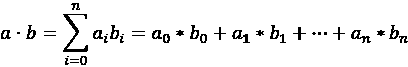

这是一个相当简单的程序，计算量不是很大，但仍然是通过 `numpy` 执行时快得多的事情。

点积的目标是将第二个向量（数组）的增长应用到第一个向量上。当应用于矩阵时，这可以用来移动/旋转/缩放一个点或甚至一个 *n*-维对象。简单来说，如果你有一个存储在 `numpy` 中的 3D 模型，你可以使用 `numpy.dot` 在其上运行完整的变换。这些操作的示例可以在我的 `numpy-stl` 包中找到：[`pypi.org/project/numpy-stl/`](https://pypi.org/project/numpy-stl/)。

在这个例子中，我们将坚持两个一维数组的标准点积。

为了轻松计时结果，我们将从 IPython shell 中执行此操作：

```py
In [1]: import numpy

In [2]: a = list(range(1000000))
In [3]: b = numpy.array(a)

In [4]: def dot(xs, ys):
   ...:     total = 0
   ...:     for x, y in zip(xs, ys):
   ...:         total += x * y
   ...:     return total
   ...:

In [5]: %timeit dot(a, a)
78.7 ms ± 1.03 ms per loop (mean ± std. dev. of 7 runs, 10 loops each)
In [6]: %timeit numpy.dot(b, b)
518 µs ± 27.6 µs per loop (mean ± std. dev. of 7 runs, 1000 loops each) 
```

在这个基本示例中，我们可以看到纯 Python 版本需要 78.7 毫秒，而 `numpy` 版本需要 518 微秒。这意味着 `numpy` 版本快了 150 倍。根据你试图做什么以及数组的大小，优势可能会更大。

创建数组有多种选项可用，但根据我的经验，以下是最有用的：

+   `numpy.array(source_array)` 从不同的数组（如前一个示例所示）创建一个数组。

+   `numpy.arange(n)` 创建一个给定范围的数组。实际上等同于 `numpy.array(range(n))`。

+   `numpy.zeros(n)` 创建一个大小为 `n` 的数组，填充为零。它还支持元组来创建矩阵：`numpy.zeros((x, y, z))`。

+   `numpy.fromfunction(function, (x, y, z))` 使用给定的函数创建具有给定形状的数组。需要注意的是，此函数将传递当前项的索引/索引，所以在这个例子中是 `x`、`y` 和 `z` 索引。

`numpy` 库有许多更多有用的函数，但至少它提供了一个几乎无与伦比的性能和非常易于使用的接口。

## Numba – 在 CPU 或 GPU 上更快的 Python

我们已经在 *第十二章* 中介绍了 `numba` 的基础知识，*性能 – 跟踪和减少您的内存和 CPU 使用量*。结合 `numpy`，`numba` 变得更加强大，因为它原生支持广播到 `numpy` 数组的函数（`numpy` 将这些称为 `ufuncs` 或 **通用函数**），类似于内置的 `numpy` 函数的工作方式。普通 `numba` 函数和支持 `numpy` 每元素处理的函数之间的重要区别在于您使用的装饰器函数。通常您会使用 `numba.jit()`；对于 `numpy` 每元素处理，您需要使用带有输入和输出类型参数的 `numba.vectorize(...)` 装饰器：

```py
>>> import numpy
>>> import numba

>>> numbers = numpy.arange(500, dtype=numpy.int64)

>>> @numba.vectorize([numba.int64(numba.int64)])
... def add_one(x):
...     return x + 1

>>> numbers
array([  0,   1,   2, ..., 498, 499])

>>> add_one(numbers)
array([  1,   2,   3, ..., 499, 500]) 
```

加 1 当然是一个无用的例子，但你可以在这里做任何你想做的事情，这使得它非常有用。真正的要点是它有多容易；只要你的函数是纯函数式的（换句话说，不修改外部变量），就可以通过非常少的努力使其非常快。这也是为什么本章中其他几个库在性能上严重依赖 `numba` 的原因。

正如我们指定的 `numba.vectorize([numba.int64(numba.int64)])`，我们的函数将只接受 64 位整数并返回 64 位整数。要创建一个接受两个 32 位或 64 位浮点数并返回 64 位整数的函数，我们可以使用以下代码：

```py
@numba.vectorize([
    numba.int64(numba.float32, numba.float32), 
    numba.int64(numba.float64, numba.float64),
]) 
```

除了 `numba.vectorize()` 装饰器之外，我们还有其他一些选项可用，例如用于 JIT 编译整个类的 `numba.jitclass()` 装饰器，或者用于增强整个模块的 `numba.jit_module()` 函数。

## SciPy – 数学算法和 NumPy 工具

`scipy`（科学 Python）包包含针对许多不同问题的数学算法集合。函数范围从信号处理到空间算法到统计函数。

这里列出了 `scipy` 库中当前可用的某些子包（根据 `scipy` 手册）：

+   `cluster`：如 *k*-means 的聚类算法

+   `fftpack`：快速傅里叶变换例程

+   `integrate`：积分和常微分方程求解器

+   `interpolate`：插值和样条平滑函数

+   `linalg`：线性代数函数，如线性方程求解

+   `ndimage`：*N*-维图像处理

+   `odr`：正交距离回归

+   `optimize`：优化和根查找例程

+   `signal`：信号处理函数，如峰值查找和频谱分析

+   `sparse`：稀疏矩阵及其相关的内存节省例程

+   `spatial`：用于三角剖分和绘图的空間数据结构和算法

+   `stats`：统计分布和函数

如您所见，`scipy` 提供了广泛主题的算法，其中许多函数都非常快，因此绝对值得一看。

对于这些大多数主题，你可以通过它们的名称猜测它们是否适用于你的用例，但也有一些需要一个小例子来证明。所以，让我们看看一个例子。

### 稀疏矩阵

`scipy`（至少在我看来）最有用的功能之一是`scipy.sparse`模块。这个模块允许你创建稀疏数组，这可以为你节省大量的内存。而`numpy`数组大约占用你预留的内存量，而稀疏数组只存储非零值或非零块/行/列，具体取决于你选择的数据类型。在`numpy`的情况下，存储一百万个 64 位整数需要 6400 万个比特或 8MB。

自然地，稀疏数组的好处伴随着一些缺点，比如某些操作或方向的处理速度较慢。例如，`scipy.sparse.csc_matrix`方法可以产生在列方向上切片非常快的稀疏矩阵，但在行方向上切片时则较慢。同时，`scipy.sparse.csr_matrix`则相反。

稀疏数组的使用大致与`numpy`数组一样简单，但在选择特定的稀疏矩阵类型时需要小心。选项包括：

+   `bsr_matrix(arg1[, shape, dtype, copy, blocksize])`: 块稀疏行矩阵

+   `coo_matrix(arg1[, shape, dtype, copy])`: 基于坐标格式的稀疏矩阵。

+   `csc_matrix(arg1[, shape, dtype, copy])`: 压缩稀疏列矩阵

+   `csr_matrix(arg1[, shape, dtype, copy])`: 压缩稀疏行矩阵

+   `dia_matrix(arg1[, shape, dtype, copy])`: 基于对角存储的稀疏矩阵

+   `dok_matrix(arg1[, shape, dtype, copy])`: 基于键的字典稀疏矩阵。

+   `lil_matrix(arg1[, shape, dtype, copy])`: 基于行的列表-列表稀疏矩阵

如果你只需要类似一个大单位矩阵的东西，这可以非常有用。它很容易构建，并且占用非常少的内存。以下两个矩阵在内容上是相同的：

```py
>>> import numpy
>>> from scipy import sparse

>>> x = numpy.identity(10000)
>>> y = sparse.identity(10000)

>>> x.data.nbytes
800000000

# Summing the memory usage of scipy.sparse objects requires the summing
# of all internal arrays. We can test for these arrays using the
# nbytes attribute.
>>> arrays = [a for a in vars(y).values() if hasattr(a, 'nbytes')]

# Sum the bytes from all arrays
>>> sum(a.nbytes for a in arrays)
80004 
```

如你所见，非稀疏版本的单位矩阵（`x`）占用的内存是前者的 10000 倍。在这种情况下，它是 800MB 对 80KB，但如果你有一个更大的矩阵，这很快就会变得不可能。由于矩阵的大小是二次增长的（`n²`；上面的矩阵大小为 10,000x10,000=100,000,000），这可以造成非常显著的区别。稀疏矩阵（至少在这个例子中）是线性增长的（`n`）。

对于较小的非稀疏数组（多达十亿个数字），内存使用仍然可行，对于十亿个 64 位数字，大约需要 8GB 的内存，但当你超过这个范围时，大多数系统会很快耗尽内存。正如通常情况那样，这些内存节省是以增加许多操作的 CPU 时间为代价的，所以我不会建议将所有的`numpy`数组替换为稀疏数组。

总之，`scipy` 是一个多功能且非常有用的模块，支持广泛的计算和算法。如果 `scipy` 有适合您目标的算法，那么它很可能是您在 Python 生态系统中能找到的最快的选项之一。然而，许多函数非常特定于领域，因此您可能可以猜出哪些（以及哪些不是）对您有用。

## Pandas – 现实世界数据分析

虽然 `numpy`、`scipy` 和 `sympy` 的重点是数学，但 Pandas 更专注于现实世界的数据分析。使用 Pandas，通常期望您从外部源（如数据库或 CSV 文件）加载数据。一旦加载数据，您就可以轻松计算统计数据、可视化数据或与其他数据集合并数据。

要存储数据，Pandas 提供了两种不同的数据结构。`pandas.Series` 是一个一维数组，而 `pandas.DataFrame` 是一个二维矩阵，如果需要，列可以标记。内部这些对象封装了一个 `numpy.ndarray`，因此在这些对象上仍然可以进行所有 `numpy` 操作。

为什么我们需要在 `numpy` 之上使用 Pandas？这全部归结于便利性，Pandas 在 `numpy` 的基础上提供了几个对进行现实世界数据分析有益的特性：

+   它可以优雅地处理缺失数据。在 `numpy` 浮点数中，您可以存储 `NaN`（不是一个数字），但并非所有 `numpy` 方法都能很好地处理它，除非进行自定义过滤。

+   与固定大小的 `numpy.ndarray` 相比，可以根据需要向 `numpy.DataFrame` 中添加和删除列。

+   它提供了捆绑的数据管理函数，可以轻松地对数据进行分组、聚合或转换。虽然您可以轻松修改 `numpy` 数据，但默认情况下，从 `numpy` 中分组数据要困难得多。

+   它还提供了用于包含时间序列数据的实用函数，允许您轻松应用移动窗口统计并轻松比较新旧数据。

让我们创建一个简单的示例，该示例存储了主要 Python 版本的发布日期及其版本。数据来源于维基百科，它有一个很好的表格，我们可以快速使用并复制：[`en.wikipedia.org/wiki/History_of_Python#Table_of_versions`](https://en.wikipedia.org/wiki/History_of_Python#Table_of_versions)。

为了简洁起见，我们在这里展示了代码的简短版本，但您可以从维基百科复制/粘贴完整的表格，或者查看此书的 GitHub 项目。

首先，让我们将数据读入一个数据框中：

```py
# A commonly used shorthand for pandas is pd
>>> import re
>>> import io

>>> import pandas as pd

>>> data = '''
... Version\tLatest micro version\tRelease date\tEnd of full support\tEnd ...
... 0.9\t0.9.9[2]\t1991-02-20[2]\t1993-07-29[a][2]
... ...
... 3.9\t3.9.5[60]\t2020-10-05[60]\t2022-05[61]\t2025-10[60][61]
... 3.10\t\t2021-10-04[62]\t2023-05[62]\t2026-10[62]
... '''.strip()

# Slightly clean up data by removing references
>>> data = re.sub(r'\[.+?\]', '', data)

# df is often used as a shorthand for pandas.DataFrame
>>> df = pd.read_table(io.StringIO(data)) 
```

在这种情况下，整个表都存储在 `data` 中，作为一个制表符分隔的字符串。由于这包括维基百科使用的引用，我们使用正则表达式清理所有看起来像 `[...]` 的内容。最后，我们使用 `pandas.read_table()` 将数据读入一个 `pandas.DataFrame` 对象。`read_table()` 函数支持文件名或文件句柄，由于我们拥有字符串形式的数据，我们使用 `io.StringIO()` 将字符串转换为文件句柄。

现在我们有了数据，让我们看看我们能用它做什么：

```py
# List the columns
>>> df.columns
Index(['Version', ..., 'Release date', ...], dtype='object')
# List the versions:
>>> df['Version']
0     0.9
...
25    3.9
26    3.1
Name: Version, dtype: float64

# Oops... where did Python 3.10 go in the output above? The
# conversion to float trimmed the 0 so we need to disable that.
>>> df = pd.read_table(io.StringIO(data), dtype=dict(Version=str))

# Much better, we didn't lose the version info this time
>>> df['Version']
0      0.9
...
25     3.9
26     3.10
Name: Version, dtype: object 
```

现在我们已经知道了如何从表中读取数据，让我们看看我们如何能更有效地使用它。这次我们将将其转换为时间序列，这样我们就可以基于日期/时间进行分析了：

```py
# The release date is read as a string by default, so we convert
# it to a datetime:
>>> df['Release date'] = pd.to_datetime(df['Release date'])

>>> df['Release date']
0      1991-02-20
...
26     2021-10-04
Name: Release date, dtype: datetime64[ns]

# Let's see which month is the most popular for Python releases.
# First we run groupby() on the release month and after that we
# run a count() on the version:
>>> df.groupby([df['Release date'].dt.month])['Version'].count()
Release date
1     2
2     2
3     1
4     2
6     3
7     1
9     4
10    8
11    1
12    3
Name: Version, dtype: int64 
```

虽然你可以用普通的`numpy`做所有这些，但使用`pandas`肯定要方便得多。

### 输入和输出选项

Pandas 的一个巨大优势是它提供了大量的现成输入和输出选项。让我们首先说，这个列表永远不会完整，因为你可以轻松实现自己的方法，或者安装一个库来为你处理其他类型。我们将在本章后面介绍`xarray`时看到这个例子。

在撰写本文时，`pandas`库原生支持大量的输入和/或输出格式：

+   常见的格式，如 Pickle、CSV、JSON、HTML 和 XML

+   如 Excel 文件之类的电子表格

+   其他统计系统使用的数据格式，如 HDF5、Feather、Parquet、ORC、SAS、SPSS 和 Stata

+   许多使用 SQLAlchemy 的数据库类型

如果你的首选格式不在列表中，你很可能可以轻松找到它的转换器。或者，自己编写一个转换器也很容易，因为你可以用纯 Python 实现它们。

### 交叉表和分组

Pandas 的一个非常有用的功能是能够**交叉表**和**逆交叉表**DataFrame。在交叉表操作时，我们可以根据它们的值将行转换为列，从而有效地对它们进行分组。`pandas`库有几个选项来交叉表/逆交叉表你的数据：

+   `pivot`: 返回一个没有聚合（例如求和/计数等）支持的重新塑形的交叉表

+   `pivot_table`: 返回一个具有聚合支持的交叉表

+   `melt`: 反转`pivot`操作

+   `wide_to_long`: `melt`的一个更简单的版本，使用起来可能更方便

通过交叉表操作我们能实现什么？让我们创建一个包含一些温度测量的长列表的非常简单的例子，并将它们交叉表操作，这样我们就能将日期作为列而不是行：

```py
>>> import pandas as pd
>>> import numpy as np

>>> df = pd.DataFrame(dict(
...     building=['x', 'x', 'y', 'x', 'x', 'y', 'z', 'z', 'z'],
...     rooms=['a', 'a', 'a', 'b', 'b', 'b', 'c', 'c', 'c'],
...     hours=[10, 11, 12, 10, 11, 12, 10, 11, 12],
...     
...     temperatures=np.arange(0.0, 9.0),
... ))

>>> df
  building rooms  hours  temperatures
0        x     a     10           0.0
1        x     a     11           1.0
...
7        z     c     11           7.0
8        z     c     12           8.0 
```

这种数据设置的方式类似于数据记录工具通常会返回的方式，每行代表一个单独的测量值。然而，这通常不是读取或分析数据最方便的方式，这正是交叉表能真正帮助的地方。

让我们看看每小时的平均室温：

```py
>>> pd.pivot_table(
...     df, values='temperatures', index=['rooms'],
...     columns=['hours'], aggfunc=np.mean)
hours   10   11   12
rooms
a      0.0  1.0  2.0
b      3.0  4.0  5.0
c      6.0  7.0  8.0 
```

这显示了每个房间的行和每个小时的列，通过`numpy.mean()`生成的值。

我们还可以得到每栋楼、每个房间每小时的平均室温：

```py
>>> pd.pivot_table(
...     df, values='temperatures', index=['building', 'rooms'],
...     columns=['hours'], aggfunc=np.mean)
hours            10   11   12
building rooms
x        a      0.0  1.0  NaN
         b      3.0  4.0  NaN
y        a      NaN  NaN  2.0
         b      NaN  NaN  5.0
z        c      6.0  7.0  8.0 
```

如您所见，`pandas`通过显示缺失数据的`NaN`来处理缺失值，并给出了一个非常好的聚合结果。

除了这些旋转功能之外，Pandas 提供了一大串分组函数，这些函数也允许你聚合结果。与旋转相比，分组功能的一个大优点是你可以对任意范围和函数进行分组。例如，对于基于时间的结果，你可以选择按秒、分钟、小时、5 分钟或任何对你有用的其他间隔进行分组。

作为上面的基本示例：

```py
>>> df.groupby(pd.Grouper(key='hours')).mean()
       temperatures
hours
10              3.0
11              4.0
12              5.0 
```

这个例子已经展示了如何使用`groupby`功能，但真正的力量在于将其与时间戳结合使用。例如，你可以使用`pd.Grouper(freq='5min')`。

### 合并

Pandas 的另一个极其有用的功能是，你可以合并数据，类似于在数据库中连接表。与旋转类似，`pandas`库有几种连接方法：

+   `pandas.merge`：`merge`函数基本上是数据库连接的直接等价。它可以执行内连接、外连接、左连接、右连接和交叉连接，类似于许多数据库。此外，它还可以验证列之间的关系是否正确（即一对一、一对多、多对一和多对多），类似于数据库中的引用完整性功能。

+   `pandas.merge_ordered`：类似于`merge`，但允许使用函数进行可选的填充/插值。

+   `pandas.merge_asof`：此函数在最近的关键值上执行左连接，而不是要求精确匹配。

容易合并多个`DataFrame`对象的能力是一个非常强大的功能，在处理现实世界数据时非常有价值。

### 滚动或扩展窗口

在 Pandas 中，窗口可以帮助你高效地对（扩展的）数据的滚动子集进行计算。当然，直接计算是可能的，但对于大型数据集来说可能非常低效和不可行。使用**滚动窗口**，你可以以高效的方式在固定窗口大小上获得移动平均、总和或其他函数。

为了说明，让我们假设你有一个包含 100 个项目的数组，并且你想使用窗口大小为 10 来获取平均值。直观的解决方案是先对前 10 个项目求和，然后除以 10，然后对 1 到 11 的项目重复此操作，依此类推。

对于这些，你将不得不遍历窗口中的所有 10 个项目。如果我们取`n`为数组的长度，`w`为窗口的大小，这将需要`O(n*w)`的时间。然而，如果我们跟踪中间的总和，我们可以做得更好；如果我们简单地添加下一个数字，并同时从我们的运行总和中去掉第一个数字，我们可以在`O(n)`内完成同样的工作。

让我们通过一个例子来说明`pandas`是如何为我们处理这些的：

```py
>>> import pandas as pd
>>> import numpy as np

>>> pd_series = pd.Series(np.arange(100))  # [0, 1, 2, ... 99]

>>> # Create a rolling window with size 10
>>> window = pd_series.rolling(10)
>>> # Calculate the running mean and ignore the N/A values at the
>>> # beginning before the window is full
>>> window.mean().dropna()
9      4.5
10     5.5
      ...
99    94.5
Length: 91, dtype: float64 
```

如上所述，滚动窗口支持计数、求和、平均值、中位数、方差、标准差、分位数等函数。如果你需要特殊的功能，你也可以提供自己的函数。

这些窗口有一些额外功能。除了使用相同的权重计算所有项目外，你还可以使用**加权窗口**来改变项目的权重，使最近的数据比旧数据更有相关性。除了常规加权窗口外，你还可以选择**指数加权窗口**来进一步增强效果。

最后，我们还有**扩展窗口**。使用这些窗口，你可以从数据集的开始到当前点获取结果。如果你要计算一个包含值 `1, 2, 3, 4, 5` 的序列的总和，它将返回 `1, 3, 6, 10, 15`，其中每个项目都是从序列开始到该点的总和中。

总结来说，`pandas` 库对于分析来自不同来源的数据极为有用。由于它是建立在 `numpy` 之上的，因此它也非常快速，这使得它非常适合深入分析。

如果你需要处理大量数据，或者来自几个不同来源的数据，不妨试试 `pandas`，看看它是否能帮助你整理数据。

## Statsmodels – 基于 Pandas 的统计模型

类似于 `scipy` 是建立在 `numpy` 之上的，我们也有 `statsmodels` 是建立在 `pandas` 之上的。最初，它是 `scipy` 包的一部分，但后来分离出来并得到了极大的改进。

`statsmodels` 库提供了一系列统计方法和绘图工具，可用于创建回归模型、选择模型、方差分析 (ANOVA)、预测等。

一个加权最小二乘回归的快速示例，它试图将一条线拟合到一组数据点，可以像这样应用：

```py
# The common shorthand for statsmodels is sm
>>> import statsmodels.api as sm
>>> import numpy as np

>>> Y = np.arange(8)
>>> X = np.ones(8)

# Create the weighted-least-squares model
>>> model = sm.WLS(Y, X)

# Fit the model and generate the regression results
>>> fit = model.fit()

# Show the estimated parameters and the t-values:
>>> fit.params
array([3.5])
>>> fit.tvalues
array([4.04145188]) 
```

虽然它仍然需要一些关于统计学的背景知识才能正确应用，但它确实展示了如何容易地使用 `statsmodels` 进行回归。

以下是 `statsmodels` 手册中支持的模型和分析类型简短列表。

回归和线性模型：

+   线性回归

+   广义线性模型

+   广义估计方程

+   广义加性模型 (GAMs)

+   鲁棒线性模型

+   线性混合效应模型

+   离散因变量的回归

+   广义线性混合效应模型

+   方差分析 (ANOVA)

时间序列分析：

+   通用时间序列分析，如单变量和向量自回归模型 (ARs/VARs)

+   状态空间方法进行的时间序列分析

+   向量自回归

其他模型：

+   生存和持续时间分析的方法

+   非参数方法

+   广义矩估计方法

+   多变量统计

实际上，支持的功能列表相当长，但这应该能给你一个很好的指示，即它是否是一个对你有用的库。如果你熟悉统计模型，你应该能够快速开始使用 `statsmodels`，并且该包有很好的文档和示例。

## xarray – 标记数组和数据集

`xarray`库与`pandas`非常相似，也是建立在`numpy`之上的。主要区别在于`xarray`是多维的，而`pandas`只支持一维和二维数据，并且它是基于**netCDF**（**网络公共数据格式**）格式创建的。netCDF 格式通常用于科学研究数据，与例如 CSV 文件不同，它们包含数据以及元数据，如变量标签、数据描述和文档，这使得在多种软件中易于使用。

`xarray`库可以轻松与`pandas`协同工作，因此在这个例子中，我们将重新使用我们之前`pandas`示例中的数据。反过来，使用`xarray.DataArray`对象上的`to_dataframe()`方法（标准的`xarray`矩阵对象）也是同样容易的。在这个例子中，我们假设您仍然有之前`pandas`示例中的`df`变量可用：

```py
# The common shorthand for xarray is xr
>>> import xarray as xr

>>> ds = xr.Dataset.from_dataframe(df)

# For reference, the pandas version of the groupby
# df.groupby([df['Release date'].dt.month])['Version'].count()
>>> ds.groupby('Release date.month').count()['Version']

<xarray.DataArray 'Version' (month: 10)>
array([2, 2, 1, 2, 3, 1, 4, 8, 1, 3])
Coordinates:
  * month    (month) int64 1 2 3 4 6 7 9 10 11 12 
```

`groupby()`的语法与`pandas`略有不同，并且由于使用字符串而不是变量，所以不太 Pythonic（如果问我），但它本质上归结为相同的操作。

在`pandas`版本中，`count()`和`['Version']`的顺序可以互换，使其更加相似。也就是说，以下也是有效的，并且返回相同的结果：

```py
df.groupby([df['Release date'].dt.month]).count()['Version'] 
```

此外，对于这个用例，我会说`xarray`的输出并不那么易于阅读，但当然也不算差。通常，您会有如此多的数据点，以至于您根本不会太关心原始数据。

与`pandas`相比，`xarray`（至少在我看来）的真正优势是支持多维数据。您可以向`Dataset`对象添加尽可能多的内容：

```py
>>> import xarray as xr
>>> import numpy as np

>>> points = np.arange(27).reshape((3, 3, 3))
>>> triangles = np.arange(27).reshape((3, 3, 3))
>>> ds = xr.Dataset(dict(
...     triangles=(['p0', 'p1', 'p2'], triangles),
... ), coords=dict(
...     points=(['x', 'y', 'z'], points),
... ))

>>> ds
<xarray.Dataset>
Dimensions:    (p0: 3, p1: 3, p2: 3, x: 3, y: 3, z: 3)
Coordinates:
    points     (x, y, z) int64 0 1 2 3 4 5 ... 21 22 23 24 25 26
Dimensions without coordinates: p0, p1, p2, x, y, z
Data variables:
    triangles  (p0, p1, p2) int64 0 1 2 3 4 ... 21 22 23 24 25 26 
```

在这种情况下，我们只添加了`triangles`和`points`，但您可以添加尽可能多的内容，并且可以使用`xarray`将这些内容组合起来，以便轻松引用多维对象。数据组合可以通过多种方法实现，例如连接、合并以将多个数据集合并为一个，基于字段值组合，通过逐行更新，以及其他方法。

当涉及到`pandas`与`xarray`的比较时，我建议简单地尝试两者，看看哪一个更适合您的使用场景。这两个库在功能和可用性上非常相似，并且各自都有其优势。如果您需要，`xarray`的多维性相对于`pandas`来说是一个巨大的优势。

如果对您来说两者都一样，那么我目前会推荐使用`pandas`而不是`xarray`，仅仅因为它目前是两者中更常用的，这导致更多的文档/博客文章/书籍可用。

## STUMPY – 在时间序列中寻找模式

`stumpy` 库提供了几个工具来自动检测时间序列矩阵中的模式和异常。它基于 `numpy`、`scipy` 和 `numba` 构建，以提供出色的性能，并为你提供了利用 GPU（显卡）处理数据以实现更快处理的可能性。

使用 `stumpy`，例如，你可以自动检测一个网站是否正在获得异常数量的访客。在这个场景中，`stumpy` 的一个很好的特性是，除了静态矩阵外，你还可以以流式的方式添加更多数据，这允许你进行实时分析而无需太多开销。

例如，让我们假设我们有一个客厅恒温器的温度列表，看看我们是否能找到任何重复的模式：

```py
>>> import numpy as np
>>> import stumpy

>>> temperatures = np.array([22., 21., 22., 21., 22., 23.])

>>> window_size = 3

# Calculate a Euclidean distance matrix between the windows
>>> stump = stumpy.stump(temperatures, window_size)

# Show the distance matrix. The row number is the index in the
# input array. The first column is the distance; the next columns
# are the indices of the nearest match, the left match, and the
# right match.
>>> stump
array([[0.0, 2, -1, 2],
      [2.449489742783178, 3, -1, 3],
      [0.0, 0, 0, -1],
      [2.449489742783178, 1, 1, -1]], dtype=object)

# As we can see in the matrix above, the first window has a
# distance of 0 to the window at index 2, meaning that they are
# identical. We can easily verify that by showing both windows:

# The first window:
>>> temperatures[0:window_size]
array([22., 21., 22.])

# The window at index 2:
>>> temperatures[2:2 + window_size]
array([22., 21., 22.]) 
```

仔细观察的你们可能已经注意到，这个距离矩阵只有 `4` 行 `6` 个值，而不是传统的 `n*n`（在这个例子中是 `6*6`）距离矩阵。部分原因是因为我们使用了 `3` 的窗口大小，我们只查看窗口的数量（即 `n-window_size+1=4`）。更大的部分原因是 `stumpy` 只存储最近的配对，从而只需要 `O(n)` 的空间，而不是正常的 `O(n*n)`。

虽然你也可以用普通的 `numpy` 进行这些类型的分析，但 `stumpy` 使用一个非常智能的算法，并且高度依赖 `numba` 以实现更快的处理，所以如果你可以使用这个库，我推荐你使用它。

# 数学与精确计算

Python 内置了许多数学函数和特性，但在某些情况下，你需要更高级的功能或更快的速度。在本节中，我们将讨论几个库，这些库通过引入许多额外的数学函数、提高数学精度和/或性能来提供帮助。

首先，让我们讨论一下 Python 核心库中存储数字和执行不同精度计算的选项：

+   `int`：在 Python 中，为了存储整数（例如 `1, 2, 3`），我们有 `int` 对象。只要它能在 64 位内适应，`int` 就会被直接转换为 C 的 `int64`。超出这个范围，它会被内部转换为 Python 的 `long` 类型（不要与 C 的 `long` 混淆），它可以任意大。这允许无限精度，但只有在使用整数时才有效。

+   `fractions.Fraction`：`Fraction` 对象使得存储分数数（例如，`1/2`、`1/3`、`2/3`）成为可能，并且由于它们内部依赖于两个 `int`（或 `long`）对象作为分子和分母，它们是无限精确的。然而，这些只有在你要存储的数字可以表示为分数时才有效。例如，π 这样的无理数不能以这种方式表示。

+   `float`: 浮点数使得存储包含小数的数字（例如 `1.23`、`4.56`）变得非常容易。这些数字通常以 64 位浮点数的形式存储，它是由一个符号（1 位正或负）、指数（11 位）和分数（52 位）的组合，导致以下方程： 。这意味着像 0.5 这样的数字使用分数 0 和指数 -1 来存储，导致：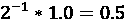 。在 0.5 的情况下，这可以完美存储；在许多其他情况下，这可能会出现问题，因为并非每个数字都可以像这样精确描述，这导致了浮点数的不精确。

+   `decimal.Decimal`: `Decimal` 对象允许进行具有任意但指定精度的计算。你可以选择你想要的位数，但它的速度并不快。

以下库中的几个提供了增强计算精度的解决方案。

## gmpy2 – 快速且精确的计算

`gmpy2` 库使用用 C 语言编写的库，以实现真正快速的高精度计算。在 Linux/Unix 系统上，它将依赖于 GMP（因此得名）；在 Windows 上，它将使用基于 GMP 的 MPIR。此外，MPFR 和 MPC 库分别用于正确地四舍五入浮点实数和复数。最后，它使用 `mpz_lucas` 和 `mpz_prp` 进行快速素性测试。

这里有一个如何将 π 计算到 1000 位的微小示例，这用 Python 核心库是难以轻易做到的：

```py
>>> import gmpy2

>>> gmpy2.const_pi(1000)
mpfr('3.14159265358979...33936072602491412736',1000) 
```

如果你需要快速且高精度的计算，这个库是无价的。

对于我的个人用例，`gmpy` 库（当时 `gmpy2` 还不存在）在参加名为 Project Euler 的有趣在线数学挑战项目时非常有帮助：[`projecteuler.net/`](https://projecteuler.net/)。

## Sage – Mathematica/Maple/MATLAB 的替代品

如果你曾在大学或学院上过高级数学课程，那么你很可能遇到过 Mathematica、Maple、MATLAB 或 Magma 等软件。或者你可能使用过基于 Mathematica 的 WolframAlpha。Sage 项目旨在作为那些真正昂贵的软件包的免费和开源替代品。

作为参考，在撰写本文时，基本 Mathematica Home 版本，只能同时运行在 4 个 CPU 核心上，售价为 413 欧元（487 美元）。

Sage 软件包可以用来求解方程，无论是数值解还是精确解，绘制图表，以及从 Sage 解释器执行许多其他任务。类似于 IPython 和 Jupyter，Sage 提供了自己的解释器，并使用自定义语言，因此感觉更接近 Mathematica 等数学软件包。当然，你也可以从常规 Python 中导入 Sage 代码。

使用 Sage 和 Sage 解释器求解变量的一个小例子：

```py
sage: x, y, z = var('x, y, z')
sage: solve([x + y == 10, x - y == 5, x + y + z == 1], x, y, z)
[[x == (15/2), y == (5/2), z == -9]] 
```

在这种情况下，我们要求 Sage 根据以下约束条件为我们解一个包含三个变量的方程：

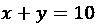

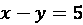

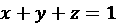

根据 Sage（正确地），结果是：

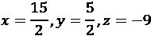

如果你正在寻找一个完整的数学软件系统（或其中的一些功能），Sage 是一个不错的选择。

## mpmath – 方便、精确的计算

`mpmath`库是一个全面的数学库，提供了三角学、微积分、矩阵以及其他许多函数，同时仍然可以配置精度。

由于`mpmath`是纯 Python 编写且没有必需的依赖项，因此安装它非常简单，但如果它们可用，它确实提供了使用 Sage 和`gmpy2`的速度提升。如果这些库不可用，这结合了 Sage 和`gmpy2`库的速度优势，以及纯 Python 安装的便利性。

让我们通过一个例子来说明在 Python 中可配置精度与常规浮点数之间的优势：

```py
>>> N = 10
>>> x = 0.1

# Regular addition
>>> a = 0.0
>>> for _ in range(N):
...     a += x  

>>> a
0.9999999999999999

# Using sum, the same result as addition
>>> sum(x for _ in range(N))
0.9999999999999999 
```

如你所见，常规加法和`sum()`都是不准确的。Python 确实有更好的方法可以用于这个问题：

```py
# Sum using Python's optimized fsum:
>>> import math

>>> math.fsum(x for _ in range(N))
1.0 
```

然而，当涉及到一般情况时，浮点数学总是不准确的，有时这可能会成为问题。所以，如果你的计算确实需要浮点数学但希望有更高的精度，`mpmath`可以帮到你：

```py
>>> import mpmath

# Increase the mpmath precision to 100 decimal places
>>> mpmath.mp.dps = 100
>>> y = mpmath.mpf('0.1')

# Using mpmath with addition:
>>> b = mpmath.mpf('0.0')
>>> for _ in range(N):
...     b += y

>>> b
mpf('1.00000000000000000000000000...00000000000000000000000014')

# Or a regular sum with mpmath:
>>> sum(y for _ in range(N))
mpf('1.00000000000000000000000000...00000000000000000000000014') 
```

虽然这些结果显然仍然不完美（你会假设结果应该是 1.0，就像`math.fsum()`产生的结果一样），但它可以帮助大大减少浮点误差。确保向`mpmath`提供字符串或整数，否则你的变量可能已经引入了浮点误差。如果我们用`x`而不是`y`来求和，它会导致与常规 Python 数学相似的浮点不精确。

自然地，`fpmath`可以做的不仅仅是减少你的浮点误差，比如绘图和微积分，但我将留给你去探索。如果你在寻找数学问题的解决方案，这个库应该在你的列表上。

## SymPy – 符号数学

`sympy`模块是一个你可能永远都不需要用到的库，但它是一个如此出色的库，应该被介绍。`sympy`的目标是成为一个功能齐全的**计算机代数系统**（CAS），这样你就可以像在纸上那样操作数学表达式。

让我们从一个小演示开始，看看我们如何使用`sympy`表达和求解一个积分：

```py
>>> from sympy import *

>>> init_printing(use_unicode=True)
>>> x, y, z = symbols('x y z')

>>> integral = Integral(x * cos(x), x)
>>> integral
⌠
| x cos(x) dx
⌡
>>> integral.doit()
x sin(x) + cos(x) 
```

如果这让你想起了某些微积分考试，我感到很抱歉，但我认为能够做到这一点真是太神奇了。这段代码首先使用通配符导入`sympy`，因为如果所有函数都需要以`sympy`为前缀，方程将很快变得难以阅读。

之后，我们使用带有 Unicode 标志的`init_printing()`函数来告诉`sympy`我们的 shell 支持 Unicode 字符。这允许渲染许多数学公式，但当然不是所有公式。这个替代方案是基本的 ASCII 渲染（正如你可以想象的那样，对于一个积分来说，这看起来并不太美观），以及 LaTeX 输出，它可以渲染为图像（例如，当使用 Jupyter 时）。实际上，还有其他几种渲染模式可用，但它们很大程度上取决于你的环境，所以我们不会深入探讨这些。

由于你可以在方程中使用任何变量名，我们需要特别声明`x`、`y`和`z`为变量。尽管在这个例子中我们只使用了`x`，但你通常还需要其他变量，所以为什么不提前声明它们呢？

现在我们使用`Integral`函数来声明积分。由于字体限制，上面的例子并不完美，但在你的 shell 或浏览器中渲染的积分应该看起来像这样：

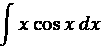

最后，我们告诉`sympy`使用`doit()`方法来解决积分。这正确地得到了以下方程：

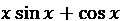

我在这里的唯一小问题是`sympy`默认省略了积分常数。理想情况下，它应该包括`+ C`。

如果你正在寻找表示（并解决）方程的方法，`sympy`当然可以帮到你。我个人认为这是一个非常棒的库，尽管我很少使用它。

## Patsy – 描述统计模型

与`sympy`可以在 Python 中描述数学公式类似，`patsy`可以描述统计模型，这使得它与`statsmodels`包相辅相成。它还可以使用常规 Python 函数或直接应用`numpy`：

```py
>>> import patsy
>>> import numpy as np

>>> array = np.arange(2, 6)

>>> data = dict(a=array, b=array, c=array)
>>> patsy.dmatrix('a + np.square(b) + np.power(c, 3)', data)
DesignMatrix with shape (4, 4)
  Intercept  a  np.square(b)  np.power(c, 3)
          1  2             4               8
          1  3             9              27
          1  4            16              64
          1  5            25             125
  Terms:
    'Intercept' (column 0)
    'a' (column 1)
    'np.square(b)' (column 2)
    'np.power(c, 3)' (column 3) 
```

在这个例子中，我们创建了一个从 2 到 6 范围的`numpy`数组，并以`a`、`b`和`c`的名称传递给`patsy.dmatrix()`函数，因为重复的名称将被忽略。之后，我们使用`patsy`创建了矩阵；正如你所看到的，`patsy`语言中的`+`告诉它添加一个新列。这些列可以是普通的列，如`a`，也可以调用函数，如`np.square(b)`。

如果你熟悉向量和矩阵背后的数学，这个库可能对你来说非常自然。至少，它是一个稍微明显一些的方式来声明你的数据是如何交互的。

# 绘图、图形和图表

当然，能够读取、处理和写入数据很重要，但为了理解数据的意义，通常更方便的是创建一个图表、图形或图表。正如古老的谚语所说：“一图胜千言。”

如果你在这章前面提到的任何库中有所经验，你可能知道它们中的许多都提供了图形输出的选项。然而，在（几乎）所有情况下，这并不是一个真正的内置功能，而是一个方便的快捷方式，指向外部库，例如`matplotlib`。

与本章中提到的几个库类似，存在多个具有相似功能和可能性的库，因此这当然不是一个详尽的列表。为了使可视化绘图更容易，对于这些示例，我们将主要依靠`jupyter-notebook`，并使用`ipywidgets`来创建交互式示例。一如既往，代码（在这些情况下，是`jupyter-notebooks`）可以在 GitHub 上找到，网址为[`github.com/mastering-python/code_2`](https://github.com/mastering-python/code_2)。

## Matplotlib

`matplotlib`库是可靠的绘图标准，并得到本章中许多科学库的支持。

本章前面提到的大多数库要么解释了如何使用`matplotlib`与库结合，要么甚至有实用函数来简化使用`matplotlib`的绘图。

这是否意味着`matplotlib`库是绘图的金标准？像往常一样，这取决于。虽然`matplotlib`无疑是使用最广泛的科学绘图 Python 库，具有大量功能，但它并不总是最美观的选项。这并不意味着你不能配置它使其变得美观，但出厂时，库专注于易于阅读、一致的结果，适用于所有人所有场景。一些更美观的库可能在网页上看起来很棒，并且具有非常实用的交互功能，但并不适合出版和打印。

基本示例非常简单：

```py
# The common shorthand for pyplot is plt
import matplotlib.pyplot as plt
import numpy as np

# Enable in-line rendering for the Jupyter notebook
%matplotlib inline

a = np.arange(100) ** 2
plt.plot(a) 
```

实际上，我们只需要`plt.plot()`来绘制基本图表：

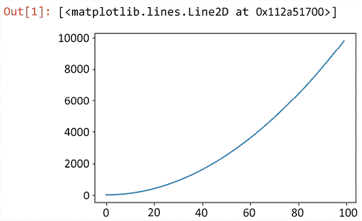

图 15.1：Matplotlib 图表

这个简单的示例非常容易绘制，但`matplotlib`可以做更多的事情。让我们看看我们如何结合几个图表，并使用`ipywidgets`使绘图交互式：

```py
%matplotlib notebook

import matplotlib.pyplot as plt
import numpy as np
import ipywidgets as widgets

# Using interact, we create 2 sliders here for size and step.
# In this case we have size which goes from 1 to 25 with increments
# of 1, and step, which goes from 0.1 to 1 with increments of 0.1
@widgets.interact(size=(1, 25, 1), step=(0.1, 1, 0.1))
def plot(size, step):
    # Create a matplotlib figure
    # We will render everything onto this figure
    fig = plt.figure()

    # Add a subplot. You could add multiple subplots but only one will 
    # be shown when using '%matplotlib notebook'
    ax = fig.add_subplot(projection='3d')

    # We want X and Y to be the same, so generate a single range
    XY = np.arange(-size, size, step)

    # Convert the vectors into a matrix
    X, Y = np.meshgrid(XY, XY)

    R = np.sqrt(X**2 + Y**2)

    # Plot using sine
    Z = np.sin(R)
    ax.plot_surface(X, Y, Z)

    # Plot using cosine with a Z-offset of 10 to plot above each other
    Z = np.cos(R)
    ax.plot_surface(X, Y, Z + 10) 
```

此函数生成以下图表：

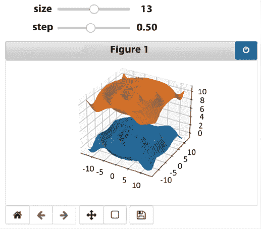

图 15.2：Jupyter Notebook 中的 Matplotlib，带有可调节的滑块

结合`jupyter-notebook`和`matplotlib`，我们可以创建交互式图表。如果你在自己的浏览器中运行它，不仅你可以拖动 3D 图表并在各个方向上查看它，你还可以通过拖动滑块来修改`size`和`step`参数。

关于`matplotlib`支持的绘图类型，选项和变体实在太多，无法在此列出，但如果你在寻找任何类型的图表、图形或绘图，你很可能会在`matplotlib`中找到解决方案。此外，许多科学 Python 库原生支持它，这使得它成为一个容易的选择。这个简短的章节确实没有公正地体现`matplotlib`的深度和功能，但不用担心——我们离完成它还远着呢，因为它是本章中几个其他绘图库的基础。

### Seaborn

`seaborn` 库与 `matplotlib` 的关系类似于 `statsmodels` 在 `pandas` 之上的工作方式。它提供了一个针对统计数据的 `matplotlib` 接口。`seaborn` 的主要特点是它使得自动生成整个网格图变得非常容易。

此外，这对于我们的示例来说非常方便，`seaborn` 随带一些测试数据，因此我们可以基于真实数据展示完整的演示。为了说明，让我们看看我们如何轻松地创建一组非常复杂的图表：

```py
%matplotlib notebook

import seaborn as sns

sns.pairplot(
    # Load the bundled Penguin dataset
    sns.load_dataset('penguins'),
    # Show a different "color" for each species
    hue='species',
    # Specify the markers (matplotlib.markers)
    markers=['o', 's', 'v'],
    # Gray was chosen due to the book being printed in black and white
    palette='Greys',
    # Specify which rows and columns to show. The default is to show all
    y_vars=['body_mass_g', 'flipper_length_mm'],
    x_vars=['body_mass_g', 'flipper_length_mm', 'bill_length_mm']) 
```

这会产生以下一系列图表：

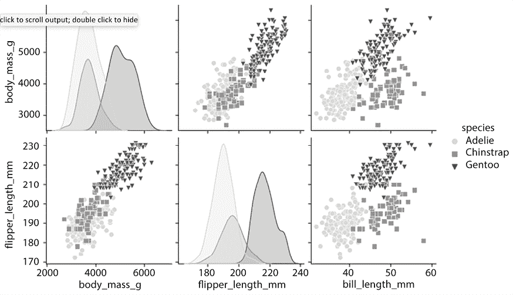

图 15.3：Seaborn 对数图渲染

虽然这看起来仍然是一个非常复杂的调用，但实际上你只需使用 `sns.pairplot(df)` 就可以得到很好的结果。如果没有 `hue=...` 参数，结果将不会按物种分割。

`seaborn` 库支持许多类型的图表：

+   关系图，如线图和散点图

+   分布图，如直方图

+   类别图，如箱线图

+   矩阵图，如热图

`seaborn` 库也有许多创建图表集或使用如核密度估计等算法自动处理数据的快捷方式。

如果你正在寻找一个看起来很棒的绘图库，`seaborn` 是一个非常好的选择，尤其是由于其多图网格功能。上面列出的图表都是特定图表，但正如我们在 `pairplot` 中看到的，`seaborn` 只需一行代码就可以生成整个网格图，这非常实用。你可以直接使用 `matplotlib` 做同样的事情，但可能需要几十行代码。

### Yellowbrick

与 `seaborn` 类似，`yellowbrick` 也是建立在 `matplotlib` 之上的。区别在于 `yellowbrick` 专注于可视化机器学习结果，并依赖于 scikit-learn (`sklearn`) 机器学习库。scikit-learn 的集成也使得这个库在这些场景中非常强大；它原生理解 scikit-learn 的数据结构，因此可以几乎无需配置就为你轻松绘制它们。在下一章中，我们将看到更多关于 scikit-learn 的内容。

这个例子直接来自 `yellowbrick` 手册，展示了你如何仅用一行代码可视化回归：

```py
%matplotlib notebook

from sklearn.ensemble import RandomForestRegressor
from sklearn.model_selection import train_test_split as tts

from yellowbrick.datasets import load_concrete
from yellowbrick.regressor import residuals_plot

# Load the dataset and split into train/test (pandas.DataFrame) splits
X, y = load_concrete()

X_train, X_test, y_train, y_test = tts(X, y, test_size=0.2, shuffle=True)

# Create the visualizer, fit, score, and show it
viz = residuals_plot(RandomForestRegressor(), X_train, y_train, X_test, y_test) 
```

这会生成以下散点图：

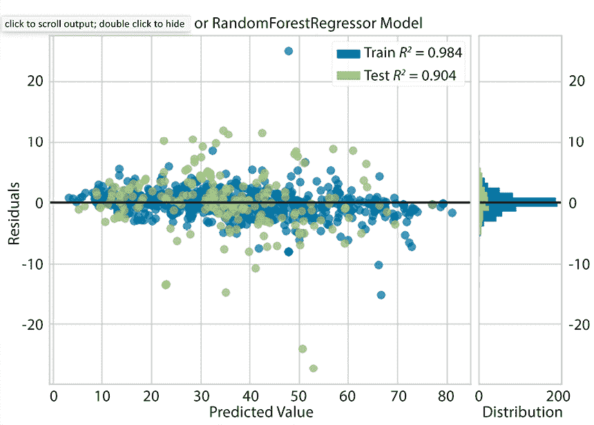

图 15.4：Yellowbrick 回归图

这类快捷函数使得生成可用的输出并专注于回归分析变得非常容易，而不必担心如何正确地绘制数据。除了绘制回归图，`yellowbrick` 还提供了许多按分析类型组织的可视化工具。与 `seaborn` 类似，`yellowbrick` 可以为你处理不仅绘图，还包括计算和分析。

`yellowbrick` 库提供了许多类型分析的功能，例如：

+   **特征可视化**：以散点图的形式显示特征，检测并排序它们，创建相关特征的圆形图等

+   **分类可视化**：以线图、面积图或矩阵图的形式显示分类的阈值、精确度和错误预测

+   **回归可视化**：显示散点图或散点图与直方图的组合

+   **聚类可视化**：显示地图以可视化聚类之间的距离

+   **模型选择可视化**：通过线条和面积或显示特征重要性的条形图来显示学习曲线

`yellowbrick`库是目前可视化 scikit-learn 输出的最方便的选择，但大多数图表选项也适用于其他数据类型，如`pandas.DataFrame`对象，所以如果`seaborn`不适合您的需求，值得一看。

## Plotly

`plotly`库支持许多不同类型的图表，甚至有对滑块等控件的原生支持，因此您可以在通过网页浏览器查看时更改参数。此外，类似于`seaborn`在某些情况下使`matplotlib`的使用更加容易，`plotly`也包括 Plotly Express（通常表示为`px`），这使得使用变得极其简单。

为了说明 Plotly Express 有多容易使用，让我们尝试复制我们用`seaborn`制作的图表：

```py
import seaborn as sns
import plotly.express as px

fig = px.scatter_matrix(
    # Load the Penguin dataset from seaborn
    sns.load_dataset('penguins'),
    # Show a different "color" for each species
    color='species',
    # Specify that the symbols/markers are species-dependent
    symbol='species',
    # Specify which rows and columns to show. The default is to show all
    dimensions=['body_mass_g', 'flipper_length_mm', 'bill_length_mm'],
)
fig.show() 
```

这是结果：

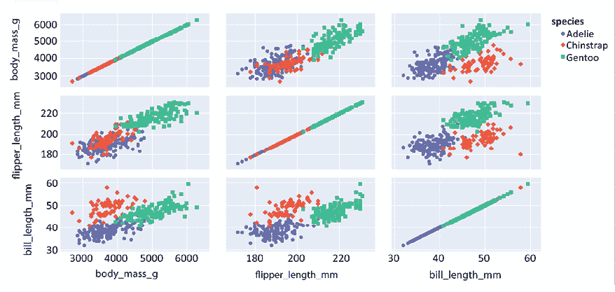

图 15.5：Plotly Express 示例输出

虽然我可能会认为在这个特定情况下`seaborn`的输出稍微更美观一些，但它确实展示了使用 Plotly Express 创建有用图表的简便性。

您可能想知道使用常规`plotly` API 有多容易或困难，与 Plotly Express 相比。为此，让我们看看我们是否可以复制 3D `matplotlib`渲染：

```py
import plotly
import numpy as np
import ipywidgets as widgets
import plotly.graph_objects as go

# Using interact, we create 2 sliders here for size and step.
# In this case we have size which goes from 1 to 25 with increments
# of 1, and step, which goes from 0.1 to 1 with increments of 0.1
@widgets.interact(size=(1, 25, 1), step=(0.1, 1, 0.1))
def plot(size, step):
    # Create a plotly figure, we will render everything onto this figure
    fig = go.Figure()

    # We want X and Y to be the same, so generate a single range
    XY = np.arange(-size, size, step)

    # Convert the vectors into a matrix
    X, Y = np.meshgrid(XY, XY)

    R = np.sqrt(X**2 + Y**2)

    # Plot using sine
    Z = np.sin(R)
    fig.add_trace(go.Surface(x=X, y=Y, z=Z))

    # Plot using cosine with a Z-offset of 10 to plot above each other
    Z = np.cos(R)
    fig.add_trace(go.Surface(x=X, y=Y, z=Z + 10))
    fig.show() 
```

这里是两个余弦函数在 3D 中绘制的最终结果：

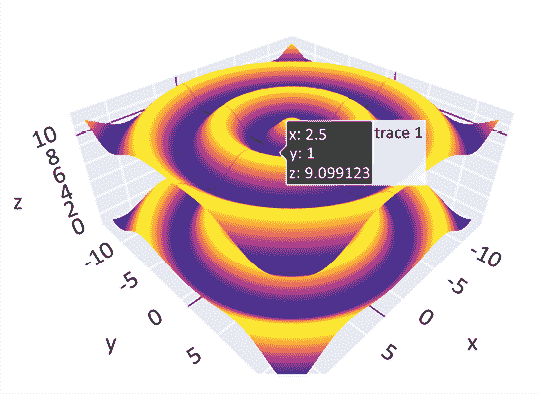

图 15.6：使用 plotly 的 3D 绘图

这基本上与`matplotlib`相同，我会说它甚至稍微好一些，因为它的交互性更强（遗憾的是，这本书无法有效地展示这一点）。默认情况下，`plotly`在您用鼠标悬停时提供了一个非常有用的值显示，并允许您进行交互式的缩放和过滤。

当涉及到在`matplotlib`和`plotly`之间进行选择时，我建议查看您的具体用例。我认为`plotly`使用起来稍微容易一些，也更方便，但`matplotlib`与许多科学 Python 库深度集成，这使得它成为一个非常方便的选择。像往常一样，意见各不相同，所以请确保查看两者。

## Bokeh

`bokeh` 库是一个美丽且功能强大的可视化库，它专注于在网页浏览器中进行交互式可视化。能够使图表交互式可以非常有助于分析结果。与我们在 `seaborn` 中看到的不同，你不需要在网格中创建多个图表，你可以使用单个网格并交互式地过滤。然而，由于这是一本书，我们无法真正展示 `bokeh` 的全部功能。

在我们开始一些示例之前，我们需要讨论你可以使用 `bokeh` 的两种方式。实际上，这归结为**静态**与**动态**，静态版本使用所有显示数据的静态快照，而动态版本按需加载数据。

静态版本与 `matplotlib` 和大多数绘图库的工作方式相似：所有数据都包含在单个图像或单个网页上，无需加载外部资源。这对于许多情况来说效果很好，但并非所有情况都适用。

如果你有很多数据呢？这种可视化的一个很好的例子是谷歌地球。你永远不可能现实地将谷歌地球上的所有数据下载到你的电脑上（据估计，目前超过 100 个拍字节的数据），所以你需要在你移动地图时加载它。为此，`bokeh` 内置了一个服务器，以便在过滤时动态加载结果。对于这本书来说，这几乎没有意义，因为它在所有情况下都是静态的，但我们可以展示两个例子。

首先，让我们创建一个非常基础的图表：

```py
import numpy as np

from bokeh.plotting import figure, show
from bokeh.io import output_notebook

# Load all javascript/css for bokeh
output_notebook()

# Create a numpy array of length 100 from 0 to 4 pi
x = np.linspace(0, 4*np.pi, 100)

# Create a bokeh figure to draw on
p = figure()
# Draw both a sine and a cosine
p.line(x, np.sin(x), legend_label='sin(x)', line_dash='dotted')
p.line(x, np.cos(x), legend_label='cos(x)')

# Render the output
show(p) 
```

从这个例子中，我们得到了以线条形式渲染的正弦和余弦函数：

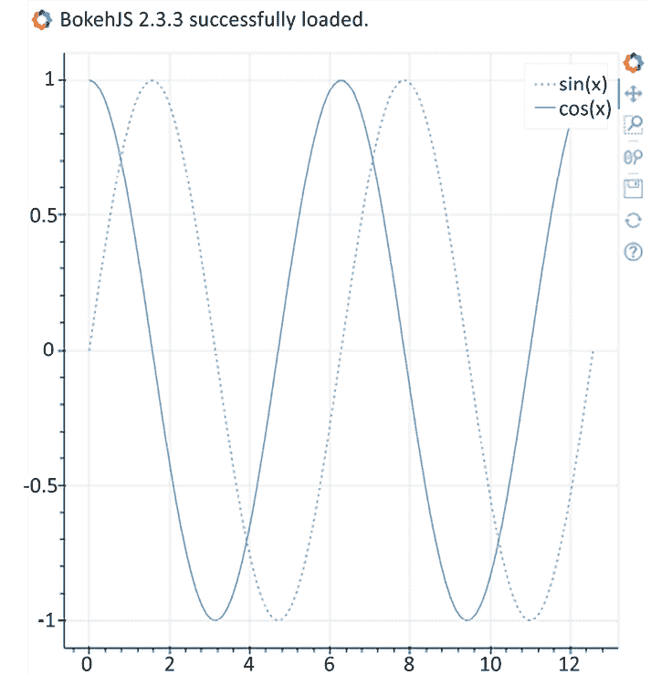

图 15.7：Bokeh 基本渲染

如您所见，将基本的 *x*/*y* 数据渲染为线条非常简单，并且看起来与 `matplotlib` 的输出没有太大区别。如果您仔细观察，您可能会注意到右侧的按钮。这些就是 `bokeh` 所称的**工具**，您可以通过滚动或绘制一个矩形来放大您希望看到的内容。通过拖动图像可以进行平移。您还可以将渲染保存为图像文件。如果需要，您还可以创建对鼠标点击或鼠标悬停做出响应的工具提示。

现在我们来看看我们是否可以重新创建一个像我们用 `seaborn` 创建的那样更高级的图表：

```py
import numpy as np
import seaborn as sns

from bokeh.plotting import figure, show
from bokeh.io import output_notebook
from bokeh.layouts import gridplot
from bokeh.transform import factor_cmap, factor_mark

output_notebook()

# Load the seaborn penguin dataset (pandas.DataFrame)
penguins = sns.load_dataset('penguins')
# Get the unique list of species for the marker and color mapping
species = penguins['species'].unique()
# Specify the marker list which will be mapped to the 3 species
markers = ['circle', 'square', 'triangle']
# Create a list of rows so we can build the grid of plots
rows = []

for y in ('body_mass_g', 'flipper_length_mm'):
    row = []
    rows.append(row)

    for x in ('body_mass_g', 'flipper_length_mm', 'bill_length_mm'):
        # Create a figure with a fixed size and pass along the labels
        p = figure(width=250, height=250,
            x_axis_label=x, y_axis_label=y)
        row.append(p)

        if x == y:
            # Calculate the histogram using numpy and make sure to drop
            # the NaN values
            hist, edges = np.histogram(penguins[x].dropna(), bins=250)
            # Draw the histograms as quadrilaterals (rectangles)
            p.quad(top=hist, bottom=0, left=edges[:-1], right=edges[1:])
        else:
            # Create a scatter-plot
            p.scatter(
                # Specify the columns of the dataframe to show on the
                # x and y axis
                x, y,
                # Specify the datasource, the pandas.DataFrame is
                # natively supported by bokeh
                source=penguins,
                # Specify the column that contains the legend data
                legend_field='species',
                # Map the species onto our list of markers
                marker=factor_mark('species', markers, species),
                # Map the species to the Greys4 color palette
                color=factor_cmap('species', 'Greys4', factors=species),
                # Add transparency to the markers to make them easier
                # to see
                fill_alpha=0.2,
            )

# Show a grid of plots. Expects a 2D array
show(gridplot(rows)) 
```

这导致了一系列散点图和直方图：

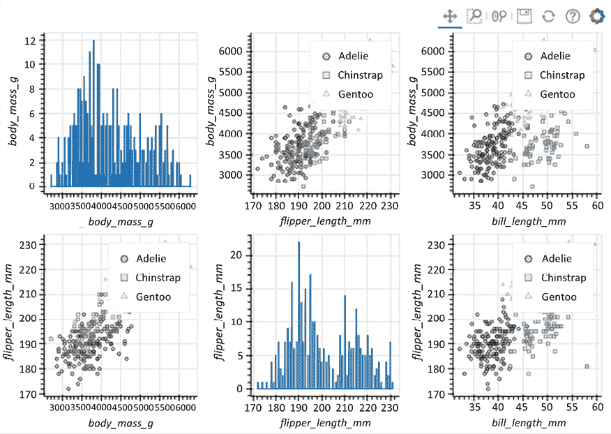

图 15.8：使用 Bokeh 创建类似 Seaborn 的图表

这在一定程度上类似于我们用 `seaborn` 创建的，但仍然需要相当多的努力。它确实展示了即使使用 `pandas.DataFrame` 作为数据源，我们也可以相当容易地将多个图表（和图表类型）组合在一起。

你应该使用`bokeh`吗？我认为`bokeh`是一个文档齐全的绘图库，有很多优点，但其他很多库也是如此。在我看来，`bokeh`的主要特点是支持通过`bokeh`服务器动态加载数据，这在某些情况下可能非常有用。与`plotly`不同，`bokeh`服务器有更多用于维护其自身状态的功能，因此可以轻松地在不重新计算的情况下进行图表更改。

## Datashader

`datashader`库是一个特殊情况，但我相信它值得提及。`datashader`绘图库可以用于常规绘图，但它特别优化了高性能和大数据集。作为一个小例子，这个包含 1000 万个数据点的图表只需大约一秒钟就可以渲染：

```py
import numpy as np, pandas as pd, datashader as ds
from datashader import transfer_functions as tf
from datashader.colors import inferno, viridis
from numba import jit
from math import sin, cos, sqrt, fabs

# Set the number of points to calculate, takes about a second with
# 10 million
n=10000000

# The Clifford attractor code, JIT-compiled using numba
@jit(nopython=True)
def Clifford(x, y, a, b, c, d, *o):
    return sin(a * y) + c * cos(a * x), \
           sin(b * x) + d * cos(b * y)

# Coordinate calculation, also JIT-compiled
@jit(nopython=True)
def trajectory_coords(fn, x0, y0, a, b=0, c=0, d=0, e=0, f=0, n=n):
    x, y = np.zeros(n), np.zeros(n)
    x[0], y[0] = x0, y0
    for i in np.arange(n-1):
        x[i+1], y[i+1] = fn(x[i], y[i], a, b, c, d, e, f)
    return x,y

def trajectory(fn, x0, y0, a, b=0, c=0, d=0, e=0, f=0, n=n):
    x, y = trajectory_coords(fn, x0, y0, a, b, c, d, e, f, n)
    return pd.DataFrame(dict(x=x,y=y))

# Calculate the pandas.DataFrame
df = trajectory(Clifford, 0, 0, -1.7, 1.5, -0.5, 0.7)

# Create a canvas and render
cvs = ds.Canvas()
agg = cvs.points(df, 'x', 'y')
tf.shade(agg, cmap=["white", "black"]) 
```

这里是计算了 1000 万个点生成的图表：

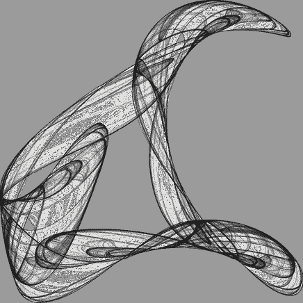

图 15.9：Datashader 吸引子渲染

# 练习

由于本章的性质，我们只涵盖了所提及库的绝对基础，它们确实值得更多。在这种情况下，作为一个练习，我建议你尝试使用一些（或全部）所提及的库，看看你是否可以用它们做一些有用的事情，使用我们已介绍的各种示例作为灵感。

一些建议：

+   创建你自己的美丽 datashader 图表

+   渲染你个人工作空间中每个项目的代码行数

+   从每个项目的代码行数继续，看看你是否可以按编程语言对项目进行聚类

这些练习的示例答案可以在 GitHub 上找到：`github.com/mastering-python/exercises`。我们鼓励你提交自己的解决方案，并从他人的替代方案中学习。

# 摘要

本章向我们展示了最常用和通用的科学 Python 库的样本。虽然它涵盖了大量的库，但还有更多可用的库，尤其是在你开始寻找特定领域库的时候。仅就绘图而言，至少还有几个其他非常大的库可能对你的用例很有用，但在这个章节中却是多余的。

回顾一下，我们已经涵盖了使用 NumPy 矩阵和 Pandas 数据对象的基础，这两者对于下一章都很重要。我们还看到了一些专注于数学和精确计算的库。最后，我们涵盖了几个绘图库，其中一些将在下一章中也会用到。

接下来是关于 Python 中人工智能和机器学习的章节。正如本章的情况一样，我们无法深入探讨，但我们可以涵盖最重要的技术和库，以便你知道该往哪里看。

# 加入我们的 Discord 社区

加入我们社区的 Discord 空间，与作者和其他读者进行讨论：[`discord.gg/QMzJenHuJf`](https://discord.gg/QMzJenHuJf)


