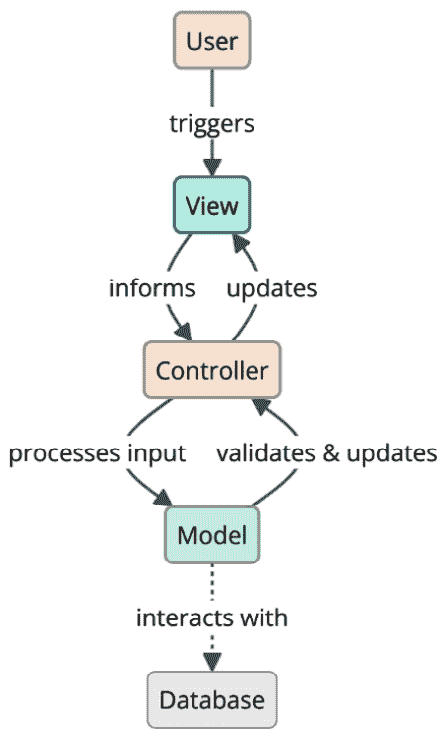
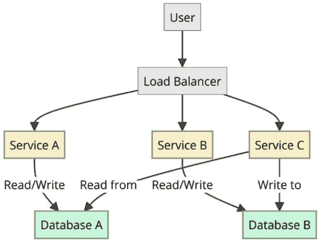
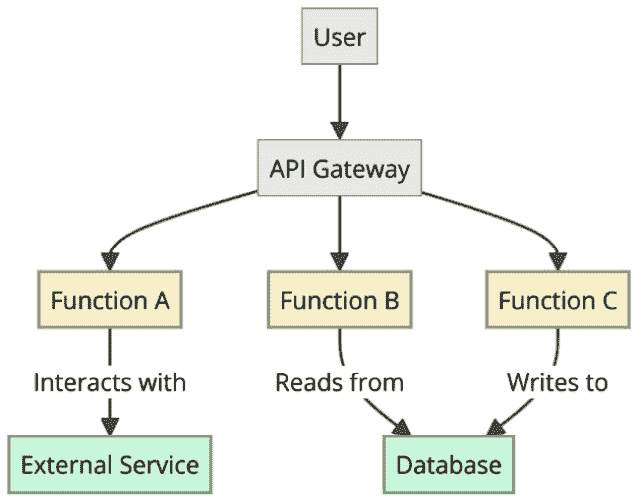

# 第六章：架构设计模式

在上一章中，我们介绍了 **行为模式**，这些模式有助于对象交互和算法。下一个设计模式类别是 **架构设计模式**。这些模式提供了解决常见架构问题的模板，促进了可扩展、可维护和可重用系统的开发。

在本章中，我们将涵盖以下主要主题：

+   **模型-视图-控制器** （**MVC**） 模式

+   **微服务** 模式

+   **无服务器** 模式

+   **事件** **溯源** 模式

+   其他架构设计模式

在本章结束时，你将了解如何使用流行的架构设计模式构建健壮且灵活的软件。

# 技术需求

请参阅 第一章 中提出的需求。本章讨论的代码的附加技术需求如下：

+   对于 *微服务模式* 部分，请安装以下内容：

    +   使用命令：`python -m pip install grpcio`

    +   `python -m pip install grpcio-tools`

    +   `python -m pip install "lanarky[openai]"==0.8.6 uvicorn==0.29.0` （注意，在撰写本文时，这可能与 Python 3.12 不兼容。在这种情况下，您可以使用 Python 3.11 来重现相关示例。）

+   对于 *无服务器模式* 部分，请安装以下内容：

    +   使用命令：`python –m pip install localstack` （注意，在撰写本文时，这可能与 Python 3.12 不兼容。您可以使用 Python 3.11 来替代。）

    +   使用命令：`python -m pip install awscli-local`

    +   使用命令：`python -m pip install awscli`

+   对于 *事件溯源* 部分，请安装以下内容：

    +   使用命令：`python –m pip install eventsourcing`

# MVC 模式

MVC 模式是 **松耦合** 原则的另一种应用。该模式的名字来源于用于分割软件应用的三个主要组件：模型、视图和控制器。

即使我们永远不需要从头开始实现它，我们也需要熟悉它，因为所有常见的框架都使用 MVC 或其略有不同的版本（关于这一点稍后还会详细介绍）。

模型是核心组件。它代表知识。它包含并管理应用的（业务）逻辑、数据、状态和规则。视图是模型的视觉表示。视图的例子包括计算机 GUI、计算机终端的文本输出、智能手机的应用 GUI、PDF 文档、饼图、柱状图等等。视图只显示数据；它不处理数据。控制器是模型和视图之间的链接/粘合剂。模型和视图之间的所有通信都通过控制器进行。

使用 MVC 的应用程序的典型用法，在初始屏幕渲染给用户后，如下所示：

1.  用户通过点击（输入、触摸等）按钮来触发视图。

1.  视图会通知控制器用户的行为。

1.  控制器处理用户输入并与模型交互。

1.  该模型执行所有必要的验证和状态更改，并通知控制器应该做什么。

1.  控制器根据模型的指示指导视图更新并适当地显示输出。



图 6.1 – MVC 模式

但是控制器部分是必要的吗？我们能不能跳过它？我们可以，但那样我们就会失去 MVC 提供的一个大优势：能够在不修改模型的情况下使用多个视图（甚至同时使用，如果我们想这样做）。为了在模型及其表示之间实现解耦，每个视图通常都需要自己的控制器。如果模型直接与特定的视图通信，我们就无法使用多个视图（或者至少不能以干净和模块化的方式使用）。

## 现实世界中的例子

MVC 是**关注点分离**原则的应用。在现实生活中，关注点分离被大量使用。例如，如果你建造一栋新房子，你通常会指派不同的专业人士来做以下工作：1）安装管道和电线；以及 2）粉刷房子。

另一个例子是餐厅。在餐厅里，服务员接收订单并为顾客上菜，但饭菜是由厨师烹制的。

在 Web 开发中，多个框架使用 MVC（模型-视图-控制器）理念，例如：

+   **Web2py 框架**是一个轻量级的 Python 框架，它采用了 MVC 模式。项目网站上有很多示例演示了如何在 Web2py 中使用 MVC（[`web2py.com/`](http://web2py.com/））以及在 GitHub 仓库中。

+   **Django**（[https://www.djangoproject.com/](https://www.djangoproject.com/））也是一个 MVC 框架，尽管它使用了不同的命名约定。控制器被称为*视图*，视图被称为*模板*。Django 使用**模型-视图-模板**（MVT）的名称。根据 Django 的设计师，视图描述了用户看到的数据，因此它使用视图作为特定 URL 的 Python 回调函数。在 Django 中，“模板”一词用于将内容与表示分离。它描述了用户看到数据的方式，而不是看到哪些数据。

## MVC 模式的使用案例

MVC 是一个非常通用且有用的设计模式。实际上，所有流行的 Web 框架（Django、Rails、Symfony 和 Yii）以及应用程序框架（iPhone SDK、Android 和 QT）都使用了 MVC 或其变体（例如**模型-视图-适配器**（MVA）、**模型-视图-表示器**（MVP）或**MVT**）。然而，即使我们不使用这些框架，由于它提供的优势，自己实现这个模式也是有意义的，这些优势如下：

+   视图和模型之间的分离使得图形设计师可以专注于**用户界面**（UI）部分，程序员可以专注于开发，而不会相互干扰。

+   由于视图和模型之间的松散耦合，每个部分都可以在不影响其他部分的情况下进行修改/扩展。例如，添加一个新的视图是微不足道的。只需为它实现一个新的控制器即可。

+   维护每个部分更容易，因为责任是清晰的。

当从头开始实现 MVC 时，确保你创建智能模型、瘦控制器和愚视图。

一个模型被认为是智能的，因为它执行以下操作：

+   它包含所有验证/业务规则/逻辑

+   它处理应用程序的状态

+   它可以访问应用程序数据（数据库、云等）

+   它不依赖于 UI

一个控制器被认为是瘦的，因为它执行以下操作：

+   当用户与视图交互时，它更新模型

+   当模型更改时，它更新视图

+   如果需要，在将数据交付给模型/视图之前处理数据

+   它不显示数据

+   它不直接访问应用程序数据

+   它不包含验证/业务规则/逻辑

一个视图被认为是愚的，因为它执行以下操作：

+   它显示数据

+   它允许用户与之交互

+   它只进行最小处理，通常由模板语言提供（例如，使用简单的变量和循环控制）

+   它不存储任何数据

+   它不直接访问应用程序数据

+   它不包含验证/业务规则/逻辑

如果你从头开始实现 MVC 并且想知道你是否做得正确，你可以尝试回答一些关键问题：

+   如果你的应用程序有一个 GUI，它是可定制的吗？你有多容易改变它的皮肤/外观和感觉？你能否在运行时给用户改变应用程序皮肤的能力？如果这并不简单，这意味着你的 MVC 实现出了问题。

+   如果你的应用程序没有 GUI（例如，如果它是一个终端应用程序），添加 GUI 支持有多难？或者，如果添加 GUI 是不相关的，添加视图以在图表（饼图、条形图等）或文档（PDF、电子表格等）中显示结果是否容易？如果这些更改不是微不足道的（只需创建一个新的控制器并将其附加到视图上，而不修改模型），则 MVC 没有正确实现。

+   如果你确保这些条件得到满足，与不使用 MVC 的应用程序相比，你的应用程序将更加灵活和易于维护。

## 实现 MVC 模式

我可以使用任何常见的框架来演示如何使用 MVC，但我感觉这样会不完整。所以，我决定向你展示如何从头开始实现 MVC，使用一个非常简单的例子：一个引言打印机。这个想法极其简单。用户输入一个数字，看到与该数字相关的引言。引言存储在`quotes`元组中。这是通常存在于数据库、文件等中的数据，并且只有模型可以直接访问它。

让我们考虑这个`quotes`元组的例子：

```py
quotes = (
    "A man is not complete until he is married. Then he is finished.",
    "As I said before, I never repeat myself.",
    "Behind a successful man is an exhausted woman.",
    "Black holes really suck...",
    "Facts are stubborn things.",
)
```

模型是最简化的；它只有一个`get_quote()`方法，该方法根据索引`n`从`quotes`元组返回引语（字符串）。模型类如下所示：

```py
class QuoteModel:
    def get_quote(self, n):
        try:
            value = quotes[n]
        except IndexError as err:
            value = "Not found!"
        return value
```

视图有三个方法：`show()`，用于在屏幕上打印引语（或`Not found!`消息）；`error()`，用于在屏幕上打印错误消息；以及`select_quote()`，用于读取用户的选项。这可以在下面的代码中看到：

```py
class QuoteTerminalView:
    def show(self, quote):
        print(f'And the quote is: "{quote}"')
    def error(self, msg):
        print(f"Error: {msg}")
    def select_quote(self):
        return input("Which quote number would you like to see? ")
```

控制器负责协调。`__init__()`方法初始化模型和视图。`run()`方法验证用户给出的引用索引，从模型中获取引语，并将其传递回视图以显示，如下面的代码所示：

```py
class QuoteTerminalController:
    def __init__(self):
        self.model = QuoteModel()
        self.view = QuoteTerminalView()
    def run(self):
        valid_input = False
        while not valid_input:
            try:
                n = self.view.select_quote()
                n = int(n)
                valid_input = True
            except ValueError as err:
                self.view.error(f"Incorrect index '{n}'")
        quote = self.model.get_quote(n)
        self.view.show(quote)
```

最后，`main()`函数初始化并启动控制器，如下面的代码所示：

```py
def main():
    controller = QuoteTerminalController()
    while True:
        controller.run()
```

下面是我们例子的总结（完整代码在`ch06/mvc.py`文件中）：

1.  我们首先定义了一个用于引语列表的变量。

1.  我们定义了模型类，`QuoteModel`。

1.  我们定义了视图类，`QuoteTerminalView`。

1.  我们定义了控制器类，`QuoteTerminalController`。

1.  最后，我们添加了`main()`函数来测试不同的类，然后是通常的技巧来调用它。

执行`python ch06/mvc.py`命令的示例显示了程序如何将引语打印给用户：

```py
Which quote number would you like to see? 3
And the quote is: "Black holes really suck..."
Which quote number would you like to see? 2
And the quote is: "Behind a successful man is an exhausted woman."
Which quote number would you like to see? 6
And the quote is: "Not found!"
Which quote number would you like to see? 4
And the quote is: "Facts are stubborn things."
Which quote number would you like to see? 3
And the quote is: "Black holes really suck..."
Which quote number would you like to see? 1
And the quote is: "As I said before, I never repeat myself."
```

# 微服务模式

传统上，从事构建服务器端应用程序的开发人员一直使用单个代码库，并在那里实现所有或大多数功能，使用常见的开发实践，如函数和类，以及我们在本书中迄今为止涵盖的设计模式。

然而，随着 IT 行业的演变、经济因素以及快速上市和投资回报的压力，我们需要不断改进工程团队的做法，并确保服务器、服务交付和运营具有更高的反应性和可扩展性。我们需要了解其他有用的模式，而不仅仅是面向对象的编程模式。



图 6.2 – 微服务模式

近年来，工程师模式目录的主要新增内容是**微服务架构**模式或**微服务**。其理念是我们可以将应用程序构建为一组松散耦合、协作的服务。在这种架构风格中，一个应用程序可能包括订单管理服务、客户管理服务等这样的服务。这些服务是松散耦合的、独立部署的，并通过定义良好的 API 进行通信。

## 现实世界中的例子

我们可以引用几个例子，如下所示：

+   **Netflix**：采用微服务处理数百万内容流的先驱之一

+   **Uber**：该公司使用微服务来处理不同的方面，如计费、通知和行程跟踪

+   **亚马逊**：他们从单体架构过渡到微服务架构，以支持其不断增长的规模

## 微服务模式的用例

我们可以想到几个用例，在这些用例中，微服务提供了巧妙的解决方案。每次我们构建一个具有以下至少一个特征的应用程序时，我们都可以使用基于微服务架构的设计：

+   需要支持不同的客户端，包括桌面和移动设备

+   存在一个 API 供第三方消费

+   我们必须使用消息传递与其他应用程序进行通信

+   我们通过访问数据库、与其他系统通信并返回正确的响应类型（JSON、XML、HTML 或甚至是 PDF）来处理请求

+   应用程序的不同功能区域对应着逻辑组件

## 实现微服务模式——使用 gRPC 的支付服务

让我们简要地谈谈在微服务世界中软件安装和应用部署。从部署单个应用程序转变为部署许多小型服务意味着需要处理的事物数量呈指数级增长。虽然你可能对单个应用程序服务器和一些运行时依赖项感到满意，但当迁移到微服务时，依赖项的数量将急剧增加。例如，一个服务可能受益于关系型数据库，而另一个则可能需要**ElasticSearch**。你可能需要一个使用**MySQL**的服务，另一个则可能使用**Redis**服务器。因此，采用微服务方法也意味着你需要使用**容器**。

多亏了 Docker，事情变得更容易，因为我们可以将这些服务作为容器运行。想法是，你的应用程序服务器、依赖项和运行时库、编译后的代码、配置等等，都包含在这些容器中。然后，你所要做的就是运行打包成容器的服务，并确保它们可以相互通信。

你可以直接使用 Django、Flask 或 FastAPI 来实现微服务模式，用于 Web 应用程序或 API。然而，为了快速展示一个工作示例，我们将使用 gRPC，这是一个高性能的通用 RPC 框架，它使用**Protocol Buffers**（**protobuf**）作为其接口描述语言，由于其效率和跨语言支持，使其成为微服务通信的理想选择。

想象一个场景，其中你的应用程序架构包括一个专门处理支付处理的微服务。这个微服务（让我们称它为`PaymentService`），负责处理支付并与`OrderService`和`AccountService`等其他服务交互。我们将专注于使用 gRPC 实现此类服务的实现。

首先，我们在`ch06/microservices/grpc/payment.proto`文件中定义服务和其方法，使用 protobuf。这包括指定请求和响应消息格式：

```py
syntax = "proto3";
package payment;
// The payment service definition.
service PaymentService {
  // Processes a payment
  rpc ProcessPayment (PaymentRequest) returns (PaymentResponse) {}
}
// The request message containing payment details.
message PaymentRequest {
  string order_id = 1;
  double amount = 2;
  string currency = 3;
  string user_id = 4;
}
// The response message containing the result of the payment process.
message PaymentResponse {
  string payment_id = 1;
  string status = 2; // e.g., "SUCCESS", "FAILED"
}
```

然后，您必须使用 protobuf 编译器（`protoc`）将`payment.proto`文件编译成 Python 代码。为此，您需要使用特定的命令行，该命令行调用`protoc`并带有适用于 Python 的适当插件和选项。

这里是用于在 Python 中使用 gRPC 编译`.proto`文件的命令行的一般形式：

```py
cd ch06/microservices/grpc), and then we run the following command:

```

payment_pb2.py 和 payment_pb2_grpc.py。这些文件不应手动编辑。

            接下来，我们在`payment_service.py`文件中提供支付处理的服务逻辑，扩展了在生成的`.py`文件中提供的内容。在该模块中，我们定义了`PaymentServiceImpl`类，继承自`payment_pb2_grpc.PaymentServiceServicer`类，并重写了`ProcessPayment()`方法，该方法将执行处理支付所需的工作（例如，调用外部 API，执行数据库更新等）。请注意，这里是一个简化的示例，但您会有更复杂的逻辑。代码如下：

```py
from concurrent.futures import ThreadPoolExecutor
import grpc
import payment_pb2
import payment_pb2_grpc
class PaymentServiceImpl(payment_pb2_grpc.PaymentServiceServicer):
    def ProcessPayment(self, request, context):
        return payment_pb2.PaymentResponse(payment_id="12345", status="SUCCESS")
```

            然后，我们有`main()`函数，其中包含启动处理服务的代码，通过调用`grpc.server(ThreadPoolExecutor(max_workers=10))`创建。函数的代码如下：

```py
def main():
    print("Payment Processing Service ready!")
    server = grpc.server(ThreadPoolExecutor(max_workers=10))
    payment_pb2_grpc.add_PaymentServiceServicer_to_server(PaymentServiceImpl(), server)
    server.add_insecure_port("[::]:50051")
    server.start()
    server.wait_for_termination()
```

            这样，服务就完成了，并准备好进行测试。我们需要一个客户端来测试它。我们可以编写一个测试客户端，使用 gRPC 调用服务的代码（在`ch06/microservices/grpc/client.py`文件中）：

```py
import grpc
import payment_pb2
import payment_pb2_grpc
with grpc.insecure_channel("localhost:50051") as chan:
    stub = payment_pb2_grpc.PaymentServiceStub(chan)
    resp = stub.ProcessPayment(
        payment_pb2.PaymentRequest(
            order_id="order123",
            amount=99.99,
            currency="USD",
            user_id="user456",
        )
    )
    print("Payment Service responded.")
    print(f"Response status: {resp.status}")
```

            要启动服务（在`ch06/microservices/grpc/payment_service.py`文件中），您可以运行以下命令：

```py
python ch06/microservices/grpc/payment_service.py
```

            您将得到以下输出，显示服务已按预期启动：

```py
ch06/microservices/grpc/client.py file):

```

python ch06/microservices/grpc/client.py

```py

			In the terminal where you have run the client code, you should get the following output:

```

支付服务响应。

响应状态：成功

```py

			This output is what is expected.
			Note that while gRPC is a powerful choice for Microservices communication, other approaches such as **REST over HTTP** can also be used, especially when human readability or web integration is a priority. However, gRPC provides advantages in terms of performance and support for streaming requests and responses, and it was interesting to introduce it with this example.
			Implementing the microservices pattern – an LLM service using Lanarky
			Lanarky is a web framework that builds upon the FastAPI framework, to provide batteries for building Microservices that use **large language** **models** (**LLMs**).
			We will follow the *Getting started* instructions from the website ([`lanarky.ajndkr.com`](https://lanarky.ajndkr.com)) to showcase a microservice backed by Lanarky. To be able to test the example, you need to set the `OPENAI_API_KEY` environment variable to use OpenAI. Visit [`openai.com`](https://openai.com) and follow the instructions to get your API key.
			The LLM service code starts by importing the modules we need:

```

导入 os

导入 uvicorn

从 lanarky 导入 Lanarky

从 lanarky.adapters.openai.resources 导入 ChatCompletionResource

从 lanarky.adapters.openai.routing 导入 OpenAIAPIRouter

```py

			Before starting the actual application code, you need to pass the OpenAI API key, which is used by Lanarky’s code via the `os.environ` object. For example, pass the value of the secret key via this line:

```

os.environ["OPENAI_API_KEY"] = "在此处输入您的 OpenAI API 密钥"

```py

			Security practice
			It is recommended that you pass secret keys to the code, by setting an environment variable in your shell.
			Then, we create an `app` object, an instance of the `Lanarky` class, and the `router` object that will be used for the definition of the service’s routes, as is conventional with FastAPI. This router is an instance of the `OpenAPIRouter` class provided by the Lanarky framework:

```

app = Lanarky()

router = OpenAIAPIRouter()

```py

			Next, we provide a `chat()` function for the `/chat` route, when there is a `POST` request, as follows:

```

@router.post("/chat")

def chat(stream: bool = True) -> ChatCompletionResource:

system = "这里是您的助手"

return ChatCompletionResource(stream=stream, system=system)

```py

			Finally, we associate the router to the FastAPI application (standard FastAPI convention) and we run the FastAPI application (our service) using `uvicorn.run()`, as follows:

```

if __name__ == "__main__":

app.include_router(router)

uvicorn.run(app)

```py

			To finalize this demonstration implementation, we can write client code to interact with the service. The code for that part is as follows:

```

导入 click

导入 sys 模块

从 lanarky.clients 导入 StreamingClient

args = sys.argv[1:]

if len(args) == 1:

message = args[0]

client = StreamingClient()

for event in client.stream_response(

"POST",

"/chat",

params={"stream": "false"},

json={"messages": [dict(role="user", content=message)]},

):

print(f"{event.event}: {event.data}")

else:

print("您需要传递一条消息！")

```py

			To test the example, similarly to the previous one (where we tested a gRPC-based microservice), open a terminal, and run the LLM service code (in the `ch06/microservices/lanarky/llm_service.py` file) using the following command:

```

python ch06/microservices/lanarky/llm_service.py

```py

			You should get an output like the following:

```

INFO：启动服务器进程[18617]

INFO：等待应用程序启动。

INFO：应用程序启动完成。

INFO：Uvicorn 正在运行于 http://127.0.0.1:8000（按 CTRL+C 退出）

```py

			Then, open a second terminal to run the client program, using the following command:

```

python ch06/microservices/lanarky/client.py "Hello"

```py

			You should get the following output:

```

completion: Hello! How can I assist you today?

```py

			Now, you can continue sending messages via the client program, and wait for the service to come back with the completion, as you would do via the ChatGPT interface.
			For example, see the following code:

```

python ch06/microservices/lanarky/client.py "瑞士的首都是什么？"

完成：瑞士的首都是伯尔尼。

```py

			The Serverless pattern
			The Serverless pattern abstracts server management, allowing developers to focus solely on code. Cloud providers handle the scaling and execution based on event triggers, such as HTTP requests, file uploads, or database modifications.
			

			Figure 6.3 – The Serverless pattern
			The Serverless pattern is particularly useful for Microservices, APIs, and event-driven architectures.
			Real-world examples
			There are several examples we can think of for the Serverless pattern. Here are some of them:

				*   **Automated data backups**: Serverless functions can be scheduled to automatically back up important data to cloud storage
				*   **Image processing**: Whenever a user uploads an image, a serverless function can automatically resize, compress, or apply filters to the image
				*   **PDF generation for E-commerce receipts**: After a purchase is made, a serverless function generates a PDF receipt and emails it to the customer

			Use cases for the Serverless pattern
			There are two types of use cases the Serverless pattern can be used for.
			First, Serverless is useful for handling event-driven architectures where specific functions need to be executed in response to events, such as doing image processing (cropping, resizing) or dynamic PDF generation.
			The second type of architecture where Serverless can be used is **Microservices**. Each microservice can be a serverless function, making it easier to manage and scale.
			Since we have already discussed the Microservices pattern in the previous section, we are going to focus on how to implement the first use case.
			Implementing the Serverless pattern
			Let’s see a simple example using AWS Lambda to create a function that squares a number. AWS Lambda is Amazon’s serverless **compute** service, which runs code in response to triggers such as changes in data, shifts in system state, or actions by users.
			There is no need to add more complexity since there’s already enough to get right with the Serverless architecture itself and AWS Lambda’s deployment details.
			First, we need to write the Python code for the function. We create a `lambda_handler()` function, which takes two parameters, `event` and `context`. In our case, the input number is accessed as a value of the “number” key in the event dictionary. We take the square of that value and we return a a string containing the expected result. The code is as follows:

```

import json

def lambda_handler(event, context):

number = event["number"]

squared = number * number

return f"{number} 的平方是 {squared}。"

```py

			Once we have the Python function, we need to deploy it so that it can be invoked as an AWS Lambda function. For our learning, instead of going through the procedure of deploying to AWS infrastructure, we can use a method that consists of testing things locally. This is what the `LocalStack` Python package allows us to do. Once it is installed, from your environment, you can start LocalStack inside a Docker container by running the available executable in your Python environment, using the command:

```

ch06/lambda_function_square.py) 打包成一个 ZIP 文件，例如，可以使用 ZIP 程序如下：

```py
awslocal tool (a Python module we need to install). Once installed, we can use this program to deploy the Lambda function into the “local stack” AWS infrastructure. This is done, in our case, using the following command:

```

awslocal lambda create-function \

--function-name lambda_function_square \

--runtime python3.11 \

--zip-file fileb://lambda.zip \

--handler lambda_function_square.lambda_handler \

--role arn:aws:iam::000000000000:role/lambda-role

```py

			Adapt to your Python version
			At the time of writing, this was tested with Python 3.11\. You must adapt this command to your Python version.
			You can test the Lambda function, providing an input using the `payload.json` file, using the command:

```

awslocal lambda invoke --function-name lambda_function_square \

output.txt 文件的内容。你应该看到以下文本：

```py
awslocal, running the following command:

```

awslocal lambda create-function-url-config \

--function-name lambda_function_square \

http://<XXXXXXXX>.lambda-url.us-east-1.localhost.localstack.cloud:4566 格式。

            现在，例如，我们可以使用 `cUrl` 触发 Lambda 函数 URL：

```py
curl -X POST \
    'http://iu4s187onr1oabg50dbvm77bk6r5sunk.lambda-url.us-east-1.localhost.localstack.cloud:4566/' \
    -H 'Content-Type: application/json' \
    -d '{"number": 6}'
```

            有关 AWS Lambda 的最新和详细指南，请参阅[`docs.aws.amazon.com/lambda/`](https://docs.aws.amazon.com/lambda/)文档。

            这是一个最小示例。另一个无服务器应用程序的例子可能是一个为业务生成 PDF 发票的功能。这将使业务无需担心服务器管理，只需为消耗的计算时间付费。

            事件溯源模式

            事件溯源模式将状态更改存储为一系列事件，允许重建过去的状态并提供审计跟踪。这种模式在状态复杂且转换的业务规则复杂的系统中特别有用。

            正如我们将在后面的实现示例中看到的那样，事件溯源模式强调捕获应用程序状态的所有更改作为一系列事件的必要性。其结果之一是，应用程序状态可以通过重新播放这些事件在任何时间点重建。

            现实世界例子

            在软件类别中存在几个现实世界的例子：

                +   **审计跟踪**：为了符合规定，记录对数据库所做的所有更改

                +   **协作编辑**：允许多个用户同时编辑一个文档

                +   **撤销/重做功能**：提供在应用程序中撤销或重做操作的能力

            事件溯源模式的使用案例

            事件溯源模式有几个使用案例。让我们考虑以下三个：

                +   **金融交易**：事件溯源可用于记录账户余额的每次更改作为一个不可变事件的时序序列。这种方法确保每次存款、取款或转账都被捕获为一个独立的事件。这样，我们可以提供一个透明、可审计和安全的财务活动账本。

                +   **库存管理**：在库存管理背景下，事件源通过记录所有更改作为事件来帮助跟踪每个项目的生命周期。这使得企业能够保持库存水平的准确和最新记录，识别项目使用或销售中的模式，并预测未来的库存需求。它还便于追溯任何项目的历史，有助于召回过程或质量保证调查。

                +   **客户行为跟踪**：事件源在捕获和存储客户与平台互动的每一个交互中扮演着关键角色，从浏览历史和购物车修改到购买和退货。这些丰富的数据，以一系列事件的形式结构化，成为分析客户行为、个性化营销策略、提升用户体验和改进产品推荐的有价值资源。

            现在，让我们看看我们如何实现这个模式。

            实现事件源模式 - 手动方式

            让我们从一些定义开始。事件源模式实现的组成部分如下：

                +   **事件**：状态变化的表示，通常包含事件类型和与该事件相关联的数据。一旦创建并应用了事件，就不能再更改。

                +   **聚合**：表示单个业务逻辑或数据单元的对象（或对象组）。它跟踪事物，每次有事物发生变化（一个事件）时，它都会记录下来。

                +   **事件存储**：所有已发生事件的集合。

            通过通过事件处理状态变化，业务逻辑变得更加灵活且易于扩展。例如，添加新类型的事件或修改现有事件的处理方式可以以最小的系统影响完成。

            在这个第一个例子中，对于银行账户用例，我们将看到如何以手动方式实现事件源模式。在这种实现中，你通常会定义你的事件类并手动编写将这些事件应用到聚合上的逻辑。让我们看看。

            我们首先定义一个`Account`类，它代表一个具有余额和附加到账户操作的事件列表的银行账户。这个类作为聚合。它的`events`属性代表事件存储。在这里，一个事件将由一个包含操作类型（“存入”或“取出”）和金额值的字典表示。

            然后我们添加了一个接受事件作为输入的`apply_event()`方法。根据`event["type"]`，我们根据事件的数量增加或减少账户余额，并将事件添加到`events`列表中，从而有效地存储事件：

```py
class Account:
    def __init__(self):
        self.balance = 0
        self.events = []
    def apply_event(self, event):
        if event["type"] == "deposited":
            self.balance += event["amount"]
        elif event["type"] == "withdrawn":
            self.balance -= event["amount"]
        self.events.append(event)
```

            然后，我们添加一个`deposit()`方法和一个`withdraw()`方法，这两个方法都调用`apply_event()`方法，如下所示：

```py
    def deposit(self, amount):
        event = {"type": "deposited", "amount": amount}
        self.apply_event(event)
    def withdraw(self, amount):
        event = {"type": "withdrawn", "amount": amount}
        self.apply_event(event)
```

            最后，我们添加了`main()`函数，如下所示：

```py
def main():
    account = Account()
    account.deposit(100)
    account.deposit(50)
    account.withdraw(30)
    account.deposit(30)
    for evt in account.events:
        print(evt)
    print(f"Balance: {account.balance}")
```

            运行代码，使用`python ch06/ event_sourcing/bankaccount.py`命令，得到以下输出：

```py
{'type': 'deposited', 'amount': 100}
{'type': 'deposited', 'amount': 50}
{'type': 'withdrawn', 'amount': 30}
{'type': 'deposited', 'amount': 30}
Balance: 150
```

            本例通过一个简单的手动实现，为我们提供了对事件源（Event Sourcing）的第一理解。对于更复杂的系统，专门为事件源设计的框架和库可以帮助管理一些复杂性，提供事件存储、查询和处理的实用工具。我们将接下来测试这样一个库。

            使用库实现事件源模式

            在这个第二个例子中，我们将使用`eventsourcing`库来实现事件源模式。让我们考虑一个库存管理系统，其中我们跟踪物品的数量。

            我们首先导入所需的模块，如下所示：

```py
from eventsourcing.domain import Aggregate, event
from eventsourcing.application import Application
```

            然后，我们通过继承`Aggregate`类来定义聚合对象的类`InventoryItem`。该类有一个`increase_quantity()`和`decrease_quantity`方法，每个方法都装饰了`@event`装饰器。这个类的代码如下所示：

```py
class InventoryItem(Aggregate):
    @event("ItemCreated")
    def __init__(self, name, quantity=0):
        self.name = name
        self.quantity = quantity
    @event("QuantityIncreased")
    def increase_quantity(self, amount):
        self.quantity += amount
    @event("QuantityDecreased")
    def decrease_quantity(self, amount):
        self.quantity -= amount
```

            接下来，我们创建我们的库存应用程序类`InventoryApp`，它继承自`eventsourcing`库的`Application`类。第一个方法处理创建一个项目，接受`InventoryItem`类的实例（`item`），并使用该项目在`InventoryApp`对象上调用`save()`方法。但`save()`方法究竟做了什么？它从给定的聚合中收集挂起的事件，并将它们放入应用的事件存储中。类的定义如下所示：

```py
class InventoryApp(Application):
    def create_item(self, name, quantity):
        item = InventoryItem(name, quantity)
        self.save(item)
        return item.id
```

            接下来，类似于我们在上一个例子中所做的，我们添加了一个`increase_item_quantity()`方法，它处理项目数量的增加（对于聚合对象），然后在该应用上保存聚合对象，随后是相应的`decrease_item_quantity()`方法，用于减少操作，如下所示：

```py
    def increase_item_quantity(self, item_id, amount):
        item = self.repository.get(item_id)
        item.increase_quantity(amount)
        self.save(item)
    def decrease_item_quantity(self, item_id, amount):
        item = self.repository.get(item_id)
        item.decrease_quantity(amount)
        self.save(item)
```

            最后，我们添加了`main()`函数，其中包含一些测试我们设计的代码，如下所示：

```py
def main():
    app = InventoryApp()
    # Create a new item
    item_id = app.create_item("Laptop", 10)
    # Increase quantity
    app.increase_item_quantity(item_id, 5)
    # Decrease quantity
    app.decrease_item_quantity(item_id, 3)
    notifs = app.notification_log.select(start=1, limit=5)
    notifs = [notif.state for notif in notifs]
    for notif in notifs:
        print(notif.decode())
```

            运行代码，使用`python ch06/event_sourcing/inventory.py`命令，得到以下输出：

```py
{"timestamp":{"_type_":"datetime_iso","_data_":"2024-03-18T08:05:10.583875+00:00"},"originator_topic":"__main__:InventoryItem","name":"Laptop","quantity":10}
{"timestamp":{"_type_":"datetime_iso","_data_":"2024-03-18T08:05:10.584818+00:00"},"amount":5}
eventsourcing library, which makes it easier to implement this type of application.
			Other architectural design patterns
			You may encounter documentation about other architectural design patterns. Here are three other patterns:

				*   **Event-Driven Architecture (EDA)**: This pattern emphasizes the production, detection, consumption of, and reaction to events. EDA is highly adaptable and scalable, making it suitable for environments where systems need to react to significant events in real time.
				*   **Command Query Responsibility Segregation (CQRS)**: This pattern separates the models for reading and writing data, allowing for more scalable and maintainable architectures, especially when there are clear distinctions between operations that mutate data and those that only read data.
				*   **Clean Architecture**: This pattern proposes a way to organize code such that it encapsulates the business logic but keeps it separate from the interfaces through which the application is exposed to users or other systems. It emphasizes the use of dependency inversion to drive the decoupling of software components.

			Summary
			In this chapter, we explored several foundational architectural design patterns that are pivotal in modern software development, each useful for different requirements and solving unique challenges.
			We first covered the MVC pattern, which promotes the separation of concerns by dividing the application into three interconnected components. This separation allows for more manageable, scalable, and testable code by isolating the UI, the data, and the logic that connects the two.
			Then, we looked at the Microservices pattern, which takes a different approach by structuring an application as a collection of small, independent services, each responsible for a specific business function. This pattern enhances scalability, flexibility, and ease of deployment, making it an ideal choice for complex, evolving applications that need to rapidly adapt to changing business requirements.
			Next, we looked at the Serverless pattern, which shifts the focus from server management to pure business logic by leveraging cloud services to execute code snippets in response to events. This pattern offers significant cost savings, scalability, and productivity benefits by abstracting the underlying infrastructure, allowing developers to concentrate on writing code that adds direct value.
			Afterward, we went over the Event Sourcing pattern, which offers another way to handle data changes in an application by storing each change as a sequence of events. This not only provides a robust audit trail and enables complex business functionalities but also allows the system to reconstruct past states, offering invaluable insights into the data life cycle and changes over time.
			Lastly, we touched upon other architectural design patterns, such as CQRS and Clean Architecture. Each offers unique advantages and addresses different aspects of software design and architecture. Even if we could not dive deep into these patterns, they complement the developer’s toolkit for building well-structured and maintainable systems.
			In the next chapter, we will discuss concurrency and asynchronous patterns and techniques to help our program manage multiple operations simultaneously or move on to other tasks while waiting for operations to complete.

```

```py

```

```py

```

```py

```

```py

```
