# 第一章。分析 101

就像任何婴儿都需要学会爬行，然后再在 12 秒内跑 100 米并克服障碍一样，程序员在尝试掌握这门艺术之前，需要理解分析的基础知识。因此，在我们深入探讨 Python 程序的性能优化和分析的奥秘之前，我们需要对基础知识有一个清晰的理解。

一旦你了解了基础知识，你将能够了解工具和技术。因此，为了开始，本章将涵盖你关于分析所需了解的一切，但你可能因为害怕而未曾提问。在本章中，我们将做以下事情：

+   我们将明确定义什么是分析，以及不同的分析技术。

+   我们将解释分析在开发周期中的重要性，因为分析不是你只做一次然后忘记的事情。分析应该是开发过程的一个组成部分，就像编写测试一样。

+   我们将涵盖我们可以分析的内容。我们将介绍我们将能够衡量的不同类型的资源以及它们如何帮助我们找到问题。

+   我们将讨论过早优化的风险，即为什么在分析之前进行优化通常是一个糟糕的想法。

+   你将了解运行时复杂度。理解分析技术是成功优化的第一步，但我们也需要了解如何衡量算法的复杂度，以便了解我们是否需要改进它。

+   我们还将探讨良好的实践。最后，我们将回顾一些在开始项目分析过程时需要记住的良好实践。

# 什么是分析？

一个未经优化的程序通常会在某些特定的子例程中花费大部分的 CPU 周期。分析是分析代码相对于其使用的资源的行为。例如，分析会告诉你一条指令使用了多少 CPU 时间，或者整个程序消耗了多少内存。这通过修改程序的源代码或二进制可执行形式（如果可能）来实现，使用的东西被称为分析器。

通常，当开发者需要优化性能或程序出现某种奇怪的错误（这通常与内存泄漏有关）时，他们会分析程序。在这种情况下，分析可以帮助他们深入了解他们的代码是如何使用计算机资源的（即某个特定函数被调用的次数）。

开发者可以使用这些信息，结合对源代码的熟练掌握，来找出程序的瓶颈和内存泄漏。然后开发者可以修复代码中的任何错误。

软件分析主要有两种方法：基于事件的性能分析和基于统计的性能分析。当使用这些类型的软件时，你应该记住它们都有优点和缺点。

## 基于事件的性能分析

并非每种编程语言都支持这种类型的分析。以下是一些支持基于事件分析的编程语言：

+   **Java**: **JVMTI**（**JVM Tools Interface**）为分析器提供了钩子，用于捕获诸如调用、线程相关事件、类加载等事件

+   **.NET**: 就像 Java 一样，运行时提供了事件（[`en.wikibooks.org/wiki/Introduction_to_Software_Engineering/Testing/Profiling#Methods_of_data_gathering`](http://en.wikibooks.org/wiki/Introduction_to_Software_Engineering/Testing/Profiling#Methods_of_data_gathering)）

+   **Python**: 使用`sys.setprofile`函数，开发者可以捕获诸如`python_call`、`python_return`或`python_exception`或`c_call`、`c_return`或`c_exception`等事件

**基于事件的跟踪分析器**（也称为**跟踪分析器**）通过在程序执行过程中收集特定事件的数据来工作。这些分析器会生成大量数据。基本上，它们监听的事件越多，收集的数据就越多。这使得它们在某种程度上不太实用，并且它们不是开始分析程序时的首选。然而，当其他分析方法不够或不够具体时，它们是一个很好的最后手段。考虑一下你想分析所有返回语句的情况。这种类型的分析器会为你提供完成任务所需的粒度，而其他分析器则根本不允许你执行此任务。

Python 中基于事件的跟踪分析器的一个简单例子可能是以下代码（一旦我们进入即将到来的章节，我们将更好地理解这个主题）：

```py
import sys

def profiler(frame, event, arg):
    print 'PROFILER: %r %r' % (event, arg)

sys.setprofile(profiler)

#simple (and very ineficient) example of how to calculate the Fibonacci sequence for a number.
def fib(n):
    if n == 0:
        return 0
    elif n == 1:
        return 1
    else:
        return fib(n-1) + fib(n-2)

def fib_seq(n):
    seq = [ ]
    if n > 0:
        seq.extend(fib_seq(n-1))
    seq.append(fib(n))
    return seq

print fib_seq(2)
```

上述代码导致以下输出：

```py
PROFILER: 'call' None
PROFILER: 'call' None
PROFILER: 'call' None
PROFILER: 'call' None
PROFILER: 'return' 0
PROFILER: 'c_call' <built-in method append of list object at 0x7f570ca215f0>
PROFILER: 'c_return' <built-in method append of list object at 0x7f570ca215f0>
PROFILER: 'return' [0]
PROFILER: 'c_call' <built-in method extend of list object at 0x7f570ca21bd8>
PROFILER: 'c_return' <built-in method extend of list object at 0x7f570ca21bd8>
PROFILER: 'call' None
PROFILER: 'return' 1
PROFILER: 'c_call' <built-in method append of list object at 0x7f570ca21bd8>
PROFILER: 'c_return' <built-in method append of list object at 0x7f570ca21bd8>
PROFILER: 'return' [0, 1]
PROFILER: 'c_call' <built-in method extend of list object at 0x7f570ca55bd8>
PROFILER: 'c_return' <built-in method extend of list object at 0x7f570ca55bd8>
PROFILER: 'call' None
PROFILER: 'call' None
PROFILER: 'return' 1
PROFILER: 'call' None
PROFILER: 'return' 0
PROFILER: 'return' 1
PROFILER: 'c_call' <built-in method append of list object at 0x7f570ca55bd8>
PROFILER: 'c_return' <built-in method append of list object at 0x7f570ca55bd8>
PROFILER: 'return' [0, 1, 1]
[0, 1, 1]
PROFILER: 'return' None
PROFILER: 'call' None
PROFILER: 'c_call' <built-in method discard of set object at 0x7f570ca8a960>
PROFILER: 'c_return' <built-in method discard of set object at 0x7f570ca8a960>
PROFILER: 'return' None
PROFILER: 'call' None
PROFILER: 'c_call' <built-in method discard of set object at 0x7f570ca8f3f0>
PROFILER: 'c_return' <built-in method discard of set object at 0x7f570ca8f3f0>
PROFILER: 'return' None
```

如您所见，`PROFILER`在每次事件上都会被调用。我们可以在`PROFILER`函数内部打印/收集我们认为相关的信息。示例代码的最后一条显示了简单的`fib_seq(2)`执行会产生大量的输出数据。如果我们处理的是一个现实世界的程序，这种输出将会大得多。这就是为什么基于事件的跟踪通常是在分析时最后的选项。还有其他替代方案（我们将在后面看到）会产生更少的输出，但当然，准确性较低。

## 统计分析

统计分析器通过在固定时间间隔采样程序计数器来工作。这反过来又允许开发者了解目标程序在各个函数上花费的时间。由于它是通过采样 PC 来工作的，因此得到的数字将是现实情况的统计近似值，而不是精确数字。尽管如此，这应该足以了解被分析程序正在做什么以及瓶颈在哪里。

这种类型分析的优势如下：

+   **分析数据更少**：由于我们只采样程序的执行而不是保存每一小块数据，因此需要分析的信息量将显著减少。

+   **更小的剖析影响范围**：由于采样方式（使用操作系统中断），目标程序在性能上受到的影响较小。尽管剖析器的存在并非完全不被察觉，但统计剖析对程序造成的损害比基于事件的剖析要小。

下面是**OProfile**（[`oprofile.sourceforge.net/news/`](http://oprofile.sourceforge.net/news/)）的输出示例，OProfile 是一个 Linux 统计分析器：

```py
Function name,File name,Times Encountered,Percentage
"func80000","statistical_profiling.c",30760,48.96%
"func40000","statistical_profiling.c",17515,27.88%
"func20000","static_functions.c",7141,11.37%
"func10000","static_functions.c",3572,5.69%
"func5000","static_functions.c",1787,2.84%
"func2000","static_functions.c",768,1.22%
"func1500","statistical_profiling.c",701,1.12%
"func1000","static_functions.c",385,0.61%
"func500","statistical_profiling.c",194,0.31%
```

下面是使用名为 statprof 的 Python 统计分析器对前面代码中的相同 Fibonacci 代码进行剖析的输出：

```py
  %   cumulative      self          
 time    seconds   seconds  name    
100.00      0.01      0.01  B02088_01_03.py:11:fib
  0.00      0.01      0.00  B02088_01_03.py:17:fib_seq
  0.00      0.01      0.00  B02088_01_03.py:21:<module>
---
Sample count: 1
Total time: 0.010000 seconds
```

如您所见，对于相同的代码，两个剖析器的输出存在相当大的差异。

# 剖析的重要性

现在我们已经知道了剖析的含义，了解在应用程序的开发周期中实际进行剖析的重要性和相关性也同样重要。

剖析并不是每个人都习惯做的事情，尤其是对于非关键软件（与和平制造嵌入式软件或任何其他类型的执行关键示例不同）。剖析需要时间，并且通常只有在我们发现程序有问题时才有用。然而，即使在那之前，它仍然可以执行，以捕捉可能未被发现的问题，这反过来又可以帮助我们在稍后阶段减少调试应用程序所花费的时间。

随着硬件的不断进步，速度越来越快，价格越来越便宜，我们作为开发者，为何还要花费资源（主要是时间）来分析我们的作品变得越来越难以理解。毕竟，我们有诸如测试驱动开发、代码审查、结对编程等其他实践，这些实践确保我们的代码是可靠的，并且能够按照我们的预期工作。对吧？

然而，我们有时未能意识到的是，随着我们语言级别的提高（我们仅在几年内从汇编语言过渡到 JavaScript），我们对 CPU 循环、内存分配、CPU 寄存器等问题的思考越来越少。新一代程序员使用高级语言学习他们的技艺，因为这些语言更容易理解，并且能够提供开箱即用的更多功能。然而，它们也抽象化了硬件以及我们与它的交互。随着这种趋势的不断增长，新开发者甚至考虑将软件剖析作为其开发过程中的另一个步骤的可能性也在逐秒减弱。

让我们看看以下场景：

如我们所知，剖析测量了我们的程序使用的资源。正如我之前所述，这些资源正变得越来越便宜。因此，将我们的软件推向市场以及使其可供更多用户使用的成本也在降低。

这些天，创建和发布一个将被数千人访问的应用程序越来越容易。如果他们喜欢它，并通过社交媒体传播，这个数字可以呈指数级增长。一旦发生这种情况，非常常见的是软件会崩溃，或者它会变得无比缓慢，用户就会离开。

对于前面提到的情况，一个可能的解释当然是一个考虑不周且不可扩展的架构。毕竟，一个单服务器，有限的 RAM 和计算能力，只能让你走这么远，直到它成为你的瓶颈。然而，另一个可能的解释，一个被证明多次是正确的解释，是我们没有对我们的应用程序进行压力测试。我们没有考虑资源消耗；我们只是确保我们的测试通过，并且我们对这个结果感到满意。换句话说，我们没有走那额外的路，结果我们的项目失败了。

分析可以帮助避免那种崩溃和失败的结果，因为它提供了一个相当准确的观点，无论负载如何。所以，如果我们用很轻的负载来分析它，结果是我们在进行某种 I/O 操作上花费了 80%的时间，这可能会对我们提出警告。即使在我们的测试中，应用程序表现正确，它可能在重压下并不如此。想想内存泄漏类型的场景。在这些情况下，小测试可能不会产生足够大的问题让我们检测到它。然而，在重压下的生产部署会。分析可以提供足够的证据，让我们在问题变成问题之前就检测到它。

# 我们可以分析什么？

深入分析，了解我们实际上可以分析什么非常重要。测量是分析的核心，所以让我们详细看看在程序执行期间我们可以测量的东西。

## 执行时间

在分析时我们可以收集的最基本的数据是执行时间。整个过程的执行时间或只是代码特定部分的执行时间会对其本身有所启示。如果你在程序运行的领域有经验（也就是说，你是一个网络开发者，你正在工作在一个网络框架上），你可能已经知道对于你的系统来说，花费太多时间意味着什么。例如，一个简单的网络服务器在查询数据库、渲染响应并发送回客户端时可能需要高达 100 毫秒。然而，如果相同的代码开始变慢，现在它需要 60 秒来完成同样的任务，那么你应该开始考虑分析。你还得考虑这里的数字是相对的。让我们假设另一个过程：一个 MapReduce 作业，旨在处理存储在一系列文本文件上的 2TB 信息，需要 20 分钟。在这种情况下，你可能不会认为它是一个慢过程，即使它比前面提到的慢网络服务器花费的时间要多得多。

要获取这类信息，你并不真的需要大量的性能分析经验，甚至不需要复杂的工具来获取数据。只需将所需的行添加到你的代码中并运行程序即可。

例如，以下代码将计算数字 30 的斐波那契数列：

```py
import datetime

tstart = None
tend = None

def start_time():
    global tstart
    tstart = datetime.datetime.now()
def get_delta():
    global tstart
    tend = datetime.datetime.now()
    return tend - tstart

 def fib(n):
     return n if n == 0 or n == 1 else fib(n-1) + fib(n-2)

def fib_seq(n):
    seq = [ ]
    if n > 0:
        seq.extend(fib_seq(n-1))
    seq.append(fib(n))
    return seq

start_time()
print "About to calculate the fibonacci sequence for the number 30"
delta1 = get_delta()

start_time()
seq = fib_seq(30) 
delta2 = get_delta()

print "Now we print the numbers: "
start_time()
for n in seq:
    print n
delta3 = get_delta()

print "====== Profiling results ======="
print "Time required to print a simple message: %(delta1)s" % locals()
print "Time required to calculate fibonacci: %(delta2)s" % locals()
print "Time required to iterate and print the numbers: %(delta3)s" % locals()
print "======  ======="
```

现在，代码将产生以下输出：

```py
About to calculate the Fibonacci sequence for the number 30
Now we print the numbers: 
0
1
1
2
3
5
8
13
21
#...more numbers
4181
6765
10946
17711
28657
46368
75025
121393
196418
317811
514229
832040
====== Profiling results =======
Time required to print a simple message: 0:00:00.000030
Time required to calculate fibonacci: 0:00:00.642092
Time required to iterate and print the numbers: 0:00:00.000102

```

根据最后三行，我们可以看到明显的结果：代码中最昂贵的部分是斐波那契数列的实际计算。

### 小贴士

**下载示例代码**

您可以从[`www.packtpub.com`](http://www.packtpub.com)下载您购买的所有 Packt 出版物的示例代码文件。如果您在其他地方购买了这本书，您可以访问[`www.packtpub.com/support`](http://www.packtpub.com/support)并注册，以便将文件直接通过电子邮件发送给您。

## 瓶颈在哪里？

一旦你测量了你的代码需要执行的时间，你可以通过特别关注慢速部分来对其进行分析。这些就是瓶颈，通常它们与以下一个或多个原因相关：

+   重大的 I/O 操作，如读取和解析大文件、执行长时间运行的数据库查询、调用外部服务（如 HTTP 请求）等

+   意外的内存泄漏开始累积，直到没有内存可供程序正确执行

+   执行频率高的未优化代码

+   本可以缓存但未缓存的高强度操作

I/O 受限的代码（文件读写、数据库查询等）通常更难优化，因为这会意味着改变程序处理这些 I/O 的方式（通常使用语言的核心函数）。相反，当优化计算受限的代码（如使用实现不佳的算法的函数）时，获得性能提升更容易（尽管不一定容易）。这是因为它仅仅意味着重写它。

一个普遍的指标表明你接近性能优化过程的尾声，那就是剩下的瓶颈大部分是由于 I/O 受限的代码造成的。

# 内存消耗和内存泄漏

在开发软件时，另一个需要考虑的重要资源是内存。常规软件开发者并不真正关心它，因为 640 KB RAM 的 PC 时代已经一去不复返了。然而，在长时间运行程序中的内存泄漏可以将任何服务器变成一个 640 KB 的电脑。内存消耗不仅仅是确保你的程序有足够的内存来运行；它还涉及到控制程序使用的内存。

有些发展，如嵌入式系统，实际上要求开发者特别注意他们使用的内存量，因为在那类系统中，内存是一种有限的资源。然而，一个普通的开发者可以预期他们的目标系统将拥有他们所需的 RAM 量。

对于 RAM 和带有自动内存管理（如垃圾回收）的高级语言，开发者不太可能过多关注内存利用率，相信平台会为他们处理。

跟踪内存消耗相对简单。至少对于基本方法，只需使用你的操作系统任务管理器。它将显示，包括其他事项在内，你的程序使用的内存量或至少是程序使用的总内存百分比。任务管理器也是一个检查你的 CPU 时间消耗的绝佳工具。正如你在下一张截图中所见，一个简单的 Python 程序（前面的那个）几乎占用了全部的 CPU 功率（99.8%），而总共只有 0.1%的可用内存：

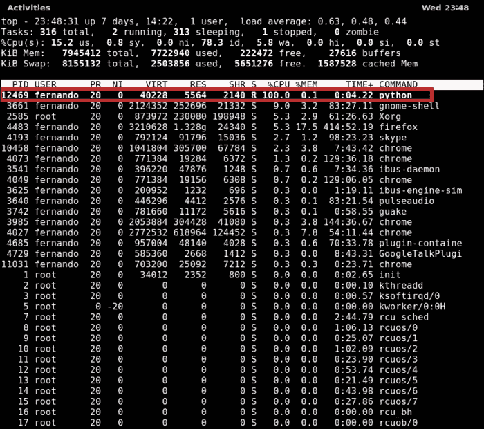

使用这样的工具（Linux 的`top`命令行工具），发现内存泄漏可以很容易，但这将取决于你正在监控的软件类型。如果你的程序不断加载数据，它的内存消耗率将不同于不需要处理太多外部资源的另一个程序。

例如，如果我们绘制一个处理大量外部数据的程序随时间变化的内存消耗图表，它看起来会像以下这样的图表：

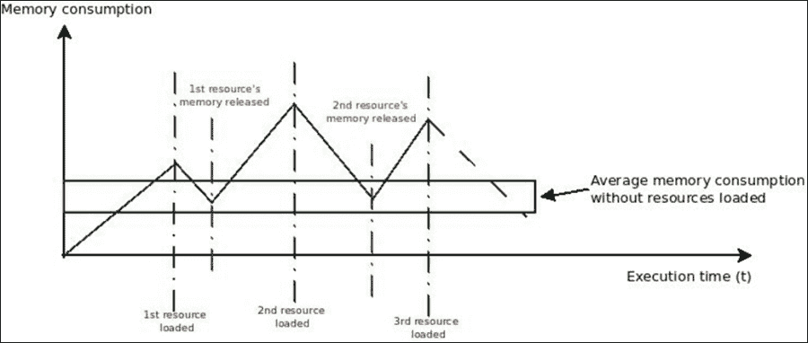

当这些资源完全加载到内存中时，会出现峰值，但当这些资源被释放时，也会出现一些下降。尽管内存消耗数值波动很大，但仍然可以估计程序在没有加载资源时将使用的平均内存量。一旦你定义了那个区域（前面图表中标记为绿色框的区域），你就可以发现内存泄漏。

让我们看看如果资源管理不当（没有完全释放分配的内存），同样的图表会是什么样子：

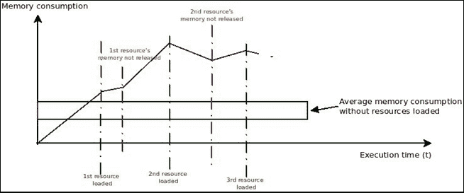

在前面的图表中，你可以清楚地看到，当资源不再使用时，并非所有内存都会被释放，这导致线条移出了绿色框。这意味着程序每秒都在消耗越来越多的内存，即使加载的资源已经释放。

对于不是资源密集型的程序，例如执行特定处理任务相当长一段时间的脚本，也可以这样做。在这些情况下，内存消耗和泄漏应该更容易被发现。

让我们来看一个例子：

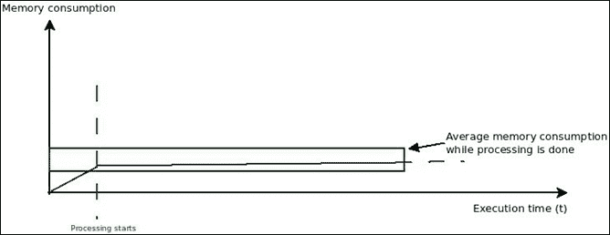

当处理阶段开始时，内存消耗应该在明确定义的范围内稳定。如果我们发现超出该范围的数值，尤其是如果它出去后不再回来，我们就在看另一个内存泄漏的例子。

让我们来看一个这样的例子：

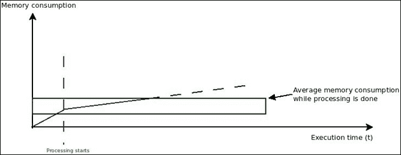

# 提前优化的风险

优化通常被认为是一种良好的实践。然而，当优化行为最终驱动软件解决方案的设计决策时，这一点并不成立。

开发者在开始编写新软件时常常会遇到的一个常见陷阱是过早优化。

当这种情况发生时，最终结果往往与预期的优化代码相反。它可能包含所需解决方案的不完整版本，或者甚至包含来自优化驱动的设计决策的错误。

作为一条常规规则，如果你还没有测量（分析）你的代码，优化它可能不是最好的主意。首先，关注可读的代码。然后，分析它并找出真正的瓶颈，最后，进行实际的优化。

# 运行时间复杂度

在分析代码和优化时，真正重要的是要理解**运行时间复杂度**（**RTC**）是什么，以及我们如何利用这些知识来正确优化我们的代码。

RTC 通过提供任何给定输入下代码执行时间的数学近似来量化给定算法的执行时间。这是一个近似值，因为这样我们能够使用该值将类似的算法分组。

RTC 使用称为 **大 O 符号** 的东西来表示。在数学中，大 O 符号用于表示当项趋于无穷大时给定函数的极限行为。如果我在计算机科学中应用这个概念，我们可以使用大 O 符号来表示描述执行时间的函数的极限行为。

换句话说，这种表示法将给我们一个大致的概念，了解我们的算法处理任意大输入将需要多长时间。然而，它不会给我们执行时间的精确数字，这需要更深入地分析源代码。

正如我之前所说的，我们可以利用这种趋势来分组算法。以下是一些最常见的分组：

## 常数时间 – O(1)

这是最简单的一种。这种表示法基本上意味着我们正在测量的动作将始终花费固定的时间，并且这个时间不依赖于输入的大小。

以下是一些具有 *O(1)* 执行时间的代码示例：

+   判断一个数字是奇数还是偶数：

    ```py
    if number % 2:
      odd = True 
    else:
      odd = False
    ```

+   将消息打印到标准输出：

    ```py
    print "Hello world!"
    ```

即使是更概念上复杂的任务，比如在字典（或哈希表）中查找键的值，如果实现正确，也可以在常数时间内完成。从技术上讲，访问哈希表中的元素需要 *O(1)* 平摊时间，这大致意味着每个操作的平均时间（不考虑边缘情况）是一个常数 *O(1)* 时间。

## 线性时间 – O(n)

线性时间规定，对于任意长度为 *n* 的给定输入，算法执行所需的时间与 *n* 成线性比例，例如，*3n*，*4n + 5*，等等。

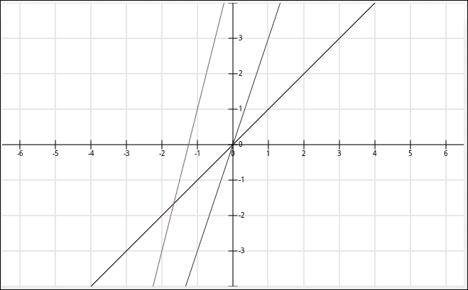

前面的图表清楚地显示，当*x*趋向于无穷大时，蓝色(*3n*)线和红色线(*4n + 5*)与黑色线(*n*)具有相同的上限。因此，为了简化，我们可以说这三个函数都是*O(n)*。

具有这种执行顺序的算法示例：

+   在一个未排序的列表中寻找最小值

+   比较两个字符串

+   删除链表中的最后一个项目

## 对数时间 – O(log n)

具有对数执行时间的算法将具有一个非常确定的最高限时间。对数函数最初增长得很快，但随着输入规模的增大，它会减慢。它永远不会停止增长，但增长的量将非常小，以至于无关紧要。

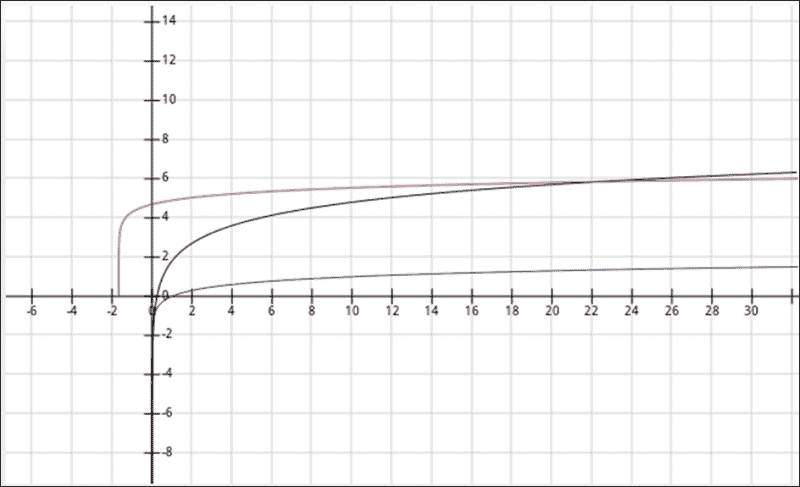

前面的图表显示了三个不同的对数函数。你可以清楚地看到，它们都具有相似的形状，包括上限*x*，它不断增加到无穷大。

一些具有对数执行时间的算法示例：

+   二分搜索

+   计算斐波那契数（使用矩阵乘法）

## 对数时间 – O(nlog n)

前两个执行顺序的特定组合是线性对数时间。当*x*的值开始增加时，它增长得很快。

这里有一些具有这种执行顺序的算法示例：

+   归并排序

+   堆排序

+   快速排序（至少是其平均时间复杂度）

让我们看看一些绘制出的线性对数函数，以更好地理解它们：

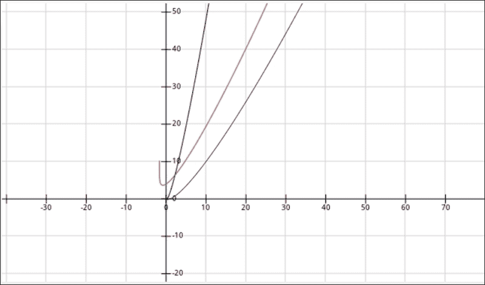

## 阶乘时间 – O(n!)

阶乘时间是算法可能得到的最糟糕的执行时间之一。它增长得如此之快，以至于很难绘制。

这里是算法执行时间在阶乘时间下的粗略近似：

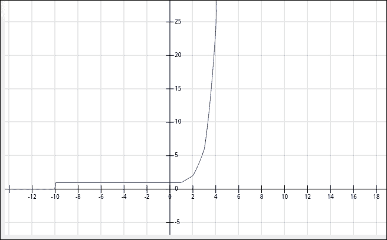

一个具有阶乘执行时间的算法示例是使用穷举搜索解决旅行商问题（基本上是检查每一个可能的解决方案）。

## 二次时间 – O(n^)

二次执行时间是另一个快速增长的算法示例。输入规模越大，所需时间越长（这在大多数复杂度中都是如此，但特别对于这个来说更是如此）。二次执行时间甚至比对数时间效率更低。

一些具有这种执行顺序的算法示例：

+   冒泡排序

+   遍历一个二维数组

+   插入排序

这里有一些绘制出的指数函数示例：

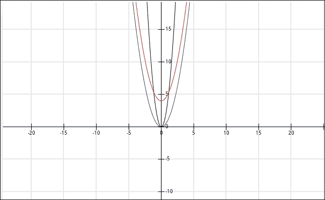

最后，让我们看看所有绘制在一起以获得算法效率的清晰概念：

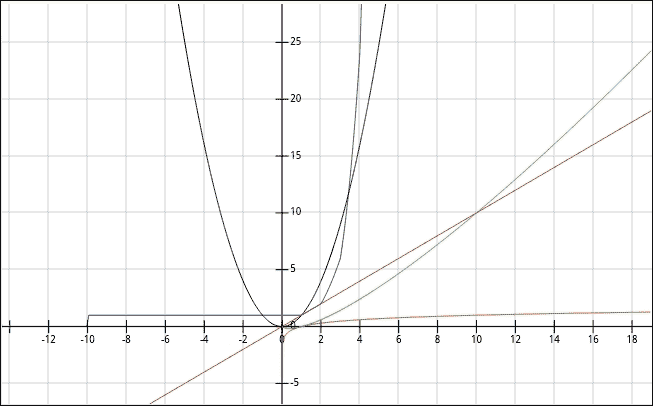

除去恒定执行时间，这显然更快，但在复杂算法中通常难以实现，顺序或偏好应该是：

+   对数

+   线性

+   线性对数

+   二次

+   阶乘

显然，在某些情况下，你将别无选择，只能得到二次执行时间作为最佳结果。目标是始终追求更快的算法，但你的问题和技术的限制将影响实际结果。

### 注意

注意，在二次和阶乘时间之间，还有其他几种替代方案（立方、*n⁴* 等）。

另一个重要的考虑因素是，大多数算法不仅仅有一个执行时间顺序。它们可以有高达三个执行时间顺序：对于最佳情况、正常情况和最坏情况场景。场景由输入数据的属性决定。例如，如果输入已经排序（最佳情况），插入排序算法将运行得更快，而对于其他类型的输入，它将是最差的（指数级）。

值得关注的其他有趣案例是所使用的数据类型。它们本质上与你可以对其执行的操作（查找、插入、搜索等）相关的执行时间相关联。让我们看看一些最常见的数据类型及其相关操作：

| 数据结构 | 时间复杂度 |
| --- | --- |
|   | **平均情况** | **最坏情况** |
|   | **索引** | **搜索** | **插入** | **删除** | **索引** | **搜索** | **插入** | **删除** |
| **列表** | *O(1)* | *O(n)* | *-* | *-* | *O(1)* | *O(n)* | *-* | *-* |
| **链表** | *O(n)* | *O(n)* | *O(1)* | *O(1)* | *O(n)* | *O(n)* | *O(1)* | *O(n)* |
| **双链表** | *O(n)* | *O(n)* | *O(1)* | *O(1)* | *O(n)* | *O(n)* | *O(1)* | *O(1)* |
| **字典** | *-* | *O(1)* | *O(1)* | *O(1)* | *-* | *O(n)* | *O(n)* | *O(n)* |
| **二叉搜索树** | *O(log(n))* | *O(log(n))* | *O(log(n))* | *O(log(n))* | *O(n)* | *O(n)* | *O(n)* | *O(n)* |

# 性能分析最佳实践

性能分析是一个重复性的任务。你需要在同一个项目中多次进行性能分析以获得最佳结果，并在下一个项目中再次进行。就像软件开发中的任何其他重复性任务一样，有一套最佳实践可以遵循，以确保你从过程中获得最大收益。让我们看看其中的一些：

## 构建回归测试套件

在开始任何类型的优化过程之前，你需要确保你对代码所做的更改不会以不良的方式影响其功能。特别是当代码库很大时，最好的方法就是创建一个测试套件。确保你的代码覆盖率足够高，以便提供你进行更改所需的信心。60%的代码覆盖率可能导致非常糟糕的结果。

一个回归测试套件将允许你进行尽可能多的优化尝试，而不用担心破坏代码。

## 注意你的代码

函数式代码通常更容易重构，主要是因为以这种方式组织的函数往往避免了副作用。这减少了影响系统不需要的部分的风险。如果你的函数避免了局部可变状态，那对你来说又是一个加分项。这是因为代码应该对你来说非常直观，易于理解和修改。不遵循前面提到的指南的函数在重构时将需要更多的工作和关注。

## 保持耐心

分析过程既不快，也不容易，也不是一个精确的过程。这意味着你不应该期望只运行分析器，并期望从它那里直接得到指向问题的数据。是的，这种情况可能发生。然而，大多数情况下，你试图解决的问题正是简单调试无法解决的。这意味着你将浏览数据，绘制图表以试图理解它，并缩小问题的根源，直到你需要重新开始，或者找到它。

请记住，你越深入分析所分析的数据，你就越深入到兔子洞中。数字会立即失去意义，所以请确保你在开始之前知道自己在做什么，并且拥有完成这项工作的正确工具。否则，你会浪费时间，最终只会感到沮丧。

## 收集尽可能多的数据

根据你处理的软件的类型和大小，你可能在开始分析之前想要尽可能多地收集数据。分析器是这一点的绝佳来源。然而，还有其他来源，例如网络应用程序的服务器日志、自定义日志、系统资源快照（如来自操作系统任务管理器）等。

## 预处理你的数据

在你从分析器、日志和其他来源收集到所有信息之后，你可能会在分析之前需要预处理这些数据。不要因为分析器无法理解非结构化数据就回避它。你的数据分析将受益于额外的数字。

例如，如果你正在分析一个网络应用程序，获取网络服务器日志是一个很好的主意，但这些文件通常是每条请求一行文本的文件。通过解析它并将数据导入某种数据库系统（如 MongoDB、MySQL 等），你将能够赋予这些数据意义（通过解析日期，根据源 IP 地址进行地理位置定位等），并在之后查询这些信息。

这个阶段的正式名称是 ETL，代表*从其来源提取数据，将其转换成有意义的格式，并将其加载到另一个可以稍后查询的系统*。

## 可视化你的数据

如果你不知道你具体在寻找什么，只是想在你遇到问题之前优化你的代码，一个很好的想法是可视化你已经预处理的数据。计算机擅长处理数字，但另一方面，当我们想要寻找模式并理解我们能从我们所拥有的信息中收集到什么样的洞察时，人类更擅长处理图像。

例如，继续以 Web 服务器日志为例，一个简单的图表（比如你可以用 MS Excel 做的）展示每小时请求情况，可以为你提供一些关于用户行为的洞察：

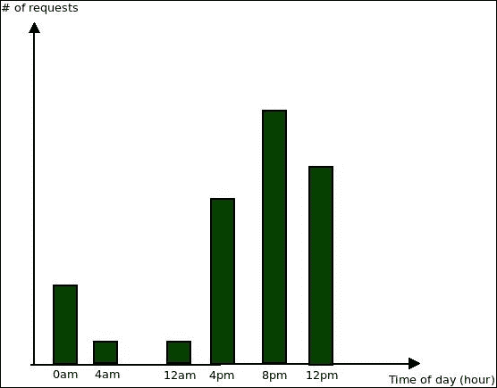

前面的图表清楚地显示，大多数请求都是在下午晚些时候进行的，并持续到夜间。你可以利用这个洞察来进一步进行配置分析。例如，这里的一个可选改进是在那个时间为你基础设施提供更多资源（这可以通过像亚马逊云服务这样的服务提供商来完成）。

另一个例子，使用自定义分析数据，可能是以下图表：

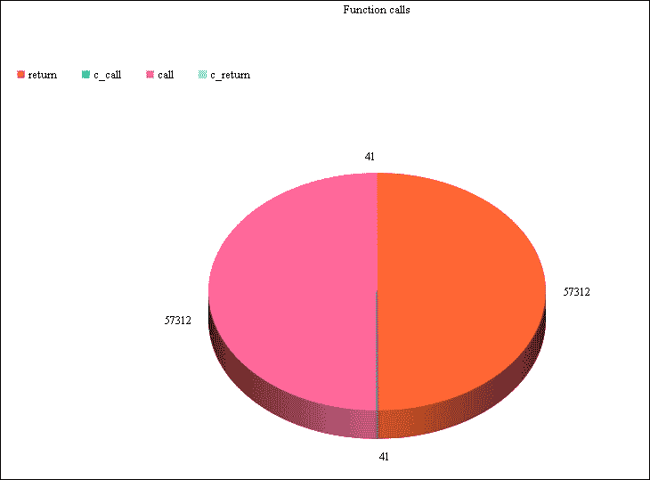

它使用本章第一个代码示例中的数据，通过计算触发`profile`函数的每个事件的次数。然后我们可以绘制它，并了解最常见的活动。在我们的例子中，`call`和`return`事件肯定占用了我们程序的大部分时间。

# 摘要

在本章中，我们介绍了分析的基础知识。你理解了分析及其重要性。你还学习了如何利用它来最大限度地发挥我们代码的潜力。

在下一章中，我们将通过查看一些 Python 分析器和如何在我们的应用程序中使用它们来开始“动手实践”。
