# 第二章。分析器

在上一章中，我们介绍了分析的基础知识，并了解了它的重要性。你学习了如果我们将分析实践纳入开发周期，它将如何帮助开发过程。我们还讨论了一些良好的分析实践。

最后，我们讨论了程序可能具有的不同执行时间的理论。在本章中，我们将使用第一部分（关于分析的部分）。然后，借助两个特定的 Python 分析器（`cProfile` 和 `line_profiler`），我们将开始将你所学的一些理论付诸实践。

在本章中，我们将涵盖以下主题：

+   每个分析器的基本信息

+   如何下载和安装每个分析器

+   不同选项的使用案例

+   两个分析器之间的差异和相似之处

# 认识我们的新好朋友：分析器

在上一章的所有理论和通用示例之后，现在是时候看看一些真正的 Python 了。所以，让我们从两个最知名和最常用的 Python 分析器开始：`cProfile` 和 `line_profiler`。它们将帮助我们以两种不同的方式分析代码。

一方面，我们有 `cProfile` ([`docs.python.org/2/library/profile.html#module-cProfile`](https://docs.python.org/2/library/profile.html#module-cProfile))，自 Python 2.5 版本起就默认包含在 Python 中，并且是大多数用例推荐的分析器。至少这是官方 Python 文档对它的描述。另一方面，我们有 `line_profiler` ([`github.com/rkern/line_profiler`](https://github.com/rkern/line_profiler))，它不是 Python 编程语言的官方部分，但它是那里广为人知的一个分析器。

让我们更详细地了解这两个分析器。

## cProfile

如我之前提到的，`cProfile` 自 Python 2.5 版本起就默认包含在标准 Python 解释器（`cPython`）中。其他版本，如 PyPy，则没有这个功能。它是一个确定性分析器。它提供了一套 API，允许开发者收集有关 Python 程序执行的信息，更具体地说，是关于每个函数使用的 CPU 时间。它还提供了其他详细信息，例如一个函数被调用的次数。

它仅测量 CPU 时间，并不关注内存消耗和其他内存相关统计信息。尽管如此，它是一个很好的起点，因为大多数时候，如果我们试图优化代码，这种分析将提供一组立即的优化候选者。

由于它已经是语言的一部分，无需安装。要使用它，你只需导入 `cProfile` 包即可。

### 注意

确定性分析器只是基于事件的分析器（详情请参阅上一章）的另一个名称。这意味着这个分析器将知道我们代码执行过程中的每一个函数调用、返回语句和其他事件。它还会测量这段时间内发生的所有事情（与我们在上一章中看到的统计分析器不同）。

这里是一个来自 Python 文档的非常简单的例子：

```py
import cProfile
import re
cProfile.run('re.compile("foo|bar")')
```

上一段代码输出了以下文本：

```py
    197 function calls (192 primitive calls) in 0.002 seconds

Ordered by: standard name

ncalls  tottime  percall  cumtime  percall filename:lineno(function)
     1    0.000    0.000    0.001    0.001 <string>:1(<module>)
     1    0.000    0.000    0.001    0.001 re.py:212(compile)
     1    0.000    0.000    0.001    0.001 re.py:268(_compile)
     1    0.000    0.000    0.000    0.000 sre_compile.py:172(_compile_charset)
     1    0.000    0.000    0.000    0.000 sre_compile.py:201(_optimize_charset)
     4    0.000    0.000    0.000    0.000 sre_compile.py:25(_identityfunction)
   3/1    0.000    0.000    0.000    0.000 sre_compile.py:33(_compile)
```

从这个输出中，可以收集以下信息：

+   第一行告诉我们，共监视了 197 个函数调用，其中 192 个是原始调用，这意味着没有涉及递归。

+   `ncalls`报告对函数的调用次数。如果这一列有两个数字，这意味着存在递归。第二个数字是原始调用的次数，第一个数字是总调用次数。这个数字可以帮助识别可能的错误（意外的过高数字）或可能的内联扩展点。

+   `tottime`是在函数内部花费的总时间（不包括调用其他函数的子调用的时间）。这个特定的信息可以帮助开发者找到可能被优化的长时间运行的循环。

+   `percall`只是`tottime`除以`ncalls`的商。

+   `cumtime`是在函数内部花费的总时间，包括在子函数中花费的时间（这包括递归调用）。这个数字可以帮助识别更高层次的错误，例如算法选择中的错误。

+   `percall`是`cumtime`除以原始调用的商。

+   `filename:lineno(function)`提供了分析函数的文件名、行号和函数名。

## 关于限制的说明

没有这样的东西叫做不可见分析器。这意味着即使在`cProfile`这种开销非常小的案例中，它仍然会给我们的代码增加开销。在每次触发事件时，事件实际发生的时间和性能分析器查询内部时钟状态的时间之间会有一些延迟。同时，当程序计数器离开性能分析器的代码并返回用户代码以继续执行时，也会有一些延迟。

除此之外，作为计算机内部的数据，内部时钟有一个固定的精度，任何小于这个精度的测量都会丢失。因此，当开发者使用具有大量递归调用或特定情况下函数调用许多其他函数的代码进行性能分析时，需要特别注意，因为这种误差可能会累积并变得显著。

## 提供的 API

`cProfile`分析器提供了一套方法，可以帮助开发者在不同上下文中收集统计数据：

```py
run(command, filename=None, sort=-1)
```

在前一个示例中使用的方法是一个经典方法，用于收集命令执行的统计数据。之后，它调用以下函数：

```py
exec(command, __main__.__dict__, __main__.__dict__)
```

如果没有提供文件名，它将创建一个新的`stats`实例（关于这个类的更多内容，请稍后了解）。以下是前一个相同的示例，但使用了额外的参数：

```py
import cProfile
import re
cProfile.run('re.compile("foo|bar")', 'stats', 'cumtime')
```

如果你运行前面的代码，你会注意到没有任何内容被打印出来。然而，如果你检查文件夹的内容，你会注意到一个名为`stats`的新文件。如果你尝试打开该文件，你将无法理解其含义，因为它是以二进制格式保存的。在几分钟内，我们将看到如何读取这些信息并对其进行操作以创建我们自己的报告：

```py
runctx(command, globals, locals, filename=None)
```

此方法与前一个方法非常相似。唯一的区别是它还接收命令行字符串的`globals`和`locals`字典。之后，它执行以下函数：

```py
exec(command, globals, locals)
```

它收集分析统计数据，就像`run`一样。让我们看看`run`和`runctx`之间主要区别的示例。

让我们坚持使用`run`并编写以下代码：

```py
import cProfile
def runRe():
    import re 
    cProfile.run('re.compile("foo|bar")')
runRe()
```

实际运行代码时，我们会得到以下错误消息：

```py
Traceback (most recent call last): 
  File "cprof-test1.py", line 7, in <module> 
    runRe() ...
  File "/usr/lib/python2.7/cProfile.py", line 140, in runctx 
    exec cmd in globals, locals 
  File "<string>", line 1, in <module> 
NameError: name 're' is not defined 
```

`re`模块在`run`方法中找不到，因为我们之前看到`run`使用`__main__.__dict__`作为参数调用`exec`函数。

现在，让我们以下面的方式使用`runctx`：

```py
import cProfile
def runRe():
    import re 
    cProfile.runctx('re.compile("foo|bar")', None, locals())
runRe()
```

然后，输出将变为以下有效格式：

```py
         194 function calls (189 primitive calls) in 0.000 seconds 
  Ordered by: standard name 
   ncalls  tottime  percall  cumtime  percall filename:lineno(function) 
        1    0.000    0.000    0.000    0.000 <string>:1(<module>) 
        1    0.000    0.000    0.000    0.000 re.py:188(compile) 
        1    0.000    0.000    0.000    0.000 re.py:226(_compile) 
        1    0.000    0.000    0.000    0.000 sre_compile.py:178(_compile_charset) 
        1    0.000    0.000    0.000    0.000 sre_compile.py:207(_optimize_charset) 
        4    0.000    0.000    0.000    0.000 sre_compile.py:24(_identityfunction) 
      3/1    0.000    0.000    0.000    0.000 sre_compile.py:32(_compile) 
        1    0.000    0.000    0.000    0.000 sre_compile.py:359(_compile_info) 
        2    0.000    0.000    0.000    0.000 sre_compile.py:472(isstring) 
        1    0.000    0.000    0.000    0.000 sre_compile.py:478(_code) 
        1    0.000    0.000    0.000    0.000 sre_compile.py:493(compile) 
        5    0.000    0.000    0.000    0.000 sre_parse.py:126(__len__) 
       12    0.000    0.000    0.000    0.000 sre_parse.py:130(__getitem__) 
        7    0.000    0.000    0.000    0.000 sre_parse.py:138(append) 
      3/1    0.000    0.000    0.000    0.000 sre_parse.py:140(getwidth) 
        1    0.000    0.000    0.000    0.000 sre_parse.py:178(__init__) 
       10    0.000    0.000    0.000    0.000 sre_parse.py:182(__next) 
        2    0.000    0.000    0.000    0.000 sre_parse.py:195(match) 
        8    0.000    0.000    0.000    0.000 sre_parse.py:201(get) 
        1    0.000    0.000    0.000    0.000 sre_parse.py:301(_parse_sub) 
        2    0.000    0.000    0.000    0.000 sre_parse.py:379(_parse) 
        1    0.000    0.000    0.000    0.000 sre_parse.py:67(__init__) 
        1    0.000    0.000    0.000    0.000 sre_parse.py:675(parse) 
        3    0.000    0.000    0.000    0.000 sre_parse.py:90(__init__) 
        1    0.000    0.000    0.000    0.000 {_sre.compile} 
       15    0.000    0.000    0.000    0.000 {isinstance} 
    38/37    0.000    0.000    0.000    0.000 {len} 
        2    0.000    0.000    0.000    0.000 {max} 
       48    0.000    0.000    0.000    0.000 {method 'append' of 'list' objects} 
        1    0.000    0.000    0.000    0.000 {method 'disable' of '_lsprof.Profiler' objects} 
        1    0.000    0.000    0.000    0.000 {method 'get' of 'dict' objects} 
        1    0.000    0.000    0.000    0.000 {method 'items' of 'dict' objects} 
        8    0.000    0.000    0.000    0.000 {min} 
        6    0.000    0.000    0.000    0.000 {ord} 
```

`Profile(timer=None, timeunit=0.0, subcalls=True, builtins=True)`方法返回一个类，在分析过程中比`run`和`runctx`提供了更多的控制。

`timer`参数是一个自定义函数，可以用来以不同于默认方式测量时间。它必须是一个返回表示当前时间的数字的函数。如果开发者需要自定义函数，它应该尽可能快，以降低开销并避免校准问题（请参阅几页前的*关于限制的说明*部分）。

如果计时器返回的数字是整数，则`timeunit`参数指定表示每个时间单位持续时间的乘数。例如，如果返回的值以毫秒为单位，则`timeunit`将是`.001`。

让我们也看看返回类提供的方法：

+   `enable()`: 这开始收集分析数据

+   `disable()`: 这停止收集分析数据

+   `create_stats()`: 这停止收集数据并将收集到的信息记录为当前配置文件

+   `print_stats(sort=-1)`: 这创建一个`stats`对象并将结果打印到`STDOUT`

+   `dump_stats(filename)`: 这将当前配置文件的内容写入文件

+   `run(cmd)`: 这与之前看到的`run`函数相同

+   `runctx(cmd, globals, locals)`: 这与之前看到的`runctx`函数相同

+   `runcall(func, *args, **kwargs)`: 这收集被调用的函数的分析信息

让我们看看前面的例子，这次使用以下方法：

```py
import cProfile

def runRe():
    import re
    re.compile("foo|bar")

prof = cProfile.Profile() 
prof.enable() 
runRe()
prof.create_stats()
prof.print_stats()
```

为了启动分析，涉及更多的行，但这对原始代码的侵入性明显较小。当尝试分析已经编写和测试的代码时，这是一个优点。这样，我们可以在不修改原始代码的情况下添加和删除我们的分析代码。

有一个更不侵入的替代方案，它不涉及添加任何代码，而是在运行脚本时使用一些特定的命令行参数：

```py
$ python -m cProfile your_script.py -o your_script.profile

```

注意，这将分析整个代码，所以如果你实际上只是分析脚本的一个特定部分，前面的方法不会返回相同的结果。

现在，在进入更详细和有趣的例子之前，让我们首先看看`Stats`类，并了解它能为我们做什么。

## `Stats`类

`pstats`模块为开发者提供了`Stats`类，它反过来允许他们读取和操作`stats`文件的内容（我们使用前面描述的方法之一保存到该文件中的分析信息）。

例如，以下代码加载`stats`文件并打印出排序后的统计信息：

```py
import pstats
p = pstats.Stats('stats')
p.strip_dirs().sort_stats(-1).print_stats()
```

### 注意

注意，`Stats`类构造函数能够接收一个`cProfile.Profile`实例作为数据源，而不是文件名。

让我们更仔细地看看`pstats.Stats`类提供的方法：

+   `strip_dirs()`: 此方法从报告中文件名的所有前缀路径信息中删除。此方法修改了`stats`实例，因此任何执行了此方法的实例都将被视为其项目顺序是随机的。如果两个条目被认为是相同的（同一文件名上的同一行具有相同的函数名），则这些条目将被累积。

+   `add(*filenames)`: 此方法将更多信息加载到`stats`中，来自文件名中引用的文件。值得注意的是，就像只有一个文件一样，引用相同函数（文件名、行和函数名）的`stats`条目将被累积。

+   `dump_stats(filename)`: 就像在`cProfile.Profile`类中一样，此方法将加载到`Stats`类中的数据保存到文件中。

+   `sort_stats(*keys)`: 此方法自 2.3 版本以来一直存在，它通过给定的标准对`stats`对象中的条目进行排序。当给出多个标准时，额外的标准仅在先前标准相等时才会使用。例如，如果使用`sort_stats ('name', 'file')`，则将所有条目按函数名称排序，当该名称相同时，将按文件名对这些条目进行排序。

该方法足够智能，可以理解只要它们是不含糊的缩写，所以请小心。目前支持的排序标准完整列表如下：

| 标准 | 含义 | 升序/降序 |
| --- | --- | --- |
| `calls` | 调用总数 | 降序 |
| `cumulative` | 累计时间 | 降序 |
| `cumtime` | 累计时间 | 降序 |
| `file` | 文件名 | 升序 |
| `filename` | 文件名 | 升序 |
| `module` | 文件名 | 升序 |
| `ncalls` | 调用总数 | 降序 |
| `pcalls` | 原始调用计数 | 降序 |
| `line` | 行号 | 升序 |
| `name` | 函数名 | 升序 |
| `nfl` | 名称/文件/行组合 | 降序 |
| `stdname` | 标准名称 | 升序 |
| `time` | 内部时间 | 降序 |
| `tottime` | 内部时间 | 降序 |

### 注意

**关于 nfl 与 stdname 的注意事项**

这两种排序类型之间的主要区别在于后者是对打印名称的排序。这意味着行号将按字符串排序（这意味着对于 4、20 和 30，排序将是 20、30、4）。`nfl`排序对行号字段进行数值比较。

最后，出于向后兼容性的原因，一些数值被接受，而不是前面表格中的那些。它们是`-1`、`0`、`1`和`2`，分别对应`stdname`、`calls`、`time`和`cumulative`。

+   `reverse_order()`：此方法反转所选排序键的默认顺序（因此，如果键是默认升序，现在将是降序）。

+   `print_stats(*restrictions)`：此方法负责将统计信息打印到`STDOUT`。可选参数旨在限制此函数的输出。它可以是整数值、小数值或字符串。它们在此处解释：

    +   `integer`：这将限制打印的行数

    +   `Decimal between 0.0 and 1.0 (inclusive)`：这将选择行百分比

    +   `String`：这是一个与标准名称匹配的正则表达式

    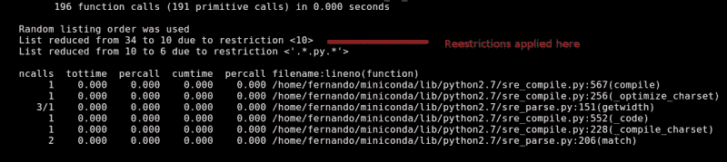

上一张截图显示了调用`print_stats`方法时得到的输出如下：

```py
import cProfile
import pstats

def runRe():
    import re
    re.compile("foo|bar")
prof = cProfile.Profile()
prof.enable()
runRe()
prof.create_stats()

p = pstats.Stats(prof)
p.print_stats(10, 1.0, '.*.py.*') #print top 10 lines that match the given reg exp.

```

如果传递了多个参数，则它们将按顺序应用。正如我们在前面的代码行中看到的，这个分析器的输出可以相当长。然而，如果我们正确排序，则可以使用此参数总结输出，同时仍然获得相关信息。

`print_callers(*restrictions)`函数与之前的输入和限制规则相同，但输出略有不同。对于程序执行期间调用的每个函数，它将显示每个调用被调用的次数、总时间和累计时间，以及文件名、行号和函数名的组合。

让我们看看使用`cProfile.Profile`和`Stats`如何渲染调用函数列表的快速示例：

```py
import cProfile
import pstats

def runRe():
    import re
    re.compile("foo|bar")
prof = cProfile.Profile()
prof.enable()
runRe()
prof.create_stats()

p = pstats.Stats(prof)
p.print_callers()
```

注意我们是如何将`pstats.Stats`类与`cProfile.Profile`类结合使用的。它们共同工作，以我们所需的方式收集和展示信息。现在，看看输出：

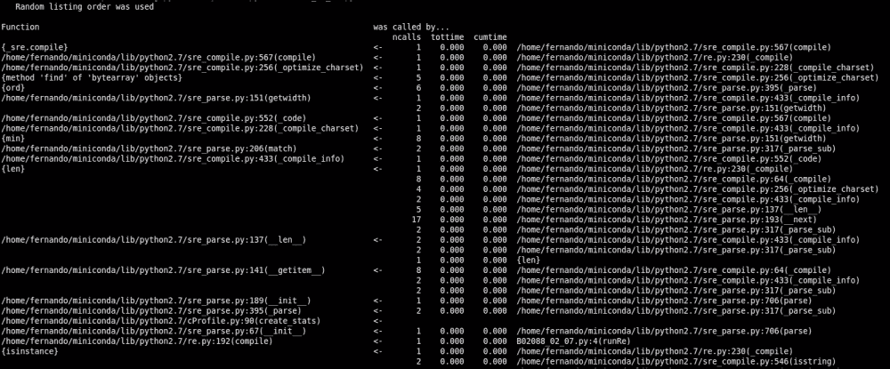

`print_callees(*restrictions)`方法打印调用其他函数的函数列表。显示的数据格式和限制与前面的示例相同。

你可能会在输出中遇到如下截图所示的块：

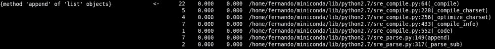

这个输出意味着右侧的函数是由左侧的相同函数调用的。

## 性能分析示例

现在我们已经看到了如何使用`cProfile`和`Stats`的基本方法，让我们深入研究一些更有趣和实用的例子。

### 斐波那契再次

让我们回到斐波那契的例子，因为基本的递归斐波那契序列计算器有很多改进的空间。

让我们先看看未经性能分析、未经优化的代码：

```py
import profile

def fib(n):
    if n <= 1:
  return n
    else:
        return fib(n-1) + fib(n-2)

def fib_seq(n):
    seq = [ ]
    if n > 0:
        seq.extend(fib_seq(n-1))
    seq.append(fib(n))
    return seq

profile.run('print fib_seq(20); print')
```

这段代码将输出以下结果：

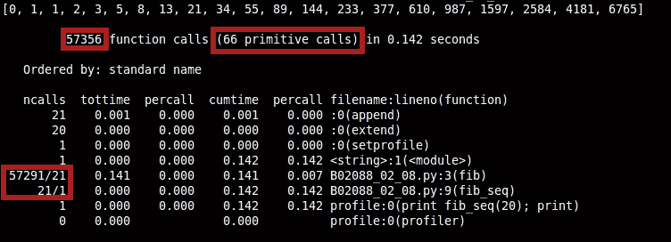

输出打印正确，但请看前面截图中的高亮部分。这些部分在这里解释：

+   在那 0.114 秒内，有 57.356 次函数调用

+   其中只有 66 个是原始调用（不是通过递归调用）

+   在我们代码的第 3 行，57.270（57.291—21）是递归引起的函数调用

如我们所知，调用另一个函数会增加我们的时间开销。由于（对于`cumtime`列）大多数执行时间似乎都花在这个函数内部，我们可以安全地假设，如果我们加快这个速度，整个脚本的时间也会受到影响。

现在，让我们给`fib`函数应用一个简单的装饰器，这样我们就可以缓存之前计算过的值（这种技术也称为记忆化，你将在接下来的章节中了解到）以便我们不必对每个值调用 fib 多次：

```py
import profile

class cached:
    def __init__(self, fn):
        self.fn = fn
        self.cache = {}

    def __call__(self, *args):
        try:
            return self.cache[args]
        except KeyError:
            self.cache[args] = self.fn(*args)
            return self.cache[args]

@cached
def fib(n):
    if n <= 1:
        return n
    else:
        return fib(n-1) + fib(n-2)

def fib_seq(n):
    seq = [ ]
    if n > 0: 

        seq.extend(fib_seq(n-1))
    seq.append(fib(n))
    return seq

profile.run('print fib_seq(20); print')
```

现在，让我们再次运行代码并查看输出：

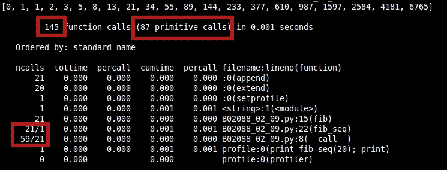

我们从大约 57k 的总调用次数减少到只有 145 次，从 0.114 秒减少到 0.001 秒。这是一个惊人的改进！然而，我们有了更多的原始调用，但我们也有显著更少的递归调用。

让我们继续进行另一个可能的优化。我们的例子对于单个调用来说运行得相当快，但让我们尝试连续运行几次，并获取该执行的组合统计数据。也许我们会得到一些有趣的结果。为此，我们需要使用 stats 模块。让我们看看一个示例：

```py
import cProfile
import pstats
from fibo4 import fib, fib_seq

filenames = []
profiler = cProfile.Profile()
profiler.enable()
for i in range(5):
    print fib_seq(1000); print
profiler.create_stats()
stats = pstats.Stats(profiler)
stats.strip_dirs().sort_stats('cumulative').print_stats()
stats.print_callers()
```

我们在这里已经达到了极限。获取 1000 的斐波那契序列可能要求过高，尤其是从递归实现中获取。事实上，我们已经达到了递归深度限制。这主要是因为`cPython`有一个保护机制来防止由递归调用数量产生的栈溢出错误（理想情况下，尾递归优化可以解决这个问题，但`cPython`没有提供）。因此，我们发现了另一个问题。让我们尝试修复它并重新分析代码：

```py
import profile
def fib(n):
    a, b = 0, 1 
    for i in range(0, n):
        a,b = b, a+b
    return a

def fib_seq(n):
    seq = [ ]
    for i in range(0, n + 1):
        seq.append(fib(i))
    return seq

print fib_seq(1000)
```

前面的代码行打印了一大堆非常大的数字，但这些行证明了我们已经做到了。现在，我们可以计算数字 1000 的斐波那契数列了。现在，让我们分析一下，看看我们发现了什么。

使用新的分析代码，但需要斐波那契实现的迭代版本，我们将得到以下结果：

```py
import cProfile
import pstats
from fibo_iter import fib, fib_seq

filenames = []
profiler = cProfile.Profile()
profiler.enable()
for i in range(5):
    print fib_seq(1000); print
profiler.create_stats()
stats = pstats.Stats(profiler)
stats.strip_dirs().sort_stats('cumulative').print_stats()
stats.print_callers()
```

这反过来会在控制台产生以下结果：

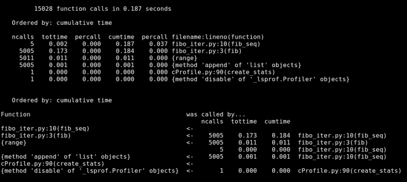

我们的新代码计算 1000 的斐波那契数列需要 0.187 秒，计算五次。这并不是一个糟糕的数字，但我们知道我们可以通过缓存结果来改进它。*正如你所见，我们有 5005 次对`fib`函数的调用。如果我们缓存它，我们将有更少的函数调用，这意味着更少的执行时间*。

只需做很少的工作，我们就可以通过缓存对`fib`函数的调用来提高这个时间，根据前面的报告，这个函数被调用了 5005 次：

```py
import profile

class cached:
    def __init__(self, fn):
        self.fn = fn
        self.cache = {}

    def __call__(self, *args):
        try:
            return self.cache[args]
        except KeyError:
            self.cache[args] = self.fn(*args)
            return self.cache[args]

@cached
def fib(n):
    a, b = 0, 1 
    for i in range(0, n):
        a,b = b, a+b
    return a

def fib_seq(n):
    seq = [ ]
    for i in range(0, n + 1):
        seq.append(fib(i))
    return seq

print fib_seq(1000)
```

你应该得到以下类似的输出：

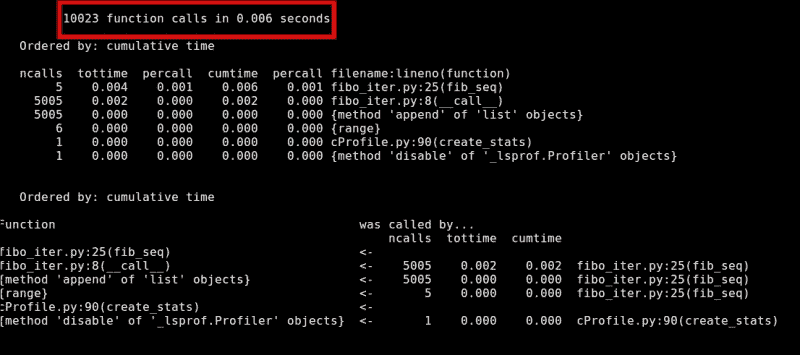

只需缓存对`fib`函数的调用，我们就从 0.187 秒缩短到了 0.006 秒。这是一个惊人的改进。做得好！

### Tweet stats

让我们看看另一个例子，这个例子在概念上稍微复杂一些，因为计算斐波那契数列并不是一个日常用例。让我们做一些更有趣的事情。如今，Twitter 允许你以 CSV 文件的形式下载你的完整推文列表。我们将使用这个文件来从我们的源生成一些统计数据。

使用提供的数据，我们将计算以下统计数据：

+   实际回复消息的百分比

+   从网站([`twitter.com`](https://twitter.com))发布的推文的百分比

+   使用手机发布的推文的百分比

我们脚本的输出将类似于以下截图所示：


为了保持简单，我们将负责解析 CSV 文件和进行这些基本的计算。我们不会使用任何第三方模块；这样，我们将完全控制代码及其分析。这意味着省略一些明显的事情，比如使用 Python 的 CSV 模块。

之前展示的其他不良做法，例如`inc_stat`函数或我们在处理之前将整个文件加载到内存中的事实，将提醒你，这只是一个示例，用来展示基本的改进。

这里是脚本的初始代码：

```py
def build_twit_stats():
    STATS_FILE = './files/tweets.csv'
    STATE = {
        'replies': 0,
        'from_web': 0,
        'from_phone': 0,
        'lines_parts': [],
        'total_tweets': 0
    }
    read_data(STATE, STATS_FILE)
    get_stats(STATE)
    print_results(STATE)

def get_percentage(n, total):
    return (n * 100) / total

def read_data(state, source):
    f = open(source, 'r')

    lines = f.read().strip().split("\"\n\"")
    for line in lines:

       state['lines_parts'].append(line.strip().split(',')) 
    state['total_tweets'] = len(lines)

def inc_stat(state, st):
    state[st] += 1

def get_stats(state):
    for i in state['lines_parts']:
        if(i[1] != '""'):
            inc_stat(state, 'replies')
        if(i[4].find('Twitter Web Client') > -1):
            inc_stat(state, 'from_web')
        else:
            inc_stat(state, 'from_phone')

def print_results(state):
    print "-------- My twitter stats -------------"
    print "%s%% of tweets are replies" % (get_percentage(state['replies'], state['total_tweets']))
    print "%s%% of tweets were made from the website" % (get_percentage(state['from_web'], state['total_tweets']))
    print "%s%% of tweets were made from my phone" % (get_percentage(state['from_phone'], state['total_tweets']))
```

公平地说，这段代码并没有做太多复杂的事情。它加载文件的內容，将其分割成行，然后又将每一行分割成不同的字段。最后，它进行计数。有人可能会认为，有了这个解释，就没有太多可以优化的地方了，但我们将看到，总有优化的空间。

另一个需要注意的重要事项是，我们将处理的 CSV 文件几乎有 150MB 的推文数据。

这里是导入这段代码、使用它并生成性能报告的脚本：

```py
import cProfile
import pstats

from B02088_02_14 import build_twit_stats
profiler = cProfile.Profile()

profiler.enable()

build_twit_stats()

profiler.create_stats()
stats = pstats.Stats(profiler)
stats.strip_dirs().sort_stats('cumulative').print_stats()
```

这次执行得到的输出如下：


在前面的屏幕截图中，有三个主要感兴趣的区域：

1.  总执行时间

1.  单个函数调用的累积时间

1.  单个函数的总调用次数

我们的目的是降低总执行时间。为此，我们将特别关注单个函数的累积时间和单个函数的总调用次数。对于最后两点，我们可以得出以下结论：

+   `build_twit_stats` 函数是耗时最长的函数。然而，正如您在代码的前几行中看到的，它只是调用所有其他函数，所以这是有道理的。我们可以专注于 `read_data`，因为它是耗时第二多的函数。这很有趣，因为这意味着我们的瓶颈不是在计算统计数据时，而是在加载数据时。

+   在代码的第三行，我们也可以看到 `read_data` 中的瓶颈。我们执行了太多的 `split` 命令，它们加在一起。

+   我们还看到，第四个最耗时的函数是 `get_stats`。

那么，让我们解决这些问题，看看我们是否能得到更好的结果。我们最大的瓶颈是我们加载数据的方式。我们首先将所有数据加载到内存中，然后迭代它来计算我们的统计数据。我们可以通过逐行读取文件并在每行之后计算统计数据来改进这一点。让我们看看这段代码会是什么样子。

新的 `read_data` 方法看起来像这样：

```py
  def read_data(state, source):
    f = open(source)

    buffer_parts = []
    for line in f:
      #Multi line tweets are saved in several lines in the file, so we need to
      #take that into account.
      parts = line.split('","')
      buffer_parts += parts
      if len(parts) == 10:
        state['lines_parts'].append(buffer_parts) 
        get_line_stats(state, buffer_parts)
        buffer_parts = []
    state['total_tweets'] = len(state['lines_parts'])
```

我们不得不添加一些逻辑来考虑多行推文，这些推文也作为多行记录保存在我们的 CSV 文件中。我们将 `get_stats` 函数更改为 `get_line_stats`，这简化了其逻辑，因为它只为当前记录计算值：

```py
def get_line_stats(state, line_parts):
  if line_parts[1] != '' :
      state['replies'] += 1
  if 'Twitter Web Client' in line_parts[4]:
      state['from_web'] += 1
  else:
      state['from_phone'] += 1
```

最后两项改进是移除对 `inc_stat` 的调用，因为，多亏了我们使用的字典，这个调用是不必要的。我们还用更高效的 `in` 操作符替换了查找方法的用法。

让我们再次运行代码并查看更改：

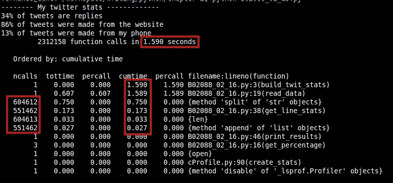

我们从 2 秒减少到 1.6 秒；这是一个相当大的改进。`read_data` 函数仍然是最耗时的函数之一，但这仅仅是因为它现在也调用了 `get_line_stats` 函数。我们也可以在这方面进行改进，因为尽管 `get_line_stats` 函数做得很少，但我们通过在循环中频繁调用它而产生了查找时间。我们可以将这个函数内联，看看是否有所帮助。

新代码将看起来像这样：

```py
def read_data(state, source):
    f = open(source)

    buffer_parts = []
    for line in f:
      #Multi line tweets are saved in several lines in the file, so we need to
      #take that into account.
      parts = line.split('","')
      buffer_parts += parts
      if len(parts) == 10:
        state['lines_parts'].append(buffer_parts) 
        if buffer_parts[1] != '' :
          state['replies'] += 1
        if 'Twitter Web Client' in buffer_parts[4]:
          state['from_web'] += 1
        else:
          state['from_phone'] += 1
        buffer_parts = []
    state['total_tweets'] = len(state['lines_parts'])
```

现在，随着新更改，报告将看起来像这样：

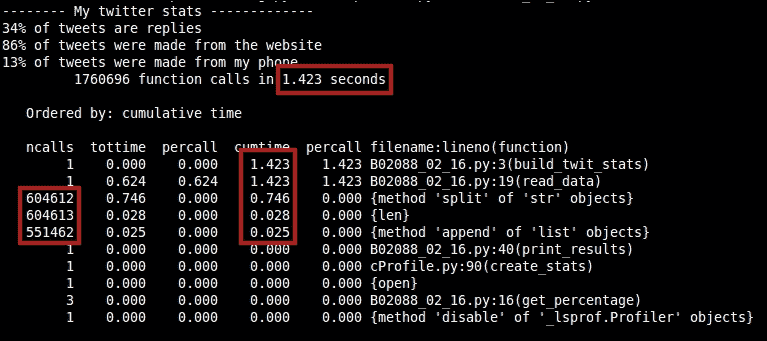

第一张截图和前一张截图之间有一个显著的改进。我们将时间降低到略高于 1.4 秒，从 2 秒降至。函数调用的数量也显著降低（从大约 300 万次调用降至 170 万次），这反过来应该有助于降低查找和调用所花费的时间。

作为额外的奖励，我们将通过简化代码来提高代码的可读性。以下是所有代码的最终版本：

```py
def build_twit_stats():
    STATS_FILE = './files/tweets.csv'
    STATE = {
        'replies': 0,
        'from_web': 0,
        'from_phone': 0,
        'lines_parts': [],
        'total_tweets': 0
    }
    read_data(STATE, STATS_FILE)
    print_results(STATE)

def get_percentage(n, total):
    return (n * 100) / total

def read_data(state, source):
    f = open(source)

    buffer_parts = []
    for line in f:
      #Multi line tweets are saved in several lines in the file, so we need to
      #take that into account.
      parts = line.split('","')
      buffer_parts += parts
      if len(parts) == 10:
        state['lines_parts'].append(buffer_parts) 
        if buffer_parts[1] != '' :
          state['replies'] += 1
        if 'Twitter Web Client' in buffer_parts[4]:
          state['from_web'] += 1
        else:
          state['from_phone'] += 1
        buffer_parts = []
    state['total_tweets'] = len(state['lines_parts'])

def print_results(state):
    print "-------- My twitter stats -------------"

    print "%s%% of tweets are replies" % (get_percentage(state['replies'], state['total_tweets']))

    print "%s%% of tweets were made from the website" % (get_percentage(state['from_web'], state['total_tweets']))

    print "%s%% of tweets were made from my phone" % (get_percentage(state['from_phone'], state['total_tweets']))
```

对于`cProfile`的回顾就到这里。通过它，我们成功地分析了脚本，得到了每个函数的数字和总函数调用次数。它帮助我们改进了对系统的整体视图。现在我们将查看一个不同的分析器，它将提供`cProfile`无法提供的每行细节。

# line_profiler

这个分析器与`cProfile`不同。它帮助你逐行分析函数，而不是像其他分析器那样进行确定性分析。

要安装这个分析器，你可以使用 pip ([`pypi.python.org/pypi/pip`](https://pypi.python.org/pypi/pip)) 命令行工具，以下是一个命令：

```py
$ pip install line_profiler

```

### 注意

如果你在安装过程中遇到任何问题，例如缺少文件，请确保你已经安装了所有开发依赖项。在 Ubuntu 的情况下，你可以通过运行以下命令来确保所有依赖项都已安装：

`$ sudo apt-get install python-dev libxml2-dev libxslt-dev`

这个分析器试图填补`cProfile`和其他类似工具留下的空白。其他分析器覆盖了函数调用上的 CPU 时间。大多数情况下，这已经足够捕捉到问题并进行修复（我们之前已经看到过）。然而，有时问题或瓶颈与函数中的一行特定代码相关，这就是`line_profiler`发挥作用的地方。

作者推荐我们使用`kernprof`工具，因此我们将查看它的示例。Kernprof 将创建一个分析器实例，并将其以`profile`的名称插入到`__builtins__`命名空间中。分析器被设计成用作装饰器，因此你可以装饰任何你想要的函数，并且它会为每一行计时。

这是我们执行分析器的方式：

```py
$ kernprof -l script_to_profile.py

```

装饰过的函数已经准备好进行分析了：

```py
@profile
def fib(n):
    a, b = 0, 1 
    for i in range(0, n):
        a,b = b, a+b
    return a
```

默认情况下，`kernprof`会将结果保存到名为`script_to_profile.py.lprof`的文件中，但你可以使用`-v`属性来告诉它立即显示结果：

```py
$ kernprof -l -v script_to_profile.py

```

这里有一个简单的输出示例，以帮助您理解您将看到的内容：

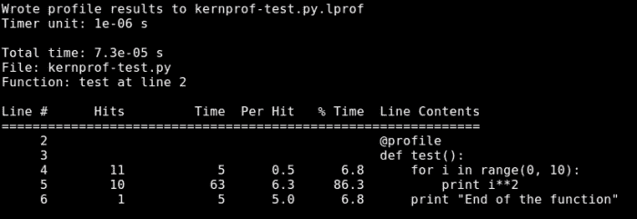

输出包含函数的每一行，旁边是时间信息。共有六列信息，以下是它们的含义：

+   `行号`：这是文件内的行号。

+   `命中次数`：这是在分析期间此行被执行的次数。

+   `时间`: 这是该行的总执行时间，以计时器单位指定。在结果表之前的信息中，你会注意到一个名为 `计时器单位` 的字段，那个数字是转换为秒的转换因子（要计算实际时间，你必须将时间 `x` 计时器单位）。在不同的系统上可能会有所不同。

+   `Per hit`: 执行该行代码的平均时间。这也在计时器的单位中指定。

+   `% 时间`: 执行该行代码所花费的时间百分比，相对于整个函数执行的总时间。

如果你正在构建另一个利用 `line_profiler` 的工具，有两种方式让它知道要分析哪些函数：使用构造函数和使用 `add_function` 方法。

`line_profiler` 也提供了与 `cProfile.Profile` 相同的 `run`、`runctx`、`runcall`、`enable` 和 `disable` 方法。然而，在嵌套时最后两个并不安全，所以请小心。分析完成后，你可以使用 `dump_stats(filename)` 方法将 `stats` 输出到文件，或者使用 `print_stats([stream])` 方法打印它们。它将结果打印到 `sys.stdout` 或你作为参数传递的任何其他流。

这里是之前相同函数的一个例子。这次，函数是使用 `line_profiler` API 进行分析的：

```py
import line_profiler
import sys

def test():
    for i in range(0, 10):
        print i**2
    print "End of the function"

prof = line_profiler.LineProfiler(test) #pass in the function to profile

prof.enable() #start profiling
test()
prof.disable() #stop profiling

prof.print_stats(sys.stdout) #print out the results
```

## kernprof

`kernprof` 是与 `line_profiler` 一起打包的剖析工具，允许我们将大部分剖析代码从我们的源代码中抽象出来。这意味着我们可以像之前看到的那样使用它来分析我们的应用程序。`kernprof` 会为我们做几件事情：

+   它可以与 `cProfile`、`lsprof` 以及甚至 profile 模块一起工作，具体取决于哪个可用。

+   它会正确地找到我们的脚本。如果脚本不在当前文件夹中，它甚至会检查 `PATH` 变量。

+   它会实例化并将剖析器插入到 `__builtins__` 命名空间中，名称为 `profile`。这将允许我们在代码中使用剖析器。在 `line_profiler` 的情况下，我们甚至可以用作装饰器而无需担心导入任何内容。

+   带有分析 `stats` 的输出文件可以使用 `pstats.Stats` 类查看，甚至可以从命令行如下查看：

    ```py
    $ python -m pstats stats_file.py.prof

    ```

    或者，在 `lprof` 文件的情况下：

    ```py
    $ python -m line_profiler stats_file.py.lprof

    ```

## 关于 kernprof 需要考虑的一些事项

在阅读 kernprof 的输出时，有一些事情需要考虑。在某些情况下，输出可能令人困惑，或者数字可能不匹配。以下是一些最常见问题的答案：

+   **当分析函数调用另一个分析函数时，按行时间不等于总时间**：当分析一个被另一个分析函数调用的函数时，有时数字可能不会相加。这是因为 `kernprof` 只记录函数内部花费的时间，并试图避免测量分析器本身添加的任何开销，如下面的截图所示：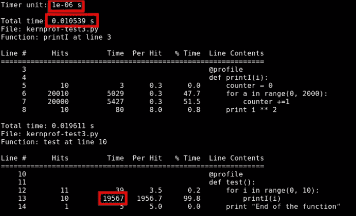

    前面的截图展示了这个例子。根据分析器，`printI` 函数耗时 `0.010539` 秒。然而，在 `test` 函数内部，似乎总共花费了 `19567` 个计时器单位，相当于 `0.019567` 秒。

+   **列表推导式行在报告中命中次数远多于应有的数量**：这基本上是因为报告在表达式中每迭代一次就增加一个命中。以下是一个例子：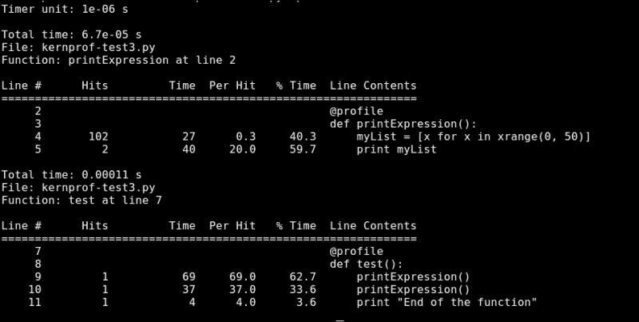

你可以看到实际的代码行有 `102` 次命中，每次调用 `printExpression` 函数时命中 `2` 次，其余 `100` 次是由于使用的范围导致的。

## 分析示例

现在我们已经了解了如何使用 `line_profiler` 和 `kernprof` 的基础知识，让我们通过更有趣的例子来实际操作。

### 回到斐波那契数列

是的，让我们再次分析我们的原始斐波那契代码。比较两个分析器的输出将有助于了解它们的工作方式。

让我们先看看这个新分析器的输出：

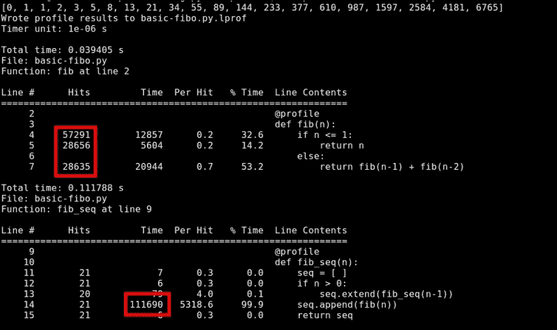

在报告中的所有数字中，我们可以放心，计时并不是问题。在 `fib` 函数内部，没有任何一行代码耗时过长（也不应该）。在 `fib_seq` 中，只有一行，但这是因为 `fib` 函数内部的递归导致的。

因此，我们的问题（正如我们已经知道的）是递归和执行 `fib` 函数的次数（确切地说，是 57,291 次）。每次我们进行函数调用，解释器都必须通过名称进行查找然后执行函数。每次我们调用 `fib` 函数，就会再调用两个函数。

第一个想到的是降低递归调用的次数。我们可以将其重写为迭代版本，或者像之前那样通过添加缓存的装饰器进行快速修复。我们可以在以下报告中看到结果：

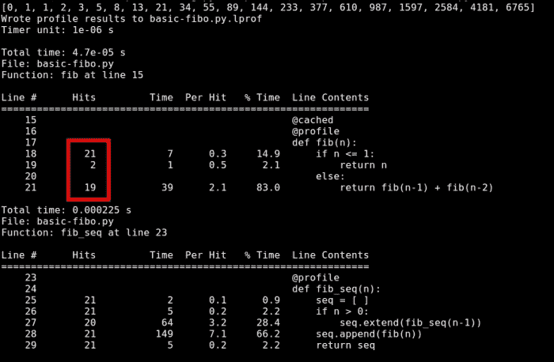

`fib` 函数的命中次数从 57,291 次减少到 `21`。这又是一个证明，在这个情况下，缓存的装饰器是一个很好的优化。

### 倒排索引

我们不再重复第二个例子，而是看看另一个问题：创建倒排索引 ([`en.wikipedia.org/wiki/inverted_index`](http://en.wikipedia.org/wiki/inverted_index))。

倒排索引是许多搜索引擎用来同时查找多个文件中单词的资源。它们的工作方式是预先扫描所有文件，将它们的内容分割成单词，然后保存这些单词与文件之间的关系（有些甚至保存单词的位置）。这样，当对特定单词进行搜索时，搜索时间可以达到`O(1)`（常数）。

让我们看看一个简单的例子：

```py
//With these files:
file1.txt = "This is a file"
file2.txt = "This is another file"
//We get the following index:
This, (file1.txt, 0), (file2.txt, 0)
is, (file1.txt, 5), (file2.txt, 5)
a, (file1.txt, 8)
another, (file2.txt, 8)
file, (file1.txt, 10), (file2.txt, 16)
```

因此，如果我们现在要查找单词`file`，我们知道它在两个文件中（在不同的位置）。让我们看看计算这个索引的代码（再次，以下代码的目的是展示经典的改进机会，所以请继续跟随我们，直到我们看到代码的优化版本）：

```py
#!/usr/bin/env python

import sys
import os
import glob

def getFileNames(folder):
  return glob.glob("%s/*.txt" % folder)

def getOffsetUpToWord(words, index):
  if not index:
    return 0
    subList = words[0:index]
    length = sum(len(w) for w in subList)
    return length + index + 1

def getWords(content, filename, wordIndexDict):
  STRIP_CHARS = ",.\t\n |"
  currentOffset = 0

  for line in content:
    line = line.strip(STRIP_CHARS)
    localWords = line.split()
    for (idx, word) in enumerate(localWords):
      word = word.strip(STRIP_CHARS)
      if word not in wordIndexDict:
        wordIndexDict[word] = []

      line_offset = getOffsetUpToWord(localWords, idx) 
      index = (line_offset) + currentOffset
      currentOffset = index 
      wordIndexDict[word].append([filename, index])

  return wordIndexDict

def readFileContent(filepath):
    f = open(filepath, 'r')
    return f.read().split( ' ' )

def list2dict(list):
  res = {}
  for item in list:
    if item[0] not in res:
      res[item[0]] = []
    res[item[0]].append(item[1])
  return res

def saveIndex(index):
  lines = []
  for word in index:
    indexLine = ""
    glue = ""
    for filename in index[word]:
      indexLine += "%s(%s, %s)" % (glue, filename, ','.join(map(str, index[word][filename])))
     glue = ","
    lines.append("%s, %s" % (word, indexLine))

  f = open("index-file.txt", "w")
  f.write("\n".join(lines))
  f.close()

def __start__():
  files = getFileNames('./files')
  words = {}
  for f in files:
    content = readFileContent(f)
    words = getWords(content, f, words)
  for word in (words):
    words[word] = list2dict(words[word])
  saveIndex(words)

__start__()
```

前面的代码尽可能简单。它能够处理简单的`.txt`文件，这正是我们目前想要的。它将加载文件文件夹内的所有`.txt`文件，将它们的内容分割成单词，并计算这些单词在文档中的偏移量。最后，它将所有这些信息保存到一个名为`index-file.txt`的文件中。

因此，让我们开始分析并看看我们能得到什么。由于我们并不确切知道哪些是重负载函数，哪些是轻负载函数，让我们给所有这些函数都添加`@profile`装饰器并运行分析器。

#### getOffsetUpToWord

`getOffsetUpToWord`函数看起来是一个很好的优化候选，因为它在执行过程中被调用了好几次。我们现在暂时保留这个装饰器。

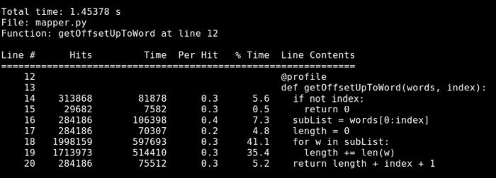

#### getWords

`getWords`函数做了很多处理。它甚至有两个嵌套的`for`循环，所以我们也保留这个装饰器。

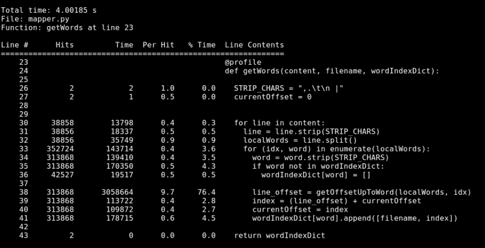

#### list2dict

`list2dict`函数负责获取包含两个元素的数组列表，并返回一个字典，使用数组项的第一个元素作为键，第二个元素作为值。我们现在暂时保留`@profile`装饰器。

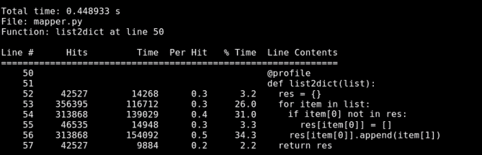

#### readFileContent

`readFileContent`函数有两行，其中重要的一行只是简单地调用文件内容的`split`方法。这里没有太多可以改进的地方，所以我们将它排除，并专注于其他函数。

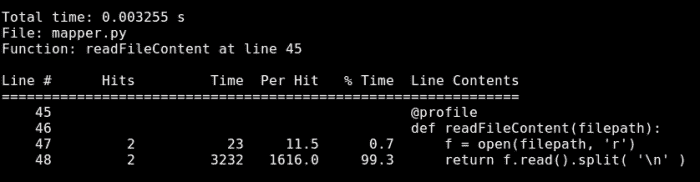

#### saveIndex

`saveIndex`函数将处理结果写入文件，使用特定的格式。我们也许能在这里得到一些更好的数字。

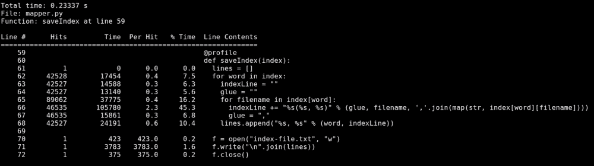

#### __start__

最后，主方法`__start__`负责调用其他函数，并没有做太多繁重的工作，所以我们也将其排除在外。

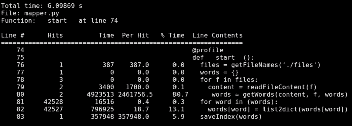

那么，让我们总结一下。我们最初有六个函数，其中我们排除了两个，因为它们太简单或者根本就没有做任何相关的事情。现在，我们总共有四个函数需要审查和优化。

#### getOffsetUpToWord

首先让我们看看`getOffsetUpToWord`函数，对于如此简单的任务——即计算到当前索引为止的单词长度之和——它却有很多行代码。可能存在一种更 Pythonic 的方式来处理这个问题，所以让我们试试看。

这个函数原本占用了总执行时间的 1.4 秒，所以让我们尝试通过简化代码来降低这个数字。单词长度的累加可以转换成一个 reduce 表达式，如下所示：

```py
def getOffsetUpToWord(words, index):
  if(index == 0):
    return 0
  length =  reduce(lambda curr, w: len(w) + curr, words[0:index], 0)
  return length + index + 1
```

这种简化消除了进行变量赋值和查找额外时间的需要。这看起来可能不多。然而，如果我们用这段新代码再次运行性能分析器，时间会降低到 0.9 秒。这个实现仍然有一个明显的缺点：lambda 函数。我们每次调用`getOffsetUpToWord`时都会动态创建一个函数。我们调用了 313,868 次，所以最好提前创建这个函数。我们可以在 reduce 表达式中添加对这个函数的引用，如下所示：

```py
def addWordLength(curr, w):
  return len(w) + curr

@profile
def getOffsetUpToWord(words, index):
  if not index:
    return 0
  length = reduce(addWordLength, words[0:index], 0)
  return length + index + 1
```

输出应该类似于以下截图：

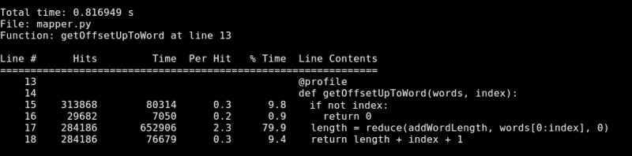

通过这个小小的改进，执行时间降低到了 0.8 秒。在先前的截图上，我们可以看到函数的前两行仍然有大量的不必要的调用（因此耗时）。这个检查是不必要的，因为 reduce 函数默认就是 0。最后，可以移除对长度变量的赋值，并直接返回长度、索引和整数 1 的总和。

这样一来，我们剩下的代码如下：

```py
def addWordLength(curr, w):
  return len(w) + curr

@profile
def getOffsetUpToWord(words, index):
  return reduce(addWordLength, words[0:index], 0) + index + 1
```

这个函数的总执行时间从 1.4 秒降低到了惊人的 0.67 秒。

#### getWords

接下来，我们转向下一个函数：`getWords`函数。这是一个相当慢的函数。根据截图，这个函数的执行时间达到了 4 秒。这可不是什么好事。让我们看看我们能做些什么。首先，这个函数中最耗时的（耗时最多的）一行是调用`getOffsetUpToWord`函数的那一行。由于我们已经优化了那个函数，所以现在这个函数的总执行时间已经降低到了 2.2 秒（从 4 秒减少）。

这是一个相当不错的副作用优化，但我们还可以为这个函数做更多。我们使用普通的字典作为`wordIndexDict`变量，因此我们必须在使用之前检查键是否已设置。在这个函数中进行这个检查大约需要 0.2 秒。这虽然不多，但也是一种优化。为了消除这个检查，我们可以使用`defaultdict`类。它是`dict`类的一个子类，它增加了一个额外的功能。它为键不存在时设置一个默认值。这将消除函数内部 0.2 秒的需要。

另一个微不足道但很有帮助的优化是将结果赋值给变量。这看起来可能微不足道，但做 313,868 次无疑会损害我们的性能。所以，看看这些行：

```py
    35    313868      1266039      4.0     62.9        line_offset = getOffsetUpToWord(localWords, idx) 
    36    313868       108729      0.3      5.4        index = (line_offset) + currentOffset
    37    313868       101932      0.3      5.1        currentOffset = index 
```

这些行可以简化为单行代码，如下所示：

```py
      currentOffset = getOffsetUpToWord(localWords, idx) + currentOffset
```

通过这样做，我们节省了另外 0.2 秒。最后，我们在每一行和每个单词上执行了 strip 操作。我们可以通过在加载文件时多次调用`replace`方法来简化这一点，以处理我们将要处理的文本，并从`getWords`函数内部的查找和调用方法中移除额外的时间。

新代码看起来像这样：

```py
def getWords(content, filename, wordIndexDict):
  currentOffset = 0
  for line in content:
    localWords = line.split()
    for (idx, word) in enumerate(localWords):
      currentOffset = getOffsetUpToWord(localWords, idx) + currentOffset
      wordIndexDict[word].append([filename, currentOffset])])])
  return wordIndexDict
```

运行时间仅需 1.57 秒。还有一个额外的优化我们可能想看看。它适用于这个特定情况，因为`getOffsetUpToWord`函数只在一个地方使用。由于这个函数简化为了一行代码，我们只需将这一行代码放在函数调用的位置。这一行代码将减少查找时间，给我们带来 1.07 秒的巨大提升（这是 0.50 秒的减少！）。这就是最新版本的函数看起来是这样的：

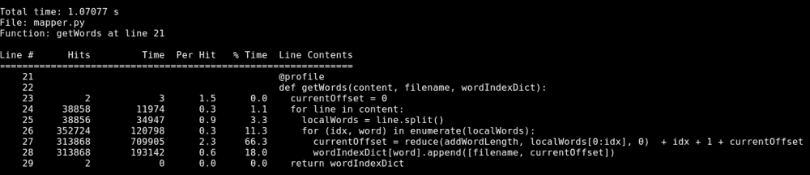

如果你将从多个地方调用该函数，这可能是一个不值得拥有的优化，因为它会损害代码的可维护性。在开发过程中，代码的可维护性也是一个重要的方面。在尝试确定何时停止优化过程时，它应该是一个决定性因素。

#### list2dict

接下来，对于`list2dict`函数，我们实际上无法做太多，但我们可以清理它以获得更易读的代码，并节省大约 0.1 秒。再次强调，我们这样做不是为了速度的提升，而是为了可读性的提升。我们有再次使用`defaultdict`类的机会，并移除对键的检查，使新代码看起来像这样：

```py
def list2dict(list):
  res = defaultdict(lambda: [])
  for item in list:
    res[item[0]].append(item[1])
  return res
```

上述代码行数较少，更易于阅读，也更容易理解。

#### saveIndex

最后，让我们来看看`saveIndex`函数。根据我们的初步报告，这个函数预处理并保存数据到索引文件需要 0.23 秒。这已经是一个相当不错的数字了，但我们可以通过再次审视所有的字符串连接来做得更好。

在保存数据之前，对于每个生成的单词，我们通过连接几个部分来生成一个字符串。在同一个循环中，我们还将重置`indexLine`和`glue`变量。这些操作将花费很多时间，所以我们可能想要改变我们的策略。

这在以下代码中显示：

```py
def saveIndex(index):
  lines = []
  for word in index:
    indexLines = []
    for filename in index[word]:
      indexLines.append("(%s, %s)" % (filename, ','.join(index[word][filename])))
    lines.append(word + "," +  ','.join(indexLines))

  f = open("index-file.txt", "w")
  f.write("\n".join(lines))
  f.close()
```

如前述代码所示，我们改变了整个`for`循环。现在，我们不再将新字符串添加到`indexLine`变量中，而是将其追加到列表中。我们还移除了确保在`join`调用期间处理字符串的`map`调用。那个`map`被移动到`list2dict`函数中，在追加时直接将索引转换为字符串。

最后，我们使用了`+`运算符来连接字符串，而不是执行更昂贵的字符串展开操作。最终，这个函数的速度从 0.23 秒下降到 0.13 秒，给我们带来了 0.10 秒的速度提升。

# 摘要

总结一下，我们看到了两种在 Python 中使用的主要分析器：`cProfile`，它是语言自带的功能，以及`line_profiler`，它让我们有机会独立查看每一行代码。我们还介绍了使用它们进行分析和优化的几个示例。

在下一章中，我们将探讨一系列视觉工具，这些工具将通过以图形方式展示本章中涵盖的相同数据来帮助我们完成工作。
