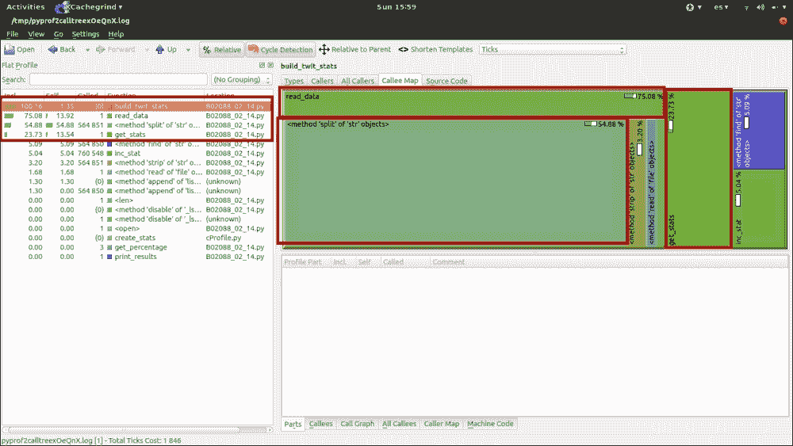

# 第三章。可视化——用于理解性能分析器输出的 GUI

尽管我们在上一章已经介绍了性能分析，但我们所经历的过程就像在黑暗中行走，或者至少是在光线非常微弱的地方。我们一直在看数字。基本上，我们一直在尝试减少命中次数、秒数或其他类似的数字。然而，根据我们所拥有的表示，很难理解这些数字之间的关系。

基于该输出，我们无法轻易地看到我们系统的整体蓝图。如果我们的系统更大，那么看到这个蓝图将会更加困难。

简单地因为我们是人类，而不是计算机本身，所以我们有某种视觉辅助时工作得更好。在这种情况下，如果我们能更好地理解一切是如何相互关联的，我们的工作将受益匪浅。为此，我们有工具可以提供我们在上一章看到的数字的视觉表示。这些工具将为我们提供急需的帮助。反过来，我们将能够更快地定位和修复我们系统的瓶颈。作为额外的奖励，我们将更好地理解我们的系统。

在本章中，我们将介绍属于这一类别的两个工具：

+   **KCacheGrind / pyprof2calltree**: 这个组合将使我们能够将`cProfile`的输出转换为 KCacheGrind 所需的格式，这反过来将帮助我们可视化信息。

+   **RunSnakeRun** ([`www.vrplumber.com/programming/runsnakerun/`](http://www.vrplumber.com/programming/runsnakerun/)): 此工具将使我们能够可视化和分析`cProfile`的输出。它提供了方格图和可排序的列表，以帮助我们完成任务。

对于每一个，我们将介绍安装和 UI 解释的基础知识。然后，我们将从第二章 *性能分析器*中获取示例，并根据这些工具的输出重新分析它们。

# KCacheGrind – pyprof2calltree

我们将看到的第一个 GUI 工具是 KCacheGrind。它是一个数据可视化工具，旨在解析和显示不同格式的性能分析数据。在我们的案例中，我们将显示`cProfile`的输出。然而，为了做到这一点，我们还需要命令行工具`pyprof2calltree`的帮助。

此工具是对一个非常受欢迎的工具`lsprofcalltree.py`([`people.gnome.org/~johan/lsprofcalltree.py`](https://people.gnome.org/~johan/lsprofcalltree.py))的重新命名。它试图更像 Debian 中的`kcachegrind-converter`([`packages.debian.org/en/stable/kcachegrind-converters`](https://packages.debian.org/en/stable/kcachegrind-converters))包。我们将使用此工具将`cProfile`的输出转换为 KCacheGrind 可以理解的内容。

## 安装

要安装`pyprof2calltree`，您首先需要安装`pip`命令行工具。然后，只需使用以下命令：

```py
$ pip install pyprof2calltree

```

注意，所有安装步骤和说明都是针对 Ubuntu 14.04 Linux 发行版的，除非另有说明。

现在，对于 KCacheGrind 来说，安装略有不同。可视化器是 KDE 桌面环境的一部分，所以如果你已经安装了它，那么你很可能也已经安装了 KCacheGrind。然而，如果你没有安装它（也许你是 Gnome 用户），你只需使用你的包管理器并安装它。例如，在 Ubuntu 上，你会使用以下命令：

```py
$ sudo apt-get install kcachegrind

```

### 注意

使用这个命令，你可能需要安装很多与实用程序不直接相关的包，而是与 KDE 相关。因此，安装可能需要一些时间，这取决于你的互联网连接。

对于 Windows 和 OS X 用户，有一个选项可以安装 KCacheGrind 的 QCacheGrind 分支，它已经预编译并可以作为二进制文件安装。

Windows 用户可以从 [`sourceforge.net/projects/qcachegrindwin/`](http://sourceforge.net/projects/qcachegrindwin/) 下载，而 OS X 用户可以使用 brew 安装：

```py
$ brew install qcachegrind

```

## 使用方法

使用 `pyprof2calltree` 有两种方式：一种是从命令行传递参数，另一种是直接从 **读取-评估-打印循环**（**REPL**）（甚至是从我们自己的被分析脚本中）。

第一个（命令行版本）在我们已经将分析结果存储在某个地方时非常有用。因此，使用这个工具，我们只需运行以下命令，并在需要时获取输出：

```py
$ pyprof2calltree -o [output-file-name] -i input-file.prof

```

有一些可选参数，它们可以帮助我们在不同情况下。其中两个在这里进行了说明：

+   `-k`：如果我们想立即在输出数据上运行 KCacheGrind，这个选项会为我们完成

+   `-r`：如果我们还没有将分析数据保存到文件中，我们可以使用这个参数传入我们将用来收集这些数据的 Python 脚本

现在，如果你想从 REPL 中使用它，你可以简单地从 `pyprof2calltree` 包中导入（或同时导入）`convert` 函数或 `visualize` 函数。第一个会将数据保存到文件中，而第二个会使用分析器的输出启动 KCacheGrind。

这里有一个例子：

```py
from xml.etree import ElementTree
from cProfile import Profile
import pstats
xml_content = '<a>\n' + '\t<b/><c><d>text</d></c>\n' * 100 + '</a>'
profiler = Profile()
profiler.runctx(
"ElementTree.fromstring(xml_content)",
locals(), globals())

from pyprof2calltree import convert, visualize
stats = pstats.Stats(profiler)
visualize(stats)      # run kcachegrind
```

这段代码将调用 KCacheGrind。它将显示类似于以下屏幕截图中的内容：


在前面的屏幕截图中，你可以看到左侧的列表（**1**）显示了我们在上一章中看到的一些数字。在右侧（**2**），我们选择了一个标签，具体是 **调用图** 标签。它显示了一系列盒子，代表从左侧选中的函数调用到最底层的层次结构。

在左侧的列表中，有两个列我们需要特别注意：

+   **包含（从包含时间）列**：这显示了每个函数在总体上花费的时间的指标。这意味着它加上其代码花费的时间以及它调用的其他函数花费的时间。如果一个函数在这个列中有很高的数字，这并不一定意味着函数花费了很长时间。这可能意味着它调用的函数花费了很长时间。

+   **自我列**：这显示了在特定函数内部花费的时间，不考虑它调用的函数。所以，如果一个函数有很高的**自我**值，那么这可能意味着在它内部花费了很多时间，这是一个寻找优化路径的好起点。

另一个有用的视图是**调用图**，一旦在列表中选择了一个函数，就可以在右下角的框中找到。它将显示函数的表示，有助于解释每个函数是如何调用下一个函数的（以及调用的次数）。以下是从前面的代码中的一个示例：


## 剖析示例 - TweetStats

现在，让我们回到第二章，*剖析器*的例子，并使用`pyprof2calltree`/`kcachegrind`组合来处理它们。

让我们避免斐波那契示例，因为它们相当简单，而且我们已经讨论过了。所以，让我们直接跳到 TweetStats 模块的代码。它将读取一系列推文并从中获取一些统计数据。我们不会修改代码。所以，仅供参考，请查看第二章，*剖析器*。

至于使用类并打印实际统计信息的脚本，我们正在修改它以保存统计信息。正如你所看到的，这是一个非常简单的更改：

```py
import cProfile
import pstats
import sys

from tweetStats import build_twit_stats

profiler = cProfile.Profile()
profiler.enable()

build_twit_stats()
profiler.create_stats()
stats = pstats.Stats(profiler)
stats.strip_dirs().sort_stats('cumulative').dump_stats('tweet-stats.prof') #saves the stats into a file called tweet-stats.prof, instead of printing them into stdout

```

现在，将统计数据保存到`tweet-stats.prof`文件中后，我们可以使用以下命令一次性转换它并启动可视化器：

```py
$pyprof2calltree -i tweet-stats.prof -k

```

这反过来会显示类似以下截图的内容：



再次，当在列表中选择第一个函数调用时，选择**调用图**，我们可以看到我们脚本的整个图。它清楚地显示了瓶颈在哪里（右侧最大的块）：`read_data`，`split`方法和地图最右边的`get_data`函数。

在地图的`get_stats`部分，我们可以看到有两个函数构成了部分大小：来自字符串的`inc_stat`和`find`。我们从代码中知道第一个函数。这个函数做得很少，所以它的大小将完全归因于累积的查找时间（毕竟我们调用它大约 760k 次）。对于`find`方法也是同样的情况。我们调用它的次数太多，所以查找时间累积起来，开始变得引人注目。因此，让我们对这个函数应用一系列非常简单的改进。让我们移除`inc_stat`函数并将其内联。同时，让我们更改`find`方法行并使用 in 运算符。结果将类似于这个截图所示：:


地图的另一侧发生了巨大变化。现在，我们可以看到`get_stats`函数不再调用其他函数，因此查找时间被移除。现在它只代表总执行时间的 9.45%，而之前是 23.73%。

是的，前面的结论与我们在上一章中得出的结论相同，但我们使用的是不同的方法。那么，让我们继续进行之前所做的相同优化，看看地图又发生了什么变化：


在前面的截图中，我们可以看到通过选择左侧列表中的`build_twitt_stats`函数，被调用的函数仅仅是字符串对象的方法。

很遗憾，KCacheGrind 没有显示执行的总时间。然而，地图清楚地表明我们无论如何已经简化并优化了我们的代码。

## 一个性能分析示例 – 倒排索引

再次，让我们从第二章，*分析器*，中获取另一个例子：倒排索引。让我们更新其代码以生成统计数据并将其保存到文件中，以便我们稍后可以用 KCacheGrind 分析它。

我们唯一需要更改的是文件的最后一行，而不是仅仅调用`__start__`函数。我们有以下代码：

```py
profiler = cProfile.Profile()
profiler.enable()
__start__()
profiler.create_stats()
stats = pstats.Stats(profiler)
stats.strip_dirs().sort_stats('cumulative').dump_stats('inverted-index-stats.prof')
```

现在，执行脚本将数据保存到`inverted-index-stats.prof`文件中。稍后，我们可以使用以下命令启动 KCacheGrind：

```py
$ pyprof2calltree -i inverted-index-stats.prof -k

```

这是我们首先看到的：


让我们先根据左侧的第二列（**Self**）对左侧的函数进行重新排序。这样，我们可以查看由于代码原因（而不是因为调用的函数运行时间较长）执行时间最长的函数。我们将得到以下列表：


根据前面的列表，目前最成问题的两个函数是`getWords`和`list2dict`。

第一个可以通过以下几种方式改进：

+   `wordIndexDict`属性可以更改为`defaultdict`类型，这将移除检查现有索引的`if`语句

+   可以从`readFileContent`函数中移除 strip 语句，从而简化我们这里的代码

+   可以移除很多赋值操作，因此避免在这些操作中浪费毫秒，因为我们可以直接使用这些值

因此，我们新的`getWords`函数看起来是这样的：

```py
def getWords(content, filename, wordIndexDict):
  currentOffset = 0
  for line in content:
    localWords = line.split()
    for (idx, word) in enumerate(localWords):
      currentOffset = getOffsetUpToWord(localWords, idx) + currentOffset 
      wordIndexDict[word].append([filename, currentOffset])
  return wordIndexDict
```

现在，如果我们再次运行统计，映射和数字看起来略有不同：


因此，我们的函数现在使用的时间更少了，无论是总体上（**Incl.**列）还是内部（**Self**列）。然而，在离开这个函数之前，我们可能还想关注另一个细节。`getWords`函数总共调用了`getOffsetUpToWord` **141,295**次，仅查找时间就足以值得审查。那么，让我们看看我们能做什么。

我们已经在前面的章节中解决了这个问题。我们看到了可以将整个`getOffsetUpToWord`函数简化为一行，我们可以在稍后直接将其写入`getWords`函数中，以避免查找时间。考虑到这一点，让我们看看我们的新映射是什么样的：


现在，我们的总体时间有所增加，但不用担心。这是因为现在我们有一个函数可以分散时间，所以所有其他函数的数字都发生了变化。然而，我们真正关心的是（**Self**时间），下降了大约 4%。

前面的截图还显示了**调用图**视图，它帮助我们看到，尽管我们进行了改进，但`reduce`函数仍然被调用了超过**100,000**次。如果你查看`getWords`函数的代码，你会注意到我们实际上并不需要`reduce`函数。这是因为每次调用时，我们都在前一次调用的所有数字上加上一个，所以我们可以将以下代码简化：

```py
def getWords(content, filename, wordIndexDict):
  currentOffset = 0
  prevLineLength = 0
  for lineIndex, line in enumerate(content):
    lastOffsetUptoWord = 0
    localWords = line.split()

    if lineIndex > 0:
      prevLineLength += len(content[lineIndex - 1]) + 1
    for idx, word in enumerate(localWords):
      if idx > 0:
        lastOffsetUptoWord += len(localWords[idx-1])
      currentOffset = lastOffsetUptoWord + idx +  1 + prevLineLength

      wordIndexDict[word].append([filename, currentOffset])
```

在对函数进行最后的润色后，数字又发生了变化：


函数的总耗时显著降低，所以总的来说，这个函数现在执行所需的时间更少了（这正是我们的目标）。内部时间（**Self**列）有所下降，这是一个好现象。这是因为这也意味着我们在更短的时间内完成了同样的工作（特别是因为我们知道我们没有调用任何其他函数）。

# RunSnakeRun

RunSnakeRun 是另一个 GUI 工具，帮助我们可视化性能分析输出，进而帮助我们理解它。这个特定项目是 KCacheGrind 的简化版本。虽然后者对 C 和 C++开发者也有用，但 RunSnakeRun 是专门为 Python 开发者设计和编写的。

之前，使用 KCacheGrind，如果我们想绘制`cProfile`的输出，我们需要一个额外的工具（`pyprof2calltree`）。这次我们不需要。RunSnakeRun 知道如何解释并显示它，所以我们只需要调用它并传入文件路径。

此工具提供以下功能：

+   可排序的数据网格视图，具有如下字段：

    +   函数名称

    +   总调用次数

    +   累计时间

    +   文件名和行号

+   函数特定信息，例如此函数的所有调用者和所有被调用者

+   调用树平方图，大小与每个函数内花费的时间成比例

## 安装

为了安装此工具，您必须确保几个依赖项已覆盖，主要是以下这些：

+   Python 分析器

+   wxPython（2.8 或更高版本）([`www.wxpython.org/`](http://www.wxpython.org/))

+   Python（当然！）2.5 或更高版本，但低于 3.x

您还需要安装`pip` ([`pypi.python.org/pypi/pip`](https://pypi.python.org/pypi/pip))，以便运行安装命令。

因此，在继续之前，请确保您已经安装了所有这些。如果您使用的是基于 Debian 的 Linux 发行版（例如 Ubuntu），您可以使用以下行来确保您拥有所需的一切（假设您已经安装了 Python）：

```py
$ apt-get install python-profiler python-wxgtk2.8 python-setuptools

```

### 注意

Windows 和 OS X 用户需要为之前提到的每个依赖项找到当前 OS 版本的正确预编译的二进制文件。

之后，您只需运行以下命令：

```py
$ pip install  SquareMap RunSnakeRun

```

之后，您应该可以开始使用了。

## 使用方法

现在，为了快速向您展示如何使用它，让我们回到之前的最后一个示例：`inverted-index.py`。

让我们使用`cProfile`分析器作为参数执行该脚本，并将输出保存到文件中。然后，我们只需调用`runsnake`并传入文件路径：

```py
$ python -m cProfile -o inverted-index-cprof.prof inverted-index.py
$ runsnake inverted-index-cprof.prof

```

这将生成以下截图：


从前面的截图，您可以看到三个主要感兴趣的区域：

+   可排序的列表，其中包含`cProfile`返回的所有数字

+   函数特定信息部分，其中包含几个有趣的标签，例如**被调用者**、**调用者**和**源代码**标签

+   平方地图部分，它以图形方式表示执行调用树

### 注意

GUI 的一个很棒的小功能是，如果您将鼠标悬停在左侧列表中的函数上，它会在右侧突出显示相关的框。如果您将鼠标悬停在右侧的框上，同样会发生这种情况；列表中的对应条目将被突出显示。

## 分析示例 – 最低公共乘数

让我们看看一个非常基础、不实用的函数优化示例，以及使用此 GUI 会是什么样子。

我们的示例函数负责找到两个数字之间的最小公倍数。这是一个相当基本的例子：你可以在互联网上找到很多。然而，这也是开始了解这个 UI 的好地方。

函数的代码如下：

```py
def lowest_common_multiplier(arg1, arg2):
    i = max(arg1, arg2)
    while i < (arg1 * arg2):
        if i % min(arg1,arg2) == 0:
            return i
        i += max(arg1,arg2)
    return(arg1 * arg2)

print lowest_common_multiplier(41391237, 2830338)
```

我很确信你只需看一眼就能找到每一个可能的优化点，但请跟我一起。让我们分析这个家伙，并将结果输出加载到 RunSnakeRun 中。

因此，要运行它，请使用以下命令：

```py
$ python -m cProfile -o lcm.prof lcm.py

```

要启动 GUI，请使用以下命令：

```py
$ runsnake lcm.prof

```

这是我们得到的结果：


我们之前没有提到的一件事，但它是正方形映射的一个很好的附加功能，是每个框的名称旁边我们可以看到运行该函数所需的时间。

因此，乍一看，我们可以发现几个问题：

+   我们可以看到，`max`和`min`函数总共只占用了我们函数运行时间的 0,228 秒，而我们的函数运行总时间是 0,621 秒。所以，我们的函数不仅仅是`max`和`min`。

+   我们还可以看到，`max`和`min`函数都被调用了**943,446**次。无论查找时间有多小，如果你几乎调用了 100 万次函数，这将会累积起来。

让我们对我们的代码进行一些明显的修复，并再次通过“蛇之眼”看看它：

```py
def lowest_common_multiplier(arg1, arg2):
    i = max(arg1, arg2)
    _max = i
    _min = min(arg1,arg2)
    while i < (arg1 * arg2):
        if i % _min == 0:
            return i
        i += _max
    return(arg1 * arg2)

print lowest_common_multiplier(41391237, 2830338)
```

你应该得到以下截图所示的内容：


现在，`min`和`max`甚至没有在正方形映射上注册。这是因为我们只调用了一次，函数从 0.6 秒减少到 0.1 秒。这就是不进行不必要的函数查找的力量。

现在，让我们看看另一个更复杂、因此更有趣、急需优化的函数。

## 倒排索引的搜索示例

自从上一章以来，我们已经从所有可能的角度分析了倒排索引的代码。这很好，因为我们已经从几个不同的角度和不同的方法进行了分析。然而，使用 RunSnakeRun 来分析它就没有意义了，因为这个工具与我们刚刚尝试的工具非常相似（KCacheGrind）。

因此，让我们使用倒排搜索脚本的输出，并自己编写一个使用该输出的搜索脚本。我们最初的目标是编写一个简单的搜索函数，它将只查找索引中的一个单词。步骤相当直接：

1.  将索引加载到内存中。

1.  搜索单词并获取索引信息。

1.  解析索引信息。

1.  对于每个索引条目，读取相应的文件，并获取周围的字符串作为结果。

1.  打印结果。

这是我们的代码的初始版本：

```py
import re
import sys

#Turns a list of entries from the index file into a dictionary indexed
#by words
def list2dict(l):
  retDict = {}
  for item in l:
    lineParts = item.split(',')
    word = lineParts.pop(0)
    data = ','.join(lineParts)
    indexDataParts = re.findall('\(([a-zA-Z0-9\./, ]{2,})\)' ,data)
    retDict[word] = indexDataParts
  return retDict

#Load the index's content into memory and parse itdef loadIndex():
  indexFilename = "./index-file.txt"
  with open(indexFilename, 'r') as fh: 
    indexLines = []
    for line in fh:
      indexLines.append(line)
    index = list2dict(indexLines)

    return index

#Reads the content of a file, takes care of fixing encoding issues with utf8 and removes unwanted characters (the ones we didn't want when generating the index)
def readFileContent(filepath):
    with open(filepath, 'r') as f:
    return [x.replace(",", "").replace(".","").replace("\t","").replace("\r","").replace("|","").strip(" ") for x in f.read().decode("utf-8-sig").encode("utf-8").split( '\n' )]
def findMatch(results):
  matches = []
  for r in results:
    parts = r.split(',')
    filepath = parts.pop(0)
    fileContent = ' '.join(readFileContent(filepath))
    for offset in parts:
      ioffset = int(offset)
      if ioffset > 0:
        ioffset -= 1
      matchLine = fileContent[ioffset:(ioffset + 100)]
      matches.append(matchLine)
  return matches

#Search for the word inside the index
def searchWord(w):
  index = None
  index = loadIndex()
  result = index.get(w)
  if result:
    return findMatch(result)
  else:
      return []

#Let the user define the search word...
searchKey = sys.argv[1] if len(sys.argv) > 1 else None
if searchKey is None: #if there is none, we output a usage message
 print "Usage: python search.py <search word>"
else: #otherwise, we search
  results = searchWord(searchKey)
  if not results:
      print "No results found for '%s'" % (searchKey)
  else:
      for r in results:
      print r
```

要运行代码，只需运行以下命令：

```py
$ python -m cProfile -o search.prof search.py John

```

我们将得到的输出类似于以下截图（假设我们在`files`文件夹中有几本书）：


我们可以通过突出显示搜索词或显示一些上下文中的前缀词来改进输出。然而，我们暂时就这样进行。

现在，让我们看看在`RunSnakeRun`中打开`search.prof`文件时我们的代码看起来如何：


与我们之前示例中的最低公倍数相比，这里有很多框。然而，让我们先看看从第一眼就能得到的见解。

两个耗时最长的函数是`loadIndex`和`list2dict`，紧接着是`readFileContent`。我们可以在左侧列中看到这一点：

+   所有这些函数实际上大部分时间都是在它们调用的其他函数内部度过的。所以，它们的累积时间很高，但它们的局部时间却相对较低。

+   如果我们按局部时间对列表进行排序，我们会看到前五个函数是：

    +   文件对象的`read`方法

    +   `loadIndex`函数

    +   `list2dict`函数

    +   正则表达式对象的`findAll`方法

    +   以及`readFileContent`函数

因此，让我们首先看看`loadIndex`函数。尽管它的大部分时间是在`list2dict`函数内部度过的，但我们仍然有一个小的优化要做，这将简化其代码并显著减少其局部时间：

```py
def loadIndex():
  indexFilename = "./index-file.txt"
  with open(indexFilename, 'r') as fh:
    #instead of looping through every line to append it into an array, we use the readlines method which does that already
    indexLines = fh.readlines()
    index = list2dict(indexLines)
    return index
```

这个简单的更改将函数的局部时间从 0.03 秒降低到 0.00002 秒。尽管它之前并不是一个大问题，但我们提高了其可读性并改善了其性能。所以，总的来说，我们做得不错。

现在，根据最后的分析，我们知道在这个函数内部花费的大部分时间实际上是在它调用的另一个函数内部度过的。所以，现在我们已经基本上将其局部时间降低到几乎为零，我们需要关注我们的下一个目标：`list2dict`。

然而，首先，让我们看看通过我们之前所做的简单改进，图片是如何变化的：


现在，让我们继续讨论`list2dict`函数。这个函数负责将索引文件的每一行解析成我们可以稍后使用的格式。它将解析索引文件的每一行，更具体地说，将其解析成一个以单词为索引的哈希表（或字典），这样当我们进行搜索时，平均搜索时间复杂度将是 O(1)。如果你不记得这是什么意思，可以回读至第一章，*性能分析 101*。

从我们的分析中，我们可以看出，尽管我们在函数内部花费了一些时间，但大部分的复杂性都集中在正则表达式方法中。正则表达式有很多优点，但有时我们倾向于在可以使用简单的 `split` 和 `replace` 函数的情况下过度使用它们。那么，让我们看看我们如何解析数据，在不使用正则表达式的情况下获得相同的输出，并看看我们是否能在更少的 `time:def list2dict(l)` 时间内完成：

```py
  retDict = {}
  for item in l:
    lineParts = item.split(',(')
    word = lineParts[0]
    ndexDataParts = [x.replace(")","") for x in lineParts[1:]]
  retDict[word] = indexDataParts
  return retDict
```

代码看起来已经更简洁了。没有任何地方使用正则表达式（这有时有助于可读性，因为并不是每个人都是阅读正则表达式的专家）。代码行数更少了。我们移除了 `join` 行，甚至去掉了不必要的 `del` 行。

然而，我们添加了一条列表解析行，但这只是对列表中的每个项目进行一行简单的 `replace` 方法，仅此而已。

让我们看看现在的映射看起来像什么：


好吧，确实有变化。如果你比较最后两个截图，你会注意到 `list2dict` 函数的框已经移动到了右边。这意味着它现在比 `readFileContent` 函数花费的时间更少。我们的函数框现在也更简单了。里面只有 `split` 和 `replace` 方法。最后，以防有任何疑问，让我们看看这些数字：

+   本地时间从 0.024 秒下降到 0.019 秒。本地时间没有大幅下降是有道理的，因为我们仍然在函数内部做所有的工作。这种下降主要是由于没有 `del` 行和 `join` 行。

+   总累计时间显著下降。它从 0.094 秒下降到 0.031 秒，这是由于缺乏用于这项工作的复杂函数（正则表达式）。

我们将函数的总累计时间降低到了原来的三分之一。所以，这是一个很好的优化，特别是考虑到如果我们有更大的索引，那么时间会更大。

### 注意

最后的假设并不总是正确的。它很大程度上取决于所使用的算法类型。然而，在我们的情况下，因为我们正在遍历索引文件的每一行，所以我们可以安全地假设它是正确的。

让我们快速查看代码的第一分析和最后分析中的数字，以便我们可以看到整体时间是否真的有所改进：


最后，正如你所看到的，我们的执行时间从原始代码的约 0.2 秒下降到了 0.072 秒。

这是代码的最终版本，所有之前做出的改进都整合在一起：

```py
import sys

#Turns a list of entries from the index file into a dictionary indexed
#by words
def list2dict(l):
  retDict = {}
  for item in l:
    lineParts = item.split(',(')
  word = lineParts[0]
    indexDataParts = [x.replace(")","") for x in lineParts[1:]]
  retDict[word] = indexDataParts
  return retDict

#Load the index's content into memory and parse it
def loadIndex():
  indexFilename = "./index-file.txt"
  with open(indexFilename, 'r') as fh:
    #instead of looping through every line to append it into an array, we use the readlines method which does that already
    indexLines = fh.readlines()
    index = list2dict(indexLines)
    return index

#Reads the content of a file, takes care of fixing encoding issues with utf8 and removes unwanted characters (the ones we didn't want when generating the index)#
def readFileContent(filepath):
    with open(filepath, 'r') as f:
    return [x.replace(",", "").replace(".","").replace("\t","").replace("\r","").replace("|","").strip(" ") for x in f.read().decode("utf-8-sig").encode("utf-8").split( '\n' )]

def findMatch(results):
  matches = []
  for r in results:
    parts = r.split(',')

    filepath = parts[0]
    del parts[0]
    fileContent = ' '.join(readFileContent(filepath))
    for offset in parts:
      ioffset = int(offset)
      if ioffset > 0:
        ioffset -= 1
      matchLine = fileContent[ioffset:(ioffset + 100)]
      matches.append(matchLine)
  return matches

#Search for the word inside the index
def searchWord(w):
  index = None
  index = loadIndex()
  result = index.get(w)
  if result:
    return findMatch(result)
  else:
    return []

#Let the user define the search word...
searchKey = sys.argv[1] if len(sys.argv) > 1 else None

if searchKey is None: #if there is none, we output a usage message
  print "Usage: python search.py <search word>"
else: #otherwise, we search
  results = searchWord(searchKey)
  if not results:
    print "No results found for '%s'" % (searchKey)
  else:
    for r in results:
    print r
```

# 摘要

总结来说，在本章中，我们介绍了 Python 开发者尝试理解由 `cProfile` 等分析器返回的数字时使用的两个最流行和常见的工具。我们用新的视角分析了旧代码。我们甚至分析了一些新代码。

在下一章中，我们将更详细地讨论优化问题。我们将涵盖一些我们在实践中已经看到的内容，以及一些在分析和优化代码时的良好实践建议。
