# 第六章. 通用优化选项

在不断追求掌握优化的道路上，我们首先在第四章*优化一切*中介绍了一些技巧和窍门。在第五章*多线程与多进程*中，我们讨论了两种主要的优化策略：多线程和多进程。我们看到了它们如何帮助我们以及何时使用它们。

最后，我们将处理 Python 语言（CPython）的许多实现之一。这意味着除了 CPython 之外还有其他替代方案。在本章中，我们将介绍其中的两个：

+   我们将介绍 PyPy，这是本书中一直使用的标准 Python 解释器的替代方案。这个版本是用 Python 编写的，并且比标准版本有一些优势。

+   我们将讨论 Cython，一个优化静态编译器，它将使我们能够轻松地编写 Python 代码并利用 C 和 C++的强大功能。

这两种替代方案都将为开发者提供以更优化方式运行代码的机会，当然，这取决于代码的特性。对于每个选项，我们将探讨它们究竟是什么，如何安装它们，以及一些示例代码来展示如何使用它们。

# PyPy

就像 CPython 是 Python 规范的官方实现，并且是用 C 语言编写的（当然），PyPy 是 Python 的另一种实现，适用于 2.x 和 3.x 版本。它试图模仿 RPython 语言的行为，RPython 是 Python 的一个静态类型限制版本。

PyPy 项目([`pypy.org/`](http://pypy.org/))是另一个名为 Psycho 的较老项目的延续，Psycho 是一个用 C 语言编写的 Python JIT 编译器。它在 32 位 Intel 处理器上工作得很好，但从未更新过。它的最新稳定版本是在 2007 年，因此现在已弃用。PyPy 在 2007 年通过其 1.0 版本接管了 Psycho。尽管最初被认为是一个研究项目，但随着时间的推移，它不断发展。最终，在 2010 年，发布了 1.4 版本。在这个版本中，人们对用 PyPy 编写的系统是生产就绪且与 Python 2.5 兼容的信心有所增加。

PyPy 的最新稳定版本，于 2014 年 6 月发布，版本为 2.5，它反过来与 Python 2.7 兼容。还有一个 PyPy3 的 beta 版本，正如预期的那样，是与 Python 3.x 兼容的 PyPy 版本。

我们将介绍 PyPy 作为我们脚本优化可行方法的原因是这些特性：

+   **速度**：PyPy 的主要特性之一是其相对于常规 Python 的速度提升。这得益于内置的**即时编译器**（**JIT**）。它提供了对静态编译代码的灵活性，因为它可以在执行时适应当前平台（处理器类型、操作系统版本等）。另一方面，静态编译程序可能需要一个可执行文件或每个单独的情况组合。

+   **内存**：使用 PyPy 执行内存消耗型脚本时，比使用常规 CPython 消耗的内存要少得多。

+   **沙盒**：PyPy 提供了一个沙盒环境，其中每个对外部 C 库的调用都被模拟。这些调用与处理实际策略的外部进程进行通信。尽管这个特性很有前景，但它仍然只是一个原型，需要更多的工作才能变得有用。

+   **无栈**：PyPy 也提供了一组与 Stackless Python 相当的语言功能（[`www.stackless.com/`](http://www.stackless.com/)）。有些人甚至认为它比后者更强大和灵活。

## 安装 PyPy

有几种方法可以将 PyPy 安装到您的系统中：

+   您可以直接从他们的页面下载二进制文件（[`pypy.org/download.html#default-with-a-jit-compiler`](http://pypy.org/download.html#default-with-a-jit-compiler)）。只需确保您下载了正确的文件，根据他们网站上链接旁边的操作系统指示即可。否则，有很大可能它不会在您的系统上运行：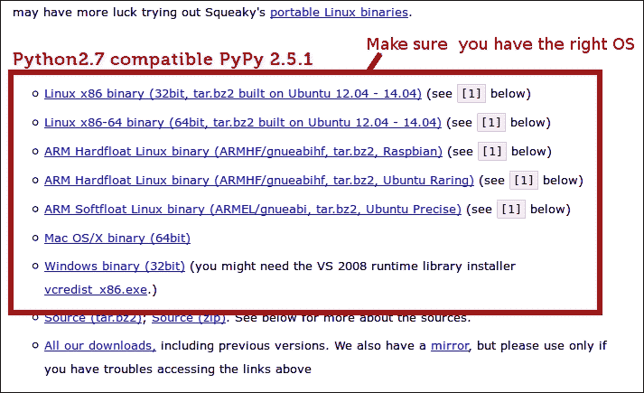

    如果您使用的是 Linux 发行版或 OS X，您可以检查其官方软件包仓库是否包含 PyPy 软件包。通常，像 Ubuntu、Debian、Homebrew、MacPorts、Fedora、Gentoo 和 Arch 这样的系统已经包含了它。对于 Ubuntu，您可以使用以下代码行：

    ```py
    $ sudo apt-get install pypy

    ```

+   最后，另一个选项是下载源代码并自行编译。这可能比下载二进制文件更困难。然而，如果操作正确，这将确保生成的安装与您的系统完全兼容。

    ### 注意

    但是要警告，从源代码编译可能听起来像是一项简单的任务，但它将花费相当多的时间。在一个 i7 处理器上，8 GB 的 RAM，整个过程大约花费了一个小时，如下面的截图所示：

    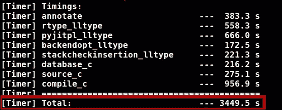

## 即时编译器

这是 PyPy 提供的主要功能之一。这是它与常规 Python（CPython）相比速度更快的最主要原因。

根据 PyPy 的官方网站，性能可能会根据任务而变化，但平均而言，这个编译器声称比 CPython 快七倍。

通常，对于标准编译程序，我们在第一次执行之前将整个源代码转换成机器代码。否则，我们将无法尝试它。这是通常编译程序经过的标准步骤（预处理和源代码翻译，最后是汇编和链接）。

JIT 意味着我们的代码将在执行时而不是在执行前进行编译。通常发生的情况是，代码在两步过程中被翻译：

1.  首先，原始源代码被转换成中间语言。对于某些语言，如 Java，它被称为字节码。

1.  在我们得到字节码后，我们开始编译它并将其转换为机器码，但仅在我们需要时进行。即时编译器的一个特点是它们只编译需要运行的代码，而不是一次性编译所有代码。

第二步是区分此类实现与其他解释语言（如 CPython，当字节码被解释而不是编译时）的不同之处。此外，即时编译器通常缓存编译后的代码，以便下次需要时避免编译开销。

考虑到所有这些，很明显，为了使程序真正利用即时编译器，它至少需要运行几秒钟，以便指令缓存能够生效。否则，效果可能与预期相反，因为编译的开销将是开发者唯一能注意到的实时差异。

使用即时编译器的一个主要优点是正在执行的程序能够针对其运行的特定系统（包括 CPU、操作系统等）优化机器码。因此，它提供了一种完全超出静态编译（甚至解释）程序范围的灵活性。

## 沙盒技术

尽管 PyPy 的沙盒功能仍被视为原型，但我们将探讨其基本内部工作原理，以了解它提供的潜力。

沙盒技术包括提供一个安全的环境，其中不受信任的 Python 代码可以运行，而无需担心对宿主系统造成损害。

在 PyPy 中，这特别通过双进程模型实现：

1.  在一方面，我们有一个定制的 PyPy 版本，专门编译以在沙盒模式下运行。特别是，这意味着任何库或系统调用（例如 I/O）都会被打包到`stdout`，等待打包的响应返回。

1.  另一方面，我们有一个容器进程，它可能正在使用 PyPy 或 CPython 运行。此进程将负责处理来自内部 PyPy 进程的库和系统调用：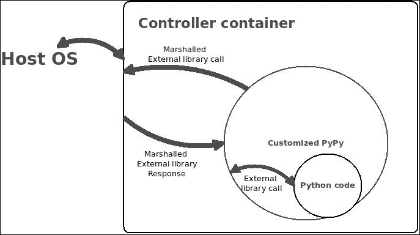

上述图示显示了整个过程，其中在沙盒模式下执行的 Python 代码正在执行外部库调用。

容器进程是决定提供哪种虚拟化的进程。例如，内部进程可能正在创建文件句柄，实际上这些句柄是由容器进程伪造的。该进程充当真实操作系统和沙盒进程之间的一个层。

注意，前面解释的机制与语言层面的沙盒技术非常不同。整个指令集都对开发者可用。因此，你可以通过代码实现一个非常透明且安全的系统，这些代码可以在标准系统和受保护系统中运行。

## 优化即时编译器

正如我们之前讨论的，PyPy 的 JIT 是使其与 CPython 实现区分开来的因素。正是这个特性使得它在运行 Python 代码时如此之快。

直接在我们的未更改的 Python 代码上使用 PyPy，我们很可能会得到更好的结果。然而，如果我们想进一步优化我们的代码，我们应该考虑一些指导原则。

### 想象函数

JIT 通过分析哪些函数比其他函数“更热”（执行次数更多）来工作。因此，我们最好将我们的代码结构化为函数，特别是对于将被重复执行的函数。

让我们看看一个快速示例。以下代码将显示直接内联执行相同计算与将其封装在函数内并处理与函数查找和函数调用本身相关的额外时间之间的时间差异：

```py
import math
import time

TIMES = 10000000

init = time.clock()
for i in range(TIMES):
    value = math.sqrt(i * math.fabs(math.sin(i - math.cos(i))))

print "No function: %s" % ( init - time.clock())

def calcMath(i):
    return math.sqrt(i * math.fabs(math.sin(i - math.cos(i))))
init = time.clock()
for i in range(TIMES):
    value = calcMath(i)
print "Function: %s" % ( init – time.clock())
```

代码非常简单，但你仍然可以看到第二个输出显示了它是更快的实现。普通的旧 CPython 将以相反的方式工作，因为没有对代码进行实时优化。第二种方法会因为函数查找和函数调用代码的开销而得到稍微差一点的结果。然而，PyPy 和它的 JIT 再次证明，如果你想为它们优化代码，你需要停止用老的方式思考。

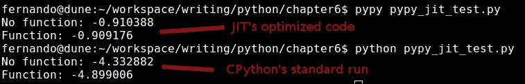

前面的截图结果显示了我们之前一直在讨论的内容：

+   PyPy 运行的代码比 CPython 快得多

+   JIT 正在实时优化我们的代码，而 CPython 则不是

### 考虑使用 cStringIO 来连接字符串

这不是一个小优化，无论是从代码更改还是从实现的优化来看。我们已经讨论了对于 Python 来说，字符串是不可变对象的事实。所以，如果我们想将大量字符串连接成一个单一的字符串，我们最好使用另一种结构而不是字符串本身，因为那会带来最差的表现。

在 PyPy 的情况下，这仍然成立。然而，我们不会使用列表作为最佳选择，而是会使用 `cStringIO` 模块 ([`pymotw.com/2/StringIO/`](http://pymotw.com/2/StringIO/))，正如我们将看到的，它提供了最佳结果。

注意，由于 PyPy 的特性，提到 `cStringIO` 而不是 `StringIO` 可能会令人困惑，因为我们引用的是 C 标准库而不是纯 Python 库。这是正确和有效的，因为一些在 CPython 中常见的 C 标准库在 PyPy 上也能正确工作。在我们的例子中，以下代码将以三种不同的方式（使用简单字符串、使用 `cStringIO` 库，最后使用列表）计算执行相同连接操作所需的时间：

```py
from cStringIO import StringIO
import time

TIMES = 100000

init = time.clock()
value = ''
for i in range(TIMES):
    value += str(i)
print "Concatenation: %s" % ( init - time.clock())

init = time.clock()
value = StringIO()
for i in range(TIMES):
    value.write(str(i))
print "StringIO: %s" % ( init - time.clock())

init = time.clock()
value = []
for i in range(TIMES):
    value.append(str(i))
finalValue = ''.join(value)
print "List: %s" % ( init - time.clock())
```

在这三种替代方案中，`StringIO` 在 PyPy 中是最好的。它比简单字符串连接要好得多，甚至比使用列表还要好一点。

如果我们通过 CPython 运行相同的代码，我们将得到不同的结果。因此，最好的解决方案仍然是使用列表。

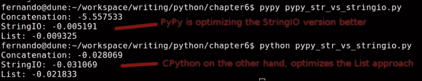

前面的截图证实了这一点。注意，在使用 PyPy 时，第一种方法在性能方面尤其糟糕。

### 禁用 JIT 的操作

虽然这并不是直接的优化，但有一些特定的方法，如果我们使用它们，将会降低 JIT 的有效性。因此，了解这些方法很重要。

以下来自 `sys` 模块的三种方法可以禁用 JIT（根据当前 PyPy 版本；当然，这在未来可能会改变）：

+   `_getframe`：此方法从 `callstack` 返回一个帧对象。它甚至接受一个可选的深度参数，可以从 `callstack` 返回帧对象。性能惩罚相当大，因此只有在绝对需要时才推荐使用，例如在开发调试器时。

+   `exc_info`：此方法返回一个包含三个元素的元组，提供了有关正在处理的异常的信息。这些元素是 `type`、`value` 和 `traceback`。它们在这里解释：

    +   `type`：这是正在处理的异常的类型

    +   `value`：此方法获取异常参数

    +   `traceback`：此方法获取 `traceback` 对象，它封装了异常抛出时的 `callstack` 对象

+   `Settrace`：此方法设置跟踪函数，允许您在 Python 中跟踪 Python 代码。如前所述，除非绝对必要，否则不建议使用，因为它需要禁用 JIT 才能正常工作。

## 代码示例

作为这个主题的最后一个例子，让我们来看看 `great_circle` 函数的代码（稍后解释）。大圆计算包括在地球表面上找到两点之间的距离。

脚本将执行 500 万次迭代的 `for` 循环。特别是，它反复调用相同的函数（精确地说是 500 万次）。这种场景对于 CPython 解释器来说并不理想，因为它将完成那么多次函数查找。

然而，另一方面，正如我们之前提到的，随着时间的推移调用相同的函数可以让 PyPy 的 JIT 开始优化这个调用。这基本上意味着在我们的情况下，代码已经对 PyPy 进行了某种程度的优化：

```py
import math

def great_circle(lon1,lat1,lon2,lat2):
    radius = 3956 #miles
    x = math.pi/180.0

    a = (90.0-lat1)*(x)
    b = (90.0-lat2)*(x)
    theta = (lon2-lon1)*(x)
    c = math.acos((math.cos(a)*math.cos(b)) + (math.sin(a)*math.sin(b)*math.cos(theta))) 
    return radius*c

lon1, lat1, lon2, lat2 = -72.345, 34.323, -61.823, 54.826
num = 5000000

for i in range(num):great_circle(lon1,lat1,lon2,lat2)
```

前面的代码可以根据我们刚才提到的相同原则进一步优化。我们可以将 `great_circle` 函数中的一行移到单独的函数中，从而进一步优化执行，如下所示：

```py
import math

def calcualte_acos(a, b ,theta):
 return math.acos((math.cos(a)*math.cos(b)) + (math.sin(a)*math.sin(b)*math.cos(theta)))

def great_circle(lon1,lat1,lon2,lat2):
    radius = 3956 #miles
    x = math.pi/180.0

    a = (90.0-lat1)*(x)
    b = (90.0-lat2)*(x)
    theta = (lon2-lon1)*(x)
    c = calcualte_acos(a, b, theta)
    return radius*c

lon1, lat1, lon2, lat2 = -72.345, 34.323, -61.823, 54.826
num = 5000000

for i in range(num):
  great_circle(lon1,lat1,lon2,lat2)
```

您可以看到我们如何将 `acos` 计算移动到单独的函数中，因为它是整个函数中最昂贵的行（那里总共调用了六个三角函数）。通过将这一行移动到另一个函数中，我们允许 JIT 处理其调用的优化。

最后，由于这个简单的改变以及我们使用 PyPy 而不是常规 Python 的事实，我们的执行时间为 0.5 秒。相反，如果我们使用常规 CPython 运行相同的代码，我们将会得到 4.5 秒的时间（在我的当前机器上），这要慢得多。

# Cython

虽然技术上讲，Cython ([`cython.org/`](http://cython.org/)) 并非完全等同于使用标准的 CPython 解释器，但它允许我们编写 Python 代码并将其编译成 C 代码（这是 CPython 所不具备的）。

你会看到 Cython 可以被视为一个转译器，这仅仅意味着它是一段软件，旨在将源代码从一种语言翻译成另一种语言。还有其他类似的产品，例如 CoffeeScript 和 Dart。两者都是截然不同的语言，并且都被翻译成 JavaScript。

在我们的案例中，Cython 将 Python 的超集（语言的扩展版本）转换为优化的 C/C++代码。然后，它被编译成一个 Python 扩展模块。这反过来又允许开发者：

+   编写调用 C 或 C++代码的 Python 代码

+   使用静态类型声明将 Python 代码调整为 C 级性能

静态类型是允许这个转译器生成优化 C 代码的关键特性，从而使 Cython 从 Python 的动态特性中脱离出来，进入一个更静态、更快的领域（有时甚至可以快几个数量级）。

当然，这使得 Python 代码更加冗长，这反过来可能会损害其他方面，如可维护性和可读性。因此，通常情况下，除非有某种明确的证据表明添加它确实会生成运行速度更快的代码，否则不建议使用静态类型。

所有 C 类型都可供开发者使用。Cython 准备在赋值时自动执行类型转换。在 Python 的任意长整数特殊情况下，当转换为 C 的整数时，如果发生溢出，将引发 Python 溢出错误。

下表展示了纯 Python 版本和 Cython 版本的相同示例：

| Python 版本 | Cython 版本 |
| --- | --- |

|

```py
def f(x):
    return x**2-x

def integrate_f(a, b, N):
    s = 0
    dx = (b-a)/N
    for i in range(N):
        s += f(a+i*dx)
    return s * dx
```

|

```py
def f(double x):
    return x**2-x

def integrate_f(double a, double b, int N):
    cdef int i
    cdef double s, dx
    s = 0
    dx = (b-a)/N
    for i in range(N):
        s += f(a+i*dx)
    return s * dx
```

|

两个代码之间的主要区别被突出显示。这仅仅是每个变量的类型定义，包括两个函数接收的参数以及使用的局部变量。仅凭这一点，Cython 就可以生成左侧代码的优化 C 版本。

## 安装 Cython

安装 Cython 到你的系统中有几种方法。然而，在每种情况下，共同的要求是之前已经安装了一个 C 编译器。我们不会详细说明这一步骤，因为指令可能因系统而异。

一旦安装了 C 编译器，为了获取 Cython，你可以执行以下步骤：

1.  从他们的网站上下载最新版本 ([`cython.org`](http://cython.org))，解压 tarball 文件，进入目录，并运行以下命令：

    ```py
    $python setup.py install

    ```

1.  如果你已经在系统中安装了设置工具，你可以运行此命令：

    ```py
    $pip install cython

    ```

    ### 注意

    如果你已经使用以下开发环境之一，那么 Cython 很可能已经安装在你的系统中。然而，你也可以使用前面的步骤来更新你的当前版本：

    +   Anaconda

    +   Enthought Canopy

    +   PythonXY

    +   Sage

## 构建 Cython 模块

Cython 能够将我们的代码编译成 C 模块，我们稍后可以将这些模块导入到主代码中。为了做到这一点，你需要执行以下步骤：

1.  首先，需要使用 Cython 将`.pyx`文件编译（或转换）成`.c`文件。这些是源代码文件，基本上是带有 Cython 添加的一些扩展的 Python 代码。我们稍后会看到一些示例。

1.  `.c`文件将被 C 编译器编译成`.so`库。这个库稍后可以被 Python 导入。

1.  如前所述，我们有几种方法可以编译代码：

    +   我们可以创建一个`distutils`设置文件。Distutils 是一个模块，它简化了其他模块的创建，因此我们可以使用它来生成我们自定义的 C 编译模块。

    +   我们可以运行`cython`命令行，从`.pyx`文件创建一个`.c`文件。然后，使用 C 编译器手动将 C 代码编译成库。

    +   最后，另一个选项是使用`pyximport`模块，并将`.pyx`文件作为`.py`文件导入。

1.  为了说明前面的要点，让我们通过使用`distutils`选项来查看一个示例：

    ```py
    #test.pyx
    def join_n_print(parts):
        print ' '.join(parts)

    #test.py
    from test import join_n_print
    join_n_print( ["This", "is", "a", "test"] )

    #setup.py
    from distutils.core import setup
    from Cython.Build import cythonize

    setup(
      name = 'Test app',
      ext_modules = cythonize("test.pyx"),
    )
    ```

1.  就这样！要导出的前面代码应该放在`.pyx`文件中。`setup.py`文件通常也是相同的。它将使用不同参数变体调用`setup`函数。最后，它将调用`test.py`文件，该文件导入我们的编译库并使用它。

1.  为了有效地编译代码，你可以使用以下命令：

    ```py
    $ python setup.py build_ext –inplace

    ```

下面的截图显示了前面命令的输出。你可以看到它不仅翻译（cythonize）了代码，而且还使用了安装的 C 编译器来编译库：

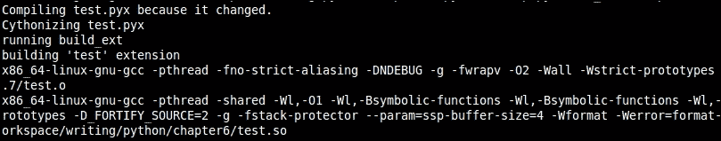

前面的示例显示了一个非常简单的模块。然而，通常，对于更复杂的情况，Cython 模块由两种类型的文件组成：

+   **定义文件**：这些文件具有`.pxd`扩展名，包含需要供其他 Cython 模块使用的名称的 C 声明。

+   **实现文件**：这些文件具有`.pyx`扩展名，包含在`.pxd`文件中声明的函数的实际实现。

定义文件通常包含 C 类型声明、外部 C 函数或变量声明，以及模块中定义的 C 函数的声明。它们不能包含任何 C 或 Python 函数的实现，也不能包含任何`Python`类的定义或任何可执行行。

另一方面，实现文件可以包含几乎任何类型的 Cython 语句。

这里是一个典型的两文件模块示例，摘自 Cython 的官方文档（[`docs.cython.org/src/userguide/sharing_declarations.html`](http://docs.cython.org/src/userguide/sharing_declarations.html)）；它展示了如何导入 `.pxd` 文件：

```py
#dishes.pxd
cdef enum otherstuff:
    sausage, eggs, lettuce

cdef struct spamdish:
    int oz_of_spam
    otherstuff filler

#restaurant.pyx:
cimport dishes
from dishes cimport spamdish

cdef void prepare(spamdish *d):
    d.oz_of_spam = 42
    d.filler = dishes.sausage

def serve():
    cdef spamdish d
    prepare(&d)
    print "%d oz spam, filler no. %d" % (d.oz_of_spam, d.filler)
```

默认情况下，当执行 `cimport` 时，它将在搜索路径中查找名为 `modulename.pxd` 的文件。每当定义文件更改时，导入它的每个文件都需要重新编译。幸运的是，对于我们来说，`Cythin.Build.cythonize` 工具将负责这一点。

## 调用 C 函数

就像常规的 Python 一样，Cython 允许开发者通过调用外部库编译的函数来直接与 C 进行接口交互。为了导入这些库，其过程与标准的 Python 过程类似：

```py
from libc.stdlib cimport atoi
```

`cimport` 语句用于实现或定义文件，以便访问在其他文件中声明的名称。其语法与标准 Python 的 `import` 语句完全相同。

如果你还需要访问在库中定义的一些类型的定义，你需要头文件（`.h` 文件）。在这些情况下，使用 Cython 并不像引用文件那样简单。你还需要重新声明你将使用的类型和结构：

```py
cdef extern from "library.h":
  int library_counter;
  char *pointerVar;
```

前面的示例对 Cython 执行以下操作：

+   它让 Cython 知道如何在生成的 C 代码中放置 `#include` 语句，引用我们包含的库

+   它阻止 Cython 为该块内的声明生成任何 C 代码

+   它将块内的所有声明视为使用 `cdef extern` 创建的，这反过来意味着这些声明是在其他地方定义的

注意，这个语法是必需的，因为 Cython 在任何时候都不会读取头文件的内容。因此，你仍然需要重新声明其内容。作为一个警告，你实际上只需要重新声明你将使用的部分，省略掉任何你的代码不需要直接使用的部分。例如，如果你在你的头文件中声明了一个具有许多成员的大结构，你可以只重新声明你需要的成员。这会起作用，因为在编译时，C 编译器会使用具有完整版本的结构的原代码。

### 解决命名冲突

当导入的函数的名称与你的函数的名称相同时，会出现一个有趣的问题。

假设你有一个 `myHeader.h` 文件，它定义了 `print_with_colors` 函数，你需要将其包装在一个你也要调用 `print_with_colors` 的 Python 函数中；Cython 提供了一种方法让你绕过这个问题，并保持你想要的名称。

你可以将 `extern` C 函数声明添加到 Cython 声明文件（`.pxd` 文件）中，然后按照以下方式将其导入到你的 Cython 代码文件中：

```py
#my_declaration.pxd
cdef extern "myHeader.h":
  void print_with_colors(char *)

#my_cython_code.pyx
from my_declaration cimport print_with_colors as c_print_with_colors

def print_with_colors(str):
  c_print_with_colors(str)
```

你也可以避免重命名函数，并使用声明文件的名称作为前缀：

```py
#my_cython_code.pyx
cimport  my_declaration 
def print_with_colors(str):
  my_declaration.print_with_colors(str)
```

### 注意

这两种选择都是有效的，使用哪种完全取决于开发者。有关此主题的更多信息，请参阅：[`docs.cython.org/src/userguide/external_C_code.html`](http://docs.cython.org/src/userguide/external_C_code.html)。

## 定义类型

如前所述，Cython 允许开发者定义变量的类型或函数的返回类型。在这两种情况下，用于此的关键字是 `cdef`。实际上，类型声明是可选的，因为 Cython 会尝试通过将其转换为 C 来优化 Python 代码。但话虽如此，在需要的地方定义静态类型肯定会很有帮助。

现在我们来看一个 Python 代码片段的非常基础的例子，以及相同的代码在其三个版本中的执行情况：纯 Python、Cython 编译无类型和最后，编译并使用类型。

代码如下：

| Python | Cython |
| --- | --- |

|

```py
def is_prime(num):
  for j in range(2,num):
    if (num % j) == 0:
      return False
  return True
```

|

```py
def is_prime(int num):
  cdef int j;
  for j in range(2,num):
    if (num % j) == 0:
      return False
  return True
```

|

由于我们将 `for` 循环变量声明为 C 整数，Cython 会将这个循环转换为一个优化的 C `for` 循环，这将是对这段代码的主要改进之一。

现在，我们将设置一个主文件，该文件将导入该函数：

```py
import sys
from <right-module-name> import is_prime

def main(argv):

  if (len(sys.argv) != 3):
    sys.exit('Usage: prime_numbers.py <lowest_bound> <upper_bound>')

  low = int(sys.argv[1])
  high = int(sys.argv[2])

  for i in range(low,high):
    if is_prime(i):
      print i,

if __name__ == "__main__":
  main(sys.argv[1:])
```

然后，我们将像这样执行我们的脚本：

```py
$ time python script.py 10 10000

```

我们将得到以下有趣的结果：

| 纯 Python 版本 | 编译后无类型 | 编译后带类型 |
| --- | --- | --- |
| 0.792 秒 | 0.694 秒 | 0.043 秒 |

尽管代码的非优化版本比纯 Python 版本更快，但我们只有在开始声明类型时才能看到 Cython 的真正威力。

## 在函数定义期间定义类型

在 Cython 中可以定义两种不同类型的函数：

+   **标准 Python 函数**：这些是正常的函数，与纯 Python 代码中声明的函数完全相同。为此，你需要使用标准的 `cdef` 关键字，这些函数将接收 Python 对象作为参数，并返回 Python 对象。

+   **C 函数**：这些是标准函数的优化版本。它们可以接受 Python 对象或 C 值作为参数，也可以返回这两种类型。要定义这些函数，你需要使用特殊的 `cdef` 关键字。

任何类型的函数都可以在 Cython 模块内部调用。然而（这是一个非常重要的区别），如果你想在 Python 代码内部调用你的函数，你需要确保该函数被声明为标准类型，或者你需要使用特殊的 `cpdef` 关键字。这个关键字将为函数创建一个包装对象。因此，当函数在 Cython 内部调用时，它将使用 C 函数，而当在 Python 代码内部调用时，它将使用 Python 版本。

当处理函数的参数为 C 类型时，将自动进行（如果可能）从 Python 对象到 C 值的转换。目前这仅适用于数值类型、`字符串` 和 `struct` 类型。如果你尝试使用任何其他类型，将导致编译时错误。

以下简单的例子说明了两种模式之间的区别：

```py
#my_functions.pxd

#this is a pure Python function, so Cython will create a make it return and receive Python objects instead of primitive types.
cdef full_python_function (x):
    return x**2

#This function instead, is defined as both, a standard function and an optimized C function, thanks to the use of the cpdef keyword.
cpdef int c_function(int num):
    return x**2
```

### 注意

如果返回类型或参数类型未定义，则假定它是一个 Python 对象。

最后，不返回 Python 对象的 C 函数没有向其调用者报告 Python 异常的方法。因此，当发生错误时，会打印一条警告消息，并忽略异常。当然，这远远不是理想的。幸运的是，我们有一个解决办法。

我们可以在函数定义中使用`except`关键字。这个关键字指定了当函数内部发生异常时，将返回一个特定的值。以下是一个例子：

```py
cdef int text(double param) except -1:
```

在前面的代码中，每当发生异常时，将返回`-1`。重要的是你不需要从你的函数中手动返回异常值。这尤其相关，如果你将`False`定义为你的异常值，因为这里的任何`False`值都适用。

对于任何可能的返回值都是有效返回值的情况，你可以使用另一种表示法：

```py
cdef int text(double param) except? -1:
```

`?`符号将`-1`设置为可能的异常值。当返回时，Cython 将调用`PyErr_Occurred()`以确保它确实是一个错误，而不是一个正常的返回操作。

`except`关键字还有一个变体，确保在每次返回后调用`PyErr_Occurred()`：

```py
cdef int text(double param) except *:
```

上述表示法的唯一实际用途是对于返回`void`且需要传播错误的函数。这是因为在这些特殊情况下，没有值可以检查；否则，它没有真正的用例。

## Cython 示例

让我们快速看一下我们之前为 PyPy 使用的相同例子。它展示了如何提高脚本的性能。代码将再次进行 5000 万次的相同计算：从`math`导入`PI`、`acos`、`cos`和`sin`：

```py
def great_circle(lon1,lat1,lon2,lat2):
    radius = 3956 #miles
    x = PI/180.0

    a = (90.0-lat1)*(x)
    b = (90.0-lat2)*(x)
    theta = (lon2-lon1)*(x)
    c = acos((cos(a)*cos(b)) +

                  (sin(a)*sin(b)*cos(theta)))
    return radius*c
```

然后，我们将通过以下脚本运行函数 5000,000 次来测试它：

```py
from great_circle_py import great_circle

lon1, lat1, lon2, lat2 = -72.345, 34.323, -61.823, 54.826
num = 5000000

for i in range(num):
  great_circle(lon1,lat1,lon2,lat2)
```

再次，正如我之前提到的，如果我们使用 Linux 中的 time 命令行工具和 CPython 解释器运行这个脚本，我们会看到执行结果大约需要 4.5 秒（在我的当前系统中）。你的数字可能有所不同。

与我们在前面的章节中一样，我们将直接跳转到 Cython。我们将把之前讨论的一些改进实现到一个 Cython 模块中，我们可以从我们的测试脚本中导入它。

这是我们的第一次尝试：

```py
#great_circle_cy_v1.pyx
from math import pi as PI, acos, cos, sin

def great_circle(double lon1,double lat1,double lon2,double lat2):
    cdef double a, b, theta, c, x, radius

    radius = 3956 #miles
    x = PI/180.0

    a = (90.0-lat1)*(x)
    b = (90.0-lat2)*(x)
    theta = (lon2-lon1)*(x)
    c = acos((cos(a)*cos(b)) +
                  (sin(a)*sin(b)*cos(theta)))
    return radius*c
#great_circle_setup_v1.py
from distutils.core import setup
from Cython.Build import cythonize

setup(
  name = 'Great Circle module v1',
  ext_modules = cythonize("great_circle_cy_v1.pyx"),
)
```

如前所述的代码所示，我们只是给代码中使用的所有变量和参数赋予了一个 C 类型。仅此一项就将执行时间从 4.5 秒降低到 3 秒。我们节省了 1.5 秒，但我们可能做得更好。

我们的代码仍然使用 Python 库`math.`。由于 Cython 允许我们混合 Python 和 C 库，当我们匆忙时它非常有用。它为我们处理转换，但正如我们所看到的，这并非没有代价。现在让我们尝试移除对该 Python 库的依赖，并调用 C 的`math.h`文件：

```py
#great_circle_cy_v2.pyx
cdef extern from "math.h":
    float cosf(float theta)
    float sinf(float theta)
    float acosf(float theta)

def great_circle(double lon1,double lat1,double lon2,double lat2):
    cdef double a, b, theta, c, x, radius
    cdef double pi = 3.141592653589793

    radius = 3956 #miles
    x = pi/180.0

    a = (90.0-lat1)*(x)
    b = (90.0-lat2)*(x)
    theta = (lon2-lon1)*(x)
    c = acosf((cosf(a)*cosf(b)) +
                  (sinf(a)*sinf(b)*cosf(theta)))
    return radius*c
```

在移除了对 Python 数学库的所有引用并直接使用 C 的`math.h`文件后，我们的代码从之前优化的 3.5 秒提升到了惊人的 0.95 秒。

## 何时定义类型

之前的例子可能看起来很明显且易于优化。然而，对于更大的脚本，重新声明每个变量为 C 变量，并在可能的情况下导入所有 C 库而不是 Python 库（ whenever possible），并不总是最佳选择。

以这种方式进行操作将导致可读性和可维护性问题。它还会损害 Python 代码的固有灵活性。实际上，它甚至可能通过添加不必要的类型检查和转换来损害性能。因此，必须有一种方法来确定添加类型和切换库的最佳位置。这种方法是使用 Cython。Cython 具有注释源代码的能力，并以非常直观的方式显示每一行代码如何被翻译成 C 代码。

使用 Cython 的`-a`属性，你可以生成一个 HTML 文件，该文件将以黄色突出显示你的代码。线条越黄，将该代码片段翻译成 C 所需的 C-API 交互就越多。白色线条（没有任何颜色的线条）将直接翻译成 C。让我们看看我们的原始代码在这个新工具下的渲染效果：

```py
$ cython -a great_circle_py.py

```

下一张截图显示了上一条命令生成的 HTML 文件：

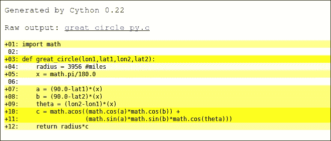

我们可以清楚地看到，我们的大部分代码至少需要与 C-API 进行几次交互才能被翻译成 C（只有第 4 行是完全白色的）。重要的是要理解，我们的目标应该是尽可能多地使行变为白色。带有**+**符号的行表示可以点击，生成的 C 代码将显示如下：

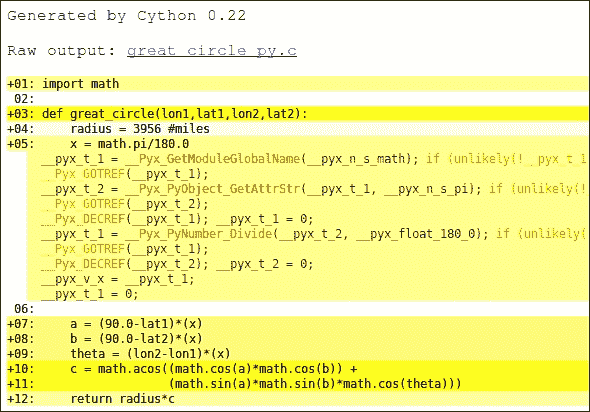

现在，通过查看我们的结果，我们可以看到浅黄色线条是简单的赋值（第 5、7、8 和 9 行）。它们可以通过我们最初的做法轻松修复：将这些变量声明为 C 变量，而不是让它们成为 Python 对象，这将需要我们转换代码。

通过进行转换，我们将得到类似下一张截图的内容。这张截图显示了分析`great_circle_cy_v1.pyx`文件的结果报告：

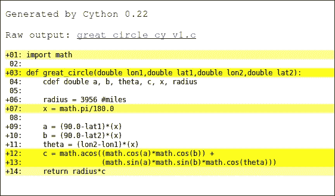

现在好多了！现在，这些行都是完全白色的，除了第 7 行，它仍然是浅黄色。这当然是因为这一行实际上引用了 `math.pi` 对象。我们可以简单地通过用固定的值 `PI` 初始化 `pi` 变量来修复它。然而，我们仍然有一个大块的黄色，即第 12 和 13 行。这也是由于我们使用了 `math` 库。因此，在我们摆脱它之后，我们将得到以下文件：

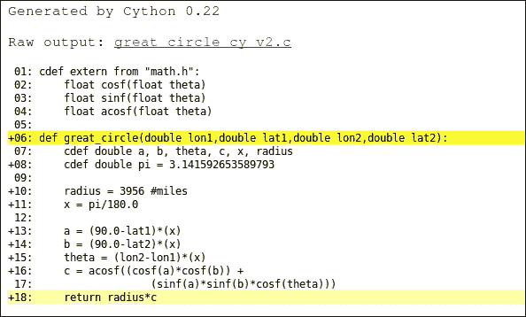

前面的截图显示了之前我们展示的最终代码。我们的大部分代码可以直接翻译为 C，并且从中获得了良好的性能。现在，我们仍然有两个黄色的行：6 和 18。

我们对第 6 行无能为力，因为那个函数是我们需要执行的 Python 函数。如果我们用 `cdef` 声明它，我们就无法访问它。然而，第 18 行并不完全是白色的。这是因为 `great_circle` 是一个 Python 函数，返回值是一个 Python 对象，需要被包装并转换为 C 值。如果我们点击它，我们可以看到生成的代码：

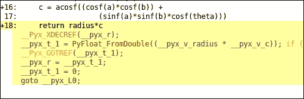

我们唯一能够修复这个问题的方法是通过使用 `cpdef` 声明我们的函数，这将为其创建一个包装器。然而，它也将允许我们声明返回类型。因此，我们不再返回一个 Python 对象。相反，我们返回一个 `double` 值，结果代码和注释截图如下：

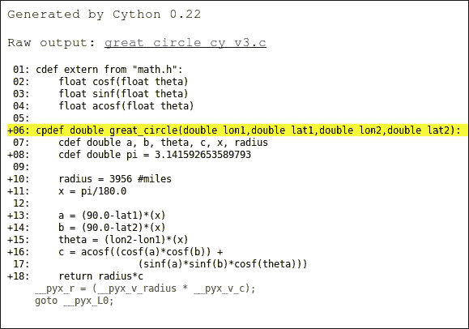

我们可以看到，由于最新的更改，为返回语句生成的 C 代码得到了简化。性能也得到了小幅提升，因为我们从 0.95 秒降低到了 0.8 秒。

感谢我们对代码的分析，我们能够更进一步并对其进行一些优化。这种技术是检查为 Cython 优化代码进度的一个好方法。这种技术提供了一个直观且简单的指标，用于显示优化代码的复杂性。

### 注意

注意，在这个特定的情况下，通过 Cython 路线进行此优化获得的结果并不如本章前面使用 PyPy 获得的结果好（Cython 需要 0.8 秒，而 PyPy 需要 0.5 秒）。

## 局限性

到目前为止，我们所看到的一切似乎都表明 Cython 是满足我们性能需求的一个完美的选择。然而，事实是 Cython 还没有达到 100% 与 Python 语法兼容。遗憾的是，在使用这个工具来满足我们的性能增强需求之前，我们需要考虑一些限制。从项目当前公开的 bug 列表中，我们可以收集到当前的限制列表。

### 生成器表达式

这些表达式目前遭受的影响最大，因为它们在 Cython 当前版本中存在几个问题。这些问题如下：

+   在生成器表达式中使用迭代器会导致问题，因为存在评估范围的问题。

+   此外，与生成器内部的迭代器相关，Cython 似乎是在生成器的主体内部评估它们的。另一方面，CPython 则是在创建实际的生成器之前进行评估。

+   CPython 中的生成器具有允许进行内省的属性。Cython 在支持这些属性方面仍然没有完全跟上。

### 字符串字面量的比较

Cython 当前的实现基于指针使用的字面量进行比较，而不是字符串的实际值。

```py
cdef char* str = "test string"
print str == b"test string"
```

前面的代码并不总是打印`True`。它将取决于存储第一个字符串的指针，而不是取决于实际的字符串值。

### 元组作为函数参数

尽管这只是 Python 2 的一个特性，但语言允许以下语法：

```py
def myFunction( (a,b) ):
  return a + b
args = (1,2)
print myFunction(args)
```

然而，前面的代码甚至不能被 Cython 正确解析。这个特定的功能被标记为可能在 Cython 的未来版本中“无法修复”，因为 Python 3.x 也已经移除了它。

### 注意

注意，Cython 团队预计在发布 1.0 版本之前修复大多数之前提到的限制。

### 堆栈帧

目前，Cython 正在生成假的回溯作为其异常传播机制的一部分。它们没有填写`locals`和`co_code`值。为了正确地做到这一点，它们必须在函数调用时生成堆栈帧，这可能会带来潜在的性能惩罚。因此，不清楚它们是否会在未来修复这个问题。

# 如何选择正确的选项

到目前为止，我们已经讨论了两种不同的方法来彻底优化我们的代码。然而，我们如何知道哪一个是正确的？或者更好的是，哪一个才是最好的？

对这两个问题的回答是相同的：*没有单一的最佳或正确选项*。哪一个选项更好或更差完全取决于一个或多个这些方面：

+   你试图优化的实际用例

+   开发者对 Python 或 C 的熟悉程度

+   优化代码的可读性很重要

+   可用于执行优化的时间量

## 何时选择 Cython

这里是当你应该选择 Cython 的情况：

+   **你熟悉 C 代码**：你不会用 C 来编码，但你将使用与 C 共有的原则，例如静态类型，以及 C 库，如`math.h`。因此，熟悉该语言及其内部结构肯定会有所帮助。

+   **失去 Python 的可读性不是问题**：你为 Cython 编写的代码不是完全的 Python 代码，因此其可读性的一部分将会丢失。

+   **需要完全支持 Python 语言**：尽管 Cython 不是 Python，但它更像是语言的扩展而不是子集。因此，如果你需要与语言完全兼容，Cython 可能是一个正确的选择。

## 何时选择 PyPy

以下是你应该选择 PyPy 的情况：

+   **你不是在处理一次性执行的脚本**：如果你的脚本是一个长时间运行的程序，有可以优化的循环，那么 PyPy 的 JIT 优化非常出色，但如果你的脚本是一次性运行并完成的，那么实际上 PyPy 比原始 CPython 要慢。

+   **不需要完全支持第三方库**：尽管 PyPy 与 Python 2.7.x 兼容，但它与其外部库（尤其是 C 库）并不完全兼容。因此，根据你的代码，PyPy 可能并不是一个真正的选择。

+   **你需要你的代码与 CPython 兼容**：如果你需要你的代码在两种实现（PyPy 和 CPython）上都能运行，那么 Cython 方案就完全不可行。PyPy 成为唯一的选择。

# 概述

在本章中，我们介绍了两种替代标准 Python 实现的方案。一个是 PyPy，它包含一个 Python 版本，并使用 RPython 实现。它有一个负责在执行时优化代码的即时编译器。另一个是 Cython，它基本上是将 Python 代码转换为 C 代码的编译器。我们看到了它们各自的工作原理、如何安装它们，以及我们的代码需要如何修改才能从中获益。

最后，我们讨论了如何以及何时选择其中一个而不是另一个的几个要点。

在下一章中，我们将专注于 Python 的一个非常具体的用例：数值计算。这个主题在 Python 社区中非常常见，因为这种语言经常用于科学目的。我们将介绍三个可以帮助我们更快编写代码的选项：Numba、Parakeet 和 pandas。
