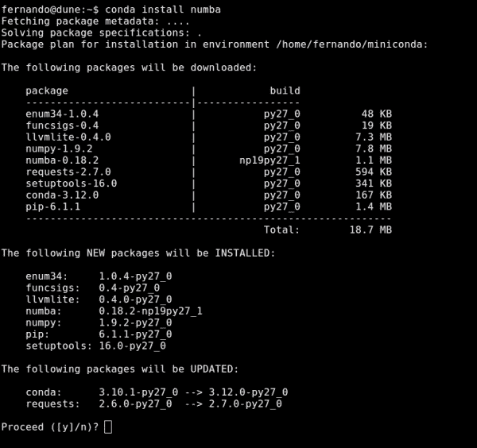
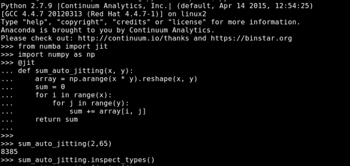
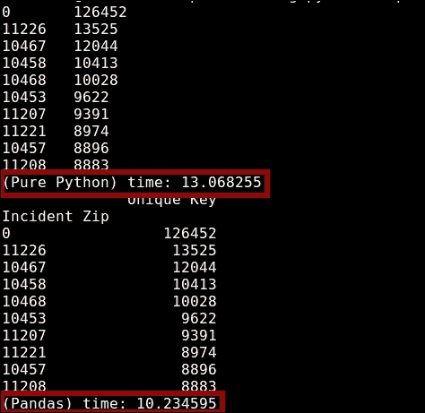
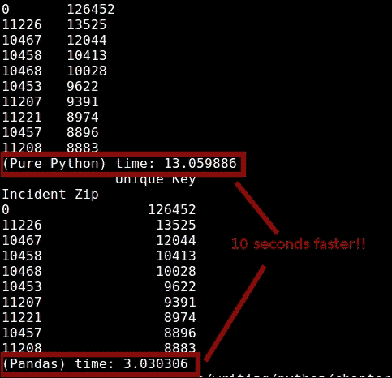
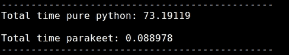

# 第七章：使用 Numba、Parakeet 和 pandas 进行闪电般的数值计算

数值计算是编程世界的一个特定主题。然而，鉴于 Python 经常被用于科学研究与数据科学问题，数值计算最终在 Python 世界中成为一个非常常见的话题。

话虽如此，我们同样可以很容易地使用前六章的信息来实现我们的算法，并且我们很可能会得到非常快速且性能良好的代码。再次强调，这些信息旨在用于通用用例。对于特定情况的优化，总会有一些讨论。

在本章中，我们将介绍三种选项，这些选项将帮助我们编写更快、更优化的代码，专注于科学问题。对于每一个，我们将介绍基本安装说明。我们还将查看一些代码示例，展示每个选项的优势。

本章我们将要回顾的工具如下：

+   **Numba**：这是一个模块，允许你通过生成优化的机器代码，在纯 Python 中编写高性能函数。

+   **Parakeet**：这是一个用于在 Python 子集编写的科学操作的运行时编译器。它非常适合表达数值计算。

+   **pandas**：这是一个提供高性能数据结构和分析工具的库。

# Numba

Numba ([`numba.pydata.org/`](http://numba.pydata.org/))是一个模块，允许你通过装饰器指示 Python 解释器哪些函数应该被转换为机器代码。因此，Numba 提供了与 C 或 Cython 相当的性能，而无需使用不同的解释器或实际用 C 语言编写代码。

该模块只需要求即可生成优化的机器代码。它甚至可以被编译在 CPU 或 GPU 硬件上运行。

这里是一个来自他们官方网站的非常基础的例子，展示了如何使用它。我们稍后会详细介绍：

```py
from numba import jit
from numpy import arange

# jit decorator tells Numba to compile this function.
# The argument types will be inferred by Numba when function is called.
@jit
def sum2d(arr):
    M, N = arr.shape
    result = 0.0
    for i in range(M):
        for j in range(N):
            result += arr[i,j]
    return result

a = arange(9).reshape(3,3)
print(sum2d(a))
```

注意，尽管 Numba 的承诺听起来很吸引人，但这个库旨在优化数组操作。它与 NumPy（我们很快会回顾）有相当大的关联。因此，并非每个函数都可以通过它来优化，使用它甚至可能会损害性能。

例如，让我们看看一个类似的例子，一个不使用 NumPy 但完成类似任务的例子：

```py
from numba import jit
from numpy import arange

# jit decorator tells Numba to compile this function.
# The argument types will be inferred by Numba when function is called.
@jit
def sum2d(arr):
    M, N = arr.shape
    result = 0.0
    for i in range(M):
        for j in range(N):
            result += arr[i,j]
    return result

a = arange(9).reshape(3,3)
print(sum2d(a))
```

上述代码的执行时间取决于我们是否保留了`@jit`行：

+   在`@jit`行上：0.3 秒

+   没有使用`@jit`行：0.1 秒

## 安装

实际上，安装 Numba 有两种方式：你可以使用 Anaconda 的`conda`包管理器，或者你可以直接克隆 GitHub 仓库并编译它。

如果你选择使用`conda`方法，你可以安装一个名为`miniconda`的命令行工具（可以从[`conda.pydata.org/miniconda.html`](http://conda.pydata.org/miniconda.html)下载）。安装后，你只需使用以下命令即可：

```py
$ conda install numba

```

以下截图显示了此命令的输出。该命令列出了将要安装或更新的所有包，特别是 `numpy` 和 `llvmlite`，它们是 Numba 的直接依赖项：



如果你想使用源代码，你可以使用以下命令克隆仓库：

```py
$ git clone git://github.com/numba/numba.git

```

你还需要安装 `numpy` 和 `llvmlite`。之后，你可以使用以下命令：

```py
$ python setup.py build_ext –inplace

```

### 注意

注意，即使你没有安装这些要求，前面的命令也会成功。然而，除非你安装了它们，否则你将无法使用 Numba。

为了检查你的安装是否成功，你可以在 Python REPL 中进行简单的检查：

```py
>>> import numba
>>> numba.__version__
'0.18.2'
```

## 使用 Numba

现在你已经成功安装了 Numba，让我们看看我们可以用它做什么。此模块提供的主要功能如下：

+   即时代码生成

+   针对 CPU 和 GPU 硬件的原生代码生成

+   由于 Numpy 依赖项，与 Python 的科学软件集成

### Numba 的代码生成

当涉及到代码生成时，Numba 的主要功能是其 `@jit` 装饰器。使用它，你可以标记一个函数在 Numba 的 JIT 编译器下进行优化。

我们已经在上一章中讨论了拥有 JIT 编译器的优势，所以这里不再详细说明。相反，让我们看看如何使用装饰器来为我们带来好处。

有几种方法可以使用这个装饰器。默认的方法，也是推荐的方法，就是我们之前展示的方法：

```py
Lazy compilation
```

以下代码将在函数被调用时让 Numba 生成优化代码。它将尝试推断其属性的类型和函数的返回类型：

```py
from numba import jit

@jit
def sum2(a,b):
  return a + b
```

如果你用不同的类型调用相同的函数，那么将生成并优化不同的代码路径。

#### 贪婪编译

另一方面，如果你知道你的函数将接收（可选地，返回）的类型，你可以将这些传递给 `@jit` 装饰器。然后，只有那个特定的案例会被优化。

以下代码显示了传递函数签名所需的附加代码：

```py
from numba import jit, int32

@jit(int32(int32, int32))
def sum2(a,b):
  return a + b
```

这里列出了用于指定函数签名最常见的类型：

+   `void`：这些用于不返回任何内容的函数的返回类型

+   `intp` 和 `uintp`：这些是指针大小的整数，分别是带符号和无符号的

+   `intc` 和 `uintc`：这些是 C 语言中 int 和 unsigned int 类型的等价类型

+   `int8`、`int16`、`int32` 和 `int64`：这些是相应位宽的固定宽度整数（对于无符号版本，只需在前面添加 `u` 作为前缀，例如，`uint8`）

+   `float32` 和 `float64`：这些是单精度和双精度浮点数

+   `complex64` 和 `complex128`：这些表示单精度和双精度复数

+   数组也可以通过索引任何数值类型来声明，例如，`float32[:]`用于一维浮点数数组，`int32[:,:]`用于二维整数数组

#### 其他配置设置

除了急切编译之外，我们还可以将两个选项传递给`@jit`装饰器。这些选项将帮助我们强制 Numba 的优化。它们在这里进行了描述。

##### 无 GIL

当我们的代码使用原生类型（而不是使用 Python 类型）进行优化时，GIL（我们在第六章中讨论过，*通用优化选项*）就不再必要了。

我们有一种方法可以禁用 GIL。我们可以将`nogil=True`属性传递给装饰器。这样，我们可以在其他线程中同时运行 Python 代码（或 Numba 代码）。

话虽如此，请记住，如果您没有 GIL 限制，那么您将不得不处理多线程系统的常见问题（一致性、同步、竞态条件等）。

##### 无 Python 模式

此选项将允许我们设置 Numba 的编译模式。默认情况下，它将尝试在模式之间跳跃。它将根据优化函数的代码尝试决定最佳模式。

有两种模式可供选择。一方面，有`object`模式。它生成能够处理所有 Python 对象的代码，并使用 C API 对这些对象进行操作。另一方面，`nopython`模式通过避免调用 C API 来生成更快的代码。它的唯一问题是，只有一部分函数和方法可供使用。

除非 Numba 可以利用循环即时编译（这意味着可以提取并编译为`nopython`模式的循环），否则`object`模式不会生成更快的代码。

我们可以强制 Numba 进入`nopython`模式，并在这种事情不可能的情况下引发错误。这可以通过以下代码行来完成：

```py
@jit(nopython=True)
def add2(a, b):
  return a + b
```

`nopython`模式的问题在于它有一些限制，除了支持的 Python 有限子集之外：

+   函数内部使用的所有值的原生类型必须能够被推断

+   函数内部不能分配新的内存

作为额外的补充，为了进行循环即时编译，待优化的循环不能包含返回语句。否则，它们将不符合优化条件。

那么，现在让我们看看我们的代码将如何呈现这个例子：

```py
def sum(x, y):
    array = np.arange(x * y).reshape(x, y)
    sum = 0
    for i in range(x):
        for j in range(y):
            sum += array[i, j]
    return sum
```

以下示例取自 Numba 网站。它显示了一个符合循环即时编译条件的函数，也称为循环提升。为了确保它按预期工作，我们可以使用 Python REPL 如下：



或者，我们也可以直接从我们的代码中调用`inspect_types`方法。后者的好处是，我们还将有权访问我们函数的源代码。当尝试将 Numba 生成的指令与代码行匹配时，这是一个巨大的优势。

前面的输出有助于理解我们在使用 Numba 优化代码时幕后发生的动作。更具体地说，我们可以理解它是如何推断类型的，是否有任何自动优化正在进行，以及基本上每行 Python 代码被转换成多少条指令。

让我们看看从我们代码内部调用 `inspect_types` 方法会得到什么输出（这比使用 REPL 得到的输出详细得多）：

### 注意

注意以下代码是整个输出的简化版本。如果你想完全研究它，你需要在自己的计算机上运行该命令。

```py
sum_auto_jitting (int64, int64)
--------------------------------------------------------------------------------
# File: auto-jitting.py
# --- LINE 6 --- 

@jit

# --- LINE 7 --- 

def sum_auto_jitting(x, y):

    # --- LINE 8 --- 
    # label 0
    #   x = arg(0, name=x)  :: pyobject
    #   y = arg(1, name=y)  :: pyobject
    #   $0.1 = global(np: <module 'numpy' from '/home/fernando/miniconda/lib/python2.7/site-packages/numpy/__init__.pyc'>)  :: pyobject
    #   $0.2 = getattr(attr=arange, value=$0.1)  :: pyobject
    #   del $0.1
    #   $0.5 = x * y  :: pyobject
    #   $0.6 = call $0.2($0.5, )  :: pyobject
    #   del $0.5
    #   del $0.2
    #   $0.7 = getattr(attr=reshape, value=$0.6)  :: pyobject
    #   del $0.6
    #   $0.10 = call $0.7(x, y, )  :: pyobject
    #   del $0.7
    #   array = $0.10  :: pyobject
    #   del $0.10

    array = np.arange(x * y).reshape(x, y)

    # --- LINE 9 --- 
    #   $const0.11 = const(int, 0)  :: pyobject
    #   sum = $const0.11  :: pyobject
    #   del $const0.11

    sum = 0

    # --- LINE 10 --- 
    #   jump 40.1
    # label 40.1
    #   $const40.1.1 = const(LiftedLoop, LiftedLoop(<function sum_auto_jitting at 0x7ff5f94756e0>))  :: XXX Lifted Loop XXX
    #   $40.1.6 = call $const40.1.1(y, x, sum, array, )  :: XXX Lifted Loop XXX
    #   del y
...

    #   jump 103
    for i in range(x):
        # --- LINE 11 --- 
        for j in range(y):
            # --- LINE 12 --- 
            sum += array[i, j]
    # --- LINE 13 --- 
    # label 103
    #   $103.2 = cast(value=sum.1)  :: pyobject
    #   del sum.1
    #   return $103.2
    return sum
# The function contains lifted loops
# Loop at line 10
# Has 1 overloads
# File: auto-jitting.py
# --- LINE 6 --- 

@jit
# --- LINE 7 --- 
def sum_auto_jitting(x, y):
    # --- LINE 8 --- 
    array = np.arange(x * y).reshape(x, y)
    # --- LINE 9 --- 
    sum = 0
    # --- LINE 10 --- 
    # label 37
    #   y = arg(0, name=y)  :: int64
    #   x = arg(1, name=x)  :: int64
    #   sum = arg(2, name=sum)  :: int64
    #   array = arg(3, name=array)  :: array(int64, 2d, C)
    #   $37.1 = global(range: <built-in function range>)  :: range
    #   $37.3 = call $37.1(x, )  :: (int64,) -> range_state64
    #   del x
    #   del $37.1
    #   $37.4 = getiter(value=$37.3)  :: range_iter64
    #   del $37.3
    #   $phi50.1 = $37.4  :: range_iter64
    #   del $37.4
    #   jump 50
    # label 50
    #   $50.2 = iternext(value=$phi50.1)  :: pair<int64, bool>
    #   $50.3 = pair_first(value=$50.2)  :: int64
    #   $50.4 = pair_second(value=$50.2)  :: bool
    #   del $50.2
    #   $phi53.1 = $50.3  :: int64
    #   del $50.3
    #   branch $50.4, 53, 102
    # label 53
    #   i = $phi53.1  :: int64
    #   del $phi53.1

    for i in range(x):

        # --- LINE 11 --- 
        #   jump 56
        # label 56

...
        #   j = $phi72.1  :: int64
        #   del $phi72.1

        for j in range(y):

            # --- LINE 12 --- 
            #   $72.6 = build_tuple(items=[Var(i, auto-jitting.py (10)), Var(j, auto-jitting.py (11))])  :: (int64 x 2)
            #   del j
            #   $72.7 = getitem(index=$72.6, value=array)  :: int64

...
            #   return $103.3

            sum += array[i, j]

    # --- LINE 13 --- 

    return sum
```

为了理解前面的输出，请注意每个注释块都是以原始源代码的行号开始的。然后是那条指令生成的指令，最后你会看到你编写的未注释的 Python 代码行。

注意 `LiftedLoop` 行。在这行中，你可以看到 Numba 自动进行的优化。同时，注意 Numba 在大多数行末推断的类型。每当看到 `pyobject` 属性时，这意味着它没有使用原生类型。相反，它使用一个通用的对象，该对象封装了所有 Python 类型。

### 在 GPU 上运行你的代码

如前所述，Numba 支持在 CPU 和 GPU 硬件上运行我们的代码。在实践中，这将允许我们通过在更适合并行计算的 CPU 环境中运行某些计算来提高这些计算的性能。

更具体地说，Numba 通过将 Python 函数的子集转换为遵循 CUDA 执行模型的 CUDA 内核和设备，支持 CUDA 编程（[`www.nvidia.com/object/cuda_home_new.html`](http://www.nvidia.com/object/cuda_home_new.html)）。

CUDA 是由 Nvidia 发明的并行计算平台和编程模型。它通过利用 GPU 的能力来实现显著的加速。

GPU 编程是一个可能填满整本书的主题，所以我们在这里不会深入细节。相反，我们只是提到 Numba 具有这种能力，并且可以使用 `@cuda.jit` 装饰器来实现。关于这个主题的完整文档，请参阅官方文档[`numba.pydata.org/numba-doc/0.18.2/cuda/index.html`](http://numba.pydata.org/numba-doc/0.18.2/cuda/index.html)。

# pandas 工具

本章我们将讨论的第二款工具被称为 pandas（[`pandas.pydata.org/`](http://pandas.pydata.org/)）。它是一个开源库，为 Python 提供高性能、易于使用的数据结构和数据分析工具。

这个工具是在 2008 年由开发者 Wes McKinney 发明的，当时他需要一个高性能的解决方案来对金融数据进行定量分析。这个库已经成为 Python 社区中最受欢迎和最活跃的项目之一。

关于使用 pandas 编写的代码的性能，有一点需要注意，那就是其关键代码路径的部分是用 Cython 编写的（我们已经在第六章通用优化选项中介绍了 Cython）。

## 安装 pandas

由于 pandas 的流行，有许多方法可以将它安装到您的系统上。这完全取决于您的设置类型。

推荐的方式是直接安装 Anaconda Python 发行版（[docs.continuum.io/anaconda/](http://docs.continuum.io/anaconda/))，它包含了 pandas 和 SciPy 堆栈的其余部分（如 NumPy、Matplotlib 等）。这样，完成时，您将安装超过 100 个软件包，并在过程中下载了几个 100 兆字节数据。

如果您不想处理完整的 Anaconda 发行版，可以使用 `miniconda`（我们在讨论 Numba 的安装时已经介绍过它）。采用这种方法，您可以通过以下步骤使用 `conda` 包管理器：

1.  使用以下代码行创建一个新的环境，您可以在其中安装 Python 的新版本：

    ```py
    $ conda create -n my_new_environment python 

    ```

1.  启用该环境：

    ```py
    $ source activate my_new_environment

    ```

1.  最后，安装 pandas：

    ```py
    $ conda install  pandas

    ```

此外，可以使用 `pip` 命令行工具（可能是最简单、最兼容的方式）通过以下代码行安装 pandas：

```py
$ pip install pandas

```

最后，还有一个选项是使用您的操作系统包管理器安装它，前提是该软件包可用：

| 发行版 | 仓库链接 | 安装方法 |
| --- | --- | --- |
| Debian | [packages.debian.org/search?keywords=pandas&searchon=names&suite=all&section=all](http://packages.debian.org/search?keywords=pandas&searchon=names&suite=all&section=all) |

```py
$ sudo apt-get install python-pandas

```

|

| Ubuntu | [`packages.ubuntu.com/search?keywords=pandas&searchon=names&suite=all&section=all`](http://packages.ubuntu.com/search?keywords=pandas&searchon=names&suite=all&section=all) |
| --- | --- |

```py
$ sudo apt-get install python-pandas

```

|

| OpenSUSE 和 Fedora | [`software.opensuse.org/package/python-pandas?search_term=pandas`](http://software.opensuse.org/package/python-pandas?search_term=pandas) |
| --- | --- |

```py
$ zypper in python-pandas

```

|

如果前面的选项失败，并且您选择从源安装 pandas，您可以从他们的网站[`pandas.pydata.org/pandas-docs/stable/install.html`](http://pandas.pydata.org/pandas-docs/stable/install.html)获取说明。

## 使用 pandas 进行数据分析

在大数据和数据分析的世界里，拥有适合工作的正确工具意味着掌握主动权（当然，这只是故事的一方面；另一方面是知道如何使用它们）。对于数据分析，尤其是对于临时任务和数据清理过程，人们通常会使用一种编程语言。编程语言将提供比标准工具大得多的灵活性。

话虽如此，有两种语言在这次特定的性能竞赛中领先：R 和 Python。对于 Python 来说，这可能会让一些人感到有些惊讶，因为我们一直展示的证据表明，Python 本身在数值计算方面并不足够快。这就是为什么创建了像 pandas 这样的库。

它提供了旨在简化通常被称为“数据处理”任务的工具，例如：

+   能够将大数据文件加载到内存中并流式传输

+   简单地与`matplotlib`（[`matplotlib.org/`](http://matplotlib.org/)）集成，这使得它能够用很少的代码创建交互式图表

+   简单的语法来处理缺失数据、删除字段等

现在我们来看一个非常简单且快速的例子，说明使用 pandas 如何提高代码的性能以及改进程序的语法。以下代码抓取了一个 CSV 文件，其中包含从纽约市开放数据网站（[`data.cityofnewyork.us/Social-Services/311-Service-Requests-from-2010-to-Present/erm2-nwe9`](https://data.cityofnewyork.us/Social-Services/311-Service-Requests-from-2010-to-Present/erm2-nwe9)）获取的 2010 年至现在的**311 服务请求**的一部分（一个 500MB 的文件）。

然后它尝试简单地使用纯 Python 和 pandas 代码计算每个邮编的记录数：

```py
import pandas as pd 
import time
import csv
import collections

SOURCE_FILE = './311.csv'

def readCSV(fname):
  with open(fname, 'rb') as csvfile:
    reader = csv.DictReader(csvfile)
    lines = [line for line in reader]
    return lines

def process(fname):
  content = readCSV(fname)
  incidents_by_zipcode = collections.defaultdict(int)
  for record in content:
    incidents_by_zipcode[toFloat(record['Incident Zip'])] += 1
  return sorted(incidents_by_zipcode.items(), reverse=True, key=lambda a: int(a[1]))[:10]

def toFloat(number):
  try:
    return int(float(number))
  except:
    return 0

def process_pandas(fname):
  df = pd.read_csv(fname, dtype={'Incident Zip': str, 'Landmark': str, 'Vehicle Type': str, 'Ferry Direction': str})

  df['Incident Zip'] = df['Incident Zip'].apply(toFloat)
  column_names =  list(df.columns.values)
  column_names.remove("Incident Zip")
  column_names.remove("Unique Key")
  return df.drop(column_names, axis=1).groupby(['Incident Zip'], sort=False).count().sort('Unique Key', ascending=False).head(10)

init = time.clock()
total = process(SOURCE_FILE)
endtime = time.clock() - init
for item in total:
  print "%s\t%s" % (item[0], item[1])

print "(Pure Python) time: %s" % (endtime)

init = time.clock()
total = process_pandas(SOURCE_FILE)
endtime = time.clock() - init
print total
print "(Pandas) time: %s" % (endtime)
```

`process` 函数非常简单。它只有五行代码。它加载文件，进行一些处理（主要是手动分组和计数），最后，它对结果进行排序并返回前 10 个。作为额外的奖励，我们使用了`defaultdict`数据类型，这是我们之前提到的一种可能的性能改进方法。

在另一方面，`process_pandas`函数基本上做了同样的事情，只是使用了 pandas。我们有一些更多的代码行，但它们很容易理解。它们显然是“数据处理导向”的，正如您所看到的，没有声明循环。我们甚至可以自动通过名称访问列，并在这些记录组上应用函数，而无需手动遍历它们。

以下截图显示了前面代码的输出：



如您所见，当我们简单地使用 pandas 重新实现算法时，我们的算法性能提高了 3 秒。现在让我们更深入地了解 pandas 的 API，以便获得更好的数据。我们可以对我们的代码进行两项主要改进，它们都与`read_csv`方法有关，该方法使用了许多参数。其中两个参数对我们来说非常有兴趣：

+   `usecols`：这将只返回我们想要的列，有效地帮助我们处理数据集中 40 多列中的仅 2 列。这也有助于我们摆脱在返回结果前必须删除列的逻辑。

+   `converters`：这允许我们使用一个函数自动转换数据，而不是像我们现在这样做调用 apply 方法。

我们的新函数看起来是这样的：

```py
def process_pandas(fname):
  df = pd.read_csv(fname, usecols=['Incident Zip', 'Unique Key'], converters={'Incident Zip': toFloat}, dtype={'Incident Zip': str})
  return df.groupby(['Incident Zip'], sort=False).count().sort('Unique Key', ascending=False).head(10)
```

没错。只有两行代码！读者将为我们完成所有工作。然后，我们只需要简单地分组、计数和排序。现在，来看看这与我们之前的结果相比如何：



这是在我们的算法性能上提高了 10 秒，并且处理代码量大大减少，这通常被称为“双赢”的情况。

我们代码的一个额外好处是它具有可扩展性。基于 pandas 的函数只需 30 秒就能处理 5.9 GB 的文件，而且无需任何更改。另一方面，我们的纯 Python 代码甚至无法在这么短的时间内加载该文件，更不用说在没有足够资源的情况下处理它了。

# Parakeet

这是迄今为止处理 Python 中数字的最具体工具。它非常具体，因为它只支持 Python 和 NumPy 结果组合的非常狭窄的子集。因此，如果你处理的是该宇宙之外的内容，这可能不是你的选择，但如果你可以将你的解决方案放入其中，那么请继续阅读。

要更具体地说明 Parakeet 支持的有限宇宙（通常仅用于表示数值计算，通常情况下并不常用），以下是一个简短的列表：

+   Python 支持的类型有数字、元组、切片和 NumPy 的数组

+   Parakeet 遵循向上提升规则，即当两个不同类型的值试图达到同一个变量时，它们将被提升为统一的类型。例如，Python 表达式 `1.0 if b else false` 将转换为 `1.0 if b else 0.0`，但当自动转换不可行时，例如 `1.0 if b else (1,2)`，则在编译时将引发不可捕获的异常（见下一点）。

+   在 Parakeet 中无法捕获或甚至引发异常；也无法使用 break 和 continue 语句。这是因为 Parakeet 使用结构化 SSA ([`citeseerx.ist.psu.edu/viewdoc/summary?doi=10.1.1.45.4503`](http://citeseerx.ist.psu.edu/viewdoc/summary?doi=10.1.1.45.4503)) 来表示程序。

+   数组广播（NumPy 的一个特性）通过根据数组参数的类型插入显式的映射操作符部分实现。这是一个有限的实现，因为它实际上无法处理维度的扩展（例如广播 8 x 2 x 3 和 7 x 2 数组）。

+   只有 Python 和 NumPy 内置函数的一小部分被实现。完整的列表可以在[`github.com/iskandr/parakeet/blob/master/parakeet/mappings.py`](https://github.com/iskandr/parakeet/blob/master/parakeet/mappings.py)中查看。

+   列表推导表达式被视为数组推导表达式。

## 安装 Parakeet

Parakeet 的安装很简单。如果你选择使用 `pip` 路径，没有难以满足的要求。只需输入以下命令：

```py
$ pip install parakeet

```

完成了！

如果你想要直接尝试源代码方法，你需要在之前安装一些其他包。以下是这些包的列表：

+   **Python 2.7**

+   **dsltools** ([`github.com/iskandr/dsltools`](https://github.com/iskandr/dsltools))

+   **nose** 用于运行测试 ([`nose.readthedocs.org/en/latest/`](https://nose.readthedocs.org/en/latest/))

+   **NumPy** ([`www.scipy.org/install.html`](http://www.scipy.org/install.html))

+   **appDirs** ([`pypi.python.org/pypi/appdirs/`](https://pypi.python.org/pypi/appdirs/))

+   **gcc 4.4+** 用于 OpenMP 后端，这是默认的后端

### 注意

如果你使用的是 Windows 系统，如果是 32 位机器，你可能会有更好的运气。否则，你可能运气不佳，因为关于这个主题没有官方文档。

如果你使用的是 OS X 系统，你可能需要使用 HomeBrew 安装更新版本的 C 编译器，因为无论是 clang 还是已安装的`gcc`版本可能更新不足。

满足先决条件后，只需从以下链接下载代码：[`github.com/iskandr/parakeet`](https://github.com/iskandr/parakeet)，并在代码文件夹内运行以下命令：

```py
$ python setup.py install

```

## Parakeet 是如何工作的？

我们不深入探讨 Parakeet 背后理论的细节，而是简单看看如何使用它来优化我们的代码。这将帮助你了解这个模块，而无需阅读所有文档。

这个库的主要结构是一个装饰器，你可以将其应用于你的函数，这样 Parakeet 就可以接管并尽可能优化你的代码。

对于我们的简单测试，让我们从 Parakeet 网站上提供的示例函数中选取一个，并对一个`4000` * `4000`的随机浮点数列表进行简单测试。代码将以优化和非优化两种方式运行相同的函数，然后测量每种方式处理相同输入所需的时间：

```py
from parakeet import jit
import random
import numpy as np
import time

@jit 
def allpairs_dist_prkt(X,Y):
  def dist(x,y):
    return np.sum( (x-y)**2 )
  return np.array([[dist(x,y) for y in Y] for x in X])

def allpairs_dist_py(X,Y):
  def dist(x,y):
    return np.sum( (x-y)**2 )
  return np.array([[dist(x,y) for y in Y] for x in X])

input_a =  [ random.random()  for x in range(0, 4000)] 
input_b =  [ random.random()  for x in range(0, 4000)] 

print "----------------------------------------------"
init = time.clock()
allpairs_dist_py(input_a, input_b)
end = time.clock()
print "Total time pure python: %s" % (end - init)
print 
init = time.clock()
allpairs_dist_prkt(input_a, input_b)
end = time.clock()
print "Total time parakeet: %s" % (end – init)
print "----------------------------------------------"
```

在 i7 处理器和 8GB RAM 的情况下，我们得到了以下性能：



上述截图显示了在这个特定函数（符合 Parakeet 支持的 Python 所需子集）中我们获得的惊人的性能提升。

简而言之，被装饰的函数被用作模板，从中创建了多个类型特定的函数，每个输入类型一个（在我们的例子中，我们只需要一个）。这些新函数在转换为本地代码之前，会通过 Parakeet 以多种不同的方式优化。

### 注意

注意，尽管性能提升惊人，但 Parakeet 只支持非常有限的 Python 版本，因此它并不是真正意义上的通用优化器（实际上正好相反）。

# 摘要

在本章中，我们介绍了使用 Python 进行数据处理的三种替代方案。我们涵盖了具体的用例（但具有惊人的好处），例如 Parakeet，以及其他更通用的方案，如 pandas 和 Numba。对于这三个方案，我们都介绍了基础知识：描述、安装和示例。对于每一个方案，都有更多可以探索的内容，这取决于你的具体需求。然而，这里提供的信息应该足以让你开始正确的方向。

在下一章和最后一章中，我们将讨论一个需要优化的脚本的实际例子。我们将尝试应用本书中迄今为止所涵盖的所有内容（或尽可能多的内容）。
