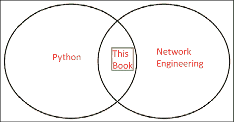
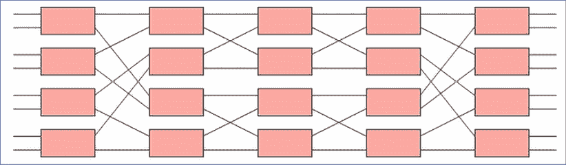
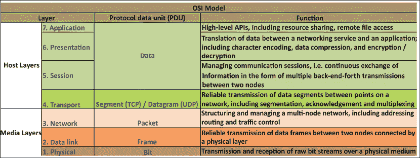
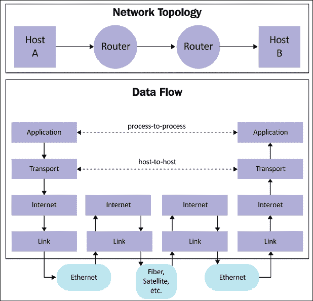
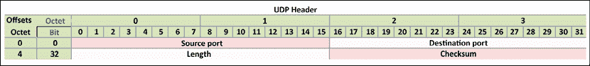
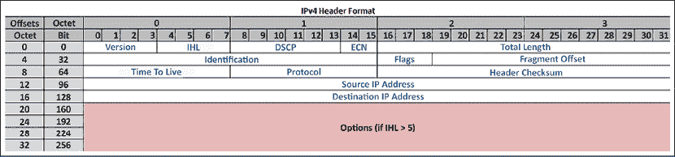
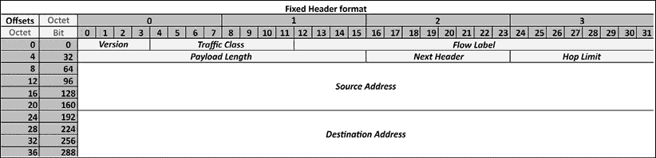

# 第一章：TCP/IP 协议集和 Python 的回顾

欢迎来到网络工程的新兴和激动人心的时代！当我 20 年前在世纪之交开始作为网络工程师工作时，这个角色的性质与今天的网络工程师角色截然不同。当时，网络工程师主要拥有特定领域的知识，使用命令行界面来管理和操作本地和广域网络。虽然他们偶尔会跨越学科界限来处理通常与系统管理和发展相关联的任务，但并没有明确期望网络工程师编写代码或理解编程概念。这种情况现在已经不再存在。

在过去的几年里，DevOps 和**软件定义网络（SDN**）运动等因素，以及其他因素，已经极大地模糊了网络工程师、系统工程师和开发者之间的界限。

你选择这本书的事实表明，你可能已经是一名网络 DevOps 的采用者，或者你可能在考虑探索网络可编程性的道路。也许你像我一样，已经作为网络工程师工作了多年，并想知道围绕 Python 编程语言的炒作是什么。你可能甚至已经精通 Python 编程语言，但想知道它在网络工程领域的应用。

如果你属于以下任何一类，或者只是对网络工程领域的 Python 感兴趣，我相信这本书适合你：



图 1.1：Python 和网络工程的交集

已经有许多优秀的书籍分别深入探讨了网络工程和 Python 这两个主题。我并不打算用这本书重复他们的努力。相反，这本书假设你已经有一些实际操作网络的经验，以及对于网络协议的基本理解。如果你已经熟悉 Python 作为编程语言，这将很有帮助，但你不需要成为专家。我们将在本章后面覆盖一些 Python 基础知识，作为 Python 知识的起点。再次强调，你不需要在 Python 或网络工程方面成为专家就能阅读这本书。这本书旨在建立在网络工程和 Python 的基本基础上，帮助读者学习和实践各种可以使他们的生活更轻松的应用。

在本章中，我们将对一些网络和 Python 概念进行一般性回顾。本章的其余部分应该设定了为了充分利用本书所需的前置知识水平。如果您想复习本章的内容，有许多免费或低成本的资源可以帮助您跟上进度。我推荐免费的 Khan Academy（[`www.khanacademy.org/`](https://www.khanacademy.org/)）和 Python 软件基金会提供的官方 Python 教程，网址为[`www.python.org/`](https://www.python.org/)。

本章将以非常快速的方式对相关网络主题进行高层次回顾，而不会过多涉及细节。在一章中深入探讨任何主题都实在没有足够的空间。说实话，我们在日常工作中很少能达到深入的水平。需要多少网络知识水平？根据我在该领域的经验，典型的网络工程师或开发者可能不会记住用于完成日常任务的精确的**传输控制协议**（**TCP**）状态机（我知道我不会），但他们会对**开放系统互联**（**OSI**）模型的基本知识、TCP 和**用户数据报协议**（**UDP**）操作、不同的 IP 头部字段和其他基本概念熟悉。这正是我们将在本章中涵盖的内容。

我们还将首先对 Python 语言进行高层次回顾；对于那些不每天使用 Python 编码的读者来说，这将为他们提供全书的基础。

具体来说，我们将涵盖以下主题：

+   互联网概述

+   OSI 和客户端-服务器模型

+   TCP、UDP 和 IP 协议族

+   Python 语法、类型、运算符和循环

+   使用函数、类和包扩展 Python

当然，本章中提供的信息并不全面；如果需要更多信息，请查阅参考文献。 

作为网络工程师，我们常常面临着需要管理的网络的规模和复杂性的挑战。这些网络从小型的家庭网络，到支持小型企业运营的中型网络，再到覆盖全球的大型跨国企业网络，种类繁多。其中最广泛的网络当然是互联网。没有互联网，就没有我们现在所知道的电子邮件、网站、API、流媒体或云计算。因此，在我们深入探讨协议和 Python 的具体细节之前，让我们先对互联网有一个概述。

# 互联网概述

互联网是什么？这个看似简单的问题可能会因每个人的背景不同而得到不同的答案。互联网对不同的人意味着不同的事情；年轻人、老年人、学生、教师、商人和诗人可能都会对同一个问题给出不同的答案。

对于网络工程师来说，互联网是一个全球计算机网络，由一个连接大型和小型网络的互联网网络组成。换句话说，它是一个没有集中所有者的**网络网络**。以你的家庭网络为例。它可能由一个集成了路由、以太网交换和无线接入点功能的设备组成，将你的智能手机、平板电脑、电脑和互联网电视连接在一起，以便这些设备相互通信。这就是你的**局域网**（**LAN**）。

当你的家庭网络需要与外界通信时，它将信息从你的 LAN 传递到一个更大的网络，通常被称为**互联网服务提供商**（**ISP**）。ISP 通常被认为是一家你付费上网的业务。他们可以通过将小型网络聚合到他们维护的更大网络中来做到这一点。

你的 ISP 网络通常由许多边缘节点组成，这些节点将流量聚合到其核心网络。核心网络的功能是通过高速网络将这些边缘网络相互连接。

在一些称为互联网交换点的更专业化的边缘节点中，你的 ISP 连接到其他 ISP，以便将你的流量适当地传递到目的地。从你的目的地到你的家用电脑、平板电脑或智能手机的返回路径可能或可能不会通过所有这些中间网络返回到你的原始设备，而源和目的地保持不变。这种不对称行为旨在具有容错性，以便没有任何一个节点可以关闭整个连接。

让我们来看看构成这个网络网络的组件。

## 服务器、主机和网络组件

**主机**是网络上的终端节点，与其他节点进行通信。在当今世界，一个主机可以是一台传统计算机，也可以是你的智能手机、平板电脑或电视。随着**物联网**（**IoT**）的兴起，主机的广泛定义可以扩展到包括**互联网协议**（**IP**）摄像头、机顶盒以及我们在农业、农业、汽车等领域使用的不断增多的传感器。随着连接到互联网的主机数量的激增，它们都需要被寻址、路由和管理。对适当网络的需求从未如此之大。

大多数时候，我们在互联网上都是进行服务请求。这可能包括浏览网页、发送或接收电子邮件、传输文件以及其他在线活动。这些服务都是由**服务器**提供的。正如其名所示，服务器为多个节点提供服务，通常具有更高的硬件规格。从某种意义上说，服务器是网络上的特定“超级节点”，为其他节点提供额外的功能。我们将在*客户端-服务器模型*部分再次探讨服务器。

如果你把服务器和主机看作城市和城镇，那么网络组件就是连接它们的道路和高速公路。实际上，当我们描述传输全球不断增长的比特和字节的网络组件时，信息高速公路这个词就会浮现在脑海中。在我们将要探讨的*OSI 模型*的七层 OSI 模型中，这些网络组件是一层到三层设备，有时甚至涉及到四层。它们是二层和三层的路由器和交换机，负责引导流量，以及一层传输设备，如光纤电缆、同轴电缆、绞合铜对，以及一些**密集波分复用**（**DWDM**）设备等。

总的来说，主机、服务器、存储和网络组件共同构成了我们今天所知道的互联网。

## 数据中心的兴起

在上一节中，我们探讨了服务器、主机和网络组件在网络中的作用。由于服务器对硬件容量的要求更高，它们通常被放置在中央位置以更有效地管理。我们通常将这些地点称为数据中心。它们通常可以分为三大类：

+   企业数据中心

+   云数据中心

+   边缘数据中心

让我们先看看企业数据中心。

### 企业数据中心

在典型的企业中，公司通常有对内部工具的需求，如电子邮件、文档存储、销售跟踪、订购、人力资源工具和知识共享内联网。这些服务成为文件和邮件服务器、数据库服务器和 Web 服务器。与用户计算机不同，这些通常是高端计算机，需要更高的电力、冷却和高带宽网络连接。硬件的副产品还包括它产生的噪音量，这在正常的工作空间中是不合适的。服务器通常放置在企业建筑中的中央位置，称为**主配线架**（**MDF**），以提供必要的电源供应、电源冗余、冷却和网络连接。

要连接到 MDF，用户的流量通常在更靠近用户的位置进行聚合，这些位置有时被称为**中间配线架**（**IDF**），然后它们被捆绑并连接到 MDF。IDF-MDF 的扩展通常遵循企业建筑或校园的物理布局，这是很常见的。例如，每层楼可以由一个 IDF 组成，它将流量聚合到同一建筑另一层的集中式 MDF。如果企业由几座建筑组成，可以在将它们连接到企业数据中心之前，通过组合建筑流量进行进一步的聚合。

许多企业数据中心（有时被称为校园网络）遵循三层网络设计。这些层级包括接入层、分发层和核心层。当然，与任何设计一样，没有硬性规则或一刀切的模式；三层设计只是一个一般性的指导。以我们之前提到的 User-IDF-MDF 为例，接入层相当于每个用户连接的端口，IDF 可以被视为分发层，而核心层则由连接到 MDF 和企业数据中心的连接组成。这当然是对企业网络的一种概括，因为其中一些不会遵循相同的模式。

### 云数据中心

随着云计算和软件，或**基础设施即服务**（**IaaS**）的兴起，云服务提供商建立的数据中心规模庞大，有时被称为超大规模数据中心。我们所说的云计算是指由亚马逊 AWS、微软 Azure 和谷歌云等提供的按需计算资源可用性，而用户无需直接管理这些资源。许多网络规模的服务提供商，如 Facebook，也可以归入这一类别。

由于他们需要容纳的服务器数量，云数据中心通常需要比任何企业数据中心都要高得多的电力、冷却和网络容量。即使在我为云服务提供商的数据中心工作了多年之后，每次我访问云服务提供商的数据中心，我仍然对其规模感到惊讶。仅举几个例子来说明其规模之大，云数据中心如此之大，能耗如此之高，通常建在靠近发电厂的地方，以便在电力运输过程中损失效率最小化。它们的冷却需求如此之高，以至于一些数据中心不得不在建设地点上发挥创意。例如，Facebook 在瑞典北部的吕勒奥（北极圈以南 70 英里）建立了其数据中心，部分原因是为了利用低温进行冷却。任何搜索引擎都可以提供一些令人惊叹的数字，当涉及到像亚马逊、微软、谷歌和 Facebook 这样的公司建造和管理云数据中心时。例如，位于爱荷华州西得梅因的微软数据中心占地 200 英亩，设施面积为 120 万平方英尺，需要该市花费估计 6500 万美元的公共基础设施升级费用。

在云服务提供商的规模下，他们需要提供的服务通常不划算，也不可能在单个服务器中实现。这些服务分布在多台服务器之间，有时跨越多个机架，为服务所有者提供冗余和灵活性。

延迟和冗余需求，以及服务器的物理分布，给网络带来了巨大的压力。连接服务器编队的互连相当于网络设备（如电缆、交换机和路由器）的爆炸性增长。这些需求转化为需要上架、配置和管理设备的数量。典型的网络设计将是多阶段 Clos 网络：



图 1.2：Clos 网络

从某种意义上说，云数据中心和其他网络中不断增加的适应性使得网络自动化成为必要，因为自动化可以提供速度、灵活性和可靠性。如果我们遵循通过终端和命令行界面管理网络设备的传统方式，所需的工程小时数将不允许在合理的时间内提供服务。更不用说人为的重复是易出错的、低效的，并且是对工程人才的巨大浪费。再加上复杂性，通常需要快速更改一些网络配置以适应快速变化的业务需求，例如将三层校园网络重新设计为基于 CLOS 的拓扑结构。

个人而言，云计算数据中心网络是我几年前开始使用 Python 进行网络自动化的起点，从那时起我就再也没有回头了。

### 边缘数据中心

如果我们在数据中心级别拥有足够的计算能力，为什么还要在其他地方保留任何东西呢？全球客户的所有连接都可以路由回数据中心服务器，然后我们可以结束一天的工作，对吧？当然，答案取决于用例。将请求和会话从客户端完全路由回大型数据中心的最大限制是传输中引入的延迟。换句话说，显著的延迟就是网络成为瓶颈的地方。

当然，任何一本基础物理教科书都可以告诉你，网络延迟的数字永远不会是零：即使光在真空中传播得再快，物理传输也需要时间。在现实世界中，延迟会比真空中的光还要高。为什么？因为网络数据包必须穿越多个网络，有时是通过海底电缆、缓慢的卫星链路、4G 或 5G 蜂窝链路，或者 Wi-Fi 连接。

我们如何减少网络延迟？一个解决方案是减少终端用户请求穿越的网络数量。我们可以尽量靠近终端用户，也许在请求进入我们网络的边缘与用户会合。我们可以在这些边缘位置放置足够的资源来处理请求。这在服务媒体内容，如音乐和视频时尤其常见。

让我们花一分钟时间想象一下，你正在构建下一代视频流媒体服务。为了提高流畅播放的客户满意度，你希望将视频服务器尽可能放置在客户附近，无论是内部还是客户互联网服务提供商（ISP）附近。此外，为了冗余和连接速度，视频服务器农场的上行链路不仅连接到一两个 ISP，而是连接到我们可以连接的所有 ISP，以减少跳数，从而减少我们需要通过设备的数量。所有连接都将拥有所需的带宽，以降低高峰时段的延迟。这种需求催生了大型 ISP 和内容提供商的互连交换边缘数据中心。即使网络设备的数量不如云数据中心高，它们也能从网络自动化中受益，包括提高可靠性、灵活性、安全性和可见性。

如果我们扩展边缘节点的概念并发挥创意，我们可以看到一些最新的技术，如自动驾驶汽车和**软件定义广域网（SD-WANs**）也是边缘节点的应用。自动驾驶汽车需要根据其传感器做出瞬间决策。SD-WAN 路由器需要本地路由数据包，而不需要咨询中央“大脑”。这些都是智能边缘节点的概念。

就像许多复杂主题一样，我们可以通过将主题分解成更小的、易于消化的部分来应对复杂性。网络通过使用层来模拟其元素的功能来分解复杂性。多年来，已经出现了不同的网络模型。在本书中，我们将探讨两个最重要的模型，从 OSI 模型开始。

# OSI 模型

没有一本网络书籍会不先介绍 OSI 模型就完整。该模型是一个概念模型，将电信功能分解为不同的层。该模型定义了七层，每一层都独立地位于另一层之上，具有定义的结构和特征。

例如，在网络层，IP 位于不同的数据链路层之上，如以太网或帧中继。OSI 参考模型是将不同的和多样化的技术规范化为一套人们可以达成共识的通用语言的好方法。这大大减少了在单个层上工作的各方的工作范围，并允许他们深入查看特定任务，而不必过多担心兼容性：



图 1.3：OSI 模型

OSI 模型最初在 20 世纪 70 年代末开始研究，后来由**国际标准化组织**（**ISO**），现在被称为**国际电信联盟电信标准化部门**（**ITU-T**）联合发布。它在介绍电信新主题时被广泛接受和引用。

在 OSI 模型开发的同时，互联网也在形成。最初为互联网设计的参考模型通常被称为 TCP/IP 模型。TCP 和 IP 是设计中所包含的原始协议套件。从某种程度上说，这与 OSI 模型相似，因为它们将端到端的数据通信划分为抽象层。

TCP/IP 模型的不同之处在于，它将 OSI 模型中的第 5 层到第 7 层合并到**应用层**，而**物理层**和**数据链路层**则合并到**链路层**：



图 1.4：互联网协议套件

OSI 和 TCP/IP 模型都适用于提供端到端数据通信的标准。在需要时，我们将参考 OSI 或 TCP/IP 模型，例如在接下来章节讨论网络框架时。就像传输层的模型一样，在应用层也有指导通信的参考模型。在现代网络中，客户端-服务器模型是大多数应用程序的基础。我们将在下一节中探讨客户端-服务器模型。

# 客户端-服务器模型

客户端-服务器参考模型演示了数据在两个节点之间通信的标准方式。当然，到现在我们都知道，并不是所有的节点都是平等的。即使在最早的**高级研究计划署网络**（**ARPANET**）时期，也存在工作站节点和提供内容给其他工作站节点的服务器节点。

这些服务器节点通常具有更高的硬件规格，并由工程师更紧密地管理。由于这些节点为其他节点提供资源和服务，因此它们被适当地称为服务器。服务器通常处于空闲状态，等待客户端发起对其资源的请求。这种由客户端请求请求资源的分布式资源模型被称为客户端-服务器模型。

这为什么很重要？如果你稍微思考一下，这种客户端-服务器模型极大地突出了网络的重要性。如果没有在客户端和服务器之间传输服务的需要，那么对网络互连的需求就不大。正是从客户端向服务器传输比特和字节的需要，凸显了网络工程的重要性。当然，我们所有人都清楚，最大的网络——互联网——是如何改变我们所有人的生活的，并且仍在继续这样做。

你可能会问，每个节点如何在每次需要互相交流时确定时间、速度、源和目的地？这引出了网络协议的概念。

# 网络协议集

在计算机网络发展的早期，协议是专有的，并且由设计连接方法的公司严格控制。如果你在你的主机上使用 **Novell 的 IPX/SPX 协议**，那么相同的宿主机将无法与 Apple 的 **AppleTalk** 宿主机通信，反之亦然。这些专有协议集通常具有与 OSI 参考模型类似的层，并遵循客户端-服务器通信方法，但它们之间不兼容。专有协议通常只在封闭的局域网中工作，无需与外界通信。当流量需要超出本地局域网时，通常使用协议转换设备，如路由器，将一个协议转换为另一个协议。例如，要将基于 AppleTalk 的网络连接到互联网，就需要使用路由器将 AppleTalk 协议转换为基于 IP 的网络。这种额外的转换通常并不完美，但由于在早期，大部分通信都在局域网内进行，因此网络管理员接受了这一点。

然而，随着网络间通信需求超出局域网，对标准化网络协议集的需求变得更加迫切。专有协议最终让位于 TCP、UDP 和 IP 的标准化协议集，这大大增强了网络之间通信的能力。互联网，最大的网络，依赖于这些协议的正常运行。在接下来的几节中，我们将查看每个协议集。

## 传输控制协议

TCP 是今天互联网上使用的主要协议之一。如果你打开了一个网页或者发送了一封电子邮件，你就已经遇到了 TCP 协议。该协议位于 OSI 模型的第 4 层，负责以可靠和错误检查的方式在两个节点之间传递数据段。TCP 包含一个 160 位的头部，其中包含源和目的端口、序列号、确认号、控制标志和校验和：


图 1.5：TCP 头部

### TCP 的功能和特性

TCP 使用数据报套接字或端口来建立主机间的通信。被称为**互联网分配数字权威机构**（**IANA**）的标准机构指定了知名端口来指示某些服务，例如`端口 80`用于 HTTP（网页）和`端口 25`用于 SMTP（邮件）。在客户端-服务器模型中，服务器通常监听这些知名端口之一，以便接收来自客户端的通信请求。TCP 连接由操作系统管理，套接字代表连接的本地端点。

协议操作由一个状态机组成，该机器在通信会话期间监听传入连接时需要跟踪，以及在连接关闭后释放资源。每个 TCP 连接都会经过一系列状态，如`Listen`、`SYN-SENT`、`SYN-RECEIVED`、`ESTABLISHED`、`FIN-WAIT`、`CLOSE-WAIT`、`CLOSING`、`LAST-ACK`、`TIME-WAIT`和`CLOSED`。不同的状态有助于管理 TCP 消息。

### TCP 消息和数据传输

TCP 和 UDP 之间最大的区别，即它们在同一层上的近亲，是它以有序和可靠的方式传输数据。TCP 操作保证交付的事实通常被称为 TCP 是一个面向连接的协议。它是通过首先建立一个三次握手来同步发送者和接收者之间的序列号，即`SYN`、`SYN-ACK`和`ACK`来实现的。

承认（acknowledgment）用于跟踪对话中的后续部分。最后，在对话结束时，一方将发送一个`FIN`消息，而另一方将确认接收到的`FIN`消息，并也发送一个自己的`FIN`消息。然后，`FIN`发起者将确认它接收到的`FIN`消息。

正如许多调试过 TCP 连接的人可以告诉你的，操作可能会变得相当复杂。人们当然可以欣赏到，大多数时候，操作只是在后台默默地发生。

关于 TCP 协议，可以写一本书；事实上，已经有许多关于该协议的优秀书籍被撰写。

由于本节是一个快速概述，如果感兴趣，*TCP/IP 指南* ([`www.tcpipguide.com`](http://www.tcpipguide.com)) 是一个优秀的免费资源，你可以用它来深入了解该主题。

## 用户数据报协议

UDP 也是所使用的协议套件的核心成员之一。与 TCP 一样，它运行在 OSI 模型的第 4 层，负责在应用层和 IP 层之间传递数据段。与 TCP 不同，其头部只有 64 位，仅包含源端口、目的端口、长度和校验和。轻量级的头部使其非常适合那些偏好快速数据传输而不需要在两个主机之间建立会话或需要可靠数据传输的应用程序。或许在今天快速互联网连接的背景下难以想象，但轻量级的头部在`X.21`和帧中继链路的早期传输速度上起到了重要作用。

除了速度差异外，不需要维护各种状态，如 TCP，这也节省了两个端点上的计算机资源：



图 1.6：UDP 头部

你现在可能想知道为什么在现代社会 UDP 还被使用；鉴于缺乏可靠传输，我们难道不希望所有连接都是可靠且无错误的吗？如果你考虑多媒体视频流或 Skype 通话，这些应用程序在应用程序只想尽可能快地传递数据报时，会从轻量级头部中受益。你也可以考虑基于 UDP 协议的快速**域名系统（DNS**）查找过程。在准确性和延迟之间的权衡通常倾向于低延迟。

当你在浏览器中输入的地址被转换为计算机可理解的地址时，用户将受益于一个轻量级的过程，因为这在将信息的第一位传递给你之前必须发生。

再次强调，本节并没有公正地处理 UDP 的主题，如果你对学习更多关于 UDP 感兴趣，鼓励你通过各种资源来探索这个主题。

关于 UDP 的维基百科文章[`en.wikipedia.org/wiki/User_Datagram_Protocol`](https://en.wikipedia.org/wiki/User_Datagram_Protocol)是了解 UDP 的一个好起点。

## 互联网协议

正如网络工程师们会告诉你的，我们生活在 IP 层，这是 OSI 模型的第 3 层。IP 负责在端节点之间进行寻址和路由，以及其他任务。IP 的寻址可能是其最重要的任务。地址空间被分为两部分：网络部分和主机部分。子网掩码用于通过将网络部分与 1 匹配，将主机部分与 0 匹配，来指示网络地址中的哪一部分由网络组成，哪一部分由主机组成。IPv4 使用点分表示法来表示地址，例如，`192.168.0.1`。

子网掩码可以是点分表示法（`255.255.255.0`）或使用正斜杠来表示应考虑的网络位数（`255.255.255.0`或`/24`）：



图 1.7：IPv4 头部

IPv6 报头，IPv4 IP 报头的下一代，具有固定部分和各种扩展报头：



图 1.8：IPv6 报头

在固定报头部分，IPv6 的**下一报头**字段可以指示一个后续的扩展报头，该扩展报头携带附加信息。它还可以标识上层协议，如 TCP 和 UDP。扩展报头可以包括路由和分片信息。例如，扩展报头可以包括原始数据包是如何分片的，以便目标节点可以相应地重新组装数据包。尽管协议设计者希望从 IPv4 迁移到 IPv6，但今天的互联网仍然主要使用 IPv4 进行寻址，其中一些服务提供商网络使用 IPv6 进行原生寻址。

### IP 网络地址转换（NAT）和网络安全

NAT 通常用于将一系列私有 IPv4 地址转换为公网可路由的 IPv4 地址。但它也可以指 IPv4 和 IPv6 之间的转换，例如在运营商边缘，当他们在需要转换为 IPv4 的网络内部使用 IPv6 时。有时，出于安全原因，也会使用 NAT6 到 IPv6。

安全是一个持续的过程，它整合了网络的所有方面，包括自动化和 Python。本书旨在使用 Python 帮助你管理网络；安全将在本书的后续章节中解决，例如使用 Python 实现访问列表、在日志中搜索漏洞等。我们还将探讨如何使用 Python 和其他工具在网络中获得可见性，例如基于网络设备信息的动态图形网络拓扑。

### IP 路由概念

IP 路由是关于两个端点之间的中间设备根据 IP 报头传输数据包的过程。对于在互联网上发生的所有通信，数据包将穿越各种中间设备。如前所述，中间设备包括路由器、交换机、光设备以及可能不检查网络和传输层以外的各种设备。在公路旅行类比中，你可能会从加利福尼亚州的圣地亚哥市到华盛顿州的西雅图市。IP 源地址相当于圣地亚哥，目标 IP 地址可以被认为是西雅图。在你的公路旅行中，你会在许多不同的中间地点停留，例如洛杉矶、旧金山和波特兰；这些可以被认为是源和目标之间的中间路由器和交换机。

为什么这很重要？从某种意义上说，这本书是关于管理和优化这些中间设备。在拥有多个美式足球场大小的超大型数据中心时代，需要高效、敏捷、可靠且成本效益高的网络管理方式，这对公司来说成为了一个主要的竞争优势。在未来的章节中，我们将深入探讨如何使用 Python 编程有效地管理网络。

现在我们已经了解了网络参考模型和协议套件，我们准备深入探讨 Python 语言本身。在本章中，我们将从 Python 的广泛概述开始。

# Python 语言概述

简而言之，这本书是关于如何使用 Python 使我们的网络工程生活变得更轻松。但 Python 是什么，为什么它是许多 DevOps 工程师的首选语言呢？用 Python 基金会执行摘要中的话来说（[`www.python.org/doc/essays/blurb/`](https://www.python.org/doc/essays/blurb/))：

> “Python 是一种解释型、面向对象、高级编程语言，具有动态语义。它的高级内置数据结构，结合动态类型和动态绑定，使其非常适合快速应用开发，同时也适用于作为脚本或粘合语言将现有组件连接起来。Python 简单、易于学习的语法强调可读性，因此降低了程序维护的成本。”

如果你对编程有些陌生，总结中提到的“面向对象”和“动态语义”可能对你来说意义不大。但我想我们都可以同意“快速应用开发”和“简单、易于学习的语法”听起来不错。作为解释型语言，Python 意味着在执行前几乎不需要编译过程，因此编写、测试和编辑 Python 程序所需的时间显著减少。对于简单的脚本，如果你的脚本失败，一个打印语句可能就是你需要来调试问题的所有。

使用解释器还意味着 Python 可以轻松地移植到不同的操作系统，如 Windows 和 Linux。在一个操作系统上编写的 Python 程序可以在另一个操作系统上使用，几乎不需要任何修改。

函数、模块和包通过将大型程序分解成简单的可重用部分来鼓励代码重用。Python 的面向对象特性使得将组件分组为对象更进一步。实际上，所有 Python 文件都是模块，可以被重用或导入到另一个 Python 程序中。这使得工程师之间共享程序变得容易，并鼓励代码重用。Python 还有一个“内置电池”的口号，这意味着对于日常任务，你不需要在 Python 语言本身之外下载任何额外的包。为了在不使代码过于臃肿的情况下实现这一目标，当安装 Python 解释器时，会安装一组 Python 模块，即标准库。对于诸如正则表达式、数学函数和 JSON 解码等常见任务，你所需要的就是*导入*语句，解释器会将这些函数移动到你的程序中。这个“内置电池”的口号是我认为 Python 语言的一个杀手级特性。

最后，Python 代码可以从一个相对较小的脚本开始，只有几行代码，并逐渐发展成为一个完整的生产系统，这对网络工程师来说非常方便。正如我们许多人所知，网络通常是自然生长的，没有明确的总体规划。一种能够随着你的网络一起发展的语言是无价的。你可能会惊讶地发现，许多被认为是脚本语言的编程语言，却被许多尖端公司的完整生产系统所使用（使用 Python 的组织：[`wiki.python.org/moin/OrganizationsUsingPython`](https://wiki.python.org/moin/OrganizationsUsingPython)）。

如果你曾经在一个必须在不同供应商平台之间切换的环境中工作过，比如在 Cisco IOS 和 Juniper Junos 之间切换，你就知道在尝试完成相同任务时，在语法和用法之间切换是多么痛苦。由于 Python 足够灵活，既可以用于小型程序也可以用于大型程序，因此不存在这样的剧烈上下文切换。它只是从小到大的相同 Python 代码！

在本章的剩余部分，我们将对 Python 语言进行一次高级的巡礼。如果你已经熟悉基础知识，可以快速浏览或跳到*第二章*。

### Python 版本

如许多读者可能已经知道的那样，Python 在过去几年中一直在经历从 Python 2 到 Python 3 的过渡。Python 3 于 2008 年发布，距今已有 10 多年，**持续开发**，最新的版本是 3.10。不幸的是，Python 3 与 Python 2 不向后兼容。

在撰写本书第四版的中期，即 2022 年中，Python 社区几乎全部转向了 Python 3。事实上，Python 2 正式于 2020 年 1 月 1 日进入生命周期的终结。最新的 Python 2.x 版本，2.7，是在 2010 年中旬发布的，已有六年多。由于 Python 2 已进入生命周期的终结，并且不再由 Python 软件基金会维护，因此我们都应该使用 Python 3。在本书中，我们将使用最新的稳定版 Python 3，Python 3.10。Python 3.10 有许多令人兴奋的功能，例如稳定的异步 I/O，这对于网络自动化非常有帮助。除非另有说明，本书将使用 Python 3 进行代码示例。当适用时，我们将指出 Python 2 和 Python 3 的差异。

## 操作系统

如前所述，Python 是跨平台的。Python 程序可以在 Windows、Mac 和 Linux 上运行。实际上，当你需要确保跨平台兼容性时，需要特别注意，例如处理 Windows 文件名中反斜杠的细微差别以及在不同操作系统上激活 Python 虚拟环境的步骤。由于本书是为 DevOps、系统和网络工程师编写的，Linux 是目标受众的首选平台，尤其是在生产环境中。

本书中的代码将在 Linux Ubuntu 22.04 LTS 机器上测试。截至本书编写时，Python 3.10.4 是 22.04 默认版本，因此我们不需要单独安装 Python 3。我还会尽力确保代码在 Windows 和 macOS 平台上运行一致。

如果你感兴趣操作系统细节，如下所示：

```py
$ uname -a
Linux network-dev-4 5.15.0-39-generic #42-Ubuntu SMP Thu Jun 9 23:42:32 UTC 2022 x86_64 x86_64 x86_64 GNU/Linux
$ lsb_release -a
No LSB modules are available.
Distributor ID:	Ubuntu
Description:	Ubuntu 22.04 LTS
Release:	22.04
Codename:	jammy 
```

## 运行 Python 程序

Python 程序由解释器执行，这意味着代码将通过这个解释器传递给底层操作系统执行。Python 开发社区实现了几种不同的解释器，例如 IronPython 和 Jython。在本书中，我们将使用今天最常用的 Python 解释器，CPython。除非另有说明，否则本书中提到的 Python 都是指 CPython。

你可以使用 Python 的一个方法是利用交互式提示符。当你想要快速测试一段 Python 代码或概念而不需要编写整个程序时，这非常有用。

这通常是通过简单地输入 `Python3` 关键字来完成的：

```py
$ python3
Python 3.10.4 (main, Apr  2 2022, 09:04:19) [GCC 11.2.0] on linux
Type "help", "copyright", "credits" or "license" for more information.
>>> print("hello world")
hello world 
```

交互式模式是 Python 最有用的功能之一。在交互式外壳中，你可以输入任何有效的语句或语句序列，并立即得到结果。我通常使用交互式外壳来探索我不熟悉的特性或库。

交互式模式也可以用于更复杂的任务，例如实验数据结构的行为，例如可变与不可变数据类型。谈谈即时的满足感！

在 Windows 上，如果你没有收到 Python 壳提示，可能是因为你的系统搜索路径中没有该程序。最新的 Windows Python 安装程序提供了一个复选框，用于将 Python 添加到系统路径；确保在安装过程中选中它。或者，你可以通过转到 **环境设置** 来手动将程序添加到路径中。

然而，运行 Python 程序的一个更常见的方式是保存你的 Python 文件，然后在解释器之后运行它。这将避免你重复输入相同的语句。Python 文件只是普通的文本文件，通常以 `.py` 扩展名保存。在 *Nix 世界中，你还可以在顶部添加 **shebang**（#!）行来指定将用于运行文件的解释器。`#` 字符可以用来指定不会被解释器执行的注释。`helloworld.py` 文件有以下语句：

```py
# This is a comment 
print("hello world") 
```

这可以按以下方式执行：

```py
$ python helloworld.py
hello world 
```

让我们看看基本的 Python 构建结构，内置数据类型。

## Python 内置类型

在计算机编程中，数据类型通常指的是计算机程序知道变量可以有什么种类的值的方式，例如单词或数字。Python 实现了动态类型或鸭子类型，并试图在您自动声明对象时确定其类型。Python 有几个标准类型是内置到解释器中的：

+   **数值**: `int`、`float`、`complex` 和 `bool`（具有 `True` 或 `False` 值的 `int` 子类）

+   **序列**: `str`、`list`、`tuple` 和 `range`

+   **映射**: `dict`

+   **集合**: `set` 和 `frozenset`

+   **None**: 空对象

我们将简要检查 Python 中的不同类型。如果它们此刻对你来说没有意义，那么在接下来的示例部分应用它们时可能会更有意义。

### `None` 类型

`None` 类型表示没有值的对象。`None` 类型在那些没有明确返回任何内容（如函数）但只是进行一些数学计算并退出的函数中返回。`None` 类型也用于函数参数中，如果调用者没有传入实际值，则会出错。例如，我们可以在函数中指定“如果 a==None，则引发错误”。

### 数值

Python 的数值对象基本上是数字。除了布尔值外，`int`、`long`、`float` 和 `complex` 的数值类型都是带符号的，这意味着它们可以是正数或负数。布尔值是整数的子类，可以是两个值之一：1 表示 True，0 表示 False。在实践中，我们几乎总是用 True 或 False 而不是数值 1 和 0 来测试布尔值。其余的数值类型通过它们可以精确表示数字的程度来区分；在 Python 3 中，`int` 没有最大大小，而在 Python 2 中，`int` 表示有限范围的整数。浮点数是使用机器上的双精度表示（64 位）的数字。

### 序列

序列是有序的对象集合，具有非负整数的索引。由于 Python 中有许多不同的序列类型（str、列表、元组等），让我们使用交互式解释器来展示不同的序列类型。

请随意在自己的电脑上输入。

有时，人们可能会惊讶地发现`字符串`（想想单词）是一种序列类型。但如果你仔细观察，字符串是由一系列字符组成的。字符串由单引号、双引号或三引号包围。

注意在以下示例中，引号必须匹配。一个开始的双引号需要与一个结束的双引号相匹配。三引号允许字符串跨越不同的行：

```py
>>> a = "networking is fun"
>>> b = 'DevOps is fun too'
>>> c = """what about coding?
... super fun!"""
>>> 
```

另外两种常用的序列类型是列表和元组。列表是由括号包围的对象序列。就像字符串一样，列表通过非零整数索引，从 0 开始。

列表的值通过引用索引号来检索：

```py
>>> vendors = ["Cisco", "Arista", "Juniper"]
>>> vendors[0]
'Cisco'
>>> vendors[1]
'Arista'
>>> vendors[2]
'Juniper' 
```

元组就像列表，通过括号包围值创建。就像列表一样，元组中的值通过引用其索引号来检索。与列表不同，创建后值不能修改：

```py
>>> datacenters = ("SJC1", "LAX1", "SFO1")
>>> datacenters[0]
'SJC1'
>>> datacenters[1]
'LAX1'
>>> datacenters[2]
'SFO1' 
```

一些操作对所有序列类型都是通用的，例如通过索引返回一个元素。序列还可以通过其元素的一部分进行切片：

```py
>>> a
'networking is fun'
>>> a[1]
'e'
>>> vendors
['Cisco', 'Arista', 'Juniper']
>>> vendors[1]
'Arista'
>>> datacenters
('SJC1', 'LAX1', 'SFO1')
>>> datacenters[1]
'LAX1'
>>>
>>> a[0:2]
'ne'
>>> vendors[0:2]
['Cisco', 'Arista']
>>> datacenters[0:2]
('SJC1', 'LAX1')
>>> 
```

记住，索引从 0 开始。因此，索引 1 是序列中的第二个元素。

也有一些可以应用于序列类型的通用函数，例如检查元素数量和查找所有元素中的最小值和最大值：

```py
>>> len(a)
17
>>> len(vendors)
3
>>> len(datacenters)
3
>>>
>>> b = [1, 2, 3, 4, 5]
>>> min(b)
1
>>> max(b)
5 
```

有一些方法只适用于字符串。值得注意的是，这些方法不会修改底层字符串数据本身，总是返回一个新的字符串。简而言之，可变对象（如列表和字典）在创建后可以更改，而不可变对象（例如字符串）则不能。如果你想将新返回的值用于其他操作，你需要捕获返回值并将其分配给不同的变量：

```py
>>> a
'networking is fun'
>>> a.capitalize()
'Networking is fun'
>>> a.upper()
'NETWORKING IS FUN'
>>> a
'networking is fun'
>>> b = a.upper()
>>> b
'NETWORKING IS FUN'
>>> a.split()
['networking', 'is', 'fun']
>>> a
'networking is fun'
>>> b = a.split()
>>> b
['networking', 'is', 'fun']
>>> 
```

这里有一些列表的常用方法。Python 列表数据类型在将多个项目组合在一起并逐个迭代它们方面是一个非常有用的结构。例如，我们可以创建一个数据中心机架交换机的列表，并通过逐个迭代它们将相同的访问列表应用于所有这些交换机。由于列表的值在创建后可以修改（与元组不同），我们还可以在程序执行过程中扩展和收缩现有的列表：

```py
>>> routers = ['r1', 'r2', 'r3', 'r4', 'r5']
>>> routers.append('r6')
>>> routers
['r1', 'r2', 'r3', 'r4', 'r5', 'r6']
>>> routers.insert(2, 'r100')
>>> routers
['r1', 'r2', 'r100', 'r3', 'r4', 'r5', 'r6']
>>> routers.pop(1)
'r2'
>>> routers
['r1', 'r100', 'r3', 'r4', 'r5', 'r6'] 
```

Python 列表非常适合存储数据，但如果我们需要按位置引用数据时，有时跟踪数据会有些棘手。如果这是一个问题，我们可以使用不同的 Python 数据类型。让我们看看 Python 的映射类型。

### 映射

Python 提供了一种映射类型，称为**字典**。字典数据类型在我看来就像是一个穷人的数据库，因为它包含可以通过键索引的对象。在其他编程语言中，这通常被称为*关联数组或散列表*。如果你在其他语言中使用过任何类似字典的对象，你就会知道这种类型有多么强大，因为你可以用人类可读的键来引用对象。

这个键，不仅仅是一个数字，对于试图维护和调试代码的可怜家伙来说，会更有意义。那个人可能就是你，在写完代码几个月后，凌晨 2 点试图调试代码的时候。

字典值中的对象也可以是其他数据类型，例如列表。因为我们用方括号表示列表，用圆括号表示元组，所以我们用花括号来创建字典。以下是一个示例，说明我们如何使用字典来表示我们的数据中心设备：

```py
>>> datacenter1 = {'spines': ['r1', 'r2', 'r3', 'r4']}
>>> datacenter1['leafs'] = ['l1', 'l2', 'l3', 'l4']
>>> datacenter1
{'leafs': ['l1', 'l2', 'l3', 'l4'], 'spines': ['r1',
'r2', 'r3', 'r4']}
>>> datacenter1['spines']
['r1', 'r2', 'r3', 'r4']
>>> datacenter1['leafs']
['l1', 'l2', 'l3', 'l4'] 
```

Python 字典是我最喜欢的网络脚本中的数据容器之一，我一直在使用它。然而，在其他不同的用例中，还有其他数据容器可能会派上用场——集合就是其中之一。

### 集合

**集合**用于包含无序的对象集合。与列表和元组不同，集合是无序的，不能按数字索引。但有一个特性使集合显得非常有用：集合的元素永远不会重复。想象一下，你有一个需要放入访问列表的 IP 列表。这个 IP 列表的唯一问题是它们充满了重复项。

现在，想想你需要多少行代码来遍历 IP 列表，逐个排序出唯一的项目。现在考虑这一点：内置的集合类型只需一行代码就可以消除重复项。就我个人而言，Python 的集合数据类型在我的代码中并不常用，但当我需要它时，我总是非常感激它的存在。一旦创建了集合或集合，可以使用`union`、`intersection`和`differences`来相互比较：

```py
>>> a = "hello"
# Use the built-in function set() to convert the string to a set
>>> set(a)
{'h', 'l', 'o', 'e'}
>>> b = set([1, 1, 2, 2, 3, 3, 4, 4])
>>> b
{1, 2, 3, 4}
>>> b.add(5)
>>> b
{1, 2, 3, 4, 5}
>>> b.update(['a', 'a', 'b', 'b'])
>>> b
{1, 2, 3, 4, 5, 'b', 'a'}
>>> a = set([1, 2, 3, 4, 5])
>>> b = set([4, 5, 6, 7, 8])
>>> a.intersection(b)
{4, 5}
>>> a.union(b)
{1, 2, 3, 4, 5, 6, 7, 8}
>>> 1 *
{1, 2, 3} 
```

现在我们已经了解了不同的数据类型，接下来我们将游览 Python 运算符。

## Python 运算符

Python 有一些你从任何编程语言中都会期望的*数值运算符*，例如`+`、`-`等等；注意，截断除法（`//`，也称为**地板除法**）将结果截断为整数和浮点数，但只返回整数值。取模运算符（`%`）返回除法中的余数值：

```py
>>> 1 + 2
3
>>> 2 - 1
1
>>> 1 * 5
5
>>> 5 / 1 #returns float
5.0
>>> 5 // 2 # // floor division
2
>>> 5 % 2 # modulo operator
1 
```

还有*比较运算符*。注意，双等号用于比较，而单等号用于变量赋值：

```py
>>> a = 1
>>> b = 2
>>> a == b
False
>>> a > b
False
>>> a < b
True
>>> a <= b
True 
```

我们还可以使用两个常见的成员运算符来测试一个对象是否在序列类型中：

```py
>>> a = 'hello world'
>>> 'h' in a
True
>>> 'z' in a
False
>>> 'h' not in a
False
>>> 'z' not in a
True 
```

Python 操作符允许我们高效地执行简单操作。在下一节中，我们将探讨如何使用控制流来重复这些操作。

## Python 控制流工具

`if`、`else`和`elif`语句控制条件代码的执行。与一些其他编程语言不同，Python 使用缩进来结构化代码块。只要它们对齐，缩进空间可以有任意数量。常见的做法通常是使用 2 或 4 个空格。条件语句的格式如下：

```py
if expression:
  do something
elif expression:
  do something if the expression meets
elif expression:
  do something if the expression meets
...
else:
  statement 
```

这里有一个简单的示例：

```py
>>> a = 10
>>> if a > 1:
...   print("a is larger than 1")
... elif a < 1:
...   print("a is smaller than 1")
... else:
...   print("a is equal to 1")
...
a is larger than 1
>>> 
```

`while`循环将继续执行，直到条件为`False`，所以如果你不希望继续执行（并导致进程崩溃），请小心使用：

```py
while expression:
  do something

>>> a = 10
>>> b = 1
>>> while b < a:
...   print(b)
...   b += 1
...
1
2
3
4
5
6
7
8
9 
```

`for`循环可以与任何支持迭代的对象一起使用；这意味着所有内置的序列类型，如`lists`、`tuples`和`strings`，都可以在`for`循环中使用。以下`for`循环中的字母`i`是一个迭代变量，所以你通常可以选择在代码上下文中有意义的东西：

```py
for i in sequence:
  do something
>>> a = [100, 200, 300, 400]
>>> for number in a:
...   print(number)
...
100
200
300
400 
```

现在我们已经了解了 Python 数据类型、操作符和控制流，我们准备将它们组合成可重用的代码块，称为函数。

## Python 函数

有时当你发现自己正在复制粘贴一些代码片段时，这可能是一个很好的迹象，表明你应该将其拆分成自包含的函数块。这种做法有助于提高模块化程度，更容易维护，并允许代码重用。Python 函数通过使用`def`关键字和函数名来定义，后跟函数参数。函数体由要执行的 Python 语句组成。在函数的末尾，你可以选择返回一个值给函数调用者。默认情况下，如果没有指定返回值，它将返回`None`对象：

```py
def name(parameter1, parameter2):
  statements
  return value 
```

在接下来的章节中，我们将看到更多关于函数的示例，但这里有一个快速示例。在以下示例中，我们使用位置参数，因此第一个元素通过函数中的第一个变量来引用。另一种引用参数的方式是使用具有默认值的键控参数，例如`def subtract(a=10, b=5)`：

```py
>>> def subtract(a, b):
...   c = a - b
...   return c
...
>>> result = subtract(10, 5)
>>> result
5 
```

Python 函数非常适合将任务分组在一起。我们能否将不同的函数组合成更大的可重用代码块？是的，我们可以通过 Python 类来实现这一点。

## Python 类

Python 是一种**面向对象编程**（**OOP**）语言。Python 创建对象的方式是使用`class`关键字。Python 对象最常见的是函数（方法）、变量和属性（属性）的集合。一旦定义了一个类，就可以创建该类的实例。类作为后续实例的蓝图。

面向对象编程（OOP）的主题超出了本章的范围，但这里有一个简单的`router`对象定义示例，用以说明这一点：

```py
>>> class router(object):
...   def __init__(self, name, interface_number, vendor):
...     self.name = name
...     self.interface_number = interface_number
...     self.vendor = vendor
...
>>> 
```

一旦定义，我们可以创建任意数量的该类实例：

```py
>>> r1 = router("SFO1-R1", 64, "Cisco")
>>> r1.name
'SFO1-R1'
>>> r1.interface_number
64
>>> r1.vendor
'Cisco'
>>>
>>> r2 = router("LAX-R2", 32, "Juniper")
>>> r2.name
'LAX-R2'
>>> r2.interface_number
32
>>> r2.vendor
'Juniper'
>>> 
```

当然，Python 对象和面向对象编程（OOP）还有很多内容。我们将在未来的章节中查看更多示例。

## Python 模块和包

任何 Python 源文件都可以用作模块，并且你在该源文件中定义的任何函数和类都可以被其他 Python 脚本重用。要加载代码，引用模块的文件需要使用 `import` 关键字。当文件被导入时，会发生三件事情：

1.  该文件为源文件中定义的对象创建了一个新的命名空间。

1.  调用者执行模块中包含的所有代码。

1.  该文件在调用者中创建了一个名称，该名称引用了被导入的模块。该名称与模块的名称匹配。

记得我们使用交互式 shell 定义的 `subtract()` 函数吗？为了重用该函数，我们可以将其放入一个名为 `subtract.py` 的文件中：

```py
def subtract(a, b):
  c = a - b
  return c 
```

在与 `subtract.py` 文件相同的目录中的文件内，你可以启动 Python 解释器并导入此函数：

```py
>>> import subtract
>>> result = subtract.subtract(10, 5)
>>> result
5 
```

这之所以有效，是因为默认情况下，Python 会首先在当前目录中搜索可用的模块。记得我们之前提到的标准库吗？没错，那些只是被用作模块的 Python 文件。

如果你在一个不同的目录中，你可以使用 `sys` 模块中的 `sys.path` 手动添加一个搜索路径位置。

我们能否在 Python 中将多个模块组合在一起？是的，Python 包允许将多个模块组合在一起。这进一步组织了 Python 模块，以提供更多的命名空间保护和更好的重用性。包是通过创建一个具有你想要用作命名空间的名称的目录来定义的，然后将模块源文件放置在该目录下。

为了让 Python 识别目录为 Python 包，只需在该目录中创建一个 `__init__.py` 文件。`__init__.py` 文件可以是一个空文件。在 `subtract.py` 文件的相同示例中，假设你要创建一个名为 `math_stuff` 的目录，我们可以在该目录中创建一个 `__init__.py` 文件：

```py
$ mkdir math_stuff
$ touch math_stuff/__init__.py
$ tree
.
 ├── helloworld.py
 └── math_stuff
  ├── __init__.py
  └── subtract.py
1 directory, 3 files
$ 
```

引用模块的方式是使用点符号包含包名，例如，`math_stuff.subtract`：

```py
>>> from math_stuff.subtract import subtract
>>> result = subtract(10, 5)
>>> result
5
>>> 
```

如你所见，模块和包是组织大型代码文件和使 Python 代码共享变得更容易的绝佳方式。

# 摘要

在本章中，我们介绍了 OSI 模型并回顾了网络协议套件，如 TCP、UDP 和 IP。它们作为处理任何两个主机之间寻址和通信协商的层工作。这些协议的设计考虑了可扩展性，并且与它们最初的设计相比几乎没有变化。考虑到互联网的爆炸式增长，这真是一项了不起的成就。

我们还快速回顾了 Python 语言，包括内置类型、运算符、控制流、函数、类、模块和包。Python 是一种强大、生产就绪且易于阅读的语言，这使得它成为网络自动化的理想选择。网络工程师可以利用 Python 从简单的脚本开始，逐步过渡到其他高级功能。

在*第二章*，*低级网络设备交互*中，我们将开始探讨如何使用 Python 编程方式与网络设备进行交互。

# 加入我们的书籍社区

要加入这本书的社区——在这里您可以分享反馈、向作者提问，并了解新书发布——请扫描下面的二维码：

[`packt.link/networkautomationcommunity`](https://packt.link/networkautomationcommunity)


