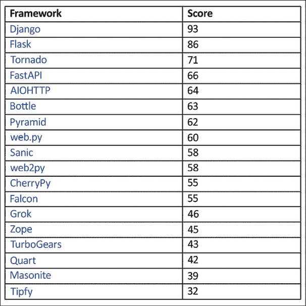
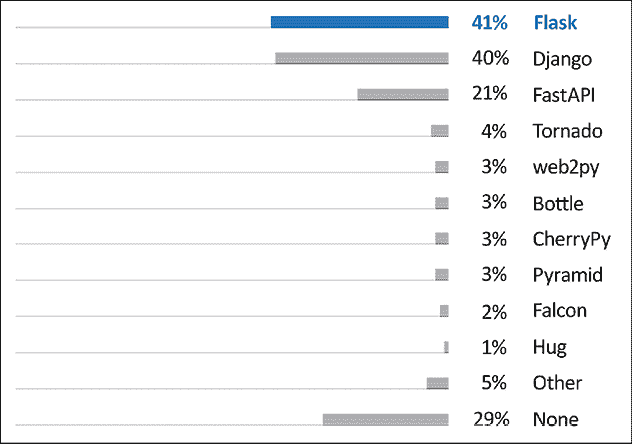
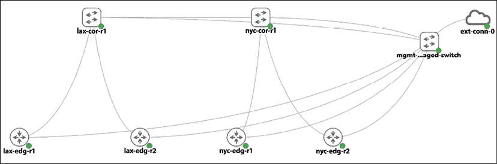
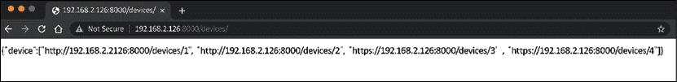

# 第九章：使用 Python 构建网络 Web 服务

在前面的章节中，我们是他人提供的 API 的消费者。在*第三章*，*APIs 和 Intent-Driven Networking*中，我们看到了我们可以使用`HTTP POST`请求到 NX-API 的`http://<your device ip>/ins` URL，在`HTTP POST`体中嵌入`CLI`命令，以在 Cisco Nexus 设备上远程执行命令；设备随后在其 HTTP 响应中返回命令执行输出。在*第八章*，*Network Monitoring with Python – Part 2*中，我们使用`HTTP GET`方法在我们的 sFlow-RT 上`http://<your host ip>:8008/version`，使用空体来检索 sFlow-RT 软件的版本。这些请求-响应交换是 RESTful 网络服务的例子。

根据维基百科（[`en.wikipedia.org/wiki/Representational_state_transfer`](https://en.wikipedia.org/wiki/Representational_state_transfer)）：

> “表示状态转移（REST）或 RESTful 网络服务是提供互联网上计算机系统之间互操作性的方法之一。符合 REST 规范的 Web 服务允许请求系统使用统一和预定义的无状态操作集来访问和操作 Web 资源的文本表示。”

正如所注，使用 HTTP 协议的 RESTful 网络服务只是网络信息交换的许多方法之一；其他形式的网络服务也存在。然而，它是今天最常用的网络服务，相关的`GET`、`POST`、`PUT`和`DELETE`动词作为信息交换的预定义方式。

如果您对 HTTPS 与 HTTP 进行比较，在我们的讨论中，我们将 HTTPS 视为 HTTP 的安全扩展（[`en.wikipedia.org/wiki/HTTPS`](https://en.wikipedia.org/wiki/HTTPS)），与 RESTful API 具有相同的底层协议。

在服务提供方，向用户提供 RESTful 服务的一个优点是能够隐藏内部操作。例如，在 sFlow-RT 的情况下，如果我们想登录设备查看安装的软件版本，而不是使用其 RESTful API，我们就需要更深入地了解工具，知道在哪里检查。然而，通过将资源作为 URL 提供，API 提供者将版本检查操作从请求者那里抽象出来，使得操作变得更加简单。这种抽象还提供了一层安全性，因为它可以根据需要仅打开端点。

作为我们网络宇宙的主宰，RESTful 网络服务为我们提供了许多显著的益处，我们可以享受以下好处：

+   您可以抽象请求者，使其不必了解网络操作的内部。例如，我们可以提供一个网络服务来查询交换机版本，而无需请求者知道确切的 CLI 命令或交换机 API。

+   我们可以整合和定制符合我们网络需求独特操作的，例如一个用于升级我们所有机架顶部交换机的资源。

+   我们可以通过仅按需公开操作来提供更好的安全性。例如，我们可以为核心网络设备提供只读 URL（`GET`），为访问级别交换机提供读写 URL（`GET`/`POST`/`PUT`/`DELETE`）。

在本章中，我们将使用最受欢迎的 Python 网络框架之一，**Flask**，来为我们的网络创建 RESTful 网络服务。在本章中，我们将学习以下内容：

+   比较 Python 网络框架

+   Flask 简介

+   涉及静态网络内容操作

+   涉及动态网络操作的操作

+   认证和授权

+   在容器中运行我们的网络应用

让我们从查看可用的 Python 网络框架以及为什么我们选择了 Flask 开始。

# 比较 Python 网络框架

Python 以其众多的网络框架而闻名。在 Python 社区中有一个流行的笑话，那就是你是否可以作为一个全职的 Python 开发者而不使用任何 Python 网络框架。有几个 Python 网络开发者会议，包括 DjangoCon US ([`djangocon.us/`](https://djangocon.us/))、DjangoCon EU ([`djangocon.eu/`](https://djangocon.eu/))、FlaskCon ([`flaskcon.com/`](https://flaskcon.com/))、Python Web Conference ([`pythonwebconf.com/`](https://pythonwebconf.com/))以及许多本地聚会。每个会议每年都吸引数百名参与者。我提到过 Python 有一个蓬勃发展的网络开发社区吗？

如果你按[`hotframeworks.com/languages/python`](https://hotframeworks.com/languages/python)对 Python 网络框架进行排序，你会发现当涉及到 Python 和网络框架时，选择余地非常丰富：



图 9.1：Python 网络框架排名（来源：https://hotframeworks.com/languages/python）

在最近的 2021 年 Python 开发者调查中，Flask 略胜 Django，成为最受欢迎的网络框架：



图 9.2：2021 年 Python 开发者调查（来源：https://lp.jetbrains.com/python-developers-survey-2021/）

在这么多选项中，我们应该选择哪个框架？逐一尝试所有框架将耗费大量时间。哪个网络框架更好的问题也是网络开发者之间一个充满激情的话题。如果你在任何论坛上提出这个问题，比如 Quora，或者在 Reddit 上搜索，准备好接受一些高度主观的回答和激烈的辩论。

说到 Quora 和 Reddit，这里有一个有趣的事实：Quora 和 Reddit 都是用 Python 编写的。Reddit 使用 Pylons（[`www.reddit.com/wiki/faq#wiki_so_what_python_framework_do_you_use.3F`](https://www.reddit.com/wiki/faq#wiki_so_what_python_framework_do_you_use.3F)），而 Quora 最初使用 Pylons，但用内部代码替换了框架的一部分（[`www.quora.com/What-languages-and-frameworks-are-used-to-code-Quora`](https://www.quora.com/What-languages-and-frameworks-are-used-to-code-Quora)）。

当然，我偏向于编程语言（Python！）和 Web 框架（Flask 和 Django！）。在本节中，我希望传达我选择其中一个而不是另一个进行特定项目的理由。让我们从先前的 HotFrameworks 列表中挑选前两个框架进行比较：

+   **Django**：自诩为“对完美主义者有截止日期的 Web 框架”，是一个高级 Python Web 框架，鼓励快速开发和清晰、实用的设计（[`www.djangoproject.com/`](https://www.djangoproject.com/)）。它是一个大型框架，包含预构建的代码，提供管理面板和内置内容管理。

+   **Flask**：这是一个基于 Werkzeug、Jinja2 和其他应用的 Python 微框架（[`palletsprojects.com/p/flask/`](https://palletsprojects.com/p/flask/)）。作为一个微框架，Flask 旨在保持核心小且易于扩展，当需要时。微框架中的“微”并不意味着 Flask 缺乏功能，也不意味着它不能在生产环境中工作。

我使用 Django 处理一些较大的项目，而使用 Flask 进行快速原型设计。Django 框架对如何做事有很强的观点；任何偏离它的做法有时都会让用户感觉像是在“与框架抗争”。例如，如果你查看 Django 数据库文档（[`docs.djangoproject.com/en/4.0/ref/databases/`](https://docs.djangoproject.com/en/4.0/ref/databases/)），你会注意到该框架支持几种不同的 SQL 数据库。然而，它们都是 SQL 数据库的变体，如 MySQL、PostgreSQL、SQLite 等。

如果我们想使用像 MongoDB 或 CouchDB 这样的 NoSQL 数据库呢？这可能可行，但可能会让我们自己动手，因为 Django 没有官方支持。作为一个有观点的框架当然不是坏事。这只是观点的问题（没有打趣的意思）。

当我们需要简单快速的东西时，保持核心代码小并在需要时扩展它是非常吸引人的。文档中的初始示例只有六行代码，即使你没有任何先前的经验也容易理解。由于 Flask 是考虑到扩展而构建的，因此编写我们的扩展，如装饰器，相对容易。尽管它是一个微型框架，但 Flask 核心仍然包括必要的组件，如开发服务器、调试器、与单元测试的集成、RESTful 请求分发等，以帮助您快速入门。

如你所见，Django 和 Flask 几乎在所有衡量标准上都是最受欢迎的 Python 网络框架。我们选择任何一个作为起点都不会出错。这两个框架带来的流行度意味着它们都有广泛的社区贡献和支持，并且可以快速开发现代功能。

为了便于部署，我认为在构建网络 Web 服务时，Flask 是我们理想的选择。

# Flask 和实验室设置

在本章中，我们将继续使用虚拟环境来隔离 Python 环境和依赖。我们可以启动一个新的虚拟环境，或者我们可以继续使用我们一直在使用的现有虚拟环境。我的偏好是启动一个新的虚拟环境。我将称它为`ch09-venv`：

```py
$ python3 -m venv ch09-venv
$ source ch09-venv/bin/activate 
```

在本章中，我们将安装相当多的 Python 包。为了使生活更轻松，我在本书的 GitHub 仓库中包含了一个`requirements.txt`文件；我们可以使用它来安装所有必要的包（记得激活你的虚拟环境）。你应该在安装过程中看到正在下载和成功安装的包：

```py
(ch09-venv) $ cat requirements.txt 
click==8.1.3
Flask==2.2.2
itsdangerous==2.1.2
Jinja2==3.1.2
MarkupSafe==2.1.1
Werkzeug==2.2.2 
…
(ch09-venv) $ pip install -r requirements.txt 
```

对于我们的网络拓扑，我们将使用我们在前几章中使用的`2_DC_Topology`，如图所示：



图 9.3：实验室拓扑

让我们接下来看看 Flask。

请注意，从现在开始，我将假设您将始终在虚拟环境中执行，并且您已经在`requirements.txt`文件中安装了必要的包。

# Flask 简介

与大多数流行的开源项目一样，Flask 拥有非常好的文档，可在[`flask.palletsprojects.com/en/2.0.x/`](https://flask.palletsprojects.com/en/2.0.x/)找到。如果你想深入了解 Flask，项目文档是一个很好的起点。

我强烈推荐 Miguel Grinberg 与 Flask 相关的作品([`blog.miguelgrinberg.com/`](https://blog.miguelgrinberg.com/))。他的博客、书籍和视频培训让我对 Flask 有了很多了解。Miguel 的《使用 Flask 构建 Web API》课程激发了我构建第一个基于 Flask 的 API，并启发了本章的写作。您可以在 GitHub 上查看他发布的代码：[`github.com/miguelgrinberg/`](https://github.com/miguelgrinberg/)。

## Flask 版本

到本书写作时，Flask 的最新版本是 2.2.2。Flask 2.0.0 版本于 2021 年 5 月从 1.1.4 版本发布。在这次发布中引入了几个重大变化，因此版本号有大幅提升。以下是一些重大变化的列表：

+   Flask 2.0 正式停止了对 Python 2 和 Python 3.5 的支持。

+   支持 Python 3 类型提示。

+   引入了 HTTP 方法装饰器。

这些变化可能在这个阶段意义不大，因为我们只是刚开始使用 Flask。目前，如果我们正在寻找答案和示例，请记住版本的大幅变化。如果可能的话，寻找基于 2 版本及以上的示例。

## Flask 示例

我们的第一款 Flask 应用程序包含在一个单独的文件中，`chapter9_1.py`：

```py
from flask import Flask
app = Flask(__name__)
@app.route('/')
def hello_networkers():
    return 'Hello Networkers!'
if __name__ == '__main__':
    app.run(host='0.0.0.0', debug=True) 
```

这是一个 Flask 应用程序简单的设计模式。我们使用应用程序模块包的名称作为第一个参数创建 `Flask` 类的实例。在这种情况下，我们使用了一个可以作为应用程序启动的单个模块；稍后我们将看到如何将其作为包导入。然后我们使用路由装饰器告诉 Flask 哪个 URL 应由 `hello_networkers()` 函数处理；在这种情况下，我们指明了根路径。我们以通常的名称作用域结束文件，检查脚本是否单独运行([`docs.python.org/3.10/library/__main__.html`](https://docs.python.org/3.10/library/__main__.html)).

我们还添加了 `host` 和 `debug` 选项，这允许更详细的输出，并允许我们在所有主机接口上监听。我们可以使用开发服务器运行此应用程序：

```py
(ch09-venv) $ python chapter9_1.py 
 * Serving Flask app 'chapter9_1'
 * Debug mode: on
WARNING: This is a development server. Do not use it in a production deployment. Use a production WSGI server instead.
 * Running on all addresses (0.0.0.0)
 * Running on http://127.0.0.1:5000
 * Running on http://192.168.2.126:5000
Press CTRL+C to quit
 * Restarting with stat
 * Debugger is active!
 * Debugger PIN: 218-520-639 
```

如果你从开发服务器收到**地址已在使用**的错误，可以通过`port=xxxx`选项更改 Flask 开发服务器运行的端口，[`flask.palletsprojects.com/en/2.2.x/server/`](https://flask.palletsprojects.com/en/2.2.x/server/).

现在我们有一个服务器正在运行，让我们使用 HTTP 客户端测试服务器响应。

## HTTPie 客户端

我们已经将 `HTTPie` ([`httpie.org/`](https://httpie.org/)) 作为 `requirements.txt` 文件安装过程的一部分安装好了。这本书是黑白印刷的，所以示例中没有显示颜色高亮，但在你的安装中，你可以看到 `HTTPie` 对 HTTP 事务有更好的语法高亮。它还与 RESTful HTTP 服务器有更直观的命令行交互。

我们可以使用它来测试我们的第一个 Flask 应用程序（后续将提供更多 `HTTPie` 的示例）。我们将在管理主机上启动第二个终端窗口，激活虚拟环境，并输入以下内容：

```py
(ch09-venv) $ http http://192.168.2.126:5000
HTTP/1.1 200 OK
Connection: close
Content-Length: 17
Content-Type: text/html; charset=utf-8
Date: Wed, 21 Sep 2022 02:54:54 GMT
Server: Werkzeug/2.2.2 Python/3.10.4
Hello Networkers! 
```

作为比较，如果我们使用 `curl`，我们需要使用 `-i` 开关来达到相同的效果：`curl -i http://192.168.2.126:5000`。

我们将使用`HTTPie`作为本章的客户端；花一两分钟了解其用法是值得的。我们将使用免费网站 HTTPBin([`httpbin.org/`](https://httpbin.org/))来演示`HTTPie`的使用。`HTTPie`的使用遵循以下简单模式：

```py
$ http [flags] [METHOD] URL [ITEM] 
```

按照前面的模式，一个`GET`请求非常直接，正如我们在我们的 Flask 开发服务器中看到的那样：

```py
(ch09-venv) $ http GET https://httpbin.org/user-agent
HTTP/1.1 200 OK
Access-Control-Allow-Credentials: true
Access-Control-Allow-Origin: *
Connection: keep-alive
Content-Length: 35
Content-Type: application/json
Date: Wed, 21 Sep 2022 02:56:07 GMT
Server: gunicorn/19.9.0
{
    "user-agent": "HTTPie/3.2.1"
} 
```

JSON 是`HTTPie`的默认隐式内容类型。如果你的 HTTP 正文只包含字符串，则不需要其他操作。如果你需要应用非字符串的 JSON 字段，请使用`:=`或其他文档化的特殊字符。在以下示例中，我们希望`"married"`变量是一个`Boolean`而不是一个字符串：

```py
(ch09-venv) $ http POST https://httpbin.org/post name=eric twitter=at_ericchou married:=true
…
Content-Type: application/json
…
{…
    "headers": {
        "Accept": "application/json, */*;q=0.5",
        …
        "Host": "httpbin.org",
        "User-Agent": "HTTPie/3.2.1",
	  …
    },
    "json": {
        "married": true,
        "name": "eric",
        "twitter": "at_ericchou"
    },
    "url": "https://httpbin.org/post"
} 
```

如您所见，`HTTPie`比传统的 curl 语法有了很大的改进，使得测试 REST API 变得轻而易举。

更多使用示例可在[`httpie.io/docs/cli/usage`](https://httpie.io/docs/cli/usage)找到。

回到我们的 Flask 程序，API 构建的大部分内容都是基于 URL 路由的流程。让我们更深入地看看`app.route()`装饰器。

## URL 路由

我们在`chapter9_2.py`中添加了两个额外的函数，并将它们与适当的`app.route()`路由配对：

```py
from flask import Flask
app = Flask(__name__)
@app.route('/')
def index():
    return 'You are at index()'
@app.route('/routers/')
def routers():
    return 'You are at routers()'
if __name__ == '__main__':
    app.run(host='0.0.0.0', debug=True) 
```

结果是不同的端点被传递到不同的函数中。我们可以通过两个`http`请求来验证这一点：

```py
# Server side
$ python chapter9_2.py 
<skip>
 * Running on http://0.0.0.0:5000/ (Press CTRL+C to quit)
# client side
$ http http://192.168.2.126:5000
<skip>
You are at index()
$ http http://192.168.2.126:5000/routers/
<skip>
You are at routers() 
```

由于请求是从客户端发起的，服务器屏幕将看到请求进入：

```py
(ch09-venv) $ python chapter9_2.py
<skip>
192.168.2.126 - - [20/Sep/2022 20:00:27] "GET / HTTP/1.1" 200 -
192.168.2.126 - - [20/Sep/2022 20:01:05] "GET /routers/ HTTP/1.1" 200 – 
```

如我们所见，不同的端点对应不同的函数；函数返回的内容就是服务器返回给请求者的内容。当然，如果我们必须始终保持路由静态，那么路由将会非常有限。有一种方法可以从 URL 传递动态变量到 Flask；我们将在下一节中查看这个示例。

## URL 变量

我们可以将动态变量传递到 URL 中，如`chapter9_3.py`示例所示：

```py
<skip>
@app.route('/routers/<hostname>')
def router(hostname):
    return 'You are at %s' % hostname
@app.route('/routers/<hostname>/interface/<int:interface_number>')
def interface(hostname, interface_number):
    return 'You are at %s interface %d' % (hostname, interface_number)
<skip> 
```

在这两个函数中，我们在客户端发起请求时传递动态信息，如主机名和接口号。请注意，在`/routers/<hostname>` URL 中，我们将`<hostname>`变量作为字符串传递；在`/routers/<hostname>/interface/<int:interface_number>`中，我们指定`int`变量应该仅是整数。让我们运行示例并发出一些请求：

```py
# Server Side
(ch09-venv) $ python chapter9_3.py
(ch09-venv) # Client Side
$ http http://192.168.2.126:5000/routers/host1
HTTP/1.0 200 OK
<skip>
You are at host1
(venv) $ http http://192.168.2.126:5000/routers/host1/interface/1
HTTP/1.0 200 OK
<skip>
You are at host1 interface 1 
```

如果`int`变量不是整数，将会抛出错误：

```py
(venv) $ http http://192.168.2.126:5000/routers/host1/interface/one
HTTP/1.0 404 NOT FOUND
<skip>
<!doctype html>
<html lang=en>
<title>404 Not Found</title>
<h1>Not Found</h1>
<p>The requested URL was not found on the server. If you entered the URL manually please check your spelling and try again.</p> 
```

转换器包括整数、浮点数和路径（它接受斜杠）。

除了匹配静态路由与动态变量外，我们还可以在应用程序启动时生成 URL。当我们事先不知道端点变量或端点基于其他条件（如从数据库查询的值）时，这非常有用。让我们看看这个示例。

## URL 生成

在 `chapter9_4.py` 中，我们希望在应用程序启动时动态创建一个 URL，形式为 `/<hostname>/list_interfaces`，其中主机名可以是 `r1`、`r2` 或 `r3`。我们已经知道我们可以静态配置三个路由和三个相应的函数，但让我们看看如何在应用程序启动时实现这一点：

```py
from flask import Flask, url_for
app = Flask(__name__)
@app.route('/<hostname>/list_interfaces')
def device(hostname):
    if hostname in routers:
        return 'Listing interfaces for %s' % hostname
    else: 
        return 'Invalid hostname'
routers = ['r1', 'r2', 'r3']
for router in routers: 
    with app.test_request_context():
        print(url_for('device', hostname=router))
if __name__ == '__main__':
    app.run(host='0.0.0.0', debug=True) 
```

执行后，我们将有一些很好的、逻辑上围绕路由列表循环的 URL，而不需要静态定义每个 URL：

```py
# server side
$ python chapter9_4.py
<skip>
/r1/list_interfaces
/r2/list_interfaces
/r3/list_interfaces
# client side
(venv) $ http http://192.168.2.126:5000/r1/list_interfaces
<skip>
Listing interfaces for r1
(venv) $ http http://192.168.2.126:5000/r2/list_interfaces
<skip>
Listing interfaces for r2
# bad request
(venv) $ http http://192.168.2.126:5000/r1000/list_interfaces
<skip>
Invalid hostname 
```

目前，你可以将 `app.text_request_context()` 视为一个用于演示目的的虚拟请求对象。如果你对局部上下文感兴趣，可以自由查看 [`werkzeug.palletsprojects.com/en/2.2.x/local/`](https://werkzeug.palletsprojects.com/en/2.2.x/local/)。动态生成 URL 端点极大地简化了我们的代码，节省了时间，并使代码更容易阅读。

## jsonify 返回值

Flask 中的另一个节省时间的功能是 `jsonify()` 返回值，它封装了 `json.dumps()`，并将 JSON 输出转换为带有 HTTP 头中 `application/json` 作为内容类型的响应对象。我们可以稍微调整一下 `chapter9_3.py` 脚本，如 `chapter9_5.py` 中所示：

```py
from flask import Flask, jsonify
app = Flask(__name__)
@app.route('/routers/<hostname>/interface/<int:interface_number>')
def interface(hostname, interface_number):
    return jsonify(name=hostname, interface=interface_number)
if __name__ == '__main__':
    app.run(host='0.0.0.0', debug=True) 
```

几行代码后，返回结果现在是一个带有适当头部的 `JSON` 对象：

```py
$ http http://192.168.2.126:5000/routers/r1/interface/1
HTTP/1.0 200 OK
Content-Length: 38
Content-Type: application/json
Date: Tue, 08 Oct 2019 21:48:51 GMT
Server: Werkzeug/0.16.0 Python/3.6.8
{
    "interface": 1,
    "name": "r1"
} 
```

结合我们迄今为止学到的所有 Flask 特性，我们现在可以准备构建我们网络的 API。

# 网络资源 API

当我们在生产中有网络设备时，每个设备都将有一定的状态和信息，你希望将其保存在持久的位置，以便你可以稍后轻松检索它们。这通常是通过在数据库中存储数据来完成的。我们在监控章节中看到了许多此类信息存储的例子。

然而，我们通常不会直接给其他可能需要这些信息的非网络管理用户数据库的直接访问权限；他们也不希望学习所有复杂的 SQL 查询语言。对于这些情况，我们可以利用 Flask 和 Flask 的 **Flask-SQLAlchemy** 扩展来通过网络 API 提供他们所需的信息。

你可以在 [`flask-sqlalchemy.palletsprojects.com/en/2.x/`](https://flask-sqlalchemy.palletsprojects.com/en/2.x/) 上了解更多关于 Flask-SQLAlchemy 的信息。

## Flask-SQLAlchemy

SQLAlchemy 和 Flask-SQLAlchemy 扩展分别是数据库抽象和对象关系映射器。这是一种使用 `Python` 对象进行数据库的复杂方式。为了简化问题，我们将使用 SQLite 作为数据库，它是一个作为自包含 SQL 数据库的平面文件。我们将以 `chapter9_db_1.py` 的内容为例，展示如何使用 Flask-SQLAlchemy 创建网络数据库并在数据库中插入一些表条目。这是一个多步骤的过程，我们将在本节中查看这些步骤。

首先，我们将创建一个 Flask 应用程序并加载 SQLAlchemy 的配置，例如数据库路径和名称，然后通过传递应用程序来创建 `SQLAlchemy` 对象：

```py
from flask import Flask
from flask_sqlalchemy import SQLAlchemy
# Create Flask application, load configuration, and create
# the SQLAlchemy object
app = Flask(__name__)
app.config['SQLALCHEMY_DATABASE_URI'] = 'sqlite:///network.db'
db = SQLAlchemy(app) 
```

我们可以创建一个设备`database`对象及其相关的主键和各种列：

```py
# This is the database model object
class Device(db.Model):
    __tablename__ = 'devices'
    id = db.Column(db.Integer, primary_key=True)
    hostname = db.Column(db.String(120), index=True)
    vendor = db.Column(db.String(40))
    def __init__(self, hostname, vendor):
        self.hostname = hostname
        self.vendor = vendor
    def __repr__(self):
        return '<Device %r>' % self.hostname 
```

我们可以调用`database`对象，创建条目，并将它们插入到数据库表中。请注意，我们添加到会话中的任何内容都需要提交到数据库才能永久保存：

```py
if __name__ == '__main__':
    db.create_all()
    r1 = Device('lax-dc1-core1', 'Juniper')
    r2 = Device('sfo-dc1-core1', 'Cisco')
    db.session.add(r1)
    db.session.add(r2)
    db.session.commit() 
```

我们将运行 Python 脚本并检查数据库文件的存在：

```py
$ python chapter9_db_1.py
$ ls -l network.db 
-rw-r--r-- 1 echou echou 28672 Sep 21 10:43 network.db 
```

我们可以使用交互式提示来检查数据库表条目：

```py
>>> from flask import Flask
>>> from flask_sqlalchemy import SQLAlchemy
>>> app = Flask(__name__)
>>> app.config['SQLALCHEMY_DATABASE_URI'] = 'sqlite:///network.db'
>>> db = SQLAlchemy(app)
>>> from chapter9_db_1 import Device
>>> Device.query.all()
[<Device 'lax-dc1-core1'>, <Device 'sfo-dc1-core1'>]
>>> Device.query.filter_by(hostname='sfo-dc1-core1')
<flask_sqlalchemy.BaseQuery object at 0x7f09544a0e80>
>>> Device.query.filter_by(hostname='sfo-dc1-core1').first()
<Device 'sfo-dc1-core1'> 
```

我们也可以以相同的方式创建新的条目：

```py
>>> r3 = Device('lax-dc1-core2', 'Juniper')
>>> db.session.add(r3)
>>> db.session.commit()
>>> Device.query.filter_by(hostname='lax-dc1-core2').first()
<Device 'lax-dc1-core2'> 
```

让我们继续删除`network.db`文件，以免与使用相同`db`名称的其他示例冲突：

```py
$ rm network.db 
```

现在我们已经准备好继续构建我们的网络内容 API。

## 网络内容 API

在我们深入研究构建 API 的代码之前，让我们花点时间思考我们将创建的 API 结构。为 API 规划通常更多的是艺术而不是科学；它实际上取决于你的情况和偏好。我在本节中建议的，绝对不是唯一的方法，但现在，为了开始，请跟随我。

回想一下，在我们的图中，我们有四个 Cisco IOSv 设备。让我们假设其中两个，`lax-edg-r1`和`lax-edg-r2`，在网络中扮演脊的角色。其他两个设备，`nyc-edg-r1`和`nyc-edg-r2`，在我们的网络服务中作为叶子。这些是任意的选择，以后可以修改，但重点是我们要提供有关我们的网络设备的数据，并通过 API 公开它们。

为了简化问题，我们将创建两个 API，一个是设备组 API，另一个是单个设备 API：


图 9.4：网络内容 API

第一个 API 将是我们的`http://192.168.2.126/devices/`端点，它支持两种方法：`GET`和`POST`。`GET`请求将返回当前设备列表，而带有正确 JSON 主体的`POST`请求将创建设备。当然，你可以选择不同的端点进行创建和查询，但在这个设计中，我们选择通过 HTTP 方法来区分这两个操作。

第二个 API 将以`http://192.168.2.126/devices/<device id>`的形式针对我们的设备。使用`GET`请求的 API 将显示我们已输入数据库的设备的详细信息。

`PUT`请求将修改带有更新的条目。请注意，我们使用`PUT`而不是`POST`。这在 HTTP API 使用中很典型；当我们需要修改现有条目时，我们将使用`PUT`而不是`POST`。

到目前为止，你应该对我们的 API 有一个很好的了解。为了更好地可视化最终结果，我在我们查看代码之前，将快速展示结果。如果你想跟随示例，请随意启动`chapter9_6.py`作为 Flask 服务器。

向`/devices/` API 发送`POST`请求将允许您创建一个条目。在这种情况下，我想创建我们的网络设备，具有诸如主机名、环回 IP、管理 IP、角色、厂商和它运行的操作系统等属性：

```py
$ http POST http://192.168.2.126:5000/devices/ 'hostname'='lax-edg-r1' 'loopback'='192.168.0.10' 'mgmt_ip'='192.168.2.51' 'role'='spine' 'vendor'='Cisco' 'os'='15.8'
HTTP/1.1 201 CREATED
Connection: close
Content-Length: 3
Content-Type: application/json
Date: Wed, 21 Sep 2022 18:01:33 GMT
Location: http://192.168.2.126:5000/devices/1
Server: Werkzeug/2.2.2 Python/3.10.4
{} 
```

我可以为另外三个设备重复前面的步骤：

```py
$ http POST http://192.168.2.126:5000/devices/ 'hostname'='lax-edg-r2' 'loopback'='192.168.0.11' 'mgmt_ip'='192.168.2.52' 'role'='spine' 'vendor'='Cisco' 'os'='15.8'
$ http POST http://192.168.2.126:5000/devices/ 'hostname'='nyc-edg-r1' 'loopback'='192.168.0.12' 'mgmt_ip'='192.168.2.61' 'role'='leaf'
'vendor'='Cisco' 'os'='15.8'
$ http POST http://192.168.2.126:5000/devices/ 'hostname'='nyc-edg-r2' 'loopback'='192.168.0.13' 'mgmt_ip'='192.168.2.62' 'role'='leaf' 'vendor'='Cisco' 'os'='15.8' 
```

如果我们使用相同的 API 端点进行`GET`请求，我们将能够看到我们创建的网络设备列表：

```py
$ http GET http://192.168.2.126:5000/devices/
HTTP/1.1 200 OK
Connection: close
Content-Length: 193
Content-Type: application/json
Date: Wed, 21 Sep 2022 18:07:16 GMT
Server: Werkzeug/2.2.2 Python/3.10.4
{
    "device": [
        "http://192.168.2.126:5000/devices/1",
        "http://192.168.2.126:5000/devices/2",
        "http://192.168.2.126:5000/devices/3",
        "http://192.168.2.126:5000/devices/4"
    ]
} 
```

类似地，使用`GET`请求对`/devices/<id>`的请求将返回与设备相关的特定信息：

```py
$ http GET http://192.168.2.126:5000/devices/1
HTTP/1.1 200 OK
Connection: close
Content-Length: 199
Content-Type: application/json
Date: Wed, 21 Sep 2022 18:07:50 GMT
Server: Werkzeug/2.2.2 Python/3.10.4
{
    "hostname": "lax-edg-r1",
    "loopback": "192.168.0.10",
    "mgmt_ip": "192.168.2.51",
    "os": "15.8",
    "role": "spine",
    "self_url": "http://192.168.2.126:5000/devices/1",
    "vendor": "Cisco"
} 
```

让我们假设我们将`lax-edg-r1`操作系统从`15.6`降级到`14.6`。我们可以使用`PUT`请求来更新设备记录：

```py
$ http PUT http://192.168.2.126:5000/devices/1 'hostname'='lax-edg-r1' 'loopback'='192.168.0.10' 'mgmt_ip'='192.168.2.51' 'role'='spine' 'vendor'='Cisco' 'os'='14.6'
HTTP/1.1 200 OK
# Verification
$ http GET http://192.168.2.126:5000/devices/1
HTTP/1.1 200 OK
Connection: close
Content-Length: 199
Content-Type: application/json
Date: Wed, 21 Sep 2022 18:10:37 GMT
Server: Werkzeug/2.2.2 Python/3.10.4
{
    "hostname": "lax-edg-r1",
    "loopback": "192.168.0.10",
    "mgmt_ip": "192.168.2.51",
    "os": "14.6",
    "role": "spine",
    "self_url": "http://192.168.2.126:5000/devices/1",
    "vendor": "Cisco"
} 
```

现在，让我们看看`chapter9_6.py`中创建前面 API 的代码。在我看来，酷的地方在于所有这些 API 都是在单个文件中完成的，包括数据库交互。稍后，当我们超出当前 API 的范围时，我们总是可以分离组件，例如为数据库类创建一个单独的文件。

## 设备 API

`chapter9_6.py`文件以必要的导入开始。请注意，以下请求导入的是客户端的`request`对象，而不是我们在前几章中使用的`requests`包：

```py
from flask import Flask, url_for, jsonify, request
from flask_sqlalchemy import SQLAlchemy
app = Flask(__name__)
app.config['SQLALCHEMY_DATABASE_URI'] = 'sqlite:///network.db'
db = SQLAlchemy(app) 
```

我们声明了一个以`id`作为主键的`database`对象，并为`hostname`、`loopback`、`mgmt_ip`、`role`、`vendor`和`os`声明了字符串字段：

```py
class Device(db.Model):
    __tablename__ = 'devices'
    id = db.Column(db.Integer, primary_key=True)
    hostname = db.Column(db.String(64), unique=True)
    loopback = db.Column(db.String(120), unique=True)
    mgmt_ip = db.Column(db.String(120), unique=True)
    role = db.Column(db.String(64))
    vendor = db.Column(db.String(64))
    os = db.Column(db.String(64)) 
```

`Device`类下的`get_url()`函数从`url_for()`函数返回一个 URL。请注意，在`/devices/<int:id>`路由下尚未定义被调用的`get_device()`函数：

```py
 def get_url(self):
        return url_for('get_device', id=self.id, _external=True) 
```

`export_data()`和`import_data()`函数是镜像的。一个用于在`GET`方法中使用时从数据库获取信息到用户`(export_data())`，另一个用于在`POST`或`PUT`方法中使用时从用户获取信息到数据库`(import_data())`：

```py
 def export_data(self):
        return {
            'self_url': self.get_url(),
            'hostname': self.hostname,
            'loopback': self.loopback,
            'mgmt_ip': self.mgmt_ip,
            'role': self.role,
            'vendor': self.vendor,
            'os': self.os
        }
    def import_data(self, data):
        try:
            self.hostname = data['hostname']
            self.loopback = data['loopback']
            self.mgmt_ip = data['mgmt_ip']
            self.role = data['role']
            self.vendor = data['vendor']
            self.os = data['os']
        except KeyError as e:
            raise ValidationError('Invalid device: missing ' + e.args[0])
        return self 
```

在`database`对象就位并创建了导入和导出函数后，设备操作的路由派发就非常直接了。`GET`请求将通过查询`devices`表中的所有条目并返回每个条目的 URL 来返回设备列表。`POST`方法将使用`import_data()`函数和全局`request`对象作为输入。然后它将添加设备并将信息提交到数据库：

```py
@app.route('/devices/', methods=['GET'])
def get_devices():
    return jsonify({'device': [device.get_url() 
                               for device in Device.query.all()]})
@app.route('/devices/', methods=['POST'])
def new_device():
    device = Device()
    device.import_data(request.json)
    db.session.add(device)
    db.session.commit()
    return jsonify({}), 201, {'Location': device.get_url()} 
```

如果您查看`POST`方法，返回的正文是一个空的 JSON 正文，状态码为`201`（已创建），以及额外的头信息：

```py
HTTP/1.0 201 CREATED
Content-Length: 2
Content-Type: application/json Date: ...
Location: http://192.168.2.126:5000/devices/4
Server: Werkzeug/2.2.2 Python/3.10.4 
```

让我们看看查询并返回单个设备信息的 API。

## 设备 ID API

单个设备的路由指定 ID 应该是一个整数，这可以作为我们防止不良请求的第一道防线。两个端点遵循与我们的`/devices/`端点相同的设计模式，其中我们使用相同的`import`和`export`函数：

```py
@app.route('/devices/<int:id>', methods=['GET'])
def get_device(id):
    return jsonify(Device.query.get_or_404(id).export_data())
@app.route('/devices/<int:id>', methods=['PUT'])
def edit_device(id):
    device = Device.query.get_or_404(id)
    device.import_data(request.json)
    db.session.add(device)
    db.session.commit()
    return jsonify({}) 
```

注意，`query_or_404()`方法提供了一个方便的方法，当数据库查询对传入的 ID 返回负值时，返回`404（未找到）`。这是一种相当优雅的方式来快速检查数据库查询。

最后，代码的最后部分创建了数据库表并启动了 Flask 开发服务器：

```py
if __name__ == '__main__':
    db.create_all()
    app.run(host='0.0.0.0', debug=True) 
```

这是本书中较长的 Python 脚本之一，所以我们花了更多的时间来详细解释它。该脚本提供了一种方法，说明我们如何利用后端数据库来跟踪网络设备，并通过 Flask 将它们仅作为 API 暴露给外部世界。

在下一节中，我们将探讨如何使用 API 在单个设备或一组设备上执行异步任务。

# 网络动态操作

我们的 API 现在可以提供有关网络的静态信息；我们可以存储在数据库中的任何内容都可以返回给请求者。如果能直接与我们的网络交互就太好了，例如查询设备信息或将配置更改推送到设备。

我们将通过利用我们在*第二章*中已经看到的脚本开始这个过程，该脚本用于通过 Pexpect 与设备交互。我们将稍微修改该脚本，使其成为我们可以在`chapter9_pexpect_1.py`中重复使用的函数：

```py
import pexpect
def show_version(device, prompt, ip, username, password):
    device_prompt = prompt
    child = pexpect.spawn('telnet ' + ip)
    child.expect('Username:')
    child.sendline(username)
    child.expect('Password:')
    child.sendline(password)
    child.expect(device_prompt)
    child.sendline('show version | i V')
    child.expect(device_prompt)
    result = child.before
    child.sendline('exit')
    return device, result 
```

我们可以通过交互式提示测试新的功能：

```py
>>> from chapter9_pexpect_1 import show_version
>>> print(show_version('lax-edg-r1', 'lax-edg-r1#', '192.168.2.51', 'cisco', 'cisco'))
('lax-edg-r1', b'show version | i V\r\nCisco IOS Software, IOSv Software (VIOS-ADVENTERPRISEK9-M), Version 15.8(3)M2, RELEASE SOFTWARE (fc2)\r\nProcessor board ID 98U40DKV403INHIULHYHB\r\n') 
```

在继续之前，确保我们的 Pexpect 脚本正常工作。以下代码假设我们已经从上一节中输入了必要的数据库信息。

我们可以在`chapter9_7.py`中添加一个新的 API 来查询设备版本：

```py
from chapter9_pexpect_1 import show_version
<skip>
@app.route('/devices/<int:id>/version', methods=['GET'])
def get_device_version(id):
    device = Device.query.get_or_404(id)
    hostname = device.hostname
    ip = device.mgmt_ip
    prompt = hostname+"#"
    result = show_version(hostname, prompt, ip, 'cisco', 'cisco')
    return jsonify({"version": str(result)}) 
```

结果将返回给请求者：

```py
$ http GET http://192.168.2.126:5000/devices/1/version 
HTTP/1.1 200 OK
Connection: close
Content-Length: 216
Content-Type: application/json
Date: Wed, 21 Sep 2022 18:19:52 GMT
Server: Werkzeug/2.2.2 Python/3.10.4
{
    "version": "('lax-edg-r1', b'show version | i V\\r\\nCisco IOS Software, IOSv Software (VIOS-ADVENTERPRISEK9-M), Version 15.8(3)M2, RELEASE SOFTWARE (fc2)\\r\\nProcessor board ID 98U40DKV403INHIULHYHB\\r\\n')"
} 
```

我们还可以添加另一个端点，允许我们根据设备的公共字段对多个设备执行批量操作。在下面的示例中，端点将使用 URL 中的`device_role`属性并将其与适当的设备（们）匹配：

```py
@app.route('/devices/<device_role>/version', methods=['GET'])
def get_role_version(device_role):
    device_id_list = [device.id for device in Device.query.all() if device.role == device_role]
    result = {}
    for id in device_id_list:
        device = Device.query.get_or_404(id)
        hostname = device.hostname
        ip = device.mgmt_ip
        prompt = hostname + "#"
        device_result = show_version(hostname, prompt, ip, 'cisco', 'cisco')
        result[hostname] = str(device_result)
    return jsonify(result) 
```

当然，像前面的代码那样通过`Device.query.all()`循环遍历所有设备并不高效。在生产中，我们将使用一个专门针对设备角色的 SQL 查询。

当我们使用 RESTful API 时，我们可以看到所有脊和叶设备可以同时查询：

```py
$ http GET http://192.168.2.126:5000/devices/spine/version
HTTP/1.1 200 OK
Connection: close
Content-Length: 389
Content-Type: application/json
Date: Wed, 21 Sep 2022 18:20:57 GMT
Server: Werkzeug/2.2.2 Python/3.10.4
{
    "lax-edg-r1": "('lax-edg-r1', b'show version | i V\\r\\nCisco IOS Software, IOSv Software (VIOS-ADVENTERPRISEK9-M), Version 15.8(3)M2, RELEASE SOFTWARE (fc2)\\r\\nProcessor board ID 98U40DKV403INHIULHYHB\\r\\n')",
    "lax-edg-r2": "('lax-edg-r2', b'show version | i V\\r\\nCisco IOS Software, IOSv Software (VIOS-ADVENTERPRISEK9-M), Version 15.8(3)M2, RELEASE SOFTWARE (fc2)\\r\\n')"
} 
```

如上图所示，新的 API 端点实时查询设备（们）并返回结果给请求者。当你可以保证在事务的超时值（默认为 30 秒）内收到操作响应，或者你愿意在操作完成之前 HTTP 会话超时时，这工作相对较好。处理超时问题的一种方法是将任务异步执行。我们将在下一节中探讨如何这样做。

## 异步操作

在我的看法中，异步操作，当执行超出正常时间序列的任务时，是 Flask 的一个高级主题。

幸运的是，Miguel Grinberg ([`blog.miguelgrinberg.com/`](https://blog.miguelgrinberg.com/))，我对他的 Flask 工作非常钦佩，在他的博客和 GitHub 仓库中提供了许多文章和示例。对于异步操作，`chapter9_8.py`中的示例代码引用了 Miguel 在 GitHub 上的`Raspberry Pi`文件中的代码（[`github.com/miguelgrinberg/oreilly-flask-apis-video/blob/master/camera/camera.py`](https://github.com/miguelgrinberg/oreilly-flask-apis-video/blob/master/camera/camera.py)）用于后台装饰器。我们将从导入几个额外的模块开始：

```py
from flask import Flask, url_for, jsonify, request,\
    make_response, copy_current_request_context
from flask_sqlalchemy import SQLAlchemy
from chapter9_pexpect_1 import show_version
import uuid
import functools
from threading import Thread 
```

背景装饰器接收一个函数，并使用线程和 UUID 作为任务 ID 将其作为后台任务运行。它返回状态码`202`（已接受）和请求者检查的新资源位置。我们将为状态检查创建一个新的 URL：

```py
@app.route('/status/<id>', methods=['GET'])
def get_task_status(id):
    global background_tasks
    rv = background_tasks.get(id)
    if rv is None:
        return not_found(None)
    if isinstance(rv, Thread):
        return jsonify({}), 202, {'Location': url_for('get_task_status', id=id)}
    if app.config['AUTO_DELETE_BG_TASKS']:
        del background_tasks[id]
    return rv 
```

一旦我们检索到资源，它就会被删除。这是通过在应用顶部设置`app.config['AUTO_DELETE_BG_TASKS']`为`true`来完成的。我们将添加此装饰器到我们的版本端点，而不会更改代码的其他部分，因为所有复杂性都隐藏在装饰器中（这有多酷？）：

```py
@app.route('/devices/<int:id>/version', methods=['GET'])
@background
def get_device_version(id):
    device = Device.query.get_or_404(id)
<skip>
@app.route('/devices/<device_role>/version', methods=['GET'])
@background
def get_role_version(device_role):
    device_id_list = [device.id for device in Device.query.all() if device.role == device_role]
<skip> 
```

最终结果是两个步骤的过程。我们将对端点执行`GET`请求并接收位置头：

```py
$ http GET http://192.168.2.126:5000/devices/spine/version 
HTTP/1.1 202 ACCEPTED
Connection: close
Content-Length: 3
Content-Type: application/json
Date: Wed, 21 Sep 2022 18:25:25 GMT
Location: /status/bb57f6cac4c64e0aa2e67415eb7cabd0
Server: Werkzeug/2.2.2 Python/3.10.4
{} 
```

然后，我们可以向该位置发出第二个请求以检索结果：

```py
$ http GET http://192.168.2.126:5000/status/bb57f6cac4c64e0aa2e67415eb7cabd0
HTTP/1.1 200 OK
Connection: close
Content-Length: 389
Content-Type: application/json
Date: Wed, 21 Sep 2022 18:28:30 GMT
Server: Werkzeug/2.2.2 Python/3.10.4
{
    "lax-edg-r1": "('lax-edg-r1', b'show version | i V\\r\\nCisco IOS Software, IOSv Software (VIOS-ADVENTERPRISEK9-M), Version 15.8(3)M2, RELEASE SOFTWARE (fc2)\\r\\nProcessor board ID 98U40DKV403INHIULHYHB\\r\\n')",
    "lax-edg-r2": "('lax-edg-r2', b'show version | i V\\r\\nCisco IOS Software, IOSv Software (VIOS-ADVENTERPRISEK9-M), Version 15.8(3)M2, RELEASE SOFTWARE (fc2)\\r\\n')"
} 
```

为了验证当资源尚未准备好时返回的状态码`202`，我们将使用以下脚本`chapter9_request_1.py`立即对新资源发出请求：

```py
import requests, time
server = 'http://192.168.2.126:5000'
endpoint = '/devices/1/version'
# First request to get the new resource
r = requests.get(server+endpoint)
resource = r.headers['location']
print("Status: {} Resource: {}".format(r.status_code, resource))
# Second request to get the resource status 
r = requests.get(server+"/"+resource)
print("Immediate Status Query to Resource: " + str(r.status_code))
print("Sleep for 2 seconds")
time.sleep(2)
# Third request to get the resource status
r = requests.get(server+"/"+resource)
print("Status after 2 seconds: " + str(r.status_code)) 
```

如您在结果中看到的那样，状态码在资源仍在后台运行时返回为`202`：

```py
$ python chapter9_request_1.py 
Status: 202 Resource: /status/960b3a4a81d04b2cb7206d725464ef71
Immediate Status Query to Resource: 202
Sleep for 2 seconds
Status after 2 seconds: 200 
```

我们的 API 进展顺利！由于我们的网络资源宝贵，我们应该仅允许授权人员访问 API。我们将在下一节中为我们的 API 添加基本的安全措施。

# 认证和授权

对于基本用户认证，我们将使用由 Miguel Grinberg 编写的 Flask 的`httpauth` ([`flask-httpauth.readthedocs.io/en/latest/`](https://flask-httpauth.readthedocs.io/en/latest/)) 扩展，以及 Werkzeug 中的密码函数。`httpauth`扩展应该在本书开头`requirements.txt`安装过程中已经安装。展示安全功能的新的文件名为`chapter9_9.py`。在脚本中，我们将从几个额外的模块导入开始：

```py
from werkzeug.security import generate_password_hash, check_password_hash
from flask_httpauth import HTTPBasicAuth 
```

我们将创建一个`HTTPBasicAuth`对象以及`用户数据库`对象。请注意，在用户创建过程中，我们将传递密码值；然而，我们只存储`password_hash`而不是明文`password`本身：

```py
auth = HTTPBasicAuth()
<skip>
class User(db.Model):
    __tablename__ = 'users'
    id = db.Column(db.Integer, primary_key=True)
    username = db.Column(db.String(64), index=True)
    password_hash = db.Column(db.String(128))
    def set_password(self, password):
        self.password_hash = generate_password_hash(password)
    def verify_password(self, password):
        return check_password_hash(self.password_hash, password) 
```

`auth`对象有一个`verify_password`装饰器，我们可以使用它，以及当用户请求开始时创建的 Flask 的`g`全局上下文对象。因为`g`是全局的，如果我们把用户保存到`g`变量中，它将贯穿整个事务：

```py
@auth.verify_password
def verify_password(username, password):
    g.user = User.query.filter_by(username=username).first()
    if g.user is None:
        return False
    return g.user.verify_password(password) 
```

有一个方便的`before_request`处理器可以在调用任何 API 端点之前使用。我们将结合`auth.login_required`装饰器与将应用于所有 API 路由的`before_request`处理器：

```py
@app.before_request
@auth.login_required
def before_request():
    pass 
```

最后，我们将使用`unauthorized`错误处理器来返回一个`response`对象以处理`401`未授权错误：

```py
@auth.error_handler
def unathorized():
    response = jsonify({'status': 401, 'error': 'unauthorized',
                        'message': 'please authenticate'})
    response.status_code = 401
    return response 
```

在我们能够测试用户认证之前，我们需要在我们的数据库中创建用户：

```py
>>> from chapter9_9 import db, User
>>> db.create_all()
>>> u = User(username='eric')
>>> u.set_password('secret')
>>> db.session.add(u)
>>> db.session.commit()
>>> exit() 
```

一旦你启动了 Flask 开发服务器，尝试发送一个请求，就像我们之前做的那样。你应该看到，这次，服务器将拒绝请求并返回一个`401`未授权错误：

```py
$ http GET http://192.168.2.126:5000/devices/
HTTP/1.1 401 UNAUTHORIZED
Connection: close
Content-Length: 82
Content-Type: application/json
Date: Wed, 21 Sep 2022 18:39:06 GMT
Server: Werkzeug/2.2.2 Python/3.10.4
WWW-Authenticate: Basic realm="Authentication Required"
{
    "error": "unahtorized",
    "message": "please authenticate",
    "status": 401
} 
```

我们现在需要为我们的请求提供认证头：

```py
$ http --auth eric:secret GET http://192.168.2.126:5000/devices/
HTTP/1.1 200 OK
Connection: close
Content-Length: 193
Content-Type: application/json
Date: Wed, 21 Sep 2022 18:39:42 GMT
Server: Werkzeug/2.2.2 Python/3.10.4
{
    "device": [
        "http://192.168.2.126:5000/devices/1",
        "http://192.168.2.126:5000/devices/2",
        "http://192.168.2.126:5000/devices/3",
        "http://192.168.2.126:5000/devices/4"
    ]
} 
```

我们现在为我们的网络设置了一个不错的 RESTful API。当我们的用户想要检索网络设备信息时，他们可以查询网络的静态内容。他们还可以对单个设备或一组设备执行网络操作。我们还添加了基本的安全措施，以确保只有我们创建的用户才能从我们的 API 中检索信息。酷的地方在于，这一切都是在单个文件中完成的，代码行数不到 250 行（如果你减去注释，不到 200 行）！

关于用户会话管理、登录、登出和记住用户会话的更多信息，我强烈推荐使用 Flask-Login ([`flask-login.readthedocs.io/en/latest/`](https://flask-login.readthedocs.io/en/latest/)) 扩展。

我们现在已经将底层供应商 API 从我们的网络中抽象出来，并用我们的 RESTful API 替换了它们。通过提供抽象，我们可以自由地使用后端所需的内容，例如 Pexpect，同时为我们的请求者提供一个统一的接口。我们甚至可以更进一步，替换底层的网络设备，而不会影响向我们发出 API 调用的人。Flask 以紧凑且易于使用的方式为我们提供了这种抽象。我们还可以使用容器等较小的脚本来运行 Flask。

# 在容器中运行 Flask

在过去几年中，容器变得非常流行。它们提供了比基于虚拟机管理程序的虚拟机更多的抽象和虚拟化。对于感兴趣的读者，我们将提供一个简单的例子，说明我们如何在 Docker 容器中运行我们的 Flask 应用。

我们将基于免费的 DigitalOcean Docker 教程构建我们的示例，该教程介绍了如何在 Ubuntu 20.04 机器上构建容器（[`www.digitalocean.com/community/tutorials/how-to-build-and-deploy-a-flask-application-using-docker-on-ubuntu-20-04`](https://www.digitalocean.com/community/tutorials/how-to-build-and-deploy-a-flask-application-using-docker-on-ubuntu-20-04)）。如果你是容器的新手，我强烈建议你完成那个教程，然后再回到这一部分。

让我们确保 Docker 已安装：

```py
$ sudo docker –version
Docker version 20.10.18, build b40c2f6 
```

我们将创建一个名为`TestApp`的目录来存放我们的代码：

```py
$ mkdir TestApp
$ cd TestApp/ 
```

在目录中，我们将创建另一个名为`app`的目录并创建`__init__.py`文件：

```py
$ mkdir app
$ touch app/__init__.py 
```

在`app`目录下是我们将包含应用程序逻辑的地方。由于我们到目前为止一直在使用单文件应用程序，我们可以简单地将`chapter9_6.py`文件的 内容复制到`app/__init__.py`文件中：

```py
$ cat app/__init__.py 
from flask import Flask, url_for, jsonify, request
from flask_sqlalchemy import SQLAlchemy
app = Flask(__name__)
app.config['SQLALCHEMY_DATABASE_URI'] = 'sqlite:///network.db'
db = SQLAlchemy(app)
@app.route('/')
def home():
    return "Hello Python Networking!"
<skip>
class Device(db.Model):
    __tablename__ = 'devices'
    id = db.Column(db.Integer, primary_key=True)
    hostname = db.Column(db.String(64), unique=True)
    loopback = db.Column(db.String(120), unique=True)
    mgmt_ip = db.Column(db.String(120), unique=True)
    role = db.Column(db.String(64))
    vendor = db.Column(db.String(64))
    os = db.Column(db.String(64))
<skip> 
```

我们还可以将我们创建的 SQLite 数据库文件复制到这个目录中：

```py
$ tree app/
app/
├── __init__.py
├── network.db 
```

我们将`requirements.txt`文件放在`TestApp`目录中：

```py
$ cat requirements.txt 
Flask==1.1.1
Flask-HTTPAuth==3.3.0
Flask-SQLAlchemy==2.4.1
Jinja2==2.10.1
MarkupSafe==1.1.1
Pygments==2.4.2
SQLAlchemy==1.3.9
Werkzeug==0.16.0
httpie==1.0.3
itsdangerous==1.1.0
python-dateutil==2.8.0
requests==2.20.1 
```

由于与`tiangolo/uwsgi-nginx-flask`镜像和一些 Flask 包的后续版本的冲突，此需求文件正在回滚到 Flask 1.1.1。我们工作的代码部分在 1.1.1 版本和最新的 Flask 版本中都能正常工作。

我们将创建`main.py`文件作为我们的入口点，以及一个`ini`文件用于`uwsgi`：

```py
$ cat main.py
from app import app
$ cat uwsgi.ini
[uwsgi]
module = main
callable = app
master = true 
```

我们将使用预制的 Docker 镜像并创建一个`Dockerfile`来构建 Docker 镜像：

```py
$ cat Dockerfile 
FROM tiangolo/uwsgi-nginx-flask:python3.7-alpine3.7
RUN apk --update add bash vim
RUN mkdir /TestApp
ENV STATIC_URL /static
ENV STATIC_PATH /TestApp/static
COPY ./requirements.txt /TestApp/requirements.txt
RUN pip install -r /TestApp/requirements.txt 
```

我们的`start.sh`外壳脚本将构建镜像，作为守护进程在后台运行，然后将端口`8000`转发到 Docker 容器：

```py
$ cat start.sh 
#!/bin/bash
app="docker.test"
docker build -t ${app} .
docker run -d -p 8000:80 \
  --name=${app} \
  -v $PWD:/app ${app} 
```

我们现在可以使用`start.sh`脚本来构建镜像并启动我们的容器：

```py
$ sudo bash start.sh 
Sending build context to Docker daemon  48.13kB
Step 1/7 : FROM tiangolo/uwsgi-nginx-flask:python3.8
python3.8: Pulling from tiangolo/uwsgi-nginx-flask
85bed84afb9a: Pulling fs layer 
5fdd409f4b2b: Pulling fs layer
<skip> 
```

我们现在的 Flask 运行在容器中，可以从我们的主机机端口`8000`查看：

```py
$ sudo docker ps
CONTAINER ID   IMAGE         COMMAND                  CREATED         STATUS         PORTS                                            NAMES
25c83da6082c   docker.test   "/entrypoint.sh /sta…"   2 minutes ago   Up 2 minutes   443/tcp, 0.0.0.0:8000->80/tcp, :::8000->80/tcp   docker.test 
```

我们可以看到**管理主机 IP**如下显示在地址栏中：


图 9.5：管理主机 IP 转发

我们可以看到**Flask API 端点**如下所示：



图 9.6：API 端点

一旦完成，我们可以使用以下命令停止和删除容器：

```py
$ sudo docker stop <container id>
$ sudo docker rm <containter id> 
```

我们还可以删除 Docker 镜像：

```py
$ sudo docker images -a -q #find the image id
$ sudo docker rmi <image id> 
```

如我们所见，在容器中运行 Flask 给我们带来了更多的灵活性，以及将我们的 API 抽象部署到生产中的选项。当然，容器提供了它们的复杂性，并增加了更多的管理任务，因此在我们选择部署方法时，我们需要权衡利弊。我们接近本章的结尾，所以让我们看看我们到目前为止所做的工作，然后再展望下一章。

# 摘要

在本章中，我们开始转向为我们的网络构建 RESTful API 的道路。我们研究了流行的 Python 网络框架，即 Django 和 Flask，并对两者进行了比较和对比。通过选择 Flask，我们可以从小处着手，并通过使用 Flask 扩展来扩展功能。

在我们的实验室中，我们使用虚拟环境来将 Flask 安装基础与我们的全局站点包分开。我们的实验室网络由几个 IOSv 节点组成，其中两个被指定为脊路由器，而另外两个为叶子路由器。我们游览了 Flask 的基础知识，并使用简单的`HTTPie`客户端来测试我们的 API 设置。

在 Flask 的不同配置中，我们特别强调了 URL 分发以及 URL 变量，因为它们是请求者与我们的 API 系统之间的初始逻辑。我们研究了使用 Flask-SQLAlchemy 和 SQLite 来存储和返回本质上是静态的网络元素。对于操作任务，我们在调用其他程序（如 Pexpect）以完成配置任务的同时，也创建了 API 端点。我们通过添加异步处理和用户认证到我们的 API 来改进了设置。我们还探讨了如何在 Docker 容器中运行我们的 Flask API 应用程序。

在第十章“异步 IO 简介”中，我们将转换节奏，探讨 Python 3 中较新的功能之一——异步 IO，以及它是如何应用于网络工程的。

# 加入我们的图书社区

要加入这本书的社区——在这里您可以分享反馈、向作者提问，并了解新版本——请扫描下面的二维码：

[`packt.link/networkautomationcommunity`](https://packt.link/networkautomationcommunity)


