# 第十二章：Azure 云网络

正如我们在第十一章“AWS 云网络”中看到的，基于云的网络帮助我们连接我们组织的基于云的资源。一个**虚拟** **网络**（**VNet**）可以用来分割和保障我们的虚拟机。它还可以将我们的本地资源连接到云中。作为这一领域的先驱，AWS 通常被视为市场领导者，拥有最大的市场份额。在本章中，我们将探讨另一个重要的公共云提供商，Microsoft Azure，重点关注他们的基于云的网络产品。

Microsoft Azure 最初于 2008 年以“Project Red Dog”的代号启动，并于 2010 年 2 月 1 日公开发布。当时，它被称为“Windows Azure”，后来在 2014 年更名为“Microsoft Azure”。自从 AWS 在 2006 年发布了其第一个产品 S3 以来，它实际上领先于 Microsoft Azure 6 年。对于拥有 Microsoft 庞大资源的公司来说，试图赶上 AWS 并非易事。同时，Microsoft 凭借其多年的成功产品和与企业客户群的关系，拥有独特的竞争优势。

由于 Azure 专注于利用现有的 Microsoft 产品和服务以及客户关系，因此 Azure 云网络有一些重要的含义。例如，客户建立与 Azure 的 ExpressRoute 连接（他们的 AWS Direct Connect 等效服务）的主要驱动因素之一可能是 Office 365 的更好体验。另一个例子可能是客户已经与 Microsoft 签订了服务级别协议，该协议可以扩展到 Azure。

在本章中，我们将讨论 Azure 提供的网络服务以及如何使用 Python 与之交互。由于我们在上一章中介绍了一些云网络概念，我们将借鉴那些经验，在适用的情况下比较 AWS 和 Azure 的网络。

具体来说，我们将讨论以下内容：

+   Azure 的设置和网络概述。

+   Azure **虚拟网络**（形式为 VNets）。Azure VNet 类似于 AWS VPC，它为用户提供了一个在 Azure 云中的私有网络。

+   ExpressRoute 和 VPN。

+   Azure 网络负载均衡器。

+   其他 Azure 网络服务。

我们在上一个章节中已经学习了众多重要的云网络概念。现在，让我们利用这些知识，首先比较一下 Azure 和 AWS 提供的服务。

# Azure 和 AWS 网络服务比较

当 Azure 推出时，他们更专注于 **软件即服务**（**SaaS**）和 **平台即服务**（**PaaS**），对 **基础设施即服务**（**IaaS**）的关注较少。对于 SaaS 和 PaaS，底层网络服务通常被抽象化，远离用户。例如，Office 365 的 SaaS 提供通常作为一个可以通过公共互联网访问的远程托管端点提供。使用 Azure App Service 构建网络应用程序的 PaaS 提供通常通过完全管理的流程完成，通过流行的框架如 .NET 或 Node.js。

相反，IaaS 提供的服务需要我们在 Azure 云中构建我们的基础设施。作为该领域的无可争议的领导者，大部分目标受众已经对 AWS 有所了解。为了帮助过渡，Azure 在其网站上提供了一个“AWS 到 Azure 服务比较”（[`docs.microsoft.com/en-us/azure/architecture/aws-professional/services`](https://docs.microsoft.com/en-us/azure/architecture/aws-professional/services)）。这是一个方便的页面，当我对于与 AWS 相比，Azure 的等效服务感到困惑时，我经常访问这个页面，尤其是当服务名称没有直接说明服务内容时。（我的意思是，你能从 SageMaker 的名称中看出它是什么吗？我不再争辩了。）

我经常使用这个页面进行竞争分析。例如，当我需要比较 AWS 和 Azure 专用连接的成本时，我会从这个页面开始，验证 AWS Direct Connect 的等效服务是 Azure ExpressRoute，然后通过链接获取更多关于该服务的详细信息。

如果我们滚动到页面上的 **网络** 部分，我们可以看到 Azure 提供了许多与 AWS 相似的产品，例如 VNet、VPN 网关和负载均衡器。一些服务可能有不同的名称，例如 Route 53 和 Azure DNS，但底层服务是相同的。

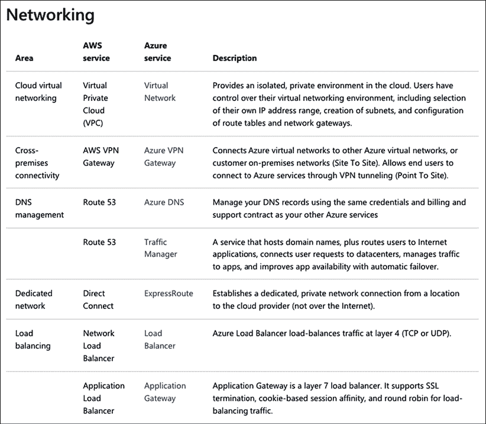

图 12.1：Azure 网络服务（来源：https://docs.microsoft.com/en-us/azure/architecture/aws-professional/services）

Azure 和 AWS 网络产品之间有一些功能差异。例如，在全局流量负载均衡使用 DNS 方面，AWS 使用相同的 Route 53 产品，而 Azure 则将其拆分为一个名为 Traffic Manager 的独立产品。当我们深入到产品中时，一些差异可能会根据使用情况而有所不同。例如，Azure 负载均衡器默认允许会话亲和性，也就是所谓的粘性会话，而 AWS 负载均衡器则需要显式配置。

但大部分情况下，Azure 的高级网络产品和服务的确与我们在 AWS 中学到的相似。这是好消息。坏消息是，尽管功能相同，但这并不意味着我们可以在两者之间实现 1:1 的映射。

构建工具不同，对于刚接触 Azure 平台的人来说，实现细节有时可能会让人感到困惑。在接下来的章节中讨论产品时，我们将指出一些差异。让我们先从 Azure 的设置过程开始谈。

# Azure 设置

设置 Azure 账户非常简单。就像 AWS 一样，Azure 提供了许多服务和激励措施来吸引在高度竞争的公共云市场中用户。请查看[`azure.microsoft.com/en-us/free/`](https://azure.microsoft.com/en-us/free/)页面了解最新的服务。在撰写本文时，Azure 提供许多流行的服务免费 12 个月，以及 40 多个其他服务始终免费：

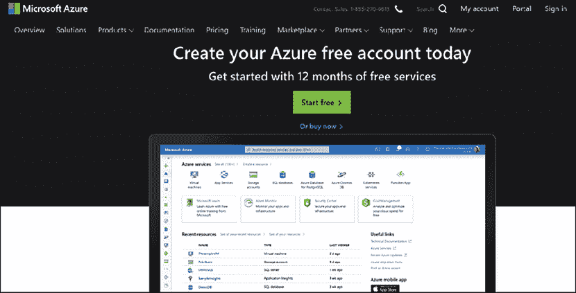

图 12.2：Azure 门户（来源：https://azure.microsoft.com/en-us/free/）

账户创建后，我们可以在 Azure 门户[`portal.azure.com`](https://portal.azure.com)上查看可用的服务：

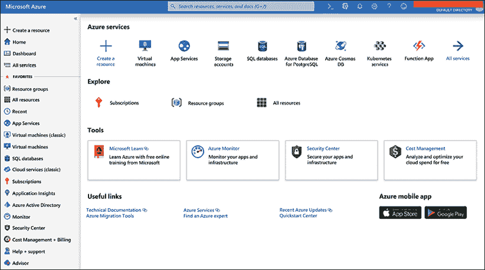

图 12.3：Azure 服务

当你阅读这一章时，网页可能会有所变化。这些变化通常是直观的导航更改，即使它们看起来有些不同，也很容易操作。

然而，在启动任何服务之前，我们都需要提供一个支付方式。这是通过添加订阅服务来完成的：

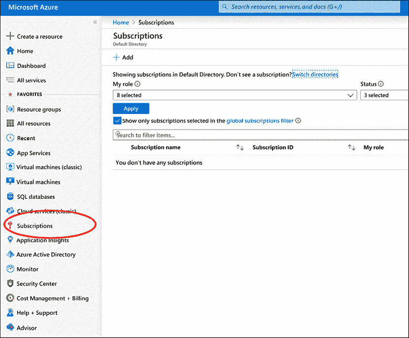

图 12.4：Azure 订阅

我建议添加按量付费计划，这种计划没有前期成本，也没有长期承诺，但我们也有选择通过订阅计划购买各种级别支持的权利。

一旦添加了订阅，我们就可以开始查看在 Azure 云中管理和构建的各种方法，具体细节将在下一节中详细说明。

# Azure 管理和 API

Azure 门户是顶级公共云提供商（包括 AWS 和 Google Cloud）中最简洁、最现代的门户。我们可以通过顶部管理栏上的设置图标更改门户设置，包括语言和区域：

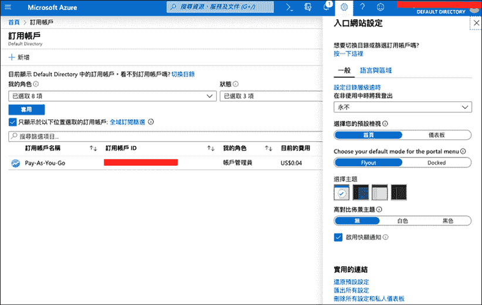

图 12.5：不同语言的 Azure 门户

管理 Azure 服务有许多方法：门户、Azure CLI、RESTful API 以及各种客户端库。除了点对点的管理界面外，Azure 门户还提供了一个方便的 shell，称为 Azure Cloud Shell。

它可以从门户的右上角启动：

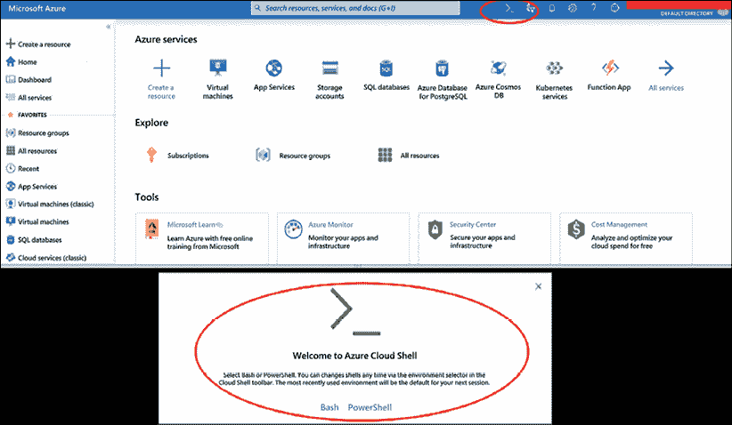

图 12.6：Azure Cloud Shell

当它首次启动时，您将被要求在 **Bash** 和 **PowerShell** 之间进行选择。shell 接口可以在以后切换，但它们不能同时运行：

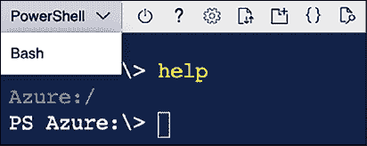

图 12.7：Azure 云 Shell 与 PowerShell

我个人的偏好是 **Bash** shell，它允许我使用预安装的 Azure CLI 和 Python SDK：

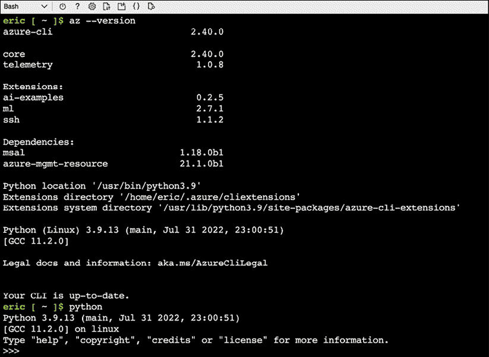

图 12.8：Azure AZ 工具和 Cloud Shell 中的 Python

Cloud Shell 非常方便，因为它基于浏览器，因此可以从几乎任何地方访问。它按唯一用户账户分配，并且每个会话都会自动进行身份验证，所以我们不需要担心为它生成单独的密钥。但是，由于我们将会经常使用 Azure CLI，让我们在管理主机上安装一个本地副本：

```py
(venv) $ curl -sL https://aka.ms/InstallAzureCLIDeb | sudo bash
(venv) $ az --version
azure-cli                         2.40.0
core                              2.40.0
telemetry                          1.0.8
Dependencies:
msal                            1.18.0b1
azure-mgmt-resource             21.1.0b1 
```

让我们还在我们的管理主机上安装 Azure Python SDK。从版本 5.0.0 开始，Azure Python SDK 要求我们安装列在 [`aka.ms/azsdk/python/all`](https://aka.ms/azsdk/python/all) 的服务特定包：

```py
(venv) $ pip install azure-identity 
(venv) $ pip install azure-mgmt-compute
(venv) $ pip install azure-mgmt-storage
(venv) $ pip install azure-mgmt-resource
(venv) $ pip install azure-mgmt-network 
```

Azure for Python 开发者页面，[`docs.microsoft.com/en-us/azure/python/`](https://docs.microsoft.com/en-us/azure/python/)，是使用 Python 开始 Azure 的全面资源。Azure SDK for Python 页面，[`learn.microsoft.com/en-us/azure/developer/python/sdk/azure-sdk-overview`](https://learn.microsoft.com/en-us/azure/developer/python/sdk/azure-sdk-overview)，提供了使用 Python 库进行 Azure 资源管理的详细文档。

我们现在可以查看一些 Azure 的服务原则，并启动我们的 Azure 服务。

## Azure 服务主体

Azure 使用服务主体对象的概念用于自动化工具。网络安全最佳实践中的最小权限原则授予任何人员或工具仅足够执行其工作而不更多的访问权限。Azure 服务主体根据角色限制资源和访问级别。要开始，我们将使用 Azure CLI 自动为我们创建的角色，并使用 Python SDK 进行身份验证测试。使用 `az` `login` 命令接收令牌：

```py
(venv) $ az login --use-device-code
To sign in, use a web browser to open the page https://microsoft.com/devicelogin and enter the code <your code> to authenticate. 
```

按照 URL 粘贴你在命令行中看到的代码，并使用我们之前创建的 Azure 账户进行身份验证：

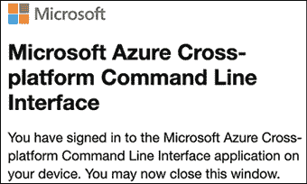

图 12.9：Azure 跨平台命令行界面

我们可以在 `json` 格式中创建凭证文件，并将其移动到 Azure 目录。Azure 目录是在我们安装 Azure CLI 工具时创建的：

```py
(venv) $ az ad sp create-for-rbac --sdk-auth > credentials.json
(venv) $ cat credentials.json
{
  "clientId": "<skip>",
  "clientSecret": "<skip>",
  "subscriptionId": "<skip>",
  "tenantId": "<skip>",
  "<skip>"
}
(venv) echou@network-dev-2:~$ mv credentials.json ~/.azure/ 
```

让我们保护凭证文件并将其导出为环境变量：

```py
(venv) $ chmod 0600 ~/.azure/credentials.json
(venv) $ export AZURE_AUTH_LOCATION=~/.azure/credentials.json 
```

我们还将各种凭证导出到我们的环境中：

```py
$ cat ~/.azure/credentials.json
$ export AZURE_TENANT_ID="xxx"
$ export AZURE_CLIENT_ID="xxx"
$ export AZURE_CLIENT_SECRET="xxx"
$ export SUBSCRIPTION_ID="xxx" 
```

我们将授予订阅的角色访问权限：

```py
(venv) $ az ad sp create-for-rbac --role 'Owner' --scopes '/subscriptions/<subscription id>'
{
  "appId": "<appId>",
  "displayName": "azure-cli-2022-09-22-17-24-24",
  "password": "<password>",
  "tenant": "<tenant>"
}
(venv) $ az login --service-principal --username "<appId>" --password "<password>" --tenant "<tenant>" 
```

有关 Azure RBAC 的更多信息，请访问[`learn.microsoft.com/en-us/cli/azure/create-an-azure-service-principal-azure-cli`](https://learn.microsoft.com/en-us/cli/azure/create-an-azure-service-principal-azure-cli)。

如果我们在门户中浏览到**访问控制**部分（**主页 -> 订阅 -> 按需付费 -> 访问控制**），我们将能够看到新创建的角色：

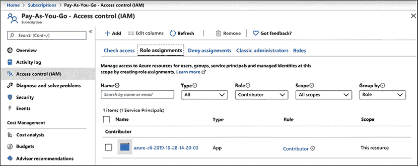

图 12.10：Azure 按需付费 IAM

在 GitHub 页面上有许多使用 Azure Python SDK 管理网络的示例代码，[`github.com/Azure-Samples/azure-samples-python-management/tree/main/samples/network`](https://github.com/Azure-Samples/azure-samples-python-management/tree/main/samples/network)。*入门指南*，[`learn.microsoft.com/en-us/samples/azure-samples/azure-samples-python-management/network/`](https://learn.microsoft.com/en-us/samples/azure-samples/azure-samples-python-management/network/)，也可能很有用。

我们将使用一个简单的 Python 脚本，`Chapter12_1_auth.py`，来导入客户端身份验证和网络管理的库：

```py
#!/usr/bin/env python3
import os 
import azure.mgmt.network
from azure.identity import ClientSecretCredential
credential = ClientSecretCredential(
    tenant_id=os.environ.get("AZURE_TENANT_ID"),
    client_id=os.environ.get("AZURE_CLIENT_ID"),
    client_secret=os.environ.get("AZURE_CLIENT_SECRET")
)
subscription_id = os.environ.get("SUBSCRIPTION_ID")
network_client = azure.mgmt.network.NetworkManagementClient(credential=credential, subscription_id=subscription_id)
print("Network Management Client API Version: " + network_client.DEFAULT_API_VERSION) 
```

如果文件在没有错误的情况下执行，则表示我们已成功使用 Python SDK 客户端进行身份验证：

```py
(venv) $ python Chapter12_1_auth.py 
Network Management Client API Version: 2022-01-01 
```

在阅读 Azure 文档时，你可能已经注意到了 PowerShell 和 Python 的结合。在下一节中，我们将简要考虑 Python 和 PowerShell 之间的关系。

## Python 与 PowerShell

微软已经从头开发或实现了包括 C#、.NET 和 PowerShell 在内的许多编程语言和框架，因此.NET（与 C#）和 PowerShell 在 Azure 中享有某种程度的一等公民地位并不令人惊讶。在 Azure 的大部分文档中，你都会找到直接引用 PowerShell 示例的内容。在网络上，关于哪个工具（Python 或 PowerShell）更适合管理 Azure 资源的讨论往往带有主观意见。

截至 2019 年 7 月，我们还可以在预览版中在 Linux 和 macOS 操作系统上运行 PowerShell Core，[`docs.microsoft.com/en-us/powershell/scripting/install/installing-powershell-core-on-linux?view=powershell-6`](https://learn.microsoft.com/en-us/powershell/scripting/install/installing-powershell-on-linux?view=powershell-7.3&viewFallbackFrom=powershell-6)。

我们不会就语言优越性进行辩论。当需要时，我不介意使用 PowerShell——我发现它既简单又直观——并且我同意有时 Python SDK 在实现最新的 Azure 功能方面落后于 PowerShell。但既然 Python 至少是您选择这本书的部分原因，我们将坚持使用 Python SDK 和 Azure CLI 作为我们的示例。

最初，Azure CLI 是以 Windows 的 PowerShell 模块和其他平台的基于 Node.js 的 CLI 的形式提供的。但随着该工具的普及，它现在是一个围绕 Azure Python SDK 的包装器，如*Python.org*上的这篇文章所述：[`www.python.org/success-stories/building-an-open-source-and-cross-platform-azure-cli-with-python/`](https://www.python.org/success-stories/building-an-open-source-and-cross-platform-azure-cli-with-python/)。

在本章剩余的部分，当我们介绍一个功能或概念时，我们通常会转向 Azure CLI 进行演示。请放心，如果某个功能可以作为 Azure CLI 命令使用，那么如果我们需要直接用 Python 编写代码，它也将在 Python SDK 中可用。

在介绍了 Azure 管理和相关的 API 之后，让我们继续讨论 Azure 全球基础设施。

# Azure 全球基础设施

与 AWS 类似，Azure 全球基础设施由地区、**可用区域（AZs**）和边缘位置组成。在撰写本文时，Azure 拥有 60 多个地区和 200 多个以上的物理数据中心，如产品页面所示（[`azure.microsoft.com/en-us/global-infrastructure/`](https://azure.microsoft.com/en-us/global-infrastructure/))）：

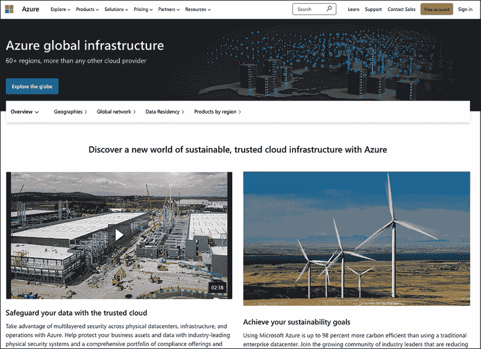

图 12.11：Azure 全球基础设施（来源：https://azure.microsoft.com/en-us/global-infrastructure/）

与 AWS 一样，Azure 产品通过地区提供，因此我们需要根据地区检查服务可用性和定价。我们还可以通过在多个 AZs 中构建服务来在服务中构建冗余。然而，与 AWS 不同，并非所有 Azure 地区都有 AZs，也并非所有 Azure 产品都支持它们。实际上，Azure 直到 2018 年才宣布 AZs 的通用可用性，并且它们只在选定地区提供。

在选择我们的地区时，这一点需要我们注意。我建议选择带有 AZs 的地区，例如西 US 2、中 US 和东 US 1。

如果我们在没有可用区域（AZs）的地区进行建设，我们就需要在不同的地区复制该服务，通常是在同一地理区域内。我们将在下一节讨论 Azure 地理区域。

在 Azure 全球基础设施页面上，带有可用区域的地区中间有一个星号标记。

与 AWS 不同，Azure 区域也组织成更高层次的地理分类。地理是一个独立的市场，通常包含一个或多个区域。除了低延迟和更好的网络连接外，跨同一地理区域内区域复制服务和数据对于政府合规性也是必要的。跨区域复制的例子是德国的区域。如果我们需要为德国市场推出服务，政府要求在边境内实施严格的数据主权，但德国没有区域有可用区。我们需要在同一地理区域内不同区域之间复制数据，即德国北部、德国东北部、德国西中部等等。

按照惯例，我通常更喜欢有可用区的区域，以保持不同云服务提供商之间的相似性。一旦我们确定了最适合我们用例的区域，我们就可以在 Azure 中构建我们的 VNet。

# Azure 虚拟网络

当我们在 Azure 云中戴上网络工程师的帽子时，**Azure 虚拟网络（VNets**）是我们花费大部分时间的地方。与传统网络类似，我们在数据中心构建的传统网络，它们是我们 Azure 中私有网络的基本构建块。我们将使用 VNet 来允许我们的虚拟机相互通信，与互联网，以及通过 VPN 或 ExpressRoute 与我们的本地网络通信。

让我们从使用门户构建我们的第一个 VNet 开始。我们将首先通过**创建资源 -> 网络 -> 虚拟网络**浏览**虚拟网络页面**：

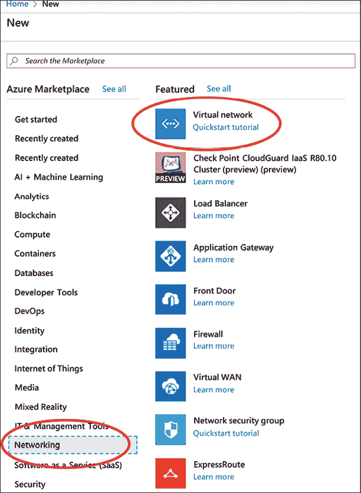

图 12.12：Azure VNet

每个 VNet 都限于单个区域，并且我们可以在每个 VNet 中创建多个子网。正如我们稍后将会看到的，不同区域的多个 VNet 可以通过 VNet 对等连接到彼此。

从 VNet 创建页面，我们将使用以下凭据创建我们的第一个网络：

```py
Name: WEST-US-2_VNet_1
Address space: 192.168.0.0/23
Subscription: <pick your subscription>
Resource group: <click on new> -> 'Mastering-Python-Networking'
Location: West US 2
Subnet name: WEST-US-2_VNet_1_Subnet_1
Address range: 192.168.1.0/24
DDoS protection: Basic
Service endpoints: Disabled
Firewall: Disabled 
```

这里是必要的字段的截图。如果有任何缺失的必填字段，它们将以红色突出显示。完成时点击**创建**：

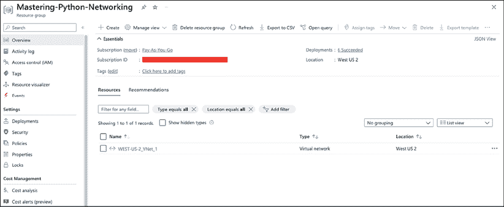

图 12.13：Azure VNet 创建

资源创建完成后，我们可以通过**主页 -> 资源组 -> Mastering-Python-Networking**导航到它：

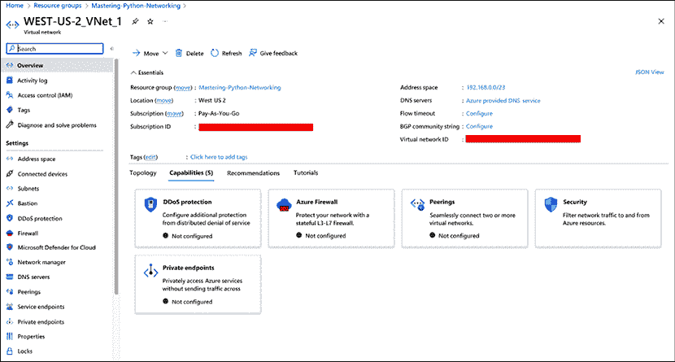

图 12.14：Azure VNet 概述

恭喜，我们刚刚在 Azure 云中创建了我们的第一个 VNet！我们的网络需要与外界通信才能发挥作用。我们将在下一节中探讨如何做到这一点。

## 互联网访问

默认情况下，VNet 内的所有资源都可以与互联网进行出站通信；我们不需要像在 AWS 中那样添加 NAT 网关。对于入站通信，我们需要直接将公网 IP 分配给虚拟机或使用带有公网 IP 的负载均衡器。为了看到这个功能的工作情况，我们将在我们的网络中创建虚拟机。

我们可以从**主页 -> 资源组 -> Mastering-Python-Networking -> 新建 -> 创建虚拟机**创建我们的第一个虚拟机：

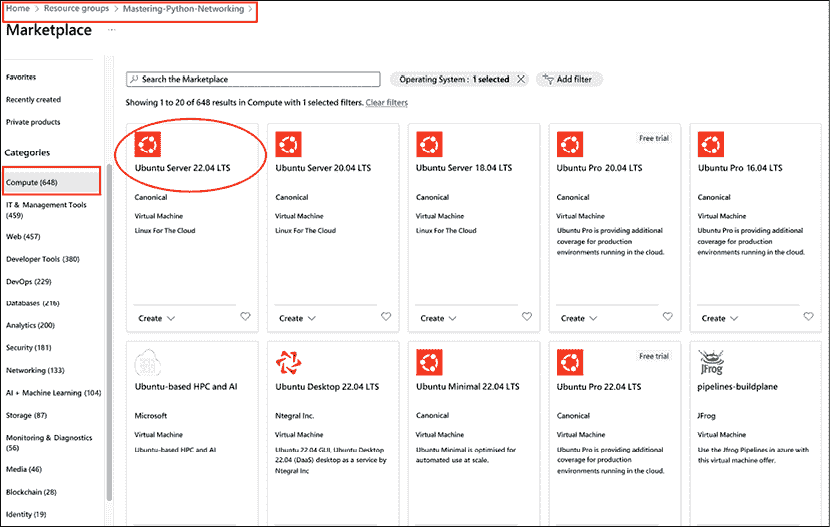

图 12.15：Azure 创建虚拟机

我将选择**Ubuntu Server 22.04 LTS**作为虚拟机，并在提示时使用名称`myMPN-VM1`。我将选择区域`West US 2`。我们可以选择密码认证或 SSH 公钥作为认证方法，并允许 SSH 入站连接。由于我们正在对其进行测试，我们可以选择 B 系列中最小的实例以最小化我们的成本：

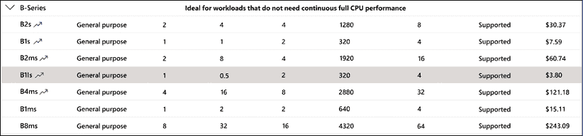

图 12.16：Azure 计算 B 系列

我们可以将其他选项保留为默认设置，选择较小的磁盘大小，并勾选**与虚拟机一起删除**。我们将虚拟机放入我们创建的子网中，并分配一个新的公网 IP：

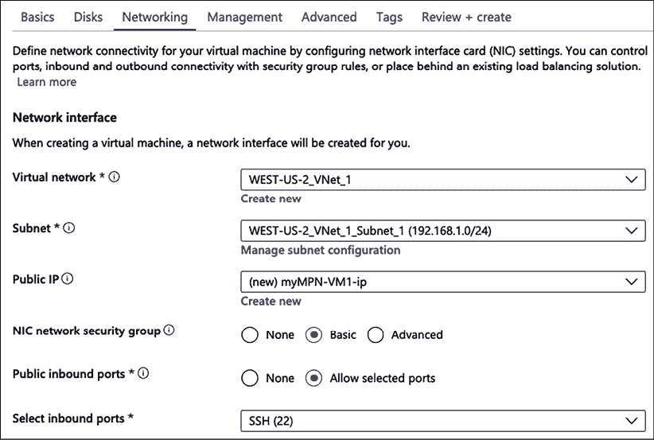

图 12.17：Azure 网络接口

虚拟机配置完成后，我们可以使用公网 IP 和创建的用户名`ssh`登录到该机器。虚拟机只有一个接口，位于我们的私有子网内；它也被映射到 Azure 自动分配的公网 IP。这种公网到私网 IP 的转换由 Azure 自动完成。

```py
echou@myMPN-VM1:~$ sudo apt install net-tools
echou@myMPN-VM1:~$ ifconfig eth0
eth0: flags=4163<UP,BROADCAST,RUNNING,MULTICAST>  mtu 1500
        inet 192.168.1.4  netmask 255.255.255.0  broadcast 192.168.1.255
        inet6 fe80::20d:3aff:fe06:68a0  prefixlen 64  scopeid 0x20<link>
        ether 00:0d:3a:06:68:a0  txqueuelen 1000  (Ethernet)
        RX packets 2344  bytes 2201526 (2.2 MB)
        RX errors 0  dropped 0  overruns 0  frame 0
        TX packets 1290  bytes 304355 (304.3 KB)
        TX errors 0  dropped 0 overruns 0  carrier 0  collisions 0
echou@myMPN-VM1:~$ ping -c 1 www.google.com
PING www.google.com (142.251.211.228) 56(84) bytes of data.
64 bytes from sea30s13-in-f4.1e100.net (142.251.211.228): icmp_seq=1 ttl=115 time=47.7 ms
--- www.google.com ping statistics ---
1 packets transmitted, 1 received, 0% packet loss, time 0ms
rtt min/avg/max/mdev = 47.668/47.668/47.668/0.000 ms 
```

我们可以重复相同的步骤创建第二个名为`myMPN-VM2`的虚拟机。虚拟机可以配置为具有`SSH`入站访问，但没有公网 IP：

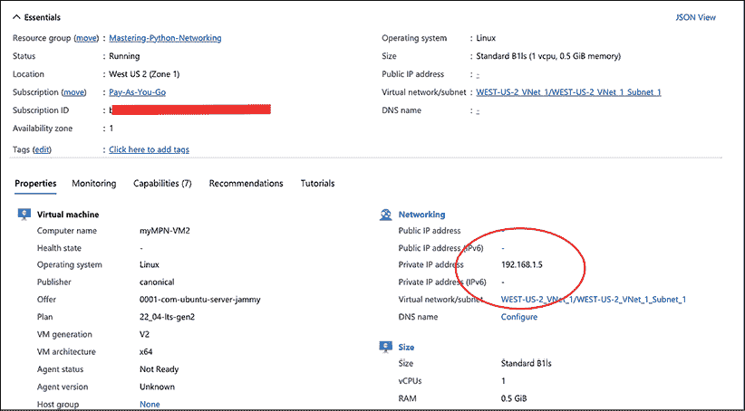

图 12.18：Azure 虚拟机 IP 地址

在创建虚拟机之后，我们可以从`myMPN-VM1`使用私网 IP`ssh`连接到`myMPN-VM2`。

```py
echou@myMPN-VM1:~$ ssh echou@192.168.1.5
echou@myMPN-VM2:~$ who
echou    pts/0        2022-09-22 16:43 (192.168.1.4) 
```

我们可以通过尝试访问`apt`软件包更新仓库来测试互联网连接：

```py
echou@myMPN-VM2:~$ sudo apt update
Hit:1 http://azure.archive.ubuntu.com/ubuntu jammy InRelease
Get:2 http://azure.archive.ubuntu.com/ubuntu jammy-updates InRelease [114 kB]
Get:3 http://azure.archive.ubuntu.com/ubuntu jammy-backports InRelease [99.8 kB]
Get:4 http://azure.archive.ubuntu.com/ubuntu jammy-security InRelease [110 kB]
Get:5 http://azure.archive.ubuntu.com/ubuntu jammy/universe amd64 Packages [14.1 MB]
Fetched 23.5 MB in 6s (4159 kB/s) 
```

在 VNet 内部，我们的虚拟机可以访问互联网，我们可以为我们的网络创建额外的网络资源。

## 网络资源创建

让我们看看使用 Python SDK 创建网络资源的示例。在下面的示例中，`Chapter12_2_network_resources.py`，我们将使用`subnet.create_or_update` API 在 VNet 中创建一个新的`192.168.0.128/25`子网：

```py
#!/usr/bin/env python3
# Reference example: https://github.com/Azure-Samples/azure-samples-python-management/blob/main/samples/network/virtual_network/manage_subnet.py
# 
import os
from azure.identity import ClientSecretCredential
import azure.mgmt.network
from azure.identity import DefaultAzureCredential
from azure.mgmt.network import NetworkManagementClient
from azure.mgmt.resource import ResourceManagementClient
credential = ClientSecretCredential(
    tenant_id=os.environ.get("AZURE_TENANT_ID"),
    client_id=os.environ.get("AZURE_CLIENT_ID"),
    client_secret=os.environ.get("AZURE_CLIENT_SECRET")
)
subscription_id = os.environ.get("SUBSCRIPTION_ID")
GROUP_NAME = "Mastering-Python-Networking"
VIRTUAL_NETWORK_NAME = "WEST-US-2_VNet_1"
SUBNET = "WEST-US-2_VNet_1_Subnet_2"
network_client = azure.mgmt.network.NetworkManagementClient(
    credential=credential, subscription_id=subscription_id)
# Get subnet
subnet = network_client.subnets.get(
    GROUP_NAME,
    VIRTUAL_NETWORK_NAME,
    SUBNET
)
print("Get subnet:\n{}".format(subnet))
subnet = network_client.subnets.begin_create_or_update(
    GROUP_NAME,
    VIRTUAL_NETWORK_NAME,
    SUBNET,
    {
        "address_prefix": "192.168.0.128/25"
    }
).result()
print("Create subnet:\n{}".format(subnet)) 
```

执行脚本时，我们将收到以下创建结果消息：

```py
(venv) $ python3 Chapter12_2_subnet.py
{'additional_properties': {'type': 'Microsoft.Network/virtualNetworks/subnets'}, 'id': '/subscriptions/<skip>/resourceGroups/Mastering-Python-Networking/providers/Microsoft.Network/virtualNetworks/WEST-US-2_VNet_1/subnets/WEST-US-2_VNet_1_Subnet_2', 'address_prefix': '192.168.0.128/25', 'address_prefixes': None, 'network_security_group': None, 'route_table': None, 'service_endpoints': None, 'service_endpoint_policies': None, 'interface_endpoints': None, 'ip_configurations': None, 'ip_configuration_profiles': None, 'resource_navigation_links': None, 'service_association_links': None, 'delegations': [], 'purpose': None, 'provisioning_state': 'Succeeded', 'name': 'WEST-US-2_VNet_1_Subnet_2', 'etag': 'W/"<skip>"'} 
```

新子网也可以在门户中看到：

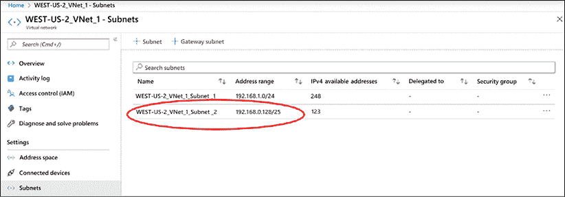

图 12.19：Azure VNet 子网

更多使用 Python SDK 的示例，请参阅 [`github.com/Azure-Samples/azure-samples-python-management`](https://github.com/Azure-Samples/azure-samples-python-management)。

如果我们在新的子网中创建一个虚拟机，即使跨越子网边界，同一 VNet 中的主机也可以通过我们之前在 AWS 中看到的相同隐式路由相互通信。

当我们需要与其他 Azure 服务交互时，我们有额外的 VNet 服务可用。让我们看看。

## VNet 服务端点

VNet 服务端点可以将 VNet 扩展到其他 Azure 服务，通过直接连接。这允许来自 VNet 到 Azure 服务的流量保持在 Azure 网络中。服务端点需要在 VNet 所在区域的标识服务中进行配置。

它们可以通过门户进行配置，对服务和子网进行限制：

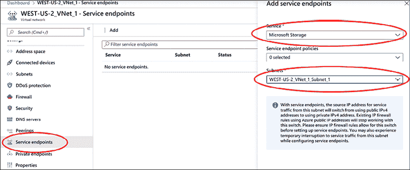

图 12.20：Azure 服务端点

严格来说，当我们需要 VNet 中的虚拟机与服务通信时，我们不需要创建 VNet 服务端点。每个虚拟机都可以通过映射的公共 IP 访问服务，我们可以使用网络规则仅允许必要的 IP。然而，使用 VNet 服务端点允许我们使用 Azure 内部的私有 IP 访问资源，而无需流量穿越公共互联网。

## VNet 对等连接

如本节开头所述，每个 VNet 限制在一个区域。对于区域到区域 VNet 连接，我们可以利用 VNet 对等连接。让我们在 `Chapter11_3_vnet.py` 中使用以下两个函数来在 `US-East` 区域创建一个 VNet：

```py
<skip>
def create_vnet(network_client):
    vnet_params = {
        'location': LOCATION,
        'address_space': {
            'address_prefixes': ['10.0.0.0/16']
        }
    }
    creation_result = network_client.virtual_networks.create_or_update(
        GROUP_NAME,
        'EAST-US_VNet_1',
        vnet_params
    )
    return creation_result.result()
<skip>
def create_subnet(network_client):
    subnet_params = {
        'address_prefix': '10.0.1.0/24'
    }
    creation_result = network_client.subnets.create_or_update(
        GROUP_NAME,
        'EAST-US_VNet_1',
        'EAST-US_VNet_1_Subnet_1',
        subnet_params
    )
    return creation_result.result() 
```

要允许 VNet 对等连接，我们需要从两个 VNet 之间双向对等。由于我们到目前为止一直在使用 Python SDK，为了学习目的，让我们看看使用 Azure CLI 的一个示例。

我们将从 `az network vnet list` 命令中获取 VNet 名称和 ID：

```py
(venv) $ az network vnet list
<skip>
"id": "/subscriptions/<skip>/resourceGroups/Mastering-Python-Networking/providers/Microsoft.Network/virtualNetworks/EAST-US_VNet_1",
    "location": "eastus",
    "name": "EAST-US_VNet_1"
<skip>
"id": "/subscriptions/<skip>/resourceGroups/Mastering-Python-Networking/providers/Microsoft.Network/virtualNetworks/WEST-US-2_VNet_1",
    "location": "westus2",
    "name": "WEST-US-2_VNet_1"
<skip> 
```

让我们检查我们 `West US 2` VNet 的现有 VNet 对等连接：

```py
(venv) $ az network vnet peering list -g "Mastering-Python-Networking" --vnet-name WEST-US-2_VNet_1
[] 
```

我们将从 `West US` 到 `East US` 的 VNet 执行对等连接，然后以相反方向重复：

```py
(venv) $ az network vnet peering create -g "Mastering-Python-Networking" -n WestUSToEastUS --vnet-name WEST-US-2_VNet_1 --remote-vnet "/subscriptions/<skip>/resourceGroups/Mastering-Python-Networking/providers/Microsoft.Network/virtualNetworks/EAST-US_VNet_1"
(venv) $ az network vnet peering create -g "Mastering-Python-Networking" -n EastUSToWestUS --vnet-name EAST-US_VNet_1 --remote-vnet "/subscriptions/b7257c5b-97c1-45ea-86a7-872ce8495a2a/resourceGroups/Mastering-Python-Networking/providers/Microsoft.Network/virtualNetworks/WEST-US-2_VNet_1" 
```

现在如果我们再次运行检查，我们将能够看到 VNet 成功对等：

```py
(venv) $ az network vnet peering list -g "Mastering-Python-Networking" --vnet-name "WEST-US-2_VNet_1"
[
  {
    "allowForwardedTraffic": false,
    "allowGatewayTransit": false,
    "allowVirtualNetworkAccess": false,
    "etag": "W/\"<skip>\"",
    "id": "/subscriptions/<skip>/resourceGroups/Mastering-Python-Networking/providers/Microsoft.Network/virtualNetworks/WEST-US-2_VNet_1/virtualNetworkPeerings/WestUSToEastUS",
    "name": "WestUSToEastUS",
    "peeringState": "Connected",
    "provisioningState": "Succeeded",
    "remoteAddressSpace": {
      "addressPrefixes": [
        "10.0.0.0/16"
      ]
    },
<skip> 
```

我们也可以在 Azure 门户中验证对等连接：

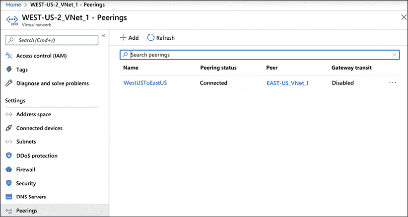

图 12.21：Azure VNet 对等连接

现在我们已经在我们的设置中有几个主机、子网、VNet 和 VNet 对等连接，我们应该看看在 Azure 中是如何进行路由的。这就是我们在下一节将要做的。

# VNet 路由

作为一名网络工程师，云提供商添加的隐式路由一直让我感到有些不舒服。在传统网络中，我们需要布线网络，分配 IP 地址，配置路由，实施安全措施，并确保一切正常工作。有时可能会很复杂，但每个数据包和路由都有记录。对于云中的虚拟网络，底层网络已经由 Azure 完成，并且覆盖网络上的某些网络配置需要在启动时自动完成，就像我们之前看到的。

Azure VNet 路由与 AWS 略有不同。在 AWS 章节中，我们看到路由表是在 VPC 网络层实现的。但如果我们浏览到门户上的 Azure VNet 设置，我们将找不到分配给 VNet 的路由表。

如果我们进一步查看**子网设置**，我们将看到一个路由表下拉菜单，但它显示的值是**无**：

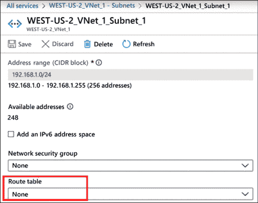

图 12.22：Azure 子网路由表

我们如何有一个空的路由表，而该子网中的主机能够访问互联网？我们可以在哪里看到 Azure VNet 配置的路由？路由已经在主机和 NIC 级别实现。我们可以通过**所有服务 -> 虚拟机 -> myNPM-VM1 -> 网络（左侧面板）-> 拓扑（顶部面板）**来查看：

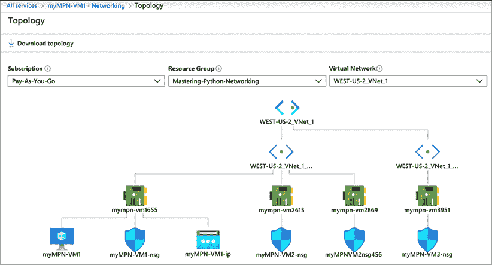

图 12.23：Azure 网络拓扑

网络在 NIC 级别上显示，每个 NIC 连接到北边的 VNet 子网，以及南边的其他资源，如 VM、**网络安全组**（**NSG**）和 IP。资源是动态的；在屏幕截图时，我只运行了`myMPN-VM1`，因此它是唯一一个连接了 VM 和 IP 地址的，而其他 VM 只连接了 NSG。

我们将在下一节中介绍 NSG。

如果我们点击拓扑中的网络接口卡（NIC），**mympn-vm1655**，我们可以看到与 NIC 相关的设置。在**支持 + 故障排除**部分，我们将找到**有效路由**链接，在那里我们可以看到与 NIC 关联的当前路由：

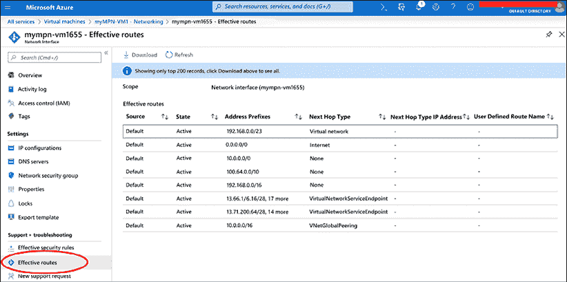

图 12.24：Azure VNet 有效路由

如果我们想自动化这个过程，我们可以使用 Azure CLI 来查找 NIC 名称，然后显示路由表：

```py
(venv) $ az vm show --name myMPN-VM1 --resource-group 'Mastering-Python-Networking'
<skip>
"networkProfile": {
    "networkInterfaces": [
      {
        "id": "/subscriptions/<skip>/resourceGroups/Mastering-Python-Networking/providers/Microsoft.Network/networkInterfaces/mympn-vm1655",
        "primary": null,
        "resourceGroup": "Mastering-Python-Networking"
      }
    ]
  }
<skip>
(venv) $ az network nic show-effective-route-table --name mympn-vm1655 --resource-group "Mastering-Python-Networking"
{
  "nextLink": null,
  "value": [
    {
      "addressPrefix": [
        "192.168.0.0/23"
      ],
<skip> 
```

好吧！这是一个谜团解决了，但路由表中的那些下一跳是什么？我们可以参考 VNet 流量路由文档：[`docs.microsoft.com/en-us/azure/virtual-network/virtual-networks-udr-overview`](https://docs.microsoft.com/en-us/azure/virtual-network/virtual-networks-udr-overview)。几点重要的注意事项：

+   如果源指示路由为**默认**，这些是系统路由，无法删除，但可以用自定义路由覆盖。

+   VNet 下一跳是在自定义 VNet 内部的路线。在我们的例子中，这是`192.168.0.0/23`网络，而不仅仅是子网。

+   路由到**None**下一跳类型的流量将被丢弃，类似于**Null**接口路由。

+   **VNetGlobalPeering**下一跳类型是在我们与其他 VNet 建立 VNet 对等连接时创建的。

+   **VirtualNetworkServiceEndpoint**下一跳类型是在我们为 VNet 启用服务端点时创建的。公共 IP 由 Azure 管理，并会不时更改。

如何覆盖默认路由？我们可以创建一个路由表并将其与子网关联。Azure 选择以下优先级的路由：

+   用户定义的路由

+   BGP 路由（来自站点到站点 VPN 或 ExpressRoute）

+   系统路由

我们可以在**网络**部分创建路由表：

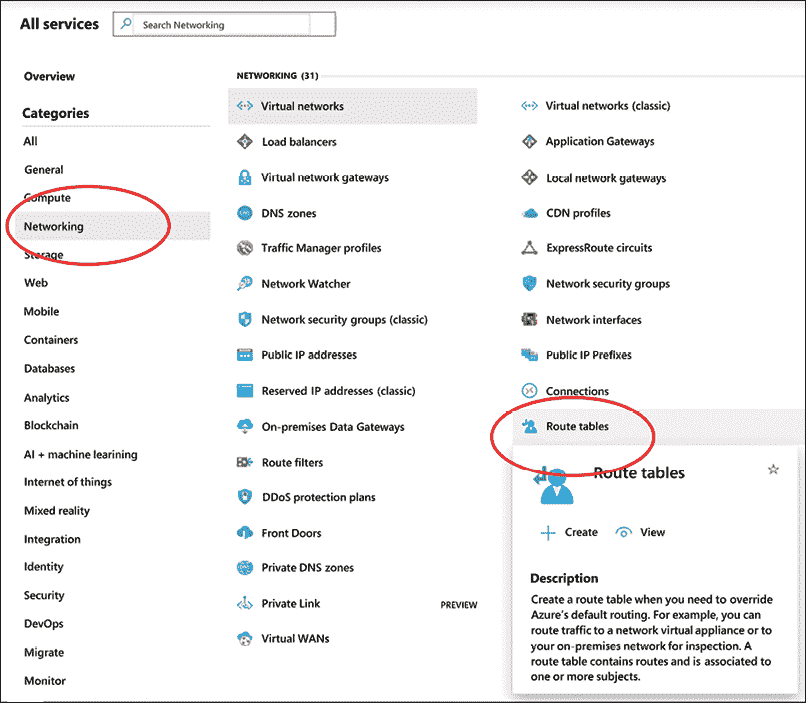

图 12.25：Azure VNet 路由表

我们也可以通过 Azure CLI 创建路由表，在表中创建路由，并将路由表与子网关联：

```py
(venv) $ az network route-table create --name TempRouteTable --resource "Mastering-Python-Networking"
(venv) $ az network route-table route create -g "Mastering-Python-Networking" --route-table-name TempRouteTable -n TempRoute  --next-hop-type VirtualAppliance --address-prefix 172.31.0.0/16 --next-hop-ip-address 10.0.100.4
(venv) $ az network vnet subnet update -g "Mastering-Python-Networking" -n WEST-US-2_Vnet_1_Subnet_1 --vnet-name WEST-US-2_VNet_1 --route-table TempRouteTable 
```

让我们看看 VNet 中的主要安全措施：网络安全组（NSGs）。

## 网络安全组

VNet 安全主要通过 NSGs 实现。就像传统的访问列表或防火墙规则一样，我们需要一次考虑一个方向的网络安全规则。例如，如果我们想让主机`A`在`子网 1`上通过端口`80`与`子网 2`中的主机`B`自由通信，我们需要为两个主机的入站和出站方向实施必要的规则。

如前例所示，NSG 可以与 NIC 或子网关联，因此我们还需要从安全层考虑。一般来说，我们应该在主机级别实施更严格的规则，而在子网级别应用更宽松的规则。这类似于传统的网络。

当我们创建我们的虚拟机时，我们为 SSH TCP 端口`22`设置了入站允许规则。让我们看看为我们的第一个虚拟机创建的安全组**myMPN-VM1-nsg**：


图 12.26：Azure VNet NSG

有几点值得指出：

+   系统实施规则的优先级较高，为 65,000 及以上。

+   默认情况下，虚拟网络可以在两个方向上自由通信。

+   默认情况下，内部主机允许访问互联网。

让我们在门户中为现有的 NSG 组实施入站规则：

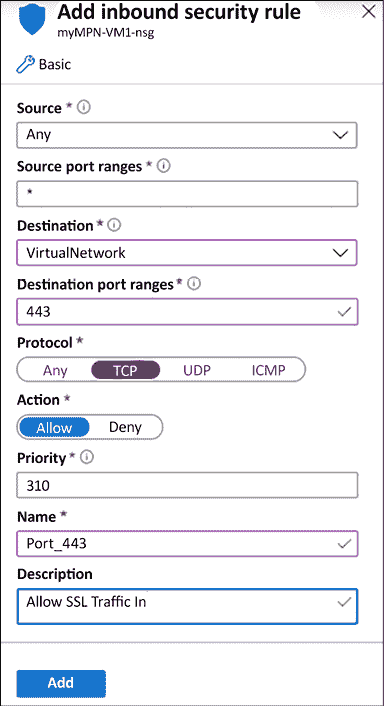

图 12.27：Azure 安全规则

我们也可以通过 Azure CLI 创建新的安全组和规则：

```py
(venv) $ az network nsg create -g "Mastering-Python-Networking" -n TestNSG
(venv) $ az network nsg rule create -g "Mastering-Python-Networking" --nsg-name TestNSG -n Allow_SSH --priority 150 --direction Inbound --source-address-prefixes Internet --destination-port-ranges 22 --access Allow --protocol Tcp --description "Permit SSH Inbound"
(venv) $ az network nsg rule create -g "Mastering-Python-Networking" --nsg-name TestNSG -n Allow_SSL --priority 160 --direction Inbound --source-address-prefixes Internet --destination-port-ranges 443 --access Allow --protocol Tcp --description "Permit SSL Inbound" 
```

我们可以看到创建的新规则以及默认规则：

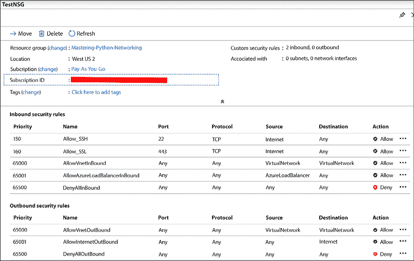

图 12.28：Azure 安全规则

最后一步是将此 NSG 绑定到子网：

```py
(venv) $ az network vnet subnet update -g "Mastering-Python-Networking" -n WEST-US-2_VNet_1_Subnet_1 --vnet-name WEST-US-2_VNet_1 --network-security-group TestNSG 
```

在接下来的两节中，我们将探讨将 Azure 虚拟网络扩展到本地数据中心的主要两种方式：Azure VPN 和 Azure ExpressRoute。

# Azure VPN

随着网络的持续增长，可能会出现我们需要将 Azure VNet 连接到本地位置的情况。VPN 网关是一种 VNet 网关，可以加密 VNet 和我们的本地网络以及远程客户端之间的流量。每个 VNet 只能有一个 VPN 网关，但可以在同一个 VPN 网关上建立多个连接。

更多有关 Azure VPN 网关的信息可以在以下链接中找到：[`docs.microsoft.com/en-us/azure/vpn-gateway/`](https://docs.microsoft.com/en-us/azure/vpn-gateway/).

VPN 网关实际上是配置了加密和路由服务的虚拟机，但用户不能直接配置。Azure 提供基于隧道类型、并发连接数和总吞吐量的 SKU 列表（[`docs.microsoft.com/en-us/azure/vpn-gateway/vpn-gateway-about-vpn-gateway-settings#gwsku`](https://docs.microsoft.com/en-us/azure/vpn-gateway/vpn-gateway-about-vpn-gateway-settings#gwsku)）：

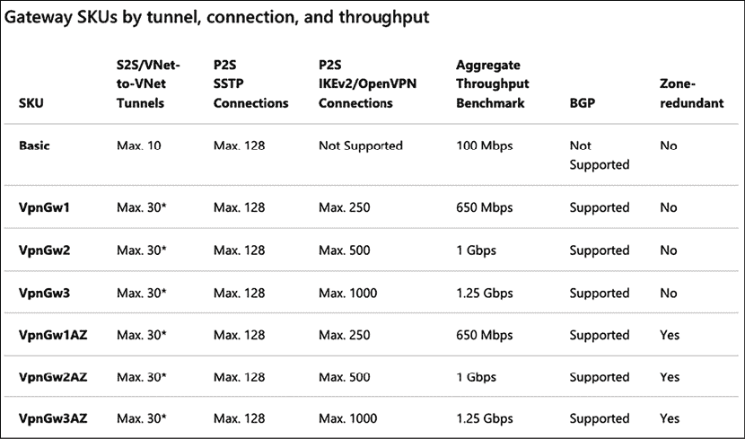

图 12.29：Azure VPN 网关 SKU（来源：https://docs.microsoft.com/en-us/azure/vpn-gateway/point-to-site-about）

如前表所示，Azure VPN 分为两个不同的类别：**点对点（P2S）VPN** 和 **站点到站点（S2S）VPN**。P2S VPN 允许从单个客户端计算机建立安全连接，主要用于远程工作者。加密方法可以是 SSTP、IKEv2 或 OpenVPN 连接。在选择 P2S VPN 网关 SKU 时，我们将关注 SKU 图表上的第二和第三列，以确定连接数。

对于基于客户端的 VPN，我们可以使用 SSTP 或 IKEv2 作为隧道协议：

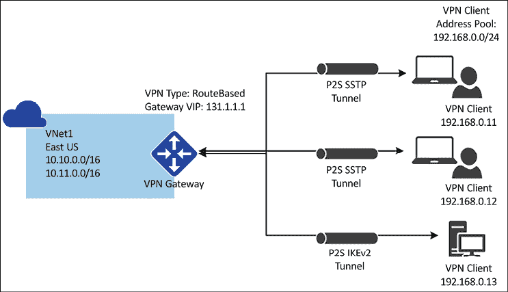

图 12.30：Azure 站点到站点 VPN 网关（来源：https://docs.microsoft.com/en-us/azure/vpn-gateway/vpn-gateway-about-vpngateways）

除了基于客户端的 VPN，还有一种类型的 VPN 连接是站点到站点或多站点 VPN 连接。加密方法将是 IKE 之上的 IPSec，Azure 和本地网络都需要一个公共 IP，如下面的图所示：

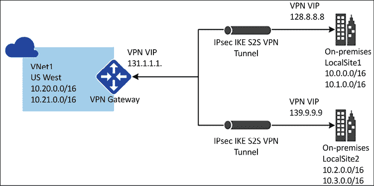

图 12.31：Azure 客户端 VPN 网关（来源：https://docs.microsoft.com/en-us/azure/vpn-gateway/vpn-gateway-about-vpngateways）

创建 S2S 或 P2S VPN 的完整示例超出了本节所能涵盖的范围。Azure 提供了 S2S VPN ([`docs.microsoft.com/en-us/azure/vpn-gateway/vpn-gateway-howto-site-to-site-resource-manager-portal`](https://docs.microsoft.com/en-us/azure/vpn-gateway/vpn-gateway-howto-site-to-site-resource-manager-portal)) 和 P2S VPN ([`docs.microsoft.com/en-us/azure/vpn-gateway/vpn-gateway-howto-site-to-site-resource-manager-portal`](https://docs.microsoft.com/en-us/azure/vpn-gateway/vpn-gateway-howto-site-to-site-resource-manager-portal)) 的教程。

对于之前配置过 VPN 服务的工程师来说，步骤相当简单。可能有点令人困惑，但文档中没有明确指出的是，VPN 网关设备应位于 VNet 内的专用网关子网中，并分配了 `/27` IP 区块：

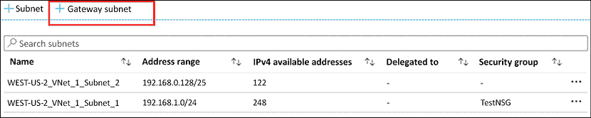

图 12.32：Azure VPN 网关子网

可以在 [`docs.microsoft.com/en-us/azure/vpn-gateway/vpn-gateway-about-vpn-devices`](https://docs.microsoft.com/en-us/azure/vpn-gateway/vpn-gateway-about-vpn-devices) 找到不断增长的经过验证的 Azure VPN 设备列表，其中包含它们各自配置指南的链接。

# Azure ExpressRoute

当组织需要将 Azure VNet 扩展到本地站点时，从 VPN 连接开始是有意义的。然而，随着连接承担更多任务关键型流量，组织可能需要一个更稳定和可靠的连接。类似于 AWS Direct Connect，Azure 通过连接提供商提供 ExpressRoute 作为私有连接。从图中我们可以看到，我们的网络在过渡到 Azure 边缘网络之前连接到 Azure 的合作伙伴边缘网络：

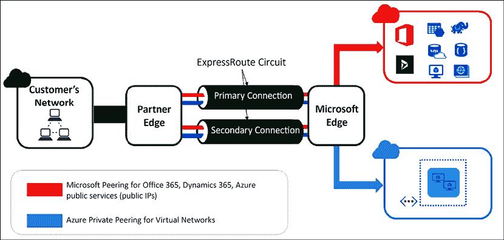

图 12.33：Azure ExpressRoute 电路（来源：https://docs.microsoft.com/en-us/azure/expressroute/expressroute-introduction）

ExpressRoute 的优点包括：

+   更可靠，因为它不穿越公共互联网。

+   由于私有连接可能在地面上到 Azure 之间有更少的跳数，因此连接速度更快，延迟更低。

+   由于是私有连接，因此安全性更好，特别是如果公司依赖微软的服务，如 Office 365。

ExpressRoute 的缺点可能包括：

+   在业务和技术要求方面都更难设置。

+   由于端口费用和连接费用通常是固定的，因此前期成本较高。如果它取代了 VPN 连接，一些成本可以通过降低互联网费用来抵消。然而，通常 ExpressRoute 的总拥有成本更高。

更多关于 ExpressRoute 的详细信息可以在[`docs.microsoft.com/en-us/azure/expressroute/expressroute-introduction`](https://docs.microsoft.com/en-us/azure/expressroute/expressroute-introduction)找到。与 AWS Direct Connect 最大的不同之处在于，ExpressRoute 可以在地理上提供跨区域的连接。还有一个高级附加功能，允许全球连接到 Microsoft 服务，以及 Skype for Business 的 QoS 支持。

与 Direct Connect 类似，ExpressRoute 要求用户通过合作伙伴连接到 Azure，或者在 ExpressRoute Direct（是的，这个术语很令人困惑）的某个指定地点与 Azure 会合。这对于企业来说通常是最大的障碍，因为他们需要在 Azure 的某个位置建立数据中心，与运营商（MPLS VPN）连接，或者与经纪人作为连接的中介。这些选项通常需要商业合同、更长期的承诺以及承诺的月度费用。

首先，我的建议将与第十一章“AWS 云网络”中的建议相似，即使用现有的运营商经纪人连接到运营商酒店。从运营商酒店，可以直接连接到 Azure 或使用 Equinix FABRIC（[`www.equinix.com/interconnection-services/equinix-fabric`](https://www.equinix.com/interconnection-services/equinix-fabric)）等中介。

在下一节中，我们将探讨当我们的服务增长到仅一个服务器之外时，如何有效地分配传入流量。

# Azure 网络负载均衡器

Azure 提供基本和标准 SKU 的负载均衡器。当我们在本节中讨论负载均衡器时，我们指的是第 4 层 TCP 和 UDP 负载分发服务，而不是应用程序网关负载均衡器（[`azure.microsoft.com/en-us/services/application-gateway/`](https://azure.microsoft.com/en-us/services/application-gateway/)），它是一个第 7 层负载均衡解决方案。

典型的部署模型通常是单层或双层负载分发，用于从互联网传入的连接：

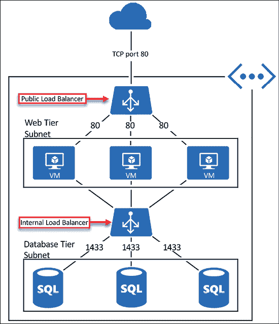

图 12.34：Azure 负载均衡器（来源：https://docs.microsoft.com/en-us/azure/load-balancer/load-balancer-overview）

负载均衡器根据 5 元组散列（源和目标 IP、源和目标端口以及协议）对传入的连接进行散列，并将流量分发到一个或多个目标。标准负载均衡器 SKU 是基本 SKU 的超集，因此新的设计应采用标准负载均衡器。

与 AWS 一样，Azure 也在不断通过新的网络服务进行创新。我们已经在本章中介绍了基础服务；让我们来看看一些其他值得注意的服务。

# 其他 Azure 网络服务

我们应该注意的其他 Azure 网络服务包括：

+   **DNS 服务**: Azure 提供了一套 DNS 服务（[`docs.microsoft.com/en-us/azure/dns/dns-overview`](https://docs.microsoft.com/en-us/azure/dns/dns-overview)），包括公共和私有服务。这些服务可用于网络服务的地理负载均衡。

+   **容器网络**: 近年来，Azure 一直在推动容器的发展。有关 Azure 网络容器能力的更多信息，请参阅[`docs.microsoft.com/en-us/azure/virtual-network/container-networking-overview`](https://docs.microsoft.com/en-us/azure/virtual-network/container-networking-overview)。

+   **VNet TAP**: Azure VNet TAP 允许您持续地将您的虚拟机网络流量流式传输到网络数据包收集器或分析工具（[`docs.microsoft.com/en-us/azure/virtual-network/virtual-network-tap-overview`](https://docs.microsoft.com/en-us/azure/virtual-network/virtual-network-tap-overview)）。

+   **分布式拒绝服务保护**: Azure DDoS 保护提供针对 DDoS 攻击的防御（[`docs.microsoft.com/en-us/azure/virtual-network/ddos-protection-overview`](https://docs.microsoft.com/en-us/azure/virtual-network/ddos-protection-overview)）。

Azure 网络服务是 Azure 云家族的重要组成部分，并且正在以较快的速度增长。在本章中，我们只覆盖了部分服务，但希望这已经为您提供了一个良好的基础，以便开始探索其他服务。

# 摘要

在本章中，我们探讨了各种 Azure 云网络服务。我们讨论了 Azure 全球网络和虚拟网络的各个方面。我们使用 Azure CLI 和 Python SDK 来创建、更新和管理这些网络服务。当我们需要将 Azure 服务扩展到本地数据中心时，我们可以使用 VPN 或 ExpressRoute 进行连接。我们还简要介绍了各种 Azure 网络产品和服务。

在下一章中，我们将使用一站式堆栈：Elastic Stack，重新审视数据分析管道。

# 加入我们的书籍社区

要加入本书的社区——在这里您可以分享反馈、向作者提问，并了解新版本——请扫描下面的二维码：

[`packt.link/networkautomationcommunity`](https://packt.link/networkautomationcommunity)


